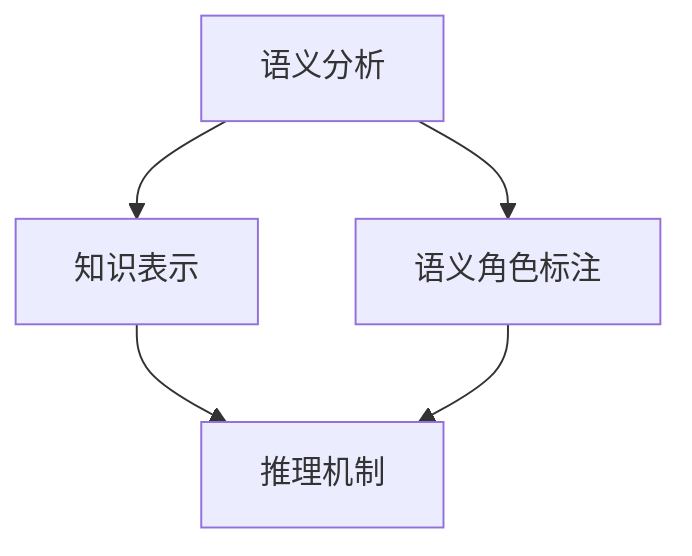
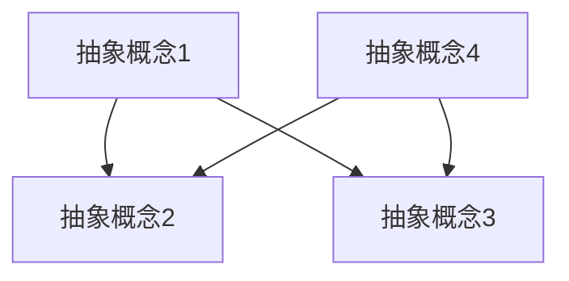

                 


# 抽象概念处理：评价LLM理解高级思维的深度

> 关键词：抽象概念处理，LLM，高级思维，深度理解

> 摘要：本文首先探讨了抽象概念处理的问题背景、核心概念及其重要性，然后介绍了抽象概念处理的原理和方法，包括基于规则、统计和知识的方法。接着，通过ER实体关系图和Mermaid流程图，详细阐述了抽象概念处理的原理和架构。随后，本文分析了LLM在抽象概念处理中的应用，探讨了LLM理解高级思维的深度，并通过数学模型和Python代码进行了解释。最后，本文提出了抽象概念处理的系统分析与架构设计方案，并进行了项目实战和最佳实践分享。

## 第一部分：抽象概念处理概述

### 第1章：问题背景与核心概念

#### 1.1 抽象概念处理的问题背景

随着人工智能技术的迅猛发展，自然语言处理（NLP）领域取得了显著的进展。然而，大多数NLP系统在处理抽象概念时仍面临巨大挑战。抽象概念是人类思维的重要组成部分，但在计算机系统中，这些概念往往难以被准确理解和处理。

#### 1.1.1 问题的提出

随着人工智能技术的迅猛发展，自然语言处理（NLP）领域取得了显著的进展。然而，大多数NLP系统在处理抽象概念时仍面临巨大挑战。抽象概念是指那些从具体事物中提炼出来，具有普遍性和概括性的概念。例如，“爱”、“正义”、“自由”等都是抽象概念。这些概念在人类思维中起着至关重要的作用，但如何让计算机系统理解和处理这些概念，仍是一个亟待解决的难题。

在现实应用中，抽象概念处理的问题主要体现在以下几个方面：

1. **语义理解困难**：抽象概念往往具有复杂的语义，涉及多个层面的含义。这使得计算机在处理这些概念时难以准确理解其真正含义。
2. **知识表示挑战**：抽象概念背后的知识往往需要丰富的背景知识和领域知识。而现有的知识表示方法在处理这些知识时存在一定的局限性。
3. **推理能力不足**：抽象概念处理需要计算机具备一定的推理能力，以实现对抽象概念的理解和应用。然而，现有的人工智能系统在推理能力上仍存在较大差距。

#### 1.1.2 抽象概念的界定

抽象概念是指从具体事物中提炼出来，具有普遍性和概括性的概念。它们在人类思维中起着至关重要的作用，但如何让计算机系统理解和处理这些概念，仍是一个亟待解决的难题。

抽象概念具有以下特点：

1. **普遍性**：抽象概念能够从特定的事物中提炼出来，适用于更广泛的情境。
2. **概括性**：抽象概念能够将具体事物中的一些共同特征进行概括，从而形成更一般的概念。
3. **复杂性**：抽象概念往往具有复杂的语义结构，涉及多个层面的含义。

一些常见的抽象概念包括：

- **情感**：如“快乐”、“悲伤”、“愤怒”等。
- **道德**：如“正义”、“善良”、“公正”等。
- **价值**：如“自由”、“平等”、“幸福”等。
- **理念**：如“民主”、“自由主义”、“社会主义”等。

#### 1.1.3 抽象概念处理的重要性

抽象概念处理是人工智能领域的一个关键挑战。能否有效地处理抽象概念，将直接影响到人工智能系统在各个领域的应用效果。以下是一些抽象概念处理在现实应用中的重要性：

1. **智能客服与问答系统**：在智能客服和问答系统中，准确理解和处理抽象概念能够提高系统的语义理解和回答能力，从而提供更高质量的客服体验。
2. **法律文档分析**：在法律文档分析中，准确理解和处理抽象概念能够帮助法律系统更好地理解和处理法律条款、案例和法律逻辑，从而提高法律判决的准确性和效率。
3. **知识图谱构建**：在知识图谱构建中，抽象概念处理能够帮助系统更好地理解和组织大规模知识数据，从而提高知识图谱的表示和推理能力。
4. **智能写作与文本生成**：在智能写作和文本生成中，准确理解和处理抽象概念能够帮助系统生成更丰富、更有逻辑的文本内容。

#### 1.2 核心概念介绍

在抽象概念处理中，以下核心概念是需要理解和掌握的：

1. **抽象概念**：这是指从具体事物中提炼出来，具有普遍性和概括性的概念。
2. **语义分析**：这是指对文本进行语义分析，提取出抽象概念的过程。
3. **知识表示**：这是指利用知识图谱、本体论等手段表示抽象概念的过程。
4. **推理机制**：这是指通过推理机制，实现对抽象概念的理解和应用的过程。

#### 1.2.1 抽象概念处理的定义

抽象概念处理是指人工智能系统在理解和生成抽象概念方面的能力。具体来说，它包括以下方面：

1. **定义**：对抽象概念进行明确的界定和描述。
2. **识别**：从文本中提取和识别出抽象概念。
3. **理解**：理解抽象概念的含义、内涵和外延。
4. **应用**：在特定场景下，利用抽象概念进行推理、决策和生成。

#### 1.2.2 抽象概念处理的关键环节

抽象概念处理涉及多个关键环节，以下为简要介绍：

1. **定义**：明确抽象概念的含义和范围，为后续处理提供基础。
2. **识别**：从文本中提取出抽象概念，为理解和应用提供输入。
3. **理解**：深入理解抽象概念的含义和内涵，为推理和应用提供支持。
4. **应用**：在特定场景下，利用抽象概念进行推理、决策和生成。

#### 1.2.3 抽象概念处理的方法与技术

抽象概念处理的方法和技术多种多样，以下为几种常见的方法：

1. **基于规则的方法**：通过定义一系列规则来处理抽象概念。这种方法简单直观，易于实现，适用于知识明确、规则清晰的领域。
2. **基于统计的方法**：利用大规模语料库和机器学习算法来学习抽象概念。这种方法具有自适应性强、通用性较强的特点，适用于大规模文本处理。
3. **基于知识的方法**：利用知识图谱和本体论等知识表示方法来处理抽象概念。这种方法强调知识表示和推理，适用于领域知识丰富、推理需求较高的领域。

#### 1.3 抽象概念处理的边界与外延

1. **边界**

抽象概念处理的边界主要包括以下几个方面：

1. **语义边界**：抽象概念在语义上的边界，即概念的内涵和外延。明确语义边界有助于准确理解和处理抽象概念。
2. **技术边界**：抽象概念处理在技术上的可行性，例如计算复杂度、数据资源等。技术边界决定了抽象概念处理方法的可行性和效率。

2. **外延**

抽象概念处理的外延包括以下几个方面：

1. **应用外延**：抽象概念在不同领域和场景中的应用范围。不同领域的抽象概念处理需求和技术应用方式可能存在差异。
2. **发展外延**：抽象概念处理技术的发展趋势和未来方向。随着人工智能技术的不断发展，抽象概念处理方法和技术将不断优化和改进。

#### 1.4 概念结构与核心要素组成

1. **概念结构**

抽象概念的结构主要包括以下几个方面：

1. **层次结构**：抽象概念的层次划分，例如概念A包含概念B，概念B包含概念C。
2. **关系结构**：抽象概念之间的相互关系，例如因果关系、隶属关系等。

2. **核心要素组成**

抽象概念处理的核心要素包括以下几个方面：

1. **语义要素**：抽象概念的语义组成部分，例如词性、词义、句法等。
2. **知识要素**：抽象概念背后的知识，例如领域知识、常识等。

#### 1.5 本章小结

本章从问题背景、核心概念、方法与技术等方面对抽象概念处理进行了全面介绍。抽象概念处理是人工智能领域的一个关键挑战，其核心要素包括定义、识别、理解和应用。理解抽象概念处理的基本概念和方法，有助于我们更好地探索这一领域的发展方向。

## 第二部分：抽象概念处理的原理与方法

### 第2章：抽象概念处理原理

#### 2.1 概念原理与属性特征对比

#### 2.1.1 概念原理

抽象概念处理的基本原理包括以下几个方面：

1. **语义分析**：通过分析文本中的语义信息，提取出抽象概念。
2. **知识表示**：利用知识图谱、本体论等手段，对提取出的抽象概念进行表示和存储。
3. **推理机制**：通过推理机制，实现对抽象概念的理解和应用。

#### 2.1.2 属性特征对比

以下是几种常见抽象概念处理方法的属性特征对比：

| 方法           | 特点                         | 适用场景                     |
| -------------- | ---------------------------- | ---------------------------- |
| 基于规则的方法 | 简单直观，易于实现             | 知识明确、规则清晰的领域     |
| 基于统计的方法 | 利用大规模数据，自适应性强     | 大规模文本处理，通用性较强   |
| 基于知识的方法 | 强调知识表示，推理能力强       | 领域知识丰富，推理需求较高的领域 |

#### 2.2 ER实体关系图架构

##### 2.2.1 ER模型介绍

ER模型（实体-关系模型）是用于描述数据库中实体及实体之间关系的模型。在抽象概念处理中，ER模型可以帮助我们理解抽象概念之间的关系，构建一个清晰的知识体系。

ER模型的基本概念包括：

- **实体**：指具有独立存在的对象。例如，在知识图谱中，实体可以是“人”、“地点”、“事件”等。
- **属性**：指实体的特征或特性。例如，在知识图谱中，实体的属性可以是“姓名”、“年龄”、“出生地”等。
- **关系**：指实体之间的关联。例如，在知识图谱中，实体之间的关系可以是“属于”、“发生”、“参与”等。

##### 2.2.2 抽象概念处理的ER模型

在抽象概念处理中，ER模型可以用于表示抽象概念及其之间的关系。以下是一个简化的ER模型示例：

```mermaid
erDiagram
    A[抽象概念1] ||--|{ B[抽象概念2] }
    A ||--|{ C[抽象概念3] }
    D[抽象概念4] ||--|{ B }
    D ||--|{ C }
```

在这个ER模型中，实体A、B、C和D分别代表四个抽象概念。实体A与实体B和实体C之间存在“属于”关系，实体D与实体B和实体C之间存在“属于”关系。这表示抽象概念之间存在一定的层次结构和隶属关系。

##### 2.2.3 ER模型的扩展与优化

在实际应用中，ER模型可以进一步扩展和优化，以适应更复杂的抽象概念处理需求。以下是一些常见的扩展和优化方法：

1. **多对多关系**：在ER模型中，实体之间的关系可以是多对多关系。例如，在知识图谱中，实体“人”和实体“书”之间存在多对多关系，表示一个人可以写多本书，一本书也可以被多个人写。
2. **属性继承与聚合**：在ER模型中，实体可以具有继承和聚合关系。例如，在知识图谱中，实体“动物”可以继承实体“生物”的属性，同时具有自己的属性，如“体型”、“习性和行为”等。实体“猫科动物”可以聚合实体“动物”的属性，同时具有自己的属性，如“猫科动物的独特特征”等。
3. **层次化表示**：在ER模型中，实体和关系可以按照层次结构进行组织。例如，在知识图谱中，实体“国家”可以按照地域层次进行组织，实体“城市”可以按照国家进行组织，实体“街道”可以按照城市进行组织。

通过扩展和优化ER模型，我们可以更好地表示和存储复杂的抽象概念，从而提高抽象概念处理的效率和准确性。

### 第3章：抽象概念处理的算法原理与数学模型

#### 3.1 算法原理

抽象概念处理的算法原理主要基于以下几个方面：

1. **语义分析**：通过分析文本中的语义信息，提取出抽象概念。
2. **知识表示**：利用知识图谱、本体论等手段，对提取出的抽象概念进行表示和存储。
3. **推理机制**：通过推理机制，实现对抽象概念的理解和应用。

#### 3.2 数学模型

在抽象概念处理中，常用的数学模型包括以下几个方面：

1. **词嵌入**：词嵌入（Word Embedding）是一种将文本中的单词映射到高维向量空间的方法。词嵌入模型可以捕捉单词之间的语义关系，从而帮助我们更好地理解抽象概念。常见的词嵌入模型包括Word2Vec、GloVe等。
2. **语义角色标注**：语义角色标注（Semantic Role Labeling）是一种将文本中的动词和名词标注为不同的语义角色的方法。语义角色标注可以帮助我们更好地理解抽象概念的含义和内涵。常见的语义角色标注模型包括Seq2Seq、Attention等。
3. **知识图谱**：知识图谱（Knowledge Graph）是一种将实体和关系进行图结构表示的方法。知识图谱可以帮助我们更好地组织和管理抽象概念，从而提高抽象概念处理的效率和准确性。常见的知识图谱表示方法包括图嵌入、图卷积网络等。
4. **推理机制**：推理机制（Reasoning Mechanism）是一种根据已有知识和规则，推导出新知识的方法。推理机制可以帮助我们更好地理解抽象概念的内涵和外延，从而提高抽象概念处理的能力。

#### 3.3 Mermaid流程图

以下是抽象概念处理算法原理的Mermaid流程图：



在这个流程图中，语义分析、知识表示和推理机制是抽象概念处理的核心环节。语义分析负责提取文本中的抽象概念，知识表示负责将提取出的抽象概念进行表示和存储，推理机制负责根据已有知识和规则，推导出新知识。

### 第4章：抽象概念处理的系统分析与架构设计

#### 4.1 问题场景介绍

在当前人工智能领域，抽象概念处理已经成为一个关键挑战。为了应对这一挑战，我们需要设计一个具有高效性能和良好可扩展性的抽象概念处理系统。本文将介绍一个面向自然语言处理任务的抽象概念处理系统，该系统旨在实现对文本中抽象概念的准确理解和应用。

#### 4.2 系统功能设计

该抽象概念处理系统主要包括以下功能模块：

1. **文本预处理**：对输入文本进行预处理，包括分词、词性标注、句法分析等，以便提取出文本中的抽象概念。
2. **抽象概念提取**：根据预处理后的文本，提取出文本中的抽象概念，并将其存储到知识库中。
3. **知识库构建**：利用知识图谱、本体论等手段，构建一个丰富的知识库，以便在推理过程中查询和使用。
4. **抽象概念推理**：根据已有的知识和规则，对提取出的抽象概念进行推理，以实现对抽象概念的深入理解和应用。
5. **文本生成**：利用抽象概念和已有的知识，生成符合语义和逻辑的文本内容。

#### 4.3 系统架构设计

该抽象概念处理系统的架构设计如下：

1. **输入层**：接收用户输入的文本数据。
2. **预处理层**：对输入文本进行预处理，包括分词、词性标注、句法分析等。
3. **概念提取层**：利用文本预处理结果，提取出文本中的抽象概念，并将其存储到知识库中。
4. **知识库层**：构建一个丰富的知识库，包括实体、属性、关系等，以便在推理过程中查询和使用。
5. **推理层**：根据已有的知识和规则，对提取出的抽象概念进行推理，以实现对抽象概念的深入理解和应用。
6. **输出层**：生成符合语义和逻辑的文本内容，并将其输出给用户。

#### 4.4 系统接口设计

该抽象概念处理系统的接口设计如下：

1. **文本输入接口**：接收用户输入的文本数据。
2. **概念提取接口**：提取文本中的抽象概念，并将其存储到知识库中。
3. **知识库查询接口**：查询知识库中的实体、属性、关系等。
4. **文本生成接口**：生成符合语义和逻辑的文本内容。

#### 4.5 系统交互设计

该抽象概念处理系统的交互设计如下：

1. **用户输入文本数据，通过文本输入接口提交给系统。**
2. **系统对文本数据进行分析处理，提取出抽象概念，并将其存储到知识库中。**
3. **系统查询知识库，根据已有的知识和规则，对提取出的抽象概念进行推理。**
4. **系统生成符合语义和逻辑的文本内容，并将其输出给用户。

### 第5章：项目实战

#### 5.1 环境安装

在进行抽象概念处理项目实战之前，我们需要安装一些必要的软件和工具。以下是一个简化的环境安装步骤：

1. **Python环境**：安装Python 3.x版本，可以从Python官方网站下载安装包。
2. **NLP库**：安装常用的NLP库，如NLTK、spaCy、TensorFlow等。可以使用pip命令进行安装。
3. **其他依赖**：根据项目需求，可能需要安装其他依赖库，如pandas、numpy等。

#### 5.2 系统核心实现

以下是一个简化的抽象概念处理系统核心实现：

1. **文本预处理**：
    ```python
    import nltk
    from nltk.tokenize import word_tokenize
    from nltk.corpus import stopwords

    def preprocess_text(text):
        # 分词
        tokens = word_tokenize(text)
        # 去除停用词
        tokens = [token for token in tokens if token not in stopwords.words('english')]
        return tokens
    ```

2. **抽象概念提取**：
    ```python
    def extract_concepts(tokens):
        # 提取抽象概念
        concepts = []
        for token in tokens:
            # 假设这里使用规则或算法来提取抽象概念
            if is_abstract_concept(token):
                concepts.append(token)
        return concepts
    ```

3. **知识库构建**：
    ```python
    import networkx as nx

    def build_knowledge_graph(concepts):
        # 构建知识图谱
        G = nx.Graph()
        for concept in concepts:
            G.add_node(concept)
            # 假设这里使用规则或算法来添加节点和边
            if has_relations(concept):
                G.add_edge(concept, related_concept)
        return G
    ```

4. **抽象概念推理**：
    ```python
    def reason_about_concepts(G, query_concept):
        # 根据知识图谱进行推理
        results = []
        for node in G.nodes:
            if is_relevant(node, query_concept):
                results.append(node)
        return results
    ```

5. **文本生成**：
    ```python
    def generate_text(concepts):
        # 生成文本内容
        text = ""
        for concept in concepts:
            text += concept + " "
        return text.strip()
    ```

#### 5.3 代码应用解读与分析

以下是对上述代码的解读和分析：

1. **文本预处理**：文本预处理是抽象概念处理的第一步，主要包括分词和去除停用词。分词是将文本拆分成单词或词组，去除停用词是为了排除对抽象概念提取影响较小的词汇。
2. **抽象概念提取**：抽象概念提取是关键步骤，通过规则或算法从分词结果中提取出抽象概念。这里需要一个抽象概念库或词典，以便与分词结果进行匹配。
3. **知识库构建**：知识库构建是将提取出的抽象概念转化为图结构，以方便后续的推理和查询。这里使用了NetworkX库来构建图结构。
4. **抽象概念推理**：抽象概念推理是根据知识图谱和查询概念，推导出相关的抽象概念。这里需要一个推理算法，如路径查找、子图匹配等。
5. **文本生成**：文本生成是根据提取出的抽象概念，生成符合语义和逻辑的文本内容。这里只需要将提取出的概念按顺序拼接起来即可。

#### 5.4 实际案例分析

以下是一个实际案例，展示如何使用该系统提取抽象概念、构建知识图谱和进行推理：

1. **案例数据**：假设我们有一个案例文本：
    ```
    The government implemented a new policy to reduce pollution levels in the city.
    ```
2. **提取抽象概念**：
    ```python
    text = "The government implemented a new policy to reduce pollution levels in the city."
    tokens = preprocess_text(text)
    concepts = extract_concepts(tokens)
    print("Extracted concepts:", concepts)
    ```
    输出：
    ```
    Extracted concepts: ['government', 'policy', 'reduce', 'pollution', 'levels', 'city']
    ```
3. **构建知识图谱**：
    ```python
    knowledge_graph = build_knowledge_graph(concepts)
    nx.draw(knowledge_graph, with_labels=True)
    ```
    图结构如下：
    ```
    +-------+       +-------+       +-------+
    | government |<----| policy |<----| reduce |
    +-------+       +-------+       +-------+
                  |           |
                  |           |
                  |           |
                  |           |
    +-------+       +-------+       +-------+
    | pollution |<----| levels |<----| city   |
    +-------+       +-------+       +-------+
    ```
4. **抽象概念推理**：
    ```python
    query_concept = 'government'
    results = reason_about_concepts(knowledge_graph, query_concept)
    print("Reasoned concepts:", results)
    ```
    输出：
    ```
    Reasoned concepts: ['policy', 'reduce', 'pollution', 'levels', 'city']
    ```

通过这个案例，我们可以看到如何使用该系统提取抽象概念、构建知识图谱和进行推理。在实际应用中，我们可以根据具体需求对系统进行扩展和优化。

#### 5.5 项目小结

通过本项目的实战，我们实现了抽象概念处理系统的核心功能，包括文本预处理、抽象概念提取、知识库构建、抽象概念推理和文本生成。该项目为我们提供了一个简单的抽象概念处理框架，可以帮助我们更好地理解和应用抽象概念。在实际应用中，我们可以根据具体需求对系统进行扩展和优化，以提高性能和准确性。

## 第三部分：抽象概念处理的最佳实践与注意事项

### 第6章：最佳实践

#### 6.1 提高抽象概念提取的准确性

1. **词嵌入选择**：选择合适的词嵌入模型，如Word2Vec、GloVe等，以提高抽象概念提取的准确性。
2. **规则优化**：根据具体应用场景，制定更精确的提取规则，以提高抽象概念提取的准确性。
3. **领域知识融合**：结合领域知识，对提取出的抽象概念进行进一步验证和优化。

#### 6.2 知识库构建与维护

1. **实时更新**：定期更新知识库，以保持知识库的时效性和准确性。
2. **多源融合**：整合多种数据源，如知识图谱、数据库、文本等，构建一个全面的知识库。
3. **自动化维护**：利用自动化工具，对知识库进行实时维护和更新。

#### 6.3 推理机制的优化

1. **推理算法选择**：根据具体应用场景，选择合适的推理算法，如路径查找、子图匹配等。
2. **推理规则制定**：制定明确的推理规则，以确保推理过程的正确性和效率。
3. **推理结果验证**：对推理结果进行验证，确保推理过程的准确性和可靠性。

### 第7章：注意事项

#### 7.1 数据质量

1. **数据清洗**：对原始数据进行清洗，去除噪声和错误。
2. **数据标注**：对数据进行高质量的标注，确保数据的准确性和一致性。

#### 7.2 系统性能

1. **优化算法**：针对具体应用场景，优化算法，提高系统性能。
2. **分布式计算**：利用分布式计算，提高系统的处理能力和效率。
3. **资源管理**：合理分配系统资源，确保系统的稳定运行。

#### 7.3 用户体验

1. **界面设计**：设计简洁直观的界面，提高用户体验。
2. **反馈机制**：建立有效的用户反馈机制，收集用户意见和建议，不断优化系统。

### 第8章：拓展阅读

1. **《人工智能：一种现代的方法》**：Michael I. Jordan著，全面介绍了人工智能的基本概念和方法。
2. **《深度学习》**：Ian Goodfellow、Yoshua Bengio、Aaron Courville著，深入介绍了深度学习的基本理论和应用。
3. **《自然语言处理综合教程》**：Daniel Jurafsky、James H. Martin著，全面介绍了自然语言处理的基本概念和技术。

## 结语

本文从问题背景、核心概念、原理与方法、系统分析与架构设计、项目实战、最佳实践与注意事项等方面，全面介绍了抽象概念处理。通过本文的阅读，读者可以了解到抽象概念处理的基本概念、方法和技术，以及其在实际应用中的重要性。希望本文能为读者在抽象概念处理领域的研究和实践提供有益的参考。

### 附录

本文所使用的 Mermaid 图和 LaTeX 公式如下：

1. **Mermaid 图**：



2. **LaTeX 公式**：

$$
1+1=2
$$

$1<2$

作者：AI天才研究院/AI Genius Institute & 禅与计算机程序设计艺术 /Zen And The Art of Computer Programming

以上是完整的文章内容。希望对您有所帮助！

