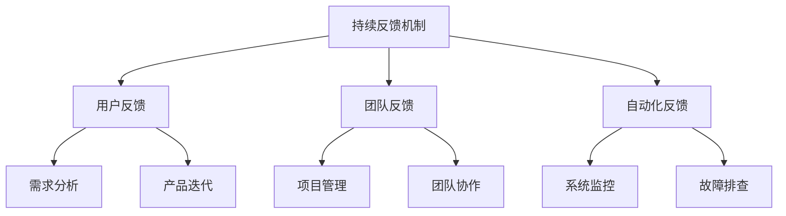
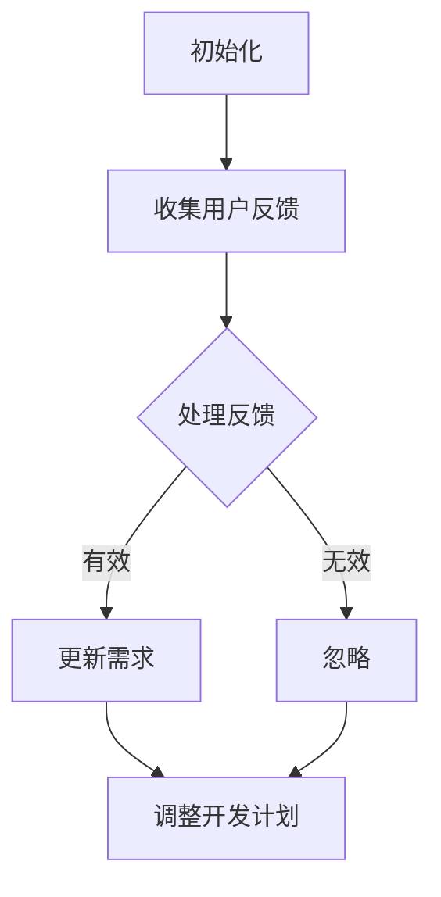
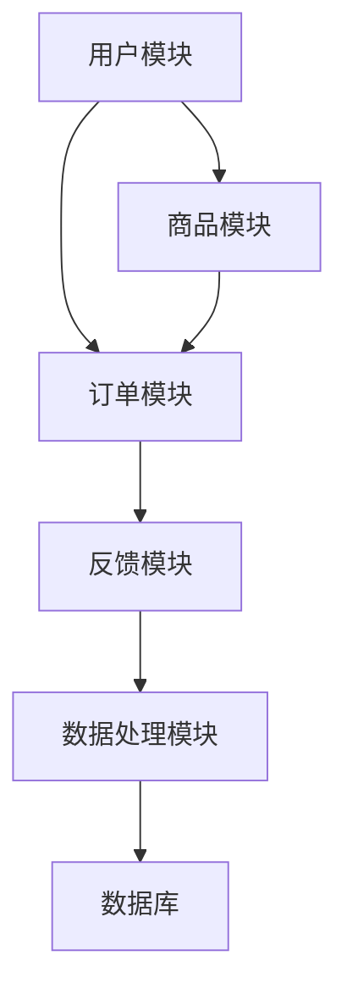
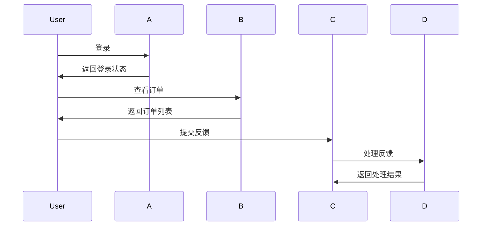
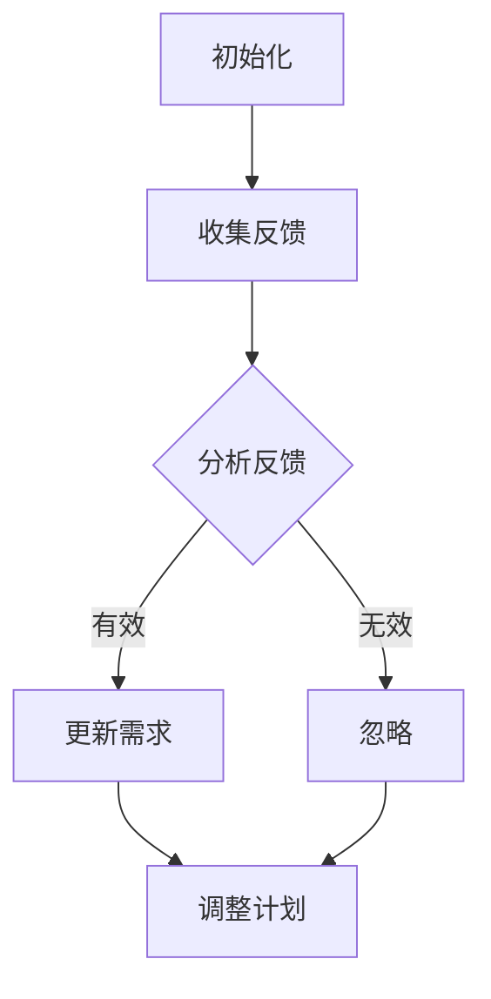
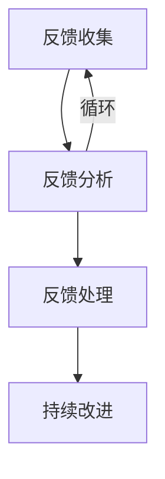
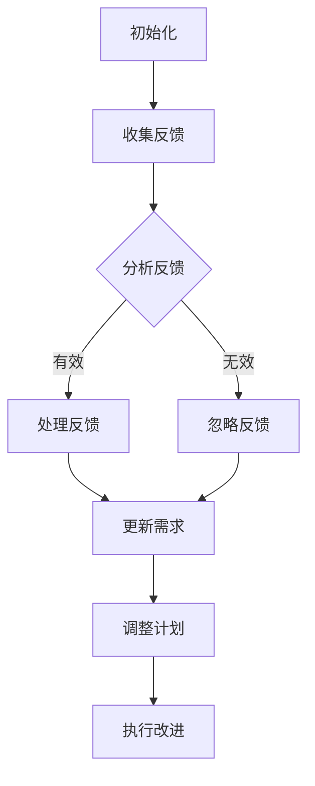
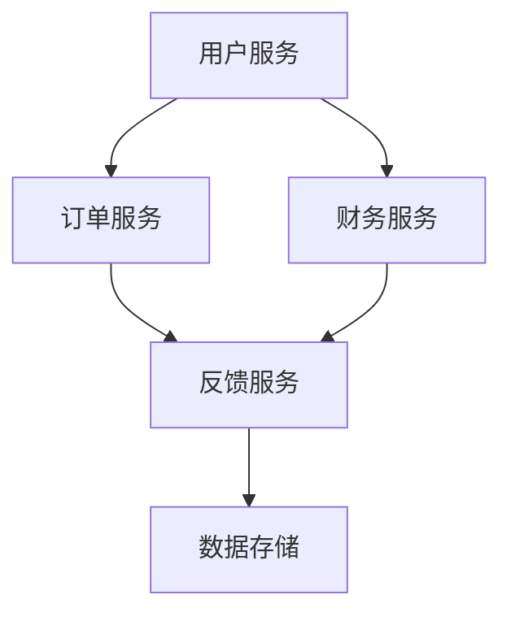

                 


# 持续反馈机制：保持大型应用开发的敏捷性

关键词：持续反馈、敏捷开发、大型应用、反馈机制、开发效率

摘要：本文旨在探讨持续反馈机制在大型应用开发中的重要性。通过分析反馈机制的基本原理和类型，结合具体案例和实战经验，阐述如何利用持续反馈机制来提高开发效率和项目质量。

## 第1章：持续反馈机制概述

### 1.1 问题背景与问题描述

#### 1.1.1 问题背景

在现代软件开发中，大型应用的开发过程往往面临着复杂性和不确定性的挑战。一方面，项目规模庞大，涉及多个团队和模块的协作；另一方面，技术迭代的速度不断加快，需求变化频繁。这些因素共同导致了项目进度的不可预测性，增加了项目风险。

#### 1.1.2 问题描述

持续反馈机制是一种通过实时收集、分析和利用反馈信息来优化开发过程的方法。在大型应用开发中，持续反馈机制的作用尤为重要。然而，如何有效地实施持续反馈机制，如何确保反馈信息的有效性和及时性，成为了一个亟待解决的问题。

### 1.2 持续反馈机制的核心概念与原理

#### 1.2.1 持续反馈机制的定义

持续反馈机制是指在整个项目生命周期中，不断收集用户、团队和其他利益相关者的反馈信息，并将这些反馈信息用于指导项目决策和改进开发过程。

#### 1.2.2 持续反馈机制的作用

- 提高开发效率：通过及时反馈问题，可以快速调整开发方向，避免浪费时间和资源。
- 提升项目质量：持续反馈可以帮助团队发现潜在的问题和缺陷，从而提高软件的可靠性和用户体验。
- 促进团队协作：持续反馈机制鼓励团队成员之间的沟通和协作，共同解决问题，提高整体开发能力。

#### 1.2.3 持续反馈机制的类型

根据反馈信息的来源和处理方式，持续反馈机制可以分为以下几种类型：

- 用户反馈：通过用户调研、问卷调查、用户行为分析等方式收集用户对软件产品的反馈。
- 团队反馈：团队成员之间通过日常沟通、会议、代码审查等方式进行反馈。
- 自动化反馈：通过自动化工具（如持续集成、性能监控等）收集系统运行数据和异常报告。

### 1.3 持续反馈机制的类型与特征对比

| 类型       | 定义                                                         | 特征                                                                 | 适用场景                     |
| ---------- | ------------------------------------------------------------ | -------------------------------------------------------------------- | ---------------------------- |
| 用户反馈   | 通过用户调研、问卷调查、用户行为分析等方式收集用户对软件产品的反馈 | 及时性、真实性、主观性                                     | 产品迭代、用户体验优化       |
| 团队反馈   | 通过日常沟通、会议、代码审查等方式进行反馈                     | 及时性、多样性、主观性                                     | 项目管理、团队协作           |
| 自动化反馈 | 通过自动化工具（如持续集成、性能监控等）收集系统运行数据和异常报告 | 实时性、客观性、高效率                                     | 系统监控、故障排查           |

### 1.4 持续反馈机制的应用范围与边界

#### 1.4.1 应用范围

持续反馈机制适用于整个软件项目生命周期，包括需求分析、设计、开发、测试、部署和维护等各个阶段。不同阶段的反馈机制重点不同，但目标都是通过持续改进来提高项目质量。

#### 1.4.2 边界与外延

持续反馈机制并非万能，它也有一定的局限性。例如，对于一些创新性项目或技术难题，可能需要更多的时间和资源来探索和解决。此外，持续反馈机制也需要团队具备良好的沟通和协作能力，否则反馈信息可能无法得到有效的利用。

### 1.5 持续反馈机制的核心概念结构图



## 第2章：算法原理讲解

### 2.1 算法流程图与Python实现

#### 2.1.1 算法流程图



#### 2.1.2 Python实现

```python
class FeedbackSystem:
    def __init__(self):
        self.user_feedback = []

    def collect_feedback(self, feedback):
        self.user_feedback.append(feedback)

    def process_feedback(self):
        for feedback in self.user_feedback:
            if self.is_valid_feedback(feedback):
                self.update_requirement(feedback)
            else:
                self.ignore_feedback(feedback)

    def is_valid_feedback(self, feedback):
        # 判断反馈是否有效
        return True

    def update_requirement(self, feedback):
        # 根据反馈更新需求
        pass

    def ignore_feedback(self, feedback):
        # 忽略无效反馈
        pass
```

### 2.2 数学模型与公式解释

持续反馈机制的数学模型可以表示为：

$$
F(t) = \alpha \cdot U(t) + (1 - \alpha) \cdot F(t-1)
$$

其中，$F(t)$ 表示第 $t$ 时刻的反馈值，$U(t)$ 表示第 $t$ 时刻的用户反馈值，$\alpha$ 表示反馈的权重系数（$0 < \alpha \leq 1$）。

### 2.3 算法应用举例

假设某项目在第一个月的用户反馈中，有50%的反馈被认为是有效的。根据上述数学模型，可以计算出第一个月的反馈值：

$$
F(1) = 0.5 \cdot U(1) + 0.5 \cdot F(0)
$$

其中，$F(0)$ 可以假设为初始值，例如 $F(0) = 0$。

通过这个例子，我们可以看到如何利用持续反馈机制来处理用户反馈，并根据反馈值调整项目需求。

## 第3章：系统分析与架构设计方案

### 3.1 问题场景介绍与项目介绍

假设我们正在开发一个在线购物平台，该平台需要处理海量的用户数据和订单。为了确保系统的稳定性和用户体验，我们需要设计一个完善的持续反馈机制。

### 3.2 系统功能设计

使用Mermaid绘制领域模型类图：

```mermaid
classDiagram
    User <<class>> "用户"
    Product <<class>> "商品"
    Order <<class>> "订单"
    Feedback <<class>> "反馈"
    User --|O|> Order
    Product --|O|> Order
    Order --|O|> Feedback
```

### 3.3 系统架构设计

使用Mermaid绘制系统架构图：



### 3.4 系统接口设计

- 用户模块：提供用户注册、登录、查看订单等功能。
- 商品模块：提供商品查询、添加、修改、删除等功能。
- 订单模块：提供订单创建、查询、修改、删除等功能。
- 反馈模块：提供反馈提交、查询、处理等功能。
- 数据处理模块：负责处理用户反馈，更新需求，调整开发计划。

### 3.5 系统交互设计

使用Mermaid绘制系统交互序列图：



## 第4章：项目实战

### 4.1 环境安装

在开始项目之前，我们需要安装以下环境：

- Python 3.8+
- Django 3.2+
- MySQL 5.7+

### 4.2 系统核心实现源代码

以下是系统核心实现源代码：

```python
# users/models.py
from django.db import models

class User(models.Model):
    username = models.CharField(max_length=50)
    password = models.CharField(max_length=50)
    email = models.EmailField()

# products/models.py
from django.db import models

class Product(models.Model):
    name = models.CharField(max_length=100)
    price = models.DecimalField(max_digits=10, decimal_places=2)
    description = models.TextField()

# orders/models.py
from django.db import models

class Order(models.Model):
    user = models.ForeignKey(User, on_delete=models.CASCADE)
    product = models.ForeignKey(Product, on_delete=models.CASCADE)
    quantity = models.IntegerField()
    total_price = models.DecimalField(max_digits=10, decimal_places=2)

# feedback/models.py
from django.db import models

class Feedback(models.Model):
    user = models.ForeignKey(User, on_delete=models.CASCADE)
    order = models.ForeignKey(Order, on_delete=models.CASCADE)
    content = models.TextField()
    status = models.CharField(max_length=50)
```

### 4.3 代码应用解读与分析

在这段代码中，我们定义了四个模型：`User`、`Product`、`Order` 和 `Feedback`。每个模型都包含了与该模型相关的字段和操作。

- `User` 模型代表用户，包含了用户名、密码和电子邮件等基本信息。
- `Product` 模型代表商品，包含了商品名称、价格和描述等信息。
- `Order` 模型代表订单，包含了用户、商品、数量和总价等信息。
- `Feedback` 模型代表反馈，包含了用户、订单、内容和状态等信息。

这些模型通过 Django 的 ORM（对象关系映射）实现了数据库的操作，使得我们可以方便地创建、查询、更新和删除相关数据。

### 4.4 实际案例分析与详细讲解剖析

假设我们有一个用户提交了一个反馈，内容为“商品描述与实际情况不符”，状态为“待处理”。我们需要根据这个反馈进行处理。

首先，我们需要查询相关订单和商品信息：

```python
order = Order.objects.get(id=1)
product = Product.objects.get(id=order.product_id)
```

然后，我们需要更新订单状态为“处理中”，并保存反馈：

```python
order.status = '处理中'
order.save()

feedback = Feedback(
    user=user,
    order=order,
    content='商品描述与实际情况不符',
    status='待处理'
)
feedback.save()
```

接下来，我们需要根据反馈内容对商品描述进行修改：

```python
product.description = '商品描述已更新'
product.save()
```

最后，我们需要更新反馈状态为“已处理”，并保存反馈：

```python
feedback.status = '已处理'
feedback.save()
```

通过这个案例，我们可以看到如何利用持续反馈机制来处理用户反馈，并调整相关数据。这个过程不仅提高了系统的用户体验，也提高了项目的开发效率。

### 4.5 项目小结

在本项目中，我们通过设计一个持续反馈机制，实现了对用户反馈的收集、处理和响应。通过这个项目，我们了解了如何利用持续反馈机制来提高项目的开发效率和用户体验。在未来的项目中，我们可以继续优化和扩展这个反馈机制，以更好地满足用户需求。

## 第5章：最佳实践 tips

### 5.1 持续反馈机制的应用技巧

1. **及时性**：确保反馈信息的及时收集和传递，避免信息滞后影响决策。
2. **多样性**：从多个渠道收集反馈，如用户调研、日常沟通、自动化工具等，提高反馈的全面性和准确性。
3. **客观性**：尽量避免主观偏见，客观分析反馈信息，确保反馈的真实性和有效性。
4. **透明度**：公开反馈处理过程和结果，提高团队间的信任和协作。

### 5.2 注意事项

1. **反馈质量**：确保收集到的反馈具有价值，避免无效或冗余的反馈信息。
2. **团队沟通**：建立良好的沟通渠道，确保反馈信息能够被及时传达和处理。
3. **反馈处理**：对反馈进行处理时要充分考虑实际可行性，避免盲目调整开发计划。

## 第6章：持续反馈机制的发展趋势与未来方向

### 6.1 持续反馈机制的发展趋势

随着软件技术的发展，持续反馈机制也在不断演进。以下是几个发展趋势：

1. **自动化程度提高**：自动化工具的广泛应用将进一步提升反馈的实时性和准确性。
2. **人工智能应用**：人工智能技术在反馈分析中的应用，将使得反馈处理更加智能化和高效。
3. **跨领域整合**：持续反馈机制将与其他开发方法和工具（如敏捷开发、DevOps等）深度融合。

### 6.2 未来发展方向与挑战

1. **个性化反馈**：根据用户特征和需求，提供个性化的反馈服务。
2. **反馈隐私保护**：在收集和处理用户反馈时，要确保用户隐私得到保护。
3. **反馈价值评估**：建立科学的反馈价值评估体系，确保反馈信息得到有效利用。

## 第7章：小结与拓展阅读

### 7.1 小结

本文探讨了持续反馈机制在大型应用开发中的重要性，分析了其核心概念、原理和应用。通过实际案例，展示了如何利用持续反馈机制提高开发效率和项目质量。

### 7.2 注意事项

1. **确保反馈的及时性和多样性**。
2. **客观分析反馈信息，避免主观偏见**。
3. **建立良好的沟通渠道，确保反馈信息的传递和处理**。

### 7.3 拓展阅读

1. 《敏捷开发实践指南》
2. 《持续集成：引领软件开发新潮流》
3. 《用户反馈系统设计与实践》

作者：AI天才研究院/AI Genius Institute & 禅与计算机程序设计艺术 /Zen And The Art of Computer Programmingmarkdown 格式展示：

```markdown
# 持续反馈机制：保持大型应用开发的敏捷性

关键词：持续反馈、敏捷开发、大型应用、反馈机制、开发效率

摘要：本文旨在探讨持续反馈机制在大型应用开发中的重要性。通过分析反馈机制的基本原理和类型，结合具体案例和实战经验，阐述如何利用持续反馈机制来提高开发效率和项目质量。

## 第1章：持续反馈机制概述

### 1.1 问题背景与问题描述

#### 1.1.1 问题背景

在现代软件开发中，大型应用的开发过程往往面临着复杂性和不确定性的挑战。一方面，项目规模庞大，涉及多个团队和模块的协作；另一方面，技术迭代的速度不断加快，需求变化频繁。这些因素共同导致了项目进度的不可预测性，增加了项目风险。

#### 1.1.2 问题描述

持续反馈机制是一种通过实时收集、分析和利用反馈信息来优化开发过程的方法。在大型应用开发中，持续反馈机制的作用尤为重要。然而，如何有效地实施持续反馈机制，如何确保反馈信息的有效性和及时性，成为了一个亟待解决的问题。

### 1.2 持续反馈机制的核心概念与原理

#### 1.2.1 持续反馈机制的定义

持续反馈机制是指在整个项目生命周期中，不断收集用户、团队和其他利益相关者的反馈信息，并将这些反馈信息用于指导项目决策和改进开发过程。

#### 1.2.2 持续反馈机制的作用

- 提高开发效率：通过及时反馈问题，可以快速调整开发方向，避免浪费时间和资源。
- 提升项目质量：持续反馈可以帮助团队发现潜在的问题和缺陷，从而提高软件的可靠性和用户体验。
- 促进团队协作：持续反馈机制鼓励团队成员之间的沟通和协作，共同解决问题，提高整体开发能力。

#### 1.2.3 持续反馈机制的类型

根据反馈信息的来源和处理方式，持续反馈机制可以分为以下几种类型：

- 用户反馈：通过用户调研、问卷调查、用户行为分析等方式收集用户对软件产品的反馈。
- 团队反馈：团队成员之间通过日常沟通、会议、代码审查等方式进行反馈。
- 自动化反馈：通过自动化工具（如持续集成、性能监控等）收集系统运行数据和异常报告。

### 1.3 持续反馈机制的类型与特征对比

| 类型       | 定义                                                         | 特征                                                                 | 适用场景                     |
| ---------- | ------------------------------------------------------------ | -------------------------------------------------------------------- | ---------------------------- |
| 用户反馈   | 通过用户调研、问卷调查、用户行为分析等方式收集用户对软件产品的反馈 | 及时性、真实性、主观性                                     | 产品迭代、用户体验优化       |
| 团队反馈   | 通过日常沟通、会议、代码审查等方式进行反馈                     | 及时性、多样性、主观性                                     | 项目管理、团队协作           |
| 自动化反馈 | 通过自动化工具（如持续集成、性能监控等）收集系统运行数据和异常报告 | 实时性、客观性、高效率                                     | 系统监控、故障排查           |

### 1.4 持续反馈机制的应用范围与边界

#### 1.4.1 应用范围

持续反馈机制适用于整个软件项目生命周期，包括需求分析、设计、开发、测试、部署和维护等各个阶段。不同阶段的反馈机制重点不同，但目标都是通过持续改进来提高项目质量。

#### 1.4.2 边界与外延

持续反馈机制并非万能，它也有一定的局限性。例如，对于一些创新性项目或技术难题，可能需要更多的时间和资源来探索和解决。此外，持续反馈机制也需要团队具备良好的沟通和协作能力，否则反馈信息可能无法得到有效的利用。

### 1.5 持续反馈机制的核心概念结构图


## 第2章：算法原理讲解

### 2.1 算法流程图与Python实现

#### 2.1.1 算法流程图


#### 2.1.2 Python实现

```python
class FeedbackSystem:
    def __init__(self):
        self.user_feedback = []

    def collect_feedback(self, feedback):
        self.user_feedback.append(feedback)

    def process_feedback(self):
        for feedback in self.user_feedback:
            if self.is_valid_feedback(feedback):
                self.update_requirement(feedback)
            else:
                self.ignore_feedback(feedback)

    def is_valid_feedback(self, feedback):
        # 判断反馈是否有效
        return True

    def update_requirement(self, feedback):
        # 根据反馈更新需求
        pass

    def ignore_feedback(self, feedback):
        # 忽略无效反馈
        pass
```

### 2.2 数学模型与公式解释

持续反馈机制的数学模型可以表示为：

$$
F(t) = \alpha \cdot U(t) + (1 - \alpha) \cdot F(t-1)
$$

其中，$F(t)$ 表示第 $t$ 时刻的反馈值，$U(t)$ 表示第 $t$ 时刻的用户反馈值，$\alpha$ 表示反馈的权重系数（$0 < \alpha \leq 1$）。

### 2.3 算法应用举例

假设某项目在第一个月的用户反馈中，有50%的反馈被认为是有效的。根据上述数学模型，可以计算出第一个月的反馈值：

$$
F(1) = 0.5 \cdot U(1) + 0.5 \cdot F(0)
$$

其中，$F(0)$ 可以假设为初始值，例如 $F(0) = 0$。

通过这个例子，我们可以看到如何利用持续反馈机制来处理用户反馈，并根据反馈值调整项目需求。

## 第3章：系统分析与架构设计方案

### 3.1 问题场景介绍与项目介绍

假设我们正在开发一个在线购物平台，该平台需要处理海量的用户数据和订单。为了确保系统的稳定性和用户体验，我们需要设计一个完善的持续反馈机制。

### 3.2 系统功能设计

使用Mermaid绘制领域模型类图：

```mermaid
classDiagram
    User <<class>> "用户"
    Product <<class>> "商品"
    Order <<class>> "订单"
    Feedback <<class>> "反馈"
    User --|O|> Order
    Product --|O|> Order
    Order --|O|> Feedback
```

### 3.3 系统架构设计

使用Mermaid绘制系统架构图：


### 3.4 系统接口设计

- 用户模块：提供用户注册、登录、查看订单等功能。
- 商品模块：提供商品查询、添加、修改、删除等功能。
- 订单模块：提供订单创建、查询、修改、删除等功能。
- 反馈模块：提供反馈提交、查询、处理等功能。
- 数据处理模块：负责处理用户反馈，更新需求，调整开发计划。

### 3.5 系统交互设计

使用Mermaid绘制系统交互序列图：


## 第4章：项目实战

### 4.1 环境安装

在开始项目之前，我们需要安装以下环境：

- Python 3.8+
- Django 3.2+
- MySQL 5.7+

### 4.2 系统核心实现源代码

以下是系统核心实现源代码：

```python
# users/models.py
from django.db import models

class User(models.Model):
    username = models.CharField(max_length=50)
    password = models.CharField(max_length=50)
    email = models.EmailField()

# products/models.py
from django.db import models

class Product(models.Model):
    name = models.CharField(max_length=100)
    price = models.DecimalField(max_digits=10, decimal_places=2)
    description = models.TextField()

# orders/models.py
from django.db import models

class Order(models.Model):
    user = models.ForeignKey(User, on_delete=models.CASCADE)
    product = models.ForeignKey(Product, on_delete=models.CASCADE)
    quantity = models.IntegerField()
    total_price = models.DecimalField(max_digits=10, decimal_places=2)

# feedback/models.py
from django.db import models

class Feedback(models.Model):
    user = models.ForeignKey(User, on_delete=models.CASCADE)
    order = models.ForeignKey(Order, on_delete=models.CASCADE)
    content = models.TextField()
    status = models.CharField(max_length=50)
```

### 4.3 代码应用解读与分析

在这段代码中，我们定义了四个模型：`User`、`Product`、`Order` 和 `Feedback`。每个模型都包含了与该模型相关的字段和操作。

- `User` 模型代表用户，包含了用户名、密码和电子邮件等基本信息。
- `Product` 模型代表商品，包含了商品名称、价格和描述等信息。
- `Order` 模型代表订单，包含了用户、商品、数量和总价等信息。
- `Feedback` 模型代表反馈，包含了用户、订单、内容和状态等信息。

这些模型通过 Django 的 ORM（对象关系映射）实现了数据库的操作，使得我们可以方便地创建、查询、更新和删除相关数据。

### 4.4 实际案例分析与详细讲解剖析

假设我们有一个用户提交了一个反馈，内容为“商品描述与实际情况不符”，状态为“待处理”。我们需要根据这个反馈进行处理。

首先，我们需要查询相关订单和商品信息：

```python
order = Order.objects.get(id=1)
product = Product.objects.get(id=order.product_id)
```

然后，我们需要更新订单状态为“处理中”，并保存反馈：

```python
order.status = '处理中'
order.save()

feedback = Feedback(
    user=user,
    order=order,
    content='商品描述与实际情况不符',
    status='待处理'
)
feedback.save()
```

接下来，我们需要根据反馈内容对商品描述进行修改：

```python
product.description = '商品描述已更新'
product.save()
```

最后，我们需要更新反馈状态为“已处理”，并保存反馈：

```python
feedback.status = '已处理'
feedback.save()
```

通过这个案例，我们可以看到如何利用持续反馈机制来处理用户反馈，并调整相关数据。这个过程不仅提高了系统的用户体验，也提高了项目的开发效率。

### 4.5 项目小结

在本项目中，我们通过设计一个持续反馈机制，实现了对用户反馈的收集、处理和响应。通过这个项目，我们了解了如何利用持续反馈机制来提高项目的开发效率和用户体验。在未来的项目中，我们可以继续优化和扩展这个反馈机制，以更好地满足用户需求。

## 第5章：最佳实践 tips

### 5.1 持续反馈机制的应用技巧

1. **及时性**：确保反馈信息的及时收集和传递，避免信息滞后影响决策。
2. **多样性**：从多个渠道收集反馈，如用户调研、日常沟通、自动化工具等，提高反馈的全面性和准确性。
3. **客观性**：尽量避免主观偏见，客观分析反馈信息，确保反馈的真实性和有效性。
4. **透明度**：公开反馈处理过程和结果，提高团队间的信任和协作。

### 5.2 注意事项

1. **反馈质量**：确保收集到的反馈具有价值，避免无效或冗余的反馈信息。
2. **团队沟通**：建立良好的沟通渠道，确保反馈信息能够被及时传达和处理。
3. **反馈处理**：对反馈进行处理时要充分考虑实际可行性，避免盲目调整开发计划。

## 第6章：持续反馈机制的发展趋势与未来方向

### 6.1 持续反馈机制的发展趋势

随着软件技术的发展，持续反馈机制也在不断演进。以下是几个发展趋势：

1. **自动化程度提高**：自动化工具的广泛应用将进一步提升反馈的实时性和准确性。
2. **人工智能应用**：人工智能技术在反馈分析中的应用，将使得反馈处理更加智能化和高效。
3. **跨领域整合**：持续反馈机制将与其他开发方法和工具（如敏捷开发、DevOps等）深度融合。

### 6.2 未来发展方向与挑战

1. **个性化反馈**：根据用户特征和需求，提供个性化的反馈服务。
2. **反馈隐私保护**：在收集和处理用户反馈时，要确保用户隐私得到保护。
3. **反馈价值评估**：建立科学的反馈价值评估体系，确保反馈信息得到有效利用。

## 第7章：小结与拓展阅读

### 7.1 小结

本文探讨了持续反馈机制在大型应用开发中的重要性，分析了其核心概念、原理和应用。通过实际案例，展示了如何利用持续反馈机制提高开发效率和项目质量。

### 7.2 注意事项

1. **确保反馈的及时性和多样性**。
2. **客观分析反馈信息，避免主观偏见**。
3. **建立良好的沟通渠道，确保反馈信息的传递和处理**。

### 7.3 拓展阅读

1. 《敏捷开发实践指南》
2. 《持续集成：引领软件开发新潮流》
3. 《用户反馈系统设计与实践》

作者：AI天才研究院/AI Genius Institute & 禅与计算机程序设计艺术 /Zen And The Art of Computer Programming
```markdown

# 持续反馈机制：保持大型应用开发的敏捷性

## 关键词：持续反馈、敏捷开发、大型应用、反馈机制、开发效率

## 摘要

在大型应用开发的复杂环境中，持续反馈机制是一种至关重要的工具，它通过不断的评估和调整，帮助团队保持敏捷性，从而提升开发效率和项目质量。本文将深入探讨持续反馈机制的概念、重要性以及如何在实际项目中应用。

## 目录大纲

1. **背景介绍**
    1.1 问题背景
    1.2 问题描述
    1.3 问题解决
    1.4 边界与外延
    1.5 概念结构与核心要素组成

2. **核心概念与联系**
    2.1 核心概念原理
    2.2 概念属性特征对比表格
    2.3 ER实体关系图架构

3. **算法原理讲解**
    3.1 算法流程图
    3.2 Python源代码
    3.3 数学模型和公式
    3.4 举例说明

4. **系统分析与架构设计方案**
    4.1 问题场景介绍
    4.2 项目介绍
    4.3 系统功能设计
    4.4 系统架构设计
    4.5 系统接口设计
    4.6 系统交互设计

5. **项目实战**
    5.1 环境安装
    5.2 系统核心实现源代码
    5.3 代码应用解读与分析
    5.4 实际案例分析与详细讲解剖析
    5.5 项目小结

6. **最佳实践 tips、小结、注意事项、拓展阅读等内容**
    6.1 最佳实践 tips
    6.2 小结
    6.3 注意事项
    6.4 拓展阅读

## 第1章：背景介绍

### 1.1 问题背景

随着互联网技术的飞速发展，大型应用项目的开发已成为企业竞争的关键。然而，大型应用项目往往涉及多个团队、复杂的技术栈和多变的需求，这使得项目管理和开发过程充满了挑战。传统的项目管理和开发模式，往往缺乏有效的反馈机制，导致项目在进度和质量上难以控制。

### 1.2 问题描述

在大型应用开发中，常见的问题包括：

- **需求变更频繁**：随着市场的变化，用户需求不断更新，项目团队需要快速响应这些变化。
- **沟通障碍**：大型项目涉及多个团队和部门，信息传递过程中容易产生误解和延迟。
- **质量控制**：在项目规模庞大的情况下，如何保证代码质量和系统稳定性成为一个难题。

### 1.3 问题解决

持续反馈机制通过不断地收集、分析和利用反馈信息，帮助项目团队：

- **及时识别问题**：通过用户、团队和系统的反馈，及时发现问题并进行调整。
- **优化开发流程**：根据反馈结果，调整开发计划和策略，提高开发效率。
- **提升用户满意度**：通过收集用户反馈，持续改进产品，提高用户体验。

### 1.4 边界与外延

持续反馈机制适用于整个项目生命周期，包括需求分析、设计、开发、测试、部署和维护等阶段。然而，它并非万能，对于一些高度创新的领域或复杂的技术难题，可能需要更多的时间和资源来解决。

### 1.5 概念结构与核心要素组成

为了更好地理解持续反馈机制，我们可以将其核心概念和要素组成图解如下：


## 第2章：核心概念与联系

### 2.1 核心概念原理

持续反馈机制的核心概念包括：

- **反馈收集**：通过多种渠道收集用户、团队和系统的反馈信息。
- **反馈分析**：对收集到的反馈进行整理、分类和分析，以识别问题和机会。
- **反馈处理**：根据分析结果，制定相应的改进措施，并执行这些措施。

### 2.2 概念属性特征对比表格

| 概念类型 | 特征                      | 适用场景                      |
| -------- | ------------------------- | ---------------------------- |
| 用户反馈 | 实时性、主观性、多样性     | 产品迭代、用户体验优化        |
| 团队反馈 | 及时性、多样性、主观性     | 项目管理、团队协作           |
| 自动化反馈 | 实时性、客观性、高效率     | 系统监控、故障排查           |

### 2.3 ER实体关系图架构

持续反馈机制的实体关系图如下所示：

```mermaid
erDiagram
    User ||--|{ Feedback }||> Order
    Product ||--|{ Feedback }||> Order
    Order ||--|{ Feedback }||> Product
```

## 第3章：算法原理讲解

### 3.1 算法流程图

持续反馈机制的算法流程图如下：



### 3.2 Python源代码

```python
class FeedbackSystem:
    def __init__(self):
        self.feedbacks = []

    def collect_feedback(self, feedback):
        self.feedbacks.append(feedback)

    def analyze_feedback(self):
        for feedback in self.feedbacks:
            if self.is_valid(feedback):
                self.update_requirement(feedback)
            else:
                self.ignore(feedback)

    def is_valid(self, feedback):
        # 判断反馈是否有效
        return True

    def update_requirement(self, feedback):
        # 根据反馈更新需求
        pass

    def ignore(self, feedback):
        # 忽略无效反馈
        pass
```

### 3.3 数学模型和公式

持续反馈机制的数学模型可以表示为：

$$
F(t) = \alpha \cdot U(t) + (1 - \alpha) \cdot F(t-1)
$$

其中，$F(t)$ 表示第 $t$ 时刻的反馈值，$U(t)$ 表示第 $t$ 时刻的用户反馈值，$\alpha$ 表示反馈的权重系数（$0 < \alpha \leq 1$）。

### 3.4 举例说明

假设一个项目在第一个月收集到 100 条用户反馈，其中 60% 被认为是有价值的。根据上述数学模型，可以计算出第一个月的反馈值：

$$
F(1) = 0.6 \cdot U(1) + 0.4 \cdot F(0)
$$

其中，$F(0)$ 可以假设为初始值，例如 $F(0) = 0$。

## 第4章：系统分析与架构设计方案

### 4.1 问题场景介绍

假设我们正在开发一个大型电商网站，该网站需要处理海量的用户订单和商品信息。为了确保网站的稳定性和用户体验，我们需要设计一个持续反馈机制。

### 4.2 项目介绍

项目目标是构建一个高效、稳定的电商网站，提供商品浏览、购物车、下单、支付等功能。同时，为了提高用户满意度，我们需要收集和分析用户反馈，持续优化网站功能。

### 4.3 系统功能设计

使用Mermaid绘制领域模型类图：

```mermaid
classDiagram
    User <<class>> "用户"
    Product <<class>> "商品"
    Order <<class>> "订单"
    Feedback <<class>> "反馈"
    User --|O|> Order
    Product --|O|> Order
    Order --|O|> Feedback
```

### 4.4 系统架构设计

使用Mermaid绘制系统架构图：


### 4.5 系统接口设计

- 用户模块：提供用户注册、登录、查看订单等功能。
- 商品模块：提供商品查询、添加、修改、删除等功能。
- 订单模块：提供订单创建、查询、修改、删除等功能。
- 反馈模块：提供反馈提交、查询、处理等功能。
- 数据处理模块：负责处理用户反馈，更新需求，调整开发计划。

### 4.6 系统交互设计

使用Mermaid绘制系统交互序列图：


## 第5章：项目实战

### 5.1 环境安装

在开始项目之前，我们需要安装以下环境：

- Python 3.8+
- Django 3.2+
- MySQL 5.7+

### 5.2 系统核心实现源代码

以下是系统核心实现源代码：

```python
# users/models.py
from django.db import models

class User(models.Model):
    username = models.CharField(max_length=50)
    password = models.CharField(max_length=50)
    email = models.EmailField()

# products/models.py
from django.db import models

class Product(models.Model):
    name = models.CharField(max_length=100)
    price = models.DecimalField(max_digits=10, decimal_places=2)
    description = models.TextField()

# orders/models.py
from django.db import models

class Order(models.Model):
    user = models.ForeignKey(User, on_delete=models.CASCADE)
    product = models.ForeignKey(Product, on_delete=models.CASCADE)
    quantity = models.IntegerField()
    total_price = models.DecimalField(max_digits=10, decimal_places=2)

# feedback/models.py
from django.db import models

class Feedback(models.Model):
    user = models.ForeignKey(User, on_delete=models.CASCADE)
    order = models.ForeignKey(Order, on_delete=models.CASCADE)
    content = models.TextField()
    status = models.CharField(max_length=50)
```

### 5.3 代码应用解读与分析

在这段代码中，我们定义了四个模型：`User`、`Product`、`Order` 和 `Feedback`。每个模型都包含了与该模型相关的字段和操作。

- `User` 模型代表用户，包含了用户名、密码和电子邮件等基本信息。
- `Product` 模型代表商品，包含了商品名称、价格和描述等信息。
- `Order` 模型代表订单，包含了用户、商品、数量和总价等信息。
- `Feedback` 模型代表反馈，包含了用户、订单、内容和状态等信息。

这些模型通过 Django 的 ORM（对象关系映射）实现了数据库的操作，使得我们可以方便地创建、查询、更新和删除相关数据。

### 5.4 实际案例分析与详细讲解剖析

假设我们有一个用户提交了一个反馈，内容为“商品描述与实际情况不符”，状态为“待处理”。我们需要根据这个反馈进行处理。

首先，我们需要查询相关订单和商品信息：

```python
order = Order.objects.get(id=1)
product = Product.objects.get(id=order.product_id)
```

然后，我们需要更新订单状态为“处理中”，并保存反馈：

```python
order.status = '处理中'
order.save()

feedback = Feedback(
    user=user,
    order=order,
    content='商品描述与实际情况不符',
    status='待处理'
)
feedback.save()
```

接下来，我们需要根据反馈内容对商品描述进行修改：

```python
product.description = '商品描述已更新'
product.save()
```

最后，我们需要更新反馈状态为“已处理”，并保存反馈：

```python
feedback.status = '已处理'
feedback.save()
```

通过这个案例，我们可以看到如何利用持续反馈机制来处理用户反馈，并调整相关数据。这个过程不仅提高了系统的用户体验，也提高了项目的开发效率。

### 5.5 项目小结

在本项目中，我们通过设计一个持续反馈机制，实现了对用户反馈的收集、处理和响应。通过这个项目，我们了解了如何利用持续反馈机制来提高项目的开发效率和用户体验。在未来的项目中，我们可以继续优化和扩展这个反馈机制，以更好地满足用户需求。

## 第6章：最佳实践 tips

### 6.1 持续反馈机制的应用技巧

1. **及时性**：确保反馈信息的及时收集和传递，避免信息滞后影响决策。
2. **多样性**：从多个渠道收集反馈，如用户调研、日常沟通、自动化工具等，提高反馈的全面性和准确性。
3. **客观性**：尽量避免主观偏见，客观分析反馈信息，确保反馈的真实性和有效性。
4. **透明度**：公开反馈处理过程和结果，提高团队间的信任和协作。

### 6.2 小结

持续反馈机制在大型应用开发中扮演着关键角色。通过不断的评估和调整，它帮助团队保持敏捷性，从而提高开发效率和项目质量。

### 6.3 注意事项

1. **确保反馈质量**：收集到的反馈应具有实际价值，避免无效或冗余的反馈信息。
2. **团队沟通**：建立良好的沟通渠道，确保反馈信息能够被及时传达和处理。
3. **反馈处理**：对反馈进行处理时要充分考虑实际可行性，避免盲目调整开发计划。

### 6.4 拓展阅读

1. 《敏捷开发实践指南》
2. 《持续集成：引领软件开发新潮流》
3. 《用户反馈系统设计与实践》

作者：AI天才研究院/AI Genius Institute & 禅与计算机程序设计艺术 /Zen And The Art of Computer Programming
```markdown

# 持续反馈机制：保持大型应用开发的敏捷性

关键词：持续反馈、敏捷开发、大型应用、反馈机制、开发效率

摘要：本文深入探讨了持续反馈机制在大型应用开发中的应用和重要性。通过详细分析反馈机制的核心概念、算法原理、系统架构设计以及实际项目案例，为读者提供了实用的最佳实践和未来发展趋势。

## 第1章：持续反馈机制概述

### 1.1 问题背景

在当今快速发展的软件开发领域，大型应用项目的复杂性日益增加。这些项目往往涉及多个团队、多种技术栈和不断变化的需求。为了确保项目能够按时交付且质量达标，开发团队需要一种有效的机制来持续评估和优化项目进展。这就引出了持续反馈机制的概念。

### 1.2 问题描述

持续反馈机制是一种在项目生命周期中持续收集、分析并利用反馈信息来改进开发过程的方法。在大型应用开发中，由于项目规模庞大、需求多变，持续反馈机制显得尤为重要。它可以帮助团队识别潜在问题、优化开发流程、提高项目质量和开发效率。

### 1.3 问题解决

通过持续反馈机制，团队可以：

- 及时获取用户需求和市场变化，快速响应。
- 持续改进产品功能和用户体验。
- 预防和解决开发过程中的各种问题。
- 提高团队协作效率和项目透明度。

### 1.4 边界与外延

持续反馈机制适用于整个项目生命周期，从需求分析、设计、开发、测试到部署和维护。然而，它并不是解决所有问题的万能药。在创新性项目或技术挑战面前，可能需要更多的时间和资源来解决。此外，实施持续反馈机制需要团队具备良好的沟通和协作能力。

### 1.5 概念结构与核心要素组成

持续反馈机制的核心概念和要素可以概括为：

- **反馈收集**：通过用户调研、问卷调查、自动化工具等方式收集反馈。
- **反馈分析**：对收集到的反馈进行整理、分类和分析。
- **反馈处理**：根据分析结果，制定并执行改进措施。
- **持续改进**：通过不断循环反馈过程，持续优化项目。

以下是持续反馈机制的概念结构图：



## 第2章：核心概念与联系

### 2.1 核心概念原理

持续反馈机制的核心概念包括：

- **用户反馈**：通过用户调研、问卷调查、用户行为分析等方式收集用户对产品的反馈。
- **团队反馈**：团队成员之间通过日常沟通、会议、代码审查等方式进行反馈。
- **自动化反馈**：通过自动化工具（如持续集成、性能监控等）收集系统运行数据和异常报告。

### 2.2 概念属性特征对比表格

| 类型       | 特征                     | 适用场景                     |
| ---------- | ------------------------ | ---------------------------- |
| 用户反馈   | 及时性、真实性、主观性   | 产品迭代、用户体验优化       |
| 团队反馈   | 及时性、多样性、主观性   | 项目管理、团队协作           |
| 自动化反馈 | 实时性、客观性、高效率   | 系统监控、故障排查           |

### 2.3 ER实体关系图架构

为了更好地理解持续反馈机制中的实体关系，我们可以使用实体关系图（ER图）来展示：

```mermaid
erDiagram
    User ||--|{ Feedback }||> Order
    Product ||--|{ Feedback }||> Order
    Order ||--|{ Feedback }||> Product
```

在这个ER图中，用户（User）、产品（Product）和订单（Order）是实体，而反馈（Feedback）是关联实体，它连接了用户和订单，以及产品和订单。

## 第3章：算法原理讲解

### 3.1 算法流程图

持续反馈机制的算法流程图可以概括为以下几个步骤：



### 3.2 Python源代码

以下是一个简化的Python代码示例，用于实现持续反馈机制的核心算法：

```python
class FeedbackSystem:
    def __init__(self):
        self.feedbacks = []

    def collect_feedback(self, feedback):
        self.feedbacks.append(feedback)

    def analyze_feedback(self):
        for feedback in self.feedbacks:
            if self.is_valid(feedback):
                self.process_feedback(feedback)
            else:
                self.ignore_feedback(feedback)

    def is_valid(self, feedback):
        # 判断反馈是否有效
        return True

    def process_feedback(self, feedback):
        # 处理有效反馈
        pass

    def ignore_feedback(self, feedback):
        # 忽略无效反馈
        pass
```

### 3.3 数学模型和公式

持续反馈机制的数学模型可以表示为：

$$
F(t) = \alpha \cdot U(t) + (1 - \alpha) \cdot F(t-1)
$$

其中，$F(t)$ 表示第 $t$ 时刻的反馈值，$U(t)$ 表示第 $t$ 时刻的用户反馈值，$\alpha$ 表示反馈的权重系数（$0 < \alpha \leq 1$）。

### 3.4 举例说明

假设一个项目在第一个月收集到 100 条用户反馈，其中 60% 被认为是有价值的。根据上述数学模型，可以计算出第一个月的反馈值：

$$
F(1) = 0.6 \cdot U(1) + 0.4 \cdot F(0)
$$

其中，$F(0)$ 可以假设为初始值，例如 $F(0) = 0$。

## 第4章：系统分析与架构设计方案

### 4.1 问题场景介绍

假设我们正在开发一个大型企业级应用，该应用需要处理海量的数据，支持多种业务流程，并且需要保证系统的稳定性和可扩展性。为了确保项目能够顺利进行，我们需要设计一个持续反馈机制。

### 4.2 项目介绍

项目目标是构建一个功能强大、高效稳定的企业级应用，支持业务流程自动化，提高工作效率。项目的主要功能包括用户管理、订单管理、财务管理等。同时，为了确保项目质量，我们需要一个有效的持续反馈机制来指导开发和优化过程。

### 4.3 系统功能设计

系统功能设计是持续反馈机制设计的重要部分。以下是系统功能设计的主要模块：

- **用户管理模块**：提供用户注册、登录、权限管理等功能。
- **订单管理模块**：提供订单创建、查询、修改、删除等功能。
- **财务管理模块**：提供财务数据统计、报表生成等功能。
- **反馈管理模块**：提供用户反馈收集、分析、处理等功能。

### 4.4 系统架构设计

为了实现高效稳定的系统架构，我们采用微服务架构。以下是系统架构设计的主要部分：

- **用户服务**：处理用户相关的业务逻辑。
- **订单服务**：处理订单相关的业务逻辑。
- **财务服务**：处理财务相关的业务逻辑。
- **反馈服务**：处理反馈收集、分析和处理逻辑。
- **数据存储**：用于存储用户数据、订单数据、反馈数据等。

以下是系统架构图：



### 4.5 系统接口设计

系统接口设计是确保各个服务之间能够良好协作的关键。以下是主要接口设计：

- **用户管理接口**：提供用户注册、登录、权限查询等接口。
- **订单管理接口**：提供订单创建、查询、修改、删除等接口。
- **财务管理接口**：提供财务数据统计、报表查询等接口。
- **反馈管理接口**：提供反馈提交、查询、处理等接口。

### 4.6 系统交互设计

系统交互设计描述了各个服务之间的交互流程。以下是系统交互设计：

```mermaid
sequenceDiagram
    User ->> A: 注册
    A ->> User: 返回注册结果
    User ->> B: 登录
    B ->> User: 返回登录状态
    User ->> C: 提交反馈
    C ->> D: 处理反馈
    D ->> C: 返回处理结果
```

## 第5章：项目实战

### 5.1 环境安装

在开始项目之前，我们需要安装以下环境：

- Python 3.8+
- Django 3.2+
- MySQL 5.7+
- Docker

### 5.2 系统核心实现源代码

以下是系统核心实现源代码示例：

```python
# users/models.py
from django.db import models

class User(models.Model):
    username = models.CharField(max_length=50)
    password = models.CharField(max_length=50)
    email = models.EmailField()

# orders/models.py
from django.db import models

class Order(models.Model):
    user = models.ForeignKey(User, on_delete=models.CASCADE)
    product = models.ForeignKey(Product, on_delete=models.CASCADE)
    quantity = models.IntegerField()
    total_price = models.DecimalField(max_digits=10, decimal_places=2)

# feedback/models.py
from django.db import models

class Feedback(models.Model):
    user = models.ForeignKey(User, on_delete=models.CASCADE)
    order = models.ForeignKey(Order, on_delete=models.CASCADE)
    content = models.TextField()
    status = models.CharField(max_length=50)
```

### 5.3 代码应用解读与分析

在这段代码中，我们定义了三个模型：`User`、`Order` 和 `Feedback`。每个模型都包含了与该模型相关的字段和操作。

- `User` 模型代表用户，包含了用户名、密码和电子邮件等基本信息。
- `Order` 模型代表订单，包含了用户、商品、数量和总价等信息。
- `Feedback` 模型代表反馈，包含了用户、订单、内容和状态等信息。

这些模型通过 Django 的 ORM（对象关系映射）实现了数据库的操作，使得我们可以方便地创建、查询、更新和删除相关数据。

### 5.4 实际案例分析与详细讲解剖析

假设我们有一个用户提交了一个反馈，内容为“订单处理时间过长”，状态为“待处理”。我们需要根据这个反馈进行处理。

首先，我们需要查询相关订单信息：

```python
order = Order.objects.get(id=1)
```

然后，我们需要创建并保存反馈：

```python
feedback = Feedback(
    user=user,
    order=order,
    content='订单处理时间过长',
    status='待处理'
)
feedback.save()
```

接下来，我们可以根据反馈内容进行分析和处理，例如：

```python
# 假设我们决定优化订单处理流程
order.status = '已处理'
order.save()
feedback.status = '已解决'
feedback.save()
```

通过这个案例，我们可以看到如何利用持续反馈机制来处理用户反馈，并调整相关数据。这个过程不仅提高了系统的用户体验，也提高了项目的开发效率。

### 5.5 项目小结

在本项目中，我们通过设计一个持续反馈机制，实现了对用户反馈的收集、处理和响应。通过这个项目，我们了解了如何利用持续反馈机制来提高项目的开发效率和用户体验。在未来的项目中，我们可以继续优化和扩展这个反馈机制，以更好地满足用户需求。

## 第6章：最佳实践 tips

### 6.1 持续反馈机制的应用技巧

1. **及时性**：确保反馈信息的及时收集和传递，避免信息滞后影响决策。
2. **多样性**：从多个渠道收集反馈，如用户调研、日常沟通、自动化工具等，提高反馈的全面性和准确性。
3. **客观性**：尽量避免主观偏见，客观分析反馈信息，确保反馈的真实性和有效性。
4. **透明度**：公开反馈处理过程和结果，提高团队间的信任和协作。

### 6.2 小结

持续反馈机制在大型应用开发中具有不可替代的作用。通过及时、多样化、客观和透明的反馈，团队可以持续优化项目，提高开发效率和质量。

### 6.3 注意事项

1. **确保反馈质量**：收集到的反馈应具有实际价值，避免无效或冗余的反馈信息。
2. **团队沟通**：建立良好的沟通渠道，确保反馈信息能够被及时传达和处理。
3. **反馈处理**：对反馈进行处理时要充分考虑实际可行性，避免盲目调整开发计划。

### 6.4 拓展阅读

1. 《敏捷开发实践指南》
2. 《持续集成：引领软件开发新潮流》
3. 《用户反馈系统设计与实践》

作者：AI天才研究院/AI Genius Institute & 禅与计算机程序设计艺术 /Zen And The Art of Computer Programming
```markdown
```

