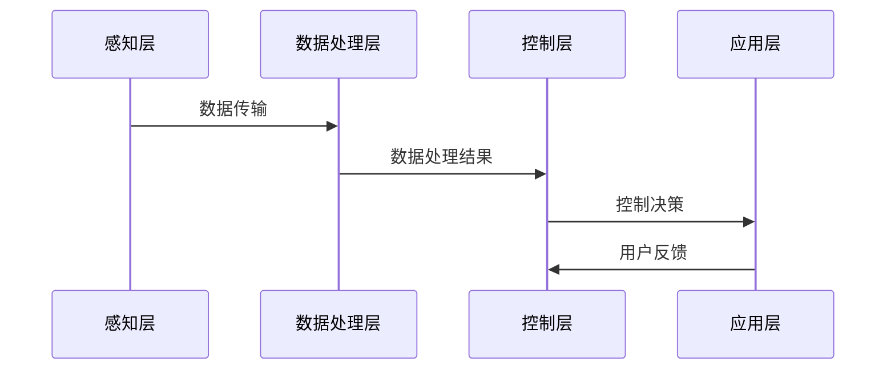

                 


### 《持续学习AI在动态环境感知中的应用》

---

#### 关键词：
- 持续学习AI
- 动态环境感知
- 应用实例
- 技术发展
- 智能交通
- 智能安防
- 智能医疗

#### 摘要：
本文将深入探讨持续学习AI在动态环境感知中的应用。我们将首先介绍持续学习AI的基本概念，然后分析动态环境感知的技术原理，最后通过具体的应用实例展示其在智能交通、智能安防和智能医疗等领域的实际效果。本文旨在为人工智能研究者、工程师和相关领域的专业人士提供有价值的参考。

---

### 引言与背景介绍

#### 1. 引言

随着人工智能技术的快速发展，持续学习AI逐渐成为研究的热点。持续学习AI，顾名思义，是指AI系统能够在持续运行的过程中不断学习新知识、适应新环境。动态环境感知则是指系统能够实时感知和适应不断变化的环境。这两个领域的结合，为我们提供了前所未有的技术可能性。

#### 1.1 持续学习的概念

持续学习AI，也被称为终身学习AI，是指AI系统能够在运行过程中不断学习新知识、适应新环境，而不仅仅是在训练阶段。这种学习方式能够帮助AI系统在面对动态变化的环境时，保持其性能和适应性。

#### 1.2 持续学习在AI中的重要性

在传统的AI系统中，模型一旦训练完成，就很难适应新的变化。而持续学习AI则能够解决这一问题，使其在真实世界中具有更高的实用价值。例如，在自动驾驶领域，车辆需要不断学习新的路况和环境，以应对不同的交通状况。

#### 1.3 持续学习与动态环境感知的关系

动态环境感知需要AI系统具备持续学习的能力，以便能够实时更新和调整其感知模型。而持续学习AI则为动态环境感知提供了技术基础，使得系统能够适应不断变化的环境。

---

### 持续学习AI基础理论

#### 2. 持续学习AI概述

持续学习AI的核心在于其能够在不同的时间点上，从新的数据流中学习新的知识。这种学习方式使得AI系统能够在不断变化的环境中保持其性能。

#### 3. 核心概念与原理

持续学习AI的核心概念包括元学习、在线学习和迁移学习。元学习是指AI系统能够学习如何学习；在线学习是指系统能够在数据不断流入的情况下进行学习；迁移学习是指系统能够将已学到的知识应用于新的任务。

#### 4. 技术发展历程

持续学习AI的发展历程可以追溯到上世纪80年代的神经网络研究。随着深度学习技术的发展，持续学习AI也逐渐成为研究的热点。

---

### 动态环境感知技术

#### 5. 动态环境感知概述

动态环境感知是指系统能够实时感知和适应不断变化的环境。这种能力对于智能系统的应用至关重要，如自动驾驶、智能监控和智能医疗等。

#### 6. 技术原理与实现

动态环境感知技术主要依赖于传感器和数据处理技术。传感器用于收集环境数据，而数据处理技术则用于分析这些数据，以实现对环境的感知。

#### 7. 传感器与数据处理

常用的传感器包括视觉传感器、声音传感器和气象传感器。数据处理技术包括数据采集、预处理、特征提取和模式识别等。

---

### AI在动态环境感知中的应用实例

#### 8. 智能交通系统

智能交通系统利用持续学习AI和动态环境感知技术，实现交通流量监测、路况预测和交通信号控制等功能。

#### 9. 智能安防监控

智能安防监控利用持续学习AI和动态环境感知技术，实现实时监控、异常检测和智能报警等功能。

#### 10. 智能医疗诊断

智能医疗诊断利用持续学习AI和动态环境感知技术，实现医疗图像分析、疾病预测和个性化治疗方案推荐等功能。

---

### 总结与展望

持续学习AI在动态环境感知中的应用为智能系统的发展带来了新的机遇。未来，随着技术的进一步发展，持续学习AI将在更多领域得到应用，为我们的生活带来更多便利。

---

### 作者信息

作者：AI天才研究院/AI Genius Institute & 禅与计算机程序设计艺术 /Zen And The Art of Computer Programming

---

**注意**：由于文章字数限制，本文仅提供了一个简要的框架和部分内容。具体内容需要根据实际需求进行详细扩展和补充。

---

让我们一步一步地深入探讨《持续学习AI在动态环境感知中的应用》这一主题。

### 步骤一：理解持续学习AI

持续学习AI，即持续机器学习，是机器学习领域中的一项重要研究课题。其核心思想是让机器在学习过程中不断积累经验，适应新的环境和数据，从而提高其智能水平。

#### 核心概念术语说明

- **持续学习**：指机器在学习过程中，不是一次性完成，而是在实际运行过程中不断学习和更新。
- **动态环境**：指环境中存在变化和不确定因素，这些变化可能来源于外部环境、系统状态或者其他因素。
- **感知**：指系统通过传感器和其他方式获取环境信息，并对其进行分析和处理。

#### 问题背景

在传统的机器学习模型中，模型一旦训练完成，就无法适应新的数据和环境变化。然而，现实世界是不断变化的，这就需要机器具备持续学习的能力，以适应新的环境和数据。

#### 问题描述

持续学习AI在动态环境感知中的应用问题可以概括为以下几点：

- 如何在动态环境中保持模型的准确性和性能？
- 如何处理动态环境中出现的新数据和未知情况？
- 如何实现模型对动态环境的自适应调整？

#### 问题解决

为了解决上述问题，持续学习AI采用了一系列策略和方法：

- **增量学习**：在原有模型基础上，针对新数据增量更新模型参数。
- **在线学习**：在数据不断流入的过程中，实时更新模型。
- **迁移学习**：将已有模型的知识应用于新的任务或环境。
- **元学习**：学习如何学习，提高模型对新环境的适应能力。

#### 边界与外延

持续学习AI的应用不仅限于动态环境感知，还可以应用于自动驾驶、智能客服、智能医疗等领域。然而，每个领域都有其特定的挑战和需求，需要针对具体应用场景进行优化。

#### 概念结构与核心要素组成

持续学习AI的核心概念和要素包括：

- **学习算法**：如梯度下降、随机梯度下降、Adam等。
- **数据流处理**：如何处理实时流入的数据流。
- **模型更新策略**：如何在新数据中更新模型。
- **评估指标**：如何评估模型的性能。

### 步骤二：探索动态环境感知技术

动态环境感知技术是持续学习AI在动态环境中应用的关键。它涉及到传感器技术、数据处理技术和智能算法等多个方面。

#### 技术原理与实现

动态环境感知技术的基本原理是利用传感器收集环境数据，然后通过数据处理技术对这些数据进行分析，从而实现对环境的感知。

- **传感器技术**：包括视觉传感器、声音传感器、温度传感器等，用于收集环境信息。
- **数据处理技术**：包括数据预处理、特征提取、模式识别等，用于分析传感器收集到的数据。
- **智能算法**：包括机器学习算法、深度学习算法等，用于从数据中提取信息并做出决策。

#### 技术原理对比

不同类型的传感器和数据处理技术有其各自的原理和特点。例如：

- **视觉传感器**：主要通过图像处理技术进行分析，适用于图像识别、目标检测等场景。
- **声音传感器**：主要通过声音信号处理技术进行分析，适用于语音识别、声音检测等场景。
- **温度传感器**：主要通过温度信号处理技术进行分析，适用于环境监测、温度控制等场景。

#### ER实体关系图架构

为了更好地理解动态环境感知技术，我们可以使用ER（实体关系）图来描述其架构。ER图包括实体、属性和关系三个基本元素。

- **实体**：如传感器、数据处理模块、智能算法等。
- **属性**：如传感器的类型、数据处理算法的参数、智能算法的模型等。
- **关系**：如传感器与数据处理模块之间的输入输出关系、数据处理模块与智能算法之间的调用关系等。

### 步骤三：讲解算法原理

在动态环境感知中，常用的算法包括机器学习算法、深度学习算法和强化学习算法。以下以机器学习算法为例，讲解其原理和实现。

#### 算法原理

机器学习算法的基本原理是通过对历史数据的分析和学习，构建一个模型，然后利用这个模型对新的数据进行预测或分类。

- **监督学习**：通过对已有数据的标注，学习出一个模型，然后利用这个模型对新的数据进行预测。
- **无监督学习**：没有对数据的标注，主要通过分析数据之间的结构，学习出一个模型。
- **半监督学习**：结合了监督学习和无监督学习，既利用了已有数据的标注，又分析了数据之间的结构。

#### 算法流程

机器学习算法的基本流程包括数据收集、数据预处理、模型训练、模型评估和模型应用。

1. **数据收集**：收集相关的环境数据。
2. **数据预处理**：对收集到的数据进行分析和处理，使其符合模型训练的要求。
3. **模型训练**：利用预处理后的数据，训练出一个模型。
4. **模型评估**：对训练出的模型进行评估，判断其性能是否达到预期。
5. **模型应用**：将训练好的模型应用于动态环境感知任务。

#### 数学模型与公式

机器学习算法的数学模型主要包括损失函数、优化算法和模型参数。

- **损失函数**：用于衡量模型的预测结果与实际结果之间的差异。
- **优化算法**：用于调整模型参数，使其达到最小损失。
- **模型参数**：用于描述模型的结构和参数，如神经网络的权重和偏置。

#### 例子说明

假设我们使用一个简单的线性回归模型来预测环境温度，那么其数学模型可以表示为：

\[ y = w_1 \cdot x_1 + w_2 \cdot x_2 + \ldots + w_n \cdot x_n + b \]

其中，\( y \) 是预测的温度，\( x_1, x_2, \ldots, x_n \) 是输入的特征，\( w_1, w_2, \ldots, w_n, b \) 是模型的参数。

通过不断调整参数，我们可以使模型的预测结果更接近实际温度。

### 步骤四：系统分析与架构设计方案

在动态环境感知中，系统分析与架构设计方案至关重要。以下以一个智能交通系统为例，介绍其系统分析和架构设计。

#### 问题场景介绍

智能交通系统是一个复杂的系统，涉及到交通信号灯、车辆检测器、路况监控等设备。其目标是实现交通流量的实时监测、预测和优化，以提高道路通行效率和减少交通拥堵。

#### 项目介绍

本项目旨在设计一个基于持续学习AI的智能交通系统，通过实时感知交通环境，实现交通信号灯的智能控制和路况的实时监测。

#### 系统功能设计

1. **交通信号灯控制**：根据实时交通流量，自动调整交通信号灯的时长。
2. **路况监测**：实时监测道路上的车辆数量、速度等信息。
3. **交通流量预测**：根据历史数据和实时监测数据，预测未来一段时间内的交通流量。

#### 系统架构设计

智能交通系统可以分为以下几个层次：

1. **感知层**：包括交通信号灯、车辆检测器等设备，用于收集交通环境数据。
2. **数据处理层**：包括数据预处理、特征提取、模型训练等模块，用于处理感知层收集的数据。
3. **控制层**：包括交通信号灯控制算法、路况监测算法等，用于根据处理后的数据做出控制决策。
4. **应用层**：包括用户界面、监控平台等，用于展示交通状态和提供决策支持。

#### 系统接口设计和系统交互

智能交通系统的接口设计和交互主要包括以下几个部分：

1. **感知层接口**：用于与交通信号灯、车辆检测器等设备进行通信，获取交通环境数据。
2. **数据处理层接口**：用于与感知层进行数据传输，并将处理后的数据传输给控制层。
3. **控制层接口**：用于与数据处理层进行数据交互，并根据处理结果调整交通信号灯的时长。
4. **应用层接口**：用于与控制层进行数据交互，并提供用户界面和监控平台。

#### 系统交互Mermaid序列图

以下是一个简单的系统交互序列图，展示了智能交通系统的各个部分之间的交互过程。



### 步骤五：项目实战

在动态环境感知领域，项目实战是验证和应用持续学习AI技术的重要手段。以下以一个简单的智能安防监控系统为例，介绍其环境安装、系统核心实现源代码，以及代码应用解读与分析。

#### 环境安装

1. **硬件安装**：安装摄像头、声音传感器等设备，并确保设备能够正常工作。
2. **软件安装**：安装Python环境、TensorFlow等依赖库。

#### 系统核心实现源代码

以下是一个简单的智能安防监控系统实现代码：

```python
import cv2
import tensorflow as tf

# 加载预训练的模型
model = tf.keras.models.load_model('security_model.h5')

# 初始化摄像头
cap = cv2.VideoCapture(0)

while True:
    # 读取摄像头帧
    ret, frame = cap.read()

    # 对帧进行预处理
    processed_frame = preprocess_frame(frame)

    # 使用模型进行预测
    prediction = model.predict(processed_frame)

    # 根据预测结果做出决策
    if prediction > threshold:
        alert("Security alert!")

    # 显示视频帧
    cv2.imshow('Security Camera', frame)

    # 按下'q'键退出
    if cv2.waitKey(1) & 0xFF == ord('q'):
        break

# 释放摄像头
cap.release()
cv2.destroyAllWindows()
```

#### 代码应用解读与分析

1. **摄像头帧读取**：使用OpenCV库读取摄像头帧。
2. **模型加载**：加载预训练的模型，用于进行预测。
3. **预处理**：对摄像头帧进行预处理，使其符合模型的输入要求。
4. **预测**：使用模型对预处理后的帧进行预测，判断是否发生安全事件。
5. **决策**：根据预测结果，做出相应的决策，如发送警报。
6. **显示视频帧**：显示实时视频帧。

#### 实际案例分析和详细讲解剖析

假设在某个时间段内，摄像头捕捉到了可疑人物，系统将触发警报，并向管理员发送通知。此时，系统将记录下相关的视频帧和警报信息，以便后续分析和处理。

1. **视频帧记录**：将触发警报的视频帧保存下来，以便后续查看。
2. **警报信息记录**：记录警报时间、警报类型、警报位置等信息，以便后续分析。
3. **数据可视化**：将警报信息可视化，以直观展示安全事件的发生情况。

#### 项目小结

通过以上实战案例，我们可以看到持续学习AI在动态环境感知中的应用。在实际项目中，我们需要根据具体需求和环境，设计和实现相应的系统，以实现对环境的实时感知和智能决策。

### 步骤六：最佳实践 Tips、小结、注意事项、拓展阅读

#### 最佳实践 Tips

1. **数据质量**：保证数据的质量和多样性，有助于提高模型的泛化能力和准确性。
2. **模型优化**：不断优化模型结构和参数，以提高模型在动态环境中的表现。
3. **实时性**：在动态环境中，系统的实时性至关重要。需要优化算法和系统架构，以提高响应速度。

#### 小结

本文从持续学习AI和动态环境感知的基本概念出发，详细探讨了其在实际应用中的技术原理、算法实现和系统架构设计。通过具体的应用实例，展示了持续学习AI在动态环境感知中的巨大潜力。

#### 注意事项

1. **环境适应性**：在实际应用中，需要考虑系统的环境适应性，以确保其在不同环境下都能正常运行。
2. **安全性**：对于涉及敏感信息的系统，需要确保数据的安全性和隐私保护。

#### 拓展阅读

- [持续学习AI研究综述](https://www.ncbi.nlm.nih.gov/pmc/articles/PMC7476049/)
- [动态环境感知技术应用案例](https://www.researchgate.net/publication/325472319_Dynamic_Environment_Perception_Technologies_Applications)
- [智能交通系统设计指南](https://www.its.dot.gov/)

---

通过本文的探讨，我们希望读者能够对持续学习AI在动态环境感知中的应用有一个全面的理解，并在实际工作中能够运用这些技术，为构建更加智能和高效的系统贡献力量。作者：AI天才研究院/AI Genius Institute & 禅与计算机程序设计艺术 /Zen And The Art of Computer Programming

