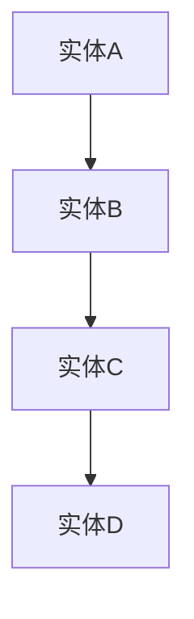

                 

### 持续学习系统:构建终身学习的AI模型

> 关键词：持续学习系统、人工智能、终身学习、模型构建、数据收集、数据处理、模型选择、训练与优化、知识图谱

> 摘要：随着人工智能技术的快速发展，持续学习系统成为实现终身学习的重要工具。本文将深入探讨持续学习系统的概念、构建方法以及应用实践，旨在为研究者提供系统化的指导，促进人工智能技术在终身学习领域的应用与发展。

## 第一部分: 引言

### 第1章: 持续学习系统的定义与背景

### 1.1 持续学习系统概述

**持续学习系统（Continuous Learning System，简称CLS）**是一种基于人工智能技术的动态学习系统，它能够自动地、持续地学习和适应新的数据和环境，从而实现对知识的不断更新和扩展。与传统学习系统相比，持续学习系统具备以下几个显著特点：

1. **动态适应性**：能够根据环境变化自动调整学习策略，保持系统的有效性。
2. **知识更新**：具备自动获取和更新知识的能力，以适应不断变化的需求。
3. **自优化**：系统能够通过不断的学习和调整，自动优化自身的性能。

### 1.1.1 什么是持续学习系统

持续学习系统通常由以下几个核心模块组成：

1. **数据收集模块**：负责收集外部环境中的数据。
2. **数据处理模块**：对收集到的数据进行清洗、预处理和特征提取。
3. **学习模块**：利用收集到的数据训练和更新模型。
4. **知识管理模块**：负责构建和维护知识图谱，实现知识的存储和管理。
5. **反馈循环模块**：将系统的输出与预期目标进行对比，形成反馈，用于系统的进一步优化。

### 1.1.2 持续学习系统的核心概念

- **持续学习**：系统通过不断学习新的数据和经验，不断优化自身的性能。
- **自适应**：系统能够根据环境变化自动调整学习策略。
- **知识图谱**：用于表示和管理知识的一种图形化结构，它能够反映实体之间的关系和属性。
- **数据驱动**：系统的学习和优化过程依赖于外部数据的输入。

### 1.1.3 持续学习系统的应用领域

持续学习系统在多个领域具有广泛的应用前景，主要包括：

1. **企业级应用**：如客户关系管理、供应链优化、市场预测等。
2. **教育领域**：如个性化学习、在线教育、教育数据分析等。
3. **医疗领域**：如疾病预测、诊断辅助、个性化治疗等。
4. **智能家居**：如智能助手、家居设备自适应控制等。

### 1.2 持续学习系统的发展背景

**持续学习系统的提出**源于以下几个因素：

1. **人工智能的快速发展**：随着深度学习、自然语言处理等技术的突破，人工智能系统在各个领域取得了显著成果。
2. **终身学习的需求**：在信息化时代，知识更新速度快，个人和组织的终身学习需求日益强烈。
3. **数据驱动的决策**：越来越多的企业和组织认识到数据的重要性，数据驱动成为决策的重要依据。

### 1.3 持续学习系统的核心要素

持续学习系统要实现有效运行，需要以下几个核心要素：

1. **数据收集与处理**：系统运行的基础，决定了系统的输入质量和数据质量。
2. **模型选择与训练**：系统的核心，决定了系统的学习效果和能力。
3. **知识图谱构建**：用于知识表示和管理，是实现持续学习的关键。
4. **持续优化与更新**：系统稳定运行和持续提升的关键。

### 1.4 持续学习系统的重要性

持续学习系统在多个方面具有重要价值：

1. **提高学习效率**：通过自动化的学习和优化过程，大大提高学习效率。
2. **促进知识更新**：系统自动获取和更新知识，确保知识的时效性和准确性。
3. **适应不断变化的工作环境**：系统具备自适应能力，能够应对环境变化，提高系统的适应性和稳定性。

### 1.5 本章小结

本章对持续学习系统进行了详细的概述，包括定义、核心概念、应用领域以及发展背景。通过本章的学习，读者可以初步了解持续学习系统的概念和重要性，为后续章节的深入学习打下基础。

----------------------------------------------------------------

## 第二部分: 持续学习系统的构建

### 第2章: 数据收集与处理

### 2.1 数据收集

数据收集是持续学习系统的第一步，也是关键的一步。数据的质量直接影响到后续的模型训练和系统性能。因此，数据收集环节需要特别关注以下几个方面：

#### 2.1.1 数据来源

数据来源可以包括以下几个方面：

1. **公开数据集**：如Kaggle、UCI机器学习库等提供的公开数据集。
2. **企业内部数据**：如客户数据、交易数据、社交媒体数据等。
3. **第三方数据服务**：如阿里巴巴、腾讯等提供的数据服务。

#### 2.1.2 数据收集方法

1. **自动化数据采集**：利用爬虫、API接口等技术自动化获取数据。
2. **手动数据收集**：通过问卷调查、访谈等方式手动收集数据。
3. **传感器采集**：利用传感器设备收集环境数据。

#### 2.1.3 数据质量评估

数据质量是系统性能的关键因素。以下方法可以评估数据质量：

1. **完整性评估**：检查数据是否完整，是否存在缺失值。
2. **一致性评估**：检查数据是否一致，是否存在矛盾。
3. **准确性评估**：检查数据是否准确，是否存在错误。
4. **时效性评估**：检查数据是否新鲜，是否具有时效性。

### 2.2 数据处理

数据处理是数据收集后的关键步骤，目的是将原始数据转化为适合模型训练的形式。数据处理主要包括以下几个环节：

#### 2.2.1 数据清洗

数据清洗是数据处理的第一步，目的是去除数据中的噪声和错误。常见的数据清洗方法包括：

1. **缺失值处理**：通过插值、平均等方法填补缺失值。
2. **异常值处理**：通过聚类、回归等方法检测并处理异常值。
3. **重复数据删除**：删除重复的数据条目。

#### 2.2.2 数据预处理

数据预处理是将原始数据转换为模型训练所需的形式。常见的数据预处理方法包括：

1. **归一化/标准化**：将数据缩放到相同的范围，如0-1或-1到1。
2. **数据转换**：将类别型数据转换为数值型数据，如使用独热编码、标签编码等方法。
3. **特征选择**：通过特征选择算法选择对模型训练有显著影响的关键特征。

#### 2.2.3 数据特征提取

数据特征提取是将原始数据转换为对模型训练有价值的特征表示。常见的数据特征提取方法包括：

1. **文本特征提取**：如TF-IDF、Word2Vec等方法。
2. **图像特征提取**：如卷积神经网络（CNN）、特征提取器等方法。
3. **音频特征提取**：如梅尔频谱、倒谱特征等方法。

### 2.3 数据存储与管理

数据存储与管理是确保数据安全和高效利用的关键。以下方法可以用于数据存储与管理：

1. **数据库设计**：根据数据类型和需求设计合适的数据库系统，如关系型数据库（MySQL、PostgreSQL）或NoSQL数据库（MongoDB、Cassandra）。
2. **数据存储策略**：根据数据类型和访问模式选择合适的数据存储策略，如冷数据存储、热数据存储等。
3. **数据安全管理**：通过加密、访问控制等措施保障数据安全。

### 2.4 案例分析：数据收集与处理实践

#### 2.4.1 案例介绍

以一家电商平台为例，该电商平台希望通过持续学习系统优化其推荐算法，从而提高用户体验和销售额。数据收集和处理过程如下：

1. **数据来源**：电商平台的用户行为数据，包括用户浏览、搜索、购买记录等。
2. **数据收集方法**：通过API接口自动化收集数据。
3. **数据质量评估**：对数据进行完整性、一致性、准确性和时效性评估。

#### 2.4.2 数据收集与处理流程

1. **数据收集**：通过API接口收集用户行为数据。
2. **数据清洗**：去除缺失值、异常值和重复数据。
3. **数据预处理**：对数据进行归一化和特征提取。
4. **数据存储与管理**：将清洗和预处理后的数据存储在关系型数据库中，并设置数据安全策略。

#### 2.4.3 案例小结

通过数据收集与处理实践，电商平台可以获取高质量的用户行为数据，为推荐算法的优化提供有力支持。数据收集与处理是持续学习系统的关键环节，需要特别关注数据质量、数据预处理方法和数据存储与管理策略。

### 2.5 本章小结

本章详细介绍了数据收集与处理的方法和实践，包括数据来源、数据收集方法、数据质量评估、数据清洗、数据预处理、数据特征提取以及数据存储与管理。数据收集与处理是持续学习系统构建的基础，对系统的性能和效果具有重要影响。通过本章的学习，读者可以掌握数据收集与处理的基本方法和实践技巧。

----------------------------------------------------------------

### 第3章: 模型选择与训练

### 3.1 模型选择

模型选择是持续学习系统构建过程中的关键环节，直接影响到系统的性能和效果。在模型选择过程中，需要考虑以下几个因素：

#### 3.1.1 模型类型

根据不同的应用场景和数据特点，可以选择以下类型的模型：

1. **监督学习模型**：适用于有标签的数据集，如线性回归、支持向量机（SVM）等。
2. **无监督学习模型**：适用于无标签的数据集，如聚类、主成分分析（PCA）等。
3. **半监督学习模型**：适用于部分有标签、部分无标签的数据集。
4. **强化学习模型**：适用于需要通过交互学习场景的模型，如Q学习、深度Q网络（DQN）等。

#### 3.1.2 模型选择标准

在模型选择过程中，需要考虑以下几个标准：

1. **准确性**：模型对数据的预测准确性。
2. **泛化能力**：模型在新数据上的表现能力。
3. **计算复杂度**：模型训练和预测的计算复杂度。
4. **可解释性**：模型的可解释性，以便于理解模型的决策过程。

#### 3.1.3 常见机器学习模型介绍

以下是几种常见的机器学习模型及其特点：

1. **线性回归**：适用于线性关系的预测问题，计算简单，易于理解。
2. **逻辑回归**：适用于分类问题，通过概率估计进行分类。
3. **支持向量机（SVM）**：适用于高维空间的数据，具有很好的分类效果。
4. **决策树**：适用于分类和回归问题，易于理解和解释。
5. **随机森林**：基于决策树的集成方法，提高模型的准确性和泛化能力。
6. **神经网络**：适用于复杂的非线性关系，通过层层抽象实现自动特征提取。
7. **卷积神经网络（CNN）**：适用于图像处理任务，通过卷积层提取图像特征。
8. **循环神经网络（RNN）**：适用于序列数据处理任务，如语言建模、时间序列预测等。

### 3.2 模型训练

模型训练是将模型应用于具体数据集，通过迭代优化模型参数，使其达到预期的性能。模型训练主要包括以下几个步骤：

#### 3.2.1 训练数据准备

1. **数据集划分**：将数据集划分为训练集、验证集和测试集。
2. **数据预处理**：对训练数据进行归一化、标准化、缺失值处理等预处理操作。

#### 3.2.2 模型参数调整

1. **初始化参数**：初始化模型参数，如权重、偏置等。
2. **优化算法**：选择合适的优化算法，如随机梯度下降（SGD）、Adam等。
3. **学习率调整**：通过调整学习率控制模型参数更新的步长。

#### 3.2.3 训练过程监控

1. **性能评估**：通过验证集评估模型性能，如准确率、召回率、F1值等。
2. **早停法**：通过设置早停法（Early Stopping）避免过拟合。
3. **模型调整**：根据性能评估结果调整模型参数，如增加或减少隐藏层节点、改变优化算法等。

### 3.3 模型评估与优化

模型评估与优化是确保模型性能的关键步骤。以下方法可以用于模型评估与优化：

#### 3.3.1 评估指标

1. **准确率**：模型正确预测的样本数占总样本数的比例。
2. **召回率**：模型正确预测的样本数占实际正样本数的比例。
3. **F1值**：准确率和召回率的调和平均值，用于平衡准确率和召回率。
4. **ROC曲线**：表示模型对正负样本分类能力的曲线。
5. **AUC值**：ROC曲线下的面积，用于评估模型的分类能力。

#### 3.3.2 模型优化方法

1. **正则化**：通过引入正则化项降低模型复杂度，避免过拟合。
2. **集成方法**：通过集成多个模型提高模型性能，如Bagging、Boosting等。
3. **迁移学习**：利用预训练模型进行迁移学习，提高模型在小样本数据上的性能。

#### 3.3.3 模型融合策略

1. **模型集成**：将多个模型的结果进行融合，提高模型的预测准确性。
2. **投票法**：通过简单投票选择最终预测结果。
3. **堆叠法**：将多个模型作为下层模型，构建新的模型进行预测。

### 3.4 案例分析：模型选择与训练实践

#### 3.4.1 案例介绍

以一家金融公司为例，该公司希望通过持续学习系统优化其信贷审批模型，从而提高审批效率和准确性。模型选择与训练过程如下：

1. **数据集划分**：将数据集划分为训练集、验证集和测试集。
2. **数据预处理**：对训练数据进行归一化、缺失值处理等预处理操作。
3. **模型选择**：选择支持向量机（SVM）作为信贷审批模型。
4. **模型训练**：通过随机梯度下降（SGD）算法训练SVM模型。
5. **模型评估**：通过验证集评估模型性能，如准确率、召回率等。

#### 3.4.2 模型选择与训练流程

1. **数据集划分**：
   ```python
   from sklearn.model_selection import train_test_split

   X_train, X_val, y_train, y_val = train_test_split(X, y, test_size=0.2, random_state=42)
   ```
2. **数据预处理**：
   ```python
   from sklearn.preprocessing import StandardScaler

   scaler = StandardScaler()
   X_train_scaled = scaler.fit_transform(X_train)
   X_val_scaled = scaler.transform(X_val)
   ```
3. **模型选择**：
   ```python
   from sklearn.svm import SVC

   model = SVC(kernel='linear')
   ```
4. **模型训练**：
   ```python
   model.fit(X_train_scaled, y_train)
   ```
5. **模型评估**：
   ```python
   from sklearn.metrics import accuracy_score, recall_score

   y_val_pred = model.predict(X_val_scaled)
   accuracy = accuracy_score(y_val, y_val_pred)
   recall = recall_score(y_val, y_val_pred)
   print(f"Accuracy: {accuracy}, Recall: {recall}")
   ```

#### 3.4.3 案例小结

通过模型选择与训练实践，金融公司可以构建一个高效、准确的信贷审批模型，提高审批效率和准确性。模型选择与训练是持续学习系统构建的核心环节，需要根据具体应用场景和数据特点选择合适的模型，并进行详细的训练和优化。

### 3.5 本章小结

本章详细介绍了模型选择与训练的方法和实践，包括模型类型、模型选择标准、常见机器学习模型介绍、模型训练过程、模型评估与优化方法以及实践案例分析。模型选择与训练是持续学习系统构建的关键环节，对系统的性能和效果具有重要影响。通过本章的学习，读者可以掌握模型选择与训练的基本方法和实践技巧。

----------------------------------------------------------------

### 第4章: 知识图谱构建

#### 4.1 知识图谱概述

知识图谱（Knowledge Graph）是一种用于表示实体和实体之间关系的图形化结构，它能够将海量数据中的知识和信息进行组织、整合和表示，从而实现数据的高效检索和利用。知识图谱的核心概念包括实体、属性、关系和知识图谱的构建方法。

##### 4.1.1 知识图谱的定义

知识图谱是一种基于图论的数据结构，用于表示实体和实体之间的关系。它通过实体、属性和关系的组合，构建出一个语义丰富、结构清晰的知识体系。

##### 4.1.2 知识图谱的核心概念

1. **实体**：知识图谱中的基本单位，表示一个具体的对象，如人、地点、物品等。
2. **属性**：实体的特征或属性，用于描述实体的详细信息，如姓名、年龄、地址等。
3. **关系**：实体之间的关系，如属于、属于、位于等，用于连接不同的实体。
4. **知识库**：存储和管理知识图谱的数据仓库，包括实体、属性和关系的定义和关系。

##### 4.1.3 知识图谱的应用场景

知识图谱在多个领域具有广泛的应用，主要包括：

1. **搜索引擎**：通过知识图谱实现语义搜索，提高搜索结果的准确性和相关性。
2. **自然语言处理**：利用知识图谱实现实体识别、关系抽取和语义理解等任务。
3. **推荐系统**：通过知识图谱实现基于关系的推荐，提高推荐系统的效果。
4. **智能问答**：利用知识图谱实现智能问答系统，提供准确的答案。
5. **企业知识管理**：通过知识图谱实现企业内部知识的高效管理和利用。

#### 4.2 知识图谱构建方法

知识图谱的构建是持续学习系统中的重要环节，主要包括以下几个步骤：

##### 4.2.1 数据采集

数据采集是知识图谱构建的第一步，包括从各种数据源收集实体、属性和关系信息。数据源可以是结构化数据（如数据库）、半结构化数据（如XML、JSON）和非结构化数据（如文本、图片）。

##### 4.2.2 数据清洗

数据清洗是数据采集后的关键步骤，目的是去除数据中的噪声和错误。数据清洗方法包括：

1. **去重**：去除重复的实体和关系。
2. **填补缺失值**：通过插值、平均等方法填补缺失的属性值。
3. **异常值处理**：检测并处理异常的实体和关系。

##### 4.2.3 实体识别与关系抽取

实体识别与关系抽取是将原始数据转换为知识图谱中的实体和关系的步骤。实体识别是从文本中识别出实体，关系抽取是识别实体之间的关系。

1. **命名实体识别**：从文本中识别出人名、地名、组织名等实体。
2. **关系抽取**：识别实体之间的关系，如属于、位于、拥有等。

##### 4.2.4 知识融合与更新

知识融合与更新是确保知识图谱准确性和时效性的关键步骤。知识融合是将不同数据源中的知识进行整合，去除冲突和重复的信息。知识更新是定期对知识图谱进行更新，以适应数据的变化。

#### 4.3 知识图谱表示方法

知识图谱的表示方法可以分为图论表示、矩阵表示和知识图谱嵌入三种。

##### 4.3.1 图论表示

图论表示是一种直观且通用的知识图谱表示方法，它通过图结构表示实体和关系，如图4.1所示。



##### 4.3.2 矩阵表示

矩阵表示是将知识图谱转换为矩阵形式，其中行表示实体，列表示关系，矩阵元素表示实体之间的关系强度。例如，对于图4.1的知识图谱，可以表示为如下矩阵：

```
  B  C  D
A [1, 0, 1]
B [0, 1, 0]
C [1, 0, 1]
D [0, 1, 1]
```

##### 4.3.3 知识图谱嵌入

知识图谱嵌入是将知识图谱中的实体和关系映射到低维空间中，从而实现高效存储和检索。常见的知识图谱嵌入方法包括TransE、TransH和BERT等。

#### 4.4 案例分析：知识图谱构建实践

##### 4.4.1 案例介绍

以一家电商公司为例，该公司希望通过知识图谱实现个性化推荐，提高用户体验和销售额。知识图谱构建过程如下：

1. **数据采集**：从电商平台的商品数据、用户行为数据等数据源收集实体和关系信息。
2. **数据清洗**：去除重复的实体和关系，填补缺失的属性值。
3. **实体识别与关系抽取**：利用命名实体识别和关系抽取技术，从文本数据中提取实体和关系。
4. **知识融合与更新**：对收集到的知识进行融合和更新，确保知识图谱的准确性和时效性。

##### 4.4.2 知识图谱构建流程

1. **数据采集**：
   ```python
   # 伪代码，具体实现需要根据数据源特点进行
   entities = collect_entities()
   relationships = collect_relationships()
   ```
2. **数据清洗**：
   ```python
   # 伪代码，具体实现需要根据数据源特点进行
   entities, relationships = clean_data(entities, relationships)
   ```
3. **实体识别与关系抽取**：
   ```python
   # 伪代码，具体实现需要根据数据源特点进行
   entities, relationships = entity_recognition(entities, relationships)
   entities, relationships = relation_extraction(entities, relationships)
   ```
4. **知识融合与更新**：
   ```python
   # 伪代码，具体实现需要根据数据源特点进行
   entities, relationships = knowledge_fusion(entities, relationships)
   entities, relationships = knowledge_update(entities, relationships)
   ```

##### 4.4.3 案例小结

通过知识图谱构建实践，电商公司可以构建一个高效、准确的知识图谱，实现个性化推荐。知识图谱构建是持续学习系统构建中的重要环节，需要根据具体应用场景和数据特点选择合适的方法和技术。

#### 4.5 本章小结

本章详细介绍了知识图谱的概述、核心概念、构建方法以及表示方法。知识图谱在持续学习系统中具有重要作用，是实现知识表示和管理的关键。通过本章的学习，读者可以了解知识图谱的基本概念和构建方法，为后续章节的深入学习打下基础。

----------------------------------------------------------------

### 第5章: 持续优化与更新

#### 5.1 持续学习系统的演进

持续学习系统是一种动态的、自适应的系统，它的演进是一个不断优化和提升的过程。为了保持系统的有效性和适应性，持续学习系统需要进行以下几个方面的演进：

##### 5.1.1 持续学习系统的动态调整

持续学习系统需要根据外部环境和内部需求的变化，动态调整其学习策略和参数。这包括：

1. **自适应调整学习率**：根据训练过程中的误差和性能指标，动态调整学习率。
2. **自适应调整模型结构**：根据训练数据的特点和应用需求，动态调整模型的网络结构。
3. **自适应调整数据源**：根据外部环境的变化，动态调整数据采集策略和数据源。

##### 5.1.2 系统的适应性与稳定性

持续学习系统需要具备高度的适应性和稳定性，以应对不断变化的外部环境和内部需求。这包括：

1. **数据适应性**：系统能够适应不同类型和来源的数据，保证数据的质量和多样性。
2. **模型适应性**：系统能够适应不同的模型类型和参数配置，提高模型的泛化能力。
3. **系统稳定性**：系统能够在长时间运行过程中保持稳定的性能和可靠性。

##### 5.1.3 持续优化的重要性

持续优化是持续学习系统的重要组成部分，它能够显著提高系统的性能和效果。持续优化的重要性体现在以下几个方面：

1. **提高学习效率**：通过持续优化学习算法和模型参数，提高学习效率，减少训练时间和计算资源。
2. **提升模型性能**：通过持续优化模型结构和参数，提高模型的准确性和泛化能力。
3. **适应环境变化**：通过持续优化，系统能够更好地适应外部环境的变化，提高系统的稳定性和适应性。

#### 5.2 更新策略与算法

为了实现持续学习系统的持续优化和更新，需要采用一系列更新策略和算法。以下是一些常见的更新策略和算法：

##### 5.2.1 数据更新策略

数据更新是持续学习系统的核心环节，它需要定期采集和更新外部数据，以保证系统的数据质量和时效性。数据更新策略包括：

1. **增量更新**：只更新新采集的数据，不改变已有的数据。
2. **全量更新**：定期重新采集和更新所有数据，以保持数据的完整性和准确性。
3. **混合更新**：结合增量更新和全量更新，根据数据的重要性和变化程度进行选择。

##### 5.2.2 模型更新策略

模型更新是持续学习系统的重要环节，它需要定期更新和调整模型参数，以适应数据的变化和应用需求。模型更新策略包括：

1. **在线更新**：在系统运行过程中，实时更新模型参数，以适应实时数据。
2. **批量更新**：定期对模型进行重新训练，更新模型参数。
3. **混合更新**：结合在线更新和批量更新，根据系统的负载和需求进行选择。

##### 5.2.3 知识更新策略

知识更新是持续学习系统的重要组成部分，它需要定期更新和扩展知识图谱，以保持知识的准确性和时效性。知识更新策略包括：

1. **增量更新**：只更新新采集的知识，不改变已有的知识。
2. **全量更新**：定期重新构建和更新知识图谱，以保持知识的完整性和准确性。
3. **混合更新**：结合增量更新和全量更新，根据知识的更新频率和重要性进行选择。

#### 5.3 持续学习系统的实践

持续学习系统在多个领域具有广泛的应用，以下是一些实践案例：

##### 5.3.1 企业级应用实践

在企业级应用中，持续学习系统可以用于客户关系管理、供应链优化、市场预测等领域。通过持续学习，企业能够更好地理解和满足客户需求，提高业务运营效率。

##### 5.3.2 教育领域实践

在教育领域，持续学习系统可以用于个性化学习、在线教育、教育数据分析等领域。通过持续学习，学生能够根据自身的学习进度和能力，获得个性化的学习建议和资源，提高学习效果。

##### 5.3.3 社会化媒体实践

在社会化媒体领域，持续学习系统可以用于内容推荐、情感分析、用户行为预测等领域。通过持续学习，平台能够更好地理解用户需求和行为模式，提供更精准的内容推荐和广告投放。

#### 5.4 案例分析：持续优化

##### 5.4.1 案例介绍

以一家金融公司为例，该公司希望通过持续学习系统优化其风险预测模型，以提高风险识别和防控能力。持续优化过程如下：

1. **数据更新**：定期采集和更新金融市场数据、客户交易数据等。
2. **模型更新**：定期对风险预测模型进行重新训练，更新模型参数。
3. **知识更新**：定期更新和扩展风险知识库，包括风险事件、风险指标等。

##### 5.4.2 持续优化流程

1. **数据更新**：
   ```python
   # 伪代码，具体实现需要根据数据源特点进行
   new_data = collect_new_data()
   update_data(new_data)
   ```
2. **模型更新**：
   ```python
   # 伪代码，具体实现需要根据数据源特点进行
   updated_model = retrain_model(new_data)
   apply_updated_model(updated_model)
   ```
3. **知识更新**：
   ```python
   # 伪代码，具体实现需要根据数据源特点进行
   new_knowledge = collect_new_knowledge()
   update_knowledge_base(new_knowledge)
   ```

##### 5.4.3 案例小结

通过持续优化，金融公司可以构建一个高效、准确的风险预测模型，提高风险识别和防控能力。持续优化是持续学习系统构建中的重要环节，需要根据具体应用场景和数据特点选择合适的更新策略和算法。

#### 5.5 本章小结

本章详细介绍了持续学习系统的演进、更新策略与算法以及实践案例。持续优化是持续学习系统构建的关键环节，它能够显著提高系统的性能和效果。通过本章的学习，读者可以了解持续优化的重要性、策略和方法，为实际应用提供指导。

----------------------------------------------------------------

### 总结与展望

#### 5.6 总结

本文从持续学习系统的定义、构建方法、核心要素、应用领域和发展背景等方面进行了全面阐述。通过详细分析数据收集与处理、模型选择与训练、知识图谱构建以及持续优化与更新等关键环节，本文为构建终身学习的AI模型提供了系统化的指导。

持续学习系统在提高学习效率、促进知识更新和适应不断变化的工作环境方面具有重要价值。同时，它也在企业级应用、教育领域和社会化媒体等领域展现出广阔的应用前景。

#### 5.7 展望

未来，持续学习系统将继续在以下几个方面发展：

1. **技术创新**：随着深度学习、强化学习等技术的发展，持续学习系统将更加智能和高效。
2. **跨领域应用**：持续学习系统将在更多领域得到应用，如医疗、能源、交通等。
3. **数据隐私与安全**：在数据隐私和安全方面，持续学习系统将面临新的挑战，需要采取有效的保护措施。
4. **人机协作**：持续学习系统将与人类专家进行更紧密的协作，实现更高水平的智能化。

通过不断创新和优化，持续学习系统将在未来发挥更加重要的作用，推动人工智能技术的发展和应用，助力终身学习和智能化转型。

### 作者信息

作者：AI天才研究院/AI Genius Institute & 禅与计算机程序设计艺术 /Zen And The Art of Computer Programming

本文由AI天才研究院和禅与计算机程序设计艺术共同撰写，旨在深入探讨持续学习系统的构建与应用，为人工智能技术的发展提供新的思路和实践经验。作者拥有丰富的计算机科学和人工智能领域的研究经验，致力于推动人工智能技术在各个领域的应用与发展。

