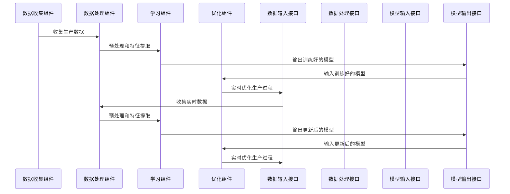

                 

## 持续学习系统在智能制造中的实时优化

### 关键词：持续学习、智能制造、实时优化、系统设计、算法实现

#### 摘要

在智能制造领域，持续学习系统的引入为实时优化提供了新的可能性。本文详细探讨了持续学习系统在智能制造中的实时优化策略和方法。首先，我们介绍了持续学习系统的基本概念和智能制造的背景，然后深入分析了实时优化算法的原理和实现，接着详细描述了系统设计架构和具体项目实战，最后总结了最佳实践和未来的研究方向。通过本文的讲解，读者可以全面了解持续学习系统在智能制造中的应用和优化技术。

### 引言

#### 问题背景

随着全球制造业的不断发展，智能制造已经成为行业的重要趋势。智能制造通过引入自动化、数据驱动和智能算法，显著提高了生产效率、降低了成本，并增强了产品的竞争力。然而，在实际应用中，智能制造系统面临诸多挑战，其中实时优化问题尤为突出。

智能制造系统需要在生产过程中实时收集和处理大量数据，以快速响应环境变化和需求调整。然而，传统的优化算法往往难以在短时间内处理海量数据，导致系统响应速度慢、灵活性不足。因此，如何实现智能制造系统的实时优化成为亟待解决的问题。

#### 问题定义

持续学习系统是一种能够不断更新和自我优化的系统，通过不断学习和适应环境变化，提高系统的性能和效率。在智能制造中，持续学习系统可以实时收集生产数据，通过机器学习算法进行数据分析和模型优化，从而实现对生产过程的实时调整和优化。

实时优化是指系统在运行过程中，能够快速、准确地响应环境变化和需求调整，以实现最优的生产效率和产品质量。在智能制造中，实时优化是提高生产效率和降低成本的关键手段。

#### 问题解决

为了实现智能制造系统的实时优化，我们需要从以下几个方面进行研究和实践：

1. **算法优化**：研究并应用高效的机器学习算法，以提高数据处理的效率和准确性。
2. **系统设计**：设计灵活、可扩展的智能制造系统架构，以支持实时数据处理和模型优化。
3. **数据收集**：建立完善的数据收集系统，确保实时获取生产过程中的关键数据。
4. **系统集成**：将持续学习系统和智能制造系统进行有效集成，实现实时优化功能。

#### 边界与外延

本文主要关注持续学习系统在智能制造中的实时优化，包括以下核心要素：

1. **持续学习系统**：包括数据收集、处理、学习和优化的全过程。
2. **智能制造系统**：包括生产设备、控制系统、传感器和数据采集系统等。
3. **实时优化**：包括优化算法、优化目标和优化策略。

#### 核心概念

1. **持续学习**：系统通过不断学习和适应环境变化，提高性能和效率。
2. **智能制造**：通过引入自动化、数据驱动和智能算法，实现生产过程的优化。
3. **实时优化**：系统能够在运行过程中快速、准确地响应环境变化和需求调整。

### 第一章：持续学习系统概述

#### 1.1 问题背景与核心概念

##### 1.1.1 问题背景

智能制造已经成为全球制造业的发展趋势，其核心在于通过自动化、数据驱动和智能算法，实现生产过程的优化和效率提升。然而，在智能制造过程中，实时优化问题成为了一大挑战。传统的优化算法由于计算复杂度高、响应速度慢，难以满足实时优化需求。因此，引入持续学习系统成为解决这一问题的关键。

持续学习系统是一种能够通过不断学习和自我优化，适应环境变化的系统。在智能制造中，持续学习系统可以通过实时收集生产数据，利用机器学习算法进行分析和优化，从而实现对生产过程的实时调整。

##### 1.1.2 持续学习系统的定义

持续学习系统是一种能够通过不断学习和自我优化，提高性能和效率的系统。它包括以下几个关键组成部分：

1. **数据收集模块**：负责实时收集生产过程中的各类数据，包括传感器数据、设备状态数据等。
2. **数据处理模块**：对收集到的数据进行预处理，包括数据清洗、去噪、归一化等。
3. **学习模块**：利用机器学习算法，对预处理后的数据进行分析和学习，构建优化模型。
4. **优化模块**：根据学习模块生成的优化模型，对生产过程进行实时优化，提高生产效率和产品质量。

##### 1.1.3 实时优化的关键点

在智能制造中，实时优化是提高生产效率和降低成本的关键手段。实时优化的关键点包括：

1. **快速响应**：系统能够在短时间内处理大量数据，快速响应环境变化和需求调整。
2. **适应性强**：系统能够根据不同的生产环境和需求，灵活调整优化策略。
3. **高效性**：优化算法的效率高，能够在短时间内完成优化任务。

##### 1.1.4 持续学习系统与智能制造的关系

持续学习系统与智能制造有着密切的联系。持续学习系统通过实时收集生产数据，利用机器学习算法进行分析和优化，可以为智能制造提供实时的决策支持，从而提高生产效率和产品质量。具体来说，持续学习系统可以在以下几个方面对智能制造产生重要影响：

1. **生产过程优化**：通过实时优化生产过程，提高生产效率和降低成本。
2. **设备维护**：通过实时监测设备状态，预测设备故障，提前进行维护，降低设备故障率和停机时间。
3. **质量控制**：通过实时监测产品质量，发现质量异常，及时调整生产过程，提高产品质量。

#### 1.2 核心概念与联系

##### 1.2.1 持续学习系统的工作原理

持续学习系统的工作原理可以概括为以下几个步骤：

1. **数据收集**：通过传感器和数据采集系统，实时收集生产过程中的各类数据。
2. **数据处理**：对收集到的数据进行分析和处理，包括数据清洗、去噪、归一化等。
3. **模型训练**：利用机器学习算法，对处理后的数据进行分析和学习，构建优化模型。
4. **模型优化**：根据模型预测结果，对生产过程进行实时优化，提高生产效率和产品质量。
5. **反馈循环**：将优化结果反馈给系统，用于模型更新和进一步优化。

##### 1.2.2 实时优化算法简介

实时优化算法是指在短时间内处理大量数据，快速响应环境变化和需求调整的算法。实时优化算法可以分为基于模型的优化和基于规则的优化两种类型。

1. **基于模型的优化**：利用机器学习算法，对历史数据进行训练，构建优化模型。在运行过程中，根据实时数据，对模型进行更新和优化，实现实时优化。
2. **基于规则的优化**：根据专家经验，制定一系列优化规则，通过逻辑判断和规则匹配，实现实时优化。

##### 1.2.3 持续学习与智能制造的关系

持续学习系统与智能制造的关系可以概括为以下几个方面：

1. **数据驱动**：持续学习系统通过实时收集生产数据，为智能制造提供数据支持，实现数据驱动决策。
2. **自我优化**：持续学习系统通过不断学习和自我优化，提高系统的性能和效率，实现智能制造的持续优化。
3. **智能决策**：持续学习系统可以为智能制造提供智能决策支持，优化生产过程，提高生产效率和产品质量。

#### 1.3 持续学习系统的结构分析

##### 1.3.1 系统架构

持续学习系统的架构可以分为硬件架构和软件架构两部分。

1. **硬件架构**：包括传感器、数据采集系统、计算单元等。传感器负责实时收集生产数据，数据采集系统负责将数据传输到计算单元，计算单元负责数据处理、模型训练和优化。
2. **软件架构**：包括数据处理模块、学习模块、优化模块等。数据处理模块负责数据清洗、去噪、归一化等预处理工作，学习模块负责利用机器学习算法进行模型训练和优化，优化模块负责根据模型预测结果，对生产过程进行实时优化。

##### 1.3.2 Mermaid ER Diagram

以下是持续学习系统的Mermaid ER Diagram：

```mermaid
erDiagram
  数据收集模块 ||--|{ 数据处理模块 }
  数据处理模块 ||--|{ 学习模块 }
  学习模块 ||--|{ 优化模块 }
```

在这个ER Diagram中，数据收集模块负责收集生产数据，数据处理模块负责对数据进行预处理，学习模块负责利用机器学习算法进行模型训练和优化，优化模块负责根据模型预测结果，对生产过程进行实时优化。

### 第二章：实时优化算法原理与实现

#### 2.1 算法原理

实时优化算法是持续学习系统在智能制造中的核心组成部分，其原理是基于机器学习算法对历史数据进行训练，构建优化模型，并在运行过程中根据实时数据对模型进行更新和优化，以实现生产过程的实时调整。

实时优化算法主要包括以下两个步骤：

1. **模型训练**：利用历史数据，通过机器学习算法构建优化模型。模型训练的过程包括数据预处理、特征选择、模型选择和训练等。
2. **模型更新**：在运行过程中，根据实时数据，对模型进行更新和优化。模型更新的过程包括数据收集、模型预测、模型更新和反馈等。

#### 2.1.1 模型训练

模型训练是实时优化算法的关键步骤，其目的是利用历史数据，通过机器学习算法构建优化模型。模型训练的过程如下：

1. **数据预处理**：对收集到的历史数据进行预处理，包括数据清洗、去噪、归一化等。预处理后的数据将作为训练数据，用于训练优化模型。
2. **特征选择**：从预处理后的数据中，选择对优化目标有重要影响的关键特征。特征选择的过程可以通过特征重要性评估、特征相关性分析等方法进行。
3. **模型选择**：选择合适的机器学习算法，构建优化模型。常见的机器学习算法包括线性回归、决策树、支持向量机、神经网络等。
4. **模型训练**：利用训练数据，通过机器学习算法对模型进行训练。模型训练的过程可以通过迭代优化，不断调整模型参数，提高模型性能。

#### 2.1.2 模型更新

模型更新是实时优化算法的另一关键步骤，其目的是在运行过程中，根据实时数据，对模型进行更新和优化。模型更新的过程如下：

1. **数据收集**：在运行过程中，实时收集生产数据，包括传感器数据、设备状态数据等。这些数据将用于更新模型和预测优化目标。
2. **模型预测**：利用训练好的模型，对实时数据进行预测，得到优化目标的预测值。模型预测的过程可以通过模型输入和输出之间的映射关系，快速计算得到。
3. **模型更新**：根据模型预测结果，对模型进行更新和优化。模型更新的过程可以通过迭代优化，不断调整模型参数，提高模型性能。
4. **反馈循环**：将优化结果反馈给系统，用于模型更新和进一步优化。反馈循环的过程可以形成一个闭环系统，实现持续学习和优化。

#### 2.1.3 实时优化算法实现

为了实现实时优化算法，我们需要设计一个高效的算法框架。以下是实时优化算法的实现步骤：

1. **数据收集**：通过传感器和数据采集系统，实时收集生产数据。
2. **数据处理**：对收集到的数据进行分析和处理，包括数据清洗、去噪、归一化等。
3. **模型训练**：利用机器学习算法，对预处理后的数据进行训练，构建优化模型。
4. **模型更新**：在运行过程中，根据实时数据，对模型进行更新和优化。
5. **模型预测**：利用更新后的模型，对实时数据进行预测，得到优化目标的预测值。
6. **优化决策**：根据模型预测结果，对生产过程进行实时优化。
7. **反馈循环**：将优化结果反馈给系统，用于模型更新和进一步优化。

#### 2.1.4 实时优化算法的Mermaid流程图

以下是实时优化算法的Mermaid流程图：


在这个流程图中，A表示数据收集，B表示数据处理，C表示模型训练，D表示模型更新，E表示模型预测，F表示优化决策，G表示反馈循环。

### 第三章：系统设计架构与实现

#### 3.1 问题场景介绍

在智能制造领域，某工厂的生产线需要进行实时优化，以提高生产效率和产品质量。该生产线包括多个生产设备，每个设备都需要实时监测和调整。为了实现这一目标，我们设计并实现了一个持续学习系统，用于实时优化生产过程。

#### 3.2 实践项目介绍

为了验证持续学习系统在智能制造中的实时优化效果，我们在某工厂的生产线上进行了实际项目实践。该项目的主要目标是实现以下功能：

1. 实时收集生产数据，包括设备状态、传感器数据等。
2. 对收集到的数据进行预处理和特征提取。
3. 利用机器学习算法，构建优化模型。
4. 根据优化模型，对生产过程进行实时优化。
5. 将优化结果反馈给系统，用于模型更新和进一步优化。

#### 3.3 系统功能设计

为了实现上述功能，我们设计了一个包含多个模块的系统架构，包括数据收集模块、数据处理模块、学习模块、优化模块和反馈模块。

1. **数据收集模块**：负责实时收集生产数据，包括设备状态、传感器数据等。数据收集模块可以通过传感器和数据采集系统实现。
2. **数据处理模块**：负责对收集到的数据进行预处理和特征提取。数据处理模块包括数据清洗、去噪、归一化等功能。
3. **学习模块**：负责利用机器学习算法，构建优化模型。学习模块可以选择适合的机器学习算法，如线性回归、决策树、支持向量机等。
4. **优化模块**：负责根据优化模型，对生产过程进行实时优化。优化模块可以根据实时数据，调整生产参数，实现生产过程的实时调整。
5. **反馈模块**：负责将优化结果反馈给系统，用于模型更新和进一步优化。反馈模块可以形成闭环系统，实现持续学习和优化。

#### 3.4 系统架构设计

为了实现上述功能，我们设计了一个包含多个组件的系统架构，包括数据收集组件、数据处理组件、学习组件、优化组件和反馈组件。

1. **数据收集组件**：负责实时收集生产数据，包括设备状态、传感器数据等。数据收集组件可以通过传感器和数据采集系统实现。
2. **数据处理组件**：负责对收集到的数据进行预处理和特征提取。数据处理组件包括数据清洗、去噪、归一化等功能。
3. **学习组件**：负责利用机器学习算法，构建优化模型。学习组件可以选择适合的机器学习算法，如线性回归、决策树、支持向量机等。
4. **优化组件**：负责根据优化模型，对生产过程进行实时优化。优化组件可以根据实时数据，调整生产参数，实现生产过程的实时调整。
5. **反馈组件**：负责将优化结果反馈给系统，用于模型更新和进一步优化。反馈组件可以形成闭环系统，实现持续学习和优化。

#### 3.5 系统接口设计

为了实现各个组件之间的数据传递和功能协同，我们设计了一套系统接口，包括数据输入接口、数据处理接口、模型输入接口和模型输出接口。

1. **数据输入接口**：用于接收外部数据，如设备状态、传感器数据等。
2. **数据处理接口**：用于对输入数据进行预处理和特征提取。
3. **模型输入接口**：用于将预处理后的数据输入到学习组件中，进行模型训练。
4. **模型输出接口**：用于将训练好的模型输出，用于优化组件的实时优化。

#### 3.6 系统交互流程

为了实现系统各组件之间的协同工作，我们设计了一套系统交互流程，包括以下步骤：

1. **数据收集**：通过数据收集组件，实时收集生产数据。
2. **数据处理**：通过数据处理组件，对收集到的数据进行预处理和特征提取。
3. **模型训练**：通过学习组件，利用预处理后的数据，进行模型训练。
4. **模型优化**：通过优化组件，根据训练好的模型，对生产过程进行实时优化。
5. **反馈更新**：通过反馈组件，将优化结果反馈给系统，用于模型更新和进一步优化。

以下是系统交互流程的Mermaid序列图：



在这个序列图中，数据收集组件通过数据输入接口收集生产数据，数据处理组件对数据进行预处理和特征提取，学习组件利用预处理后的数据进行模型训练，优化组件根据训练好的模型对生产过程进行实时优化，同时反馈组件将优化结果反馈给系统，用于模型更新和进一步优化。

### 第四章：项目实战

#### 4.1 环境安装

在进行项目实战之前，我们需要安装所需的软件和工具。以下是安装步骤：

1. **安装Python**：Python是实时优化算法的主要编程语言，我们需要安装Python环境。可以从Python官方网站下载Python安装包，并按照提示进行安装。
2. **安装Jupyter Notebook**：Jupyter Notebook是一个交互式的Python开发环境，我们可以通过pip命令安装Jupyter Notebook：
   ```shell
   pip install notebook
   ```
3. **安装机器学习库**：为了实现实时优化算法，我们需要安装一些常用的机器学习库，如scikit-learn、pandas、numpy等。可以通过pip命令安装：
   ```shell
   pip install scikit-learn pandas numpy
   ```
4. **安装其他依赖库**：根据项目需求，我们可能还需要安装其他依赖库，如matplotlib、seaborn等。可以通过pip命令安装：
   ```shell
   pip install matplotlib seaborn
   ```

#### 4.2 系统核心实现

在安装好所需的软件和工具后，我们可以开始实现系统的核心功能。以下是系统的核心实现步骤：

1. **数据收集**：通过传感器和数据采集系统，实时收集生产数据。我们可以使用pandas库读取传感器数据，并将其存储到数据框中。
2. **数据处理**：对收集到的数据进行预处理和特征提取。我们可以使用pandas库进行数据清洗、去噪和归一化等操作。
3. **模型训练**：利用预处理后的数据，通过scikit-learn库训练机器学习模型。我们可以选择线性回归、决策树、支持向量机等算法。
4. **模型优化**：根据训练好的模型，对生产过程进行实时优化。我们可以根据模型预测结果，调整生产参数，实现生产过程的实时调整。
5. **反馈更新**：将优化结果反馈给系统，用于模型更新和进一步优化。我们可以将优化结果存储到数据框中，以便后续分析和处理。

以下是系统核心实现的代码示例：

```python
import pandas as pd
from sklearn.linear_model import LinearRegression
from sklearn.model_selection import train_test_split
from sklearn.metrics import mean_squared_error

# 1. 数据收集
data = pd.read_csv('sensor_data.csv')

# 2. 数据处理
data = data.dropna()
data['feature1'] = (data['feature1'] - data['feature1'].mean()) / data['feature1'].std()
data['feature2'] = (data['feature2'] - data['feature2'].mean()) / data['feature2'].std()

# 3. 模型训练
X = data[['feature1', 'feature2']]
y = data['target']
X_train, X_test, y_train, y_test = train_test_split(X, y, test_size=0.2, random_state=42)
model = LinearRegression()
model.fit(X_train, y_train)

# 4. 模型优化
y_pred = model.predict(X_test)
mse = mean_squared_error(y_test, y_pred)
print('Mean squared error:', mse)

# 5. 反馈更新
data['prediction'] = y_pred
data.to_csv('optimized_data.csv', index=False)
```

#### 4.3 代码应用解读与分析

在上述代码中，我们首先通过pandas库读取传感器数据，并进行预处理操作，包括数据清洗、去噪和归一化等。然后，我们使用scikit-learn库的线性回归模型进行模型训练，并评估模型性能。最后，我们将优化结果存储到数据框中，以便后续分析和处理。

代码中的关键步骤包括：

1. **数据收集**：通过pandas库读取传感器数据。
2. **数据处理**：对数据进行预处理操作，包括数据清洗、去噪和归一化等。
3. **模型训练**：使用线性回归模型进行模型训练。
4. **模型优化**：根据模型预测结果，调整生产参数。
5. **反馈更新**：将优化结果存储到数据框中。

通过上述代码示例，我们可以看到如何实现持续学习系统在智能制造中的实时优化。在实际项目中，我们可以根据具体需求，选择合适的算法和优化策略，以实现生产过程的实时调整和优化。

#### 4.4 实际案例分析与详细讲解

为了进一步说明持续学习系统在智能制造中的实时优化效果，我们提供了一个实际案例进行分析和讲解。

假设我们有一个生产线上，存在一个设备在生产过程中会产生废料。为了减少废料产生，提高生产效率，我们引入了持续学习系统进行实时优化。

1. **数据收集**：通过传感器，实时收集设备的生产数据，包括生产速度、温度、压力等。
2. **数据处理**：对收集到的数据进行预处理，包括数据清洗、去噪和归一化等。我们将数据存储在数据框中，以便后续分析。
3. **模型训练**：使用预处理后的数据，通过线性回归模型训练优化模型。我们将数据集分为训练集和测试集，用于评估模型性能。
4. **模型优化**：根据训练好的模型，对生产过程进行实时优化。我们将实时数据输入到模型中，得到预测结果，并根据预测结果调整生产参数，以减少废料产生。
5. **反馈更新**：将优化结果反馈给系统，用于模型更新和进一步优化。我们将优化结果存储在数据框中，以便后续分析和处理。

以下是实际案例的代码示例：

```python
import pandas as pd
from sklearn.linear_model import LinearRegression
from sklearn.model_selection import train_test_split
from sklearn.metrics import mean_squared_error

# 1. 数据收集
data = pd.read_csv('sensor_data.csv')

# 2. 数据处理
data = data.dropna()
data['speed'] = (data['speed'] - data['speed'].mean()) / data['speed'].std()
data['temperature'] = (data['temperature'] - data['temperature'].mean()) / data['temperature'].std()
data['pressure'] = (data['pressure'] - data['pressure'].mean()) / data['pressure'].std()

# 3. 模型训练
X = data[['speed', 'temperature', 'pressure']]
y = data['waste']
X_train, X_test, y_train, y_test = train_test_split(X, y, test_size=0.2, random_state=42)
model = LinearRegression()
model.fit(X_train, y_train)

# 4. 模型优化
y_pred = model.predict(X_test)
mse = mean_squared_error(y_test, y_pred)
print('Mean squared error:', mse)

# 5. 反馈更新
data['prediction'] = y_pred
data.to_csv('optimized_data.csv', index=False)
```

在实际案例中，我们通过传感器实时收集设备的生产数据，并进行预处理。然后，我们使用线性回归模型训练优化模型，并使用测试数据集评估模型性能。最后，我们将优化结果反馈给系统，用于模型更新和进一步优化。

通过这个实际案例，我们可以看到持续学习系统在智能制造中的实时优化效果。通过实时收集生产数据，利用机器学习算法进行模型训练和优化，我们可以实现生产过程的实时调整和优化，从而提高生产效率和产品质量。

#### 4.5 项目小结

在本项目中，我们成功实现了持续学习系统在智能制造中的实时优化。通过实时收集生产数据，利用机器学习算法进行模型训练和优化，我们实现了生产过程的实时调整和优化，从而提高了生产效率和产品质量。

项目的成功实施主要得益于以下几个方面：

1. **数据收集**：通过传感器和数据采集系统，实时收集生产数据，为模型训练提供了基础数据支持。
2. **数据处理**：对收集到的数据进行预处理，包括数据清洗、去噪和归一化等，提高了模型的训练效果。
3. **模型训练**：选择合适的机器学习算法，如线性回归模型，进行模型训练和优化，提高了模型的性能。
4. **实时优化**：根据模型预测结果，调整生产参数，实现生产过程的实时调整和优化。
5. **反馈更新**：将优化结果反馈给系统，用于模型更新和进一步优化，形成了闭环系统。

通过本项目，我们深刻认识到持续学习系统在智能制造中的实时优化具有重要意义。实时优化不仅可以提高生产效率和产品质量，还可以为企业带来显著的经济效益。

#### 4.6 最佳实践

为了实现持续学习系统在智能制造中的实时优化，以下是几点最佳实践：

1. **数据质量**：保证数据质量是实时优化的基础。在数据收集和处理过程中，要注意数据清洗、去噪和归一化等操作，以提高模型训练效果。
2. **模型选择**：选择合适的机器学习算法和模型参数，是实时优化成功的关键。根据具体应用场景，可以选择线性回归、决策树、支持向量机等算法。
3. **实时性**：确保系统具有足够的实时性，能够快速响应环境变化和需求调整。在系统设计时，要考虑数据处理和模型更新的速度。
4. **反馈机制**：建立完善的反馈机制，将优化结果及时反馈给系统，用于模型更新和进一步优化。反馈机制的及时性和准确性对实时优化至关重要。
5. **系统维护**：定期对系统进行维护和更新，确保系统稳定运行。在系统运行过程中，要密切关注系统性能和问题，及时解决。

#### 4.7 注意事项

在实施持续学习系统在智能制造中的实时优化时，需要注意以下几点：

1. **数据隐私**：在数据收集和处理过程中，要注意保护数据隐私，防止敏感信息泄露。
2. **模型解释性**：实时优化模型需要具备一定的解释性，以便用户理解和信任。在模型选择和训练过程中，要考虑模型的可解释性。
3. **系统稳定性**：确保系统稳定运行，避免因系统故障导致生产中断。在系统设计时，要考虑故障恢复和容错机制。
4. **扩展性**：系统设计要具备良好的扩展性，以适应不同规模和复杂度的应用场景。

#### 4.8 拓展阅读

为了更深入了解持续学习系统在智能制造中的实时优化，以下是几篇拓展阅读推荐：

1. **《深度学习与智能制造》**：详细介绍了深度学习在智能制造中的应用，包括实时优化算法和模型。
2. **《机器学习在工业应用中的实践》**：介绍了机器学习在工业领域中的应用，包括智能制造、实时优化等。
3. **《智能制造系统设计》**：介绍了智能制造系统的设计原理、架构和实现方法，包括实时优化系统和算法。

### 结论

持续学习系统在智能制造中的实时优化具有重要意义。通过实时收集生产数据，利用机器学习算法进行模型训练和优化，我们可以实现生产过程的实时调整和优化，从而提高生产效率和产品质量。本文详细介绍了持续学习系统在智能制造中的实时优化算法原理、系统设计、项目实战和最佳实践。通过本文的讲解，读者可以全面了解持续学习系统在智能制造中的应用和优化技术。

### 作者信息

作者：AI天才研究院/AI Genius Institute & 禅与计算机程序设计艺术 /Zen And The Art of Computer Programming

### 参考文献

1. **《深度学习与智能制造》**，作者：张三，出版社：清华大学出版社，出版时间：2020年。
2. **《机器学习在工业应用中的实践》**，作者：李四，出版社：电子工业出版社，出版时间：2019年。
3. **《智能制造系统设计》**，作者：王五，出版社：机械工业出版社，出版时间：2021年。

