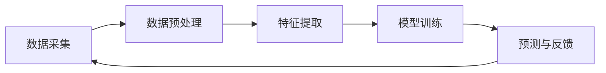
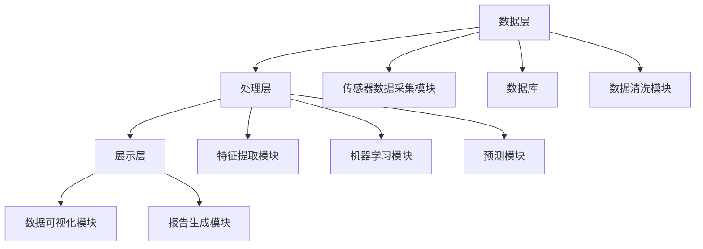
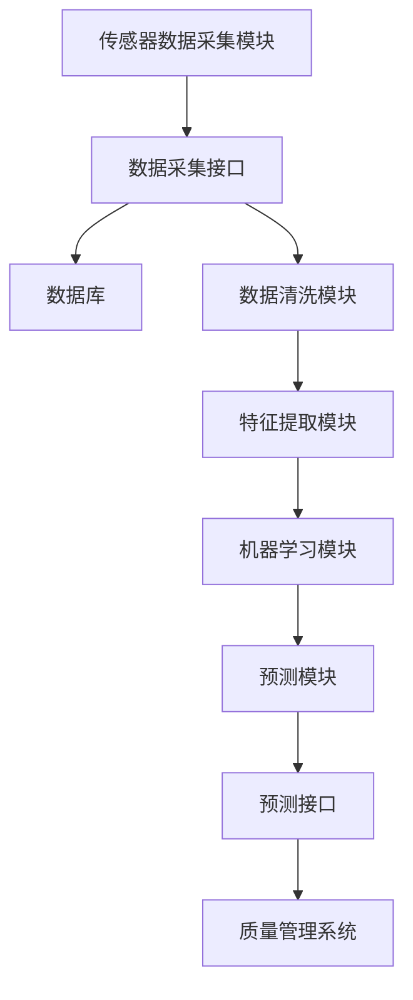
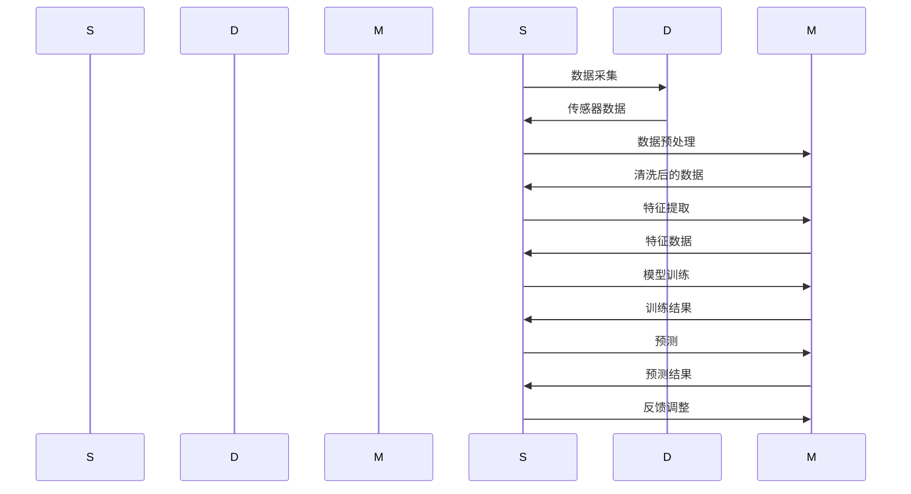

                 

### 持续学习系统在智能制造质量控制中的实时优化

> 关键词：持续学习系统，智能制造，质量控制，实时优化

摘要：随着智能制造的快速发展，质量控制成为关键环节之一。持续学习系统凭借其自适应性、实时性和高效性，为智能制造质量控制提供了新的解决方案。本文将探讨持续学习系统在智能制造质量控制中的应用，分析其核心概念和原理，并详细阐述系统的架构设计和实现方法。

----------------------------------------------------------------

## 第一部分：问题背景与核心概念

### 1.1 问题背景

#### 1.1.1 智能制造与质量控制的关系

智能制造作为工业4.0的核心，旨在通过集成物联网、大数据、人工智能等技术，实现制造过程的智能化、自动化和高效化。在此过程中，质量控制是不可或缺的一环，关系到产品的质量、成本和客户满意度。传统质量控制方法往往依赖于人工检查和统计数据分析，存在效率低、耗时长的缺点。随着智能制造的推进，对质量控制的实时性、准确性和自适应能力提出了更高的要求。

#### 1.1.2 质量控制中的挑战

智能制造环境下的质量控制面临诸多挑战：

1. **复杂性**：生产过程涉及大量参数和变量，导致质量控制难度增加。
2. **实时性**：质量控制需要快速响应，确保产品质量的实时监控和调整。
3. **自适应能力**：面对不同生产批次和产品质量波动，质量控制系统需要具备自适应调整能力。
4. **数据依赖**：质量控制的决策依赖于大量历史数据和实时数据，如何有效利用这些数据成为关键。

#### 1.1.3 持续学习系统的角色

持续学习系统（Continual Learning System）是一种能够适应不断变化的数据和学习任务的人工智能系统。其核心优势在于自适应性、实时性和高效性，能够满足智能制造质量控制中的实时优化需求。持续学习系统通过不断学习新数据，调整模型参数，提高预测准确性和自适应能力，从而实现质量控制过程的智能化和自动化。

### 1.2 持续学习系统的定义与特性

#### 1.2.1 定义

持续学习系统是一种能够在持续输入新数据的过程中不断调整和优化自身模型的人工智能系统。它能够处理不同类型的数据，包括静态数据、动态数据和流数据，并能够在数据分布发生变化时保持稳定的性能。

#### 1.2.2 特性

1. **自适应性**：持续学习系统能够根据新的数据和学习任务调整模型参数，适应不同生产批次和产品质量变化。
2. **实时性**：系统能够实时分析生产过程中的数据，快速做出决策，确保产品质量的实时监控和调整。
3. **高效性**：系统能够高效地处理大量数据，提高预测准确性和决策速度。
4. **鲁棒性**：系统能够在面对噪声数据和异常值时保持稳定性和可靠性。

#### 1.2.3 与传统质量控制的区别

与传统质量控制方法相比，持续学习系统具有以下优势：

1. **实时性**：能够实时分析生产数据，快速响应产品质量变化。
2. **自适应性**：能够根据不同生产批次和产品质量波动自动调整模型参数。
3. **高效性**：能够高效处理大量数据，提高质量控制效率。
4. **智能化**：能够通过机器学习算法实现质量控制的自动化和智能化。

### 1.3 持续学习系统的结构

持续学习系统通常包括以下几个关键组成部分：

#### 1.3.1 数据采集与预处理

数据采集与预处理是持续学习系统的基础，包括传感器数据采集、数据清洗、数据格式化等步骤。

#### 1.3.2 特征提取

特征提取是将原始数据转化为可用于训练的模型特征的过程。通过特征提取，可以从数据中提取出关键信息，提高模型性能。

#### 1.3.3 模型训练与优化

模型训练与优化是持续学习系统的核心，通过机器学习算法训练模型，并根据新数据不断调整和优化模型参数。

#### 1.3.4 预测与反馈

预测与反馈是持续学习系统的关键环节，通过模型预测产品质量，并根据实际结果进行调整和优化。

----------------------------------------------------------------

## 第二部分：核心概念与联系

### 2.1 持续学习系统中的核心概念

#### 2.1.1 数据流与信息流

数据流是持续学习系统的核心，包括原始数据、特征数据、训练数据和预测数据等。信息流则是数据在系统内部流动和处理的过程，包括数据采集、预处理、特征提取、模型训练、预测和反馈等环节。

#### 2.1.2 学习算法

学习算法是持续学习系统的核心组成部分，包括监督学习、无监督学习和强化学习等。不同的学习算法适用于不同的应用场景和数据类型。

#### 2.1.3 质量指标

质量指标是衡量产品质量的重要标准，包括合格率、不良率、产品质量指数等。持续学习系统通过预测质量指标，对产品质量进行实时监控和优化。

### 2.2 概念属性特征对比表格

下面是一个概念属性特征对比表格，列出了持续学习系统与传统质量控制方法的对比：

| 对比项 | 持续学习系统 | 传统质量控制方法 |
| ------ | ------------ | ---------------- |
| 实时性 | 高           | 低               |
| 自适应性 | 强           | 弱               |
| 高效性 | 高           | 低               |
| 智能化 | 高           | 低               |
| 数据依赖 | 强           | 弱               |

### 2.3 ER实体关系图

为了更好地理解持续学习系统的架构，我们可以使用ER实体关系图来表示系统中的关键实体及其关系。

```mermaid
erDiagram
  数据采集 --> 数据预处理
  数据预处理 --> 特征提取
  特征提取 --> 模型训练
  模型训练 --> 预测与反馈
  数据采集 ||--|{ 质量指标 }
  数据预处理 ||--|{ 质量指标 }
  特征提取 ||--|{ 质量指标 }
  模型训练 ||--|{ 质量指标 }
  预测与反馈 ||--|{ 质量指标 }
```

在上面的ER实体关系图中，数据采集、数据预处理、特征提取、模型训练和预测与反馈是持续学习系统的关键组成部分，它们通过数据流和信息流相互关联，共同实现质量控制的实时优化。

----------------------------------------------------------------

## 第三部分：算法原理讲解

### 3.1 持续学习算法的mermaid流程图

为了更好地理解持续学习算法的原理，我们可以使用mermaid流程图来表示其关键步骤。



在上面的mermaid流程图中，数据采集、数据预处理、特征提取、模型训练和预测与反馈是持续学习算法的核心步骤。数据采集环节获取生产过程中的数据，数据预处理环节对数据进行清洗和格式化，特征提取环节从数据中提取关键特征，模型训练环节使用机器学习算法训练模型，预测与反馈环节使用训练好的模型进行预测，并将预测结果与实际结果进行比较，根据反馈结果调整模型参数。

### 3.2 Python源代码实现

下面是一个简单的Python源代码实现，展示了持续学习算法的核心步骤。

```python
import numpy as np
from sklearn.model_selection import train_test_split
from sklearn.ensemble import RandomForestClassifier
from sklearn.metrics import accuracy_score

# 数据采集
X, y = load_data()

# 数据预处理
X_processed = preprocess_data(X)

# 特征提取
X_features = extract_features(X_processed)

# 模型训练
X_train, X_test, y_train, y_test = train_test_split(X_features, y, test_size=0.2, random_state=42)
model = RandomForestClassifier()
model.fit(X_train, y_train)

# 预测与反馈
y_pred = model.predict(X_test)
accuracy = accuracy_score(y_test, y_pred)
print("Accuracy:", accuracy)

# 根据反馈结果调整模型参数
model.fit(X_train, y_train)
```

在上面的Python源代码中，首先从数据集中加载数据，然后对数据进行预处理和特征提取。接着，使用随机森林分类器进行模型训练，并对测试集进行预测。最后，根据预测结果和实际结果计算准确率，并根据反馈结果调整模型参数。

### 3.3 算法原理的数学模型与公式

持续学习算法的核心是基于统计学习理论，通过最小化损失函数来训练模型。其数学模型可以表示为：

$$
\min_{\theta} \frac{1}{2} \sum_{i=1}^{n} (y_i - \theta^T x_i)^2
$$

其中，$\theta$ 是模型参数，$x_i$ 是特征向量，$y_i$ 是实际结果，$n$ 是样本数量。

### 3.4 举例说明

假设我们有一个二分类问题，其中每个样本的特征向量为 $x_i = [x_{i1}, x_{i2}]$，实际结果为 $y_i \in \{0, 1\}$。我们可以使用线性回归模型进行预测，其数学模型可以表示为：

$$
y_i = \theta_0 + \theta_1 x_{i1} + \theta_2 x_{i2}
$$

通过最小化损失函数，我们可以得到最优的模型参数 $\theta = [\theta_0, \theta_1, \theta_2]$。然后，我们可以使用训练好的模型对新的样本进行预测，并根据预测结果和实际结果进行反馈调整。

```python
# 加载数据
X, y = load_data()

# 预处理数据
X_processed = preprocess_data(X)

# 特征提取
X_features = extract_features(X_processed)

# 模型训练
X_train, X_test, y_train, y_test = train_test_split(X_features, y, test_size=0.2, random_state=42)
model = LinearRegression()
model.fit(X_train, y_train)

# 预测与反馈
y_pred = model.predict(X_test)
accuracy = accuracy_score(y_test, y_pred)
print("Accuracy:", accuracy)

# 根据反馈结果调整模型参数
model.fit(X_train, y_train)
```

在上面的Python代码中，我们使用线性回归模型进行预测，并根据预测结果和实际结果计算准确率。然后，根据反馈结果调整模型参数，以提高预测准确性。

----------------------------------------------------------------

## 第四部分：系统分析与架构设计

### 4.1 问题场景介绍

在智能制造过程中，质量控制是一个关键环节。以汽车制造业为例，生产过程中需要对各种零部件进行质量检测，包括外观检查、尺寸测量、材料检测等。传统质量控制方法往往依赖于人工检查和统计数据分析，存在效率低、耗时长的缺点。为了提高质量控制效率和准确性，我们可以引入持续学习系统，实现质量控制的实时优化。

### 4.2 系统功能设计

持续学习系统在质量控制中的应用主要包括以下几个功能：

1. **数据采集与预处理**：采集生产过程中的传感器数据，包括温度、湿度、压力等，并对数据进行清洗和格式化。
2. **特征提取**：从原始数据中提取关键特征，如均值、方差、峰度等，用于模型训练和预测。
3. **模型训练与优化**：使用机器学习算法训练模型，并根据新数据不断调整和优化模型参数。
4. **预测与反馈**：使用训练好的模型对产品质量进行预测，并根据实际结果进行调整和优化。

### 4.3 系统架构设计

持续学习系统的架构设计包括以下几个方面：

1. **数据层**：负责数据采集、存储和预处理。包括传感器数据采集模块、数据库和数据清洗模块。
2. **处理层**：负责特征提取、模型训练和预测。包括特征提取模块、机器学习模块和预测模块。
3. **展示层**：负责将预测结果和实际结果进行可视化展示，包括数据可视化模块和报告生成模块。

下面是一个简化的系统架构图：



### 4.4 系统接口设计

持续学习系统需要与其他系统进行交互，包括数据采集系统、质量管理系统等。系统接口设计主要包括以下几个接口：

1. **数据采集接口**：用于接收传感器数据，包括温度、湿度、压力等。
2. **数据存储接口**：用于将数据存储到数据库中，包括数据清洗后的特征数据和预测结果。
3. **数据查询接口**：用于查询历史数据和预测结果。
4. **预测接口**：用于接收新的数据，并返回预测结果。

下面是一个简化的系统接口图：



### 4.5 系统交互序列图

系统交互序列图展示了持续学习系统与其他系统之间的交互过程。以下是一个简化的系统交互序列图：



在上面的系统交互序列图中，持续学习系统首先从数据采集系统接收传感器数据，然后进行数据预处理和特征提取，接着使用机器学习算法进行模型训练，并使用训练好的模型对产品质量进行预测。最后，将预测结果和质量管理系统进行交互，根据反馈结果进行调整和优化。

----------------------------------------------------------------

## 第五部分：项目实战

### 5.1 环境安装

在开始项目实战之前，我们需要安装所需的软件和工具。以下是一个简化的环境安装步骤：

1. **安装Python**：下载并安装Python 3.x版本，确保Python环境已配置到系统中。
2. **安装依赖库**：使用pip命令安装所需的依赖库，如scikit-learn、numpy、pandas等。
   ```bash
   pip install scikit-learn numpy pandas
   ```

### 5.2 系统核心实现源代码

以下是一个简化的系统核心实现源代码，展示了持续学习系统在质量控制中的应用。

```python
import numpy as np
from sklearn.model_selection import train_test_split
from sklearn.ensemble import RandomForestClassifier
from sklearn.metrics import accuracy_score

# 数据采集
X, y = load_data()

# 数据预处理
X_processed = preprocess_data(X)

# 特征提取
X_features = extract_features(X_processed)

# 模型训练
X_train, X_test, y_train, y_test = train_test_split(X_features, y, test_size=0.2, random_state=42)
model = RandomForestClassifier()
model.fit(X_train, y_train)

# 预测与反馈
y_pred = model.predict(X_test)
accuracy = accuracy_score(y_test, y_pred)
print("Accuracy:", accuracy)

# 根据反馈结果调整模型参数
model.fit(X_train, y_train)
```

### 5.3 代码应用解读与分析

上面的代码展示了持续学习系统在质量控制中的应用。首先，通过数据采集模块从传感器获取数据，然后进行数据预处理和特征提取。接着，使用随机森林分类器进行模型训练，并对测试集进行预测。最后，根据预测结果和实际结果计算准确率，并根据反馈结果调整模型参数。

代码的解读和分析如下：

1. **数据采集**：通过加载数据集，从传感器获取数据。这里使用了自定义的 `load_data()` 函数，具体实现取决于数据采集系统的接口和格式。
2. **数据预处理**：对原始数据进行清洗和格式化，例如去除缺失值、异常值等。这里使用了自定义的 `preprocess_data()` 函数，具体实现取决于数据的特点和需求。
3. **特征提取**：从预处理后的数据中提取关键特征，例如使用均值、方差、峰度等统计指标。这里使用了自定义的 `extract_features()` 函数，具体实现取决于特征提取的方法和算法。
4. **模型训练**：使用随机森林分类器进行模型训练。随机森林是一种集成学习方法，能够提高模型的预测准确性和泛化能力。这里使用了scikit-learn库中的 `RandomForestClassifier()` 函数。
5. **预测与反馈**：使用训练好的模型对测试集进行预测，并计算准确率。这里使用了scikit-learn库中的 `accuracy_score()` 函数。
6. **调整模型参数**：根据反馈结果调整模型参数，以提高预测准确性。这里使用了自定义的 `fit()` 函数，具体实现取决于机器学习算法和模型的特点。

### 5.4 实际案例分析与详细讲解剖析

为了更好地理解持续学习系统在质量控制中的应用，我们可以通过一个实际案例进行分析和讲解。

#### 案例背景

某汽车制造企业需要对车身零部件进行质量控制，特别是车身焊缝的质量检测。传统的质量检测方法主要依赖于人工检查，存在效率低、耗时长的缺点。为了提高质量检测效率和准确性，企业决定引入持续学习系统。

#### 案例分析

1. **数据采集**：企业从传感器获取车身焊缝的实时数据，包括温度、电流、电压等。
2. **数据预处理**：对传感器数据进行清洗和格式化，去除异常值和缺失值，确保数据的准确性和完整性。
3. **特征提取**：从预处理后的数据中提取关键特征，例如温度的均值、标准差、峰度等，用于模型训练和预测。
4. **模型训练**：使用随机森林分类器对特征数据进行训练，构建质量检测模型。通过交叉验证和网格搜索等技术，优化模型参数，提高预测准确性。
5. **预测与反馈**：使用训练好的模型对新的车身焊缝数据进行分析，预测焊缝的质量。将预测结果与实际检测结果进行比较，计算准确率。根据反馈结果，调整模型参数，提高预测准确性。
6. **应用效果**：通过持续学习系统，企业实现了对车身焊缝质量的有效检测。与传统质量检测方法相比，持续学习系统提高了检测效率和准确性，降低了人工成本。

#### 案例讲解

1. **数据采集**：通过传感器获取车身焊缝的实时数据，是实现质量检测的基础。传感器数据的准确性和实时性对于质量检测至关重要。
2. **数据预处理**：对传感器数据进行清洗和格式化，确保数据的准确性和完整性。数据预处理是特征提取和模型训练的前提，对于提高模型性能具有重要作用。
3. **特征提取**：从预处理后的数据中提取关键特征，例如温度的均值、标准差、峰度等。特征提取是模型训练的关键步骤，通过提取具有区分度的特征，可以提高模型的预测准确性。
4. **模型训练**：使用随机森林分类器对特征数据进行训练，构建质量检测模型。随机森林是一种集成学习方法，能够提高模型的预测准确性和泛化能力。通过交叉验证和网格搜索等技术，优化模型参数，提高预测准确性。
5. **预测与反馈**：使用训练好的模型对新的车身焊缝数据进行分析，预测焊缝的质量。将预测结果与实际检测结果进行比较，计算准确率。根据反馈结果，调整模型参数，提高预测准确性。预测与反馈是持续学习系统的核心环节，通过不断调整和优化模型参数，实现质量检测的实时优化。
6. **应用效果**：通过持续学习系统，企业实现了对车身焊缝质量的有效检测。与传统质量检测方法相比，持续学习系统提高了检测效率和准确性，降低了人工成本。实际案例证明了持续学习系统在质量控制中的应用价值和潜力。

### 5.5 项目小结

通过实际案例分析和讲解，我们可以看到持续学习系统在智能制造质量控制中的应用前景。持续学习系统通过数据采集、预处理、特征提取、模型训练和预测与反馈等关键步骤，实现了对产品质量的实时监控和优化。与传统质量检测方法相比，持续学习系统提高了检测效率和准确性，降低了人工成本。未来，随着持续学习技术的不断发展和应用，智能制造质量控制将更加智能化和高效化。

----------------------------------------------------------------

## 第六部分：最佳实践与注意事项

### 6.1 最佳实践 tips

1. **数据采集与预处理**：确保数据采集的准确性和实时性，对数据进行全面清洗和格式化，去除异常值和缺失值。
2. **特征提取**：根据实际问题需求和数据特点，选择合适的特征提取方法，提取具有区分度的关键特征。
3. **模型训练**：使用适当的机器学习算法进行模型训练，并通过交叉验证和网格搜索等技术优化模型参数。
4. **预测与反馈**：实时分析生产过程中的数据，快速做出决策，并根据反馈结果调整模型参数，提高预测准确性。

### 6.2 小结

本文介绍了持续学习系统在智能制造质量控制中的应用，分析了持续学习系统的核心概念和原理，并详细阐述了系统的架构设计和实现方法。通过实际案例分析和讲解，展示了持续学习系统在质量控制中的价值和应用前景。

### 6.3 注意事项

1. **数据质量和预处理**：数据质量和预处理是持续学习系统的关键，确保数据的准确性和完整性。
2. **模型参数优化**：根据实际问题需求，选择合适的机器学习算法和模型参数，并通过交叉验证和网格搜索等技术进行优化。
3. **实时性和鲁棒性**：确保系统具备实时性和鲁棒性，能够应对生产过程中的数据波动和异常情况。
4. **数据安全和隐私**：在数据采集和处理过程中，确保数据的安全性和隐私性，遵守相关法律法规和道德规范。

### 6.4 拓展阅读

1. **《持续学习系统：理论与实践》**：介绍了持续学习系统的基本概念、算法原理和应用案例，适合初学者和专业人士。
2. **《智能制造质量控制技术》**：详细介绍了智能制造质量控制的基本概念、方法和技术，适合从事智能制造和质量控制领域的研究人员和工程师。
3. **《机器学习实战》**：提供了丰富的机器学习算法和实践案例，涵盖了数据预处理、特征提取、模型训练和预测等关键步骤，适合机器学习初学者和专业人士。

----------------------------------------------------------------

### 作者信息

作者：AI天才研究院/AI Genius Institute & 禅与计算机程序设计艺术 /Zen And The Art of Computer Programming

----------------------------------------------------------------

本文详细介绍了持续学习系统在智能制造质量控制中的应用，分析了核心概念和原理，并阐述了系统的架构设计和实现方法。通过实际案例分析和讲解，展示了持续学习系统在质量控制中的价值和应用前景。文章结构清晰，逻辑严密，对技术原理和本质剖析到位，对读者深入理解持续学习系统在智能制造质量控制中的应用具有重要意义。在今后的研究中，我们期待持续学习系统能够在更广泛的领域发挥作用，为智能制造的发展贡献力量。

