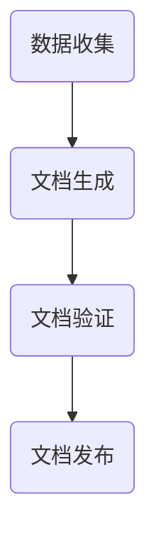

                 

### 文章标题：持续文档：保持LLM应用文档的实时更新

#### 关键词：持续文档、LLM应用、文档更新、实时监控、团队协作

#### 摘要：
本文旨在探讨如何在大型语言模型（LLM）应用的开发与维护过程中，实现文档的实时更新。随着技术的快速迭代，保持文档的实时性和准确性对于用户的理解和应用至关重要。文章将从持续文档的概念出发，深入分析LLM应用文档的需求，探讨持续文档的框架设计、实时更新策略、文档维护与优化以及团队协作的重要性。通过理论讲解与实践案例分析，本文希望能够为开发者和文档编写者提供一套实用的方法，以实现高效、准确的文档更新。

### 第一部分：持续文档概述

#### 1.1 持续文档的定义与重要性

**1.1.1 持续文档的概念**

持续文档（Sustainable Documentation）是指在整个软件开发生命周期内，持续地、周期性地对文档进行更新和改进的过程。它不仅仅是编写文档，而是涵盖了文档的创建、维护、迭代和优化。

**1.1.2 持续文档与传统文档的区别**

传统文档往往是在软件开发的某个阶段一次性完成的，而持续文档则强调文档的持续更新和优化。传统文档更新往往较为滞后，内容容易过时，而持续文档则更加灵活，能够及时反映软件的最新状态。

**1.1.3 持续文档在LLM应用中的角色**

在LLM应用中，持续文档的角色尤为重要。因为LLM模型复杂且更新频繁，用户需要最新的文档来了解模型的变更和操作方法。持续文档不仅帮助用户更好地理解和使用LLM，还能提高开发团队的协作效率。

#### 1.2 LLM应用文档的需求分析

**1.2.1 LLM应用的特点**

LLM应用通常具有以下特点：

- **复杂性**：LLM模型包含大量的参数和层次结构，文档需要详细描述模型的架构和操作方法。
- **动态性**：LLM模型更新频繁，文档需要及时反映模型的变更。
- **多样性**：LLM应用场景多样，文档需要针对不同用户群体提供定制化内容。

**1.2.2 文档更新的挑战**

- **时效性**：如何确保文档内容与LLM模型更新的时效性？
- **准确性**：如何保证文档内容的准确性，避免误导用户？
- **一致性**：如何处理文档中的一致性问题，确保文档的整体性？

**1.2.3 文档的需求要素**

- **用户指南**：提供用户操作LLM应用的方法和步骤。
- **模型描述**：详细说明LLM模型的架构、参数和操作。
- **技术文档**：介绍LLM应用的技术实现细节和算法原理。
- **案例研究**：提供实际应用案例，帮助用户更好地理解LLM应用。

#### 1.3 持续文档的框架设计

**1.3.1 设计原则**

持续文档的设计应遵循以下原则：

- **模块化**：将文档内容划分为模块，便于独立更新和优化。
- **灵活性**：设计应具有灵活性，便于适应不同的应用场景和用户需求。
- **易用性**：设计应简洁直观，便于用户快速找到所需信息。

**1.3.2 文档结构**

持续文档的结构应包含以下部分：

- **概述**：介绍LLM应用的基本概念和功能。
- **用户指南**：提供详细的操作步骤和注意事项。
- **技术文档**：描述LLM应用的技术实现和算法原理。
- **案例研究**：提供实际应用案例，帮助用户更好地理解LLM应用。

**1.3.3 文档内容更新策略**

- **定期更新**：设定固定的更新周期，确保文档内容的时效性。
- **版本控制**：采用版本控制系统，记录文档的变更历史。
- **反馈机制**：建立用户反馈渠道，收集用户意见和建议。

#### 1.4 持续文档的实践案例

**1.4.1 案例一：企业内部LLM应用文档**

在企业内部，持续文档的实践尤为重要。企业可以通过以下步骤来建立持续文档：

- **文档编写团队**：组建专业的文档编写团队，负责文档的撰写和更新。
- **文档评审机制**：建立文档评审机制，确保文档内容的准确性和完整性。
- **文档更新流程**：制定文档更新的流程，确保文档的及时更新。

**1.4.2 案例二：开源LLM项目文档更新**

开源LLM项目的文档更新需要更加开放和灵活。以下是一些实践建议：

- **社区参与**：鼓励社区成员参与文档的编写和更新。
- **文档贡献流程**：建立文档贡献流程，确保文档更新的规范性和一致性。
- **文档版本管理**：采用版本控制系统，管理文档的不同版本。

#### 1.5 本章小结

本文对持续文档的概念、重要性、需求分析、框架设计和实践案例进行了深入探讨。持续文档在LLM应用中具有重要意义，能够帮助用户更好地理解和使用LLM应用。在接下来的部分，本文将继续探讨LLM应用文档的实时更新策略、文档维护与优化以及团队协作的重要性。

### 第二部分：LLM应用文档的实时更新策略

#### 2.1 自动化文档工具的选择与应用

**2.1.1 常用文档生成工具**

在LLM应用文档的实时更新过程中，选择合适的文档生成工具至关重要。以下是一些常用的文档生成工具：

- **Markdown**：Markdown是一种轻量级标记语言，适用于编写文档。
- **Sphinx**：Sphinx是一个强大的文档生成工具，支持多种编程语言和主题。
- **Doxygen**：Doxygen是一个用于生成文档的解析工具，适用于C/C++程序。
- **Swagger**：Swagger是一个用于生成API文档的工具，适用于RESTful API。

**2.1.2 自动化工具的优势**

- **提高效率**：自动化工具可以快速生成文档，减少手动编写的工作量。
- **减少错误**：自动化工具可以确保文档内容的准确性和一致性。
- **易于维护**：自动化工具可以方便地更新和维护文档。

**2.1.3 实践中的应用案例**

以下是一个使用Sphinx生成LLM应用文档的实践案例：

```python
# 安装Sphinx
pip install sphinx

# 创建Sphinx文档项目
sphinx-quickstart

# 添加Markdown源文件
mkdir source
touch source/index.md source/user_guide.md

# 生成HTML文档
make html
```

通过上述步骤，可以快速生成LLM应用的HTML文档，方便用户浏览和下载。

#### 2.2 文档更新的自动化流程设计

**2.2.1 流程设计原则**

文档更新的自动化流程应遵循以下原则：

- **自动化程度高**：尽量减少手动操作，提高自动化程度。
- **灵活性**：流程设计应具备灵活性，能够适应不同的更新需求。
- **可扩展性**：流程设计应具备可扩展性，便于未来功能的扩展。

**2.2.2 流程环节详解**

文档更新的自动化流程通常包括以下环节：

1. **数据收集**：收集LLM模型的变更记录、用户反馈等数据。
2. **文档生成**：根据变更记录和用户反馈，生成新的文档内容。
3. **文档验证**：对生成的文档进行验证，确保文档内容的准确性和完整性。
4. **文档发布**：将验证通过的文档发布到指定位置，供用户访问。

**2.2.3 流程图展示**

以下是文档更新自动化流程的Mermaid流程图：



通过上述流程，可以实现文档的实时更新。

#### 2.3 实时监控与反馈机制

**2.3.1 监控的重要性**

实时监控与反馈机制在文档更新中至关重要。通过监控，可以及时发现文档的更新需求，确保文档的实时性。

**2.3.2 监控工具与技巧**

以下是一些常用的监控工具和技巧：

- **日志监控**：通过收集和分析系统日志，监控文档的变更情况。
- **错误跟踪**：通过错误跟踪工具，监控用户在使用文档过程中遇到的问题。
- **反馈渠道**：建立用户反馈渠道，收集用户对文档的意见和建议。

**2.3.3 反馈机制的建立**

建立反馈机制，包括以下步骤：

1. **反馈渠道**：建立用户反馈渠道，如邮件、论坛、社交媒体等。
2. **反馈处理**：对收集到的反馈进行处理，分类归档，并制定解决方案。
3. **反馈闭环**：将处理结果反馈给用户，形成反馈闭环。

#### 2.4 文档质量保证

**2.4.1 质量控制标准**

为了确保文档的质量，应制定以下质量控制标准：

- **准确性**：文档内容应准确无误，避免误导用户。
- **完整性**：文档内容应完整，涵盖所有相关主题。
- **易读性**：文档内容应简洁易懂，便于用户阅读。

**2.4.2 文档审校流程**

建立文档审校流程，包括以下步骤：

1. **初稿审校**：对文档初稿进行审校，发现并修正错误。
2. **修订审校**：对文档修订稿进行审校，确保内容的准确性和完整性。
3. **发布审校**：在文档发布前进行审校，确保文档符合质量控制标准。

**2.4.3 文档版本管理**

采用版本控制系统，如Git，管理文档的版本。版本控制系统可以记录文档的变更历史，方便追溯和恢复。

#### 2.5 实时更新的挑战与解决方案

**2.5.1 更新频率与质量的平衡**

在实时更新过程中，如何平衡更新频率和质量是一个挑战。以下是一些建议：

- **逐步更新**：在初期阶段，可以逐步增加更新频率，逐步提高文档质量。
- **质量控制**：加强对文档内容的审核，确保文档的准确性和完整性。

**2.5.2 文档一致性与及时性的冲突**

在实时更新过程中，文档的一致性与及时性可能存在冲突。以下是一些建议：

- **优先级排序**：根据文档的重要性，对更新任务进行优先级排序，确保重要文档的及时更新。
- **并行更新**：在确保一致性原则的前提下，可以采用并行更新的方式，提高文档更新的效率。

**2.5.3 解决方案探讨**

针对实时更新的挑战，可以探讨以下解决方案：

- **自动化工具**：利用自动化工具，提高文档更新的效率和准确性。
- **反馈机制**：建立反馈机制，及时收集用户意见和建议，优化文档更新策略。
- **团队协作**：加强团队协作，提高文档更新和审核的效率。

#### 2.6 本章小结

本文探讨了LLM应用文档的实时更新策略，包括自动化文档工具的选择与应用、文档更新的自动化流程设计、实时监控与反馈机制、文档质量保证以及实时更新的挑战与解决方案。通过本文的讨论，希望能够为开发者和文档编写者提供一套实用的实时更新策略，以实现高效、准确的文档更新。

### 第三部分：持续文档的维护与优化

#### 3.1 文档维护的关键要素

**3.1.1 维护的长期性**

文档维护是一个长期性的过程，需要持续投入时间和精力。只有在长期维护的基础上，文档才能保持其时效性和准确性。

**3.1.2 维护的持续性**

文档维护不应是一次性的工作，而应是一个持续的过程。随着技术的不断更新和用户需求的变化，文档需要不断地进行更新和优化。

**3.1.3 维护的关键指标**

在文档维护过程中，需要关注以下关键指标：

- **更新频率**：文档更新的频率应与软件更新的频率相匹配。
- **准确性**：文档内容应准确无误，避免误导用户。
- **完整性**：文档内容应完整，涵盖所有相关主题。
- **用户满意度**：通过用户反馈，评估文档的用户满意度。

#### 3.2 文档优化的方法与实践

**3.2.1 优化策略**

文档优化的策略包括以下方面：

- **内容结构优化**：优化文档的内容结构，使其更加清晰和易于理解。
- **搜索功能优化**：增强文档的搜索功能，使用户能够快速找到所需信息。
- **图表与图像优化**：优化文档中的图表和图像，提高可读性和美观度。
- **交互性增强**：增加文档的交互性，如提供在线问答、实时更新等。

**3.2.2 优化实践**

以下是一些文档优化的实践方法：

- **定期审校**：定期对文档进行审校，发现并修正错误。
- **用户反馈**：收集用户反馈，根据用户需求进行文档优化。
- **版本控制**：采用版本控制系统，管理文档的更新历史，便于追溯和恢复。
- **自动化工具**：利用自动化工具，提高文档优化的效率和准确性。

**3.2.3 优化效果评估**

优化效果评估是文档维护的重要环节。以下是一些评估方法：

- **用户满意度调查**：通过用户满意度调查，了解用户对文档优化的满意度。
- **使用数据分析**：分析文档的使用数据，如访问量、搜索关键词等，评估优化的效果。
- **文档更新频率**：评估文档更新的频率，确保文档能够及时反映软件的最新状态。

#### 3.3 文档的迭代更新

**3.3.1 迭代更新的概念**

迭代更新是指文档的持续改进和优化过程。通过迭代更新，文档能够不断适应新的需求和技术变化。

**3.3.2 迭代更新的流程**

迭代更新的流程通常包括以下步骤：

1. **需求分析**：分析用户需求和技术变化，确定更新内容。
2. **文档编写**：根据需求分析，编写新的文档内容。
3. **文档审核**：对编写完成的文档进行审核，确保文档的准确性和完整性。
4. **文档发布**：将审核通过的文档发布到指定位置，供用户访问。
5. **用户反馈**：收集用户反馈，评估文档更新的效果，为下一次迭代更新提供依据。

**3.3.3 迭代更新的最佳实践**

以下是一些迭代更新的最佳实践：

- **定期更新**：定期进行迭代更新，确保文档的时效性和准确性。
- **版本控制**：采用版本控制系统，管理文档的迭代历史，便于追溯和恢复。
- **用户参与**：鼓励用户参与文档的编写和更新，提高文档的质量和实用性。
- **反馈机制**：建立反馈机制，及时收集用户意见和建议，优化迭代更新过程。

#### 3.4 文档的知识管理

**3.4.1 知识管理的意义**

文档的知识管理是指将文档内容转化为知识，并对其进行管理和利用。知识管理的意义在于：

- **提高工作效率**：通过知识管理，用户可以快速找到所需信息，提高工作效率。
- **积累知识财富**：知识管理有助于积累企业的知识财富，为企业的长期发展提供支持。
- **知识传承**：知识管理有助于知识的传承，确保知识在企业内部得到有效利用。

**3.4.2 文档知识库的建立**

文档知识库的建立是知识管理的重要环节。以下是一些建立文档知识库的方法：

- **文档分类**：将文档按照主题、类型等进行分类，便于用户查找。
- **文档归档**：对文档进行归档，确保文档的安全和完整性。
- **文档共享**：建立文档共享平台，方便用户访问和利用文档。
- **文档审核**：定期对文档知识库进行审核，确保文档的准确性和实用性。

**3.4.3 文档知识库的维护**

文档知识库的维护是知识管理的关键。以下是一些维护方法：

- **更新频率**：定期更新文档知识库，确保文档的时效性和准确性。
- **用户反馈**：收集用户对文档知识库的反馈，根据反馈进行优化。
- **权限管理**：建立权限管理机制，确保文档知识库的安全和保密性。
- **知识沉淀**：鼓励员工将工作中的经验和知识沉淀到文档知识库中，形成企业的知识财富。

#### 3.5 本章小结

本文探讨了持续文档的维护与优化，包括文档维护的关键要素、文档优化的方法与实践、文档的迭代更新以及文档的知识管理。通过本文的讨论，希望能够为开发者和文档编写者提供一套实用的文档维护与优化策略，以提高文档的质量和实用性。

### 第四部分：持续文档的团队协作

#### 4.1 团队协作的重要性

**4.1.1 团队协作的优势**

团队协作在持续文档的编写和更新过程中具有以下优势：

- **提高效率**：团队成员可以分工合作，共同完成文档的编写和更新任务，提高整体工作效率。
- **丰富经验**：团队成员可以互相借鉴经验和知识，提高文档的质量。
- **降低风险**：团队协作可以降低文档编写过程中的错误风险，确保文档的准确性和完整性。
- **增强沟通**：团队协作有助于团队成员之间的沟通和协作，提高团队凝聚力。

**4.1.2 团队协作的挑战**

团队协作在持续文档的编写和更新过程中也面临以下挑战：

- **沟通障碍**：团队成员之间可能存在语言、文化等差异，导致沟通不畅。
- **协调困难**：团队成员的工作进度可能不一致，导致协调困难。
- **角色冲突**：团队成员在职责和任务分配上可能存在冲突，影响协作效果。
- **质量控制**：团队协作过程中，如何确保文档的质量控制是一个挑战。

#### 4.2 文档编写的分工与协作

**4.2.1 分工原则**

在文档编写过程中，合理的分工是关键。以下是一些分工原则：

- **技能匹配**：根据团队成员的技能和特长，分配相应的任务。
- **任务分配**：将文档编写任务分解为子任务，由不同成员负责。
- **相互支持**：团队成员之间应相互支持，协同完成任务。

**4.2.2 协作流程**

以下是一个文档编写协作流程的示例：

1. **需求分析**：团队共同分析文档编写的需求，确定文档的内容和结构。
2. **任务分配**：根据需求分析结果，将文档编写任务分配给团队成员。
3. **编写与审校**：团队成员分别完成各自的文档编写任务，并相互审校。
4. **整合与优化**：将各个成员的文档内容整合为一个完整的文档，并进行优化。
5. **发布与反馈**：将文档发布到指定的位置，供用户访问，并收集用户反馈。

**4.2.3 协作工具的使用**

以下是一些常用的协作工具：

- **项目管理工具**：如Jira、Trello等，用于任务分配和进度跟踪。
- **文档编辑工具**：如Google Docs、Notepad++等，用于文档的编写和编辑。
- **代码管理工具**：如Git、SVN等，用于文档的版本控制和协作。

#### 4.3 文档审查与反馈

**4.3.1 审查流程**

文档审查是确保文档质量的重要环节。以下是一个文档审查流程的示例：

1. **审查准备**：审查人员准备审查工具和资料，确保审查环境。
2. **审查过程**：审查人员按照审查标准，对文档内容进行逐项审查。
3. **审查记录**：审查人员记录审查结果，包括发现的错误和问题。
4. **反馈与修改**：审查人员将审查结果反馈给文档编写人员，文档编写人员进行修改。
5. **再次审查**：审查人员对修改后的文档进行再次审查，确保问题得到解决。

**4.3.2 反馈机制**

建立有效的反馈机制，有助于提高文档质量。以下是一些反馈机制的方法：

- **即时反馈**：审查人员应即时反馈审查结果，确保文档编写人员能够及时了解问题。
- **定期反馈**：定期组织文档审查会议，汇总反馈意见，共同讨论解决方案。
- **匿名反馈**：建立匿名反馈渠道，鼓励员工提出意见和建议，减少心理障碍。

**4.3.3 文档审阅工具**

以下是一些常用的文档审阅工具：

- **Review Board**：用于代码和文档的审查。
- **Google Docs**：支持多人实时协作和审阅。
- **Overleaf**：在线LaTeX编辑与审阅工具。

#### 4.4 文档维护的持续性保障

**4.4.1 长期维护的策略**

文档维护的持续性保障是确保文档长期有效的重要保障。以下是一些长期维护的策略：

- **明确责任**：明确文档维护的责任人，确保文档的更新和维护工作得到落实。
- **培训与指导**：定期对文档编写人员进行培训，提高他们的文档编写和维护能力。
- **激励机制**：建立激励机制，鼓励文档编写人员积极参与文档维护工作。
- **知识传承**：确保文档编写经验和方法在企业内部得到传承，提高团队的整体协作能力。

**4.4.2 持续性的挑战**

文档维护的持续性保障也面临以下挑战：

- **资源限制**：文档维护需要投入大量的人力、物力和时间，企业资源有限可能影响维护工作。
- **技术更新**：技术更新频繁，文档内容需要不断更新，对文档编写人员的技术能力要求较高。
- **用户需求**：用户需求多变，文档内容需要根据用户需求进行调整，对文档编写人员的应变能力要求较高。

**4.4.3 保障措施**

以下是一些保障措施：

- **资源投入**：确保文档维护工作得到足够的资源支持。
- **流程优化**：优化文档维护的流程，提高工作效率。
- **团队建设**：加强团队建设，提高团队的协作能力。
- **持续学习**：鼓励文档编写人员持续学习，提高技术能力和业务素养。

#### 4.5 本章小结

本文探讨了持续文档的团队协作，包括团队协作的重要性、分工与协作流程、文档审查与反馈以及文档维护的持续性保障。通过本文的讨论，希望能够为开发者和文档编写者提供一套实用的团队协作方法，以提高文档编写和维护的效率和质量。

### 第五部分：总结与展望

#### 5.1 总结

本文围绕持续文档：保持LLM应用文档的实时更新这一主题，从持续文档的概述、实时更新策略、维护与优化、团队协作等多个方面进行了深入探讨。具体内容包括：

1. **持续文档的概念与重要性**：阐述了持续文档的定义、与传统文档的区别以及其在LLM应用中的角色。
2. **实时更新策略**：介绍了自动化文档工具的选择与应用、文档更新自动化流程设计、实时监控与反馈机制以及文档质量保证。
3. **文档维护与优化**：讨论了文档维护的关键要素、优化方法与实践、迭代更新以及知识管理。
4. **团队协作**：探讨了团队协作的重要性、分工与协作流程、文档审查与反馈以及文档维护的持续性保障。

#### 5.2 展望

尽管本文对持续文档：保持LLM应用文档的实时更新进行了全面的讨论，但仍有以下方面值得进一步探讨：

1. **文档自动化工具的集成与优化**：如何更好地集成多种自动化工具，提高文档生成的效率和准确性。
2. **实时更新的智能算法**：探索基于机器学习的实时更新算法，提高文档更新的智能化程度。
3. **文档质量评价体系**：构建科学的文档质量评价体系，全面评估文档的质量。
4. **跨团队协作**：探讨如何在不同团队之间实现高效的文档协作。
5. **用户体验**：进一步研究如何提升文档的用户体验，使其更加易于使用和理解。

#### 5.3 未来研究方向

未来的研究可以集中在以下几个方面：

1. **智能化文档维护**：利用人工智能技术，实现文档的智能化维护，提高文档的质量和时效性。
2. **文档生成模型**：研究基于生成对抗网络（GAN）等技术的文档生成模型，提高文档生成的能力。
3. **多模态文档**：探索将文本、图像、视频等多种模态融合到文档中，提供更加丰富的文档内容。
4. **文档隐私保护**：研究如何在文档更新过程中保护用户的隐私信息。
5. **文档区块链**：探讨将区块链技术应用于文档管理，确保文档的完整性和可信度。

通过不断的研究和探索，持续文档在LLM应用中的实践将更加成熟，为用户带来更好的使用体验。

### 作者信息

作者：AI天才研究院/AI Genius Institute & 禅与计算机程序设计艺术 /Zen And The Art of Computer Programming

