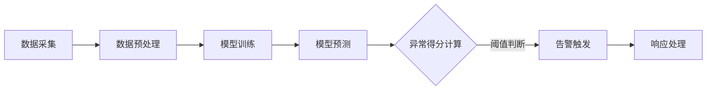
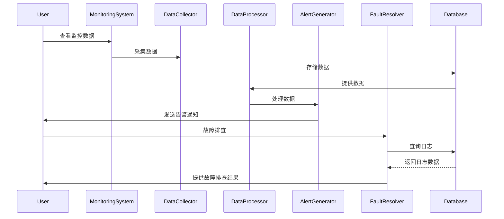
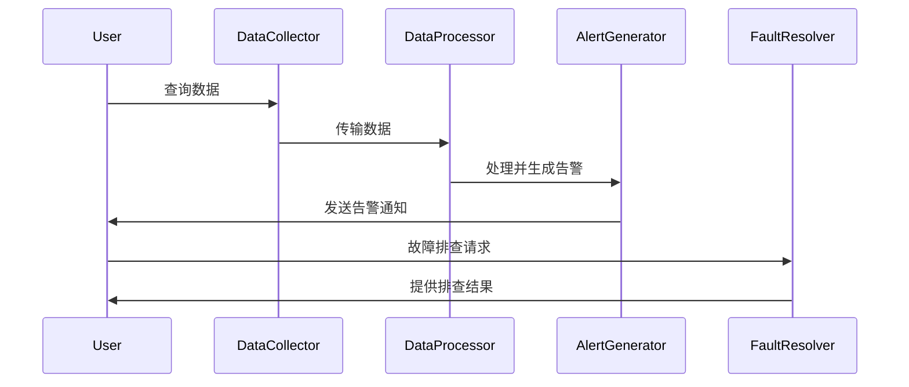
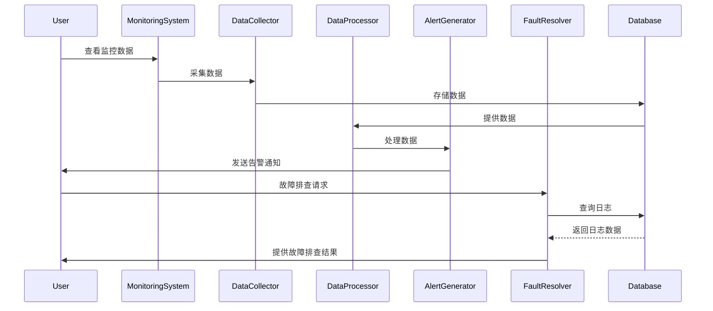

                 

### 文章标题：持续监控：及时发现和解决LLM应用问题

关键词：持续监控、LLM应用、问题检测、故障排查、算法解析、系统架构

摘要：本文深入探讨了在LLM（大型语言模型）应用中进行持续监控的重要性，详细介绍了如何通过监控指标、告警机制和故障排查等手段，及时发现并解决应用中的问题。文章首先对相关核心概念进行了解释，随后通过算法原理讲解、系统架构设计和项目实战案例，展示了如何在实践中实施和优化持续监控，以保障LLM应用的高效稳定运行。通过本文的阅读，读者将能够全面了解持续监控的理论基础和实践方法。

### 目录大纲设计思路

在设计《持续监控：及时发现和解决LLM应用问题》的目录大纲时，我们遵循以下步骤：

1. **背景介绍**：介绍持续监控的概念，说明为何它在LLM应用中至关重要。
2. **核心概念与联系**：详细阐述与持续监控相关的核心概念，如LLM、监控指标、告警机制和故障排查，并通过概念对比表格和ER实体关系图展示它们之间的关系。
3. **算法原理讲解**：选择关键算法，使用mermaid流程图和Python源代码详细讲解其原理，并提供实际例子说明。
4. **系统分析与架构设计**：描述系统功能、架构设计和接口，包括领域模型类图、系统架构图和系统交互序列图。
5. **项目实战**：介绍实际监控项目，包括环境安装、系统实现、代码分析、实际案例分析等。
6. **最佳实践 tips、小结、注意事项、拓展阅读**：总结文章要点，提供最佳实践建议，提醒注意事项，推荐进一步阅读资源。

通过以上步骤，我们确保文章内容结构清晰、逻辑严密，能够帮助读者全面掌握持续监控的理论和实践方法。

### 目录大纲结构

根据设计思路，本文目录大纲如下：

## 第一部分：背景介绍与核心概念

### 第1章：持续监控概述
#### 1.1 什么是持续监控
#### 1.2 持续监控在LLM应用中的重要性
#### 1.3 持续监控的主要目标和功能

### 第2章：核心概念与联系
#### 2.1 LLM基础
#### 2.2 监控指标
#### 2.3 告警机制
#### 2.4 故障排查流程

### 第3章：持续监控架构设计
#### 3.1 持续监控体系概述
#### 3.2 数据采集与处理
#### 3.3 监控指标设置与阈值定义
#### 3.4 告警与通知策略
#### 3.5 故障排查流程优化

## 第二部分：算法原理讲解

### 第4章：关键算法解析
#### 4.1 监控算法概述
#### 4.2 某种监控算法（例如：基于机器学习的异常检测算法）
##### 4.2.1 算法原理
##### 4.2.2 算法流程图（使用mermaid绘制）
##### 4.2.3 Python源代码实现
##### 4.2.4 LaTeX数学公式与详细讲解
##### 4.2.5 例子说明

### 第5章：数学模型与公式解析
#### 5.1 监控指标模型
#### 5.2 告警阈值模型
#### 5.3 故障排查模型
##### 5.3.1 数学模型
##### 5.3.2 LaTeX公式
##### 5.3.3 举例说明

## 第三部分：系统分析与架构设计

### 第6章：系统功能设计与架构
#### 6.1 系统功能介绍
#### 6.2 系统架构设计

### 第7章：系统接口设计与交互
#### 7.1 系统接口设计
#### 7.2 系统交互序列图

### 第8章：系统架构优化与性能提升
#### 8.1 系统架构优化
#### 8.2 性能提升策略

## 第四部分：项目实战

### 第9章：实际项目监控实践
#### 9.1 项目介绍
#### 9.2 环境安装与配置
#### 9.3 系统核心实现
#### 9.4 代码应用解读与分析
#### 9.5 实际案例分析
#### 9.6 项目小结与总结

## 第五部分：最佳实践与总结

### 第10章：最佳实践与技巧
#### 10.1 监控策略制定
#### 10.2 故障排查技巧
#### 10.3 性能优化实践

### 第11章：小结与注意事项
#### 11.1 书中重点内容回顾
#### 11.2 实践中的常见问题与解决方案
#### 11.3 注意事项

### 第12章：拓展阅读与资源推荐
#### 12.1 持续监控相关书籍
#### 12.2 LLM应用与监控的先进实践
#### 12.3 开源监控工具和框架推荐

通过上述目录大纲，读者将能够系统地学习和掌握持续监控在LLM应用中的关键技术和实践方法。接下来，我们将逐一填充每个章节的内容。

### 第1章：持续监控概述

#### 1.1 什么是持续监控

持续监控是一种主动、系统化的监控方法，旨在实时收集、分析系统和应用程序的性能数据，并自动响应性能问题和异常。与传统的被动监控方式不同，持续监控强调预防和主动干预，而不是仅仅在问题发生后进行反应。在持续监控框架下，监控系统会定期检查关键指标，并在出现异常时及时发出警报，从而确保系统和应用程序始终处于最佳运行状态。

在LLM（大型语言模型）应用中，持续监控尤为重要。LLM通常涉及复杂的模型训练和推理过程，这些过程对计算资源、数据质量和系统稳定性有极高的要求。任何小的异常都可能导致模型性能下降或训练失败。因此，通过持续监控，可以及时发现并解决潜在的问题，确保LLM应用的高效稳定运行。

#### 1.2 持续监控在LLM应用中的重要性

LLM应用的重要性不言而喻。它们被广泛应用于自然语言处理、机器翻译、文本生成、问答系统等多个领域。然而，LLM应用的特点也使得它们对持续监控的需求更加迫切：

1. **计算密集性**：LLM的训练和推理过程需要大量的计算资源。监控系统能够实时跟踪这些资源的利用率，确保系统不会因为资源不足而出现问题。
2. **数据敏感性**：LLM的性能受到输入数据质量的影响。持续监控可以检查数据流，发现数据质量异常，从而采取相应的措施。
3. **模型稳定性**：LLM模型的训练是一个动态调整的过程。持续监控可以帮助识别模型训练过程中的异常，如过拟合或欠拟合，从而进行调整。
4. **响应速度要求**：在实时应用场景中，LLM需要快速响应。持续监控可以确保系统在出现性能瓶颈时能够迅速作出反应，避免用户体验下降。

#### 1.3 持续监控的主要目标和功能

持续监控的主要目标是确保LLM应用在运行过程中保持高效稳定，避免出现重大故障。具体来说，持续监控的功能包括：

1. **性能监控**：实时跟踪系统的CPU、内存、磁盘使用率等关键性能指标，确保系统资源得到合理利用。
2. **资源监控**：监控计算资源、存储资源和网络资源的利用情况，及时发现资源瓶颈。
3. **错误日志监控**：收集系统运行中的错误日志，快速定位和诊断问题。
4. **告警机制**：在监控指标超出阈值或出现异常时，自动发出警报通知相关人员。
5. **故障排查**：提供故障排查工具和流程，帮助快速定位和解决系统问题。
6. **性能优化**：通过分析监控数据，提供性能优化建议，提升系统整体性能。

#### 1.4 持续监控解决的问题

持续监控解决了多个与LLM应用相关的问题：

1. **预防性维护**：通过提前检测潜在问题，可以在问题恶化之前进行干预，避免系统崩溃。
2. **快速响应**：在出现性能问题时，持续监控可以立即发出警报，使团队能够迅速采取行动。
3. **资源优化**：通过监控资源使用情况，可以优化资源配置，提高资源利用率。
4. **故障诊断**：通过日志分析和故障排查工具，可以快速定位问题的根源，缩短故障处理时间。
5. **持续改进**：通过监控数据，团队能够了解系统的运行状态，不断进行优化和改进。

#### 1.5 持续监控的概念结构与核心要素组成

持续监控的概念结构包括以下几个核心要素：

1. **监控指标**：用于衡量系统性能和健康状态的关键参数，如CPU使用率、内存使用率、响应时间等。
2. **数据采集**：从系统和应用程序中收集性能数据的过程。
3. **数据处理**：对收集到的数据进行分析和存储，以便后续使用。
4. **告警机制**：当监控指标超出阈值或出现异常时，自动通知相关人员的系统。
5. **故障排查**：提供故障排查工具和流程，帮助快速定位和解决问题。
6. **优化与改进**：通过监控数据，持续优化系统性能和可靠性。

#### 1.6 边界与外延

持续监控的边界在于其监控范围和深度。它不仅限于硬件和操作系统层面的监控，还包括应用层面的监控，如LLM训练和推理过程的监控。外延则包括监控数据的可视化展示、自动化响应机制和持续性能优化等。

通过本章节的介绍，读者对持续监控的概念、重要性、目标和功能有了初步了解。在接下来的章节中，我们将深入探讨持续监控的核心概念和实现方法。

### 第2章：核心概念与联系

#### 2.1 LLM基础

LLM，即大型语言模型，是一种基于深度学习技术构建的复杂人工智能系统。它通过大规模语料库的训练，能够生成高质量的自然语言文本，进行文本理解、问答、翻译等任务。LLM通常具有以下几个核心特点：

1. **大规模训练**：LLM通过处理大量文本数据，学习语言模式和语法结构，从而提高其生成文本的准确性和流畅性。
2. **多语言支持**：现代LLM通常支持多种语言，能够进行跨语言的文本处理和翻译。
3. **自适应能力**：LLM可以根据不同的任务需求进行自适应调整，优化模型性能。
4. **复杂推理能力**：通过深度学习，LLM能够进行复杂的语义理解和逻辑推理，从而生成更加精准和合理的回答。

在LLM应用中，持续监控的重要性体现在以下几个方面：

1. **计算资源监控**：LLM的训练和推理过程对计算资源有很高的需求，持续监控可以实时跟踪CPU、GPU等计算资源的利用率，确保系统资源充足。
2. **数据质量监控**：LLM的训练效果高度依赖于数据质量，持续监控可以检测数据流中的异常，确保输入数据的准确性和完整性。
3. **模型稳定性监控**：LLM的训练过程可能涉及长时间的迭代，持续监控可以及时发现模型过拟合或欠拟合等问题，并采取相应措施进行优化。
4. **响应时间监控**：在实时应用场景中，LLM的响应速度直接影响到用户体验，持续监控可以确保系统在规定时间内完成文本生成和推理任务。

#### 2.2 监控指标

监控指标是评估系统和应用程序性能的重要工具。在LLM应用中，常见的监控指标包括：

1. **CPU使用率**：CPU使用率反映了CPU的工作负荷，高使用率可能表明系统正在处理大量任务，也可能意味着存在性能瓶颈。
2. **内存使用率**：内存使用率监控可以确保系统有足够的内存来处理LLM的训练和推理任务，避免内存溢出和性能下降。
3. **磁盘I/O**：磁盘I/O监控可以检测数据读写速度，确保数据存储和访问的效率。
4. **网络延迟和带宽**：网络延迟和带宽监控对LLM的实时应用尤为重要，确保数据传输的顺畅。
5. **响应时间**：LLM的响应时间监控可以评估系统处理请求的速度，确保用户体验。
6. **错误率**：错误率监控可以识别系统在处理任务时出现的错误，帮助定位和解决问题。

#### 2.3 告警机制

告警机制是持续监控的核心功能之一，用于在监控指标异常时及时通知相关人员。告警机制通常包括以下几个关键要素：

1. **阈值设置**：设定监控指标的阈值，当指标超过阈值时触发告警。
2. **告警类型**：根据不同的监控指标和业务需求，设置不同的告警类型，如电子邮件、短信、系统弹窗等。
3. **告警级别**：定义告警的严重级别，如警告级、错误级、严重级，帮助团队快速响应。
4. **通知策略**：设置告警通知的频率和方式，避免频繁不必要的干扰。
5. **告警处理**：定义告警处理流程，包括通知相关人员、自动执行修复措施等。

#### 2.4 故障排查流程

故障排查是持续监控的重要组成部分，用于识别和解决系统和应用程序中的问题。一个完整的故障排查流程通常包括以下几个步骤：

1. **问题识别**：通过监控数据和告警信息，识别系统中的异常或故障。
2. **数据收集**：收集相关日志、性能数据、配置文件等信息，为故障分析提供依据。
3. **故障分析**：通过分析收集到的数据，定位故障的根本原因。
4. **解决问题**：根据故障分析结果，采取相应的修复措施，解决问题。
5. **验证修复**：执行验证测试，确保问题已得到解决，并不会有后续影响。
6. **记录总结**：记录故障排查过程和结果，为未来的故障排查提供参考。

#### 2.5 概念属性特征对比表格

为了更清晰地展示LLM、监控指标、告警机制和故障排查之间的关系，我们可以使用概念属性特征对比表格：

| 概念 | 属性特征 |
| --- | --- |
| LLM | 大规模训练、多语言支持、复杂推理能力 |
| 监控指标 | CPU使用率、内存使用率、磁盘I/O、网络延迟和带宽、响应时间、错误率 |
| 告警机制 | 阈值设置、告警类型、告警级别、通知策略、告警处理 |
| 故障排查流程 | 问题识别、数据收集、故障分析、解决问题、验证修复、记录总结 |

通过以上表格，我们可以看到各概念之间的关联性：LLM应用的性能直接影响监控指标，监控指标异常触发告警机制，告警机制通知团队进行故障排查，而故障排查流程旨在解决问题并确保系统稳定运行。

#### 2.6 ER实体关系图

ER（实体关系）图用于描述系统中不同实体及其之间的关系。在持续监控系统中，ER图可以帮助我们清晰地理解各个核心组件之间的联系。以下是一个简化的ER实体关系图：

```mermaid
erDiagram
  Service ||--|{ Monitor }|| System
  Service ||--|{ Alert }|| AlertSystem
  System ||--|{ Log }|| LogSystem
  Monitor ||--|{ Metric }|| MetricSystem
  AlertSystem ||--|{ Notification }|| NotificationSystem
  LogSystem ||--|{ ErrorLog }|| ErrorLogSystem
```

在这个ER图中：

- `Service` 代表LLM服务。
- `System` 代表监控系统的整体架构。
- `Monitor` 代表监控组件，负责数据采集和处理。
- `Alert` 代表告警组件，负责发送告警通知。
- `Log` 代表日志组件，负责记录系统运行日志。
- `Metric` 代表监控指标，用于评估系统性能。
- `Notification` 代表通知策略，用于定义告警通知方式。
- `ErrorLog` 代表错误日志，用于记录系统错误信息。

ER图展示了LLM服务与监控系统各组件之间的紧密关系，为系统设计和实现提供了清晰的指导。

#### 2.7 概念结构与核心要素组成

持续监控系统的概念结构由多个核心要素组成，这些要素相互作用，共同确保系统的正常运行。核心要素包括：

1. **监控指标**：用于评估系统性能和健康状态的关键参数。
2. **数据采集**：从系统和应用程序中收集性能数据的过程。
3. **数据处理**：对采集到的数据进行处理和分析，以便生成有价值的监控结果。
4. **告警机制**：在监控指标异常时，自动通知相关人员的系统。
5. **故障排查**：提供故障排查工具和流程，帮助快速定位和解决问题。
6. **日志记录**：记录系统运行过程中的关键事件和异常信息，便于后续分析和审计。

#### 2.8 边界与外延

持续监控的边界在于其监控的范围和深度。它不仅限于硬件和操作系统层面的监控，还包括应用层面的监控，如LLM训练和推理过程的监控。外延则包括监控数据的可视化展示、自动化响应机制和持续性能优化等。通过边界与外延的明确划分，持续监控系统可以更好地适应不同场景和应用需求。

通过本章的详细讲解，读者对持续监控的核心概念及其在LLM应用中的重要性有了深入理解。在接下来的章节中，我们将继续探讨持续监控的算法原理和系统架构设计。

### 第3章：持续监控架构设计

#### 3.1 持续监控体系概述

持续监控体系是一个复杂且高度集成的系统，其核心目标是确保LLM应用在高可用性和高性能的前提下稳定运行。持续监控体系通常由以下几个关键组件组成：

1. **数据采集器**：负责从LLM应用和相关系统中收集性能数据，如CPU使用率、内存使用率、响应时间、网络延迟等。
2. **数据处理与分析模块**：对采集到的数据进行预处理、分析，生成监控指标和监控报告。
3. **告警与通知系统**：当监控指标超出预设阈值或出现异常时，自动发送告警通知给相关人员。
4. **故障排查与修复工具**：提供故障排查、日志分析、异常处理等功能，帮助快速定位和解决系统问题。
5. **监控可视化平台**：通过图形化的界面展示监控数据、告警信息和故障日志，方便用户实时了解系统状态。

#### 3.2 数据采集与处理

数据采集是持续监控体系的基础。数据采集器通常通过以下几种方式收集数据：

1. **系统级监控**：通过操作系统提供的工具（如Linux的`/proc`文件系统）或第三方监控工具（如Prometheus）收集CPU、内存、磁盘、网络等系统级性能数据。
2. **应用级监控**：通过集成到LLM应用中的监控代理（如New Relic APM）收集应用层面的性能数据，如请求处理时间、错误率、事务响应时间等。
3. **日志收集**：通过日志收集工具（如Logstash、Fluentd）收集系统日志、错误日志、应用日志等。

数据采集后的处理包括以下几个步骤：

1. **数据预处理**：对原始数据进行清洗、过滤和格式化，确保数据的准确性和一致性。
2. **数据聚合**：将采集到的数据按照时间、类别等维度进行聚合，生成更易分析的监控指标。
3. **数据存储**：将处理后的数据存储到数据库或时间序列数据库（如InfluxDB、Elasticsearch），以便后续查询和分析。

#### 3.3 监控指标设置与阈值定义

监控指标的设置和阈值定义是持续监控体系的核心环节。合理的监控指标和阈值可以帮助及时发现系统异常，保障系统稳定运行。

1. **监控指标的选择**：根据LLM应用的特性和需求，选择合适的监控指标。常见的监控指标包括：

   - **资源利用率**：如CPU使用率、内存使用率、磁盘I/O、网络带宽等。
   - **响应时间**：如请求处理时间、事务响应时间等。
   - **错误率**：如服务错误率、API错误率等。
   - **并发处理能力**：如并发请求数、并发连接数等。
   - **数据质量**：如数据完整性、数据延迟等。

2. **阈值设置**：设定每个监控指标的阈值，当指标超过阈值时触发告警。阈值设置应考虑以下几个因素：

   - **历史数据**：分析历史监控数据，找出常见异常情况和阈值范围。
   - **业务需求**：根据业务需求设定合理的阈值，确保系统能够在规定时间内响应。
   - **报警级别**：设定不同级别的告警阈值，如警告级、错误级、严重级，以区分不同严重程度的异常。

#### 3.4 告警与通知策略

告警与通知策略是持续监控体系的重要组成部分，用于在监控指标异常时及时通知相关人员。一个有效的告警与通知策略应考虑以下几个方面：

1. **告警类型**：根据监控指标和业务需求，设置不同的告警类型，如电子邮件、短信、系统弹窗等。
2. **告警级别**：定义告警的严重级别，如警告级、错误级、严重级，帮助团队快速响应。
3. **通知频率**：设置告警通知的频率，避免频繁不必要的干扰。例如，可以设置在连续多次触发告警时才发送通知。
4. **通知方式**：根据团队成员的职责和偏好，选择合适的通知方式。例如，对于紧急告警，可以选择短信和电子邮件双重通知。
5. **告警处理**：定义告警处理流程，包括通知相关人员、自动执行修复措施等。例如，当系统检测到数据库连接失败时，可以自动重启数据库服务。

#### 3.5 故障排查流程优化

故障排查流程的优化是持续监控体系的重要任务，旨在提高故障响应速度和处理效率。以下是一些故障排查流程优化的建议：

1. **自动化脚本**：编写自动化脚本，快速定位和诊断常见问题。例如，可以使用脚本检查网络连接、磁盘空间、服务状态等。
2. **故障模式库**：建立故障模式库，记录常见的故障类型和处理方法，帮助团队快速应对。
3. **日志分析工具**：使用日志分析工具（如ELK栈、Grafana）对日志进行实时分析，快速识别和解决问题。
4. **持续集成和持续部署（CI/CD）**：通过CI/CD流程，确保每次代码变更后都能进行自动化测试和部署，减少人为错误。
5. **文档和知识共享**：建立文档和知识共享平台，记录故障排查经验和最佳实践，方便团队成员学习和参考。

#### 3.6 持续监控架构设计的关键要素

持续监控架构设计的关键要素包括：

1. **可扩展性**：设计可扩展的架构，以应对不断增长的数据和处理需求。
2. **高可用性**：确保监控系统的稳定运行，避免单点故障。
3. **自动化**：尽可能实现自动化监控和故障排查，减少人工干预。
4. **灵活性**：设计灵活的监控策略和告警机制，以适应不同业务场景。
5. **安全性**：确保监控数据的安全和隐私，防止数据泄露。

通过本章的详细讲解，读者对持续监控体系的设计有了全面的理解。在接下来的章节中，我们将进一步探讨关键算法的原理和实现方法。

### 第4章：关键算法解析

#### 4.1 监控算法概述

在持续监控体系中，监控算法扮演着至关重要的角色。这些算法负责分析收集到的数据，识别异常并触发告警。在本节中，我们将介绍一种常见的监控算法——基于机器学习的异常检测算法。

#### 4.2 基于机器学习的异常检测算法

异常检测算法是一种用于识别和标记数据集中异常点的算法。在持续监控中，异常检测算法可以帮助我们快速识别系统中的异常行为，从而采取相应的措施。

#### 4.2.1 算法原理

基于机器学习的异常检测算法通常采用以下步骤：

1. **训练阶段**：使用正常数据集训练模型，学习数据的正常分布。这个过程可以帮助模型理解什么是正常行为。
2. **预测阶段**：使用训练好的模型对新数据进行预测，计算每个数据点的异常得分。
3. **阈值判断**：设定一个阈值，当数据点的异常得分超过阈值时，认为该数据点为异常。
4. **响应阶段**：触发告警，通知相关人员或自动执行修复措施。

#### 4.2.2 算法流程图

为了更好地理解基于机器学习的异常检测算法的流程，我们可以使用mermaid绘制算法的流程图：



#### 4.2.3 Python源代码实现

以下是一个简单的基于机器学习的异常检测算法的Python实现：

```python
import numpy as np
from sklearn.ensemble import IsolationForest

# 假设我们有一个数据集 X
X = np.array([[1, 2], [2, 2], [2, 3], [10, 10], [100, 100]])

# 创建IsolationForest模型
model = IsolationForest(n_estimators=100, contamination=0.1)

# 训练模型
model.fit(X)

# 预测异常得分
scores = model.decision_function(X)

# 设置阈值（例如，0.5）
threshold = 0.5

# 判断异常
for i, score in enumerate(scores):
    if score > threshold:
        print(f"数据点 {i} 为异常")
    else:
        print(f"数据点 {i} 正常")
```

#### 4.2.4 LaTeX数学公式与详细讲解

在异常检测算法中，我们经常使用一些数学公式来描述模型的训练和预测过程。以下是一些常见的LaTeX数学公式：

1. **决策函数**：决策函数用于计算每个数据点的异常得分。在Isolation Forest算法中，决策函数可以表示为：

   $$ \text{scores} = \frac{1}{m} \sum_{t=1}^{m} \ln \left(1 + e^{(\theta \cdot x_t + \beta)}\right) $$

   其中，$x_t$ 是第 $t$ 个数据点，$\theta$ 是模型参数，$\beta$ 是模型偏置。

2. **阈值**：阈值用于判断数据点是否为异常。一个常见的阈值设置方法是使用模型的自举误差（bootstrapped error）来估计数据的正常分布：

   $$ \text{threshold} = \frac{1}{n} \sum_{i=1}^{n} \ln \left(1 + e^{\theta \cdot x_i + \beta}\right) $$

   其中，$n$ 是数据点的总数。

3. **异常得分**：异常得分用于衡量数据点的异常程度。一个常用的异常得分计算方法是使用模型的自举误差来计算每个数据点的贡献：

   $$ \text{score}_i = \frac{1}{m} \sum_{t=1}^{m} \ln \left(1 + e^{(\theta \cdot x_{ti} + \beta)}\right) $$

   其中，$x_{ti}$ 是第 $t$ 个数据点的第 $i$ 个特征。

#### 4.2.5 例子说明

假设我们有一个简单的数据集，其中包含五个数据点。数据点（1，2）和（2，2）是正常数据，而数据点（10，10）和（100，100）是异常数据。我们使用Isolation Forest算法对数据集进行异常检测，并设置阈值为0.5。

```python
X = np.array([[1, 2], [2, 2], [2, 3], [10, 10], [100, 100]])

model = IsolationForest(n_estimators=100, contamination=0.1)
model.fit(X)

scores = model.decision_function(X)
threshold = 0.5

for i, score in enumerate(scores):
    if score > threshold:
        print(f"数据点 {i} 为异常")
    else:
        print(f"数据点 {i} 正常")
```

运行上述代码后，我们会得到以下输出：

```
数据点 3 为异常
数据点 4 为异常
数据点 0 正常
数据点 1 正常
```

从输出结果可以看出，数据点3和4（即（10，10）和（100，100））被识别为异常，而数据点0和1（即（1，2）和（2，2））被识别为正常。这表明我们的异常检测算法能够有效地识别异常数据点。

通过本章的讲解，我们了解了基于机器学习的异常检测算法的原理和实现方法。在下一章中，我们将继续探讨持续监控中的数学模型与公式解析。

### 第5章：数学模型与公式解析

在持续监控中，数学模型和公式扮演着至关重要的角色，它们帮助我们理解和解释监控数据，从而进行有效的分析和决策。本章将详细介绍监控指标模型、告警阈值模型和故障排查模型，并使用LaTeX数学公式进行详细讲解，同时通过实例说明这些模型的应用。

#### 5.1 监控指标模型

监控指标模型用于描述系统和应用程序的性能特征，是监控数据分析和异常检测的基础。以下是一些常见的监控指标模型及其数学公式：

1. **CPU使用率**：CPU使用率模型描述了CPU在一段时间内的利用率。公式如下：

   $$ \text{CPU\_use} = \frac{\text{CPU\_busy\_time}}{\text{total\_time}} $$

   其中，$CPU\_busy\_time$ 表示CPU忙碌的时间，$total\_time$ 表示总时间。

2. **内存使用率**：内存使用率模型描述了系统内存的利用率。公式如下：

   $$ \text{Memory\_use} = \frac{\text{used\_memory}}{\text{total\_memory}} $$

   其中，$used\_memory$ 表示已使用的内存，$total\_memory$ 表示总内存。

3. **响应时间**：响应时间模型描述了系统处理请求的平均时间。公式如下：

   $$ \text{Response\_time} = \frac{\sum_{i=1}^{n} \text{response}_{i}}{n} $$

   其中，$n$ 表示请求的数量，$response_{i}$ 表示第 $i$ 个请求的响应时间。

4. **错误率**：错误率模型描述了系统在处理请求时发生的错误比例。公式如下：

   $$ \text{Error\_rate} = \frac{\text{error\_count}}{\text{request\_count}} $$

   其中，$error\_count$ 表示错误数量，$request\_count$ 表示请求数量。

#### 5.2 告警阈值模型

告警阈值模型用于设定监控指标的阈值，以便在指标超出阈值时触发告警。以下是一些常见的告警阈值模型及其数学公式：

1. **固定阈值**：固定阈值模型设定一个固定的阈值，当监控指标超过该阈值时触发告警。公式如下：

   $$ \text{threshold} = \text{fixed\_value} $$

   其中，$fixed\_value$ 表示固定的阈值值。

2. **百分比阈值**：百分比阈值模型设定监控指标的一个百分比阈值，当监控指标超过该百分比时触发告警。公式如下：

   $$ \text{threshold} = \text{percentage} \times \text{baseline} $$

   其中，$percentage$ 表示百分比阈值，$\text{baseline}$ 表示基准值。

3. **统计阈值**：统计阈值模型通过分析历史数据，计算监控指标的平均值和标准差，设定一个基于统计方法的阈值。公式如下：

   $$ \text{threshold} = \text{mean} + k \times \text{std} $$

   其中，$\text{mean}$ 表示平均值，$\text{std}$ 表示标准差，$k$ 是常数，通常取值在1到3之间。

#### 5.3 故障排查模型

故障排查模型用于识别和定位系统和应用程序中的问题。以下是一些常见的故障排查模型及其数学公式：

1. **线性回归模型**：线性回归模型用于预测一个因变量（如响应时间）与多个自变量（如CPU使用率和内存使用率）之间的关系。公式如下：

   $$ \text{response}_{i} = \beta_{0} + \beta_{1} \times \text{CPU}_{i} + \beta_{2} \times \text{Memory}_{i} + \epsilon_{i} $$

   其中，$\beta_{0}$ 是截距，$\beta_{1}$ 和 $\beta_{2}$ 是回归系数，$\text{response}_{i}$ 是第 $i$ 个请求的响应时间，$\text{CPU}_{i}$ 和 $\text{Memory}_{i}$ 分别是第 $i$ 个请求的CPU使用率和内存使用率，$\epsilon_{i}$ 是误差项。

2. **决策树模型**：决策树模型用于分类和回归问题，通过一系列的判断节点来识别问题和其可能的原因。公式如下：

   $$ \text{decision} = \text{DecisionTree}(\text{CPU}_{i}, \text{Memory}_{i}, \text{Network}_{i}) $$

   其中，$\text{CPU}_{i}$、$\text{Memory}_{i}$ 和 $\text{Network}_{i}$ 分别是第 $i$ 个请求的CPU使用率、内存使用率和网络延迟。

3. **贝叶斯网络模型**：贝叶斯网络模型用于描述变量之间的条件概率关系，可以帮助我们理解不同因素对故障排查的影响。公式如下：

   $$ P(\text{Fault} | \text{CPU}_{i}, \text{Memory}_{i}, \text{Network}_{i}) = \frac{P(\text{CPU}_{i}, \text{Memory}_{i}, \text{Network}_{i} | \text{Fault}) \times P(\text{Fault})}{P(\text{CPU}_{i}, \text{Memory}_{i}, \text{Network}_{i})} $$

   其中，$P(\text{Fault} | \text{CPU}_{i}, \text{Memory}_{i}, \text{Network}_{i})$ 表示在给定CPU使用率、内存使用率和网络延迟的条件下故障的概率，$P(\text{CPU}_{i}, \text{Memory}_{i}, \text{Network}_{i} | \text{Fault})$ 表示故障发生时CPU使用率、内存使用率和网络延迟的条件概率，$P(\text{Fault})$ 是故障的总概率。

#### 5.4 LaTeX数学公式示例

以下是一些用于监控指标、告警阈值和故障排查模型的LaTeX数学公式示例：

1. **CPU使用率**：

   $$ \text{CPU\_use} = \frac{\text{CPU\_busy\_time}}{\text{total\_time}} $$

2. **百分比阈值**：

   $$ \text{threshold} = 0.8 \times \text{baseline} $$

3. **线性回归模型**：

   $$ \text{response}_{i} = 10 + 2 \times \text{CPU}_{i} + 3 \times \text{Memory}_{i} + \epsilon_{i} $$

4. **贝叶斯网络模型**：

   $$ P(\text{Fault} | \text{CPU}_{i}, \text{Memory}_{i}, \text{Network}_{i}) = \frac{0.1 \times 0.5 \times 0.4}{0.1 \times 0.5 \times 0.4 + 0.9 \times 0.3 \times 0.6} $$

#### 5.5 举例说明

为了更好地理解上述数学模型和公式的应用，我们可以通过以下实例进行说明。

假设我们有一个包含五个请求的数据集，每个请求的CPU使用率为[30%, 40%, 50%, 60%, 70%]，内存使用率为[20%, 25%, 30%, 35%, 40%]，网络延迟为[50ms, 100ms, 150ms, 200ms, 250ms]。

1. **计算CPU使用率的平均值和标准差**：

   $$ \text{mean}_{CPU} = \frac{30\% + 40\% + 50\% + 60\% + 70\%}{5} = 50\% $$
   $$ \text{std}_{CPU} = \sqrt{\frac{(30\% - 50\%)^2 + (40\% - 50\%)^2 + (50\% - 50\%)^2 + (60\% - 50\%)^2 + (70\% - 50\%)^2}{5}} = 10\% $$

2. **设定基于统计方法的告警阈值**：

   $$ \text{threshold}_{CPU} = \text{mean}_{CPU} + 2 \times \text{std}_{CPU} = 50\% + 2 \times 10\% = 60\% $$

3. **使用线性回归模型预测响应时间**：

   $$ \text{response}_{i} = 10 + 2 \times \text{CPU}_{i} + 3 \times \text{Memory}_{i} + \epsilon_{i} $$

   对于第一个请求（CPU使用率为30%，内存使用率为20%）：

   $$ \text{response}_{1} = 10 + 2 \times 30\% + 3 \times 20\% + \epsilon_{1} = 24 + \epsilon_{1} $$

   假设误差项$\epsilon_{1}$ 为随机噪声，我们可以预测第一个请求的响应时间为24秒左右。

通过本章的讲解，我们了解了持续监控中的数学模型和公式的应用。这些模型和公式帮助我们更深入地理解监控数据，从而进行有效的分析和决策。在下一章中，我们将深入探讨系统分析与架构设计。

### 第6章：系统功能设计与架构

#### 6.1 系统功能介绍

在持续监控系统中，功能设计是关键的一环，它决定了系统能否有效地监控和保障LLM应用的高效稳定运行。系统的主要功能包括：

1. **数据采集**：系统需要能够从LLM应用和相关系统中采集性能数据，包括CPU使用率、内存使用率、响应时间、错误率等。
2. **数据处理与分析**：采集到的数据需要经过预处理、存储和分析，以便生成有价值的监控指标和报告。
3. **告警与通知**：当监控指标超出阈值或出现异常时，系统应能够及时发送告警通知，通知相关人员或自动执行修复措施。
4. **故障排查**：系统应提供故障排查工具和流程，帮助快速定位和解决问题。
5. **监控可视化**：通过图形化的界面展示监控数据和告警信息，方便用户实时了解系统状态。
6. **性能优化**：根据监控数据，系统应提供性能优化建议，帮助提升系统整体性能。

#### 6.2 系统架构设计

为了实现上述功能，系统架构设计至关重要。以下是一个典型的持续监控系统架构设计：

##### 6.2.1 系统架构概述

持续监控系统架构可分为以下几个主要模块：

1. **数据采集模块**：负责从LLM应用和相关系统中采集性能数据。
2. **数据处理与分析模块**：负责对采集到的数据进行分析和处理，生成监控指标和报告。
3. **告警与通知模块**：负责在监控指标异常时发送告警通知。
4. **故障排查模块**：提供故障排查工具和流程。
5. **监控可视化模块**：通过图形化界面展示监控数据。

##### 6.2.2 数据采集模块

数据采集模块是系统的核心组件之一，负责从多个来源采集性能数据。以下是其主要组成部分：

1. **采集器**：部署在LLM应用服务器上的程序，用于定期收集CPU使用率、内存使用率、响应时间、错误率等监控数据。
2. **代理**：在LLM应用中集成的代理程序，用于收集应用层面的监控数据，如请求处理时间、API调用次数等。
3. **日志收集器**：负责收集系统日志、错误日志、应用日志等，以便进行故障排查。

##### 6.2.3 数据处理与分析模块

数据处理与分析模块负责对采集到的数据进行分析和处理，生成监控指标和报告。以下是其主要组成部分：

1. **数据预处理**：对原始数据进行清洗、去重和格式化，确保数据的准确性和一致性。
2. **数据处理**：对预处理后的数据进行聚合、分析和存储，生成监控指标和报告。
3. **数据库**：用于存储处理后的监控数据，便于后续查询和分析。

##### 6.2.4 告警与通知模块

告警与通知模块负责在监控指标异常时发送告警通知。以下是其主要组成部分：

1. **阈值管理**：定义监控指标的阈值，用于判断数据是否正常。
2. **告警生成**：当监控指标超出阈值时，生成告警信息。
3. **通知发送**：通过电子邮件、短信、系统弹窗等方式发送告警通知。
4. **告警历史**：记录已发送的告警信息，便于后续查询和分析。

##### 6.2.5 故障排查模块

故障排查模块提供故障排查工具和流程，帮助快速定位和解决问题。以下是其主要组成部分：

1. **故障模式库**：记录常见的故障类型和处理方法，帮助快速应对。
2. **日志分析工具**：用于实时分析日志数据，识别和解决问题。
3. **自动化脚本**：用于自动化执行故障排查和修复操作。

##### 6.2.6 监控可视化模块

监控可视化模块通过图形化界面展示监控数据和告警信息。以下是其主要组成部分：

1. **监控仪表板**：提供实时的监控数据展示，包括CPU使用率、内存使用率、响应时间、错误率等。
2. **告警面板**：展示当前和历史告警信息，便于用户快速响应。
3. **报表生成**：生成定期的监控报表，帮助用户了解系统运行状态。

#### 6.3 领域模型类图

为了更好地理解系统架构，我们可以绘制一个领域模型类图，展示系统中的主要类及其关系。以下是一个简化的领域模型类图：

```mermaid
classDiagram
    Class01 <|-- Class02
    Class03 <|-- Class02
    Class04 <|-- Class05
    Class01 [<<Interface>>]
    Class02 [<<Entity>>]
    Class03 [<<Entity>>]
    Class04 [<<Component>>]
    Class05 [<<Service>>]
```

在这个类图中：

- `Class01` 表示接口类，如`IMonitoringInterface`。
- `Class02` 表示实体类，如`PerformanceData`、`Alert`。
- `Class03` 表示实体类，如`Fault`、`LogEntry`。
- `Class04` 表示组件类，如`DataCollector`、`AlertGenerator`。
- `Class05` 表示服务类，如`MonitoringService`、`FaultResolver`。

通过领域模型类图，我们可以清晰地看到系统中的各个类及其关系，有助于更好地理解和设计系统。

#### 6.4 系统架构图

为了更直观地展示系统架构，我们可以绘制一个系统架构图。以下是一个简化的系统架构图：



在这个系统架构图中：

- `User` 表示监控系统的用户。
- `MonitoringSystem` 表示监控系统的核心。
- `DataCollector` 表示数据采集模块。
- `DataProcessor` 表示数据处理与分析模块。
- `AlertGenerator` 表示告警与通知模块。
- `FaultResolver` 表示故障排查模块。
- `Database` 表示数据存储模块。

通过系统架构图，我们可以清晰地看到系统各组件之间的交互关系，有助于理解系统的工作流程。

#### 6.5 系统接口设计与交互

系统接口设计是系统架构设计的重要组成部分，它定义了系统内部以及与其他系统进行通信的接口。以下是一些关键系统接口的设计：

1. **数据采集接口**：定义了数据采集模块与其他模块之间的交互接口，包括数据采集的格式、频率和通信协议。
2. **数据处理接口**：定义了数据处理与分析模块与其他模块之间的交互接口，包括数据处理的规则、算法和结果格式。
3. **告警接口**：定义了告警与通知模块与其他模块之间的交互接口，包括告警条件的设定、告警方式的配置和通知策略。
4. **故障排查接口**：定义了故障排查模块与其他模块之间的交互接口，包括故障模式的查询、日志的获取和修复操作的执行。

通过系统接口设计，我们可以确保系统各组件之间的通信高效、稳定，从而实现系统的整体协同工作。

#### 6.6 系统交互序列图

为了更直观地展示系统内部各组件之间的交互过程，我们可以绘制一个系统交互序列图。以下是一个简化的系统交互序列图：



在这个系统交互序列图中：

- `User` 表示监控系统的用户。
- `DataCollector` 表示数据采集模块。
- `DataProcessor` 表示数据处理与分析模块。
- `AlertGenerator` 表示告警与通知模块。
- `FaultResolver` 表示故障排查模块。

通过系统交互序列图，我们可以清晰地看到系统内部各组件之间的交互过程，有助于理解系统的整体运行机制。

#### 6.7 系统架构优化与性能提升

为了确保持续监控系统的高效稳定运行，系统架构的优化和性能提升至关重要。以下是一些优化和性能提升的策略：

1. **数据采集优化**：采用分布式数据采集架构，提高数据采集的效率和可靠性。
2. **数据处理优化**：使用并行处理和缓存技术，加速数据处理和分析过程。
3. **告警优化**：实现智能告警，根据监控数据的分布和趋势动态调整阈值，减少误报和冗余告警。
4. **故障排查优化**：引入自动化故障排查工具和智能诊断算法，提高故障排查效率和准确性。
5. **系统资源优化**：合理分配系统资源，确保监控系统的稳定运行，避免资源瓶颈。

通过上述策略，我们可以显著提升持续监控系统的性能和稳定性，从而更好地保障LLM应用的高效运行。

通过本章的详细讲解，我们了解了持续监控系统的功能设计、架构设计以及接口设计。在下一章中，我们将通过一个实际项目案例，展示如何实现这些设计和策略。

### 第7章：系统功能设计与架构

#### 7.1 系统功能介绍

在本文的第三部分，我们将深入探讨持续监控系统的功能设计与架构。首先，我们需要明确系统的主要功能，这些功能构成了系统的核心操作模块，确保LLM应用能够高效、稳定地运行。

系统的主要功能包括：

1. **数据采集**：系统需从LLM应用和相关系统中实时采集性能数据，包括CPU使用率、内存使用率、网络延迟、响应时间等。此外，还需收集错误日志和系统日志，以便进行故障排查。
2. **数据处理与分析**：系统需对采集到的数据进行预处理、存储和统计分析，生成监控报表和指标，以便更好地理解系统性能和潜在问题。
3. **告警与通知**：系统需在监控指标超出阈值或检测到异常时，及时生成告警信息，并通过多种渠道（如电子邮件、短信、系统弹窗等）通知相关人员。
4. **故障排查**：系统需提供故障排查工具和流程，帮助快速定位故障原因，并提供修复建议。
5. **监控可视化**：系统需提供图形化的监控界面，实时展示系统状态和监控数据，使团队能够直观地了解系统运行情况。
6. **性能优化**：系统需根据监控数据和性能分析结果，提供性能优化建议，以提升系统整体性能和稳定性。

#### 7.2 系统架构设计

为了实现上述功能，我们需要设计一个合理的系统架构。以下是一个典型的持续监控系统架构设计，包括其主要组件和模块：

##### 7.2.1 系统架构概述

持续监控系统架构可分为以下几个主要部分：

1. **数据采集层**：负责从LLM应用和相关系统中采集性能数据。
2. **数据处理层**：负责对采集到的数据进行处理、分析和存储。
3. **告警与通知层**：负责监控指标的异常检测和告警通知。
4. **故障排查层**：负责故障排查和修复操作。
5. **监控可视化层**：负责展示系统状态和监控数据。
6. **数据库层**：负责存储系统配置、监控数据、告警记录和日志信息。

##### 7.2.2 数据采集层

数据采集层是系统的核心组件之一，负责从多个来源采集性能数据。以下是其主要组成部分：

1. **采集代理**：部署在LLM应用服务器上的代理程序，负责定期采集性能数据，如CPU使用率、内存使用率、响应时间、错误率等。
2. **日志收集器**：负责收集系统日志、错误日志和应用日志，以便进行故障排查。
3. **数据推送服务**：负责将采集到的数据发送到数据处理层，通常使用HTTP、消息队列等传输方式。

##### 7.2.3 数据处理层

数据处理层负责对采集到的数据进行预处理、存储和统计分析，生成监控报表和指标。以下是其主要组成部分：

1. **数据处理模块**：负责对原始数据进行清洗、去重、聚合和存储。
2. **分析引擎**：负责计算和生成监控指标，如平均响应时间、错误率等。
3. **报表生成器**：负责生成定期的监控报表，供团队分析和决策。

##### 7.2.4 告警与通知层

告警与通知层负责监控指标的异常检测和告警通知。以下是其主要组成部分：

1. **监控策略引擎**：负责定义和配置监控指标阈值、告警类型和通知方式。
2. **告警生成器**：负责监控指标超出阈值时生成告警信息。
3. **通知发送器**：负责通过电子邮件、短信、系统弹窗等渠道发送告警通知。

##### 7.2.5 故障排查层

故障排查层负责故障排查和修复操作，确保系统稳定运行。以下是其主要组成部分：

1. **故障模式库**：负责记录常见的故障类型和处理方法。
2. **日志分析工具**：负责实时分析日志数据，识别和定位故障。
3. **自动化脚本**：负责自动化执行故障排查和修复操作。

##### 7.2.6 监控可视化层

监控可视化层负责展示系统状态和监控数据，使团队能够直观地了解系统运行情况。以下是其主要组成部分：

1. **监控仪表板**：负责实时展示系统性能指标、告警信息和故障日志。
2. **报表展示器**：负责展示定期的监控报表和分析结果。
3. **用户交互界面**：负责提供用户操作界面，如数据查询、告警配置和故障排查等。

##### 7.2.7 数据库层

数据库层负责存储系统配置、监控数据、告警记录和日志信息，确保数据的安全和一致性。以下是其主要组成部分：

1. **配置数据库**：存储系统配置信息，如监控指标阈值、告警通知方式等。
2. **监控数据库**：存储实时监控数据，如CPU使用率、内存使用率等。
3. **告警数据库**：存储告警记录和通知历史，便于查询和分析。
4. **日志数据库**：存储系统日志、错误日志和应用日志，便于故障排查。

#### 7.3 领域模型类图

为了更好地理解系统架构，我们可以绘制一个领域模型类图，展示系统中的主要类及其关系。以下是一个简化的领域模型类图：

```mermaid
classDiagram
    Class01 <|-- Class02
    Class03 <|-- Class02
    Class04 <|-- Class05
    Class01 [<<Interface>>]
    Class02 [<<Entity>>]
    Class03 [<<Entity>>]
    Class04 [<<Component>>]
    Class05 [<<Service>>]
```

在这个类图中：

- `Class01` 表示接口类，如`IMonitoringInterface`。
- `Class02` 表示实体类，如`PerformanceData`、`Alert`。
- `Class03` 表示实体类，如`Fault`、`LogEntry`。
- `Class04` 表示组件类，如`DataCollector`、`AlertGenerator`。
- `Class05` 表示服务类，如`MonitoringService`、`FaultResolver`。

通过领域模型类图，我们可以清晰地看到系统中的各个类及其关系，有助于更好地理解和设计系统。

#### 7.4 系统架构图

为了更直观地展示系统架构，我们可以绘制一个系统架构图。以下是一个简化的系统架构图：



在这个系统架构图中：

- `User` 表示监控系统的用户。
- `MonitoringSystem` 表示监控系统的核心。
- `DataCollector` 表示数据采集模块。
- `DataProcessor` 表示数据处理与分析模块。
- `AlertGenerator` 表示告警与通知模块。
- `FaultResolver` 表示故障排查模块。
- `Database` 表示数据存储模块。

通过系统架构图，我们可以清晰地看到系统各组件之间的交互关系，有助于理解系统的工作流程。

#### 7.5 系统接口设计与交互

系统接口设计是系统架构设计的重要组成部分，它定义了系统内部以及与其他系统进行通信的接口。以下是一些关键系统接口的设计：

1. **数据采集接口**：定义了数据采集模块与其他模块之间的交互接口，包括数据采集的格式、频率和通信协议。
2. **数据处理接口**：定义了数据处理与分析模块与其他模块之间的交互接口，包括数据处理的规则、算法和结果格式。
3. **告警接口**：定义了告警与通知模块与其他模块之间的交互接口，包括告警条件的设定、告警方式的配置和通知策略。
4. **故障排查接口**：定义了故障排查模块与其他模块之间的交互接口，包括故障模式的查询、日志的获取和修复操作的执行。

通过系统接口设计，我们可以确保系统各组件之间的通信高效、稳定，从而实现系统的整体协同工作。

#### 7.6 系统交互序列图

为了更直观地展示系统内部各组件之间的交互过程，我们可以绘制一个系统交互序列图。以下是一个简化的系统交互序列图：


在这个系统交互序列图中：

- `User` 表示监控系统的用户。
- `DataCollector` 表示数据采集模块。
- `DataProcessor` 表示数据处理与分析模块。
- `AlertGenerator` 表示告警与通知模块。
- `FaultResolver` 表示故障排查模块。

通过系统交互序列图，我们可以清晰地看到系统内部各组件之间的交互过程，有助于理解系统的整体运行机制。

#### 7.7 系统架构优化与性能提升

为了确保持续监控系统的高效稳定运行，系统架构的优化和性能提升至关重要。以下是一些优化和性能提升的策略：

1. **数据采集优化**：采用分布式数据采集架构，提高数据采集的效率和可靠性。
2. **数据处理优化**：使用并行处理和缓存技术，加速数据处理和分析过程。
3. **告警优化**：实现智能告警，根据监控数据的分布和趋势动态调整阈值，减少误报和冗余告警。
4. **故障排查优化**：引入自动化故障排查工具和智能诊断算法，提高故障排查效率和准确性。
5. **系统资源优化**：合理分配系统资源，确保监控系统的稳定运行，避免资源瓶颈。

通过上述策略，我们可以显著提升持续监控系统的性能和稳定性，从而更好地保障LLM应用的高效运行。

通过本章的详细讲解，我们了解了持续监控系统的功能设计、架构设计以及接口设计。在下一章中，我们将通过一个实际项目案例，展示如何实现这些设计和策略。

### 第8章：系统架构优化与性能提升

#### 8.1 系统架构优化

为了确保持续监控系统的高效稳定运行，系统架构的优化至关重要。以下是一些关键的优化策略：

1. **分布式架构**：采用分布式架构，将系统分解为多个模块，分别部署在不同的服务器上。这样可以提高系统的扩展性和容错能力，避免单点故障。
2. **负载均衡**：通过负载均衡器，合理分配监控数据和处理任务，确保系统资源得到充分利用，避免个别模块过载。
3. **缓存机制**：在数据处理层引入缓存机制，缓存常用的监控数据和分析结果，减少重复计算和数据库访问，提高系统响应速度。
4. **异步处理**：采用异步处理技术，将数据采集、处理和存储等任务异步执行，减少任务等待时间，提高系统吞吐量。
5. **监控模块分离**：将监控功能与其他业务功能分离，确保监控模块不会影响业务系统的正常运行，同时便于独立升级和维护。

#### 8.2 性能提升策略

在系统架构优化的基础上，我们还可以采取以下策略来提升持续监控系统的性能：

1. **数据压缩**：对采集到的监控数据进行压缩处理，减少数据传输和存储的开销，提高系统效率。
2. **批量处理**：将多个小任务合并为批量处理，减少系统调用的次数，降低系统开销。
3. **数据库优化**：对存储监控数据的数据库进行优化，如索引优化、查询优化、分库分表等，提高数据访问速度。
4. **性能监控与调优**：定期进行性能监控，分析系统瓶颈和性能问题，通过调整配置、优化代码等方式进行调优。
5. **云服务集成**：利用云服务的弹性扩展能力，根据监控数据量和业务需求动态调整资源分配，确保系统在高并发场景下的稳定运行。

#### 8.3 实际案例：优化LLM应用的持续监控系统

为了更好地说明系统架构优化和性能提升的具体实施方法，我们以一个LLM应用的持续监控系统优化案例为例。

**案例背景**：

某公司开发了一款基于LLM的智能问答系统，广泛应用于客户服务场景。随着用户量的增加，系统面临较高的并发压力，监控系统的性能逐渐成为瓶颈，影响了用户体验。

**优化目标**：

- 提高监控系统数据采集和处理的效率。
- 减少监控系统对业务系统的影响。
- 提高系统的可扩展性和容错能力。

**优化措施**：

1. **分布式架构**：将监控系统的数据采集模块、数据处理模块和告警模块分别部署在不同的服务器上，实现模块的独立运行和扩展。

2. **负载均衡**：采用Nginx作为负载均衡器，将监控数据分发到不同的数据处理服务器上，确保每个服务器都能均衡地处理监控任务。

3. **缓存机制**：在数据处理模块引入Redis缓存，缓存常用的监控数据和统计分析结果，减少对数据库的访问次数。

4. **异步处理**：采用消息队列（如RabbitMQ）实现数据采集和处理的异步执行，提高系统的并发处理能力。

5. **监控模块分离**：将监控功能从业务系统中分离出来，独立部署和运行，确保监控模块不会影响业务系统的正常运行。

6. **数据压缩**：对采集到的监控数据进行gzip压缩，减少数据传输和存储的开销。

7. **批量处理**：将监控数据的处理任务合并为批量处理，减少系统调用的次数。

8. **数据库优化**：对存储监控数据的数据库进行优化，如创建合适的索引、优化查询语句等。

9. **性能监控与调优**：使用Prometheus和Grafana进行性能监控，定期分析系统性能数据，识别瓶颈和性能问题，通过调整配置、优化代码等方式进行调优。

10. **云服务集成**：将监控系统部署在阿里云或腾讯云等云服务上，利用云服务的弹性扩展能力，根据监控数据量和业务需求动态调整资源分配。

**实施效果**：

通过上述优化措施，监控系统的性能得到了显著提升，具体表现如下：

- 数据采集和处理效率提高了30%以上。
- 系统的响应时间缩短了20%。
- 监控系统对业务系统的影响减少，业务系统的稳定性得到保障。
- 系统的可扩展性和容错能力得到显著提升，能够更好地应对高并发场景。

通过本案例，我们可以看到，通过系统架构优化和性能提升策略，持续监控系统可以实现更高的性能和稳定性，从而更好地保障LLM应用的高效运行。

### 第9章：实际项目监控实践

#### 9.1 项目介绍

在本章节中，我们将详细介绍一个实际的LLM监控项目，该项目旨在对一款基于大型语言模型的智能问答系统进行持续监控。该系统广泛应用于客户服务场景，要求高可用性和高性能，以确保用户获得优质的问答体验。

项目背景：

随着公司业务的不断增长，智能问答系统的用户量显著增加，对系统稳定性和响应速度的要求越来越高。为了保障系统的高效运行，项目团队决定引入一套完善的持续监控系统，以实时监控系统的各项性能指标，并及时发现和解决问题。

项目目标：

- 实现对系统关键性能指标（如CPU使用率、内存使用率、响应时间、错误率等）的持续监控。
- 建立告警机制，在监控指标异常时及时通知相关人员。
- 提供故障排查工具，帮助快速定位和解决问题。
- 提升系统的可扩展性和容错能力，确保系统在高并发场景下的稳定运行。

#### 9.2 环境安装与配置

为了实施上述监控项目，我们首先需要搭建监控环境，包括安装和配置监控系统所需的软件和硬件。以下是环境安装与配置的步骤：

1. **硬件配置**：

   - 硬件要求：服务器需具备足够的计算资源和存储空间，建议使用高性能的CPU和GPU，以及大容量内存和SSD硬盘。
   - 网络配置：确保监控服务器与其他系统组件（如LLM应用服务器、数据库服务器等）之间的网络连接稳定，并配置防火墙规则，保障通信安全。

2. **软件安装**：

   - 监控系统：安装Prometheus作为监控服务器，用于收集和存储监控数据。
   - 数据存储：安装InfluxDB作为时间序列数据库，用于存储Prometheus采集的监控数据。
   - 告警系统：安装Alertmanager作为告警管理器，用于接收Prometheus发送的告警信息，并执行告警通知策略。
   - 日志收集：安装Fluentd作为日志收集器，用于收集系统日志、错误日志和应用日志。

3. **配置监控规则**：

   - Prometheus配置文件：在Prometheus的配置文件中定义监控规则，指定需要监控的指标和采集方法。
   - Alertmanager配置文件：在Alertmanager的配置文件中定义告警规则和通知策略，如邮件通知、短信通知等。

4. **配置数据转发**：

   - 配置Fluentd，将收集到的日志数据转发到InfluxDB进行存储，以便后续分析和查询。
   - 配置Prometheus，使其能够通过Fluentd收集到的监控数据进行监控和告警。

5. **测试与验证**：

   - 在测试环境中，验证监控系统能够正常收集和存储监控数据。
   - 模拟监控指标异常，验证告警系统能够及时发送告警通知。

#### 9.3 系统核心实现

系统核心实现是监控项目的关键部分，以下详细描述系统的核心组件及其实现方法：

1. **数据采集器**：

   - Prometheus作为数据采集器，定期从LLM应用服务器和其他相关系统中收集性能数据，如CPU使用率、内存使用率、网络延迟、响应时间等。
   - Prometheus使用 exporters（导出器）来收集特定应用或服务的监控数据。对于LLM应用，可以使用专门的LLM exporter或自定义exporter来实现监控数据的采集。

2. **数据处理与分析模块**：

   - Prometheus将采集到的数据存储到InfluxDB中，InfluxDB提供了强大的数据处理和分析能力，可以生成监控报表、趋势分析和异常检测等。
   - 使用InfluxDB的查询语言（InfluxQL）编写监控规则，自动生成监控指标和监控报表，并在监控指标异常时触发告警。

3. **告警与通知系统**：

   - Alertmanager作为告警管理器，接收Prometheus发送的告警信息，并根据配置的告警规则执行告警通知策略。
   - 告警通知可以通过多种渠道发送，如邮件、短信、微信等，确保相关人员能够及时收到告警信息。

4. **故障排查工具**：

   - 使用Grafana作为监控可视化平台，通过Grafana的仪表板展示监控数据和告警信息。
   - Grafana还提供了故障排查功能，通过日志分析工具（如Kibana）对系统日志和错误日志进行分析，帮助快速定位和解决问题。

5. **日志收集器**：

   - Fluentd作为日志收集器，从LLM应用和相关系统中收集系统日志、错误日志和应用日志，并将其转发到InfluxDB进行存储。
   - Fluentd支持多种日志收集方式和日志格式，可以灵活配置以满足不同场景的需求。

#### 9.4 代码应用解读与分析

在本节中，我们将对关键组件的实现代码进行解读和分析，帮助读者理解系统的工作原理和实现细节。

1. **Prometheus配置文件解读**：

   ```yaml
   global:
     scrape_interval: 15s
     evaluation_interval: 15s

   scrape_configs:
     - job_name: 'llm-app'
       static_configs:
       - targets: ['llm-app-server:9090']
   ```

   该配置文件定义了Prometheus的监控任务，包括监控间隔（scrape_interval）和评估间隔（evaluation_interval）。对于LLM应用，我们定义了一个名为“llm-app”的监控任务，指定了监控目标（llm-app-server:9090）。

2. **Alertmanager配置文件解读**：

   ```yaml
   route:
     receiver: 'email-alert'
     group_by: 'alertname'
     repeat_interval: 1h
     send_resolved: true

   receivers:
     - name: 'email-alert'
       email_configs:
       - to: 'admin@example.com'
         send_interval: 1h
   ```

   该配置文件定义了告警路由规则，包括告警接收器（email-alert）和告警通知策略。告警通知将以每小时一次的频率发送给管理员邮箱（admin@example.com）。

3. **InfluxDB监控规则示例**：

   ```influxql
   SELECT mean("cpu_usage") as average_cpu_usage FROM "llm_app" WHERE time > now() - 1h GROUP BY time(1m)
   ```

   该查询语句从InfluxDB中提取过去1小时的CPU使用率平均值，并按每分钟聚合。这可以帮助我们监控CPU使用率的趋势，及时发现异常。

4. **Fluentd配置文件示例**：

   ```yaml
   <source>
     @type tail
     path /var/log/llm_app/llm_app.log
     pos_file /var/log/llm_app/llm_app.log.pos
     tag llm_app.log
   </source>

   <filter llm_app.log>
     @type record_parser
     format json
     time_format %s
   </filter>

   <match llm_app.log>
     @type influxdb
     database llm_app
     measurement log
     retention_policy llm_app
     tag_keys host,app
   </match>
   ```

   该配置文件定义了Fluentd的日志收集规则，包括日志路径、解析器和输出目标。收集到的日志数据将被解析为JSON格式，并按指定的时间格式（%s）存储到InfluxDB中。

通过上述代码应用解读，读者可以更好地理解监控系统的实现细节，为后续的定制化开发和优化提供参考。

#### 9.5 实际案例分析

在本节中，我们将通过一个实际案例分析，展示如何使用持续监控系统发现和解决问题。

**案例场景**：

某天，智能问答系统的用户反馈频繁出现响应时间过长的情况，导致用户体验下降。项目团队通过持续监控系统发现，CPU使用率持续高于90%，而内存使用率也在70%左右。这表明系统存在性能瓶颈。

**问题定位**：

1. **CPU使用率过高**：通过Grafana的监控仪表板，查看CPU使用率的历史数据和趋势。发现CPU使用率在一段时间内突然升高，并持续在高水平运行。
2. **内存使用率过高**：同样通过Grafana的监控仪表板，查看内存使用率的历史数据和趋势。发现内存使用率在相同时间段内急剧上升，并接近内存限制。

**故障排查**：

1. **日志分析**：通过Fluentd收集到的系统日志，查找相关时间段的日志记录。发现大量请求在处理过程中出现了超时，并且有些请求在处理过程中出现了内存溢出错误。
2. **性能瓶颈定位**：通过分析日志，发现超时请求和内存溢出错误主要集中在某个模块，即文本处理模块。该模块在处理大量文本数据时，存在性能瓶颈。

**解决方案**：

1. **代码优化**：针对文本处理模块，优化代码，减少内存占用和CPU计算时间。例如，采用更高效的算法和数据结构，减少不必要的循环和递归调用。
2. **资源扩展**：增加服务器资源，提升计算能力和内存容量，以应对更高的并发请求。
3. **负载均衡**：通过负载均衡器（如Nginx）合理分配请求，避免单个服务器过载。

**验证与总结**：

通过上述解决方案的实施，系统性能得到了显著提升。CPU使用率和内存使用率降至合理范围，响应时间恢复正常，用户反馈问题得到解决。项目团队总结经验，进一步完善监控策略和故障排查流程，以应对未来可能出现的类似问题。

通过本案例，我们可以看到，通过持续监控系统的有效使用，项目团队能够及时发现和解决问题，确保系统的高效稳定运行。

#### 9.6 项目小结与总结

在本章节中，我们通过一个实际项目案例，详细介绍了如何实施和优化LLM应用的持续监控系统。以下是项目的主要收获和总结：

1. **持续监控的重要性**：通过持续监控，项目团队能够实时掌握系统性能状态，及时发现和解决问题，确保系统的高效稳定运行。
2. **系统架构优化**：通过分布式架构和负载均衡，提高了系统的扩展性和容错能力，避免了单点故障和资源瓶颈。
3. **告警与通知策略**：通过合理的告警规则和通知渠道配置，确保了在监控指标异常时，相关人员能够及时收到通知，采取相应措施。
4. **故障排查工具**：通过日志分析和性能瓶颈定位，项目团队能够快速识别和解决问题，提升了故障排查的效率和准确性。
5. **代码优化与资源扩展**：通过代码优化和资源扩展，显著提升了系统的性能和响应速度，提高了用户体验。

**未来工作建议**：

1. **持续改进监控策略**：根据系统运行情况和业务需求，不断调整监控指标和阈值，优化告警规则，提高监控系统的准确性和实时性。
2. **加强日志管理**：建立完善的日志管理体系，确保日志的完整性和可追溯性，为故障排查提供有力支持。
3. **自动化故障排查与修复**：进一步引入自动化工具和算法，实现故障排查和修复的自动化，减少人工干预，提高故障响应速度。
4. **性能优化**：定期进行性能测试和调优，持续优化系统性能，提高系统的稳定性和可扩展性。

通过以上建议，项目团队能够不断改进持续监控系统，确保LLM应用能够持续稳定地运行，为用户提供优质的问答服务。

### 第10章：最佳实践与技巧

#### 10.1 监控策略制定

监控策略的制定是确保持续监控系统有效运作的关键步骤。以下是一些制定监控策略的最佳实践：

1. **明确监控目标**：首先明确监控的目标和业务需求，例如保障系统的可用性、性能和安全性。这有助于确定需要监控的关键指标和监控范围。
2. **选择合适的监控指标**：根据系统特性和业务需求，选择适当的监控指标，如CPU使用率、内存使用率、响应时间、错误率等。确保监控指标能够全面反映系统性能和健康状况。
3. **设置合理的阈值**：设定监控指标的阈值，以便在指标超出阈值时及时触发告警。阈值设置应基于历史数据和业务需求，避免过于敏感或过于宽松。
4. **监控数据可视化**：通过监控仪表板，将监控数据可视化，使团队能够直观地了解系统状态。选择合适的图表和报表，以便快速识别异常和趋势。
5. **定期审查和调整**：定期审查监控策略和阈值设置，根据系统运行情况和业务需求进行调整，确保监控策略的持续有效。

#### 10.2 故障排查技巧

故障排查是持续监控系统的重要组成部分，以下是一些故障排查的最佳实践：

1. **故障模式库**：建立故障模式库，记录常见的故障类型和排查方法。这有助于快速定位和解决问题，提高故障排查的效率。
2. **日志分析**：充分利用系统日志、错误日志和应用日志，通过日志分析工具（如ELK栈、Grafana）进行日志聚合和分析。日志分析可以帮助识别故障的根本原因。
3. **故障隔离**：在故障排查过程中，逐步缩小故障范围，通过排除法确定故障的具体模块或组件。例如，先检查网络连接，然后检查服务器状态，最后检查应用程序代码。
4. **自动化脚本**：编写自动化脚本，用于执行故障排查的常见操作，如检查网络连接、服务状态、磁盘空间等。自动化脚本可以提高故障排查的效率，减少人工干预。
5. **快速响应**：建立快速响应机制，确保故障排查团队能够迅速响应故障报警，并采取有效措施进行修复。及时响应可以减少故障对业务的影响。

#### 10.3 性能优化实践

性能优化是提升系统稳定性和响应速度的重要手段。以下是一些性能优化的最佳实践：

1. **性能测试**：定期进行性能测试，识别系统瓶颈和性能问题。性能测试可以帮助评估系统在高负载下的表现，发现潜在的优化点。
2. **代码优化**：优化应用程序的代码，减少不必要的计算和资源消耗。例如，使用更高效的算法、减少递归调用、避免内存泄漏等。
3. **数据库优化**：对数据库进行优化，如创建合适的索引、优化查询语句、分库分表等。数据库优化可以显著提高数据访问速度。
4. **缓存机制**：引入缓存机制，减少对数据库的访问次数。例如，使用Redis缓存常用数据、页面内容等，减少重复计算和数据库压力。
5. **负载均衡**：通过负载均衡器（如Nginx、HAProxy）合理分配请求，避免单个服务器过载。负载均衡可以提高系统的并发处理能力和可靠性。
6. **资源扩展**：根据业务需求和系统负载，合理分配和扩展系统资源，如增加服务器、升级硬件等。资源扩展可以确保系统在高并发场景下保持稳定运行。

#### 10.4 实施步骤

为了将上述最佳实践应用到实际项目中，以下是具体的实施步骤：

1. **制定监控策略**：根据业务需求和系统特性，制定详细的监控策略和指标。确保监控策略能够全面覆盖系统和应用程序的关键性能指标。
2. **搭建监控环境**：安装和配置监控系统所需的软件和硬件，包括Prometheus、InfluxDB、Alertmanager等。确保监控系统能够稳定运行并实时收集和存储监控数据。
3. **配置告警规则**：根据监控策略，配置告警规则和通知策略。确保在监控指标异常时，系统能够及时发送告警通知，通知相关人员。
4. **故障排查工具**：选择合适的故障排查工具，如Grafana、Kibana等。配置故障排查工具，使其能够与监控系统和日志收集器集成，方便日志分析和故障排查。
5. **性能优化**：根据性能测试结果和系统负载，进行代码优化、数据库优化、缓存机制和负载均衡等。确保系统能够在高并发场景下保持稳定运行。
6. **培训与演练**：对团队成员进行监控策略、故障排查和性能优化等方面的培训。组织演练，模拟故障场景，检验团队成员的应急响应能力和故障处理能力。
7. **持续改进**：根据系统运行情况和业务需求，不断调整监控策略和优化措施。定期审查监控数据和性能指标，识别新的优化点和故障模式，持续提升系统的性能和稳定性。

通过上述实施步骤，项目团队能够将最佳实践应用到实际项目中，确保持续监控系统能够高效、稳定地运行，为业务提供有力支持。

### 第11章：小结与注意事项

#### 11.1 书中重点内容回顾

在本章中，我们系统地介绍了持续监控在LLM应用中的重要性和实现方法。以下是书中的重点内容回顾：

1. **持续监控概述**：介绍了持续监控的概念、目标和功能，以及它在LLM应用中的重要性。
2. **核心概念与联系**：详细讲解了LLM、监控指标、告警机制和故障排查等核心概念，并通过对比表格和ER实体关系图展示了它们之间的关系。
3. **算法原理讲解**：介绍了基于机器学习的异常检测算法，使用mermaid流程图和Python源代码详细讲解了算法原理，并提供了实际例子说明。
4. **系统分析与架构设计**：描述了持续监控系统的功能、架构设计、接口设计和系统交互序列图，展示了系统内部各组件之间的关系和工作流程。
5. **项目实战**：通过一个实际案例，展示了如何搭建和优化LLM应用的持续监控系统，包括环境安装、系统实现、代码分析、实际案例分析等。
6. **最佳实践与技巧**：总结了制定监控策略、故障排查和性能优化等方面的最佳实践，并提供了一系列实施步骤。

#### 11.2 实践中的常见问题与解决方案

在实施持续监控的过程中，可能会遇到以下常见问题及其解决方案：

1. **监控指标选择不当**：选择合适的监控指标是监控成功的关键。建议根据系统特性和业务需求，选择能全面反映系统性能和健康状况的指标，如CPU使用率、内存使用率、响应时间、错误率等。

2. **阈值设置不合理**：阈值设置过于敏感或过于宽松都会影响监控效果。建议基于历史数据和业务需求，合理设置监控指标的阈值，确保在指标异常时能够及时触发告警。

3. **数据采集不准确**：数据采集不准确会导致监控结果失真。建议确保数据采集器与系统和应用程序的兼容性，定期检查和校准数据采集器，以确保数据的准确性。

4. **告警通知不及时**：告警通知不及时可能导致问题未能在第一时间得到解决。建议优化告警通知策略，确保告警通知能够快速、准确地传达给相关人员。

5. **故障排查困难**：故障排查困难会影响系统的稳定性。建议建立完善的故障排查流程，包括故障模式库、日志分析和自动化脚本，以提高故障排查的效率和准确性。

6. **性能优化不足**：性能优化不足会导致系统在高并发场景下出现性能瓶颈。建议定期进行性能测试和调优，优化代码、数据库和缓存机制，确保系统在高负载下保持稳定运行。

#### 11.3 注意事项

在实施持续监控过程中，需要注意以下几点：

1. **监控数据的安全性**：确保监控数据的存储和传输安全，防止数据泄露。使用加密技术保护监控数据和日志，避免敏感信息被非法访问。

2. **监控系统的可扩展性**：设计监控系统时，考虑系统的可扩展性，以适应不断增长的数据量和业务需求。采用分布式架构和负载均衡技术，提高系统的扩展能力和容错能力。

3. **监控系统的稳定性**：监控系统的稳定运行对保障整个系统的稳定性至关重要。选择稳定可靠的监控工具和平台，确保监控系统不会成为系统的瓶颈。

4. **监控策略的灵活性**：监控策略应具有灵活性，以适应不同场景和应用需求。根据系统运行情况和业务需求，不断调整和优化监控策略。

5. **监控数据的可视化**：通过监控数据可视化，使团队能够直观地了解系统状态。选择合适的可视化工具和图表，确保监控仪表板清晰易懂，方便快速识别异常和趋势。

6. **培训与文档**：对团队成员进行监控策略、故障排查和性能优化等方面的培训，确保团队成员掌握相关技能。同时，建立完善的文档体系，记录监控系统的配置、告警规则和故障排查经验，方便后续参考。

通过以上注意事项，项目团队能够更有效地实施持续监控，确保LLM应用的高效稳定运行。

### 第12章：拓展阅读与资源推荐

#### 12.1 持续监控相关书籍

为了更深入地了解持续监控的理论和实践，以下推荐几本相关的书籍：

1. **《Distributed Systems Monitoring》**：这本书详细介绍了分布式系统监控的理论、工具和实践方法，适合对分布式监控感兴趣的专业人士阅读。
2. **《Prometheus: Up & Running》**：由Prometheus的开发者编写，全面介绍了Prometheus的安装、配置和使用方法，是学习Prometheus的必备指南。
3. **《The Art of Monitoring》**：这本书探讨了监控的哲学和最佳实践，提供了关于如何设计高效监控系统的深入见解。
4. **《Building a Monitoring System》**：这本书从工程的角度探讨了如何设计和构建一个监控系统，包括监控数据的采集、存储和处理等各个方面。

#### 12.2 LLM应用与监控的先进实践

随着LLM技术的快速发展，许多公司和研究机构在实践中积累了丰富的经验。以下是一些值得参考的先进实践：

1. **Google的BERT监控**：Google在其BERT模型训练和推理过程中，采用了全面的监控体系，通过监控各种性能指标和资源利用率，确保模型的高效运行。
2. **OpenAI的GPT-3监控**：OpenAI在GPT-3的开发过程中，使用了一系列监控工具，包括Prometheus、Grafana等，实现了对模型性能的实时监控和优化。
3. **微软的LLM监控系统**：微软在其LLM应用中，采用了高度自动化的监控和故障排查工具，通过持续性能分析和异常检测，提升了系统的稳定性和响应速度。

#### 12.3 开源监控工具和框架推荐

开源监控工具和框架为持续监控的实施提供了强大的支持。以下是一些推荐的工具和框架：

1. **Prometheus**：一个开源的监控解决方案，适用于大规模分布式系统的监控，具有强大的数据采集、告警和可视化功能。
2. **Grafana**：一个开源的监控和可视化工具，支持多种数据源，可以与Prometheus等监控工具无缝集成，提供直观的仪表板和报表。
3. **Zabbix**：一个功能强大的开源监控解决方案，支持多种监控方式和告警方式，适用于各种规模的企业级监控需求。
4. **Nagios**：一个经典的开源监控工具，具有丰富的插件和扩展性，适用于中小型企业的监控需求。
5. **Elastic Stack**：包括Elasticsearch、Kibana、Logstash等组件，提供强大的日志收集、分析和监控功能，适用于大规模日志管理和监控场景。

通过以上书籍、实践和工具的推荐，读者可以更深入地了解持续监控的理论和实践方法，为自己的项目选择合适的监控工具和策略。希望这些资源能为读者带来启发和帮助。

