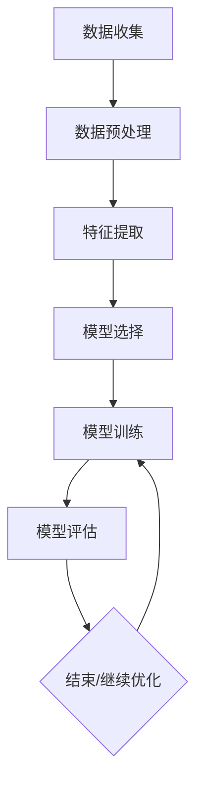

                 

### 1.1 研究背景

AI训练作为人工智能的核心环节，近年来取得了飞速的发展。然而，随着AI应用的不断深入，如何高效地训练AI模型，实现训练过程中的平衡，成为了一个亟待解决的问题。AI训练中的平衡艺术，旨在通过探索与利用，找到在训练过程中资源与效果之间的最佳平衡点，从而提高训练效率，降低训练成本，提升模型的性能。

首先，AI训练的挑战主要体现在以下几个方面：

- **数据质量与数量**：高质量、多样化的数据是训练AI模型的基础。然而，获取和准备这些数据往往需要大量的人力和物力资源，同时数据的质量和数量也会直接影响模型的性能。
- **计算资源**：AI训练是一个计算密集型任务，需要大量的计算资源来处理海量数据，并进行复杂的模型优化。如何高效地利用现有计算资源，成为训练过程中的一个重要问题。
- **模型参数调节**：模型参数的调节对训练效果有着至关重要的影响。然而，参数调节需要考虑多个因素，如模型的复杂度、数据的分布等，使得参数调节变得复杂且具有挑战性。
- **训练时间**：AI训练过程往往需要较长的时间，尤其是在处理大规模数据和高复杂度的模型时。如何缩短训练时间，提高训练效率，是训练过程中的一大难题。

### 1.2 问题描述

在AI训练过程中，如何找到资源与效果之间的平衡点，实现高效、稳定的训练，是一个复杂而具有挑战性的问题。问题描述如下：

1. **数据质量与数量的平衡**：如何获取高质量、多样化的数据，同时避免数据过于庞大导致的计算资源浪费？
2. **计算资源的平衡**：如何高效地利用现有计算资源，避免资源浪费或不足？
3. **模型参数调节的平衡**：如何找到最优的模型参数，实现模型性能与计算资源的最佳平衡？
4. **训练时间的平衡**：如何在保证模型性能的前提下，缩短训练时间，提高训练效率？

这些问题不仅涉及到技术层面，还涉及到资源管理、策略规划等多个方面。解决这些问题，需要我们深入理解AI训练的原理，掌握平衡艺术的核心概念，并在此基础上进行系统性的实践与优化。

### 1.3 问题解决

为了解决上述问题，我们可以从以下几个方面着手：

1. **数据准备与处理**：采用数据预处理技术，如数据清洗、数据增强、数据降维等，提高数据质量；同时，根据训练任务的需求，合理选择数据集，避免数据过于庞大导致的计算资源浪费。
2. **计算资源管理**：通过优化算法、并行计算等技术，提高计算效率；同时，合理分配计算资源，避免资源浪费或不足。
3. **模型参数调节**：采用启发式算法、机器学习等方法，自动调节模型参数，实现模型性能与计算资源的最佳平衡。
4. **训练过程监控与优化**：通过监控训练过程中的关键指标，如损失函数、准确率等，及时调整训练策略；同时，采用超参数调整、模型剪枝等技术，优化训练过程。

### 1.4 边界与外延

在研究AI训练中的平衡艺术时，我们还需要考虑以下几个边界与外延问题：

1. **边界**：平衡艺术的适用范围，包括训练数据的类型、模型的类型、计算资源的类型等。例如，对于大规模图像识别任务，平衡艺术可能更适用于模型参数调节和训练时间的优化。
2. **外延**：平衡艺术的拓展应用，包括其他相关领域的平衡问题，如数据挖掘、机器学习、深度学习等。

### 1.5 概念结构与核心要素组成

在AI训练中的平衡艺术，核心概念包括数据准备、计算资源管理、模型参数调节和训练过程监控。以下是一个简单的概念结构与核心要素组成的ER实体关系图：

```mermaid
erDiagram
  Data Preparation ||--|{ Model Parameter Regulation }|-- Training Process Monitoring
  Data Preparation ||--|{ Computing Resource Management }|--
  Model Parameter Regulation ||--|{ Training Efficiency Optimization }|--
  Training Process Monitoring ||--|{ Training Time Shortening }|--
```

通过上述结构，我们可以清晰地看到各个核心概念之间的关系，以及它们在AI训练中的重要作用。在接下来的章节中，我们将详细探讨这些核心概念及其应用。

### 第2章 AI训练的基本概念

AI训练，即人工智能模型的训练过程，是指通过学习大量数据，使模型能够对未知数据进行预测或分类。理解AI训练的基本概念对于探索与利用AI训练中的平衡艺术至关重要。以下将详细解释AI训练的定义、类型、流程以及核心要素。

#### 2.1 AI训练的定义

AI训练是指通过向人工智能模型提供大量数据进行学习，使模型能够模拟、理解和执行特定任务的动态过程。这个过程包括两个主要阶段：特征学习和预测。特征学习是指模型从数据中提取有用的特征，而预测是指模型利用提取到的特征对新数据进行分类或回归。

#### 2.2 AI训练的类型

AI训练主要分为两种类型：监督学习和无监督学习。

- **监督学习**：在这种类型中，模型通过已标记的数据进行学习。每个数据点都有一个对应的标签，模型的目标是学习一个映射，将输入数据映射到正确的标签。常见的监督学习算法包括线性回归、逻辑回归、决策树、随机森林、支持向量机等。
- **无监督学习**：在这种类型中，模型没有已标记的数据，需要从未标记的数据中自行发现模式。无监督学习主要包括聚类、降维、关联规则学习等算法。

#### 2.3 AI训练的流程

AI训练的流程通常包括以下几个步骤：

1. **数据收集**：收集用于训练的数据集。数据集的质量直接影响模型的性能。
2. **数据预处理**：对数据进行清洗、归一化、缺失值处理等操作，以提高数据质量。
3. **特征提取**：从数据中提取有用的特征，这些特征将用于训练模型。
4. **模型选择**：根据训练任务的需求选择合适的模型。模型的选择对训练效果有重要影响。
5. **模型训练**：使用训练数据集对模型进行训练，调整模型的参数，使其能够更好地拟合数据。
6. **模型评估**：使用验证集或测试集对训练好的模型进行评估，检查其性能。
7. **模型优化**：根据评估结果，对模型进行调整和优化，以提高其性能。

#### 2.4 AI训练的核心要素

AI训练的核心要素包括数据、模型、算法和计算资源。以下是对这些要素的详细解释：

1. **数据**：数据是AI训练的基础，数据的质量和数量直接影响模型的性能。高质量的数据有助于模型更好地学习，而多样化的数据有助于模型泛化能力。
2. **模型**：模型是AI训练的核心，模型的选择和设计对训练效果有重要影响。常见的模型包括神经网络、决策树、支持向量机等。
3. **算法**：算法是训练过程中用于调整模型参数的方法。常见的算法包括梯度下降、随机梯度下降、动量优化等。
4. **计算资源**：计算资源是AI训练的重要保障，足够的计算资源可以提高训练速度，减少训练成本。

通过理解AI训练的基本概念，我们可以更好地把握AI训练中的平衡艺术，从而提高训练效率，降低成本，提升模型性能。在接下来的章节中，我们将进一步探讨平衡艺术的核心概念及其在AI训练中的应用。

### 第3章 平衡艺术的核心概念

在AI训练过程中，平衡艺术是一个至关重要的概念，它涉及到如何在多个相互冲突的目标之间找到最佳平衡点。在这一章中，我们将详细探讨平衡艺术的定义、原理、属性特征及其在AI训练中的应用。

#### 3.1 平衡艺术的定义

平衡艺术，即在AI训练过程中，通过协调和优化不同要素之间的关系，实现资源利用与训练效果的最佳平衡。这个概念强调的是在资源有限的情况下，如何最大化模型的性能，同时最小化训练成本和时间。

#### 3.2 平衡艺术的原理

平衡艺术的原理可以从以下几个方面进行理解：

1. **资源优化**：通过合理分配和利用计算资源，避免资源浪费，提高训练效率。
2. **效果最大化**：通过调整模型参数和优化训练策略，提高模型的性能和泛化能力。
3. **动态调整**：训练过程中，不断监控和评估模型性能，根据实际情况进行动态调整，保持系统的最佳状态。

#### 3.3 平衡艺术的属性特征对比

为了更好地理解平衡艺术的属性特征，我们可以将其与一些常见的概念进行对比，如表1所示：

| 特征         | 平衡艺术           | 其他概念             |
| ------------ | ------------------ | -------------------- |
| 目标         | 资源利用与效果平衡 | 资源利用或效果优化   |
| 方法         | 综合考虑多方面因素 | 单一目标优化策略     |
| 应对策略     | 动态调整与优化     | 静态固定策略         |
| 应用范围     | 全过程AI训练       | 某一阶段或环节       |
| 可扩展性     | 强               | 弱                 |

通过对比可以发现，平衡艺术强调的是全过程的综合优化，而不是单一目标的优化。这使得平衡艺术在应对复杂问题时具有更强的灵活性和适应性。

#### 3.4 平衡艺术在AI训练中的应用

平衡艺术在AI训练中的应用可以从以下几个方面进行：

1. **数据集选择与处理**：选择适当的数据集，并通过数据预处理和增强技术，提高数据质量，实现数据与模型训练需求之间的平衡。
2. **模型结构与参数调节**：设计合适的模型结构，并使用启发式算法和优化技术，动态调整模型参数，以实现模型性能与计算资源之间的最佳平衡。
3. **训练策略优化**：根据训练过程的表现，动态调整训练策略，如学习率调整、正则化方法选择等，以提高训练效率和模型性能。
4. **资源管理**：通过并行计算、分布式训练等技术，优化计算资源的使用，提高训练速度和效率。

总之，平衡艺术在AI训练中的应用，旨在通过综合优化多个要素，实现资源利用与训练效果之间的最佳平衡，从而提高模型的性能和稳定性。

通过本章的讨论，我们可以看到，平衡艺术是AI训练中一个关键且复杂的概念，它需要我们在多个相互冲突的目标之间找到最佳平衡点。在接下来的章节中，我们将进一步探讨如何在AI训练中具体应用平衡艺术，以实现高效、稳定的训练过程。

### 第4章 数据集的选择与处理

在AI训练中，数据集的选择与处理是至关重要的环节，它直接影响到模型的性能和泛化能力。一个高质量、平衡且多样化的数据集对于训练一个有效的AI模型至关重要。以下将详细探讨数据集的选择标准、处理方法以及如何在实际应用中平衡数据集。

#### 4.1 数据集的重要性

数据集是AI模型训练的基石，其质量直接影响模型的训练效果。高质量的数据集能够帮助模型更好地学习，提高模型的准确性和泛化能力。以下是一些数据集对模型性能的重要性：

1. **多样性**：多样化的数据集可以帮助模型学习到更广泛的知识，从而提高模型的泛化能力。
2. **质量**：高质量的数据集可以减少噪声和错误，使模型能够更准确地学习特征。
3. **平衡**：平衡的数据集能够避免模型偏向于某个类别，从而提高模型的公平性和鲁棒性。
4. **代表性**：代表性强的数据集能够更好地反映实际问题，使模型在实际应用中表现出更好的性能。

#### 4.2 数据集的选择标准

选择一个合适的数据集需要考虑以下几个标准：

1. **数据类型**：根据训练任务的需求，选择适合的数据类型。例如，对于图像识别任务，选择图像数据集；对于自然语言处理任务，选择文本数据集。
2. **数据量**：选择足够大的数据集，以确保模型有足够的信息进行学习。但数据量过大也会增加训练时间和计算成本。
3. **多样性**：数据集应包含多样化的样本，以帮助模型学习到更广泛的知识。
4. **标注质量**：如果数据集需要标注，确保标注的准确性和一致性，以避免模型学习到错误的信息。
5. **来源可靠性**：选择来源可靠的数据集，以避免数据质量问题。

#### 4.3 数据集的处理方法

数据集的选择只是第一步，处理数据集同样重要。以下是一些常用的数据集处理方法：

1. **数据清洗**：去除数据集中的噪声和错误数据，如缺失值、重复值和异常值等。
2. **数据归一化**：将数据集中的特征进行归一化处理，使其具有相同的尺度，以避免某些特征对模型训练产生过大的影响。
3. **数据增强**：通过旋转、翻转、缩放、裁剪等操作，增加数据集的多样性，从而提高模型的泛化能力。
4. **数据平衡**：对于不平衡的数据集，通过过采样、欠采样、合成样本等方法，使数据集在类别上达到平衡，从而避免模型偏向于某个类别。

#### 4.4 数据集的平衡艺术实践

在实际应用中，平衡数据集是实现AI模型训练平衡艺术的重要一环。以下是一些实践方法：

1. **类别平衡**：通过过采样或欠采样方法，使数据集中每个类别的样本数量达到平衡。例如，对于不平衡的数据集，可以使用SMOTE（合成少数类过采样技术）来增加少数类别的样本数量。
2. **权重调整**：在训练过程中，为不同类别的样本分配不同的权重，以平衡模型的关注点。例如，在分类问题中，可以为少数类别的样本分配更高的权重。
3. **交叉验证**：使用交叉验证方法来评估模型的性能，并在训练过程中不断调整数据集的平衡，以找到最佳平衡点。
4. **动态调整**：根据训练过程中模型的性能表现，动态调整数据集的平衡策略。例如，如果发现模型对某个类别过度拟合，可以增加该类别的样本数量，以纠正偏差。

通过以上实践方法，我们可以实现数据集的平衡，从而为AI模型训练提供一个更加稳定和可靠的基础。在接下来的章节中，我们将继续探讨模型结构与参数调节的平衡艺术。

### 第5章 模型结构与参数调节

在AI训练中，模型结构与参数调节是两个至关重要的环节。一个合适的模型结构可以提升模型的性能，而合理的参数调节则可以确保模型在训练过程中达到最佳状态。本章将详细讨论模型结构的选择、参数调节的方法和技巧，并探讨如何在实际应用中实现模型结构与参数调节的平衡艺术。

#### 5.1 模型结构的选择

选择一个合适的模型结构是AI训练成功的关键。以下是一些常见的模型结构选择标准：

1. **任务类型**：根据训练任务的不同，选择适合的模型结构。例如，对于图像识别任务，卷积神经网络（CNN）通常是一个很好的选择；对于自然语言处理任务，循环神经网络（RNN）或Transformer结构可能更适合。
2. **数据特性**：模型结构应适应数据特性。例如，对于高维数据，可以采用降维技术；对于序列数据，可以考虑使用RNN或LSTM。
3. **计算资源**：考虑模型的复杂度，选择适合计算资源限制的结构。例如，对于资源有限的场景，可以选择轻量级模型，如MobileNet或ShuffleNet。
4. **已有成果**：参考已有的研究成果和最佳实践，选择经过验证的模型结构。

#### 5.2 参数调节的方法

参数调节是模型训练过程中的一项重要任务，它直接影响到模型的性能和收敛速度。以下是一些常用的参数调节方法：

1. **学习率调节**：学习率是模型训练中最重要的参数之一。学习率过高可能导致模型无法收敛，而学习率过低则可能导致训练时间过长。常用的调节方法包括固定学习率、学习率衰减和自适应学习率调节（如AdaGrad、Adam等）。
2. **批量大小调节**：批量大小影响模型的训练速度和稳定性。较小的批量大小可以提供更好的梯度估计，但训练速度较慢；较大的批量大小可以提高训练速度，但可能降低模型的泛化能力。
3. **正则化方法**：正则化是防止模型过拟合的重要手段。常用的正则化方法包括L1正则化、L2正则化和Dropout。
4. **优化器选择**：选择合适的优化器可以显著提高模型的训练效率。常用的优化器包括SGD、Adam、RMSprop等。

#### 5.3 参数调节的技巧

在实际参数调节过程中，以下技巧可以帮助我们更有效地找到最佳参数：

1. **交叉验证**：通过交叉验证方法，在不同数据集上评估模型参数，从而找到最佳参数组合。
2. **网格搜索**：在参数空间内遍历所有可能的参数组合，找到最优的参数组合。虽然这种方法计算量大，但在寻找最佳参数时非常有效。
3. **贝叶斯优化**：使用贝叶斯优化方法，根据模型的性能和已有参数，动态调整搜索方向，提高参数调节的效率。
4. **动态调整**：根据训练过程中的模型性能，动态调整参数，以保持模型的最佳状态。

#### 5.4 模型结构与参数调节的平衡艺术

在实际应用中，如何实现模型结构与参数调节的平衡艺术，是AI训练中的一大挑战。以下是一些建议：

1. **系统性优化**：综合考虑模型结构、数据集、训练策略和计算资源，进行系统性优化。例如，在模型选择时，可以考虑数据集的特点，选择合适的模型结构。
2. **动态调整**：根据训练过程中的模型性能，动态调整参数，以保持模型的最佳状态。例如，在训练过程中，可以定期评估模型性能，并根据评估结果调整学习率和其他参数。
3. **监控与反馈**：建立监控体系，实时监控训练过程中的关键指标，如损失函数、准确率等，并根据反馈进行调整。例如，如果发现模型过拟合，可以增加正则化力度。
4. **经验积累**：积累实际训练经验，建立参数调节的模板库，根据不同任务的需求，灵活调整参数。

通过以上方法，我们可以在模型结构与参数调节之间实现平衡艺术，从而提高AI模型的训练效率和性能。在接下来的章节中，我们将进一步探讨训练过程中的常见问题及解决方案。

### 第6章 训练过程中的问题与解决

在AI训练过程中，尽管我们通过平衡艺术努力优化模型结构和参数，但仍然会遇到各种问题。以下将列举训练过程中的常见问题，分析其可能的原因，并提出相应的解决方法。

#### 6.1 过拟合与欠拟合

**过拟合**：模型在训练数据上表现良好，但在未见过的新数据上表现不佳。这是因为模型对训练数据过度拟合，没有很好地泛化。

**欠拟合**：模型在训练数据和新数据上表现都较差。这是因为模型过于简单，无法捕捉到数据中的有效特征。

**原因**：

- 过拟合：模型过于复杂，特征学习能力过强，导致对训练数据的噪声和细节过度关注。
- 欠拟合：模型过于简单，无法捕捉到数据中的关键特征，导致模型表现不佳。

**解决方法**：

- **正则化**：通过L1、L2正则化或Dropout减少模型复杂度，防止过拟合。
- **增加数据量**：通过数据增强或收集更多数据，提高模型的泛化能力。
- **调整模型结构**：增加模型的层数或调整层的连接方式，提高模型的表达能力。

#### 6.2 训练时间过长

训练时间过长可能是由于以下原因：

- 数据集过大：训练数据量过大导致训练时间过长。
- 模型复杂度高：模型过于复杂，计算量巨大。
- 计算资源不足：计算资源不足以支持快速训练。

**解决方法**：

- **数据预处理**：对数据进行预处理，减少数据量，如使用数据采样或特征选择。
- **模型简化**：选择简单且高效的模型结构，如使用轻量级网络。
- **分布式训练**：使用分布式计算，如多GPU训练，加速训练过程。

#### 6.3 模型性能不稳定

模型性能不稳定可能是由于以下原因：

- 学习率调整不当：学习率过大或过小导致模型训练不稳定。
- 数据分布不均：数据分布不均匀导致模型在某些区域表现较差。
- 模型参数初始化问题：模型参数初始化不当导致训练不稳定。

**解决方法**：

- **学习率调整策略**：采用自适应学习率调节方法，如Adam或Adadelta。
- **数据平衡**：通过数据增强或采样方法，使数据分布更加均匀。
- **初始化策略**：使用合适的初始化方法，如Xavier初始化或He初始化。

#### 6.4 训练过程中数据泄露

数据泄露可能导致模型在新数据上表现不佳。这通常是由于训练过程中使用了未标记的数据或数据预处理不当。

**解决方法**：

- **数据隔离**：确保训练数据和测试数据完全隔离，避免数据泄露。
- **数据清洗**：确保数据集中的每个数据点都经过充分的清洗和预处理，避免包含噪声和错误。

通过以上方法，我们可以有效地解决AI训练过程中遇到的各种问题，提高模型的训练效率和性能。在接下来的章节中，我们将继续探讨AI训练中的最佳实践。

### 第7章 AI训练中的最佳实践

在AI训练过程中，遵循最佳实践能够显著提高模型的性能和稳定性。以下将介绍一些AI训练中的通用最佳实践，并结合实际案例进行详细分析。

#### 7.1 最佳实践概述

AI训练中的最佳实践包括以下方面：

1. **数据预处理**：确保数据质量，进行数据清洗、归一化、缺失值处理等。
2. **模型选择**：根据任务需求选择合适的模型结构，并进行适当的调整。
3. **参数调节**：动态调整学习率、批量大小、正则化参数等，以优化模型性能。
4. **训练监控**：实时监控训练过程中的关键指标，如损失函数、准确率等。
5. **超参数优化**：使用网格搜索、贝叶斯优化等方法，找到最佳超参数组合。
6. **模型验证**：通过交叉验证和测试集评估模型性能，确保模型泛化能力。

#### 7.2 平衡艺术的案例分析

以图像识别任务为例，介绍如何在训练过程中应用平衡艺术。

1. **数据预处理**：使用数据增强技术（如旋转、翻转、缩放）增加数据多样性，并通过归一化处理，使数据具有相同的尺度。
2. **模型选择**：选择卷积神经网络（CNN）作为基础结构，根据数据特点和任务需求，调整模型层数和滤波器大小。
3. **参数调节**：使用Adam优化器，动态调整学习率，并设置适当的批量大小和正则化参数，以防止过拟合。
4. **训练监控**：实时监控训练过程中的损失函数和准确率，根据表现调整训练策略。
5. **超参数优化**：通过网格搜索，找到最佳学习率和批量大小组合。
6. **模型验证**：在测试集上评估模型性能，确保模型泛化能力。

#### 7.3 小结与注意事项

在遵循最佳实践时，需要注意以下几点：

1. **数据质量**：确保数据集的质量和多样性，避免数据泄露。
2. **模型复杂度**：根据任务需求选择合适的模型复杂度，避免过度拟合或欠拟合。
3. **资源管理**：合理分配计算资源，充分利用分布式计算技术。
4. **迭代优化**：持续优化模型和训练策略，根据实际表现进行调整。

#### 7.4 拓展阅读

对于希望深入了解AI训练最佳实践的读者，以下是一些推荐的拓展阅读资源：

1. **《深度学习》（Goodfellow, Bengio, Courville著）**：详细介绍了深度学习的理论基础和最佳实践。
2. **《机器学习实战》（周志华著）**：提供了丰富的机器学习案例和实践经验。
3. **《AI训练指南：实践中的深度学习》（Ian Goodfellow著）**：涵盖了AI训练的各个方面，包括最佳实践和技术细节。

通过以上最佳实践，我们可以更有效地进行AI训练，提高模型性能和稳定性。在未来的研究中，我们还可以进一步探索AI训练中的新方法和技术，以应对日益复杂的AI应用场景。

### 附录：AI训练中的Mermaid流程图和Python源代码示例

在AI训练过程中，可视化工具和编程语言的使用可以帮助我们更好地理解训练流程，并进行有效的调试和优化。以下将提供一些Mermaid流程图和Python源代码示例，以展示AI训练的基本流程和关键步骤。

#### 附录1: Mermaid流程图示例

**Mermaid语法用于绘制AI训练流程图：**



**流程图解释：**
- **A[数据收集]**：从外部获取或生成训练数据。
- **B[数据预处理]**：对数据集进行清洗、归一化、缺失值填充等操作。
- **C[特征提取]**：从预处理后的数据中提取有用的特征。
- **D[模型选择]**：根据任务需求选择合适的模型结构。
- **E[模型训练]**：使用训练数据对模型进行训练，调整参数。
- **F[模型评估]**：使用验证集或测试集对训练好的模型进行性能评估。
- **G{结束/继续优化]**：根据评估结果决定是否结束训练，或者继续优化模型。

#### 附录2: Python源代码示例

**Python源代码示例用于AI训练的基本步骤：**

```python
import numpy as np
from sklearn.datasets import load_iris
from sklearn.model_selection import train_test_split
from sklearn.ensemble import RandomForestClassifier
from sklearn.metrics import accuracy_score

# 数据加载与预处理
iris_data = load_iris()
X, y = iris_data.data, iris_data.target

# 划分训练集和测试集
X_train, X_test, y_train, y_test = train_test_split(X, y, test_size=0.2, random_state=42)

# 特征提取（此处为简单示例，实际应用中可能涉及更复杂的特征工程）
# 特征提取在此省略

# 模型选择
model = RandomForestClassifier(n_estimators=100, random_state=42)

# 模型训练
model.fit(X_train, y_train)

# 模型评估
y_pred = model.predict(X_test)
accuracy = accuracy_score(y_test, y_pred)
print(f"Model Accuracy: {accuracy:.2f}")

# 模型优化（根据评估结果进行优化，如调整参数、使用交叉验证等）
# 模型优化在此省略
```

**代码解释：**
- **数据加载与预处理**：使用scikit-learn库加载Iris数据集，并进行数据集的划分。
- **特征提取**：根据具体任务需求，对数据进行特征工程。
- **模型选择**：选择随机森林分类器作为模型。
- **模型训练**：使用训练数据进行模型训练。
- **模型评估**：使用测试集对模型进行评估，计算准确率。
- **模型优化**：根据模型评估结果，进行模型参数调整或其他优化策略。

通过这些示例，我们可以看到Mermaid流程图和Python源代码在AI训练中的应用，帮助研究者更好地理解和实现AI训练的基本流程和关键步骤。在未来的研究和实践中，可以结合具体任务需求，进一步探索和优化这些工具和方法。

