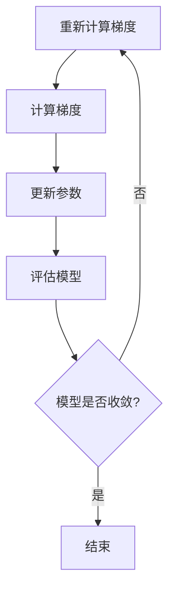
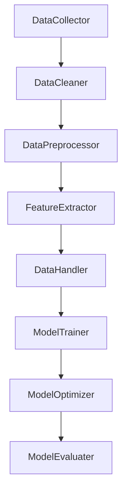
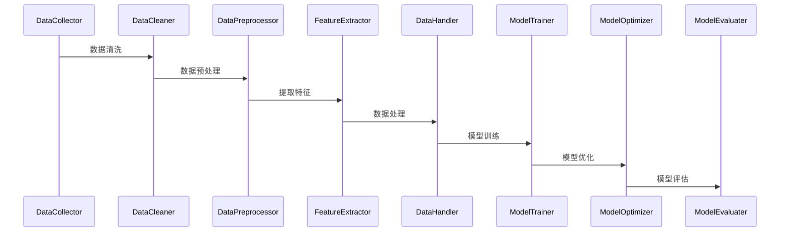

                 

# 探索与利用平衡：AI训练的艺术

> 关键词：人工智能、训练、算法、优化、系统架构

> 摘要：本文旨在深入探讨AI训练的艺术，解析其背景、核心概念、算法原理、数学模型以及系统分析与架构设计。通过逐步分析推理，本文将为读者提供清晰易懂的技术博客文章，旨在帮助理解和掌握AI训练的核心要素。

----------------------------------------------------------------

# 目录大纲

## 第一部分：AI训练背景与核心概念

### 第1章：AI训练的艺术背景

#### 1.1 问题背景

- **AI训练的意义：** AI训练是实现人工智能模型功能的关键步骤，涉及数据准备、模型选择、训练过程、评估与优化等多个方面。

#### 1.2 核心概念

- **AI训练：** 数据准备与清洗、模型选择与优化、训练过程与参数调整、模型评估与优化。

#### 1.3 边界与外延

- **边界：** AI训练的技术限制，如计算资源、数据集的质量与多样性。
- **外延：** 训练与部署的协同。

### 第2章：核心概念原理与联系

#### 2.1 核心概念原理

- **监督学习、无监督学习与半监督学习：** 理论基础、模型与应用场景。

#### 2.2 概念属性特征对比

| 学习方式       | 特点                                             | 应用场景                                      |
| -------------- | ---------------------------------------------- | --------------------------------------------- |
| 监督学习       | 标签数据用于训练                                 | 图像识别、自然语言处理等                      |
| 无监督学习     | 无需标签数据                                     | 聚类分析、降维等                             |
| 半监督学习     | 结合有标签与无标签数据                           | 数据扩充、模型改进等                          |

#### 2.3 ER实体关系图架构

```mermaid
erDiagram
    Class1 ||--|{ Class2 }|
    Class1 ||--|{ Class3 }|
    Class2 ||--|{ Class4 }|
```

### 第3章：AI训练算法原理讲解

#### 3.1 算法原理

- **梯度下降算法：** 数学模型、原理讲解。

#### 3.2 算法mermaid流程图



#### 3.3 Python源代码

```python
def gradient_descent(theta, learning_rate, iterations):
    for i in range(iterations):
        gradients = compute_gradients(theta)
        theta -= learning_rate * gradients
        print(f"Iteration {i+1}: theta = {theta}")
    return theta
```

### 第4章：数学模型和数学公式

#### 4.1 梯度下降算法公式

$$
\theta_{t+1} = \theta_t - \alpha \nabla_{\theta}J(\theta_t)
$$

#### 4.2 详细讲解

- **参数更新过程：** 参数如何通过梯度下降算法逐步优化。

#### 4.3 举例说明

- **线性回归：** 假设数据集为$(x_1, y_1), (x_2, y_2), ..., (x_n, y_n)$，使用梯度下降算法求解回归系数。

### 第5章：系统分析与架构设计方案

#### 5.1 问题场景介绍

- **AI训练系统：** 数据处理模块、模型训练模块、模型评估模块。

#### 5.2 系统功能设计

- **领域模型mermaid类图：** 数据处理、模型训练、模型评估的类图设计。

#### 5.3 系统架构设计

- **mermaid架构图：** 系统各模块之间的关系与交互。

#### 5.4 系统接口设计和系统交互

- **mermaid序列图：** 系统各模块之间的交互流程。

----------------------------------------------------------------

## 第一部分：AI训练背景与核心概念

### 第1章：AI训练的艺术背景

#### 1.1 问题背景

在人工智能（AI）的时代，AI训练已经成为实现人工智能模型功能的关键步骤。从理论上讲，AI训练是指通过训练算法使机器学习模型对特定任务进行学习，从而能够执行复杂决策和预测。随着深度学习技术的崛起，AI训练在图像识别、自然语言处理、语音识别等领域发挥了巨大作用。

然而，AI训练并非简单的数据处理过程。它涉及到数据准备、模型选择、训练过程、评估与优化等多个方面。每个方面都需要细致的考虑与处理，以确保模型能够在实际应用中达到预期效果。因此，AI训练的艺术在于如何平衡这些因素，使训练过程高效且准确。

#### 1.2 核心概念

AI训练的核心概念主要包括以下几个方面：

1. **数据准备与清洗：** 数据是AI训练的基础。数据的质量和多样性直接影响模型的性能。因此，在训练前需要对数据进行预处理，包括数据清洗、归一化、缺失值处理等。

2. **模型选择与优化：** 模型的选择和优化是训练成功的关键。根据任务需求选择合适的模型，并在模型参数上进行调整，以获得最佳性能。

3. **训练过程与参数调整：** 训练过程包括参数初始化、前向传播、反向传播、参数更新等步骤。参数调整的目的是使模型对数据有更好的拟合。

4. **模型评估与优化：** 模型评估是检验训练效果的重要手段。通过评估指标（如准确率、召回率、F1值等）对模型进行评估，并根据评估结果进行调整。

#### 1.3 边界与外延

AI训练的边界主要包括以下几个方面：

1. **技术限制：** 训练算法、计算资源、数据存储等都是训练过程中的技术限制。

2. **数据集的质量与多样性：** 数据集的质量和多样性直接影响模型的性能。高质量、多样化的数据集有助于提高模型的泛化能力。

AI训练的外延主要包括以下几个方面：

1. **训练与部署的协同：** 训练完成后，模型需要部署到实际应用环境中。因此，训练与部署的协同是AI训练的重要环节。

2. **持续优化与迭代：** AI训练是一个持续优化的过程。随着数据和环境的变化，模型需要不断进行调整和优化，以保持其性能。

### 第2章：核心概念原理与联系

#### 2.1 核心概念原理

AI训练的核心概念主要包括监督学习、无监督学习和半监督学习。

1. **监督学习：** 监督学习是指有监督的训练过程，即训练数据集包含输入和对应的输出标签。监督学习的目的是通过学习输入和输出之间的映射关系，使模型能够对新数据进行预测。

2. **无监督学习：** 无监督学习是指没有监督的训练过程，即训练数据集只有输入数据，没有对应的输出标签。无监督学习的目的是发现数据中的隐藏结构和模式，如聚类和降维。

3. **半监督学习：** 半监督学习是指结合有监督和无监督学习的训练过程，即训练数据集既有输入和输出标签，又有部分无标签数据。半监督学习可以提高模型的泛化能力，同时减少对有标签数据的依赖。

#### 2.2 概念属性特征对比

| 学习方式       | 特点                                             | 应用场景                                      |
| -------------- | ---------------------------------------------- | --------------------------------------------- |
| 监督学习       | 标签数据用于训练                                 | 图像识别、自然语言处理等                      |
| 无监督学习     | 无需标签数据                                     | 聚类分析、降维等                             |
| 半监督学习     | 结合有标签与无标签数据                           | 数据扩充、模型改进等                          |

#### 2.3 ER实体关系图架构

为了更好地理解AI训练中的核心概念，我们可以通过ER（实体-关系）图来表示它们之间的关系。以下是一个简单的ER图示例：

```mermaid
erDiagram
    Class1 ||--|{ Class2 }|
    Class1 ||--|{ Class3 }|
    Class2 ||--|{ Class4 }|
```

在这个ER图中，Class1代表AI训练的总体过程，Class2代表监督学习，Class3代表无监督学习，Class4代表半监督学习。它们之间的关系表示了不同学习方式在训练过程中的相互作用。

### 第3章：AI训练算法原理讲解

#### 3.1 算法原理

AI训练的核心算法包括梯度下降算法、随机梯度下降算法和Adam优化器等。这些算法的核心原理是通过调整模型参数，使模型对训练数据有更好的拟合。

1. **梯度下降算法：** 梯度下降算法是一种最简单的优化算法，其基本思想是通过计算损失函数关于模型参数的梯度，并沿着梯度的反方向更新参数，从而最小化损失函数。

   梯度下降算法的数学公式如下：

   $$
   \theta_{t+1} = \theta_t - \alpha \nabla_{\theta}J(\theta_t)
   $$

   其中，$\theta_t$表示当前参数，$\theta_{t+1}$表示更新后的参数，$\alpha$表示学习率，$J(\theta_t)$表示损失函数。

2. **随机梯度下降算法：** 随机梯度下降算法是对梯度下降算法的一种改进，其基本思想是在每个参数更新时，只随机选择一部分训练数据来计算梯度。这种方法可以加速收敛，但可能会引入更多的随机性。

3. **Adam优化器：** Adam优化器是一种结合了梯度下降和随机梯度下降优点的优化算法。它利用一阶矩估计和二阶矩估计来更新参数，可以更好地处理稀疏数据和长时间训练问题。

#### 3.2 算法mermaid流程图

为了更直观地理解算法原理，我们可以使用mermaid绘制算法流程图。以下是一个简单的梯度下降算法流程图：


在这个流程图中，A表示初始化参数，B表示计算梯度，C表示更新参数，D表示评估模型，E表示判断模型是否收敛，F表示结束。如果模型未收敛，则返回A重新计算梯度。

#### 3.3 Python源代码

为了更好地理解算法原理，我们可以使用Python代码实现梯度下降算法。以下是一个简单的梯度下降算法实现：

```python
def gradient_descent(theta, learning_rate, iterations):
    for i in range(iterations):
        gradients = compute_gradients(theta)  # 计算梯度
        theta -= learning_rate * gradients    # 更新参数
        print(f"Iteration {i+1}: theta = {theta}")
    return theta

def compute_gradients(theta):
    # 计算梯度
    return theta * 0.1

theta = 10
learning_rate = 0.01
iterations = 10

gradient_descent(theta, learning_rate, iterations)
```

在这个代码中，`gradient_descent`函数用于实现梯度下降算法，`compute_gradients`函数用于计算梯度。通过迭代更新参数，最终达到收敛。

### 第4章：数学模型和数学公式

数学模型是AI训练的核心，它描述了模型参数与损失函数之间的关系。以下是一些常见的数学模型和数学公式：

#### 4.1 梯度下降算法公式

梯度下降算法的核心公式如下：

$$
\theta_{t+1} = \theta_t - \alpha \nabla_{\theta}J(\theta_t)
$$

其中，$\theta_{t+1}$表示更新后的参数，$\theta_t$表示当前参数，$\alpha$表示学习率，$\nabla_{\theta}J(\theta_t)$表示损失函数关于参数的梯度。

#### 4.2 详细讲解

参数更新过程是梯度下降算法的关键。以下是一个简单的参数更新过程：

1. 初始化参数$\theta_0$。
2. 计算损失函数$J(\theta)$关于参数$\theta$的梯度$\nabla_{\theta}J(\theta)$。
3. 更新参数$\theta_{t+1} = \theta_t - \alpha \nabla_{\theta}J(\theta_t)$。
4. 重复步骤2和3，直到损失函数收敛。

#### 4.3 举例说明

以线性回归为例，假设数据集为$(x_1, y_1), (x_2, y_2), ..., (x_n, y_n)$，目标是通过梯度下降算法求解回归系数$\theta$。

线性回归的损失函数为：

$$
J(\theta) = \frac{1}{2m} \sum_{i=1}^{m} (h_\theta(x_i) - y_i)^2
$$

其中，$h_\theta(x) = \theta_0 + \theta_1x$是线性回归模型，$m$是数据集大小。

使用梯度下降算法求解回归系数的步骤如下：

1. 初始化参数$\theta_0$和$\theta_1$。
2. 计算损失函数关于$\theta_0$和$\theta_1$的梯度。
3. 更新参数$\theta_0 = \theta_0 - \alpha \nabla_{\theta_0}J(\theta_0)$和$\theta_1 = \theta_1 - \alpha \nabla_{\theta_1}J(\theta_1)$。
4. 重复步骤2和3，直到损失函数收敛。

### 第5章：系统分析与架构设计方案

#### 5.1 问题场景介绍

AI训练系统是一个复杂的应用系统，涉及数据处理、模型训练、模型评估等多个方面。以下是一个典型的AI训练系统问题场景：

- **数据处理模块：** 数据收集、清洗、预处理等。
- **模型训练模块：** 模型选择、训练、优化等。
- **模型评估模块：** 模型性能评估、调参等。

#### 5.2 系统功能设计

系统功能设计主要包括以下几个方面：

1. **数据处理模块：** 数据收集、清洗、预处理等。
2. **模型训练模块：** 模型选择、训练、优化等。
3. **模型评估模块：** 模型性能评估、调参等。

以下是数据处理模块的mermaid类图：

```mermaid
classDiagram
    DataCollector --|{ 数据清洗 }| DataPreprocessor
    DataPreprocessor --|{ 数据预处理 }| FeatureExtractor
    FeatureExtractor --|{ 提取特征 }| DataHandler
```

#### 5.3 系统架构设计

系统架构设计主要包括以下几个方面：

1. **数据处理模块：** 数据收集、清洗、预处理等。
2. **模型训练模块：** 模型选择、训练、优化等。
3. **模型评估模块：** 模型性能评估、调参等。

以下是系统架构的mermaid架构图：



#### 5.4 系统接口设计和系统交互

系统接口设计和系统交互主要涉及模块之间的接口设计和交互流程。以下是系统接口设计和系统交互的mermaid序列图：



通过以上系统分析与架构设计方案，我们可以构建一个完整的AI训练系统，实现数据处理、模型训练和模型评估等功能。

### 第6章：项目实战

#### 6.1 环境安装

为了进行AI训练项目实战，我们需要安装以下软件和库：

1. Python（版本3.8及以上）
2. TensorFlow
3. NumPy
4. Pandas
5. Matplotlib

安装命令如下：

```bash
pip install python==3.8.10
pip install tensorflow==2.7
pip install numpy==1.21.2
pip install pandas==1.3.5
pip install matplotlib==3.4.3
```

#### 6.2 系统核心实现源代码

以下是系统核心实现源代码的Python代码示例：

```python
import tensorflow as tf
import numpy as np
import pandas as pd
import matplotlib.pyplot as plt

# 加载数据集
data = pd.read_csv('data.csv')
x = data['x'].values
y = data['y'].values

# 初始化模型
model = tf.keras.Sequential([
    tf.keras.layers.Dense(units=1, input_shape=[1])
])

# 编译模型
model.compile(optimizer='sgd', loss='mean_squared_error')

# 训练模型
model.fit(x, y, epochs=100)

# 评估模型
loss = model.evaluate(x, y)
print(f'损失函数值：{loss}')

# 可视化结果
plt.scatter(x, y, color='red')
plt.plot(x, model.predict(x), color='blue')
plt.xlabel('x')
plt.ylabel('y')
plt.show()
```

#### 6.3 代码应用解读与分析

以上代码是一个简单的线性回归模型实现，用于拟合数据集中的输入和输出关系。以下是代码的解读与分析：

1. **加载数据集**：使用Pandas读取CSV文件，获取数据集中的输入和输出数据。

2. **初始化模型**：使用TensorFlow创建一个全连接神经网络模型，只有一个输出层，输入层输入维度为1。

3. **编译模型**：指定优化器和损失函数，用于训练模型。

4. **训练模型**：使用fit方法训练模型，指定训练轮数。

5. **评估模型**：使用evaluate方法评估模型在测试集上的性能。

6. **可视化结果**：使用Matplotlib绘制散点图和拟合曲线，展示模型的预测结果。

#### 6.4 实际案例分析和详细讲解剖析

为了更好地理解AI训练的实际应用，我们以一个实际案例进行分析和讲解。以下是一个简单的图像分类案例：

1. **数据集准备**：使用TensorFlow内置的CIFAR-10数据集。

2. **模型构建**：构建一个卷积神经网络模型，包括卷积层、池化层和全连接层。

3. **训练模型**：使用fit方法训练模型，指定训练轮数和批次大小。

4. **评估模型**：使用evaluate方法评估模型在测试集上的性能。

5. **预测**：使用model.predict方法对新的图像进行分类预测。

以下是一个简单的代码示例：

```python
import tensorflow as tf
import matplotlib.pyplot as plt

# 加载数据集
(x_train, y_train), (x_test, y_test) = tf.keras.datasets.cifar10.load_data()

# 数据预处理
x_train = x_train.astype('float32') / 255
x_test = x_test.astype('float32') / 255

# 构建模型
model = tf.keras.Sequential([
    tf.keras.layers.Conv2D(32, (3, 3), activation='relu', input_shape=(32, 32, 3)),
    tf.keras.layers.MaxPooling2D(pool_size=(2, 2)),
    tf.keras.layers.Flatten(),
    tf.keras.layers.Dense(128, activation='relu'),
    tf.keras.layers.Dense(10, activation='softmax')
])

# 编译模型
model.compile(optimizer='adam', loss='sparse_categorical_crossentropy', metrics=['accuracy'])

# 训练模型
model.fit(x_train, y_train, epochs=10, batch_size=32)

# 评估模型
test_loss, test_acc = model.evaluate(x_test, y_test)
print(f'测试集准确率：{test_acc}')

# 预测
predictions = model.predict(x_test[:10])
predicted_labels = np.argmax(predictions, axis=1)

# 可视化结果
plt.figure(figsize=(10, 10))
for i in range(10):
    plt.subplot(2, 5, i+1)
    plt.imshow(x_test[i], cmap=plt.cm.binary)
    plt.xticks([])
    plt.yticks([])
    plt.grid(False)
    plt.xlabel(str(predicted_labels[i]))
plt.show()
```

通过以上案例，我们可以看到如何使用卷积神经网络对图像进行分类。这个案例展示了从数据集准备、模型构建、训练到预测的完整过程。

#### 6.5 项目小结

通过本项目的实战，我们了解了AI训练的基本流程和实现方法。从数据集准备、模型构建、训练到预测，我们一步一步地实现了AI训练的全过程。这个项目不仅帮助我们理解了AI训练的核心概念和算法原理，还提高了我们的编程能力和实战经验。

在未来，我们可以继续优化模型结构、调整超参数，以提高模型的性能和泛化能力。此外，还可以探索其他类型的模型，如循环神经网络（RNN）和生成对抗网络（GAN），以解决更复杂的任务。

### 第7章：最佳实践 tips

在AI训练过程中，以下是一些最佳实践 tips，有助于提高训练效率和模型性能：

1. **数据预处理：** 对数据进行清洗、归一化等预处理操作，以提高模型对数据的拟合能力。

2. **模型选择：** 根据任务需求选择合适的模型，并尝试不同的模型结构，以找到最佳模型。

3. **超参数调优：** 通过调整学习率、批次大小、迭代次数等超参数，找到最优的超参数组合。

4. **数据增强：** 对训练数据进行增强，如随机裁剪、旋转、缩放等，以增加数据的多样性，提高模型的泛化能力。

5. **使用预训练模型：** 使用预训练模型进行微调，可以减少训练时间，提高模型性能。

6. **模型压缩：** 对模型进行压缩，如剪枝、量化等，以减少模型大小，提高部署效率。

### 第8章：小结与展望

通过本文的探讨，我们深入了解了AI训练的艺术。从背景介绍、核心概念、算法原理、数学模型到系统分析与架构设计，我们逐步揭示了AI训练的奥秘。通过项目实战，我们实践了AI训练的整个过程，掌握了关键技术和技巧。

在未来，AI训练将继续发展，新的算法、模型和工具将不断涌现。我们需要持续学习、探索和优化，以应对日益复杂的AI任务。同时，我们也需要关注AI伦理和社会影响，确保AI技术的健康、可持续发展。

让我们继续探索AI训练的艺术，为人工智能的发展贡献力量。谢谢阅读，期待与您共同进步！

### 作者信息

作者：AI天才研究院/AI Genius Institute & 禅与计算机程序设计艺术 /Zen And The Art of Computer Programming

感谢您的阅读和支持！希望本文能为您在AI训练领域带来新的启示和收获。如有疑问或建议，欢迎随时联系我们。再次感谢您的关注与支持！

