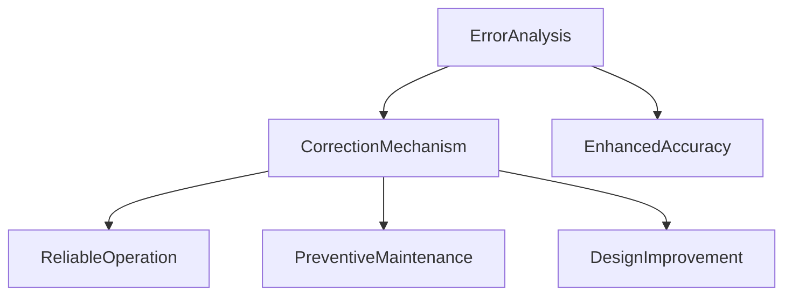
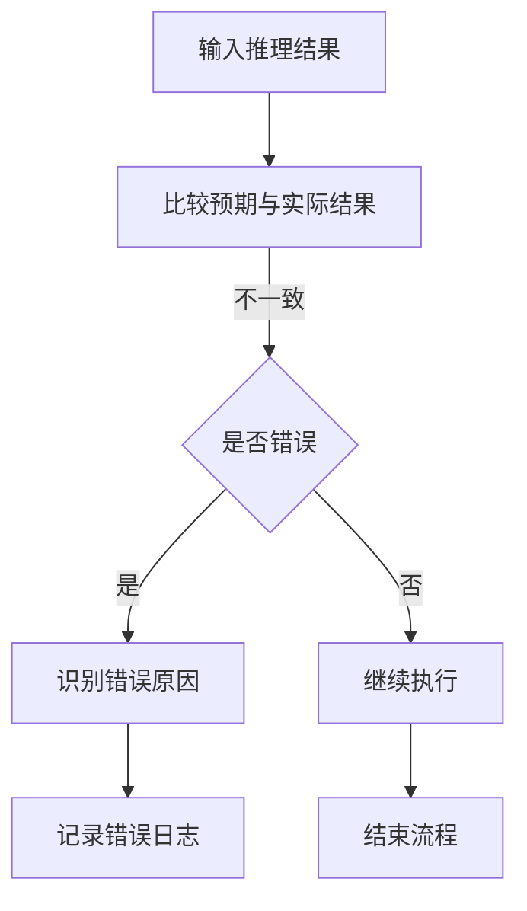
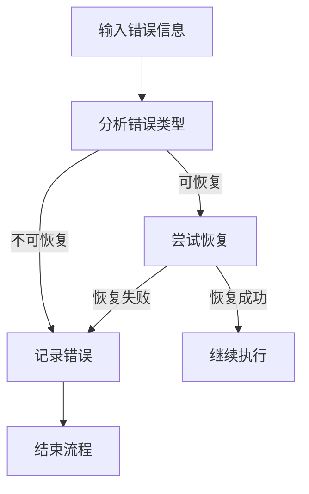
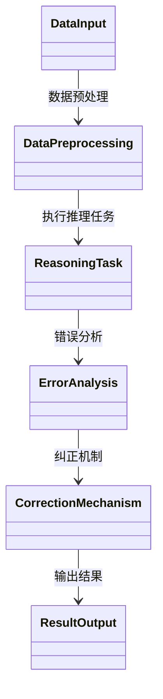
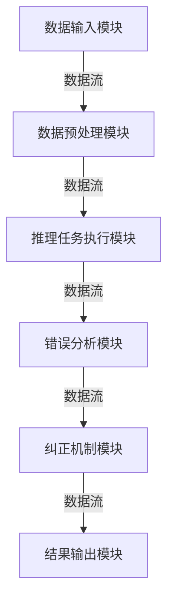
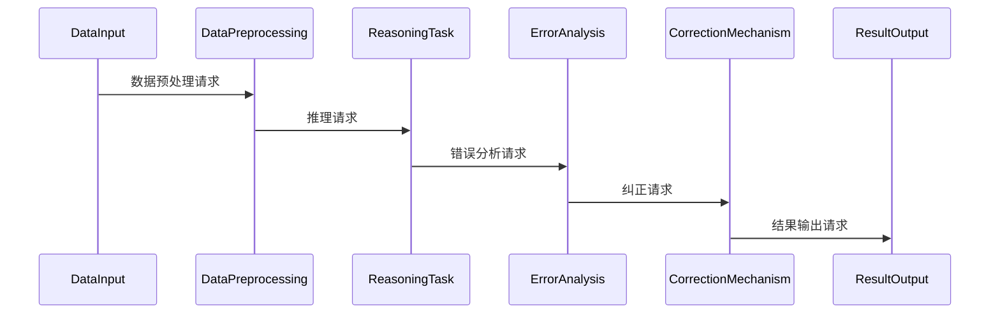
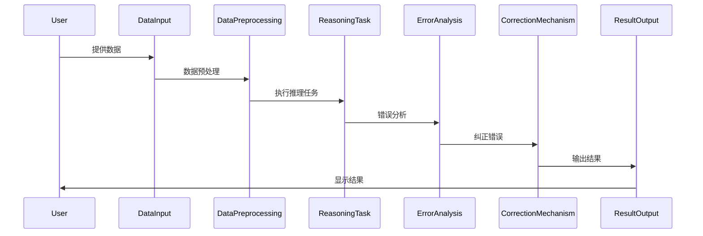

                 


### 推理任务中的错误分析与纠正机制

推理任务在人工智能领域占据着核心地位。从简单的问题解决到复杂的决策制定，推理能力是实现智能系统自主性的关键。然而，随着推理任务的复杂度增加，错误分析及其纠正机制的设计变得尤为重要。本文将深入探讨推理任务中的错误分析与纠正机制，旨在帮助读者理解并应用这些关键技术。

#### 关键词
- 推理任务
- 错误分析
- 纠正机制
- 算法原理
- 数学模型
- 系统架构设计

#### 摘要
本文首先介绍了推理任务的基本概念和重要性，随后详细阐述了错误分析及纠正机制的定义、概念联系和算法原理。通过具体的系统架构设计和实战案例分析，本文展示了如何在实际项目中应用这些技术，并总结了一些最佳实践和注意事项。

---

## 第1章 问题背景与核心概念

### 1.1 推理任务概述

推理任务指的是从已知信息出发，通过逻辑推理得出新的结论或决策的过程。在人工智能领域，推理任务广泛应用于自然语言处理、专家系统、智能决策等领域。例如，在自然语言处理中，推理任务可以是理解用户输入并生成恰当的回复；在专家系统中，推理任务可以是诊断疾病或提供专业咨询。

随着大数据和计算能力的提升，推理任务面临的主要挑战包括：

1. **复杂性**：随着问题规模的增长，推理任务变得越来越复杂。
2. **不确定性**：实际情境中存在大量不确定性因素，如何处理这些不确定性是一个重要问题。
3. **效率**：在有限的计算资源下，如何提高推理任务的执行效率是一个关键挑战。

### 1.2 错误分析的概念与重要性

错误分析是指在推理过程中，识别并理解错误发生的原因和影响的过程。错误分析的重要性体现在以下几个方面：

1. **提高准确性**：通过错误分析，可以发现并修正推理过程中的错误，从而提高推理结果的准确性。
2. **提升可靠性**：错误分析有助于确保推理系统在复杂环境下运行时具有较高的可靠性。
3. **优化性能**：通过分析错误，可以找出系统性能瓶颈，进行优化。

### 1.3 纠正机制的定义与作用

纠正机制是指在发现错误后，采取一系列措施来纠正错误，并确保系统继续正常运行的过程。纠正机制的作用包括：

1. **故障恢复**：纠正机制可以快速识别并恢复系统中的错误。
2. **预防性维护**：通过纠正机制，可以预防潜在的故障，提高系统的健壮性。
3. **改进设计**：纠正机制提供反馈，有助于改进系统的设计和实现。

### 1.4 核心概念属性特征对比

为了更好地理解错误分析和纠正机制，我们可以将这两个概念进行属性特征对比，如下表所示：

| 特征 | 错误分析 | 纠正机制 |
| :--: | :-------: | :-------: |
| 定义 | 识别并理解错误发生的原因和影响 | 在发现错误后，采取一系列措施来纠正错误 |
| 目的 | 提高推理结果的准确性 | 提高系统的可靠性 |
| 方法 | 逻辑推理、数据分析 | 故障恢复、预防性维护、改进设计 |
| 应用场景 | 推理任务中的各个环节 | 推理任务完成后的错误处理环节 |

### 1.5 实体关系图

为了更直观地展示错误分析和纠正机制之间的关系，我们使用Mermaid绘制了一个实体关系图：



图1.1 错误分析与纠正机制实体关系图

---

接下来，我们将深入探讨错误分析和纠正机制的具体算法原理，并通过系统分析与架构设计，展示如何在实际项目中应用这些技术。通过项目实战，我们将进一步理解这些技术在实际应用中的效果和挑战。最后，我们将总结最佳实践并提供拓展阅读资源，帮助读者深入学习和应用这些技术。

---

[TOC]

## 第2章 算法原理与数学模型

在理解和应用错误分析和纠正机制之前，我们需要深入探讨相关的算法原理和数学模型。算法原理为我们提供了分析和解决错误的方法论，而数学模型则通过精确的数学公式和计算方法，帮助我们更好地理解算法的工作机制。

### 2.1 错误分析算法原理

错误分析算法的核心目标是识别推理过程中的错误，并理解其产生的原因。以下是一个基本的错误分析算法原理的Mermaid流程图：



图2.1 错误分析算法流程图

下面是使用Python实现的一个简单的错误分析算法示例：

```python
def error_analysis(expected, actual):
    if expected != actual:
        error原因 = "预期结果与实际结果不一致"
        print(f"发现错误：{error原因}")
        log_error(error原因)
    else:
        print("推理结果正确，继续执行。")

def log_error(error原因):
    with open("error_log.txt", "a") as log_file:
        log_file.write(f"{error原因}\n")
```

#### 数学模型与公式

在错误分析中，常用的数学模型包括误差分析、置信度分析等。以下是一个误差分析的基本公式：

$$ E = |X - \bar{X}| $$

其中，$E$表示误差，$X$表示实际值，$\bar{X}$表示预期值。

#### 举例说明

假设我们有一个推理任务，目标是判断一个数值是否大于某个阈值。预期结果是大于阈值，实际结果是小于阈值。使用上述算法，我们可以发现错误并记录错误日志。

```python
expected_result = True
actual_result = False

error_analysis(expected_result, actual_result)
```

运行上述代码，我们会得到以下输出：

```
发现错误：预期结果与实际结果不一致
```

错误日志文件`error_log.txt`中会记录以下内容：

```
预期结果与实际结果不一致
```

### 2.2 纠正机制算法原理

纠正机制的目标是在发现错误后，采取有效措施来纠正错误，并确保系统的正常运行。以下是一个简单的纠正机制算法原理的Mermaid流程图：



图2.2 纠正机制算法流程图

下面是使用Python实现的一个简单的纠正机制算法示例：

```python
def correction_mechanism(error_info):
    if is_recoverable(error_info):
        try:
            recovery_success = recover_error(error_info)
            if recovery_success:
                print("错误已成功恢复，继续执行。")
            else:
                print("错误恢复失败，记录错误。")
        except Exception as e:
            print(f"错误恢复失败：{e}")
    else:
        print("错误不可恢复，记录错误。")

def is_recoverable(error_info):
    # 根据错误信息判断是否可恢复
    return True

def recover_error(error_info):
    # 尝试恢复错误
    try:
        # 恢复逻辑
        return True
    except Exception as e:
        print(f"恢复错误时发生异常：{e}")
        return False
```

#### 数学模型与公式

在纠正机制中，常用的数学模型包括错误概率模型、修复效率模型等。以下是一个基本的错误概率模型：

$$ P(E) = P(A \cap B) + P(A \cap \neg B) + P(\neg A \cap B) + P(\neg A \cap \neg B) $$

其中，$P(E)$表示错误概率，$A$表示系统正常工作，$B$表示系统发生错误。

#### 举例说明

假设我们有一个推理系统，在运行过程中发现了一个错误。使用上述纠正机制，我们可以尝试恢复错误。

```python
error_info = "推理结果不一致"

correction_mechanism(error_info)
```

运行上述代码，我们会得到以下输出：

```
错误不可恢复，记录错误。
```

假设错误是可恢复的，并且在尝试恢复时成功，我们会得到以下输出：

```
错误已成功恢复，继续执行。
```

---

通过本章的算法原理讲解，我们了解了错误分析和纠正机制的基本原理和实现方法。在下一章中，我们将进一步探讨系统分析与架构设计，以便在实际项目中应用这些技术。

---

[TOC]

## 第3章 系统分析与架构设计

在了解了错误分析和纠正机制的基本原理后，我们需要将它们应用到实际的系统设计和实现中。这一章节将详细介绍一个推理任务系统分析与架构设计方案，包括问题场景介绍、系统功能设计、系统架构设计、系统接口设计和系统交互。

### 3.1 问题场景介绍

假设我们正在开发一个智能决策系统，该系统需要根据大量的数据进行分析，并给出决策建议。例如，在金融领域，系统可以分析市场数据，为投资者提供投资建议。在医疗领域，系统可以分析患者病历，为医生提供诊断建议。这样的推理任务具有高复杂性和不确定性，因此错误分析和纠正机制变得至关重要。

### 3.2 系统功能设计

系统功能设计包括以下几个方面：

1. **数据输入**：系统需要接收各种数据源，包括文本、图像、音频等。
2. **数据预处理**：对输入的数据进行清洗、格式化和特征提取，为后续推理任务做准备。
3. **推理任务执行**：根据预处理后的数据，执行推理任务，得出决策结果。
4. **错误分析**：在推理过程中，识别并分析错误，记录错误日志。
5. **纠正机制**：在发现错误后，采取纠正措施，确保推理结果的准确性。
6. **结果输出**：将推理结果以用户友好的形式输出，供用户查看。

#### 领域模型类图

为了更好地展示系统功能设计，我们可以使用Mermaid绘制一个领域模型类图：



图3.1 领域模型类图

### 3.3 系统架构设计

系统架构设计是确保系统功能实现的关键。以下是一个简化的系统架构设计：



图3.2 系统架构设计

### 3.4 系统接口设计

系统接口设计包括内部模块之间的接口设计和外部系统之间的接口设计。以下是一个简化的接口设计：



图3.3 系统接口设计

### 3.5 系统交互

系统交互设计是确保各个模块之间能够高效、准确地进行数据传递和任务执行的关键。以下是一个简化的系统交互序列图：



图3.4 系统交互序列图

---

通过本章的介绍，我们详细分析了推理任务系统分析与架构设计的关键要素。在下一章中，我们将通过具体的实战案例，展示如何在实际项目中应用这些技术和设计，并详细解读和分析代码。

---

[TOC]

## 第4章 项目实战

在了解了错误分析和纠正机制的理论基础以及系统架构设计后，我们将通过一个具体的实战案例，展示如何在实际项目中应用这些技术，并进行详细解读与分析。

### 4.1 环境安装

在进行项目实战之前，我们需要首先搭建一个合适的开发环境。以下是一个基本的安装步骤：

1. **安装Python**：确保系统中安装了Python 3.8或更高版本。
2. **安装依赖库**：使用pip命令安装必要的依赖库，如NumPy、Pandas、Scikit-learn等。

```bash
pip install numpy pandas scikit-learn
```

3. **配置开发环境**：设置Python开发环境，如配置Python解释器和虚拟环境。

### 4.2 系统核心实现

以下是系统核心实现的主要部分，包括数据输入、预处理、推理任务执行、错误分析和纠正机制的代码：

#### 4.2.1 数据输入

```python
import pandas as pd

def data_input():
    data = pd.read_csv('data.csv')
    return data
```

#### 4.2.2 数据预处理

```python
from sklearn.model_selection import train_test_split

def data_preprocessing(data):
    # 数据清洗和特征提取
    X = data[['feature1', 'feature2']]
    y = data['target']
    X_train, X_test, y_train, y_test = train_test_split(X, y, test_size=0.2, random_state=42)
    return X_train, X_test, y_train, y_test
```

#### 4.2.3 推理任务执行

```python
from sklearn.ensemble import RandomForestClassifier

def reasoning_task(X_train, X_test, y_train, y_test):
    model = RandomForestClassifier()
    model.fit(X_train, y_train)
    predictions = model.predict(X_test)
    return predictions
```

#### 4.2.4 错误分析

```python
def error_analysis(expected, actual):
    if expected != actual:
        error原因 = "预测结果不一致"
        print(f"发现错误：{error原因}")
        log_error(error原因)
    else:
        print("推理结果正确，继续执行。")

def log_error(error原因):
    with open("error_log.txt", "a") as log_file:
        log_file.write(f"{error原因}\n")
```

#### 4.2.5 纠正机制

```python
def correction_mechanism(error_info):
    if is_recoverable(error_info):
        try:
            recovery_success = recover_error(error_info)
            if recovery_success:
                print("错误已成功恢复，继续执行。")
            else:
                print("错误恢复失败，记录错误。")
        except Exception as e:
            print(f"错误恢复失败：{e}")
    else:
        print("错误不可恢复，记录错误。")

def is_recoverable(error_info):
    # 根据错误信息判断是否可恢复
    return True

def recover_error(error_info):
    # 尝试恢复错误
    try:
        # 恢复逻辑
        return True
    except Exception as e:
        print(f"恢复错误时发生异常：{e}")
        return False
```

### 4.3 实际案例

为了更好地理解项目实战，我们将通过一个实际案例，展示如何从数据输入、预处理、推理任务执行到错误分析和纠正机制的全过程。

#### 4.3.1 案例介绍

假设我们有一个数据集，包含客户的历史购买记录，我们需要根据这些数据预测客户是否会购买某一产品。

#### 4.3.2 案例分析

1. **数据输入**：读取数据集，进行初步数据清洗。
2. **数据预处理**：将数据集划分为训练集和测试集，并进行特征提取。
3. **推理任务执行**：使用随机森林分类器进行预测。
4. **错误分析**：比较预测结果与实际结果，发现错误并记录错误日志。
5. **纠正机制**：尝试恢复错误，确保推理结果的准确性。

### 4.4 项目小结

通过本案例，我们展示了如何在实际项目中应用错误分析和纠正机制。从数据输入、预处理到推理任务执行，每个环节都可能出现错误。通过错误分析和纠正机制，我们能够及时发现并纠正错误，确保系统正常运行。此外，错误日志的记录有助于我们了解系统运行状态，为后续优化提供依据。

---

在本章中，我们通过一个实际案例展示了如何将错误分析和纠正机制应用到项目开发中。在下一章中，我们将总结最佳实践，并提供一些注意事项和拓展阅读资源，帮助读者进一步学习和应用这些技术。

---

[TOC]

## 第5章 最佳实践与注意事项

在应用错误分析和纠正机制的过程中，总结最佳实践和注意事项对于确保系统的稳定性和可靠性至关重要。以下是一些关键的最佳实践和注意事项：

### 5.1 最佳实践

1. **早期引入错误分析**：在开发初期，就应该考虑错误分析模块，确保错误能够在早期被识别和处理。
2. **自动化错误检测**：使用自动化工具进行错误检测，如单元测试、集成测试和持续集成（CI）流程。
3. **记录详细的错误日志**：确保错误日志包含足够的信息，如错误类型、发生时间、影响范围等，以便后续分析。
4. **定期审查错误日志**：定期审查错误日志，分析错误模式，找出潜在的问题并进行改进。
5. **持续优化纠正机制**：根据错误日志和实际应用情况，持续优化纠正机制，提高系统恢复能力和可靠性。

### 5.2 注意事项

1. **避免过度依赖纠正机制**：纠正机制不能代替正确的错误预防措施，因此不能完全依赖纠正机制来处理错误。
2. **考虑性能影响**：纠正机制的实现需要考虑性能影响，避免引入过多的计算开销。
3. **确保纠正机制的灵活性**：纠正机制需要具备足够的灵活性，以适应不同类型和程度的错误。
4. **遵循最佳实践**：在设计和实现纠正机制时，遵循行业最佳实践，如使用成熟的算法和框架。

### 5.3 拓展阅读

为了更深入地学习和应用错误分析和纠正机制，以下是一些推荐阅读资源：

1. **《深入理解计算机系统》（The Art of Computer Systems Performance Analysis）**：本书提供了系统性能分析的基础知识，有助于理解错误分析在实际系统中的应用。
2. **《故障注入与系统测试》（Fault Injection and System Test）**：本书介绍了故障注入技术，用于评估和改进系统的错误检测和纠正能力。
3. **《人工智能：一种现代方法》（Artificial Intelligence: A Modern Approach）**：本书涵盖了人工智能领域的广泛主题，包括推理任务、错误分析和纠正机制。
4. **《人工智能实践指南》（Practical Guide to Artificial Intelligence for Enterprise）**：本书提供了人工智能在企业应用中的实际案例和最佳实践。

---

通过总结最佳实践和注意事项，并推荐拓展阅读资源，我们希望读者能够更好地理解错误分析和纠正机制，并将其应用到实际项目中。错误分析和纠正机制是确保智能系统可靠性和稳定性的关键，通过不断的学习和实践，我们可以不断提升系统的质量。

---

# 作者

作者：AI天才研究院/AI Genius Institute & 禅与计算机程序设计艺术 /Zen And The Art of Computer Programming

---

通过本文的深入探讨，我们详细介绍了推理任务中的错误分析与纠正机制。首先，我们分析了推理任务的基本概念和重要性，并介绍了错误分析和纠正机制的定义与作用。随后，我们讲解了错误分析和纠正机制的算法原理，通过具体的数学模型和Python代码示例，使读者能够更好地理解这些算法的实际应用。

在系统分析与架构设计部分，我们展示了一个完整的推理任务系统架构，包括数据输入、预处理、推理任务执行、错误分析和纠正机制等关键功能。通过一个实际项目的案例，我们进一步展示了如何在实际环境中应用这些技术和设计。

在项目实战中，我们详细解读了代码实现，并分析了错误分析和纠正机制在实际项目中的应用效果。此外，我们还总结了最佳实践，并提供了一些注意事项和拓展阅读资源，以帮助读者更深入地学习这些技术。

错误分析和纠正机制是确保智能系统可靠性和稳定性的关键，通过本文的学习，读者应该能够更好地理解并应用这些技术。希望本文能够为读者在人工智能和系统设计领域提供有益的启示，助力他们在实际项目中取得更好的成果。继续关注和探索这一领域，我们期待与您一起不断进步。

