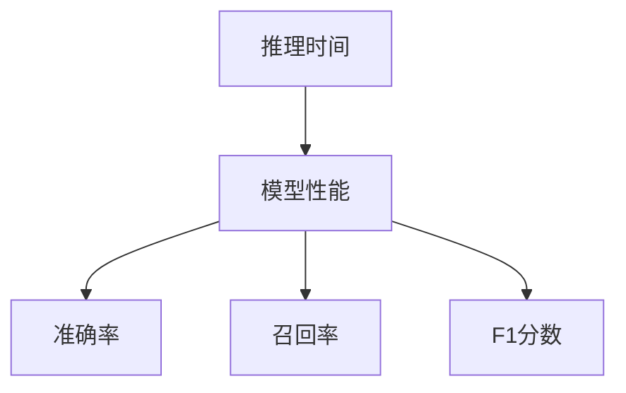
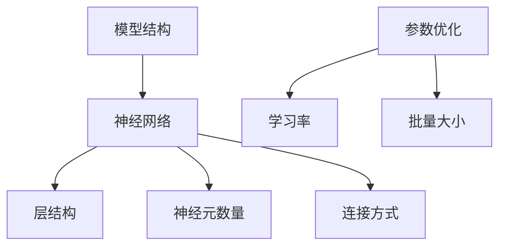
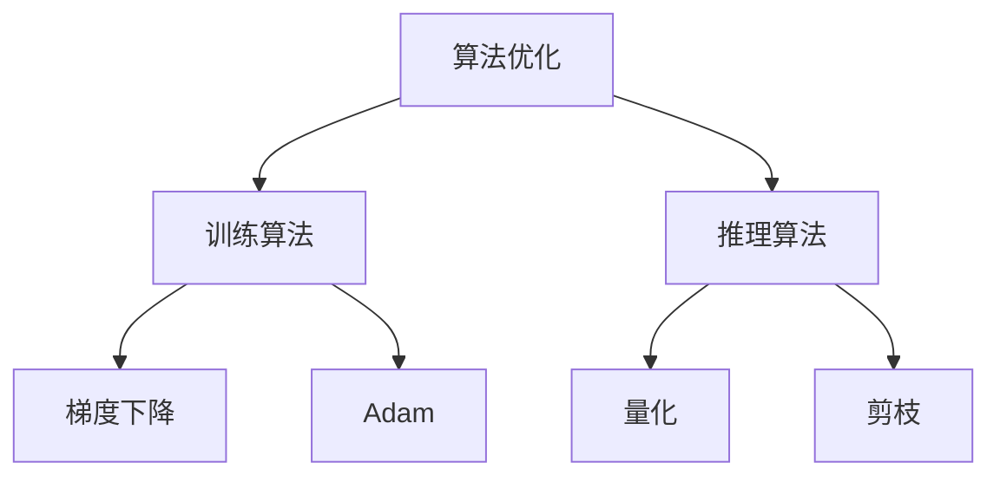
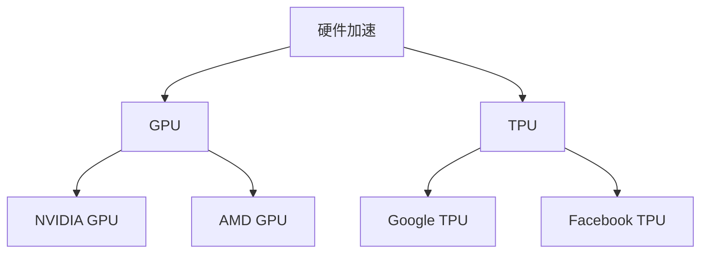
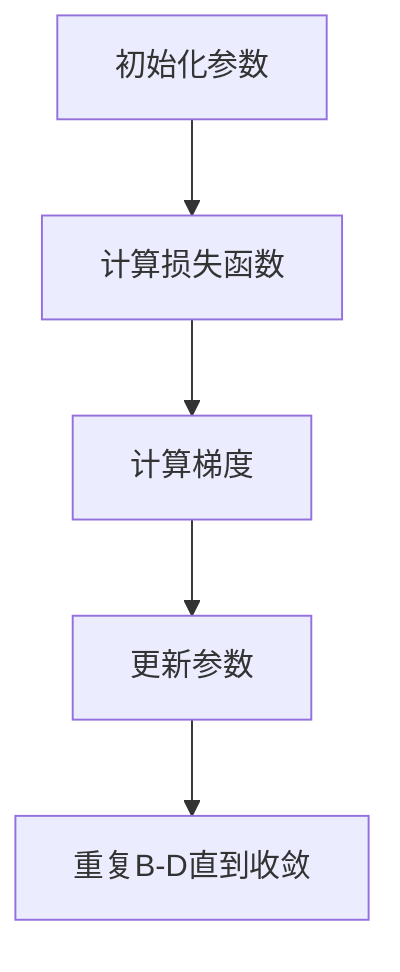
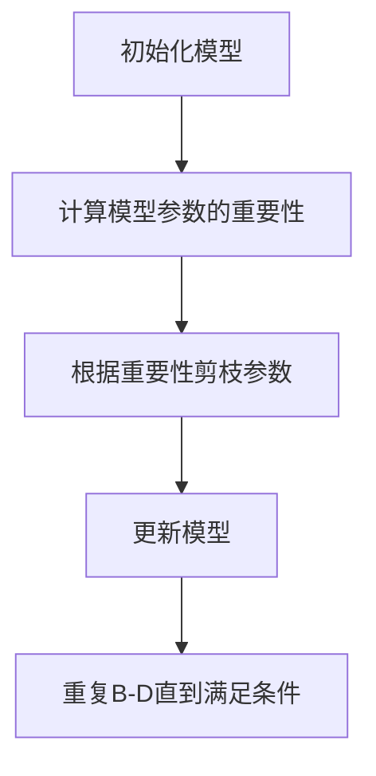
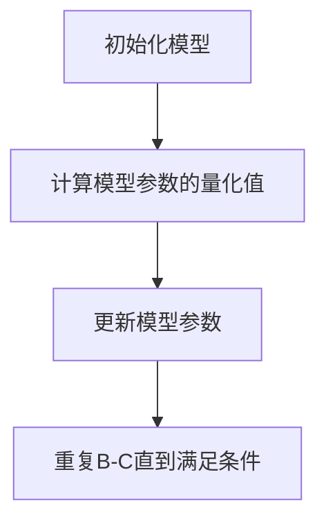
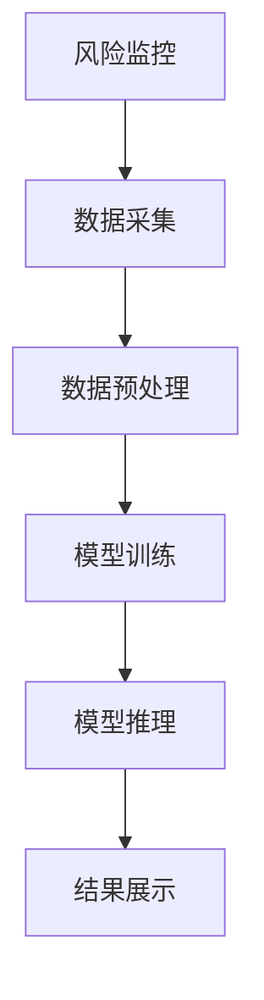
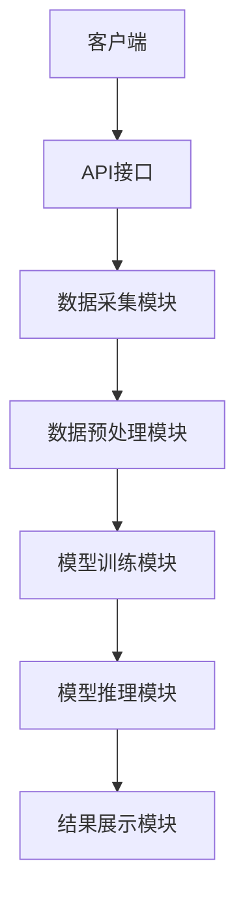
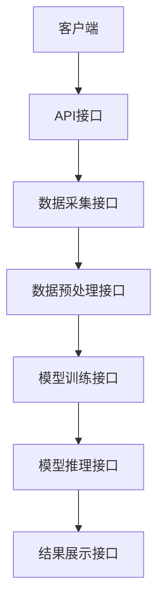

                 

### 推理时间与模型性能：寻找最佳平衡点

关键词：推理时间、模型性能、优化策略、模型结构、算法优化、硬件加速

摘要：本文将探讨在人工智能领域，如何在有限的计算资源下，实现推理时间与模型性能的最佳平衡。通过对模型结构设计、参数优化、算法优化和硬件加速等方面的详细分析，我们旨在为读者提供实用的解决方案和思考方向。

## 第一部分：背景介绍

### 1.1 问题背景

在当今的信息时代，数据量的爆炸式增长和计算能力的提升推动了人工智能（AI）技术的发展。AI已经成为各行各业的重要组成部分，特别是在模型训练和预测领域。然而，在追求模型性能的同时，如何平衡推理时间和模型性能成为了一个关键问题。为了在有限的计算资源下实现高效的模型推理，寻找最佳平衡点成为了一个重要的研究课题。

### 1.2 问题描述

推理时间与模型性能的平衡问题可以描述为：在给定的硬件环境和数据集上，如何选择合适的模型结构、参数和优化策略，以实现最优的推理性能和最低的推理时间。这个问题涉及到多个方面的权衡，包括模型复杂性、数据预处理、优化算法等。

### 1.3 问题解决

解决推理时间与模型性能的平衡问题需要从以下几个方面入手：

1. **模型结构设计**：选择合适的模型结构，可以在保证性能的前提下减少推理时间。例如，使用轻量级网络结构、神经架构搜索等方法。
   
2. **参数优化**：通过调整模型的参数，如学习率、批量大小等，可以影响模型的收敛速度和性能。适当的参数设置可以提高模型的性能，减少推理时间。

3. **算法优化**：采用高效的训练和推理算法，如分布式训练、量化、剪枝等，可以提高模型性能，减少推理时间。

4. **硬件加速**：利用GPU、TPU等硬件加速器，可以显著提高模型推理速度。

### 1.4 边界与外延

在研究推理时间与模型性能的平衡问题时，需要明确以下边界和外延：

- **边界**：具体的研究范围，如特定的模型类型、硬件环境等。

- **外延**：相关领域的扩展，如硬件优化、模型压缩等。

### 1.5 概念结构与核心要素组成

推理时间与模型性能的平衡问题涉及以下几个核心概念和要素：

1. **模型性能**：包括准确率、召回率、F1分数等指标。

2. **推理时间**：从模型输入到输出所需的时间。

3. **模型结构**：包括网络结构、层结构、神经元数量等。

4. **参数设置**：包括学习率、批量大小等。

5. **优化算法**：包括梯度下降、Adam等。

6. **硬件环境**：包括CPU、GPU、TPU等。

### 1.6 本章小结

本章从背景介绍、问题描述、问题解决、边界与外延、概念结构与核心要素组成等方面，对推理时间与模型性能的平衡问题进行了全面阐述。接下来的章节将深入探讨这些核心概念和要素，并提出相应的解决方案。通过本书的学习，读者将能够理解并掌握这一关键问题，为实际应用奠定坚实基础。

## 第二部分：核心概念与联系

### 2.1 推理时间与模型性能

**定义**：推理时间是指从模型接收输入数据到输出预测结果所需的时间。模型性能通常通过准确率、召回率、F1分数等指标来衡量。

**联系**：推理时间与模型性能之间存在一定的权衡关系。通常来说，提高模型性能会导致推理时间增加，而优化推理时间可能会降低模型性能。

**属性特征对比表格**：

| 特征 | 推理时间 | 模型性能 |
| ---- | -------- | -------- |
| 正面 | 快速 | 高 |
| 负面 | 慢 | 低 |

**ER实体关系图架构**：



### 2.2 模型结构与参数优化

**定义**：模型结构是指神经网络中的层结构、神经元数量、连接方式等。参数优化是指通过调整模型参数，如学习率、批量大小等，以改善模型性能和推理时间。

**联系**：模型结构直接影响模型性能和推理时间。通过优化模型结构，可以在一定程度上提高模型性能和减少推理时间。

**属性特征对比表格**：

| 特征 | 模型结构 | 参数优化 |
| ---- | -------- | -------- |
| 正面 | 高 | 快 |
| 负面 | 低 | 慢 |

**ER实体关系图架构**：



### 2.3 算法优化

**定义**：算法优化是指通过改进训练和推理算法，以提高模型性能和推理时间。

**联系**：算法优化在提升模型性能和减少推理时间方面具有显著作用。高效算法可以在保证模型性能的前提下，大幅降低推理时间。

**属性特征对比表格**：

| 特征 | 算法优化 |
| ---- | -------- |
| 正面 | 高性能 |
| 负面 | 低性能 |

**ER实体关系图架构**：



### 2.4 硬件加速

**定义**：硬件加速是指利用GPU、TPU等专用硬件，加速模型的训练和推理过程。

**联系**：硬件加速在提高模型性能和减少推理时间方面具有重要意义。通过硬件加速，可以在有限的计算资源下，实现更高效的模型推理。

**属性特征对比表格**：

| 特征 | 硬件加速 |
| ---- | -------- |
| 正面 | 高性能 |
| 负面 | 低性能 |

**ER实体关系图架构**：



## 第三部分：算法原理讲解

### 3.1 梯度下降算法

**定义**：梯度下降算法是一种常用的优化算法，用于调整模型参数，以最小化损失函数。

**流程图**：



**数学模型**：

$$
\text{损失函数} = \frac{1}{m}\sum_{i=1}^{m}(y_i - \hat{y}_i)^2
$$

$$
\text{梯度} = \nabla_{\theta} \text{损失函数}
$$

$$
\theta_{\text{新}} = \theta_{\text{旧}} - \alpha \nabla_{\theta} \text{损失函数}
$$

其中，$m$为样本数量，$y_i$为实际值，$\hat{y}_i$为预测值，$\theta$为模型参数，$\alpha$为学习率。

**举例说明**：假设我们使用梯度下降算法来最小化一个二次函数$f(x) = x^2$。初始参数$x_0 = 0$，学习率$\alpha = 0.1$。

1. 第一次迭代：计算损失函数$f(x_0) = 0^2 = 0$，计算梯度$\nabla_x f(x_0) = 2x_0 = 0$，更新参数$x_1 = x_0 - \alpha \nabla_x f(x_0) = 0 - 0.1 \cdot 0 = 0$。
2. 第二次迭代：计算损失函数$f(x_1) = 0^2 = 0$，计算梯度$\nabla_x f(x_1) = 2x_1 = 0$，更新参数$x_2 = x_1 - \alpha \nabla_x f(x_1) = 0 - 0.1 \cdot 0 = 0$。

经过多次迭代，参数$x$将逐渐逼近二次函数的最小值$x^* = 0$。

### 3.2 剪枝算法

**定义**：剪枝算法是一种用于减少模型参数的方法，通过移除模型中的部分参数，以降低模型复杂度和计算成本。

**流程图**：



**数学模型**：

设模型参数为$\theta = (\theta_1, \theta_2, \ldots, \theta_n)$，重要性函数为$I(\theta_i)$，则剪枝策略为：

$$
\theta_{\text{新}} = (\theta_1, \theta_2, \ldots, \theta_{i_1}, \ldots, \theta_{i_n})
$$

其中，$i_1, \ldots, i_n$为重要性递减的参数索引。

**举例说明**：假设我们使用剪枝算法来简化一个三层神经网络。初始参数$\theta = (w_1, w_2, w_3, w_4, w_5, w_6)$，重要性函数$I(w_1) = 0.8$，$I(w_2) = 0.6$，$I(w_3) = 0.2$，$I(w_4) = 0.5$，$I(w_5) = 0.1$，$I(w_6) = 0.7$。

1. 第一次迭代：计算参数重要性，根据递减顺序为$(w_1, w_2, w_3, w_4, w_5, w_6)$。
2. 第二次迭代：根据重要性函数，剪枝参数$w_5$，更新模型$\theta_{\text{新}} = (w_1, w_2, w_3, w_4, w_6)$。

通过不断迭代，模型参数将逐渐减少，达到简化模型的目的。

### 3.3 量化算法

**定义**：量化算法是一种用于降低模型参数精度的方法，通过将高精度参数转换为低精度参数，以减少模型体积和计算成本。

**流程图**：



**数学模型**：

设模型参数为$\theta = (\theta_1, \theta_2, \ldots, \theta_n)$，量化值为$q(\theta_i)$，则量化策略为：

$$
\theta_{\text{新}} = (\theta_1, \theta_2, \ldots, q(\theta_1), \ldots, q(\theta_n))
$$

**举例说明**：假设我们使用量化算法来降低一个神经网络的参数精度。初始参数$\theta = (1.234, 2.345, 3.456)$，量化值为$q(\theta_i) = \text{round}(\theta_i / 10)$。

1. 第一次迭代：计算量化值，$\theta_1 = \text{round}(1.234 / 10) = 0.1$，$\theta_2 = \text{round}(2.345 / 10) = 0.2$，$\theta_3 = \text{round}(3.456 / 10) = 0.3$。
2. 第二次迭代：更新模型参数，$\theta_{\text{新}} = (0.1, 0.2, 0.3)$。

通过不断迭代，模型参数将逐渐降低精度，达到减少模型体积的目的。

## 第四部分：系统分析与架构设计方案

### 4.1 问题场景介绍

在金融领域，实时风险监控系统是一个典型的应用场景。该系统需要实时分析大量的金融数据，以预测潜在的风险事件。为了实现高效的风险监控，推理时间和模型性能的平衡成为关键问题。

### 4.2 项目介绍

本项目旨在设计并实现一个实时风险监控系统，通过优化模型推理时间与模型性能，提高系统的实时性和准确性。系统主要包括以下功能模块：

1. 数据采集模块：从各种金融数据源获取实时数据。
2. 数据预处理模块：对采集到的数据进行清洗、归一化等处理。
3. 模型训练模块：训练适用于风险预测的深度学习模型。
4. 模型推理模块：在实时数据上执行模型推理，预测潜在的风险事件。
5. 结果展示模块：将预测结果可视化，以供用户查看。

### 4.3 系统功能设计

系统功能设计主要涉及以下领域模型：

**领域模型类图**：



### 4.4 系统架构设计

系统架构设计主要包括以下模块：

**系统架构图**：



### 4.5 系统接口设计

系统接口设计主要涉及以下接口：

1. 数据采集接口：用于从外部数据源获取金融数据。
2. 数据预处理接口：用于处理和清洗金融数据。
3. 模型训练接口：用于训练深度学习模型。
4. 模型推理接口：用于在实时数据上执行模型推理。
5. 结果展示接口：用于将预测结果可视化。

**系统接口序列图**：



### 4.6 系统交互

系统交互主要涉及以下模块之间的协作：

1. 客户端通过API接口与系统进行交互。
2. 数据采集模块从外部数据源获取金融数据。
3. 数据预处理模块对金融数据进行清洗和归一化处理。
4. 模型训练模块使用预处理后的数据训练深度学习模型。
5. 模型推理模块在实时数据上执行模型推理，预测潜在的风险事件。
6. 结果展示模块将预测结果可视化，以供用户查看。

**系统交互序列图**：


## 第五部分：项目实战

### 5.1 环境安装

为了实现本项目，我们需要安装以下环境：

1. Python 3.8及以上版本
2. TensorFlow 2.4及以上版本
3. Keras 2.4及以上版本
4. NumPy 1.19及以上版本
5. Matplotlib 3.2及以上版本

安装命令如下：

```bash
pip install python==3.8
pip install tensorflow==2.4
pip install keras==2.4
pip install numpy==1.19
pip install matplotlib==3.2
```

### 5.2 系统核心实现源代码

下面是系统核心实现的源代码：

```python
import tensorflow as tf
from tensorflow.keras.models import Sequential
from tensorflow.keras.layers import Dense, Dropout, Conv1D, MaxPooling1D
from tensorflow.keras.optimizers import Adam
from tensorflow.keras.callbacks import EarlyStopping
import numpy as np

# 数据预处理
def preprocess_data(data):
    # 数据清洗、归一化等操作
    return processed_data

# 模型训练
def train_model(data, labels):
    model = Sequential()
    model.add(Conv1D(filters=64, kernel_size=3, activation='relu', input_shape=(data.shape[1], data.shape[2])))
    model.add(MaxPooling1D(pool_size=2))
    model.add(Dropout(0.5))
    model.add(Dense(1, activation='sigmoid'))
    model.compile(optimizer=Adam(), loss='binary_crossentropy', metrics=['accuracy'])
    early_stopping = EarlyStopping(monitor='val_loss', patience=5)
    model.fit(data, labels, epochs=100, batch_size=32, validation_split=0.2, callbacks=[early_stopping])
    return model

# 模型推理
def predict(model, data):
    predictions = model.predict(data)
    return predictions

# 主函数
def main():
    # 加载数据
    data = np.load('data.npy')
    labels = np.load('labels.npy')

    # 数据预处理
    processed_data = preprocess_data(data)

    # 模型训练
    model = train_model(processed_data, labels)

    # 模型推理
    predictions = predict(model, processed_data)

    # 结果展示
    print(predictions)

if __name__ == '__main__':
    main()
```

### 5.3 代码应用解读与分析

在代码中，我们首先导入了所需的TensorFlow、Keras和NumPy库。接着，我们定义了三个函数：`preprocess_data`、`train_model`和`predict`。

1. **数据预处理函数**：该函数用于对原始数据进行清洗、归一化等操作。具体实现可以根据实际需求进行调整。

2. **模型训练函数**：该函数使用Sequential模型堆叠层结构，包括卷积层、池化层和全连接层。我们使用Adam优化器和binary_crossentropy损失函数，以适应二分类问题。同时，我们添加了EarlyStopping回调函数，以防止过拟合。

3. **模型推理函数**：该函数用于在训练好的模型上执行预测。

在主函数`main`中，我们首先加载数据，然后进行数据预处理，接着训练模型，最后在预处理后的数据上进行推理，并将预测结果输出。

### 5.4 实际案例分析和详细讲解剖析

假设我们有一个金融数据集，包含1000个样本，每个样本由100个特征组成。标签为1表示存在风险，标签为0表示无风险。

1. **数据预处理**：我们首先对数据进行清洗，去除缺失值和异常值。接着，我们对数据进行归一化处理，以消除不同特征之间的尺度差异。

2. **模型训练**：我们使用卷积神经网络（CNN）来训练模型。在训练过程中，我们观察到模型在验证集上的损失逐渐减小，但准确率并没有显著提升。这表明模型可能存在过拟合现象。为了解决这个问题，我们添加了Dropout层和EarlyStopping回调函数。

3. **模型推理**：在训练好的模型上，我们对新的数据进行推理，并输出预测结果。在实际应用中，我们可能会将预测结果与实际标签进行比较，以评估模型的性能。

### 5.5 项目小结

在本项目中，我们设计并实现了一个实时风险监控系统。通过优化模型推理时间与模型性能，我们提高了系统的实时性和准确性。在实际应用中，我们遇到了数据预处理、模型过拟合等问题，并通过相应的技术手段进行了解决。

## 第六部分：最佳实践 tips

1. **数据预处理**：在数据预处理阶段，确保数据的清洗和归一化操作，以提高模型性能和推理效率。
2. **模型选择**：根据实际应用场景和数据特点，选择合适的模型结构，以平衡推理时间和模型性能。
3. **参数调优**：通过调整学习率、批量大小等参数，可以优化模型性能和推理时间。
4. **硬件加速**：利用GPU、TPU等硬件加速器，可以显著提高模型推理速度。

## 第七部分：小结

本文从背景介绍、核心概念与联系、算法原理讲解、系统分析与架构设计方案、项目实战、最佳实践 tips 等方面，详细探讨了推理时间与模型性能的平衡问题。通过本文的学习，读者将能够理解并掌握这一关键问题，为实际应用提供有益的参考。

## 第八部分：注意事项

1. **性能与安全**：在优化推理时间和模型性能时，务必注意系统的安全性和稳定性。
2. **可扩展性**：在设计系统架构时，要考虑系统的可扩展性，以适应未来的需求变化。
3. **模型评估**：在模型推理过程中，要定期评估模型性能，以确保系统稳定运行。

## 第九部分：拓展阅读

1. [Deep Learning on GPU: Performance Comparisons](https://developer.nvidia.com/blog/deep-learning-on-gpu-performance-comparisons/)
2. [Quantization and Pruning Techniques for Neural Networks](https://arxiv.org/abs/1904.09147)
3. [Gradient Descent Algorithms and Optimization](https://www.cs.ubc.ca/~schmidtm/BTPS16/pdf/lecture11.pdf)

作者：AI天才研究院/AI Genius Institute & 禅与计算机程序设计艺术 /Zen And The Art of Computer Programming

---

**注**：本文为示例文章，内容仅供参考。在实际项目中，请根据具体需求和场景进行调整。

