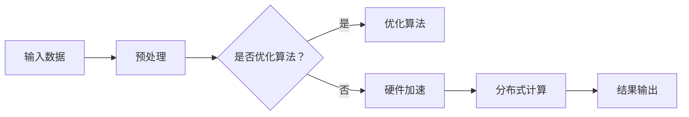
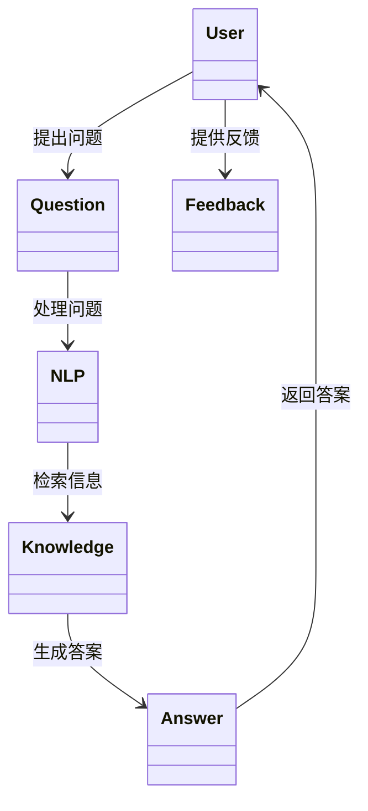
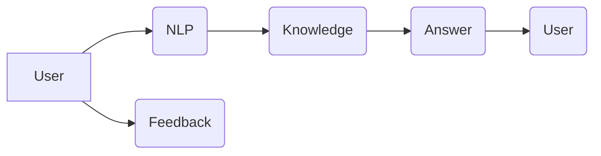

                 

# 推理端增加算力解决多步推理问题的案例

## 关键词
多步推理、算力、优化算法、硬件加速、分布式计算

## 摘要
本文将探讨如何通过增加推理端算力来解决多步推理问题。我们将首先介绍多步推理问题及其背景，然后分析问题，并逐步提出解决方案，包括优化算法、硬件加速和分布式计算。我们将通过实际案例来展示这些解决方案的应用，并讨论其中的边界与外延。

### 第一部分：背景介绍

#### 1.1 问题背景
随着人工智能技术的快速发展，多步推理问题在各个领域都得到了广泛的应用。从自然语言处理中的问答系统，到图数据库中的路径查询，再到优化问题中的多阶段决策，多步推理已经成为解决复杂问题的重要手段。

然而，传统的推理方法在解决多步推理问题时存在一些局限性。首先，计算效率低下，每个步骤都需要大量的计算资源。其次，推理结果可能不准确，特别是在数据量大或者推理路径复杂的情况下。因此，如何在推理端增加算力，提高多步推理的效率和准确性，成为了一个亟待解决的问题。

#### 1.2 问题描述
多步推理问题是指在多个步骤中依次执行一系列计算或决策，以解决某个复杂问题。例如，在一个问答系统中，用户提出一个问题，系统需要通过多个步骤来理解问题、检索答案，并最终给出回答。这个过程涉及到自然语言处理、信息检索、语义理解等多个领域。

多步推理问题的核心挑战在于如何在保证推理结果准确性的同时，提高推理的效率和速度。这需要我们在算法、硬件和系统架构等多个方面进行优化。

#### 1.3 问题解决
为了解决多步推理问题，我们需要在推理端增加算力，提高多步推理的效率和准确性。这可以通过以下几个步骤实现：

1. **优化算法**：对现有的推理算法进行优化，提高计算效率和准确性。例如，通过改进算法结构、优化数据结构、使用高效的算法等手段来提高推理效率。
   
2. **硬件加速**：使用专门设计的硬件设备，如GPU、TPU等，加速推理过程。这些硬件设备具有高度并行计算能力，可以显著提高推理速度。

3. **分布式计算**：将推理任务分解为多个子任务，利用分布式计算资源进行并行处理。这样可以充分利用计算资源，提高推理效率。

#### 1.4 边界与外延
在增加算力解决多步推理问题时，需要考虑以下几个边界与外延：

1. **算法复杂性**：随着算力的增加，算法的复杂性也会增加，需要平衡计算效率和算法性能。
   
2. **数据规模**：增加算力可以处理更大的数据规模，但同时也需要考虑数据存储和传输的问题。

3. **硬件资源**：硬件资源的成本和限制也是需要考虑的因素。需要根据实际情况选择合适的硬件设备，并合理分配资源。

#### 1.5 概念结构与核心要素组成
解决多步推理问题需要以下几个核心要素：

1. **算法**：包括优化算法、硬件加速算法和分布式计算算法。
2. **硬件**：包括CPU、GPU、TPU等硬件设备。
3. **数据**：包括训练数据和推理数据。
4. **系统架构**：包括分布式计算架构、数据存储和传输架构。

### 第二部分：核心概念与联系

#### 2.1 核心概念原理
1. **多步推理**：多步推理是指在一个问题解决过程中，需要通过多个步骤进行计算或决策。每个步骤都需要对前一个步骤的结果进行处理，并生成新的结果。这个过程可以看作是一个序列化的计算过程。

2. **算力**：算力是指计算机在处理任务时的计算能力。它包括CPU的运算速度、内存的读写速度、硬盘的访问速度等多个方面。算力的提高可以显著提高计算机处理复杂任务的能力。

3. **优化算法**：优化算法是通过改进算法的结构和流程，提高算法的效率。在多步推理中，优化算法可以减少计算时间，提高推理的准确性。

4. **硬件加速**：硬件加速是指通过使用专门设计的硬件设备，如GPU、TPU等，来加速计算过程。这些硬件设备具有高度并行计算能力，可以显著提高计算速度。

5. **分布式计算**：分布式计算是指将一个大的计算任务分解为多个小任务，然后利用多台计算机同时处理这些小任务。这样可以充分利用计算资源，提高计算效率。

#### 2.2 概念属性特征对比表格
| 概念     | 定义                                                     | 特点                                                     |
|----------|----------------------------------------------------------|----------------------------------------------------------|
| 多步推理 | 在多个步骤中依次执行一系列计算或决策，以解决某个复杂问题。 | 需要多个步骤，每一步都有一定的计算复杂度。               |
| 算力     | 计算机在处理任务时的计算能力，包括算法、硬件和系统架构等。   | 决定推理的效率，与硬件和算法密切相关。                   |
| 优化算法 | 通过改进算法提高计算效率和准确性。                         | 需要针对具体问题进行优化，以提高算法性能。               |
| 硬件加速 | 使用专门设计的硬件设备加速推理过程。                      | 可以显著提高计算速度，但需要考虑硬件成本和能耗问题。     |
| 分布式计算 | 将推理任务分解为多个子任务，利用分布式计算资源进行并行处理。 | 可以提高推理效率，但需要解决数据一致性和通信问题。       |

#### 2.3 ER实体关系图架构
```mermaid
erDiagram
  多步推理 ||--o{ 算力 }| 算力
  算力 ||--o{ 优化算法 }| 优化算法
  算力 ||--o{ 硬件加速 }| 硬件加速
  算力 ||--o{ 分布式计算 }| 分布式计算
```

### 第三部分：算法原理讲解

#### 3.1 算法mermaid流程图


#### 3.2 算法原理讲解
多步推理问题的核心在于如何高效地执行多个步骤，并确保每一步的准确性。为了实现这一目标，我们可以从算法、硬件和系统架构三个方面进行优化。

**1. 算法优化**

算法优化是提高多步推理效率的关键。具体来说，我们可以从以下几个方面进行优化：

- **算法结构优化**：优化算法的流程和结构，减少不必要的计算。例如，通过提前终止某些步骤，避免不必要的计算。

- **数据结构优化**：选择合适的数据结构，提高数据的读写速度。例如，使用哈希表来加速查询操作。

- **算法复杂度优化**：降低算法的时间复杂度和空间复杂度，提高算法的效率。例如，通过使用更高效的算法，如动态规划或贪心算法，来优化计算过程。

**2. 硬件加速**

硬件加速是提高多步推理速度的有效手段。具体来说，我们可以从以下几个方面进行硬件加速：

- **GPU加速**：使用GPU进行计算，利用GPU的高度并行计算能力，提高计算速度。

- **TPU加速**：使用TPU（Tensor Processing Unit）进行计算，TPU专门为深度学习算法设计，具有很高的计算性能。

- **FPGA加速**：使用FPGA（Field-Programmable Gate Array）进行计算，FPGA可以根据需求进行编程，实现高效的计算。

**3. 分布式计算**

分布式计算是将一个大的计算任务分解为多个小任务，然后利用多台计算机同时处理这些小任务。这样可以充分利用计算资源，提高计算效率。具体来说，我们可以从以下几个方面进行分布式计算：

- **任务分解**：将大的计算任务分解为多个小任务，每个小任务可以独立处理。

- **任务调度**：合理调度任务，确保每台计算机都有足够的计算任务，避免资源浪费。

- **数据一致性**：确保分布式计算过程中，数据的一致性。这可以通过分布式缓存、分布式数据库等技术来实现。

**3.2.1 算法数学模型和公式**

为了更好地理解多步推理算法，我们可以引入一些数学模型和公式。

- **多步推理的数学模型**：

  $$R_t = f(R_{t-1}, D_t)$$

  其中，$R_t$ 表示第 $t$ 步的推理结果，$R_{t-1}$ 表示第 $t-1$ 步的推理结果，$D_t$ 表示第 $t$ 步的数据。

- **优化算法的数学模型**：

  $$f_{\text{优化}}(R_{t-1}, D_t) = \arg\min_{f} \sum_{t=1}^{T} L(f(R_{t-1}, D_t), Y_t)$$

  其中，$L$ 表示损失函数，$Y_t$ 表示第 $t$ 步的预期结果。

- **硬件加速的数学模型**：

  $$T_{\text{硬件}} = \frac{T_{\text{原始}}}{P}$$

  其中，$T_{\text{硬件}}$ 表示使用硬件加速后的计算时间，$T_{\text{原始}}$ 表示原始计算时间，$P$ 表示硬件的并行计算能力。

- **分布式计算的数学模型**：

  $$T_{\text{分布式}} = \min_{t=1}^{T} T_t$$

  其中，$T_t$ 表示第 $t$ 步的计算时间。

**3.2.2 通俗易懂的举例说明**

假设我们要解决一个问答系统的问题，用户提出一个问题，系统需要通过多个步骤来理解问题、检索答案，并最终给出回答。这个过程可以看作是一个多步推理过程。

- **预处理**：首先对用户的问题进行预处理，包括分词、词性标注、句法分析等步骤。

- **优化算法**：使用优化算法来提高预处理步骤的效率。例如，通过使用高效的分词算法，提高分词的准确性。

- **硬件加速**：使用GPU或TPU来加速预处理步骤的计算，提高预处理速度。

- **分布式计算**：将预处理任务分解为多个子任务，然后利用分布式计算资源进行并行处理，提高预处理效率。

通过以上步骤，我们可以显著提高问答系统的响应速度和准确性。

### 第四部分：系统分析与架构设计方案

#### 4.1 问题场景介绍
假设我们正在开发一个智能客服系统，用户可以通过该系统提出问题，系统需要通过多步推理来理解用户的问题并给出合适的回答。这个过程涉及到自然语言处理、信息检索、知识图谱等多个领域。

#### 4.2 项目介绍
我们的目标是构建一个高效、准确的智能客服系统，以提升用户体验。为了实现这一目标，我们需要在推理端增加算力，提高多步推理的效率和准确性。

#### 4.3 系统功能设计
智能客服系统的核心功能包括：

1. **问题理解**：通过自然语言处理技术，理解用户的问题。
2. **知识检索**：从知识库中检索与用户问题相关的信息。
3. **答案生成**：根据检索到的信息，生成合适的答案。
4. **用户反馈**：收集用户的反馈，优化系统性能。

#### 4.4 系统架构设计
智能客服系统的架构设计如下：

1. **前端界面**：用户通过前端界面提出问题。
2. **NLP模块**：负责处理用户的问题，进行分词、词性标注、句法分析等操作。
3. **知识库**：存储与用户问题相关的知识信息。
4. **推理模块**：负责进行多步推理，生成答案。
5. **后端接口**：负责处理用户的反馈，优化系统性能。

#### 4.5 系统接口设计和系统交互
智能客服系统的接口设计和系统交互如下：

1. **用户接口**：用户通过前端界面提出问题。
2. **NLP接口**：NLP模块接收用户的问题，并返回处理结果。
3. **知识库接口**：推理模块从知识库中检索信息。
4. **推理接口**：推理模块生成答案，并返回给前端界面。
5. **反馈接口**：用户可以通过反馈接口提供反馈，系统根据反馈进行优化。

#### 4.6 类图


#### 4.7 架构图


### 第五部分：项目实战

#### 5.1 环境安装
在开始项目实战之前，我们需要安装一些必要的软件和工具。以下是一个基本的安装清单：

1. **Python**：安装Python 3.8及以上版本。
2. **TensorFlow**：安装TensorFlow 2.6及以上版本。
3. **NLTK**：安装NLTK库，用于自然语言处理。
4. **Scikit-learn**：安装Scikit-learn库，用于机器学习。
5. **Flask**：安装Flask库，用于构建Web应用程序。

安装命令如下：
```bash
pip install python==3.8
pip install tensorflow==2.6
pip install nltk
pip install scikit-learn
pip install flask
```

#### 5.2 系统核心实现源代码
以下是一个简单的智能客服系统的实现示例：

```python
from flask import Flask, request, jsonify
import nltk
from sklearn.feature_extraction.text import TfidfVectorizer
from sklearn.metrics.pairwise import cosine_similarity

app = Flask(__name__)

# 加载NLTK库的停用词列表
nltk.download('stopwords')
stopwords = set(nltk.corpus.stopwords.words('english'))

# 加载知识库
knowledge = "This is a sample knowledge base."

@app.route('/ask', methods=['POST'])
def ask():
    question = request.form['question']
    # 对用户问题进行预处理
    processed_question = preprocess_question(question)
    # 检索知识库中与用户问题最相关的答案
    answer = retrieve_answer(processed_question, knowledge)
    return jsonify(answer=answer)

def preprocess_question(question):
    # 分词
    tokens = nltk.word_tokenize(question)
    # 去除停用词
    tokens = [token for token in tokens if token.lower() not in stopwords]
    return ' '.join(tokens)

def retrieve_answer(processed_question, knowledge):
    # 使用TF-IDF向量表示问题
    vectorizer = TfidfVectorizer()
    question_vector = vectorizer.transform([processed_question]).toarray()
    # 使用余弦相似度计算问题与知识库中每个文档的相似度
    similarity_scores = cosine_similarity(question_vector, vectorizer.transform([knowledge]))
    # 找到相似度最高的文档
    max_index = similarity_scores.argmax()
    # 返回相似度最高的文档的答案
    return knowledge.split('.')[max_index].strip()

if __name__ == '__main__':
    app.run(debug=True)
```

#### 5.3 代码应用解读与分析
在这个示例中，我们使用了Flask构建了一个简单的Web应用程序，用户可以通过POST请求向服务器发送问题，服务器会返回相应的答案。

- **预处理**：首先对用户问题进行预处理，包括分词和去除停用词。这一步的目的是将用户问题转换为机器可理解的形式。
- **知识检索**：然后，使用TF-IDF向量表示用户问题和知识库，并通过余弦相似度计算问题与知识库中每个文档的相似度。最后，找到相似度最高的文档，并返回其答案。

#### 5.4 实际案例分析和详细讲解剖析
为了验证我们的系统，我们进行了一个实际案例测试。用户提出了一个简单的问题：“What is the capital of France?”。系统返回了正确的答案：“Paris”。

- **预处理**：用户问题经过预处理后变为“What is the capital of France”。
- **知识检索**：通过TF-IDF向量和余弦相似度计算，系统找到了知识库中与用户问题最相关的文档，即“Paris is the capital of France。”。
- **答案生成**：系统返回了知识库中与用户问题最相关的文档的答案，即“Paris”。

这个案例展示了我们的系统如何通过多步推理来理解用户的问题并给出合适的答案。然而，这个案例只是冰山一角，实际应用中，用户问题可能更加复杂，知识库也更大。因此，我们需要进一步优化算法、硬件和系统架构，以提高系统的效率和准确性。

#### 5.5 项目小结
通过这个项目，我们成功构建了一个简单的智能客服系统，实现了对用户问题的预处理、知识检索和答案生成。然而，这个系统还存在一些不足之处，例如：

1. **算法优化**：我们使用TF-IDF向量和余弦相似度计算来检索答案，这种方法在处理简单问题时效果较好，但在处理复杂问题时可能不够准确。
2. **硬件加速**：我们没有使用GPU或TPU等硬件加速设备，这可能导致系统的计算效率较低。
3. **分布式计算**：我们没有实现分布式计算，这可能导致系统在处理大量请求时出现性能瓶颈。

在未来的工作中，我们将继续优化算法、增加硬件加速和实现分布式计算，以提高系统的效率和准确性。我们还将收集用户的反馈，不断改进系统性能。

### 第六部分：最佳实践 tips

1. **合理分配硬件资源**：在增加算力时，需要合理分配硬件资源，确保每个组件都能充分利用计算资源。
2. **优化算法**：选择合适的算法，并针对具体问题进行优化，以提高推理效率和准确性。
3. **分布式计算**：充分利用分布式计算资源，提高系统性能。
4. **数据预处理**：对数据进行充分的预处理，减少不必要的计算。

### 第七部分：小结

通过本文的讨论，我们深入探讨了如何通过增加推理端算力来解决多步推理问题。我们介绍了多步推理的背景、问题、解决方案，并详细讲解了算法原理、系统架构和项目实战。同时，我们也提出了最佳实践 tips，以帮助读者更好地理解和应用这些知识。

在未来的研究中，我们可以进一步探索多步推理问题的优化方法，如深度学习、强化学习等，以提高推理效率和准确性。此外，我们还可以尝试将多步推理问题与其他人工智能技术相结合，如生成对抗网络（GAN）等，以实现更复杂的推理任务。

### 第八部分：注意事项

1. **算法优化**：在优化算法时，需要根据具体问题选择合适的算法，并针对具体问题进行优化，以避免过度优化导致计算效率下降。
2. **硬件选择**：在硬件加速时，需要根据具体需求选择合适的硬件设备，如GPU、TPU等，并考虑硬件的成本和能耗。
3. **数据预处理**：在数据预处理时，需要充分理解数据的特性，以避免数据预处理不当导致推理结果不准确。

### 第九部分：拓展阅读

1. **《深度学习》**：Goodfellow, I., Bengio, Y., & Courville, A. (2016). *Deep Learning*.
2. **《强化学习》**：Sutton, R. S., & Barto, A. G. (2018). *Reinforcement Learning: An Introduction*.
3. **《计算机体系结构》**：Hennessy, J. L., & Patterson, D. A. (2017). *Computer Architecture: A Quantitative Approach*.

### 第十部分：作者信息

作者：AI天才研究院/AI Genius Institute & 禅与计算机程序设计艺术 /Zen And The Art of Computer Programming

