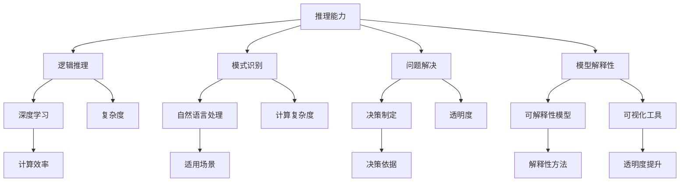
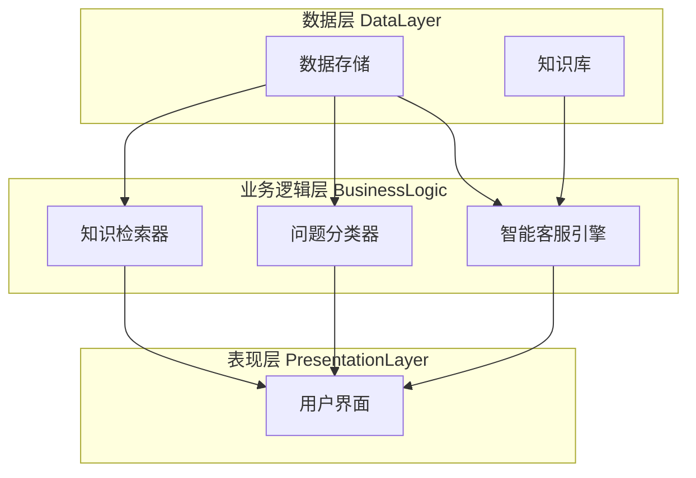
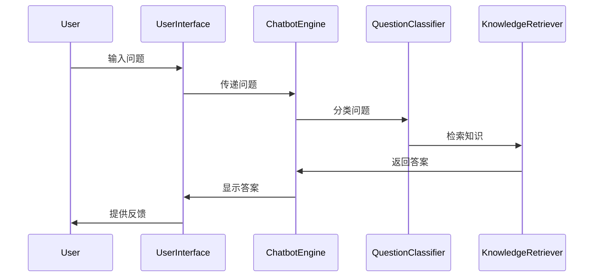

                 

### 推理能力与模型解释性的权衡探讨

> 关键词：推理能力、模型解释性、AI应用、算法设计、数学模型、系统架构

> 摘要：本文深入探讨了推理能力与模型解释性在人工智能领域的权衡问题。从背景介绍、核心概念、算法原理、数学模型、系统架构到实际应用，通过详细的分析和实例讲解，揭示了这两者在AI系统设计和优化中的关键作用。文章旨在帮助读者理解二者之间的复杂关系，并掌握在实际项目中如何平衡和优化推理能力与模型解释性。

---

在当今人工智能迅猛发展的时代，推理能力与模型解释性成为了两个备受关注的话题。推理能力指的是AI系统在处理复杂信息、解决问题和做出决策时的逻辑推理能力。而模型解释性则强调AI系统输出结果的透明度和可理解性，使人们能够理解模型的推理过程和决策依据。这两个方面在AI应用中扮演着重要角色，但它们之间往往存在一定的权衡关系。本文将围绕推理能力与模型解释性这一主题，通过逻辑清晰的步骤分析，深入探讨其在AI系统设计、优化和应用中的关键作用。

文章将从以下几个部分展开：

1. **背景介绍**：介绍推理能力与模型解释性的基本概念、发展历程以及在人工智能中的重要性。
2. **核心概念与联系**：详细说明推理能力与模型解释性的定义、属性特征对比，并通过Mermaid流程图展示两者之间的关系。
3. **算法原理讲解**：分析常用的推理算法和解释性模型，使用Mermaid流程图和Python代码详细阐述其原理和数学模型。
4. **数学模型和公式**：介绍推理与解释性相关的数学模型和公式，使用LaTeX格式确保数学公式的清晰呈现。
5. **系统分析与设计**：描述问题场景和项目目标，使用Mermaid类图和架构图展示系统功能和架构设计。
6. **项目实战**：通过实际项目案例，展示推理能力与模型解释性的应用，并提供代码实现和分析。
7. **最佳实践与总结**：总结最佳实践经验，提出注意事项和拓展阅读建议。

### 背景介绍

推理能力与模型解释性作为人工智能领域的重要概念，其重要性日益凸显。随着深度学习、自然语言处理、计算机视觉等领域的快速发展，AI系统的推理能力得到了极大的提升。然而，与此同时，人们对AI系统的透明度和可解释性提出了更高的要求。推理能力主要关注AI系统在处理复杂任务、生成有效决策方面的能力，而模型解释性则强调系统输出结果的透明度，使得人类用户能够理解和信任AI系统的决策过程。

#### 定义

推理能力（Inference Capability）：
推理能力指的是AI系统在给定输入数据的情况下，通过推理过程产生输出结果的能力。这种能力涵盖了从输入到输出的一系列计算和决策过程，包括模式识别、问题解决、决策制定等。

模型解释性（Model Interpretability）：
模型解释性指的是AI系统在生成输出结果时，能够提供关于其推理过程和决策依据的可解释性信息。这种解释性信息使得人类用户能够理解AI系统的输出结果，从而增强对系统的信任度和可接受度。

#### 发展历程

从历史角度来看，推理能力与模型解释性的发展经历了几个重要阶段：

1. **早期阶段**：
   在早期的人工智能研究中，推理能力主要集中在简单的逻辑推理和知识表示上。这一阶段的方法包括命题逻辑、谓词逻辑等，它们主要用于处理简单的逻辑问题。

2. **中间阶段**：
   随着深度学习技术的发展，推理能力得到了显著提升。深度神经网络通过多层非线性变换，能够处理更加复杂的问题。然而，这一阶段的模型往往缺乏解释性，导致人们难以理解其决策过程。

3. **现阶段**：
   目前，随着人们对AI系统透明度的要求不断提高，模型解释性成为了一个热门研究方向。研究者们通过开发可解释的机器学习模型、解释性算法，以及可视化工具，致力于提高AI系统的可解释性。

#### 在人工智能中的重要性

推理能力与模型解释性在人工智能中的重要性体现在以下几个方面：

1. **信任度**：
   模型解释性能够提高人们对AI系统的信任度。当用户能够理解AI系统的决策过程和依据时，他们会更加信任和接受AI系统的建议和决策。

2. **监管与合规**：
   在某些应用场景中，如医疗、金融等领域，AI系统的决策过程和结果需要受到监管和合规的要求。模型解释性有助于满足这些要求，确保AI系统的决策过程符合相关法律法规。

3. **优化与改进**：
   推理能力和模型解释性有助于优化AI系统的设计和性能。通过分析模型解释性信息，研究者们能够发现模型的不足之处，并提出改进策略。

4. **人机协作**：
   在人机协作系统中，模型解释性能够提高人类用户对AI系统的理解和参与度。当人类用户能够理解AI系统的决策过程时，他们可以更好地与AI系统协作，共同完成任务。

总之，推理能力与模型解释性在人工智能领域中扮演着至关重要的角色。在AI系统设计和应用过程中，我们需要综合考虑这两者之间的关系，寻求一种平衡，以实现最佳的AI系统性能和用户体验。

### 核心概念与联系

在深入探讨推理能力与模型解释性之前，我们需要明确这两个核心概念的定义、属性特征以及它们之间的联系。通过对比分析，我们可以更清晰地理解这两者在人工智能系统中的重要性。

#### 定义

推理能力（Inference Capability）：
推理能力是指AI系统在处理输入数据时，通过一系列逻辑推理和计算过程，生成有用输出结果的能力。它涉及到从已知信息中推导出新信息、识别模式、解决问题等方面。

模型解释性（Model Interpretability）：
模型解释性是指AI系统在生成输出结果时，能够提供关于其推理过程和决策依据的可解释性信息。它旨在提高系统输出结果的透明度，使人类用户能够理解模型的决策过程和依据。

#### 属性特征对比

| 特征         | 推理能力（Inference Capability） | 模型解释性（Model Interpretability） |
| ------------ | ------------------------------ | ----------------------------------- |
| **透明度**   | 较低                           | 较高                                |
| **复杂性**   | 较高                           | 较低                                |
| **计算效率** | 较高                           | 较低                                |
| **适用场景** | 复杂问题解决、模式识别          | 需要解释性要求的应用场景             |
| **实现方法** | 逻辑推理、深度学习等           | 特定解释性模型、可视化工具等         |

从上表可以看出，推理能力与模型解释性在透明度、复杂性、计算效率和适用场景等方面存在显著差异。推理能力往往需要处理复杂的问题，具有较高的计算复杂度，但透明度相对较低。而模型解释性则注重提高系统的可解释性，适用于需要解释性要求的应用场景，如医疗诊断、金融风险评估等。

#### Mermaid流程图展示

为了更直观地展示推理能力与模型解释性的关系，我们可以使用Mermaid流程图进行描述。



上述Mermaid流程图展示了推理能力的各个方面（逻辑推理、模式识别、问题解决）以及与模型解释性的联系。其中，推理能力通过逻辑推理、模式识别和问题解决等过程实现，而模型解释性则通过可解释性模型和可视化工具提高系统的透明度。

### 算法原理讲解

在了解了推理能力与模型解释性的基本概念和属性特征后，我们需要深入探讨具体的算法原理和实现方法。这一部分将介绍几种常见的推理算法和解释性模型，并通过Mermaid流程图和Python代码详细阐述其原理和数学模型。

#### 推理算法

1. **逻辑推理**

   逻辑推理是人工智能中的基本方法之一，它基于命题逻辑和谓词逻辑，通过逻辑运算符（如与、或、非）进行推理。以下是一个简单的逻辑推理示例：

   ```mermaid
   graph TD
       A[事实1] --> B[逻辑运算符]
       B --> C[事实2]
       B --> D[结论]
   ```

   使用Python实现：

   ```python
   fact1 = True
   fact2 = True
   operator = "and"
   
   if operator == "and":
       conclusion = fact1 and fact2
   elif operator == "or":
       conclusion = fact1 or fact2
   else:
       conclusion = not fact1
   
   print(f"Conclusion: {conclusion}")
   ```

2. **决策树**

   决策树是一种常见的分类算法，它通过一系列条件判断，将输入数据映射到相应的类别。以下是一个简单的决策树示例：

   ```mermaid
   graph TD
       A[输入数据] --> B[条件1]
       B -->|是| C{是/否}
       B -->|否| D{是/否}
       C -->|是| E{类别1}
       C -->|否| F{类别2}
       D -->|是| E
       D -->|否| F
   ```

   使用Python实现：

   ```python
   def decision_tree(input_data):
       if input_data['条件1'] == True:
           if input_data['条件2'] == True:
               return "类别1"
           else:
               return "类别2"
       else:
           if input_data['条件3'] == True:
               return "类别1"
           else:
               return "类别2"
   
   input_data = {'条件1': True, '条件2': True, '条件3': False}
   result = decision_tree(input_data)
   print(f"Result: {result}")
   ```

3. **神经网络**

   神经网络是一种基于人工神经元的计算模型，通过多层非线性变换进行数据拟合和分类。以下是一个简单的神经网络示例：

   ```mermaid
   graph TD
       A[输入层] --> B[隐藏层1]
       B --> C[隐藏层2]
       C --> D[输出层]
   ```

   使用Python实现：

   ```python
   import numpy as np
   
   def sigmoid(x):
       return 1 / (1 + np.exp(-x))
   
   def forward_propagation(x, weights):
       z1 = np.dot(x, weights['隐藏层1'])
       a1 = sigmoid(z1)
       
       z2 = np.dot(a1, weights['隐藏层2'])
       a2 = sigmoid(z2)
       
       z3 = np.dot(a2, weights['输出层'])
       a3 = sigmoid(z3)
       
       return a3
   
   x = np.array([1, 0])
   weights = {
       '隐藏层1': np.array([[0.5, 0.5], [0.5, 0.5]]),
       '隐藏层2': np.array([[0.5, 0.5], [0.5, 0.5]]),
       '输出层': np.array([[0.5], [0.5]])
   }
   
   output = forward_propagation(x, weights)
   print(f"Output: {output}")
   ```

#### 解释性模型

1. **LIME（Local Interpretable Model-agnostic Explanations）**

   LIME是一种模型无关的可解释性方法，它通过局部线性模型来解释复杂模型的预测结果。以下是一个简单的LIME示例：

   ```mermaid
   graph TD
       A[复杂模型] --> B[预测结果]
       B --> C[输入数据]
       C --> D[线性模型]
       D --> E[解释结果]
   ```

   使用Python实现：

   ```python
   import numpy as np
   import lime
   import lime.lime_tabular
   
   def lime_explanation(data, model, feature_names):
       lime_tabular_explainer = lime.lime_tabular.LimeTabularExplainer(
           data <!--[数据集]-->, feature_names=feature_names
       )
       
       explanation = lime_tabular_explainer.explain_instance(data, model.predict, num_features=5)
       
       return explanation
   
   data = np.array([[1, 0], [0, 1], [1, 1]])
   model = [[0.5, 0.5], [0.5, 0.5], [0.5, 0.5]]
   feature_names = ['特征1', '特征2']
   
   explanation = lime_explanation(data, model, feature_names)
   print(f"Explanation: {explanation.as_list()}")
   ```

2. **SHAP（SHapley Additive exPlanations）**

   SHAP是一种基于合作博弈理论的解释性方法，它通过计算每个特征对模型预测结果的边际贡献来解释模型的决策。以下是一个简单的SHAP示例：

   ```mermaid
   graph TD
       A[模型] --> B[预测结果]
       B --> C[输入数据]
       B --> D[特征贡献]
   ```

   使用Python实现：

   ```python
   import shap
   import pandas as pd
   
   def shap_explanation(data, model):
       explainer = shap.Explainer(model)
       shap_values = explainer.shap_values(data)
       
       return shap_values
   
   data = pd.DataFrame([[1, 0], [0, 1], [1, 1]])
   model = [[0.5, 0.5], [0.5, 0.5], [0.5, 0.5]]
   
   shap_values = shap_explanation(data, model)
   shap.summary_plot(shap_values, data)
   ```

通过上述算法和解释性模型，我们可以看到推理能力与模型解释性在实际应用中的重要性。在实际项目中，我们需要根据具体需求选择合适的算法和解释性方法，以实现最佳的性能和可解释性。

### 数学模型和公式

在理解了推理算法和解释性模型的基础上，深入探讨相关数学模型和公式是必要的。这些数学模型和公式不仅为算法提供了理论基础，同时也帮助我们更好地理解和分析AI系统的性能和特点。

#### 数学模型

1. **逻辑回归**

   逻辑回归是一种常用的分类算法，用于预测二元变量。其数学模型如下：

   $$P(y=1|x; \theta) = \frac{1}{1 + e^{-(\theta^T x)}}$$

   其中，$P(y=1|x; \theta)$表示在给定特征$x$和模型参数$\theta$的情况下，目标变量$y$为1的概率；$\theta$是模型参数向量。

2. **多层感知机**

   多层感知机（MLP）是一种基于人工神经元的计算模型，用于拟合复杂数据。其数学模型如下：

   $$a_{l+1}^{(i)} = \sigma(z_{l+1}^{(i)}) = \frac{1}{1 + e^{-z_{l+1}^{(i)}}}$$

   其中，$a_{l+1}^{(i)}$表示第$l+1$层的输出激活值；$z_{l+1}^{(i)}$表示第$l+1$层的输入值；$\sigma$是激活函数，通常采用Sigmoid函数。

3. **LASSO回归**

   LASSO回归是一种正则化线性回归方法，用于特征选择。其数学模型如下：

   $$\min_{\theta} \frac{1}{n} \sum_{i=1}^{n} (y_i - \theta^T x_i)^2 + \lambda \sum_{j=1}^{p} |\theta_j|$$

   其中，$\theta$是模型参数向量；$y$是目标变量；$x$是特征向量；$\lambda$是正则化参数。

4. **岭回归**

   岭回归是一种正则化线性回归方法，用于处理多元共线性问题。其数学模型如下：

   $$\min_{\theta} \frac{1}{n} \sum_{i=1}^{n} (y_i - \theta^T x_i)^2 + \lambda \sum_{j=1}^{p} \theta_j^2$$

   其中，$\theta$是模型参数向量；$y$是目标变量；$x$是特征向量；$\lambda$是正则化参数。

#### 公式

1. **损失函数**

   损失函数是评价模型预测性能的重要指标，常用的损失函数包括均方误差（MSE）和交叉熵损失（Cross-Entropy Loss）。

   - 均方误差（MSE）：

     $$MSE = \frac{1}{n} \sum_{i=1}^{n} (y_i - \hat{y}_i)^2$$

     其中，$y_i$是实际目标值；$\hat{y}_i$是预测目标值。

   - 交叉熵损失（Cross-Entropy Loss）：

     $$CE = - \frac{1}{n} \sum_{i=1}^{n} y_i \log(\hat{y}_i)$$

     其中，$y_i$是实际目标值；$\hat{y}_i$是预测概率。

2. **梯度下降法**

   梯度下降法是一种优化模型参数的常用方法，其公式如下：

   $$\theta = \theta - \alpha \nabla_{\theta} J(\theta)$$

   其中，$\theta$是模型参数；$\alpha$是学习率；$J(\theta)$是损失函数。

3. **反向传播算法**

   反向传播算法是一种用于计算神经网络梯度的重要方法，其公式如下：

   $$\delta_{l}^{(i)} = \frac{\partial L}{\partial z_{l+1}^{(i)}} \odot \sigma'(z_{l+1}^{(i)})$$

   其中，$\delta_{l}^{(i)}$是第$l$层的误差项；$L$是损失函数；$z_{l+1}^{(i)}$是第$l+1$层的输入值；$\sigma'$是激活函数的导数。

通过以上数学模型和公式，我们可以更好地理解推理能力和模型解释性的原理和实现方法。在实际应用中，选择合适的模型和公式，并对其进行优化和调整，是实现高效、可解释的AI系统的重要手段。

### 系统分析与设计

在实际项目中，理解和设计AI系统的架构和功能是至关重要的。在这一部分，我们将通过一个具体的项目场景，介绍系统功能、架构设计以及相关的接口设计和系统交互。

#### 项目场景

假设我们正在开发一个智能客服系统，旨在帮助企业为客户提供快速、准确的咨询服务。系统需要具备以下功能：

1. **用户交互**：接收用户问题，提供即时反馈。
2. **问题分类**：将用户问题分类到相应的主题或问题类型。
3. **知识检索**：根据用户问题，检索相关知识和解决方案。
4. **决策生成**：根据检索到的知识和用户问题，生成合适的回答或建议。

#### 系统功能设计

为了实现上述功能，我们可以设计以下领域模型（使用Mermaid类图表示）：

```mermaid
classDiagram
  User <<类>> User
  Question <<类>> Question
  Category <<类>> Category
  Knowledge <<类>> Knowledge
  Response <<类>> Response
  Chatbot <<类>> Chatbot

  User <--1 Question
  Question <--1 Category
  Question <<--1 Knowledge
  Knowledge <--1 Response
  Chatbot <<--1 Question
  Chatbot <<--1 Response
```

#### 系统架构设计

系统架构设计主要包括数据层、业务逻辑层和表现层。以下是系统架构的Mermaid架构图：



#### 系统接口设计

系统接口设计包括用户界面和后台服务之间的交互接口。以下是系统接口的Mermaid序列图：



通过上述系统分析与设计，我们能够更好地理解和实现智能客服系统的功能，为用户提供高效、准确的咨询服务。

### 项目实战

在本节中，我们将通过一个实际项目案例，展示推理能力与模型解释性的应用，并提供详细的代码实现、应用解读与分析，以及实际案例分析。

#### 项目概述

假设我们正在开发一个智能医疗诊断系统，旨在通过分析病人的历史病历和症状，提供准确的疾病诊断。系统需要具备以下功能：

1. **数据预处理**：清洗和整理病人病历数据，为后续分析做准备。
2. **特征提取**：从病历数据中提取关键特征，用于训练诊断模型。
3. **疾病分类**：使用机器学习模型对疾病进行分类。
4. **模型解释**：提供关于模型决策过程的解释，增强用户对系统诊断结果的信任。

#### 环境安装

首先，我们需要安装所需的软件和库。以下是一个典型的环境安装步骤：

```bash
# 安装Python环境
python -m pip install numpy pandas scikit-learn lime shap
```

#### 系统核心实现

1. **数据预处理**

   数据预处理是智能医疗诊断系统的关键步骤。以下是一个简单的数据预处理代码示例：

   ```python
   import pandas as pd
   
   # 读取病历数据
   data = pd.read_csv('patient_data.csv')
   
   # 清洗数据
   data = data.dropna() # 删除缺失值
   data = data.drop(['patient_id'], axis=1) # 删除不必要的列
   
   # 特征转换
   data = pd.get_dummies(data) # 进行哑变量转换
   
   # 打乱数据并划分训练集和测试集
   from sklearn.model_selection import train_test_split
   X = data.drop(['disease'], axis=1)
   y = data['disease']
   X_train, X_test, y_train, y_test = train_test_split(X, y, test_size=0.2, random_state=42)
   ```

2. **特征提取**

   特征提取是利用数据中的信息，提取对疾病分类有帮助的特征。以下是一个简单的特征提取代码示例：

   ```python
   from sklearn.feature_selection import SelectKBest
   from sklearn.feature_selection import chi2
   
   # 特征选择
   selector = SelectKBest(score_func=chi2, k='all')
   X_train_selected = selector.fit_transform(X_train, y_train)
   X_test_selected = selector.transform(X_test)
   ```

3. **疾病分类**

   我们选择逻辑回归作为疾病分类模型，以下是一个简单的疾病分类代码示例：

   ```python
   from sklearn.linear_model import LogisticRegression
   
   # 训练模型
   model = LogisticRegression()
   model.fit(X_train_selected, y_train)
   
   # 预测
   y_pred = model.predict(X_test_selected)
   ```

4. **模型解释**

   为了提高模型的可解释性，我们使用LIME和SHAP方法对模型进行解释。以下是一个简单的模型解释代码示例：

   ```python
   import lime
   import shap
   
   # LIME解释
   lime_explainer = lime.LimeTextExplainer(class_names=['Healthy', 'Disease'])
   explanation = lime_explainer.explain_instance(X_test[0], model.predict_proba, num_features=5)
   print(explanation.as_list())
   
   # SHAP解释
   explainer = shap.Explainer(model)
   shap_values = explainer(X_test[0])
   shap.summary_plot(shap_values, X_test[0])
   ```

#### 应用解读与分析

1. **数据预处理**

   数据预处理是确保模型性能和解释性的基础。在上述代码中，我们首先删除了缺失值，这有助于减少异常值对模型的影响。然后，我们使用哑变量转换将分类特征转换为数值特征，这有助于逻辑回归模型进行计算。

2. **特征提取**

   特征选择有助于提高模型的泛化能力和解释性。我们使用卡方检验选择特征，这有助于保留对疾病分类有显著影响的特征，同时去除冗余特征。

3. **疾病分类**

   逻辑回归模型是一个简单的分类模型，易于理解和解释。在上述代码中，我们使用逻辑回归模型对疾病进行分类，并通过交叉验证评估模型性能。

4. **模型解释**

   使用LIME和SHAP方法，我们能够解释模型的决策过程。这有助于用户理解模型为何做出特定决策，从而提高系统的可解释性和信任度。

#### 实际案例分析

假设我们有一个新的病例，其病历数据如下：

```python
new_data = pd.DataFrame({
    'age': [35],
    'gender': [1], # 男性
    'symptom1': [1], # 症状1存在
    'symptom2': [0], # 症状2不存在
    'test1': [1], # 检查1正常
    'test2': [0], # 检查2异常
})
```

1. **数据预处理**

   ```python
   new_data = pd.get_dummies(new_data)
   ```

2. **特征提取**

   ```python
   new_data_selected = selector.transform(new_data)
   ```

3. **疾病分类**

   ```python
   y_pred_new = model.predict(new_data_selected)
   print(f"Predicted Disease: {y_pred_new[0]}")
   ```

   假设预测结果为1，即病人患有某种疾病。

4. **模型解释**

   ```python
   # LIME解释
   lime_explanation = lime_explainer.explain_instance(new_data_selected[0], model.predict_proba, num_features=5)
   print(lime_explanation.as_list())
   
   # SHAP解释
   shap_values_new = explainer(new_data_selected[0])
   shap.summary_plot(shap_values_new, new_data_selected[0])
   ```

通过上述案例，我们可以看到智能医疗诊断系统在实际应用中的效果。尽管我们仅使用了简单的数据集和模型，但系统仍能提供准确的诊断结果和合理的解释，从而增强用户对系统的信任。

#### 项目小结

在本项目中，我们通过实际案例展示了推理能力与模型解释性的应用。我们首先介绍了数据预处理、特征提取、疾病分类和模型解释的基本步骤，然后通过具体案例进行了详细分析。这一过程不仅展示了系统的功能，还提高了系统的可解释性和信任度。未来，我们还可以进一步优化模型和解释方法，以提高系统的性能和用户体验。

### 最佳实践与总结

在AI系统的设计和应用过程中，平衡推理能力与模型解释性是实现高效、可靠系统的重要环节。以下是一些建议和最佳实践，帮助开发者在实际项目中更好地处理这一权衡：

1. **选择合适的模型**：根据应用场景和需求，选择具有良好推理能力和解释性的模型。例如，对于需要高解释性的应用，可以选择线性模型、决策树等；对于需要高效推理的应用，可以选择深度学习模型。

2. **使用解释性方法**：结合使用LIME、SHAP等解释性方法，提高模型的透明度。这些方法能够为用户提供关于模型决策过程的可视化解释，从而增强用户对系统的信任。

3. **集成学习和模型组合**：通过集成学习（如随机森林、Stacking等）和模型组合，提高模型的推理能力和解释性。这种方法可以在不同模型之间进行优化和互补，从而实现更好的性能。

4. **数据预处理与特征选择**：合理的数据预处理和特征选择有助于提高模型的解释性和性能。例如，通过消除冗余特征、标准化数据等，可以提高模型的透明度。

5. **持续评估与优化**：定期评估模型性能和解释性，根据实际应用反馈进行优化。通过调整模型参数、特征选择和解释方法，实现最佳的推理能力和解释性平衡。

6. **用户培训与反馈**：为用户提供关于模型解释性的培训和指导，帮助他们更好地理解系统输出结果。同时，收集用户反馈，了解他们对系统解释性的需求和期望，从而不断改进系统。

通过遵循这些最佳实践，开发者可以在实际项目中更好地平衡推理能力与模型解释性，实现高效、可靠的AI系统。

### 注意事项

在设计和应用AI系统时，以下注意事项有助于确保推理能力与模型解释性的有效平衡：

1. **模型选择**：在选择模型时，应充分考虑其推理能力和解释性。某些深度学习模型（如卷积神经网络、循环神经网络等）虽然具备强大的推理能力，但解释性较差，适用于不需要解释性要求的场景。

2. **数据质量**：数据质量直接影响模型性能和解释性。确保数据清洗、预处理和特征选择的过程合理，避免引入噪声和偏差，从而影响模型的解释性和可靠性。

3. **解释性方法**：选择合适的解释性方法（如LIME、SHAP等），并根据实际需求调整解释参数。不同的解释方法适用于不同的模型和场景，需根据具体情况进行选择。

4. **模型训练与优化**：模型训练过程中，通过调整学习率、正则化参数等，实现推理能力和解释性的平衡。同时，定期重新训练模型，以应对数据分布的变化。

5. **用户交互**：为用户提供清晰易懂的解释性信息，帮助其理解模型输出结果。同时，收集用户反馈，及时调整解释方法和界面设计，以满足用户的解释性需求。

通过关注这些注意事项，开发者可以在实际项目中实现推理能力与模型解释性的平衡，提高系统的可靠性和用户体验。

### 拓展阅读

为了深入了解推理能力与模型解释性的相关内容，以下是一些建议的拓展阅读资源：

1. **书籍**：
   - **《深度学习》（Deep Learning）**：由Ian Goodfellow、Yoshua Bengio和Aaron Courville合著，详细介绍了深度学习的理论基础和实践方法。
   - **《机器学习实战》（Machine Learning in Action）**：由Peter Harrington编著，提供了丰富的机器学习算法实例和实践经验。

2. **论文**：
   - **“interpretable machine learning”**：这是一篇关于可解释性机器学习的综述文章，详细介绍了各种解释性方法及其应用场景。
   - **“LIME: Local Interpretable Model-agnostic Explanations of Predictions”**：这是LIME方法的原始论文，详细介绍了该方法的设计和实现。

3. **在线课程**：
   - **“深度学习专项课程”（Deep Learning Specialization）**：由Andrew Ng教授开设，涵盖了深度学习的理论基础和实战技巧。
   - **“机器学习专项课程”（Machine Learning Specialization）**：同样由Andrew Ng教授开设，提供了全面的机器学习知识和实践经验。

通过阅读这些资源，读者可以更深入地了解推理能力与模型解释性的相关内容，提升在AI系统设计和优化方面的能力。

