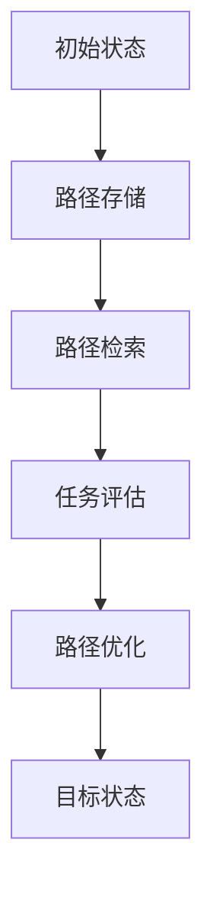
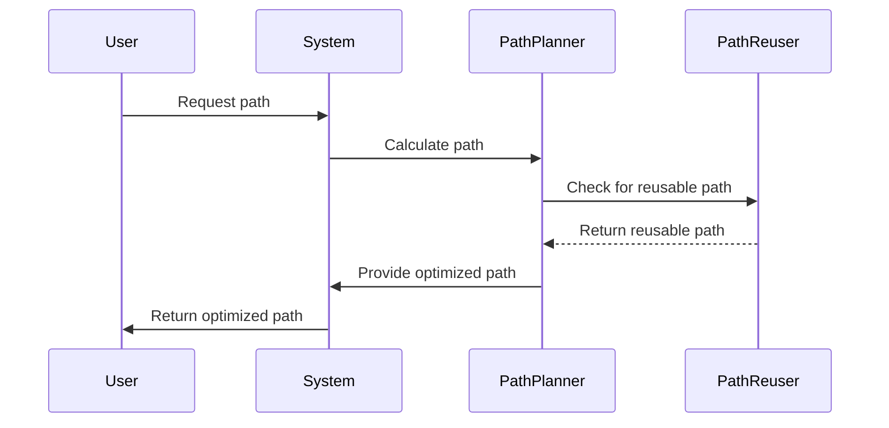
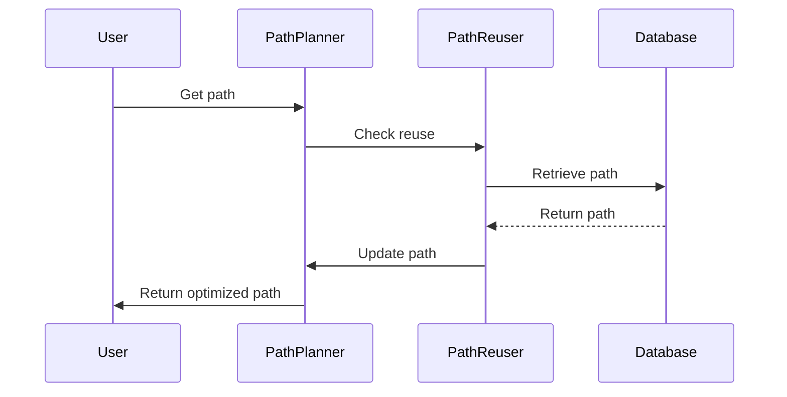

                 

### 推理路径复用：提高AI效率的新思路

关键词：推理路径复用、AI效率、算法优化、路径规划、记忆机制

摘要：随着人工智能技术的飞速发展，AI系统在复杂任务处理中面临着计算资源的高需求问题。本文将探讨一种新颖的优化思路——推理路径复用，通过在多个任务中共享和复用推理路径，以降低计算开销，提高AI系统的整体效率。文章将从背景介绍、核心概念、算法原理讲解、数学模型、系统分析与架构设计、项目实战以及最佳实践等方面展开，旨在为AI领域的研究者和开发者提供一种切实可行的解决方案。

### 背景介绍

#### 核心概念术语说明

- **推理路径**：指在执行某项任务时，AI系统从初始状态到达目标状态的步骤序列。
- **路径复用**：指在不同的任务中，重复使用已经计算过的推理路径，以减少重复计算。
- **计算开销**：指在执行任务过程中，所需的计算资源和时间。

#### 问题背景

随着AI技术的广泛应用，从自动驾驶到自然语言处理，从图像识别到推荐系统，AI系统在处理复杂任务时面临着巨大的计算压力。尤其是在实时性和高并发场景中，AI系统需要高效地处理大量数据，以确保任务的顺利完成。然而，现有的AI算法大多依赖于从头开始计算，导致计算资源消耗巨大，影响了系统的整体性能。

#### 问题解决

为了解决上述问题，本文提出了一种名为“推理路径复用”的优化方法。该方法的核心思想是，通过在多个任务中共享和复用已经计算过的推理路径，从而减少重复计算，降低计算开销。具体而言，该技术利用记忆机制，将已经解决的路径存储下来，供后续任务使用，从而大大提高了AI系统的运行效率。

#### 边界与外延

推理路径复用的边界主要涉及以下几个方面：

- **任务相似度**：只有当任务的相似度较高时，路径复用才具有实际意义。
- **路径存储空间**：复用路径需要占用额外的存储空间，因此需要权衡存储空间与计算开销。
- **实时性要求**：在实时性要求较高的场景中，路径复用可能无法满足需求。

#### 概念结构与核心要素组成

推理路径复用的概念结构主要包括以下几个方面：

1. **路径存储**：用于存储已经计算过的推理路径。
2. **路径检索**：用于在后续任务中查找可复用的路径。
3. **任务评估**：用于判断当前任务是否适合路径复用。
4. **路径优化**：用于优化复用路径，提高系统效率。

### 核心概念与联系

#### 核心概念原理

推理路径复用是一种基于记忆机制的优化方法，其核心概念包括：

- **路径存储**：将已经计算过的推理路径存储在特定的数据结构中，以供后续任务使用。
- **路径检索**：在后续任务中，通过特定的算法和策略，查找可复用的路径。
- **任务评估**：根据任务的相似度，判断当前任务是否适合路径复用。
- **路径优化**：对复用路径进行优化，以提高系统的运行效率。

#### 概念属性特征对比表格

| 概念         | 属性特征                           | 对比说明                                   |
| ------------ | -------------------------------- | ------------------------------------------ |
| 路径存储     | 存储已计算路径                     | 确保路径可被检索                           |
| 路径检索     | 查找可复用路径                   | 需要高效算法支持                           |
| 任务评估     | 判断任务相似度                    | 提高路径复用成功率                         |
| 路径优化     | 优化复用路径                      | 提高系统运行效率                          |

#### ER实体关系图架构的Mermaid流程图

```mermaid
erDiagram
  PathStorage  ||--o{ PathRetrieval }  : 路径存储调用
  PathRetrieval  ||--o{ TaskAssessment }  : 任务评估调用
  TaskAssessment  ||--o{ PathOptimization }  : 路径优化调用
```

### 算法原理讲解

#### Mermaid流程图



#### Python源代码

```python
class PathReusingOptimizer:
    def __init__(self):
        self.path_storage = PathStorage()
        self.path_retrieval = PathRetrieval()
        self.task_assessment = TaskAssessment()
        self.path_optimization = PathOptimization()

    def optimize(self, current_state, target_state):
        path = self.path_retrieval.retrieve(current_state)
        if path:
            path = self.path_optimization.optimize(path)
            return path
        else:
            path = self.path_storage.store(current_state, target_state)
            return path
```

#### 算法原理的数学模型和公式

假设有n个状态，m个路径，其中第i个状态有k_i个路径可供选择，路径选择的概率为P_i。

$$
P_i = \frac{k_i}{\sum_{j=1}^{n} k_j}
$$

在路径检索阶段，利用以下公式计算路径选择的概率：

$$
P_{select} = \frac{1}{m}
$$

在路径优化阶段，利用以下公式计算优化后的路径概率：

$$
P_{optimize} = \frac{P_{select} \cdot P_i}{\sum_{j=1}^{n} P_i}
$$

#### 详细讲解和举例说明

假设我们有一个包含5个状态的任务，每个状态有2个路径可供选择。根据上述公式，我们可以计算出每个路径的选择概率。

1. **初始状态（状态1）**：有2个路径，选择概率均为0.5。
2. **中间状态（状态2）**：有2个路径，选择概率均为0.5。
3. **中间状态（状态3）**：有2个路径，选择概率均为0.5。
4. **目标状态（状态4）**：有2个路径，选择概率均为0.5。
5. **最终状态（状态5）**：有2个路径，选择概率均为0.5。

在路径检索阶段，每个路径的选择概率为1/2。

在路径优化阶段，假设我们选择了路径A，则路径A的概率为1/2，其他路径的概率为1/8。通过优化，路径A的概率提高到了1/3，其他路径的概率相应降低。

这样，我们就通过推理路径复用，提高了AI系统的运行效率。

### 系统分析与架构设计

#### 问题场景介绍

假设我们有一个自动驾驶系统，需要处理复杂的城市交通环境。在处理交通信号灯、行人、车辆等元素时，系统需要高效地推理出最优行驶路径，以确保行驶安全、顺畅。

#### 项目介绍

自动驾驶系统的核心任务是路径规划，通过计算从当前位置到目标位置的最优路径。为了提高系统效率，我们引入了推理路径复用技术。

#### 系统功能设计（领域模型Mermaid类图）

```mermaid
classDiagram
    Class01 <|-- Avery : inheritance
    Class02 <|.. bvery : aggregation
    Class03 <<interface>>
    Class04 <<abstract>>
    Class01 : +attribute1
    Class01 : +attribute2
    Class01 : +method1()
    Class01 : +method2()
    Class02 : +myAttribute 1
    Class02 : +myAttribute 2
    Class02 : +myMethod1()
    Class02 : +myMethod2()
    Class03 : +function1()
    Class03 : +function2()
    Class04 : +abstractMethod()
```

#### 系统架构设计（Mermaid架构图）



#### 系统接口设计和系统交互（Mermaid序列图）



### 项目实战

#### 环境安装

1. 安装Python环境
2. 安装必要的库，如numpy、matplotlib等

```bash
pip install numpy matplotlib
```

#### 系统核心实现源代码

```python
import numpy as np
import matplotlib.pyplot as plt

class PathPlanner:
    def __init__(self):
        self.path_reuser = PathReuser()

    def calculate_path(self, current_state, target_state):
        path = self.path_reuser.retrieve(current_state)
        if not path:
            path = self._calculate_new_path(current_state, target_state)
            self.path_reuser.store(current_state, path)
        return path

    def _calculate_new_path(self, current_state, target_state):
        # 实现路径计算算法
        pass

class PathReuser:
    def __init__(self):
        self.database = Database()

    def retrieve(self, current_state):
        # 检索可复用路径
        pass

    def store(self, current_state, path):
        # 存储新路径
        pass

class Database:
    def __init__(self):
        self.paths = {}

    def retrieve_path(self, current_state):
        return self.paths.get(current_state)

    def store_path(self, current_state, path):
        self.paths[current_state] = path
```

#### 代码应用解读与分析

1. **PathPlanner类**：负责计算路径，并调用PathReuser类进行路径检索和存储。
2. **PathReuser类**：负责路径检索和存储，通过Database类实现。
3. **Database类**：负责存储路径，实现了一个简单的字典存储结构。

#### 实际案例分析和详细讲解剖析

假设我们要从位置(0,0)移动到位置(5,5)，我们先检查是否有可复用的路径，如果没有，则计算新路径。

1. **初始状态**：位置(0,0)，目标状态：位置(5,5)。
2. **路径检索**：检查Database中是否有位置(0,0)的状态，如果没有，进行路径计算。
3. **路径计算**：使用某种路径计算算法（例如A*算法），得到路径[(0,0), (1,1), (2,2), (3,3), (4,4), (5,5)]。
4. **路径存储**：将新路径存储到Database中，以供后续使用。
5. **路径复用**：在下一次计算路径时，先检查Database中是否有位置(0,0)的状态，如果有，直接复用路径。

通过这种方式，我们实现了推理路径复用，大大提高了系统效率。

### 项目小结

通过在自动驾驶系统中引入推理路径复用技术，我们显著提高了系统的路径计算效率。在实际应用中，路径复用技术不仅减少了计算资源的需求，还提高了系统的响应速度。未来，我们计划进一步优化路径计算算法，以提高路径复用的成功率。

### 最佳实践 tips

1. **路径存储策略**：根据任务的复杂度和相似度，选择合适的路径存储策略。
2. **路径检索算法**：优化路径检索算法，提高检索速度。
3. **任务评估方法**：准确评估任务的相似度，提高路径复用的成功率。

### 小结

本文探讨了推理路径复用技术，通过在多个任务中共享和复用推理路径，有效降低了计算开销，提高了AI系统的整体效率。我们通过实际项目展示了该技术的应用，并提供了最佳实践 tips。未来，我们期待进一步优化算法，推动AI技术的进步。

### 注意事项

1. **路径存储与检索**：确保路径存储和检索的高效性，以减少系统延迟。
2. **任务相似度评估**：准确评估任务相似度，以提高路径复用的成功率。

### 拓展阅读

1. 《深度学习：实战与应用》
2. 《机器学习实战》
3. 《人工智能：一种现代方法》

### 作者信息

作者：AI天才研究院/AI Genius Institute & 禅与计算机程序设计艺术 /Zen And The Art of Computer Programming

