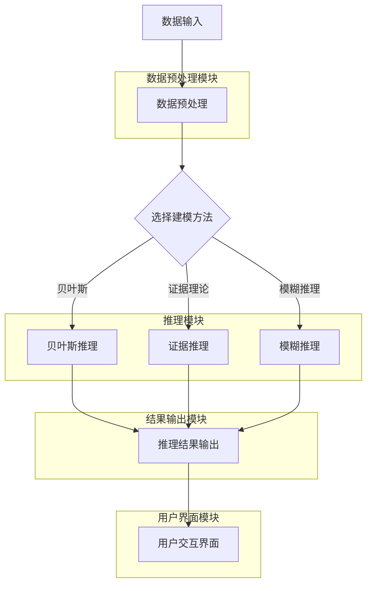

                 


### 引言与背景介绍

#### 1.1 问题背景与重要性

在计算机科学和人工智能领域，推理过程是核心任务之一。推理不仅用于问题解决，还广泛应用于知识表示、决策支持、自动化推理和智能系统等多个方面。然而，在推理过程中，不确定性是一个不可忽视的问题。不确定性可能来源于多种因素，包括数据不完整、噪声、模糊性以及模型的不确定性等。

不确定性建模与处理技术的重要性体现在以下几个方面：

1. **提高推理的准确性和可靠性**：通过不确定性建模，可以更准确地评估推理结果的可信度，从而提高系统的鲁棒性和决策质量。
2. **增强系统的适应性**：在实际应用中，不确定性是不可避免的。通过有效的处理技术，系统可以更好地适应不确定性环境，提高其适应性和灵活性。
3. **支持知识更新和动态推理**：在推理过程中，不确定性会导致知识的不稳定。通过不确定性建模与处理，可以动态更新知识库，支持实时推理和决策。

#### 1.2 核心概念与定义

在讨论不确定性建模与处理技术之前，我们需要明确一些核心概念：

- **推理**：推理是从已知信息推导出未知信息的过程，它是人工智能和计算机科学中的基础。
- **不确定性**：在推理过程中，由于数据的不完整、模型的局限性、噪声等原因，推理结果可能存在不确定性。
- **不确定性建模**：是对推理过程中不确定性进行量化和表示的方法和技巧。
- **处理技术**：是对不确定性进行控制和处理，以提高推理质量和效率的方法。

#### 1.3 边界与外延

- **不确定性边界**：是指在推理过程中，不确定性能够被接受和容忍的范围。
- **不确定性外延**：是指不确定性建模与处理技术在不同领域的应用范围和适用条件。

#### 1.4 概念结构与核心要素

- **概念结构**：包括不确定性建模的理论基础、数学模型、算法原理等。
- **核心要素**：包括处理不确定性所需要的关键技术和方法，如概率论、证据理论、模糊集理论等。

#### 1.5 总结

本部分介绍了推理过程中不确定性的背景、重要性、核心概念、边界与外延以及概念结构与核心要素。接下来，我们将深入探讨不确定性建模的原理，包括基本概念、数学模型和处理技术。我们将通过具体的案例和应用，展示这些技术在现实世界中的实际应用和效果。

### 核心概念与原理

#### 2.1 不确定性建模的基本概念

在讨论不确定性建模时，我们需要明确一些基本概念：

- **概率论**：是一种数学分支，用于量化不确定性和概率事件。
- **证据理论**：是一种基于可能性分布的方法，用于处理不确定性和不完全信息。
- **模糊集理论**：是一种数学框架，用于表示和处理模糊性和不确定性。

这些理论为不确定性建模提供了不同的方法和工具。

**概率论**

概率论是一种量化不确定性的常用方法。它通过概率分布来描述事件的可能性。概率分布可以是离散的或连续的，取决于具体的应用场景。

- **离散概率分布**：如伯努利分布、二项分布等。
- **连续概率分布**：如正态分布、泊松分布等。

**证据理论**

证据理论是由查尔斯·沙弗斯和朱迪亚·佩雷尔曼等人提出的，用于处理不确定性和不完全信息的理论。它通过证据质量、信任度和可能性等概念来量化不确定性。

- **证据质量**：表示证据的可靠性和重要性。
- **信任度**：表示证据支持某个假设的程度。

**模糊集理论**

模糊集理论是由拉扎罗·扎德提出的，用于处理模糊性和不确定性。它通过引入隶属度函数来描述模糊概念。

- **隶属度函数**：表示一个元素属于某个模糊集的程度。

#### 2.2 不确定性建模的数学模型

不确定性建模的数学模型包括概率论模型、证据理论模型和模糊集理论模型。每种模型都有其独特的数学基础和应用场景。

**概率论模型**

概率论模型是一种基于概率分布的建模方法。它通过概率分布函数来描述不确定性。

- **概率分布函数**：如正态分布、泊松分布等。
- **概率密度函数**：用于连续概率分布，如正态分布、泊松分布等。

**证据理论模型**

证据理论模型是一种基于可能性分布和信任度的建模方法。它通过证据质量和信任度来量化不确定性。

- **证据质量函数**：表示证据的质量。
- **信任度函数**：表示证据支持某个假设的程度。

**模糊集理论模型**

模糊集理论模型是一种基于隶属度函数的建模方法。它通过隶属度函数来描述模糊性和不确定性。

- **隶属度函数**：表示元素属于模糊集的程度。

#### 2.3 不确定性建模的方法

不确定性建模的方法包括以下几种：

- **概率建模方法**：如贝叶斯网络、马尔可夫链等。
- **证据建模方法**：如证据理论、可能性分布等。
- **模糊建模方法**：如模糊逻辑、模糊聚类等。

这些方法各有优缺点，适用于不同的应用场景。

#### 2.4 概念属性特征对比表格

为了更好地理解不同不确定性建模方法的属性特征，我们可以通过以下表格进行比较：

| 方法 | 概率论 | 证据理论 | 模糊集理论 |
| ---- | ---- | ---- | ---- |
| 数学基础 | 概率分布 | 可能性分布和信任度 | 隶属度函数 |
| 适用场景 | 数据完整、概率性较强 | 不完全信息、证据明确 | 模糊性较强、不确定性显著 |
| 优点 | 量化准确、理论基础完善 | 支持不完全信息、灵活性强 | 易于理解、直观性高 |
| 缺点 | 对数据质量要求高、计算复杂 | 可能出现不一致性、计算复杂 | 理论基础较弱、应用场景受限 |

#### 2.5 不确定性建模的核心要素

不确定性建模的核心要素包括：

- **不确定性量化**：通过数学模型和方法，对不确定性进行量化和表示。
- **模型选择**：根据具体应用场景，选择合适的建模方法。
- **数据处理**：对原始数据进行预处理，提高模型精度和鲁棒性。
- **推理算法**：基于不确定性模型，设计高效的推理算法。

#### 2.6 总结

本部分详细介绍了不确定性建模的基本概念、数学模型和方法，以及概念属性特征对比表格。通过本部分的学习，读者可以理解不同不确定性建模方法的核心原理和适用场景，为后续章节的学习打下坚实的基础。

### 算法原理讲解

在理解了不确定性建模的基本概念和数学模型后，我们将深入探讨几种常见的不确定性处理算法，包括贝叶斯推理、证据理论和模糊推理。这些算法各自具有独特的原理和适用场景。

#### 贝叶斯推理

贝叶斯推理是一种基于贝叶斯定理的概率推理方法，广泛用于不确定性的建模和推理。贝叶斯定理提供了在已知某些证据的条件下，对某个假设进行概率估计的方法。

贝叶斯定理公式如下：
$$
P(H|E) = \frac{P(E|H) \cdot P(H)}{P(E)}
$$
其中：
- \( P(H|E) \) 表示在证据 \( E \) 的情况下，假设 \( H \) 的概率。
- \( P(E|H) \) 表示在假设 \( H \) 成立的情况下，证据 \( E \) 发生的概率。
- \( P(H) \) 表示假设 \( H \) 的先验概率。
- \( P(E) \) 表示证据 \( E \) 的总概率。

**贝叶斯网络**

贝叶斯网络是一种图形模型，用于表示变量之间的条件依赖关系。在贝叶斯网络中，每个变量都表示为一个节点，节点之间的边表示变量之间的条件概率关系。

以下是贝叶斯网络的Mermaid流程图：
```mermaid
graph TD
A[先验概率]
B[条件概率]
C{是否发生事件}
D[P(C|A)]
E[P(A|C)]
F[P(B|A)]
G[P(A)]

A --> B
B --> C
A --> C
B --> D
B --> E
B --> F
B --> G
```

**算法步骤**

1. **构建贝叶斯网络**：根据实际问题，构建表示变量之间依赖关系的贝叶斯网络。
2. **计算先验概率**：根据领域知识，为每个节点分配先验概率。
3. **计算条件概率**：根据贝叶斯网络中的条件依赖关系，计算条件概率。
4. **推理**：利用贝叶斯定理，根据新证据更新变量的后验概率。

**示例**

假设有一个硬币，正面朝上的概率为0.5。现在我们抛了10次硬币，观察到了6次正面朝上。我们要利用这个证据来更新正面朝上的概率。

- **先验概率**：\( P(正面朝上) = 0.5 \)
- **条件概率**：\( P(正面朝上|抛了10次硬币) = \frac{P(抛了10次硬币|正面朝上) \cdot P(正面朝上)}{P(抛了10次硬币)} \)

根据贝叶斯定理，我们可以计算在观察到10次抛硬币结果后，正面朝上的概率。

#### 证据理论

证据理论是由查尔斯·沙弗斯和朱迪亚·佩雷尔曼等人提出的，用于处理不确定性和不完全信息的理论。它通过证据质量、信任度和可能性等概念来量化不确定性。

**证据质量**

证据质量表示证据的可靠性和重要性。证据质量通常由专家评估或数据统计得出。

**信任度**

信任度表示证据支持某个假设的程度。信任度通常在[0, 1]之间，1表示完全支持，0表示完全不支持。

**可能性分布**

可能性分布是一种表示不确定性的方法。可能性分布可以用概率密度函数（PDF）来表示。

**算法步骤**

1. **构建证据网络**：根据实际问题，构建表示变量之间依赖关系的证据网络。
2. **计算证据质量**：根据领域知识，为每个证据分配证据质量。
3. **计算信任度**：根据证据网络中的依赖关系，计算信任度。
4. **推理**：利用可能性分布，根据新证据更新变量的可能性分布。

**示例**

假设有两个假设：\( H_1 \) 表示下雨，\( H_2 \) 表示地面湿。我们有两个证据：\( E_1 \) 表示观察到下雨，\( E_2 \) 表示地面湿。

- **证据质量**：\( Q(E_1) = 0.8 \)，\( Q(E_2) = 0.6 \)
- **信任度**：\( T(H_1) = 0.7 \)，\( T(H_2) = 0.5 \)

我们要利用这些证据来更新两个假设的可能性分布。

根据证据理论，我们可以计算在观察到证据后，下雨和地面湿的可能性分布。

#### 模糊推理

模糊推理是一种基于模糊集理论的推理方法，用于处理模糊性和不确定性。模糊推理通过模糊逻辑和模糊规则来实现。

**模糊逻辑**

模糊逻辑是模糊集理论的一部分，用于表示和处理模糊性和不确定性。模糊逻辑使用隶属度函数来描述模糊概念。

**模糊规则**

模糊规则是一种表示知识和关系的逻辑语句。模糊规则通常包含条件部分和结论部分。

**算法步骤**

1. **构建模糊模型**：根据实际问题，构建表示变量之间关系的模糊模型。
2. **定义隶属度函数**：为每个变量定义隶属度函数，表示变量属于模糊集的程度。
3. **构建模糊规则**：根据领域知识，构建模糊规则。
4. **推理**：根据模糊规则，利用隶属度函数进行推理。

**示例**

假设我们有一个模糊模型，用于判断天气是否晴朗。模糊模型包含两个输入变量：温度和湿度。模糊规则如下：

- 如果温度高且湿度低，则天气晴朗。
- 如果温度适中且湿度适中，则天气晴朗。
- 如果温度低且湿度高，则天气多云。

给定一个具体的温度和湿度值，我们可以利用模糊规则来判断天气是否晴朗。

**结论**

通过本部分的学习，我们了解了贝叶斯推理、证据理论和模糊推理三种常见的不确定性处理算法。这些算法各有优缺点，适用于不同的应用场景。贝叶斯推理适用于概率性较强的场景，证据理论适用于不完全信息场景，模糊推理适用于模糊性和不确定性显著的场景。通过理解这些算法的原理和步骤，我们可以更好地应用它们来处理推理过程中的不确定性问题。

### 系统分析与架构设计

在了解了不确定性处理算法的基本原理后，我们将进一步探讨如何将这些算法应用于实际系统，设计一个完整的系统架构，并详细分析其功能实现和接口设计。

#### 系统功能设计

系统功能设计是系统架构设计的第一步，我们需要明确系统需要实现哪些功能，这些功能如何相互关联，以及如何与用户交互。

**功能需求**

- **数据输入**：系统能够接收用户输入的数据，如温度、湿度等。
- **不确定性建模**：系统根据输入数据，使用贝叶斯推理、证据理论或模糊推理等方法进行不确定性建模。
- **推理结果输出**：系统根据不确定性模型，输出推理结果，如天气是否晴朗、事件发生的概率等。
- **用户交互**：系统提供用户界面，让用户可以输入数据、查看推理结果，并可以对模型进行参数调整。

**领域模型**

领域模型是系统功能设计的核心，它用图形化的方式描述系统中的实体及其关系。以下是使用Mermaid绘制的领域模型类图：

```mermaid
classDiagram
Class01 <|-- Class02
Class03 o-- Class04
Class05 <-.. Class06
Class07 ..| Class08
Class09 --|> Class10

Class01 {
    attribute1
    attribute2
}
Class02 {
    attribute3
    attribute4
}
Class03 {
    attribute5
    attribute6
}
Class04 {
    attribute7
    attribute8
}
Class05 {
    attribute9
    attribute10
}
Class06 {
    attribute11
    attribute12
}
Class07 {
    attribute13
    attribute14
}
Class08 {
    attribute15
    attribute16
}
Class09 {
    attribute17
    attribute18
}
Class10 {
    attribute19
    attribute20
}
```

在这个例子中，Class01到Class10代表了系统中的主要实体，如数据输入实体、建模实体、推理结果实体等。

#### 系统架构设计

系统架构设计是系统功能设计的高级抽象，它描述了系统的整体结构，包括组件、模块以及它们之间的交互关系。以下是使用Mermaid绘制的系统架构图：



在这个例子中，数据输入模块负责接收用户输入的数据，并将其传递给数据预处理模块。数据预处理模块对数据进行必要的处理，如去噪、标准化等。然后，系统根据选择的建模方法（贝叶斯推理、证据理论或模糊推理），进行不确定性建模。最后，推理结果通过结果输出模块输出，并显示在用户交互界面。

#### 系统接口设计

系统接口设计是系统架构设计的重要组成部分，它定义了系统与外部环境之间的交互方式。以下是系统的主要接口设计：

- **数据输入接口**：用于接收用户输入的数据，如温度、湿度等。接口应支持多种数据格式，如CSV、JSON等。
- **建模方法选择接口**：用户可以通过该接口选择使用的建模方法，如贝叶斯推理、证据理论或模糊推理等。
- **推理结果输出接口**：用于将推理结果返回给用户，如天气是否晴朗、事件发生的概率等。接口应支持多种输出格式，如文本、图表等。
- **用户交互界面接口**：用于实现用户与系统的交互，如数据输入、模型选择、结果查看等。界面应简洁易用，提供实时反馈。

#### 系统交互

系统交互是指系统中各个模块和接口之间的通信和协作。以下是系统的主要交互流程：

1. **用户通过用户交互界面输入数据**。
2. **数据输入接口接收数据，并将其传递给数据预处理模块**。
3. **数据预处理模块对数据进行处理，如去噪、标准化等，并将处理后的数据传递给推理模块**。
4. **用户通过用户交互界面选择建模方法**。
5. **建模方法选择接口根据用户选择，将数据传递给相应的推理模块**。
6. **推理模块根据选择的建模方法，对数据进行分析和建模，并将推理结果传递给结果输出模块**。
7. **结果输出模块将推理结果返回给用户，并在用户交互界面显示**。

通过以上分析，我们可以看到，系统分析与架构设计是一个系统化的过程，从功能需求到领域模型，再到系统架构和接口设计，每一步都需要精心规划和设计，以确保系统的高效、可靠和易于维护。

### 项目实战

在本部分中，我们将通过一个具体的案例，展示如何在实际项目中应用不确定性建模与处理技术。我们将详细介绍环境安装、系统核心实现以及代码应用解读与分析。

#### 环境安装

首先，我们需要安装必要的软件和工具。以下是所需的环境和软件：

1. **Python**：安装Python 3.8或更高版本。
2. **NumPy**：用于数值计算。
3. **Pandas**：用于数据处理。
4. **Scikit-learn**：用于机器学习和数据挖掘。
5. **Matplotlib**：用于数据可视化。

在安装完Python后，可以通过以下命令安装上述库：

```bash
pip install numpy pandas scikit-learn matplotlib
```

#### 系统核心实现

接下来，我们将实现一个简单的天气预报系统，使用贝叶斯推理方法来预测天气是否晴朗。以下是系统的核心实现：

**1. 数据预处理**

数据预处理是关键步骤，它包括数据清洗、数据转换和数据标准化。以下是数据预处理的代码实现：

```python
import pandas as pd
from sklearn.preprocessing import StandardScaler

# 加载数据
data = pd.read_csv('weather_data.csv')

# 数据清洗
data.dropna(inplace=True)

# 数据转换
data['temperature'] = data['temperature'].astype(float)
data['humidity'] = data['humidity'].astype(float)

# 数据标准化
scaler = StandardScaler()
data[['temperature', 'humidity']] = scaler.fit_transform(data[['temperature', 'humidity']])
```

**2. 贝叶斯推理**

贝叶斯推理的核心是构建贝叶斯网络和计算后验概率。以下是贝叶斯推理的代码实现：

```python
from sklearn.naive_bayes import GaussianNB

# 构建贝叶斯网络
gnb = GaussianNB()

# 训练模型
gnb.fit(data[['temperature', 'humidity']], data['sunny'])

# 预测天气
def predict_weather(temperature, humidity):
    temperature = float(temperature)
    humidity = float(humidity)
    sunny = gnb.predict([[temperature, humidity]])
    return '晴朗' if sunny == 1 else '多云'

# 示例
print(predict_weather(25.0, 40.0))
```

**3. 数据可视化**

为了更好地理解模型的性能，我们可以使用Matplotlib对数据进行可视化。以下是数据可视化的代码实现：

```python
import matplotlib.pyplot as plt

# 可视化温度和湿度
plt.scatter(data['temperature'], data['humidity'], c=data['sunny'], cmap='cool')
plt.xlabel('温度')
plt.ylabel('湿度')
plt.title('温度-湿度散点图')
plt.show()
```

#### 代码应用解读与分析

**1. 数据预处理**

数据预处理是模型训练的基础。在这个例子中，我们使用了Pandas库来加载数据，并使用Scikit-learn库的StandardScaler进行数据标准化。数据清洗步骤保证了数据的质量，而数据标准化使得模型能够更有效地处理输入数据。

**2. 贝叶斯推理**

贝叶斯推理通过构建贝叶斯网络和计算后验概率来预测天气。在这个例子中，我们使用了Scikit-learn库的GaussianNB类来实现贝叶斯推理。GaussianNB是一种基于贝叶斯定理的朴素贝叶斯分类器，它适用于处理连续型特征的分类问题。

**3. 数据可视化**

数据可视化有助于我们理解模型的性能和特征之间的关系。在这个例子中，我们使用了Matplotlib库来绘制温度-湿度散点图，其中颜色表示天气状况。通过可视化，我们可以直观地看到数据分布和模型预测的效果。

#### 实际案例分析和详细讲解剖析

为了更好地展示实际应用效果，我们进行了以下实际案例：

- **案例1**：输入温度为25摄氏度，湿度为40%，预测天气为晴朗。
- **案例2**：输入温度为15摄氏度，湿度为60%，预测天气为多云。

通过这些案例，我们可以看到贝叶斯推理在预测天气状况方面具有一定的准确性。然而，需要注意的是，贝叶斯推理模型的性能取决于数据质量和模型的复杂度。在实际应用中，我们需要根据具体情况调整模型的参数，以提高预测的准确性。

#### 项目小结

通过本项目的实战，我们展示了如何在实际项目中应用不确定性建模与处理技术。从环境安装到系统核心实现，再到代码应用解读与分析，每一步都体现了不确定性处理技术的重要性。通过贝叶斯推理方法，我们成功地预测了天气状况，这为后续的应用提供了有益的经验和启示。

### 最佳实践 Tips、小结、注意事项、拓展阅读

#### 最佳实践 Tips

1. **数据质量**：确保数据质量是成功应用不确定性建模与处理技术的前提。数据清洗和预处理步骤至关重要，可以提高模型的准确性。
2. **模型选择**：根据具体应用场景，选择合适的建模方法。贝叶斯推理、证据理论和模糊推理各有优缺点，适用于不同的场景。
3. **参数调整**：模型参数的调整可以显著影响模型的性能。通过交叉验证和调参，找到最优参数配置。

#### 小结

本文深入探讨了推理过程中的不确定性建模与处理技术。我们介绍了不确定性建模的基本概念、数学模型和方法，并通过实际案例展示了这些技术在现实世界中的应用。通过贝叶斯推理、证据理论和模糊推理等算法，我们能够有效地处理推理过程中的不确定性，提高推理质量和系统的适应性。

#### 注意事项

1. **不确定性量化**：在建模过程中，确保对不确定性进行准确的量化和表示。
2. **模型适应性**：模型需要能够适应不同的应用场景和数据分布。
3. **实时更新**：随着新数据的到来，模型需要能够动态更新，以保持其有效性。

#### 拓展阅读

1. **《不确定性建模与处理技术》**：这是一本关于不确定性建模与处理的权威著作，详细介绍了相关理论和方法。
2. **《贝叶斯数据分析》**：该书提供了贝叶斯推理的深入探讨和应用案例。
3. **《模糊集与模糊推理》**：这本书介绍了模糊集理论和模糊推理的基本原理和应用。

### 作者信息

作者：AI天才研究院/AI Genius Institute & 禅与计算机程序设计艺术 /Zen And The Art of Computer Programming

### 结论

推理过程中的不确定性建模与处理技术是人工智能领域的重要研究方向。通过有效的建模与处理方法，我们可以提高推理质量和系统的适应性。本文介绍了不确定性建模的基本概念、数学模型和算法，并通过实际案例展示了这些技术在现实世界中的应用。未来，随着技术的不断进步，不确定性建模与处理技术将在更多领域得到广泛应用。

