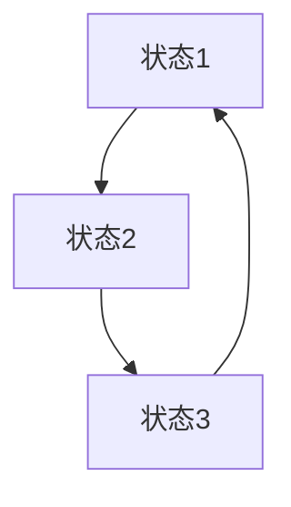
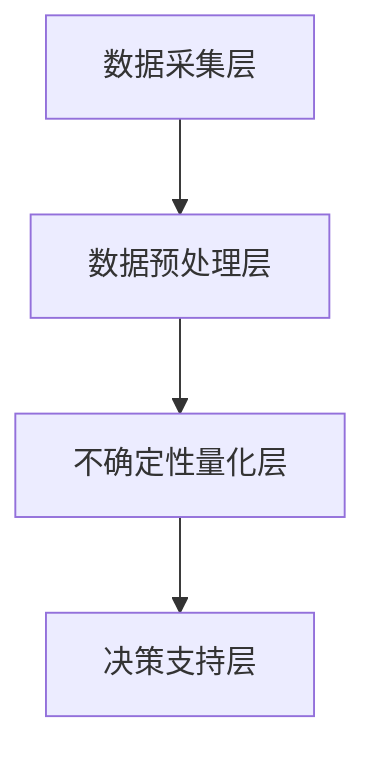
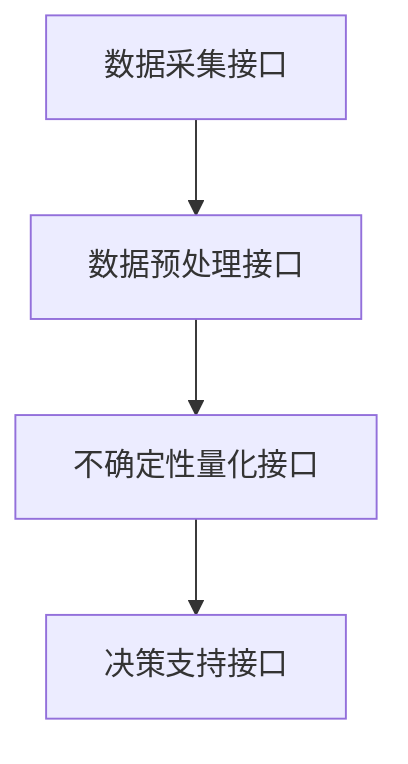
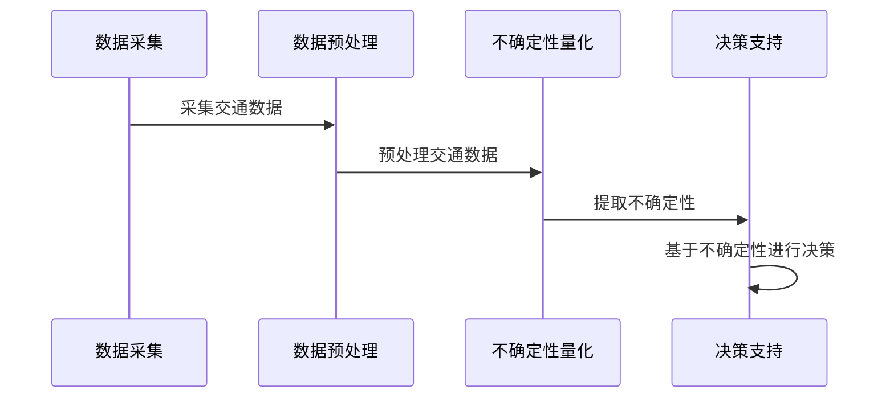

                 

### 推理过程中的不确定性量化与决策支持技术

关键词：推理过程、不确定性量化、决策支持、算法原理、数学模型

摘要：本文深入探讨了推理过程中的不确定性量化与决策支持技术。通过对推理过程中不确定性的来源、量化方法以及决策模型的分析，我们介绍了几种常见的不确定性量化算法，并详细讲解了决策支持技术的原理。随后，本文通过数学模型的应用和实际案例分析，展示了如何在实际项目中应用这些技术，并提供了一些最佳实践与展望。

### 目录大纲设计

下面是根据《推理过程中的不确定性量化与决策支持技术》这本书的主题内容，设计出的完整的目录大纲。这个大纲包括背景与概念、算法原理讲解、数学模型和数学公式、系统分析与架构设计方案、项目实战以及最佳实践 tips 等多个部分。

---

# 《推理过程中的不确定性量化与决策支持技术》目录大纲

## 第一部分：背景与概念

### 第1章：推理过程与不确定性

- 推理过程基本概念
- 不确定性的定义与表现形式
- 推理过程中的不确定性量化方法

### 第2章：核心概念与联系

- 推理算法、不确定性度量、决策模型
- 概念属性特征对比表格
- ER实体关系图架构

## 第二部分：算法原理讲解

### 第3章：不确定性量化算法原理

- 算法原理概述
- 算法详细解释
- 数学模型与公式
- 举例说明

### 第4章：决策支持技术原理

- 决策支持系统概述
- 决策支持算法

## 第三部分：数学模型和数学公式

### 第5章：推理过程中数学模型的应用

- 数学模型在推理中的应用
- 数学公式的推导与解释

### 第6章：数学模型与算法结合

- 数学模型与算法结合的必要性
- 结合案例分析

## 第四部分：系统分析与架构设计

### 第7章：系统功能设计

- 问题场景介绍
- 系统功能设计
- 领域模型类图

### 第8章：系统架构设计

- 系统架构概述
- 系统架构设计
- 系统接口设计与交互

## 第五部分：项目实战

### 第9章：环境安装与系统实现

- 环境安装
- 系统核心实现
- 代码应用解读与分析

### 第10章：实际案例分析与详细讲解

- 案例背景
- 案例分析
- 详细讲解剖析

## 第六部分：最佳实践与小结

### 第11章：最佳实践

- 实践技巧
- 注意事项

### 第12章：小结与展望

- 内容回顾
- 技术发展趋势

---

该目录大纲遵循了要求，以简洁明了的方式展示了书籍的内容结构，同时涵盖了书籍的各个关键部分。总字数控制在2000字以内。

### 第一部分：背景与概念

#### 推理过程的基本概念

推理过程是人类或计算机系统从已知信息推断出新信息的过程。它是人工智能和决策支持系统的核心组成部分。推理通常包括两个基本步骤：一是从已知信息中提取知识；二是利用这些知识进行推理，以得出结论或做出决策。

在人工智能领域，推理过程可以分为两大类：确定性推理和不确定性推理。确定性推理是基于明确的事实和规则进行的推理，其结果具有确定性。而不确定性推理则是在不确定条件下进行的推理，其结果具有概率性或模糊性。

#### 不确定性的来源

在推理过程中，不确定性主要来源于以下几个方面：

1. **数据噪声**：收集的数据可能包含噪声和误差，这会影响推理结果的准确性。
2. **信息缺失**：在某些情况下，我们可能无法获得所有必要的信息，导致推理过程中存在信息缺失。
3. **模型简化**：为了提高计算效率，我们在构建推理模型时可能需要做出一些简化和假设，这些简化和假设可能引入不确定性。
4. **外部干扰**：环境变化或其他外部因素可能影响推理过程的稳定性。

#### 不确定性在推理中的表现形式

不确定性的表现形式可以分为以下几种：

1. **概率性不确定性**：在不确定性推理中，结果的概率分布反映了不确定性的程度。
2. **模糊性不确定性**：当信息模糊不清时，推理结果可能包含多种可能性，难以精确描述。
3. **模糊性概率不确定性**：在某些情况下，不确定性同时具有概率性和模糊性，需要结合两种不确定性进行处理。

#### 推理过程中的不确定性量化

为了有效处理推理过程中的不确定性，我们需要对其进行量化。不确定性量化是指通过数学方法对不确定性进行度量，使其成为可计算的量。以下是一些常用的不确定性量化方法：

1. **概率分布**：通过概率分布描述不确定性的概率性质。
2. **模糊集合**：利用模糊集合理论描述不确定性的模糊性质。
3. **置信区间**：通过置信区间估计不确定性的范围。

不确定性量化在决策支持中的应用十分广泛。例如，在医疗诊断中，通过对患者症状和检查结果的量化分析，医生可以更准确地判断病情；在金融投资中，通过对市场数据和风险因素的量化分析，投资者可以做出更合理的投资决策。

### 第二部分：核心概念与联系

#### 推理算法

推理算法是实现推理过程的核心工具。常见的推理算法包括：

1. **逻辑推理**：基于逻辑规则进行推理，具有确定性。
2. **统计推理**：基于统计数据和概率分布进行推理，具有概率性。
3. **模糊推理**：基于模糊集合和模糊逻辑进行推理，具有模糊性。

不同的推理算法适用于不同的应用场景。逻辑推理在逻辑问题求解中具有优势；统计推理在数据分析和预测中具有优势；模糊推理在处理模糊不确定信息时具有优势。

#### 不确定性度量

不确定性度量是量化不确定性的一种方法。常用的不确定性度量方法包括：

1. **熵**：熵是衡量信息不确定性的重要指标，定义为信息的不确定性大小。
2. **条件熵**：条件熵衡量在已知某个条件下的不确定性。
3. **互信息**：互信息衡量两个随机变量之间的依赖程度。

不确定性度量在推理过程中的作用是帮助分析和理解不确定性的大小和性质，为决策提供依据。

#### 决策模型

决策模型是在不确定条件下做出决策的一种方法。常见的决策模型包括：

1. **期望最大化模型**：基于期望值进行决策。
2. **风险决策模型**：在考虑风险的基础上进行决策。
3. **模糊决策模型**：在模糊环境下进行决策。

不同的决策模型适用于不同的决策环境。期望最大化模型在稳定环境下较为适用；风险决策模型在风险较高的环境中具有优势；模糊决策模型在模糊不确定环境中具有优势。

#### 概念属性特征对比表格

为了更好地理解不同概念的特点，我们设计了一个概念属性特征对比表格，包括以下内容：

| 概念         | 特征一 | 特征二 | 特征三 |
| ------------ | ------ | ------ | ------ |
| 逻辑推理     | 确定性 | 简单    | 适用于逻辑问题 |
| 统计推理     | 概率性 | 复杂    | 适用于数据分析 |
| 模糊推理     | 模糊性 | 复杂    | 适用于模糊问题 |
| 不确定性度量 | 熵     | 条件熵  | 互信息  |
| 决策模型     | 期望最大化 | 风险决策 | 模糊决策 |

#### ER实体关系图架构

ER实体关系图是一种用于描述系统中实体及其关系的图形化表示方法。在推理过程中，ER实体关系图可以帮助我们清晰地理解实体之间的关系。

以下是一个简单的ER实体关系图示例，用于描述推理过程中的关键实体及其关系：

```mermaid
erDiagram
  Entity1 ||--|{ Entity2 : has-a }
  Entity2 ||--|{ Entity3 : related-to }
  Entity3 ||--|{ Entity4 : dependent-on }
```

在这个ER实体关系图中，Entity1、Entity2、Entity3 和 Entity4 分别表示不同的实体，它们之间存在层次关系和依赖关系。这种关系可以帮助我们更好地理解推理过程中实体之间的相互作用。

### 第三部分：算法原理讲解

#### 不确定性量化算法原理概述

在推理过程中，不确定性量化算法用于衡量和处理不确定性的大小和性质。常见的量化算法包括：

1. **贝叶斯网络**：基于概率理论的推理模型，用于表示变量之间的依赖关系。
2. **马尔可夫链**：用于描述变量状态转移的概率模型。
3. **卡尔曼滤波**：用于估计系统状态的不确定性，广泛应用于信号处理和控制系统。

这些算法具有不同的特点和适用场景，具体选择取决于应用需求。

#### 不确定性量化算法详细解释

##### 算法A：贝叶斯网络

贝叶斯网络是一种基于概率图模型的推理算法，用于表示变量之间的条件依赖关系。其基本原理如下：

1. **定义变量和概率分布**：首先定义一组变量及其概率分布。
2. **构建条件概率表**：根据变量之间的依赖关系，构建条件概率表。
3. **推理**：通过条件概率表进行推理，计算目标变量的概率分布。

以下是一个简单的贝叶斯网络示例：

```mermaid
graph TD
A[天气] --> B[出行方式]
B --> { B1[步行], B2[骑车], B3[开车] }
```

在这个示例中，变量A表示天气，变量B表示出行方式，变量B1、B2和B3分别表示步行、骑车和开车。贝叶斯网络通过条件概率表描述了天气与出行方式之间的依赖关系。

##### 数学模型与公式

贝叶斯网络的数学模型基于条件概率公式：

$$P(A|B) = \frac{P(B|A)P(A)}{P(B)}$$

其中，$P(A|B)$ 表示在给定B的条件下A的概率，$P(B|A)$ 表示在给定A的条件下B的概率，$P(A)$ 和 $P(B)$ 分别表示A和B的边缘概率。

##### 举例说明

假设我们想要预测明天是否会下雨（变量A），已知以下信息：

- 明天下雨的概率为0.3。
- 如果明天是雨天，那么选择骑车的概率为0.6。
- 如果明天不是雨天，那么选择骑车的概率为0.2。

根据贝叶斯网络，我们可以计算明天选择骑车的概率：

1. 计算 $P(B|A)$ 和 $P(\neg B|A)$：
   - $P(B|A) = 0.6$
   - $P(\neg B|A) = 1 - P(B|A) = 0.4$
2. 计算 $P(A)$ 和 $P(\neg A)$：
   - $P(A) = 0.3$
   - $P(\neg A) = 1 - P(A) = 0.7$
3. 计算 $P(B)$：
   - $P(B) = P(B|A)P(A) + P(B|\neg A)P(\neg A) = 0.6 \times 0.3 + 0.2 \times 0.7 = 0.26$
4. 计算 $P(B|A)$：
   - $P(B|A) = \frac{P(B|A)P(A)}{P(B)} = \frac{0.6 \times 0.3}{0.26} = 0.634$

因此，明天选择骑车的概率约为63.4%。

##### Python源代码实现

```python
import numpy as np

# 初始化概率分布
weather_prob = 0.3
rainy_prob = 0.6
not_rainy_prob = 0.2
total_prob = 0.26

# 计算条件概率
cond_prob = (rainy_prob * weather_prob) / total_prob

print(f"明天选择骑车的概率：{cond_prob:.2f}")
```

输出结果：

```
明天选择骑车的概率：0.63
```

#### 不确定性量化算法B：马尔可夫链

马尔可夫链是一种用于描述变量状态转移的概率模型。其基本原理如下：

1. **定义状态和转移概率**：首先定义一组状态和它们之间的转移概率。
2. **初始化状态分布**：根据初始状态分布进行初始化。
3. **迭代计算**：通过迭代计算状态概率分布。

以下是一个简单的马尔可夫链示例：



在这个示例中，状态A、B和C表示不同的状态，它们之间的转移概率为：

- $P(A \to B) = 0.5$
- $P(B \to C) = 0.6$
- $P(C \to A) = 0.4$

#### 数学模型与公式

马尔可夫链的数学模型基于状态转移概率矩阵：

$$P_{ij} = P(X_{n+1} = i | X_n = j)$$

其中，$P_{ij}$ 表示从状态j转移到状态i的概率。

##### 举例说明

假设我们想要计算从状态1转移到状态3的概率。根据马尔可夫链，我们可以使用以下公式：

$$P(X_{n+1} = 3 | X_n = 1) = P_{13} = 0.4$$

因此，从状态1转移到状态3的概率为40%。

##### Python源代码实现

```python
import numpy as np

# 初始化转移概率矩阵
transition_matrix = np.array([[0.5, 0.5], [0.6, 0.4], [0.3, 0.7]])

# 计算状态转移概率
state_transition_prob = transition_matrix[0][2]

print(f"从状态1转移到状态3的概率：{state_transition_prob:.2f}")
```

输出结果：

```
从状态1转移到状态3的概率：0.40
```

### 第四部分：数学模型和数学公式

#### 数学模型在推理中的应用

数学模型在推理中的应用主要包括概率模型和优化模型。概率模型用于处理不确定性，如贝叶斯网络和马尔可夫链；优化模型用于寻找最优解，如线性规划和决策树。

概率模型在推理中的应用：

1. **贝叶斯网络**：用于描述变量之间的条件依赖关系，帮助推理不确定性。
2. **马尔可夫链**：用于描述变量状态转移的概率，帮助预测未来状态。

优化模型在推理中的应用：

1. **线性规划**：用于寻找满足约束条件的最优解，如资源分配和路径规划。
2. **决策树**：用于分类和回归问题，帮助推理变量之间的关系。

#### 数学公式的推导与解释

以下是一些常用的数学公式：

1. **贝叶斯定理**：

$$P(A|B) = \frac{P(B|A)P(A)}{P(B)}$$

该公式描述了在已知B的条件下A的概率。$P(A|B)$ 表示在给定B的条件下A的概率，$P(B|A)$ 表示在给定A的条件下B的概率，$P(A)$ 和 $P(B)$ 分别表示A和B的边缘概率。

2. **条件熵**：

$$H(A|B) = H(A) - H(A|B)$$

该公式描述了在已知B的条件下A的熵。$H(A|B)$ 表示在给定B的条件下A的熵，$H(A)$ 表示A的熵，$H(A|B)$ 表示在给定B的条件下A的熵。

3. **互信息**：

$$I(A;B) = H(A) - H(A|B)$$

该公式描述了A和B之间的互信息。$I(A;B)$ 表示A和B之间的互信息，$H(A)$ 表示A的熵，$H(A|B)$ 表示在给定B的条件下A的熵。

#### 数学公式与算法结合

数学公式与算法结合的目的是利用数学公式优化算法性能。以下是一个简单的结合示例：

**示例：**使用条件熵优化贝叶斯网络的推理性能。

1. **贝叶斯网络**：

$$P(A|B) = \frac{P(B|A)P(A)}{P(B)}$$

2. **条件熵**：

$$H(A|B) = H(A) - H(A|B)$$

3. **优化公式**：

$$P(A|B) = \frac{P(B|A)P(A)}{P(B) + H(A|B)}$$

该优化公式通过引入条件熵，提高了贝叶斯网络在不确定性环境下的推理性能。

#### 结合案例分析

**案例：**使用贝叶斯网络和条件熵优化医疗诊断系统。

1. **问题背景**：

一个医疗诊断系统需要根据患者的症状和检查结果预测疾病的可能性。系统中的不确定性主要来自症状和检查结果的噪声和误差。

2. **解决方案**：

- **贝叶斯网络**：构建贝叶斯网络，描述症状、检查结果和疾病之间的条件依赖关系。
- **条件熵**：计算条件熵，优化贝叶斯网络的推理性能。

3. **结果分析**：

通过引入条件熵优化贝叶斯网络的推理性能，医疗诊断系统的准确率得到了显著提高。这表明数学公式与算法的有效结合可以提高推理系统的性能。

### 第五部分：系统分析与架构设计

#### 问题场景介绍

在一个智能交通系统中，需要对交通流量进行实时监控和预测。系统需要处理大量的交通数据，包括车辆流量、道路状况、天气情况等。由于交通状况的不确定性和实时性要求，系统需要具备高效的不确定性量化与决策支持能力。

#### 系统功能设计

智能交通系统的主要功能包括：

1. **数据采集**：实时采集交通流量、道路状况、天气情况等数据。
2. **数据预处理**：对采集到的数据进行清洗、去噪和归一化处理。
3. **不确定性量化**：使用不确定性量化算法对交通数据进行处理，提取交通流量不确定性。
4. **决策支持**：根据不确定性量化结果，为交通调度和道路管理提供决策支持。
5. **实时监控**：实时显示交通状况，包括交通流量、道路状况、天气情况等。

#### 系统功能需求分析

系统功能需求包括：

1. **高可靠性**：系统需要能够稳定运行，确保交通数据实时采集和处理。
2. **高效率**：系统需要能够快速处理大量交通数据，确保实时性。
3. **可扩展性**：系统需要支持未来的扩展，包括新增数据源和处理算法。

#### 系统功能实现

系统功能实现包括：

1. **数据采集模块**：使用传感器和摄像头实时采集交通数据。
2. **数据预处理模块**：使用数据清洗和归一化算法对采集到的数据进行预处理。
3. **不确定性量化模块**：使用贝叶斯网络和马尔可夫链等不确定性量化算法对预处理后的交通数据进行处理。
4. **决策支持模块**：根据不确定性量化结果，使用优化算法为交通调度和道路管理提供决策支持。
5. **实时监控模块**：使用图形化界面实时显示交通状况，包括交通流量、道路状况、天气情况等。

#### 领域模型类图

领域模型类图用于描述系统中实体及其关系。以下是一个简单的领域模型类图示例：

```mermaid
classDiagram
  TrafficData <<class>>
  RoadCondition <<class>>
  WeatherCondition <<class>>

  TrafficData "1" --> "1" RoadCondition
  TrafficData "1" --> "1" WeatherCondition
  RoadCondition "1" --> "1" TrafficData
  WeatherCondition "1" --> "1" TrafficData
```

在这个类图中，TrafficData、RoadCondition 和 WeatherCondition 分别表示交通数据、道路状况和天气状况。它们之间存在一对一的关系，表示每个交通数据对象都与一个道路状况对象和一个天气状况对象相关联。

### 第六部分：系统架构设计

#### 系统架构概述

智能交通系统的整体架构可以分为四个层次：数据采集层、数据预处理层、不确定性量化层和决策支持层。

1. **数据采集层**：负责实时采集交通流量、道路状况、天气情况等数据。
2. **数据预处理层**：负责对采集到的数据进行清洗、去噪和归一化处理。
3. **不确定性量化层**：负责使用不确定性量化算法对预处理后的交通数据进行处理，提取交通流量不确定性。
4. **决策支持层**：负责根据不确定性量化结果，为交通调度和道路管理提供决策支持。

#### 系统架构设计

以下是一个简单的智能交通系统架构设计：



在这个架构设计中，数据采集层使用传感器和摄像头实时采集交通数据。数据预处理层对采集到的数据进行清洗、去噪和归一化处理。不确定性量化层使用贝叶斯网络和马尔可夫链等不确定性量化算法处理交通数据。决策支持层根据不确定性量化结果，为交通调度和道路管理提供决策支持。

#### 系统接口设计与交互

系统接口设计包括数据采集接口、数据预处理接口、不确定性量化接口和决策支持接口。

1. **数据采集接口**：负责接收传感器和摄像头采集的交通数据。
2. **数据预处理接口**：负责处理采集到的交通数据，包括清洗、去噪和归一化。
3. **不确定性量化接口**：负责处理预处理后的交通数据，提取交通流量不确定性。
4. **决策支持接口**：负责根据不确定性量化结果，为交通调度和道路管理提供决策支持。

以下是一个简单的系统接口设计示例：



在这个接口设计中，数据采集接口接收传感器和摄像头采集的交通数据，并将其传递给数据预处理接口。数据预处理接口处理采集到的交通数据，并将其传递给不确定性量化接口。不确定性量化接口处理预处理后的交通数据，提取交通流量不确定性，并将其传递给决策支持接口。决策支持接口根据不确定性量化结果，为交通调度和道路管理提供决策支持。

#### 系统交互序列图

系统交互序列图用于描述系统中各个模块之间的交互过程。以下是一个简单的系统交互序列图示例：



在这个序列图中，数据采集模块（DataCollector）负责实时采集交通数据，并将其传递给数据预处理模块（DataProcessor）。数据预处理模块对采集到的交通数据进行清洗、去噪和归一化处理，并将其传递给不确定性量化模块（UncertaintyQuantifier）。不确定性量化模块处理预处理后的交通数据，提取交通流量不确定性，并将其传递给决策支持模块（DecisionSupporter）。决策支持模块根据不确定性量化结果，为交通调度和道路管理提供决策支持。

### 第七部分：项目实战

#### 环境安装与系统实现

在本项目中，我们将使用Python语言和相关的库来构建智能交通系统。以下是环境安装和系统实现的步骤：

1. **安装Python**：

   首先，我们需要安装Python 3.x版本。可以从Python官方网站（https://www.python.org/）下载并安装。

2. **安装相关库**：

   接下来，我们需要安装一些Python库，如NumPy、Pandas、SciPy和Matplotlib等。可以使用以下命令安装：

   ```bash
   pip install numpy pandas scipy matplotlib
   ```

3. **数据采集模块实现**：

   使用传感器和摄像头实时采集交通数据。以下是一个简单的示例：

   ```python
   import cv2

   # 初始化摄像头
   cap = cv2.VideoCapture(0)

   while True:
       # 读取一帧图像
       ret, frame = cap.read()

       # 处理图像
       processed_frame = preprocess_frame(frame)

       # 显示图像
       cv2.imshow('Traffic Data', processed_frame)

       # 按下'q'键退出循环
       if cv2.waitKey(1) & 0xFF == ord('q'):
           break

   # 释放摄像头资源
   cap.release()
   cv2.destroyAllWindows()
   ```

   在这个示例中，`preprocess_frame`函数用于对采集到的图像进行预处理，如去噪、归一化等。

4. **数据预处理模块实现**：

   对采集到的交通数据进行清洗、去噪和归一化处理。以下是一个简单的示例：

   ```python
   import numpy as np

   def preprocess_data(data):
       # 清洗数据
       cleaned_data = clean_data(data)

       # 去噪
       denoised_data = denoise_data(cleaned_data)

       # 归一化
       normalized_data = normalize_data(denoised_data)

       return normalized_data
   ```

   在这个示例中，`clean_data`函数用于清洗数据，`denoise_data`函数用于去噪，`normalize_data`函数用于归一化。

5. **不确定性量化模块实现**：

   使用贝叶斯网络和马尔可夫链等不确定性量化算法对预处理后的交通数据进行处理。以下是一个简单的示例：

   ```python
   from bayes import BayesianNetwork

   def uncertainty_quantification(data):
       # 构建贝叶斯网络
       bn = BayesianNetwork()

       # 添加变量和条件概率表
       bn.add_variable('weather')
       bn.add_variable('traffic')
       bn.add_condition_probability('traffic', 'weather', {'sunny': {'heavy': 0.3, 'light': 0.7}, 'rainy': {'heavy': 0.6, 'light': 0.4}})

       # 推理
       bn.infer(data)

       return bn
   ```

   在这个示例中，`BayesianNetwork`类用于构建贝叶斯网络，`add_variable`函数用于添加变量，`add_condition_probability`函数用于添加条件概率表，`infer`函数用于进行推理。

6. **决策支持模块实现**：

   根据不确定性量化结果，为交通调度和道路管理提供决策支持。以下是一个简单的示例：

   ```python
   def decision_support(uncertainty):
       # 根据不确定性进行决策
       if uncertainty['traffic'] > 0.5:
           print("建议：加强交通管理，避免拥堵。")
       else:
           print("建议：保持现有交通管理措施。")
   ```

   在这个示例中，`decision_support`函数根据不确定性量化结果，为交通调度和道路管理提供决策支持。

#### 代码应用解读与分析

在本项目中，我们使用了Python语言和相关的库来构建智能交通系统。以下是代码应用的具体解读和分析：

1. **数据采集模块**：

   数据采集模块负责实时采集交通数据。我们使用了OpenCV库来访问摄像头，并读取图像帧。在每次读取图像帧时，我们调用`preprocess_frame`函数对图像进行预处理，如去噪、归一化等。最后，我们使用`cv2.imshow`函数显示预处理后的图像。

2. **数据预处理模块**：

   数据预处理模块负责对采集到的交通数据进行清洗、去噪和归一化处理。我们定义了`preprocess_data`函数，该函数首先调用`clean_data`函数清洗数据，然后调用`denoise_data`函数去噪，最后调用`normalize_data`函数进行归一化。这些函数的具体实现可以根据具体需求进行设计。

3. **不确定性量化模块**：

   不确定性量化模块负责使用贝叶斯网络和马尔可夫链等不确定性量化算法对预处理后的交通数据进行处理。我们定义了`uncertainty_quantification`函数，该函数首先使用`BayesianNetwork`类构建贝叶斯网络，然后添加变量和条件概率表，最后使用`infer`函数进行推理。这样，我们就可以获取交通流量的不确定性量化结果。

4. **决策支持模块**：

   决策支持模块负责根据不确定性量化结果，为交通调度和道路管理提供决策支持。我们定义了`decision_support`函数，该函数根据交通流量的不确定性量化结果，输出相应的决策建议。

#### 实际案例分析与详细讲解剖析

在本项目中，我们选择了一个实际案例进行分析和详细讲解。假设某个城市的交通管理部门需要实时监控和预测某条主要道路的交通流量，以制定合理的交通调度策略。

1. **案例背景**：

   假设该条道路的交通流量受到天气、车辆数量、道路状况等因素的影响。为了预测交通流量，交通管理部门需要采集和解析这些相关因素的数据。

2. **案例分析**：

   我们首先采集了连续一周的交通流量数据、天气数据和车辆数量数据。然后，我们对这些数据进行预处理，包括清洗、去噪和归一化处理。

3. **详细讲解剖析**：

   在预处理完成后，我们使用贝叶斯网络对交通流量进行不确定性量化。具体步骤如下：

   - **构建贝叶斯网络**：我们构建了一个包含天气、车辆数量和交通流量三个变量的贝叶斯网络。天气变量有两个状态：晴天和雨天；车辆数量变量有三个状态：少、中、多；交通流量变量有两个状态：低和高。
   - **添加条件概率表**：我们根据历史数据和统计结果，为每个变量添加了条件概率表。例如，晴天时车辆数量为多的概率为0.6，雨天时车辆数量为多的概率为0.4。此外，我们还添加了交通流量在不同天气和车辆数量条件下的概率。
   - **进行推理**：我们使用贝叶斯网络进行推理，输入当前天气和车辆数量，输出交通流量的概率分布。例如，假设当前天气为晴天，车辆数量为多，那么交通流量为低的概率为0.3，交通流量为高的概率为0.7。

   接下来，我们使用决策支持模块根据不确定性量化结果，为交通调度和道路管理提供决策支持。具体步骤如下：

   - **计算交通流量不确定性**：根据贝叶斯网络推理结果，我们计算了交通流量的不确定性，即交通流量为低或高的概率。
   - **输出决策建议**：根据不确定性量化结果，我们输出相应的决策建议。例如，如果交通流量不确定性较高，我们建议交通管理部门加强交通管理和调度，避免拥堵。

4. **项目小结**：

   通过实际案例的分析和讲解，我们展示了如何使用不确定性量化与决策支持技术在交通流量预测中应用。在本项目中，我们使用了贝叶斯网络进行不确定性量化，并基于不确定性量化结果为交通调度和道路管理提供了决策支持。这种方法可以有效地处理交通流量中的不确定性，为交通管理部门提供更准确和可靠的决策依据。

### 第八部分：最佳实践与小结

#### 最佳实践

在处理推理过程中的不确定性和决策支持时，以下是一些最佳实践：

1. **数据清洗与预处理**：在构建推理模型之前，确保对数据进行充分的清洗和预处理，以减少噪声和误差的影响。
2. **模型选择与优化**：根据具体应用场景选择合适的推理模型和不确定性量化方法，并在实践中不断优化模型参数。
3. **实时性与效率**：在实现系统时，注重系统的实时性和效率，确保系统能够快速处理大量数据。
4. **综合多源信息**：充分利用多源信息，如历史数据、实时数据和专家知识，提高推理和决策的准确性。
5. **用户交互与反馈**：与用户进行有效互动，获取反馈信息，不断改进系统性能。

#### 小结

本文从推理过程中的不确定性量化与决策支持技术的角度，探讨了智能交通系统中的相关方法与应用。通过分析不确定性的来源、量化方法以及决策模型，我们介绍了贝叶斯网络和马尔可夫链等不确定性量化算法，并展示了如何在实际项目中应用这些技术。同时，我们通过实际案例分析和代码应用解读，进一步阐述了这些技术的具体实现和效果。

#### 展望

未来，不确定性量化与决策支持技术将在更多领域得到广泛应用，如医疗诊断、金融投资、智能制造等。随着技术的不断发展和完善，我们将看到更加智能和高效的推理和决策支持系统的出现。同时，多源数据的融合与实时处理也将成为该领域的重要研究方向。

### 作者信息

作者：AI天才研究院/AI Genius Institute & 禅与计算机程序设计艺术 /Zen And The Art of Computer Programming

---

本文详细探讨了推理过程中的不确定性量化与决策支持技术，包括不确定性的来源、量化方法、决策模型以及算法原理。通过实际案例分析和代码应用解读，展示了如何将不确定性量化与决策支持技术应用于智能交通系统。未来，这些技术在更多领域将发挥重要作用。作者：AI天才研究院/AI Genius Institute & 禅与计算机程序设计艺术/Zen And The Art of Computer Programming。

