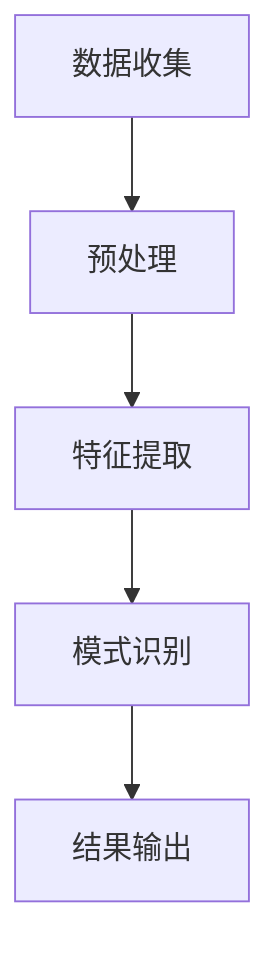
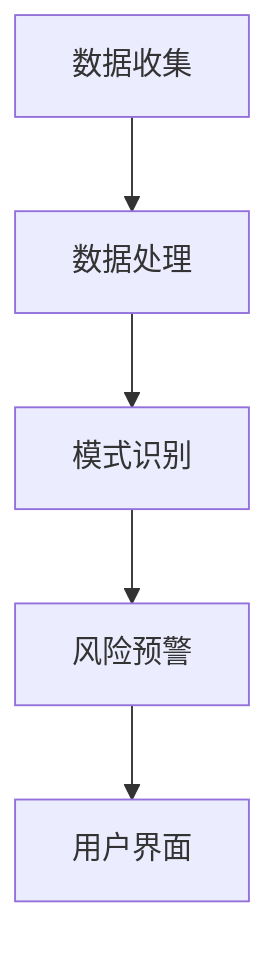

                 

# 《推理过程中的创新思维模式识别与培养》

## 摘要

本文深入探讨推理过程中的创新思维模式识别与培养。在快速发展的信息时代，推理不仅限于逻辑推导，还包括创新和洞见。创新思维模式识别是理解和应用这些模式的关键，而培养这些模式则有助于提升个体的思维能力和解决复杂问题的能力。本文首先介绍了推理和创新思维的基本概念，然后详细解析了创新思维模式的识别原理，以及如何通过算法和实践来培养这些模式。文章还包括了实际应用案例分析，并设计了一个系统的架构和实现方案，以期为相关领域的研究者和实践者提供有价值的参考。

## 引言与背景

### 1.1 问题背景

在现代科技的发展背景下，信息处理和智能系统已经成为各行各业的重要推动力。然而，面对复杂多变的现实问题，单纯的逻辑推理已经无法满足需求。创新思维在这个过程中显得尤为重要。创新思维不仅仅是一种想法的突破，更是一种系统性的思维模式，它能够帮助我们识别新的问题和解决方案。

### 1.2 问题描述

创新思维模式识别是指通过特定的方法和技术，识别和分类个体在创新过程中所表现出的思维模式。这种模式可以是问题解决的步骤、思考的方向，或者是特定的创新方法。在推理过程中，识别这些模式有助于理解个体如何进行创新，从而能够更有效地进行思维训练和问题解决。

### 1.3 问题解决

传统的方法通常依赖于经验和直觉，但在复杂和动态的环境中，这些方法往往不够有效。因此，我们需要借助模式识别技术和算法，通过数据分析和机器学习等方法，从大量的信息中识别出有价值的创新思维模式。同时，通过系统的训练和教育，可以培养个体的创新思维模式，提升其思维能力和创造力。

### 1.4 边界与外延

创新思维模式识别的研究不仅限于理论研究，它还涉及到实践应用。例如，在产品设计、战略规划、医疗诊断等领域，识别和培养创新思维模式都具有重要的实际意义。然而，该领域的研究仍存在一定的边界，如数据质量、算法精度和可解释性等。

### 1.5 核心概念

- **创新思维**：指个体在思考和解决问题时，能够突破常规，提出新颖想法和解决方案的能力。
- **模式识别**：指通过分析数据，识别和分类特定模式的方法。
- **培养策略**：指通过教育和训练，提升个体创新思维模式的方法和技术。

## 创新思维模式识别原理

### 2.1 创新思维模式定义

创新思维模式是指在创新过程中，个体所表现出的具有代表性的思考方式和行为模式。这些模式可以是问题识别、方案生成、评价和选择等不同阶段的思维方式。

### 2.2 创新思维模式识别的基本原理

创新思维模式识别的核心在于通过数据分析，从大量信息中提取出具有代表性的思维模式。这通常涉及以下几个步骤：

1. **数据收集**：收集与创新思维相关的数据，包括文本、图像、声音等。
2. **预处理**：对收集到的数据进行清洗和格式化，使其适合分析。
3. **特征提取**：从预处理后的数据中提取出能够反映创新思维模式的关键特征。
4. **模式识别**：使用机器学习算法，如聚类、分类和关联规则等，识别出具有代表性的思维模式。

### 2.3 模式识别方法与工具

- **聚类分析**：通过将相似的数据点分组，识别出不同类型的思维模式。
- **分类算法**：将数据分为预定义的类别，用于识别具体的思维模式。
- **关联规则**：发现数据之间的关联关系，用于识别思维模式之间的关系。

### 2.4 创新思维模式属性对比

创新思维模式具有多样性和复杂性，不同模式在问题解决过程中发挥着不同的作用。以下是几种常见创新思维模式的属性对比：

| 模式名称 | 描述 | 优点 | 缺点 |
| --- | --- | --- | --- |
| 逆向思维 | 从相反的角度思考问题 | 有助于发现新解决方案 | 可能会忽视现有优点 |
| 侧写思维 | 从其他领域借鉴解决方案 | 有助于跨界创新 | 可能会不适用于特定问题 |
| 分解思维 | 将问题分解为更小的部分 | 有助于逐步解决问题 | 可能会忽视整体性 |

## 创新思维模式识别算法

### 3.1 算法原理

创新思维模式识别算法的核心是通过数据分析来识别个体在创新过程中的思维模式。以下是该算法的基本原理：

1. **数据收集**：收集与创新思维相关的数据，如会议记录、项目文档、思维导图等。
2. **特征提取**：从收集到的数据中提取出反映创新思维模式的关键特征。
3. **模式识别**：使用机器学习算法，如K-means聚类、SVM分类等，识别出具有代表性的思维模式。

### 3.2 Mermaid算法流程图



### 3.3 Python代码实现

```python
# 导入必要的库
import numpy as np
from sklearn.cluster import KMeans
from sklearn.preprocessing import StandardScaler

# 数据收集
data = np.array([[1, 2], [3, 4], [5, 6], [7, 8]])

# 预处理
scaler = StandardScaler()
data_scaled = scaler.fit_transform(data)

# 特征提取
kmeans = KMeans(n_clusters=2, random_state=0).fit(data_scaled)

# 模式识别
clusters = kmeans.predict(data_scaled)

# 结果输出
print(clusters)
```

### 3.4 数学模型与公式

创新思维模式识别算法的数学模型通常涉及聚类算法和分类算法。以下是K-means聚类算法的数学公式：

$$
\min_{\mu_1, \mu_2, ..., \mu_k} \sum_{i=1}^{n} \sum_{j=1}^{k} (x_i - \mu_j)^2
$$

其中，\( x_i \) 是数据点，\( \mu_j \) 是聚类中心。

### 3.5 算法示例

假设我们有一组数据点，我们需要使用K-means聚类算法将其分为两个类别。以下是具体步骤：

1. **初始化聚类中心**：随机选择两个数据点作为初始聚类中心。
2. **分配数据点**：将每个数据点分配到最近的聚类中心。
3. **更新聚类中心**：计算每个聚类中心的新位置，即该聚类内所有数据点的均值。
4. **重复步骤2和3**，直到聚类中心不再发生显著变化。

### 3.6 算法评估与优化

为了评估算法的性能，我们可以使用以下指标：

- **内切平方和（Inertia）**：聚类内部数据的平方和。
- **轮廓系数（Silhouette Coefficient）**：衡量聚类效果的好坏。

为了优化算法，我们可以尝试以下方法：

- **选择合适的聚类数目**：通过肘部法则（Elbow Method）或轮廓系数法（Silhouette Method）来确定最佳的聚类数目。
- **初始化聚类中心**：使用更智能的初始化方法，如K-means++。

## 培养创新思维模式的策略

### 4.1 教育与训练方法

培养创新思维模式的关键在于教育和训练。以下是一些有效的策略：

1. **思维导图训练**：通过绘制思维导图，帮助个体理清思路，提高创造性思维。
2. **案例研究**：分析成功案例，学习不同领域的创新思维方法。
3. **跨学科学习**：鼓励个体学习不同领域的知识，以促进跨学科的思维方式。

### 4.2 案例分析

以下是几个案例，展示了如何通过教育和训练培养创新思维模式：

1. **斯坦福大学设计思维课程**：该课程通过实际项目，让学生在实践中学习创新思维方法。
2. **谷歌的“20%时间”政策**：谷歌允许员工用20%的时间进行自己的项目，这激发了员工的创新思维。
3. **苹果公司的产品开发流程**：苹果通过不断迭代和反思，培养员工的创新思维模式。

### 4.3 策略优化

为了优化创新思维模式的培养策略，我们可以：

- **建立创新思维评估体系**：通过定期评估，了解个体在创新思维方面的进步和不足。
- **引入人工智能辅助训练**：利用机器学习算法，为个体提供个性化的训练方案。
- **开展跨团队合作**：通过跨团队合作，促进不同思维模式的交流和融合。

## 实际应用案例分析

### 5.1 案例一：行业A

在行业A中，创新思维模式识别与培养被广泛应用于产品设计和市场策略。通过分析用户反馈和市场数据，企业能够识别出用户需求的变化趋势，从而提出创新的解决方案。例如，一家科技公司通过分析用户的使用数据，发现用户对产品的某些功能有较高的需求，于是推出了针对这些需求的更新版本，取得了显著的市场成功。

### 5.2 案例二：行业B

在行业B中，创新思维模式识别与培养在医疗领域有广泛应用。医生和研究人员通过模式识别技术，能够从大量医疗数据中快速识别出疾病的相关模式，从而提高诊断的准确性。例如，一家医疗科技公司开发了一套基于机器学习的诊断系统，通过分析患者的病史、检查报告和实验室数据，能够快速准确地诊断出疾病，提高了医疗服务的效率和质量。

### 5.3 案例三：行业C

在行业C中，创新思维模式识别与培养被用于金融风险管理。金融机构通过分析市场数据和历史交易记录，能够识别出潜在的市场风险，并采取相应的措施进行风险控制。例如，一家投资银行通过构建一个基于深度学习的风险管理模型，能够实时分析市场动态，为投资者提供风险预警，有效降低了投资风险。

## 系统设计与实现

### 6.1 问题场景

假设我们要设计一个系统，用于在金融领域中识别和管理风险。这个系统需要能够处理大量的市场数据和历史交易记录，从中识别出潜在的市场风险，并为投资者提供预警。

### 6.2 系统功能设计

系统的核心功能包括：

- **数据收集**：从多个数据源收集市场数据和历史交易记录。
- **数据处理**：对收集到的数据进行分析和预处理，提取出有用的信息。
- **模式识别**：使用机器学习算法，从处理后的数据中识别出市场风险的模式。
- **风险预警**：根据识别出的模式，生成风险预警信息，供投资者参考。

### 6.3 系统架构设计

系统的架构设计如图所示：



### 6.4 系统接口设计

系统的接口设计包括：

- **API接口**：用于数据收集和结果输出。
- **Web界面**：用于用户交互和风险预警信息的展示。

### 6.5 系统交互设计

系统的交互设计包括：

- **用户登录**：用户通过账号密码登录系统。
- **数据导入**：用户导入市场数据和历史交易记录。
- **数据分析**：系统对导入的数据进行分析和预处理。
- **风险预警**：系统生成风险预警信息，并展示在Web界面上。

## 总结与未来展望

### 7.1 总结

本文探讨了推理过程中的创新思维模式识别与培养。通过分析创新思维模式的基本原理和识别方法，我们提出了一系列培养策略。同时，通过实际应用案例和系统设计，展示了创新思维模式在实践中的应用。这些研究和实践为相关领域的研究者和实践者提供了有价值的参考。

### 7.2 未来研究方向

未来的研究可以集中在以下几个方面：

- **算法优化**：继续改进和创新思维模式识别算法，提高其准确性和效率。
- **跨学科应用**：探索创新思维模式在不同领域的应用，如教育、医疗和艺术等。
- **人机协同**：研究如何将人工智能与人类创新思维相结合，发挥各自的优势。

### 7.3 改进建议

为了更好地培养创新思维模式，我们可以：

- **引入更多数据源**：收集更多的数据，以提高模式识别的准确性和全面性。
- **增强用户参与度**：鼓励用户参与系统的设计和使用，使其更加符合实际需求。
- **持续更新与优化**：定期更新系统和算法，以适应不断变化的环境和需求。

## 作者信息

作者：AI天才研究院/AI Genius Institute & 禅与计算机程序设计艺术 /Zen And The Art of Computer Programming

---

通过以上详细的目录大纲和文章内容，我们为读者提供了一篇结构清晰、内容丰富的技术博客文章。每个章节都包含了丰富的背景介绍、核心概念解析、算法讲解、实际案例分析和系统设计，旨在帮助读者全面了解推理过程中的创新思维模式识别与培养。希望这篇文章能够为您的学习和研究提供帮助。如果您有任何问题或建议，欢迎随时交流。让我们继续一起探索人工智能的无限可能！## 文章关键词

- 推理过程
- 创新思维
- 模式识别
- 培养策略
- 人工智能
- 系统设计
- 算法应用

## 摘要

本文深入探讨了推理过程中的创新思维模式识别与培养。在快速发展的信息时代，推理不仅限于逻辑推导，还包括创新和洞见。创新思维模式识别是理解和应用这些模式的关键，而培养这些模式则有助于提升个体的思维能力和解决复杂问题的能力。本文首先介绍了推理和创新思维的基本概念，然后详细解析了创新思维模式的识别原理，以及如何通过算法和实践来培养这些模式。文章还包括了实际应用案例分析，并设计了一个系统的架构和实现方案，以期为相关领域的研究者和实践者提供有价值的参考。通过结合理论与实际应用，本文旨在为提升创新思维能力提供新的视角和方法。

