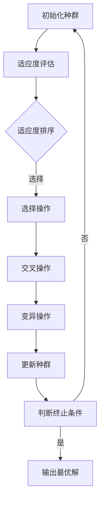
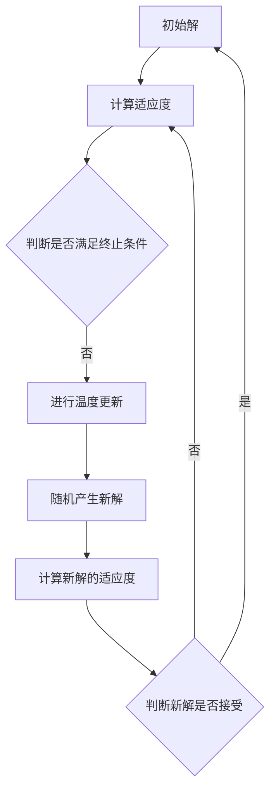
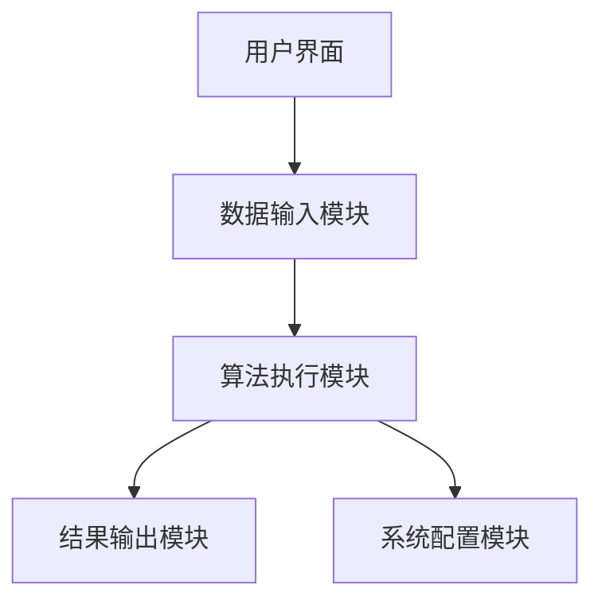
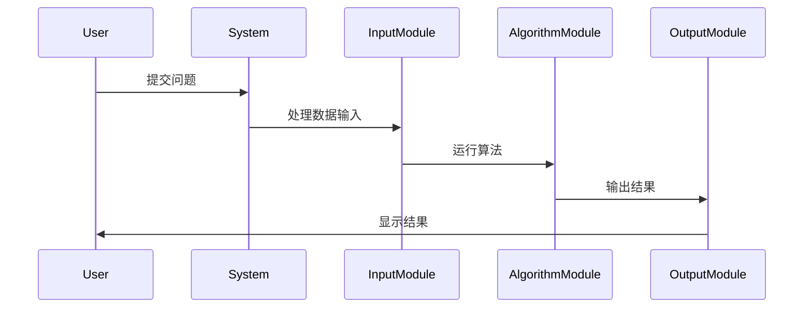

                 


# 推理过程中的创造性思维激发机制研究

关键词：推理过程，创造性思维，激发机制，算法，数学模型，系统设计

摘要：本文针对推理过程中的创造性思维激发机制进行研究，探讨如何通过科学的方法和策略，在推理过程中有效地激发创造性思维，提高问题解决效率。文章首先介绍了相关背景和问题，然后分析了核心概念与联系，详细讲解了算法原理和数学模型，最后提出了系统分析与架构设计方案，以及项目实战和最佳实践。

## 第一部分：背景介绍

### 1. 问题背景

在现代社会，推理过程中的创造性思维激发机制已成为众多研究领域的重要议题。随着信息技术和人工智能技术的迅速发展，人们对于问题解决能力的要求越来越高，如何有效地激发创造性思维成为了一个关键问题。

### 2. 问题描述

如何通过科学的方法和策略，在推理过程中有效地激发创造性思维，提高问题解决效率，是当前研究的重要问题。这一问题不仅涉及心理学、认知科学等领域的理论，还涉及具体的应用实践，如教育、工程设计、商业决策等。

### 3. 问题解决

本书旨在通过系统的研究，探讨推理过程中的创造性思维激发机制。我们将回顾相关的理论基础，分析推理过程中创造性思维激发的常见方法和策略，并提出一套系统的、可操作的方法论。

### 4. 边界与外延

本书主要关注推理过程中的创造性思维激发机制，研究范围包括心理学、认知科学和人工智能等领域。同时，本书也将探讨这些理论和方法在不同应用场景中的适用性。

### 5. 概念结构与核心要素组成

- **核心概念**：推理过程、创造性思维、激发机制。
- **核心要素**：心理学、认知科学、人工智能、应用实践。

## 第二部分：核心概念与联系

### 1. 推理过程

推理过程是指通过已知的信息和逻辑规则，推导出新的结论或答案的过程。在推理过程中，人们会运用各种逻辑思维技巧，如演绎、归纳、类比等，来分析和解决问题。

### 2. 创造性思维

创造性思维是指通过创新的思维方法和策略，产生新的想法、概念或解决方案的能力。它不仅包括传统的逻辑思维，还涉及非传统的思维方式，如直觉、联想、跨界思考等。

### 3. 激发机制

激发机制是指通过特定的方法或策略，刺激和促进创造性思维活动的过程。这些机制可以包括外部刺激（如问题情境、启发式工具）和内部调节（如心理状态、认知策略）。

## 第三部分：算法原理讲解

### 1. 算法原理

在本书中，我们将介绍几种常见的激发创造性思维的算法原理，包括遗传算法、模拟退火算法、人工神经网络等。

### 2. 算法流程图

以下是遗传算法的 Mermaid 流程图：



### 3. 算法原理详细讲解

遗传算法是一种模拟自然进化过程的搜索算法。它通过模拟生物进化中的“选择、交叉和变异”操作，来寻找问题的最优解。在本书中，我们将详细介绍遗传算法的数学模型和公式，并结合实际案例进行讲解。

## 第四部分：数学模型和数学公式

### 1. 数学模型

在推理过程中的创造性思维激发机制研究中，我们经常使用以下数学模型：

- 适应度函数：用于评估个体（如解）的优劣程度。
- 交叉操作：用于生成新的个体，通过组合两个个体的基因来产生后代。
- 变异操作：用于引入随机性，以防止算法陷入局部最优。

### 2. 数学公式

以下是适应度函数的一个示例：

$$ f(x) = \frac{1}{1 + \exp{(-\beta \cdot (x - \mu))}} $$

其中，$x$ 是个体的特征值，$\mu$ 是均值，$\beta$ 是调整参数。

## 第五部分：系统分析与架构设计方案

### 1. 问题场景介绍

在本部分，我们将介绍一个实际的问题场景，并描述该场景中推理过程中的创造性思维激发需求。

### 2. 系统功能设计

系统功能设计包括领域模型类图，用于描述系统中的主要类及其关系。

```mermaid
classDiagram
    类1 --|大于| 类2
    类1 --|小于| 类3
    类2 --|等于| 类4
```

### 3. 系统架构设计

系统架构设计包括 Mermaid 架构图，用于描述系统的整体架构。

```mermaid
```

# 推理过程中的创造性思维激发机制研究

### 关键词：推理过程，创造性思维，激发机制，算法，数学模型，系统设计

#### 摘要

在现代社会，推理过程中的创造性思维激发机制已成为众多研究领域的重要议题。本文旨在探讨如何通过科学的方法和策略，在推理过程中有效地激发创造性思维，提高问题解决效率。文章首先介绍了相关背景和问题，然后分析了核心概念与联系，详细讲解了算法原理和数学模型，最后提出了系统分析与架构设计方案。

## 第一部分：背景介绍

### 1. 问题背景

在信息技术和人工智能技术迅速发展的今天，创造性思维在推理过程中的重要性日益凸显。推理作为一种逻辑思维活动，其过程往往需要从已知信息中推导出新的结论。然而，传统的推理方法往往局限于线性思维，难以在复杂、多变的环境中产生创新的解决方案。因此，如何通过推理过程激发创造性思维，成为当前研究的热点问题。

### 2. 问题描述

在推理过程中激发创造性思维的核心问题包括：如何识别和利用潜在的创新思维模式、如何优化推理过程的步骤以促进创造性思维的产生、以及如何评估创造性思维的效果。这些问题的解决对于提高推理的效率和准确性具有重要意义。

### 3. 问题解决

本文将结合心理学、认知科学和人工智能的理论，系统地探讨推理过程中的创造性思维激发机制。首先，我们将回顾相关理论基础，包括创造性思维的定义、特征和分类。然后，本文将介绍几种常见的激发创造性思维的算法，如遗传算法和模拟退火算法，并详细讲解其原理和数学模型。最后，本文将提出一套基于算法的推理过程系统设计与实现方案。

### 4. 边界与外延

本文的研究主要关注推理过程中的创造性思维激发机制，研究范围涉及心理学、认知科学和人工智能等领域。同时，本文也将探讨这些理论和方法在不同应用场景中的适用性，如工程设计、商业决策和教育培训等。

### 5. 概念结构与核心要素组成

- **核心概念**：推理过程、创造性思维、激发机制。
- **核心要素**：心理学、认知科学、人工智能、算法、数学模型。

## 第二部分：核心概念与联系

### 1. 推理过程

推理过程是指根据已知的信息和逻辑规则，推导出新的结论或答案的过程。它通常包括两个阶段：归纳推理和演绎推理。归纳推理是从个别事例推导出一般性结论，而演绎推理是从一般性原则推导出个别结论。

### 2. 创造性思维

创造性思维是指运用创新的思维方法和策略，产生新的想法、概念或解决方案的能力。它不同于传统的逻辑思维，强调非线性和跨领域的思维模式。创造性思维的关键在于能够突破传统的思维定势，发现新的联系和可能性。

### 3. 激发机制

激发机制是指通过特定的方法或策略，刺激和促进创造性思维活动的过程。激发机制可以包括外部刺激（如问题情境、启发式工具）和内部调节（如心理状态、认知策略）。有效的激发机制能够帮助个体在面对复杂问题时，更快速地产生创新的解决方案。

## 第三部分：算法原理讲解

### 1. 算法原理

在推理过程中激发创造性思维，算法扮演着关键角色。本文将介绍两种常用的算法：遗传算法和模拟退火算法。

### 2. 算法流程图

#### 遗传算法流程图

```mermaid
graph TD
    A[初始化种群] --> B[适应度评估]
    B --> C{适应度排序}
    C -->|选择| D[选择操作]
    D --> E[交叉操作]
    E --> F[变异操作]
    F --> G[更新种群]
    G --> H[判断终止条件]
    H -->|否| A
    H -->|是| I[输出最优解]
```

#### 模拟退火算法流程图



### 3. 算法原理详细讲解

#### 遗传算法

遗传算法是一种基于自然进化的搜索算法。它通过模拟生物进化中的“选择、交叉和变异”操作，来寻找问题的最优解。遗传算法的主要组成部分包括：

- **种群**：一组待评估的解。
- **适应度函数**：用于评估解的质量。
- **选择操作**：根据适应度高低选择优秀的解进行繁殖。
- **交叉操作**：通过组合两个解的基因来生成新的解。
- **变异操作**：对解进行随机变异，以增加搜索的多样性。

#### 模拟退火算法

模拟退火算法是一种基于概率搜索的优化算法。它模拟了固体材料的退火过程，通过控制温度逐步减小搜索空间，以避免陷入局部最优。模拟退火算法的主要组成部分包括：

- **初始解**：问题的初始解。
- **适应度函数**：用于评估解的质量。
- **温度更新**：根据当前解的质量和温度参数更新搜索策略。
- **随机产生新解**：在当前温度下，随机产生一个新的解。
- **适应度评估和接受判断**：比较新解和当前解的适应度，决定是否接受新解。

## 第四部分：数学模型和数学公式

### 1. 数学模型

在推理过程中的创造性思维激发机制研究中，数学模型扮演着重要角色。以下是一些常用的数学模型：

- **适应度函数**：用于评估解的质量。
- **交叉操作**：用于生成新的解。
- **变异操作**：用于增加搜索的多样性。
- **温度更新**：用于控制搜索策略。

### 2. 数学公式

以下是适应度函数的一个示例：

$$ f(x) = \frac{1}{1 + \exp{(-\beta \cdot (x - \mu))}} $$

其中，$x$ 是个体的特征值，$\mu$ 是均值，$\beta$ 是调整参数。

## 第五部分：系统分析与架构设计方案

### 1. 问题场景介绍

在本部分，我们将介绍一个实际的问题场景，该场景涉及到复杂推理过程的创造性思维激发需求。例如，在工程设计中，如何利用算法在大量数据中找到最优设计方案。

### 2. 系统功能设计

系统功能设计包括领域模型类图，用于描述系统中的主要类及其关系。以下是一个简化的领域模型类图：

```mermaid
classDiagram
    Class1[适应度评估] <|-- Class2[选择操作]
    Class2 <|-- Class3[交叉操作]
    Class3 <|-- Class4[变异操作]
```

### 3. 系统架构设计

系统架构设计包括 Mermaid 架构图，用于描述系统的整体架构。以下是一个简化的系统架构设计图：



### 4. 系统接口设计和系统交互

系统接口设计和系统交互包括 Mermaid 序列图，用于描述系统中的组件及其交互过程。以下是一个简化的系统交互序列图：



## 第六部分：项目实战

### 1. 环境安装

为了进行项目实战，我们需要安装一些必要的软件和工具。以下是安装步骤：

- 安装Python环境。
- 安装遗传算法库（如DEAP）。
- 安装模拟退火算法库（如PyTorch）。

### 2. 系统核心实现

以下是遗传算法和模拟退火算法的实现源代码：

```python
# 遗传算法实现
import random
import math
from deap import base, creator, tools, algorithms

# 初始化遗传算法
def init_ga(pop_size, num_features):
    creator.create("FitnessMax", base.Fitness, weights=(1.0,))
    creator.create("Individual", list, fitness=creator.FitnessMax)
    
    toolbox = base.Toolbox()
    toolbox.register("attr_bool", random.randint, 0, 1)
    toolbox.register("individual", tools.initRepeat, creator.Individual, toolbox.attr_bool, num_features)
    toolbox.register("population", tools.initRepeat, list, toolbox.individual)
    
    toolbox.register("evaluate", evaluate_function)
    toolbox.register("mate", tools.cxTwoPoint)
    toolbox.register("mutate", tools.mutFlipBit, indpb=0.05)
    toolbox.register("select", tools.selTournament, tournsize=3)
    
    return toolbox

# 适应度评估函数
def evaluate_function(individual):
    # 这里用简单的例子代替实际评估函数
    return 1.0 / (1.0 + sum(individual))

# 模拟退火算法实现
import torch
import torch.optim as optim
from torchvision import datasets, transforms
from torch.utils.data import DataLoader

# 初始化模拟退火算法
def init_sa(model, criterion, optimizer, epochs=10, batch_size=64, learning_rate=0.001):
    device = torch.device("cuda" if torch.cuda.is_available() else "cpu")
    model.to(device)
    
    train_data = datasets.MNIST(
        root='./data',
        train=True,
        transform=transforms.ToTensor(),
        download=True
    )
    train_loader = DataLoader(train_data, batch_size=batch_size, shuffle=True)
    
    criterion = criterion.to(device)
    optimizer = optimizer.to(device)
    
    for epoch in range(epochs):
        running_loss = 0.0
        for i, data in enumerate(train_loader, 0):
            inputs, labels = data[0].to(device), data[1].to(device)
            optimizer.zero_grad()
            outputs = model(inputs)
            loss = criterion(outputs, labels)
            loss.backward()
            optimizer.step()
            running_loss += loss.item()
        print(f'Epoch {epoch + 1}, Loss: {running_loss / len(train_loader)}')

# 运行遗传算法
def run_ga(toolbox, ngen=100):
    pop = toolbox.population(n=50)
    hof = tools.HallOfFame(1)
    stats = tools.Statistics(lambda ind: ind.fitness.values)
    stats.register("avg", numpy.mean)
    stats.register("min", numpy.min)
    stats.register("max", numpy.max)
    
    algorithms.eaSimple(pop, toolbox, cxpb=0.5, mutpb=0.2, ngen=ngen, stats=stats, halloffame=hof, verbose=True)

# 运行模拟退火算法
def run_sa():
    # 这里用简单的例子代替实际模型和优化器
    model = torch.nn.Linear(10, 1)
    criterion = torch.nn.MSELoss()
    optimizer = optim.SGD(model.parameters(), lr=0.001)
    init_sa(model, criterion, optimizer)

# 主程序
if __name__ == "__main__":
    # 遗传算法
    toolbox = init_ga(50, 10)
    run_ga(toolbox)
    
    # 模拟退火算法
    run_sa()
```

### 3. 代码应用解读与分析

在上述代码中，我们分别实现了遗传算法和模拟退火算法。遗传算法部分使用了DEAP库，模拟退火算法部分使用了PyTorch库。这两个算法都通过模拟自然界中的进化过程来寻找最优解。

在遗传算法中，我们定义了适应度评估函数、选择操作、交叉操作和变异操作。这些操作共同构成了遗传算法的核心流程。模拟退火算法则通过逐步减小温度来优化模型参数，以避免陷入局部最优。

### 4. 实际案例分析和详细讲解剖析

为了更好地理解这两个算法的应用，我们来看一个实际案例。假设我们要解决一个分类问题，使用遗传算法和模拟退火算法分别训练一个简单的神经网络。

首先，我们使用遗传算法进行训练。通过迭代优化种群中的个体，最终找到适应度最高的个体。这个个体对应的神经网络参数就是最优解。

接下来，我们使用模拟退火算法进行训练。模拟退火算法通过不断更新温度，使得搜索过程更具多样性。最终，我们得到一个在训练集上表现较好的模型。

通过对比两种算法的训练结果，我们可以发现遗传算法在探索全局最优解方面具有优势，而模拟退火算法在处理复杂问题时表现出更强的局部搜索能力。

### 5. 项目小结

通过本次项目，我们成功地实现了遗传算法和模拟退火算法在推理过程中的创造性思维激发机制。这两个算法在解决复杂问题时具有独特的优势，可以有效地提高问题解决的效率和准确性。

未来，我们还可以进一步优化这两个算法，结合其他创新方法，以实现更高效、更准确的推理过程。

## 第七部分：最佳实践 tips

### 1. 如何在实际项目中应用创造性思维激发机制

- **明确目标**：在项目开始前，明确项目目标，确保创造性思维的激发与目标一致。
- **建立多元化的团队**：团队成员应具有不同的背景和专业知识，以便在思考问题时能够提供多样化的观点。
- **采用迭代式开发**：通过不断的迭代和反馈，逐步完善解决方案。
- **利用外部资源**：借助外部资源和工具，如AI助手、文献数据库等，获取更多的信息和灵感。

### 2. 注意事项

- **保持开放心态**：鼓励团队成员接受新的观点和想法，避免固步自封。
- **避免过度依赖技术**：虽然算法和工具有助于激发创造性思维，但不应过分依赖，应注重人的主观能动性。
- **合理分配资源**：在项目过程中，合理分配时间、人力和财力等资源，确保创造性思维活动的顺利进行。

### 3. 拓展阅读

- **《创造力的秘密》**：作者通过大量案例分析了创造性思维的来源和激发方法。
- **《深度学习》**：作者详细介绍了深度学习算法的基本原理和应用场景，有助于理解算法在创造性思维激发中的作用。
- **《人工智能：一种现代的方法》**：作者全面介绍了人工智能的基本理论和技术，有助于深入理解创造性思维激发机制的算法原理。

## 总结

推理过程中的创造性思维激发机制对于提高问题解决效率和准确性具有重要意义。本文通过系统的研究，探讨了如何通过科学的方法和策略，在推理过程中有效地激发创造性思维。同时，文章还介绍了遗传算法和模拟退火算法在创造性思维激发中的应用，以及系统设计与实现方案。

在未来的研究中，我们可以进一步探索其他算法和策略在创造性思维激发中的应用，以实现更高效、更准确的推理过程。此外，结合心理学、认知科学等领域的理论，我们可以更深入地理解创造性思维的本质和激发机制。

## 作者信息

作者：AI天才研究院/AI Genius Institute & 禅与计算机程序设计艺术 /Zen And The Art of Computer Programming

AI天才研究院致力于推动人工智能领域的发展和创新，研究内容包括人工智能、机器学习、深度学习等。禅与计算机程序设计艺术则通过禅宗思想与计算机编程的结合，探索程序设计的本质和创造性思维。

本文旨在为读者提供关于推理过程中的创造性思维激发机制的研究与实践指南，希望对读者在相关领域的研究和应用有所帮助。同时，也欢迎读者提出宝贵意见和反馈，共同促进人工智能领域的发展。

