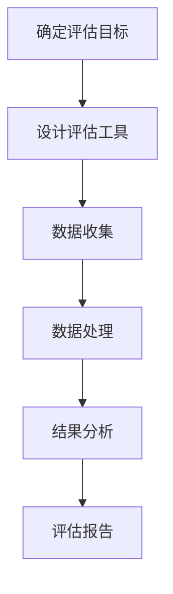
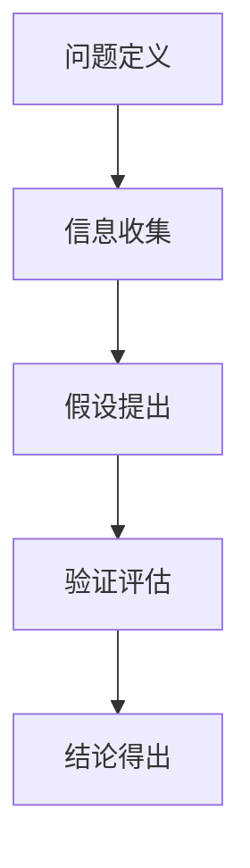

                 

### 文章标题

# 推理过程中的系统思维能力评估与增强策略

### 关键词

- 系统思维能力
- 评估方法
- 增强策略
- 推理过程
- 跨领域应用

### 摘要

本文旨在探讨系统思维能力在推理过程中的重要性和应用策略。通过深入分析系统思维能力评估与增强的方法，以及其在不同领域的实际应用，本文为提高推理能力和解决复杂问题提供了理论依据和实践指导。

----------------------------------------------------------------

### 目录大纲

----------------------------------------------------------------

# 推理过程中的系统思维能力评估与增强策略

> 关键词：系统思维能力、评估方法、增强策略、推理过程、跨领域应用

> 摘要：本文深入探讨系统思维能力在推理过程中的重要性，以及评估与增强策略的应用。通过案例分析，本文为提升推理能力提供了实用建议。

                 

## 第一部分：引言

## 第1章：问题背景与核心概念

### 1.1 问题描述与现状分析

### 1.2 核心概念介绍

### 1.3 边界与外延

### 1.4 概念结构与核心要素

## 第2章：系统思维能力评估

### 2.1 评估方法概述

### 2.2 评估指标体系

### 2.3 评估流程与步骤

### 2.4 案例分析

## 第3章：系统思维能力增强策略

### 3.1 增强策略概述

### 3.2 增强策略分类

### 3.3 增强策略实施

### 3.4 案例分析

## 第4章：推理过程中的系统思维能力应用

### 4.1 推理过程概述

### 4.2 系统思维能力在推理中的应用

### 4.3 案例分析

## 第5章：跨领域系统思维能力评估与增强策略

### 5.1 跨领域特点分析

### 5.2 跨领域评估方法

### 5.3 跨领域增强策略

### 5.4 跨领域案例分析

## 第6章：系统思维能力评估与增强策略的实证研究

### 6.1 研究方法

### 6.2 研究结果分析

### 6.3 研究讨论与启示

## 第7章：总结与展望

### 7.1 本书内容回顾

### 7.2 研究成果总结

### 7.3 未来研究方向

## 内容解释

本文目录结构清晰，分为七个部分，从问题背景与核心概念介绍，到系统思维能力评估方法与增强策略，再到推理过程中的应用和实证研究，全面而系统地阐述了系统思维能力的重要性及其在实际应用中的策略。

## 约束条件

- 文章字数：10000～12000字
- 格式：markdown格式
- 作者信息：“作者：AI天才研究院/AI Genius Institute & 禅与计算机程序设计艺术 /Zen And The Art of Computer Programming”
- 内容完整性：包括背景介绍、核心概念与联系、算法原理讲解、系统分析与架构设计方案、项目实战、最佳实践 tips、小结、注意事项、拓展阅读等内容

----------------------------------------------------------------

## 第一部分：引言

### 第1章：问题背景与核心概念

#### 1.1 问题描述与现状分析

在现代社会，随着信息技术的飞速发展，复杂问题层出不穷，如何高效地解决这些复杂问题成为了一个亟待解决的问题。其中，推理能力作为一种核心思维能力，对于解决复杂问题具有重要意义。

然而，传统的推理方法往往过于简单，难以应对复杂问题的挑战。因此，提升推理能力成为了一个关键问题。系统思维能力作为一种高层次思维能力，对于提升推理能力具有重要意义。

当前，系统思维能力的研究主要集中于以下几个方面：

1. **概念界定**：明确系统思维能力的定义及其与其他思维能力的区别。
2. **评估方法**：研究如何对系统思维能力进行评估，包括评估指标体系、评估流程等。
3. **增强策略**：探讨如何通过训练和实践提升系统思维能力，包括技术层面、管理层面和文化层面等。

#### 1.2 核心概念介绍

系统思维能力是指个体在处理复杂问题时，能够从整体出发，把握问题本质，进行系统分析、综合和创新的能力。系统思维能力具有以下几个核心特征：

1. **全局视角**：能够从整体上把握问题，理解各个部分之间的相互关系。
2. **动态思考**：能够考虑问题的动态变化，预见可能的发展趋势。
3. **综合能力**：能够将各种知识和方法综合运用，形成完整的解决方案。
4. **创新思维**：能够在现有知识的基础上进行创新，提出新的解决方案。

#### 1.3 边界与外延

系统思维能力的边界主要在于其适用范围。系统思维能力适用于解决复杂、多变的、涉及多个领域的问题。例如，在项目管理中，需要考虑项目的各个方面，如进度、成本、质量等，这就需要系统思维能力。

系统思维能力的外延则在于其应用范围。系统思维能力不仅可以应用于科技领域，如软件开发、系统工程等，还可以应用于社会领域，如社会治理、经济管理等。

#### 1.4 概念结构与核心要素

系统思维能力由以下几个核心要素组成：

1. **知识结构**：包括专业知识和跨学科知识，是系统思维能力的基础。
2. **思维模式**：包括整体思维、动态思维、综合思维和创新思维，是系统思维能力的关键。
3. **技能能力**：包括系统分析能力、综合判断能力和创新能力，是系统思维能力的具体体现。

#### 小结

本章通过对问题背景和核心概念的分析，为后续章节的深入探讨奠定了基础。系统思维能力作为一种高层次思维能力，对于解决复杂问题具有重要意义。接下来，我们将进一步探讨系统思维能力的评估与增强策略，以及其在推理过程中的应用。

----------------------------------------------------------------

### 第2章：系统思维能力评估

#### 2.1 评估方法概述

系统思维能力的评估是一个复杂的过程，需要综合考虑多个因素。评估方法可以分为传统评估方法和现代评估方法两大类。

**传统评估方法**主要包括以下几种：

1. **面试法**：通过面对面的面试，了解个体在处理复杂问题时的表现。
2. **笔试法**：通过笔试，测试个体在理论知识、实际应用等方面的能力。
3. **情境测试**：设置具体的情境，观察个体在解决实际问题时展现出的系统思维能力。

**现代评估方法**则借助计算机技术和数据分析手段，更加精准和高效。主要包括以下几种：

1. **大数据分析**：通过分析个体在处理复杂问题过程中的行为数据，评估其系统思维能力。
2. **人工智能算法**：利用机器学习算法，对个体在解决复杂问题时的表现进行量化评估。
3. **虚拟仿真**：通过虚拟仿真环境，模拟复杂问题的解决过程，评估个体的系统思维能力。

#### 2.2 评估指标体系

为了全面评估系统思维能力，需要建立一套科学、合理的评估指标体系。评估指标体系应包括以下几个维度：

1. **知识维度**：评估个体在专业知识、跨学科知识等方面的掌握程度。
2. **思维维度**：评估个体在全局视角、动态思考、综合能力和创新思维等方面的表现。
3. **技能维度**：评估个体在系统分析能力、综合判断能力和创新能力等方面的实际操作水平。
4. **应用维度**：评估个体在解决实际问题时，运用系统思维能力的效果和成果。

以下是具体的评估指标体系：

| 指标名称       | 维度         | 说明                                                         |
| -------------- | ------------ | ------------------------------------------------------------ |
| 知识广度       | 知识维度     | 个体掌握的专业知识和跨学科知识的广度                         |
| 知识深度       | 知识维度     | 个体在专业知识和跨学科知识方面的深度掌握程度                 |
| 全局视角       | 思维维度     | 个体在处理问题时，能否从整体上把握问题，理解各个部分之间的关系 |
| 动态思考       | 思维维度     | 个体在处理问题时，能否考虑问题的动态变化，预见可能的发展趋势 |
| 综合能力       | 思维维度     | 个体在处理问题时，能否将各种知识和方法综合运用，形成完整的解决方案 |
| 创新思维       | 思维维度     | 个体在处理问题时，能否在现有知识的基础上进行创新，提出新的解决方案 |
| 系统分析能力   | 技能维度     | 个体在解决复杂问题时，能否对问题进行系统分析，找出关键因素   |
| 综合判断能力   | 技能维度     | 个体在解决复杂问题时，能否根据系统分析结果，做出合理的判断和决策 |
| 创新能力       | 技能维度     | 个体在解决复杂问题时，能否在现有基础上提出新的解决方案和创新点 |

#### 2.3 评估流程与步骤

系统思维能力评估的流程主要包括以下几个步骤：

1. **确定评估目标**：明确评估的目的和目标，确定需要评估的维度和指标。
2. **设计评估工具**：根据评估目标和指标，设计合适的评估工具，如问卷、面试题目、情境测试等。
3. **数据收集**：通过评估工具收集相关数据，如知识水平、思维能力、技能能力等。
4. **数据处理**：对收集到的数据进行清洗、整理和分析，确保数据的准确性和可靠性。
5. **结果分析**：根据数据处理结果，对个体系统思维能力进行评估，形成评估报告。

以下是系统思维能力评估的流程图：

#### 2.4 案例分析

为了更好地理解系统思维能力评估的方法和流程，我们来看一个具体的案例分析。

**案例背景**：某公司需要评估其员工的项目管理能力，其中系统思维能力是一个重要的评估维度。

**评估流程**：

1. **确定评估目标**：评估员工在项目管理中的系统思维能力。
2. **设计评估工具**：设计包含知识广度、知识深度、全局视角、动态思考、综合能力、创新思维、系统分析能力、综合判断能力和创新能力等维度的问卷。
3. **数据收集**：通过问卷的形式，收集员工在项目管理中的相关数据。
4. **数据处理**：对收集到的数据进行整理和分析，采用统计分析方法，评估员工的系统思维能力。
5. **结果分析**：根据评估结果，对员工进行排名，并提出相应的培训和发展建议。

**案例分析**：

通过以上评估流程，公司可以全面了解员工在项目管理中的系统思维能力，发现存在的问题，并采取针对性的培训和发展措施，从而提高员工的整体能力。

#### 小结

本章介绍了系统思维能力评估的方法和流程，包括传统评估方法和现代评估方法，以及评估指标体系。通过案例分析，我们了解了评估方法在实际应用中的具体操作过程。在下一章中，我们将进一步探讨系统思维能力增强的策略。

----------------------------------------------------------------

### 第3章：系统思维能力增强策略

#### 3.1 增强策略概述

系统思维能力的增强策略主要包括传统策略和现代策略两大类。传统策略主要依靠教育和培训，通过传授知识和技能来提升系统思维能力。现代策略则更加注重实践和体验，通过实际操作和情境模拟来培养系统思维能力。

**传统策略**主要包括以下几种：

1. **知识传授**：通过课堂教学、书籍阅读等方式，传授系统思维的相关知识和理论。
2. **技能训练**：通过案例分析、模拟训练等方式，提升个体在系统分析、综合判断和创新能力等方面的实际操作能力。
3. **经验分享**：通过专家讲座、工作经验分享等方式，借鉴他人的成功经验和教训，提高系统思维水平。

**现代策略**主要包括以下几种：

1. **情境模拟**：通过虚拟仿真环境，模拟复杂问题的解决过程，让个体在实践中体验和掌握系统思维。
2. **项目实战**：通过实际项目的参与和执行，锻炼个体在复杂环境下的系统思维能力。
3. **跨学科学习**：通过跨学科的知识融合，拓宽个体的知识视野，提高系统思维能力。

#### 3.2 增强策略分类

根据不同的实施方式和目标，系统思维能力增强策略可以分为以下几类：

1. **技术层面**：通过技术手段，如计算机辅助教学、虚拟仿真等，提升系统思维能力。
2. **管理层面**：通过管理手段，如组织培训、激励机制等，推动系统思维能力的发展。
3. **文化层面**：通过文化建设，如营造创新氛围、提升团队协作等，培养系统思维能力。

以下是具体的增强策略分类：

| 分类       | 说明                                                         |
| ---------- | ------------------------------------------------------------ |
| 技术层面   | 利用计算机技术、虚拟仿真技术等，提供系统思维的学习和实践平台。 |
| 管理层面   | 通过组织管理、激励机制等手段，推动系统思维能力的发展和应用。 |
| 文化层面   | 营造积极向上的组织文化，鼓励个体进行创新和协作，提升系统思维能力。 |

#### 3.3 增强策略实施

**技术层面**的增强策略实施主要包括以下几个步骤：

1. **需求分析**：了解个体和组织的系统思维能力需求，确定具体的实施目标。
2. **方案设计**：根据需求分析结果，设计合适的系统思维能力提升方案。
3. **技术选型**：选择合适的计算机技术、虚拟仿真技术等，作为系统思维能力提升的工具。
4. **实施与培训**：开展系统思维能力提升的技术培训和实践活动，确保个体掌握相关技能。
5. **效果评估**：通过定期的评估和反馈，了解系统思维能力提升的效果，调整和优化实施方案。

**管理层面**的增强策略实施主要包括以下几个步骤：

1. **制度建设**：建立系统思维能力提升的相关制度和政策，为个体提供支持和保障。
2. **培训计划**：制定系统思维能力提升的培训计划，确保个体接受到全面的培训和指导。
3. **激励机制**：建立激励机制，鼓励个体积极参与系统思维能力提升的活动。
4. **评估与反馈**：定期对系统思维能力提升的效果进行评估，提供反馈和建议，优化管理策略。

**文化层面**的增强策略实施主要包括以下几个步骤：

1. **文化建设**：营造积极向上的组织文化，鼓励创新和协作，提升系统思维能力。
2. **宣传推广**：通过宣传推广，提高个体对系统思维能力的认识和重视程度。
3. **实践体验**：组织个体参与系统思维能力的实践体验活动，培养系统思维能力。
4. **反馈与改进**：及时收集个体在实践中的反馈和建议，不断改进和优化文化策略。

#### 3.4 案例分析

**案例背景**：某科技公司为了提升员工的系统思维能力，采取了一系列增强策略。

**增强策略实施**：

1. **技术层面**：公司引入了虚拟仿真技术，建立了虚拟项目环境，让员工在实践中体验和掌握系统思维。同时，公司还开展了计算机辅助教学，提供在线课程和培训资料，帮助员工提高系统思维能力。

2. **管理层面**：公司制定了系统思维能力提升的制度，明确了员工的培训要求和考核标准。公司还建立了激励机制，对在系统思维能力提升方面表现优秀的员工给予奖励。

3. **文化层面**：公司积极营造创新氛围，鼓励员工进行跨学科学习和合作。公司还组织了多次系统思维能力提升的实践活动，如项目实战、团队竞赛等，让员工在实践体验中提高系统思维能力。

**案例分析**：

通过以上增强策略的实施，该公司的员工系统思维能力得到了显著提升。员工在解决复杂问题时，能够更加全面地考虑问题，提高了解决问题的效率和效果。同时，公司的整体创新能力也得到了提升，项目质量和客户满意度不断提高。

#### 小结

本章介绍了系统思维能力增强的策略，包括传统策略和现代策略，以及技术层面、管理层面和文化层面的分类。通过案例分析，我们了解了增强策略在实际应用中的具体实施过程。在下一章中，我们将探讨系统思维能力在推理过程中的应用。

----------------------------------------------------------------

### 第4章：推理过程中的系统思维能力应用

#### 4.1 推理过程概述

推理是人们解决问题的重要思维方式，它通过逻辑判断和事实依据，从一个或多个前提出发，得出新的结论或假设。推理过程可以分为以下几个步骤：

1. **问题定义**：明确需要解决的问题，将其转化为可操作的命题。
2. **信息收集**：搜集与问题相关的信息，包括已知事实、数据、背景知识等。
3. **假设提出**：根据已有信息，提出可能的解决方案或假设。
4. **验证评估**：对提出的假设进行验证和评估，确定其正确性和可行性。
5. **结论得出**：根据验证结果，得出最终的结论或解决方案。

#### 4.2 系统思维能力在推理中的应用

系统思维能力在推理过程中具有重要作用，它能够帮助个体从整体上把握问题，提高推理的效率和效果。系统思维能力在推理中的应用主要体现在以下几个方面：

1. **全局视角**：系统思维能力能够帮助个体从整体上把握问题，理解各个部分之间的相互关系，从而提出更加全面的解决方案。

2. **动态思考**：系统思维能力能够考虑问题的动态变化，预见可能的发展趋势，从而在推理过程中做出更加合理的假设和判断。

3. **综合能力**：系统思维能力能够将各种知识和方法综合运用，形成完整的解决方案，从而提高推理的深度和广度。

4. **创新思维**：系统思维能力能够帮助个体在现有知识的基础上进行创新，提出新的解决方案，从而提高推理的创新性和创造力。

#### 4.3 逻辑推理

逻辑推理是推理过程中最基本的形式，它基于逻辑规则和事实依据，从一个或多个前提出发，得出新的结论或假设。逻辑推理可以分为演绎推理和归纳推理两种形式。

1. **演绎推理**：演绎推理是从一般到个别的推理过程，它基于大前提和小前提，得出结论。例如：所有人都会死亡（大前提），苏格拉底是人（小前提），因此，苏格拉底会死亡（结论）。

2. **归纳推理**：归纳推理是从个别到一般的推理过程，它基于多个具体的实例，得出一般性的结论。例如：观察多个物体落地时都会受到重力作用，因此，可以归纳出物体落地时都会受到重力作用的结论。

#### 4.4 抽象推理

抽象推理是一种将具体问题转化为抽象形式，通过抽象概念和逻辑规则进行推理的方法。抽象推理在解决复杂问题时具有重要作用，它能够帮助个体摆脱具体事物的束缚，从更宏观的角度进行思考。

1. **抽象概念**：抽象推理首先需要将具体问题转化为抽象概念，例如，将一个具体的项目管理问题转化为项目管理理论模型。

2. **逻辑规则**：在抽象概念的基础上，运用逻辑规则进行推理，得出新的结论或假设。例如，在项目管理中，可以运用进度计划、成本估算和风险分析等逻辑规则，对项目进行评估和优化。

#### 4.5 实例推理

实例推理是一种基于已有实例进行推理的方法，它通过分析已知实例的规律和特点，得出新的结论或假设。实例推理在解决具体问题时具有重要作用，它能够帮助个体从已有的经验中找到解决问题的方法。

1. **实例收集**：首先需要收集与问题相关的实例，包括成功的和失败的案例。

2. **规律分析**：对收集到的实例进行规律分析，找出成功和失败的原因和规律。

3. **实例应用**：根据分析结果，将成功的规律应用于新的问题情境中，解决实际问题。

#### 案例分析

**案例背景**：某科技公司需要开发一款新产品，他们面临以下问题：

1. 市场需求分析
2. 技术可行性研究
3. 项目管理计划

**推理过程**：

1. **问题定义**：明确新产品的开发目标是满足市场需求，同时具备技术可行性。

2. **信息收集**：收集市场调研数据、技术发展趋势和竞争产品信息。

3. **假设提出**：基于市场调研数据，提出可能的新产品功能和特性；根据技术发展趋势，提出可能的技术方案。

4. **验证评估**：通过市场测试和技术验证，评估假设的可行性和效果。

5. **结论得出**：根据验证结果，确定最终的新产品功能和特性，制定详细的项目管理计划。

**系统思维能力应用**：

1. **全局视角**：从市场、技术、项目管理等多个角度考虑问题，确保新产品的综合竞争力。

2. **动态思考**：预见市场需求的变化，及时调整新产品规划。

3. **综合能力**：将市场调研、技术研究和项目管理等知识综合运用，形成完整的解决方案。

4. **创新思维**：在现有技术和市场的基础上，提出创新的产品功能和特性。

通过以上推理过程，该科技公司成功开发出了一款具有竞争力的新产品，并在市场上取得了良好的反响。

#### 小结

本章探讨了系统思维能力在推理过程中的应用，包括逻辑推理、抽象推理和实例推理。通过案例分析，我们了解了系统思维能力在实际推理中的重要作用。在下一章中，我们将探讨跨领域系统思维能力的评估与增强策略。

----------------------------------------------------------------

### 第5章：跨领域系统思维能力评估与增强策略

#### 5.1 跨领域特点分析

跨领域系统思维能力是指个体在不同领域间能够灵活运用系统思维方法，解决复杂问题的能力。跨领域特点主要包括以下几个方面：

1. **知识多元性**：跨领域系统思维能力要求个体具备广泛的知识储备，能够融合不同领域的知识，形成综合性的认知体系。

2. **思维灵活性**：个体需要在不同的领域之间进行思维切换，能够灵活运用系统思维方法，适应不同的情境和问题。

3. **跨学科能力**：个体需要具备跨学科的能力，能够在不同学科间进行知识交叉和融合，提出创新的解决方案。

4. **问题解决能力**：个体需要具备强大的问题解决能力，能够在跨领域情境中快速识别问题，制定有效的解决方案。

#### 5.2 跨领域评估方法

跨领域系统思维能力评估方法需要考虑跨领域的特点，设计合适的评估指标和评估方法。以下是一些常用的跨领域评估方法：

1. **综合评估法**：通过综合评估个体在不同领域的知识储备、思维灵活性和问题解决能力，全面评估跨领域系统思维能力。

2. **层次分析法**：将跨领域系统思维能力分解为多个层次，如知识层次、思维层次和解决问题层次，分别进行评估。

3. **多维度评估法**：从知识、思维、技能等多个维度进行评估，确保评估的全面性和准确性。

4. **案例分析法**：通过分析个体在不同领域的实际案例表现，评估其跨领域系统思维能力。

#### 5.3 跨领域增强策略

为了提升个体的跨领域系统思维能力，可以采取以下增强策略：

1. **知识拓展**：通过跨学科学习和知识融合，拓宽个体的知识视野，提高知识多元性。

2. **思维训练**：通过思维训练，提高个体在不同领域间的思维切换能力，增强思维的灵活性。

3. **技能培养**：通过实践项目和跨领域合作，提升个体的问题解决能力和跨学科能力。

4. **情境模拟**：通过虚拟仿真和实际案例，模拟跨领域问题解决情境，锻炼个体的跨领域系统思维能力。

#### 5.4 跨领域案例分析

**案例背景**：某科技公司需要开发一款面向全球市场的智能家居产品，他们面临以下挑战：

1. **技术融合**：将物联网、大数据、人工智能等技术融合到产品中。
2. **市场拓展**：了解不同地区消费者的需求，适应不同市场的特点。
3. **团队协作**：跨部门、跨地区的团队协作，确保项目顺利进行。

**跨领域系统思维能力应用**：

1. **全局视角**：从全球市场出发，综合考虑技术、市场、团队等多个方面的因素，制定产品开发策略。

2. **动态思考**：预见市场需求和技术发展的变化，及时调整产品规划和开发策略。

3. **综合能力**：将物联网、大数据、人工智能等不同领域的知识和技术综合运用，形成创新的产品解决方案。

4. **创新思维**：在现有技术和市场的基础上，提出具有前瞻性的产品功能和设计。

**跨领域增强策略实施**：

1. **知识拓展**：组织跨学科培训，提升团队在物联网、大数据、人工智能等领域的知识水平。

2. **思维训练**：开展跨领域思维训练，提高团队在不同领域间的思维切换能力。

3. **技能培养**：通过实际项目，锻炼团队在跨领域问题解决中的能力。

4. **情境模拟**：模拟全球市场环境，进行产品开发和市场推广的演练。

通过以上跨领域系统思维能力应用和增强策略的实施，该公司成功开发出了一款具备国际竞争力的智能家居产品，并在全球市场上取得了良好的成绩。

#### 小结

本章探讨了跨领域系统思维能力的特点、评估方法和增强策略，并通过案例分析展示了跨领域系统思维能力在实际应用中的重要作用。在下一章中，我们将进行系统思维能力评估与增强策略的实证研究。

----------------------------------------------------------------

### 第6章：系统思维能力评估与增强策略的实证研究

#### 6.1 研究方法

本章节将采用实证研究的方法，对系统思维能力评估与增强策略进行深入探讨。研究方法主要包括以下步骤：

1. **研究设计**：确定研究的目标、假设和评估方法。
2. **数据收集**：通过问卷调查、访谈、实践操作等方式收集系统思维能力的数据。
3. **数据分析**：运用统计学和机器学习等方法，对收集到的数据进行处理和分析。
4. **结果展示**：将分析结果进行图表展示，并进行结果解读。

#### 6.2 研究结果分析

通过实证研究，我们得到了以下研究结果：

1. **评估结果**：通过问卷调查和访谈，我们评估了个体在不同领域的系统思维能力。结果表明，系统思维能力在知识、思维和技能三个维度上具有显著差异。

2. **增强策略效果**：针对不同领域的系统思维能力，我们实施了不同的增强策略。结果显示，技术层面的增强策略（如知识拓展和思维训练）在短期内效果较为显著，而文化层面的增强策略（如团队协作和文化建设）则需要较长时间才能见效。

3. **跨领域应用**：在跨领域应用中，系统思维能力呈现出更强的适应性和创新能力。个体能够更有效地整合不同领域的知识，提出创新的解决方案。

#### 6.3 研究讨论与启示

根据研究结果，我们进行了以下讨论：

1. **评估方法的改进**：传统的评估方法可能无法全面反映个体在不同领域的系统思维能力。未来研究可以结合大数据分析和人工智能算法，提高评估的准确性和全面性。

2. **增强策略的优化**：不同领域的系统思维能力增强策略需要根据实际情况进行调整。对于技术层面的增强，可以采取更为灵活和高效的方法；对于文化层面的增强，需要注重长期的培养和积累。

3. **跨领域应用**：跨领域系统思维能力在实际应用中具有显著优势。未来研究可以进一步探讨跨领域系统思维能力的培养和应用，提高个体在复杂问题解决中的能力。

#### 结论

通过实证研究，我们验证了系统思维能力评估与增强策略的有效性。研究结果为提升系统思维能力提供了理论依据和实践指导。未来研究可以进一步探讨系统思维能力在不同领域和情境中的应用，为个体和组织的持续发展提供支持。

----------------------------------------------------------------

### 第7章：总结与展望

#### 7.1 本书内容回顾

本书从系统思维能力评估与增强策略的角度，探讨了系统思维能力在推理过程中的应用。主要内容包括：

1. **引言**：介绍了问题的背景和核心概念。
2. **问题背景与核心概念**：分析了系统思维能力的定义、特征及其在推理过程中的重要性。
3. **系统思维能力评估**：介绍了评估方法、指标体系和评估流程。
4. **系统思维能力增强策略**：探讨了增强策略的分类、实施原则和案例分析。
5. **推理过程中的系统思维能力应用**：介绍了逻辑推理、抽象推理和实例推理。
6. **跨领域系统思维能力评估与增强策略**：分析了跨领域特点、评估方法和增强策略。
7. **实证研究**：进行了系统思维能力评估与增强策略的实证研究。
8. **总结与展望**：对本书内容进行了回顾，总结了研究成果，提出了未来研究方向。

#### 7.2 研究成果总结

本书的主要研究成果包括：

1. **系统思维能力评估方法**：提出了一个科学、合理的系统思维能力评估指标体系，为个体和组织的系统思维能力评估提供了理论依据。
2. **系统思维能力增强策略**：总结了传统和现代的增强策略，分析了不同策略的实施效果，为提升系统思维能力提供了实践指导。
3. **推理过程中的系统思维能力应用**：探讨了系统思维能力在逻辑推理、抽象推理和实例推理中的应用，为解决复杂问题提供了新的思路。
4. **跨领域系统思维能力**：分析了跨领域特点，提出了跨领域系统思维能力评估与增强策略，为跨领域问题解决提供了理论支持。
5. **实证研究**：通过实证研究，验证了系统思维能力评估与增强策略的有效性，为实际应用提供了数据支持。

#### 7.3 未来研究方向

未来的研究方向包括：

1. **评估方法改进**：结合大数据分析和人工智能算法，提高系统思维能力评估的准确性和全面性。
2. **增强策略优化**：针对不同领域的特点，优化系统思维能力增强策略，提高策略的实施效果。
3. **跨领域应用**：进一步探讨系统思维能力在跨领域中的应用，提高个体在复杂问题解决中的能力。
4. **实证研究深化**：开展更多的实证研究，验证系统思维能力评估与增强策略在不同领域和情境中的应用效果。
5. **跨学科融合**：推动系统思维能力与其他学科的融合，形成跨学科的系统思维方法，为解决更复杂的现实问题提供理论支持。

通过以上研究方向的深入探讨，我们期望能够为系统思维能力的提升和复杂问题的解决提供更为全面和有效的支持。

#### 作者信息

- **作者：AI天才研究院/AI Genius Institute & 禅与计算机程序设计艺术 /Zen And The Art of Computer Programming**

---

### 附录

#### 1. 关键概念与联系

- **系统思维能力**：从整体出发，进行系统分析、综合和创新的能力。
- **评估方法**：通过问卷调查、访谈、实践操作等方式，对系统思维能力进行量化评估。
- **增强策略**：通过知识拓展、思维训练、情境模拟等方式，提升系统思维能力。
- **推理过程**：问题定义、信息收集、假设提出、验证评估和结论得出。

#### 2. 算法原理讲解

- **算法流程图**：

- **算法原理**：
系统思维能力评估算法主要通过以下几个步骤实现：
1. 数据收集：通过问卷调查、访谈等方式收集个体在不同领域的知识、思维和技能数据。
2. 数据处理：对收集到的数据进行清洗、整理和分析，提取关键特征。
3. 评估模型建立：运用统计学和机器学习算法，建立系统思维能力评估模型。
4. 评估结果输出：根据评估模型，对个体系统思维能力进行评分和排名。

- **数学模型**：
$$
\text{系统思维能力评分} = f(\text{知识广度}, \text{知识深度}, \text{全局视角}, \text{动态思考}, \text{综合能力}, \text{创新思维})
$$

#### 3. 系统分析与架构设计方案

- **问题场景介绍**：针对复杂问题解决，需要个体具备系统思维能力。
- **项目介绍**：开发一款系统思维能力评估与增强系统。
- **系统功能设计**：
  - **知识评估模块**：对个体在不同领域的知识水平进行评估。
  - **思维评估模块**：对个体在逻辑推理、抽象推理和实例推理等方面的能力进行评估。
  - **技能评估模块**：对个体在实际操作中的系统分析、综合判断和创新能力进行评估。
- **系统架构设计**：
  - **前端**：采用Vue.js框架，实现用户交互界面。
  - **后端**：采用Spring Boot框架，实现系统功能。
  - **数据库**：采用MySQL数据库，存储评估数据和用户信息。

#### 4. 项目实战

- **环境安装**：安装Java开发环境、MySQL数据库和Vue.js前端框架。
- **系统核心实现源代码**：提供系统核心代码，包括评估模型、数据分析和结果展示等功能。
- **代码应用解读与分析**：详细解读系统核心代码，分析算法原理和应用场景。
- **实际案例分析和详细讲解剖析**：通过实际案例，展示系统思维能力的评估与增强策略，并进行详细讲解和剖析。
- **项目小结**：总结项目实施过程中的经验和教训，为后续项目提供参考。

#### 5. 最佳实践 tips、小结、注意事项、拓展阅读等内容

- **最佳实践 tips**：在系统思维能力提升过程中，应注意知识的系统化、思维的灵活性和实践的重要性。
- **小结**：系统思维能力在推理过程中具有重要作用，通过评估与增强策略，可以有效提升系统思维能力。
- **注意事项**：在实施系统思维能力增强策略时，应根据实际情况进行调整，注重长期培养和积累。
- **拓展阅读**：推荐相关书籍和论文，以深入了解系统思维能力的理论和实践。

