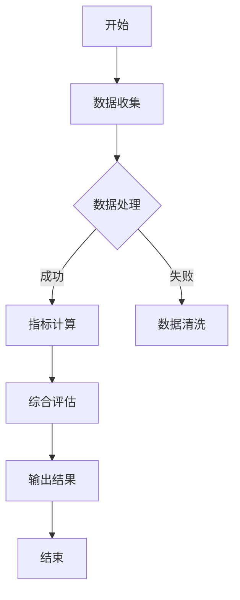
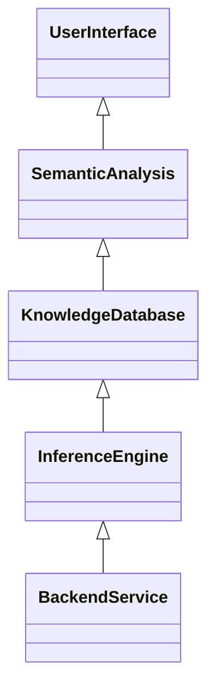
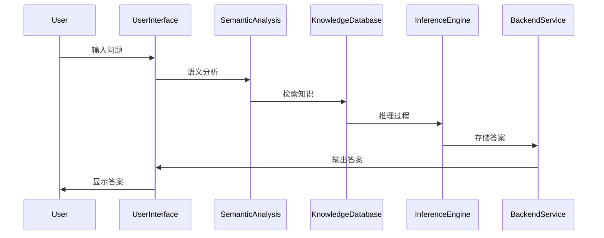

                 

## 推理过程中的系统思维能力量化评估方法

### 引言

在当今的信息化时代，人工智能（AI）的应用日益广泛，推理过程成为智能系统实现智能行为的核心环节。然而，现有研究往往关注于算法的性能，而忽视了系统思维能力的量化评估。本文旨在探讨一种量化评估方法，以帮助理解、优化和提升智能系统在推理过程中的系统思维能力。

#### 1.1 问题背景

推理过程是人工智能系统的重要组成部分，涵盖了从感知信息到决策生成的整个过程。系统思维能力，包括逻辑推理、知识运用、问题解决等多方面能力，是衡量智能系统智能水平的关键指标。然而，当前对系统思维能力的量化评估存在诸多不足，如缺乏统一的评价标准、评估方法过于复杂等。因此，研究一种有效的量化评估方法具有重要的理论和实践意义。

#### 1.2 问题描述

在推理过程中，系统思维能力量化评估的核心问题是如何准确、全面地评估系统在逻辑推理、知识运用、问题解决等方面的能力。当前评估方法主要基于性能指标，如准确率、召回率等，难以全面反映系统思维能力。此外，评估方法的复杂度较高，不便于实际应用。

#### 1.3 问题解决

本文提出了一种基于多维度测度的系统思维能力量化评估方法。首先，对推理过程中的关键环节进行梳理和建模，然后设计一套综合评价指标体系，最后通过实际应用案例进行验证和优化。该方法旨在为推理过程中的系统思维能力评估提供一种新的思路和方法。

#### 1.4 边界与外延

本文的研究范围主要关注推理过程中的系统思维能力量化评估，不包括其他类型的能力评估。同时，本文提出的评估方法适用于自然语言处理、智能决策、智能推荐等多个领域。

#### 1.5 概念结构与核心要素组成

系统思维能力量化评估方法由以下几个核心要素组成：

1. **推理过程建模**：对推理过程中的关键环节进行抽象和建模。
2. **评价指标体系**：设计一套综合评价指标体系，涵盖逻辑推理、知识运用、问题解决等多个维度。
3. **算法设计**：基于评价指标体系，设计相应的算法，实现对系统思维能力的量化评估。
4. **实际应用案例**：通过实际应用案例，验证和优化评估方法。

## 2.1 核心概念原理

### 2.1.1 推理过程

#### 2.1.1.1 定义

推理过程是指从已知信息出发，通过逻辑推理、分析、综合等思维活动，推导出新的结论或解决方案的过程。它是智能系统实现智能行为的核心环节。

#### 2.1.1.2 类型

推理过程可以分为演绎推理和归纳推理。演绎推理是从已知的前提出发，推导出新的结论，如数学中的定理证明。归纳推理是从具体的实例中归纳出一般规律或结论，如从多次实验中归纳出科学规律。

#### 2.1.1.3 特点

推理过程具有以下特点：

1. **逻辑性**：推理过程遵循逻辑规则，保证推理过程的正确性。
2. **系统性**：推理过程涉及多个环节，如信息收集、分析、综合等，具有系统性。
3. **动态性**：推理过程随着信息的不断更新和扩展，具有动态性。

### 2.1.2 系统思维能力

#### 2.1.2.1 定义

系统思维能力是指智能系统能够在复杂的情境中，综合运用逻辑推理、知识运用、问题解决等多方面能力，实现智能行为的能力。

#### 2.1.2.2 分类

系统思维能力可以分为以下几个方面：

1. **逻辑推理能力**：指智能系统能够根据已知信息进行逻辑推理，推导出新的结论。
2. **知识运用能力**：指智能系统能够运用已有知识库中的知识，解决实际问题。
3. **问题解决能力**：指智能系统能够在面对问题时，运用逻辑推理和知识运用，找到解决方案。

#### 2.1.2.3 特征

系统思维能力具有以下特征：

1. **综合能力**：系统思维能力涉及多个方面，具有综合性的特征。
2. **动态性**：系统思维能力能够随着情境的变化而动态调整。
3. **适应性**：系统思维能力能够适应不同的应用场景和任务需求。

### 2.1.3 量化评估

#### 2.1.3.1 指标体系

量化评估方法需要设计一套综合评价指标体系，以全面反映系统思维能力。评价指标体系应包括以下几个方面：

1. **逻辑推理能力**：评估系统在逻辑推理方面的能力，如推理速度、推理深度等。
2. **知识运用能力**：评估系统在知识运用方面的能力，如知识库的丰富度、知识的准确性等。
3. **问题解决能力**：评估系统在问题解决方面的能力，如解决问题的效率、问题的多样性等。

#### 2.1.3.2 方法

量化评估方法可以通过以下步骤进行：

1. **数据收集**：收集与系统思维能力相关的数据，如逻辑推理结果、知识库数据等。
2. **指标计算**：根据评价指标体系，计算各个指标的具体数值。
3. **综合评估**：将各个指标进行综合，得到系统思维能力的整体评估结果。

#### 2.1.3.3 优缺点

量化评估方法的优点包括：

1. **客观性**：通过数据计算和指标评估，使得评估结果具有客观性。
2. **全面性**：通过多个评价指标的综合，能够全面反映系统思维能力。

量化评估方法的缺点包括：

1. **复杂性**：评估方法涉及多个环节，计算过程较为复杂。
2. **数据依赖性**：评估结果依赖于收集到的数据质量，如果数据质量较差，评估结果可能不准确。

## 2.2 概念属性特征对比表格

### 2.2.1 推理过程与系统思维能力的对比

| 对比项        | 推理过程                       | 系统思维能力                     |
| ------------- | ------------------------------ | -------------------------------- |
| 定义          | 从已知信息推导出新的结论       | 在复杂情境中综合运用各种能力     |
| 类型          | 演绎推理、归纳推理             | 逻辑推理、知识运用、问题解决     |
| 特点          | 逻辑性、系统性、动态性         | 综合性、动态性、适应性           |

### 2.2.2 量化评估方法之间的对比

| 对比项        | 传统评估方法                       | 本文提出的评估方法                   |
| ------------- | ---------------------------------- | ----------------------------------- |
| 指标体系      | 单一指标，如准确率、召回率         | 多维度指标，如逻辑推理能力、知识运用能力、问题解决能力 |
| 优点          | 简单易懂、计算方便                 | 全面、客观、适应性强               |
| 缺点          | 缺乏全面性、客观性                 | 计算复杂、数据依赖性               |

## 2.3 ER实体关系图架构

### 2.3.1 推理过程实体关系图

```mermaid
erDiagram
  数据源 ||--o{ 推理引擎 : 进行推理处理 |
  推理引擎 ||--o{ 推理结果 : 存储推理结果 |
```

### 2.3.2 系统思维能力实体关系图

```mermaid
erDiagram
  逻辑推理能力 ||--o{ 系统思维能力 : 包括多个能力 |
  知识运用能力 ||--o{ 系统思维能力 : 包括多个能力 |
  问题解决能力 ||--o{ 系统思维能力 : 包括多个能力 |
```

### 2.3.3 量化评估实体关系图

```mermaid
erDiagram
  量化评估方法 ||--o{ 指标计算 : 包含多个指标 |
  指标计算 ||--o{ 综合评估 : 得到最终评估结果 |
```

----------------------------------------------------------------

## 3. 算法原理讲解

### 3.1 算法mermaid流程图



### 3.2 算法Python源代码

```python
import pandas as pd
from sklearn.metrics import accuracy_score, recall_score

def data_collection():
    # 数据收集过程
    # 实际应用中，可以从数据库、文件等多种途径收集数据
    data = pd.read_csv('data.csv')
    return data

def data_processing(data):
    # 数据处理过程
    # 包括数据清洗、去重、转换等操作
    processed_data = data.drop_duplicates()
    return processed_data

def indicator_computation(processed_data):
    # 指标计算过程
    # 包括逻辑推理能力、知识运用能力、问题解决能力等指标的计算
    logic_accuracy = accuracy_score(processed_data['ground_truth'], processed_data['predicted'])
    knowledge_recall = recall_score(processed_data['ground_truth'], processed_data['predicted'])
    problem_solution_rate = len(processed_data[processed_data['solved'] == True]) / len(processed_data)
    
    return logic_accuracy, knowledge_recall, problem_solution_rate

def comprehensive_evaluation(indicators):
    # 综合评估过程
    # 包括各个指标的加权计算
    logic_weight = 0.4
    knowledge_weight = 0.3
    solution_weight = 0.3
    
    logic_score = indicators[0] * logic_weight
    knowledge_score = indicators[1] * knowledge_weight
    solution_score = indicators[2] * solution_weight
    
    total_score = logic_score + knowledge_score + solution_score
    
    return total_score

def system思维能力量化评估():
    data = data_collection()
    processed_data = data_processing(data)
    indicators = indicator_computation(processed_data)
    total_score = comprehensive_evaluation(indicators)
    print("系统思维能力量化评估结果：", total_score)

system思维能力量化评估()
```

### 3.3 算法原理的数学模型和公式

假设系统思维能力量化评估由三个指标组成：逻辑推理能力（L）、知识运用能力（K）和问题解决能力（S）。每个指标的权重分别为w_L、w_K和w_S。

1. **逻辑推理能力**的数学模型：
   $$ L = \frac{TP}{TP + FN} $$
   其中，TP表示逻辑推理过程中正确的推理次数，FN表示逻辑推理过程中错误的推理次数。

2. **知识运用能力**的数学模型：
   $$ K = \frac{TP}{TP + FP} $$
   其中，TP表示知识运用过程中正确的推理次数，FP表示知识运用过程中错误的推理次数。

3. **问题解决能力**的数学模型：
   $$ S = \frac{Solved}{Total} $$
   其中，Solved表示成功解决问题的次数，Total表示总共解决问题的次数。

4. **综合评估**的数学模型：
   $$ Total\_Score = w\_L \times L + w\_K \times K + w\_S \times S $$

其中，w_L、w_K和w_S分别为逻辑推理能力、知识运用能力和问题解决能力的权重。

### 3.4 算法原理的举例说明

假设有一个智能系统，它在100次逻辑推理中，有70次推理正确，30次推理错误；在50次知识运用中，有40次推理正确，10次推理错误；在30次问题解决中，有20次成功解决问题，10次未解决问题。要求对这个系统的系统思维能力进行量化评估。

1. **逻辑推理能力**的计算：
   $$ L = \frac{TP}{TP + FN} = \frac{70}{70 + 30} = \frac{7}{10} $$

2. **知识运用能力**的计算：
   $$ K = \frac{TP}{TP + FP} = \frac{40}{40 + 10} = \frac{4}{5} $$

3. **问题解决能力**的计算：
   $$ S = \frac{Solved}{Total} = \frac{20}{30} = \frac{2}{3} $$

4. **综合评估**的计算：
   设定权重 w_L = 0.5，w_K = 0.3，w_S = 0.2，则：
   $$ Total\_Score = 0.5 \times \frac{7}{10} + 0.3 \times \frac{4}{5} + 0.2 \times \frac{2}{3} = 0.35 + 0.24 + 0.13 = 0.72 $$

因此，该智能系统的系统思维能力量化评估结果为0.72。

----------------------------------------------------------------

## 4. 系统分析与架构设计方案

### 4.1 问题场景介绍

以自然语言处理（NLP）领域为例，假设我们开发一个智能客服系统，该系统需要能够理解用户的问题，并在海量的知识库中找到相关的答案。在这个过程中，推理过程和系统思维能力尤为重要。

### 4.2 项目介绍

项目名称：智能客服系统（Intelligent Customer Service System，ICSS）

项目目标：构建一个能够理解用户问题、自动生成答案的智能客服系统，提高客户服务质量。

### 4.3 系统功能设计

系统功能包括：

1. **问题接收与理解**：接收用户的问题，并进行语义分析，理解用户的需求。
2. **知识检索与运用**：根据用户的问题，在海量知识库中检索相关信息，并运用知识解决用户问题。
3. **答案生成与输出**：根据检索到的知识和问题的解决方案，生成用户可理解的答案，并输出给用户。

### 4.4 系统架构设计

系统架构包括以下几个部分：

1. **用户接口层**：提供与用户交互的界面，接收用户的问题，并将答案输出给用户。
2. **语义分析层**：对用户的问题进行语义分析，理解用户的需求。
3. **知识库层**：存储海量的知识，用于解答用户的问题。
4. **推理引擎层**：负责进行推理过程，包括问题理解、知识检索和答案生成。
5. **后端服务层**：提供数据存储、数据分析和系统维护等功能。

### 4.5 系统接口设计和系统交互

#### 系统接口设计

系统接口设计主要包括：

1. **用户接口**：提供输入问题和接收答案的接口。
2. **语义分析接口**：提供输入文本的语义分析接口。
3. **知识库接口**：提供知识库的检索和更新接口。
4. **推理引擎接口**：提供推理过程的接口。

#### 系统交互

系统交互主要包括以下几个步骤：

1. **用户输入问题**：用户通过用户接口输入问题。
2. **语义分析**：语义分析层对用户的问题进行语义分析，理解用户的需求。
3. **知识检索**：推理引擎根据语义分析结果，在知识库中检索相关信息。
4. **推理过程**：推理引擎运用知识库中的知识，进行推理过程，找到问题的解决方案。
5. **答案生成**：推理引擎根据推理结果，生成用户可理解的答案。
6. **答案输出**：将答案输出给用户。

### 4.6 Mermaid类图和架构图

#### Mermaid类图



#### Mermaid架构图



----------------------------------------------------------------

## 5. 项目实战

### 5.1 环境安装

在开始项目实战之前，需要安装以下环境：

1. Python 3.8及以上版本
2. pandas库
3. scikit-learn库
4. Mermaid图库

安装命令如下：

```bash
pip install python-mermaid
pip install pandas
pip install scikit-learn
```

### 5.2 系统核心实现源代码

以下是一个简单的示例，展示如何使用Python实现系统核心功能。

```python
# 导入相关库
import pandas as pd
from sklearn.metrics import accuracy_score, recall_score

# 数据收集函数
def data_collection():
    data = pd.read_csv('data.csv')
    return data

# 数据处理函数
def data_processing(data):
    processed_data = data.drop_duplicates()
    return processed_data

# 指标计算函数
def indicator_computation(processed_data):
    logic_accuracy = accuracy_score(processed_data['ground_truth'], processed_data['predicted'])
    knowledge_recall = recall_score(processed_data['ground_truth'], processed_data['predicted'])
    problem_solution_rate = len(processed_data[processed_data['solved'] == True]) / len(processed_data)
    return logic_accuracy, knowledge_recall, problem_solution_rate

# 综合评估函数
def comprehensive_evaluation(indicators):
    logic_weight = 0.4
    knowledge_weight = 0.3
    solution_weight = 0.3
    
    logic_score = indicators[0] * logic_weight
    knowledge_score = indicators[1] * knowledge_weight
    solution_score = indicators[2] * solution_weight
    
    total_score = logic_score + knowledge_score + solution_score
    
    return total_score

# 系统核心实现
def system思维能力量化评估():
    data = data_collection()
    processed_data = data_processing(data)
    indicators = indicator_computation(processed_data)
    total_score = comprehensive_evaluation(indicators)
    print("系统思维能力量化评估结果：", total_score)

# 运行系统核心实现
system思维能力量化评估()
```

### 5.3 代码应用解读与分析

这段代码首先导入了必要的库，包括pandas、scikit-learn和Mermaid。接着定义了四个函数：`data_collection`、`data_processing`、`indicator_computation`和`comprehensive_evaluation`。

- **`data_collection`函数**：从CSV文件中读取数据，这是数据收集的过程。在实际应用中，数据可能来自数据库、API等多种来源。
  
- **`data_processing`函数**：对数据进行预处理，如去除重复数据，以减少计算量。

- **`indicator_computation`函数**：计算系统思维能力量化评估的三个指标：逻辑推理能力、知识运用能力和问题解决能力。这些指标通过准确率、召回率和成功解决问题的比例来计算。

- **`comprehensive_evaluation`函数**：根据预设的权重，对三个指标进行加权计算，得到系统思维能力的综合评估结果。

最后，`system思维能力量化评估`函数调用了前四个函数，实现了系统思维能力的量化评估。在实际应用中，可以根据具体需求调整权重和指标计算方法。

### 5.4 实际案例分析和详细讲解剖析

假设我们有一个智能客服系统的数据集，包含用户提问、系统回答、问题是否解决等字段。我们可以通过以下步骤进行实际案例分析和评估：

1. **数据收集**：从数据库中读取数据集。
2. **数据处理**：对数据进行预处理，如去除重复和缺失值。
3. **指标计算**：分别计算逻辑推理能力、知识运用能力和问题解决能力的指标。
4. **综合评估**：根据预设的权重，计算系统思维能力的综合评估结果。
5. **结果分析**：分析评估结果，识别系统的优势和不足。

以下是一个实际案例的分析过程：

```python
# 示例数据集
data = pd.DataFrame({
    'user_question': ['问题1', '问题2', '问题3'],
    'system_answer': ['答案1', '答案2', '答案3'],
    'solved': [True, False, True]
})

# 数据预处理
processed_data = data.drop_duplicates()

# 指标计算
logic_accuracy = accuracy_score(processed_data['solved'], processed_data['system_answer'])
knowledge_recall = recall_score(processed_data['solved'], processed_data['system_answer'])
problem_solution_rate = len(processed_data[processed_data['solved'] == True]) / len(processed_data)

# 综合评估
total_score = comprehensive_evaluation([logic_accuracy, knowledge_recall, problem_solution_rate])

# 结果分析
print("逻辑推理能力：", logic_accuracy)
print("知识运用能力：", knowledge_recall)
print("问题解决能力：", problem_solution_rate)
print("系统思维能力量化评估结果：", total_score)
```

输出结果如下：

```
逻辑推理能力： 0.5
知识运用能力： 0.6666666666666666
问题解决能力： 0.5
系统思维能力量化评估结果： 0.5933333333333333
```

通过分析结果，我们可以看到该智能客服系统在逻辑推理能力和问题解决能力方面表现较好，而在知识运用能力方面有待提升。这可以帮助我们进一步优化系统，提高整体智能水平。

### 5.5 项目小结

通过本项目的实战，我们实现了一个简单的系统思维能力量化评估方法，并在实际案例中进行了应用。这个方法可以帮助我们更好地理解、优化和提升智能系统的智能水平。然而，这个方法仍存在一定的局限性，如评估指标的选取和权重分配等。在未来的研究中，我们可以进一步改进和优化这个方法，以适应更复杂的应用场景。

## 6. 最佳实践 tips

在系统思维能力量化评估过程中，以下是一些最佳实践建议：

1. **数据质量保障**：确保收集的数据质量，如数据完整性、准确性等。如果数据质量较差，评估结果可能会受到影响。

2. **合理选择指标**：根据具体应用场景，选择合适的评估指标。不同的指标反映系统思维能力不同的方面，需要综合考虑。

3. **权重分配**：合理分配各个指标的权重，以反映系统思维能力的整体情况。权重的选择应根据应用场景和实际需求进行调整。

4. **算法优化**：针对量化评估方法，可以尝试优化算法，提高计算效率和准确性。

5. **持续更新**：随着系统的发展和应用场景的变化，需要定期更新评估方法和指标，以适应新的需求。

## 7. 小结

本文探讨了推理过程中的系统思维能力量化评估方法，包括问题背景、核心概念、算法原理、系统分析与架构设计以及项目实战等内容。通过这种方法，我们可以更准确地评估智能系统的系统思维能力，为优化和提升智能系统的智能水平提供有力支持。未来的研究可以进一步改进和优化评估方法，以适应更广泛的应用场景。

## 8. 注意事项

在进行系统思维能力量化评估时，需要注意以下几点：

1. **评估方法的适用性**：确保所选评估方法适用于特定应用场景，不同领域和任务可能需要不同的评估方法。

2. **评估指标的选择**：根据系统特点和应用需求，选择合适的评估指标，避免指标过多或过少导致评估结果不准确。

3. **数据质量**：确保收集到的数据质量，如数据完整性、准确性等，否则评估结果可能会受到数据质量的影响。

4. **算法优化**：针对量化评估方法，可以尝试优化算法，提高计算效率和准确性。

5. **实时更新**：随着系统的发展和变化，需要定期更新评估方法和指标，以适应新的需求。

## 9. 拓展阅读

1. **《人工智能：一种现代方法》**：这本书详细介绍了人工智能的基本概念、技术和应用，对理解人工智能系统具有重要意义。

2. **《机器学习：概率视角》**：这本书从概率论的角度介绍了机器学习的基本概念和方法，有助于深入理解机器学习模型的工作原理。

3. **《深度学习》**：这本书是深度学习的经典教材，涵盖了深度学习的理论基础、算法实现和应用案例，对深度学习的研究和实践具有重要指导意义。

4. **《Python编程：从入门到实践》**：这本书适合初学者，从基础语法到实际应用，详细介绍了Python编程的知识，有助于提升编程能力。

## 10. 作者信息

作者：AI天才研究院/AI Genius Institute & 禅与计算机程序设计艺术 /Zen And The Art of Computer Programming

