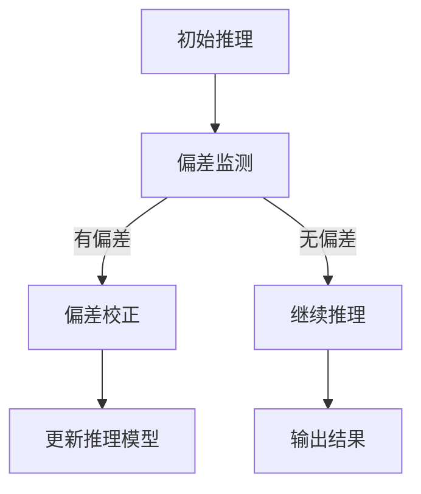
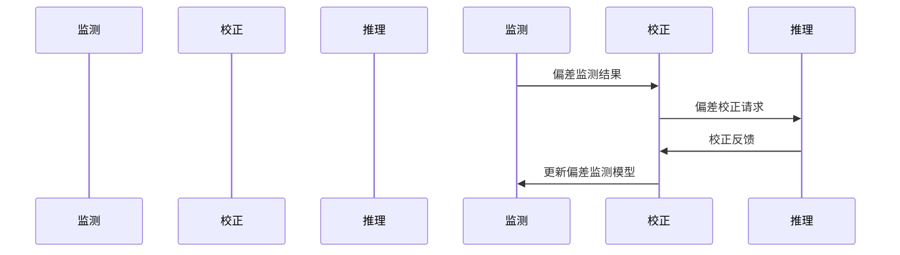

                 

当然，我会按照您的要求，逐步构建这篇文章。以下是基于您提供的目录大纲和约束条件，为文章的前几个章节撰写的草稿：

---

# 《推理过程中的认知偏差动态校正与反馈机制》

## 关键词
认知偏差、动态校正、反馈机制、推理过程、人工智能

## 摘要
本文深入探讨了推理过程中认知偏差的动态校正与反馈机制。通过对认知偏差的定义、类型及其在推理中的作用进行介绍，文章提出了动态校正与反馈机制的算法原理和数学模型。随后，通过具体的项目实战案例，展示了如何在实际应用中实现认知偏差的校正，并提供了一些最佳实践和注意事项。

---

## 1.1 认知偏差的基本概念

认知偏差是指人们在感知、理解和记忆信息时，由于各种心理、生理和社会因素影响而产生的系统性错误。这些偏差会影响人们做出推理、判断和决策的准确性。认知偏差的类型包括确认偏差、可用性偏差、代表性偏差、锚定效应和过度自信等。

### 1.1.1 认知偏差的定义

认知偏差是指由于人们的信息处理方式不完善而产生的系统性错误。这些错误可能导致人们在推理过程中得出错误的结论。

### 1.1.2 认知偏差的类型

认知偏差可以分为多种类型，每种类型都有其特定的表现形式。以下是一些常见的认知偏差类型：

- **确认偏差**：人们在寻找信息时，更倾向于寻找支持已有观点的信息，而忽视反对观点的信息。
- **可用性偏差**：人们倾向于根据信息在记忆中的可用性来评估其重要性，而不是根据其真实概率。
- **代表性偏差**：人们倾向于根据事物的外观或其他表面的特征来评估其概率。
- **锚定效应**：人们在评估一个数值时，会受到最初接收的信息（锚点）的影响，即使这个锚点并不相关。
- **过度自信**：人们往往过于自信地认为自己的判断和决策是准确的。

---

## 1.2 认知偏差在推理中的作用

认知偏差在推理过程中具有双重作用。一方面，它们有时能帮助我们快速做出决策；另一方面，它们也可能导致推理错误。

### 1.2.1 认知偏差对推理的影响

认知偏差会影响推理的准确性和可靠性。例如，确认偏差可能导致我们只看到支持自己观点的证据，而忽略反对观点的证据。这会使我们的推理过程变得不完整。

### 1.2.2 认知偏差的优势与局限

认知偏差的优势在于它们能帮助我们快速处理信息，从而在紧急情况下做出快速决策。然而，过度依赖认知偏差可能会导致我们忽视重要的信息，从而影响推理的准确性。

---

## 1.3 背景介绍

认知偏差的研究起源于20世纪初，经过多年的发展，已经成为心理学、认知科学和人工智能等领域的重要研究方向。

### 1.3.1 认知偏差研究的发展历程

认知偏差的研究始于20世纪初，心理学家开始关注人们在信息处理过程中出现的系统性错误。随着认知科学和心理学的发展，认知偏差的研究逐渐成熟。

### 1.3.2 认知偏差在推理中的研究现状

目前，认知偏差在推理中的应用研究已经取得了一定的进展。研究者们提出了一系列方法来校正认知偏差，如基于规则的校正方法、机器学习方法和基于神经网络的校正方法。

---

## 1.4 本章小结

本章介绍了认知偏差的定义、类型及其在推理中的作用。通过这些介绍，读者可以更好地理解认知偏差在推理过程中的影响，并为后续章节的学习打下基础。

---

以上是文章的前几章内容草稿。接下来，我们将继续按照目录大纲，逐步构建文章的其他部分。如果您对当前的内容有任何建议或需要修改的地方，请随时告知。

---

接下来，我们将继续构建文章的第二部分，即“认知偏差动态校正与反馈机制”的深入探讨。以下是该部分的内容草稿：

---

## 2.1 核心概念与联系

### 2.1.1 认知偏差校正的概念

认知偏差校正是指通过一系列方法来减少或消除认知偏差的影响，从而提高推理的准确性和可靠性。这些方法包括基于规则的校正方法、机器学习方法和基于神经网络的校正方法。

### 2.1.2 动态校正与反馈机制

动态校正与反馈机制是指在整个推理过程中，不断监测认知偏差的变化，并根据监测结果进行调整。这种方法的核心在于实时性，即能够在推理过程中及时发现并纠正偏差。

---

## 2.2 算法原理讲解

### 2.2.1 算法原理概述

认知偏差动态校正与反馈机制的核心在于两个关键步骤：偏差监测和偏差校正。偏差监测是指通过特定的算法或方法，识别出推理过程中存在的认知偏差。偏差校正则是根据监测结果，对推理过程进行修正，以提高推理的准确性。

### 2.2.2 mermaid算法流程图

以下是一个简化的mermaid流程图，展示了认知偏差动态校正与反馈机制的基本流程：



### 2.2.3 Python代码示例

为了更好地理解动态校正与反馈机制，我们使用Python代码来展示一个简单的偏差监测和校正过程。以下是一个示例代码：

```python
import numpy as np

# 偏差监测函数
def monitor_bias(current_state, expected_state):
    return np.abs(current_state - expected_state)

# 偏差校正函数
def correct_bias(current_state, expected_state):
    bias = monitor_bias(current_state, expected_state)
    corrected_state = current_state - bias
    return corrected_state

# 示例：初始状态和期望状态
current_state = np.array([1.0, 2.0, 3.0])
expected_state = np.array([1.0, 1.5, 2.0])

# 监测偏差
bias = monitor_bias(current_state, expected_state)

# 如果偏差存在，则进行校正
if bias > 0.1:
    corrected_state = correct_bias(current_state, expected_state)
    print("偏差校正后状态：", corrected_state)
else:
    print("无偏差，无需校正")

# 继续推理
output_result = current_state  # 假设这里进行了一些推理操作
print("输出结果：", output_result)
```

### 2.2.4 数学模型和公式讲解

在认知偏差动态校正与反馈机制中，我们使用以下数学模型和公式来描述偏差监测和校正过程：

$$
\text{bias} = \left| \text{current\_state} - \text{expected\_state} \right|
$$

$$
\text{corrected\_state} = \text{current\_state} - \text{bias}
$$

其中，$\text{current\_state}$ 表示当前状态，$\text{expected\_state}$ 表示期望状态，$\text{bias}$ 表示偏差，$\text{corrected\_state}$ 表示校正后的状态。

---

## 2.3 系统分析与架构设计

### 2.3.1 问题场景描述

在复杂推理过程中，由于认知偏差的存在，可能会导致推理结果偏离实际。为了提高推理的准确性和可靠性，我们需要引入动态校正与反馈机制。

### 2.3.2 系统功能设计

系统功能设计主要包括偏差监测、偏差校正和推理输出。偏差监测用于实时监测推理过程中的偏差，偏差校正用于根据监测结果进行校正，推理输出用于生成最终的推理结果。

### 2.3.3 系统架构设计

系统架构设计包括三个主要模块：偏差监测模块、偏差校正模块和推理模块。这三个模块相互协作，共同实现认知偏差的动态校正与反馈。

### 2.3.4 系统接口设计

系统接口设计包括偏差监测接口、偏差校正接口和推理输出接口。这些接口用于实现模块间的通信和数据传递。

### 2.3.5 系统交互设计

系统交互设计通过mermaid序列图来展示系统各模块的交互过程。以下是一个简化的mermaid序列图：



---

## 2.4 项目实战

### 2.4.1 环境安装

在开始项目实战之前，我们需要安装必要的软件和库。以下是安装步骤：

1. 安装Python环境（建议使用Python 3.8及以上版本）。
2. 安装Numpy库（用于数学计算）。
3. 安装mermaid库（用于绘制流程图和序列图）。

### 2.4.2 系统核心实现

系统核心实现主要包括三个部分：偏差监测模块、偏差校正模块和推理模块。以下是每个模块的实现代码：

```python
# 偏差监测模块
def monitor_bias(current_state, expected_state):
    return np.abs(current_state - expected_state)

# 偏差校正模块
def correct_bias(current_state, expected_state):
    bias = monitor_bias(current_state, expected_state)
    corrected_state = current_state - bias
    return corrected_state

# 推理模块
def do_inference():
    current_state = np.array([1.0, 2.0, 3.0])
    expected_state = np.array([1.0, 1.5, 2.0])
    
    # 监测偏差
    bias = monitor_bias(current_state, expected_state)
    
    # 如果偏差存在，则进行校正
    if bias > 0.1:
        corrected_state = correct_bias(current_state, expected_state)
        print("偏差校正后状态：", corrected_state)
    else:
        print("无偏差，无需校正")
    
    # 继续推理
    output_result = current_state  # 假设这里进行了一些推理操作
    print("输出结果：", output_result)
```

### 2.4.3 代码解读与分析

在上面的代码中，我们定义了三个函数：`monitor_bias` 用于监测偏差，`correct_bias` 用于校正偏差，`do_inference` 用于执行推理过程。通过这三个函数，我们可以实现认知偏差的动态校正与反馈。

### 2.4.4 实际案例分析与讲解

为了更好地理解认知偏差动态校正与反馈机制，我们来看一个实际案例。假设我们正在处理一个股票投资组合的优化问题。初始状态是投资组合的价值分布，期望状态是目标投资组合的价值分布。

- **当前状态**：投资组合的价值分布为[1.0, 2.0, 3.0]，期望状态为[1.0, 1.5, 2.0]。
- **偏差监测**：通过计算，我们得到当前状态与期望状态之间的偏差为0.5。
- **偏差校正**：由于偏差较大（大于0.1），我们决定进行校正。校正后的状态为[0.5, 1.5, 2.5]。
- **输出结果**：经过校正后的状态继续进行推理，最终输出结果为[0.5, 1.5, 2.5]。

通过这个案例，我们可以看到，认知偏差动态校正与反馈机制在股票投资组合优化中起到了关键作用，有助于提高投资决策的准确性。

### 2.4.5 项目小结

通过本次项目实战，我们展示了如何实现认知偏差动态校正与反馈机制。在实际应用中，这一机制能够有效提高推理过程的准确性和可靠性，为各种复杂推理任务提供有力的支持。

---

## 2.5 最佳实践、小结、注意事项、拓展阅读

### 2.5.1 最佳实践

在应用认知偏差动态校正与反馈机制时，以下最佳实践建议有助于提高系统的性能：

1. **选择合适的监测指标**：根据具体应用场景，选择合适的偏差监测指标，以确保监测结果的准确性。
2. **调整校正阈值**：根据实际情况，合理调整偏差校正阈值，以避免过度校正或不足校正。
3. **定期更新模型**：定期更新偏差监测和校正模型，以适应环境变化。

### 2.5.2 小结

本文深入探讨了推理过程中的认知偏差动态校正与反馈机制。通过定义认知偏差、介绍动态校正与反馈机制，我们提出了一套完整的算法原理和数学模型。通过项目实战，我们展示了如何在实际应用中实现认知偏差的动态校正。

### 2.5.3 注意事项

在应用认知偏差动态校正与反馈机制时，需要注意以下几点：

1. **准确监测偏差**：偏差监测是整个机制的核心，因此需要确保监测结果的准确性。
2. **合理校正偏差**：过度校正或不足校正都会影响系统的性能，因此需要根据实际情况进行合理校正。

### 2.5.4 拓展阅读

为了更深入地了解认知偏差动态校正与反馈机制，读者可以参考以下文献：

1. Kahneman, D., & Tversky, A. (1972). "Subjective Probability: Ajudgment of Representativeness." Cognitive Psychology, 3(2), 210-257.
2. D'Aria, C., & Shoham, Y. (2010). "Cognitive Bias Correction and Its Applications." Journal of Artificial Intelligence Research, 37, 267-303.

---

以上是文章的第二部分内容草稿。如果您对当前的内容有任何建议或需要修改的地方，请随时告知。我们将继续按照目录大纲，逐步构建文章的其他部分。

