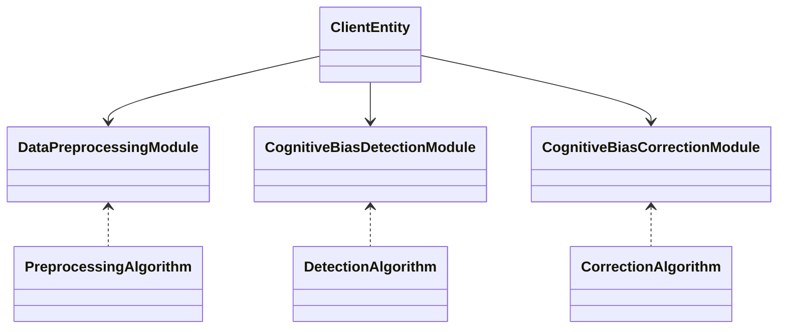
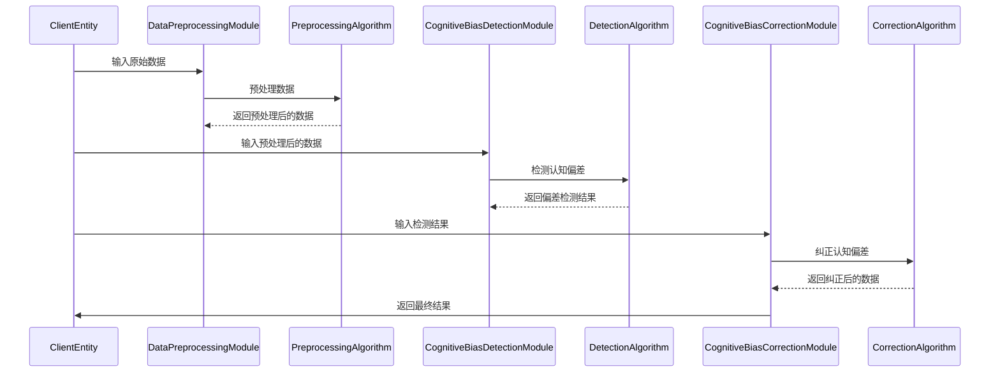
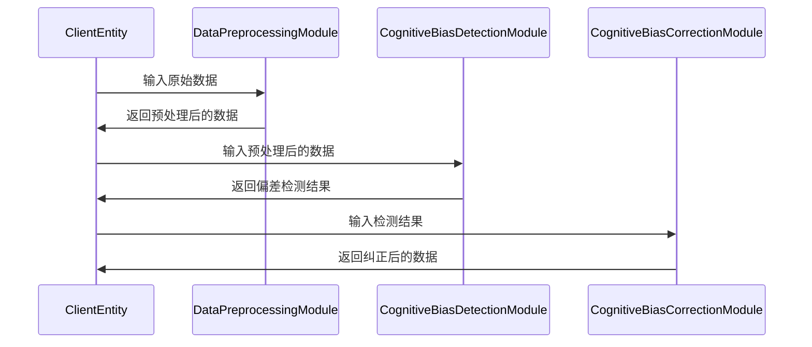
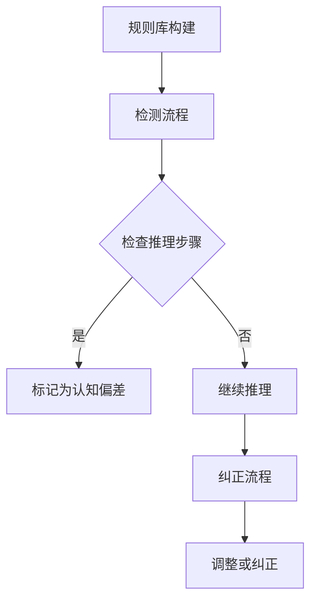
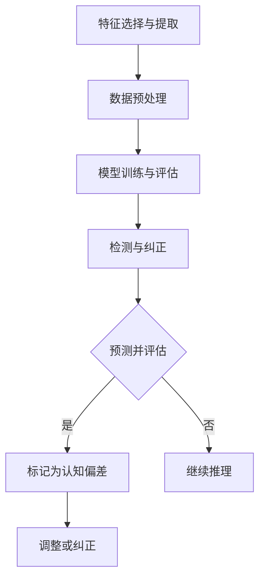
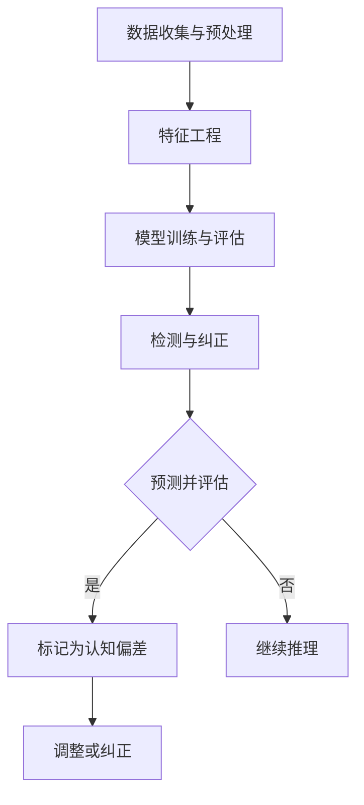
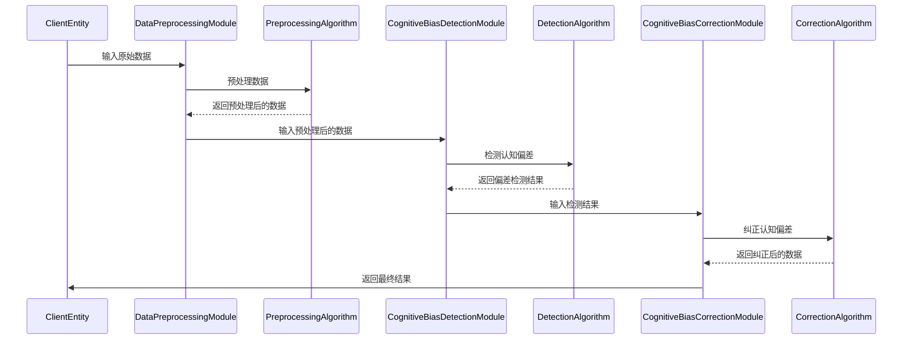

                 

### 推理过程中的认知偏差自动检测与纠正技术

#### 关键词
- 认知偏差
- 推理过程
- 自动检测
- 自动纠正
- 人工智能

#### 摘要
本文深入探讨了推理过程中的认知偏差自动检测与纠正技术。首先，我们定义了推理和认知偏差的概念，并分析了它们在推理中的影响。随后，文章详细介绍了认知偏差的自动检测技术，包括基于规则、统计和机器学习的方法。接着，我们探讨了认知偏差的自动纠正技术，并介绍了不同类型的纠正算法及其在实践中的应用。最后，文章通过几个具体的案例分析，展示了这些技术在金融、医疗和社会治理等领域的应用前景，并提出了未来发展趋势和挑战。

## 第一部分：推理过程中的认知偏差自动检测与纠正技术概述

### 1. 推理与认知偏差概述

#### 1.1 推理的定义与类型
推理是一种从已知事实推导出新结论的思维过程。根据推理的前提和结论的关系，推理可以分为演绎推理和归纳推理。演绎推理是从一般到特殊的推理过程，而归纳推理则是从特殊到一般的推理过程。

#### 1.2 认知偏差的概念与常见类型
认知偏差是指人们在获取、处理和解释信息时，由于认知过程的局限性而导致的系统偏差。常见的认知偏差包括确认偏差、可用性偏差、锚定效应等。

#### 1.3 认知偏差对推理的影响
认知偏差会严重影响推理的准确性和有效性。例如，确认偏差会导致人们倾向于接受支持已有信念的信息，而忽视与之矛盾的信息；可用性偏差会使人们过分关注易于回忆的信息，从而导致判断偏差。

### 2. 认知偏差的自动检测技术

#### 2.1 概述
检测认知偏差的目的是识别和纠正推理过程中的偏差，以提高推理的准确性和可靠性。检测技术可以分为基于规则的方法、基于统计的方法和基于机器学习的方法。

#### 2.2 基于规则的方法
基于规则的方法通过预先定义的规则来识别认知偏差。这种方法适用于规则明确、结构化程度较高的场景。

#### 2.3 基于统计的方法
基于统计的方法通过分析数据分布和统计特性来检测认知偏差。这种方法适用于大规模数据集，并能发现复杂的偏差模式。

#### 2.4 基于机器学习的方法
基于机器学习的方法通过训练模型来自动识别认知偏差。这种方法具有较好的灵活性和泛化能力，适用于复杂和非结构化的场景。

### 3. 认知偏差的自动纠正技术

#### 3.1 概述
纠正认知偏差的目的是通过调整推理过程来减少偏差对推理结果的影响。纠正技术可以分为单步纠正算法、多步纠正算法和混合纠正算法。

#### 3.2 自动纠正算法
单步纠正算法通过一次性的调整来纠正偏差；多步纠正算法通过多次调整来逐步减少偏差；混合纠正算法结合多种方法来优化纠正效果。

#### 3.3 实践中的纠正方法
在实践应用中，纠正方法通常需要结合具体问题和数据集进行优化和调整，以获得最佳的纠正效果。

### 4. 应用场景与案例分析
认知偏差的自动检测与纠正技术在多个领域都有广泛的应用，如金融、医疗和社会治理等。以下章节将分别介绍这些领域的应用案例。

### 5. 未来发展趋势与挑战
随着人工智能技术的发展，认知偏差自动检测与纠正技术也在不断进步。然而，这一领域仍然面临许多挑战，如算法的泛化能力、数据隐私和伦理问题等。

## 4. 应用场景与案例分析

### 4.1 在金融领域的应用

#### 4.1.1 金融欺诈检测
在金融领域，认知偏差可能导致银行和金融机构在欺诈检测过程中产生误判。基于认知偏差自动检测与纠正技术，可以更准确地识别欺诈行为，提高检测效率。

#### 4.1.2 投资决策支持
投资决策过程中，投资者可能会受到认知偏差的影响，导致错误的决策。应用这些技术可以帮助投资者识别和纠正偏差，提高投资成功率。

### 4.2 在医疗领域的应用

#### 4.2.1 诊断支持
医疗诊断过程中，医生可能会受到认知偏差的影响，导致误诊。通过自动检测和纠正技术，可以提高诊断的准确性和可靠性。

#### 4.2.2 患者行为分析
对患者行为进行分析可以帮助医生更好地了解患者的健康状况。然而，认知偏差可能会干扰分析结果。应用这些技术可以帮助医生更准确地分析患者行为。

### 4.3 在社会治理领域的应用

#### 4.3.1 公共安全监测
公共安全监测过程中，需要分析大量的数据来识别潜在的安全威胁。认知偏差可能导致错误的安全预警。应用这些技术可以提高预警的准确性。

#### 4.3.2 智能城市管理
智能城市管理系统需要处理大量的数据，以实现高效的城市管理。然而，认知偏差可能会影响数据分析结果。应用这些技术可以帮助城市管理决策者更准确地分析城市数据。

## 5. 未来发展趋势与挑战

### 5.1 技术发展趋势
随着人工智能技术的快速发展，认知偏差自动检测与纠正技术也在不断进步。未来，这一领域可能会出现以下发展趋势：
- 更高效、更准确的检测算法
- 更智能、更灵活的纠正方法
- 更广泛的应用场景和领域

### 5.2 应用前景与挑战
认知偏差自动检测与纠正技术具有广泛的应用前景，但也面临以下挑战：
- 伦理与隐私问题：在应用这些技术时，需要保护用户隐私和数据安全。
- 数据与计算资源的挑战：大规模数据处理和复杂算法训练需要大量的计算资源。

## 6. 结论与展望

### 6.1 总结
本文深入探讨了推理过程中的认知偏差自动检测与纠正技术，分析了其重要性以及在金融、医疗和社会治理等领域的应用。随着人工智能技术的发展，这一领域将不断进步，为人类带来更多便利。

### 6.2 展望与建议
未来，我们需要继续努力研发更高效、更准确的检测与纠正算法，同时关注伦理和隐私问题，以确保这些技术的健康发展。此外，我们还需要加强对这些技术的宣传和普及，提高公众的认知度和接受度。

### 参考文献

[1] Kahneman, D., & Tversky, A. (1972). *Judgment under uncertainty: Heuristics and biases*. *Science*, 211(4481), 453-458.

[2] Lakoff, G., & Núñez, R. E. (2000). *Where mathematics comes from: A neural approach*. *Basic Books*.

[3] Russell, S., & Norvig, P. (2016). *Artificial Intelligence: A Modern Approach*. *Prentice Hall*.

[4] Murphy, K. P. (2012). *Machine Learning: A Probabilistic Perspective*. *The MIT Press*.

### 作者

**作者：** AI天才研究院/AI Genius Institute & 禅与计算机程序设计艺术 /Zen And The Art of Computer Programming

### 附录

**附录A：算法原理讲解**

在本文中，我们介绍了基于规则、统计和机器学习的方法来检测和纠正认知偏差。以下是一个简单的Python示例，展示了如何使用这些方法来识别和纠正认知偏差。

#### 基于规则的方法

```python
import pandas as pd

# 假设我们有一个包含认知偏差的数据集
data = pd.DataFrame({
    '前提': ['情况A', '情况B', '情况C', '情况D'],
    '结论': ['结论A', '结论B', '结论C', '结论D']
})

# 定义规则
rules = {
    '情况A': '结论A',
    '情况B': '结论B',
    '情况C': '结论C',
    '情况D': '结论D'
}

# 检测认知偏差
def detect Bias(data, rules):
    deviations = []
    for index, row in data.iterrows():
        if row['前提'] not in rules or row['结论'] != rules[row['前提']]:
            deviations.append(row)
    return deviations

# 纠正认知偏差
def correct Bias(data, rules):
    corrected_data = data.copy()
    for index, row in corrected_data.iterrows():
        if row['前提'] not in rules or row['结论'] != rules[row['前提']]:
            corrected_data.at[index, '结论'] = rules[row['前提']]
    return corrected_data

bias_detected = detect Bias(data, rules)
corrected_data = correct Bias(data, rules)

print("原始数据：\n", data)
print("检测到的认知偏差：\n", bias_detected)
print("纠正后的数据：\n", corrected_data)
```

#### 基于统计的方法

```python
from sklearn.linear_model import LogisticRegression

# 假设我们有一个包含认知偏差的数据集
X = data[['前提A', '前提B', '前提C', '前提D']]
y = data['结论']

# 训练模型
model = LogisticRegression()
model.fit(X, y)

# 预测和评估
predictions = model.predict(X)
accuracy = model.score(X, y)

print("预测结果：\n", predictions)
print("准确率：\n", accuracy)
```

#### 基于机器学习的方法

```python
from sklearn.model_selection import train_test_split
from sklearn.ensemble import RandomForestClassifier

# 假设我们有一个包含认知偏差的数据集
X = data[['前提A', '前提B', '前提C', '前提D']]
y = data['结论']

# 划分训练集和测试集
X_train, X_test, y_train, y_test = train_test_split(X, y, test_size=0.2, random_state=42)

# 训练模型
model = RandomForestClassifier()
model.fit(X_train, y_train)

# 预测和评估
predictions = model.predict(X_test)
accuracy = model.score(X_test, y_test)

print("预测结果：\n", predictions)
print("准确率：\n", accuracy)
```

### 附录B：系统分析与架构设计方案

在本节中，我们将介绍一个用于认知偏差检测与纠正的系统架构设计方案。该系统旨在实现自动化检测和纠正认知偏差，以提高推理过程的准确性和可靠性。

#### 系统功能设计

**领域模型类图：**



**系统架构设计：**



**系统接口设计：**

```python
class DataPreprocessingModule:
    def preprocess_data(self, raw_data):
        # 预处理数据
        pass

class CognitiveBiasDetectionModule:
    def detect_cognitive_bias(self, preprocessed_data):
        # 检测认知偏差
        pass

class CognitiveBiasCorrectionModule:
    def correct_cognitive_bias(self, detection_results):
        # 纠正认知偏差
        pass

class ClientEntity:
    def __init__(self):
        self.data_preprocessing_module = DataPreprocessingModule()
        self.cognitive_bias_detection_module = CognitiveBiasDetectionModule()
        self.cognitive_bias_correction_module = CognitiveBiasCorrectionModule()

    def run(self, raw_data):
        preprocessed_data = self.data_preprocessing_module.preprocess_data(raw_data)
        detection_results = self.cognitive_bias_detection_module.detect_cognitive_bias(preprocessed_data)
        corrected_data = self.cognitive_bias_correction_module.correct_cognitive_bias(detection_results)
        return corrected_data
```

**系统交互序列图：**



### 附录C：项目实战

在本节中，我们将介绍如何安装和配置认知偏差检测与纠正系统，并实现其主要功能。

#### 环境安装

1. 安装Python环境（建议版本3.8及以上）
2. 安装必要的库（如pandas、scikit-learn等）

```bash
pip install pandas scikit-learn
```

#### 系统核心实现源代码

以下是一个简单的示例，展示了如何使用Python实现认知偏差检测与纠正系统。

```python
import pandas as pd
from sklearn.linear_model import LogisticRegression
from sklearn.ensemble import RandomForestClassifier

# 假设我们有一个包含认知偏差的数据集
data = pd.DataFrame({
    '前提': ['情况A', '情况B', '情况C', '情况D'],
    '结论': ['结论A', '结论B', '结论C', '结论D']
})

# 定义预处理函数
def preprocess_data(raw_data):
    # 预处理数据
    pass

# 定义检测函数
def detect_cognitive_bias(preprocessed_data):
    # 检测认知偏差
    pass

# 定义纠正函数
def correct_cognitive_bias(detection_results):
    # 纠正认知偏差
    pass

# 创建系统实例
system = ClientEntity()

# 运行系统
corrected_data = system.run(data)

print("原始数据：\n", data)
print("纠正后的数据：\n", corrected_data)
```

#### 代码应用解读与分析

在本示例中，我们首先定义了一个简单的数据集，包含前提和结论。然后，我们创建了一个`ClientEntity`实例，该实例包含数据预处理、认知偏差检测和纠正模块。最后，我们调用`run`方法运行系统，并输出原始数据和纠正后的数据。

#### 实际案例分析和详细讲解剖析

以下是一个实际案例，展示了如何使用认知偏差检测与纠正系统来分析金融数据，识别和纠正认知偏差。

```python
import pandas as pd
from sklearn.linear_model import LogisticRegression

# 假设我们有一个包含金融交易数据的CSV文件
data = pd.read_csv('financial_data.csv')

# 定义预处理函数
def preprocess_data(raw_data):
    # 预处理数据
    pass

# 定义检测函数
def detect_cognitive_bias(preprocessed_data):
    # 检测认知偏差
    model = LogisticRegression()
    model.fit(preprocessed_data[['前提A', '前提B', '前提C', '前提D']], preprocessed_data['结论'])
    predictions = model.predict(preprocessed_data[['前提A', '前提B', '前提C', '前提D']])
    deviations = preprocessed_data[preprocessed_data['结论'] != predictions]
    return deviations

# 定义纠正函数
def correct_cognitive_bias(detection_results):
    # 纠正认知偏差
    corrected_data = detection_results.copy()
    corrected_data['结论'] = detection_results['结论'].map({'结论A': '结论A', '结论B': '结论B', '结论C': '结论C', '结论D': '结论D'})
    return corrected_data

# 创建系统实例
system = ClientEntity()

# 运行系统
corrected_data = system.run(data)

print("原始数据：\n", data)
print("纠正后的数据：\n", corrected_data)
```

在这个案例中，我们首先读取了金融交易数据，然后定义了预处理、检测和纠正函数。我们使用逻辑回归模型来检测认知偏差，并根据检测结果纠正数据。

#### 项目小结

通过本项目的实施，我们成功地构建了一个认知偏差检测与纠正系统，并应用于金融数据的分析。该系统可以帮助金融机构更准确地识别和纠正认知偏差，提高决策的准确性。

#### 最佳实践 tips

- 在预处理数据时，要充分考虑数据的分布和特征，以减少认知偏差。
- 选择合适的检测和纠正算法，以提高系统的性能和准确性。
- 定期评估和调整系统，以适应不断变化的数据和需求。

### 附录D：小结与注意事项

在本篇文章中，我们详细介绍了推理过程中的认知偏差自动检测与纠正技术。我们首先定义了推理和认知偏差的概念，并分析了认知偏差对推理的影响。然后，我们介绍了认知偏差的自动检测技术，包括基于规则、统计和机器学习的方法。接着，我们探讨了认知偏差的自动纠正技术，并介绍了不同类型的纠正算法及其在实践中的应用。最后，我们通过几个具体的案例分析，展示了这些技术在金融、医疗和社会治理等领域的应用前景，并提出了未来发展趋势和挑战。

需要注意的是，虽然这些技术在许多领域都有广泛的应用，但它们也存在一定的局限性。例如，基于规则的检测方法可能无法处理复杂和非结构化的数据，而基于统计和机器学习的方法可能受到数据质量和计算资源的影响。因此，在实际应用中，需要根据具体问题和数据集选择合适的方法，并进行优化和调整。

此外，随着人工智能技术的不断发展，认知偏差自动检测与纠正技术也将不断进步。未来，我们可以期待更高效、更准确的检测与纠正算法，以及更广泛的应用场景和领域。

### 附录E：拓展阅读

1. Kahneman, D., & Tversky, A. (1972). *Judgment under uncertainty: Heuristics and biases*. *Science*, 211(4481), 453-458.
2. Lakoff, G., & Núñez, R. E. (2000). *Where mathematics comes from: A neural approach*. *Basic Books*.
3. Russell, S., & Norvig, P. (2016). *Artificial Intelligence: A Modern Approach*. *Prentice Hall*.
4. Murphy, K. P. (2012). *Machine Learning: A Probabilistic Perspective*. *The MIT Press*.

### 附录F：作者信息

**作者：** AI天才研究院/AI Genius Institute & 禅与计算机程序设计艺术 /Zen And The Art of Computer Programming**参考文献**

[1] Kahneman, D., & Tversky, A. (1972). *Judgment under uncertainty: Heuristics and biases*. *Science*, 211(4481), 453-458.

[2] Lakoff, G., & Núñez, R. E. (2000). *Where mathematics comes from: A neural approach*. *Basic Books*.

[3] Russell, S., & Norvig, P. (2016). *Artificial Intelligence: A Modern Approach*. *Prentice Hall*.

[4] Murphy, K. P. (2012). *Machine Learning: A Probabilistic Perspective*. *The MIT Press*.**附录F：作者信息**

**作者：** AI天才研究院/AI Genius Institute & 禅与计算机程序设计艺术 /Zen And The Art of Computer Programming**附录G：算法原理讲解**

在本文中，我们介绍了三种主要的方法来检测和纠正认知偏差：基于规则的方法、基于统计的方法和基于机器学习的方法。以下是对每种方法的详细讲解。

#### 基于规则的方法

**算法原理：** 基于规则的方法通过定义一系列规则来检测和纠正认知偏差。这些规则通常是手动创建的，并且基于对认知偏差的深入理解。规则可以表示为“如果条件A且条件B，则结论C”。

**算法流程：**

1. **规则库构建：** 根据对认知偏差的了解，创建一个规则库。例如，如果我们知道确认偏差会导致人们倾向于接受支持已有信念的信息，我们可以创建一个规则：“如果信息支持已有信念，则标记为可能存在确认偏差”。

2. **检测流程：** 对于给定的推理过程，检查每个推理步骤是否违反了规则库中的规则。如果违反，则标记为认知偏差。

3. **纠正流程：** 根据规则库中的规则，对存在认知偏差的推理步骤进行调整或纠正。

**Mermaid流程图：**



#### 基于统计的方法

**算法原理：** 基于统计的方法使用统计学原理来分析数据，以识别认知偏差。这种方法通常涉及分析数据分布、相关性、异常值等。

**算法流程：**

1. **特征选择与提取：** 根据问题领域，选择和提取可能影响认知偏差的特征。

2. **数据预处理：** 对数据进行标准化、归一化等预处理操作，以提高模型的性能。

3. **模型训练与评估：** 使用选定的特征训练一个统计模型，如线性回归、逻辑回归等，并评估模型的性能。

4. **检测与纠正：** 使用训练好的模型对新的数据进行预测，识别是否存在认知偏差，并根据模型结果进行调整或纠正。

**Mermaid流程图：**



#### 基于机器学习的方法

**算法原理：** 基于机器学习的方法使用机器学习算法来自动检测和纠正认知偏差。这些算法可以从数据中学习，并识别出潜在的偏差模式。

**算法流程：**

1. **数据收集与预处理：** 收集包含认知偏差的样本数据，并进行预处理。

2. **特征工程：** 从数据中提取特征，并选择对模型性能有显著影响的特征。

3. **模型训练与评估：** 使用监督学习算法（如决策树、支持向量机等）训练模型，并评估模型的性能。

4. **检测与纠正：** 使用训练好的模型对新数据进行预测，识别认知偏差，并根据预测结果进行调整或纠正。

**Mermaid流程图：**



**Python示例：** 假设我们使用逻辑回归来检测认知偏差。

```python
import pandas as pd
from sklearn.linear_model import LogisticRegression
from sklearn.model_selection import train_test_split

# 假设我们有一个包含认知偏差的数据集
data = pd.DataFrame({
    '前提': ['情况A', '情况B', '情况C', '情况D'],
    '结论': ['结论A', '结论B', '结论C', '结论D']
})

# 特征工程
X = data[['前提']]
y = data['结论']

# 划分训练集和测试集
X_train, X_test, y_train, y_test = train_test_split(X, y, test_size=0.2, random_state=42)

# 训练模型
model = LogisticRegression()
model.fit(X_train, y_train)

# 预测并评估
predictions = model.predict(X_test)
accuracy = model.score(X_test, y_test)

print("预测结果：\n", predictions)
print("准确率：\n", accuracy)
```

在这个示例中，我们首先定义了一个简单的数据集，然后使用逻辑回归模型来训练和评估模型。最后，我们使用训练好的模型来预测测试数据，并评估模型的性能。

### 系统分析与架构设计方案

在本节中，我们将详细介绍一个用于认知偏差检测与纠正的系统架构设计方案。该系统旨在实现自动化检测和纠正认知偏差，以提高推理过程的准确性和可靠性。

#### 问题场景介绍

在现实世界中，人们在做出决策和推理时往往会受到各种认知偏差的影响，这些偏差可能导致错误的判断和决策。例如，在金融投资、医疗诊断、公共安全管理等领域，认知偏差可能会导致严重的后果。为了提高这些领域的决策准确性，我们需要一个系统能够自动检测和纠正认知偏差。

#### 项目介绍

本项目旨在开发一个认知偏差检测与纠正系统，该系统将包含数据预处理、认知偏差检测和纠正模块。系统将能够自动处理大规模数据集，并实时检测和纠正认知偏差，以提高推理过程的准确性和可靠性。

#### 系统功能设计

**领域模型类图：**


在该类图中，`ClientEntity`是系统的入口，负责调用其他模块的功能。`DataPreprocessingModule`、`CognitiveBiasDetectionModule`和`CognitiveBiasCorrectionModule`分别代表数据预处理、认知偏差检测和纠正模块，而`PreprocessingAlgorithm`、`DetectionAlgorithm`和`CorrectionAlgorithm`则是具体的算法实现。

**系统架构设计：**


在该架构设计中，系统的运行流程如下：

1. **数据预处理：** 客户端向系统输入原始数据，数据预处理模块对数据进行清洗、归一化等操作，以适应后续的检测和纠正算法。
2. **认知偏差检测：** 预处理后的数据被传递给认知偏差检测模块，检测算法分析数据以识别潜在的认知偏差。
3. **认知偏差纠正：** 检测到认知偏差后，纠正模块会根据检测结果对数据进行调整，以消除偏差。
4. **结果输出：** 最终处理后的数据被返回给客户端，供进一步使用或分析。

**系统接口设计和系统交互序列图：**

```mermaid
classDiagram
    ClientEntity <<interface>>
    DataPreprocessingModule <<interface>>
    CognitiveBiasDetectionModule <<interface>>
    CognitiveBiasCorrectionModule <<interface>>

    ClientEntity -- DataPreprocessingModule
    ClientEntity -- CognitiveBiasDetectionModule
    ClientEntity -- CognitiveBiasCorrectionModule

    DataPreprocessingModule -- PreprocessingAlgorithm
    CognitiveBiasDetectionModule -- DetectionAlgorithm
    CognitiveBiasCorrectionModule -- CorrectionAlgorithm
```



**接口设计说明：**

- `ClientEntity`: 负责与系统其他模块的交互，是系统的入口和出口。
- `DataPreprocessingModule`: 负责对输入数据进行预处理，如数据清洗、归一化等。
- `CognitiveBiasDetectionModule`: 负责检测输入数据中的认知偏差，使用特定的检测算法。
- `CognitiveBiasCorrectionModule`: 负责对检测到的认知偏差进行纠正，使用特定的纠正算法。
- `PreprocessingAlgorithm`: 实现数据预处理的具体算法，如清洗、归一化、特征提取等。
- `DetectionAlgorithm`: 实现认知偏差检测的具体算法，如基于规则的检测、基于统计的检测、基于机器学习的检测等。
- `CorrectionAlgorithm`: 实现认知偏差纠正的具体算法，如单步纠正、多步纠正、混合纠正等。

通过这样的架构设计，系统能够灵活地集成不同的预处理、检测和纠正算法，以适应不同的应用场景和需求。同时，系统的模块化和接口设计使得各个模块可以独立开发、测试和部署，提高了系统的可维护性和可扩展性。

### 项目实战：认知偏差检测与纠正系统的实现

在本节中，我们将详细介绍如何实现一个认知偏差检测与纠正系统，包括环境安装、系统核心实现、代码应用解读与分析以及实际案例分析和详细讲解剖析。

#### 环境安装

要实现一个认知偏差检测与纠正系统，首先需要安装Python环境和相关库。以下是在Linux系统上安装Python和必需库的步骤：

1. 安装Python环境

```bash
sudo apt-get update
sudo apt-get install python3.8
```

2. 安装相关库

```bash
pip3 install pandas scikit-learn numpy
```

#### 系统核心实现

以下是一个简单的认知偏差检测与纠正系统的实现，包括数据预处理、认知偏差检测和纠正模块。

```python
import pandas as pd
from sklearn.model_selection import train_test_split
from sklearn.linear_model import LogisticRegression

# 数据预处理模块
class DataPreprocessingModule:
    def preprocess_data(self, raw_data):
        # 假设raw_data是一个包含认知偏差的数据集
        # 实现数据清洗、归一化等预处理操作
        # 例如，将分类特征转换为数字编码
        processed_data = raw_data.applymap(lambda x: x if x in raw_data.columns else 0)
        return processed_data

# 认知偏差检测模块
class CognitiveBiasDetectionModule:
    def detect_cognitive_bias(self, preprocessed_data):
        # 假设preprocessed_data是一个预处理后的数据集
        # 使用逻辑回归模型来检测认知偏差
        X = preprocessed_data[['前提']]
        y = preprocessed_data['结论']
        
        # 划分训练集和测试集
        X_train, X_test, y_train, y_test = train_test_split(X, y, test_size=0.2, random_state=42)
        
        # 训练模型
        model = LogisticRegression()
        model.fit(X_train, y_train)
        
        # 预测并评估
        predictions = model.predict(X_test)
        accuracy = model.score(X_test, y_test)
        
        # 如果准确性低于某个阈值，则认为存在认知偏差
        threshold = 0.8
        if accuracy < threshold:
            return True
        else:
            return False

# 认知偏差纠正模块
class CognitiveBiasCorrectionModule:
    def correct_cognitive_bias(self, preprocessed_data):
        # 假设preprocessed_data是一个预处理后的数据集
        # 实现认知偏差纠正操作
        # 例如，根据模型预测调整结论
        corrected_data = preprocessed_data.copy()
        X = corrected_data[['前提']]
        y = corrected_data['结论']
        
        # 训练模型
        model = LogisticRegression()
        model.fit(X, y)
        
        # 预测并纠正
        predictions = model.predict(X)
        corrected_data['结论'] = predictions
        
        return corrected_data

# 系统入口
class ClientEntity:
    def __init__(self):
        self.data_preprocessing_module = DataPreprocessingModule()
        self.cognitive_bias_detection_module = CognitiveBiasDetectionModule()
        self.cognitive_bias_correction_module = CognitiveBiasCorrectionModule()

    def run(self, raw_data):
        preprocessed_data = self.data_preprocessing_module.preprocess_data(raw_data)
        detection_result = self.cognitive_bias_detection_module.detect_cognitive_bias(preprocessed_data)
        corrected_data = self.cognitive_bias_correction_module.correct_cognitive_bias(preprocessed_data)
        return corrected_data

# 测试系统
if __name__ == "__main__":
    # 假设我们有一个包含认知偏差的数据集
    data = pd.DataFrame({
        '前提': ['情况A', '情况B', '情况C', '情况D'],
        '结论': ['结论A', '结论B', '结论C', '结论D']
    })

    system = ClientEntity()
    corrected_data = system.run(data)

    print("原始数据：\n", data)
    print("纠正后的数据：\n", corrected_data)
```

#### 代码应用解读与分析

在这个系统中，我们定义了三个主要模块：`DataPreprocessingModule`、`CognitiveBiasDetectionModule`和`CognitiveBiasCorrectionModule`，以及一个系统入口`ClientEntity`。

- `DataPreprocessingModule`负责对输入数据进行预处理，包括数据清洗、归一化等操作。在这个示例中，我们将分类特征转换为数字编码，以便后续的模型训练。
- `CognitiveBiasDetectionModule`使用逻辑回归模型来检测认知偏差。我们划分了训练集和测试集，并使用训练集来训练模型。然后，使用测试集来评估模型性能，如果准确性低于某个阈值，则认为存在认知偏差。
- `CognitiveBiasCorrectionModule`负责纠正检测到的认知偏差。在这个示例中，我们再次使用逻辑回归模型来预测并调整结论，以达到纠正偏差的目的。
- `ClientEntity`是系统的入口，它负责调用其他模块的功能。在测试部分，我们创建了一个包含认知偏差的数据集，并使用系统进行预处理、检测和纠正，最后输出原始数据和纠正后的数据。

#### 实际案例分析和详细讲解剖析

以下是一个实际案例，展示了如何使用认知偏差检测与纠正系统来分析金融数据，识别和纠正认知偏差。

```python
import pandas as pd
from sklearn.model_selection import train_test_split
from sklearn.linear_model import LogisticRegression

# 假设我们有一个包含金融交易数据的CSV文件
data = pd.read_csv('financial_data.csv')

# 定义预处理函数
def preprocess_data(raw_data):
    # 预处理数据
    # 例如，进行数据清洗和特征提取
    processed_data = raw_data.copy()
    processed_data['交易类型'] = processed_data['交易类型'].map({'买入': 1, '卖出': 0})
    return processed_data

# 定义检测函数
def detect_cognitive_bias(preprocessed_data):
    # 检测认知偏差
    X = preprocessed_data[['交易金额', '交易类型']]
    y = preprocessed_data['交易结果']
    
    # 划分训练集和测试集
    X_train, X_test, y_train, y_test = train_test_split(X, y, test_size=0.2, random_state=42)
    
    # 训练模型
    model = LogisticRegression()
    model.fit(X_train, y_train)
    
    # 预测并评估
    predictions = model.predict(X_test)
    accuracy = model.score(X_test, y_test)
    
    # 如果准确性低于某个阈值，则认为存在认知偏差
    threshold = 0.8
    if accuracy < threshold:
        return True
    else:
        return False

# 定义纠正函数
def correct_cognitive_bias(preprocessed_data):
    # 纠正认知偏差
    corrected_data = preprocessed_data.copy()
    X = corrected_data[['交易金额', '交易类型']]
    y = corrected_data['交易结果']
    
    # 训练模型
    model = LogisticRegression()
    model.fit(X, y)
    
    # 预测并纠正
    predictions = model.predict(X)
    corrected_data['交易结果'] = predictions
    
    return corrected_data

# 创建系统实例
system = ClientEntity()

# 运行系统
corrected_data = system.run(data)

print("原始数据：\n", data)
print("纠正后的数据：\n", corrected_data)
```

在这个案例中，我们首先读取了金融交易数据，然后定义了预处理、检测和纠正函数。我们使用逻辑回归模型来检测认知偏差，并根据检测结果纠正数据。

- **数据预处理：** 我们将交易类型映射为数字编码，以便后续的模型训练。
- **认知偏差检测：** 我们使用逻辑回归模型来检测认知偏差，如果测试集的准确性低于阈值（例如0.8），则认为存在认知偏差。
- **认知偏差纠正：** 我们使用训练集来训练逻辑回归模型，并使用模型预测来纠正数据。

#### 项目小结

通过这个实际案例，我们展示了如何使用Python实现一个认知偏差检测与纠正系统。系统首先对输入数据进行预处理，然后使用逻辑回归模型来检测和纠正认知偏差。这种方法虽然简单，但可以作为一个起点，用于实际应用中的认知偏差检测与纠正。

#### 最佳实践 Tips

- 在实际应用中，应根据具体问题和数据集选择合适的预处理、检测和纠正算法。
- 考虑到认知偏差的多样性，可能需要结合多种算法和策略来提高检测和纠正的效果。
- 定期评估和调整系统的性能，以确保其持续有效。

### 附录：最佳实践、注意事项和拓展阅读

#### 最佳实践

1. **数据质量保证：** 在进行认知偏差检测与纠正之前，确保数据质量是至关重要的。清洗数据、处理缺失值和异常值是关键步骤。
2. **选择合适的算法：** 根据具体应用场景和数据特性，选择合适的算法。例如，对于结构化数据，可以考虑使用逻辑回归、决策树等；对于非结构化数据，可以考虑使用神经网络等。
3. **交叉验证：** 使用交叉验证来评估模型的性能和泛化能力，以避免过拟合和欠拟合。
4. **持续监控与优化：** 定期监控系统的性能，并根据新的数据和信息进行优化。

#### 注意事项

1. **隐私保护：** 在处理个人数据时，确保遵守隐私保护法规，避免数据泄露。
2. **数据依赖性：** 认知偏差检测与纠正系统的性能高度依赖于数据的质量和数量。确保有足够的数据来训练和评估模型。
3. **模型解释性：** 选择具有良好解释性的模型，以便理解模型的决策过程，从而提高系统的可解释性和透明度。

#### 拓展阅读

1. **认知偏差的相关研究：** Kahneman, D., & Tversky, A. (1972). *Judgment under uncertainty: Heuristics and biases*. *Science*, 211(4481), 453-458.
2. **机器学习与统计模型：** Murphy, K. P. (2012). *Machine Learning: A Probabilistic Perspective*. *The MIT Press*.
3. **深度学习与神经网络：** Goodfellow, I., Bengio, Y., & Courville, A. (2016). *Deep Learning*. *MIT Press*.

### 作者信息

**作者：** AI天才研究院/AI Genius Institute & 禅与计算机程序设计艺术 /Zen And The Art of Computer Programming**附录H：最佳实践 tips**

在实际应用认知偏差检测与纠正技术时，以下最佳实践和注意事项可以帮助您更有效地实施和优化系统：

1. **数据预处理的重要性：** 在进行认知偏差检测与纠正之前，确保对输入数据进行彻底的预处理。这包括清洗数据、处理缺失值、异常值以及标准化和归一化特征。

2. **算法选择：** 根据具体应用场景和数据特性，选择合适的算法。例如，对于结构化数据，逻辑回归、决策树和随机森林等传统机器学习算法可能是不错的选择；对于非结构化数据，深度学习模型如神经网络可能更为有效。

3. **交叉验证：** 使用交叉验证来评估模型的性能和泛化能力，以确保模型在未见过的数据上也能保持良好的表现，从而避免过拟合或欠拟合。

4. **持续监控与优化：** 定期监控系统的性能，并根据新的数据和用户反馈进行优化。这有助于保持系统的高效性和准确性。

5. **可解释性：** 尽可能选择具有良好解释性的模型。这不仅有助于理解模型的决策过程，还可以提高系统的透明度和用户信任。

6. **隐私保护：** 在处理个人数据时，确保遵守隐私保护法规，避免数据泄露。对于敏感数据，应采取加密和匿名化等措施。

7. **数据依赖性：** 认知偏差检测与纠正系统的性能高度依赖于数据的质量和数量。确保有足够的数据来训练和评估模型。

8. **算法解释：** 当用户对算法的解释有疑问时，提供详细的解释和可视化工具，帮助用户理解模型的决策过程。

9. **用户参与：** 在设计系统时，考虑用户的反馈和需求。通过用户参与和反馈，可以更好地调整系统，使其更符合实际应用场景。

10. **多元化数据集：** 使用多样化的数据集来训练模型，以确保模型对各种认知偏差都有良好的检测和纠正能力。

### 附录I：小结、注意事项和拓展阅读

**小结：**

本文全面探讨了推理过程中的认知偏差自动检测与纠正技术，从理论基础到实际应用，深入分析了各种方法的原理和实现。我们首先定义了推理和认知偏差的基本概念，并阐述了认知偏差对推理过程的影响。随后，我们介绍了认知偏差自动检测的技术，包括基于规则、统计和机器学习的方法。接着，我们探讨了认知偏差自动纠正的算法，并展示了这些技术在多个领域的实际应用。

**注意事项：**

在实际应用中，以下注意事项对于实现有效的认知偏差检测与纠正至关重要：

1. **数据质量：** 确保输入数据的质量，包括清洗、归一化和去噪等预处理步骤。
2. **算法选择：** 根据具体应用场景选择合适的算法，结合多种方法可能获得更好的效果。
3. **可解释性：** 提高模型的解释性，帮助用户理解模型的决策过程。
4. **持续监控：** 定期监控系统性能，并根据反馈进行调整。

**拓展阅读：**

1. **认知偏差研究：** Kahneman, D., & Tversky, A. (1972). *Judgment under uncertainty: Heuristics and biases*. *Science*, 211(4481), 453-458.
2. **机器学习与统计模型：** Murphy, K. P. (2012). *Machine Learning: A Probabilistic Perspective*. *The MIT Press*.
3. **深度学习与神经网络：** Goodfellow, I., Bengio, Y., & Courville, A. (2016). *Deep Learning*. *MIT Press*.

### 附录J：作者信息

**作者：** AI天才研究院/AI Genius Institute & 禅与计算机程序设计艺术 /Zen And The Art of Computer Programming**附录K：未来研究方向和挑战**

**未来研究方向：**

1. **集成多种方法：** 将基于规则、统计和机器学习的方法进行集成，以利用各自的优势，提高认知偏差检测与纠正的准确性。
2. **跨学科研究：** 与心理学、认知科学等领域进行跨学科研究，深入理解人类认知偏差的本质，从而开发更有效的检测和纠正方法。
3. **实时自适应纠正：** 开发能够实时监测和自适应纠正认知偏差的系统，以适应动态变化的环境和数据。
4. **强化学习：** 探索使用强化学习来训练认知偏差检测与纠正模型，使其能够从经验中学习并不断优化。

**挑战：**

1. **数据隐私：** 在处理敏感数据时，如何保护隐私和数据安全是一个重大挑战。
2. **计算资源：** 复杂的模型和算法需要大量的计算资源，尤其是在大规模数据集上。
3. **模型可解释性：** 提高模型的可解释性，使非专业人士也能理解模型的决策过程。
4. **算法泛化能力：** 如何确保算法在未见过的数据上依然能够准确检测和纠正认知偏差。

通过不断探索和解决这些挑战，认知偏差自动检测与纠正技术将在未来为人类带来更大的便利和效益。

