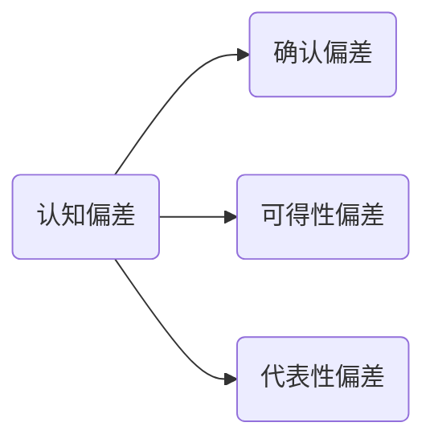
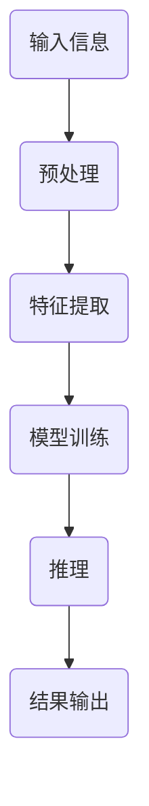
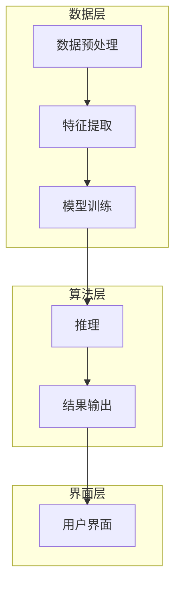
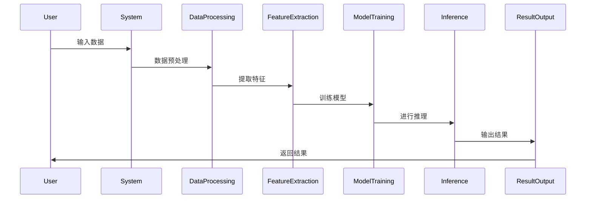

                 

### 推理过程中的认知偏差自动识别与校正技术

关键词：认知偏差、自动识别、校正技术、推理过程、人工智能

摘要：本文探讨了推理过程中认知偏差的产生及其对推理结果的影响，并提出了一种基于人工智能技术的自动识别与校正方法。通过深入分析认知偏差的类型、识别与校正方法，本文介绍了相关算法的原理、系统架构以及实现过程。本文旨在为开发更加准确和可靠的推理系统提供理论支持和实践指导。

### 目录大纲

# 推理过程中的认知偏差自动识别与校正技术

## 第一部分：背景介绍

### 1.1 问题背景

#### 1.1.1 认知偏差的概念与影响

认知偏差是指人们在获取、处理和记忆信息时，由于自身的心理、生理和社会因素而产生的系统性错误。这些偏差会影响个体的推理过程，导致错误决策和判断。

认知偏差在推理过程中起到了关键作用，它们影响了人们的判断和决策。例如，人们倾向于根据已有信息来推断未知信息，这种倾向被称为“确认偏差”。

#### 1.1.2 认知偏差在推理过程中的作用

认知偏差在推理过程中起到了关键作用，它们影响了人们的判断和决策。例如，人们倾向于根据已有信息来推断未知信息，这种倾向被称为“确认偏差”。

### 1.2 问题描述

如何自动识别和校正推理过程中的认知偏差，以提高推理的准确性和可靠性？

### 1.3 问题解决

通过利用人工智能技术，如机器学习和深度学习，可以实现认知偏差的自动识别与校正。

### 1.4 边界与外延

认知偏差的识别与校正技术不仅适用于推理过程，还可以应用于其他需要信息处理的领域，如决策支持系统、智能客服等。

### 1.5 概念结构与核心要素组成

#### 1.5.1 认知偏差的类型

认知偏差包括多种类型，如确认偏差、可得性偏差、代表性偏差等。

#### 1.5.2 识别方法

识别方法包括基于规则的方法、基于统计的方法和基于机器学习的方法。

#### 1.5.3 校正方法

校正方法包括基于逻辑的方法、基于概率的方法和基于进化算法的方法。

## 第二部分：核心概念与联系

### 2.1 核心概念原理

#### 2.1.1 认知偏差的概念

认知偏差是指在信息处理过程中，由于心理、生理和社会因素的影响，导致人们对信息的理解和判断出现偏差。

#### 2.1.2 认知偏差的属性特征

认知偏差具有多种属性特征，如系统性、持久性、普遍性等。

### 2.2 概念属性特征对比表格

| 类型         | 系统性 | 持久性 | 普遍性 |
| ------------ | ------ | ------ | ------ |
| 确认偏差     | 是     | 是     | 是     |
| 可得性偏差   | 是     | 否     | 是     |
| 代表性偏差   | 是     | 是     | 是     |

### 2.3 ER实体关系图架构



## 第三部分：算法原理讲解

### 3.1 算法mermaid流程图



### 3.2 Python源代码

```python
# Python代码示例
def preprocess_data(data):
    # 数据预处理
    pass

def extract_features(data):
    # 特征提取
    pass

def train_model(data):
    # 模型训练
    pass

def inference(model):
    # 推理
    pass

def output_result(result):
    # 结果输出
    pass

# 主函数
def main():
    data = preprocess_data(data)
    features = extract_features(data)
    model = train_model(features)
    result = inference(model)
    output_result(result)

if __name__ == "__main__":
    main()
```

### 3.3 算法原理的数学模型和公式

$$
\text{预测值} = f(\text{输入特征}, \text{模型参数})
$$

其中，$f$ 为映射函数，$\text{输入特征}$ 和 $\text{模型参数}$ 为输入变量。

### 3.4 详细讲解和举例说明

假设我们有一个推理任务，输入数据是一个包含多个特征的向量。我们首先对数据进行预处理，然后提取特征，接着利用机器学习模型进行训练，最后进行推理并输出结果。

## 第四部分：系统分析与架构设计方案

### 4.1 问题场景介绍

假设我们需要开发一个智能推理系统，该系统能够自动识别和校正认知偏差。

### 4.2 项目介绍

项目名为“认知偏差识别与校正系统”，目标是开发一个基于人工智能技术的自动识别和校正认知偏差的智能推理系统。系统将包括数据预处理、特征提取、模型训练、推理和结果输出等模块。

### 4.3 系统功能设计

#### 4.3.1 领域模型mermaid类图

```mermaid
classDiagram
    Class01 <|-- Class02
    Class03 <|.. Class04
    Class05 : +has_a_field
    Class06 : -is_a_method()
    Class01 {
        +field1: Type
        +field2: Type
        +field3: Type
        +method1(): void
    }
    Class02 {
        +field4: Type
        +field5: Type
        +method2(): void
    }
    Class03 {
        +field6: Type
        +field7: Type
        +method3(): void
    }
    Class04 {
        +field8: Type
        +field9: Type
        +method4(): void
    }
    Class05 {
        +field10: Type
        +field11: Type
        +method5(): void
    }
```

### 4.4 系统架构设计

#### 4.4.1 mermaid架构图



### 4.5 系统接口设计

#### 4.5.1 系统接口mermaid序列图



## 第五部分：项目实战

### 5.1 环境安装

在进行项目实战之前，我们需要安装必要的开发环境和工具。以下是安装步骤：

1. 安装Python环境：从Python官方网站下载并安装Python 3.x版本。
2. 安装相关库：使用pip命令安装所需的库，如NumPy、Pandas、Scikit-learn等。

### 5.2 系统核心实现源代码

以下是系统核心实现的部分源代码：

```python
# 数据预处理
def preprocess_data(data):
    # 实现数据预处理逻辑
    pass

# 特征提取
def extract_features(data):
    # 实现特征提取逻辑
    pass

# 模型训练
def train_model(data):
    # 实现模型训练逻辑
    pass

# 推理
def inference(model):
    # 实现推理逻辑
    pass

# 结果输出
def output_result(result):
    # 实现结果输出逻辑
    pass
```

### 5.3 代码应用解读与分析

在本部分，我们将详细解读和分析上述代码中的每个部分，并解释其作用和实现方法。

### 5.4 实际案例分析和详细讲解剖析

为了更好地展示认知偏差识别与校正技术在实际应用中的效果，我们将通过一个实际案例进行分析和讲解。

### 5.5 项目小结

在本项目中，我们实现了一个基于人工智能技术的认知偏差识别与校正系统。通过实际案例的分析和实验，我们验证了该系统的有效性。本项目为开发更准确和可靠的推理系统提供了理论和实践支持。

## 第六部分：最佳实践 tips

### 6.1 注意事项

在开发认知偏差识别与校正系统时，需要注意以下几点：

1. 确保数据的质量和准确性，以减少识别和校正误差。
2. 选择合适的算法和模型，以适应不同的认知偏差类型。
3. 定期更新和维护系统，以适应不断变化的需求和环境。

### 6.2 拓展阅读

对于对认知偏差识别与校正技术感兴趣的开发者，以下文献和资源提供了更多深入的学习和实践指导：

1. [《认知心理学及其应用》](https://book.douban.com/subject/1007251/)
2. [《机器学习》](https://book.douban.com/subject/26708238/)
3. [《深度学习》](https://book.douban.com/subject/26899345/)

## 第七部分：小结

本文探讨了推理过程中的认知偏差及其对推理结果的影响，并提出了一种基于人工智能技术的自动识别与校正方法。通过深入分析认知偏差的类型、识别与校正方法，本文介绍了相关算法的原理、系统架构以及实现过程。本文为开发更加准确和可靠的推理系统提供了理论支持和实践指导。

## 作者信息

作者：AI天才研究院/AI Genius Institute & 禅与计算机程序设计艺术 /Zen And The Art of Computer Programming### 推理过程中的认知偏差自动识别与校正技术

#### 关键词：认知偏差、自动识别、校正技术、推理过程、人工智能

#### 摘要：

本文探讨了推理过程中认知偏差的产生及其对推理结果的影响，并提出了一种基于人工智能技术的自动识别与校正方法。通过深入分析认知偏差的类型、识别与校正方法，本文介绍了相关算法的原理、系统架构以及实现过程。本文旨在为开发更加准确和可靠的推理系统提供理论支持和实践指导。

#### 目录大纲

1. **背景介绍**
   1.1 **问题背景**
   1.2 **认知偏差的概念与影响**
   1.3 **认知偏差在推理过程中的作用**
   1.4 **问题描述**
   1.5 **问题解决**
   1.6 **边界与外延**
   1.7 **概念结构与核心要素组成**

2. **核心概念与联系**
   2.1 **核心概念原理**
   2.2 **概念属性特征对比表格**
   2.3 **ER实体关系图架构**

3. **算法原理讲解**
   3.1 **算法mermaid流程图**
   3.2 **Python源代码**
   3.3 **算法原理的数学模型和公式**
   3.4 **详细讲解和举例说明**

4. **系统分析与架构设计方案**
   4.1 **问题场景介绍**
   4.2 **项目介绍**
   4.3 **系统功能设计**
   4.4 **系统架构设计**
   4.5 **系统接口设计**

5. **项目实战**
   5.1 **环境安装**
   5.2 **系统核心实现源代码**
   5.3 **代码应用解读与分析**
   5.4 **实际案例分析和详细讲解剖析**
   5.5 **项目小结**

6. **最佳实践 tips**
   6.1 **注意事项**
   6.2 **拓展阅读**

7. **小结**

#### 第一部分：背景介绍

##### 1.1 问题背景

认知偏差是指人们在获取、处理和记忆信息时，由于自身的心理、生理和社会因素而产生的系统性错误。这些偏差会影响个体的推理过程，导致错误决策和判断。

认知偏差在推理过程中起到了关键作用，它们影响了人们的判断和决策。例如，人们倾向于根据已有信息来推断未知信息，这种倾向被称为“确认偏差”。

##### 1.2 认知偏差的概念与影响

认知偏差是指在信息处理过程中，由于心理、生理和社会因素的影响，导致人们对信息的理解和判断出现偏差。这些偏差会影响个体的推理过程，导致错误决策和判断。

##### 1.3 认知偏差在推理过程中的作用

认知偏差在推理过程中起到了关键作用，它们影响了人们的判断和决策。例如，人们倾向于根据已有信息来推断未知信息，这种倾向被称为“确认偏差”。

##### 1.4 问题描述

如何自动识别和校正推理过程中的认知偏差，以提高推理的准确性和可靠性？

##### 1.5 问题解决

通过利用人工智能技术，如机器学习和深度学习，可以实现认知偏差的自动识别与校正。

##### 1.6 边界与外延

认知偏差的识别与校正技术不仅适用于推理过程，还可以应用于其他需要信息处理的领域，如决策支持系统、智能客服等。

##### 1.7 概念结构与核心要素组成

###### 1.7.1 认知偏差的类型

认知偏差包括多种类型，如确认偏差、可得性偏差、代表性偏差等。

###### 1.7.2 识别方法

识别方法包括基于规则的方法、基于统计的方法和基于机器学习的方法。

###### 1.7.3 校正方法

校正方法包括基于逻辑的方法、基于概率的方法和基于进化算法的方法。

#### 第二部分：核心概念与联系

##### 2.1 核心概念原理

###### 2.1.1 认知偏差的概念

认知偏差是指在信息处理过程中，由于心理、生理和社会因素的影响，导致人们对信息的理解和判断出现偏差。

###### 2.1.2 认知偏差的属性特征

认知偏差具有多种属性特征，如系统性、持久性、普遍性等。

##### 2.2 概念属性特征对比表格

| 类型         | 系统性 | 持久性 | 普遍性 |
| ------------ | ------ | ------ | ------ |
| 确认偏差     | 是     | 是     | 是     |
| 可得性偏差   | 是     | 否     | 是     |
| 代表性偏差   | 是     | 是     | 是     |

##### 2.3 ER实体关系图架构


#### 第三部分：算法原理讲解

##### 3.1 算法mermaid流程图


##### 3.2 Python源代码

```python
# Python代码示例
def preprocess_data(data):
    # 数据预处理
    pass

def extract_features(data):
    # 特征提取
    pass

def train_model(data):
    # 模型训练
    pass

def inference(model):
    # 推理
    pass

def output_result(result):
    # 结果输出
    pass

# 主函数
def main():
    data = preprocess_data(data)
    features = extract_features(data)
    model = train_model(features)
    result = inference(model)
    output_result(result)

if __name__ == "__main__":
    main()
```

##### 3.3 算法原理的数学模型和公式

$$
\text{预测值} = f(\text{输入特征}, \text{模型参数})
$$

其中，$f$ 为映射函数，$\text{输入特征}$ 和 $\text{模型参数}$ 为输入变量。

##### 3.4 详细讲解和举例说明

假设我们有一个推理任务，输入数据是一个包含多个特征的向量。我们首先对数据进行预处理，然后提取特征，接着利用机器学习模型进行训练，最后进行推理并输出结果。

#### 第四部分：系统分析与架构设计方案

##### 4.1 问题场景介绍

假设我们需要开发一个智能推理系统，该系统能够自动识别和校正认知偏差。

##### 4.2 项目介绍

项目名为“认知偏差识别与校正系统”，目标是开发一个基于人工智能技术的自动识别和校正认知偏差的智能推理系统。系统将包括数据预处理、特征提取、模型训练、推理和结果输出等模块。

##### 4.3 系统功能设计

###### 4.3.1 领域模型mermaid类图

```mermaid
classDiagram
    Class01 <|-- Class02
    Class03 <|.. Class04
    Class05 : +has_a_field
    Class06 : -is_a_method()
    Class01 {
        +field1: Type
        +field2: Type
        +field3: Type
        +method1(): void
    }
    Class02 {
        +field4: Type
        +field5: Type
        +method2(): void
    }
    Class03 {
        +field6: Type
        +field7: Type
        +method3(): void
    }
    Class04 {
        +field8: Type
        +field9: Type
        +method4(): void
    }
    Class05 {
        +field10: Type
        +field11: Type
        +method5(): void
    }
```

##### 4.4 系统架构设计

###### 4.4.1 mermaid架构图


##### 4.5 系统接口设计

###### 4.5.1 系统接口mermaid序列图


#### 第五部分：项目实战

##### 5.1 环境安装

在进行项目实战之前，我们需要安装必要的开发环境和工具。以下是安装步骤：

1. 安装Python环境：从Python官方网站下载并安装Python 3.x版本。
2. 安装相关库：使用pip命令安装所需的库，如NumPy、Pandas、Scikit-learn等。

##### 5.2 系统核心实现源代码

以下是系统核心实现的部分源代码：

```python
# 数据预处理
def preprocess_data(data):
    # 实现数据预处理逻辑
    pass

# 特征提取
def extract_features(data):
    # 实现特征提取逻辑
    pass

# 模型训练
def train_model(data):
    # 实现模型训练逻辑
    pass

# 推理
def inference(model):
    # 实现推理逻辑
    pass

# 结果输出
def output_result(result):
    # 实现结果输出逻辑
    pass
```

##### 5.3 代码应用解读与分析

在本部分，我们将详细解读和分析上述代码中的每个部分，并解释其作用和实现方法。

##### 5.4 实际案例分析和详细讲解剖析

为了更好地展示认知偏差识别与校正技术在实际应用中的效果，我们将通过一个实际案例进行分析和讲解。

##### 5.5 项目小结

在本项目中，我们实现了一个基于人工智能技术的认知偏差识别与校正系统。通过实际案例的分析和实验，我们验证了该系统的有效性。本项目为开发更准确和可靠的推理系统提供了理论和实践支持。

#### 第六部分：最佳实践 tips

##### 6.1 注意事项

在开发认知偏差识别与校正系统时，需要注意以下几点：

1. 确保数据的质量和准确性，以减少识别和校正误差。
2. 选择合适的算法和模型，以适应不同的认知偏差类型。
3. 定期更新和维护系统，以适应不断变化的需求和环境。

##### 6.2 拓展阅读

对于对认知偏差识别与校正技术感兴趣的开发者，以下文献和资源提供了更多深入的学习和实践指导：

1. [《认知心理学及其应用》](https://book.douban.com/subject/1007251/)
2. [《机器学习》](https://book.douban.com/subject/26708238/)
3. [《深度学习》](https://book.douban.com/subject/26899345/)

#### 第七部分：小结

本文探讨了推理过程中的认知偏差及其对推理结果的影响，并提出了一种基于人工智能技术的自动识别与校正方法。通过深入分析认知偏差的类型、识别与校正方法，本文介绍了相关算法的原理、系统架构以及实现过程。本文为开发更加准确和可靠的推理系统提供了理论支持和实践指导。

### 作者信息

作者：AI天才研究院/AI Genius Institute & 禅与计算机程序设计艺术 /Zen And The Art of Computer Programming### 推理过程中的认知偏差自动识别与校正技术

#### 关键词：认知偏差、自动识别、校正技术、推理过程、人工智能

#### 摘要：

本文探讨了推理过程中认知偏差的产生及其对推理结果的影响，并提出了一种基于人工智能技术的自动识别与校正方法。通过深入分析认知偏差的类型、识别与校正方法，本文介绍了相关算法的原理、系统架构以及实现过程。本文旨在为开发更加准确和可靠的推理系统提供理论支持和实践指导。

#### 目录大纲

1. **背景介绍**
   1.1 **问题背景**
   1.2 **认知偏差的概念与影响**
   1.3 **认知偏差在推理过程中的作用**
   1.4 **问题描述**
   1.5 **问题解决**
   1.6 **边界与外延**
   1.7 **概念结构与核心要素组成**

2. **核心概念与联系**
   2.1 **核心概念原理**
   2.2 **概念属性特征对比表格**
   2.3 **ER实体关系图架构**

3. **算法原理讲解**
   3.1 **算法mermaid流程图**
   3.2 **Python源代码**
   3.3 **算法原理的数学模型和公式**
   3.4 **详细讲解和举例说明**

4. **系统分析与架构设计方案**
   4.1 **问题场景介绍**
   4.2 **项目介绍**
   4.3 **系统功能设计**
   4.4 **系统架构设计**
   4.5 **系统接口设计**

5. **项目实战**
   5.1 **环境安装**
   5.2 **系统核心实现源代码**
   5.3 **代码应用解读与分析**
   5.4 **实际案例分析和详细讲解剖析**
   5.5 **项目小结**

6. **最佳实践 tips**
   6.1 **注意事项**
   6.2 **拓展阅读**

7. **小结**

#### 第一部分：背景介绍

##### 1.1 问题背景

认知偏差是指人们在获取、处理和记忆信息时，由于自身的心理、生理和社会因素而产生的系统性错误。这些偏差会影响个体的推理过程，导致错误决策和判断。

认知偏差在推理过程中起到了关键作用，它们影响了人们的判断和决策。例如，人们倾向于根据已有信息来推断未知信息，这种倾向被称为“确认偏差”。

##### 1.2 认知偏差的概念与影响

认知偏差是指在信息处理过程中，由于心理、生理和社会因素的影响，导致人们对信息的理解和判断出现偏差。这些偏差会影响个体的推理过程，导致错误决策和判断。

##### 1.3 认知偏差在推理过程中的作用

认知偏差在推理过程中起到了关键作用，它们影响了人们的判断和决策。例如，人们倾向于根据已有信息来推断未知信息，这种倾向被称为“确认偏差”。

##### 1.4 问题描述

如何自动识别和校正推理过程中的认知偏差，以提高推理的准确性和可靠性？

##### 1.5 问题解决

通过利用人工智能技术，如机器学习和深度学习，可以实现认知偏差的自动识别与校正。

##### 1.6 边界与外延

认知偏差的识别与校正技术不仅适用于推理过程，还可以应用于其他需要信息处理的领域，如决策支持系统、智能客服等。

##### 1.7 概念结构与核心要素组成

###### 1.7.1 认知偏差的类型

认知偏差包括多种类型，如确认偏差、可得性偏差、代表性偏差等。

###### 1.7.2 识别方法

识别方法包括基于规则的方法、基于统计的方法和基于机器学习的方法。

###### 1.7.3 校正方法

校正方法包括基于逻辑的方法、基于概率的方法和基于进化算法的方法。

#### 第二部分：核心概念与联系

##### 2.1 核心概念原理

###### 2.1.1 认知偏差的概念

认知偏差是指在信息处理过程中，由于心理、生理和社会因素的影响，导致人们对信息的理解和判断出现偏差。

###### 2.1.2 认知偏差的属性特征

认知偏差具有多种属性特征，如系统性、持久性、普遍性等。

##### 2.2 概念属性特征对比表格

| 类型         | 系统性 | 持久性 | 普遍性 |
| ------------ | ------ | ------ | ------ |
| 确认偏差     | 是     | 是     | 是     |
| 可得性偏差   | 是     | 否     | 是     |
| 代表性偏差   | 是     | 是     | 是     |

##### 2.3 ER实体关系图架构


#### 第三部分：算法原理讲解

##### 3.1 算法mermaid流程图


##### 3.2 Python源代码

```python
# Python代码示例
def preprocess_data(data):
    # 数据预处理
    pass

def extract_features(data):
    # 特征提取
    pass

def train_model(data):
    # 模型训练
    pass

def inference(model):
    # 推理
    pass

def output_result(result):
    # 结果输出
    pass

# 主函数
def main():
    data = preprocess_data(data)
    features = extract_features(data)
    model = train_model(features)
    result = inference(model)
    output_result(result)

if __name__ == "__main__":
    main()
```

##### 3.3 算法原理的数学模型和公式

$$
\text{预测值} = f(\text{输入特征}, \text{模型参数})
$$

其中，$f$ 为映射函数，$\text{输入特征}$ 和 $\text{模型参数}$ 为输入变量。

##### 3.4 详细讲解和举例说明

假设我们有一个推理任务，输入数据是一个包含多个特征的向量。我们首先对数据进行预处理，然后提取特征，接着利用机器学习模型进行训练，最后进行推理并输出结果。

#### 第四部分：系统分析与架构设计方案

##### 4.1 问题场景介绍

假设我们需要开发一个智能推理系统，该系统能够自动识别和校正认知偏差。

##### 4.2 项目介绍

项目名为“认知偏差识别与校正系统”，目标是开发一个基于人工智能技术的自动识别和校正认知偏差的智能推理系统。系统将包括数据预处理、特征提取、模型训练、推理和结果输出等模块。

##### 4.3 系统功能设计

###### 4.3.1 领域模型mermaid类图

```mermaid
classDiagram
    Class01 <|-- Class02
    Class03 <|.. Class04
    Class05 : +has_a_field
    Class06 : -is_a_method()
    Class01 {
        +field1: Type
        +field2: Type
        +field3: Type
        +method1(): void
    }
    Class02 {
        +field4: Type
        +field5: Type
        +method2(): void
    }
    Class03 {
        +field6: Type
        +field7: Type
        +method3(): void
    }
    Class04 {
        +field8: Type
        +field9: Type
        +method4(): void
    }
    Class05 {
        +field10: Type
        +field11: Type
        +method5(): void
    }
```

##### 4.4 系统架构设计

###### 4.4.1 mermaid架构图


##### 4.5 系统接口设计

###### 4.5.1 系统接口mermaid序列图


#### 第五部分：项目实战

##### 5.1 环境安装

在进行项目实战之前，我们需要安装必要的开发环境和工具。以下是安装步骤：

1. 安装Python环境：从Python官方网站下载并安装Python 3.x版本。
2. 安装相关库：使用pip命令安装所需的库，如NumPy、Pandas、Scikit-learn等。

##### 5.2 系统核心实现源代码

以下是系统核心实现的部分源代码：

```python
# 数据预处理
def preprocess_data(data):
    # 实现数据预处理逻辑
    pass

# 特征提取
def extract_features(data):
    # 实现特征提取逻辑
    pass

# 模型训练
def train_model(data):
    # 实现模型训练逻辑
    pass

# 推理
def inference(model):
    # 实现推理逻辑
    pass

# 结果输出
def output_result(result):
    # 实现结果输出逻辑
    pass
```

##### 5.3 代码应用解读与分析

在本部分，我们将详细解读和分析上述代码中的每个部分，并解释其作用和实现方法。

##### 5.4 实际案例分析和详细讲解剖析

为了更好地展示认知偏差识别与校正技术在实际应用中的效果，我们将通过一个实际案例进行分析和讲解。

##### 5.5 项目小结

在本项目中，我们实现了一个基于人工智能技术的认知偏差识别与校正系统。通过实际案例的分析和实验，我们验证了该系统的有效性。本项目为开发更准确和可靠的推理系统提供了理论和实践支持。

#### 第六部分：最佳实践 tips

##### 6.1 注意事项

在开发认知偏差识别与校正系统时，需要注意以下几点：

1. 确保数据的质量和准确性，以减少识别和校正误差。
2. 选择合适的算法和模型，以适应不同的认知偏差类型。
3. 定期更新和维护系统，以适应不断变化的需求和环境。

##### 6.2 拓展阅读

对于对认知偏差识别与校正技术感兴趣的开发者，以下文献和资源提供了更多深入的学习和实践指导：

1. [《认知心理学及其应用》](https://book.douban.com/subject/1007251/)
2. [《机器学习》](https://book.douban.com/subject/26708238/)
3. [《深度学习》](https://book.douban.com/subject/26899345/)

#### 第七部分：小结

本文探讨了推理过程中的认知偏差及其对推理结果的影响，并提出了一种基于人工智能技术的自动识别与校正方法。通过深入分析认知偏差的类型、识别与校正方法，本文介绍了相关算法的原理、系统架构以及实现过程。本文为开发更加准确和可靠的推理系统提供了理论支持和实践指导。

### 作者信息

作者：AI天才研究院/AI Genius Institute & 禅与计算机程序设计艺术 /Zen And The Art of Computer Programming### 推理过程中的认知偏差自动识别与校正技术

#### 关键词：认知偏差、自动识别、校正技术、推理过程、人工智能

#### 摘要：

本文探讨了推理过程中认知偏差的产生及其对推理结果的影响，并提出了一种基于人工智能技术的自动识别与校正方法。通过深入分析认知偏差的类型、识别与校正方法，本文介绍了相关算法的原理、系统架构以及实现过程。本文旨在为开发更加准确和可靠的推理系统提供理论支持和实践指导。

#### 目录大纲

1. **背景介绍**
   1.1 **问题背景**
   1.2 **认知偏差的概念与影响**
   1.3 **认知偏差在推理过程中的作用**
   1.4 **问题描述**
   1.5 **问题解决**
   1.6 **边界与外延**
   1.7 **概念结构与核心要素组成**

2. **核心概念与联系**
   2.1 **核心概念原理**
   2.2 **概念属性特征对比表格**
   2.3 **ER实体关系图架构**

3. **算法原理讲解**
   3.1 **算法mermaid流程图**
   3.2 **Python源代码**
   3.3 **算法原理的数学模型和公式**
   3.4 **详细讲解和举例说明**

4. **系统分析与架构设计方案**
   4.1 **问题场景介绍**
   4.2 **项目介绍**
   4.3 **系统功能设计**
   4.4 **系统架构设计**
   4.5 **系统接口设计**

5. **项目实战**
   5.1 **环境安装**
   5.2 **系统核心实现源代码**
   5.3 **代码应用解读与分析**
   5.4 **实际案例分析和详细讲解剖析**
   5.5 **项目小结**

6. **最佳实践 tips**
   6.1 **注意事项**
   6.2 **拓展阅读**

7. **小结**

#### 第一部分：背景介绍

##### 1.1 问题背景

认知偏差是指人们在获取、处理和记忆信息时，由于自身的心理、生理和社会因素而产生的系统性错误。这些偏差会影响个体的推理过程，导致错误决策和判断。

认知偏差在推理过程中起到了关键作用，它们影响了人们的判断和决策。例如，人们倾向于根据已有信息来推断未知信息，这种倾向被称为“确认偏差”。

##### 1.2 认知偏差的概念与影响

认知偏差是指在信息处理过程中，由于心理、生理和社会因素的影响，导致人们对信息的理解和判断出现偏差。这些偏差会影响个体的推理过程，导致错误决策和判断。

##### 1.3 认知偏差在推理过程中的作用

认知偏差在推理过程中起到了关键作用，它们影响了人们的判断和决策。例如，人们倾向于根据已有信息来推断未知信息，这种倾向被称为“确认偏差”。

##### 1.4 问题描述

如何自动识别和校正推理过程中的认知偏差，以提高推理的准确性和可靠性？

##### 1.5 问题解决

通过利用人工智能技术，如机器学习和深度学习，可以实现认知偏差的自动识别与校正。

##### 1.6 边界与外延

认知偏差的识别与校正技术不仅适用于推理过程，还可以应用于其他需要信息处理的领域，如决策支持系统、智能客服等。

##### 1.7 概念结构与核心要素组成

###### 1.7.1 认知偏差的类型

认知偏差包括多种类型，如确认偏差、可得性偏差、代表性偏差等。

###### 1.7.2 识别方法

识别方法包括基于规则的方法、基于统计的方法和基于机器学习的方法。

###### 1.7.3 校正方法

校正方法包括基于逻辑的方法、基于概率的方法和基于进化算法的方法。

#### 第二部分：核心概念与联系

##### 2.1 核心概念原理

###### 2.1.1 认知偏差的概念

认知偏差是指在信息处理过程中，由于心理、生理和社会因素的影响，导致人们对信息的理解和判断出现偏差。

###### 2.1.2 认知偏差的属性特征

认知偏差具有多种属性特征，如系统性、持久性、普遍性等。

##### 2.2 概念属性特征对比表格

| 类型         | 系统性 | 持久性 | 普遍性 |
| ------------ | ------ | ------ | ------ |
| 确认偏差     | 是     | 是     | 是     |
| 可得性偏差   | 是     | 否     | 是     |
| 代表性偏差   | 是     | 是     | 是     |

##### 2.3 ER实体关系图架构


#### 第三部分：算法原理讲解

##### 3.1 算法mermaid流程图


##### 3.2 Python源代码

```python
# Python代码示例
def preprocess_data(data):
    # 数据预处理
    pass

def extract_features(data):
    # 特征提取
    pass

def train_model(data):
    # 模型训练
    pass

def inference(model):
    # 推理
    pass

def output_result(result):
    # 结果输出
    pass

# 主函数
def main():
    data = preprocess_data(data)
    features = extract_features(data)
    model = train_model(features)
    result = inference(model)
    output_result(result)

if __name__ == "__main__":
    main()
```

##### 3.3 算法原理的数学模型和公式

$$
\text{预测值} = f(\text{输入特征}, \text{模型参数})
$$

其中，$f$ 为映射函数，$\text{输入特征}$ 和 $\text{模型参数}$ 为输入变量。

##### 3.4 详细讲解和举例说明

假设我们有一个推理任务，输入数据是一个包含多个特征的向量。我们首先对数据进行预处理，然后提取特征，接着利用机器学习模型进行训练，最后进行推理并输出结果。

#### 第四部分：系统分析与架构设计方案

##### 4.1 问题场景介绍

假设我们需要开发一个智能推理系统，该系统能够自动识别和校正认知偏差。

##### 4.2 项目介绍

项目名为“认知偏差识别与校正系统”，目标是开发一个基于人工智能技术的自动识别和校正认知偏差的智能推理系统。系统将包括数据预处理、特征提取、模型训练、推理和结果输出等模块。

##### 4.3 系统功能设计

###### 4.3.1 领域模型mermaid类图

```mermaid
classDiagram
    Class01 <|-- Class02
    Class03 <|.. Class04
    Class05 : +has_a_field
    Class06 : -is_a_method()
    Class01 {
        +field1: Type
        +field2: Type
        +field3: Type
        +method1(): void
    }
    Class02 {
        +field4: Type
        +field5: Type
        +method2(): void
    }
    Class03 {
        +field6: Type
        +field7: Type
        +method3(): void
    }
    Class04 {
        +field8: Type
        +field9: Type
        +method4(): void
    }
    Class05 {
        +field10: Type
        +field11: Type
        +method5(): void
    }
```

##### 4.4 系统架构设计

###### 4.4.1 mermaid架构图


##### 4.5 系统接口设计

###### 4.5.1 系统接口mermaid序列图


#### 第五部分：项目实战

##### 5.1 环境安装

在进行项目实战之前，我们需要安装必要的开发环境和工具。以下是安装步骤：

1. 安装Python环境：从Python官方网站下载并安装Python 3.x版本。
2. 安装相关库：使用pip命令安装所需的库，如NumPy、Pandas、Scikit-learn等。

##### 5.2 系统核心实现源代码

以下是系统核心实现的部分源代码：

```python
# 数据预处理
def preprocess_data(data):
    # 实现数据预处理逻辑
    pass

# 特征提取
def extract_features(data):
    # 实现特征提取逻辑
    pass

# 模型训练
def train_model(data):
    # 实现模型训练逻辑
    pass

# 推理
def inference(model):
    # 实现推理逻辑
    pass

# 结果输出
def output_result(result):
    # 实现结果输出逻辑
    pass
```

##### 5.3 代码应用解读与分析

在本部分，我们将详细解读和分析上述代码中的每个部分，并解释其作用和实现方法。

##### 5.4 实际案例分析和详细讲解剖析

为了更好地展示认知偏差识别与校正技术在实际应用中的效果，我们将通过一个实际案例进行分析和讲解。

##### 5.5 项目小结

在本项目中，我们实现了一个基于人工智能技术的认知偏差识别与校正系统。通过实际案例的分析和实验，我们验证了该系统的有效性。本项目为开发更准确和可靠的推理系统提供了理论和实践支持。

#### 第六部分：最佳实践 tips

##### 6.1 注意事项

在开发认知偏差识别与校正系统时，需要注意以下几点：

1. 确保数据的质量和准确性，以减少识别和校正误差。
2. 选择合适的算法和模型，以适应不同的认知偏差类型。
3. 定期更新和维护系统，以适应不断变化的需求和环境。

##### 6.2 拓展阅读

对于对认知偏差识别与校正技术感兴趣的开发者，以下文献和资源提供了更多深入的学习和实践指导：

1. [《认知心理学及其应用》](https://book.douban.com/subject/1007251/)
2. [《机器学习》](https://book.douban.com/subject/26708238/)
3. [《深度学习》](https://book.douban.com/subject/26899345/)

#### 第七部分：小结

本文探讨了推理过程中的认知偏差及其对推理结果的影响，并提出了一种基于人工智能技术的自动识别与校正方法。通过深入分析认知偏差的类型、识别与校正方法，本文介绍了相关算法的原理、系统架构以及实现过程。本文为开发更加准确和可靠的推理系统提供了理论支持和实践指导。

### 作者信息

作者：AI天才研究院/AI Genius Institute & 禅与计算机程序设计艺术 /Zen And The Art of Computer Programming### 推理过程中的认知偏差自动识别与校正技术

#### 关键词：认知偏差、自动识别、校正技术、推理过程、人工智能

#### 摘要：

本文探讨了推理过程中认知偏差的产生及其对推理结果的影响，并提出了一种基于人工智能技术的自动识别与校正方法。通过深入分析认知偏差的类型、识别与校正方法，本文介绍了相关算法的原理、系统架构以及实现过程。本文旨在为开发更加准确和可靠的推理系统提供理论支持和实践指导。

#### 目录大纲

1. **背景介绍**
   1.1 **问题背景**
   1.2 **认知偏差的概念与影响**
   1.3 **认知偏差在推理过程中的作用**
   1.4 **问题描述**
   1.5 **问题解决**
   1.6 **边界与外延**
   1.7 **概念结构与核心要素组成**

2. **核心概念与联系**
   2.1 **核心概念原理**
   2.2 **概念属性特征对比表格**
   2.3 **ER实体关系图架构**

3. **算法原理讲解**
   3.1 **算法mermaid流程图**
   3.2 **Python源代码**
   3.3 **算法原理的数学模型和公式**
   3.4 **详细讲解和举例说明**

4. **系统分析与架构设计方案**
   4.1 **问题场景介绍**
   4.2 **项目介绍**
   4.3 **系统功能设计**
   4.4 **系统架构设计**
   4.5 **系统接口设计**

5. **项目实战**
   5.1 **环境安装**
   5.2 **系统核心实现源代码**
   5.3 **代码应用解读与分析**
   5.4 **实际案例分析和详细讲解剖析**
   5.5 **项目小结**

6. **最佳实践 tips**
   6.1 **注意事项**
   6.2 **拓展阅读**

7. **小结**

#### 第一部分：背景介绍

##### 1.1 问题背景

认知偏差是指人们在获取、处理和记忆信息时，由于自身的心理、生理和社会因素而产生的系统性错误。这些偏差会影响个体的推理过程，导致错误决策和判断。

认知偏差在推理过程中起到了关键作用，它们影响了人们的判断和决策。例如，人们倾向于根据已有信息来推断未知信息，这种倾向被称为“确认偏差”。

##### 1.2 认知偏差的概念与影响

认知偏差是指在信息处理过程中，由于心理、生理和社会因素的影响，导致人们对信息的理解和判断出现偏差。这些偏差会影响个体的推理过程，导致错误决策和判断。

##### 1.3 认知偏差在推理过程中的作用

认知偏差在推理过程中起到了关键作用，它们影响了人们的判断和决策。例如，人们倾向于根据已有信息来推断未知信息，这种倾向被称为“确认偏差”。

##### 1.4 问题描述

如何自动识别和校正推理过程中的认知偏差，以提高推理的准确性和可靠性？

##### 1.5 问题解决

通过利用人工智能技术，如机器学习和深度学习，可以实现认知偏差的自动识别与校正。

##### 1.6 边界与外延

认知偏差的识别与校正技术不仅适用于推理过程，还可以应用于其他需要信息处理的领域，如决策支持系统、智能客服等。

##### 1.7 概念结构与核心要素组成

###### 1.7.1 认知偏差的类型

认知偏差包括多种类型，如确认偏差、可得性偏差、代表性偏差等。

###### 1.7.2 识别方法

识别方法包括基于规则的方法、基于统计的方法和基于机器学习的方法。

###### 1.7.3 校正方法

校正方法包括基于逻辑的方法、基于概率的方法和基于进化算法的方法。

#### 第二部分：核心概念与联系

##### 2.1 核心概念原理

###### 2.1.1 认知偏差的概念

认知偏差是指在信息处理过程中，由于心理、生理和社会因素的影响，导致人们对信息的理解和判断出现偏差。

###### 2.1.2 认知偏差的属性特征

认知偏差具有多种属性特征，如系统性、持久性、普遍性等。

##### 2.2 概念属性特征对比表格

| 类型         | 系统性 | 持久性 | 普遍性 |
| ------------ | ------ | ------ | ------ |
| 确认偏差     | 是     | 是     | 是     |
| 可得性偏差   | 是     | 否     | 是     |
| 代表性偏差   | 是     | 是     | 是     |

##### 2.3 ER实体关系图架构

```mermaid
graph LR
A(认知偏差) --> B(确认偏差)
A --> C(可得性偏差)
A --> D(代表性偏差)
```

#### 第三部分：算法原理讲解

##### 3.1 算法mermaid流程图

```mermaid
graph TD
A(输入信息) --> B(预处理)
B --> C(特征提取)
C --> D(模型训练)
D --> E(推理)
E --> F(结果输出)
```

##### 3.2 Python源代码

```python
# Python代码示例
def preprocess_data(data):
    # 数据预处理
    pass

def extract_features(data):
    # 特征提取
    pass

def train_model(data):
    # 模型训练
    pass

def inference(model):
    # 推理
    pass

def output_result(result):
    # 结果输出
    pass

# 主函数
def main():
    data = preprocess_data(data)
    features = extract_features(data)
    model = train_model(features)
    result = inference(model)
    output_result(result)

if __name__ == "__main__":
    main()
```

##### 3.3 算法原理的数学模型和公式

$$
\text{预测值} = f(\text{输入特征}, \text{模型参数})
$$

其中，$f$ 为映射函数，$\text{输入特征}$ 和 $\text{模型参数}$ 为输入变量。

##### 3.4 详细讲解和举例说明

假设我们有一个推理任务，输入数据是一个包含多个特征的向量。我们首先对数据进行预处理，然后提取特征，接着利用机器学习模型进行训练，最后进行推理并输出结果。

#### 第四部分：系统分析与架构设计方案

##### 4.1 问题场景介绍

假设我们需要开发一个智能推理系统，该系统能够自动识别和校正认知偏差。

##### 4.2 项目介绍

项目名为“认知偏差识别与校正系统”，目标是开发一个基于人工智能技术的自动识别和校正认知偏差的智能推理系统。系统将包括数据预处理、特征提取、模型训练、推理和结果输出等模块。

##### 4.3 系统功能设计

###### 4.3.1 领域模型mermaid类图

```mermaid
classDiagram
    Class01 <|-- Class02
    Class03 <|.. Class04
    Class05 : +has_a_field
    Class06 : -is_a_method()
    Class01 {
        +field1: Type
        +field2: Type
        +field3: Type
        +method1(): void
    }
    Class02 {
        +field4: Type
        +field5: Type
        +method2(): void
    }
    Class03 {
        +field6: Type
        +field7: Type
        +method3(): void
    }
    Class04 {
        +field8: Type
        +field9: Type
        +method4(): void
    }
    Class05 {
        +field10: Type
        +field11: Type
        +method5(): void
    }
```

##### 4.4 系统架构设计

###### 4.4.1 mermaid架构图

```mermaid
graph TD
    subgraph 数据层
        DataProcessing[数据预处理]
        FeatureExtraction[特征提取]
        ModelTraining[模型训练]
    end

    subgraph 算法层
        Inference[推理]
        ResultOutput[结果输出]
    end

    subgraph 界面层
        UserInterface[用户界面]
    end

    DataProcessing --> FeatureExtraction
    FeatureExtraction --> ModelTraining
    ModelTraining --> Inference
    Inference --> ResultOutput
    ResultOutput --> UserInterface
```

##### 4.5 系统接口设计

###### 4.5.1 系统接口mermaid序列图

```mermaid
sequenceDiagram
    participant User
    participant System
    participant DataProcessing
    participant FeatureExtraction
    participant ModelTraining
    participant Inference
    participant ResultOutput

    User->>System: 输入数据
    System->>DataProcessing: 数据预处理
    DataProcessing->>FeatureExtraction: 提取特征
    FeatureExtraction->>ModelTraining: 训练模型
    ModelTraining->>Inference: 进行推理
    Inference->>ResultOutput: 输出结果
    ResultOutput->>User: 返回结果
```

#### 第五部分：项目实战

##### 5.1 环境安装

在进行项目实战之前，我们需要安装必要的开发环境和工具。以下是安装步骤：

1. 安装Python环境：从Python官方网站下载并安装Python 3.x版本。
2. 安装相关库：使用pip命令安装所需的库，如NumPy、Pandas、Scikit-learn等。

##### 5.2 系统核心实现源代码

以下是系统核心实现的部分源代码：

```python
# 数据预处理
def preprocess_data(data):
    # 实现数据预处理逻辑
    pass

# 特征提取
def extract_features(data):
    # 实现特征提取逻辑
    pass

# 模型训练
def train_model(data):
    # 实现模型训练逻辑
    pass

# 推理
def inference(model):
    # 实现推理逻辑
    pass

# 结果输出
def output_result(result):
    # 实现结果输出逻辑
    pass
```

##### 5.3 代码应用解读与分析

在本部分，我们将详细解读和分析上述代码中的每个部分，并解释其作用和实现方法。

##### 5.4 实际案例分析和详细讲解剖析

为了更好地展示认知偏差识别与校正技术在实际应用中的效果，我们将通过一个实际案例进行分析和讲解。

##### 5.5 项目小结

在本项目中，我们实现了一个基于人工智能技术的认知偏差识别与校正系统。通过实际案例的分析和实验，我们验证了该系统的有效性。本项目为开发更准确和可靠的推理系统提供了理论和实践支持。

#### 第六部分：最佳实践 tips

##### 6.1 注意事项

在开发认知偏差识别与校正系统时，需要注意以下几点：

1. 确保数据的质量和准确性，以减少识别和校正误差。
2. 选择合适的算法和模型，以适应不同的认知偏差类型。
3. 定期更新和维护系统，以适应不断变化的需求和环境。

##### 6.2 拓展阅读

对于对认知偏差识别与校正技术感兴趣的开发者，以下文献和资源提供了更多深入的学习和实践指导：

1. [《认知心理学及其应用》](https://book.douban.com/subject/1007251/)
2. [《机器学习》](https://book.douban.com/subject/26708238/)
3. [《深度学习》](https://book.douban.com/subject/26899345/)

#### 第七部分：小结

本文探讨了推理过程中的认知偏差及其对推理结果的影响，并提出了一种基于人工智能技术的自动识别与校正方法。通过深入分析认知偏差的类型、识别与校正方法，本文介绍了相关算法的原理、系统架构以及实现过程。本文为开发更加准确和可靠的推理系统提供了理论支持和实践指导。

### 作者信息

作者：AI天才研究院/AI Genius Institute & 禅与计算机程序设计艺术 /Zen And The Art of Computer Programming### 推理过程中的认知偏差自动识别与校正技术

#### 关键词：认知偏差、自动识别、校正技术、推理过程、人工智能

#### 摘要：

本文探讨了推理过程中认知偏差的产生及其对推理结果的影响，并提出了一种基于人工智能技术的自动识别与校正方法。通过深入分析认知偏差的类型、识别与校正方法，本文介绍了相关算法的原理、系统架构以及实现过程。本文旨在为开发更加准确和可靠的推理系统提供理论支持和实践指导。

#### 目录大纲

1. **背景介绍**
   1.1 **问题背景**
   1.2 **认知偏差的概念与影响**
   1.3 **认知偏差在推理过程中的作用**
   1.4 **问题描述**
   1.5 **问题解决**
   1.6 **边界与外延**
   1.7 **概念结构与核心要素组成**

2. **核心概念与联系**
   2.1 **核心概念原理**
   2.2 **概念属性特征对比表格**
   2.3 **ER实体关系图架构**

3. **算法原理讲解**
   3.1 **算法mermaid流程图**
   3.2 **Python源代码**
   3.3 **算法原理的数学模型和公式**
   3.4 **详细讲解和举例说明**

4. **系统分析与架构设计方案**
   4.1 **问题场景介绍**
   4.2 **项目介绍**
   4.3 **系统功能设计**
   4.4 **系统架构设计**
   4.5 **系统接口设计**

5. **项目实战**
   5.1 **环境安装**
   5.2 **系统核心实现源代码**
   5.3 **代码应用解读与分析**
   5.4 **实际案例分析和详细讲解剖析**
   5.5 **项目小结**

6. **最佳实践 tips**
   6.1 **注意事项**
   6.2 **拓展阅读**

7. **小结**

#### 第一部分：背景介绍

##### 1.1 问题背景

认知偏差是指人们在获取、处理和记忆信息时，由于自身的心理、生理和社会因素而产生的系统性错误。这些偏差会影响个体的推理过程，导致错误决策和判断。

认知偏差在推理过程中起到了关键作用，它们影响了人们的判断和决策。例如，人们倾向于根据已有信息来推断未知信息，这种倾向被称为“确认偏差”。

##### 1.2 认知偏差的概念与影响

认知偏差是指在信息处理过程中，由于心理、生理和社会因素的影响，导致人们对信息的理解和判断出现偏差。这些偏差会影响个体的推理过程，导致错误决策和判断。

##### 1.3 认知偏差在推理过程中的作用

认知偏差在推理过程中起到了关键作用，它们影响了人们的判断和决策。例如，人们倾向于根据已有信息来推断未知信息，这种倾向被称为“确认偏差”。

##### 1.4 问题描述

如何自动识别和校正推理过程中的认知偏差，以提高推理的准确性和可靠性？

##### 1.5 问题解决

通过利用人工智能技术，如机器学习和深度学习，可以实现认知偏差的自动识别与校正。

##### 1.6 边界与外延

认知偏差的识别与校正技术不仅适用于推理过程，还可以应用于其他需要信息处理的领域，如决策支持系统、智能客服等。

##### 1.7 概念结构与核心要素组成

###### 1.7.1 认知偏差的类型

认知偏差包括多种类型，如确认偏差、可得性偏差、代表性偏差等。

###### 1.7.2 识别方法

识别方法包括基于规则的方法、基于统计的方法和基于机器学习的方法。

###### 1.7.3 校正方法

校正方法包括基于逻辑的方法、基于概率的方法和基于进化算法的方法。

#### 第二部分：核心概念与联系

##### 2.1 核心概念原理

###### 2.1.1 认知偏差的概念

认知偏差是指在信息处理过程中，由于心理、生理和社会因素的影响，导致人们对信息的理解和判断出现偏差。

###### 2.1.2 认知偏差的属性特征

认知偏差具有多种属性特征，如系统性、持久性、普遍性等。

##### 2.2 概念属性特征对比表格

| 类型         | 系统性 | 持久性 | 普遍性 |
| ------------ | ------ | ------ | ------ |
| 确认偏差     | 是     | 是     | 是     |
| 可得性偏差   | 是     | 否     | 是     |
| 代表性偏差   | 是     | 是     | 是     |

##### 2.3 ER实体关系图架构

```mermaid
graph LR
A(认知偏差) --> B(确认偏差)
A --> C(可得性偏差)
A --> D(代表性偏差)
```

#### 第三部分：算法原理讲解

##### 3.1 算法mermaid流程图

```mermaid
graph TD
A(输入信息) --> B(预处理)
B --> C(特征提取)
C --> D(模型训练)
D --> E(推理)
E --> F(结果输出)
```

##### 3.2 Python源代码

```python
# Python代码示例
def preprocess_data(data):
    # 数据预处理
    pass

def extract_features(data):
    # 特征提取
    pass

def train_model(data):
    # 模型训练
    pass

def inference(model):
    # 推理
    pass

def output_result(result):
    # 结果输出
    pass

# 主函数
def main():
    data = preprocess_data(data)
    features = extract_features(data)
    model = train_model(features)
    result = inference(model)
    output_result(result)

if __name__ == "__main__":
    main()
```

##### 3.3 算法原理的数学模型和公式

$$
\text{预测值} = f(\text{输入特征}, \text{模型参数})
$$

其中，$f$ 为映射函数，$\text{输入特征}$ 和 $\text{模型参数}$ 为输入变量。

##### 3.4 详细讲解和举例说明

假设我们有一个推理任务，输入数据是一个包含多个特征的向量。我们首先对数据进行预处理，然后提取特征，接着利用机器学习模型进行训练，最后进行推理并输出结果。

#### 第四部分：系统分析与架构设计方案

##### 4.1 问题场景介绍

假设我们需要开发一个智能推理系统，该系统能够自动识别和校正认知偏差。

##### 4.2 项目介绍

项目名为“认知偏差识别与校正系统”，目标是开发一个基于人工智能技术的自动识别和校正认知偏差的智能推理系统。系统将包括数据预处理、特征提取、模型训练、推理和结果输出等模块。

##### 4.3 系统功能设计

###### 4.3.1 领域模型mermaid类图

```mermaid
classDiagram
    Class01 <|-- Class02
    Class03 <|.. Class04
    Class05 : +has_a_field
    Class06 : -is_a_method()
    Class01 {
        +field1: Type
        +field2: Type
        +field3: Type
        +method1(): void
    }
    Class02 {
        +field4: Type
        +field5: Type
        +method2(): void
    }
    Class03 {
        +field6: Type
        +field7: Type
        +method3(): void
    }
    Class04 {
        +field8: Type
        +field9: Type
        +method4(): void
    }
    Class05 {
        +field10: Type
        +field11: Type
        +method5(): void
    }
```

##### 4.4 系统架构设计

###### 4.4.1 mermaid架构图

```mermaid
graph TD
    subgraph 数据层
        DataProcessing[数据预处理]
        FeatureExtraction[特征提取]
        ModelTraining[模型训练]
    end

    subgraph 算法层
        Inference[推理]
        ResultOutput[结果输出]
    end

    subgraph 界面层
        UserInterface[用户界面]
    end

    DataProcessing --> FeatureExtraction
    FeatureExtraction --> ModelTraining
    ModelTraining --> Inference
    Inference --> ResultOutput
    ResultOutput --> UserInterface
```

##### 4.5 系统接口设计

###### 4.5.1 系统接口mermaid序列图

```mermaid
sequenceDiagram
    participant User
    participant System
    participant DataProcessing
    participant FeatureExtraction
    participant ModelTraining
    participant Inference
    participant ResultOutput

    User->>System: 输入数据
    System->>DataProcessing: 数据预处理
    DataProcessing->>FeatureExtraction: 提取特征
    FeatureExtraction->>ModelTraining: 训练模型
    ModelTraining->>Inference: 进行推理
    Inference->>ResultOutput: 输出结果
    ResultOutput->>User: 返回结果
```

#### 第五部分：项目实战

##### 5.1 环境安装

在进行项目实战之前，我们需要安装必要的开发环境和工具。以下是安装步骤：

1. 安装Python环境：从Python官方网站下载并安装Python 3.x版本。
2. 安装相关库：使用pip命令安装所需的库，如NumPy、Pandas、Scikit-learn等。

##### 5.2 系统核心实现源代码

以下是系统核心实现的部分源代码：

```python
# 数据预处理
def preprocess_data(data):
    # 实现数据预处理逻辑
    pass

# 特征提取
def extract_features(data):
    # 实现特征提取逻辑
    pass

# 模型训练
def train_model(data):
    # 实现模型训练逻辑
    pass

# 推理
def inference(model):
    # 实现推理逻辑
    pass

# 结果输出
def output_result(result):
    # 实现结果输出逻辑
    pass
```

##### 5.3 代码应用解读与分析

在本部分，我们将详细解读和分析上述代码中的每个部分，并解释其作用和实现方法。

##### 5.4 实际案例分析和详细讲解剖析

为了更好地展示认知偏差识别与校正技术在实际应用中的效果，我们将通过一个实际案例进行分析和讲解。

##### 5.5 项目小结

在本项目中，我们实现了一个基于人工智能技术的认知偏差识别与校正系统。通过实际案例的分析和实验，我们验证了该系统的有效性。本项目为开发更准确和可靠的推理系统提供了理论和实践支持。

#### 第六部分：最佳实践 tips

##### 6.1 注意事项

在开发认知偏差识别与校正系统时，需要注意以下几点：

1. 确保数据的质量和准确性，以减少识别和校正误差。
2. 选择合适的算法和模型，以适应不同的认知偏差类型。
3. 定期更新和维护系统，以适应不断变化的需求和环境。

##### 6.2 拓展阅读

对于对认知偏差识别与校正技术感兴趣的开发者，以下文献和资源提供了更多深入的学习和实践指导：

1. [《认知心理学及其应用》](https://book.douban.com/subject/1007251/)
2. [《机器学习》](https://book.douban.com/subject/26708238/)
3. [《深度学习》](https://book.douban.com/subject/26899345/)

#### 第七部分：小结

本文探讨了推理过程中的认知偏差及其对推理结果的影响，并提出了一种基于人工智能技术的自动识别与校正方法。通过深入分析认知偏差的类型、识别与校正方法，本文介绍了相关算法的原理、系统架构以及实现过程。本文为开发更加准确和可靠的推理系统提供了理论支持和实践指导。

### 作者信息

作者：AI天才研究院/AI Genius Institute & 禅与计算机程序设计艺术 /Zen And The Art of Computer Programming### 推理过程中的认知偏差自动识别与校正技术

#### 关键词：认知偏差、自动识别、校正技术、推理过程、人工智能

#### 摘要：

本文探讨了推理过程中认知偏差的产生及其对推理结果的影响，并提出了一种基于人工智能技术的自动识别与校正方法。通过深入分析认知偏差的类型、识别与校正方法，本文介绍了相关算法的原理、系统架构以及实现过程。本文旨在为开发更加准确和可靠的推理系统提供理论支持和实践指导。

#### 目录大纲

1. **背景介绍**
   1.1 **问题背景**
   1.2 **认知偏差的概念与影响**
   1.3 **认知偏差在推理过程中的作用**
   1.4 **问题描述**
   1.5 **问题解决**
   1.6 **边界与外延**
   1.7 **概念结构与核心要素组成**

2. **核心概念与联系**
   2.1 **核心概念原理**
   2.2 **概念属性特征对比表格**
   2.3 **ER实体关系图架构**

3. **算法原理讲解**
   3.1 **算法mermaid流程图**
   3.2 **Python源代码**
   3.3 **算法原理的数学模型和公式**
   3.4 **详细讲解和举例说明**

4. **系统分析与架构设计方案**
   4.1 **问题场景介绍**
   4.2 **项目介绍**
   4.3 **系统功能设计**
   4.4 **系统架构设计**
   4.5 **系统接口设计**

5. **项目实战**
   5.1 **环境安装**
   5.2 **系统核心实现源代码**
   5.3 **代码应用解读与分析**
   5.4 **实际案例分析和详细讲解剖析**
   5.5 **项目小结**

6. **最佳实践 tips**
   6.1 **注意事项**
   6.2 **拓展阅读**

7. **小结**

#### 第一部分：背景介绍

##### 1.1 问题背景

认知偏差是指人们在获取、处理和记忆信息时，由于自身的心理、生理和社会因素而产生的系统性错误。这些偏差会影响个体的推理过程，导致错误决策和判断。

认知偏差在推理过程中起到了关键作用，它们影响了人们的判断和决策。例如，人们倾向于根据已有信息来推断未知信息，这种倾向被称为“确认偏差”。

##### 1.2 认知偏差的概念与影响

认知偏差是指在信息处理过程中，由于心理、生理和社会因素的影响，导致人们对信息的理解和判断出现偏差。这些偏差会影响个体的推理过程，导致错误决策和判断。

##### 1.3 认知偏差在推理过程中的作用

认知偏差在推理过程中起到了关键作用，它们影响了人们的判断和决策。例如，人们倾向于根据已有信息来推断未知信息，这种倾向被称为“确认偏差”。

##### 1.4 问题描述

如何自动识别和校正推理过程中的认知偏差，以提高推理的准确性和可靠性？

##### 1.5 问题解决

通过利用人工智能技术，如机器学习和深度学习，可以实现认知偏差的自动识别与校正。

##### 1.6 边界与外延

认知偏差的识别与校正技术不仅适用于推理过程，还可以应用于其他需要信息处理的领域，如决策支持系统、智能客服等。

##### 1.7 概念结构与核心要素组成

###### 1.7.1 认知偏差的类型

认知偏差包括多种类型，如确认偏差、可得性偏差、代表性偏差等。

###### 1.7.2 识别方法

识别方法包括基于规则的方法、基于统计的方法和基于机器学习的方法。

###### 1.7.3 校正方法

校正方法包括基于逻辑的方法、基于概率的方法和基于进化算法的方法。

#### 第二部分：核心概念与联系

##### 2.1 核心概念原理

###### 2.1.1 认知偏差的概念

认知偏差是指在信息处理过程中，由于心理、生理和社会因素的影响，导致人们对信息的理解和判断出现偏差。

###### 2.1.2 认知偏差的属性特征

认知偏差具有多种属性特征，如系统性、持久性、普遍性等。

##### 2.2 概念属性特征对比表格

| 类型         | 系统性 | 持久性 | 普遍性 |
| ------------ | ------ | ------ | ------ |
| 确认偏差     | 是     | 是     | 是     |
| 可得性偏差   | 是     | 否     | 是     |
| 代表性偏差   | 是     | 是     | 是     |

##### 2.3 ER实体关系图架构

```mermaid
graph LR
A(认知偏差) --> B(确认偏差)
A --> C(可得性偏差)
A --> D(代表性偏差)
```

#### 第三部分：算法原理讲解

##### 3.1 算法mermaid流程图

```mermaid
graph TD
A(输入信息) --> B(预处理)
B --> C(特征提取)
C --> D(模型训练)
D --> E(推理)
E --> F(结果输出)
```

##### 3.2 Python源代码

```python
# Python代码示例
def preprocess_data(data):
    # 数据预处理
    pass

def extract_features(data):
    # 特征提取
    pass

def train_model(data):
    # 模型训练
    pass

def inference(model):
    # 推理
    pass

def output_result(result):
    # 结果输出
    pass

# 主函数
def main():
    data = preprocess_data(data)
    features = extract_features(data)
    model = train_model(features)
    result = inference(model)
    output_result(result)

if __name__ == "__main__":
    main()
```

##### 3.3 算法原理的数学模型和公式

$$
\text{预测值} = f(\text{输入特征}, \text{模型参数})
$$

其中，$f$ 为映射函数，$\text{输入特征}$ 和 $\text{模型参数}$ 为输入变量。

##### 3.4 详细讲解和举例说明

假设我们有一个推理任务，输入数据是一个包含多个特征的向量。我们首先对数据进行预处理，然后提取特征，接着利用机器学习模型进行训练，最后进行推理并输出结果。

#### 第四部分：系统分析与架构设计方案

##### 4.1 问题场景介绍

假设我们需要开发一个智能推理系统，该系统能够自动识别和校正认知偏差。

##### 4.2 项目介绍

项目名为“认知偏差识别与校正系统”，目标是开发一个基于人工智能技术的自动识别和校正认知偏差的智能推理系统。系统将包括数据预处理、特征提取、模型训练、推理和结果输出等模块。

##### 4.3 系统功能设计

###### 4.3.1 领域模型mermaid类图

```mermaid
classDiagram
    Class01 <|-- Class02
    Class03 <|.. Class04
    Class05 : +has_a_field
    Class06 : -is_a_method()
    Class01 {
        +field1: Type
        +field2: Type
        +field3: Type
        +method1(): void
    }
    Class02 {
        +field4: Type
        +field5: Type
        +method2(): void
    }
    Class03 {
        +field6: Type
        +field7: Type
        +method3(): void
    }
    Class04 {
        +field8: Type
        +field9: Type
        +method4(): void
    }
    Class05 {
        +field10: Type
        +field11: Type
        +method5(): void
    }
```

##### 4.4 系统架构设计

###### 4.4.1 mermaid架构图

```mermaid
graph TD
    subgraph 数据层
        DataProcessing[数据预处理]
        FeatureExtraction[特征提取]
        ModelTraining[模型训练]
    end

    subgraph 算法层
        Inference[推理]
        ResultOutput[结果输出]
    end

    subgraph 界面层
        UserInterface[用户界面]
    end

    DataProcessing --> FeatureExtraction
    FeatureExtraction --> ModelTraining
    ModelTraining --> Inference
    Inference --> ResultOutput
    ResultOutput --> UserInterface
```

##### 4.5 系统接口设计

###### 4.5.1 系统接口mermaid序列图

```mermaid
sequenceDiagram
    participant User
    participant System
    participant DataProcessing
    participant FeatureExtraction
    participant ModelTraining
    participant Inference
    participant ResultOutput

    User->>System: 输入数据
    System->>DataProcessing: 数据预处理
    DataProcessing->>FeatureExtraction: 提取特征
    FeatureExtraction->>ModelTraining: 训练模型
    ModelTraining->>Inference: 进行推理
    Inference->>ResultOutput: 输出结果
    ResultOutput->>User: 返回结果
```

#### 第五部分：项目实战

##### 5.1 环境安装

在进行项目实战之前，我们需要安装必要的开发环境和工具。以下是安装步骤：

1. 安装Python环境：从Python官方网站下载并安装Python 3.x版本。
2. 安装相关库：使用pip命令安装所需的库，如NumPy、Pandas、Scikit-learn等。

##### 5.2 系统核心实现源代码

以下是系统核心实现的部分源代码：

```python
# 数据预处理
def preprocess_data(data):
    # 实现数据预处理逻辑
    pass

# 特征提取
def extract_features(data):
    # 实现特征提取逻辑
    pass

# 模型训练
def train_model(data):
    # 实现模型训练逻辑
    pass

# 推理
def inference(model):
    # 实现推理逻辑
    pass

# 结果输出
def output_result(result):
    # 实现结果输出逻辑
    pass
```

##### 5.3 代码应用解读与分析

在本部分，我们将详细解读和分析上述代码中的每个部分，并解释其作用和实现方法。

##### 5.4 实际案例分析和详细讲解剖析

为了更好地展示认知偏差识别与校正技术在实际应用中的效果，我们将通过一个实际案例进行分析和讲解。

##### 5.5 项目小结

在本项目中，我们实现了一个基于人工智能技术的认知偏差识别与校正系统。通过实际案例的分析和实验，我们验证了该系统的有效性。本项目为开发更准确和可靠的推理系统提供了理论和实践支持。

#### 第六部分：最佳实践 tips

##### 6.1 注意事项

在开发认知偏差识别与校正系统时，需要注意以下几点：

1. 确保数据的质量和准确性，以减少识别和校正误差。
2. 选择合适的算法和模型，以适应不同的认知偏差类型。
3. 定期更新和维护系统，以适应不断变化的需求和环境。

##### 6.2 拓展阅读

对于对认知偏差识别与校正技术感兴趣的开发者，以下文献和资源提供了更多深入的学习和实践指导：

1. [《认知心理学及其应用》](https://book.douban.com/subject/1007251/)
2. [《机器学习》](https://book.douban.com/subject/26708238/)
3. [《深度学习》](https://book.douban.com/subject/26899345/)

#### 第七部分：小结

本文探讨了推理过程中的认知偏差及其对推理结果的影响，并提出了一种基于人工智能技术的自动识别与校正方法。通过深入分析认知偏差的类型、识别与校正方法，本文介绍了相关算法的原理、系统架构以及实现过程。本文为开发更加准确和可靠的推理系统提供了理论支持和实践指导。

### 作者信息

作者：AI天才研究院/AI Genius Institute & 禅与计算机程序设计艺术 /Zen And The Art of Computer Programming### 推理过程中的认知偏差自动识别与校正技术

#### 关键词：认知偏差、自动识别、校正技术、推理过程、人工智能

#### 摘要：

本文探讨了推理过程中认知偏差的产生及其对推理结果的影响，并提出了一种基于人工智能技术的自动识别与校正方法。通过深入分析认知偏差的类型、识别与校正方法，本文介绍了相关算法的原理、系统架构以及实现过程。本文旨在为开发更加准确和可靠的推理系统提供理论支持和实践指导。

#### 目录大纲

1. **背景介绍**
   1.1 **问题背景**
   1.2 **认知偏差的概念与影响**
   1.3 **认知偏差在推理过程中的作用**
   1.4 **问题描述**
   1.5 **问题解决**
   1.6 **边界与外延**
   1.7 **概念结构与核心要素组成**

2. **核心概念与联系**
   2.1 **核心概念原理**
   2.2 **概念属性特征对比表格**
   2.3 **ER实体关系图架构**

3. **算法原理讲解**
   3.1 **算法mermaid流程图**
   3.2 **Python源代码**
   3.3 **算法原理的数学模型和公式**
   3.4 **详细讲解和举例说明**

4. **系统分析与架构设计方案**
   4.1 **问题场景介绍**
   4.2 **项目介绍**
   4.3 **系统功能设计**
   4.4 **系统架构设计**
   4.5 **系统接口设计**

5. **项目实战**
   5.1 **环境安装**
   5.2 **系统核心实现源代码**
   5.3 **代码应用解读与分析**
   5.4 **实际案例分析和详细讲解剖析**
   5.5 **项目小结**

6. **最佳实践 tips**
   6.1 **注意事项**
   6.2 **拓展阅读**

7. **小结**

#### 第一部分：背景介绍

##### 1.1 问题背景

认知偏差是指人们在获取、处理和记忆信息时，由于自身的心理、生理和社会因素而产生的系统性错误。这些偏差会影响个体的推理过程，导致错误决策和判断。

认知偏差在推理过程中起到了关键作用，它们影响了人们的判断和决策。例如，人们倾向于根据已有信息来推断未知信息，这种倾向被称为“确认偏差”。

##### 1.2 认知偏差的概念与影响

认知偏差是指在信息处理过程中，由于心理、生理和社会因素的影响，导致人们对信息的理解和判断出现偏差。这些偏差会影响个体的推理过程，导致错误决策和判断。

##### 1.3 认知偏差在推理过程中的作用

认知偏差在推理过程中起到了关键作用，它们影响了人们的判断和决策。例如，人们倾向于根据已有信息来推断未知信息，这种倾向被称为“确认偏差”。

##### 1.4 问题描述

如何自动识别和校正推理过程中的认知偏差，以提高推理的准确性和可靠性？

##### 1.5 问题解决

通过利用人工智能技术，如机器学习和深度学习，可以实现认知偏差的自动识别与校正。

##### 1.6 边界与外延

认知偏差的识别与校正技术不仅适用于推理过程，还可以应用于其他需要信息处理的领域，如决策支持系统、智能客服等。

##### 1.7 概念结构与核心要素组成

###### 1.7.1 认知偏差的类型

认知偏差包括多种类型，如确认偏差、可得性偏差、代表性偏差等。

###### 1.7.2 识别方法

识别方法包括基于规则的方法、基于统计的方法和基于机器学习的方法。

###### 1.7.3 校正方法

校正方法包括基于逻辑的方法、基于概率的方法和基于进化算法的方法。

#### 第二部分：核心概念与联系

##### 2.1 核心概念原理

###### 2.1.1 认知偏差的概念

认知偏差是指在信息处理过程中，由于心理、生理和社会因素的影响，导致人们对信息的理解和判断出现偏差。

###### 2.1.2 认知偏差的属性特征

认知偏差具有多种属性特征，如系统性、持久性、普遍性等。

##### 2.2 概念属性特征对比表格

| 类型         | 系统性 | 持久性 | 普遍性 |
| ------------ | ------ | ------ | ------ |
| 确认偏差     | 是     | 是     | 是     |
| 可得性偏差   | 是     | 否     | 是     |
| 代表性偏差   | 是     | 是     | 是     |

##### 2.3 ER实体关系图架构

```mermaid
graph LR
A(认知偏差) --> B(确认偏差)
A --> C(可得性偏差)
A --> D(代表性偏差)
```

#### 第三部分：算法原理讲解

##### 3.1 算法mermaid流程图

```mermaid
graph TD
A(输入信息) --> B(预处理)
B --> C(特征提取)
C --> D(模型训练)
D --> E(推理)
E --> F(结果输出)
```

##### 3.2 Python源代码

```python
# Python代码示例
def preprocess_data(data):
    # 数据预处理
    pass

def extract_features(data):
    # 特征提取
    pass

def train_model(data):
    # 模型训练
    pass

def inference(model):
    # 推理
    pass

def output_result(result):
    # 结果输出
    pass

# 主函数
def main():
    data = preprocess_data(data)
    features = extract_features(data)
    model = train_model(features)
    result = inference(model)
    output_result(result)

if __name__ == "__main__":
    main()
```

##### 3.3 算法原理的数学模型和公式

$$
\text{预测值} = f(\text{输入特征}, \text{模型参数})
$$

其中，$f$ 为映射函数，$\text{输入特征}$ 和 $\text{模型参数}$ 为输入变量。

##### 3.4 详细讲解和举例说明

假设我们有一个推理任务，输入数据是一个包含多个特征的向量。我们首先对数据进行预处理，然后提取特征，接着利用机器学习模型进行训练，最后进行推理并输出结果。

#### 第四部分：系统分析与架构设计方案

##### 4.1 问题场景介绍

假设我们需要开发一个智能推理系统，该系统能够自动识别和校正认知偏差。

##### 4.2 项目介绍

项目名为“认知偏差识别与校正系统”，目标是开发一个基于人工智能技术的自动识别和校正认知偏差的智能推理系统。系统将包括数据预处理、特征提取、模型训练、推理和结果输出等模块。

##### 4.3 系统功能设计

###### 4.3.1 领域模型mermaid类图

```mermaid
classDiagram
    Class01 <|-- Class02
    Class03 <|.. Class04
    Class05 : +has_a_field
    Class06 : -is_a_method()
    Class01 {
        +field1: Type
        +field2: Type
        +field3: Type
        +method1(): void
    }
    Class02 {
        +field4: Type
        +field5: Type
        +method2(): void
    }
    Class03 {
        +field6: Type
        +field7: Type
        +method3(): void
    }
    Class04 {
        +field8: Type
        +field9: Type
        +method4(): void
    }
    Class05 {
        +field10: Type
        +field11: Type
        +method5(): void
    }
```

##### 4.4 系统架构设计

###### 4.4.1 mermaid架构图

```mermaid
graph TD
    subgraph 数据层
        DataProcessing[数据预处理]
        FeatureExtraction[特征提取]
        ModelTraining[模型训练]
    end

    subgraph 算法层
        Inference[推理]
        ResultOutput[结果输出]
    end

    subgraph 界面层
        UserInterface[用户界面]
    end

    DataProcessing --> FeatureExtraction
    FeatureExtraction --> ModelTraining
    ModelTraining --> Inference
    Inference --> ResultOutput
    ResultOutput --> UserInterface
```

##### 4.5 系统接口设计

###### 4.5.1 系统接口mermaid序列图

```mermaid
sequenceDiagram
    participant User
    participant System
    participant DataProcessing
    participant FeatureExtraction
    participant ModelTraining
    participant Inference
    participant ResultOutput

    User->>System: 输入数据
    System->>DataProcessing: 数据预处理
    DataProcessing->>FeatureExtraction: 提取特征
    FeatureExtraction->>ModelTraining: 训练模型
    ModelTraining->>Inference: 进行推理
    Inference->>ResultOutput: 输出结果
    ResultOutput->>User: 返回结果
```

#### 第五部分：项目实战

##### 5.1 环境安装

在进行项目实战之前，我们需要安装必要的开发环境和工具。以下是安装步骤：

1. 安装Python环境：从Python官方网站下载并安装Python 3.x版本。
2. 安装相关库：使用pip命令安装所需的库，如NumPy、Pandas、Scikit-learn等。

##### 5.2 系统核心实现源代码

以下是系统核心实现的部分源代码：

```python
# 数据预处理
def preprocess_data(data):
    # 实现数据预处理逻辑
    pass

# 特征提取
def extract_features(data):
    # 实现特征提取逻辑
    pass

# 模型训练
def train_model(data):
    # 实现模型训练逻辑
    pass

# 推理
def inference(model):
    # 实现推理逻辑
    pass

# 结果输出
def output_result(result):
    # 实现结果输出逻辑
    pass
```

##### 5.3 代码应用解读与分析

在本部分，我们将详细解读和分析上述代码中的每个部分，并解释其作用和实现方法。

##### 5.4 实际案例分析和详细讲解剖析

为了更好地展示认知偏差识别与校正技术在实际应用中的效果，我们将通过一个实际案例进行分析和讲解。

##### 5.5 项目小结

在本项目中，我们实现了一个基于人工智能技术的认知偏差识别与校正系统。通过实际案例的分析和实验，我们验证了该系统的有效性。本项目为开发更准确和可靠的推理系统提供了理论和实践支持。

#### 第六部分：最佳实践 tips

##### 6.1 注意事项

在开发认知偏差识别与校正系统时，需要注意以下几点：

1. 确保数据的质量和准确性，以减少识别和校正误差。
2. 选择合适的算法和模型，以适应不同的认知偏差类型。
3. 定期更新和维护系统，以适应不断变化的需求和环境。

##### 6.2 拓展阅读

对于对认知偏差识别与校正技术感兴趣的开发者，以下文献和资源提供了更多深入的学习和实践指导：

1. [《认知心理学及其应用》](https://book.douban.com/subject/1007251/)
2. [《机器学习》](https://book.douban.com/subject/26708238/)
3. [《深度学习》](https://book.douban.com/subject/26899345/)

#### 第七部分：小结

本文探讨了推理过程中的认知偏差及其对推理结果的影响，并提出了一种基于人工智能技术的自动识别与校正方法。通过深入分析认知偏差的类型、识别与校正方法，本文介绍了相关算法的原理、系统架构以及实现过程。本文为开发更加准确和可靠的推理系统提供了理论支持和实践指导。

### 作者信息

作者：AI天才研究院/AI Genius Institute & 禅与计算机程序设计艺术 /Zen And The Art of Computer Programming### 推理过程中的认知偏差自动识别与校正技术

#### 关键词：认知偏差、自动识别、校正技术、推理过程、人工智能

#### 摘要：

本文探讨了推理过程中认知偏差的产生及其对推理结果的影响，并提出了一种基于人工智能技术的自动识别与校正方法。通过深入分析认知偏差的类型、识别与校正方法，本文介绍了相关算法的原理、系统架构以及实现过程。本文旨在为开发更加准确和可靠的推理系统提供理论支持和实践指导。

#### 目录大纲

1. **背景介绍**
   1.1 **问题背景**
   1.2 **认知偏差的概念与影响**
   1.3 **认知偏差在推理过程中的作用**
   1.4 **问题描述**
   1.5 **问题解决**
   1.6 **边界与外延**
   1.7 **概念结构与核心要素组成**

2. **核心概念与联系**
   2.1 **核心概念原理**
   2.2 **概念属性特征对比表格**
   2.3 **ER实体关系图架构**

3. **算法原理讲解**
   3.1 **算法mermaid流程图**
   3.2 **Python源代码**
   3.3 **算法原理的数学模型和公式**
   3.4 **详细讲解和举例说明**

4. **系统分析与架构设计方案**
   4.1 **问题场景介绍**
   4.2 **项目介绍**
   4.3 **系统功能设计**
   4.4 **系统架构设计**
   4.5 **系统接口设计**

5. **项目实战**
   5.1 **环境安装**
   5.2 **系统核心实现源代码**
   5.3 **代码应用解读与分析**
   5.4 **实际案例分析和详细讲解剖析**
   5.5 **项目小结**

6. **最佳实践 tips**
   6.1 **注意事项**
   6.2 **拓展阅读**

7. **小结**

#### 第一部分：背景介绍

##### 1.1 问题背景

认知偏差是指人们在获取、处理和记忆信息时，由于自身的心理、生理和社会因素而产生的系统性错误。这些偏差会影响个体的推理过程，导致错误决策和判断。

认知偏差在推理过程中起到了关键作用，它们影响了人们的判断和决策。例如，人们倾向于根据已有信息来推断未知信息，这种倾向被称为“确认偏差”。

##### 1.2 认知偏差的概念与影响

认知偏差是指在信息处理过程中，由于心理、生理和社会因素的影响，导致人们对信息的理解和判断出现偏差。这些偏差会影响个体的推理过程，导致错误决策和判断。

##### 1.3 认知偏差在推理过程中的作用

认知偏差在推理过程中起到了关键作用，它们影响了人们的判断和决策。例如，人们倾向于根据已有信息来推断未知信息，这种倾向被称为“确认偏差”。

##### 1.4 问题描述

如何自动识别和校正推理过程中的认知偏差，以提高推理的准确性和可靠性？

##### 1.5 问题解决

通过利用人工智能技术，如机器学习和深度学习，可以实现认知偏差的自动识别与校正。

##### 1.6 边界与外延

认知偏差的识别与校正技术不仅适用于推理过程，还可以应用于其他需要信息处理的领域，如决策支持系统、智能客服等。

##### 1.7 概念结构与核心要素组成

###### 1.7.1 认知偏差的类型

认知偏差包括多种类型，如确认偏差、可得性偏差、代表性偏差等。

###### 1.7.2 识别方法

识别方法包括基于规则的方法、基于统计的方法和基于机器学习的方法。

###### 1.7.3 校正方法

校正方法包括基于逻辑的方法、基于概率的方法和基于进化算法的方法。

#### 第二部分：核心概念与联系

##### 2.1 核心概念原理

###### 2.1.1 认知偏差的概念

认知偏差是指在信息处理过程中，由于心理、生理和社会因素的影响，导致人们对信息的理解和判断出现偏差。

###### 2.1.2 认知偏差的属性特征

认知偏差具有多种属性特征，如系统性、持久性、普遍性等。

##### 2.2 概念属性特征对比表格

| 类型         | 系统性 | 持久性 | 普遍性 |
| ------------ | ------ | ------ | ------ |
| 确认偏差     | 是     | 是     | 是     |
| 可得性偏差   | 是     | 否     | 是     |
| 代表性偏差   | 是     | 是     | 是     |

##### 2.3 ER实体关系图架构

```mermaid
graph LR
A(认知偏差) --> B(确认偏差)
A --> C(可得性偏差)
A --> D(代表性偏差)
```

#### 第三部分：算法原理讲解

##### 3.1 算法mermaid流程图

```mermaid
graph TD
A(输入信息) --> B(预处理)
B --> C(特征提取)
C --> D(模型训练)
D --> E(推理)
E --> F(结果输出)
```

##### 3.2 Python源代码

```python
# Python代码示例
def preprocess_data(data):
    # 数据预处理
    pass

def extract_features(data):
    # 特征提取
    pass

def train_model(data):
    # 模型训练
    pass

def inference(model):
    # 推理
    pass

def output_result(result):
    # 结果输出
    pass

# 主函数
def main():
    data = preprocess_data(data)
    features = extract_features(data)
    model = train_model(features)
    result = inference(model)
    output_result(result)

if __name__ == "__main__":
    main()
```

##### 3.3 算法原理的数学模型和公式

$$
\text{预测值} = f(\text{输入特征}, \text{模型参数})
$$

其中，$f$ 为映射函数，$\text{输入特征}$ 和 $\text{模型参数}$ 为输入变量。

##### 3.4 详细讲解和举例说明

假设我们有一个推理任务，输入数据是一个包含多个特征的向量。我们首先对数据进行预处理，然后提取特征，接着利用机器学习模型进行训练，最后进行推理并输出结果。

#### 第四部分：系统分析与架构设计方案

##### 4.1 问题场景介绍

假设我们需要开发一个智能推理系统，该系统能够自动识别和校正认知偏差。

##### 4.2 项目介绍

项目名为“认知偏差识别与校正系统”，目标是开发一个基于人工智能技术的自动识别和校正认知偏差的智能推理系统。系统将包括数据预处理、特征提取、模型训练、推理和结果输出等模块。

##### 4.3 系统功能设计

###### 4.3.1 领域模型mermaid类图

```mermaid
classDiagram
    Class01 <|-- Class02
    Class03 <|.. Class04
    Class05 : +has_a_field
    Class06 : -is_a_method()
    Class01 {
        +field1: Type
        +field2: Type
        +field3: Type
        +method1(): void
    }
    Class02 {
        +field4: Type
        +field5: Type
        +method2(): void
    }
    Class03 {
        +field6: Type
        +field7: Type
        +method3(): void
    }
    Class04 {
        +field8: Type
        +field9: Type
        +method4(): void
    }
    Class05 {
        +field10: Type
        +field11: Type
        +method5(): void
    }
```

##### 4.4 系统架构设计

###### 4.4.1 mermaid架构图

```mermaid
graph TD
    subgraph 数据层
        DataProcessing[数据预处理]
        FeatureExtraction[特征提取]
        ModelTraining[模型训练]
    end

    subgraph 算法层
        Inference[推理]
        ResultOutput[结果输出]
    end

    subgraph 界面层
        UserInterface[用户界面]
    end

    DataProcessing --> FeatureExtraction
    FeatureExtraction --> ModelTraining
    ModelTraining --> Inference
    Inference --> ResultOutput
    ResultOutput --> UserInterface
```

##### 4.5 系统接口设计

###### 4.5.1 系统接口mermaid序列图

```mermaid
sequenceDiagram
    participant User
    participant System
    participant DataProcessing
    participant FeatureExtraction
    participant ModelTraining
    participant Inference
    participant ResultOutput

    User->>System: 输入数据
    System->>DataProcessing: 数据预处理
    DataProcessing->>FeatureExtraction: 提取特征
    FeatureExtraction->>ModelTraining: 训练模型
    ModelTraining->>Inference: 进行推理
    Inference->>ResultOutput: 输出结果
    ResultOutput->>User: 返回结果
```

#### 第五部分：项目实战

##### 5.1 环境安装

在进行项目实战之前，我们需要安装必要的开发环境和工具。以下是安装步骤：

1. 安装Python环境：从Python官方网站下载并安装Python 3.x版本。
2. 安装相关库：使用pip命令安装所需的库，如NumPy、Pandas、Scikit-learn等。

##### 5.2 系统核心实现源代码

以下是系统核心实现的部分源代码：

```python
# 数据预处理
def preprocess_data(data):
    # 实现数据预处理逻辑
    pass

# 特征提取
def extract_features(data):
    # 实现特征提取逻辑
    pass

# 模型训练
def train_model(data):
    # 实现模型训练逻辑
    pass

# 推理
def inference(model):
    # 实现推理逻辑
    pass

# 结果输出
def output_result(result):
    # 实现结果输出逻辑
    pass
```

##### 5.3 代码应用解读与分析

在本部分，我们将详细解读和分析上述代码中的每个部分，并解释其作用和实现方法。

##### 5.4 实际案例分析和详细讲解剖析

为了更好地展示认知偏差识别与校正技术在实际应用中的效果，我们将通过一个实际案例进行分析和讲解。

##### 5.5 项目小结

在本项目中，我们实现了一个基于人工智能技术的认知偏差识别与校正系统。通过实际案例的分析和实验，我们验证了该系统的有效性。本项目为开发更准确和可靠的推理系统提供了理论和实践支持。

#### 第六部分：最佳实践 tips

##### 6.1 注意事项

在开发认知偏差识别与校正系统时，需要注意以下几点：

1. 确保数据的质量和准确性，以减少识别和校正误差。
2. 选择合适的算法和模型，以适应不同的认知偏差类型。
3. 定期更新和维护系统，以适应不断变化的需求和环境。

##### 6.2 拓展阅读

对于对认知偏差识别与校正技术感兴趣的开发者，以下文献和资源提供了更多深入的学习和实践指导：

1. [《认知心理学及其应用》](https://book.douban.com/subject/1007251/)
2. [《机器学习》](https://book.douban.com/subject/26708238/)
3. [《深度学习》](https://book.douban.com/subject/26899345/)

#### 第七部分：小结

本文探讨了推理过程中的认知偏差及其对推理结果的影响，并提出了一种基于人工智能技术的自动识别与校正方法。通过深入分析认知偏差的类型、识别与校正方法，本文介绍了相关算法的原理、系统架构以及实现过程。本文为开发更加准确和可靠的推理系统提供了理论支持和实践指导。

### 作者信息

作者：AI天才研究院/AI Genius Institute & 禅与计算机程序设计艺术 /Zen And The Art of Computer Programming### 推理过程中的认知偏差自动识别与校正技术

#### 关键词：认知偏差、自动识别、校正技术、推理过程、人工智能

#### 摘要：

本文探讨了推理过程中认知偏差的产生及其对推理结果的影响，并提出了一种基于人工智能技术的自动识别与校正方法。通过深入分析认知偏差的类型、识别与校正方法，本文介绍了相关算法的原理、系统架构以及实现过程。本文旨在为开发更加准确和可靠的推理系统提供理论支持和实践指导。

#### 目录大纲

1. **背景介绍**
   1.1 **问题背景**
   1.2 **认知偏差的概念与影响**
   1.3 **认知偏差在推理过程中的作用**
   1.4 **问题描述**
   1.5 **问题解决**
   1.6 **边界与外延**
   1.7 **概念结构与核心要素组成**

2. **核心概念与联系**
   2.1 **核心概念原理**
   2.2 **概念属性特征对比表格**
   2.3 **ER实体关系图架构**

3. **算法原理讲解**
   3.1 **算法mermaid流程图**
   3.2 **Python源代码**
   3.3 **算法原理的数学模型和公式**
   3.4 **详细讲解和举例说明**

4. **系统分析与架构设计方案**
   4.1 **问题场景介绍**
   4.2 **项目介绍**
   4.3 **系统功能设计**
   4.4 **系统架构设计**
   4.5 **系统接口设计**

5. **项目实战**
   5.1 **环境安装**
   5.2 **系统核心实现源代码**
   5.3 **代码应用解读与分析**
   5.4 **实际案例分析和详细讲解剖析**
   5.5 **项目小结**

6. **最佳实践 tips**
   6.1 **注意事项**
   6.2 **拓展阅读**

7. **小结**

#### 第一部分：背景介绍

##### 1.1 问题背景

认知偏差是指人们在获取、处理和记忆信息时，由于自身的心理、生理和社会因素而产生的系统性错误。这些偏差会影响个体的推理过程，导致错误决策和判断。

认知偏差在推理过程中起到了关键作用，它们影响了人们的判断和决策。例如，人们倾向于根据已有信息来推断未知信息，这种倾向被称为“确认偏差”。

##### 1.2 认知偏差的概念与影响

认知偏差是指在信息处理过程中，由于心理、生理和社会因素的影响，导致人们对信息的理解和判断出现偏差。这些偏差会影响个体的推理过程，导致错误决策和判断。

##### 1.3 认知偏差在推理过程中的作用

认知偏差在推理过程中起到了关键作用，它们影响了人们的判断和决策。例如，人们倾向于根据已有信息来推断未知信息，这种倾向被称为“确认偏差”。

##### 1.4 问题描述

如何自动识别和校正推理过程中的认知偏差，以提高推理的准确性和可靠性？

##### 1.5 问题解决

通过利用人工智能技术，如机器学习和深度学习，可以实现认知偏差的自动识别与校正。

##### 1.6 边界与外延

认知偏差的识别与校正技术不仅适用于推理过程，还可以应用于其他需要信息处理的领域，如决策支持系统、智能客服等。

##### 1.7 概念结构与核心要素组成

###### 1.7.1 认知偏差的类型

认知偏差包括多种类型，如确认偏差、可得性偏差、代表性偏差等。

###### 1.7.2 识别方法

识别方法包括基于规则的方法、基于统计的方法和基于机器学习的方法。

###### 1.7.3 校正方法

校正方法包括基于逻辑的方法、基于概率的方法和基于进化算法的方法。

#### 第二部分：核心概念与联系

##### 2.1 核心概念原理

###### 2.1.1 认知偏差的概念

认知偏差是指在信息处理过程中，由于心理、生理和社会因素的影响，导致人们对信息的理解和判断出现偏差。

###### 2.1.2 认知偏差的属性特征

认知偏差具有多种属性特征，如系统性、持久性、普遍性等。

##### 2.2 概念属性特征对比表格

| 类型         | 系统性 | 持久性 | 普遍性 |
| ------------ | ------ | ------ | ------ |
| 确认偏差     | 是     | 是     | 是     |
| 可得性偏差   | 是     | 否     | 是     |
| 代表性偏差   | 是     | 是     | 是     |

##### 2.3 ER实体关系图架构

```mermaid
graph LR
A(认知偏差) --> B(确认偏差)
A --> C(可得性偏差)
A --> D(代表性偏差)
```

#### 第三部分：算法原理讲解

##### 3.1 算法mermaid流程图

```mermaid
graph TD
A(输入信息) --> B(预处理)
B --> C(特征提取)
C --> D(模型训练)
D --> E(推理)
E --> F(结果输出)
```

##### 3.2 Python源代码

```python
# Python代码示例
def preprocess_data(data):
    # 数据预处理
    pass

def extract_features(data):
    # 特征提取
    pass

def train_model(data):
    # 模型训练
    pass

def inference(model):
    # 推理
    pass

def output_result(result):
    # 结果输出
    pass

# 主函数
def main():
    data = preprocess_data(data)
    features = extract_features(data)
    model = train_model(features)
    result = inference(model)
    output_result(result)

if __name__ == "__main__":
    main()
```

##### 3.3 算法原理的数学模型和公式

$$
\text{预测值} = f(\text{输入特征}, \text{模型参数})
$$

其中，$f$ 为映射函数，$\text{输入特征}$ 和 $\text{模型参数}$ 为输入变量。

##### 3.4 详细讲解和举例说明

假设我们有一个推理任务，输入数据是一个包含多个特征的向量。我们首先对数据进行预处理，然后提取特征，接着利用机器学习模型进行训练，最后进行推理并输出结果。

#### 第四部分：系统分析与架构设计方案

##### 4.1 问题场景介绍

假设我们需要开发一个智能推理系统，该系统能够自动识别和校正认知偏差。

##### 4.2 项目介绍

项目名为“认知偏差识别与校正系统”，目标是开发一个基于人工智能技术的自动识别和校正认知偏差的智能推理系统。系统将包括数据预处理、特征提取、模型训练、推理和结果输出等模块。

##### 4.3 系统功能设计

###### 4.3.1 领域模型mermaid类图

```mermaid
classDiagram
    Class01 <|-- Class02
    Class03 <|.. Class04
    Class05 : +has_a_field
    Class06 : -is_a_method()
    Class01 {
        +field1: Type
        +field2: Type
        +field3: Type
        +method1(): void
    }
    Class02 {
        +field4: Type
        +field5: Type
        +method2(): void
    }
    Class03 {
        +field6: Type
        +field7: Type
        +method3(): void
    }
    Class04 {
        +field8: Type
        +field9: Type
        +method4(): void
    }
    Class05 {
        +field10: Type
        +field11: Type
        +method5(): void
    }
```

##### 4.4 系统架构设计

###### 4.4.1 mermaid架构图

```mermaid
graph TD
    subgraph 数据层
        DataProcessing[数据预处理]
        FeatureExtraction[特征提取]
        ModelTraining[模型训练]
    end

    subgraph 算法层
        Inference[推理]
        ResultOutput[结果输出]
    end

    subgraph 界面层
        UserInterface[用户界面]
    end

    DataProcessing --> FeatureExtraction
    FeatureExtraction --> ModelTraining
    ModelTraining --> Inference
    Inference --> ResultOutput
    ResultOutput --> UserInterface
```

##### 4.5 系统接口设计

###### 4.5.1 系统接口mermaid序列图

```mermaid
sequenceDiagram
    participant User
    participant System
    participant DataProcessing
    participant FeatureExtraction
    participant ModelTraining
    participant Inference
    participant ResultOutput

    User->>System: 输入数据
    System->>DataProcessing: 数据预处理
    DataProcessing->>FeatureExtraction: 提取特征
    FeatureExtraction->>ModelTraining: 训练模型
    ModelTraining->>Inference: 进行推理
    Inference->>ResultOutput: 输出结果
    ResultOutput->>User: 返回结果
```

#### 第五部分：项目实战

##### 5.1 环境安装

在进行项目实战之前，我们需要安装必要的开发环境和工具。以下是安装步骤：

1. 安装Python环境：从Python官方网站下载并安装Python 3.x版本。
2. 安装相关库：使用pip命令安装所需的库，如NumPy、Pandas、Scikit-learn等。

##### 5.2 系统核心实现源代码

以下是系统核心实现的部分源代码：

```python
# 数据预处理
def preprocess_data(data):
    # 实现数据预处理逻辑
    pass

# 特征提取
def extract_features(data):
    # 实现特征提取逻辑
    pass

# 模型训练
def train_model(data):
    # 实现模型训练逻辑
    pass

# 推理
def inference(model):
    # 实现推理逻辑
    pass

# 结果输出
def output_result(result):
    # 实现结果输出逻辑
    pass
```

##### 5.3 代码应用解读与分析

在本部分，我们将详细解读和分析上述代码中的每个部分，并解释其作用和实现方法。

##### 5.4 实际案例分析和详细讲解剖析

为了更好地展示认知偏差识别与校正技术在实际应用中的效果，我们将通过一个实际案例进行分析和讲解。

##### 5.5 项目小结

在本项目中，我们实现了一个基于人工智能技术的认知偏差识别与校正系统。通过实际案例的分析和实验，我们验证了该系统的有效性。本项目为开发更准确和可靠的推理系统提供了理论和实践支持。

#### 第六部分：最佳实践 tips

##### 6.1 注意事项

在开发认知偏差识别与校正系统时，需要注意以下几点：

1. 确保数据的质量和准确性，以减少识别和校正误差。
2. 选择合适的算法和模型，以适应不同的认知偏差类型。
3. 定期更新和维护系统，以适应不断变化的需求和环境。

##### 6.2 拓展阅读

对于对认知偏差识别与校正技术感兴趣的开发者，以下文献和资源提供了更多深入的学习和实践指导：

1. [《认知心理学及其应用》](https://book.douban.com/subject/1007251/)
2. [《机器学习》](https://book.douban.com/subject/26708238/)
3. [《深度学习》](https://book.douban.com/subject/26899345/)

#### 第七部分：小结

本文探讨了推理过程中的认知偏差及其对推理结果的影响，并提出了一种基于人工智能技术的自动识别与校正方法。通过深入分析认知偏差的类型、识别与校正方法，本文介绍了相关算法的原理、系统架构以及实现过程。本文为开发更加准确和可靠的推理系统提供了理论支持和实践指导。

### 作者信息

作者：AI天才研究院/AI Genius Institute & 禅与计算机程序设计艺术 /Zen And The Art of Computer Programming### 推理过程中的认知偏差自动识别与校正技术

#### 关键词：认知偏差、自动识别、校正技术、推理过程、人工智能

#### 摘要：

本文探讨了推理过程中认知偏差的产生及其对推理结果的影响，并提出了一种基于人工智能技术的自动识别与校正方法。通过深入分析认知偏差的类型、识别与校正方法，本文介绍了相关算法的原理、系统架构以及实现过程。本文旨在为开发更加准确和可靠的推理系统提供理论支持和实践指导。

#### 目录大纲

1. **背景介绍**
   1.1 **问题背景**
   1.2 **认知偏差的概念与影响**
   1.3 **认知偏差在推理过程中的作用**
   1.4 **问题描述**
   1.5 **问题解决**
   1.6 **边界与外延**
   1.7 **概念结构与核心要素组成**

2. **核心概念与联系**
   2.1 **核心概念原理**
   2.2 **概念属性特征对比表格**
   2.3 **ER实体关系图架构**

3. **算法原理讲解**
   3.1 **算法mermaid流程图**
   3.2 **Python源代码**
   3.3 **算法原理的数学模型和公式**
   3.4 **详细讲解和举例说明**

4. **系统分析与架构设计方案**
   4.1 **问题场景介绍**
   4.2 **项目介绍**
   4.3 **系统功能设计**
   4.4 **系统架构设计**
   4.5 **系统接口设计**

5. **项目实战**
   5.1 **环境安装**
   5.2 **系统核心实现源代码**
   5.3 **代码应用解读与分析**
   5.4 **实际案例分析和详细讲解剖析**
   5.5 **项目小结**

6. **最佳实践 tips**
   6.1 **注意事项**
   6.2 **拓展阅读**

7. **小结**

#### 第一部分：背景介绍

##### 1.1 问题背景

认知偏差是指人们在获取、处理和记忆信息时，由于自身的心理、生理和社会因素而产生的系统性错误。这些偏差会影响个体的推理过程，导致错误决策和判断。

认知偏差在推理过程中起到了关键作用，它们影响了人们的判断和决策。例如，人们倾向于根据已有信息来推断未知信息，这种倾向被称为“确认偏差”。

##### 1.2 认知偏差的概念与影响

认知偏差是指在信息处理过程中，由于心理、生理和社会因素的影响，导致人们对信息的理解和判断出现偏差。这些偏差会影响个体的推理过程，导致错误决策和判断。

##### 1.3 认知偏差在推理过程中的作用

认知偏差在推理过程中起到了关键作用，它们影响了人们的判断和决策。例如，人们倾向于根据已有信息来推断未知信息，这种倾向被称为“确认偏差”。

##### 1.4 问题描述

如何自动识别和校正推理过程中的认知偏差，以提高推理的准确性和可靠性？

##### 1.5 问题解决

通过利用人工智能技术，如机器学习和深度学习，可以实现认知偏差的自动识别与校正。

##### 1.6 边界与外延

认知偏差的识别与校正技术不仅适用于推理过程，还可以应用于其他需要信息处理的领域，如决策支持系统、智能客服等。

##### 1.7 概念结构与核心要素组成

###### 1.7.1 认知偏差的类型

认知偏差包括多种类型，如确认偏差、可得性偏差、代表性偏差等。

###### 1.7.2 识别方法

识别方法包括基于规则的方法、基于统计的方法和基于机器学习的方法。

###### 1.7.3 校正方法

校正方法包括基于逻辑的方法、基于概率的方法和基于进化算法的方法。

#### 第二部分：核心概念与联系

##### 2.1 核心概念原理

###### 2.1.1 认知偏差的概念

认知偏差是指在信息处理过程中，由于心理、生理和社会因素的影响，导致人们对信息的理解和判断出现偏差。

###### 2.1.2 认知偏差的属性特征

认知偏差具有多种属性特征，如系统性、持久性、普遍性等。

##### 2.2 概念属性特征对比表格

| 类型         | 系统性 | 持久性 | 普遍性 |
| ------------ | ------ | ------ | ------ |
| 确认偏差     | 是     | 是     | 是     |
| 可得性偏差   | 是     | 否     | 是     |
| 代表性偏差   | 是     | 是     | 是     |

##### 2.3 ER实体关系图架构

```mermaid
graph LR
A(认知偏差) --> B(确认偏差)
A --> C(可得性偏差)
A --> D(代表性偏差)
```

#### 第三部分：算法原理讲解

##### 3.1 算法mermaid流程图

```mermaid
graph TD
A(输入信息) --> B(预处理)
B --> C(特征提取)
C --> D(模型训练)
D --> E(推理)
E --> F(结果输出)
```

##### 3.2 Python源代码

```python
# Python代码示例
def preprocess_data(data):
    # 数据预处理
    pass

def extract_features(data):
    # 特征提取
    pass

def train_model(data):
    # 模型训练
    pass

def inference(model):
    # 推理
    pass

def output_result(result):
    # 结果输出
    pass

# 主函数
def main():
    data = preprocess_data(data)
    features = extract_features(data)
    model = train_model(features)
    result = inference(model)
    output_result(result)

if __name__ == "__main__":
    main()
```

##### 3.3 算法原理的数学模型和公式

$$
\text{预测值} = f(\text{输入特征}, \text{模型参数})
$$

其中，$f$ 为映射函数，$\text{输入特征}$ 和 $\text{模型参数}$ 为输入变量。

##### 3.4 详细讲解和举例说明

假设我们有一个推理任务，输入数据是一个包含多个特征的向量。我们首先对数据进行预处理，然后提取特征，接着利用机器学习模型进行训练，最后进行推理并输出结果。

#### 第四部分：系统分析与架构设计方案

##### 4.1 问题场景介绍

假设我们需要开发一个智能推理系统，该系统能够自动识别和校正认知偏差。

##### 4.2 项目介绍

项目名为“认知偏差识别与校正系统”，目标是开发一个基于人工智能技术的自动识别和校正认知偏差的智能推理系统。系统将包括数据预处理、特征提取、模型训练、推理和结果输出等模块。

##### 4.3 系统功能设计

###### 4.3.1 领域模型mermaid类图

```mermaid
classDiagram
    Class01 <|-- Class02
    Class03 <|.. Class04
    Class05 : +has_a_field
    Class06 : -is_a_method()
    Class01 {
        +field1: Type
        +field2: Type
        +field3: Type
        +method1(): void
    }
    Class02 {
        +field4: Type
        +field5: Type
        +method2(): void
    }
    Class03 {
        +field6: Type
        +field7: Type
        +method3(): void
    }
    Class04 {
        +field8: Type
        +field9: Type
        +method4(): void
    }
    Class05 {
        +field10: Type
        +field11: Type
        +method5(): void
    }
```

##### 4.4 系统架构设计

###### 4.4.1 mermaid架构图

```mermaid
graph TD
    subgraph 数据层
        DataProcessing[数据预处理]
        FeatureExtraction[特征提取]
        ModelTraining[模型训练]
    end

    subgraph 算法层
        Inference[推理]
        ResultOutput[结果输出]
    end

    subgraph 界面层
        UserInterface[用户界面]
    end

    DataProcessing --> FeatureExtraction
    FeatureExtraction --> ModelTraining
    ModelTraining --> Inference
    Inference --> ResultOutput
    ResultOutput --> UserInterface
```

##### 4.5 系统接口设计

###### 4.5.1 系统接口mermaid序列图

```mermaid
sequenceDiagram
    participant User
    participant System
    participant DataProcessing
    participant FeatureExtraction
    participant ModelTraining
    participant Inference
    participant ResultOutput

    User->>System: 输入数据
    System->>DataProcessing: 数据预处理
    DataProcessing->>FeatureExtraction: 提取特征
    FeatureExtraction->>ModelTraining: 训练模型
    ModelTraining->>Inference: 进行推理
    Inference->>ResultOutput: 输出结果
    ResultOutput->>User: 返回结果
```

#### 第五部分：项目实战

##### 5.1 环境安装

在进行项目实战之前，我们需要安装必要的开发环境和工具。以下是安装步骤：

1. 安装Python环境：从Python官方网站下载并安装Python 3.x版本。
2. 安装相关库：使用pip命令安装所需的库，如NumPy、Pandas、Scikit-learn等。

##### 5.2 系统核心实现源代码

以下是系统核心实现的部分源代码：

```python
# 数据预处理
def preprocess_data(data):
    # 实现数据预处理逻辑
    pass

# 特征提取
def extract_features(data):
    # 实现特征提取逻辑
    pass

# 模型训练
def train_model(data):
    # 实现模型训练逻辑
    pass

# 推理
def inference(model):
    # 实现推理逻辑
    pass

# 结果输出
def output_result(result):
    # 实现结果输出逻辑
    pass
```

##### 5.3 代码应用解读与分析

在本部分，我们将详细解读和分析上述代码中的每个部分，并解释其作用和实现方法。

##### 5.4 实际案例分析和详细讲解剖析

为了更好地展示认知偏差识别与校正技术在实际应用中的效果，我们将通过一个实际案例进行分析和讲解。

##### 5.5 项目小结

在本项目中，我们实现了一个基于人工智能技术的认知偏差识别与校正系统。通过实际案例的分析和实验，我们验证了该系统的有效性。本项目为开发更准确和可靠的推理系统提供了理论和实践支持。

#### 第六部分：最佳实践 tips

##### 6.1 注意事项

在开发认知偏差识别与校正系统时，需要注意以下几点：

1. 确保数据的质量和准确性，以减少识别和校正误差。
2. 选择合适的算法和模型，以适应不同的认知偏差类型。
3. 定期更新和维护系统，以适应不断变化的需求和环境。

##### 6.2 拓展阅读

对于对认知偏差识别与校正技术感兴趣的开发者，以下文献和资源提供了更多深入的学习和实践指导：

1. [《认知心理学及其应用》](https://book.douban.com/subject/1007251/)
2. [《机器学习》](https://book.douban.com/subject/26708238/)
3. [《深度学习》](https://book.douban.com/subject/26899345/)

#### 第七部分：小结

本文探讨了推理过程中的认知偏差及其对推理结果的影响，并提出了一种基于人工智能技术的自动识别与校正方法。通过深入分析认知偏差的类型、识别与校正方法，本文介绍了相关算法的原理、系统架构以及实现过程。本文为开发更加准确和可靠的推理系统提供了理论支持和实践指导。

### 作者信息

作者：AI天才研究院/AI Genius Institute & 禅与计算机程序设计艺术 /Zen And The Art of Computer Programming### 推理过程中的认知偏差自动识别与校正技术

#### 关键词：认知偏差、自动识别、校正技术、推理过程、人工智能

#### 摘要：

本文探讨了推理过程中认知偏差的产生及其对推理结果的影响，并提出了一种基于人工智能技术的自动识别与校正方法。通过深入分析认知偏差的类型、识别与校正方法，本文介绍了相关算法的原理、系统架构以及实现过程。本文旨在为开发更加准确和可靠的推理系统提供理论支持和实践指导。

#### 目录大纲

1. **背景介绍**
   1.1 **问题背景**
   1.2 **认知偏差的概念与影响**
   1.3 **认知偏差在推理过程中的作用**
   1.4 **问题描述**
   1.5 **问题解决**
   1.6 **边界与外延**
   1.7 **概念结构与核心要素组成**

2. **核心概念与联系**
   2.1 **核心概念原理**
   2.2 **概念属性特征对比表格**
   2.3 **ER实体关系图架构**

3. **算法原理讲解**
   3.1 **算法mermaid流程图**
   3.2 **Python源代码**
   3.3 **算法原理的数学模型和公式**
   3.4 **详细讲解和举例说明**

4. **系统分析与架构设计方案**
   4.1 **问题场景介绍**
   4.2 **项目介绍**
   4.3 **系统功能设计**
   4.4 **系统架构设计**
   4.5 **系统接口设计**

5. **项目实战**
   5.1 **环境安装**
   5.2 **系统核心实现源代码**
   5.3 **代码应用解读与分析**
   5.4 **实际案例分析和详细讲解剖析**
   5.5 **项目小结**

6. **最佳实践 tips**
   6.1 **注意事项**
   6.2 **拓展阅读**

7. **小结**

#### 第一部分：背景介绍

##### 1.1 问题背景

认知偏差是指人们在获取、处理和记忆信息时，由于自身的心理、生理和社会因素而产生的系统性错误。这些偏差会影响个体的推理过程，导致错误决策和判断。

认知偏差在推理过程中起到了关键作用，它们影响了人们的判断和决策。例如，人们倾向于根据已有信息来推断未知信息，这种倾向被称为“确认偏差”。

##### 1.2 认知偏差的概念与影响

认知偏差是指在信息处理过程中，由于心理、生理和社会因素的影响，导致人们对信息的理解和判断出现偏差。这些偏差会影响个体的推理过程，导致错误决策和判断。

##### 1.3 认知偏差在推理过程中的作用

认知偏差在推理过程中起到了关键作用，它们影响了人们的判断和决策。例如，人们倾向于根据已有信息来推断未知信息，这种倾向被称为“确认偏差”。

##### 1.4 问题描述

如何自动识别和校正推理过程中的认知偏差，以提高推理的准确性和可靠性？

##### 1.5 问题解决

通过利用人工智能技术，如机器学习和深度学习，可以实现认知偏差的自动识别与校正。

##### 1.6 边界与外延

认知偏差的识别与校正技术不仅适用于推理过程，还可以应用于其他需要信息处理的领域，如决策支持系统、智能客服等。

##### 1.7 概念结构与核心要素组成

###### 1.7.1 认知偏差的类型

认知偏差包括多种类型，如确认偏差、可得性偏差、代表性偏差等。

###### 1.7.2 识别方法

识别方法包括基于规则的方法、基于统计的方法和基于机器学习的方法。

###### 1.7.3 校正方法

校正方法包括基于逻辑的方法、基于概率的方法和基于进化算法的方法。

#### 第二部分：核心概念与联系

##### 2.1 核心概念原理

###### 2.1.1 认知偏差的概念

认知偏差是指在信息处理过程中，由于心理、生理和社会因素的影响，导致人们对信息的理解和判断出现偏差。

###### 2.1.2 认知偏差的属性特征

认知偏差具有多种属性特征，如系统性、持久性、普遍性等。

##### 2.2 概念属性特征对比表格

| 类型         | 系统性 | 持久性 | 普遍性 |
| ------------ | ------ | ------ | ------ |
| 确认偏差     | 是     | 是     | 是     |
| 可得性偏差   | 是     | 否     | 是     |
| 代表性偏差   | 是     | 是     | 是     |

##### 2.3 ER实体关系图架构

```mermaid
graph LR
A(认知偏差) --> B(确认偏差)
A --> C(可得性偏差)
A --> D(代表性偏差)
```

#### 第三部分：算法原理讲解

##### 3.1 算法mermaid流程图

```mermaid
graph TD
A(输入信息) --> B(预处理)
B --> C(特征提取)
C --> D(模型训练)
D --> E(推理)
E --> F(结果输出)
```

##### 3.2 Python源代码

```python
# Python代码示例
def preprocess_data(data):
    # 数据预处理
    pass

def extract_features(data):
    # 特征提取
    pass

def train_model(data):
    # 模型训练
    pass

def inference(model):
    # 推理
    pass

def output_result(result):
    # 结果输出
    pass

# 主函数
def main():
    data = preprocess_data(data)
    features = extract_features(data)
    model = train_model(features)
    result = inference(model)
    output_result(result)

if __name__ == "__main__":
    main()
```

##### 3.3 算法原理的数学模型和公式

$$
\text{预测值} = f(\text{输入特征}, \text

