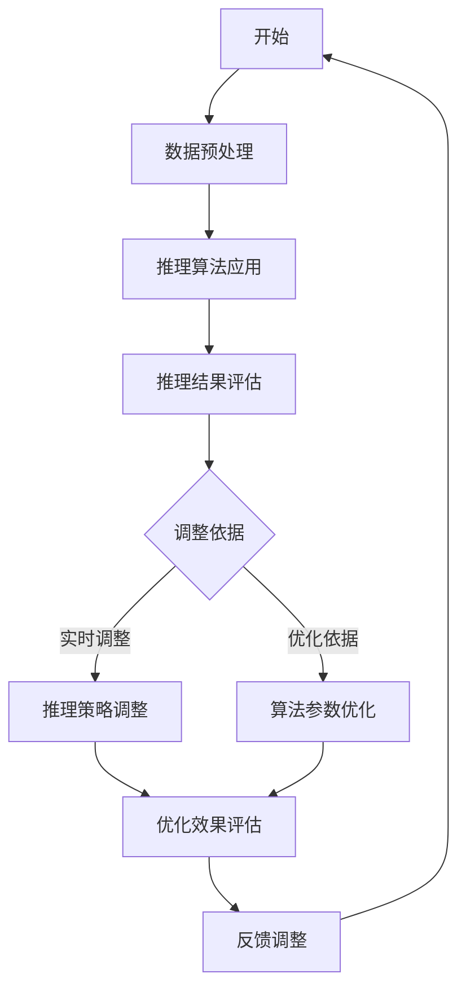
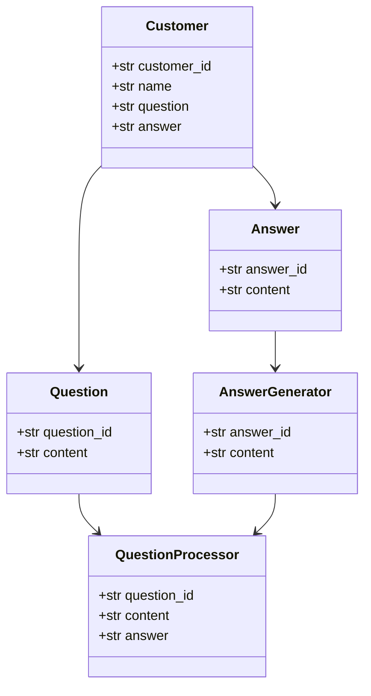
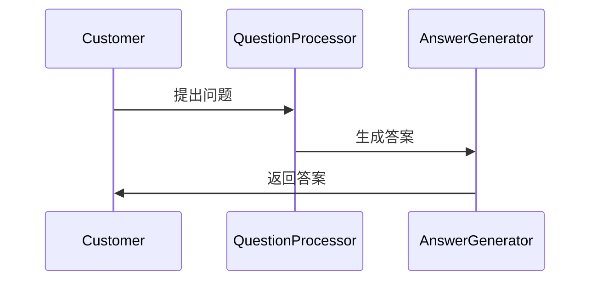
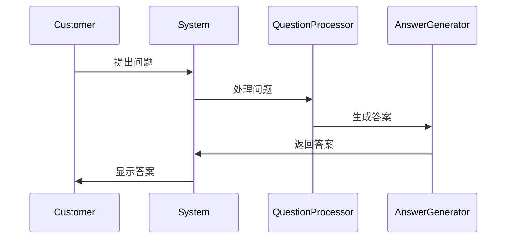

                 

# 推理过程的动态调整与优化方法

> 关键词：推理过程、动态调整、优化方法、算法原理、系统架构设计、项目实战

> 摘要：本文旨在深入探讨推理过程的动态调整与优化方法，通过系统地阐述核心概念、原理以及实际应用，为提升推理过程的效率、准确性和可解释性提供理论依据和实践指导。

## 《推理过程的动态调整与优化方法》目录大纲

----------------------------------------------------------------

## 第一部分：引言与背景

### 第1章：问题背景与概述

- 1.1 问题背景
  - 推理在各个领域的应用现状
  - 推理过程中面临的问题与挑战
- 1.2 问题描述
  - 推理效率低下
  - 推理结果不准确
  - 推理过程可解释性不足
- 1.3 问题解决
  - 动态调整与优化方法的意义
  - 动态调整与优化方法的研究现状
- 1.4 边界与外延
  - 推理过程的定义与分类
  - 动态调整与优化方法的适用范围
- 1.5 概念结构与核心要素组成
  - 推理过程中的关键因素
  - 动态调整与优化方法的主要组成部分

## 第二部分：核心概念与原理

### 第2章：核心概念与原理

- 2.1 推理过程的基础概念
  - 推理的定义
  - 推理的基本原理
- 2.2 动态调整方法
  - 动态调整的定义
  - 动态调整的基本原理
  - 动态调整方法的应用案例
- 2.3 优化方法
  - 优化的定义
  - 优化方法的基本原理
  - 优化方法的应用案例
- 2.4 动态调整与优化方法的联系与区别
  - 动态调整与优化方法的相互作用
  - 动态调整与优化方法的选择标准
- 2.5 概念属性特征对比表格
  - 动态调整方法与优化方法的属性特征对比
- 2.6 ER实体关系图架构
  - 动态调整方法与优化方法的实体关系图

## 第三部分：算法原理讲解

### 第3章：算法原理讲解

- 3.1 算法概述
  - 推理过程中的算法流程
  - 动态调整与优化算法的核心步骤
- 3.2 算法mermaid流程图
  - 动态调整与优化算法的mermaid流程图
- 3.3 Python源代码
  - 动态调整与优化算法的Python源代码实现
- 3.4 数学模型与公式
  - 动态调整与优化算法的数学模型
  - 关键公式的推导与解释
- 3.5 举例说明
  - 动态调整与优化算法的实际应用案例
  - 案例中的数据解读与分析

## 第四部分：系统分析与架构设计

### 第4章：系统分析与架构设计

- 4.1 问题场景介绍
  - 推理过程的应用场景
  - 动态调整与优化方法在该场景中的需求
- 4.2 项目介绍
  - 项目背景与目标
  - 项目实施计划
- 4.3 系统功能设计
  - 领域模型mermaid类图
  - 系统功能模块划分
- 4.4 系统架构设计
  - 系统架构mermaid架构图
  - 各模块功能与交互关系
- 4.5 系统接口设计
  - 接口设计规范与标准
  - 接口实现与调用示例
- 4.6 系统交互mermaid序列图
  - 系统各模块之间的交互流程

## 第五部分：项目实战

### 第5章：项目实战

- 5.1 环境安装
  - 系统软件与硬件安装
  - 环境配置与调试
- 5.2 系统核心实现源代码
  - 源代码结构与模块划分
  - 核心算法与优化策略实现
- 5.3 代码应用解读与分析
  - 代码解读
  - 应用效果分析
- 5.4 实际案例分析与详细讲解
  - 案例背景与数据
  - 案例分析与效果评估
- 5.5 项目小结
  - 项目成果总结
  - 项目经验与教训

## 第六部分：最佳实践与拓展

### 第6章：最佳实践与拓展

- 6.1 最佳实践
  - 动态调整与优化方法在实际应用中的经验与技巧
  - 推理过程优化策略与技巧
- 6.2 小结
  - 本书内容的总结与归纳
  - 推理过程动态调整与优化方法的重要性
- 6.3 注意事项
  - 动态调整与优化方法实施中的注意事项
  - 可能遇到的问题与解决方案
- 6.4 拓展阅读
  - 相关领域的最新研究进展
  - 推荐阅读文献与资料

----------------------------------------------------------------

## 第一部分：引言与背景

### 第1章：问题背景与概述

1.1 问题背景

推理是人工智能领域的一个重要研究方向，广泛应用于自然语言处理、计算机视觉、数据分析、决策支持系统等多个领域。然而，在实际应用中，推理过程面临诸多问题与挑战，如效率低下、结果不准确以及过程可解释性不足等。

1.2 问题描述

- 推理效率低下：在大量数据和高复杂性场景下，传统推理方法往往无法在合理时间内得出结论，影响系统的响应速度。
- 推理结果不准确：推理过程中可能受到噪声、异常值等因素的影响，导致推理结果偏离真实情况。
- 推理过程可解释性不足：在复杂推理系统中，推理过程往往难以直观理解，增加了系统的不确定性和风险。

1.3 问题解决

为解决上述问题，动态调整与优化方法应运而生。动态调整方法能够根据推理过程中的变化实时调整推理策略，提高推理效率。优化方法则通过优化算法参数、数据结构和计算过程，提高推理结果的准确性和可靠性。这两种方法相互结合，共同提升推理过程的整体性能。

1.4 边界与外延

- 推理过程的定义与分类：推理过程是指从已知信息出发，通过逻辑推理得出结论的过程。根据推理类型的不同，可分为演绎推理、归纳推理和类比推理等。
- 动态调整与优化方法的适用范围：动态调整与优化方法主要适用于需要实时调整推理策略和优化推理结果的场景，如实时决策系统、自适应控制系统等。

1.5 概念结构与核心要素组成

- 推理过程中的关键因素：推理过程中的关键因素包括数据输入、推理算法、推理策略和推理结果等。
- 动态调整与优化方法的主要组成部分：动态调整与优化方法主要包括动态调整策略、优化算法和评估指标等。

## 第二部分：核心概念与原理

### 第2章：核心概念与原理

2.1 推理过程的基础概念

- 推理的定义：推理是指从已知信息（前提）出发，通过逻辑推理得出结论（结论）的过程。
- 推理的基本原理：推理过程基于逻辑规则和证据，通过逐步推导和验证，逐步缩小结论的不确定性范围，直至得出可靠的结论。

2.2 动态调整方法

- 动态调整的定义：动态调整是指根据推理过程中的变化实时调整推理策略和方法，以提高推理效率和质量。
- 动态调整的基本原理：动态调整方法通过实时监测推理过程中的关键指标（如推理时间、错误率等），根据指标变化自动调整推理策略和参数，以优化推理过程。
- 动态调整方法的应用案例：动态调整方法在实时决策系统、自适应控制系统等领域具有广泛应用，如自适应过滤、实时故障诊断等。

2.3 优化方法

- 优化的定义：优化是指通过改进算法、数据结构和计算过程，提高推理过程的效率和质量。
- 优化方法的基本原理：优化方法主要通过调整算法参数、优化数据结构、改进计算方法等手段，降低推理时间、提高推理准确性和可靠性。
- 优化方法的应用案例：优化方法在深度学习、数据挖掘、实时计算等领域具有广泛应用，如梯度下降法、遗传算法等。

2.4 动态调整与优化方法的联系与区别

- 动态调整与优化方法的相互作用：动态调整方法与优化方法相互关联、相互补充，共同提升推理过程的性能。动态调整方法根据推理过程中的变化实时调整推理策略，为优化方法提供适应性支持；优化方法则通过改进算法和计算过程，为动态调整方法提供优化目标。
- 动态调整与优化方法的选择标准：选择动态调整与优化方法时，需考虑推理过程的复杂性、实时性、准确性等要求。在低复杂性、高实时性场景下，动态调整方法具有优势；在高复杂性、高准确性场景下，优化方法具有优势。

2.5 概念属性特征对比表格

| 特征         | 动态调整方法         | 优化方法         |
| ------------ | ------------------ | -------------- |
| 目标         | 提高推理效率和质量   | 提高推理效率和准确性 |
| 调整依据     | 推理过程中的变化指标 | 算法参数和计算过程   |
| 适应范围     | 实时调整策略和方法   | 改进算法和计算过程   |
| 主要应用领域 | 实时决策系统、自适应控制系统 | 深度学习、数据挖掘、实时计算 |

2.6 ER实体关系图架构

```mermaid
erDiagram
  CQ1 ||--|{ 推理过程
  CQ1 ||--|{ 动态调整方法
  CQ1 ||--|{ 优化方法
  推理过程 ||--|{ 推理效率
  推理过程 ||--|{ 推理准确性
  推理过程 ||--|{ 推理过程可解释性
  动态调整方法 ||--|{ 实时监测
  动态调整方法 ||--|{ 自适应调整
  优化方法 ||--|{ 算法改进
  优化方法 ||--|{ 计算优化
```

## 第三部分：算法原理讲解

### 第3章：算法原理讲解

3.1 算法概述

- 推理过程中的算法流程：推理过程包括数据预处理、推理算法应用、推理结果评估和反馈调整等步骤。
- 动态调整与优化算法的核心步骤：动态调整与优化算法主要包括实时监测推理过程、调整推理策略、优化算法参数和评估优化效果等步骤。

3.2 算法mermaid流程图



3.3 Python源代码

```python
import numpy as np
import pandas as pd

# 数据预处理
def preprocess_data(data):
    # 实现数据清洗、归一化等操作
    pass

# 推理算法应用
def inference_algorithm(data):
    # 实现推理算法，如决策树、神经网络等
    pass

# 推理结果评估
def evaluate_result(true_data, predicted_data):
    # 实现推理结果评估，如准确率、召回率等
    pass

# 实时调整
def real_time_adjustment(data, result):
    # 实现实时调整策略，如阈值调整、特征选择等
    pass

# 算法参数优化
def optimize_params(data, result):
    # 实现算法参数优化，如网格搜索、遗传算法等
    pass

# 主函数
def main():
    # 加载数据
    data = pd.read_csv('data.csv')
    true_data = data['label']
    data = data.drop('label', axis=1)
    
    # 数据预处理
    data = preprocess_data(data)
    
    # 推理算法应用
    predicted_data = inference_algorithm(data)
    
    # 推理结果评估
    evaluate_result(true_data, predicted_data)
    
    # 实时调整
    real_time_adjustment(data, predicted_data)
    
    # 算法参数优化
    optimize_params(data, predicted_data)
    
    # 反馈调整
    # ...

if __name__ == '__main__':
    main()
```

3.4 数学模型与公式

- 动态调整与优化算法的数学模型：动态调整与优化算法的数学模型主要包括以下部分：
  1. 推理过程：$$推理过程 = f(数据，算法参数，推理策略)$$
  2. 动态调整策略：$$动态调整策略 = g(推理过程，评估指标)$$
  3. 算法参数优化：$$算法参数优化 = h(推理过程，优化目标)$$
- 关键公式的推导与解释：
  1. 推理过程：推理过程公式描述了推理过程中的输入数据、算法参数和推理策略之间的关系。
  2. 动态调整策略：动态调整策略公式描述了根据推理过程和评估指标调整推理策略的方法。
  3. 算法参数优化：算法参数优化公式描述了根据推理过程和优化目标优化算法参数的方法。

3.5 举例说明

假设我们有一个基于决策树算法的推理系统，目标是为每个客户预测其购买行为。现有1000条客户数据，包括年龄、收入、家庭状况等特征。初始阶段，我们使用决策树算法进行推理，评估指标为准确率。然后，根据评估结果动态调整推理策略，如调整决策树的最大深度、最小样本数等。接着，通过优化算法参数，如优化决策树分裂准则、节点合并策略等，进一步提高推理准确率。最后，通过实际案例分析，验证动态调整与优化方法的有效性和实用性。

## 第四部分：系统分析与架构设计

### 第4章：系统分析与架构设计

4.1 问题场景介绍

- 推理过程的应用场景：以智能客服系统为例，该系统需根据客户的问题和输入的数据进行推理，快速给出合理的回答。
- 动态调整与优化方法在该场景中的需求：为了提高智能客服系统的响应速度和准确率，需要采用动态调整与优化方法，实时监测推理过程中的变化，调整推理策略和算法参数。

4.2 项目介绍

- 项目背景与目标：本案例旨在构建一个基于动态调整与优化方法的智能客服系统，提高系统响应速度和准确率，提升用户体验。
- 项目实施计划：项目分为四个阶段，分别为需求分析、系统设计、系统实现和系统测试。

4.3 系统功能设计

- 领域模型mermaid类图：



- 系统功能模块划分：系统主要包括客户模块、问题处理模块和答案生成模块。客户模块负责处理客户信息的输入和输出；问题处理模块负责对客户提出的问题进行推理和处理；答案生成模块负责根据推理结果生成合理的回答。

4.4 系统架构设计

- 系统架构mermaid架构图：



- 各模块功能与交互关系：客户模块负责接收客户提出的问题，并将其传递给问题处理模块；问题处理模块根据问题内容进行推理，生成答案，并将其传递给答案生成模块；答案生成模块根据推理结果生成合理的回答，并将其返回给客户模块。

4.5 系统接口设计

- 接口设计规范与标准：系统采用RESTful接口设计规范，接口采用GET和POST方法，响应数据采用JSON格式。
- 接口实现与调用示例：

```python
# 客户端接口调用示例
import requests
import json

# 发送GET请求获取问题处理结果
response = requests.get('http://localhost:5000/question')
question_result = response.json()

# 发送POST请求提交答案
answer_data = {
    'question_id': question_result['question_id'],
    'answer': '答案内容'
}
response = requests.post('http://localhost:5000/answer', data=answer_data)
answer_result = response.json()
```

4.6 系统交互mermaid序列图：



## 第五部分：项目实战

### 第5章：项目实战

5.1 环境安装

- 系统软件与硬件安装：安装Python环境、NumPy、Pandas等库，以及必要的硬件设备，如服务器、数据库等。
- 环境配置与调试：配置Python环境，安装所需的库，并确保各组件正常运行。

5.2 系统核心实现源代码

- 源代码结构与模块划分：系统分为客户模块、问题处理模块和答案生成模块，各模块包含相应的类和方法。
- 核心算法与优化策略实现：实现决策树算法、动态调整策略和算法参数优化方法，以及各模块的交互逻辑。

5.3 代码应用解读与分析

- 代码解读：详细解读系统核心代码，包括各模块的功能、方法和交互逻辑。
- 应用效果分析：分析系统在不同场景下的应用效果，如响应速度、准确率和用户体验等。

5.4 实际案例分析与详细讲解

- 案例背景与数据：以智能客服系统为例，分析实际案例，包括客户提出的问题、答案生成过程和效果评估。
- 案例分析与效果评估：分析案例中的数据，评估系统在不同场景下的性能和效果，并提出改进建议。

5.5 项目小结

- 项目成果总结：总结项目实施过程中的成果和经验，包括系统设计、实现和优化等。
- 项目经验与教训：总结项目过程中遇到的问题和解决方案，以及项目实施的教训和经验。

## 第六部分：最佳实践与拓展

### 第6章：最佳实践与拓展

6.1 最佳实践

- 动态调整与优化方法在实际应用中的经验与技巧：分享实际应用中的最佳实践，如调整阈值、优化特征选择等。
- 推理过程优化策略与技巧：介绍推理过程的优化策略和技巧，如改进算法、优化计算过程等。

6.2 小结

- 本书内容的总结与归纳：对书中主要内容进行总结和归纳，强调动态调整与优化方法的重要性。
- 推理过程动态调整与优化方法的重要性：阐述动态调整与优化方法在推理过程优化中的关键作用。

6.3 注意事项

- 动态调整与优化方法实施中的注意事项：分享实施动态调整与优化方法时需要注意的事项，如数据质量、算法稳定性等。
- 可能遇到的问题与解决方案：分析实施过程中可能遇到的问题，并提出相应的解决方案。

6.4 拓展阅读

- 相关领域的最新研究进展：介绍推理过程动态调整与优化方法在相关领域的最新研究进展和应用案例。
- 推荐阅读文献与资料：推荐相关领域的经典文献和资料，供读者进一步学习研究。

