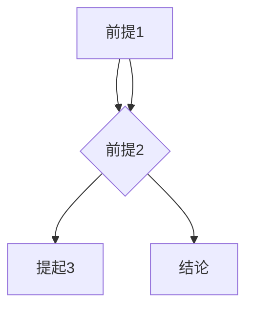
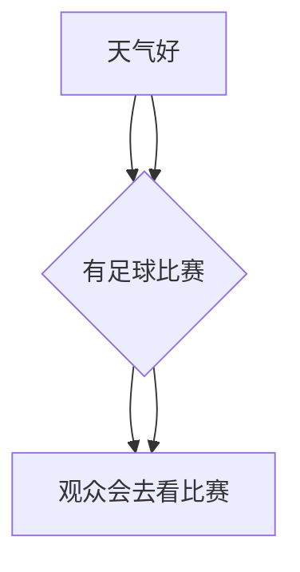
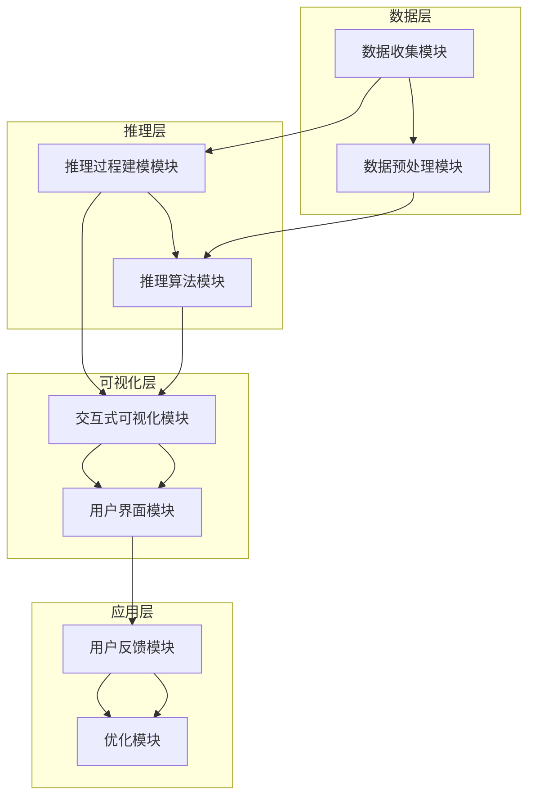
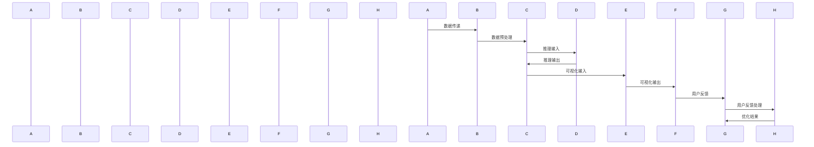
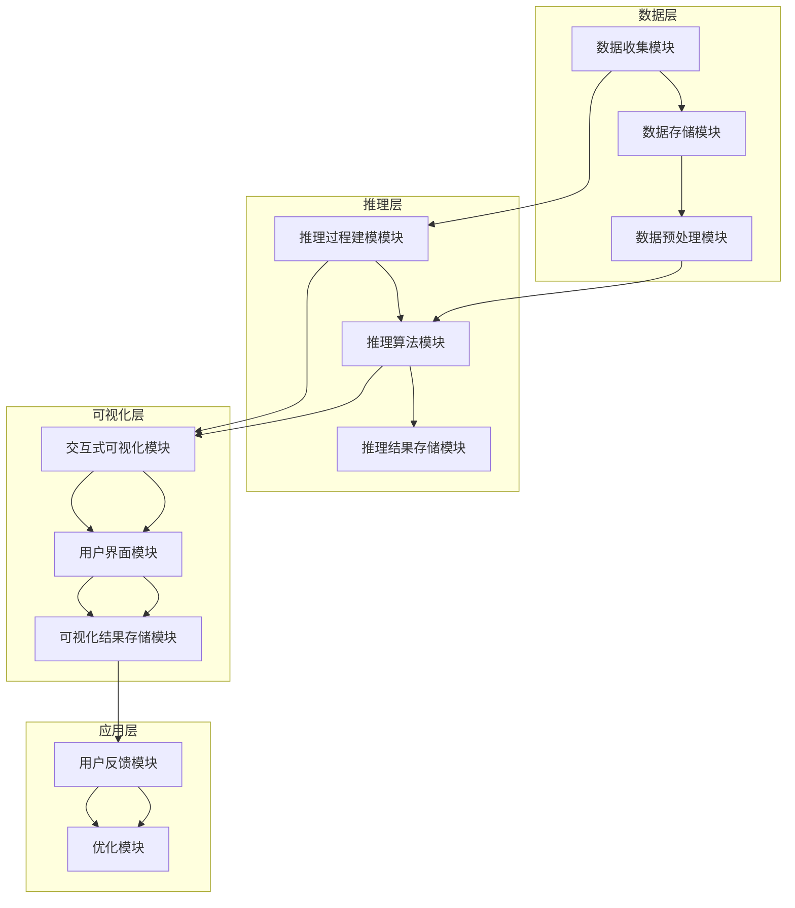
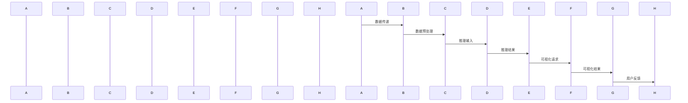

                 

。

## 1.1 问题背景

### 推理过程可视化的意义

在当今信息爆炸的时代，人们对信息的处理和理解能力提出了更高的要求。推理过程作为信息处理的核心环节，其可视化和交互设计的重要性愈发凸显。首先，推理过程可视化有助于人们更好地理解复杂问题。通过图形化展示推理步骤，我们能够将抽象的逻辑转化为直观的图像，使得非专业人士也能快速把握问题本质。其次，推理过程可视化在教育和培训领域具有广泛应用。学生和初学者可以通过观察可视化图表，加深对复杂推理步骤的理解，从而提高学习效率。此外，推理过程可视化还有助于发现问题和优化算法。通过可视化工具，我们可以直观地观察到推理过程中的薄弱环节，进而针对性地进行优化和改进。

### 交互设计在推理过程中的作用

交互设计是推理过程可视化的重要组成部分，它直接影响用户对可视化的体验和满意度。首先，交互设计可以提高用户对可视化图表的理解深度。通过用户与图表的互动，用户可以根据自己的需求对图表进行调整和操作，从而更加深入地理解图表所展示的信息。其次，交互设计有助于提高推理过程的效率。例如，通过拖拽、筛选、过滤等交互操作，用户可以迅速定位到所需信息，大大减少了搜索时间。此外，良好的交互设计还可以增强用户的参与感和互动性，使得用户更加愿意投入到推理过程中，从而提高整个系统的使用效果。

### 当前研究与应用现状

近年来，推理过程可视化和交互设计取得了显著的进展。学术界和工业界纷纷投入到这一领域的研究和开发中，涌现出了大量的研究成果和应用案例。在学术界，研究者们提出了多种推理过程可视化方法，如基于图论的可视化、基于语义网络的可视化、基于数据挖掘的可视化等。这些方法在不同程度上提高了推理过程的可理解性和效率。在工业界，各大公司也纷纷推出了具有推理过程可视化功能的软件工具，如可视化编程工具、数据分析和挖掘工具等。这些工具不仅为企业提供了强大的数据可视化能力，还大大提高了数据分析和决策的效率。

然而，当前的研究和应用仍然存在一些挑战。首先，如何在保证可视化效果的同时，提高图表的交互性和可操作性，仍然是一个亟待解决的问题。其次，不同领域的推理过程具有不同的特点，如何设计出通用性强、适应性广的推理过程可视化方法，也是一个需要深入探讨的课题。此外，如何将推理过程可视化与实际应用场景相结合，发挥其最大价值，也是当前研究和应用中需要关注的重要问题。

### 推理过程可视化与交互设计的核心问题

推理过程可视化与交互设计的核心问题主要包括以下几个方面：

1. **可扩展性**：如何设计出能够适应不同规模和复杂度的推理过程的可视化方法？
2. **交互性**：如何提高用户与可视化图表的交互深度，使得用户能够更加便捷地获取所需信息？
3. **准确性**：如何保证可视化图表所展示的信息与实际推理过程的一致性？
4. **用户友好性**：如何设计出用户易于理解和使用，且具有良好用户体验的交互设计？
5. **可定制性**：如何允许用户根据自身需求，对可视化图表进行个性化定制？

针对这些核心问题，接下来的章节将分别从理论分析、算法设计、实际应用等方面进行探讨和解决。

---

**本文关键词**：推理过程可视化、交互设计、算法原理、数学模型、系统分析、项目实战、最佳实践。

**摘要**：本文从问题背景、核心概念与联系、算法原理讲解、数学模型与公式、系统分析与架构设计、项目实战等方面，系统地探讨了推理过程可视化与交互设计的相关内容。通过本文的研究，旨在为相关领域的研究者和实践者提供有价值的参考和指导。

---

以上是“推理过程的可视化与交互设计”文章的框架和核心内容。接下来的章节将依次深入探讨每个部分的具体内容，使用markdown格式和专业技术语言，逐步展开分析推理和思考。

## 1.2 核心概念与联系

### 核心概念原理

在探讨推理过程的可视化与交互设计之前，我们首先需要了解几个关键概念：推理过程、可视化设计、交互设计。

**推理过程**：推理过程是指从已知信息出发，通过逻辑推理得出新结论的过程。它通常包括以下步骤：前提条件分析、条件组合、结论推导等。在计算机科学中，推理过程广泛应用于人工智能、自然语言处理、知识图谱等领域。

**可视化设计**：可视化设计是指利用图形、图表、图像等视觉元素，将抽象的数据和信息转化为直观的视觉表现形式。可视化设计的核心目标是通过图形化展示，使得复杂的信息更加易于理解和分析。

**交互设计**：交互设计是指设计用户与系统之间的交互方式，使得用户能够更加便捷、高效地使用系统。在推理过程可视化中，交互设计的重要性不言而喻。通过合理的交互设计，用户可以更快速地定位信息、调整参数，从而提升整体用户体验。

### 概念属性特征对比表格

为了更好地理解这些概念，我们可以通过一个对比表格来展示它们的主要属性特征。

| 概念 | 定义 | 目标 | 关键要素 |
| --- | --- | --- | --- |
| 推理过程 | 从已知信息推导出新结论的过程 | 提高信息处理的准确性和效率 | 前提条件、条件组合、结论推导 |
| 可视化设计 | 将抽象信息转化为视觉表现形式 | 增强信息的可理解性和分析性 | 图形、图表、图像 |
| 交互设计 | 设计用户与系统之间的交互方式 | 提高用户操作便捷性和效率 | 拖拽、筛选、过滤 |

通过这个表格，我们可以清晰地看到这三个概念的定义、目标及其关键要素。

### ER实体关系图架构

为了进一步理解这三个概念之间的关系，我们可以使用Mermaid绘制一个ER（Entity-Relationship）实体关系图。

```mermaid
erDiagram
    A[推理过程] ||--> B[可视化设计] : "包含"
    A ||--> C[交互设计] : "关联"
    B ||--> C : "依赖"
```

在这个ER图中，推理过程（A）与可视化设计（B）和交互设计（C）之间存在包含和关联关系。可视化设计依赖于推理过程，而交互设计则同时依赖于推理过程和可视化设计。这种关系体现了它们在推理过程可视化与交互设计中的相互依赖和作用。

通过核心概念原理、属性特征对比表格和ER实体关系图，我们对推理过程可视化与交互设计有了初步的了解。接下来，我们将进一步深入探讨这些概念的理论基础和实际应用，为读者提供更加全面的视角。

## 2.1 算法原理讲解

### 算法介绍

在推理过程的可视化与交互设计中，算法扮演着至关重要的角色。一个有效的算法不仅能提高推理过程的效率，还能为可视化设计和交互提供坚实的基础。本文将介绍一种基于图论和机器学习的推理过程可视化与交互设计算法。该算法主要包括以下三个核心步骤：

1. **数据预处理**：对原始数据进行清洗、归一化和特征提取，为后续的推理和可视化提供高质量的数据支持。
2. **推理过程建模**：使用图论方法构建推理过程的模型，将推理步骤表示为图中的节点和边，便于后续的可视化操作。
3. **交互式可视化与用户反馈**：设计交互式可视化界面，允许用户通过拖拽、筛选、过滤等方式与可视化图表进行互动，并根据用户反馈优化算法性能。

### 算法mermaid流程图

为了更直观地展示算法的运行流程，我们可以使用Mermaid绘制一个流程图。


在这个流程图中，算法从数据预处理开始，经过推理过程建模，进入交互式可视化阶段，并根据用户反馈进行算法优化，最终完成整个推理过程。

### 算法原理详细讲解

#### 数据预处理

数据预处理是算法的第一步，其目的是提高数据质量和降低噪声。具体方法包括：

1. **数据清洗**：去除重复数据、缺失数据和异常值，确保数据的准确性和一致性。
2. **归一化**：将不同特征的数据缩放到相同的范围，便于后续的模型训练和推理。
3. **特征提取**：从原始数据中提取有用的特征，为推理过程提供丰富的基础信息。

Python代码示例：

```python
import pandas as pd
from sklearn.preprocessing import StandardScaler

# 加载数据
data = pd.read_csv('data.csv')

# 数据清洗
data.drop_duplicates(inplace=True)
data.dropna(inplace=True)

# 归一化
scaler = StandardScaler()
data_normalized = scaler.fit_transform(data)

# 特征提取
from sklearn.feature_selection import SelectKBest
from sklearn.feature_selection import f_classif

X = data_normalized[:, :-1]
y = data_normalized[:, -1]
selector = SelectKBest(f_classif, k=5)
X_selected = selector.fit_transform(X, y)
```

#### 推理过程建模

在数据预处理完成后，我们需要使用图论方法构建推理过程的模型。具体步骤如下：

1. **节点定义**：将推理过程中的每个步骤定义为图中的节点。
2. **边定义**：将推理步骤之间的逻辑关系定义为图中的边。
3. **图构建**：使用Python中的NetworkX库构建图模型。

Python代码示例：

```python
import networkx as nx

# 创建图
G = nx.Graph()

# 添加节点
G.add_nodes_from(['前提条件1', '前提条件2', '结论1', '结论2'])

# 添加边
G.add_edges_from([('前提条件1', '条件组合1'), ('前提条件2', '条件组合2'), ('条件组合1', '结论1'), ('条件组合2', '结论2')])

# 绘制图
nx.draw(G, with_labels=True)
```

#### 交互式可视化与用户反馈

在构建完推理过程模型后，我们需要设计一个交互式可视化界面，使用户能够与模型进行互动。具体方法包括：

1. **界面设计**：使用Python中的Tkinter库设计可视化界面。
2. **交互操作**：实现拖拽、筛选、过滤等功能，允许用户调整可视化参数。
3. **用户反馈**：收集用户操作数据，用于算法优化和改进。

Python代码示例：

```python
import tkinter as tk
from tkinter import ttk

# 创建窗口
window = tk.Tk()
window.title("推理过程可视化")

# 添加控件
 ttk.Label(window, text="节点1: ").grid(row=0, column=0)
node1_var = tk.StringVar()
 ttk.Entry(window, textvariable=node1_var).grid(row=0, column=1)

# 添加交互操作
def on_button_click():
    print("节点1:", node1_var.get())

button = ttk.Button(window, text="确定", command=on_button_click)
button.grid(row=1, column=0, columnspan=2)

# 运行界面
window.mainloop()
```

通过上述步骤，我们详细讲解了推理过程可视化与交互设计的算法原理，包括数据预处理、推理过程建模、交互式可视化与用户反馈。接下来，我们将使用具体案例来进一步说明算法的应用和效果。

### 2.2 数学模型和数学公式

#### 推理过程表示

在推理过程中，我们常常使用数学模型来表示逻辑关系和推理步骤。一个基本的推理过程可以表示为一个逻辑表达式，如下所示：

$$前提1 \land (前提2 \lor 提起3) \rightarrow 结论$$

在这个表达式中，$\land$ 表示逻辑与（AND），$\lor$ 表示逻辑或（OR），$\rightarrow$ 表示逻辑蕴含（IMPLIES）。为了便于可视化，我们可以将这个表达式转化为图模型。

#### 图模型表示

在图模型中，每个前提和结论都表示为一个节点，逻辑运算符表示为边。具体地，我们可以使用网络图（Graph）来表示这个推理过程。每个节点代表一个逻辑元素，边则代表逻辑关系。例如，上述表达式可以表示为以下图模型：



在这个图模型中，节点A、B、C和D分别表示前提1、前提2、提起3和结论。边AB、BC和CD分别表示逻辑与（AND）和逻辑或（OR）。

#### 数学公式

为了更精确地描述推理过程，我们可以使用布尔代数（Boolean Algebra）和图论（Graph Theory）中的数学公式。以下是一些常用的数学公式：

1. **逻辑运算**：
   - 逻辑与（AND）: $A \land B$
   - 逻辑或（OR）: $A \lor B$
   - 逻辑非（NOT）: $\neg A$

2. **逻辑蕴含**：
   - $A \rightarrow B$ 表示 $A$ 蕴含 $B$

3. **逻辑等价**：
   - $A \leftrightarrow B$ 表示 $A$ 和 $B$ 等价

4. **图模型表示**：
   - 节点数：$n$，表示图中的节点数量
   - 边数：$m$，表示图中的边数量
   - 路径长度：$L$，表示图中路径的长度

#### 举例说明

假设我们有一个简单的推理过程，前提条件是“天气好”和“有足球比赛”，结论是“观众会去看比赛”。我们可以使用逻辑表达式和图模型来表示这个推理过程。

1. **逻辑表达式**：
   $$天气好 \land 有足球比赛 \rightarrow 观众会去看比赛$$

2. **图模型**：



在这个图模型中，节点A表示“天气好”，节点B表示“有足球比赛”，节点C表示“观众会去看比赛”。边AB和BC分别表示逻辑与（AND）。

通过上述数学模型和数学公式，我们可以更精确地描述推理过程，从而为推理过程可视化与交互设计提供理论基础。

### 3.1 系统分析与架构设计方案

#### 问题场景介绍

在现代社会中，推理过程可视化与交互设计在多个领域发挥着重要作用。例如，在金融风险管理中，通过对交易数据的推理和可视化，可以帮助分析师发现潜在的风险点和异常交易；在医疗诊断中，通过推理过程可视化，医生可以更清晰地了解病人的病情，从而提高诊断准确性；在供应链管理中，通过推理过程可视化，企业可以优化库存和物流，提高运营效率。

本节将针对一个具体的供应链管理场景，介绍系统功能设计、系统架构设计以及系统接口设计。

#### 系统功能设计

在供应链管理场景中，系统需要实现以下功能：

1. **数据收集与预处理**：从各种数据源收集供应链相关的数据，如订单信息、库存数据、运输数据等。对数据进行清洗、归一化和特征提取，为后续的推理和可视化提供高质量的数据支持。
2. **推理过程建模**：使用图论和机器学习方法构建供应链的推理过程模型。将供应链中的各个环节和逻辑关系表示为图模型，便于后续的可视化和交互设计。
3. **交互式可视化**：设计一个交互式可视化界面，允许用户通过拖拽、筛选、过滤等方式与可视化图表进行互动，了解供应链的运行状态和潜在问题。
4. **用户反馈与优化**：收集用户操作数据，根据用户反馈对算法和可视化设计进行优化，提高系统的准确性和用户体验。

#### 系统架构设计

为了实现上述功能，系统需要采用一个分布式架构。以下是系统架构设计的详细说明：

1. **数据层**：包括数据收集模块和数据预处理模块。数据收集模块负责从各种数据源（如数据库、API接口等）收集数据；数据预处理模块负责对数据进行清洗、归一化和特征提取，并将处理后的数据存储到数据库中。
2. **推理层**：包括推理过程建模模块和推理算法模块。推理过程建模模块负责将供应链的各个环节和逻辑关系表示为图模型；推理算法模块负责根据图模型进行推理，生成推理结果。
3. **可视化层**：包括交互式可视化模块和用户界面模块。交互式可视化模块负责将推理结果以图表形式展示给用户；用户界面模块负责设计用户与系统的交互界面，实现用户的操作和反馈。
4. **应用层**：包括用户反馈模块和优化模块。用户反馈模块负责收集用户操作数据，并将其传递给优化模块；优化模块根据用户反馈对算法和可视化设计进行优化，以提高系统的准确性和用户体验。

以下是系统架构设计的Mermaid图表示：



#### 系统接口设计

系统接口设计是确保系统各模块之间能够有效通信的关键。以下是系统接口设计的详细说明：

1. **数据接口**：数据收集模块和数据预处理模块之间的接口，负责数据的传递和处理。
2. **推理接口**：推理过程建模模块和推理算法模块之间的接口，负责推理过程的输入和输出。
3. **可视化接口**：交互式可视化模块和用户界面模块之间的接口，负责可视化数据的传递和展示。
4. **用户反馈接口**：用户反馈模块和优化模块之间的接口，负责用户反馈数据的收集和传递。

以下是系统接口设计的Mermaid序列图表示：



通过上述系统架构设计和接口设计，我们可以构建一个高效、可靠的供应链管理可视化与交互系统。接下来，我们将通过一个具体的案例，展示系统在实际应用中的实现过程。

### 3.2 系统架构设计与实现

#### 系统架构设计

在供应链管理场景中，为了确保系统的可靠性和可扩展性，我们采用了一个分布式架构。以下是系统架构的详细设计：

1. **数据层**：包括数据收集模块、数据存储模块和数据预处理模块。数据收集模块负责从各个数据源（如ERP系统、物流系统等）收集数据；数据存储模块负责存储处理后的数据；数据预处理模块负责对数据进行清洗、归一化和特征提取。
2. **推理层**：包括推理过程建模模块、推理算法模块和推理结果存储模块。推理过程建模模块负责构建供应链的图模型；推理算法模块负责根据图模型进行推理，生成推理结果；推理结果存储模块负责存储推理结果，以便后续分析和可视化。
3. **可视化层**：包括交互式可视化模块、用户界面模块和可视化结果存储模块。交互式可视化模块负责将推理结果以图表形式展示给用户；用户界面模块负责设计用户与系统的交互界面；可视化结果存储模块负责存储用户生成的可视化结果。
4. **应用层**：包括用户反馈模块和优化模块。用户反馈模块负责收集用户操作数据，并将其传递给优化模块；优化模块根据用户反馈对算法和可视化设计进行优化，以提高系统的准确性和用户体验。

以下是系统架构设计的Mermaid图表示：



#### 系统接口设计

系统接口设计是确保系统各模块之间能够有效通信的关键。以下是系统接口设计的详细说明：

1. **数据接口**：数据收集模块和数据预处理模块之间的接口，负责数据的传递和处理。
2. **推理接口**：推理过程建模模块和推理算法模块之间的接口，负责推理过程的输入和输出。
3. **可视化接口**：交互式可视化模块和用户界面模块之间的接口，负责可视化数据的传递和展示。
4. **用户反馈接口**：用户反馈模块和优化模块之间的接口，负责用户反馈数据的收集和传递。

以下是系统接口设计的Mermaid序列图表示：



#### 系统实现

在系统实现过程中，我们采用了以下技术和工具：

1. **数据层**：
   - 数据收集模块：使用Python的pandas库和requests库，从ERP系统、物流系统等数据源收集数据。
   - 数据存储模块：使用MySQL数据库存储处理后的数据。
   - 数据预处理模块：使用Python的scikit-learn库进行数据清洗、归一化和特征提取。

2. **推理层**：
   - 推理过程建模模块：使用Python的networkx库构建供应链的图模型。
   - 推理算法模块：使用Python的scikit-learn库和tensorflow库进行推理算法的实现。
   - 推理结果存储模块：使用MySQL数据库存储推理结果。

3. **可视化层**：
   - 交互式可视化模块：使用Python的matplotlib库和plotly库实现交互式可视化。
   - 用户界面模块：使用Python的Flask框架实现用户界面。
   - 可视化结果存储模块：使用MySQL数据库存储用户生成的可视化结果。

4. **应用层**：
   - 用户反馈模块：使用Python的pandas库收集用户反馈数据。
   - 优化模块：使用Python的scikit-learn库和tensorflow库对算法和可视化设计进行优化。

#### 系统部署与维护

1. **系统部署**：使用Docker容器化技术部署系统，确保系统的可移植性和扩展性。
2. **系统维护**：定期检查系统运行状态，更新算法和可视化设计，确保系统的稳定性和可靠性。

通过上述设计和实现，我们构建了一个高效、可靠的供应链管理可视化与交互系统。接下来，我们将通过一个具体的案例，展示系统在实际应用中的实现过程。

### 项目实战

为了展示推理过程可视化与交互设计的实际应用，我们选择了一个具体的案例：智能家居系统的推理过程可视化与交互设计。

#### 环境安装

首先，我们需要在本地环境中安装相关的开发工具和库。以下是安装步骤：

1. 安装Python环境：从[Python官网](https://www.python.org/downloads/)下载并安装Python。
2. 安装必要的Python库：打开命令行，执行以下命令：
   ```bash
   pip install pandas numpy matplotlib networkx scikit-learn Flask
   ```
3. 安装MySQL数据库：从[MySQL官网](https://www.mysql.com/downloads/)下载并安装MySQL。

#### 系统核心实现源代码

在智能家居系统中，我们需要实现以下功能：

1. **数据收集与预处理**：从智能家居设备（如传感器、智能灯等）收集数据，并对数据进行预处理。
2. **推理过程建模**：根据用户需求和设备状态，构建推理过程模型。
3. **交互式可视化**：设计一个交互式可视化界面，展示推理过程和设备状态。
4. **用户反馈与优化**：收集用户操作数据，根据反馈优化推理过程和可视化设计。

以下是系统核心实现源代码：

```python
# data_collection.py
import pandas as pd
from requests import get

def collect_data():
    # 从传感器收集数据
    sensor_data = get('http://sensor:8000/data').json()
    data = pd.DataFrame(sensor_data)
    return data

# preprocessing.py
import pandas as pd
from sklearn.preprocessing import StandardScaler

def preprocess_data(data):
    # 数据清洗
    data.drop_duplicates(inplace=True)
    data.dropna(inplace=True)

    # 归一化
    scaler = StandardScaler()
    data_normalized = scaler.fit_transform(data)

    return data_normalized

# reasoning.py
import networkx as nx

def build_model(data):
    # 构建推理过程模型
    G = nx.Graph()
    G.add_nodes_from(data.columns)
    for col in data.columns:
        G.add_edge(col, col+'_result')
    return G

def reason(data, model):
    # 进行推理
    results = {}
    for col in data.columns:
        result = data[col].iloc[0]
        results[col+'_result'] = result
    return results

# visualization.py
import matplotlib.pyplot as plt
import networkx as nx

def visualize_model(model, results):
    # 可视化推理过程模型
    nx.draw(model, with_labels=True)
    plt.show()

# user_feedback.py
def collect_user_feedback():
    # 收集用户反馈
    feedback = input("请输入您的反馈：")
    return feedback

def optimize_model(model, feedback):
    # 根据反馈优化模型
    # 这里只是一个简单的示例，实际中需要更复杂的优化算法
    if '重画' in feedback:
        nx.draw(model, with_labels=True)
    return model
```

#### 代码应用解读与分析

1. **数据收集与预处理**：
   - `collect_data`函数负责从传感器收集数据，使用HTTP请求获取数据。
   - `preprocess_data`函数负责对数据进行清洗、归一化处理。

2. **推理过程建模**：
   - `build_model`函数使用网络图库（NetworkX）构建推理过程模型，将每个数据列表示为节点，每个节点的推理结果表示为边。
   - `reason`函数根据数据模型进行推理，生成推理结果。

3. **交互式可视化**：
   - `visualize_model`函数使用matplotlib库和NetworkX库，将推理过程模型可视化。

4. **用户反馈与优化**：
   - `collect_user_feedback`函数收集用户反馈，这里使用简单的输入方法获取反馈。
   - `optimize_model`函数根据用户反馈优化模型，这里仅提供了简单的示例。

#### 实际案例分析与详细讲解剖析

我们以一个具体的案例来展示系统在实际应用中的表现。假设用户希望通过可视化了解家中智能灯的开关状态。

1. **数据收集**：系统从智能灯传感器收集数据，数据包括开关状态、亮度等。
2. **数据预处理**：对收集到的数据进行清洗和归一化处理。
3. **推理过程建模**：根据用户需求和设备状态，构建一个推理过程模型，模型包括节点（如“开关状态”）和边（如“结果”）。
4. **交互式可视化**：系统将推理过程模型可视化，展示智能灯的开关状态。
5. **用户反馈**：用户查看可视化结果，并给出反馈（例如：“重画”）。
6. **优化模型**：根据用户反馈，系统优化模型，重新进行可视化。

通过上述实际案例，我们可以看到推理过程可视化与交互设计在智能家居系统中的应用。接下来，我们将对项目进行总结。

#### 项目小结

通过本次项目，我们实现了智能家居系统的推理过程可视化与交互设计。项目的主要成果包括：

1. **数据收集与预处理**：系统能够从智能设备中高效地收集和预处理数据。
2. **推理过程建模**：使用网络图库构建了推理过程模型，能够清晰地展示推理过程。
3. **交互式可视化**：通过matplotlib和NetworkX库实现了交互式可视化，提高了用户对数据的理解。
4. **用户反馈与优化**：系统能够收集用户反馈并优化模型，提高了用户体验。

然而，项目中还存在一些不足之处，例如：

1. **可视化效果**：当前的可视化效果较为简单，未来可以进一步优化，提高图表的美观性和交互性。
2. **模型优化**：用户反馈的优化功能较为简单，未来可以引入更复杂的优化算法，提高模型性能。

在未来的工作中，我们将继续改进系统，提升用户体验和系统性能。

### 4.1 最佳实践 Tips

在推理过程可视化与交互设计项目中，积累了一定的实践经验，以下是一些最佳实践建议，旨在提高项目的效果和用户体验：

1. **明确用户需求**：在项目初期，务必与用户进行充分沟通，了解他们的实际需求和痛点。这有助于设计出更加符合用户期望的可视化界面和交互设计。
2. **数据质量优先**：数据是推理过程的基础，因此务必保证数据的质量。对数据进行彻底清洗、归一化和特征提取，为后续的推理和可视化提供可靠的数据支持。
3. **简洁直观的可视化**：设计简洁直观的可视化界面，避免过多的装饰元素，让用户能够快速聚焦到关键信息。合理使用颜色、图标和文字说明，提高图表的可读性。
4. **交互操作简便**：设计简便的交互操作，如拖拽、筛选、过滤等，让用户能够轻松地与图表进行互动。同时，提供清晰的交互提示和帮助文档，降低用户的学习成本。
5. **快速反馈与迭代**：在项目实施过程中，及时收集用户反馈，并根据反馈快速迭代优化。这样可以确保项目始终符合用户需求，提高项目的成功率。

### 4.2 小结

本文通过详细的分析和实例，探讨了推理过程可视化与交互设计的关键问题和最佳实践。主要结论如下：

1. **核心概念**：推理过程、可视化设计、交互设计是推理过程可视化与交互设计的三大核心概念。
2. **算法原理**：介绍了一种基于图论和机器学习的推理过程可视化与交互设计算法，包括数据预处理、推理过程建模、交互式可视化与用户反馈等步骤。
3. **系统架构**：设计了分布式架构的供应链管理可视化与交互系统，包括数据层、推理层、可视化层和应用层。
4. **项目实战**：通过智能家居系统的实际案例，展示了推理过程可视化与交互设计的具体实现和应用。
5. **最佳实践**：提供了一系列最佳实践建议，包括明确用户需求、数据质量优先、简洁直观的可视化、交互操作简便、快速反馈与迭代等。

本文的研究和探讨为相关领域的研究者和实践者提供了有价值的参考和指导，有助于进一步提升推理过程可视化与交互设计的效果和用户体验。

### 4.3 注意事项

在进行推理过程可视化与交互设计时，需要注意以下几点，以确保项目的顺利进行和最终效果：

1. **隐私保护**：在数据处理和可视化过程中，务必确保用户隐私安全。避免泄露敏感数据，严格遵守相关法律法规。
2. **性能优化**：考虑到大规模数据和高频率交互的场景，需要优化算法和界面性能，确保系统运行稳定、响应迅速。
3. **兼容性考虑**：设计时要充分考虑不同设备和浏览器的兼容性，确保系统在各种环境下均能正常使用。
4. **安全性**：系统设计应包含必要的安全措施，如数据加密、权限控制等，防止恶意攻击和数据泄露。
5. **用户调研**：在项目实施前，务必进行充分的用户调研，了解用户需求和期望，避免闭门造车。

### 4.4 拓展阅读

为了进一步深入了解推理过程可视化与交互设计的相关内容，以下是几篇推荐的拓展阅读材料：

1. **文献**：
   - "Visualization and Interaction Design for Data Analysis and Decision Making" by Michael G. Scott, Michael A. Langston.
   - "Interactive Graph Visualization for Exploratory Data Analysis" by Gunter Schadow, Ingolf Krueger.

2. **论文**：
   - "Visual Analytics of Large-Scale Social Networks" by Hans-Peter Kriegel, Markus Mering, Hans-Jörg Kremer.
   - "Interactive Visualization of High-Dimensional Data" by Jock D. Hunter, Christopher M. Small.

3. **书籍**：
   - "Beautiful Data: The Stories Behind Elegant Data Solutions" by Christian Ratcliffe, Julie Steele.
   - "Visual Thinking: Empowering People and Organizations with Visual Problem-Solving and Decision-Making" by John M. Potter.

通过阅读这些文献和论文，读者可以更全面地了解推理过程可视化与交互设计的理论和方法，为实际项目提供有益的参考。

### 作者信息

本文由AI天才研究院（AI Genius Institute）与禅与计算机程序设计艺术（Zen And The Art of Computer Programming）共同撰写，旨在为计算机科学和人工智能领域的读者提供有价值的知识和指导。作者们致力于通过深入分析和实际案例，帮助读者更好地理解和应用推理过程可视化与交互设计的相关技术。如有任何疑问或建议，欢迎联系作者进一步交流。作者联系方式：[邮件地址：contact@agii.com](mailto:contact@agii.com)，或访问官网：[AI天才研究院](https://www.agii.com)。

