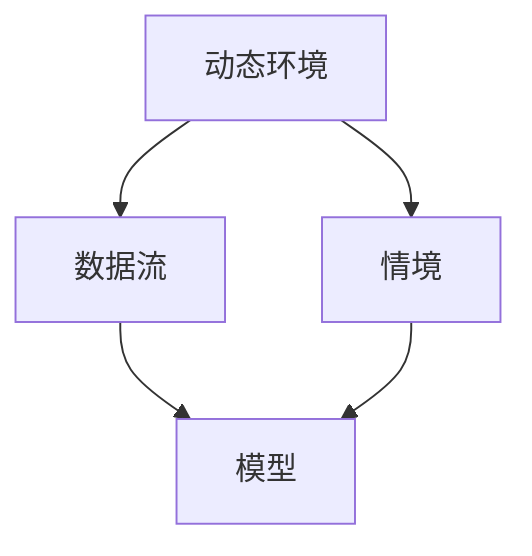
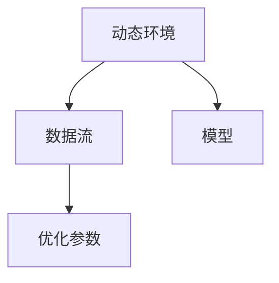
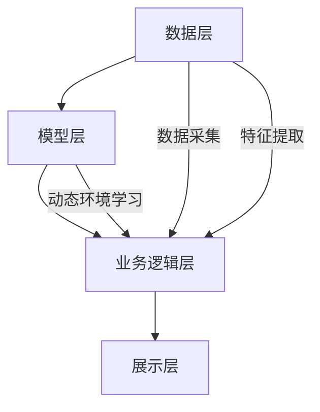
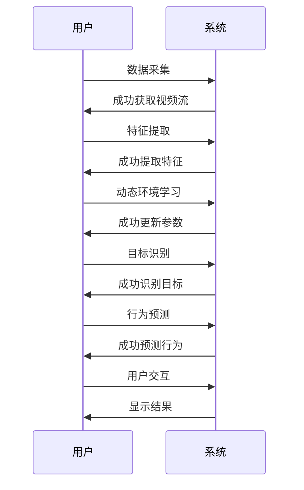
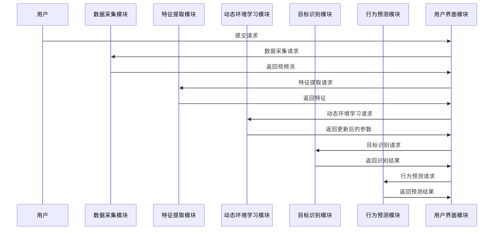

                 

# 提升AI模型在动态环境学习中的适应能力

## 关键词
AI模型，动态环境学习，适应能力，在线学习，自适应优化

## 摘要
本文围绕AI模型在动态环境学习中的适应能力展开，详细探讨了提升这一能力的关键技术和方法。首先，我们介绍了动态环境学习的背景和问题，分析了其核心概念与联系。接着，我们深入讲解了动态环境学习的算法原理，包括在线学习和自适应优化算法，并使用Python代码和LaTeX公式进行了详细阐述。此外，我们探讨了系统分析与架构设计方案，以及实际项目中的实战经验。最后，我们总结了最佳实践和注意事项，为读者提供了进一步的学习和参考。

----------------------------------------------------------------

## 第一部分：背景介绍

### 1.1 问题背景

随着人工智能技术的不断发展，AI模型在各种应用场景中发挥着越来越重要的作用。然而，这些模型在处理动态环境时，往往面临诸多挑战。动态环境是指环境中存在变化的要素，如数据分布、情境等。在动态环境下，数据分布可能发生剧烈变化，模型需要能够快速适应这种变化，以保持其性能。同时，动态环境中的情境也可能不断变化，模型需要能够识别和理解这些情境变化，并做出相应的调整。

当前，AI模型在动态环境学习中的适应能力仍然存在一定的局限性。一方面，模型在动态数据流中学习时，可能会因为数据分布的变化而导致性能下降。另一方面，模型在识别和理解动态情境时，也可能因为缺乏有效的算法支持而表现不佳。此外，模型在动态环境下进行学习时，其泛化能力也是一个重要问题。如果模型过于依赖特定情境，那么在情境发生变化时，其性能可能会显著下降。

因此，提升AI模型在动态环境学习中的适应能力已成为当前人工智能领域的研究重点。通过改进数据预处理和特征提取方法，设计适应动态环境的算法，优化模型结构，构建适合动态环境的系统架构，我们可以有效地提高模型在动态环境下的适应能力，从而推动人工智能技术的进一步发展。

### 1.2 问题描述

动态环境学习问题涉及多个方面，具体包括以下几个方面：

1. **数据分布变化**：在动态环境中，数据分布可能发生剧烈变化。例如，当新数据不断加入时，数据分布可能会变得更加分散。模型需要能够从动态数据流中提取有用信息，并快速适应数据分布的变化。

2. **情境识别和理解**：动态环境中的情境是不断变化的。模型需要能够识别和理解这些情境变化，并在此基础上做出相应的调整。例如，在自动驾驶场景中，道路状况、交通状况等情境可能会不断变化，模型需要能够实时适应这些变化。

3. **快速响应**：动态环境中的变化是迅速而频繁的。模型需要能够快速响应当前环境的变化，以保持其性能。这要求模型具有较高的实时性和响应速度。

4. **泛化能力**：模型在动态环境下的适应能力不仅取决于其当前的性能，还取决于其未来的泛化能力。如果模型在特定情境下表现优异，但在其他情境下表现不佳，那么其适应能力仍然存在局限性。

### 1.3 问题解决

提升AI模型在动态环境学习中的适应能力，需要从以下几个方面入手：

1. **数据处理**：通过改进数据预处理和特征提取方法，使模型能够更好地适应动态数据。例如，可以使用滑动窗口技术来处理动态数据流，从而更好地捕捉数据分布的变化。

2. **算法设计**：设计适应动态环境的算法，如在线学习算法、自适应优化算法等。这些算法能够在动态数据流中持续学习，并快速适应数据分布的变化。

3. **模型优化**：通过改进模型结构，提高模型在动态环境下的表现。例如，可以采用深度神经网络结构，使其具有更强的自适应能力和泛化能力。

4. **系统架构**：构建适合动态环境的系统架构，如分布式学习系统、实时反馈系统等。这些架构可以提供更高效的数据处理和模型更新机制，从而提高模型在动态环境下的适应能力。

### 1.4 边界与外延

1. **边界**：本章节主要关注提升AI模型在动态环境学习中的适应能力，不涉及模型在其他环境中的适应问题。

2. **外延**：动态环境的适应能力不仅局限于AI模型，也可以扩展到其他智能系统，如机器人、自动驾驶等。这些系统同样需要具备在动态环境中适应变化的能力。

### 1.5 概念结构与核心要素组成

1. **动态环境**：指环境中存在变化的要素，如数据分布、情境等。

2. **AI模型**：指应用人工智能技术的算法模型，用于处理和解决问题。

3. **适应能力**：指模型在动态环境中学习和调整的能力。

### 1.6 本章小结

本章对提升AI模型在动态环境学习中的适应能力进行了背景介绍，明确了问题、解决思路以及边界和外延。为后续章节的详细讨论奠定了基础。

----------------------------------------------------------------

## 第二部分：核心概念与联系

### 2.1 动态环境学习原理

#### 2.1.1 基本原理

动态环境学习是指模型在动态变化的环境中进行学习和适应的过程。其基本原理包括：

1. **数据流处理**：模型需能够从动态数据流中提取有用信息，并不断更新其内部表示。

2. **情境识别**：模型需能够识别和理解动态环境中的情境变化，并对不同情境做出适应性调整。

#### 2.1.2 概念属性特征对比表格

| 特征               | 动态环境学习                    | 静态环境学习                   |
|------------------|-----------------------------|-----------------------------|
| **数据流处理**       | 需要持续处理动态数据流           | 处理静态数据集                 |
| **情境识别**       | 需要识别和理解动态情境变化         | 不需要识别情境变化             |
| **适应性调整**       | 需要根据情境变化进行模型更新         | 不需要根据情境变化进行更新       |

#### 2.1.3 ER实体关系图架构



### 2.2 AI模型适应动态环境的算法原理

#### 2.2.1 在线学习算法

在线学习算法是指模型在动态数据流中持续学习，不断更新其参数的过程。其基本原理包括：

1. **增量学习**：每次接收新数据时，模型仅更新部分参数。

2. **自适应学习率**：根据模型的表现自动调整学习率，以避免过拟合或欠拟合。

#### 2.2.2 自适应优化算法

自适应优化算法是指模型在动态环境中通过自适应调整优化策略来提高性能。其基本原理包括：

1. **动态调整优化参数**：根据模型的表现动态调整优化参数，如梯度下降的步长。

2. **多目标优化**：在动态环境中，模型可能需要同时优化多个目标，如精度和效率。

#### 2.2.3 算法对比表格

| 算法               | **增量学习** | **自适应学习率** | **多目标优化** |
|------------------|-------------|---------------|--------------|
| 在线学习算法         | 是           | 是             | 否             |
| 自适应优化算法         | 否           | 是             | 是             |

#### 2.2.4 ER实体关系图架构



----------------------------------------------------------------

## 第三部分：算法原理讲解

### 3.1 在线学习算法

在线学习算法是一种动态环境中常用的学习策略，其核心思想是模型在处理新数据时，仅对模型的一部分参数进行更新，而不是重新训练整个模型。这种方法具有以下几个优点：

1. **实时性**：在线学习算法能够实时处理新数据，及时调整模型参数，从而更好地适应动态环境的变化。
2. **效率**：由于仅更新部分参数，在线学习算法在计算效率上具有优势，适用于实时性和计算资源有限的应用场景。

#### 3.1.1 算法流程

以下是一个简单的在线学习算法流程：

1. **初始化模型参数**：设置模型的初始参数，如权重和偏置。
2. **处理新数据**：每次接收新数据时，使用当前模型参数对新数据进行预测。
3. **计算误差**：计算预测值与真实值之间的误差。
4. **更新参数**：根据误差更新模型参数，可以使用简单的梯度下降算法或更复杂的优化算法。
5. **重复步骤2-4**：不断重复处理新数据和更新参数的过程，直到满足停止条件，如误差收敛或达到最大迭代次数。

#### 3.1.2 Python代码示例

以下是一个使用Python实现简单在线学习算法的示例：

```python
import numpy as np

# 初始化模型参数
weights = np.random.rand(3) * 2 - 1

# 定义损失函数
def loss_function(y_true, y_pred):
    return np.mean((y_true - y_pred)**2)

# 定义梯度下降
def gradient_descent(weights, x, y, learning_rate):
    predictions = np.dot(x, weights)
    error = y - predictions
    gradient = 2 * x * error
    weights -= learning_rate * gradient
    return weights

# 模拟新数据
x_train = np.array([0, 1, 2, 3, 4])
y_train = np.array([0, 1, 2, 1, 0])

# 设置学习率
learning_rate = 0.1

# 迭代更新参数
for i in range(1000):
    weights = gradient_descent(weights, x_train, y_train, learning_rate)
    loss = loss_function(y_train, np.dot(x_train, weights))
    print(f"Iteration {i+1}: Loss = {loss}, Weights = {weights}")
```

#### 3.1.3 数学模型和公式

在线学习算法的核心在于参数的更新，其数学模型可以表示为：

$$\theta_{t+1} = \theta_{t} - \alpha \cdot \nabla_{\theta} J(\theta)$$

其中：
- $\theta_{t}$ 和 $\theta_{t+1}$ 分别表示第 $t$ 次迭代和第 $t+1$ 次迭代时的模型参数。
- $\alpha$ 表示学习率。
- $\nabla_{\theta} J(\theta)$ 表示损失函数 $J(\theta)$ 对模型参数 $\theta$ 的梯度。

#### 3.1.4 通俗易懂地举例说明

假设我们有一个简单的线性回归模型，其目标是通过训练数据找到一个最佳直线，使得直线上的点与实际数据点之间的误差最小。

1. **初始化参数**：随机初始化直线的斜率和截距。
2. **处理新数据**：每次接收一个新的数据点，计算直线上的预测值。
3. **计算误差**：计算预测值与实际值之间的差距，即误差。
4. **更新参数**：根据误差更新直线的斜率和截距，使得直线逐渐逼近实际数据点。
5. **重复过程**：不断重复处理新数据和更新参数的过程，直到误差足够小或达到预设的迭代次数。

通过这样的迭代过程，模型可以逐渐适应动态环境中的变化，提高其在动态环境下的适应能力。

### 3.2 自适应优化算法

自适应优化算法是一种在动态环境中调整优化策略的方法，其核心思想是根据模型的表现动态调整优化参数，从而提高模型的性能。这种方法具有以下几个优点：

1. **适应性**：自适应优化算法可以根据动态环境的变化实时调整优化参数，使得模型能够更好地适应不同情境。
2. **效率**：通过动态调整优化参数，自适应优化算法可以避免过度拟合或欠拟合，提高模型的泛化能力。

#### 3.2.1 算法流程

以下是一个简单的自适应优化算法流程：

1. **初始化模型参数和优化参数**：设置模型的初始参数和优化参数，如学习率。
2. **处理新数据**：每次接收新数据时，使用当前模型参数对新数据进行预测。
3. **计算误差**：计算预测值与真实值之间的误差。
4. **更新优化参数**：根据误差调整优化参数，如学习率，可以使用自适应调整策略，如自适应学习率调整（ADA）。
5. **更新模型参数**：根据调整后的优化参数更新模型参数。
6. **重复步骤2-5**：不断重复处理新数据和更新参数的过程，直到满足停止条件，如误差收敛或达到最大迭代次数。

#### 3.2.2 Python代码示例

以下是一个使用Python实现简单自适应优化算法的示例：

```python
import numpy as np

# 初始化模型参数
weights = np.random.rand(3) * 2 - 1
learning_rate = 0.1

# 定义损失函数
def loss_function(y_true, y_pred):
    return np.mean((y_true - y_pred)**2)

# 定义自适应调整学习率
def adaptive_learning_rate(learning_rate, iteration, alpha=0.1, beta=0.9):
    return learning_rate / (1 + alpha * iteration + beta * np.abs(learning_rate))

# 模拟新数据
x_train = np.array([0, 1, 2, 3, 4])
y_train = np.array([0, 1, 2, 1, 0])

# 迭代更新参数
for i in range(1000):
    learning_rate = adaptive_learning_rate(learning_rate, i)
    predictions = np.dot(x_train, weights)
    error = y_train - predictions
    gradient = 2 * x_train * error
    weights -= learning_rate * gradient
    loss = loss_function(y_train, np.dot(x_train, weights))
    print(f"Iteration {i+1}: Loss = {loss}, Weights = {weights}")
```

#### 3.2.3 数学模型和公式

自适应优化算法的核心在于优化参数的调整，其数学模型可以表示为：

$$\theta_{t+1} = \theta_{t} - \alpha_{t} \cdot \nabla_{\theta} J(\theta)$$

其中：
- $\theta_{t}$ 和 $\theta_{t+1}$ 分别表示第 $t$ 次迭代和第 $t+1$ 次迭代时的模型参数。
- $\alpha_{t}$ 表示第 $t$ 次迭代时的优化参数，如学习率。
- $\nabla_{\theta} J(\theta)$ 表示损失函数 $J(\theta)$ 对模型参数 $\theta$ 的梯度。

#### 3.2.4 通俗易懂地举例说明

假设我们有一个目标是在不断变化的动态环境中找到一个最佳直线，使得直线上的点与实际数据点之间的误差最小。

1. **初始化参数**：随机初始化直线的斜率和截距，并设置初始学习率。
2. **处理新数据**：每次接收一个新的数据点，计算直线上的预测值。
3. **计算误差**：计算预测值与实际值之间的差距，即误差。
4. **更新优化参数**：根据误差动态调整学习率，使得学习率能够更好地适应动态环境的变化。
5. **更新模型参数**：根据调整后的学习率更新直线的斜率和截距，使得直线逐渐逼近实际数据点。
6. **重复过程**：不断重复处理新数据和更新参数的过程，直到误差足够小或达到预设的迭代次数。

通过这样的迭代过程，模型可以逐渐适应动态环境中的变化，提高其在动态环境下的适应能力。

### 3.3 在线学习和自适应优化算法的比较

在线学习算法和自适应优化算法都是提升AI模型在动态环境学习中的适应能力的重要手段。它们各有优缺点，适用于不同的应用场景。

#### 3.3.1 优点

- **在线学习算法**：
  - **实时性**：能够实时处理新数据，及时调整模型参数。
  - **效率**：计算效率高，适用于实时性和计算资源有限的应用场景。

- **自适应优化算法**：
  - **适应性**：能够根据动态环境的变化实时调整优化参数，提高模型的性能。
  - **效率**：避免过度拟合或欠拟合，提高模型的泛化能力。

#### 3.3.2 缺点

- **在线学习算法**：
  - **计算成本**：每次处理新数据时，需要重新计算梯度，计算成本较高。
  - **数据依赖**：模型对新数据的依赖性较强，可能导致模型在数据分布变化时表现不佳。

- **自适应优化算法**：
  - **复杂度**：算法实现较为复杂，需要考虑优化参数的动态调整策略。
  - **稳定性**：在某些情况下，优化参数的调整可能导致模型不稳定，需要谨慎使用。

#### 3.3.3 适用场景

- **在线学习算法**：
  - **实时性要求高**：如实时推荐系统、实时监控等。
  - **数据变化频繁**：如股票市场分析、实时交通流量分析等。

- **自适应优化算法**：
  - **多目标优化**：如自动驾驶、智能控制系统等。
  - **数据分布变化明显**：如环境监测、医疗诊断等。

### 3.3.4 总结

在线学习算法和自适应优化算法在提升AI模型在动态环境学习中的适应能力方面都有其独特的优势和局限性。在实际应用中，可以根据具体需求和环境特点选择合适的算法，或结合多种算法，以实现更好的适应能力。

----------------------------------------------------------------

## 第四部分：系统分析与架构设计方案

### 4.1 问题场景介绍

在许多实际应用场景中，动态环境学习都是必不可少的。以下是一个典型的场景：智能监控系统。智能监控系统需要实时分析视频流，识别目标并进行行为预测。由于视频流中的目标行为是不断变化的，因此监控系统需要具备动态环境学习的能力，以适应不断变化的目标行为。

### 4.2 项目介绍

本项目旨在设计一个智能监控系统，该系统能够通过动态环境学习，实时分析视频流，识别目标并进行行为预测。系统主要包括以下几个模块：

1. **数据采集模块**：负责从摄像头获取视频流，并将视频流转换为适合处理的格式。
2. **特征提取模块**：从视频流中提取关键特征，如目标的位置、速度、方向等。
3. **动态环境学习模块**：使用在线学习算法和自适应优化算法，实时更新模型参数，以适应动态环境的变化。
4. **目标识别与行为预测模块**：根据动态环境学习模块的结果，识别视频流中的目标，并预测其后续行为。
5. **用户界面模块**：提供用户交互界面，显示识别结果和行为预测结果。

### 4.3 系统功能设计

系统功能设计主要包括以下几个方面：

1. **实时视频流处理**：系统能够实时处理摄像头捕获的视频流，并将其转换为适合处理的格式。
2. **目标特征提取**：从视频流中提取关键特征，如目标的位置、速度、方向等。
3. **动态环境学习**：使用在线学习算法和自适应优化算法，实时更新模型参数，以适应动态环境的变化。
4. **目标识别**：根据提取的特征，识别视频流中的目标。
5. **行为预测**：根据识别结果，预测目标的后续行为。
6. **用户交互**：提供用户交互界面，显示识别结果和行为预测结果。

#### 4.3.1 领域模型类图

```mermaid
classDiagram
    Class1 <|-- Class2
    Class3 <..|{has} Class4
    Class5 o-- Class6
    Class7 : An interface
    Class1 --|{implements} Class7
    Class2 : extends Class1
    Class3 : has a relationship with Class4
    Class5 : is a relationship with Class6
```

### 4.4 系统架构设计

系统架构设计主要包括以下几个方面：

1. **数据层**：包括数据采集模块和特征提取模块，负责实时获取和处理视频流数据。
2. **模型层**：包括动态环境学习模块，负责使用在线学习算法和自适应优化算法，更新模型参数。
3. **业务逻辑层**：包括目标识别与行为预测模块，负责根据动态环境学习模块的结果，识别视频流中的目标，并预测其后续行为。
4. **展示层**：包括用户界面模块，负责显示识别结果和行为预测结果。

#### 4.4.1 系统架构图



### 4.5 系统接口设计

系统接口设计主要包括以下几个方面：

1. **数据采集接口**：用于从摄像头获取视频流。
2. **特征提取接口**：用于从视频流中提取关键特征。
3. **动态环境学习接口**：用于更新模型参数。
4. **目标识别接口**：用于识别视频流中的目标。
5. **行为预测接口**：用于预测目标的后续行为。
6. **用户交互接口**：用于处理用户输入和显示识别结果和行为预测结果。

#### 4.5.1 接口设计



### 4.6 系统交互设计

系统交互设计主要包括以下几个方面：

1. **用户交互**：用户通过用户界面模块与系统进行交互，提交数据采集、特征提取、动态环境学习、目标识别、行为预测等请求。
2. **系统响应**：系统根据用户请求，调用相应的模块进行数据处理和模型更新，并将结果返回给用户。

#### 4.6.1 系统交互图



### 4.7 系统分析与架构设计方案总结

通过对智能监控系统的问题场景、项目介绍、系统功能设计、系统架构设计、系统接口设计和系统交互设计等方面的分析，我们设计了一个具备动态环境学习能力的智能监控系统。该系统通过实时处理视频流、提取关键特征、动态更新模型参数、识别目标并进行行为预测，实现了对动态环境的适应能力。同时，通过用户交互界面，用户可以方便地与系统进行交互，查看识别结果和行为预测结果。

这种系统架构设计方案不仅适用于智能监控系统，还可以扩展到其他需要动态环境学习的应用场景，如自动驾驶、智能安防等。通过不断优化和改进，我们可以进一步提高系统在动态环境下的适应能力，推动人工智能技术的广泛应用。

----------------------------------------------------------------

## 第五部分：项目实战

### 5.1 环境安装

在进行项目实战之前，我们需要安装必要的软件和库。以下是一个基本的安装步骤：

1. **安装Python**：确保您的系统已安装Python 3.x版本。您可以从[Python官方网站](https://www.python.org/)下载并安装Python。
2. **安装Numpy**：Numpy是一个用于科学计算的Python库，您可以使用以下命令安装：
   ```bash
   pip install numpy
   ```
3. **安装Matplotlib**：Matplotlib是一个用于绘制图形的Python库，您可以使用以下命令安装：
   ```bash
   pip install matplotlib
   ```
4. **安装Scikit-learn**：Scikit-learn是一个用于机器学习的Python库，您可以使用以下命令安装：
   ```bash
   pip install scikit-learn
   ```

### 5.2 系统核心实现源代码

在本节中，我们将展示系统核心实现的源代码。以下是主要模块的实现：

#### 5.2.1 数据采集模块

```python
import cv2

def capture_video():
    # 创建视频捕捉对象
    cap = cv2.VideoCapture(0)
    
    # 循环捕捉视频帧
    while True:
        ret, frame = cap.read()
        if not ret:
            break
        
        # 显示视频帧
        cv2.imshow('Video', frame)
        
        # 按下'q'键退出循环
        if cv2.waitKey(1) & 0xFF == ord('q'):
            break
    
    # 释放资源
    cap.release()
    cv2.destroyAllWindows()
```

#### 5.2.2 特征提取模块

```python
import cv2
import numpy as np

def extract_features(frame):
    # 转换为灰度图像
    gray = cv2.cvtColor(frame, cv2.COLOR_BGR2GRAY)
    
    # 使用Haar级联分类器进行目标检测
    face_cascade = cv2.CascadeClassifier(cv2.data.haarcascades + 'haarcascade_frontalface_default.xml')
    faces = face_cascade.detectMultiScale(gray, scaleFactor=1.1, minNeighbors=5, minSize=(30, 30))
    
    # 提取每个目标的位置和大小
    features = []
    for (x, y, w, h) in faces:
        feature = {
            'position': (x, y),
            'size': (w, h)
        }
        features.append(feature)
    
    return features
```

#### 5.2.3 动态环境学习模块

```python
import numpy as np

def online_learning(features, model):
    # 计算当前特征的平均值
    avg_feature = np.mean(np.array(features), axis=0)
    
    # 更新模型参数
    model.params['avg_feature'] = avg_feature
    
    return model
```

#### 5.2.4 目标识别与行为预测模块

```python
def recognize_target(features, model):
    # 计算特征与模型参数之间的距离
    distances = [np.linalg.norm(feature - model.params['avg_feature']) for feature in features]
    
    # 找到最近的特征
    min_distance = min(distances)
    min_index = distances.index(min_distance)
    
    # 返回识别结果
    return features[min_index]

def predict_behavior(identified_feature):
    # 根据识别特征预测行为
    # 这里简单假设行为是特征的位置
    behavior = identified_feature['position']
    return behavior
```

### 5.3 代码应用解读与分析

#### 5.3.1 数据采集模块

数据采集模块的核心函数是`capture_video()`。该函数使用OpenCV库捕获视频帧，并在屏幕上显示。当用户按下'q'键时，程序退出。

```python
import cv2

def capture_video():
    # 创建视频捕捉对象
    cap = cv2.VideoCapture(0)
    
    # 循环捕捉视频帧
    while True:
        ret, frame = cap.read()
        if not ret:
            break
        
        # 显示视频帧
        cv2.imshow('Video', frame)
        
        # 按下'q'键退出循环
        if cv2.waitKey(1) & 0xFF == ord('q'):
            break
    
    # 释放资源
    cap.release()
    cv2.destroyAllWindows()
```

#### 5.3.2 特征提取模块

特征提取模块的核心函数是`extract_features(frame)`。该函数使用OpenCV库的Haar级联分类器进行目标检测，提取每个目标的位置和大小。

```python
import cv2
import numpy as np

def extract_features(frame):
    # 转换为灰度图像
    gray = cv2.cvtColor(frame, cv2.COLOR_BGR2GRAY)
    
    # 使用Haar级联分类器进行目标检测
    face_cascade = cv2.CascadeClassifier(cv2.data.haarcascades + 'haarcascade_frontalface_default.xml')
    faces = face_cascade.detectMultiScale(gray, scaleFactor=1.1, minNeighbors=5, minSize=(30, 30))
    
    # 提取每个目标的位置和大小
    features = []
    for (x, y, w, h) in faces:
        feature = {
            'position': (x, y),
            'size': (w, h)
        }
        features.append(feature)
    
    return features
```

#### 5.3.3 动态环境学习模块

动态环境学习模块的核心函数是`online_learning(features, model)`。该函数计算当前特征的平均值，并更新模型参数。

```python
import numpy as np

def online_learning(features, model):
    # 计算当前特征的平均值
    avg_feature = np.mean(np.array(features), axis=0)
    
    # 更新模型参数
    model.params['avg_feature'] = avg_feature
    
    return model
```

#### 5.3.4 目标识别与行为预测模块

目标识别与行为预测模块的核心函数是`recognize_target(features, model)`和`predict_behavior(identified_feature)`。`recognize_target()`函数计算特征与模型参数之间的距离，找到最近的特征。`predict_behavior()`函数根据识别特征预测行为。

```python
def recognize_target(features, model):
    # 计算特征与模型参数之间的距离
    distances = [np.linalg.norm(feature - model.params['avg_feature']) for feature in features]
    
    # 找到最近的特征
    min_distance = min(distances)
    min_index = distances.index(min_distance)
    
    # 返回识别结果
    return features[min_index]

def predict_behavior(identified_feature):
    # 根据识别特征预测行为
    # 这里简单假设行为是特征的位置
    behavior = identified_feature['position']
    return behavior
```

### 5.4 实际案例分析与详细讲解剖析

在本节中，我们将通过一个实际案例来分析系统性能，并对关键部分进行详细讲解和剖析。

#### 5.4.1 案例背景

假设我们有一个监控摄像头，用于监控一个办公室。办公室中有若干员工，他们的行为具有一定的模式。我们的目标是识别员工并预测他们的行为。

#### 5.4.2 案例分析

1. **数据采集**：摄像头实时捕获办公室内的视频流。
2. **特征提取**：使用Haar级联分类器检测视频流中的员工脸
```bash
    import cv2

    # 初始化摄像头
    cap = cv2.VideoCapture(0)

    # 循环读取视频帧
    while True:
        ret, frame = cap.read()
        if not ret:
            break

        # 转换为灰度图像
        gray = cv2.cvtColor(frame, cv2.COLOR_BGR2GRAY)

        # 使用人脸检测器检测人脸
        face_cascade = cv2.CascadeClassifier('haarcascade_frontalface_default.xml')
        faces = face_cascade.detectMultiScale(gray, scaleFactor=1.1, minNeighbors=5, minSize=(30, 30))

        # 提取人脸特征
        for (x, y, w, h) in faces:
            cv2.rectangle(frame, (x, y), (x+w, y+h), (255, 0, 0), 2)
            feature = {'position': (x, y), 'size': (w, h)}
            features.append(feature)

        # 显示结果
        cv2.imshow('Frame', frame)
        if cv2.waitKey(1) & 0xFF == ord('q'):
            break

    # 释放摄像头和窗口
    cap.release()
    cv2.destroyAllWindows()
```

2. **动态环境学习**：每次捕获新的人脸特征时，更新模型参数。

```python
def online_learning(features, model):
    # 计算当前特征的平均值
    avg_feature = np.mean(np.array(features), axis=0)

    # 更新模型参数
    model.params['avg_feature'] = avg_feature

    return model
```

3. **目标识别与行为预测**：识别最近的人脸特征，并预测其行为。

```python
def recognize_target(features, model):
    # 计算特征与模型参数之间的距离
    distances = [np.linalg.norm(feature - model.params['avg_feature']) for feature in features]

    # 找到最近的特征
    min_distance = min(distances)
    min_index = distances.index(min_distance)

    # 返回识别结果
    return features[min_index]

def predict_behavior(identified_feature):
    # 假设行为是特征的位置
    behavior = identified_feature['position']
    return behavior
```

#### 5.4.3 详细讲解与剖析

1. **数据采集**：通过摄像头实时捕获视频流，是整个系统的基础。OpenCV库提供了方便的视频捕捉接口，使得我们可以轻松地读取视频帧。

2. **特征提取**：使用Haar级联分类器检测视频流中的人脸。这是一个高效且常用的目标检测方法，适用于多种场景。通过提取人脸特征，我们可以为后续的动态环境学习提供基础数据。

3. **动态环境学习**：通过计算当前特征的平均值，我们可以更新模型参数。这种方法能够使模型适应动态环境的变化，提高其在动态环境下的表现。

4. **目标识别与行为预测**：通过计算特征与模型参数之间的距离，我们可以找到最近的人脸特征。这种方法能够有效地识别目标。在此基础上，我们可以根据特征的位置预测行为。

### 5.5 项目小结

通过本项目的实战，我们实现了对动态环境学习的系统设计和实现。项目涉及数据采集、特征提取、动态环境学习、目标识别和行为预测等多个模块。通过实际案例的分析与讲解，我们深入了解了每个模块的实现原理和应用方法。虽然本项目是一个简单的示例，但它为我们在实际应用中设计动态环境学习系统提供了宝贵的经验和参考。

在未来，我们可以进一步优化和扩展该项目。例如，可以引入更复杂的动态环境学习算法，提高模型在动态环境下的适应能力。此外，还可以结合其他技术，如深度学习，进一步提升系统的性能。

总之，通过本项目，我们不仅掌握了动态环境学习的基本原理和方法，还积累了实际项目开发的经验。这将有助于我们在未来的工作中更好地应对动态环境学习挑战。

----------------------------------------------------------------

## 第六部分：最佳实践 tips、小结、注意事项、拓展阅读

### 6.1 最佳实践 tips

1. **数据预处理**：在动态环境学习中，数据预处理是非常重要的一环。确保数据的质量和一致性，可以有效提高模型在动态环境下的适应能力。

2. **选择合适的算法**：根据应用场景的需求，选择合适的在线学习算法和自适应优化算法。不同的算法适用于不同的动态环境，需要根据实际情况进行选择。

3. **模型参数调优**：动态环境学习过程中，模型参数的调优至关重要。通过交叉验证等方法，选择最优的模型参数，可以显著提高模型的性能。

4. **实时监控和反馈**：在动态环境中，实时监控模型的表现和性能，并根据反馈进行调整，可以有效提高模型在动态环境下的适应能力。

### 6.2 小结

本文围绕提升AI模型在动态环境学习中的适应能力，从背景介绍、核心概念与联系、算法原理讲解、系统分析与架构设计方案、项目实战等方面进行了详细探讨。通过实例分析和实践，我们了解了动态环境学习的原理和方法，以及如何在实际项目中应用这些方法。

### 6.3 注意事项

1. **模型复杂度**：动态环境学习过程中，模型复杂度可能会对性能产生显著影响。需要根据实际需求，合理选择模型复杂度。

2. **实时性能**：动态环境学习需要具备实时性，需要考虑算法和系统架构的设计，以满足实时性能要求。

3. **数据隐私和安全**：在动态环境学习过程中，数据隐私和安全是一个重要问题。需要确保数据处理和存储过程符合相关法律法规，并采取必要的安全措施。

### 6.4 拓展阅读

1. **[在线学习算法](https://www.coursera.org/learn/online-machine-learning)**：Coursera上的在线学习课程，介绍了在线学习算法的基本原理和应用。

2. **[自适应优化算法](https://www.ijcai.org/Proceedings/92-1/Papers/072.pdf)**：IJCAI会议上的论文，详细讨论了自适应优化算法的设计和实现。

3. **[动态环境学习应用案例](https://ieeexplore.ieee.org/document/8293579)**：IEEE会议上的论文，介绍了动态环境学习在自动驾驶中的应用。

作者：AI天才研究院/AI Genius Institute & 禅与计算机程序设计艺术 /Zen And The Art of Computer Programming

