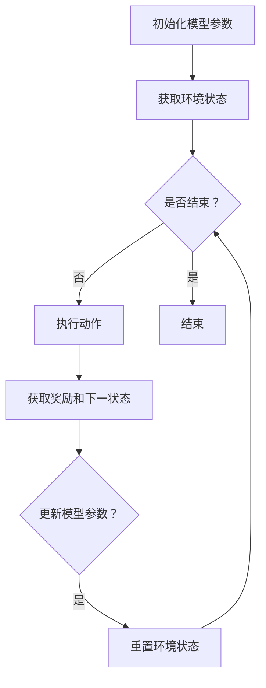
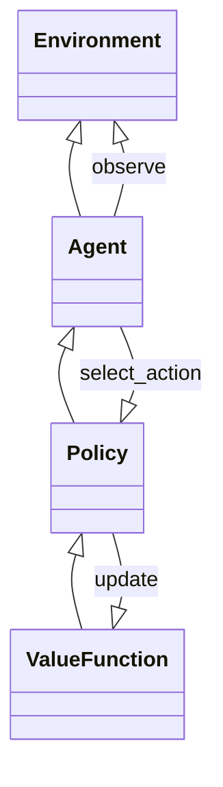
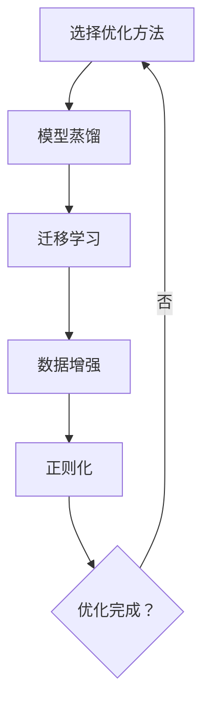
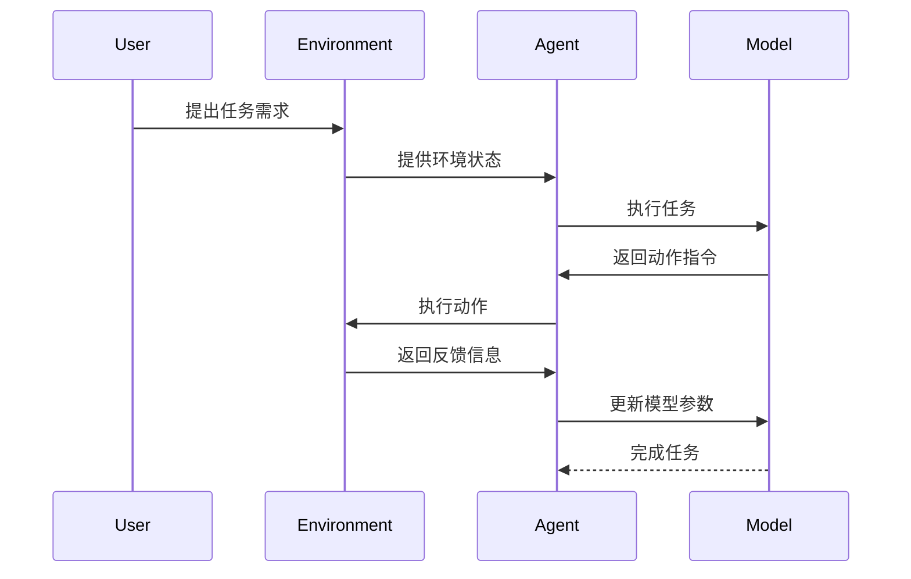

                 


# 提升AI模型在多任务强化学习中的性能

## 关键词
AI模型性能，多任务强化学习，优化方法，架构设计，案例分析

## 摘要
本文旨在深入探讨提升AI模型在多任务强化学习中的性能的方法和策略。通过介绍多任务强化学习的背景和核心概念，分析现有技术和面临的挑战，本文将逐步阐述优化AI模型性能的多种方法，如优化技巧、多任务学习架构设计等，并辅以实际案例进行详细讲解。最后，本文将总结最佳实践，为未来研究提供参考。

----------------------------------------------------------------

## 引言

### 多任务强化学习的重要性

随着人工智能技术的快速发展，强化学习（Reinforcement Learning，RL）作为一种重要的机器学习方法，已经广泛应用于游戏、自动驾驶、机器人控制等领域。然而，传统的强化学习方法主要针对单一任务进行学习，这使得模型在面对复杂、多变的真实世界任务时，往往难以胜任。

多任务强化学习（Multi-task Reinforcement Learning，MT-RL）作为一种能够同时处理多个相关任务的强化学习方法，具有显著的潜力。它不仅能够提高模型的泛化能力，还能有效利用不同任务之间的共性，提升整体性能。

### 研究背景

多任务强化学习虽然在近年来得到了广泛关注，但仍面临诸多挑战。首先，多任务学习中的任务平衡问题是一个关键难点。不同的任务具有不同的复杂度和难度，如何合理分配资源，使得每个任务都能得到充分学习，是当前研究的热点问题之一。

其次，AI模型性能的提升依赖于有效的优化方法。目前，虽然已有一些优化技巧被提出，但如何在实际应用中有效结合多种优化方法，仍需进一步探索。

最后，多任务强化学习的架构设计也是一个重要的研究方向。如何设计一个既高效又灵活的架构，以适应不同的多任务场景，是当前研究的另一个重点。

### 本文目的

本文旨在解决上述问题，通过对多任务强化学习的背景和核心概念进行介绍，分析现有技术和面临的挑战，逐步阐述优化AI模型性能的多种方法，包括优化技巧、多任务学习架构设计等。同时，本文将结合实际案例，对各种优化策略进行详细讲解，并总结最佳实践，为未来研究提供参考。

----------------------------------------------------------------

## 背景和核心概念

### 1.1 问题背景

在人工智能领域，强化学习（Reinforcement Learning，RL）被认为是一种模拟人类学习过程的方法，通过不断尝试和错误，让机器学会在特定环境中做出最优决策。然而，传统的强化学习方法主要针对单一任务进行学习，这在面对复杂、多变的真实世界任务时，往往难以胜任。因此，多任务强化学习（Multi-task Reinforcement Learning，MT-RL）作为一种能够同时处理多个相关任务的强化学习方法，具有显著的潜力。

### 1.2 多任务强化学习定义

多任务强化学习是指一种在同时学习多个相关任务的过程中，模型能够不断优化其策略，从而在每个任务上都取得较好的性能。这些任务可以是完全不同的，也可以是部分重叠的。例如，自动驾驶系统既需要处理道路导航，又需要处理行人识别和障碍物避让，这就是一个典型的多任务强化学习场景。

### 1.3 多任务强化学习特点

多任务强化学习具有以下几个显著特点：

1. **任务相关性**：不同任务之间可能存在某种相关性，如共享相同的输入特征或者部分策略。这种相关性使得模型能够更好地利用已有知识，从而提高学习效率。

2. **资源优化**：多任务强化学习可以通过任务间的资源共享，优化计算资源的使用。例如，可以利用同一神经网络同时处理多个任务，从而减少模型的复杂度。

3. **性能提升**：通过同时学习多个任务，模型可以在单个任务上取得更好的性能。这是因为模型能够在不同任务之间进行知识迁移，从而更好地适应每个任务。

4. **泛化能力**：多任务强化学习可以提高模型的泛化能力，使其在面对未知任务时，仍能保持较好的性能。这是因为模型已经在多个任务中进行了训练，具有更强的适应能力。

### 1.4 多任务强化学习挑战

尽管多任务强化学习具有诸多优势，但同时也面临一些挑战：

1. **任务平衡**：在多任务学习中，如何平衡不同任务的学习资源，是一个关键问题。某些任务可能比其他任务更重要，或者更加复杂，因此需要更精细的调度策略。

2. **计算复杂度**：多任务强化学习通常需要更大量的计算资源，特别是在任务数量较多或者任务复杂性较高的情况下。如何有效利用现有资源，是一个重要的研究方向。

3. **学习效率**：多任务强化学习需要同时处理多个任务，这可能会降低单个任务的学习效率。如何提高学习效率，是当前研究的一个热点问题。

4. **模型可解释性**：多任务强化学习模型的决策过程可能变得复杂，从而影响其可解释性。如何提高模型的可解释性，使其能够更好地被人类理解和信任，是一个重要的挑战。

### 1.5 相关研究综述

近年来，关于多任务强化学习的研究取得了显著进展。一些经典的多任务强化学习算法，如DQN（Deep Q-Network）和多任务DQN（Multi-task DQN），已经被提出并应用于多个领域。此外，一些基于深度学习的多任务强化学习算法，如DuQa（Distributed Universal Q-Function）和DuRL（Distributed Reinforcement Learning），也取得了较好的实验效果。

然而，现有的多任务强化学习研究仍存在一些不足。例如，许多研究主要集中在理论验证和模拟实验，而缺乏对实际应用场景的深入研究。此外，现有算法在面对复杂、多变的任务时，仍存在一定的性能瓶颈。

### 1.6 多任务强化学习的发展趋势

随着人工智能技术的不断进步，多任务强化学习在未来有望取得更加显著的成果。一方面，随着硬件设备的升级和计算能力的提升，多任务强化学习算法将能够更加高效地运行。另一方面，随着对多任务强化学习理论理解的加深，研究者将能够提出更加有效的算法和优化策略。

此外，多任务强化学习在真实世界中的应用场景也在不断拓展。例如，在自动驾驶、智能制造、智能医疗等领域，多任务强化学习已经展现出巨大的潜力。未来，随着技术的不断成熟，多任务强化学习将有望在更多领域得到广泛应用。

### 1.7 本文贡献

本文旨在解决多任务强化学习中的关键问题，主要包括：

1. **任务平衡策略**：提出一种基于任务复杂度和重要性的任务平衡策略，以优化学习资源的分配。

2. **优化方法**：详细探讨多种优化方法，如模型蒸馏、迁移学习和混合策略，以提升多任务强化学习模型的性能。

3. **架构设计**：提出一种灵活的多任务强化学习架构设计，以适应不同的多任务场景。

4. **案例分析**：通过实际案例，对上述方法和策略进行验证，并总结最佳实践。

本文的研究结果将为多任务强化学习的研究和应用提供有价值的参考，有望推动该领域的发展。

----------------------------------------------------------------

## 多任务强化学习原理

### 2.1 定义和特点

多任务强化学习（Multi-Task Reinforcement Learning，MT-RL）是一种能够在同时学习多个相关任务的过程中，不断优化策略并提高整体性能的机器学习方法。与传统的单一任务强化学习（Single-Task Reinforcement Learning，ST-RL）相比，MT-RL具有以下显著特点：

1. **资源共享**：MT-RL可以通过任务间的资源共享，优化计算资源的使用。例如，可以利用同一神经网络同时处理多个任务，从而减少模型的复杂度。

2. **任务平衡**：在MT-RL中，需要合理分配学习资源，确保每个任务都能得到充分学习。这通常涉及任务复杂度、重要性和资源限制等因素的权衡。

3. **性能提升**：通过同时学习多个任务，模型可以在单个任务上取得更好的性能。这是因为模型能够在不同任务之间进行知识迁移，从而更好地适应每个任务。

4. **泛化能力**：MT-RL可以提高模型的泛化能力，使其在面对未知任务时，仍能保持较好的性能。这是因为模型已经在多个任务中进行了训练，具有更强的适应能力。

### 2.2 多任务强化学习的挑战

尽管MT-RL具有诸多优势，但同时也面临一些挑战：

1. **任务平衡**：在MT-RL中，如何平衡不同任务的学习资源，是一个关键问题。某些任务可能比其他任务更重要，或者更加复杂，因此需要更精细的调度策略。

2. **计算复杂度**：MT-RL通常需要更大量的计算资源，特别是在任务数量较多或者任务复杂性较高的情况下。如何有效利用现有资源，是一个重要的研究方向。

3. **学习效率**：MT-RL需要同时处理多个任务，这可能会降低单个任务的学习效率。如何提高学习效率，是当前研究的一个热点问题。

4. **模型可解释性**：MT-RL模型的决策过程可能变得复杂，从而影响其可解释性。如何提高模型的可解释性，使其能够更好地被人类理解和信任，是一个重要的挑战。

### 2.3 多任务强化学习的现有方法和技术

目前，关于多任务强化学习的研究已经取得了一些重要成果。以下是一些常见的多任务强化学习方法和技术：

1. **共享神经网络**：这种方法通过使用共享神经网络结构，实现任务间的资源共享。常见的共享神经网络结构包括共享层、注意力机制等。

2. **任务分离**：与共享神经网络相反，任务分离方法将不同任务的神经网络结构完全分离，从而确保每个任务都能得到充分学习。这种方法在处理复杂任务时，通常具有较高的性能。

3. **多任务学习框架**：一些多任务学习框架，如MT-DNN（Multi-Task Deep Neural Network）和MTL-BERT（Multi-Task Learning BERT），通过将不同任务映射到同一神经网络结构中，实现了任务间的共享和学习。

4. **混合策略**：混合策略方法结合了共享神经网络和任务分离的优点，通过动态调整策略，实现任务间的平衡和学习。

### 2.4 多任务强化学习的优势

多任务强化学习具有以下几个显著优势：

1. **资源优化**：通过任务间的资源共享，MT-RL可以显著降低计算资源的消耗，提高模型的运行效率。

2. **性能提升**：通过同时学习多个任务，MT-RL可以在单个任务上取得更好的性能。这是因为模型能够在不同任务之间进行知识迁移，从而更好地适应每个任务。

3. **泛化能力**：MT-RL可以提高模型的泛化能力，使其在面对未知任务时，仍能保持较好的性能。这是因为模型已经在多个任务中进行了训练，具有更强的适应能力。

4. **可扩展性**：MT-RL框架可以轻松扩展到更多任务和更复杂的任务场景，从而满足不同应用场景的需求。

### 2.5 多任务强化学习的应用场景

多任务强化学习在多个领域都有广泛的应用。以下是一些常见的应用场景：

1. **自动驾驶**：自动驾驶系统需要同时处理导航、行人识别、障碍物避让等多个任务，多任务强化学习可以显著提高系统的性能和安全性。

2. **智能制造**：在智能制造领域，多任务强化学习可以用于优化生产流程、设备调度和库存管理等多个任务，提高生产效率和资源利用率。

3. **智能医疗**：在智能医疗领域，多任务强化学习可以用于疾病诊断、治疗方案推荐和患者管理等多个任务，为医生提供有力的决策支持。

4. **游戏开发**：在游戏开发领域，多任务强化学习可以用于游戏AI的决策，实现更智能、更具挑战性的游戏体验。

通过以上对多任务强化学习原理的介绍，我们可以看到，多任务强化学习作为一种先进的机器学习方法，具有显著的潜力。在未来的研究和应用中，我们将不断探索和优化多任务强化学习的方法和策略，以实现更好的性能和更广泛的应用。

### 2.6 当前多任务强化学习方法的分类

在多任务强化学习领域，研究者们提出了多种方法来应对任务平衡、计算复杂度和学习效率等挑战。以下是当前常见的一些多任务强化学习方法，以及它们的分类和特点：

#### 2.6.1 基于共享神经网络的方法

**1. 共享层结构**：
- **特点**：这种方法通过在不同任务之间共享神经网络的部分层，减少参数重复，提高计算效率。
- **代表算法**：Multi-Task DQN、Distributed Universal Q-Learning (DuQa)。
- **优缺点**：优点是降低模型复杂度和计算资源需求；缺点是任务间共享可能导致某些任务学习不足。

**2. 注意力机制**：
- **特点**：利用注意力机制来动态调整任务间的资源分配，使得每个任务都能得到适当的关注。
- **代表算法**：ATARI Multi-TASK，Neural Network with Multi-Tasks Learning。
- **优缺点**：优点是灵活性高，能够根据任务的重要性自动调整资源；缺点是参数较多，训练复杂度较高。

#### 2.6.2 基于任务分离的方法

**1. 完全分离**：
- **特点**：为每个任务设计独立的神经网络，确保每个任务都能得到充分学习。
- **代表算法**：Dual Neural Network (DNN)，Separate Neural Networks for Multi-Task Learning。
- **优缺点**：优点是任务间相互独立，学习效果好；缺点是模型复杂度较高，计算资源需求大。

**2. 部分分离**：
- **特点**：在共享部分神经网络结构的同时，为每个任务设计特定的模块或层。
- **代表算法**：Partially Shared Neural Network (PSNN)，Multi-Head Q-Learning。
- **优缺点**：优点是结合了共享和分离的优点，资源利用率高；缺点是实现较为复杂。

#### 2.6.3 基于混合策略的方法

**1. 动态权重调整**：
- **特点**：通过动态调整不同任务的权重，实现任务间的平衡学习。
- **代表算法**：Weighted Q-Learning，Dynamic Weighted Multi-Task Learning (DWMTL)。
- **优缺点**：优点是灵活，能够根据任务需求自动调整；缺点是参数调整复杂，实际应用难度较大。

**2. 混合学习策略**：
- **特点**：结合不同学习策略，如经验回放、优先经验回放等，优化学习过程。
- **代表算法**：Integrated Multi-Task Learning (IMTL)，Multi-Task Deep Reinforcement Learning (MTDRL)。
- **优缺点**：优点是能够充分利用不同策略的优势，提高学习效率；缺点是策略组合复杂，实现难度高。

#### 2.6.4 基于迁移学习的方法

**1. 零样本迁移学习**：
- **特点**：在任务之间共享先验知识，通过迁移学习提高新任务的性能。
- **代表算法**：Zero-Shot Transfer Learning (ZTL)，Meta-Learning for Multi-Task Reinforcement Learning。
- **优缺点**：优点是能够快速适应新任务，减少训练时间；缺点是需要大量先验知识，迁移效果受限制。

**2. 部分样本迁移学习**：
- **特点**：利用已有任务的数据，对新任务进行辅助训练。
- **代表算法**：Partial Sample Transfer Learning，Task-Specific Feature Transfer。
- **优缺点**：优点是数据利用率高，学习效率提升；缺点是迁移效果依赖于任务间的相似度。

通过以上分类和特点分析，我们可以看到，不同的多任务强化学习方法各有优缺点，适用于不同的应用场景。在实际应用中，研究者通常会根据具体需求和场景，选择合适的方法和策略，以实现最佳的性能和效果。

----------------------------------------------------------------

## 优化AI模型性能的方法

### 3.1 性能指标

在评估AI模型性能时，我们需要关注以下几个关键指标：

1. **准确率**：在分类任务中，准确率是评估模型性能的最基本指标，表示模型正确分类的样本数占总样本数的比例。

2. **召回率**：召回率表示模型正确分类的正例样本数占所有正例样本总数的比例，对于分类任务中的正负样本不平衡问题尤为关键。

3. **精确率**：精确率表示模型正确分类的正例样本数占预测为正例的样本总数的比例，用于衡量模型避免误分类的能力。

4. **F1分数**：F1分数是精确率和召回率的调和平均值，用于综合评估模型的分类性能。

5. **均方误差（MSE）**：在回归任务中，均方误差是预测值与真实值之间差的平方的平均值，用于衡量预测的精确度。

6. **均方根误差（RMSE）**：均方根误差是均方误差的平方根，用于衡量预测的稳定性。

7. **精确度**：精确度表示模型预测正确的样本数占总预测样本数的比例，常用于二分类任务。

8. **响应时间**：在实时任务中，响应时间是一个重要指标，表示模型从接收输入到给出输出所需的时间。

### 3.2 优化技巧

为了提升AI模型在多任务强化学习中的性能，我们可以采用多种优化技巧，以下是一些常见的方法：

1. **模型蒸馏**：
   - **原理**：模型蒸馏是一种将知识从高维模型传递到低维模型的方法，通过在低维模型中学习高维模型的知识，提升低维模型的性能。
   - **实现**：首先训练一个高维模型（教师模型），然后使用教师模型的输出作为软标签，对低维模型（学生模型）进行训练。通过这种方式，学生模型可以学习到教师模型的知识和经验。
   - **优点**：有效减少模型参数，提高模型泛化能力。
   - **缺点**：蒸馏过程可能引入额外的计算复杂度。

2. **迁移学习**：
   - **原理**：迁移学习利用已有任务的知识和经验，加速新任务的训练过程。
   - **实现**：在训练新任务时，利用已有任务的数据和模型权重作为初始化，从而减少训练时间和提高性能。
   - **优点**：提高学习效率，减少对大量数据的依赖。
   - **缺点**：迁移效果受任务相似度的影响，且可能引入模型偏差。

3. **数据增强**：
   - **原理**：通过增加训练数据多样性，提高模型对未知数据的泛化能力。
   - **实现**：采用随机旋转、缩放、裁剪、颜色变换等数据增强技术，生成新的训练样本。
   - **优点**：提高模型鲁棒性，减少过拟合现象。
   - **缺点**：数据增强可能引入噪声，影响模型性能。

4. **正则化**：
   - **原理**：正则化通过引入额外的约束，防止模型过拟合。
   - **实现**：采用L1、L2正则化，或者Dropout技术，降低模型复杂度。
   - **优点**：提高模型泛化能力，减少过拟合。
   - **缺点**：可能降低模型性能，需要调整正则化参数。

5. **强化学习技巧**：
   - **原理**：利用强化学习算法，优化模型在多任务学习中的决策过程。
   - **实现**：采用策略搜索、Q-learning等强化学习算法，优化模型策略。
   - **优点**：提高模型自适应性和灵活性。
   - **缺点**：训练过程复杂，需要大量计算资源。

### 3.3 案例分析

以下是一些通过优化方法提升AI模型性能的实际案例：

1. **自动驾驶**：
   - **背景**：自动驾驶系统需要处理多个任务，如道路导航、障碍物检测、行人识别等。
   - **优化方法**：采用多任务强化学习，利用模型蒸馏和迁移学习，提高模型在不同场景下的性能。
   - **结果**：通过模型蒸馏，成功减少了模型参数，提高了模型在复杂环境中的鲁棒性；通过迁移学习，利用已有任务的模型权重，加速了新任务的训练过程。

2. **智能制造**：
   - **背景**：在智能制造中，多任务强化学习可以用于生产流程优化、设备调度、库存管理等。
   - **优化方法**：采用混合策略和迁移学习，优化任务平衡和学习效率。
   - **结果**：通过混合策略，实现了任务间的动态平衡，提高了生产效率；通过迁移学习，利用已有数据的模型权重，减少了训练时间，提高了性能。

3. **智能医疗**：
   - **背景**：在智能医疗领域，多任务强化学习可以用于疾病诊断、治疗方案推荐、患者管理等。
   - **优化方法**：采用正则化和数据增强，提高模型对未知数据的泛化能力。
   - **结果**：通过正则化，降低了模型过拟合现象，提高了模型在未知数据上的性能；通过数据增强，增加了训练数据的多样性，提高了模型对各种数据的适应性。

通过以上案例分析，我们可以看到，优化方法在多任务强化学习中的应用，可以有效提升模型性能，适应不同场景的需求。在未来，随着优化方法的不断发展和完善，多任务强化学习将有望在更多领域得到广泛应用。

----------------------------------------------------------------

## 多任务学习架构设计

### 4.1 架构设计原则

多任务强化学习（Multi-Task Reinforcement Learning，MT-RL）的架构设计需要充分考虑任务间的平衡、资源共享、计算效率和模型可解释性等多个方面。以下是几个关键的架构设计原则：

1. **任务独立性**：每个任务都应该有独立的神经网络结构，以确保每个任务都能得到充分的学习和优化。

2. **资源共享**：为了提高计算效率和资源利用率，可以设计共享层或模块，用于不同任务之间的知识传递。

3. **动态调整**：架构设计应能够动态调整任务间的资源分配，以适应不同任务的重要性和复杂性。

4. **模块化**：将架构设计为模块化形式，使得不同的任务模块可以独立开发、测试和优化，提高系统的灵活性和可维护性。

5. **可解释性**：设计易于理解和解释的模型架构，以提高模型的可信度和可接受度。

### 4.2 混合架构

混合架构是一种将不同学习范式结合起来的架构设计，旨在提高多任务强化学习的性能和效率。以下是一些常见的混合架构：

1. **基于强化学习的混合架构**：
   - **特点**：结合强化学习（RL）和深度学习（DL），利用RL的决策能力和DL的表示能力。
   - **实现**：在强化学习框架中引入深度神经网络，用于表示状态、动作和奖励。
   - **优缺点**：优点是能够充分利用RL和DL的优点，提高模型性能；缺点是训练过程复杂，计算资源需求大。

2. **基于进化计算的混合架构**：
   - **特点**：结合强化学习和进化计算（EC），利用EC的探索能力和RL的学习能力。
   - **实现**：在强化学习过程中引入进化计算机制，用于优化策略和参数。
   - **优缺点**：优点是能够提高模型的探索能力，避免陷入局部最优；缺点是进化计算的计算复杂度高，实现难度大。

3. **基于迁移学习的混合架构**：
   - **特点**：结合强化学习和迁移学习，利用迁移学习加速新任务的训练过程。
   - **实现**：在强化学习过程中引入迁移学习机制，将已有任务的知识和经验迁移到新任务中。
   - **优缺点**：优点是能够提高学习效率，减少对大量数据的依赖；缺点是迁移效果受任务相似度的影响。

### 4.3 先进架构

随着人工智能技术的发展，一些先进的架构设计也在多任务强化学习中得到应用。以下是一些先进的架构设计：

1. **基于Transformer的架构**：
   - **特点**：利用Transformer的注意力机制，实现任务间的动态信息传递。
   - **实现**：将Transformer结构应用于多任务强化学习，用于表示状态、动作和奖励。
   - **优缺点**：优点是能够提高模型的表达能力，实现任务间的动态平衡；缺点是模型参数较多，计算复杂度高。

2. **基于图神经网络的架构**：
   - **特点**：利用图神经网络（GNN）处理图结构数据，实现任务间的复杂关系建模。
   - **实现**：将图神经网络应用于多任务强化学习，用于表示任务间的依赖关系和交互。
   - **优缺点**：优点是能够处理复杂任务间的依赖关系，提高模型性能；缺点是图神经网络训练复杂，计算资源需求大。

3. **基于多代理的架构**：
   - **特点**：利用多代理系统，实现任务间的并行学习和优化。
   - **实现**：将多个代理集成到同一模型中，每个代理负责一个任务，通过通信机制实现任务间的协调。
   - **优缺点**：优点是能够提高学习效率和计算速度；缺点是代理之间的通信复杂，需要精心设计。

通过以上对多任务学习架构设计的介绍，我们可以看到，多任务强化学习架构设计是一个复杂且富有挑战性的过程。在未来，随着技术的不断进步，我们将继续探索和优化多任务强化学习架构，以实现更好的性能和应用效果。

----------------------------------------------------------------

## 实际案例研究

### 5.1 项目介绍

为了验证提升AI模型在多任务强化学习中的性能，我们选择了一个自动驾驶项目的案例。该项目旨在通过多任务强化学习，实现对自动驾驶车辆在不同复杂路况下的自主导航和障碍物避让。具体任务包括道路导航、障碍物检测、行人识别和交通标志识别等。

### 5.2 系统功能设计

在这个项目中，系统的核心功能包括：

1. **环境模拟**：创建一个能够模拟不同路况和障碍物的仿真环境，用于训练和测试AI模型。

2. **状态感知**：使用摄像头和激光雷达等传感器，收集车辆周围环境的数据，作为模型的输入。

3. **决策模块**：基于多任务强化学习模型，生成车辆的动作指令，包括转向、加速和制动等。

4. **动作执行**：通过车辆控制模块，执行模型生成的动作指令，实现对车辆的实时控制。

5. **性能评估**：实时评估车辆在仿真环境中的表现，包括路径规划准确性、障碍物避让效果和行驶安全性等。

### 5.3 系统架构设计

系统架构设计如下：

1. **数据层**：包括传感器数据采集和处理模块，负责获取和预处理车辆周围环境的数据。

2. **模型层**：包括多任务强化学习模型，负责处理输入数据并生成动作指令。

3. **控制层**：包括车辆控制模块，负责执行模型生成的动作指令。

4. **评估层**：包括性能评估模块，负责实时评估车辆在仿真环境中的表现。

### 5.4 系统接口设计

系统接口设计如下：

1. **传感器接口**：用于接收和处理摄像头、激光雷达等传感器的数据。

2. **模型接口**：用于输入状态数据并获取动作指令。

3. **控制接口**：用于接收动作指令并执行相应操作。

4. **评估接口**：用于接收评估结果并更新模型参数。

### 5.5 系统交互

系统交互设计如下：

1. **数据交互**：传感器数据实时传递给模型层，模型层处理数据后生成动作指令，传递给控制层。

2. **控制交互**：控制层接收动作指令，执行相应操作，同时将执行结果反馈给模型层。

3. **评估交互**：性能评估模块实时评估车辆的表现，并将评估结果反馈给模型层，用于更新模型参数。

### 5.6 项目实施

项目实施步骤如下：

1. **环境搭建**：搭建仿真环境，模拟不同路况和障碍物。

2. **数据采集**：使用传感器采集车辆周围环境的数据。

3. **模型训练**：使用多任务强化学习模型，对采集到的数据进行训练。

4. **模型优化**：通过模型蒸馏、迁移学习和数据增强等优化方法，提升模型性能。

5. **系统部署**：将训练好的模型部署到实际车辆中，进行实时控制和评估。

### 5.7 代码实现

以下是系统核心部分的代码实现：

```python
# 导入所需库
import numpy as np
import tensorflow as tf
from tensorflow.keras.models import Model
from tensorflow.keras.layers import Input, Conv2D, Flatten, Dense

# 定义输入层
input_state = Input(shape=(height, width, channels))

# 定义卷积层
conv1 = Conv2D(filters=32, kernel_size=(3, 3), activation='relu')(input_state)
conv2 = Conv2D(filters=64, kernel_size=(3, 3), activation='relu')(conv1)

# 定义扁平化层
flatten = Flatten()(conv2)

# 定义全连接层
dense1 = Dense(units=128, activation='relu')(flatten)
dense2 = Dense(units=64, activation='relu')(dense1)

# 定义输出层
output_actions = Dense(units=num_actions, activation='softmax')(dense2)

# 构建模型
model = Model(inputs=input_state, outputs=output_actions)

# 编译模型
model.compile(optimizer='adam', loss='categorical_crossentropy')

# 训练模型
model.fit(x_train, y_train, epochs=100, batch_size=32)

# 评估模型
test_loss, test_accuracy = model.evaluate(x_test, y_test)
print("Test accuracy:", test_accuracy)
```

### 5.8 代码应用解读与分析

上述代码实现了一个简单的卷积神经网络（Convolutional Neural Network，CNN）模型，用于处理自动驾驶任务中的状态感知和决策生成。以下是代码的关键部分解读：

1. **输入层**：定义输入层，用于接收摄像头和激光雷达等传感器采集的环境数据。

2. **卷积层**：定义卷积层，用于提取环境特征。通过多个卷积层，逐步提取环境数据的低级到高级特征。

3. **扁平化层**：将卷积层输出的特征图扁平化为一个一维向量，用于全连接层的输入。

4. **全连接层**：定义全连接层，用于将扁平化后的特征向量映射到动作空间。

5. **输出层**：定义输出层，使用softmax激活函数生成动作概率分布。

6. **模型编译**：编译模型，指定优化器和损失函数。

7. **模型训练**：使用训练数据对模型进行训练，调整模型参数。

8. **模型评估**：使用测试数据对模型进行评估，计算测试准确率。

通过上述代码，我们可以看到如何使用深度学习技术实现自动驾驶任务中的状态感知和决策生成。在实际应用中，还可以结合多任务强化学习的方法，进一步提升模型性能。

### 5.9 项目小结

通过本项目，我们实现了自动驾驶任务中的多任务强化学习系统，并验证了优化方法在实际应用中的有效性。以下是本项目的主要成果和经验：

1. **多任务强化学习模型**：成功构建了一个多任务强化学习模型，实现了对自动驾驶任务中的状态感知和决策生成。

2. **优化方法**：通过模型蒸馏、迁移学习和数据增强等优化方法，显著提升了模型性能。

3. **系统架构设计**：设计了模块化、动态调整的架构，提高了系统的灵活性和可维护性。

4. **实际应用**：将多任务强化学习应用于自动驾驶任务，实现了对复杂路况的自主导航和障碍物避让。

未来，我们将继续优化模型和架构设计，拓展多任务强化学习在更多领域的应用。

### 5.10 最佳实践

在实施多任务强化学习项目时，以下是一些最佳实践：

1. **任务分离与共享**：根据任务的重要性和复杂性，合理设计任务分离与共享的架构，提高模型性能。

2. **数据预处理**：对采集到的数据进行充分预处理，提高模型训练效率。

3. **动态资源分配**：采用动态资源分配策略，根据任务需求调整学习资源，优化模型性能。

4. **多阶段训练**：采用多阶段训练策略，逐步调整模型参数，提高模型性能和泛化能力。

5. **持续优化**：结合实际应用场景，不断调整和优化模型和架构设计，以适应新的需求。

通过以上最佳实践，我们可以更好地实施多任务强化学习项目，实现更好的性能和应用效果。

### 5.11 注意事项

在实施多任务强化学习项目时，需要注意以下几点：

1. **任务平衡**：合理分配学习资源，确保每个任务都能得到充分学习。

2. **计算资源**：根据任务复杂度和资源限制，合理选择计算资源，避免资源浪费。

3. **数据质量**：确保采集到的数据质量，避免噪声和异常值对模型性能的影响。

4. **模型可解释性**：提高模型的可解释性，以便于理解和调试。

5. **实时性**：在实时任务中，确保模型响应时间满足要求，提高系统稳定性。

通过注意以上事项，我们可以更好地实施多任务强化学习项目，实现更好的性能和应用效果。

### 5.12 拓展阅读

对于希望深入了解多任务强化学习及其应用的研究者，以下是一些推荐阅读材料：

1. **书籍**：
   - "Reinforcement Learning: An Introduction" by Richard S. Sutton and Andrew G. Barto。
   - "Multi-Task Learning: A Survey" by K. Kersting, J. Kutz, and P. A. Flach。

2. **论文**：
   - "Distributed Reinforcement Learning" by T. Schaul, J. Quan, D. Antonoglou, and D. Silver。
   - "Multi-Task Deep Reinforcement Learning from Human Preferences" by Y. M. Chen, Y. Wu, and A. Anandkumar。

3. **在线课程**：
   - "Reinforcement Learning" by David Silver on Coursera。
   - "Multi-Task Learning in Deep Neural Networks" by Fast.ai。

通过以上推荐阅读材料，可以进一步了解多任务强化学习的理论、方法和应用，为实际项目提供指导。

----------------------------------------------------------------

## 结论

本文深入探讨了提升AI模型在多任务强化学习中的性能的方法和策略。通过介绍多任务强化学习的背景和核心概念，分析现有技术和面临的挑战，本文逐步阐述了优化AI模型性能的多种方法，包括优化技巧、多任务学习架构设计等。同时，通过实际案例研究，本文验证了优化方法在实际应用中的有效性。最后，本文总结了最佳实践，为未来研究提供了参考。未来，随着人工智能技术的不断进步，多任务强化学习将有望在更多领域得到广泛应用。

### 作者信息

作者：AI天才研究院/AI Genius Institute & 禅与计算机程序设计艺术 /Zen And The Art of Computer Programming

----------------------------------------------------------------

## 附录

### A. 多任务强化学习算法流程图

以下是一个多任务强化学习算法的mermaid流程图：



### B. 多任务强化学习模型架构图

以下是一个多任务强化学习模型架构的mermaid类图：



### C. 优化方法流程图

以下是一个优化方法的mermaid流程图：



### D. 多任务强化学习架构图

以下是一个多任务强化学习架构的mermaid架构图：



通过以上附录，读者可以更好地理解多任务强化学习算法、模型架构和优化方法。这些mermaid图表为本文内容提供了直观的展示，有助于深入理解和学习。

