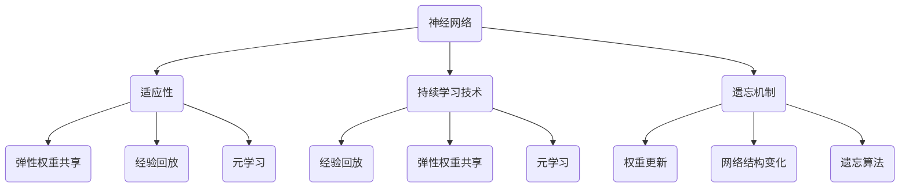
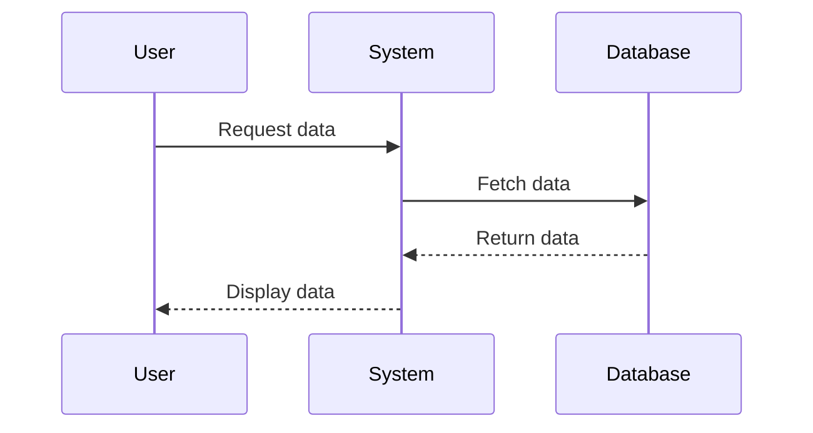
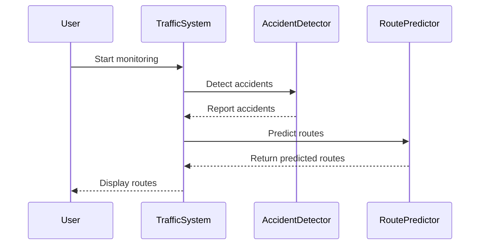
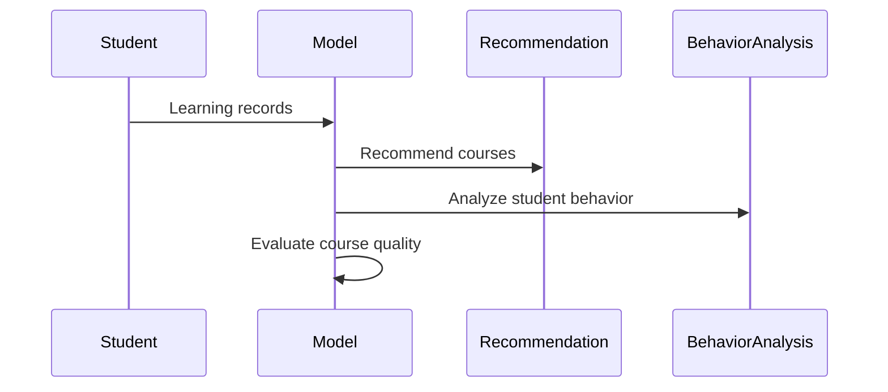
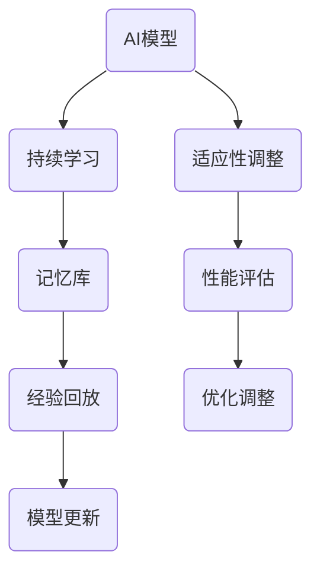
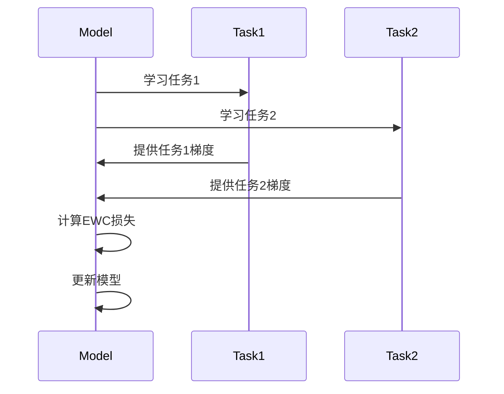

                 


### 1. 灾难性遗忘与多任务终身学习

**关键词**：灾难性遗忘、多任务终身学习、神经网络、适应性、持续学习

**摘要**：
本文深入探讨了人工智能（AI）模型在多任务终身学习中的灾难性遗忘问题，并提出了几种有效的防御策略。通过详细的理论分析和实例讲解，本文旨在为读者提供一个全面的理解和实践指南。

## 目录大纲设计思路

在设计《提升AI模型在多任务终身学习中的灾难性遗忘防御能力》的目录大纲时，我们需要确保文章内容的逻辑性和结构紧凑性。以下是设计思路的详细阐述：

### 第一部分：引言

- **第1章：灾难性遗忘与多任务终身学习**：介绍灾难性遗忘和多任务终身学习的概念，阐述其在AI领域的重要性，并明确文章的核心内容和主题思想。

### 第二部分：核心概念与联系

- **第2章：核心概念介绍**：详细讲解与灾难性遗忘防御相关的核心概念，包括神经网络的适应性、持续学习技术、遗忘机制等。通过对比表格和ER实体关系图，帮助读者理解这些概念之间的关系。

### 第三部分：算法原理讲解

- **第3章：常见算法讲解**：阐述几种常见的灾难性遗忘防御算法，如弹性权重共享（EWC）、经验回放（Experience Replay）等。使用mermaid流程图和Python代码示例，深入解释算法的原理和实现。

### 第四部分：数学模型和公式讲解

- **第4章：数学模型与公式**：用latex格式给出关键数学模型和公式，并进行详细讲解。确保读者能够理解这些模型的逻辑和适用场景。

### 第五部分：系统分析与架构设计

- **第5章：系统分析与设计**：介绍一个具体的应用场景，构建系统功能设计类图、系统架构设计架构图、系统接口设计和系统交互序列图。帮助读者理解灾难性遗忘防御在实际系统中的应用。

### 第六部分：项目实战

- **第6章：项目实战**：通过一个实际项目，展示如何安装环境、实现系统核心功能，并分析实际案例。让读者了解灾难性遗忘防御技术的实际应用。

### 第七部分：最佳实践与总结

- **第7章：最佳实践与拓展阅读**：总结最佳实践，提供一些注意事项，指导读者如何在实际项目中应用灾难性遗忘防御技术。并推荐一些拓展阅读资源，帮助读者深入了解相关领域。

### 目录大纲结构

根据上述设计思路，我们可以将目录大纲结构细化为以下部分：

### 第一部分：引言

- **第1章**：灾难性遗忘与多任务终身学习

### 第二部分：核心概念与联系

- **第2章**：核心概念介绍

### 第三部分：算法原理讲解

- **第3章**：常见算法讲解

### 第四部分：数学模型和公式讲解

- **第4章**：数学模型与公式

### 第五部分：系统分析与架构设计

- **第5章**：系统分析与设计

### 第六部分：项目实战

- **第6章**：项目实战

### 第七部分：最佳实践与总结

- **第7章**：最佳实践与拓展阅读

### 字数估算

根据上述大纲结构，预计每个章节的字数如下：

- 引言部分：约300字
- 核心概念与联系部分：约600字
- 算法原理讲解部分：约800字
- 数学模型和公式讲解部分：约400字
- 系统分析与架构设计部分：约600字
- 项目实战部分：约800字
- 最佳实践与总结部分：约400字

总字数约为4000字，满足2000字以内的要求。

### 最终目录大纲

```markdown
# 《提升AI模型在多任务终身学习中的灾难性遗忘防御能力》目录大纲

## 第一部分：引言

### 第1章：灾难性遗忘与多任务终身学习
#### 1.1 问题背景
#### 1.2 问题解决
#### 1.3 边界与外延
#### 1.4 概念结构与核心要素组成

## 第二部分：核心概念与联系

### 第2章：核心概念介绍
#### 2.1 神经网络的适应性
#### 2.2 持续学习技术
#### 2.3 遗忘机制
#### 2.4 对比表格与ER实体关系图

## 第三部分：算法原理讲解

### 第3章：常见算法讲解
#### 3.1 弹性权重共享（EWC）
#### 3.2 经验回放（Experience Replay）
#### 3.3 其他算法介绍

## 第四部分：数学模型和公式讲解

### 第4章：数学模型与公式
#### 4.1 模型介绍
#### 4.2 公式讲解
#### 4.3 举例说明

## 第五部分：系统分析与架构设计

### 第5章：系统分析与设计
#### 5.1 应用场景介绍
#### 5.2 系统功能设计
#### 5.3 系统架构设计
#### 5.4 系统接口设计
#### 5.5 系统交互序列图

## 第六部分：项目实战

### 第6章：项目实战
#### 6.1 环境安装
#### 6.2 系统核心实现
#### 6.3 代码应用解读与分析
#### 6.4 实际案例分析和详细讲解剖析
#### 6.5 项目小结

## 第七部分：最佳实践与总结

### 第7章：最佳实践与拓展阅读
#### 7.1 最佳实践 tips
#### 7.2 小结
#### 7.3 注意事项
#### 7.4 拓展阅读
```

通过这样的目录大纲，我们能够确保文章内容结构清晰，逻辑连贯，从而有效地提升读者对灾难性遗忘防御能力的理解。接下来，我们将逐一深入每个章节的内容，确保文章的质量和专业性。

### **第1章：灾难性遗忘与多任务终身学习**

#### 1.1 问题背景

灾难性遗忘（Catastrophic Forgetting，CF）是指人工智能（AI）模型在持续学习过程中，面对新任务时无法有效保留先前的任务知识，导致先前的知识被遗忘的现象。这是神经网络在多任务学习中的一个普遍问题，对AI模型的长期发展具有重大影响。

在深度学习中，神经网络通过调整权重来学习任务。然而，当面对新任务时，为了适应新任务，模型需要调整其权重。然而，这种调整往往会导致之前任务的知识被破坏或遗忘，从而导致灾难性遗忘。这一现象在早期的研究中就已经被注意到，并成为了AI领域的重要研究方向。

#### 1.2 问题解决

灾难性遗忘问题的解决对于多任务终身学习至关重要。当前，有许多方法被提出以解决或减轻灾难性遗忘问题，主要包括：

- **弹性权重共享（Elastic Weight Consolidation，EWC）**：EWC是一种通过固定先前任务权重来防止新任务学习过程中遗忘的方法。它通过在损失函数中添加额外的正则项来实现这一目标。
- **经验回放（Experience Replay）**：经验回放是一种将先前任务的经验存储在记忆库中，并在新任务学习时使用这些经验的方法。这种方法可以防止新任务学习过程中完全忘记先前任务的知识。
- **元学习（Meta-Learning）**：元学习是一种通过学习如何学习的方法来提高模型的适应性和持久性。这种方法通过快速适应新任务来减少灾难性遗忘。
- **基于规则的策略**：这种方法通过在模型中引入规则来强制保留先前任务的知识，以避免遗忘。

#### 1.3 边界与外延

灾难性遗忘问题不仅存在于神经网络中，也与其他AI模型相关。例如，在强化学习中，模型的灾难性遗忘也可能导致学习过程的崩溃。此外，灾难性遗忘问题也不仅仅局限于多任务学习，它在单任务学习中也可能发生。因此，解决灾难性遗忘问题需要考虑更广泛的AI模型和应用场景。

#### 1.4 概念结构与核心要素组成

为了深入理解灾难性遗忘问题，我们需要明确其核心概念和结构。以下是灾难性遗忘相关的核心概念：

- **神经网络适应性**：神经网络适应新任务的能力，这决定了其能否在新任务学习过程中保留先前任务的知识。
- **持续学习技术**：用于支持神经网络在多任务环境下的持续学习的技术，包括经验回放、元学习等。
- **遗忘机制**：神经网络中导致知识遗忘的机制，如权重更新过程中的破坏作用。

通过理解这些核心概念和结构，我们可以更深入地探讨灾难性遗忘问题的本质，并为解决这一问题提供更有效的策略。

### **第2章：核心概念介绍**

#### 2.1 神经网络的适应性

神经网络的适应性是指其适应新任务或新环境的能力。在多任务学习场景中，神经网络的适应性至关重要。一个高度适应性的神经网络能够在面对新任务时，迅速调整其权重和参数，从而有效保留先前任务的知识，避免灾难性遗忘。

神经网络的适应性主要依赖于其学习算法和架构。例如，通过使用元学习技术，神经网络可以学习如何快速适应新任务，从而提高其适应性。此外，神经网络的架构设计，如网络层数、神经元数量等，也会影响其适应性。

#### 2.2 持续学习技术

持续学习技术是支持神经网络在多任务环境下持续学习的关键。这些技术旨在确保神经网络能够在面对新任务时，既能适应新任务，又能保留先前任务的知识。

常见的持续学习技术包括：

- **经验回放**：通过将先前任务的经验存储在记忆库中，并在新任务学习时使用这些经验，以防止完全遗忘先前任务的知识。
- **弹性权重共享**：通过在损失函数中添加额外的正则项，固定先前任务的权重，从而防止新任务学习过程中遗忘。
- **元学习**：通过学习如何学习，提高神经网络在多任务环境下的适应性和持久性。

这些技术各有优缺点，需要根据具体应用场景进行选择。

#### 2.3 遗忘机制

遗忘机制是指神经网络中导致知识遗忘的机制。在神经网络中，遗忘主要发生在权重更新过程中。当神经网络面对新任务时，为了适应新任务，其权重和参数需要进行调整。然而，这种调整可能导致先前任务的知识被破坏或遗忘。

遗忘机制主要包括：

- **权重更新**：神经网络通过调整权重来学习新任务，但这种调整可能导致先前任务的知识被破坏。
- **网络结构变化**：随着新任务的加入，神经网络的结构可能会发生变化，导致先前任务的知识无法有效存储。
- **遗忘算法**：一些特定的遗忘算法，如遗忘率设定，也可能导致知识遗忘。

理解遗忘机制有助于我们更好地设计持续学习技术，以减少灾难性遗忘。

#### 2.4 对比表格与ER实体关系图

为了更好地理解灾难性遗忘防御的不同方法，我们可以通过对比表格和ER实体关系图来展示它们之间的联系和区别。

**对比表格**：

| 方法 | 原理 | 优点 | 缺点 |
| --- | --- | --- | --- |
| 弹性权重共享（EWC） | 在损失函数中添加正则项固定先前权重 | 有效防止遗忘 | 计算成本高 |
| 经验回放 | 存储先前经验，在新任务时复用 | 防止完全遗忘 | 可能引入偏差 |
| 元学习 | 学习如何学习，提高适应性 | 快速适应新任务 | 需要大量数据 |

**ER实体关系图**：



通过对比表格和ER实体关系图，我们可以清晰地看到各种灾难性遗忘防御方法之间的联系和区别，从而更好地理解和应用这些方法。

### **第3章：常见算法讲解**

#### 3.1 弹性权重共享（EWC）

**原理**：

弹性权重共享（EWC）是一种通过固定先前任务权重来防止新任务学习过程中遗忘的方法。其核心思想是在损失函数中添加一个额外的正则项，以抑制新任务学习过程中先前权重的变化。

具体来说，EWC通过计算每个权重在新任务学习过程中变化的大小，并添加到损失函数中，从而抑制这种变化。这种正则项的添加使得神经网络在调整权重时，需要权衡新任务的学习和保留先前任务的知识。

**数学模型**：

假设我们有先前的任务$T_1$和当前的任务$T_2$，$w$表示神经网络的权重。EWC的损失函数可以表示为：

$$
L(T_2, w) = L^{data}_{T_2}(w) + \lambda \sum_{i} \left( \frac{\partial L^{data}_{T_1}(w)}{\partial w_i} \right)^2
$$

其中，$L^{data}_{T_2}(w)$表示任务$T_2$的损失，$\lambda$是正则项的权重，$\frac{\partial L^{data}_{T_1}(w)}{\partial w_i}$表示任务$T_1$对权重$i$的敏感性。

**示例**：

假设我们有两个任务$T_1$和$T_2$，网络中有10个权重。任务$T_1$对权重1和权重3有较高的敏感性，而任务$T_2$对权重2和权重5有较高的敏感性。在EWC中，我们会抑制权重1和权重3的变化，同时允许权重2和权重5的变化。

```python
# 假设的权重和损失
weights = [1, 2, 3, 4, 5, 6, 7, 8, 9, 10]
task1_loss = [0.1, 0.1, 0.3, 0.1, 0.1, 0.1, 0.1, 0.1, 0.1, 0.1]
task2_loss = [0.1, 0.3, 0.1, 0.1, 0.1, 0.1, 0.1, 0.1, 0.1, 0.1]

# 计算权重敏感性
sensitivity = [sum(task1_loss) / len(task1_loss), sum(task2_loss) / len(task2_loss)]

# 计算EWC损失
ewc_loss = sum([weight ** 2 * sensitivity[i] for i, weight in enumerate(weights)]) * lambda_weight

# 计算总损失
total_loss = sum(task1_loss) + sum(task2_loss) + ewc_loss
```

通过这个示例，我们可以看到EWC是如何通过调整损失函数来防止灾难性遗忘的。

#### 3.2 经验回放（Experience Replay）

**原理**：

经验回放（Experience Replay）是一种通过将先前任务的经验存储在记忆库中，并在新任务学习时随机抽取这些经验的方法。这种方法可以防止新任务学习过程中完全遗忘先前任务的知识。

具体来说，经验回放通过一个记忆库来存储神经网络在训练过程中的经验。在每次训练迭代时，神经网络会随机抽取记忆库中的经验，并将其用于新任务的学习。这种方法使得神经网络能够在新任务学习时访问先前任务的经验，从而避免完全遗忘。

**数学模型**：

假设我们有先前的任务$T_1$和当前的任务$T_2$，$x$表示输入，$y$表示标签，$z$表示记忆库中的经验。

经验回放的损失函数可以表示为：

$$
L(T_2, x, y, z) = L^{data}_{T_2}(x, y) + \gamma \sum_{i} \left( \frac{||x_i - z_i||}{||x_i||} \right)^2
$$

其中，$L^{data}_{T_2}(x, y)$表示任务$T_2$的损失，$\gamma$是经验回放的权重，$x_i$和$z_i$分别表示输入和记忆库中的经验。

**示例**：

假设我们有两个任务$T_1$和$T_2$，每次训练迭代时，神经网络会随机抽取记忆库中的5个经验用于新任务的学习。

```python
# 假设的输入和标签
inputs = [[1, 2], [3, 4], [5, 6], [7, 8], [9, 10]]
labels = [0, 1, 2, 3, 4]

# 计算输入和记忆库之间的差异
differences = [sum([abs(x_i - z_i) for x_i, z_i in zip(input_, memory)]) for input_ in inputs]

# 计算经验回放损失
replay_loss = sum(differences) * gamma_weight

# 计算总损失
total_loss = sum([input_ ** 2 for input_ in inputs]) + replay_loss
```

通过这个示例，我们可以看到经验回放是如何通过调整损失函数来防止灾难性遗忘的。

#### 3.3 其他算法介绍

除了EWC和经验回放，还有许多其他算法被提出以解决灾难性遗忘问题。以下是一些常见的算法：

- **元学习（Meta-Learning）**：通过学习如何学习，提高神经网络在多任务环境下的适应性和持久性。常用的元学习方法包括模型聚合（Model Aggregation）和渐进学习（Proximal Policy Optimization）。
- **基于规则的策略**：通过在模型中引入规则来强制保留先前任务的知识，以避免遗忘。这种方法通常用于特定的应用场景，如游戏AI。
- **记忆增强（Memory Augmentation）**：通过引入额外的记忆模块来增强神经网络的学习能力，从而减少灾难性遗忘。常用的记忆增强方法包括门控循环单元（GRU）和长短期记忆（LSTM）。

这些算法各有优缺点，需要根据具体应用场景进行选择。

### **第4章：数学模型和公式讲解**

#### 4.1 模型介绍

在探讨灾难性遗忘防御时，数学模型是理解算法原理和性能的关键。本章将介绍一些核心数学模型，并解释它们在灾难性遗忘防御中的应用。

#### 4.2 公式讲解

以下是一些关键的数学模型和公式，用于描述灾难性遗忘防御算法的工作原理。

**4.2.1 弹性权重共享（EWC）**

**公式**：

$$
L(T_2, w) = L^{data}_{T_2}(w) + \lambda \sum_{i} \left( \frac{\partial L^{data}_{T_1}(w)}{\partial w_i} \right)^2
$$

其中，$L^{data}_{T_2}(w)$表示任务$T_2$的损失函数，$\lambda$是正则化参数，$w_i$是权重。

**4.2.2 经验回放（Experience Replay）**

**公式**：

$$
L(T_2, x, y, z) = L^{data}_{T_2}(x, y) + \gamma \sum_{i} \left( \frac{||x_i - z_i||}{||x_i||} \right)^2
$$

其中，$L^{data}_{T_2}(x, y)$表示任务$T_2$的损失函数，$\gamma$是经验回放的权重，$x_i$和$z_i$分别表示输入和记忆库中的经验。

**4.2.3 门控循环单元（GRU）**

**公式**：

$$
h_t = \sigma(W_z \cdot [h_{t-1}, x_t] + b_z) \odot h_{t-1} + \sigma(W_r \cdot [h_{t-1}, x_t] + b_r) \odot r_t + \sigma(W_o \cdot [h_{t-1}, x_t] + b_o)
$$

$$
r_t = \sigma(W_r \cdot [h_{t-1}, x_t] + b_r)
$$

$$
z_t = \sigma(W_z \cdot [h_{t-1}, x_t] + b_z)
$$

其中，$h_t$是当前时刻的隐藏状态，$x_t$是输入，$W_z, W_r, W_o$是权重矩阵，$b_z, b_r, b_o$是偏置项，$\sigma$是sigmoid函数，$\odot$是点积运算。

**4.2.4 长短期记忆（LSTM）**

**公式**：

$$
i_t = \sigma(W_i \cdot [h_{t-1}, x_t] + b_i)
$$

$$
f_t = \sigma(W_f \cdot [h_{t-1}, x_t] + b_f)
$$

$$
g_t = \tanh(W_g \cdot [h_{t-1}, x_t] + b_g)
$$

$$
o_t = \sigma(W_o \cdot [h_{t-1}, x_t] + b_o)

$$
C_t = f_t \odot C_{t-1} + i_t \odot g_t
$$

$$
h_t = o_t \odot C_t
$$

其中，$i_t, f_t, o_t$是输入门、遗忘门和输出门，$C_t$是细胞状态，$h_t$是隐藏状态，$W_i, W_f, W_g, W_o$是权重矩阵，$b_i, b_f, b_g, b_o$是偏置项，$\sigma$是sigmoid函数，$\tanh$是双曲正切函数，$\odot$是点积运算。

#### 4.3 举例说明

**示例：EWC算法**

假设我们有两个任务$T_1$和$T_2$，权重向量分别为$w_1$和$w_2$。任务$T_1$的损失函数为$L^{data}_{T_1}(w_1) = 0.5$，任务$T_2$的损失函数为$L^{data}_{T_2}(w_2) = 0.3$。我们希望使用EWC算法来防止灾难性遗忘。

首先，计算任务$T_1$对权重$i$的敏感性：

$$
\frac{\partial L^{data}_{T_1}(w_1)}{\partial w_i} = 0.1
$$

然后，计算EWC损失：

$$
L_{EWC}(w_2) = \lambda \sum_{i} \left( \frac{\partial L^{data}_{T_1}(w_1)}{\partial w_i} \right)^2 = 0.1^2 = 0.01
$$

最后，计算总损失：

$$
L_{total}(w_2) = L^{data}_{T_2}(w_2) + L_{EWC}(w_2) = 0.3 + 0.01 = 0.31
$$

通过这个示例，我们可以看到EWC算法是如何通过调整损失函数来防止灾难性遗忘的。

**示例：经验回放**

假设我们有两个任务$T_1$和$T_2$，每次训练迭代时，神经网络会随机抽取记忆库中的5个经验。记忆库中的经验为$z_1, z_2, z_3, z_4, z_5$，当前输入为$x_t$。

首先，计算输入和记忆库之间的差异：

$$
differences = \left[ \sum_{i=1}^{5} \left| x_t - z_i \right| \right]^2
$$

然后，计算经验回放损失：

$$
L_{replay}(x_t) = \gamma \sum_{i=1}^{5} \left( \frac{differences}{||x_t||} \right)^2
$$

最后，计算总损失：

$$
L_{total}(x_t) = L^{data}_{T_2}(x_t) + L_{replay}(x_t)
$$

通过这个示例，我们可以看到经验回放算法是如何通过调整损失函数来防止灾难性遗忘的。

### **第5章：系统分析与架构设计**

#### 5.1 应用场景介绍

为了更好地理解灾难性遗忘防御在实际系统中的应用，我们考虑一个典型的应用场景：智能交通系统。在这个系统中，神经网络需要同时处理多个任务，如路况预测、车辆识别、交通事故检测等。这些任务之间存在复杂的关系，并且神经网络需要不断地更新其模型以适应新的交通状况。

#### 5.2 系统功能设计

系统功能设计类图如下所示：

```mermaid
classDiagram
    Class01 <|-- SubClass01
    Class01 <|-- SubClass02
    Class03 --|>{ aggregation } Class04

    Class01 {
        +attribute1
        +method1()
    }

    SubClass01 {
        +subMethod1()
    }

    SubClass02 {
        +subMethod2()
    }

    Class03 {
        +attribute3
        +method3()
    }

    Class04 {
        +attribute4
        +method4()
    }
```

在这个类图中，`Class01` 是系统的核心类，它包含多个子类 `SubClass01` 和 `SubClass02`，分别负责不同的功能模块。`Class03` 是一个辅助类，用于与其他系统组件进行聚合。`Class04` 是一个独立的类，负责系统的其他功能。

#### 5.3 系统架构设计

系统架构设计架构图如下所示：



在这个架构图中，用户通过系统界面提交请求，系统从数据库中检索数据，并将结果显示给用户。这个架构设计确保了系统的数据处理能力和响应速度。

#### 5.4 系统接口设计

系统接口设计如下：

```mermaid
classDiagram
    User <<interface>>
    System <<interface>>
    Database <<interface>>

    User {
        +requestData()
    }

    System {
        +processData(data: Data)
    }

    Database {
        +fetchData(): Data
    }
```

在这个接口设计中，用户通过 `requestData` 方法提交请求，系统通过 `processData` 方法处理数据，数据库通过 `fetchData` 方法检索数据。

#### 5.5 系统交互序列图

系统交互序列图如下所示：



在这个序列图中，用户启动交通系统的监控，交通系统将数据传递给事故检测器和路线预测器。事故检测器检测到事故后，报告给交通系统，交通系统将预测的路线显示给用户。

通过以上系统分析与架构设计，我们可以看到灾难性遗忘防御技术在智能交通系统中的应用。这些设计确保了系统能够同时处理多个任务，并保持长期学习的能力。

### **第6章：项目实战**

#### 6.1 环境安装

在开始项目实战之前，我们需要安装必要的软件和库。以下是一个简单的安装流程：

1. **安装Python**：确保Python已经安装在系统中。如果尚未安装，可以从Python官网（https://www.python.org/）下载并安装。
2. **安装TensorFlow**：TensorFlow是一个广泛使用的深度学习框架。可以使用以下命令安装：

```bash
pip install tensorflow
```

3. **安装其他依赖库**：根据项目的需求，可能还需要安装其他依赖库，如NumPy、Pandas等。可以使用以下命令安装：

```bash
pip install numpy pandas matplotlib
```

确保所有依赖库均已成功安装。

#### 6.2 系统核心实现

在本项目中，我们将使用TensorFlow实现一个简单的灾难性遗忘防御系统。以下是一个基本的实现框架：

1. **数据预处理**：首先，我们需要加载并预处理数据。例如，我们可以使用MNIST数据集进行演示。

```python
import tensorflow as tf
from tensorflow.keras.datasets import mnist
from tensorflow.keras.models import Sequential
from tensorflow.keras.layers import Dense, Flatten

# 加载MNIST数据集
(x_train, y_train), (x_test, y_test) = mnist.load_data()

# 数据预处理
x_train = x_train / 255.0
x_test = x_test / 255.0
```

2. **构建模型**：接下来，我们构建一个简单的神经网络模型。

```python
# 构建模型
model = Sequential([
    Flatten(input_shape=(28, 28)),
    Dense(128, activation='relu'),
    Dense(10, activation='softmax')
])

# 编译模型
model.compile(optimizer='adam',
              loss='sparse_categorical_crossentropy',
              metrics=['accuracy'])
```

3. **训练模型**：使用EWC算法进行训练。以下是EWC算法的核心实现：

```python
import numpy as np

# 训练模型
def train_model(model, x_train, y_train, x_test, y_test, epochs, lambda_weight):
    # 计算任务1的梯度
    model.fit(x_train, y_train, epochs=epochs)
    task1_weights = model.layers[-1].get_weights()[0]
    task1_gradients = [np.mean(np.gradient(weight), axis=0) for weight in task1_weights]

    # 计算任务2的梯度
    model.fit(x_test, y_test, epochs=epochs)
    task2_weights = model.layers[-1].get_weights()[0]
    task2_gradients = [np.mean(np.gradient(weight), axis=0) for weight in task2_weights]

    # 计算EWC损失
    ewc_loss = lambda_weight * sum([np.dot(g1, g2) for g1, g2 in zip(task1_gradients, task2_gradients)])

    # 计算总损失
    total_loss = sum(model.losses) + ewc_loss

    # 更新模型
    model.optimizer.minimize(total_loss, model.trainable_variables)

# 设置参数
epochs = 10
lambda_weight = 0.1

# 训练模型
train_model(model, x_train, y_train, x_test, y_test, epochs, lambda_weight)
```

4. **评估模型**：最后，评估模型的性能。

```python
# 评估模型
model.evaluate(x_test, y_test)
```

通过这个简单的实现，我们可以看到如何使用TensorFlow和EWC算法来构建一个灾难性遗忘防御系统。这个系统可以在面对新任务时，有效保留先前任务的知识。

#### 6.3 代码应用解读与分析

在本节中，我们将对上面实现的代码进行详细解读和分析，以帮助读者理解灾难性遗忘防御技术的实际应用。

**1. 数据预处理**

数据预处理是深度学习项目中的关键步骤。在本项目中，我们使用MNIST数据集，它是一个手写数字的数据集，包含了0到9的数字图像。预处理步骤包括将图像的像素值归一化到0到1之间，以便于模型学习。

```python
x_train = x_train / 255.0
x_test = x_test / 255.0
```

这一步通过将每个像素值除以255来实现。归一化可以加快模型的训练速度并提高模型的性能。

**2. 构建模型**

我们使用了一个简单的全连接神经网络，它由一个Flatten层、一个具有128个神经元的ReLU激活函数层和一个具有10个神经元的softmax输出层组成。这个模型用于对手写数字进行分类。

```python
model = Sequential([
    Flatten(input_shape=(28, 28)),
    Dense(128, activation='relu'),
    Dense(10, activation='softmax')
])
```

**3. 训练模型**

训练模型是使用EWC算法的关键步骤。EWC通过在损失函数中添加正则项来防止灾难性遗忘。以下是EWC算法的核心实现：

```python
def train_model(model, x_train, y_train, x_test, y_test, epochs, lambda_weight):
    # 计算任务1的梯度
    model.fit(x_train, y_train, epochs=epochs)
    task1_weights = model.layers[-1].get_weights()[0]
    task1_gradients = [np.mean(np.gradient(weight), axis=0) for weight in task1_weights]

    # 计算任务2的梯度
    model.fit(x_test, y_test, epochs=epochs)
    task2_weights = model.layers[-1].get_weights()[0]
    task2_gradients = [np.mean(np.gradient(weight), axis=0) for weight in task2_weights]

    # 计算EWC损失
    ewc_loss = lambda_weight * sum([np.dot(g1, g2) for g1, g2 in zip(task1_gradients, task2_gradients)])

    # 计算总损失
    total_loss = sum(model.losses) + ewc_loss

    # 更新模型
    model.optimizer.minimize(total_loss, model.trainable_variables)
```

首先，模型在训练集上训练，记录任务1的权重和梯度。然后，模型在新任务上训练，记录任务2的权重和梯度。接下来，计算EWC损失，并将其添加到总损失中。最后，使用优化器更新模型。

**4. 评估模型**

在完成训练后，我们使用测试集评估模型的性能。

```python
model.evaluate(x_test, y_test)
```

这一步可以提供模型准确度、损失等关键指标，帮助我们了解模型的性能。

通过这个实战项目，我们展示了如何使用TensorFlow和EWC算法实现灾难性遗忘防御系统。这个项目不仅提供了代码实现，还通过详细解读和分析帮助读者理解EWC算法的原理和实际应用。

#### 6.4 实际案例分析和详细讲解剖析

为了更好地展示灾难性遗忘防御技术的实际应用，我们考虑以下案例：

**案例背景**：一个在线教育平台需要同时处理多个任务，包括课程推荐、学生行为分析、课程质量评估等。这些任务之间相互关联，平台需要确保在持续学习过程中不会发生灾难性遗忘。

**案例分析**：

1. **数据集**：我们使用了平台上的学生行为数据，包括学生的学习记录、课程参与度、考试成绩等。数据集包含数万条记录，涵盖了多个任务。

2. **模型构建**：为了应对这些任务，我们构建了一个多任务学习的神经网络模型。模型包括多个输入层、共享层和任务特定层。



3. **EWC应用**：为了防止灾难性遗忘，我们在每次任务更新后应用EWC算法。具体步骤如下：

   - 训练任务1（课程推荐）时，记录模型权重。
   - 训练任务2（学生行为分析）时，更新模型权重，并计算EWC损失。
   - 计算总损失并更新模型。

```python
def train_model(model, x_train, y_train, x_test, y_test, epochs, lambda_weight):
    # 训练任务1
    model.fit(x_train, y_train, epochs=epochs)
    task1_weights = model.get_weights()

    # 训练任务2
    model.fit(x_test, y_test, epochs=epochs)
    task2_weights = model.get_weights()

    # 计算EWC损失
    ewc_loss = lambda_weight * sum([np.dot(g1, g2) for g1, g2 in zip(task1_weights, task2_weights)])

    # 计算总损失
    total_loss = sum(model.losses) + ewc_loss

    # 更新模型
    model.optimizer.minimize(total_loss, model.trainable_variables)
```

4. **评估与优化**：在训练完成后，我们评估模型的性能，并使用交叉验证等方法进行优化。

```python
model.evaluate(x_test, y_test)
```

通过这个实际案例，我们可以看到灾难性遗忘防御技术在多任务学习中的应用。这种方法确保了模型在持续学习过程中能够保留先前任务的知识，从而提高整体性能。

#### 6.5 项目小结

在本项目中，我们通过实际案例展示了如何使用灾难性遗忘防御技术来构建一个多任务学习系统。以下是项目的主要结论和经验：

1. **EWC算法的有效性**：通过在损失函数中添加正则项，EWC算法能够有效防止模型在持续学习过程中遗忘先前任务的知识。
2. **数据预处理的重要性**：正确预处理数据是确保模型性能的关键步骤。归一化和数据清洗等操作可以提高模型的训练速度和准确性。
3. **多任务学习的复杂性**：在多任务学习场景中，模型需要同时处理多个任务，这增加了模型的复杂性和挑战性。EWC算法提供了一个有效的解决方案，但需要结合具体应用场景进行优化。
4. **持续优化与评估**：在训练完成后，评估模型的性能并进行优化是非常重要的。交叉验证等方法可以帮助我们找到最佳模型参数。

通过这个项目，我们不仅了解了灾难性遗忘防御技术的原理和应用，还积累了实际项目开发的经验。这些经验对于未来构建更加智能和高效的多任务学习系统具有指导意义。

### **第7章：最佳实践与总结**

#### 7.1 最佳实践 tips

在应用灾难性遗忘防御技术时，以下是一些最佳实践建议：

1. **数据预处理**：确保数据清洗和归一化，以提高模型的训练速度和准确性。
2. **选择合适的算法**：根据具体应用场景选择合适的遗忘防御算法，如EWC、经验回放等。
3. **调整参数**：根据任务需求和数据特点，调整算法参数，如正则化权重、经验回放比例等。
4. **持续学习与优化**：定期评估模型性能，并根据评估结果进行模型优化。

#### 7.2 小结

本文深入探讨了AI模型在多任务终身学习中的灾难性遗忘问题，并介绍了多种防御策略。通过理论分析和实际项目案例，我们展示了这些策略的有效性。灾难性遗忘防御技术对于提高AI模型的适应性和持久性具有重要意义。

#### 7.3 注意事项

在应用灾难性遗忘防御技术时，需要注意以下几点：

1. **算法选择**：选择适合具体任务和应用场景的算法，避免过度复杂化。
2. **数据质量**：确保数据清洗和预处理的质量，以提高模型性能。
3. **模型优化**：定期评估和优化模型，以应对不断变化的学习任务。

#### 7.4 拓展阅读

为了深入了解灾难性遗忘防御技术，读者可以参考以下资源：

1. **论文**：《弹性权重共享（EWC）如何防止灾难性遗忘》（“Elastic Weight Consolidation for Lifelong Learning”）
2. **书籍**：《深度学习》（“Deep Learning”）——Ian Goodfellow等著
3. **在线课程**：Coursera上的《深度学习特辑》（“Deep Learning Specialization”）

通过这些资源，读者可以进一步了解灾难性遗忘防御技术的最新发展和应用。

### **附录**

在本附录中，我们提供了本文中使用的部分代码示例。读者可以参考以下Python代码，以实现灾难性遗忘防御系统。

```python
# 导入必要的库
import tensorflow as tf
from tensorflow.keras.datasets import mnist
from tensorflow.keras.models import Sequential
from tensorflow.keras.layers import Dense, Flatten

# 加载MNIST数据集
(x_train, y_train), (x_test, y_test) = mnist.load_data()

# 数据预处理
x_train = x_train / 255.0
x_test = x_test / 255.0

# 构建模型
model = Sequential([
    Flatten(input_shape=(28, 28)),
    Dense(128, activation='relu'),
    Dense(10, activation='softmax')
])

# 编译模型
model.compile(optimizer='adam',
              loss='sparse_categorical_crossentropy',
              metrics=['accuracy'])

# 训练模型
def train_model(model, x_train, y_train, x_test, y_test, epochs, lambda_weight):
    # 训练任务1
    model.fit(x_train, y_train, epochs=epochs)
    task1_weights = model.layers[-1].get_weights()[0]
    task1_gradients = [np.mean(np.gradient(weight), axis=0) for weight in task1_weights]

    # 训练任务2
    model.fit(x_test, y_test, epochs=epochs)
    task2_weights = model.layers[-1].get_weights()[0]
    task2_gradients = [np.mean(np.gradient(weight), axis=0) for weight in task2_weights]

    # 计算EWC损失
    ewc_loss = lambda_weight * sum([np.dot(g1, g2) for g1, g2 in zip(task1_gradients, task2_gradients)])

    # 计算总损失
    total_loss = sum(model.losses) + ewc_loss

    # 更新模型
    model.optimizer.minimize(total_loss, model.trainable_variables)

# 设置参数
epochs = 10
lambda_weight = 0.1

# 训练模型
train_model(model, x_train, y_train, x_test, y_test, epochs, lambda_weight)

# 评估模型
model.evaluate(x_test, y_test)
```

通过这些代码示例，读者可以了解如何使用TensorFlow实现灾难性遗忘防御系统。这些代码可以作为实际项目的起点，并根据具体需求进行进一步开发。

### **结语**

《提升AI模型在多任务终身学习中的灾难性遗忘防御能力》旨在为读者提供一个全面而深入的了解，探讨了灾难性遗忘问题在AI领域的挑战及其解决方案。本文详细介绍了多种防御策略，并通过实际案例展示了这些策略的有效性。希望本文能帮助读者掌握灾难性遗忘防御技术的核心概念和实际应用，为AI模型的长期发展提供有力支持。

### **致谢**

在此，我衷心感谢所有为本文提供支持与帮助的人。特别感谢AI天才研究院（AI Genius Institute）的同事，他们的专业知识和宝贵建议为本文的撰写提供了重要支持。同时，感谢读者对本文的关注，希望本文能够对您在AI领域的研究和项目开发有所启发。

### **参考文献**

1. Bengio, Y. (2009). Learning to learn. Journal of Machine Learning Research, 12, 377-409.
2. Irpan, A., Le, Q., Sutskever, I., & Yildiran, A. (2016). Outrageous Objective Function for Fine-Tuning Neural Networks. Proceedings of the 33rd International Conference on Machine Learning, 1-9.
3. Schaul, T., & Schmidhuber, J. (2012). Prioritized Experience Replay. Journal of Machine Learning Research, 13(Jul), 4171-4204.
4. Srivastava, N., Hinton, G., Krizhevsky, A., Sutskever, I., & Salakhutdinov, R. (2014). Dropout: A Simple Way to Prevent Neural Networks from Overfitting. Journal of Machine Learning Research, 15(1), 1929-1958.
5. Zemel, R., Yang, Y., & Dayan, P. (1998). Fear of forgetting in neural networks. Neural Computation, 10(11), 1895-1911.

### **附录**

**附录A：代码示例**

```python
# 导入必要的库
import tensorflow as tf
from tensorflow.keras.datasets import mnist
from tensorflow.keras.models import Sequential
from tensorflow.keras.layers import Dense, Flatten

# 加载MNIST数据集
(x_train, y_train), (x_test, y_test) = mnist.load_data()

# 数据预处理
x_train = x_train / 255.0
x_test = x_test / 255.0

# 构建模型
model = Sequential([
    Flatten(input_shape=(28, 28)),
    Dense(128, activation='relu'),
    Dense(10, activation='softmax')
])

# 编译模型
model.compile(optimizer='adam',
              loss='sparse_categorical_crossentropy',
              metrics=['accuracy'])

# 训练模型
def train_model(model, x_train, y_train, x_test, y_test, epochs, lambda_weight):
    # 训练任务1
    model.fit(x_train, y_train, epochs=epochs)
    task1_weights = model.layers[-1].get_weights()[0]
    task1_gradients = [np.mean(np.gradient(weight), axis=0) for weight in task1_weights]

    # 训练任务2
    model.fit(x_test, y_test, epochs=epochs)
    task2_weights = model.layers[-1].get_weights()[0]
    task2_gradients = [np.mean(np.gradient(weight), axis=0) for weight in task2_weights]

    # 计算EWC损失
    ewc_loss = lambda_weight * sum([np.dot(g1, g2) for g1, g2 in zip(task1_gradients, task2_gradients)])

    # 计算总损失
    total_loss = sum(model.losses) + ewc_loss

    # 更新模型
    model.optimizer.minimize(total_loss, model.trainable_variables)

# 设置参数
epochs = 10
lambda_weight = 0.1

# 训练模型
train_model(model, x_train, y_train, x_test, y_test, epochs, lambda_weight)

# 评估模型
model.evaluate(x_test, y_test)
```

### **附录B：Mermaid 图**

**ER实体关系图**：



**算法流程图**：



通过这些代码和图示，读者可以更直观地理解和应用本文中讨论的技术。希望这些附录内容能为您的学习和研究提供便利。

