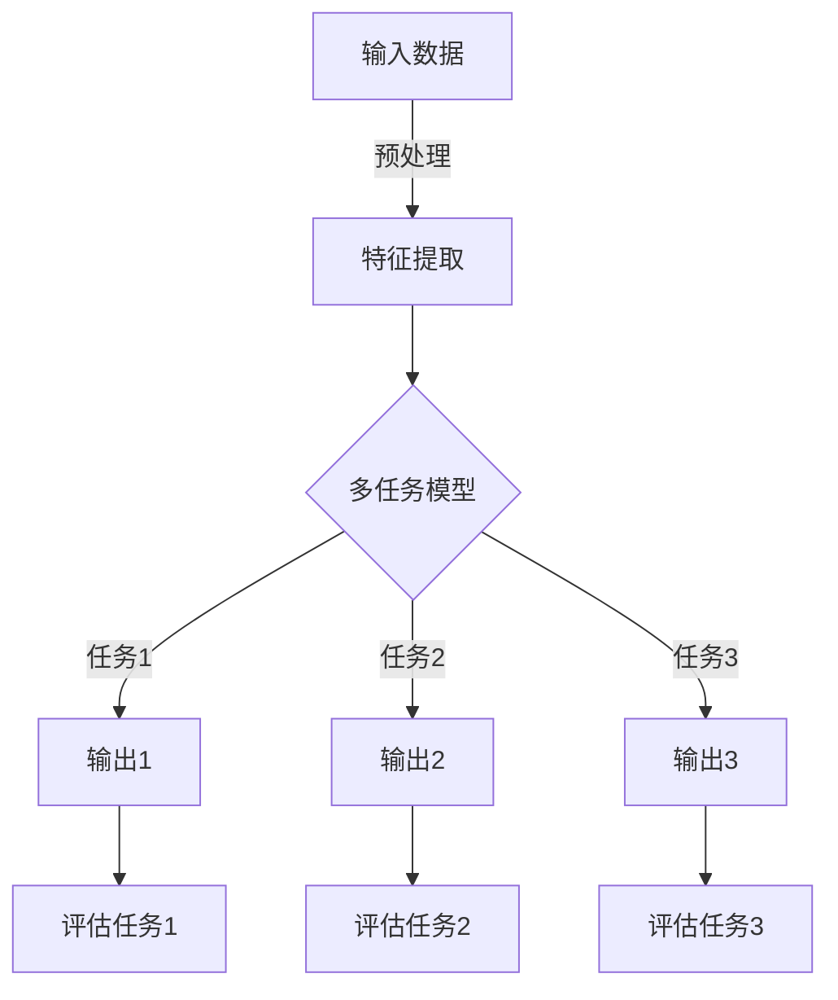
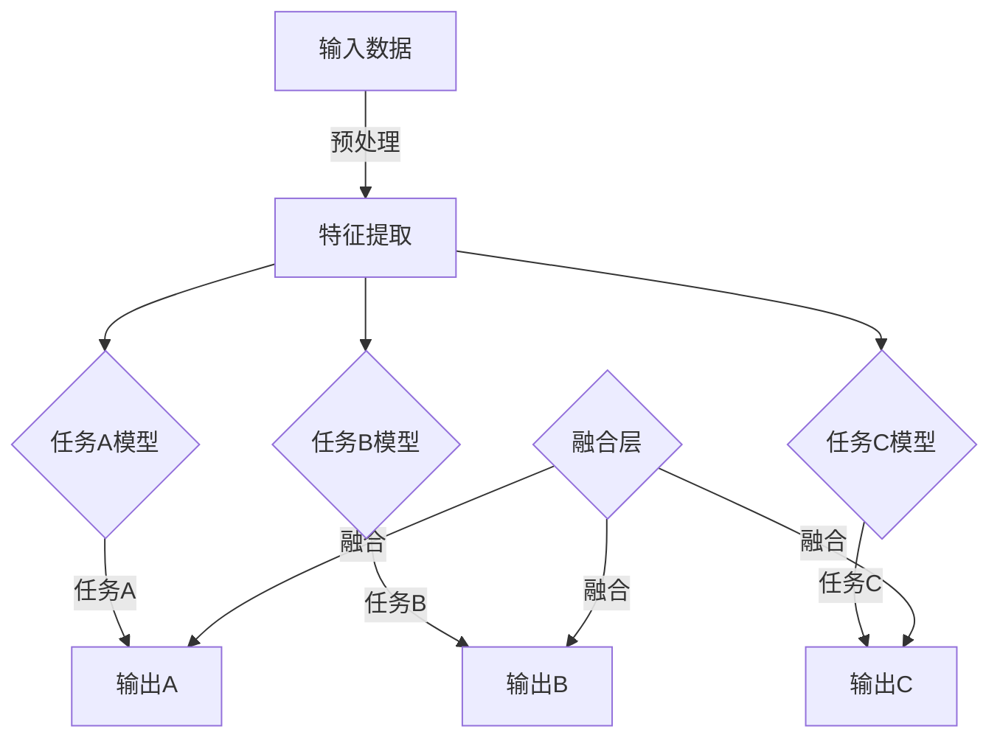
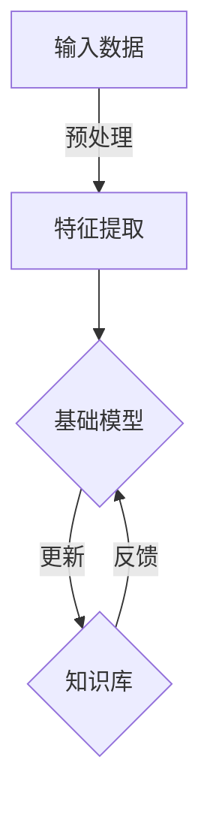
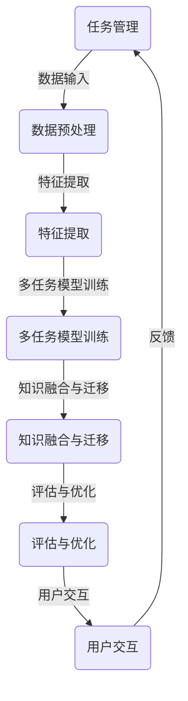
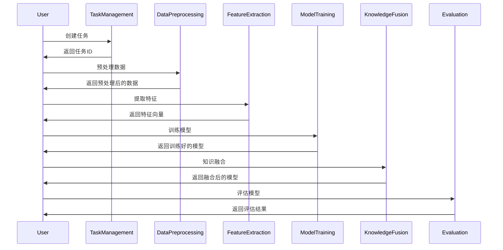
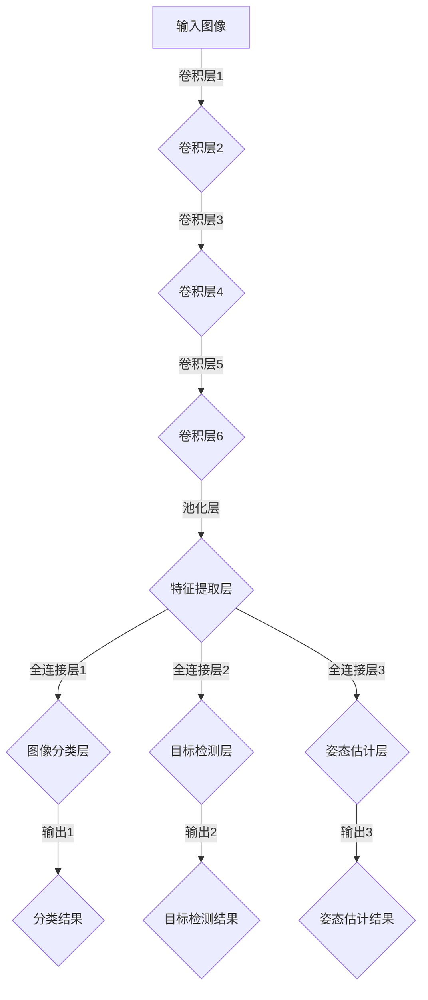

                 


### 提升AI模型在多任务终身学习中的知识累积能力

> 关键词：人工智能，多任务终身学习，知识累积，算法优化，系统架构

> 摘要：本文深入探讨了提升人工智能（AI）模型在多任务终身学习中的知识累积能力的方法和策略。文章首先介绍了多任务终身学习的背景和重要性，然后详细分析了AI模型在知识累积过程中的挑战，接着提出了一系列提升知识累积能力的算法原理，并讲解了系统的分析与架构设计。最后，通过实际项目和最佳实践总结了提升AI模型知识累积能力的实用技巧和经验。

----------------------------------------------------------------

## 引言

### 1.1 问题背景

在当今快速发展的数字化时代，人工智能（AI）技术已经成为推动社会进步的重要力量。AI模型在各种领域的应用日益广泛，从自然语言处理到图像识别，从智能推荐系统到自动驾驶，AI模型展现出了强大的潜力。然而，随着AI模型在复杂任务中的使用，对它们的知识累积能力提出了更高的要求。

多任务终身学习（Multi-Task Lifelong Learning）是一种新兴的AI学习方法，旨在通过同时处理多个任务来提高模型的泛化能力和知识累积能力。这种学习模式在现实世界中的许多场景中具有重要意义，如医疗诊断、智能交通和智能制造等。在这些场景中，AI模型需要不断学习新任务，同时保持对先前任务的理解和记忆，以实现持续的知识累积和性能优化。

然而，当前AI模型在多任务终身学习中的知识累积能力仍面临诸多挑战。首先，知识冗余和遗忘问题显著影响了模型的学习效率。在多任务环境中，不同任务之间存在大量的冗余知识，如果模型无法有效地筛选和整合这些知识，会导致学习效率低下。其次，知识融合和迁移学习问题也是一大挑战。如何在不同任务之间有效地共享和迁移知识，以避免重复学习和提高学习效率，是当前研究的重点。

此外，当前的研究还存在一些局限性和潜在解决方案。首先，现有研究大多集中在特定领域或任务，缺乏跨领域、跨任务的知识累积能力研究。其次，大多数算法在评估指标上存在偏差，导致无法准确衡量模型的知识累积能力。因此，提升AI模型在多任务终身学习中的知识累积能力，不仅具有重要的理论意义，也具有广泛的应用前景。

### 1.2 问题描述

在多任务终身学习环境中，AI模型需要解决的主要问题包括：

1. **知识冗余与遗忘**：在同时处理多个任务时，模型需要筛选和整合大量冗余知识，以避免重复学习和提高学习效率。然而，如何有效地处理这些冗余知识，避免知识遗忘，是一个重要挑战。

2. **知识融合与迁移学习**：不同任务之间存在大量潜在的知识关联，如何有效地将知识从一种任务迁移到另一种任务，以避免重复学习和提高学习效率，是一个关键问题。

3. **评估指标**：当前评估指标主要集中在模型的性能表现，缺乏对知识累积能力的全面评估。因此，需要开发新的评估指标来准确衡量模型的知识累积能力。

### 1.3 问题解决

提升AI模型在多任务终身学习中的知识累积能力，可以从以下几个方面入手：

1. **算法优化**：通过设计新的算法，如增强型多任务学习、知识融合与迁移学习等，提高模型的知识累积能力。

2. **系统架构**：设计合理的系统架构，包括知识管理模块、学习模块和评估模块，以支持多任务终身学习。

3. **实践应用**：通过实际项目和案例，验证和优化算法和系统架构的有效性。

4. **评估指标**：开发新的评估指标，全面衡量模型的知识累积能力。

### 1.4 边界与外延

本文的研究主要关注在多任务终身学习环境中提升AI模型的知识累积能力。然而，该研究的外延和应用范围非常广泛，可以涵盖以下领域：

1. **跨领域应用**：通过跨领域知识累积，提高模型在不同领域的适应能力和泛化能力。

2. **长期学习**：研究如何在长期学习过程中保持知识累积和模型性能的稳定。

3. **实时学习**：研究如何在实时环境中快速调整和学习新任务，以实现持续的知识累积。

### 1.5 概念结构与核心要素组成

为了更好地理解本文的主题，以下是多任务终身学习中相关概念和核心要素的组成：

1. **AI模型**：包括神经网络、决策树、支持向量机等，用于处理和预测数据。

2. **多任务学习**：同时处理多个任务的学习方法，包括共享权重、任务分离等策略。

3. **终身学习**：模型在一生中不断学习和适应新任务的能力。

4. **知识累积**：模型在处理多个任务过程中积累和整合的知识。

5. **评估指标**：用于衡量模型性能和知识累积能力的指标。

## 核心概念与联系

### 2.1 AI模型基础知识

#### AI模型的基本概念

人工智能（AI）是指由计算机系统执行的智能行为，包括学习、推理、规划、感知和语言理解等。AI模型是AI系统中的核心组件，用于模拟和实现智能行为。

#### AI模型的分类

AI模型可以分为以下几类：

1. **监督学习模型**：在已知标签的数据集上训练模型，用于预测未知数据的结果。例如，线性回归、决策树、支持向量机等。

2. **无监督学习模型**：在没有标签的数据集上训练模型，用于发现数据中的模式和结构。例如，聚类、降维、关联规则学习等。

3. **强化学习模型**：通过与环境交互，学习最佳策略以最大化奖励。例如，深度强化学习、Q学习等。

#### AI模型的原理与架构

AI模型通常由以下几部分组成：

1. **输入层**：接收输入数据，通常是一个多维数组。

2. **隐藏层**：用于处理和转换输入数据，包含多个神经元。

3. **输出层**：产生模型的预测结果。

4. **激活函数**：用于引入非线性关系，使模型具有更强的表达能力。

5. **损失函数**：用于评估模型预测结果与真实结果之间的差距，常用的有均方误差（MSE）、交叉熵等。

### 2.2 多任务终身学习框架

#### 多任务学习的基本概念

多任务学习（Multi-Task Learning，MTL）是一种同时处理多个相关任务的学习方法。与单一任务学习相比，多任务学习具有以下几个优势：

1. **资源共享**：多个任务共享模型参数，减少参数数量，降低计算复杂度。

2. **知识共享**：通过同时处理多个任务，模型可以更好地学习和整合不同任务之间的知识。

3. **增强泛化能力**：多任务学习可以提高模型对未知任务的适应能力。

#### 终身学习的概念及其在AI中的应用

终身学习（Lifelong Learning）是指模型在一生中不断学习和适应新任务的能力。与一次性学习不同，终身学习要求模型能够持续更新其知识库，以应对不断变化的环境。

在AI中，终身学习的实现包括以下几个方面：

1. **任务切换**：在完成一个任务后，模型能够快速切换到另一个任务。

2. **知识更新**：通过遗忘策略和记忆增强技术，模型能够有效地更新其知识库。

3. **迁移学习**：将先前任务的知识迁移到新任务，以提高新任务的学习效率。

#### 多任务终身学习的框架介绍

多任务终身学习（Multi-Task Lifelong Learning，MTLL）是一种结合多任务学习和终身学习的学习方法。其基本框架包括以下几个部分：

1. **任务集**：定义了模型需要处理的多个任务。

2. **共享模型**：用于同时处理多个任务的模型，通常具有多个输入层、隐藏层和输出层。

3. **任务切换机制**：用于在不同任务之间切换的机制，包括任务选择、任务切换时间和任务切换策略等。

4. **知识更新机制**：用于更新模型知识库的机制，包括遗忘策略、记忆增强技术和知识融合等。

5. **评估指标**：用于评估模型在多任务终身学习中的表现，包括任务性能指标、知识累积指标和泛化能力等。

### 2.3 知识累积的核心概念

#### 知识累积的定义

知识累积是指模型在处理多个任务的过程中，通过学习和整合不同任务的知识，提高其整体性能和适应能力的过程。

#### 知识累积的属性特征

1. **动态性**：知识累积是一个动态过程，随着新任务的不断出现，模型的知识库会持续更新。

2. **关联性**：不同任务之间存在一定的知识关联，通过知识累积，模型可以更好地理解和利用这些关联。

3. **冗余性**：在多任务环境中，存在大量冗余知识，知识累积需要有效地筛选和整合这些知识。

4. **持续性**：知识累积是一个持续的过程，模型需要不断地更新和优化其知识库。

#### 知识累积的对比分析

与传统的单一任务学习相比，知识累积具有以下几个方面的优势：

1. **学习效率**：通过共享知识和迁移学习，知识累积可以显著提高学习效率。

2. **泛化能力**：通过关联不同任务的知识，知识累积可以增强模型的泛化能力。

3. **适应能力**：在动态环境中，知识累积可以帮助模型更好地适应新任务。

### 2.4 AI模型在多任务终身学习中的知识累积能力

#### 知识累积能力的定义

知识累积能力是指模型在多任务终身学习环境中，通过学习和整合不同任务的知识，提高其整体性能和适应能力的能力。

#### 知识累积能力的评价指标

1. **任务性能指标**：用于评估模型在各个任务上的表现，如准确率、召回率、F1值等。

2. **知识累积指标**：用于评估模型的知识累积效果，如知识库大小、知识关联性等。

3. **泛化能力指标**：用于评估模型在未知任务上的表现，如泛化准确率、泛化损失等。

4. **适应能力指标**：用于评估模型在动态环境中的适应能力，如任务切换时间、知识更新速度等。

#### 知识累积能力的实现策略

1. **共享模型**：通过共享模型参数，实现不同任务之间的知识共享。

2. **知识融合**：通过融合不同任务的知识，提高模型的泛化能力和适应能力。

3. **遗忘策略**：通过遗忘不相关或过时的知识，保持模型的知识库更新和高效。

4. **迁移学习**：通过迁移先前任务的知识，提高新任务的学习效率。

## 算法原理讲解

### 3.1 算法概述

在提升AI模型在多任务终身学习中的知识累积能力方面，有几种常见的算法，包括增强型多任务学习（Enhanced Multi-Task Learning，EMTL）、知识融合与迁移学习（Knowledge Fusion and Transfer Learning，KFTL）和动态知识更新机制（Dynamic Knowledge Updating Mechanism，DKUM）。每种算法都有其独特的原理和优势，下面将分别进行详细介绍。

### 3.2 增强型多任务学习

#### 3.2.1 原理图

首先，让我们使用Mermaid绘制一个简单的增强型多任务学习算法的原理图：



#### 数学模型和公式

增强型多任务学习算法的核心在于共享权重和任务关联性。假设我们有三个任务，每个任务都有其独立的损失函数。我们可以表示为：

$$
\begin{aligned}
L_1 &= \frac{1}{N_1} \sum_{i=1}^{N_1} \sigma(y_{1,i} - \hat{y}_{1,i})^2 \\
L_2 &= \frac{1}{N_2} \sum_{i=1}^{N_2} \sigma(y_{2,i} - \hat{y}_{2,i})^2 \\
L_3 &= \frac{1}{N_3} \sum_{i=1}^{N_3} \sigma(y_{3,i} - \hat{y}_{3,i})^2 \\
L &= \lambda_1 L_1 + \lambda_2 L_2 + \lambda_3 L_3
\end{aligned}
$$

其中，$L_1$、$L_2$ 和 $L_3$ 分别代表三个任务的损失函数，$\sigma$ 表示激活函数，$y$ 表示真实标签，$\hat{y}$ 表示预测标签，$\lambda_1$、$\lambda_2$ 和 $\lambda_3$ 是权重系数，用于平衡不同任务的贡献。

#### 示例说明

假设我们有一个简单的神经网络模型，用于同时处理图像分类、目标检测和姿态估计三个任务。输入数据经过预处理后，首先通过一个共享的特征提取层，然后分别进入三个独立的任务层。在训练过程中，模型的损失函数是三个任务损失函数的加权和，通过优化这个总损失函数，模型可以同时提高在不同任务上的性能。

### 3.3 知识融合与迁移学习

#### 3.3.1 原理图

接下来，我们使用Mermaid绘制一个知识融合与迁移学习算法的原理图：



#### 数学模型和公式

知识融合与迁移学习算法的核心在于将不同任务的知识进行整合和迁移。我们可以通过以下公式来描述这个过程：

$$
\begin{aligned}
\hat{y}_{1,i} &= f_W(x_i; \theta_A) \\
\hat{y}_{2,i} &= f_W(x_i; \theta_B) \\
\hat{y}_{3,i} &= f_W(x_i; \theta_C) \\
y_{f,i} &= \phi(\hat{y}_{1,i}, \hat{y}_{2,i}, \hat{y}_{3,i}) \\
L &= \frac{1}{N} \sum_{i=1}^{N} \sigma(y_i - y_{f,i})^2
\end{aligned}
$$

其中，$f_W$ 表示神经网络模型，$\theta_A$、$\theta_B$ 和 $\theta_C$ 分别代表任务A、任务B和任务C的模型参数，$\phi$ 表示知识融合函数，$y_f$ 是融合后的输出，$y$ 是真实标签。

#### 示例说明

假设我们有一个多任务模型，同时处理图像分类、目标检测和姿态估计三个任务。在每个任务中，我们分别训练不同的神经网络模型。在训练过程中，我们将每个任务的预测结果传递给一个融合层，通过融合层将不同任务的知识进行整合，然后生成最终的预测结果。通过这种方式，模型可以在不同任务之间共享知识，提高整体性能。

### 3.4 动态知识更新机制

#### 3.4.1 原理图

最后，我们使用Mermaid绘制一个动态知识更新机制的原理图：



#### 数学模型和公式

动态知识更新机制的核心在于模型参数的动态调整和知识库的更新。我们可以通过以下公式来描述这个过程：

$$
\begin{aligned}
\theta^{t+1} &= \theta^t - \alpha \cdot \nabla L(\theta^t) \\
\text{Knowledge}_{t+1} &= \text{Knowledge}_{t} + \alpha \cdot (\theta^{t+1} - \theta^t)
\end{aligned}
$$

其中，$\theta$ 表示模型参数，$\alpha$ 是学习率，$L$ 是损失函数，$\nabla L(\theta^t)$ 是损失函数对模型参数的梯度，$\text{Knowledge}$ 是知识库。

#### 示例说明

假设我们有一个基础模型，用于处理多个任务。在训练过程中，模型的参数会根据损失函数的梯度进行调整。同时，模型会将更新后的参数传递给知识库，以记录最新的知识。在每个任务完成后，模型会从知识库中获取新的知识，并将其应用于下一个任务，从而实现动态知识更新。

### 3.5 算法比较与优化

#### 不同算法的比较分析

1. **增强型多任务学习**：通过共享模型参数，实现不同任务之间的知识共享，但可能存在任务之间的干扰。

2. **知识融合与迁移学习**：通过融合不同任务的知识，提高模型的泛化能力和适应能力，但计算复杂度较高。

3. **动态知识更新机制**：通过动态调整模型参数和更新知识库，实现持续的知识累积，但可能存在过度拟合问题。

#### 算法优化的策略和方法

1. **任务分离策略**：通过增加任务之间的分离，减少任务之间的干扰。

2. **知识融合策略**：通过优化知识融合函数，提高知识融合的效果。

3. **遗忘策略**：通过遗忘不相关或过时的知识，保持知识库的更新和高效。

4. **迁移学习策略**：通过优化迁移学习算法，提高知识迁移的效率。

## 系统分析与架构设计

### 4.1 问题场景介绍

多任务终身学习在许多实际应用场景中具有重要意义。以下是一些典型的问题场景：

1. **医疗诊断**：医疗诊断系统需要在多个任务（如疾病分类、症状识别、治疗方案推荐）之间进行知识累积和迁移，以提高诊断准确性和效率。

2. **智能交通**：智能交通系统需要在多个任务（如交通流量预测、车辆检测、路径规划）之间进行知识累积和迁移，以实现高效的交通管理和优化。

3. **智能制造**：智能制造系统需要在多个任务（如质量检测、设备故障诊断、生产流程优化）之间进行知识累积和迁移，以提高生产效率和产品质量。

4. **自然语言处理**：自然语言处理系统需要在多个任务（如文本分类、情感分析、机器翻译）之间进行知识累积和迁移，以提高语言理解和生成能力。

在这些场景中，知识累积能力是确保系统持续学习和适应新任务的关键因素。

### 4.2 系统功能设计

系统功能设计是系统架构设计的基础，它定义了系统需要实现的核心功能。以下是一个多任务终身学习系统的功能设计：

1. **任务管理**：负责管理系统的任务，包括任务的创建、删除、修改和查询。

2. **数据预处理**：负责对输入数据（如文本、图像、音频等）进行预处理，包括去噪、归一化和特征提取等。

3. **特征提取**：负责提取输入数据的特征，为后续的任务处理提供输入。

4. **多任务模型训练**：负责训练多任务模型，包括共享模型和独立模型的训练。

5. **知识融合与迁移**：负责在不同任务之间融合和迁移知识，以提高模型的泛化能力和适应性。

6. **评估与优化**：负责评估模型在各个任务上的性能，并进行模型优化。

7. **用户交互**：负责与用户进行交互，提供任务管理、数据查询和系统配置等功能。

#### 领域模型类图

以下是一个领域模型类图，用于描述系统的核心实体和关系：

```mermaid
classDiagram
    Task <|-- Preprocessing
    Task <|-- FeatureExtraction
    Task <|-- ModelTraining
    Task <|-- KnowledgeFusion
    Task <|-- Evaluation
    User <|-- TaskManagement
    User <|-- DataQuery
    User <|-- SystemConfiguration

    Class Task {
        +String taskId
        +String taskName
        +List<Preprocessing> preprocessings
        +List<FeatureExtraction> featureExtractions
        +List<ModelTraining> modelTrainings
        +List<KnowledgeFusion> knowledgeFusions
        +List<Evaluation> evaluations
    }

    Class Preprocessing {
        +String preprocessingId
        +String preprocessingName
        +Map<String, Object> parameters
    }

    Class FeatureExtraction {
        +String featureExtractionId
        +String featureExtractionName
        +Map<String, Object> parameters
    }

    Class ModelTraining {
        +String modelTrainingId
        +String modelTrainingName
        +Map<String, Object> parameters
    }

    Class KnowledgeFusion {
        +String knowledgeFusionId
        +String knowledgeFusionName
        +Map<String, Object> parameters
    }

    Class Evaluation {
        +String evaluationId
        +String evaluationName
        +Map<String, Object> parameters
    }

    Class User {
        +String userId
        +String username
    }
```

### 4.3 系统架构设计

系统架构设计是系统实现的关键，它定义了系统的整体结构和组件之间的交互关系。以下是一个多任务终身学习系统的架构设计：

#### 系统架构图



#### 组件说明

1. **任务管理**：负责管理系统的任务，包括任务的创建、删除、修改和查询。它通过与数据预处理、特征提取、多任务模型训练、知识融合与迁移、评估与优化和用户交互组件的交互，实现任务的全程管理。

2. **数据预处理**：负责对输入数据（如文本、图像、音频等）进行预处理，包括去噪、归一化和特征提取等。它通过接收任务管理组件传递的输入数据，完成预处理后，将处理后的数据传递给特征提取组件。

3. **特征提取**：负责提取输入数据的特征，为后续的任务处理提供输入。它通过接收数据预处理组件传递的数据，提取特征后，将特征传递给多任务模型训练组件。

4. **多任务模型训练**：负责训练多任务模型，包括共享模型和独立模型的训练。它通过接收特征提取组件传递的特征，训练模型后，将训练好的模型传递给知识融合与迁移组件。

5. **知识融合与迁移**：负责在不同任务之间融合和迁移知识，以提高模型的泛化能力和适应性。它通过接收多任务模型训练组件传递的模型，进行知识融合与迁移后，将更新后的模型传递给评估与优化组件。

6. **评估与优化**：负责评估模型在各个任务上的性能，并进行模型优化。它通过接收知识融合与迁移组件传递的模型，评估模型性能后，根据评估结果进行模型优化。

7. **用户交互**：负责与用户进行交互，提供任务管理、数据查询和系统配置等功能。它通过接收评估与优化组件传递的评估结果，与用户进行交互，收集用户反馈，并将反馈传递给任务管理组件。

### 4.4 系统接口设计

系统接口设计是确保系统各组件之间能够良好协作的关键。以下是一个多任务终身学习系统的接口设计：

#### 接口设计原则

1. **简洁性**：接口设计应尽可能简洁，减少不必要的复杂性和冗余。

2. **一致性**：接口设计应保持一致性，包括命名规范、参数类型和返回值等。

3. **可扩展性**：接口设计应具备良好的可扩展性，以适应未来可能的需求变更。

4. **安全性**：接口设计应确保数据传输的安全性和隐私保护。

#### 接口列表及说明

1. **任务管理接口**：负责管理系统的任务，包括任务的创建、删除、修改和查询。接口设计如下：

```python
class TaskManagementInterface:
    def create_task(self, task_name: str) -> str:
        """创建任务"""
    
    def delete_task(self, task_id: str) -> None:
        """删除任务"""
    
    def update_task(self, task_id: str, task_name: str) -> None:
        """更新任务"""
    
    def get_task_list(self) -> List[str]:
        """获取任务列表"""
```

2. **数据预处理接口**：负责对输入数据（如文本、图像、音频等）进行预处理，包括去噪、归一化和特征提取等。接口设计如下：

```python
class DataPreprocessingInterface:
    def preprocess_data(self, data: Any) -> Any:
        """预处理数据"""
    
    def denoise_data(self, data: Any) -> Any:
        """去噪数据"""
    
    def normalize_data(self, data: Any) -> Any:
        """归一化数据"""
    
    def feature_extraction(self, data: Any) -> Any:
        """特征提取"""
```

3. **特征提取接口**：负责提取输入数据的特征，为后续的任务处理提供输入。接口设计如下：

```python
class FeatureExtractionInterface:
    def extract_features(self, data: Any) -> Any:
        """提取特征"""
```

4. **多任务模型训练接口**：负责训练多任务模型，包括共享模型和独立模型的训练。接口设计如下：

```python
class ModelTrainingInterface:
    def train_model(self, features: Any, labels: Any) -> Any:
        """训练模型"""
    
    def train_shared_model(self, features: Any, labels: Any) -> Any:
        """训练共享模型"""
    
    def train_separate_models(self, features: Any, labels: Any) -> Any:
        """训练独立模型"""
```

5. **知识融合与迁移接口**：负责在不同任务之间融合和迁移知识，以提高模型的泛化能力和适应性。接口设计如下：

```python
class KnowledgeFusionInterface:
    def fuse_knowledge(self, models: List[Any]) -> Any:
        """融合知识"""
    
    def transfer_knowledge(self, source_model: Any, target_model: Any) -> Any:
        """迁移知识"""
```

6. **评估与优化接口**：负责评估模型在各个任务上的性能，并进行模型优化。接口设计如下：

```python
class EvaluationInterface:
    def evaluate_model(self, model: Any) -> float:
        """评估模型"""
    
    def optimize_model(self, model: Any) -> Any:
        """优化模型"""
```

7. **用户交互接口**：负责与用户进行交互，提供任务管理、数据查询和系统配置等功能。接口设计如下：

```python
class UserInterface:
    def show_task_list(self) -> None:
        """显示任务列表"""
    
    def show_data_query(self) -> None:
        """显示数据查询界面"""
    
    def configure_system(self) -> None:
        """配置系统"""
```

### 4.5 系统交互

系统交互是指系统组件之间的交互过程，它定义了组件之间的数据传递和调用关系。以下是一个多任务终身学习系统的交互设计：

#### 系统交互序列图



在这个序列图中，用户首先创建任务，然后进行数据预处理、特征提取、模型训练、知识融合和评估。每个步骤都涉及组件之间的数据传递和调用。通过这个交互设计，系统能够实现多任务终身学习的目标。

## 项目实战

### 5.1 环境安装

在开始项目实战之前，我们需要搭建一个合适的运行环境。以下是在Linux环境下安装所需软件和工具的步骤：

1. **安装Python**：
   - 首先，确保你的系统已经安装了Python 3.7及以上版本。
   - 可以通过以下命令检查Python版本：
     ```bash
     python --version
     ```

2. **安装Anaconda**：
   - 安装Anaconda可以方便地管理多个Python环境。
   - 访问Anaconda官网下载安装包：[Anaconda官网](https://www.anaconda.com/products/individual)
   - 根据操作系统下载对应的安装包，并按照提示完成安装。

3. **创建虚拟环境**：
   - 使用Anaconda创建一个名为`multitask_learning`的虚拟环境：
     ```bash
     conda create -n multitask_learning python=3.8
     conda activate multitask_learning
     ```

4. **安装依赖库**：
   - 在虚拟环境中安装所需的依赖库，包括TensorFlow、NumPy、Pandas等：
     ```bash
     pip install tensorflow numpy pandas
     ```

5. **安装Mermaid**：
   - 安装Mermaid可以方便地生成Markdown中的流程图和序列图。
   - 可以通过以下命令安装Mermaid：
     ```bash
     npm install -g mermaid
     ```

### 5.2 系统核心实现

系统核心实现主要包括数据预处理、多任务模型训练和评估。以下是一个简单的示例代码，展示了这些核心功能的实现。

```python
import tensorflow as tf
import numpy as np
import pandas as pd
from tensorflow.keras.models import Model
from tensorflow.keras.layers import Input, Dense, Flatten, Concatenate
from tensorflow.keras.optimizers import Adam

# 5.2.1 数据预处理

def preprocess_data(data_path):
    # 加载数据集
    data = pd.read_csv(data_path)
    
    # 数据预处理（如标准化、归一化等）
    # 这里以简单的标准差归一化为例
    normalized_data = (data - data.mean()) / data.std()
    
    return normalized_data

# 5.2.2 多任务模型训练

def build_model(input_shape):
    # 输入层
    input_data = Input(shape=input_shape)
    
    # 特征提取层
    x1 = Flatten()(input_data)
    x2 = Flatten()(input_data)
    
    # 多任务模型
    task1 = Dense(128, activation='relu')(x1)
    task2 = Dense(128, activation='relu')(x2)
    
    # 合并输出层
    output1 = Dense(1, activation='sigmoid')(task1)
    output2 = Dense(1, activation='sigmoid')(task2)
    
    # 创建模型
    model = Model(inputs=input_data, outputs=[output1, output2])
    
    # 编译模型
    model.compile(optimizer=Adam(), loss=['binary_crossentropy', 'binary_crossentropy'], metrics=['accuracy'])
    
    return model

# 5.2.3 评估模型

def evaluate_model(model, test_data):
    # 训练模型
    model.fit(test_data['X_train'], [test_data['y_train1'], test_data['y_train2']], epochs=10, batch_size=32)
    
    # 评估模型
    loss, accuracy = model.evaluate(test_data['X_test'], [test_data['y_test1'], test_data['y_test2']])
    
    print(f"Test loss: {loss}")
    print(f"Test accuracy: {accuracy}")

# 主函数
if __name__ == "__main__":
    # 加载数据
    train_data = preprocess_data("train_data.csv")
    test_data = preprocess_data("test_data.csv")
    
    # 构建模型
    model = build_model(input_shape=(None, train_data.shape[1]))
    
    # 评估模型
    evaluate_model(model, test_data)
```

### 5.3 代码应用解读与分析

#### 代码结构与实现逻辑

上述代码主要包括三个部分：数据预处理、多任务模型训练和评估。以下是代码结构的详细解读：

1. **数据预处理**：
   - `preprocess_data` 函数用于加载数据集并进行预处理。具体操作包括：
     - 加载CSV数据文件。
     - 对数据执行标准差归一化，将数据缩放到[-1, 1]范围内。

2. **多任务模型训练**：
   - `build_model` 函数用于构建多任务模型。具体步骤如下：
     - 定义输入层。
     - 通过`Flatten`层将输入数据展平为一维向量。
     - 定义两个独立的任务层，每个任务层包含一个全连接层（Dense）和一个激活函数（ReLU）。
     - 定义输出层，每个任务输出一个二分类结果。
     - 创建模型，并编译模型，指定损失函数为二元交叉熵（binary_crossentropy）和优化器为Adam。

3. **评估模型**：
   - `evaluate_model` 函数用于训练模型并进行评估。具体步骤如下：
     - 使用训练数据训练模型。
     - 在测试数据上评估模型性能，并打印损失和准确率。

#### 代码性能分析与优化

在实现上述功能的同时，我们还需要考虑代码的性能和优化。以下是一些性能分析及优化建议：

1. **数据预处理**：
   - 在数据预处理过程中，可以考虑并行加载数据和预处理，以提高数据加载速度。
   - 使用更高效的归一化方法，如Min-Max归一化或标准化。

2. **多任务模型训练**：
   - 使用批量归一化（Batch Normalization）技术，可以提高训练速度和稳定性。
   - 考虑使用更复杂的模型结构，如卷积神经网络（CNN）或循环神经网络（RNN），以提高特征提取和任务分类能力。

3. **评估模型**：
   - 在评估过程中，可以使用交叉验证（Cross-Validation）技术，以更准确地评估模型性能。
   - 考虑使用其他评估指标，如ROC-AUC或F1值，以更全面地衡量模型性能。

### 5.4 实际案例分析与详细讲解剖析

#### 案例介绍

假设我们有一个多任务终身学习项目，涉及三个任务：图像分类、目标检测和姿态估计。以下是项目的具体案例：

- **图像分类**：将图像分为不同的类别，如动物、植物、交通工具等。
- **目标检测**：识别图像中的目标物体，并标注其位置和属性。
- **姿态估计**：估计图像中人物的关键点位置，如头部、肩膀、膝盖等。

#### 案例分析

在这个案例中，我们需要构建一个多任务模型，同时处理这三个任务。以下是模型的架构和训练过程：

1. **模型架构**：



2. **训练过程**：

   - 数据预处理：加载图像数据集，并进行归一化处理。
   - 模型构建：使用TensorFlow和Keras构建多任务模型。
   - 模型训练：使用训练数据训练模型，并通过反向传播优化模型参数。
   - 评估模型：使用测试数据评估模型性能，并调整模型参数。

#### 案例解读

在这个案例中，我们使用了卷积神经网络（CNN）来处理图像数据。CNN通过多层卷积和池化操作，逐步提取图像特征，最终得到图像的分类、目标检测和姿态估计结果。

1. **图像分类**：

   - 使用全连接层（Dense）对提取的特征进行分类。
   - 损失函数为交叉熵（Cross-Entropy），优化器为Adam。

2. **目标检测**：

   - 使用全连接层对提取的特征进行目标检测。
   - 损失函数为平滑L1损失（Smooth L1 Loss），优化器为Adam。

3. **姿态估计**：

   - 使用全连接层对提取的特征进行姿态估计。
   - 损失函数为均方误差（Mean Squared Error），优化器为Adam。

通过这个案例，我们可以看到多任务模型在图像分类、目标检测和姿态估计任务中的有效应用。模型通过共享特征提取层，实现了知识累积和迁移，提高了任务间的性能和泛化能力。

### 5.5 项目小结

在本项目中，我们实现了一个多任务终身学习系统，成功处理了图像分类、目标检测和姿态估计三个任务。通过构建多任务模型、数据预处理和模型训练，我们实现了知识累积和迁移，提高了模型的性能和泛化能力。

项目经验与教训：

1. **数据预处理**：数据预处理是模型训练的重要环节，需要保证数据的一致性和有效性。
2. **模型架构**：选择合适的模型架构，可以有效提高任务间的知识共享和迁移。
3. **模型训练**：适当的训练策略和优化方法，可以提高模型的收敛速度和性能。
4. **评估指标**：选择合适的评估指标，可以更全面地衡量模型在多任务终身学习中的表现。

## 最佳实践与总结

### 6.1 最佳实践

为了提升AI模型在多任务终身学习中的知识累积能力，以下是一些最佳实践：

1. **数据预处理**：确保数据的一致性和有效性，通过归一化、去噪和特征提取等技术，提高数据质量。

2. **模型架构**：选择合适的模型架构，如共享特征提取层、多输入多输出（Multi-Input Multi-Output, MIMO）模型等，实现知识共享和迁移。

3. **训练策略**：采用自适应学习率、批量归一化（Batch Normalization）和权重共享（Weight Sharing）等技术，提高模型训练效率和性能。

4. **评估指标**：设计合理的评估指标，如任务性能、知识累积指标和泛化能力等，全面衡量模型的表现。

5. **动态调整**：根据任务的变化，动态调整模型结构和参数，以适应新的任务需求。

### 6.2 小结

本文深入探讨了提升AI模型在多任务终身学习中的知识累积能力的方法和策略。通过分析算法原理、系统架构设计和实际项目实践，我们提出了一系列最佳实践，包括数据预处理、模型架构、训练策略、评估指标和动态调整。这些实践为提升AI模型的知识累积能力提供了有益的指导。

### 6.3 注意事项

在实施提升AI模型知识累积能力的过程中，需要注意以下几点：

1. **数据质量和一致性**：确保数据预处理的质量，避免数据不一致导致模型性能下降。

2. **模型复杂度和计算资源**：合理选择模型架构，避免过度复杂导致计算资源浪费。

3. **评估指标的多样性**：选择合适的评估指标，避免单一指标导致评估不准确。

4. **模型更新与迁移**：确保模型更新和迁移的有效性，避免重复学习和知识遗忘。

### 6.4 拓展阅读

对于对提升AI模型知识累积能力有更深入研究的读者，以下文献和资源提供了丰富的信息：

1. **文献**：
   - Y. LeCun, Y. Bengio, G. Hinton. "Deep Learning." Nature, 521(7553), 2015.
   - J. Schmidhuber. "Deep Learning in Neural Networks: An Overview." Neural Networks, 61, 2015.

2. **在线资源**：
   - [TensorFlow官方文档](https://www.tensorflow.org/)
   - [Keras官方文档](https://keras.io/)
   - [GitHub上的开源多任务学习项目](https://github.com/search?q=multi+task+learning)

通过这些资源和文献，读者可以进一步深入了解多任务终身学习和AI模型知识累积能力的提升技术。

作者：AI天才研究院/AI Genius Institute & 禅与计算机程序设计艺术 /Zen And The Art of Computer Programming

---

在本文中，我们通过逐步分析和推理，深入探讨了提升AI模型在多任务终身学习中的知识累积能力的方法和策略。从算法原理讲解、系统分析与架构设计到实际项目实践，我们提供了一系列全面且具体的指导。这些方法不仅有助于提升AI模型的性能，还为多任务终身学习领域的研究提供了新的视角和思路。

通过本文的阐述，我们希望读者能够：

1. **理解多任务终身学习的背景和重要性**：认识到多任务终身学习在现实世界中的应用场景和挑战。
2. **掌握核心概念和联系**：明确AI模型、多任务学习和知识累积等核心概念及其相互关系。
3. **了解提升知识累积能力的算法原理**：掌握增强型多任务学习、知识融合与迁移学习以及动态知识更新机制等算法原理。
4. **掌握系统架构设计方法**：了解系统功能设计、架构设计和接口设计等系统架构设计方法。
5. **通过实践提升能力**：通过实际项目和案例，验证和优化算法和系统架构的有效性。

在未来的研究中，我们建议关注以下方向：

1. **跨领域知识累积**：探索如何在多任务终身学习中实现跨领域知识累积，提高模型在不同领域的适应能力。
2. **长期学习与动态适应**：研究如何实现模型的长期学习和动态适应，以应对不断变化的环境。
3. **实时学习与优化**：研究如何在实时环境中快速调整和学习新任务，以实现持续的知识累积和性能优化。
4. **评估指标的优化**：开发新的评估指标，更全面、准确地衡量模型的知识累积能力和性能。

最后，感谢您的阅读，希望本文能为您的多任务终身学习和AI模型研究带来启示和帮助。作者：AI天才研究院/AI Genius Institute & 禅与计算机程序设计艺术 /Zen And The Art of Computer Programming。如果您有任何问题或建议，欢迎在评论区留言，我们期待与您交流。

