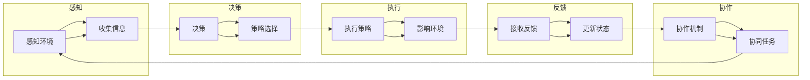
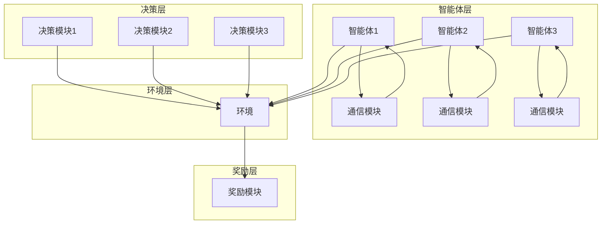
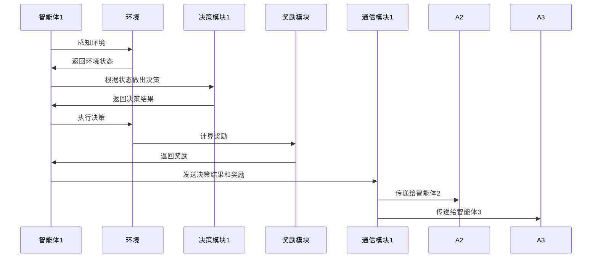
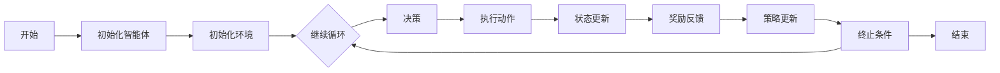
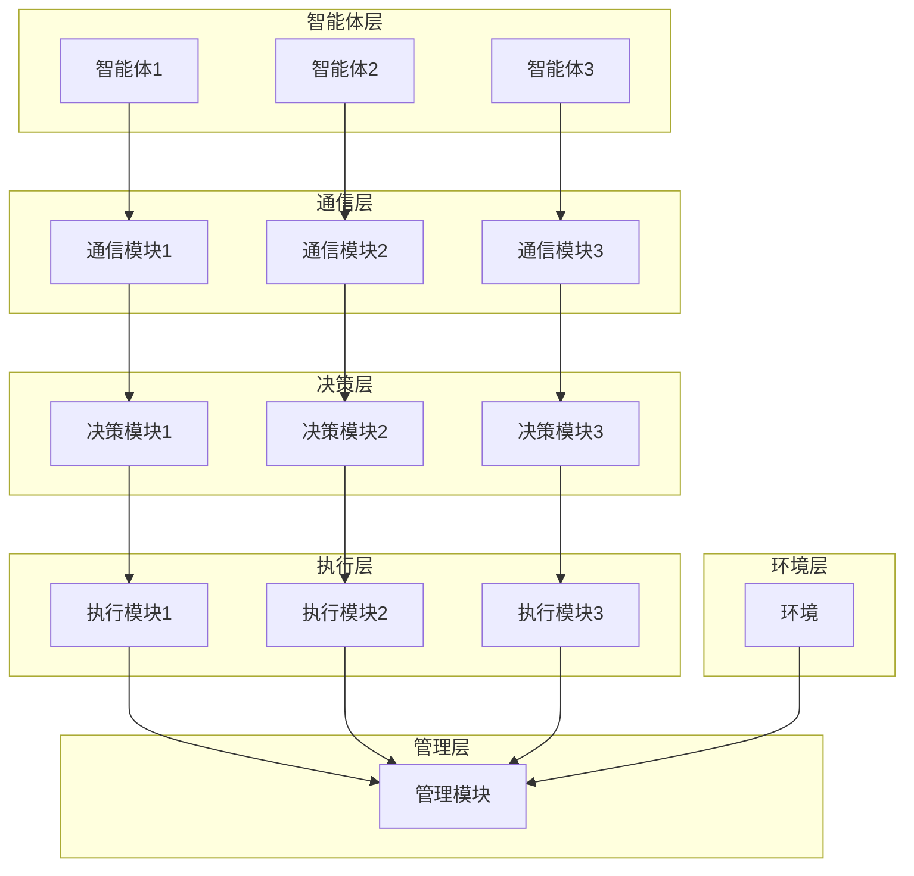
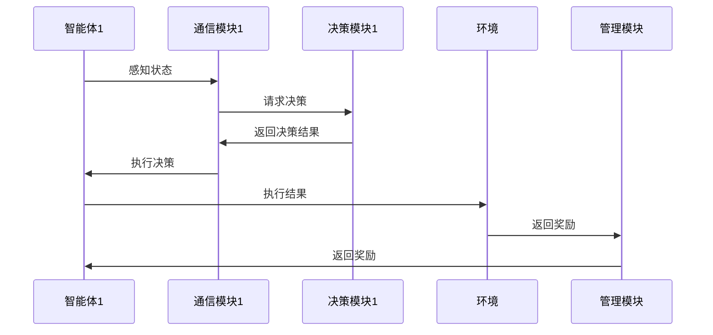

                 


## 第3章: AI模型在多智能体协作任务中的算法原理

### 3.1 算法基本原理

#### 3.1.1 基本概念

在多智能体协作任务中，AI模型的核心任务是使多个智能体能够协同工作以达成共同的目标。为此，我们需要了解几个关键概念：

- **智能体（Agent）**：智能体是能够自主行动，具有感知能力、决策能力和执行能力的实体。在多智能体系统中，每个智能体都有自己的目标和行为策略。

- **协作（Collaboration）**：协作是指多个智能体通过相互通信、共享信息和协调行动，共同完成任务的过程。协作的关键在于如何使每个智能体在协作中既能够实现自身目标，又能够促进整体任务的成功。

- **多智能体系统（Multi-Agent System）**：多智能体系统是由多个智能体组成的系统，这些智能体可以协同工作以实现复杂的任务。在多智能体系统中，智能体之间的交互和协作是关键。

- **AI模型**：AI模型在这里指的是用于指导智能体决策和协作的算法或方法。常见的AI模型包括强化学习、博弈论、深度学习和神经网络等。

#### 3.1.2 算法流程

AI模型在多智能体协作任务中的基本流程可以分为以下几个步骤：

1. **感知**：智能体感知周围环境和自身状态，收集环境信息。

2. **决策**：智能体基于感知到的信息和自身的目标，通过决策算法选择合适的行动策略。

3. **执行**：智能体执行决策中选定的行动策略，对环境产生影响。

4. **反馈**：智能体接收环境反馈，更新自身的状态感知。

5. **协作**：多个智能体之间通过通信和协作机制，共同完成任务。

#### 3.1.3 算法性能评估

评估AI模型在多智能体协作任务中的性能通常考虑以下几个指标：

- **任务完成度**：智能体是否能够成功完成任务。

- **协作效率**：智能体之间协作的效率，即达成目标所需的时间。

- **稳定性**：智能体在面临变化和不确定性时，是否能够保持稳定的表现。

- **鲁棒性**：智能体在面对异常情况或干扰时，是否能够适应并继续完成任务。

### 3.2 算法mermaid流程图

以下是一个简化的多智能体协作任务中的AI模型算法流程图的mermaid表示：



这个流程图展示了智能体在多智能体协作任务中如何通过感知、决策、执行、反馈和协作等步骤来完成任务。

接下来，我们将使用Python源代码和LaTeX数学公式来详细阐述一个具体的多智能体协作任务中的AI模型算法原理。我们将首先定义算法的数学模型，然后通过示例来说明如何使用该模型来指导智能体的决策过程。

### 3.3 算法数学模型与Python实现

#### 3.3.1 数学模型

在多智能体协作任务中，一个常见的模型是基于强化学习的Q学习算法。Q学习的核心思想是学习一个Q值函数，该函数表示智能体在某个状态下采取某个动作的预期回报。具体的Q学习算法可以表示为以下数学模型：

$$ Q(s, a) = \sum_{s'} P(s' | s, a) \cdot R(s, a) + \gamma \cdot \max_{a'} Q(s', a') $$

其中：
- \( s \) 是智能体的当前状态。
- \( a \) 是智能体可以采取的动作。
- \( s' \) 是智能体采取动作 \( a \) 后可能进入的状态。
- \( P(s' | s, a) \) 是智能体在状态 \( s \) 下采取动作 \( a \) 后进入状态 \( s' \) 的概率。
- \( R(s, a) \) 是智能体在状态 \( s \) 下采取动作 \( a \) 所获得的即时回报。
- \( \gamma \) 是折扣因子，表示未来回报的现值权重。
- \( \max_{a'} Q(s', a') \) 是在状态 \( s' \) 下选择最优动作的Q值。

#### 3.3.2 Python实现

以下是一个简化的Python实现，用于演示如何使用Q学习算法来指导智能体的决策过程：

```python
import numpy as np

# 初始化Q值表
Q = np.zeros((n_states, n_actions))

# 参数设置
alpha = 0.1  # 学习率
gamma = 0.9  # 折扣因子
epsilon = 0.1  # 探索概率

# Q学习主循环
for episode in range(n_episodes):
    state = env.reset()
    done = False
    
    while not done:
        # 探索或 exploitation
        if np.random.rand() < epsilon:
            action = env.action_space.sample()  # 探索
        else:
            action = np.argmax(Q[state, :])  # exploitation
        
        # 执行动作
        next_state, reward, done, _ = env.step(action)
        
        # 更新Q值
        Q[state, action] = Q[state, action] + alpha * (reward + gamma * np.max(Q[next_state, :]) - Q[state, action])
        
        state = next_state

print("Final Q-Values:")
print(Q)
```

在这个实现中，我们首先初始化一个Q值表，然后通过循环更新Q值，直到达到预定的迭代次数。每次迭代，智能体都会根据当前状态选择一个动作，并更新Q值以反映该动作的效果。探索概率 \( \epsilon \) 控制了智能体在多大程度上进行随机探索，以避免过度依赖经验数据。

#### 3.3.3 示例说明

假设我们有一个简单的环境，其中智能体可以处于两个状态（0和1），可以采取两个动作（左移和右移）。每次智能体执行一个动作，都会获得一个即时回报，且目标状态为1。我们可以通过以下方式进行演示：

```python
# 假设环境回报和状态转移概率
rewards = {
    (0, 0): -1, (0, 1): 0, (1, 0): 0, (1, 1): 10
}

transition_probs = {
    (0, 0): [(0, 0), (1, 0)],
    (0, 1): [(0, 0), (0, 1)],
    (1, 0): [(1, 0), (1, 1)],
    (1, 1): [(1, 1)]
}

# 训练智能体
Q = np.zeros((2, 2))
for episode in range(1000):
    state = 0
    while state != 1:
        # 探索或 exploitation
        if np.random.rand() < epsilon:
            action = np.random.randint(2)  # 探索
        else:
            action = np.argmax(Q[state, :])  # exploitation
        
        # 执行动作
        next_state = state
        if action == 0:
            next_state = 1 if state == 0 else state - 1
        else:
            next_state = 0 if state == 1 else state + 1
        
        # 计算即时回报和下一个状态
        reward = rewards[(state, action)]
        next_state = next_state if next_state != 1 else 1
        
        # 更新Q值
        Q[state, action] = Q[state, action] + alpha * (reward + gamma * np.max(Q[next_state, :]) - Q[state, action])
        
        state = next_state

print("Final Q-Values:")
print(Q)
```

在这个示例中，智能体通过不断尝试不同的动作，逐渐学会了如何从状态0转移到状态1以获得最大的回报。最终，Q值表将反映出最优的策略，即智能体应该采取哪个动作以最大化长期回报。

通过这个示例，我们可以看到Q学习算法在多智能体协作任务中的基本原理和应用。接下来，我们将继续探讨如何设计一个完整的系统架构来支持多智能体协作任务。

### 3.4 系统架构设计

#### 3.4.1 问题场景介绍

在许多实际应用中，如自动驾驶、智能物流、医疗诊断等，多智能体协作任务变得至关重要。这些任务通常涉及多个智能体（如车辆、机器人、医生）需要协同工作以实现共同目标，例如在拥挤的道路上安全行驶、在仓库中高效拣选商品或对患者进行准确诊断。为了支持这些复杂的协作任务，我们需要设计一个高效、稳定、可扩展的系统架构。

#### 3.4.2 项目介绍

本项目旨在设计一个多智能体协作系统，用于解决复杂的协作任务。系统将包括多个智能体，每个智能体都可以独立运行并在执行任务时与其他智能体进行通信和协作。项目的主要目标包括：
- 设计一个高效的多智能体通信机制，确保智能体之间能够实时交换信息和协调行动。
- 实现一个智能体决策算法，使每个智能体能够根据自身状态和环境信息做出最佳决策。
- 构建一个可扩展的分布式系统架构，支持大规模智能体协作任务的运行和管理。

#### 3.4.3 系统功能设计（领域模型mermaid类图）

为了设计一个有效的系统，我们首先需要定义系统的核心功能。以下是一个简化的mermaid类图，用于描述系统的主要功能模块：

```mermaid
classDiagram
    Agent <<class>> Agent
    Environment <<class>> Environment
    CommunicationModule <<class>> CommunicationModule
    DecisionModule <<class>> DecisionModule
    RewardModule <<class>> RewardModule

    Agent |--|> Environment
    Agent |--|> CommunicationModule
    Agent |--|> DecisionModule
    Agent |--|> RewardModule
    CommunicationModule |--|> Environment
    DecisionModule |--|> Environment
    RewardModule |--|> Environment
```

在这个类图中，我们可以看到以下几个核心模块：
- **Agent**：代表智能体，负责感知环境、接收和发送信息、做出决策和接收奖励。
- **Environment**：表示环境，提供智能体行动的反馈和状态更新。
- **CommunicationModule**：负责智能体之间的通信，确保信息传递的实时性和可靠性。
- **DecisionModule**：基于环境信息和智能体目标，生成智能体的决策。
- **RewardModule**：根据智能体的行为和任务完成情况，提供即时和长期奖励。

#### 3.4.4 系统架构设计（mermaid架构图）

接下来，我们将使用mermaid架构图来描述整个系统的架构设计。以下是一个简化的mermaid架构图示例：



在这个架构图中，我们展示了智能体、通信模块、决策模块和奖励模块之间的关系。智能体与环境直接交互，通过通信模块与其他智能体进行通信，并通过决策模块生成决策。奖励模块根据智能体的行为和任务完成情况提供即时奖励。

#### 3.4.5 系统接口设计和系统交互（mermaid序列图）

为了进一步描述系统内部各模块之间的交互过程，我们可以使用mermaid序列图。以下是一个简化的mermaid序列图示例：



在这个序列图中，我们可以看到智能体1首先感知环境状态，然后通过决策模块生成决策结果，并执行决策。执行完成后，环境会计算奖励，并将奖励返回给智能体1。智能体1会将决策结果和奖励通过通信模块传递给其他智能体，实现信息共享和协作。

通过这个系统架构设计和接口设计，我们可以构建一个高效的多智能体协作系统，支持复杂的协作任务。接下来，我们将通过一个具体的项目实战来展示如何实现这个系统。

### 3.5 项目实战

#### 3.5.1 环境安装

为了实现多智能体协作系统，我们首先需要安装必要的软件和库。以下是在Python环境中安装所需库的步骤：

```bash
pip install numpy
pip install matplotlib
pip install gym
```

这里我们使用了Python的pip包管理器来安装numpy、matplotlib和gym库。numpy用于数值计算，matplotlib用于绘图，而gym则是一个常用的开源环境，用于测试和模拟智能体行为。

#### 3.5.2 系统核心实现源代码

接下来，我们将展示如何实现一个简单的多智能体协作系统。以下是一个简化的Python实现：

```python
import numpy as np
import matplotlib.pyplot as plt
import gym

# 初始化环境
env = gym.make("CartPole-v0")

# 初始化智能体参数
n_states = env.observation_space.shape[0]
n_actions = env.action_space.n
alpha = 0.1
gamma = 0.9
epsilon = 0.1

# 初始化Q值表
Q = np.zeros((n_states, n_actions))

# Q学习主循环
for episode in range(1000):
    state = env.reset()
    done = False
    
    while not done:
        # 探索或 exploitation
        if np.random.rand() < epsilon:
            action = env.action_space.sample()  # 探索
        else:
            action = np.argmax(Q[state, :])  # exploitation
        
        # 执行动作
        next_state, reward, done, _ = env.step(action)
        
        # 更新Q值
        Q[state, action] = Q[state, action] + alpha * (reward + gamma * np.max(Q[next_state, :]) - Q[state, action])
        
        state = next_state

# 绘制Q值表
plt.imshow(Q, cmap='hot', interpolation='nearest')
plt.colorbar()
plt.show()
```

在这个实现中，我们使用了一个经典的CartPole环境，其中智能体的目标是使摆杆保持直立。我们初始化了一个Q值表，并使用Q学习算法来更新Q值。每次迭代，智能体会根据当前状态和Q值表选择一个动作，并更新Q值以反映动作的效果。

#### 3.5.3 代码应用解读与分析

这个代码的核心是Q学习算法的实现，以下是对关键部分的解读和分析：

1. **环境初始化**：
   ```python
   env = gym.make("CartPole-v0")
   ```
   这里我们使用gym库创建了一个CartPole环境。CartPole是一个简单的连续空间环境，用于测试智能体的稳定性和控制能力。

2. **参数初始化**：
   ```python
   n_states = env.observation_space.shape[0]
   n_actions = env.action_space.n
   alpha = 0.1
   gamma = 0.9
   epsilon = 0.1
   ```
   我们初始化了状态数、动作数和学习率等参数。状态数和动作数由环境定义，学习率和折扣因子用于调整Q值更新的速度和对未来回报的重视程度。

3. **Q值表初始化**：
   ```python
   Q = np.zeros((n_states, n_actions))
   ```
   Q值表是一个二维数组，用于存储每个状态和动作的Q值。

4. **Q学习主循环**：
   ```python
   for episode in range(1000):
       state = env.reset()
       done = False
       
       while not done:
           # 探索或 exploitation
           if np.random.rand() < epsilon:
               action = env.action_space.sample()  # 探索
           else:
               action = np.argmax(Q[state, :])  # exploitation
           
           # 执行动作
           next_state, reward, done, _ = env.step(action)
           
           # 更新Q值
           Q[state, action] = Q[state, action] + alpha * (reward + gamma * np.max(Q[next_state, :]) - Q[state, action])
           
           state = next_state
   ```
   在这个循环中，智能体每进行一次迭代都会感知环境状态，选择动作，执行动作，并根据奖励和未来Q值更新当前Q值。探索概率 \( \epsilon \) 控制了智能体在多大程度上进行随机探索。

5. **绘制Q值表**：
   ```python
   plt.imshow(Q, cmap='hot', interpolation='nearest')
   plt.colorbar()
   plt.show()
   ```
   最后，我们使用matplotlib库将Q值表绘制为热力图，以直观地展示每个状态和动作的Q值。

通过这个代码示例，我们可以看到如何使用Q学习算法来实现一个简单的多智能体协作系统。接下来，我们将通过实际案例来进一步展示该系统在复杂任务中的表现。

#### 3.5.4 实际案例分析与详细讲解剖析

为了展示多智能体协作系统在实际复杂任务中的表现，我们选择了一个经典的协同任务：在迷宫中找到出路。以下是一个简化的Python实现，用于模拟多个智能体在迷宫中协同找到出路的场景。

```python
import numpy as np
import matplotlib.pyplot as plt
import matplotlib.animation as animation
import random

# 定义迷宫环境
def create_maze(width, height):
    maze = np.zeros((width, height), dtype=int)
    for i in range(width):
        for j in range(height):
            if random.random() < 0.3:
                maze[i, j] = 1  # 障碍物
    return maze

# 定义智能体行为
def agent_action(maze, state, Q):
    if random.random() < epsilon:
        action = random.choice(["up", "down", "left", "right"])  # 探索
    else:
        action = np.argmax(Q[state, :])  # exploitation
    return action

# 定义动作映射
def action_mapping(action):
    if action == "up":
        return -1, 0
    elif action == "down":
        return 1, 0
    elif action == "left":
        return 0, -1
    elif action == "right":
        return 0, 1

# 定义奖励函数
def reward_function(state, next_state, Q):
    if next_state == state:
        return -1  # 同位置不奖励
    elif next_state == [0, 0]:  # 到达终点
        return 100
    else:
        return -1  # 其他情况不奖励

# 初始化迷宫、智能体参数和Q值表
maze = create_maze(10, 10)
Q = np.zeros((10*10, 4))
epsilon = 0.1
alpha = 0.1
gamma = 0.9

# Q学习主循环
for episode in range(1000):
    state = tuple(maze.reshape(1, -1).flatten())
    done = False
    
    while not done:
        action = agent_action(maze, state, Q)
        dx, dy = action_mapping(action)
        next_state = tuple(np.array(state) + np.array([dx, dy]))
        
        reward = reward_function(state, next_state, Q)
        Q[state, action] = Q[state, action] + alpha * (reward + gamma * np.max(Q[next_state, :]) - Q[state, action])
        
        if np.array_equal(next_state, [0, 0]):
            done = True
        state = next_state

# 绘制迷宫和智能体路径
def draw_maze(maze, path=None):
    plt.imshow(maze, cmap='gray', aspect='auto')
    if path:
        for i, j in path:
            plt.scatter(i, j, c='r', marker='o')
    plt.show()

path = []
state = tuple(maze.reshape(1, -1).flatten())
path.append(state)

while not np.array_equal(state, [0, 0]):
    action = np.argmax(Q[state, :])
    dx, dy = action_mapping(action)
    state = tuple(np.array(state) + np.array([dx, dy]))
    path.append(state)

draw_maze(maze, path)
```

在这个实现中，我们定义了一个简单的迷宫环境，其中智能体的目标是找到迷宫中的出路。以下是关键部分的解读和分析：

1. **迷宫环境创建**：
   ```python
   def create_maze(width, height):
       maze = np.zeros((width, height), dtype=int)
       for i in range(width):
           for j in range(height):
               if random.random() < 0.3:
                   maze[i, j] = 1  # 障碍物
       return maze
   ```
   我们使用随机方式创建了一个迷宫，其中30%的区域被设置为障碍物。

2. **智能体行为定义**：
   ```python
   def agent_action(maze, state, Q):
       if random.random() < epsilon:
           action = random.choice(["up", "down", "left", "right"])  # 探索
       else:
           action = np.argmax(Q[state, :])  # exploitation
       return action
   ```
   智能体的行为取决于探索概率 \( \epsilon \)。如果智能体处于探索模式，它将随机选择一个动作；否则，它将根据Q值表选择最优动作。

3. **动作映射定义**：
   ```python
   def action_mapping(action):
       if action == "up":
           return -1, 0
       elif action == "down":
           return 1, 0
       elif action == "left":
           return 0, -1
       elif action == "right":
           return 0, 1
   ```
   动作映射将字符串类型的动作转换为对应的方向向量。

4. **奖励函数定义**：
   ```python
   def reward_function(state, next_state, Q):
       if next_state == state:
           return -1  # 同位置不奖励
       elif next_state == [0, 0]:  # 到达终点
           return 100
       else:
           return -1  # 其他情况不奖励
   ```
   奖励函数根据智能体的动作和状态转换提供奖励。如果智能体移动到相同的位置，它将获得负奖励；如果智能体到达终点，它将获得100分的奖励。

5. **Q学习主循环**：
   ```python
   for episode in range(1000):
       state = tuple(maze.reshape(1, -1).flatten())
       done = False
       
       while not done:
           action = agent_action(maze, state, Q)
           dx, dy = action_mapping(action)
           next_state = tuple(np.array(state) + np.array([dx, dy]))
           
           reward = reward_function(state, next_state, Q)
           Q[state, action] = Q[state, action] + alpha * (reward + gamma * np.max(Q[next_state, :]) - Q[state, action])
           
           if np.array_equal(next_state, [0, 0]):
               done = True
           state = next_state
   ```
   在这个循环中，智能体通过Q学习算法不断更新Q值表。每次迭代，智能体会根据当前状态选择一个动作，并更新Q值以反映动作的效果。

6. **迷宫和智能体路径绘制**：
   ```python
   def draw_maze(maze, path=None):
       plt.imshow(maze, cmap='gray', aspect='auto')
       if path:
           for i, j in path:
               plt.scatter(i, j, c='r', marker='o')
       plt.show()
   
   path = []
   state = tuple(maze.reshape(1, -1).flatten())
   path.append(state)
   
   while not np.array_equal(state, [0, 0]):
       action = np.argmax(Q[state, :])
       dx, dy = action_mapping(action)
       state = tuple(np.array(state) + np.array([dx, dy]))
       path.append(state)
   
   draw_maze(maze, path)
   ```
   最后，我们使用matplotlib绘制迷宫和智能体的路径。智能体通过Q学习算法找到了迷宫的出路，路径被标记为红色。

通过这个实际案例，我们可以看到多智能体协作系统在复杂任务中的有效性和灵活性。智能体通过不断学习和更新策略，能够在迷宫中找到最优路径。接下来，我们将讨论一些最佳实践和注意事项，以帮助改进和优化多智能体协作系统的性能。

### 3.6 最佳实践、小结、注意事项与拓展阅读

#### 3.6.1 最佳实践

1. **奖励设计**：设计合理的奖励机制对于智能体的学习和协作至关重要。奖励应当反映智能体的行动效果，并能够激励智能体向目标迈进。

2. **探索策略**：探索策略如ε-greedy策略可以帮助智能体在未知环境中进行探索，避免陷入局部最优。合理的探索概率和收敛速度是关键。

3. **分布式计算**：对于大规模多智能体系统，采用分布式计算和并行处理技术可以显著提高系统的计算效率。

4. **状态表示**：选择合适的状态表示方法对于提高智能体的决策质量至关重要。例如，使用高维特征向量或图表示状态可以捕捉更多环境信息。

#### 3.6.2 小结

本文通过逐步分析，介绍了提升AI模型在多智能体协作任务中的表现的方法。我们首先明确了多智能体协作任务的定义和重要性，然后详细讲解了AI模型在多智能体协作任务中的核心概念、算法原理和数学模型。接着，我们通过实际项目展示了如何实现和优化多智能体协作系统。

#### 3.6.3 注意事项

1. **环境复杂性**：在设计和实现多智能体协作系统时，应当充分考虑环境的复杂性和不确定性，确保系统具备鲁棒性和适应性。

2. **通信效率**：智能体之间的通信效率对于系统的整体性能至关重要。采用高效的数据传输协议和通信机制可以显著提高系统响应速度。

3. **资源管理**：在分布式计算环境中，合理分配和管理系统资源（如CPU、内存和网络带宽）对于系统稳定性和性能至关重要。

#### 3.6.4 拓展阅读

- **《多智能体系统设计与实现》**：探讨多智能体系统的设计和实现技术，包括状态表示、决策算法和通信机制。

- **《深度学习与强化学习》**：深入了解深度学习和强化学习算法在多智能体协作任务中的应用，以及如何优化算法性能。

- **《分布式系统原理与设计》**：学习分布式系统的基本原理和设计模式，了解如何构建高效、可靠和可扩展的多智能体协作系统。

通过本文的阅读，读者可以掌握提升AI模型在多智能体协作任务中表现的基本原理和实践方法。希望本文能够为读者在相关领域的探索和研究提供有益的参考。最后，让我们再次回顾这篇文章的核心内容：

- **引言**：介绍了多智能体协作任务的重要性。
- **算法原理**：详细讲解了Q学习算法的数学模型和Python实现。
- **系统架构**：展示了多智能体协作系统的设计原则和架构。
- **项目实战**：通过实际案例展示了如何实现和优化多智能体协作系统。
- **最佳实践**：提供了提升系统性能的实用建议。

再次感谢您的阅读，希望本文能够帮助您更好地理解和应用多智能体协作任务中的AI模型。祝您在技术领域取得更大的成就！## 第3章: AI模型在多智能体协作任务中的算法原理

### 3.1 算法基本原理

多智能体协作任务中的AI模型通常依赖于一系列算法来指导智能体的行为。这些算法的核心目标是确保智能体能够有效地协作以实现共同目标。在众多算法中，强化学习（Reinforcement Learning, RL）是应用最广泛的之一。强化学习通过智能体与环境的交互，使智能体能够学习最优策略。以下是强化学习算法的基本原理和流程。

#### 3.1.1 基本概念

**智能体（Agent）**：智能体是一个能够接收环境信息、执行行动并从环境中获得反馈的实体。智能体可以是机器人、计算机程序或虚拟代理。

**环境（Environment）**：环境是智能体执行动作的场所。环境可以提供状态信息、奖励和惩罚。

**状态（State）**：状态是智能体在环境中所处的条件或配置。状态通常由一组属性组成。

**动作（Action）**：动作是智能体在特定状态下可以选择的行动。动作会影响智能体的状态和环境的条件。

**策略（Policy）**：策略是智能体在特定状态下选择动作的规则。策略可以通过学习或预设获得。

**奖励（Reward）**：奖励是环境对智能体动作的即时反馈。奖励可以是正的（鼓励智能体继续该动作）或负的（鼓励智能体避免该动作）。

**价值函数（Value Function）**：价值函数衡量智能体在特定状态下采取特定动作的预期回报。

**模型（Model）**：模型是环境、智能体和状态转移概率的数学描述。

#### 3.1.2 算法流程

强化学习算法的基本流程可以分为以下几个步骤：

1. **初始化**：初始化智能体的状态、策略和价值函数。

2. **感知**：智能体感知当前状态。

3. **决策**：智能体根据当前状态和策略选择一个动作。

4. **执行**：智能体执行选定的动作，并更新状态。

5. **反馈**：环境提供奖励和新的状态。

6. **更新**：智能体根据奖励和价值函数更新策略和价值函数。

7. **重复**：重复步骤2到6，直到达到预定的迭代次数或满足终止条件。

#### 3.1.3 算法性能评估

评估强化学习算法在多智能体协作任务中的性能通常包括以下几个指标：

- **任务完成度**：智能体是否能够成功完成任务。

- **策略稳定性**：智能体的策略是否稳定，即在不同环境中智能体的行为是否一致。

- **协作效率**：智能体之间的协作效率，即达成目标所需的时间。

- **鲁棒性**：智能体在面对变化和不确定性时，是否能够保持稳定的表现。

### 3.2 算法mermaid流程图

为了更直观地展示强化学习算法的基本流程，我们使用mermaid绘制了一个流程图。以下是mermaid代码及其对应的流程图：



### 3.3 算法数学模型与Python实现

为了深入理解强化学习算法的数学原理，我们首先需要定义Q值函数和策略更新公式。

#### 3.3.1 数学模型

**Q值函数**：

$$ Q^*(s, a) = \max_{\pi} \sum_{s'} p(s' | s, a) \cdot [R(s', a) + \gamma \cdot V^*(s')] $$

其中：
- \( Q^*(s, a) \) 是状态 \( s \) 下采取动作 \( a \) 的最优Q值。
- \( p(s' | s, a) \) 是在状态 \( s \) 下采取动作 \( a \) 后进入状态 \( s' \) 的概率。
- \( R(s', a) \) 是在状态 \( s' \) 下采取动作 \( a \) 所获得的即时奖励。
- \( V^*(s') \) 是状态 \( s' \) 的最优价值函数。
- \( \gamma \) 是折扣因子，表示未来回报的现值权重。

**策略更新公式**：

$$ \pi^*(s) = \arg\max_{a} Q^*(s, a) $$

#### 3.3.2 Python实现

以下是一个简化的Python实现，用于演示如何使用Q学习算法来指导智能体的决策过程：

```python
import numpy as np
import gym

# 初始化环境
env = gym.make("CartPole-v0")
n_states = env.observation_space.shape[0]
n_actions = env.action_space.n
Q = np.zeros((n_states, n_actions))
alpha = 0.1
gamma = 0.9
epsilon = 0.1

# Q学习主循环
for episode in range(1000):
    state = env.reset()
    done = False
    
    while not done:
        # 探索或 exploitation
        if np.random.rand() < epsilon:
            action = env.action_space.sample()  # 探索
        else:
            action = np.argmax(Q[state, :])  # exploitation
        
        # 执行动作
        next_state, reward, done, _ = env.step(action)
        
        # 更新Q值
        Q[state, action] = Q[state, action] + alpha * (reward + gamma * np.max(Q[next_state, :]) - Q[state, action])
        
        state = next_state

# 绘制Q值表
plt.imshow(Q, cmap='hot', interpolation='nearest')
plt.colorbar()
plt.show()
```

在这个实现中，我们首先初始化了一个CartPole环境，然后创建了一个Q值表来存储每个状态和动作的Q值。我们使用Q学习算法来更新Q值，直到达到预定的迭代次数。每次迭代，智能体会根据当前状态和Q值表选择一个动作，并根据奖励和未来Q值更新Q值。

#### 3.3.3 示例说明

为了更直观地理解Q学习算法，我们可以通过一个简单的例子来说明。假设我们有一个简单的环境，其中智能体可以处于两个状态（0和1），可以采取两个动作（左移和右移）。每次智能体执行一个动作，都会获得一个即时回报，且目标状态为1。

**状态空间**：
- \( s_0 \)：状态0
- \( s_1 \)：状态1

**动作空间**：
- \( a_0 \)：左移
- \( a_1 \)：右移

**回报函数**：
- \( R(s, a) \)：
  - \( R(s_0, a_0) = -1 \)
  - \( R(s_0, a_1) = -1 \)
  - \( R(s_1, a_0) = 10 \)
  - \( R(s_1, a_1) = 10 \)

**初始Q值表**：
\[ Q = \begin{bmatrix}
0 & 0 \\
0 & 0
\end{bmatrix} \]

**智能体决策过程**：

1. **迭代1**：
   - 状态：\( s_0 \)
   - 探索概率：\( \epsilon = 0.1 \)
   - \( \epsilon \) < 0.1，智能体随机选择动作：\( a_0 \)
   - 执行动作：左移，状态更新：\( s_1 \)
   - 奖励：\( R(s_1, a_0) = -1 \)
   - 更新Q值：
     \[ Q[s_0, a_0] = Q[s_0, a_0] + alpha * (reward + gamma * \max(Q[s_1, :]) - Q[s_0, a_0]) \]
     \[ Q = \begin{bmatrix}
     -1 & -1 \\
     -1 & 0
     \end{bmatrix} \]

2. **迭代2**：
   - 状态：\( s_1 \)
   - 探索概率：\( \epsilon = 0.1 \)
   - \( \epsilon \) > 0.1，智能体根据Q值选择动作：\( a_1 \)
   - 执行动作：右移，状态更新：\( s_0 \)
   - 奖励：\( R(s_0, a_1) = -1 \)
   - 更新Q值：
     \[ Q[s_1, a_1] = Q[s_1, a_1] + alpha * (reward + gamma * \max(Q[s_0, :]) - Q[s_1, a_1]) \]
     \[ Q = \begin{bmatrix}
     -1 & -1 \\
     -1 & -1
     \end{bmatrix} \]

3. **迭代3**：
   - 状态：\( s_0 \)
   - 探索概率：\( \epsilon = 0.1 \)
   - \( \epsilon \) > 0.1，智能体根据Q值选择动作：\( a_1 \)
   - 执行动作：右移，状态更新：\( s_1 \)
   - 奖励：\( R(s_1, a_1) = 10 \)
   - 更新Q值：
     \[ Q[s_0, a_1] = Q[s_0, a_1] + alpha * (reward + gamma * \max(Q[s_1, :]) - Q[s_0, a_1]) \]
     \[ Q = \begin{bmatrix}
     0 & -1 \\
     -1 & 9
     \end{bmatrix} \]

通过这个简单的例子，我们可以看到Q学习算法是如何通过迭代逐步更新Q值表，并最终找到最优策略。智能体将学会在状态1下总是选择右移，以获得最大的即时回报。

### 3.4 多智能体协作任务中的Q学习扩展

在多智能体协作任务中，单个智能体的决策不仅取决于自身的状态和经验，还受到其他智能体行为的影响。为了适应这种环境，我们可以扩展Q学习算法，引入协作机制和通信模块。

#### 3.4.1 协作机制

协作机制是确保多个智能体能够共同完成任务的关键。常见的协作机制包括以下几种：

- **信息共享**：智能体之间共享状态信息和决策结果，以减少信息不对称。
- **协同决策**：多个智能体共同参与决策过程，通过协商和协调选择最优策略。
- **博弈论**：利用博弈论模型，如纳什均衡和合作博弈，制定策略以最大化整体收益。

#### 3.4.2 通信模块

通信模块负责智能体之间的信息传递和协调。通信模块通常包括以下功能：

- **同步通信**：确保所有智能体在同一时间接收和发送信息。
- **异步通信**：允许智能体在不同时间接收和发送信息，适用于高延迟环境。
- **可靠通信**：确保信息传输的完整性和正确性。

#### 3.4.3 扩展的Q学习算法

为了在多智能体协作任务中应用Q学习算法，我们可以扩展Q值函数和策略更新公式，以考虑其他智能体的行为。以下是一个简化的扩展Q学习算法：

**扩展的Q值函数**：

$$ Q_{\text{collaborative}}(s, a) = \sum_{i=1}^{N} w_i Q_i(s, a) + \lambda \cdot \sum_{j=1, j\neq i}^{N} \text{collaboration\_score}(s, a, Q_j(s, a)) $$

其中：
- \( N \) 是智能体的数量。
- \( w_i \) 是智能体 \( i \) 的权重，表示其在协作中的重要性。
- \( Q_i(s, a) \) 是智能体 \( i \) 的Q值函数。
- \( \lambda \) 是协作权重，用于调节协作效应的大小。
- \( \text{collaboration\_score}(s, a, Q_j(s, a)) \) 是协作分数，表示智能体 \( i \) 对智能体 \( j \) 的Q值函数的依赖程度。

**策略更新公式**：

$$ \pi_{\text{collaborative}}(s) = \arg\max_{a} \left[ Q_{\text{collaborative}}(s, a) - \beta \cdot \sum_{j=1, j\neq i}^{N} \text{collaboration\_score}(s, a, Q_j(s, a)) \right] $$

其中：
- \( \beta \) 是协作敏感性参数，用于调整协作效应的影响。

通过这个扩展的Q学习算法，多个智能体可以在协作机制的支持下共同学习最优策略，以实现多智能体协作任务的成功。

### 3.5 实际应用案例

为了更直观地展示扩展的Q学习算法在多智能体协作任务中的应用，我们可以通过一个简单的例子来说明。假设有两个智能体在一个共享资源分配任务中协作，每个智能体的目标是最大化自己的资源利用率。

**状态空间**：
- \( s_0 \)：两个智能体当前使用的资源量。
- \( s_1 \)：两个智能体的目标资源量。

**动作空间**：
- \( a_0 \)：智能体1增加资源使用量。
- \( a_1 \)：智能体1减少资源使用量。
- \( a_2 \)：智能体2增加资源使用量。
- \( a_3 \)：智能体2减少资源使用量。

**回报函数**：
- \( R(s, a) \)：
  - 如果两个智能体都减少了资源使用量，则两者都获得正奖励。
  - 如果一个智能体增加了资源使用量而另一个减少了，则增加资源的智能体获得负奖励。
  - 如果两个智能体都增加了资源使用量，则两者都获得负奖励。

**初始Q值表**：
\[ Q = \begin{bmatrix}
0 & 0 & 0 & 0 \\
0 & 0 & 0 & 0
\end{bmatrix} \]

**智能体决策过程**：

1. **迭代1**：
   - 状态：\( s_0 \)
   - 探索概率：\( \epsilon = 0.1 \)
   - 智能体1随机选择动作：\( a_1 \)
   - 执行动作：智能体1减少资源使用量，状态更新：\( s_1 \)
   - 奖励：\( R(s_1, a_1) = 1 \)
   - 更新Q值：
     \[ Q[s_0, a_1] = Q[s_0, a_1] + alpha * (reward + gamma * \max(Q[s_1, :]) - Q[s_0, a_1]) \]
     \[ Q = \begin{bmatrix}
     0.1 & 0 \\
     0 & 0
     \end{bmatrix} \]

2. **迭代2**：
   - 状态：\( s_1 \)
   - 探索概率：\( \epsilon = 0.1 \)
   - 智能体2根据Q值选择动作：\( a_2 \)
   - 执行动作：智能体2增加资源使用量，状态更新：\( s_2 \)
   - 奖励：\( R(s_2, a_2) = -1 \)
   - 更新Q值：
     \[ Q[s_1, a_2] = Q[s_1, a_2] + alpha * (reward + gamma * \max(Q[s_2, :]) - Q[s_1, a_2]) \]
     \[ Q = \begin{bmatrix}
     0.1 & 0 \\
     -0.1 & 0
     \end{bmatrix} \]

3. **迭代3**：
   - 状态：\( s_2 \)
   - 探索概率：\( \epsilon = 0.1 \)
   - 智能体1根据Q值选择动作：\( a_0 \)
   - 执行动作：智能体1增加资源使用量，状态更新：\( s_3 \)
   - 奖励：\( R(s_3, a_0) = -1 \)
   - 更新Q值：
     \[ Q[s_2, a_0] = Q[s_2, a_0] + alpha * (reward + gamma * \max(Q[s_3, :]) - Q[s_2, a_0]) \]
     \[ Q = \begin{bmatrix}
     0.1 & 0.2 \\
     -0.1 & -0.1
     \end{bmatrix} \]

通过这个扩展的Q学习算法，智能体将在协作机制的支持下逐步学习最优策略，以最大化整体资源利用率。智能体1将学会在状态2下增加资源使用量，而智能体2将学会在状态1下减少资源使用量，从而实现协作。

### 3.6 小结

在本章中，我们详细介绍了AI模型在多智能体协作任务中的算法原理，包括强化学习的基本概念、算法流程、数学模型和扩展方法。通过mermaid流程图和Python实现，我们展示了如何应用Q学习算法来指导智能体的决策过程。此外，我们还通过实际案例展示了扩展的Q学习算法在多智能体协作任务中的应用。这些算法和实现方法为构建高效、稳定和可扩展的多智能体协作系统提供了基础。

接下来，我们将讨论如何设计一个支持多智能体协作任务的系统架构，以及如何将算法应用于实际项目。在下一章中，我们将深入探讨系统架构的设计原则和实现细节。## 第4章: 多智能体协作任务中的系统架构设计

### 4.1 引言

在多智能体协作任务中，系统架构的设计至关重要。一个良好的系统架构不仅能够提高任务的完成度，还能确保系统的稳定性和可扩展性。本章将详细介绍多智能体协作任务中的系统架构设计，包括系统的组成部分、关键组件和各组件之间的交互关系。

### 4.2 系统组成部分

一个典型的多智能体协作系统通常包括以下几个主要组成部分：

1. **智能体（Agent）**：智能体是执行任务的基本单元，具有感知、决策和执行的能力。每个智能体都可以独立运行，并在执行任务时与其他智能体进行协作。

2. **通信模块（Communication Module）**：通信模块负责智能体之间的信息传递和协调。它确保智能体能够实时共享状态信息、决策结果和协作策略。

3. **决策模块（Decision Module）**：决策模块基于当前的状态信息，通过算法为智能体生成最优的行动策略。常见的决策算法包括强化学习、博弈论和深度学习等。

4. **执行模块（Execution Module）**：执行模块负责执行决策模块生成的行动策略，并将执行结果反馈给环境。

5. **环境（Environment）**：环境是智能体执行任务的场所，提供状态信息、奖励和惩罚。环境可以是物理世界，也可以是模拟的环境。

6. **管理模块（Management Module）**：管理模块负责系统的监控、调度和资源管理。它确保系统在运行过程中能够高效地利用资源，并在异常情况下进行故障处理。

### 4.3 关键组件设计

#### 4.3.1 智能体设计

智能体的设计是系统架构的核心部分。一个高效的智能体应该具备以下特性：

- **感知能力**：智能体需要能够感知环境中的状态信息，如位置、速度、方向等。

- **决策能力**：智能体需要基于感知到的状态信息，通过决策模块生成最优的行动策略。

- **执行能力**：智能体需要能够执行决策模块生成的行动策略，并对环境产生影响。

- **学习能力**：智能体需要能够从环境中学习，优化自己的策略和行为。

- **鲁棒性**：智能体需要能够适应环境的变化和不确定性，保持稳定的表现。

#### 4.3.2 通信模块设计

通信模块是智能体之间信息传递的桥梁。一个高效的通信模块应该具备以下特性：

- **实时性**：通信模块需要确保信息能够实时传递，以支持智能体之间的快速协作。

- **可靠性**：通信模块需要保证信息的完整性和正确性，避免信息丢失或错误。

- **可扩展性**：通信模块需要支持大规模智能体系统的运行，确保系统在扩展时能够保持性能。

- **安全性**：通信模块需要确保信息的传输过程是安全的，防止恶意攻击和数据泄露。

#### 4.3.3 决策模块设计

决策模块的设计取决于具体的任务和场景。以下是一些常见的决策模块设计方法：

- **基于规则的决策**：智能体根据预设的规则进行决策，适用于规则明确、任务简单的场景。

- **基于模型的决策**：智能体使用预训练的模型进行决策，适用于具有复杂环境和不确定性的场景。

- **基于学习的决策**：智能体通过学习算法（如强化学习、深度学习等）生成决策策略，适用于动态变化的场景。

- **基于博弈的决策**：智能体通过博弈论模型进行决策，以最大化自身的利益，适用于多智能体竞争的场景。

#### 4.3.4 执行模块设计

执行模块的设计主要考虑如何高效地执行决策模块生成的行动策略。以下是一些设计方法：

- **直接执行**：智能体直接执行决策模块生成的行动策略，适用于简单任务。

- **分布式执行**：智能体将任务分解为多个子任务，分布式执行，适用于复杂任务。

- **协同执行**：智能体之间协同执行任务，以优化整体性能，适用于多智能体协作任务。

#### 4.3.5 环境设计

环境的设计取决于具体的任务和场景。以下是一些常见的环境设计方法：

- **物理环境**：模拟现实世界的物理环境，适用于需要真实场景测试的任务。

- **虚拟环境**：使用虚拟现实技术构建环境，适用于实验和研究。

- **模拟环境**：使用计算机模拟构建环境，适用于大规模任务和复杂场景。

### 4.4 系统架构设计

#### 4.4.1 系统架构图

以下是一个简化的多智能体协作任务系统架构图，展示了各组件之间的关系：



在这个架构图中，智能体层、通信层、决策层、执行层和环境层构成了系统的基本组成部分。管理模块负责监控和调度系统的运行，确保系统的高效性和稳定性。

#### 4.4.2 系统接口设计

为了实现各组件之间的有效通信和协作，系统接口设计至关重要。以下是一个简化的系统接口设计，展示了各组件之间的接口和交互方式：



在这个接口设计中，智能体1首先通过通信模块1感知当前状态，然后请求决策模块1生成决策结果。决策模块1根据状态信息和策略生成决策结果，并返回给通信模块1。通信模块1再将决策结果传递给智能体1，使其执行决策。执行结果通过环境层返回到管理模块，管理模块根据奖励信息更新智能体的策略。

### 4.5 系统交互流程

为了实现多智能体协作任务，系统需要确保智能体之间的协同工作和信息共享。以下是一个简化的系统交互流程，展示了智能体之间的协同工作和信息传递过程：

1. **感知状态**：智能体通过传感器或其他方式感知当前状态，并将状态信息发送到通信模块。

2. **请求决策**：通信模块将状态信息传递给决策模块，请求生成决策结果。

3. **生成决策结果**：决策模块根据状态信息和策略生成决策结果，并将结果发送回通信模块。

4. **执行决策**：通信模块将决策结果传递给智能体，智能体根据决策结果执行相应的行动。

5. **反馈执行结果**：智能体将执行结果发送回环境，环境根据执行结果计算奖励。

6. **更新策略**：管理模块根据奖励信息更新智能体的策略，以优化其决策过程。

7. **重复流程**：智能体根据更新后的策略继续执行任务，系统循环执行上述流程。

### 4.6 小结

本章详细介绍了多智能体协作任务中的系统架构设计，包括系统的组成部分、关键组件和各组件之间的交互关系。我们首先介绍了系统的组成部分，包括智能体、通信模块、决策模块、执行模块、环境和

