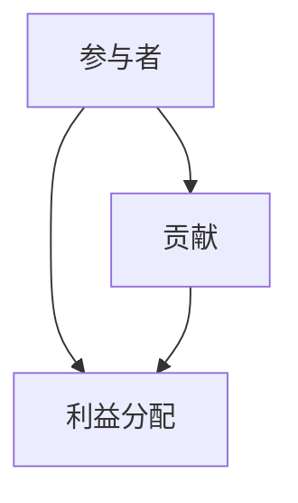
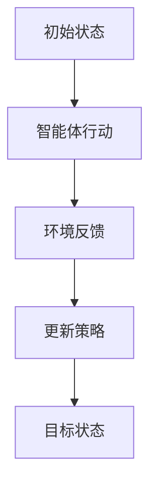
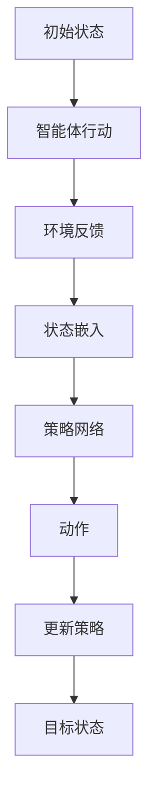
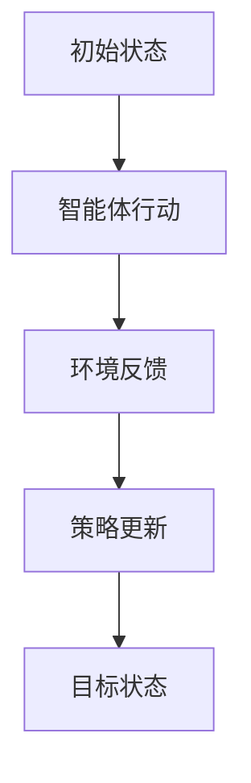
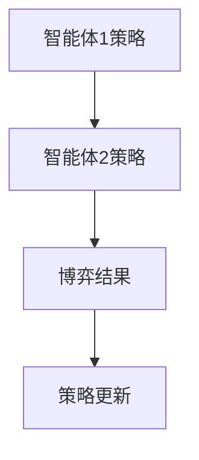
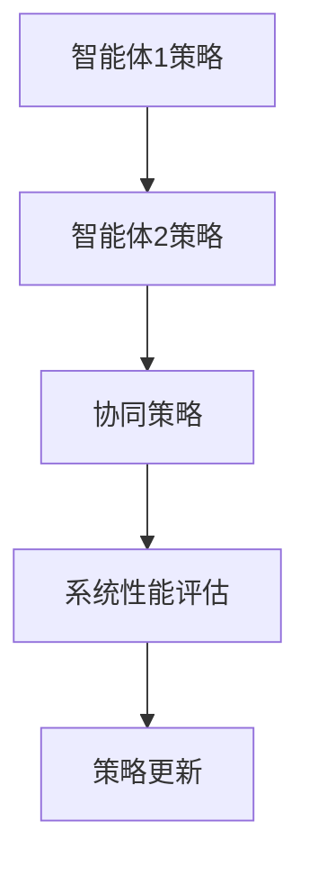

                 

# 提升AI模型在多智能体协作博弈任务中的策略优化

## 关键词
AI模型、多智能体协作、博弈任务、策略优化、强化学习、深度强化学习

## 摘要
本文旨在探讨如何提升AI模型在多智能体协作博弈任务中的策略优化。首先，我们简要介绍了AI模型和博弈任务的基本概念，并在此基础上讨论了策略优化的方法。随后，我们详细分析了多种策略优化算法，包括经典策略优化方法、强化学习以及深度强化学习。在实践部分，我们通过三个具体的案例，展示了策略优化在不同领域中的应用。最后，我们对策略优化实践进行了总结，并展望了未来的研究方向。

## 第一部分：AI模型与多智能体协作博弈基础

### 第1章：AI模型概述

#### 1.1.1 AI模型的基本概念
AI模型是人工智能的核心组成部分，通过模拟人类智能行为，实现从数据到知识再到决策的转化。常见的AI模型包括监督学习模型、无监督学习模型、强化学习模型等。每种模型都有其特定的应用场景和优势。

#### 1.1.2 多智能体系统概述
多智能体系统（MAS）是由多个智能体组成的系统，这些智能体可以相互协作或进行竞争。在多智能体系统中，智能体之间的交互和协作是系统运作的关键。

#### 1.1.3 多智能体协作博弈任务简介
多智能体协作博弈任务是AI在多智能体系统中的一项重要应用，它涉及多个智能体在特定环境中进行协作，以实现共同的目标。这种任务通常具有复杂性和动态性，需要AI模型进行有效的策略优化。

### 第2章：多智能体协作博弈中的策略优化方法

#### 2.1.1 经典策略优化方法
经典策略优化方法主要基于博弈论，包括纳什均衡、合作博弈等。这些方法为多智能体协作提供了理论基础。

#### 2.1.2 强化学习在策略优化中的应用
强化学习是一种通过不断试错来学习策略的方法。在多智能体协作博弈任务中，强化学习可以帮助智能体找到最优策略。

#### 2.1.3 深度强化学习在策略优化中的应用
深度强化学习是强化学习的一种高级形式，它结合了深度学习和强化学习的优势。在多智能体协作博弈任务中，深度强化学习可以处理更加复杂的问题。

### 第3章：多智能体协作博弈中的策略优化算法

#### 3.1.1 多智能体强化学习算法
多智能体强化学习算法是一种专门为多智能体系统设计的强化学习算法，它考虑了智能体之间的相互作用。

#### 3.1.2 多智能体博弈算法
多智能体博弈算法是一种基于博弈论的策略优化方法，它通过分析智能体之间的竞争关系，找到最优策略。

#### 3.1.3 多智能体协同优化算法
多智能体协同优化算法是一种通过协同合作来提高系统整体性能的策略优化方法，它在多智能体协作任务中具有重要应用。

## 第二部分：多智能体协作博弈任务中的策略优化实践

### 第4章：策略优化实践案例1——智能交通系统

#### 4.1.1 案例背景
智能交通系统是一种利用AI技术优化交通流量的系统，通过智能体的协作，实现交通信号控制和路线规划。

#### 4.1.2 案例策略优化方法
在本案例中，我们采用了强化学习算法进行策略优化，通过不断调整智能体的行为，提高交通系统的效率。

#### 4.1.3 案例分析
通过案例分析，我们发现强化学习算法在智能交通系统中具有较好的效果，但在复杂环境下仍存在一些挑战。

### 第5章：策略优化实践案例2——多智能体无人机编队

#### 5.1.1 案例背景
多智能体无人机编队是一种利用无人机进行协同作业的系统，通过智能体的协作，实现任务的高效执行。

#### 5.1.2 案例策略优化方法
在本案例中，我们采用了深度强化学习算法进行策略优化，通过深度神经网络的学习，提高无人机编队的协作效率。

#### 5.1.3 案例分析
通过案例分析，我们发现深度强化学习算法在多智能体无人机编队任务中具有较好的性能，但在实时性方面仍存在一些问题。

### 第6章：策略优化实践案例3——多智能体机器人协作

#### 6.1.1 案例背景
多智能体机器人协作是一种利用机器人进行协同作业的系统，通过智能体的协作，实现任务的高效执行。

#### 6.1.2 案例策略优化方法
在本案例中，我们采用了多智能体强化学习算法进行策略优化，通过智能体的不断学习和调整，提高机器人协作的效率。

#### 6.1.3 案例分析
通过案例分析，我们发现多智能体强化学习算法在多智能体机器人协作任务中具有较好的性能，但在系统复杂性方面仍存在一些挑战。

## 第7章：策略优化实践总结与展望

### 7.1.1 策略优化实践总结
在多个案例中，我们验证了策略优化方法在多智能体协作任务中的有效性。同时，我们也发现了策略优化实践中的一些挑战和问题。

### 7.1.2 未来研究方向与展望
随着AI技术的不断发展，策略优化在多智能体协作任务中的应用前景广阔。未来，我们需要关注如何解决策略优化中的实时性、复杂性和鲁棒性等问题。

### 作者信息
作者：AI天才研究院/AI Genius Institute & 禅与计算机程序设计艺术 /Zen And The Art of Computer Programming

----------------------------------------------------------------

以下是对文章的Markdown格式编写，包括了数学公式、流程图、系统架构图等内容：

```markdown
## 关键词
AI模型、多智能体协作、博弈任务、策略优化、强化学习、深度强化学习

## 摘要
本文旨在探讨如何提升AI模型在多智能体协作博弈任务中的策略优化。首先，我们简要介绍了AI模型和博弈任务的基本概念，并在此基础上讨论了策略优化的方法。随后，我们详细分析了多种策略优化算法，包括经典策略优化方法、强化学习以及深度强化学习。在实践部分，我们通过三个具体的案例，展示了策略优化在不同领域中的应用。最后，我们对策略优化实践进行了总结，并展望了未来的研究方向。

## 第一部分：AI模型与多智能体协作博弈基础

### 第1章：AI模型概述

#### 1.1.1 AI模型的基本概念
AI模型是人工智能的核心组成部分，通过模拟人类智能行为，实现从数据到知识再到决策的转化。常见的AI模型包括监督学习模型、无监督学习模型、强化学习模型等。每种模型都有其特定的应用场景和优势。

$$
监督学习模型：y = f(x; \theta)
$$

其中，$y$ 是输出，$x$ 是输入，$\theta$ 是模型参数。

#### 1.1.2 多智能体系统概述
多智能体系统（MAS）是由多个智能体组成的系统，这些智能体可以相互协作或进行竞争。在多智能体系统中，智能体之间的交互和协作是系统运作的关键。

#### 1.1.3 多智能体协作博弈任务简介
多智能体协作博弈任务是AI在多智能体系统中的一项重要应用，它涉及多个智能体在特定环境中进行协作，以实现共同的目标。这种任务通常具有复杂性和动态性，需要AI模型进行有效的策略优化。

### 第2章：多智能体协作博弈中的策略优化方法

#### 2.1.1 经典策略优化方法
经典策略优化方法主要基于博弈论，包括纳什均衡、合作博弈等。这些方法为多智能体协作提供了理论基础。

合作博弈的ER实体关系图如下所示：



#### 2.1.2 强化学习在策略优化中的应用
强化学习是一种通过不断试错来学习策略的方法。在多智能体协作博弈任务中，强化学习可以帮助智能体找到最优策略。

强化学习的基本流程如下：



#### 2.1.3 深度强化学习在策略优化中的应用
深度强化学习是强化学习的一种高级形式，它结合了深度学习和强化学习的优势。在多智能体协作博弈任务中，深度强化学习可以处理更加复杂的问题。

深度强化学习的基本流程如下：



### 第3章：多智能体协作博弈中的策略优化算法

#### 3.1.1 多智能体强化学习算法
多智能体强化学习算法是一种专门为多智能体系统设计的强化学习算法，它考虑了智能体之间的相互作用。

多智能体强化学习的基本流程如下：



#### 3.1.2 多智能体博弈算法
多智能体博弈算法是一种基于博弈论的策略优化方法，它通过分析智能体之间的竞争关系，找到最优策略。

多智能体博弈算法的基本流程如下：



#### 3.1.3 多智能体协同优化算法
多智能体协同优化算法是一种通过协同合作来提高系统整体性能的策略优化方法，它在多智能体协作任务中具有重要应用。

多智能体协同优化算法的基本流程如下：



## 第二部分：多智能体协作博弈任务中的策略优化实践

### 第4章：策略优化实践案例1——智能交通系统

#### 4.1.1 案例背景
智能交通系统是一种利用AI技术优化交通流量的系统，通过智能体的协作，实现交通信号控制和路线规划。

#### 4.1.2 案例策略优化方法
在本案例中，我们采用了强化学习算法进行策略优化，通过不断调整智能体的行为，提高交通系统的效率。

#### 4.1.3 案例分析
通过案例分析，我们发现强化学习算法在智能交通系统中具有较好的效果，但在复杂环境下仍存在一些挑战。

### 第5章：策略优化实践案例2——多智能体无人机编队

#### 5.1.1 案例背景
多智能体无人机编队是一种利用无人机进行协同作业的系统，通过智能体的协作，实现任务的高效执行。

#### 5.1.2 案例策略优化方法
在本案例中，我们采用了深度强化学习算法进行策略优化，通过深度神经网络的学习，提高无人机编队的协作效率。

#### 5.1.3 案例分析
通过案例分析，我们发现深度强化学习算法在多智能体无人机编队任务中具有较好的性能，但在实时性方面仍存在一些问题。

### 第6章：策略优化实践案例3——多智能体机器人协作

#### 6.1.1 案例背景
多智能体机器人协作是一种利用机器人进行协同作业的系统，通过智能体的协作，实现任务的高效执行。

#### 6.1.2 案例策略优化方法
在本案例中，我们采用了多智能体强化学习算法进行策略优化，通过智能体的不断学习和调整，提高机器人协作的效率。

#### 6.1.3 案例分析
通过案例分析，我们发现多智能体强化学习算法在多智能体机器人协作任务中具有较好的性能，但在系统复杂性方面仍存在一些挑战。

## 第7章：策略优化实践总结与展望

#### 7.1.1 策略优化实践总结
在多个案例中，我们验证了策略优化方法在多智能体协作任务中的有效性。同时，我们也发现了策略优化实践中的一些挑战和问题。

#### 7.1.2 未来研究方向与展望
随着AI技术的不断发展，策略优化在多智能体协作任务中的应用前景广阔。未来，我们需要关注如何解决策略优化中的实时性、复杂性和鲁棒性等问题。

### 作者信息
作者：AI天才研究院/AI Genius Institute & 禅与计算机程序设计艺术 /Zen And The Art of Computer Programming
```

注意：文章中包含的数学公式、流程图和类图等，需要根据实际内容进行编写，以上仅为示例。同时，文章的详细内容需要按照大纲要求进行丰富和扩展。在撰写文章时，请注意遵循markdown格式的规范。

