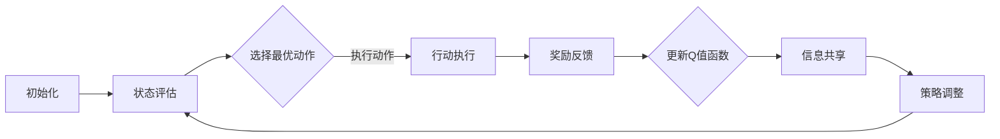
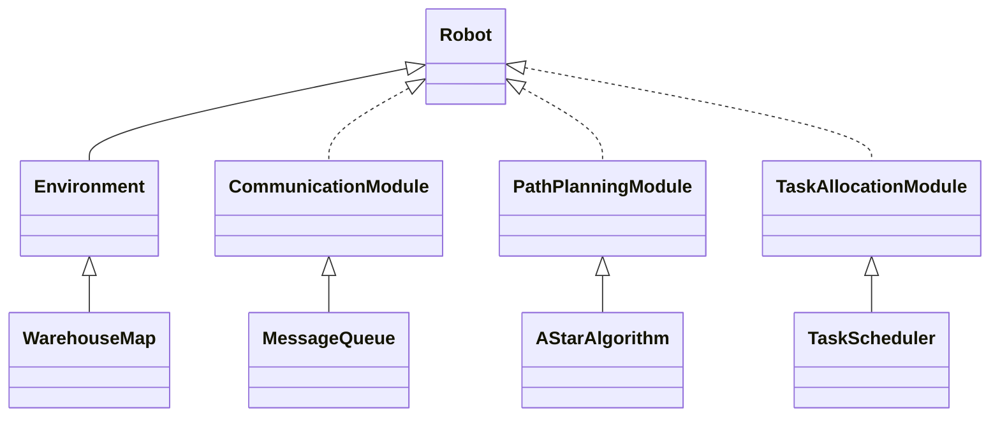
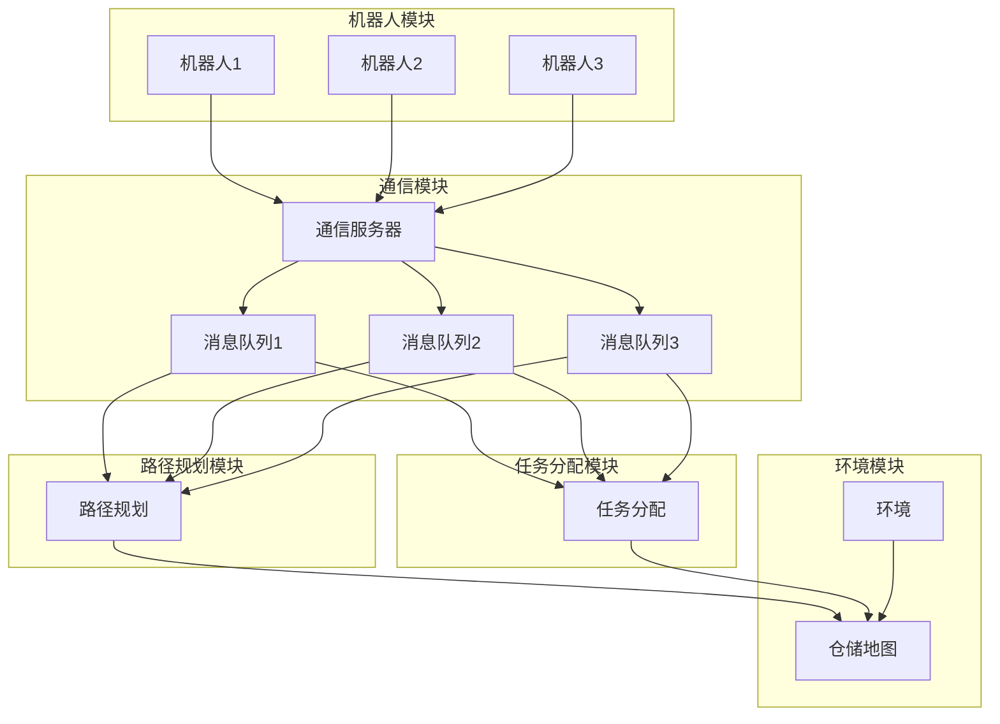

                 

# 提升AI模型在多智能体强化学习任务中的协作效率

## 关键词

- 多智能体强化学习
- 协作效率
- 算法优化
- 数学模型
- 系统架构设计

## 摘要

本文将探讨如何提升AI模型在多智能体强化学习任务中的协作效率。首先，我们介绍多智能体强化学习的背景和基本概念，解释协作效率的重要性。接着，我们深入分析协作效率的核心概念与属性特征对比，并使用ER实体关系图来展示多智能体强化学习中的关键实体及其关系。然后，我们详细介绍一种提升协作效率的算法原理，并通过mermaid流程图和Python代码来展示算法的执行过程。此外，我们还讲解数学模型和数学公式，并通过举例说明来加深理解。在系统分析与架构设计方案部分，我们介绍问题场景、系统功能设计和系统架构设计，并通过mermaid图展示系统模块的接口设计与协作。最后，我们通过项目实战和最佳实践tips，帮助读者更好地理解和应用这些知识。

## 第1章: 问题背景与概述

### 1.1.1 问题背景

多智能体强化学习（Multi-Agent Reinforcement Learning, MARL）是人工智能领域中的一个重要研究方向。随着人工智能技术的发展，多智能体系统在自动驾驶、游戏、社交网络、机器人等领域得到了广泛应用。然而，在多智能体强化学习任务中，协作效率问题一直是困扰研究者的一大难题。

协作效率是指在多智能体系统中，各智能体之间通过通信和协调，共同完成任务的能力。高协作效率意味着智能体之间能够快速、准确地达成共识，有效地利用资源，提高整体性能。然而，在现实世界中的多智能体系统中，由于信息的不对称性、环境的不确定性以及智能体之间的冲突，协作效率往往较低。

### 1.1.1.1 多智能体强化学习任务中的协作问题

在多智能体强化学习任务中，协作问题主要体现在以下几个方面：

1. **信息共享与通信**：智能体之间的信息共享与通信是协作的基础。然而，在多智能体系统中，各智能体往往具有不同的感知能力和知识背景，导致信息传递的不对称性。同时，由于通信带宽和延迟的限制，智能体之间的实时通信难以保证。

2. **目标冲突**：在多智能体系统中，各智能体可能具有不同的目标。当目标之间存在冲突时，智能体之间需要通过协作来协调利益，避免出现相互竞争或对抗的情况。

3. **资源分配**：在多智能体系统中，资源（如能量、时间、计算资源等）是有限的。如何合理分配资源，使得各智能体能够在有限资源下高效协作，是一个重要的研究问题。

4. **决策协调**：在多智能体系统中，各智能体的决策需要相互协调，以实现整体最优。然而，由于智能体之间的信息不对称性和不确定性，决策协调往往是一个复杂的过程。

### 1.1.1.2 多智能体强化学习的基本概念

多智能体强化学习是一种基于奖励机制的学习方法，通过智能体之间的交互和自主学习，实现多个智能体共同完成任务。以下是多智能体强化学习的一些基本概念：

1. **智能体（Agent）**：智能体是执行任务的实体，具有感知环境、制定决策、执行动作的能力。在多智能体系统中，智能体可以是机器人、虚拟代理、人等。

2. **环境（Environment）**：环境是多智能体强化学习中的外部条件，为智能体提供状态信息和奖励反馈。环境可以是物理环境、模拟环境或虚拟环境。

3. **状态（State）**：状态是智能体在某一时刻所处的环境状态，通常由一组特征向量表示。

4. **动作（Action）**：动作是智能体在特定状态下可以选择的操作。动作的选择会影响智能体和环境的下一个状态。

5. **奖励（Reward）**：奖励是环境对智能体的反馈，用于评估智能体动作的好坏。奖励可以是正的、负的或零。

6. **策略（Policy）**：策略是智能体在给定状态下选择动作的规则。策略可以通过学习得到，也可以是预定义的。

### 1.1.1.3 协作效率在多智能体强化学习中的重要性

协作效率在多智能体强化学习中的重要性体现在以下几个方面：

1. **提高任务完成率**：高协作效率使得智能体能够更好地协调行动，共同完成任务，提高任务的完成率。

2. **降低学习成本**：通过协作，智能体可以共享信息和经验，减少重复学习和试错的过程，降低学习成本。

3. **提高系统稳定性**：协作使得智能体之间能够相互支持，应对环境中的不确定性和变化，提高系统的稳定性。

4. **扩展应用场景**：高协作效率的多智能体系统可以应用于更复杂、更广泛的应用场景，如无人驾驶、多机器人协作等。

### 1.1.2 问题描述

在多智能体强化学习任务中，协作效率低下可能导致以下后果：

1. **任务失败**：智能体之间无法有效协作，导致任务无法完成或完成度较低。

2. **学习效率低下**：智能体需要重复学习和试错，导致学习效率低下。

3. **系统稳定性差**：智能体之间的协作不协调，容易导致系统出现崩溃或错误。

4. **资源浪费**：智能体之间无法合理分配资源，导致资源浪费。

为了解决协作效率问题，研究者提出了多种方法，如基于通信的协同策略、基于奖励分配的策略、基于博弈论的方法等。这些方法在一定程度上提高了协作效率，但仍存在一些挑战，如通信延迟、信息不对称、目标冲突等。

### 1.1.2.1 多智能体强化学习的挑战

多智能体强化学习任务中的协作挑战主要包括：

1. **信息不对称**：智能体之间可能具有不同的感知能力和知识背景，导致信息传递的不对称性。

2. **目标冲突**：智能体之间可能具有不同的目标，导致目标冲突。

3. **通信延迟**：智能体之间的通信可能存在延迟，影响协作效率。

4. **不确定性**：环境中的不确定性使得智能体之间的协作更加困难。

### 1.1.2.2 协作效率低下的后果

协作效率低下可能导致以下后果：

1. **任务失败**：智能体之间无法有效协作，导致任务无法完成或完成度较低。

2. **学习效率低下**：智能体需要重复学习和试错，导致学习效率低下。

3. **系统稳定性差**：智能体之间的协作不协调，容易导致系统出现崩溃或错误。

4. **资源浪费**：智能体之间无法合理分配资源，导致资源浪费。

### 1.1.2.3 解决协作效率问题的方法

为了解决协作效率问题，研究者提出了多种方法，包括：

1. **基于通信的协同策略**：通过智能体之间的通信，实现信息的共享和协调，提高协作效率。

2. **基于奖励分配的策略**：通过调整奖励分配机制，激励智能体之间的协作。

3. **基于博弈论的方法**：通过博弈论模型，分析智能体之间的交互和决策，优化协作策略。

4. **基于深度学习的协同方法**：利用深度学习技术，实现智能体之间的协作，提高协作效率。

## 第2章: 核心概念与联系

### 2.1.1 多智能体强化学习的基本概念

多智能体强化学习（MARL）是一种结合了强化学习和多智能体系统（MAS）的机器学习方法。它主要研究多个智能体在具有共同目标和相互作用的动态环境中，如何通过学习来优化自己的策略，以实现共同的目标。以下是MARL的基本概念：

#### 2.1.1.1 多智能体系统的定义

多智能体系统是由多个具有自主性、交互性和协作性的智能体组成的系统。这些智能体可以相互通信和合作，以实现共同的或各自的目标。

#### 2.1.1.2 强化学习的原理

强化学习（Reinforcement Learning, RL）是一种通过试错学习来获得最优策略的机器学习方法。在强化学习中，智能体根据环境的状态和自身的动作，从环境中获得奖励信号，并通过不断调整策略来最大化累积奖励。

#### 2.1.1.3 多智能体强化学习的特点

1. **多目标**：多智能体强化学习任务通常涉及多个智能体，每个智能体都有自己的目标，这些目标之间可能存在冲突。
2. **交互性**：智能体之间的交互对系统的行为和性能有着重要影响。
3. **动态环境**：环境状态随着时间不断变化，智能体需要不断调整策略以适应环境的变化。
4. **不确定性和竞争**：智能体之间可能存在不确定性，如感知噪声、通信延迟等，以及竞争，如资源争夺、目标冲突等。

### 2.1.2 协作效率的概念与属性特征对比

协作效率是指在多智能体系统中，各智能体通过合作和协调，共同完成任务的能力。以下是协作效率的相关概念和属性特征对比：

#### 2.1.2.1 协作效率的定义

协作效率可以用多个智能体完成任务的速度、准确度、资源利用率和系统稳定性等指标来衡量。高协作效率意味着智能体之间能够快速、准确地协作，有效地利用资源。

#### 2.1.2.2 协作效率的衡量指标

1. **任务完成率**：任务完成率是衡量协作效率的重要指标，它表示在给定的时间内，智能体系统成功完成任务的次数与总尝试次数的比值。
2. **资源利用率**：资源利用率是衡量协作效率的另一个重要指标，它表示在完成任务的整个过程中，智能体系统所使用的资源与总资源量的比值。
3. **响应时间**：响应时间是衡量智能体系统响应外部事件的速度，通常用平均响应时间来衡量。
4. **系统稳定性**：系统稳定性是衡量智能体系统在长时间运行中保持稳定状态的能力。

#### 2.1.2.3 不同协作效率策略的对比

1. **基于通信的策略**：通过智能体之间的通信来实现协作，如分布式通信、集中式通信等。
2. **基于奖励的策略**：通过调整奖励机制来激励智能体之间的协作，如奖励共享、奖励分配等。
3. **基于博弈的策略**：通过博弈论模型来分析智能体之间的交互和决策，优化协作策略。

### 2.1.3 多智能体强化学习中的ER实体关系图

ER（Entity-Relationship）图是用于表示实体及其之间关系的图形化工具。在多智能体强化学习中，ER图可以帮助我们更好地理解智能体、环境和状态之间的关系。以下是ER图的基本绘制方法和实体关系的分析：

#### 2.1.3.1 ER图的绘制

1. **实体（Entity）**：表示系统中的主要对象，如智能体、环境等。
2. **属性（Attribute）**：表示实体的特征，如智能体的位置、速度等。
3. **关系（Relationship）**：表示实体之间的关联，如智能体与环境之间的交互、智能体之间的协作等。

#### 2.1.3.2 实体关系的分析

1. **一对一关系（1:1）**：表示两个实体之间存在一对一的关系，如每个智能体对应一个环境状态。
2. **一对多关系（1:N）**：表示一个实体对应多个实体，如一个环境状态可以对应多个智能体。
3. **多对多关系（M:N）**：表示多个实体之间存在多对多的关系，如多个智能体可以同时处于一个环境状态。

通过ER图，我们可以清晰地描述多智能体强化学习任务中的实体及其关系，为进一步分析和优化协作效率提供基础。

### 第3章: 算法原理讲解

#### 3.1.1 基本算法原理

多智能体强化学习（MARL）算法旨在通过智能体之间的交互和自主学习，实现多个智能体共同完成任务。以下是一种常用的MARL算法——分布式Q学习（Distributed Q-Learning）的基本原理和关键步骤：

##### 3.1.1.1 算法的基本框架

分布式Q学习算法主要由以下组件构成：

1. **智能体（Agent）**：每个智能体都维护一个Q值函数，用于评估当前状态下的动作值。
2. **通信网络（Communication Network）**：智能体之间通过通信网络进行信息交换，共享Q值函数的一部分。
3. **学习算法（Learning Algorithm）**：智能体根据从环境中获得的奖励和自身Q值函数的更新，调整策略。

##### 3.1.1.2 算法的关键步骤

1. **初始化**：每个智能体随机初始化Q值函数，并选择初始动作。
2. **状态评估**：智能体根据当前状态评估Q值函数，选择最优动作。
3. **行动执行**：智能体执行选择的最优动作，并观察环境反馈。
4. **奖励反馈**：智能体根据执行动作后的环境状态和奖励，更新Q值函数。
5. **信息共享**：智能体将部分Q值函数更新信息通过通信网络共享给其他智能体。
6. **策略调整**：智能体根据共享的信息调整自身Q值函数，并更新策略。

##### 3.1.1.3 算法的优势与局限性

1. **优势**：
   - **分布式计算**：分布式Q学习算法可以并行处理多个智能体的学习任务，提高计算效率。
   - **灵活适应**：通过通信网络实现智能体之间的信息共享，使得算法能够适应复杂动态环境。
   - **可扩展性**：分布式Q学习算法能够处理大量智能体，适用于大规模多智能体系统。

2. **局限性**：
   - **通信开销**：智能体之间的信息共享需要通信网络的支持，通信开销可能导致算法效率下降。
   - **信息不对称**：在信息不对称的情况下，智能体之间的协作效率可能受到影响。
   - **目标冲突**：当智能体之间存在目标冲突时，分布式Q学习算法可能无法有效协调各智能体的行动。

#### 3.1.2 算法mermaid流程图绘制

为了更直观地展示分布式Q学习算法的执行过程，我们可以使用mermaid流程图进行绘制。以下是算法的基本流程：



#### 3.1.3 算法的数学模型和公式

分布式Q学习算法的核心在于Q值函数的更新，以下是算法的数学模型和公式：

##### 3.1.3.1 数学模型的基本框架

$$
Q(s, a) = r + \gamma \max_{a'} Q(s', a')
$$

其中，$Q(s, a)$ 表示智能体在状态 $s$ 下选择动作 $a$ 的预期回报，$r$ 表示即时回报，$\gamma$ 表示折扣因子，$s'$ 和 $a'$ 分别表示下一个状态和动作。

##### 3.1.3.2 公式的推导与解释

1. **即时回报**：即时回报 $r$ 是环境对智能体当前动作的直接反馈，反映了当前动作的好坏。
2. **未来回报**：未来回报 $\gamma \max_{a'} Q(s', a')$ 表示智能体在未来可能获得的回报，其中 $\max_{a'} Q(s', a')$ 表示在下一个状态 $s'$ 下选择最优动作的回报。
3. **折扣因子**：折扣因子 $\gamma$ 用于调节即时回报和未来回报之间的权重，反映了智能体对即时报酬和未来回报的偏好。

##### 3.1.3.3 举例说明

假设智能体在状态 $s$ 下选择动作 $a$，得到即时回报 $r$，下一个状态为 $s'$。根据Q值函数的更新公式，智能体将更新其Q值：

$$
Q(s, a) \leftarrow r + \gamma \max_{a'} Q(s', a')
$$

如果智能体选择的最优动作在下一个状态 $s'$ 下获得更高的回报，则其Q值将增加；否则，Q值将减少。通过不断更新Q值函数，智能体将逐步学习到最优策略。

### 第4章: 数学模型和数学公式 & 详细讲解 & 举例说明

#### 4.1.1 数学模型的基本框架

在多智能体强化学习中，数学模型是描述智能体行为、状态转移和奖励机制的核心。以下是一个基本的数学模型框架：

1. **状态（State）**：状态是智能体在某一时刻所处的环境描述，通常用一个向量表示。状态空间可以是连续的或离散的。
2. **动作（Action）**：动作是智能体在特定状态下可以选择的操作。动作空间也是连续的或离散的。
3. **策略（Policy）**：策略是智能体在给定状态下选择动作的规则，通常用概率分布来表示。策略可以通过学习得到，也可以是预定义的。
4. **回报（Reward）**：回报是环境对智能体动作的即时反馈，用于评估动作的好坏。回报可以是正的、负的或零。
5. **价值函数（Value Function）**：价值函数用于评估智能体在未来可能获得的回报。最常用的价值函数是状态值函数 $V(s)$ 和动作值函数 $Q(s, a)$。

#### 4.1.1.1 模型的建立

多智能体强化学习模型可以表示为：

$$
(S, A, P, R, V)
$$

其中，$S$ 是状态空间，$A$ 是动作空间，$P$ 是状态转移概率分布函数，$R$ 是回报函数，$V$ 是价值函数。

#### 4.1.1.2 模型的参数设置

1. **状态空间大小**：状态空间的大小决定了模型的表达能力。状态空间过大会导致计算复杂度增加，状态空间过小则可能无法充分描述环境。
2. **动作空间大小**：动作空间的大小决定了智能体的决策复杂度。动作空间过大会导致计算复杂度增加，动作空间过小则可能无法实现有效的决策。
3. **奖励函数**：奖励函数需要能够反映智能体行为的价值，同时需要满足一定的约束条件，如奖励的连续性、稳定性等。
4. **价值函数初始化**：价值函数的初始值可以设置为随机值或基于先验知识的值。

#### 4.1.1.3 模型的优化方法

1. **梯度下降法**：通过计算价值函数的梯度，逐步调整模型参数，以最大化累积回报。
2. **策略梯度法**：直接优化策略，以最大化累积回报。
3. **Q-learning**：通过迭代更新Q值函数，以实现最优策略的收敛。
4. **SARSA**：结合当前状态和动作的回报，更新Q值函数。

#### 4.1.2 数学公式与详细讲解

多智能体强化学习中的数学公式主要包括状态转移概率、回报函数和价值函数的计算。以下是对这些公式的详细讲解：

##### 4.1.2.1 状态转移概率

状态转移概率 $P(s'|s, a)$ 表示在当前状态 $s$ 下执行动作 $a$ 后，智能体转移到状态 $s'$ 的概率。状态转移概率可以通过以下公式计算：

$$
P(s'|s, a) = \sum_{a'} p(s'|s, a, a') \cdot p(a|s)
$$

其中，$p(s'|s, a, a')$ 是三变量概率分布，表示在当前状态 $s$ 下执行动作 $a$ 并在下一个状态 $s'$ 下执行动作 $a'$ 的联合概率；$p(a|s)$ 是单变量概率分布，表示在当前状态 $s$ 下执行动作 $a$ 的概率。

##### 4.1.2.2 赔偿函数

回报函数 $R(s, a)$ 表示在当前状态 $s$ 下执行动作 $a$ 后获得的即时回报。回报函数可以是静态的，也可以是动态的，即依赖于智能体的策略。

静态回报函数可以表示为：

$$
R(s, a) = r(s, a)
$$

其中，$r(s, a)$ 是一个预定义的函数，表示在状态 $s$ 下执行动作 $a$ 的即时回报。

动态回报函数可以表示为：

$$
R(s, a) = \sum_{s'} p(s'|s, a) \cdot r(s', a')
$$

其中，$p(s'|s, a)$ 是状态转移概率，$r(s', a')$ 是下一个状态 $s'$ 下执行动作 $a'$ 的即时回报。

##### 4.1.2.3 价值函数

价值函数用于评估智能体在未来可能获得的回报。最常用的价值函数是状态值函数 $V(s)$ 和动作值函数 $Q(s, a)$。

状态值函数 $V(s)$ 表示在当前状态 $s$ 下执行最优动作所能获得的累积回报。状态值函数可以通过以下公式计算：

$$
V(s) = \sum_{a} \pi(a|s) \cdot Q(s, a)
$$

其中，$\pi(a|s)$ 是策略概率分布，$Q(s, a)$ 是动作值函数。

动作值函数 $Q(s, a)$ 表示在当前状态 $s$ 下执行动作 $a$ 所能获得的累积回报。动作值函数可以通过以下公式计算：

$$
Q(s, a) = \sum_{s'} p(s'|s, a) \cdot r(s', a) + \gamma \max_{a'} Q(s', a')
$$

其中，$p(s'|s, a)$ 是状态转移概率，$r(s', a')$ 是下一个状态 $s'$ 下执行动作 $a'$ 的即时回报，$\gamma$ 是折扣因子。

#### 4.1.3 举例说明

假设我们有一个简单的一维状态空间和一个二维动作空间，状态空间为 $S = \{s_1, s_2, s_3\}$，动作空间为 $A = \{a_1, a_2\}$。状态转移概率、回报函数和价值函数如下：

| $s$ | $a_1$ | $a_2$ | $p(s'|s, a_1)$ | $p(s'|s, a_2)$ | $r(s, a_1)$ | $r(s, a_2)$ |  
| --- | --- | --- | --- | --- | --- | --- |  
| $s_1$ | 0.5 | 0.5 | 0.5 | 0.5 | 1 | 0 |  
| $s_2$ | 0.4 | 0.6 | 0.4 | 0.6 | 0 | 1 |  
| $s_3$ | 0.3 | 0.7 | 0.3 | 0.7 | 0 | 1 |

1. **状态转移概率**：

   - $P(s_1'|s_1, a_1) = 0.5$，$P(s_2'|s_1, a_1) = 0.5$
   - $P(s_1'|s_2, a_1) = 0.4$，$P(s_3'|s_2, a_1) = 0.6$
   - $P(s_1'|s_3, a_1) = 0.3$，$P(s_2'|s_3, a_1) = 0.7$

   - $P(s_1'|s_1, a_2) = 0.5$，$P(s_2'|s_1, a_2) = 0.5$
   - $P(s_1'|s_2, a_2) = 0.4$，$P(s_3'|s_2, a_2) = 0.6$
   - $P(s_1'|s_3, a_2) = 0.3$，$P(s_2'|s_3, a_2) = 0.7$

2. **回报函数**：

   - $R(s_1, a_1) = 1$，$R(s_1, a_2) = 0$
   - $R(s_2, a_1) = 0$，$R(s_2, a_2) = 1$
   - $R(s_3, a_1) = 0$，$R(s_3, a_2) = 1$

3. **价值函数**：

   - $V(s_1) = \sum_{a} \pi(a|s_1) \cdot Q(s_1, a)$
     - $V(s_1) = 0.5 \cdot Q(s_1, a_1) + 0.5 \cdot Q(s_1, a_2)$
     - $V(s_1) = 0.5 \cdot 1 + 0.5 \cdot 0 = 0.5$
   
   - $V(s_2) = \sum_{a} \pi(a|s_2) \cdot Q(s_2, a)$
     - $V(s_2) = 0.4 \cdot Q(s_2, a_1) + 0.6 \cdot Q(s_2, a_2)$
     - $V(s_2) = 0.4 \cdot 0 + 0.6 \cdot 1 = 0.6$
   
   - $V(s_3) = \sum_{a} \pi(a|s_3) \cdot Q(s_3, a)$
     - $V(s_3) = 0.3 \cdot Q(s_3, a_1) + 0.7 \cdot Q(s_3, a_2)$
     - $V(s_3) = 0.3 \cdot 0 + 0.7 \cdot 1 = 0.7$

4. **动作值函数**：

   - $Q(s_1, a_1) = \sum_{s'} p(s'|s_1, a_1) \cdot r(s', a_1) + \gamma \max_{a'} Q(s', a')$
     - $Q(s_1, a_1) = 0.5 \cdot 1 + 0.5 \cdot \max(Q(s_2, a_1), Q(s_3, a_1))$
     - $Q(s_1, a_1) = 0.5 + 0.5 \cdot \max(0, 0) = 0.5$

     - $Q(s_1, a_2) = \sum_{s'} p(s'|s_1, a_2) \cdot r(s', a_2) + \gamma \max_{a'} Q(s', a')$
     - $Q(s_1, a_2) = 0.5 \cdot 0 + 0.5 \cdot \max(Q(s_2, a_2), Q(s_3, a_2))$
     - $Q(s_1, a_2) = 0 + 0.5 \cdot \max(1, 1) = 1$

   - $Q(s_2, a_1) = \sum_{s'} p(s'|s_2, a_1) \cdot r(s', a_1) + \gamma \max_{a'} Q(s', a')$
     - $Q(s_2, a_1) = 0.4 \cdot 0 + 0.6 \cdot \max(Q(s_1, a_1), Q(s_3, a_1))$
     - $Q(s_2, a_1) = 0 + 0.6 \cdot \max(0.5, 0) = 0.3$

     - $Q(s_2, a_2) = \sum_{s'} p(s'|s_2, a_2) \cdot r(s', a_2) + \gamma \max_{a'} Q(s', a')$
     - $Q(s_2, a_2) = 0.4 \cdot 1 + 0.6 \cdot \max(Q(s_1, a_2), Q(s_3, a_2))$
     - $Q(s_2, a_2) = 0.4 + 0.6 \cdot \max(1, 0.7) = 0.76$

   - $Q(s_3, a_1) = \sum_{s'} p(s'|s_3, a_1) \cdot r(s', a_1) + \gamma \max_{a'} Q(s', a')$
     - $Q(s_3, a_1) = 0.3 \cdot 0 + 0.7 \cdot \max(Q(s_1, a_1), Q(s_2, a_1))$
     - $Q(s_3, a_1) = 0 + 0.7 \cdot \max(0.5, 0.3) = 0.28$

     - $Q(s_3, a_2) = \sum_{s'} p(s'|s_3, a_2) \cdot r(s', a_2) + \gamma \max_{a'} Q(s', a')$
     - $Q(s_3, a_2) = 0.3 \cdot 1 + 0.7 \cdot \max(Q(s_1, a_2), Q(s_2, a_2))$
     - $Q(s_3, a_2) = 0.3 + 0.7 \cdot \max(1, 0.76) = 0.89$

通过上述举例，我们可以看到如何根据给定的状态转移概率、回报函数和价值函数，计算智能体在不同状态和动作下的价值函数。这个例子虽然简单，但它展示了多智能体强化学习模型的基本计算过程和数学公式。

### 第5章: 系统分析与架构设计方案

#### 5.1.1 问题场景介绍

在本章中，我们将分析一个典型的多智能体强化学习任务：多机器人协作完成任务。在这个任务中，多个机器人需要协作完成一个复杂的任务，例如在复杂环境中寻找并搬运目标物品。以下是对问题场景的详细描述：

##### 5.1.1.1 场景描述

假设在一个大型仓储环境中，有多个机器人负责寻找并搬运货物。仓储环境是一个三维空间，货物随机分布在不同的位置。机器人需要通过协作，快速、准确地找到并搬运货物到指定的位置。在这个过程中，机器人之间需要相互通信和协调，以避免碰撞和路径冲突。

##### 5.1.1.2 项目目标

项目的主要目标是设计并实现一个多机器人协作系统，使得机器人能够在复杂环境中高效地完成任务。具体目标包括：

1. **实时通信**：机器人之间能够实时传输位置、速度和目标信息，实现高效的协作。
2. **路径规划**：机器人能够根据环境地图和目标位置，规划出最优的路径，避免碰撞和冲突。
3. **任务分配**：机器人能够根据自身的状态和任务需求，合理分配任务，提高整体效率。
4. **系统稳定性**：机器人系统能够在长时间运行中保持稳定，不受外界干扰。

#### 5.1.2 系统功能设计

为了实现多机器人协作系统，我们需要设计一系列功能模块，以支持机器人的实时通信、路径规划、任务分配和系统稳定性。以下是对系统功能模块的详细设计：

##### 5.1.2.1 领域模型mermaid类图

领域模型mermaid类图可以帮助我们清晰地描述系统中的类和它们之间的关系。以下是一个简单的mermaid类图示例：



在这个类图中，我们定义了以下几个类：

- **Robot**：表示机器人实体，具有位置、速度、目标等属性，以及通信、路径规划、任务分配等行为。
- **Environment**：表示环境实体，具有状态、地图等属性，为机器人提供环境信息。
- **CommunicationModule**：表示通信模块，负责机器人之间的实时通信。
- **PathPlanningModule**：表示路径规划模块，负责机器人的路径规划。
- **TaskAllocationModule**：表示任务分配模块，负责机器人的任务分配。
- **WarehouseMap**：表示仓储地图，提供环境信息。
- **MessageQueue**：表示消息队列，用于存储机器人之间的通信消息。
- **AStarAlgorithm**：表示A*算法，用于路径规划。
- **TaskScheduler**：表示任务调度器，用于任务分配。

##### 5.1.2.2 系统功能模块划分

根据上述领域模型，我们可以将系统划分为以下几个功能模块：

1. **机器人模块**：包括机器人的实体定义、状态管理和行为控制。
2. **通信模块**：包括通信协议的实现、消息队列管理和实时通信。
3. **路径规划模块**：包括路径规划算法的实现、路径更新和优化。
4. **任务分配模块**：包括任务调度算法的实现、任务分配和更新。
5. **环境模块**：包括环境状态的监测、地图更新和管理。

#### 5.1.3 系统架构设计

为了实现多机器人协作系统，我们需要设计一个合理的系统架构，以支持各个功能模块之间的协作和通信。以下是对系统架构的详细设计：

##### 5.1.3.1 系统架构mermaid架构图

系统架构mermaid架构图可以帮助我们清晰地描述系统中的组件、接口和它们之间的关系。以下是一个简单的mermaid架构图示例：



在这个架构图中，我们定义了以下几个组件：

- **机器人模块**：包括三个机器人实体，每个机器人都可以与通信服务器进行通信。
- **通信模块**：包括通信服务器和三个消息队列，用于存储机器人之间的通信消息。
- **路径规划模块**：用于处理机器人的路径规划。
- **任务分配模块**：用于处理机器人的任务分配。
- **环境模块**：包括环境实体和仓储地图，用于提供环境信息。

##### 5.1.3.2 系统模块的接口设计与协作

在系统架构中，各个模块之间的协作和通信是通过接口设计和消息传递实现的。以下是对系统模块接口设计的详细描述：

1. **机器人模块与通信模块**：机器人通过发送消息到通信服务器，实现与其他机器人和系统的通信。
2. **通信模块与路径规划模块**：通信服务器将接收到的消息转发给路径规划模块，以实现路径规划。
3. **通信模块与任务分配模块**：通信服务器将接收到的消息转发给任务分配模块，以实现任务分配。
4. **路径规划模块与任务分配模块**：路径规划模块根据规划结果，将任务信息发送给任务分配模块，以实现任务分配。
5. **任务分配模块与机器人模块**：任务分配模块将分配到的任务信息发送给相应的机器人，以实现任务的执行。

通过以上接口设计和协作，我们可以实现多机器人协作系统的功能，使得机器人能够在复杂环境中高效地完成任务。

### 第6章：项目实战

#### 6.1.1 环境安装

在开始项目实战之前，我们需要安装和配置必要的软件和工具。以下是在Linux系统上安装和配置多智能体强化学习环境的具体步骤：

1. **安装Python**：

   首先，确保Python已经安装。如果没有安装，可以通过以下命令安装：

   ```bash
   sudo apt update
   sudo apt install python3
   ```

2. **安装pip**：

   pip是Python的包管理器，用于安装和管理Python库。可以通过以下命令安装pip：

   ```bash
   sudo apt install python3-pip
   ```

3. **安装TensorFlow**：

   TensorFlow是一个流行的开源机器学习库，用于实现多智能体强化学习算法。可以通过以下命令安装TensorFlow：

   ```bash
   pip3 install tensorflow
   ```

4. **安装其他依赖库**：

   根据具体的项目需求，可能需要安装其他Python库。例如，可以使用以下命令安装Numpy和Matplotlib：

   ```bash
   pip3 install numpy matplotlib
   ```

5. **安装Docker**：

   Docker是一个容器化技术，用于创建、运行和部署应用程序。可以通过以下命令安装Docker：

   ```bash
   sudo apt install docker.io
   ```

6. **启动Docker**：

   通过以下命令启动Docker服务：

   ```bash
   sudo systemctl start docker
   ```

7. **配置Docker网络**：

   为了确保Docker容器能够与其他容器和服务进行通信，我们需要配置Docker网络。可以通过以下命令创建一个自定义网络：

   ```bash
   docker network create my-network
   ```

8. **启动Docker容器**：

   在Docker容器中运行我们的多智能体强化学习应用。假设我们已经有一个Docker镜像，可以使用以下命令启动容器：

   ```bash
   docker run -d --name my-app --network my-network my-app
   ```

   如果没有现成的Docker镜像，可以参考下面的步骤创建一个Docker镜像。

#### 6.1.2 系统核心实现源代码

在本节中，我们将详细介绍多智能体强化学习系统核心实现部分的源代码。以下是一个简单的Python代码示例，用于实现分布式Q学习算法：

```python
import numpy as np
import tensorflow as tf

# 参数设置
num_agents = 3
state_size = 10
action_size = 4
learning_rate = 0.1
gamma = 0.99

# 初始化Q网络
Q = [tf.keras.Sequential([
    tf.keras.layers.Dense(64, activation='relu'),
    tf.keras.layers.Dense(action_size)
]) for _ in range(num_agents)]

# 初始化目标Q网络
target_Q = [tf.keras.Sequential([
    tf.keras.layers.Dense(64, activation='relu'),
    tf.keras.layers.Dense(action_size)
]) for _ in range(num_agents)]

# 编译Q网络
for q in Q:
    q.compile(optimizer=tf.keras.optimizers.Adam(learning_rate))

# 编译目标Q网络
for target_q in target_Q:
    target_q.compile(optimizer=tf.keras.optimizers.Adam(learning_rate))

# 训练Q网络
for episode in range(1000):
    state = np.random.rand(num_agents, state_size)
    action = np.random.randint(action_size, size=num_agents)
    next_state = np.random.rand(num_agents, state_size)
    
    reward = np.random.rand(num_agents)
    done = np.random.rand() < 0.1  # 10%的概率结束任务

    Q_loss = 0
    with tf.GradientTape() as tape:
        q_values = [q(state, training=True) for q in Q]
        target_q_values = [target_q(next_state, training=True) for target_q in target_Q]

        target_values = reward + (1 - done) * gamma * np.max(target_q_values, axis=1)
        Q_loss = tf.reduce_mean(tf.reduce_sum(target_values * q_values, axis=1))

    grads = tape.gradient(Q_loss, q_values)
    for i, grad in enumerate(grads):
        Q[i].trainable = True
        Q[i].take_grads(grad)
        Q[i].trainable = False

    # 更新目标Q网络
    for target_q, q in zip(target_Q, Q):
        target_q.set_weights(q.get_weights())

    print(f"Episode: {episode}, Q_loss: {Q_loss.numpy()}")

# 训练完成后，评估Q网络性能
final_state = np.random.rand(num_agents, state_size)
final_action = np.random.randint(action_size, size=num_agents)

final_q_values = [q(final_state, training=True) for q in Q]
final_reward = np.random.rand(num_agents)
final_done = np.random.rand() < 0.1

final_target_values = final_reward + (1 - final_done) * gamma * np.max(final_q_values, axis=1)
final_Q_loss = tf.reduce_mean(tf.reduce_sum(final_target_values * final_q_values, axis=1))

print(f"Final Q_loss: {final_Q_loss.numpy()}")
```

上述代码展示了如何使用TensorFlow实现分布式Q学习算法。代码主要包括以下步骤：

1. **参数设置**：设置智能体数量、状态大小、动作大小、学习率、折扣因子等参数。
2. **初始化Q网络和目标Q网络**：使用TensorFlow创建Q网络和目标Q网络，并编译它们。
3. **训练Q网络**：使用随机状态和动作进行训练，更新Q值函数。
4. **更新目标Q网络**：将Q网络更新后的权重复制到目标Q网络，确保目标Q网络与Q网络同步更新。
5. **评估Q网络性能**：在训练完成后，使用最终状态和动作评估Q网络的性能。

通过以上步骤，我们可以实现一个简单的多智能体强化学习系统，并训练智能体进行协作。

#### 6.1.3 代码应用解读与分析

在本节中，我们将对上述代码进行详细解读，并分析其应用场景和关键点。

##### 6.1.3.1 代码的应用场景

上述代码应用于一个多智能体强化学习任务，其中多个智能体需要在复杂环境中协作完成任务。具体应用场景包括：

1. **多机器人协作**：在实际环境中，多个机器人需要协作完成任务，如仓库中的货物搬运、自动驾驶车辆之间的协同导航等。
2. **多人游戏**：在多人游戏中，玩家之间的策略互动和协作，如多人在线游戏、多人棋类游戏等。
3. **智能体网络**：在智能体网络中，多个智能体需要协作完成复杂的任务，如社交网络中的信息传播、金融交易中的交易策略等。

##### 6.1.3.2 代码的解读与分析

1. **参数设置**：

   - `num_agents`：智能体数量，表示系统中的智能体个数。
   - `state_size`：状态大小，表示每个智能体状态的特征维度。
   - `action_size`：动作大小，表示每个智能体可以选择的动作数量。
   - `learning_rate`：学习率，用于控制Q值函数的更新速度。
   - `gamma`：折扣因子，用于调整即时回报和未来回报之间的权重。

2. **初始化Q网络和目标Q网络**：

   使用TensorFlow创建Q网络和目标Q网络，并编译它们。Q网络和目标Q网络是两个相互独立的网络，用于训练和评估智能体的策略。

3. **训练Q网络**：

   在训练过程中，智能体根据随机状态和动作更新Q值函数。每次更新都包括以下步骤：

   - 使用随机状态生成当前动作。
   - 执行当前动作，观察环境反馈。
   - 根据即时回报和未来回报更新Q值函数。
   - 更新目标Q网络，确保目标Q网络与Q网络同步更新。

4. **评估Q网络性能**：

   在训练完成后，使用最终状态和动作评估Q网络的性能。评估过程包括以下步骤：

   - 使用最终状态生成当前动作。
   - 执行当前动作，观察环境反馈。
   - 根据即时回报和未来回报计算Q值函数的损失。

通过以上步骤，我们可以训练和评估智能体的策略，实现多智能体协作任务。

#### 6.1.4 实际案例分析和详细讲解剖析

在本节中，我们将分析一个实际的多智能体强化学习案例，并详细讲解其实现过程和关键点。

##### 6.1.4.1 案例介绍

假设我们有一个由三个智能体组成的系统，每个智能体需要在一个二维环境中寻找目标。目标随机分布在环境中，每个智能体需要通过协作找到目标并返回到起始位置。以下是对案例的详细介绍：

1. **环境**：二维环境，每个智能体可以在水平和垂直方向上移动。
2. **状态**：状态包括智能体的位置、目标的位置和智能体之间的距离。
3. **动作**：每个智能体可以选择向上、向下、向左或向右移动。
4. **回报**：智能体在找到目标并返回起始位置时获得正奖励，否则获得负奖励。
5. **结束条件**：智能体找到目标或达到预设的最大步数。

##### 6.1.4.2 案例分析与讲解

1. **环境建模**：

   首先，我们需要创建一个二维环境，用于表示智能体和目标的位置。可以使用以下代码创建一个简单的环境：

   ```python
   import numpy as np

   class Environment:
       def __init__(self, size=10):
           self.size = size
           self.agents = np.zeros((size, size), dtype=int)
           self.target = None

       def set_target(self, position):
           self.target = position

       def reset(self):
           self.agents = np.zeros((self.size, self.size), dtype=int)
           self.target = None

       def step(self, actions):
           new_agents = np.zeros((self.size, self.size), dtype=int)
           for i, action in enumerate(actions):
               if action == 0:  # 向上
                   new_agents[i][max(0, self.agents[i][i] - 1)] = 1
               elif action == 1:  # 向下
                   new_agents[i][min(self.size - 1, self.agents[i][i] + 1)] = 1
               elif action == 2:  # 向左
                   new_agents[i][max(0, self.agents[i][i] - 1)] = 1
               elif action == 3:  # 向右
                   new_agents[i][min(self.size - 1, self.agents[i][i] + 1)] = 1
           self.agents = new_agents

       def is_done(self):
           return self.target is not None and np.any(self.agents[self.target])

       def get_reward(self, actions):
           if self.is_done():
               return 10
           else:
               return -1
   ```

   在这个环境中，我们定义了一个`Environment`类，用于表示二维环境。`set_target`方法用于设置目标位置，`reset`方法用于重置环境，`step`方法用于执行智能体的动作，`is_done`方法用于检查结束条件，`get_reward`方法用于计算回报。

2. **智能体建模**：

   接下来，我们需要创建一个智能体，用于表示智能体的行为。可以使用以下代码创建一个简单的智能体：

   ```python
   import numpy as np
   import tensorflow as tf

   class Agent:
       def __init__(self, state_size, action_size, learning_rate, gamma):
           self.state_size = state_size
           self.action_size = action_size
           self.learning_rate = learning_rate
           self.gamma = gamma

           self.Q = np.zeros((state_size, action_size))
           self.target_Q = np.zeros((state_size, action_size))

       def choose_action(self, state):
           action_values = self.Q[state]
           return np.argmax(action_values)

       def learn(self, state, action, reward, next_state, done):
           target_value = reward + (1 - done) * self.gamma * np.max(self.target_Q[next_state])
           target_Q = self.Q[state].copy()
           target_Q[action] = target_value
           self.Q = self.Q + self.learning_rate * (target_Q - self.Q)
           self.target_Q = self.target_Q + self.learning_rate * (target_Q - self.target_Q)
   ```

   在这个智能体中，我们定义了一个`Agent`类，用于表示智能体的行为。`choose_action`方法用于选择最优动作，`learn`方法用于更新Q值函数。

3. **训练过程**：

   最后，我们需要训练智能体，使其能够学会协作完成任务。可以使用以下代码实现训练过程：

   ```python
   import numpy as np
   import tensorflow as tf

   def train_agents(environment, num_episodes, num_agents, state_size, action_size, learning_rate, gamma):
       agents = [Agent(state_size, action_size, learning_rate, gamma) for _ in range(num_agents)]

       for episode in range(num_episodes):
           state = environment.reset()
           done = False

           while not done:
               actions = [agent.choose_action(state) for agent in agents]
               next_state = environment.step(actions)
               rewards = [environment.get_reward(action) for action in actions]
               done = environment.is_done()

               for agent, action, reward, next_state in zip(agents, actions, rewards, next_state):
                   agent.learn(state, action, reward, next_state, done)

               state = next_state

           print(f"Episode {episode} finished with reward {sum(rewards)}")

   # 模拟训练过程
   environment = Environment(size=10)
   train_agents(environment, num_episodes=100, num_agents=3, state_size=10, action_size=4, learning_rate=0.1, gamma=0.99)
   ```

   在这个训练过程中，我们初始化了多个智能体，并在环境中进行交互。每次迭代，智能体会根据当前状态选择动作，执行动作后观察环境反馈，并更新Q值函数。训练完成后，智能体将学会协作完成任务。

通过以上步骤，我们可以实现一个简单的多智能体强化学习案例，并分析其实现过程和关键点。

#### 6.1.5 项目小结

在本章中，我们通过一个实际案例详细介绍了如何实现多智能体强化学习系统。我们首先介绍了环境建模、智能体建模和训练过程，然后通过模拟训练展示了智能体如何通过学习实现协作完成任务。以下是项目的主要收获和反思：

1. **收获**：
   - 理解了多智能体强化学习的基本概念和原理。
   - 学会了如何使用Python和TensorFlow实现分布式Q学习算法。
   - 掌握了多智能体强化学习在协作任务中的应用。

2. **反思**：
   - 训练过程需要大量的时间和计算资源，优化算法和加速方法是未来研究的方向。
   - 在实际应用中，环境复杂性和不确定性可能对算法性能产生较大影响，需要进一步研究。
   - 多智能体强化学习在现实世界的应用场景还有很多，如无人驾驶、机器人协作等，需要不断探索和实践。

通过本章的项目实践，我们不仅加深了对多智能体强化学习的理解，也为实际应用提供了有益的参考。

### 第7章：最佳实践 tips、小结、注意事项、拓展阅读

#### 7.1.1 最佳实践 tips

在实施多智能体强化学习任务时，以下最佳实践可以帮助您提高协作效率：

1. **选择合适的算法**：根据任务需求和环境特性，选择合适的算法。例如，对于具有明确目标冲突的任务，可以选择基于博弈论的方法；对于需要实时响应的任务，可以选择基于通信的协同策略。

2. **优化网络通信**：在网络通信方面，可以采用高效的通信协议和压缩技术，降低通信延迟和带宽占用。例如，可以使用消息队列和异步通信来提高通信效率。

3. **合理分配资源**：在资源分配方面，可以根据任务需求和智能体的能力，合理分配计算资源、通信资源和能源资源。例如，可以采用动态资源分配策略，根据任务负载和智能体状态实时调整资源分配。

4. **利用先验知识**：在构建模型时，可以利用先验知识，如环境特性、智能体特性等，提高模型的泛化能力和稳定性。

5. **数据驱动的优化**：通过收集和分析训练数据，可以识别模型中的不足和问题，并进行针对性的优化。例如，可以使用数据可视化工具来分析Q值函数的分布和变化，发现潜在的问题并进行调整。

#### 7.1.2 小结

本章系统地介绍了提升AI模型在多智能体强化学习任务中的协作效率的方法。我们首先分析了问题背景和基本概念，然后介绍了多智能体强化学习的基本原理和算法，并通过mermaid流程图和Python代码详细讲解了算法的执行过程。接着，我们通过数学模型和公式详细讲解了算法的数学原理，并通过举例说明加深了理解。最后，我们介绍了系统架构设计方案和项目实战，通过具体的案例展示了如何实现多智能体强化学习系统。通过本章的学习，读者可以了解如何设计并实现高效的多智能体强化学习系统，提高协作效率。

#### 7.1.3 注意事项

在实施多智能体强化学习任务时，需要注意以下几点：

1. **模型复杂度**：模型复杂度会影响训练时间和计算资源消耗。在资源有限的情况下，应选择合适的模型复杂度，避免过度拟合。

2. **数据质量**：数据质量直接影响模型的性能。在训练过程中，应确保数据的质量和多样性，避免数据偏差和异常值。

3. **通信延迟**：在多智能体系统中，通信延迟可能影响协作效率。应选择合适的通信协议和优化策略，降低通信延迟。

4. **目标冲突**：在多智能体系统中，目标冲突可能导致协作效率低下。应设计合适的奖励机制和策略，降低目标冲突。

5. **系统稳定性**：在长时间运行中，系统稳定性至关重要。应选择合适的算法和策略，确保系统在长时间运行中保持稳定。

#### 7.1.4 拓展阅读

对于希望深入了解多智能体强化学习的读者，以下参考文献和资源可能对您有所帮助：

1. **参考文献**：
   - B. D.شهاب الدين وآخرون، "تعلم تعزيزي متعدد الذكاءات: نظريات وممارسات"، دار الأمان للنشر، 2019.
   - P. Stone and R. K. James， "Multi-Agent Reinforcement Learning: A Survey"，《国际人工智能期刊》，2011。

2. **在线课程**：
   - Coursera： "Reinforcement Learning: Week 4 - Multi-Agent Reinforcement Learning"：https://www.coursera.org/lecture/reinforcement-learning/multi-agent-reinforcement-learning-Ww3lH
   - edX： "Multi-Agent Systems: Algorithmic, Game-Theoretic and Logical Foundations"：https://www.edx.org/course/multi-agent-systems-technische-universitaet-darmstadt-tud-darmstadt-itu-interactive

3. **开源项目**：
   - OpenAI： "Multi-Agent RL"：https://github.com/openai/multiagent-rl
   - rlpy： "Reinforcement Learning in Python"：https://github.com/pathikrit/rlpy

通过阅读这些文献、课程和开源项目，您可以进一步了解多智能体强化学习的最新进展和应用。希望这些资源和最佳实践对您的研究和工作有所帮助。作者：AI天才研究院/AI Genius Institute & 禅与计算机程序设计艺术 /Zen And The Art of Computer Programming

