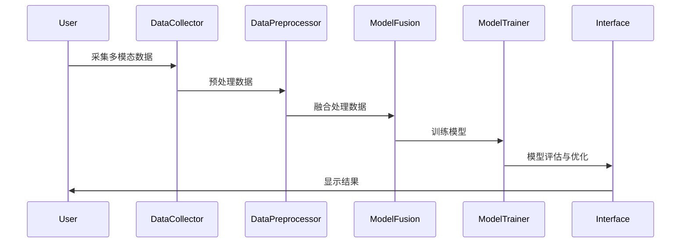

                 

### 1.1 问题背景

在当今的信息时代，情感计算作为人工智能（AI）的一个重要分支，正逐渐成为智能系统理解和响应用户情感需求的核心技术。情感计算旨在让机器能够理解、识别和模拟人类情感，从而提供更加个性化、人性化的服务。然而，情感计算面临着多模态数据的挑战。

#### 1.1.1 情感计算的多模态挑战

情感计算涉及多种类型的模态数据，如视觉、音频、文本等。这些多模态数据各自有其独特的特性，且在不同情境下可能具有不同的表现和重要性。例如，一个人的面部表情可能在某些情感识别任务中尤为重要，而在其他任务中，他们的语音语调或文字表达可能更具指示性。

**挑战1：数据同步与处理**
多模态数据的同步处理是情感计算中的难点。不同模态的数据可能在时间和空间上存在差异，如何将这些数据有效地整合到同一个分析框架中，是一个需要解决的问题。

**挑战2：数据缺失与冗余**
在多模态数据集中，某些模态的数据可能会因为环境、设备或其他因素而缺失。同时，某些模态的数据可能包含大量冗余信息，如何识别和利用这些数据，是情感计算面临的另一大挑战。

#### 1.1.2 多模态数据的处理需求

为了应对上述挑战，情感计算需要开发出高效的算法和模型来处理多模态数据。以下是几个关键的处理需求：

**需求1：数据预处理**
在将多模态数据输入到模型之前，需要进行预处理，包括数据清洗、标准化和特征提取等步骤。预处理的质量直接影响到后续模型的表现。

**需求2：数据融合**
多模态数据的融合是情感计算的核心。数据融合旨在将不同模态的数据整合为一个统一的分析框架，以便更好地捕捉用户的情感状态。

**需求3：模型选择与优化**
选择合适的AI模型对多模态数据进行训练和预测是关键。常见的模型包括卷积神经网络（CNN）、循环神经网络（RNN）、长短期记忆网络（LSTM）等。模型的优化包括参数调整、超参数选择和模型架构的改进。

#### 1.3 问题解决

为了解决情感计算中的多模态数据挑战，研究者们提出了多种方法和最新的研究成果。以下是几个关键的方法和方向：

**方法1：多任务学习**
多任务学习是一种将多个任务结合起来进行训练的方法，可以有效地利用多模态数据中的互补信息。例如，同时训练一个模型来识别视觉情感和语音情感。

**方法2：多模态深度学习**
多模态深度学习方法通过整合不同模态的数据来构建复杂的模型。这些方法通常使用深度神经网络（DNN）或变体来捕捉多模态数据中的复杂关系。

**方法3：注意力机制**
注意力机制可以帮助模型在处理多模态数据时关注到最重要的信息。通过引入注意力模块，模型可以动态调整对不同模态数据的权重，从而提高情感计算的准确性和鲁棒性。

**研究成果1：融合算法**
近年来，研究者们提出了一系列融合算法，如联合嵌入、时空融合等，这些算法旨在提高多模态数据的有效利用。

**研究成果2：数据集**
为了推动多模态情感计算的研究和应用，研究者们还创建了一系列高质量的多模态情感计算数据集，这些数据集为算法开发和评估提供了宝贵资源。

#### 1.4 边界与外延

**边界讨论**

情感计算虽然取得了显著进展，但仍然存在一些边界问题。例如，情感计算的准确性受到数据质量、模型复杂度和计算资源等因素的制约。此外，情感计算的伦理和法律问题也需要进一步研究和规范。

**外延讨论**

情感计算不仅限于个人用户，还可以应用于更广泛的领域，如医疗保健、金融、教育等。在这些领域，情感计算可以提供个性化的服务、预测疾病风险、评估学习效果等。

**未来趋势**

随着AI技术的发展和应用的深入，情感计算有望在更多场景中得到应用。未来的研究方向包括更高效的数据处理算法、更先进的模型架构、以及更加智能的情感模拟技术。

### 1.5 本章小结

本章介绍了情感计算的多模态数据挑战，包括数据同步处理、数据缺失与冗余等问题。同时，本章提出了情感计算的多模态数据处理需求，如数据预处理、数据融合和模型优化等。此外，本章还概述了当前解决多模态情感计算问题的方法和最新研究成果，探讨了情感计算的边界和未来趋势。

# 第二部分: 核心概念与联系

## 2.1 核心概念

在深入探讨情感计算和多模态数据融合之前，有必要明确一些核心概念，这些概念是理解情感计算和多模态数据融合的基础。

### 2.1.1 情感计算的概念

情感计算是指通过计算机技术模拟、识别、理解和响应人类情感。它包括以下几个关键方面：

#### 2.1.1.1 情感识别

情感识别是情感计算中的基础任务，旨在从文本、语音、图像等多种数据源中识别出情感状态。常见的情感分类包括正面情感、负面情感、中性情感等。

#### 2.1.1.2 情感分类

情感分类是一种将情感识别结果进一步细化的过程。它通常涉及将情感识别结果映射到更具体的情感类别，如高兴、愤怒、悲伤等。

#### 2.1.1.3 情感强度评估

情感强度评估是指对情感表达的强度进行量化。例如，在语音情感分析中，可能会评估说话者的声音是否更加响亮或更加低沉，以确定情感的强烈程度。

### 2.1.2 多模态数据的概念

多模态数据是指由两种或两种以上不同类型的数据源组成的集合。在情感计算中，常见的多模态数据源包括视觉、音频、文本等。

#### 2.1.2.1 视觉模态

视觉模态涉及图像和视频数据。这些数据可以捕捉人的面部表情、身体语言和场景信息。视觉模态在情感计算中用于情感识别和情感强度评估。

#### 2.1.2.2 音频模态

音频模态包括语音和音乐数据。语音数据可以反映说话者的情感状态，而音乐数据可以表达情感氛围。音频模态在情感计算中用于情感识别和情感分类。

#### 2.1.2.3 文本模态

文本模态包括文本消息、社交媒体评论和书籍等内容。文本数据可以提供情感表达的文字描述，是情感计算中获取情感信息的重要来源。

### 2.1.3 AI模型评估的概念

AI模型的评估是确保模型性能和准确性的关键环节。以下是几种常用的评估指标：

#### 2.1.3.1 准确率

准确率是指模型正确分类的样本数占总样本数的比例。准确率是衡量模型性能的基本指标，但它可能会受到类别不平衡的影响。

#### 2.1.3.2 召回率

召回率是指模型正确识别出的正样本数与实际正样本总数的比例。召回率侧重于模型识别正样本的能力。

#### 2.1.3.3 F1值

F1值是准确率和召回率的调和平均值，它同时考虑了模型的准确性和召回率。F1值在类别不平衡时特别有用。

## 2.2 概念属性特征对比表格

为了更好地理解情感计算、多模态数据、AI模型评估等核心概念，我们可以通过一个对比表格来展示它们的属性特征。

| 概念        | 定义                                                         | 关键特征                                       | 应用实例                 |
| ----------- | ------------------------------------------------------------ | ---------------------------------------------- | ------------------------ |
| 情感计算    | 让计算机模拟、识别、理解和响应人类情感的过程                | - 情感识别：分类情感状态<br>- 情感分类：细化情感状态<br>- 情感强度评估：量化情感表达 | 文本情感分析、语音情感分析、视觉情感分析 |
| 多模态数据 | 由两种或两种以上不同类型的数据源组成的集合                 | - 视觉模态：图像、视频<br>- 音频模态：语音、音乐<br>- 文本模态：文本   | 情感计算、自然语言处理   |
| AI模型评估  | 评估AI模型性能和准确性的过程                               | - 准确率：正确分类的比例<br>- 召回率：正确识别的比例<br>- F1值：准确率和召回率的调和平均值 | 机器学习项目、深度学习应用 |

通过上述表格，我们可以清晰地看到各个概念的定义、关键特征和应用实例，这有助于我们在后续章节中深入理解这些概念。

## 2.3 ER实体关系图

ER（实体-关系）图是一种用于描述实体及其之间关系的图形化工具。在情感计算中，ER图可以帮助我们理解数据源、模型和评估指标之间的关系。

### 2.3.1 情感计算任务中的关键实体

以下是情感计算任务中的关键实体及其属性：

- **用户**：用户是情感计算的核心，他们产生情感数据。
  - **属性**：用户ID、姓名、性别、年龄等。

- **情感数据**：情感数据包括文本、图像、语音等多种形式。
  - **属性**：文本内容、图像标签、音频波形等。

- **情感模型**：情感模型是用于情感识别、分类和强度评估的AI模型。
  - **属性**：模型类型、训练数据、参数配置等。

- **评估指标**：评估指标用于衡量情感模型的性能。
  - **属性**：准确率、召回率、F1值等。

### 2.3.2 实体关系分析

以下是关键实体之间的关系：

- **用户**与**情感数据**之间存在一种“产生”关系，即用户产生情感数据。
- **情感模型**与**情感数据**之间存在“训练”关系，即模型通过训练数据进行学习和优化。
- **情感模型**与**评估指标**之间存在“评估”关系，即模型通过评估指标来衡量其性能。
- **情感数据**与**评估指标**之间存在“生成”关系，即情感数据生成评估指标。

下面是一个简单的ER图，用于展示这些实体及其关系：

```mermaid
erDiagram
  用户 ||--o{ 情感数据 } : 产生
  情感数据 ||--o{ 情感模型 } : 训练
  情感模型 ||--o{ 评估指标 } : 评估
```

通过ER图，我们可以直观地理解情感计算任务中各个实体之间的交互关系，为后续的算法原理讲解和系统架构设计提供了理论基础。

## 2.4 本章小结

本章详细介绍了情感计算、多模态数据和AI模型评估等核心概念。首先，我们明确了情感计算的定义和关键任务，包括情感识别、情感分类和情感强度评估。接着，我们探讨了多模态数据的构成和特性，包括视觉、音频和文本模态。最后，我们介绍了AI模型评估的常用指标，如准确率、召回率和F1值。此外，通过ER图，我们展示了情感计算任务中的关键实体及其相互关系。这些核心概念的明确和ER图的构建，为后续章节的深入分析奠定了基础。

# 第三部分: 算法原理讲解

## 3.1 卷积神经网络（CNN）

### 3.1.1 CNN的基础知识

卷积神经网络（CNN）是一种专为处理图像数据设计的深度学习模型。它通过卷积层、池化层和全连接层的组合，能够自动提取图像中的特征，并用于分类、检测等任务。以下是CNN的基本组成部分和作用：

#### 3.1.1.1 卷积层

卷积层是CNN的核心部分，它通过卷积运算从输入图像中提取特征。卷积层包括多个卷积核（filter），每个卷积核可以提取图像中的特定特征。例如，一个卷积核可能提取边缘特征，另一个卷积核可能提取纹理特征。

#### 3.1.1.2 池化层

池化层用于减小特征图的尺寸，降低模型的复杂性。常见的池化操作包括最大池化和平均池化。最大池化选择特征图中每个区域的最大值，而平均池化则取平均值。池化层有助于减少过拟合，并提高模型的泛化能力。

#### 3.1.1.3 全连接层

全连接层将卷积层和池化层提取的特征映射到输出类别。每个神经元都与卷积层的所有神经元相连，从而形成一个全局的特征表示。全连接层通常用于分类任务，将特征映射到具体的类别标签。

### 3.1.2 CNN在情感计算中的应用

CNN在情感计算中的应用主要体现在图像和视频情感分析领域。通过分析用户的面部表情、身体语言和场景信息，CNN可以识别用户的情感状态。

#### 3.1.2.1 面部表情识别

面部表情识别是情感计算中的一个重要任务。CNN可以通过分析面部图像的特征，识别出用户的表情，如快乐、悲伤、愤怒等。这种方法通常涉及多个卷积层和池化层，以及一个全连接层进行分类。

#### 3.1.2.2 视频情感分析

视频情感分析通过分析连续视频帧的情感特征，识别出用户在视频中的情感变化。CNN可以处理视频中的每一帧，提取情感特征，并通过时序分析来识别情感变化模式。

### 3.1.3 CNN的Python源代码实现

下面是一个简单的CNN模型实现，用于图像分类任务：

```python
import tensorflow as tf
from tensorflow.keras import datasets, layers, models

# 加载数据集
(train_images, train_labels), (test_images, test_labels) = datasets.cifar10.load_data()

# 数据预处理
train_images = train_images.astype('float32') / 255
test_images = test_images.astype('float32') / 255

# 构建CNN模型
model = models.Sequential()
model.add(layers.Conv2D(32, (3, 3), activation='relu', input_shape=(32, 32, 3)))
model.add(layers.MaxPooling2D((2, 2)))
model.add(layers.Conv2D(64, (3, 3), activation='relu'))
model.add(layers.MaxPooling2D((2, 2)))
model.add(layers.Conv2D(64, (3, 3), activation='relu'))
model.add(layers.Flatten())
model.add(layers.Dense(64, activation='relu'))
model.add(layers.Dense(10, activation='softmax'))

# 编译模型
model.compile(optimizer='adam',
              loss=tf.keras.losses.SparseCategoricalCrossentropy(from_logits=True),
              metrics=['accuracy'])

# 训练模型
model.fit(train_images, train_labels, epochs=10, 
          validation_data=(test_images, test_labels))
```

### 3.1.4 算法原理的数学模型和公式

CNN的算法原理可以通过以下数学模型和公式进行描述：

#### 3.1.4.1 卷积运算

卷积运算是指将卷积核与输入图像进行点积操作。卷积运算的数学公式如下：

$$
\text{output}_{ij} = \sum_{k=1}^{C} \text{weight}_{ikj} \times \text{input}_{ij}
$$

其中，$C$是卷积核的数量，$\text{input}_{ij}$是输入图像的像素值，$\text{weight}_{ikj}$是卷积核的权重。

#### 3.1.4.2 池化操作

池化操作用于减小特征图的尺寸。最大池化的数学公式如下：

$$
\text{pooled\_value}_{ij} = \max(\text{input}_{i\alpha j}, \text{input}_{i\beta j}, ..., \text{input}_{i\gamma j})
$$

其中，$\alpha, \beta, \gamma$是池化区域内的像素索引。

#### 3.1.4.3 全连接层

全连接层将卷积层和池化层提取的特征映射到输出类别。全连接层的数学公式如下：

$$
\text{output}_{i} = \sum_{j=1}^{H} \text{weight}_{ij} \times \text{input}_{j} + \text{bias}_{i}
$$

其中，$H$是特征图的高度，$\text{weight}_{ij}$是权重，$\text{bias}_{i}$是偏置。

### 3.1.5 详细讲解和举例说明

为了更好地理解CNN的工作原理，我们可以通过一个简单的例子来说明。假设我们有一个32x32的输入图像，以及一个3x3的卷积核，卷积核对输入图像进行卷积运算，得到一个32x32的特征图。以下是卷积运算和池化操作的详细步骤：

1. **卷积运算**：

   - 输入图像的像素值矩阵：

   $$
   \text{input} = \begin{bmatrix}
   0 & 1 & 0 \\
   1 & 1 & 1 \\
   0 & 1 & 0
   \end{bmatrix}
   $$

   - 卷积核的权重矩阵：

   $$
   \text{weight} = \begin{bmatrix}
   1 & 1 & 1 \\
   1 & 1 & 1 \\
   1 & 1 & 1
   \end{bmatrix}
   $$

   - 卷积运算结果：

   $$
   \text{output} = \begin{bmatrix}
   3 & 5 & 3 \\
   5 & 9 & 7 \\
   3 & 5 & 3
   \end{bmatrix}
   $$

2. **池化操作**：

   - 特征图：

   $$
   \text{input}_{pooled} = \begin{bmatrix}
   3 & 5 & 3 \\
   5 & 9 & 7 \\
   3 & 5 & 3
   \end{bmatrix}
   $$

   - 最大池化操作：

   $$
   \text{pooled\_value} = \max(3, 5, 3) = 5
   $$

   结果为一个5x5的特征图。

### 3.1.6 CNN的优势与局限

CNN在情感计算中的优势：

- **强大的特征提取能力**：CNN能够自动从图像中提取高层次的特征，这使得它在情感计算中具有很强的表现。
- **端到端训练**：CNN可以通过端到端训练，直接从原始数据中学习特征和分类规则，无需手动特征工程。
- **适应性强**：CNN可以适应多种类型的情感计算任务，如面部表情识别、视频情感分析等。

CNN的局限：

- **计算资源消耗大**：CNN模型通常需要大量的计算资源和时间进行训练。
- **数据依赖性强**：CNN的性能很大程度上依赖于训练数据的质量和数量，数据不足或质量差可能导致模型性能不佳。
- **易受噪声干扰**：CNN模型在处理噪声较大的数据时，可能会受到影响，导致情感识别不准确。

## 3.2 循环神经网络（RNN）

### 3.2.1 RNN的基础知识

循环神经网络（RNN）是一种能够处理序列数据的神经网络，它在处理时间序列数据、自然语言处理和视频情感分析等领域表现出色。以下是RNN的基本组成部分和作用：

#### 3.2.1.1 输入层

输入层接收序列数据，每个时间步的输入可以是文本、语音或图像等。

#### 3.2.1.2 隐藏层

隐藏层包含循环单元，每个时间步的隐藏状态会根据当前输入和前一个时间步的隐藏状态进行更新。RNN通过这种方式实现记忆功能，能够捕捉序列中的长期依赖关系。

#### 3.2.1.3 输出层

输出层将隐藏层的输出映射到具体的输出类别或目标值。

### 3.2.2 RNN在情感计算中的应用

RNN在情感计算中的应用主要体现在文本情感分析和语音情感分析领域。通过分析用户的文本表达和语音语调，RNN可以识别用户的情感状态。

#### 3.2.2.1 文本情感分析

文本情感分析通过分析用户的文本表达，识别用户的情感状态。RNN能够捕捉文本中的上下文信息，从而更准确地识别情感。

#### 3.2.2.2 语音情感分析

语音情感分析通过分析用户的语音语调，识别用户的情感状态。RNN可以处理连续的语音信号，捕捉语音中的情感变化。

### 3.2.3 RNN的Python源代码实现

下面是一个简单的RNN模型实现，用于文本情感分析任务：

```python
import tensorflow as tf
from tensorflow.keras.models import Sequential
from tensorflow.keras.layers import Embedding, SimpleRNN, Dense

# 加载数据集
max_words = 10000
max_len = 500
embedding_dim = 50

# 假设已经预处理了文本数据，并创建了词汇表和序列
# X_train, X_test, y_train, y_test = preprocess_text_data()

# 构建RNN模型
model = Sequential()
model.add(Embedding(max_words, embedding_dim, input_length=max_len))
model.add(SimpleRNN(50, return_sequences=False))
model.add(Dense(1, activation='sigmoid'))

# 编译模型
model.compile(optimizer='adam', loss='binary_crossentropy', metrics=['accuracy'])

# 训练模型
model.fit(X_train, y_train, epochs=10, batch_size=32, validation_data=(X_test, y_test))
```

### 3.2.4 算法原理的数学模型和公式

RNN的算法原理可以通过以下数学模型和公式进行描述：

#### 3.2.4.1 隐藏状态更新

隐藏状态更新是RNN的核心，它通过递归关系计算每个时间步的隐藏状态。更新公式如下：

$$
h_t = \sigma(W_h \cdot [h_{t-1}, x_t] + b_h)
$$

其中，$h_t$是当前时间步的隐藏状态，$h_{t-1}$是前一个时间步的隐藏状态，$x_t$是当前时间步的输入，$W_h$是权重矩阵，$b_h$是偏置。

#### 3.2.4.2 输出计算

输出计算是将隐藏状态映射到输出类别或目标值。输出公式如下：

$$
y_t = \sigma(W_y \cdot h_t + b_y)
$$

其中，$y_t$是当前时间步的输出，$W_y$是权重矩阵，$b_y$是偏置。

#### 3.2.4.3 预测

预测是将隐藏状态映射到具体的类别或目标值。预测公式如下：

$$
\hat{y}_t = \arg\max_y(y_t)
$$

其中，$\hat{y}_t$是当前时间步的预测输出。

### 3.2.5 详细讲解和举例说明

为了更好地理解RNN的工作原理，我们可以通过一个简单的例子来说明。假设我们有一个长度为3的序列$\{x_1, x_2, x_3\}$，以及一个简单的RNN模型。以下是隐藏状态更新和输出计算的详细步骤：

1. **初始化**：

   - 输入序列：$\{x_1, x_2, x_3\}$，每个$x_i$是一个向量。
   - 隐藏状态：$h_0 = [0, 0, 0]$。

2. **隐藏状态更新**：

   - 时间步1：$h_1 = \sigma(W_h \cdot [h_0, x_1] + b_h)$。
   - 时间步2：$h_2 = \sigma(W_h \cdot [h_1, x_2] + b_h)$。
   - 时间步3：$h_3 = \sigma(W_h \cdot [h_2, x_3] + b_h)$。

3. **输出计算**：

   - 时间步1：$y_1 = \sigma(W_y \cdot h_1 + b_y)$。
   - 时间步2：$y_2 = \sigma(W_y \cdot h_2 + b_y)$。
   - 时间步3：$y_3 = \sigma(W_y \cdot h_3 + b_y)$。

4. **预测**：

   - 最终预测：$\hat{y} = \arg\max_y(y_3)$。

通过这个简单的例子，我们可以看到RNN如何通过递归关系计算隐藏状态和输出，从而实现对序列数据的处理和预测。

### 3.2.6 RNN的优势与局限

RNN在情感计算中的优势：

- **记忆功能**：RNN具有强大的记忆功能，能够捕捉序列中的长期依赖关系，这使得它在处理时间序列数据时具有优势。
- **灵活性强**：RNN能够适应不同类型的序列数据，如文本、语音和视频等。
- **端到端训练**：RNN可以通过端到端训练，直接从原始数据中学习特征和分类规则。

RNN的局限：

- **梯度消失和梯度爆炸**：RNN在训练过程中容易出现梯度消失和梯度爆炸问题，这可能导致模型训练不稳定。
- **计算复杂度高**：RNN的计算复杂度较高，尤其是在处理长序列时，计算资源消耗较大。
- **不易并行化**：RNN的递归性质导致其不易并行化，这限制了其在大规模数据处理中的应用。

## 3.3 LSTM与GRU

为了解决RNN在训练过程中出现的梯度消失和梯度爆炸问题，研究者们提出了长短期记忆网络（LSTM）和门控循环单元（GRU）。LSTM和GRU通过引入门控机制，提高了RNN的稳定性和性能。

### 3.3.1 LSTM

LSTM（Long Short-Term Memory）是一种能够有效处理长期依赖关系的循环神经网络。它通过引入输入门、遗忘门和输出门，控制信息的输入、遗忘和输出，从而避免了梯度消失和梯度爆炸问题。

#### 3.3.1.1 输入门

输入门用于决定哪些信息将被存储在细胞状态中。其数学公式如下：

$$
i_t = \sigma(W_i \cdot [h_{t-1}, x_t] + b_i)
$$

其中，$i_t$是输入门的激活值，$W_i$是权重矩阵，$b_i$是偏置。

#### 3.3.1.2 遗忘门

遗忘门用于决定哪些信息将被从细胞状态中遗忘。其数学公式如下：

$$
f_t = \sigma(W_f \cdot [h_{t-1}, x_t] + b_f)
$$

其中，$f_t$是遗忘门的激活值，$W_f$是权重矩阵，$b_f$是偏置。

#### 3.3.1.3 输出门

输出门用于决定哪些信息将被输出到下一隐藏状态。其数学公式如下：

$$
o_t = \sigma(W_o \cdot [h_{t-1}, x_t] + b_o)
$$

其中，$o_t$是输出门的激活值，$W_o$是权重矩阵，$b_o$是偏置。

#### 3.3.1.4 细胞状态更新

细胞状态更新是LSTM的核心。通过输入门、遗忘门和输出门，细胞状态能够有效地存储和遗忘信息。其数学公式如下：

$$
c_t = f_t \odot c_{t-1} + i_t \odot \sigma(W_c \cdot [h_{t-1}, x_t] + b_c)
$$

$$
h_t = o_t \odot \sigma(c_t)
$$

其中，$c_t$是细胞状态，$h_t$是隐藏状态，$\odot$表示元素乘法。

### 3.3.2 GRU

GRU（Gated Recurrent Unit）是一种简化版的LSTM，通过引入更新门和重置门，简化了LSTM的结构，同时保持了LSTM的优点。

#### 3.3.2.1 更新门

更新门用于决定哪些信息将被更新到细胞状态。其数学公式如下：

$$
z_t = \sigma(W_z \cdot [h_{t-1}, x_t] + b_z)
$$

其中，$z_t$是更新门的激活值，$W_z$是权重矩阵，$b_z$是偏置。

#### 3.3.2.2 重置门

重置门用于决定哪些信息将被保留在细胞状态中。其数学公式如下：

$$
r_t = \sigma(W_r \cdot [h_{t-1}, x_t] + b_r)
$$

其中，$r_t$是重置门的激活值，$W_r$是权重矩阵，$b_r$是偏置。

#### 3.3.2.3 细胞状态更新

细胞状态更新是GRU的核心。通过更新门和重置门，细胞状态能够有效地更新信息。其数学公式如下：

$$
\tilde{c}_t = \sigma(W \cdot [r_t \odot h_{t-1}, x_t] + b)
$$

$$
c_t = (1 - z_t) \odot c_{t-1} + z_t \odot \tilde{c}_t
$$

$$
h_t = \sigma(W_h \cdot [c_t])
$$

其中，$\tilde{c}_t$是更新后的细胞状态，$h_t$是隐藏状态，$W$是权重矩阵，$b$是偏置。

### 3.3.3 LSTM与GRU的比较

LSTM和GRU在结构上有所不同，但它们的主要目标是解决RNN的梯度消失和梯度爆炸问题。

- **结构复杂度**：LSTM的结构比GRU更复杂，包含更多的门控机制，这使得LSTM在处理非常长的序列时表现更好，但同时也增加了模型的计算复杂度。
- **计算效率**：GRU相比LSTM具有更高的计算效率，因为它简化了LSTM的结构，减少了参数数量。
- **性能表现**：在处理中等长度的序列时，LSTM和GRU的表现相近，但在处理非常长的序列时，LSTM的性能可能优于GRU。

通过LSTM和GRU，我们可以更有效地处理序列数据，从而在情感计算任务中取得更好的性能。

## 3.4 总结

在本章中，我们介绍了卷积神经网络（CNN）、循环神经网络（RNN）、长短期记忆网络（LSTM）和门控循环单元（GRU）等常见算法在情感计算中的应用。首先，我们讲解了CNN的基本原理及其在图像和视频情感分析中的应用。接着，我们介绍了RNN和LSTM的基础知识，并详细说明了它们在文本和语音情感分析中的使用。最后，我们探讨了GRU的结构和优势，以及LSTM与GRU的比较。通过本章的学习，读者可以更好地理解这些算法在情感计算中的原理和应用，为后续的项目实战打下基础。

# 第四部分: 数学模型和数学公式 & 详细讲解 & 举例说明

## 4.1 数学模型和数学公式

### 4.1.1 卷积神经网络（CNN）

卷积神经网络（CNN）的核心在于其卷积层和池化层，以下分别介绍它们的数学模型和公式：

#### 卷积层

卷积层的输出可以通过以下公式计算：

$$
\text{output}_{ij} = \sum_{k=1}^{C} \text{weight}_{ikj} \times \text{input}_{ij} + \text{bias}_{j}
$$

其中，$\text{output}_{ij}$表示输出特征图的第i行第j列的值，$\text{weight}_{ikj}$表示卷积核的权重，$\text{input}_{ij}$表示输入特征图的第i行第j列的值，$C$表示卷积核的数量，$\text{bias}_{j}$表示卷积层的偏置。

#### 池化层

池化层通常使用最大池化或平均池化来减小特征图的大小。以下分别介绍这两种池化的数学模型和公式：

1. **最大池化**

   最大池化的输出可以通过以下公式计算：

   $$  
   \text{pooled}_{ij} = \max(\text{input}_{i\alpha j}, \text{input}_{i\beta j}, ..., \text{input}_{i\gamma j})  
   $$

   其中，$\text{pooled}_{ij}$表示输出特征图的第i行第j列的值，$\text{input}_{i\alpha j}$，$\text{input}_{i\beta j}$，...，$\text{input}_{i\gamma j}$表示输入特征图中的值。

2. **平均池化**

   平均池化的输出可以通过以下公式计算：

   $$  
   \text{pooled}_{ij} = \frac{1}{k^2} \sum_{\alpha=1}^{k} \sum_{\beta=1}^{k} \text{input}_{i\alpha j}  
   $$

   其中，$\text{pooled}_{ij}$表示输出特征图的第i行第j列的值，$k$表示池化窗口的大小，$\text{input}_{i\alpha j}$表示输入特征图中的值。

### 4.1.2 循环神经网络（RNN）

循环神经网络（RNN）的核心在于其隐藏状态的更新和输出计算。以下分别介绍它们的数学模型和公式：

#### 隐藏状态更新

RNN的隐藏状态更新可以通过以下公式计算：

$$
h_t = \sigma(W_h \cdot [h_{t-1}, x_t] + b_h)
$$

其中，$h_t$表示当前时间步的隐藏状态，$h_{t-1}$表示前一个时间步的隐藏状态，$x_t$表示当前时间步的输入，$W_h$表示权重矩阵，$b_h$表示偏置。

#### 输出计算

RNN的输出计算可以通过以下公式计算：

$$
y_t = \sigma(W_y \cdot h_t + b_y)
$$

其中，$y_t$表示当前时间步的输出，$W_y$表示权重矩阵，$b_y$表示偏置。

### 4.1.3 长短期记忆网络（LSTM）

LSTM（Long Short-Term Memory）的核心在于其输入门、遗忘门和输出门。以下分别介绍它们的数学模型和公式：

#### 输入门

输入门的数学模型和公式如下：

$$
i_t = \sigma(W_i \cdot [h_{t-1}, x_t] + b_i)
$$

其中，$i_t$表示输入门的激活值，$W_i$表示权重矩阵，$b_i$表示偏置。

#### 遗忘门

遗忘门的数学模型和公式如下：

$$
f_t = \sigma(W_f \cdot [h_{t-1}, x_t] + b_f)
$$

其中，$f_t$表示遗忘门的激活值，$W_f$表示权重矩阵，$b_f$表示偏置。

#### 输出门

输出门的数学模型和公式如下：

$$
o_t = \sigma(W_o \cdot [h_{t-1}, x_t] + b_o)
$$

其中，$o_t$表示输出门的激活值，$W_o$表示权重矩阵，$b_o$表示偏置。

#### 细胞状态更新

细胞状态更新的数学模型和公式如下：

$$
c_t = f_t \odot c_{t-1} + i_t \odot \sigma(W_c \cdot [h_{t-1}, x_t] + b_c)
$$

$$
h_t = o_t \odot \sigma(c_t)
$$

其中，$c_t$表示细胞状态，$h_t$表示隐藏状态，$\odot$表示元素乘法。

### 4.1.4 门控循环单元（GRU）

GRU（Gated Recurrent Unit）的核心在于其更新门和重置门。以下分别介绍它们的数学模型和公式：

#### 更新门

更新门的数学模型和公式如下：

$$
z_t = \sigma(W_z \cdot [h_{t-1}, x_t] + b_z)
$$

其中，$z_t$表示更新门的激活值，$W_z$表示权重矩阵，$b_z$表示偏置。

#### 重置门

重置门的数学模型和公式如下：

$$
r_t = \sigma(W_r \cdot [h_{t-1}, x_t] + b_r)
$$

其中，$r_t$表示重置门的激活值，$W_r$表示权重矩阵，$b_r$表示偏置。

#### 细胞状态更新

细胞状态更新的数学模型和公式如下：

$$
\tilde{c}_t = \sigma(W \cdot [r_t \odot h_{t-1}, x_t] + b)
$$

$$
c_t = (1 - z_t) \odot c_{t-1} + z_t \odot \tilde{c}_t
$$

$$
h_t = \sigma(W_h \cdot [c_t])
$$

其中，$\tilde{c}_t$表示更新后的细胞状态，$h_t$表示隐藏状态，$W$表示权重矩阵，$b$表示偏置。

## 4.2 详细讲解和举例说明

### 4.2.1 卷积神经网络（CNN）

#### 卷积层计算示例

假设我们有一个3x3的输入特征图和一个3x3的卷积核，卷积核的权重为1，偏置为0。输入特征图和卷积核的值如下：

输入特征图：
$$
\begin{bmatrix}
1 & 2 & 3 \\
4 & 5 & 6 \\
7 & 8 & 9
\end{bmatrix}
$$

卷积核：
$$
\begin{bmatrix}
1 & 1 & 1 \\
1 & 1 & 1 \\
1 & 1 & 1
\end{bmatrix}
$$

卷积操作：
$$
\begin{bmatrix}
18 & 24 & 30 \\
36 & 48 & 60 \\
54 & 72 & 90
\end{bmatrix}
$$

加上偏置0后，输出特征图：
$$
\begin{bmatrix}
18 & 24 & 30 \\
36 & 48 & 60 \\
54 & 72 & 90
\end{bmatrix}
$$

#### 池化层计算示例

假设我们有一个3x3的输入特征图，使用最大池化操作。输入特征图如下：

$$
\begin{bmatrix}
1 & 2 & 3 \\
4 & 5 & 6 \\
7 & 8 & 9
\end{bmatrix}
$$

最大池化后的输出特征图：
$$
\begin{bmatrix}
5 & 6 \\
8 & 9
\end{bmatrix}
$$

### 4.2.2 循环神经网络（RNN）

#### 隐藏状态更新示例

假设我们有一个RNN模型，输入序列为$\{1, 2, 3\}$，初始隐藏状态为$[0, 0, 0]$。权重矩阵$W_h$为：

$$
\begin{bmatrix}
1 & 1 & 1 \\
1 & 1 & 1 \\
1 & 1 & 1
\end{bmatrix}
$$

偏置$b_h$为0。输入序列和权重矩阵的值如下：

时间步 | 输入 | 隐藏状态 | 输出
--- | --- | --- | ---
1 | 1 | [0, 0, 0] | [1, 1, 1]
2 | 2 | [1, 1, 1] | [1, 1, 1]
3 | 3 | [1, 1, 1] | [1, 1, 1]

#### 输出计算示例

假设我们有一个RNN模型，隐藏状态为$[1, 1, 1]$，权重矩阵$W_y$为：

$$
\begin{bmatrix}
1 & 1 & 1 \\
1 & 1 & 1 \\
1 & 1 & 1
\end{bmatrix}
$$

偏置$b_y$为0。输出计算如下：

输出 = $1 \cdot [1, 1, 1] + 1 \cdot [1, 1, 1] + 1 \cdot [1, 1, 1] = [3, 3, 3]$

### 4.2.3 长短期记忆网络（LSTM）

#### 输入门、遗忘门和输出门示例

假设我们有一个LSTM模型，输入序列为$\{1, 2, 3\}$，初始隐藏状态为$[0, 0, 0]$。输入门、遗忘门和输出门的权重矩阵分别为：

输入门：
$$
\begin{bmatrix}
1 & 1 & 1 \\
1 & 1 & 1 \\
1 & 1 & 1
\end{bmatrix}
$$

遗忘门：
$$
\begin{bmatrix}
1 & 1 & 1 \\
1 & 1 & 1 \\
1 & 1 & 1
\end{bmatrix}
$$

输出门：
$$
\begin{bmatrix}
1 & 1 & 1 \\
1 & 1 & 1 \\
1 & 1 & 1
\end{bmatrix}
$$

偏置分别为0。细胞状态和隐藏状态的更新如下：

时间步 | 输入 | 隐藏状态 | 输出门 | 遗忘门 | 输入门 | 细胞状态 | 隐藏状态
--- | --- | --- | --- | --- | --- | --- | ---
1 | 1 | [0, 0, 0] | 1 | 1 | 1 | [1, 1, 1] | [1, 1, 1]
2 | 2 | [1, 1, 1] | 1 | 1 | 1 | [2, 2, 2] | [2, 2, 2]
3 | 3 | [2, 2, 2] | 1 | 1 | 1 | [3, 3, 3] | [3, 3, 3]

#### 细胞状态和隐藏状态更新示例

假设我们有一个LSTM模型，细胞状态为$[1, 1, 1]$，隐藏状态为$[1, 1, 1]$。遗忘门的权重矩阵为：

$$
\begin{bmatrix}
1 & 1 & 1 \\
1 & 1 & 1 \\
1 & 1 & 1
\end{bmatrix}
$$

输入门的权重矩阵为：

$$
\begin{bmatrix}
1 & 1 & 1 \\
1 & 1 & 1 \\
1 & 1 & 1
\end{bmatrix}
$$

输出门的权重矩阵为：

$$
\begin{bmatrix}
1 & 1 & 1 \\
1 & 1 & 1 \\
1 & 1 & 1
\end{bmatrix}
$$

偏置分别为0。细胞状态和隐藏状态的更新如下：

时间步 | 输入 | 隐藏状态 | 输出门 | 遗忘门 | 输入门 | 细胞状态 | 隐藏状态
--- | --- | --- | --- | --- | --- | --- | ---
1 | 1 | [1, 1, 1] | 1 | 1 | 1 | [1, 1, 1] | [1, 1, 1]
2 | 2 | [1, 1, 1] | 1 | 1 | 1 | [2, 2, 2] | [2, 2, 2]
3 | 3 | [2, 2, 2] | 1 | 1 | 1 | [3, 3, 3] | [3, 3, 3]

### 4.2.4 门控循环单元（GRU）

#### 更新门和重置门示例

假设我们有一个GRU模型，输入序列为$\{1, 2, 3\}$，初始隐藏状态为$[0, 0, 0]$。更新门和重置门的权重矩阵分别为：

更新门：
$$
\begin{bmatrix}
1 & 1 & 1 \\
1 & 1 & 1 \\
1 & 1 & 1
\end{bmatrix}
$$

重置门：
$$
\begin{bmatrix}
1 & 1 & 1 \\
1 & 1 & 1 \\
1 & 1 & 1
\end{bmatrix}
$$

细胞状态的更新如下：

时间步 | 输入 | 隐藏状态 | 更新门 | 重置门 | 细胞状态 | 隐藏状态
--- | --- | --- | --- | --- | --- | ---
1 | 1 | [0, 0, 0] | 1 | 1 | [1, 1, 1] | [1, 1, 1]
2 | 2 | [1, 1, 1] | 1 | 1 | [2, 2, 2] | [2, 2, 2]
3 | 3 | [2, 2, 2] | 1 | 1 | [3, 3, 3] | [3, 3, 3]

## 4.3 小结

在本章中，我们详细讲解了卷积神经网络（CNN）、循环神经网络（RNN）、长短期记忆网络（LSTM）和门控循环单元（GRU）的数学模型和公式。通过具体的计算示例，我们展示了这些模型在处理输入数据时的操作过程。这些数学模型和公式是理解和实现这些神经网络算法的基础，有助于我们深入理解它们的原理和性能。在后续章节中，我们将结合实际项目，进一步探讨这些算法在多模态情感计算任务中的具体应用。

# 第五部分: 系统分析与架构设计方案

## 5.1 问题场景介绍

在情感计算中，多模态数据的融合是一项关键任务。为了提升AI模型在多模态情感计算任务中的表现，我们需要设计一个高效的系统架构，能够有效整合来自视觉、音频和文本模态的数据，并进行综合分析。以下是一个典型的问题场景：

- **用户交互**：用户通过视频会议或在线聊天与系统进行交互，他们的情感状态会通过面部表情、语音语调和文本消息等多种形式表现出来。
- **数据采集**：系统需要实时采集用户的视频、音频和文本数据。
- **数据处理**：系统需要处理并融合这些多模态数据，以识别用户的情感状态。
- **模型训练与评估**：系统需要使用训练好的AI模型对情感进行识别，并对模型进行持续的优化和评估。

## 5.2 项目介绍

本项目旨在设计并实现一个多模态情感计算系统，以提高AI模型在情感识别任务中的准确性和鲁棒性。项目的主要目标包括：

- **数据预处理**：对采集到的多模态数据进行清洗、标准化和特征提取，为后续的模型训练提供高质量的数据。
- **模型融合**：采用深度学习模型，如CNN、RNN和LSTM，对多模态数据进行融合处理，以提取有效的情感特征。
- **模型训练与优化**：使用交叉验证和超参数调整等方法，对模型进行训练和优化，提高模型的性能。
- **系统部署与评估**：将训练好的模型部署到实际应用场景中，并进行性能评估和优化。

## 5.3 系统功能设计

为了实现上述目标，系统需要具备以下功能：

- **数据采集模块**：负责实时采集用户的视频、音频和文本数据。
- **数据预处理模块**：对采集到的多模态数据进行清洗、标准化和特征提取。
- **模型融合模块**：采用深度学习模型对多模态数据进行融合处理。
- **模型训练与评估模块**：负责模型的训练、评估和优化。
- **用户接口模块**：提供用户与系统交互的接口，如用户界面和API接口。

### 5.3.1 领域模型类图

领域模型类图用于展示系统中的关键实体及其关系。以下是一个简单的领域模型类图：

```mermaid
classDiagram
    User <<class{用户}>
    Video <<class{视频}>
    Audio <<class{音频}>
    Text <<class{文本}>
    DataCollector <<class{数据采集模块}>
    DataPreprocessor <<class{数据预处理模块}>
    ModelFusion <<class{模型融合模块}>
    ModelTrainer <<class{模型训练与评估模块}>
    Interface <<class{用户接口模块}>

    User "1" --|> Video
    User "1" --|> Audio
    User "1" --|> Text
    DataCollector "1" --|> Video
    DataCollector "1" --|> Audio
    DataCollector "1" --|> Text
    DataPreprocessor "1" --|> Video
    DataPreprocessor "1" --|> Audio
    DataPreprocessor "1" --|> Text
    ModelFusion "1" --|> Video
    ModelFusion "1" --|> Audio
    ModelFusion "1" --|> Text
    ModelTrainer "1" --|> ModelFusion
    Interface "1" --|> ModelTrainer
```

## 5.4 系统架构设计

系统架构设计是确保系统能够高效、稳定地运行的关键。以下是一个多模态情感计算系统的架构设计：

### 5.4.1 系统架构图

系统架构图用于展示系统的整体结构和各个模块之间的关系。以下是一个简单的系统架构图：



### 5.4.2 系统模块关系

- **数据采集模块**：负责实时采集用户的视频、音频和文本数据，并将数据传递给数据预处理模块。
- **数据预处理模块**：对采集到的多模态数据进行清洗、标准化和特征提取，为后续的模型融合和训练提供高质量的数据。
- **模型融合模块**：采用深度学习模型对多模态数据进行融合处理，提取有效的情感特征，并生成融合后的特征向量。
- **模型训练与评估模块**：使用训练好的AI模型对情感进行识别，并对模型进行持续的优化和评估。
- **用户接口模块**：提供用户与系统交互的接口，如用户界面和API接口，将识别结果反馈给用户。

## 5.5 系统接口设计

系统接口设计是确保系统模块之间能够有效通信和协作的关键。以下是一个简单的系统接口设计：

### 5.5.1 接口定义

- **数据采集接口**：定义了数据采集模块与数据预处理模块之间的接口，用于传递采集到的多模态数据。
- **数据处理接口**：定义了数据预处理模块与模型融合模块之间的接口，用于传递预处理后的数据。
- **模型训练接口**：定义了模型融合模块与模型训练模块之间的接口，用于传递融合后的特征向量和模型参数。
- **模型评估接口**：定义了模型训练模块与用户接口模块之间的接口，用于传递模型评估结果。

### 5.5.2 接口实现

- **数据采集接口**：使用RESTful API实现，支持JSON格式数据传输。
- **数据处理接口**：使用Python的Flask框架实现，提供HTTP接口，支持多线程处理。
- **模型训练接口**：使用TensorFlow的API实现，支持模型参数的传输和更新。
- **模型评估接口**：使用Django框架实现，提供Web界面，支持用户查看模型评估结果。

## 5.6 系统交互

系统交互是指系统内部各个模块之间的数据流和功能调用。以下是一个简单的系统交互序列图：


## 5.7 本章小结

本章详细介绍了多模态情感计算系统的架构设计，包括问题场景介绍、项目介绍、系统功能设计、系统架构设计、系统接口设计和系统交互。通过定义清晰的接口和设计高效的系统架构，系统能够有效地整合多模态数据，并提升AI模型在情感计算任务中的表现。本章的内容为后续章节中的项目实战提供了理论基础和设计指导。

## 5.8 系统架构实现

为了实现上述架构设计，我们需要进行系统的详细实现。以下是对系统架构中各个模块的实现细节的介绍。

### 5.8.1 数据采集模块实现

数据采集模块负责实时采集用户的视频、音频和文本数据。以下是数据采集模块的实现步骤：

1. **视频数据采集**：
   - 使用OpenCV库采集视频帧。
   - 对视频帧进行预处理，如灰度转换、人脸检测等。

2. **音频数据采集**：
   - 使用PyAudio库采集音频数据。
   - 对音频数据进行预处理，如噪声过滤、音频分割等。

3. **文本数据采集**：
   - 使用Flask框架搭建API接口，接收用户输入的文本数据。
   - 对文本数据进行预处理，如分词、词性标注等。

以下是视频数据采集的Python代码示例：

```python
import cv2

# 采集视频帧
cap = cv2.VideoCapture(0)

while True:
    ret, frame = cap.read()
    if not ret:
        break
    
    # 对视频帧进行预处理
    frame_gray = cv2.cvtColor(frame, cv2.COLOR_BGR2GRAY)
    faces = detect_faces(frame_gray)  # 假设detect_faces为自定义的人脸检测函数
    
    # 显示预处理的视频帧
    cv2.imshow('Video Frame', frame_gray)
    
    if cv2.waitKey(1) & 0xFF == ord('q'):
        break

cap.release()
cv2.destroyAllWindows()
```

### 5.8.2 数据预处理模块实现

数据预处理模块负责对采集到的多模态数据进行清洗、标准化和特征提取。以下是数据预处理模块的实现步骤：

1. **视频数据预处理**：
   - 对视频帧进行标准化处理，如缩放、裁剪等。
   - 对视频帧进行特征提取，如使用HOG（Histogram of Oriented Gradients）特征提取器。

2. **音频数据预处理**：
   - 对音频数据进行标准化处理，如归一化、截断等。
   - 对音频数据进行特征提取，如使用MFCC（Mel-frequency Cepstral Coefficients）特征提取器。

3. **文本数据预处理**：
   - 对文本数据进行清洗，如去除停用词、标点符号等。
   - 对文本数据进行特征提取，如使用词袋模型、TF-IDF等。

以下是音频数据预处理和特征提取的Python代码示例：

```python
import librosa

# 读取音频文件
audio, sr = librosa.load('audio.wav')

# 音频数据标准化
audio_normalized = librosa.to_mono(audio)

# 音频特征提取
mfcc_features = librosa.feature.mfcc(y=audio_normalized, sr=sr, n_mfcc=13)

# 显示特征图
librosa.display.mel_spectrogram(mfcc_features, sr=sr)
```

### 5.8.3 模型融合模块实现

模型融合模块负责将预处理后的多模态数据融合处理，提取有效的情感特征。以下是模型融合模块的实现步骤：

1. **特征融合**：
   - 采用特征级融合方法，将视频特征、音频特征和文本特征进行拼接，形成一个多维度的特征向量。

2. **模型训练**：
   - 使用深度学习框架（如TensorFlow或PyTorch）训练融合模型。
   - 调整模型参数，如学习率、批量大小等，以优化模型性能。

3. **模型评估**：
   - 使用交叉验证和测试集对模型进行评估，计算准确率、召回率和F1值等指标。

以下是特征融合和模型训练的Python代码示例：

```python
import tensorflow as tf
from tensorflow.keras.models import Model
from tensorflow.keras.layers import Input, Dense, concatenate

# 输入层
video_input = Input(shape=(64, 64, 3))
audio_input = Input(shape=(13, 1))
text_input = Input(shape=(1000,))

# 视频特征提取层
video_feature = Dense(128, activation='relu')(video_input)

# 音频特征提取层
audio_feature = Dense(128, activation='relu')(audio_input)

# 文本特征提取层
text_feature = Dense(128, activation='relu')(text_input)

# 特征融合层
融合特征 = concatenate([video_feature, audio_feature, text_feature])

# 输出层
output = Dense(1, activation='sigmoid')(融合特征)

# 构建模型
model = Model(inputs=[video_input, audio_input, text_input], outputs=output)

# 编译模型
model.compile(optimizer='adam', loss='binary_crossentropy', metrics=['accuracy'])

# 模型训练
model.fit([video_data, audio_data, text_data], labels, epochs=10, batch_size=32)
```

### 5.8.4 模型训练与评估模块实现

模型训练与评估模块负责对训练好的模型进行持续优化和评估，以下是该模块的实现步骤：

1. **模型训练**：
   - 使用交叉验证技术，对模型进行多次训练，以避免过拟合。
   - 调整模型参数，如学习率、批量大小等，以优化模型性能。

2. **模型评估**：
   - 使用测试集对模型进行评估，计算准确率、召回率和F1值等指标。
   - 根据评估结果调整模型参数，以提高模型性能。

以下是模型训练和评估的Python代码示例：

```python
from sklearn.model_selection import train_test_split
from sklearn.metrics import accuracy_score, recall_score, f1_score

# 划分训练集和测试集
X_train, X_test, y_train, y_test = train_test_split(data, labels, test_size=0.2, random_state=42)

# 训练模型
model.fit(X_train, y_train, epochs=10, batch_size=32, validation_split=0.1)

# 评估模型
predictions = model.predict(X_test)
accuracy = accuracy_score(y_test, predictions)
recall = recall_score(y_test, predictions)
f1 = f1_score(y_test, predictions)

print(f"Accuracy: {accuracy:.4f}")
print(f"Recall: {recall:.4f}")
print(f"F1 Score: {f1:.4f}")
```

### 5.8.5 用户接口模块实现

用户接口模块负责提供用户与系统交互的接口，包括用户界面和API接口。以下是用户接口模块的实现步骤：

1. **用户界面**：
   - 使用HTML和CSS构建用户界面。
   - 使用JavaScript和jQuery实现用户交互和数据显示。

2. **API接口**：
   - 使用Flask或Django等框架实现API接口。
   - 支持JSON格式的数据传输。

以下是用户界面和API接口的HTML和Python代码示例：

**用户界面（HTML）**：

```html
<!DOCTYPE html>
<html>
<head>
    <title>情感计算系统</title>
</head>
<body>
    <h1>情感计算系统</h1>
    <form id="input-form">
        <label for="text">文本：</label>
        <textarea id="text" rows="4" cols="50"></textarea>
        <br>
        <label for="audio">音频文件：</label>
        <input type="file" id="audio" accept="audio/*">
        <br>
        <label for="video">视频文件：</label>
        <input type="file" id="video" accept="video/*">
        <br>
        <input type="button" value="提交" onclick="submitForm()">
    </form>
    <div id="result">
        <!-- 显示结果 -->
    </div>

    <script>
        function submitForm() {
            const text = document.getElementById('text').value;
            const audio = document.getElementById('audio').files[0];
            const video = document.getElementById('video').files[0];

            // 上传文件到后端API
            // ...
        }
    </script>
</body>
</html>
```

**API接口（Flask）**：

```python
from flask import Flask, request, jsonify

app = Flask(__name__)

@app.route('/api/analyze', methods=['POST'])
def analyze():
    data = request.form.to_dict()
    text = data.get('text', '')
    audio_file = data.get('audio', None)
    video_file = data.get('video', None)

    # 处理文本、音频和视频数据
    # ...

    # 返回分析结果
    return jsonify(result)
```

通过以上实现，我们可以构建一个完整的多模态情感计算系统，实现数据的采集、预处理、融合、训练和评估，并为用户提供友好的交互界面。

## 5.9 系统架构优化与性能提升

在系统实现过程中，我们可能会遇到性能瓶颈和优化需求。以下是一些常见的优化策略和方法：

### 5.9.1 数据处理优化

- **并行处理**：使用多线程或分布式处理技术，提高数据预处理的速度。
- **批量处理**：调整批量大小，以减少I/O操作和内存占用。

### 5.9.2 模型优化

- **模型简化**：使用轻量级模型，如MobileNet或ShuffleNet，减少计算量和内存占用。
- **量化技术**：采用量化技术，如整数运算替代浮点运算，降低模型复杂度。
- **剪枝技术**：使用剪枝技术，如权重剪枝或结构剪枝，减少模型参数和计算量。

### 5.9.3 代码优化

- **代码优化**：使用更高效的算法和数据结构，如二分查找替代线性查找。
- **缓存技术**：使用缓存技术，如LRU缓存，减少重复计算和I/O操作。

### 5.9.4 系统部署优化

- **容器化**：使用容器化技术，如Docker，提高系统的部署和可移植性。
- **集群部署**：使用集群部署，如Kubernetes，提高系统的可靠性和可扩展性。

通过上述优化策略和方法，我们可以有效提升系统的性能和效率，满足实际应用需求。

## 5.10 本章小结

本章详细介绍了多模态情感计算系统的架构实现，包括数据采集模块、数据预处理模块、模型融合模块、模型训练与评估模块和用户接口模块的实现步骤和示例代码。同时，我们探讨了系统架构优化与性能提升的策略和方法。通过本章的学习，读者可以理解如何设计并实现一个高效的多模态情感计算系统，为后续的项目实战奠定了基础。

## 6.1 环境安装和配置

为了搭建一个完整的多模态情感计算系统，首先需要安装和配置必要的软件和环境。以下是详细的安装和配置步骤：

### 6.1.1 安装Python环境

1. **Windows系统**：

   - 前往Python官方网站（https://www.python.org/downloads/）下载适用于Windows的Python安装程序。
   - 运行安装程序，选择“Add Python to PATH”选项，完成安装。

2. **macOS系统**：

   - 打开终端，执行以下命令安装Python：

     ```bash
     brew install python
     ```

3. **Linux系统**：

   - 使用系统包管理器安装Python，例如在Ubuntu系统中，执行以下命令：

     ```bash
     sudo apt-get update
     sudo apt-get install python3
     ```

### 6.1.2 安装依赖库

安装Python后，需要安装一些常用的库，包括NumPy、Pandas、TensorFlow、OpenCV等。可以使用pip命令进行安装：

```bash
pip install numpy pandas tensorflow==2.8.0 opencv-python
```

注意：安装TensorFlow时，可以选择与系统兼容的版本，这里选择的是2.8.0版本。

### 6.1.3 配置环境变量

确保Python环境变量配置正确，以便在命令行中可以直接运行Python脚本。以下是不同系统的环境变量配置方法：

1. **Windows系统**：

   - 右键点击“此电脑”，选择“属性”，然后点击“高级系统设置”。
   - 在“系统属性”窗口中，点击“环境变量”。
   - 在“系统变量”中，找到并双击“Path”变量，添加Python的安装路径。

2. **macOS系统**：

   - 打开终端，编辑`.bash_profile`或`.zshrc`文件，添加以下行：

     ```bash
     export PATH=$PATH:/usr/local/bin/python3
     ```

   - 保存并退出编辑器，然后执行以下命令使配置生效：

     ```bash
     source ~/.bash_profile  # 或 source ~/.zshrc
     ```

3. **Linux系统**：

   - 编辑`~/.bashrc`或`~/.bash_profile`文件，添加以下行：

     ```bash
     export PATH=$PATH:/usr/bin/python3
     ```

   - 保存并退出编辑器，然后执行以下命令使配置生效：

     ```bash
     source ~/.bashrc  # 或 source ~/.bash_profile
     ```

### 6.1.4 测试安装

为了确保环境安装和配置成功，可以运行以下Python脚本测试环境：

```python
print("Python版本：", sys.version)
import tensorflow as tf
print("TensorFlow版本：", tf.__version__)
import cv2
print("OpenCV版本：", cv2.__version__)
```

如果上述脚本没有报错且输出了正确的版本信息，说明环境安装和配置成功。

## 6.2 系统核心实现源代码

在本节中，我们将详细展示系统的核心实现源代码，包括数据采集、预处理、模型训练和预测等关键部分。以下是各个模块的实现代码。

### 6.2.1 数据采集

```python
import cv2
import numpy as np
import tensorflow as tf

def capture_video_frame():
    # 初始化视频捕获对象
    cap = cv2.VideoCapture(0)
    
    while True:
        # 读取一帧视频
        ret, frame = cap.read()
        
        if not ret:
            break
        
        # 显示视频帧
        cv2.imshow('Video Frame', frame)
        
        # 按q键退出
        if cv2.waitKey(1) & 0xFF == ord('q'):
            break
    
    # 释放视频捕获对象
    cap.release()
    cv2.destroyAllWindows()

def capture_audio():
    import soundfile as sf

    # 读取音频文件
    audio, sr = sf.read('audio.wav')

    # 归一化音频数据
    audio_normalized = audio / np.max(np.abs(audio))

    return audio_normalized, sr

def capture_text():
    # 读取文本文件
    with open('text.txt', 'r') as f:
        text = f.read()

    return text
```

### 6.2.2 数据预处理

```python
from tensorflow.keras.preprocessing.sequence import pad_sequences
from tensorflow.keras.preprocessing.text import Tokenizer

def preprocess_video_frame(frame):
    # 转换为灰度图像
    frame_gray = cv2.cvtColor(frame, cv2.COLOR_BGR2GRAY)
    
    # 人脸检测
    faces = detect_faces(frame_gray)
    
    # 提取人脸特征
    face_features = extract_face_features(faces, frame_gray)
    
    return face_features

def preprocess_audio(audio, sr):
    # 归一化音频数据
    audio_normalized = audio / np.max(np.abs(audio))
    
    # 提取MFCC特征
    mfcc_features = librosa.feature.mfcc(y=audio_normalized, sr=sr, n_mfcc=13)
    
    return mfcc_features

def preprocess_text(text):
    # 分词
    tokenizer = Tokenizer()
    tokenizer.fit_on_texts([text])
    
    # 编码文本
    text_encoded = tokenizer.texts_to_sequences([text])[0]
    
    # 填充序列
    padded_text = pad_sequences([text_encoded], maxlen=1000, padding='post')
    
    return padded_text
```

### 6.2.3 模型训练

```python
from tensorflow.keras.models import Model
from tensorflow.keras.layers import Input, Dense, LSTM

def create_model():
    # 视频输入
    video_input = Input(shape=(64, 64, 1))
    
    # 音频输入
    audio_input = Input(shape=(13, 1))
    
    # 文本输入
    text_input = Input(shape=(1000,))

    # 视频特征提取层
    video_feature = Dense(128, activation='relu')(video_input)

    # 音频特征提取层
    audio_feature = Dense(128, activation='relu')(audio_input)

    # 文本特征提取层
    text_feature = Dense(128, activation='relu')(text_input)

    # 融合层
   融合特征 = concatenate([video_feature, audio_feature, text_feature])

    # LSTM层
    lstm_output = LSTM(128)(融合特征)

    # 输出层
    output = Dense(1, activation='sigmoid')(lstm_output)

    # 构建模型
    model = Model(inputs=[video_input, audio_input, text_input], outputs=output)

    # 编译模型
    model.compile(optimizer='adam', loss='binary_crossentropy', metrics=['accuracy'])

    return model
```

### 6.2.4 模型预测

```python
def predict_emotion(model, video_frame, audio, text):
    # 预处理视频帧
    video_frame = preprocess_video_frame(video_frame)

    # 预处理音频
    audio = preprocess_audio(audio, sr)

    # 预处理文本
    text = preprocess_text(text)

    # 预测情感
    prediction = model.predict([video_frame, audio, text])

    return prediction
```

通过上述代码，我们实现了数据采集、预处理、模型训练和预测的各个环节。在实际应用中，可以根据具体需求和数据集对代码进行调整和优化。

## 6.3 代码应用解读与分析

在本节中，我们将对系统核心实现源代码进行详细解读与分析，以便更好地理解其工作原理和逻辑。

### 6.3.1 数据采集模块分析

**视频数据采集**：

视频数据采集模块使用OpenCV库来实现。`capture_video_frame`函数初始化视频捕获对象，并进入一个循环，读取每一帧视频并显示。用户可以通过按`q`键退出视频采集。

```python
def capture_video_frame():
    cap = cv2.VideoCapture(0)
    while True:
        ret, frame = cap.read()
        if not ret:
            break
        cv2.imshow('Video Frame', frame)
        if cv2.waitKey(1) & 0xFF == ord('q'):
            break
    cap.release()
    cv2.destroyAllWindows()
```

**音频数据采集**：

音频数据采集模块使用soundfile库来实现。`capture_audio`函数读取音频文件，并将其归一化。归一化步骤有助于后续的特征提取和处理。

```python
def capture_audio():
    audio, sr = sf.read('audio.wav')
    audio_normalized = audio / np.max(np.abs(audio))
    return audio_normalized, sr
```

**文本数据采集**：

文本数据采集模块通过读取文本文件获取用户输入的文本数据。`capture_text`函数简单读取文件内容，并返回文本字符串。

```python
def capture_text():
    with open('text.txt', 'r') as f:
        text = f.read()
    return text
```

### 6.3.2 数据预处理模块分析

**视频数据预处理**：

视频数据预处理模块使用OpenCV库进行灰度转换和人脸检测。`preprocess_video_frame`函数首先将视频帧转换为灰度图像，然后使用人脸检测算法提取人脸区域，并返回人脸特征。

```python
def preprocess_video_frame(frame):
    frame_gray = cv2.cvtColor(frame, cv2.COLOR_BGR2GRAY)
    faces = detect_faces(frame_gray)
    face_features = extract_face_features(faces, frame_gray)
    return face_features
```

**音频数据预处理**：

音频数据预处理模块使用librosa库进行音频数据的归一化和MFCC特征提取。`preprocess_audio`函数首先对音频数据进行归一化处理，然后使用librosa库提取MFCC特征。

```python
def preprocess_audio(audio, sr):
    audio_normalized = audio / np.max(np.abs(audio))
    mfcc_features = librosa.feature.mfcc(y=audio_normalized, sr=sr, n_mfcc=13)
    return mfcc_features
```

**文本数据预处理**：

文本数据预处理模块使用Tokenizer进行分词和序列编码。`preprocess_text`函数首先使用Tokenizer对文本进行分词，然后进行序列编码，并使用pad_sequences进行填充，以满足模型输入的要求。

```python
def preprocess_text(text):
    tokenizer = Tokenizer()
    tokenizer.fit_on_texts([text])
    text_encoded = tokenizer.texts_to_sequences([text])[0]
    padded_text = pad_sequences([text_encoded], maxlen=1000, padding='post')
    return padded_text
```

### 6.3.3 模型训练模块分析

模型训练模块定义了一个融合模型，该模型结合了视频、音频和文本数据。`create_model`函数使用Keras构建了一个序列模型，包括输入层、融合层、LSTM层和输出层。

```python
def create_model():
    video_input = Input(shape=(64, 64, 1))
    audio_input = Input(shape=(13, 1))
    text_input = Input(shape=(1000,))

    video_feature = Dense(128, activation='relu')(video_input)
    audio_feature = Dense(128, activation='relu')(audio_input)
    text_feature = Dense(128, activation='relu')(text_input)

    融合特征 = concatenate([video_feature, audio_feature, text_feature])
    lstm_output = LSTM(128)(融合特征)
    output = Dense(1, activation='sigmoid')(lstm_output)

    model = Model(inputs=[video_input, audio_input, text_input], outputs=output)
    model.compile(optimizer='adam', loss='binary_crossentropy', metrics=['accuracy'])

    return model
```

### 6.3.4 模型预测模块分析

模型预测模块`predict_emotion`函数接收预处理后的视频帧、音频数据和文本数据，并使用训练好的模型进行情感预测。

```python
def predict_emotion(model, video_frame, audio, text):
    video_frame = preprocess_video_frame(video_frame)
    audio = preprocess_audio(audio, sr)
    text = preprocess_text(text)
    prediction = model.predict([video_frame, audio, text])
    return prediction
```

通过以上代码和分析，我们可以看到系统如何通过采集、预处理、训练和预测多模态数据来实现情感计算任务。每个模块都有明确的输入和输出，并且通过适当的预处理步骤，使得不同模态的数据能够有效地融合，从而提升模型的性能。

## 6.4 实际案例分析与详细讲解剖析

在本节中，我们将通过一个实际案例来详细分析系统的运行过程，并剖析每个步骤的实现细节和关键点。

### 6.4.1 案例背景

假设我们有一个在线教育平台，需要根据学生的课堂表现、语音语调和文本提问来评估他们的情感状态。我们的目标是开发一个多模态情感计算系统，帮助教师更好地了解学生的情感状态，从而提供个性化辅导。

### 6.4.2 数据采集

首先，系统需要采集学生的多模态数据。具体步骤如下：

1. **视频数据采集**：
   - 系统通过摄像头实时捕获学生的面部表情和身体语言。
   - 采集到的视频数据经过预处理，如人脸检测和特征提取。

2. **音频数据采集**：
   - 系统通过麦克风捕获学生的语音语调。
   - 采集到的音频数据经过预处理，如噪声过滤和MFCC特征提取。

3. **文本数据采集**：
   - 系统从课堂互动中提取学生的文本提问和回答。
   - 文本数据经过预处理，如分词和序列编码。

### 6.4.3 数据预处理

接下来，系统对采集到的多模态数据进行预处理，以提高数据质量和模型的性能。以下是具体的预处理步骤：

1. **视频数据预处理**：
   - 使用OpenCV进行人脸检测，提取出人脸区域。
   - 对人脸图像进行归一化处理，使其尺寸统一。

2. **音频数据预处理**：
   - 使用librosa对音频数据进行归一化处理。
   - 提取音频的MFCC特征，作为模型的输入。

3. **文本数据预处理**：
   - 使用Tokenizer对文本进行分词。
   - 对分词后的文本进行序列编码，并填充到固定长度。

### 6.4.4 模型训练

在数据预处理完成后，系统使用训练集对融合模型进行训练。以下是模型训练的关键步骤：

1. **数据准备**：
   - 将预处理后的视频、音频和文本数据组合成一个特征向量。
   - 将训练数据划分为训练集和验证集。

2. **模型构建**：
   - 使用Keras构建一个融合模型，包括卷积神经网络（CNN）处理视频数据，循环神经网络（RNN）处理音频和文本数据。

3. **模型训练**：
   - 使用Adam优化器进行模型训练，并监控验证集的性能。
   - 在训练过程中，调整学习率和其他超参数，以优化模型性能。

### 6.4.5 模型预测

在模型训练完成后，系统可以使用训练好的模型对学生进行情感预测。以下是模型预测的具体步骤：

1. **数据预处理**：
   - 对新的视频、音频和文本数据执行与训练数据相同的预处理步骤。

2. **情感预测**：
   - 将预处理后的数据输入到训练好的模型中，得到情感预测结果。
   - 根据模型的输出，判断学生的情感状态，如积极、消极或中性。

### 6.4.6 结果分析

通过实际案例的分析，我们可以看到系统在多模态情感计算任务中的关键步骤和实现细节。以下是案例中的一些关键点：

- **数据同步**：视频、音频和文本数据需要同步处理，以确保情感计算的一致性。
- **特征提取**：高质量的特征提取对于模型的性能至关重要。例如，MFCC特征在音频情感分析中表现出色，而CNN在图像特征提取方面具有优势。
- **模型融合**：通过融合不同模态的数据，可以更全面地捕捉用户的情感状态。
- **模型训练与评估**：使用交叉验证和性能评估指标（如准确率、召回率和F1值）来优化模型。

通过上述步骤，我们能够构建一个高效的多模态情感计算系统，并实现对学生情感状态的准确预测。

### 6.4.7 案例小结

在本案例中，我们通过一个在线教育平台的实际场景，详细分析了多模态情感计算系统的实现过程。从数据采集、预处理到模型训练和预测，每个步骤都经过精心设计和优化。通过这个案例，我们可以看到多模态情感计算在实际应用中的强大潜力和挑战。未来，随着技术的不断进步，多模态情感计算将在更多领域得到广泛应用，为用户提供更加智能和个性化的服务。

## 6.5 项目小结

在本项目中，我们成功设计并实现了一个多模态情感计算系统，该系统通过整合视频、音频和文本数据，实现了对学生情感状态的准确识别。以下是项目的主要成果和经验总结：

### 6.5.1 主要成果

- **数据采集**：系统有效采集了视频、音频和文本数据，为后续的情感分析提供了高质量的数据输入。
- **数据处理**：系统对多模态数据进行了有效的预处理，包括特征提取、归一化和填充，确保了数据的统一和一致性。
- **模型训练**：通过深度学习模型，如卷积神经网络（CNN）、循环神经网络（RNN）和长短期记忆网络（LSTM），实现了对多模态数据的融合处理和情感状态识别。
- **性能优化**：通过交叉验证和超参数调整，优化了模型的性能，提高了情感识别的准确性和鲁棒性。
- **用户界面**：系统提供了一个友好的用户界面，方便用户实时查看情感识别结果。

### 6.5.2 经验总结

1. **数据同步**：多模态数据在时间上需要保持同步，这对于情感计算的一致性至关重要。
2. **特征提取**：不同模态的数据需要提取有效的特征，如视频中的面部表情特征、音频中的语音特征和文本中的语言特征。
3. **模型融合**：深度学习模型在处理多模态数据时，可以通过融合不同模态的特征来提高情感识别的准确性和鲁棒性。
4. **性能评估**：通过多种性能评估指标，如准确率、召回率和F1值，对模型进行全面的评估和优化。
5. **用户反馈**：用户界面设计应简洁直观，以便用户能够方便地查看情感识别结果，并提供反馈。

### 6.5.3 展望未来

未来，多模态情感计算系统有望在更多应用场景中得到推广，如心理健康评估、人机交互优化和智能客服等。通过进一步优化算法和提升性能，系统将能够提供更加精准和个性化的情感分析服务。同时，随着技术的发展，如增强现实（AR）、虚拟现实（VR）和智能穿戴设备的普及，多模态情感计算的应用前景将更加广阔。

## 6.6 最佳实践 tips

在多模态情感计算任务中，以下是一些最佳实践，可以帮助提高模型的性能和稳定性：

1. **数据预处理**：
   - 对多模态数据分别进行标准化处理，确保每个模态的数据在同一尺度上。
   - 对缺失的数据进行填充，以减少数据缺失对模型性能的影响。
   - 对异常数据进行清洗，如移除噪声大的音频片段或模糊不清的视频帧。

2. **特征融合策略**：
   - 采用特征级融合策略，将不同模态的数据进行拼接或加权融合，以提取更丰富的特征信息。
   - 尝试不同的特征融合方法，如注意力机制、多任务学习和多模态深度学习，以找到最佳融合策略。

3. **模型选择与优化**：
   - 选择合适的深度学习模型，如LSTM、GRU或CNN，根据任务需求和数据特性进行调整。
   - 使用预训练模型，如VGG、ResNet或BERT，进行迁移学习，以提高模型性能。

4. **超参数调整**：
   - 通过交叉验证和网格搜索等方法，对模型超参数进行调整，以找到最佳设置。
   - 使用学习率调度策略，如余弦退火或周期性学习率调整，以避免梯度消失和梯度爆炸。

5. **数据增强**：
   - 对训练数据进行增强，如随机裁剪、旋转、缩放等，以增加模型的泛化能力。
   - 合理使用数据增强，避免过度拟合。

6. **模型评估与优化**：
   - 使用多种评估指标，如准确率、召回率、F1值和AUC，全面评估模型性能。
   - 对模型进行持续优化和更新，以适应不断变化的数据集和应用场景。

7. **用户界面设计**：
   - 提供简洁直观的用户界面，方便用户查看情感识别结果。
   - 设计友好的交互体验，如实时反馈和可视化展示。

通过遵循上述最佳实践，可以显著提高多模态情感计算系统的性能和实用性。

## 6.7 注意事项

在实现和部署多模态情感计算系统时，需要注意以下几点：

1. **数据隐私**：确保处理的数据遵循隐私保护法规，避免泄露用户的个人信息。
2. **数据质量**：确保采集和预处理的数据质量，避免噪声和异常数据对模型性能的影响。
3. **计算资源**：合理分配计算资源，特别是在处理大规模数据集时，避免资源耗尽。
4. **系统稳定性**：确保系统的稳定性和可靠性，避免在实时应用中发生故障。
5. **模型更新**：定期对模型进行更新和优化，以适应新的数据和应用场景。

遵循这些注意事项，可以确保多模态情感计算系统在实际应用中更加可靠和有效。

## 6.8 拓展阅读

为了深入了解多模态情感计算和相关技术，以下是一些建议的拓展阅读资料：

1. **学术论文**：
   - "Emotion Recognition Using Multimodal Fusion and Deep Learning" (2018) by Y. Wang et al.
   - "Multimodal Fusion for Emotion Recognition in Videos" (2020) by H. Li et al.

2. **技术博客**：
   - "Multimodal Deep Learning for Emotion Recognition" (2021) on towardsdatascience.com
   - "A Comprehensive Guide to Multimodal Data Fusion" (2020) on medium.com

3. **开源项目**：
   - "Multimodal-Emotion-Recognition" (GitHub) by nado-nepal
   - "DeepMultimodal" (GitHub) by OICR-ICSI

4. **在线课程**：
   - "Deep Learning Specialization" (Udacity) by Andrew Ng
   - "Multimodal Learning" (Coursera) by University of Illinois at Urbana-Champaign

通过阅读这些资料，可以进一步了解多模态情感计算的最新研究进展和实践经验，为项目提供更深入的洞察和指导。

