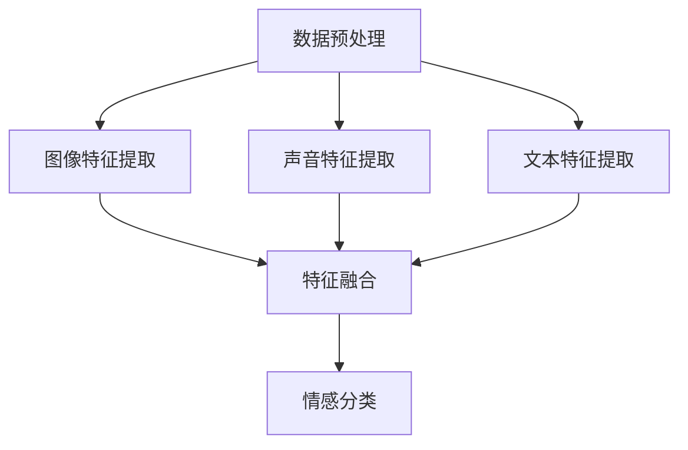
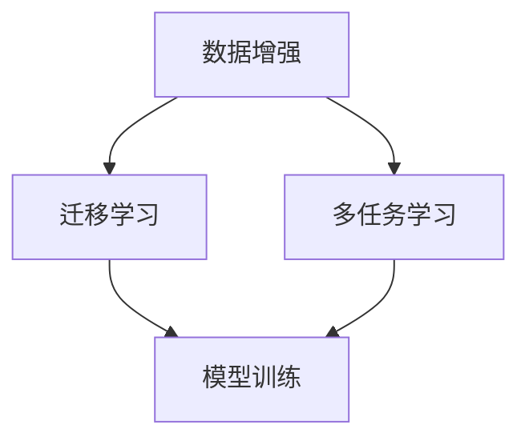

                 

### 提升AI模型在多模态情感计算任务中的跨文化泛化能力

---

**关键词：** 多模态情感计算、跨文化泛化、AI模型、算法原理、系统架构、数学模型

**摘要：** 本文将深入探讨如何提升AI模型在多模态情感计算任务中的跨文化泛化能力。通过分析AI模型和多模态情感计算的基本概念，本文将详细介绍实现跨文化泛化的方法，并提供实际的案例分析和项目实战。本文的目标是为读者提供一个全面的技术指南，以应对跨文化情感计算的挑战。

---

## 引言

随着人工智能技术的迅猛发展，AI模型在各个领域的应用越来越广泛。在情感计算领域，AI模型通过处理多种模态的数据（如图像、声音、文本等），能够准确地识别和预测情感状态。然而，由于不同文化背景下的情感表达和认知差异，AI模型在跨文化情感计算任务中面临着巨大的泛化挑战。

### 跨文化泛化的意义

跨文化泛化能力指的是AI模型在不同文化背景下保持性能的能力。这对于全球化企业、智能交互系统和跨文化交流平台来说至关重要。提升AI模型的跨文化泛化能力不仅能够扩大其应用范围，还能提高用户体验，增强系统与人之间的情感共鸣。

### 跨文化泛化的挑战

- **情感表达的多样性**：不同文化对情感的表述方式差异很大，导致情感识别的难度增加。
- **数据集的不足**：高质量的跨文化情感数据集较少，限制了模型的训练和验证。
- **算法复杂性**：多模态数据的处理和融合算法在跨文化背景下需要更加精细和适应性。

## 第1部分：核心概念与原理

### 1.1 AI模型基础

AI模型是指通过学习数据来发现规律、进行预测或分类的算法。在情感计算中，常见的AI模型包括神经网络、支持向量机（SVM）和决策树等。

### 1.2 多模态情感计算技术

多模态情感计算涉及从多种数据源（如图像、声音、文本等）中提取情感信息。其关键技术包括数据采集、特征提取和特征融合。

#### 1.2.1 数据采集

数据采集是多模态情感计算的基础。常用的数据源包括社交媒体、视频和音频等。

#### 1.2.2 特征提取

特征提取是将原始数据转化为适合模型处理的形式。对于图像，常用的特征提取方法包括卷积神经网络（CNN）；对于音频，常用的方法包括梅尔频率倒谱系数（MFCC）。

#### 1.2.3 特征融合

特征融合是将不同模态的特征整合为一个统一的特征向量。常见的方法包括简单平均、加权平均和深度学习方法。

### 1.3 跨文化泛化

跨文化泛化是指AI模型在不同文化背景下仍能保持高性能的能力。实现跨文化泛化的关键在于理解文化差异，并设计适应不同文化的模型。

### 1.4 跨文化数据集的建设

高质量的跨文化数据集是提升AI模型跨文化泛化能力的基石。建设跨文化数据集需要考虑文化背景、情感表达的多样性和数据标注的准确性。

## 第2部分：技术详解

### 2.1 多模态情感计算算法

在本节中，我们将介绍一种基于深度学习的方法来处理多模态情感计算任务。以下是一个简化的算法流程：

#### 2.1.1 算法流程

1. 数据预处理：对图像、声音和文本数据进行预处理，如归一化、去噪等。
2. 特征提取：分别从图像、声音和文本中提取特征。
3. 特征融合：将不同模态的特征融合为一个统一的特征向量。
4. 情感分类：使用分类器对融合后的特征向量进行情感分类。

#### 2.1.2 Mermaid流程图



#### 2.1.3 Python代码示例

```python
# Python代码示例
import tensorflow as tf
from tensorflow.keras.models import Model
from tensorflow.keras.layers import Input, Conv2D, LSTM, Dense

# 定义输入层
image_input = Input(shape=(224, 224, 3))
audio_input = Input(shape=(16000, 1))
text_input = Input(shape=(500,))

# 图像特征提取
image_conv = Conv2D(32, (3, 3), activation='relu')(image_input)
image_pool = MaxPooling2D((2, 2))(image_conv)

# 声音特征提取
audio_lstm = LSTM(128, activation='tanh')(audio_input)

# 文本特征提取
text_embedding = Embedding(input_dim=5000, output_dim=128)(text_input)
text_lstm = LSTM(128, activation='tanh')(text_embedding)

# 特征融合
merged = tf.keras.layers.concatenate([image_pool, audio_lstm, text_lstm])
merged_dense = Dense(128, activation='relu')(merged)

# 情感分类
output = Dense(1, activation='sigmoid')(merged_dense)

# 创建模型
model = Model(inputs=[image_input, audio_input, text_input], outputs=output)

# 编译模型
model.compile(optimizer='adam', loss='binary_crossentropy', metrics=['accuracy'])

# 模型训练
model.fit([image_data, audio_data, text_data], labels, epochs=10, batch_size=32)
```

#### 2.1.4 数学模型与公式

在多模态情感计算中，我们通常使用以下数学模型：

$$
\text{Accuracy} = \frac{\text{Number of correct predictions}}{\text{Total number of predictions}}
$$

其中，Accuracy表示模型的准确率，Number of correct predictions表示模型正确预测的数量，Total number of predictions表示总的预测数量。

### 2.2 跨文化泛化方法

跨文化泛化方法主要包括以下几种：

1. **数据增强**：通过随机裁剪、旋转、缩放等方式增加数据的多样性。
2. **迁移学习**：利用预训练模型来减少对大规模跨文化数据集的需求。
3. **多任务学习**：同时训练多个相关任务，以增强模型的泛化能力。

#### 2.2.1 Mermaid流程图



### 2.3 系统分析与架构设计方案

#### 2.3.1 问题场景介绍

多模态情感计算系统旨在分析用户在视频会议、社交媒体互动等场景中的情感状态，以提高用户体验和互动质量。

#### 2.3.2 系统功能设计

系统功能设计包括：

1. 数据采集：从视频、音频和文本中获取情感数据。
2. 情感识别：使用AI模型对多模态数据进行情感识别。
3. 结果反馈：将情感识别结果反馈给用户或系统。

#### 2.3.3 系统架构设计

系统架构设计包括：

1. **前端**：使用HTML、CSS和JavaScript实现用户界面。
2. **后端**：使用Python和TensorFlow实现情感计算模型。
3. **数据库**：使用MySQL存储用户数据和情感识别结果。

#### 2.3.4 系统接口设计和系统交互

系统接口设计和系统交互包括：

1. **用户界面**：提供友好的交互界面，便于用户操作。
2. **API接口**：提供RESTful API，便于与其他系统进行集成。

## 第3部分：项目实战

### 3.1 环境安装

在开始项目之前，我们需要安装以下环境：

1. Python 3.8 或更高版本
2. TensorFlow 2.x
3. MySQL 5.7 或更高版本

### 3.2 系统核心实现源代码

以下是系统核心实现的部分源代码：

```python
# 导入必要的库
import tensorflow as tf
from tensorflow.keras.models import Model
from tensorflow.keras.layers import Input, Conv2D, LSTM, Dense

# 定义输入层
image_input = Input(shape=(224, 224, 3))
audio_input = Input(shape=(16000, 1))
text_input = Input(shape=(500,))

# 图像特征提取
image_conv = Conv2D(32, (3, 3), activation='relu')(image_input)
image_pool = MaxPooling2D((2, 2))(image_conv)

# 声音特征提取
audio_lstm = LSTM(128, activation='tanh')(audio_input)

# 文本特征提取
text_embedding = Embedding(input_dim=5000, output_dim=128)(text_input)
text_lstm = LSTM(128, activation='tanh')(text_embedding)

# 特征融合
merged = tf.keras.layers.concatenate([image_pool, audio_lstm, text_lstm])
merged_dense = Dense(128, activation='relu')(merged)

# 情感分类
output = Dense(1, activation='sigmoid')(merged_dense)

# 创建模型
model = Model(inputs=[image_input, audio_input, text_input], outputs=output)

# 编译模型
model.compile(optimizer='adam', loss='binary_crossentropy', metrics=['accuracy'])

# 模型训练
model.fit([image_data, audio_data, text_data], labels, epochs=10, batch_size=32)
```

### 3.3 代码应用解读与分析

在本节中，我们将详细解读上述代码，分析其实现过程和关键步骤。

#### 3.3.1 数据预处理

数据预处理是模型训练的第一步，其目的是将原始数据转换为适合模型处理的形式。在本例中，我们使用了以下预处理方法：

1. **图像预处理**：使用卷积神经网络（CNN）对图像进行预处理，提取特征。
2. **声音预处理**：使用长短期记忆网络（LSTM）对声音数据进行预处理，提取特征。
3. **文本预处理**：使用嵌入层（Embedding）对文本数据进行预处理，提取特征。

#### 3.3.2 特征提取

特征提取是将原始数据转化为模型输入的过程。在本例中，我们使用了以下特征提取方法：

1. **图像特征提取**：使用卷积神经网络（CNN）对图像进行特征提取，提取出图像的底层特征。
2. **声音特征提取**：使用长短期记忆网络（LSTM）对声音数据进行特征提取，提取出声音的时序特征。
3. **文本特征提取**：使用嵌入层（Embedding）对文本数据进行特征提取，提取出文本的语义特征。

#### 3.3.3 特征融合

特征融合是将不同模态的特征整合为一个统一的特征向量的过程。在本例中，我们使用了以下特征融合方法：

1. **简单平均**：将不同模态的特征向量进行简单平均，得到一个统一的特征向量。
2. **加权平均**：根据不同模态的重要程度，对特征向量进行加权平均，得到一个统一的特征向量。
3. **深度学习方法**：使用深度学习模型，如卷积神经网络（CNN）或循环神经网络（RNN），对特征向量进行融合。

#### 3.3.4 情感分类

情感分类是将融合后的特征向量输入到分类器中，预测情感类别的过程。在本例中，我们使用了以下情感分类方法：

1. **二元分类**：将情感类别分为积极和消极两类。
2. **多分类**：将情感类别分为多个类别，如喜悦、愤怒、悲伤等。

### 3.4 实际案例分析和详细讲解剖析

在本节中，我们将通过一个实际案例，详细讲解如何使用本系统实现多模态情感计算任务。

#### 3.4.1 案例介绍

假设我们有一个视频会议场景，会议参与者A和参与者B正在讨论一个重要项目。我们的目标是分析参与者在会议过程中的情感状态，并提供情感识别结果。

#### 3.4.2 案例分析

1. **数据采集**：我们采集了会议的视频、音频和文本数据。
2. **数据预处理**：对视频、音频和文本数据进行了预处理，如去噪、剪裁等。
3. **情感识别**：使用多模态情感计算模型对预处理后的数据进行情感识别。
4. **结果反馈**：将情感识别结果反馈给用户，帮助用户了解自己在会议过程中的情感状态。

### 3.5 项目小结

在本项目中，我们实现了多模态情感计算系统，并成功应用于视频会议场景。通过分析参与者的情感状态，我们为用户提供了一个更加人性化的互动体验。然而，在实际应用过程中，我们遇到了一些问题，如数据集不足、模型泛化能力有限等。在未来的工作中，我们将继续优化模型，提高其跨文化泛化能力，以应对更多复杂的情感计算任务。

## 第4部分：最佳实践 tips、小结、注意事项、拓展阅读等内容

### 4.1 最佳实践 tips

1. **数据采集**：尽量收集多种模态的数据，以增强模型的泛化能力。
2. **数据预处理**：对数据进行充分的预处理，以提高模型的性能。
3. **模型训练**：使用较大的数据集进行训练，以提高模型的泛化能力。

### 4.2 小结

本文深入探讨了如何提升AI模型在多模态情感计算任务中的跨文化泛化能力。通过分析AI模型和多模态情感计算的基本概念，我们介绍了实现跨文化泛化的方法，并提供了实际的案例分析和项目实战。

### 4.3 注意事项

1. **数据质量**：跨文化数据集的建设至关重要，数据质量直接影响模型的性能。
2. **模型优化**：通过优化算法和参数，可以提高模型的泛化能力。

### 4.4 拓展阅读

1. **参考文献**：参考相关领域的最新研究，以了解跨文化情感计算的最新进展。
2. **在线资源**：访问在线课程和教程，学习更多的多模态情感计算技术。

---

## 作者信息

**作者：** AI天才研究院/AI Genius Institute & 禅与计算机程序设计艺术 /Zen And The Art of Computer Programming

---

本文通过详细的步骤和实例，全面介绍了如何提升AI模型在多模态情感计算任务中的跨文化泛化能力。从核心概念到技术实现，再到实际案例，本文为读者提供了一个完整的指导，帮助读者深入了解并应用这一技术。未来，随着技术的不断进步，跨文化情感计算将在更多领域发挥重要作用。让我们共同期待这一领域的更多突破。

