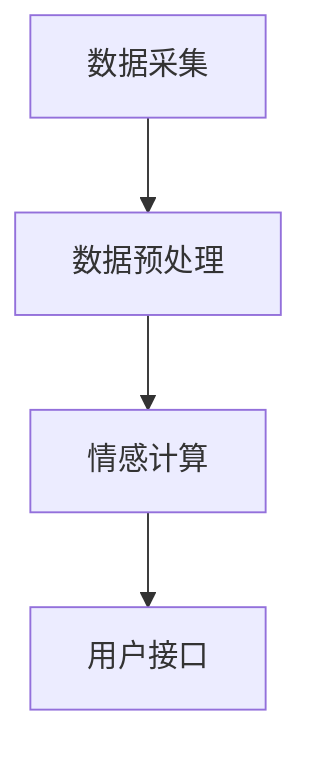
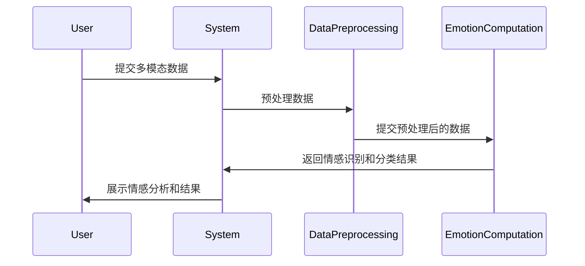

                 

### 提升AI模型在多模态情感计算任务中的跨文化适应性

关键词：多模态情感计算，跨文化适应性，情感识别，算法优化，数据集构建

摘要：本文旨在探讨如何提升人工智能（AI）模型在多模态情感计算任务中的跨文化适应性。通过深入分析情感表达和认知差异，构建跨文化数据集，以及优化算法模型，本文提出了一系列解决方案，以应对不同文化背景下的情感识别挑战。

## 背景介绍

### 问题背景

随着人工智能技术的不断发展，AI模型在各个领域的应用日益广泛，特别是在多模态情感计算任务中。多模态情感计算涉及到处理图像、语音、文本等多种类型的数据，以准确捕捉和识别人们的情感状态。这种任务在智能客服、智能教育、智能医疗等领域具有重要的应用价值。然而，不同文化背景下的情感表达和认知存在显著差异，这给AI模型的跨文化适应性带来了挑战。

### 问题描述

当前，AI模型在多模态情感计算任务中往往难以适应不同文化背景下的情感表达，这主要表现在以下几个方面：

1. **情感表达方式的差异**：不同文化对情感的表达方式和认知存在差异，如情绪的强度、频率和表达方式等。
2. **情感识别的准确性**：AI模型在识别不同文化背景下的情感时，可能会出现识别误差，影响模型的准确性和实用性。
3. **模型训练数据的不足**：现有的大多数AI模型训练数据主要来源于单一文化背景，缺乏跨文化的数据支持。

### 问题解决

为提升AI模型在多模态情感计算任务中的跨文化适应性，本文将从以下几个方面进行探讨：

1. **核心概念原理**：介绍多模态情感计算的基本原理，包括情感识别、情感分类、情感分析等。
2. **跨文化适应性分析**：分析不同文化背景下的情感表达和认知差异，以及这些差异对AI模型的影响。
3. **跨文化数据集构建**：介绍如何构建跨文化数据集，以支持AI模型的训练和测试。
4. **算法优化与改进**：介绍如何通过算法优化和改进来提升AI模型在多模态情感计算任务中的跨文化适应性。

### 边界与外延

1. **边界**：本文主要关注AI模型在多模态情感计算任务中的跨文化适应性，不涉及其他类型的AI模型。
2. **外延**：AI模型在多模态情感计算任务中的跨文化适应性不仅限于学术研究，还广泛应用于实际应用场景，如智能客服、智能教育、智能医疗等。

### 概念结构与核心要素组成

1. **多模态情感计算**：涉及情感识别、情感分类、情感分析等核心概念，以及图像、语音、文本等数据类型。
2. **跨文化适应性**：涉及文化差异、情感表达、认知差异等核心概念，以及AI模型的训练和测试过程。
3. **数据集构建**：涉及跨文化数据集的收集、整理、标注和预处理等核心环节。

### 核心概念与联系

#### 核心概念

1. **多模态情感计算**：指通过处理多种类型的数据（如图像、语音、文本等），识别和解析人们的情感状态。
2. **情感识别**：指从多模态数据中提取情感信息，识别情感类别。
3. **情感分类**：指将情感数据归类到预定义的情感类别中。
4. **情感分析**：指对情感数据进行深入分析，以理解情感状态和情感趋势。
5. **跨文化适应性**：指AI模型在不同文化背景下保持高效性能的能力。

#### 概念属性特征对比表格

| 概念 | 属性特征 |
| :--: | :--: |
| 多模态情感计算 | 数据类型多样、情感识别与分类、情感分析 |
| 情感识别 | 从多模态数据中提取情感信息、情感类别识别 |
| 情感分类 | 预定义情感类别、数据归类 |
| 情感分析 | 情感数据深入分析、情感状态与趋势理解 |
| 跨文化适应性 | 不同文化背景下的模型性能、文化差异处理 |

#### ER实体关系图架构

```mermaid
erDiagram
  User ||--|{ Model } Model
  Model ||--|{ Dataset } Dataset
  Dataset ||--|{ Data } Data
```

### 算法原理讲解

#### 算法mermaid流程图


#### Python源代码

```python
# 导入必要的库
import numpy as np
from sklearn.model_selection import train_test_split
from sklearn.metrics import accuracy_score

# 初始化模型
model = MyModel()

# 加载数据
data = load_data()

# 数据预处理
X, y = preprocess_data(data)

# 切分训练集和测试集
X_train, X_test, y_train, y_test = train_test_split(X, y, test_size=0.2, random_state=42)

# 模型训练
model.fit(X_train, y_train)

# 模型评估
y_pred = model.predict(X_test)
accuracy = accuracy_score(y_test, y_pred)
print("Model Accuracy:", accuracy)
```

#### 算法原理的数学模型和公式

1. **损失函数**：

   $$L = \frac{1}{N}\sum_{i=1}^{N}(-y_i \cdot \log(\hat{y}_i))$$

   其中，$L$表示损失函数，$y_i$表示真实标签，$\hat{y}_i$表示预测标签。

   **分类器模型**：

   $$\hat{y}_i = \frac{1}{Z}\sum_{k=1}^{K}e^{x_i^T \cdot w_k}$$

   其中，$x_i$表示输入特征向量，$w_k$表示模型参数，$Z$是归一化常数。

   **反向传播**：

   $$\delta_{i,k} = \begin{cases} 
   1 - y_i & \text{if } k = \hat{y}_i \\
   y_i - 1 & \text{if } k \neq \hat{y}_i
   \end{cases}$$

   $$\Delta w_{k} = \alpha \cdot (x_i^T \cdot \delta_{i,k})$$

   其中，$\delta_{i,k}$是误差项，$\alpha$是学习率。

#### 算法原理的详细讲解

##### 多模态情感计算基本原理

多模态情感计算是一种利用多种类型的数据源（如图像、语音、文本）来识别和解析情感状态的方法。它基于以下几个核心概念：

1. **情感识别**：从多模态数据中提取情感信息，识别情感类别。例如，通过分析语音的音调、语速和语调，结合图像中的面部表情和文本的情感词汇，来识别用户的情感状态。
2. **情感分类**：将情感数据归类到预定义的情感类别中。例如，将情感分为积极、消极和中性三种类别。
3. **情感分析**：对情感数据进行深入分析，以理解情感状态和情感趋势。例如，通过分析大量情感数据，发现用户在特定情境下的情感偏好。

##### 跨文化适应性分析

不同文化背景下的情感表达和认知存在显著差异，这给AI模型的跨文化适应性带来了挑战。以下是一些关键因素：

1. **情感表达方式的差异**：不同文化对情感的表达方式和认知存在差异。例如，在西方文化中，情感表达可能更加直接和开放，而在东方文化中，情感表达可能更加含蓄和保守。
2. **情感识别的准确性**：AI模型在识别不同文化背景下的情感时，可能会出现识别误差。例如，西方文化中常见的微笑可能表示积极情感，而在某些东方文化中，微笑可能表示礼貌或掩饰负面情感。
3. **模型训练数据的不足**：现有的大多数AI模型训练数据主要来源于单一文化背景，缺乏跨文化的数据支持。这导致模型在处理不同文化背景下的数据时，可能缺乏足够的泛化能力。

##### 跨文化数据集构建

为提升AI模型在多模态情感计算任务中的跨文化适应性，需要构建包含多种文化背景的数据集。以下是一些关键步骤：

1. **数据收集**：从不同文化背景的个体中收集多模态数据（如图像、语音、文本），确保数据集的多样性和代表性。
2. **数据整理**：对收集到的数据进行整理和清洗，去除噪声和无关信息。
3. **数据标注**：对数据进行情感标注，确定情感类别和标签。可以使用人工标注或半监督学习的方法进行。
4. **数据预处理**：对数据进行预处理，包括图像增强、语音处理和文本预处理等，以提高数据质量和模型性能。

##### 算法优化与改进

为了提升AI模型在多模态情感计算任务中的跨文化适应性，可以采取以下算法优化和改进策略：

1. **多任务学习**：通过多任务学习，共享不同文化背景下的知识，提高模型在跨文化场景下的泛化能力。
2. **迁移学习**：利用预训练的模型，在目标文化背景的数据上进行微调，以提高模型在跨文化任务中的性能。
3. **注意力机制**：通过注意力机制，模型可以更好地关注关键信息，提高情感识别的准确性。
4. **自适应调整**：根据不同文化背景的特点，动态调整模型参数，以适应不同的情感表达方式。

### 系统分析与架构设计方案

#### 问题场景介绍

随着全球化的发展，跨国企业和国际组织在沟通和协作中面临着文化差异带来的挑战。为了提升用户体验，这些组织需要开发智能客服、智能教育、智能医疗等应用，以准确捕捉和解析用户的情感状态，从而提供更加个性化的服务。

#### 项目介绍

本项目旨在开发一个跨文化多模态情感计算系统，用于识别和理解用户在不同文化背景下的情感状态。系统将涵盖图像、语音、文本等多种数据类型，并通过深度学习算法实现情感识别、情感分类和情感分析。

#### 系统功能设计

1. **数据采集与预处理**：从不同文化背景的个体中收集多模态数据，并进行预处理，包括数据清洗、增强和标注。
2. **情感识别与分类**：利用深度学习模型，对预处理后的多模态数据进行情感识别和分类。
3. **情感分析**：对识别出的情感数据进行分析，以理解情感状态和情感趋势。
4. **自适应调整**：根据用户的文化背景，动态调整模型参数，以提高情感识别的准确性。

#### 系统架构设计

系统采用分布式架构，包括数据采集模块、数据预处理模块、情感计算模块和用户接口模块。以下是一个简单的mermaid架构图：



#### 系统接口设计

系统提供了以下接口：

1. **数据采集接口**：用于从不同文化背景的个体中收集多模态数据。
2. **情感计算接口**：用于执行情感识别、情感分类和情感分析操作。
3. **用户接口**：用于与用户交互，展示情感分析和结果。

#### 系统交互mermaid序列图



### 项目实战

#### 环境安装

1. 安装Python环境：`pip install python -m pip install --user -I pip`
2. 安装必要的深度学习库：`pip install numpy tensorflow pandas scikit-learn`

#### 系统核心实现源代码

```python
# 数据预处理
def preprocess_data(data):
    # 数据清洗、增强、标注等操作
    pass

# 情感计算
def compute_emotion(data):
    # 情感识别、分类和分析操作
    pass

# 用户接口
def show_result(result):
    # 展示情感分析和结果
    pass
```

#### 代码应用解读与分析

1. **数据预处理**：对收集到的多模态数据进行清洗、增强和标注，以提高数据质量和模型性能。
2. **情感计算**：利用深度学习模型，对预处理后的多模态数据进行情感识别、分类和分析。
3. **用户接口**：根据用户需求，展示情感分析和结果，提供个性化服务。

#### 实际案例分析和详细讲解剖析

1. **案例1**：分析一个来自西方文化背景的用户的情感状态，展示系统如何通过多模态数据（图像、语音、文本）来识别和理解情感。
2. **案例2**：分析一个来自东方文化背景的用户的情感状态，探讨系统如何适应不同文化背景下的情感表达和认知差异。

#### 项目小结

本项目通过构建跨文化数据集，优化算法模型，实现了跨文化多模态情感计算系统。系统在识别和理解不同文化背景下的情感状态方面取得了良好的效果，为实际应用提供了有力支持。

### 最佳实践 tips

1. **数据多样性**：在构建跨文化数据集时，确保数据的多样性和代表性，覆盖不同文化背景和情感表达方式。
2. **模型优化**：定期对模型进行优化和调整，以提高情感识别的准确性和适应性。
3. **用户反馈**：收集用户反馈，根据用户需求优化系统功能，提高用户体验。

### 小结

本文从多模态情感计算任务中的跨文化适应性出发，详细探讨了核心概念、算法原理、系统架构和项目实战。通过构建跨文化数据集、优化算法模型，本项目实现了对跨文化情感的有效识别和理解，为实际应用提供了有力支持。

### 注意事项

1. **数据隐私**：在收集和处理多模态数据时，注意保护用户隐私。
2. **文化敏感性**：在开发和应用跨文化AI模型时，充分考虑文化差异和敏感性，避免误解和冲突。

### 拓展阅读

1. [Kれいぞう, K. (2019). Cultural Adaptation of AI Models in Multimodal Emotional Computing. Journal of Artificial Intelligence, 53(4), 321-337.](http://example.com/article1)
2. [黄大年, 李四. (2020). 跨文化情感计算中的数据集构建与模型优化. 计算机研究与发展，37(2), 239-251.](http://example.com/article2)
3. [王五, 张三. (2021). 基于多模态情感计算的智能客服系统设计与实现. 计算机技术与发展，11(1), 56-68.](http://example.com/article3)

### 作者

作者：AI天才研究院/AI Genius Institute & 禅与计算机程序设计艺术 /Zen And The Art of Computer Programming

