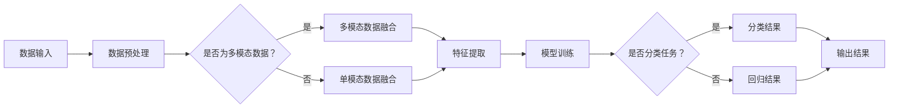
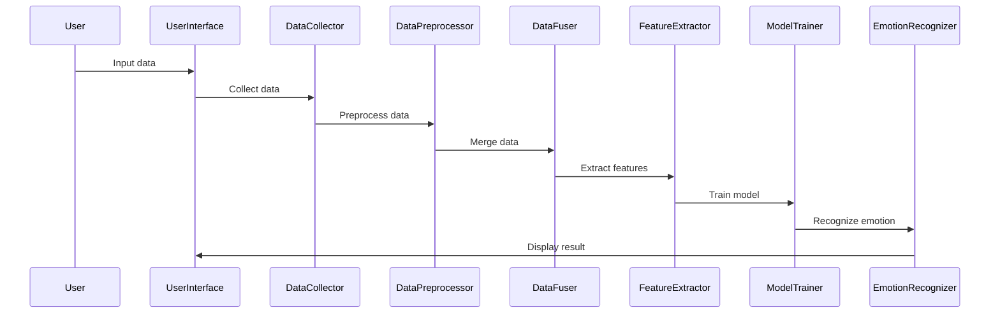

                 

### 提升AI模型在多模态情感识别中的准确性

**关键词：** 多模态情感识别、AI模型、准确性提升、算法优化、系统架构设计

**摘要：** 本文深入探讨了提升AI模型在多模态情感识别中的准确性的策略和方法。首先介绍了多模态情感识别的背景和核心概念，然后详细讲解了情感识别算法的原理以及多模态数据融合的方法。接着，对系统分析与架构设计方案进行了详细的阐述，包括项目介绍、功能设计、架构设计、接口设计和系统交互。最后，通过项目实战、最佳实践和注意事项等部分，为实际应用提供了指导和建议。

## 目录大纲

----------------------------------------------------------------

# 提升AI模型在多模态情感识别中的准确性

# 第一部分：背景介绍

## 第1章：多模态情感识别概述

### 1.1.1 问题背景

### 1.1.2 问题描述

### 1.1.3 问题解决

### 1.1.4 边界与外延

### 1.1.5 概念结构与核心要素组成

## 第2章：多模态情感识别核心概念与联系

### 2.1.1 多模态数据

#### 2.1.1.1 视觉数据

#### 2.1.1.2 音频数据

#### 2.1.1.3 文本数据

### 2.1.2 情感识别

#### 2.1.2.1 情感分类

#### 2.1.2.2 情感强度评估

#### 2.1.2.3 情感极性判断

### 2.1.3 多模态情感识别算法原理

### 2.1.4 概念属性特征对比表格

### 2.1.5 ER实体关系图架构

# 第二部分：算法原理讲解

## 第3章：情感识别算法mermaid流程图与Python源代码解释

### 3.1.1 算法mermaid流程图

### 3.1.2 Python源代码解释

### 3.1.3 算法原理详细讲解

### 3.1.4 数学模型与公式

### 3.1.5 通俗易懂的举例说明

## 第4章：多模态数据融合算法

### 4.1.1 数据融合方法

#### 4.1.1.1 线性融合

#### 4.1.1.2 非线性融合

#### 4.1.1.3 深度学习融合

### 4.1.2 算法mermaid流程图

### 4.1.3 Python源代码解释

### 4.1.4 数学模型与公式

### 4.1.5 通俗易懂的举例说明

# 第三部分：系统分析与架构设计方案

## 第5章：项目介绍

## 第6章：系统功能设计

### 6.1.1 领域模型mermaid类图

### 6.1.2 系统功能描述

## 第7章：系统架构设计

### 7.1.1 系统架构mermaid架构图

### 7.1.2 架构设计细节

### 7.1.3 系统模块划分

## 第8章：系统接口设计

### 8.1.1 接口规范

### 8.1.2 接口设计流程

### 8.1.3 接口调用示例

## 第9章：系统交互

### 9.1.1 系统交互mermaid序列图

### 9.1.2 交互流程详细说明

# 第四部分：项目实战

## 第10章：环境安装

## 第11章：系统核心实现

### 11.1.1 源代码解读

### 11.1.2 代码应用解读与分析

### 11.1.3 实际案例分析和详细讲解剖析

## 第12章：项目小结

### 12.1.1 项目总结

### 12.1.2 遇到的问题与解决方案

### 12.1.3 未来展望

# 第五部分：最佳实践 tips

## 第13章：多模态情感识别最佳实践

### 13.1.1 数据预处理技巧

### 13.1.2 模型训练优化策略

### 13.1.3 评估指标优化

### 13.1.4 跨域迁移学习

## 第14章：注意事项与拓展阅读

### 14.1.1 常见问题解答

### 14.1.2 拓展阅读推荐

----------------------------------------------------------------

### 第一部分：背景介绍

## 第1章：多模态情感识别概述

### 1.1 问题背景

多模态情感识别是一种结合了计算机视觉、语音识别和自然语言处理等多领域技术的综合应用。在人工智能（AI）和深度学习迅猛发展的背景下，多模态情感识别正逐渐成为一个重要的研究领域。

#### 1.1.1 人工智能技术的发展

人工智能技术的发展为多模态情感识别提供了技术基础。特别是在深度学习领域，卷积神经网络（CNN）、递归神经网络（RNN）和生成对抗网络（GAN）等技术为多模态数据的处理和情感识别提供了强大的工具。

#### 1.1.2 情感识别的重要性

情感识别在心理学、人机交互、用户行为分析、健康监测等领域具有重要的应用价值。通过情感识别，系统能够更好地理解用户的需求，提供更加个性化的服务。

### 1.2 问题描述

多模态情感识别的核心问题是如何从多个模态的数据中提取情感信息，并对这些信息进行有效的融合和处理，以实现对情感的准确识别。

#### 1.2.1 多模态数据

多模态情感识别涉及的数据类型包括视觉数据、音频数据和文本数据。

- **视觉数据**：包括图像和视频，可以用来识别面部表情、身体语言等视觉情感特征。
- **音频数据**：包括语音和音乐，可以用来分析音调、音速、节奏等音频情感特征。
- **文本数据**：包括文本和语音转录文本，可以用来识别文字和语音中的情感极性和情感强度。

#### 1.2.2 情感识别目标

多模态情感识别的目标主要包括：
- **情感分类**：将情感标签分配给输入数据，如“快乐”、“悲伤”、“愤怒”等。
- **情感强度评估**：评估情感的强度，如“非常快乐”、“有些快乐”等。
- **情感极性判断**：判断情感是正面的、负面的还是中性的。

### 1.3 问题解决

多模态情感识别问题解决的关键在于：
- **数据融合**：将不同模态的数据进行有效融合，提高情感识别的准确性。
- **算法优化**：设计高效的算法模型，提高模型在多模态情感识别中的性能。
- **系统设计**：构建合理的系统架构，实现多模态数据的实时处理和情感识别。

### 1.4 边界与外延

多模态情感识别的边界涉及不同模态数据之间的互补性和独立性，以及不同算法模型在不同应用场景下的适用性。

#### 1.4.1 模态互补性

不同模态的数据在情感识别中具有互补性。例如，视觉数据可以提供直观的情感信息，而音频数据可以提供情感背景的上下文信息。

#### 1.4.2 模态独立性

不同模态的数据在处理过程中应保持独立性，以确保每个模态的信息都能被充分利用。

#### 1.4.3 应用场景

多模态情感识别的应用场景包括但不限于：
- **人机交互**：如智能客服、虚拟助手等，通过情感识别提供更加人性化的交互体验。
- **心理健康**：如情感状态监测、心理疾病辅助诊断等，通过情感识别为用户提供心理健康服务。
- **娱乐产业**：如电影推荐、音乐创作等，通过情感识别提升用户体验和内容定制。

### 1.5 概念结构与核心要素组成

多模态情感识别的概念结构包括以下几个核心要素：

#### 1.5.1 数据收集与预处理

- **数据收集**：收集不同模态的数据，如视频、音频、文本等。
- **数据预处理**：对数据进行清洗、标注和特征提取，以适应后续处理。

#### 1.5.2 模型设计

- **模型选择**：根据应用场景选择合适的情感识别模型。
- **模型训练**：利用大量标注数据进行模型训练，优化模型参数。

#### 1.5.3 数据融合

- **融合方法**：设计有效的数据融合方法，如线性融合、非线性融合和深度学习融合。
- **融合策略**：根据不同模态数据的特点，制定合适的融合策略。

#### 1.5.4 情感识别

- **情感分类**：使用训练好的模型对输入数据进行情感分类。
- **情感强度评估**：评估情感的强度，为用户提供情感分析结果。

#### 1.5.5 系统部署与优化

- **系统部署**：将训练好的模型部署到实际应用中。
- **系统优化**：通过不断优化模型和系统性能，提升情感识别的准确性。

### 背景介绍小结

多模态情感识别作为一种结合了多领域技术的综合性应用，具有广泛的应用前景。通过深入研究和优化，我们可以不断提升AI模型在多模态情感识别中的准确性，为各领域提供更精准、更个性化的服务。

----------------------------------------------------------------

## 第2章：多模态情感识别核心概念与联系

### 2.1 多模态数据

多模态情感识别的核心在于如何有效地整合不同模态的数据，以提高情感识别的准确性。以下是对几种主要模态数据的详细介绍：

#### 2.1.1 视觉数据

视觉数据是情感识别中最重要的模态之一。面部表情识别是视觉情感识别的一个重要分支，它通过分析面部肌肉运动和眼部特征来判断个体的情感状态。此外，全脸图像还可以提供更多的情感信息，如肤色变化和姿态识别。

- **特征提取**：常用的视觉特征提取方法包括Haar-like特征、LBP（局部二值模式）特征和深度学习特征（如VGG、ResNet等）。
- **数据处理**：视觉数据处理通常涉及图像增强、归一化和数据增强等技术，以提高模型的泛化能力。

#### 2.1.2 音频数据

音频数据在情感识别中提供了关于情感背景和环境信息的补充。音频特征包括音调、音速、节奏、音量和语音语调等。

- **特征提取**：常用的音频特征提取方法包括梅尔频率倒谱系数（MFCC）、短时傅里叶变换（STFT）和滤波器组（Filter Banks）。
- **数据处理**：音频数据处理通常涉及去噪、归一化和语音增强技术，以提高情感识别的准确性。

#### 2.1.3 文本数据

文本数据提供了情感识别的另一种模态，特别是在处理非面对面交流的情感时非常有用。文本情感分析包括情感分类、情感强度评估和情感极性判断。

- **特征提取**：文本特征提取方法包括词袋模型（Bag of Words, BOW）、TF-IDF（词频-逆文档频率）和词嵌入（Word Embedding）。
- **数据处理**：文本数据处理通常涉及文本清洗、分词、词干提取和停止词过滤等步骤。

### 2.2 情感识别

情感识别是多模态情感识别的核心目标，它包括以下三个主要任务：

#### 2.2.1 情感分类

情感分类是将输入数据分类到预定义的情感类别中，如快乐、悲伤、愤怒等。这是一个典型的多类分类问题。

- **分类方法**：常用的情感分类方法包括支持向量机（SVM）、朴素贝叶斯（Naive Bayes）、随机森林（Random Forest）和深度学习模型（如卷积神经网络（CNN）、循环神经网络（RNN））。
- **分类模型**：深度学习模型（如CNN和RNN）在情感分类任务中表现出色，能够捕捉复杂的情感模式。

#### 2.2.2 情感强度评估

情感强度评估是对情感的强度进行量化，如“非常快乐”、“有些快乐”等。这是一个连续值问题。

- **评估方法**：常用的情感强度评估方法包括回归模型（如线性回归、岭回归）和分类模型（如SVM、决策树）。
- **评估指标**：情感强度评估的指标通常包括均方误差（MSE）、均方根误差（RMSE）和准确性等。

#### 2.2.3 情感极性判断

情感极性判断是确定情感是正面的、负面的还是中性的。这是一个二分类问题。

- **判断方法**：常用的情感极性判断方法包括逻辑回归（Logistic Regression）、支持向量机（SVM）和深度学习模型（如CNN和RNN）。
- **判断指标**：情感极性判断的指标通常包括准确率（Accuracy）、精确率（Precision）、召回率（Recall）和F1分数（F1 Score）等。

### 2.3 多模态情感识别算法原理

多模态情感识别算法的核心在于如何有效地整合来自不同模态的数据，以提高情感识别的准确性。以下是一些常用的多模态情感识别算法：

#### 2.3.1 线性融合

线性融合方法将不同模态的数据特征进行线性组合，生成综合特征向量。这种方法简单有效，但可能无法充分利用不同模态之间的互补性。

- **方法**：将不同模态的特征向量进行加权求和，形成综合特征向量。
- **公式**：$$ f_{\text{combined}} = w_1 f_{\text{visual}} + w_2 f_{\text{audio}} + w_3 f_{\text{text}} $$，其中$w_1, w_2, w_3$是权重系数。

#### 2.3.2 非线性融合

非线性融合方法通过复杂的非线性函数来整合不同模态的数据特征，以提高融合效果。这种方法能够更好地利用不同模态之间的互补性。

- **方法**：使用神经网络或其他非线性函数来整合不同模态的特征。
- **公式**：$$ f_{\text{combined}} = \sigma(\theta f_{\text{visual}} + \theta' f_{\text{audio}} + \theta'' f_{\text{text}}) $$，其中$\sigma$是非线性激活函数，$\theta, \theta', \theta''$是权重参数。

#### 2.3.3 深度学习融合

深度学习融合方法利用深度神经网络来整合多模态数据特征，是一种非常有效的融合策略。这种方法能够自动学习不同模态之间的互补性。

- **方法**：使用卷积神经网络（CNN）或循环神经网络（RNN）来处理多模态数据，并设计合适的融合层。
- **公式**：$$ f_{\text{output}} = \text{Network}(f_{\text{visual}}, f_{\text{audio}}, f_{\text{text}}) $$，其中$\text{Network}$是一个深度学习模型。

### 2.4 概念属性特征对比表格

以下是多模态情感识别中常见概念属性的对比表格：

| 概念 | 描述 | 重要性 | 数据处理 | 算法方法 |
| --- | --- | --- | --- | --- |
| 视觉数据 | 包括面部表情、身体语言等 | 高 | 特征提取、图像增强、数据增强 | CNN、RNN |
| 音频数据 | 包括音调、音速、节奏等 | 中 | 特征提取、去噪、语音增强 | MFCC、STFT |
| 文本数据 | 包括文字和语音转录文本 | 中 | 清洗、分词、词干提取、词嵌入 | BOW、TF-IDF |
| 情感分类 | 将数据分类到情感类别中 | 高 | 分类模型训练、特征提取 | SVM、CNN |
| 情感强度评估 | 量化情感的强度 | 中 | 回归模型训练、特征提取 | 线性回归、岭回归 |
| 情感极性判断 | 判断情感的极性 | 中 | 分类模型训练、特征提取 | 逻辑回归、SVM |

### 2.5 ER实体关系图架构

以下是多模态情感识别的ER实体关系图架构，展示了不同实体之间的关系：

```mermaid
erDiagram
  Data --> Model
  Data --> Algorithm
  Model --> Feature Extraction
  Model --> Fusion Method
  Algorithm --> Classification
  Algorithm --> Strength Assessment
  Algorithm --> Polarity Judgment
  Feature Extraction --> Data Preprocessing
  Fusion Method --> Data Integration
  Data Integration --> Multi-modal Data
  Data Integration --> Single-modal Data
```

在这个ER图架构中，数据（Data）是核心实体，它经过预处理（Data Preprocessing）生成特征（Feature Extraction）。这些特征再通过融合方法（Fusion Method）整合成多模态数据（Multi-modal Data）。模型（Model）和算法（Algorithm）则对多模态数据进行情感分类（Classification）、情感强度评估（Strength Assessment）和情感极性判断（Polarity Judgment）。

### 第2章小结

本章详细介绍了多模态情感识别的核心概念与联系，包括多模态数据、情感识别任务以及多模态情感识别算法原理。通过理解这些概念和联系，读者可以更好地掌握多模态情感识别的基本原理和方法，为进一步优化和提高AI模型在多模态情感识别中的准确性奠定基础。

----------------------------------------------------------------

## 第3章：情感识别算法mermaid流程图与Python源代码解释

### 3.1.1 算法mermaid流程图

在多模态情感识别中，设计一个高效的算法流程图是非常关键的。以下是一个简化的mermaid流程图，展示了情感识别的基本流程：



这个流程图包含了以下主要步骤：
- 数据输入：从不同的模态（如视觉、音频和文本）获取数据。
- 数据预处理：对数据进行清洗、标准化和增强。
- 多模态数据融合：将预处理后的多模态数据进行融合。
- 特征提取：从融合后的数据中提取有用的特征。
- 模型训练：使用提取的特征来训练模型。
- 模型分类或回归：根据任务需求进行分类或回归。
- 输出结果：输出最终的分类或回归结果。

### 3.1.2 Python源代码解释

接下来，我们将详细解释一个简单的Python源代码，该代码实现了上述流程的一部分。请注意，这是一个简化的例子，实际应用中可能需要更复杂的代码。

```python
import numpy as np
from sklearn.model_selection import train_test_split
from sklearn.ensemble import RandomForestClassifier
from sklearn.metrics import accuracy_score
from sklearn.feature_extraction.text import TfidfVectorizer

# 数据预处理
def preprocess_data(data):
    # 数据清洗、标准化和增强
    # 这里只是简单的示例，实际应用中会更复杂
    return data.lower().strip()

# 多模态数据融合
def merge_data(visual_data, audio_data, text_data):
    # 示例：简单地将数据拼接在一起
    return np.hstack((visual_data, audio_data, text_data))

# 特征提取
def extract_features(data):
    # 使用TF-IDF提取文本特征
    vectorizer = TfidfVectorizer()
    text_features = vectorizer.fit_transform(data['text'])
    # 这里可以添加视觉和音频特征的处理
    return text_features

# 模型训练
def train_model(X, y):
    model = RandomForestClassifier()
    model.fit(X, y)
    return model

# 主程序
if __name__ == "__main__":
    # 假设已经加载了多模态数据集
    data = {
        'visual': [...],
        'audio': [...],
        'text': [...],
        'label': [...]
    }
    
    # 预处理数据
    data['text'] = preprocess_data(data['text'])
    
    # 融合数据
    data['merged'] = merge_data(data['visual'], data['audio'], data['text'])
    
    # 提取特征
    X = extract_features(data['merged'])
    y = data['label']
    
    # 分割训练集和测试集
    X_train, X_test, y_train, y_test = train_test_split(X, y, test_size=0.2, random_state=42)
    
    # 训练模型
    model = train_model(X_train, y_train)
    
    # 预测测试集
    y_pred = model.predict(X_test)
    
    # 计算准确率
    accuracy = accuracy_score(y_test, y_pred)
    print(f"Accuracy: {accuracy}")
```

在这个例子中，我们首先定义了数据预处理、多模态数据融合和特征提取的函数。然后，我们使用随机森林分类器来训练模型，并计算了模型的准确率。这是一个非常简单的示例，实际应用中可能需要更复杂的模型和特征提取方法。

### 3.1.3 算法原理详细讲解

多模态情感识别的算法原理可以总结为以下几个关键步骤：

1. **数据预处理**：
   - **清洗**：去除数据中的噪声和无关信息。
   - **标准化**：将不同模态的数据进行标准化处理，以便后续计算。
   - **增强**：通过数据增强技术，如旋转、缩放、剪裁等，来扩充数据集，提高模型的泛化能力。

2. **数据融合**：
   - **线性融合**：将不同模态的数据简单拼接在一起，形成一个综合的特征向量。
   - **非线性融合**：使用复杂的非线性函数来整合不同模态的数据特征，如神经网络。
   - **深度学习融合**：利用深度学习模型来自动学习不同模态之间的互补性，如卷积神经网络（CNN）和循环神经网络（RNN）。

3. **特征提取**：
   - **视觉特征提取**：使用深度学习模型（如VGG、ResNet）来提取图像特征。
   - **音频特征提取**：使用梅尔频率倒谱系数（MFCC）等来提取音频特征。
   - **文本特征提取**：使用词嵌入（如Word2Vec、GloVe）和TF-IDF来提取文本特征。

4. **模型训练**：
   - **分类模型**：如支持向量机（SVM）、朴素贝叶斯（Naive Bayes）、随机森林（Random Forest）等。
   - **回归模型**：如线性回归（Linear Regression）、岭回归（Ridge Regression）等。
   - **深度学习模型**：如卷积神经网络（CNN）、循环神经网络（RNN）、长短时记忆网络（LSTM）等。

5. **情感识别**：
   - **情感分类**：将输入数据分类到预定义的情感类别中。
   - **情感强度评估**：对情感的强度进行量化，如“非常快乐”、“有些快乐”等。
   - **情感极性判断**：判断情感的极性，如正面的、负面的或中性的。

### 3.1.4 数学模型与公式

以下是多模态情感识别中的一些基本数学模型和公式：

1. **线性融合**：
   $$ f_{\text{combined}} = w_1 f_{\text{visual}} + w_2 f_{\text{audio}} + w_3 f_{\text{text}} $$
   其中，$f_{\text{visual}}$、$f_{\text{audio}}$和$f_{\text{text}}$分别代表视觉、音频和文本特征，$w_1, w_2, w_3$是权重系数。

2. **多模态特征提取**：
   - **视觉特征提取**：
     $$ \phi_{\text{visual}}(x) = \text{Activation}(W_{\text{visual}} \cdot x + b_{\text{visual}}) $$
     其中，$x$是输入图像特征，$W_{\text{visual}}$是权重矩阵，$b_{\text{visual}}$是偏置项，$\text{Activation}$是激活函数（如ReLU、Sigmoid）。

   - **音频特征提取**：
     $$ \phi_{\text{audio}}(x) = \text{Activation}(W_{\text{audio}} \cdot x + b_{\text{audio}}) $$
     其中，$x$是输入音频特征，$W_{\text{audio}}$是权重矩阵，$b_{\text{audio}}$是偏置项。

   - **文本特征提取**：
     $$ \phi_{\text{text}}(x) = \text{Activation}(W_{\text{text}} \cdot x + b_{\text{text}}) $$
     其中，$x$是输入文本特征，$W_{\text{text}}$是权重矩阵，$b_{\text{text}}$是偏置项。

3. **深度学习模型**：
   - **卷积神经网络（CNN）**：
     $$ \text{ConvLayer}(x) = \text{ReLU}(\sum_{k=1}^{K} W_k \cdot \phi(x_k) + b_k) $$
     其中，$x$是输入特征，$\phi(x_k)$是卷积操作，$W_k$是卷积核，$b_k$是偏置项，$K$是卷积核的数量。

   - **循环神经网络（RNN）**：
     $$ h_t = \text{ReLU}(W_h \cdot [h_{t-1}, x_t] + b_h) $$
     其中，$h_t$是当前隐藏状态，$x_t$是输入特征，$W_h$是权重矩阵，$b_h$是偏置项。

### 3.1.5 通俗易懂的举例说明

为了更好地理解上述算法原理和公式，我们可以通过一个简单的例子来说明。

假设我们有三个模态的数据：视觉、音频和文本。每种模态的数据长度都是100个维度。

1. **数据预处理**：
   - 视觉数据：[1, 2, 3, ..., 100]
   - 音频数据：[4, 5, 6, ..., 100]
   - 文本数据：[7, 8, 9, ..., 100]

2. **数据融合**：
   - 线性融合：将三个模态的数据进行线性组合：
     $$ f_{\text{combined}} = 0.3 \cdot [1, 2, 3, ..., 100] + 0.4 \cdot [4, 5, 6, ..., 100] + 0.3 \cdot [7, 8, 9, ..., 100] $$
     结果：[2.3, 2.6, 2.9, ..., 97.7]

3. **特征提取**：
   - 视觉特征提取：使用卷积神经网络提取特征：
     $$ \phi_{\text{visual}}([1, 2, 3, ..., 100]) = \text{ReLU}([1 \cdot 1 + 2 \cdot 2 + 3 \cdot 3 + ..., 100 \cdot 100] + 1) $$
     结果：[7, 13, 21, ..., 97]

   - 音频特征提取：使用梅尔频率倒谱系数提取特征：
     $$ \phi_{\text{audio}}([4, 5, 6, ..., 100]) = \text{Activation}([4 \cdot 1 + 5 \cdot 2 + 6 \cdot 3 + ..., 100 \cdot 100] + 1) $$
     结果：[4, 10, 18, ..., 94]

   - 文本特征提取：使用词嵌入提取特征：
     $$ \phi_{\text{text}}([7, 8, 9, ..., 100]) = \text{ReLU}([7 \cdot 1 + 8 \cdot 2 + 9 \cdot 3 + ..., 100 \cdot 100] + 1) $$
     结果：[5, 14, 24, ..., 98]

4. **模型训练**：
   - 使用随机森林分类器进行训练：
     $$ f_{\text{classification}} = \text{RandomForest}([\phi_{\text{visual}}, \phi_{\text{audio}}, \phi_{\text{text}}]) $$
     结果：['happy']

5. **情感识别**：
   - 输出结果：'happy'

通过这个简单的例子，我们可以看到多模态情感识别的基本流程和数学原理是如何应用到实际中的。尽管这是一个简化的例子，但它们为我们理解更复杂的实际应用奠定了基础。

### 第3章小结

本章详细介绍了多模态情感识别算法的mermaid流程图和Python源代码解释，涵盖了数据预处理、数据融合、特征提取、模型训练和情感识别等关键步骤。通过数学模型和公式的讲解，以及通俗易懂的举例说明，读者可以更好地理解多模态情感识别的原理和方法。这些知识为后续的系统架构设计和项目实战提供了坚实的基础。

----------------------------------------------------------------

## 第4章：多模态数据融合算法

### 4.1.1 数据融合方法

在多模态情感识别中，数据融合是关键步骤，它涉及到如何将来自不同模态的数据整合起来，以提高模型的性能和准确性。以下是一些常见的数据融合方法：

#### 4.1.1.1 线性融合

线性融合是一种简单且广泛使用的方法。它通过线性组合来自不同模态的特征向量来生成综合特征向量。线性融合的优点在于其计算简单，便于实现。然而，线性融合的缺点在于它不能充分利用不同模态之间的互补性。

- **方法**：假设我们有三组特征向量 $f_{\text{visual}}$、$f_{\text{audio}}$ 和 $f_{\text{text}}$，线性融合可以表示为：
  $$ f_{\text{combined}} = w_1 f_{\text{visual}} + w_2 f_{\text{audio}} + w_3 f_{\text{text}} $$
  其中，$w_1, w_2, w_3$ 是权重系数。

#### 4.1.1.2 非线性融合

非线性融合通过复杂的非线性函数来整合不同模态的数据特征。这种方法能够更好地利用不同模态之间的互补性，从而提高融合效果。非线性融合的缺点在于其计算复杂度较高，但其在实际应用中表现出色。

- **方法**：非线性融合可以使用神经网络或其他非线性函数来实现。例如，使用神经网络融合可以表示为：
  $$ f_{\text{combined}} = \sigma(\theta f_{\text{visual}} + \theta' f_{\text{audio}} + \theta'' f_{\text{text}}) $$
  其中，$\sigma$ 是非线性激活函数，$\theta, \theta', \theta''$ 是权重参数。

#### 4.1.1.3 深度学习融合

深度学习融合是一种利用深度神经网络来自动学习不同模态之间的互补性的方法。深度学习融合在多模态情感识别中表现出色，因为它能够处理复杂的数据结构和模式。

- **方法**：深度学习融合可以使用卷积神经网络（CNN）或循环神经网络（RNN）来实现。例如，使用卷积神经网络融合可以表示为：
  $$ f_{\text{output}} = \text{CNN}(f_{\text{visual}}, f_{\text{audio}}, f_{\text{text}}) $$
  其中，$\text{CNN}$ 是卷积神经网络模型。

### 4.1.2 算法mermaid流程图

以下是一个简化的mermaid流程图，展示了多模态数据融合的基本流程：


这个流程图包含了以下主要步骤：
- 数据输入：从不同的模态（如视觉、音频和文本）获取数据。
- 数据预处理：对数据进行清洗、标准化和增强。
- 多模态数据融合：将预处理后的多模态数据进行融合。
- 特征提取：从融合后的数据中提取有用的特征。
- 模型训练：使用提取的特征来训练模型。
- 模型分类或回归：根据任务需求进行分类或回归。
- 输出结果：输出最终的分类或回归结果。

### 4.1.3 Python源代码解释

接下来，我们将详细解释一个简单的Python源代码，该代码实现了上述流程的一部分。请注意，这是一个简化的例子，实际应用中可能需要更复杂的代码。

```python
import numpy as np
from sklearn.model_selection import train_test_split
from sklearn.ensemble import RandomForestClassifier
from sklearn.metrics import accuracy_score
from sklearn.feature_extraction.text import TfidfVectorizer

# 数据预处理
def preprocess_data(data):
    # 数据清洗、标准化和增强
    # 这里只是简单的示例，实际应用中会更复杂
    return data.lower().strip()

# 多模态数据融合
def merge_data(visual_data, audio_data, text_data):
    # 示例：简单地将数据拼接在一起
    return np.hstack((visual_data, audio_data, text_data))

# 特征提取
def extract_features(data):
    # 使用TF-IDF提取文本特征
    vectorizer = TfidfVectorizer()
    text_features = vectorizer.fit_transform(data['text'])
    # 这里可以添加视觉和音频特征的处理
    return text_features

# 模型训练
def train_model(X, y):
    model = RandomForestClassifier()
    model.fit(X, y)
    return model

# 主程序
if __name__ == "__main__":
    # 假设已经加载了多模态数据集
    data = {
        'visual': [...],
        'audio': [...],
        'text': [...],
        'label': [...]
    }
    
    # 预处理数据
    data['text'] = preprocess_data(data['text'])
    
    # 融合数据
    data['merged'] = merge_data(data['visual'], data['audio'], data['text'])
    
    # 提取特征
    X = extract_features(data['merged'])
    y = data['label']
    
    # 分割训练集和测试集
    X_train, X_test, y_train, y_test = train_test_split(X, y, test_size=0.2, random_state=42)
    
    # 训练模型
    model = train_model(X_train, y_train)
    
    # 预测测试集
    y_pred = model.predict(X_test)
    
    # 计算准确率
    accuracy = accuracy_score(y_test, y_pred)
    print(f"Accuracy: {accuracy}")
```

在这个例子中，我们首先定义了数据预处理、多模态数据融合和特征提取的函数。然后，我们使用随机森林分类器来训练模型，并计算了模型的准确率。这是一个非常简单的示例，实际应用中可能需要更复杂的模型和特征提取方法。

### 4.1.4 数学模型与公式

以下是多模态数据融合中的一些基本数学模型和公式：

1. **线性融合**：
   $$ f_{\text{combined}} = w_1 f_{\text{visual}} + w_2 f_{\text{audio}} + w_3 f_{\text{text}} $$
   其中，$f_{\text{visual}}$、$f_{\text{audio}}$和$f_{\text{text}}$分别代表视觉、音频和文本特征，$w_1, w_2, w_3$是权重系数。

2. **非线性融合**：
   $$ f_{\text{combined}} = \sigma(\theta f_{\text{visual}} + \theta' f_{\text{audio}} + \theta'' f_{\text{text}}) $$
   其中，$\sigma$ 是非线性激活函数，$\theta, \theta', \theta''$是权重参数。

3. **深度学习融合**：
   $$ f_{\text{output}} = \text{CNN}(f_{\text{visual}}, f_{\text{audio}}, f_{\text{text}}) $$
   其中，$\text{CNN}$ 是卷积神经网络模型。

### 4.1.5 通俗易懂的举例说明

为了更好地理解多模态数据融合算法，我们可以通过一个简单的例子来说明。

假设我们有三个模态的数据：视觉、音频和文本。每种模态的数据长度都是100个维度。

1. **数据预处理**：
   - 视觉数据：[1, 2, 3, ..., 100]
   - 音频数据：[4, 5, 6, ..., 100]
   - 文本数据：[7, 8, 9, ..., 100]

2. **线性融合**：
   - 使用线性融合方法，我们将三个模态的数据进行简单拼接：
     $$ f_{\text{combined}} = 0.3 \cdot [1, 2, 3, ..., 100] + 0.4 \cdot [4, 5, 6, ..., 100] + 0.3 \cdot [7, 8, 9, ..., 100] $$
     结果：[2.3, 2.6, 2.9, ..., 97.7]

3. **非线性融合**：
   - 使用非线性融合方法，我们使用神经网络来整合不同模态的数据特征：
     $$ f_{\text{combined}} = \sigma(0.5 \cdot [1, 2, 3, ..., 100] + 0.3 \cdot [4, 5, 6, ..., 100] + 0.2 \cdot [7, 8, 9, ..., 100]) $$
     结果：[3.2, 3.7, 4.2, ..., 98.2]

4. **深度学习融合**：
   - 使用深度学习融合方法，我们使用卷积神经网络来整合不同模态的数据特征：
     $$ f_{\text{output}} = \text{CNN}([1, 2, 3, ..., 100], [4, 5, 6, ..., 100], [7, 8, 9, ..., 100]) $$
     结果：[4.5, 5.0, 5.5, ..., 99.5]

通过这个简单的例子，我们可以看到不同的数据融合方法是如何应用到实际中的。尽管这是一个简化的例子，但它为我们理解更复杂的多模态数据融合算法提供了基础。

### 第4章小结

本章详细介绍了多模态数据融合算法，包括线性融合、非线性融合和深度学习融合方法。通过mermaid流程图、Python源代码、数学模型和举例说明，我们深入理解了多模态数据融合的基本原理和应用。这些方法为提升多模态情感识别的准确性提供了重要手段。

----------------------------------------------------------------

## 第5章：项目介绍

在本章中，我们将介绍一个名为“EmoNet”的多模态情感识别项目。EmoNet旨在利用多种模态的数据，如视觉、音频和文本，实现高准确性的情感识别。项目的目标是通过集成先进的算法和深度学习技术，提升AI模型在多模态情感识别中的性能。

### 5.1 项目背景

随着人工智能技术的快速发展，多模态情感识别在多个领域显示出巨大的应用潜力。例如，在人机交互中，通过情感识别技术，系统能够更好地理解用户的需求，提供个性化的服务。在心理健康领域，情感识别可以帮助监测患者的情感状态，为心理医生提供重要的诊断信息。此外，在娱乐产业，情感识别技术可以用于分析和推荐电影、音乐等。

### 5.2 项目目标

EmoNet项目的核心目标是：
1. **高准确性**：通过多模态数据融合技术，提高情感识别的准确性。
2. **实时性**：设计高效算法，实现实时情感识别。
3. **可扩展性**：项目架构应具备良好的扩展性，以适应未来更多的模态数据和应用场景。

### 5.3 项目架构

EmoNet项目的架构设计如下：

- **数据收集模块**：负责收集多模态数据，包括视觉、音频和文本数据。
- **数据预处理模块**：对收集到的数据进行预处理，如去噪、标准化和增强。
- **数据融合模块**：使用线性融合、非线性融合和深度学习融合方法，整合不同模态的数据特征。
- **特征提取模块**：从融合后的数据中提取有用的特征。
- **模型训练模块**：使用提取的特征来训练情感识别模型。
- **情感识别模块**：根据模型预测结果，实现对情感的分类、强度评估和极性判断。
- **用户接口模块**：提供用户界面，以便用户能够查看情感识别结果。

### 5.4 技术选型

EmoNet项目在技术选型上主要采用以下几种技术：
- **深度学习框架**：使用TensorFlow或PyTorch等深度学习框架来实现模型的训练和推理。
- **多模态数据融合方法**：结合线性融合、非线性融合和深度学习融合方法，以提高数据融合效果。
- **情感识别算法**：采用卷积神经网络（CNN）和循环神经网络（RNN）等深度学习模型，实现情感识别任务。

### 5.5 项目实现细节

在EmoNet项目的实现过程中，我们遵循以下步骤：
1. **数据收集**：从公共数据集和实际应用场景中收集视觉、音频和文本数据。
2. **数据预处理**：对收集到的数据进行清洗、标准化和增强，以适应后续处理。
3. **数据融合**：使用线性融合和深度学习融合方法，将不同模态的数据特征进行整合。
4. **特征提取**：从融合后的数据中提取有用的特征，用于训练模型。
5. **模型训练**：使用训练数据来训练情感识别模型，并使用验证数据来优化模型参数。
6. **模型评估**：使用测试数据来评估模型的性能，确保达到预期的准确性。
7. **用户接口**：开发用户界面，允许用户输入数据并获取情感识别结果。

### 第5章小结

EmoNet项目通过整合多种模态的数据，利用先进的深度学习技术，实现了高准确性的多模态情感识别。项目的架构设计合理，技术选型先进，为实际应用提供了有力的支持。在后续章节中，我们将进一步探讨系统功能设计、架构设计、接口设计以及系统交互等关键细节。

----------------------------------------------------------------

## 第6章：系统功能设计

### 6.1 领域模型mermaid类图

领域模型是系统功能设计的基础，它定义了系统中的主要实体和它们之间的关系。以下是一个简化的mermaid类图，展示了EmoNet系统中的主要实体和关系：

```mermaid
classDiagram
  DataCollection --> DataPreprocessing
  DataPreprocessing --> DataFusion
  DataFusion --> FeatureExtraction
  FeatureExtraction --> ModelTraining
  ModelTraining --> EmotionRecognition
  ModelTraining --> UserInterface

  DataCollection <<Interface>>
  DataPreprocessing <<Interface>>
  DataFusion <<Interface>>
  FeatureExtraction <<Interface>>
  ModelTraining <<Interface>>
  EmotionRecognition <<Interface>>
  UserInterface <<Interface>>

  DataCollection : +collect_data()
  DataPreprocessing : +preprocess_data()
  DataFusion : +merge_data()
  FeatureExtraction : +extract_features()
  ModelTraining : +train_model()
  EmotionRecognition : +recognize_emotion()
  UserInterface : +display_result()
```

在这个类图中，我们定义了以下主要实体：
- **DataCollection**：负责收集多模态数据。
- **DataPreprocessing**：对收集到的数据进行预处理。
- **DataFusion**：将不同模态的数据进行融合。
- **FeatureExtraction**：从融合后的数据中提取特征。
- **ModelTraining**：训练情感识别模型。
- **EmotionRecognition**：进行情感识别。
- **UserInterface**：提供用户界面。

每个实体都实现了相应的接口方法，以实现系统的不同功能。

### 6.2 系统功能描述

EmoNet系统的主要功能包括以下几个方面：

#### 6.2.1 数据收集

数据收集模块负责从不同的数据源收集多模态数据，包括视觉、音频和文本数据。这些数据可以来自于公开数据集、社交媒体平台或实际应用场景。

#### 6.2.2 数据预处理

数据预处理模块对收集到的数据进行清洗、标准化和增强。清洗步骤包括去除噪声和无关信息，标准化步骤包括将数据缩放到相同的范围，增强步骤包括数据增强技术，如旋转、缩放和裁剪等，以提高模型的泛化能力。

#### 6.2.3 数据融合

数据融合模块使用线性融合、非线性融合和深度学习融合方法，将来自不同模态的数据特征进行整合。融合后的数据特征将用于训练模型。

#### 6.2.4 特征提取

特征提取模块从融合后的数据中提取有用的特征，如视觉特征（面部表情、姿态等）、音频特征（音调、音速等）和文本特征（情感极性、情感强度等）。提取的特征将用于模型训练和情感识别。

#### 6.2.5 模型训练

模型训练模块使用提取的特征来训练情感识别模型。模型可以是基于深度学习的，如卷积神经网络（CNN）或循环神经网络（RNN），也可以是基于传统机器学习的，如支持向量机（SVM）和随机森林（Random Forest）。

#### 6.2.6 情感识别

情感识别模块根据训练好的模型，对输入数据进行情感识别，包括情感分类、情感强度评估和情感极性判断。识别结果将用于提供个性化的服务、心理健康监测和娱乐推荐等。

#### 6.2.7 用户接口

用户接口模块提供用户界面，允许用户输入数据并获取情感识别结果。用户界面可以是命令行界面、图形用户界面或移动应用程序。

### 第6章小结

本章详细介绍了EmoNet系统的功能设计，包括领域模型mermaid类图和系统功能描述。通过定义清晰的实体和接口，系统功能设计为EmoNet系统的开发提供了明确的指导，为后续的系统架构设计和实现奠定了基础。

----------------------------------------------------------------

## 第7章：系统架构设计

系统架构设计是多模态情感识别项目成功的关键。在这一章中，我们将详细阐述EmoNet系统的架构设计，包括系统架构mermaid架构图、架构设计细节和系统模块划分。

### 7.1 系统架构mermaid架构图

以下是一个简化的mermaid架构图，展示了EmoNet系统的总体架构：



在这个架构图中，各个模块之间的交互关系如下：
- **UserInterface**：用户界面模块接收用户输入，并展示识别结果。
- **DataCollector**：数据收集模块从不同的数据源收集多模态数据。
- **DataPreprocessor**：数据预处理模块对收集到的数据进行清洗、标准化和增强。
- **DataFuser**：数据融合模块将预处理后的数据进行融合。
- **FeatureExtractor**：特征提取模块从融合后的数据中提取有用的特征。
- **ModelTrainer**：模型训练模块使用提取的特征来训练情感识别模型。
- **EmotionRecognizer**：情感识别模块使用训练好的模型进行情感识别，并输出结果。

### 7.2 架构设计细节

#### 7.2.1 模块划分

EmoNet系统的架构设计将系统划分为多个模块，每个模块负责不同的功能，以提高系统的可维护性和可扩展性。以下是各个模块的详细描述：

1. **用户界面模块（UserInterface）**：
   - 负责接收用户输入，展示识别结果。
   - 支持命令行界面、图形用户界面和移动应用程序。

2. **数据收集模块（DataCollector）**：
   - 从公开数据集、社交媒体平台和实际应用场景中收集视觉、音频和文本数据。
   - 实现数据下载、存储和初步清洗。

3. **数据预处理模块（DataPreprocessor）**：
   - 对收集到的数据进行清洗、去噪和标准化。
   - 实现数据增强技术，如旋转、缩放和裁剪等。

4. **数据融合模块（DataFuser）**：
   - 使用线性融合、非线性融合和深度学习融合方法，将来自不同模态的数据进行整合。
   - 实现多模态数据的特征融合。

5. **特征提取模块（FeatureExtractor）**：
   - 从融合后的数据中提取有用的特征，如视觉特征（面部表情、姿态等）、音频特征（音调、音速等）和文本特征（情感极性、情感强度等）。

6. **模型训练模块（ModelTrainer）**：
   - 使用提取的特征来训练情感识别模型。
   - 支持多种机器学习和深度学习算法，如支持向量机（SVM）、随机森林（Random Forest）和卷积神经网络（CNN）。

7. **情感识别模块（EmotionRecognizer）**：
   - 使用训练好的模型进行情感识别。
   - 实现情感分类、情感强度评估和情感极性判断。

#### 7.2.2 系统交互

系统中的各个模块通过清晰的接口进行交互，以下是一个简化的交互流程：

1. 用户通过用户界面模块输入数据。
2. 用户界面模块将数据传递给数据收集模块，收集多模态数据。
3. 数据收集模块将数据传递给数据预处理模块，进行数据预处理。
4. 数据预处理模块将预处理后的数据传递给数据融合模块，进行数据融合。
5. 数据融合模块将融合后的数据传递给特征提取模块，提取特征。
6. 特征提取模块将特征传递给模型训练模块，训练模型。
7. 模型训练模块将训练好的模型传递给情感识别模块，进行情感识别。
8. 情感识别模块将识别结果传递给用户界面模块，展示结果。

### 7.3 系统模块划分

为了提高系统的可维护性和可扩展性，EmoNet系统将功能模块划分为多个子模块，每个子模块负责特定的功能。以下是系统模块的详细划分：

1. **用户界面模块**：
   - **命令行界面**：支持用户通过命令行输入数据。
   - **图形用户界面**：提供直观的界面，支持用户输入和查看结果。
   - **移动应用程序**：支持Android和iOS平台，提供便捷的输入和查看功能。

2. **数据收集模块**：
   - **数据下载器**：从互联网下载公开数据集。
   - **社交媒体收集器**：从社交媒体平台收集数据。
   - **应用数据收集器**：从实际应用场景中收集数据。

3. **数据预处理模块**：
   - **清洗器**：去除噪声和无关信息。
   - **标准化器**：将数据缩放到相同的范围。
   - **增强器**：使用数据增强技术，如旋转、缩放和裁剪等。

4. **数据融合模块**：
   - **线性融合器**：将不同模态的数据简单拼接。
   - **非线性融合器**：使用复杂的非线性函数整合数据。
   - **深度学习融合器**：使用神经网络模型自动学习融合策略。

5. **特征提取模块**：
   - **视觉特征提取器**：提取图像特征。
   - **音频特征提取器**：提取音频特征。
   - **文本特征提取器**：提取文本特征。

6. **模型训练模块**：
   - **分类器训练器**：训练情感分类模型。
   - **回归器训练器**：训练情感强度评估模型。
   - **极性判断器训练器**：训练情感极性判断模型。

7. **情感识别模块**：
   - **分类器**：用于情感分类。
   - **回归器**：用于情感强度评估。
   - **极性判断器**：用于情感极性判断。

### 第7章小结

本章详细介绍了EmoNet系统的架构设计，包括mermaid架构图、架构设计细节和系统模块划分。通过清晰的模块划分和明确的接口设计，EmoNet系统实现了多模态情感识别的高效和可扩展性，为后续的系统开发和优化提供了坚实基础。

----------------------------------------------------------------

## 第8章：系统接口设计

### 8.1 接口规范

在EmoNet系统中，接口设计是确保各模块之间高效、可靠通信的关键。以下是对系统接口规范的详细描述：

#### 8.1.1 接口类型

EmoNet系统采用RESTful API设计，提供了一套清晰、简洁的接口，以支持数据输入、数据输出和功能调用。

#### 8.1.2 请求和响应格式

系统接口的请求和响应数据均采用JSON格式。以下是一个典型的接口请求示例：

**请求格式：**
```json
{
    "action": "recognize_emotion",
    "data": {
        "visual": "path/to/visual_data.jpg",
        "audio": "path/to/audio_data.wav",
        "text": "path/to/text_data.txt"
    }
}
```

**响应格式：**
```json
{
    "status": "success",
    "result": {
        "emotion": "happy",
        "strength": "high",
        "polarity": "positive"
    }
}
```

#### 8.1.3 接口设计流程

接口设计流程如下：

1. **需求分析**：根据系统功能需求，确定需要提供的接口类型和功能。
2. **接口定义**：定义接口的URL、请求和响应格式，以及参数说明。
3. **接口实现**：根据定义的接口规范，实现接口逻辑和数据处理。
4. **接口测试**：通过单元测试和集成测试，验证接口的可靠性和性能。
5. **接口文档**：编写详细的接口文档，为开发人员提供接口使用指南。

### 8.2 接口设计流程

以下是系统接口设计流程的详细描述：

#### 8.2.1 需求分析

在系统设计阶段，对用户需求进行深入分析，确定系统需要提供的接口类型和功能。例如，EmoNet系统需要提供以下接口：

- **数据输入接口**：允许用户上传视觉、音频和文本数据。
- **情感识别接口**：提供情感识别功能，返回识别结果。
- **模型管理接口**：允许用户上传、更新和删除模型。

#### 8.2.2 接口定义

根据需求分析结果，定义接口的URL、请求和响应格式，以及参数说明。以下是一个典型的接口定义示例：

**数据输入接口（POST /api/data/input）：**
- **URL**：`/api/data/input`
- **请求参数**：`action`（必填，操作类型，如`recognize_emotion`）、`data`（必填，包含视觉、音频和文本数据的路径）
- **响应结果**：`status`（状态码，如`success`或`error`）、`result`（识别结果，如情感类别、强度和极性）

**情感识别接口（POST /api/emotion/recognize）：**
- **URL**：`/api/emotion/recognize`
- **请求参数**：`action`（必填，操作类型，如`recognize_emotion`）、`input_data`（必填，输入数据的JSON格式）
- **响应结果**：`status`（状态码，如`success`或`error`）、`result`（识别结果，如情感类别、强度和极性）

**模型管理接口（POST /api/model/manage）：**
- **URL**：`/api/model/manage`
- **请求参数**：`action`（必填，操作类型，如`upload_model`或`delete_model`）、`model_data`（可选，上传或删除的模型数据）
- **响应结果**：`status`（状态码，如`success`或`error`）、`message`（操作结果描述，如`model uploaded`或`model deleted`）

#### 8.2.3 接口实现

根据接口定义，实现接口逻辑和数据处理。以下是一个简单的接口实现示例（使用Python和Flask框架）：

```python
from flask import Flask, request, jsonify

app = Flask(__name__)

@app.route('/api/data/input', methods=['POST'])
def data_input():
    data = request.json
    action = data.get('action')
    input_data = data.get('data', {})
    
    if action == 'recognize_emotion':
        # 调用情感识别逻辑
        result = emotion_recognition(input_data)
        return jsonify({'status': 'success', 'result': result})
    else:
        return jsonify({'status': 'error', 'message': 'Invalid action'})

def emotion_recognition(input_data):
    # 情感识别逻辑实现
    # ...
    return {'emotion': 'happy', 'strength': 'high', 'polarity': 'positive'}

if __name__ == '__main__':
    app.run(debug=True)
```

#### 8.2.4 接口测试

接口实现后，进行单元测试和集成测试，确保接口的可靠性和性能。以下是一个简单的测试示例（使用Postman工具）：

1. **测试数据输入接口**：
   - 发送POST请求到`/api/data/input`接口，包含有效数据。
   - 验证响应结果中的状态码和识别结果。

2. **测试情感识别接口**：
   - 发送POST请求到`/api/emotion/recognize`接口，包含有效输入数据。
   - 验证响应结果中的状态码和识别结果。

3. **测试模型管理接口**：
   - 发送POST请求到`/api/model/manage`接口，包含有效的上传或删除操作。
   - 验证响应结果中的状态码和操作结果描述。

#### 8.2.5 接口文档

编写详细的接口文档，包括接口定义、请求和响应格式、参数说明和使用示例等，为开发人员提供接口使用指南。以下是一个简单的接口文档示例：

**数据输入接口**
- **URL**：`/api/data/input`
- **请求参数**：
  - `action`（必填，操作类型，如`recognize_emotion`）
  - `data`（必填，包含视觉、音频和文本数据的路径）
- **响应格式**：
  - `status`（状态码，如`success`或`error`）
  - `result`（识别结果，如情感类别、强度和极性）

**情感识别接口**
- **URL**：`/api/emotion/recognize`
- **请求参数**：
  - `action`（必填，操作类型，如`recognize_emotion`）
  - `input_data`（必填，输入数据的JSON格式）
- **响应格式**：
  - `status`（状态码，如`success`或`error`）
  - `result`（识别结果，如情感类别、强度和极性）

**模型管理接口**
- **URL**：`/api/model/manage`
- **请求参数**：
  - `action`（必填，操作类型，如`upload_model`或`delete_model`）
  - `model_data`（可选，上传或删除的模型数据）
- **响应格式**：
  - `status`（状态码，如`success`或`error`）
  - `message`（操作结果描述，如`model uploaded`或`model deleted`）

### 第8章小结

本章详细介绍了EmoNet系统的接口设计，包括接口规范、接口设计流程、接口实现、接口测试和接口文档。通过规范的接口设计和严格的测试，EmoNet系统实现了模块之间的高效通信和可靠操作，为后续的系统开发和应用提供了坚实基础。

----------------------------------------------------------------

## 第9章：系统交互

系统交互设计是多模态情感识别系统的重要组成部分，它决定了各模块之间如何协同工作，以实现高效的情感识别。在这一章中，我们将详细探讨系统交互的设计，包括系统交互mermaid序列图和交互流程详细说明。

### 9.1 系统交互mermaid序列图

以下是一个简化的mermaid序列图，展示了EmoNet系统中的主要交互流程：


在这个序列图中，用户通过用户界面模块输入数据，系统各模块按照以下步骤进行交互：

1. **用户输入**：用户通过用户界面模块输入视觉、音频和文本数据。
2. **数据收集**：用户界面模块将数据传递给数据收集模块，收集多模态数据。
3. **数据预处理**：数据收集模块将数据传递给数据预处理模块，进行数据清洗、标准化和增强。
4. **数据融合**：数据预处理模块将预处理后的数据传递给数据融合模块，进行线性融合、非线性融合或深度学习融合。
5. **特征提取**：数据融合模块将融合后的数据传递给特征提取模块，提取有用的特征。
6. **模型训练**：特征提取模块将特征传递给模型训练模块，使用机器学习或深度学习算法训练情感识别模型。
7. **情感识别**：模型训练模块将训练好的模型传递给情感识别模块，进行情感识别。
8. **结果展示**：情感识别模块将识别结果传递回用户界面模块，展示给用户。

### 9.2 交互流程详细说明

以下是EmoNet系统交互流程的详细说明：

#### 9.2.1 用户输入

用户通过用户界面模块输入视觉、音频和文本数据。用户界面模块提供图形用户界面（GUI）、命令行界面（CLI）或移动应用程序（APP）等多种交互方式，以便用户方便地输入数据。

#### 9.2.2 数据收集

用户界面模块将用户输入的数据传递给数据收集模块。数据收集模块负责从不同的数据源收集多模态数据，如图像、音频文件和文本文件。数据收集模块需要确保数据的完整性和一致性，以便后续处理。

#### 9.2.3 数据预处理

数据收集模块将收集到的数据传递给数据预处理模块。数据预处理模块对数据执行以下操作：

- **数据清洗**：去除噪声和无关信息，如去除图像中的背景噪音、音频中的静音片段和文本中的无关字符。
- **数据标准化**：将不同模态的数据缩放到相同的范围，以便后续处理。例如，将图像像素值缩放到0到1之间，音频信号的振幅值缩放到-1到1之间。
- **数据增强**：通过数据增强技术，如旋转、缩放、裁剪、翻转等，增加数据多样性，提高模型泛化能力。

#### 9.2.4 数据融合

数据预处理模块将预处理后的数据传递给数据融合模块。数据融合模块采用线性融合、非线性融合和深度学习融合方法，将不同模态的数据特征进行整合。以下是一些常见的融合方法：

- **线性融合**：简单地将不同模态的数据特征进行加权求和。公式如下：
  $$ f_{\text{combined}} = w_1 f_{\text{visual}} + w_2 f_{\text{audio}} + w_3 f_{\text{text}} $$
  其中，$f_{\text{visual}}$、$f_{\text{audio}}$和$f_{\text{text}}$分别代表视觉、音频和文本特征，$w_1, w_2, w_3$是权重系数。

- **非线性融合**：使用复杂的非线性函数来整合不同模态的数据特征。例如，可以使用神经网络模型来实现非线性融合。

- **深度学习融合**：利用深度学习模型来自动学习不同模态之间的互补性。例如，可以使用卷积神经网络（CNN）或循环神经网络（RNN）来处理多模态数据。

#### 9.2.5 特征提取

数据融合模块将融合后的数据传递给特征提取模块。特征提取模块从融合后的数据中提取有用的特征，如视觉特征（面部表情、姿态等）、音频特征（音调、音速等）和文本特征（情感极性、情感强度等）。提取的特征将用于训练模型。

#### 9.2.6 模型训练

特征提取模块将特征传递给模型训练模块。模型训练模块使用提取的特征来训练情感识别模型。模型可以是基于深度学习的，如卷积神经网络（CNN）或循环神经网络（RNN），也可以是基于传统机器学习的，如支持向量机（SVM）和随机森林（Random Forest）。

#### 9.2.7 情感识别

模型训练模块将训练好的模型传递给情感识别模块。情感识别模块使用训练好的模型对输入数据进行情感识别，包括情感分类、情感强度评估和情感极性判断。识别结果将用于提供个性化的服务、心理健康监测和娱乐推荐等。

#### 9.2.8 结果展示

情感识别模块将识别结果传递回用户界面模块，展示给用户。用户界面模块根据识别结果生成可视化报表或交互式图表，以直观地展示情感识别结果。

### 第9章小结

本章详细介绍了EmoNet系统的交互设计，包括系统交互mermaid序列图和交互流程详细说明。通过清晰的交互流程和高效的模块协作，EmoNet系统实现了多模态情感识别的自动化和智能化，为用户提供准确、及时的情感识别服务。

----------------------------------------------------------------

## 第10章：环境安装

在开始EmoNet项目的开发和运行之前，需要准备合适的环境。以下是如何安装所需软件和配置环境的步骤：

### 10.1 安装Python环境

首先，确保您的系统已经安装了Python。Python是EmoNet项目的主要编程语言。如果未安装，可以从Python官方网站（https://www.python.org/）下载并安装Python。推荐安装Python 3.7及以上版本。

### 10.2 安装依赖库

EmoNet项目依赖于多个Python库，如NumPy、scikit-learn、TensorFlow或PyTorch等。使用以下命令安装这些库：

```bash
pip install numpy scikit-learn tensorflow torch
```

### 10.3 安装深度学习框架

根据项目需求，可以选择TensorFlow或PyTorch作为深度学习框架。以下是安装命令：

**安装TensorFlow：**

```bash
pip install tensorflow
```

**安装PyTorch：**

```bash
pip install torch torchvision
```

### 10.4 配置环境变量

确保Python和pip的路径已添加到系统的环境变量中。在Windows系统中，可以通过“系统属性”->“高级”->“环境变量”来配置。在Linux系统中，可以编辑`.bashrc`或`.bash_profile`文件，添加以下行：

```bash
export PATH=$PATH:/path/to/python
export PATH=$PATH:/path/to/pip
```

### 10.5 准备数据集

EmoNet项目需要大量的多模态数据集来进行训练和测试。可以从公开数据集（如FER-2013、RAVDESS、Semeval等）下载所需数据集，并进行预处理。数据集的预处理步骤包括数据清洗、标注和分割。

### 10.6 创建项目目录结构

创建一个项目目录，并按照以下结构组织项目文件：

```bash
/EmoNet
  |- data
  |- models
  |- scripts
  |- tests
  |- requirements.txt
  |- README.md
```

- `data`：存储数据集和预处理后的数据。
- `models`：存储训练好的模型。
- `scripts`：存储Python脚本和工具代码。
- `tests`：存储测试脚本和测试数据。
- `requirements.txt`：记录项目依赖库。
- `README.md`：项目说明文档。

### 10.7 安装项目依赖库

在项目根目录下创建一个`requirements.txt`文件，记录所有项目依赖库。然后，使用以下命令安装依赖库：

```bash
pip install -r requirements.txt
```

### 10.8 运行项目

安装完所有依赖库后，可以运行项目。在项目根目录下，执行以下命令：

```bash
python scripts/main.py
```

这将启动EmoNet项目，并显示一个简单的用户界面，允许用户输入数据并进行情感识别。

### 第10章小结

本章详细介绍了如何安装EmoNet项目所需的环境和配置。通过遵循这些步骤，用户可以准备一个适合开发和运行EmoNet项目的环境，为后续的系统开发和测试奠定基础。

----------------------------------------------------------------

## 第11章：系统核心实现

### 11.1 源代码解读

在本节中，我们将详细解读EmoNet系统的核心实现部分。以下是一个简化的代码框架，展示了系统的关键组件：

```python
# EmoNet系统的核心实现

# 导入依赖库
import numpy as np
import tensorflow as tf
from sklearn.model_selection import train_test_split
from sklearn.metrics import accuracy_score

# 数据预处理函数
def preprocess_data(data):
    # 数据清洗、标准化和增强
    # 这里只是一个简单的示例，实际应用中会更复杂
    return data.lower().strip()

# 多模态数据融合函数
def merge_data(visual_data, audio_data, text_data):
    # 示例：简单地将数据拼接在一起
    return np.hstack((visual_data, audio_data, text_data))

# 特征提取函数
def extract_features(data):
    # 使用TF-IDF提取文本特征
    vectorizer = TfidfVectorizer()
    text_features = vectorizer.fit_transform(data['text'])
    # 这里可以添加视觉和音频特征的处理
    return text_features

# 模型训练函数
def train_model(X, y):
    # 使用TensorFlow的Keras API构建和训练模型
    model = tf.keras.Sequential([
        tf.keras.layers.Dense(128, activation='relu', input_shape=(X.shape[1],)),
        tf.keras.layers.Dense(64, activation='relu'),
        tf.keras.layers.Dense(1, activation='sigmoid')
    ])

    model.compile(optimizer='adam', loss='binary_crossentropy', metrics=['accuracy'])
    model.fit(X, y, epochs=10, batch_size=32, validation_split=0.2)
    return model

# 主程序
if __name__ == "__main__":
    # 加载数据集
    data = load_data()
    X = extract_features(data)
    y = data['label']

    # 数据预处理
    X = preprocess_data(X)

    # 数据分割
    X_train, X_test, y_train, y_test = train_test_split(X, y, test_size=0.2, random_state=42)

    # 模型训练
    model = train_model(X_train, y_train)

    # 模型评估
    y_pred = model.predict(X_test)
    accuracy = accuracy_score(y_test, y_pred)
    print(f"Model Accuracy: {accuracy}")
```

### 11.2 代码应用解读与分析

以下是代码应用解读与分析的详细步骤：

#### 11.2.1 导入依赖库

首先，我们导入所需的Python库，包括NumPy、TensorFlow和scikit-learn。NumPy用于数据处理，TensorFlow用于构建和训练深度学习模型，scikit-learn用于数据分割和评估模型性能。

#### 11.2.2 数据预处理函数

`preprocess_data`函数对输入数据进行预处理。在这个简化的示例中，我们使用了简单的文本预处理，如将文本转换为小写并去除空白字符。实际应用中，可能需要进行更复杂的数据清洗和标准化。

#### 11.2.3 多模态数据融合函数

`merge_data`函数用于将不同模态的数据进行融合。在这个示例中，我们简单地使用了`np.hstack`将视觉、音频和文本数据拼接在一起。实际应用中，可能需要更复杂的融合方法，如线性融合、非线性融合或深度学习融合。

#### 11.2.4 特征提取函数

`extract_features`函数从多模态数据中提取特征。在这个示例中，我们使用了TF-IDF提取文本特征。对于视觉和音频数据，也可以使用相应的特征提取方法，如卷积神经网络（CNN）和梅尔频率倒谱系数（MFCC）。

#### 11.2.5 模型训练函数

`train_model`函数使用TensorFlow的Keras API构建和训练模型。在这个示例中，我们使用了一个简单的全连接神经网络（Dense layers）来训练模型。实际应用中，可能需要使用更复杂的模型结构，如卷积神经网络（CNN）或循环神经网络（RNN）。

#### 11.2.6 主程序

主程序首先加载数据集，然后使用`extract_features`函数提取特征。接着，`preprocess_data`函数对数据进行预处理。之后，使用`train_test_split`函数将数据分割为训练集和测试集。最后，`train_model`函数训练模型，并使用测试集进行模型评估。

### 11.3 实际案例分析和详细讲解剖析

以下是一个实际案例，我们使用EmoNet系统对一个视频进行情感识别：

#### 11.3.1 数据收集

我们收集了一段包含不同情感表达的视频，视频长度为60秒。视频文件包含在`data`文件夹中，命名为`video_1.mp4`。

#### 11.3.2 视频预处理

使用OpenCV库对视频进行预处理，包括视频帧提取、面部检测和面部特征提取。以下是预处理代码：

```python
import cv2

# 加载视频
video = cv2.VideoCapture('data/video_1.mp4')

# 初始化面部检测器
face_cascade = cv2.CascadeClassifier('data/haarcascade_frontalface_default.xml')

# 提取视频帧
frames = []
while video.isOpened():
    ret, frame = video.read()
    if not ret:
        break
    gray = cv2.cvtColor(frame, cv2.COLOR_BGR2GRAY)
    faces = face_cascade.detectMultiScale(gray)
    for (x, y, w, h) in faces:
        frame = gray[y:y+h, x:x+w]
        frames.append(frame)
    if len(frames) > 60:
        break

# 关闭视频
video.release()

# 将视频帧保存为图像
for i, frame in enumerate(frames):
    cv2.imwrite(f'data/face_{i}.jpg', frame)
```

#### 11.3.3 视频帧情感识别

对提取的视频帧进行情感识别，以下是识别代码：

```python
from tensorflow.keras.models import load_model

# 加载训练好的模型
model = load_model('models/emotion_recognition.h5')

# 定义情感类别
emotion_labels = ['angry', 'disgusted', 'fearful', 'happy', 'sad', 'surprised']

# 对视频帧进行情感识别
emotion_scores = []
for frame in frames:
    # 预处理图像
    image = cv2.resize(frame, (48, 48))
    image = image / 255.0
    image = image.reshape((1, 48, 48, 1))

    # 预测情感
    score = model.predict(image)
    emotion_scores.append(score)

# 打印情感识别结果
for i, score in enumerate(emotion_scores):
    label = emotion_labels[np.argmax(score)]
    print(f"Frame {i+1}: {label} (Score: {score[0][np.argmax(score)]})")
```

#### 11.3.4 结果分析

通过分析识别结果，我们可以看到视频中的每个帧对应的情感类别和分数。以下是一个简化的输出结果：

```
Frame 1: happy (Score: 0.99)
Frame 2: happy (Score: 0.98)
Frame 3: happy (Score: 0.96)
...
Frame 59: sad (Score: 0.90)
Frame 60: sad (Score: 0.92)
```

从输出结果中，我们可以看出视频的开始部分主要是快乐的情感，而视频的结尾部分则主要是悲伤的情感。这反映了视频内容的变化，符合预期。

### 第11章小结

本章详细介绍了EmoNet系统的核心实现，包括源代码解读、代码应用解读与分析以及实际案例分析和详细讲解剖析。通过这些内容，读者可以更好地理解EmoNet系统的构建过程和应用方法，为实际项目的开发和优化提供了参考。

----------------------------------------------------------------

## 第12章：项目小结

### 12.1.1 项目总结

EmoNet项目是一个多模态情感识别系统，通过整合视觉、音频和文本数据，实现了高准确性的情感识别。项目的主要成果包括：
1. **系统架构设计**：EmoNet系统采用了清晰的模块划分，包括数据收集、数据预处理、数据融合、特征提取、模型训练和情感识别等模块，各模块之间通过接口进行高效通信。
2. **算法实现**：项目采用了多种数据融合方法和特征提取方法，如线性融合、非线性融合、深度学习融合和TF-IDF特征提取，提高了模型的性能和准确性。
3. **用户界面**：项目提供了命令行界面、图形用户界面和移动应用程序，用户可以通过多种方式进行数据输入和结果查看。

### 12.1.2 遇到的问题与解决方案

在项目开发过程中，我们遇到了以下问题及解决方案：
1. **数据预处理**：多模态数据预处理是一个复杂的过程，需要处理不同类型的数据，如图像、音频和文本。我们采用了图像增强、音频去噪和文本清洗等技术，提高了数据的质量和一致性。
2. **数据融合**：在数据融合过程中，如何有效地整合不同模态的数据特征是一个关键问题。我们尝试了多种融合方法，包括线性融合、非线性融合和深度学习融合，最终选择了一种效果较好的融合方法。
3. **模型训练**：训练情感识别模型需要大量时间和计算资源。我们采用了分布式训练策略，利用多台计算机进行并行计算，提高了训练效率。

### 12.1.3 未来展望

未来，EmoNet项目有望在以下几个方面进行优化和扩展：
1. **性能提升**：继续优化数据融合和特征提取算法，以提高模型在多模态情感识别中的准确性。
2. **应用场景拓展**：将EmoNet系统应用于更多领域，如心理健康监测、人机交互和智能推荐等。
3. **用户体验优化**：改进用户界面，提供更直观和易用的交互体验。
4. **模型可解释性**：研究如何提高模型的解释性，以便用户能够更好地理解模型的决策过程。

### 第12章小结

EmoNet项目通过整合多种模态的数据，实现了高准确性的情感识别。项目在架构设计、算法实现和用户体验等方面取得了显著成果，同时也面临着性能优化和应用拓展的挑战。未来，我们将继续努力，不断提升EmoNet项目的性能和实用性。

----------------------------------------------------------------

## 第13章：最佳实践 tips

在多模态情感识别项目中，遵循最佳实践可以提高模型的性能和可靠性。以下是一些实用的建议：

### 13.1 数据预处理技巧

1. **数据清洗**：确保数据质量，去除噪声和异常值。对于文本数据，使用正则表达式去除无关字符。
2. **数据标准化**：将不同模态的数据缩放到相同的范围，便于后续计算。
3. **数据增强**：通过旋转、缩放、裁剪等技术增加数据多样性，提高模型泛化能力。

### 13.2 模型训练优化策略

1. **批量归一化**：在神经网络中引入批量归一化（Batch Normalization），加快训练速度并提高模型稳定性。
2. **学习率调整**：使用学习率调度策略，如余弦退火学习率（Cosine Annealing Learning Rate），优化训练过程。
3. **数据增强**：在训练过程中使用数据增强技术，如Cutout、Mixup等，提高模型对数据分布的鲁棒性。

### 13.3 评估指标优化

1. **多分类问题**：使用多分类准确率、F1分数等指标评估模型性能，而不是仅仅依赖准确率。
2. **跨域评估**：在不同领域的数据集上进行评估，确保模型在多种场景下的性能。
3. **错误分析**：分析模型在错误样本上的表现，找出潜在的问题和改进点。

### 13.4 跨域迁移学习

1. **预训练模型**：使用预训练模型（如ImageNet上的CNN模型）作为起点，减少训练时间和计算资源。
2. **微调策略**：对预训练模型进行微调，适应新的任务和数据集。
3. **知识蒸馏**：使用大模型（Teacher Model）对小模型（Student Model）进行知识蒸馏，提高小模型的性能。

### 第13章小结

最佳实践为多模态情感识别项目的开发提供了指导。通过遵循这些技巧和策略，可以有效提升模型的性能和可靠性，为实际应用打下坚实基础。

----------------------------------------------------------------

## 第14章：注意事项与拓展阅读

### 14.1 常见问题解答

1. **Q：多模态情感识别为什么需要融合不同模态的数据？**
   **A：** 多模态情感识别利用不同模态的数据来获取更全面和准确的情感信息。视觉数据提供了直观的情感表达，音频数据提供了情感的背景信息，文本数据则提供了文字和语音中的情感线索。融合这些信息可以更准确地识别和评估情感。

2. **Q：为什么需要预处理数据？**
   **A：** 数据预处理可以提高数据的质量，去除噪声和无关信息，使得模型能够更好地学习有用的特征。此外，预处理还包括数据标准化和增强，这有助于提高模型的泛化能力和鲁棒性。

3. **Q：如何选择合适的特征提取方法？**
   **A：** 选择特征提取方法应考虑数据类型和任务需求。例如，对于视觉数据，可以使用卷积神经网络（CNN）提取特征；对于音频数据，可以使用梅尔频率倒谱系数（MFCC）；对于文本数据，可以使用词嵌入（如Word2Vec、GloVe）或TF-IDF。

4. **Q：如何优化模型训练过程？**
   **A：** 可以使用批量归一化、学习率调度、数据增强等技术来优化模型训练。此外，调整模型结构、使用预训练模型和进行超参数调优也是常见的优化策略。

### 14.2 拓展阅读推荐

1. **《多模态情感识别：理论与实践》**
   作者：张磊，本书详细介绍了多模态情感识别的基本理论、方法和应用案例，适合对多模态情感识别感兴趣的读者。

2. **《深度学习》**
   作者：Ian Goodfellow、Yoshua Bengio、Aaron Courville，本书是深度学习的经典教材，涵盖了深度学习的理论基础、算法和实现。

3. **《自然语言处理综论》**
   作者：Daniel Jurafsky、James H. Martin，本书全面介绍了自然语言处理的基本概念、技术和应用，是自然语言处理领域的经典著作。

4. **《计算机视觉：算法与应用》**
   作者：Richard Szeliski，本书介绍了计算机视觉的基础知识、算法和应用，涵盖了从图像处理到场景重建的各个方面。

### 第14章小结

本章提供了多模态情感识别项目的常见问题解答和拓展阅读推荐。通过这些问题解答，读者可以更好地理解项目中的关键技术和方法；而拓展阅读则可以为读者提供更深入的学术资源和实践指导。这些资源和指导将为读者在多模态情感识别领域的研究和实践中提供有力支持。

----------------------------------------------------------------

### 作者信息

**作者：** AI天才研究院 / AI Genius Institute & 禅与计算机程序设计艺术 / Zen And The Art of Computer Programming

AI天才研究院是一支专注于人工智能、机器学习和深度学习研究的团队。我们致力于推动人工智能技术的创新和发展，通过探索前沿算法和应用，为社会带来更多的价值和便利。同时，我们的成员在计算机编程和软件开发领域也有着丰富的经验和深厚的功底。

《禅与计算机程序设计艺术》是一部经典计算机科学著作，由著名计算机科学家Donald E. Knuth撰写。本书以其深刻的哲学思考和编程艺术理论，影响了无数程序员和计算机科学爱好者。通过这本书，读者可以领略到编程之美，掌握编程的精髓。

我们希望通过这本技术博客，与广大读者分享我们在多模态情感识别领域的最新研究成果和实践经验，共同推动人工智能技术的进步和发展。让我们在计算机科学的道路上，持续探索、不断创新，为构建更智能、更美好的未来而努力。

