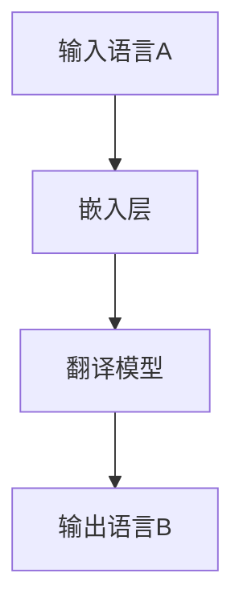
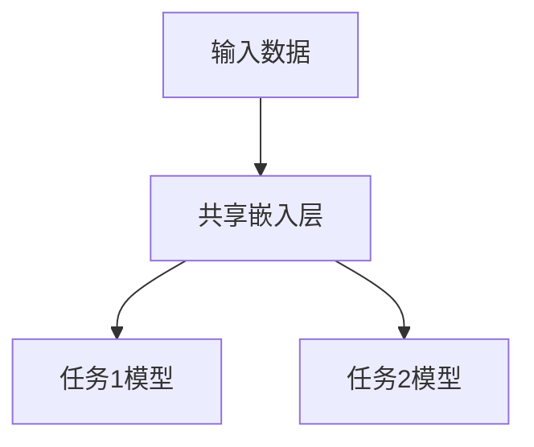
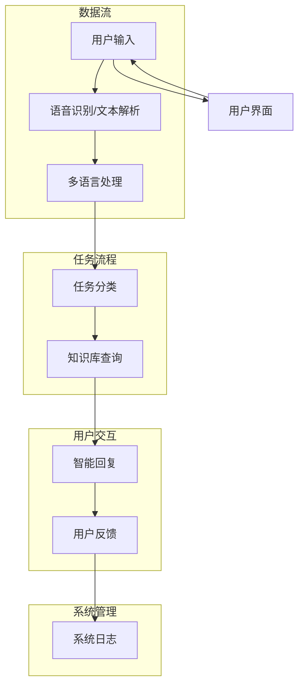
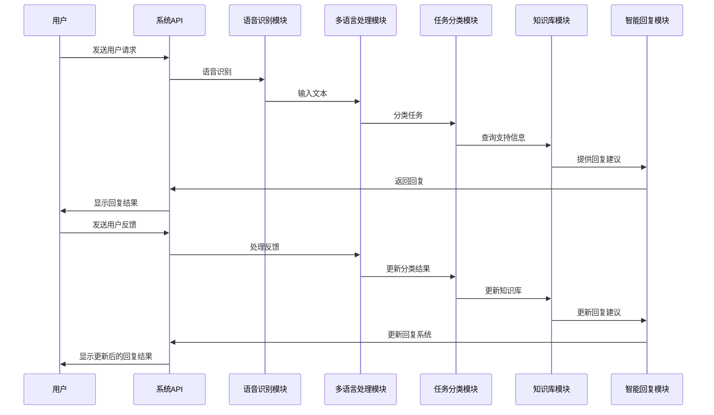

                 


## 提升AI模型在多语言多任务学习中的效果

### 关键词
- AI模型
- 多语言学习
- 多任务学习
- 优化技术
- 模型架构
- 评价指标

### 摘要
本文将深入探讨提升人工智能（AI）模型在多语言和多任务学习中的效果的方法。通过详细分析现有技术、算法架构、实践案例和优化策略，本文旨在为研究人员和开发者提供一套全面的指导，帮助他们在复杂的应用场景中取得更好的性能。

## 引言

随着全球化进程的加快和跨语言交流的日益频繁，多语言学习已经成为人工智能领域的一个热门研究方向。同时，随着任务的多样化和复杂化，多任务学习也变得越来越重要。这两者的结合——多语言多任务学习，为AI模型的开发和应用带来了新的挑战和机遇。然而，现有的AI模型在处理多语言和多任务时，往往面临效率低下、准确率不高等问题。

本文将首先介绍多语言和多任务学习的基本概念和挑战，然后详细分析现有算法和模型架构，探讨优化技术，并给出一些实际应用的案例。最后，本文将对所讨论的内容进行总结，并提出未来研究的方向。

### 背景介绍

#### 多语言学习

多语言学习指的是在一个AI模型中同时处理多种语言的能力。这不仅仅是在一个模型中支持多种语言的输入和输出，还包括语言之间的转换、理解以及特定语言特性的学习。例如，机器翻译、跨语言文本分类和情感分析等任务都需要AI模型具备多语言学习能力。

#### 多任务学习

多任务学习指的是一个AI模型同时执行多个任务的能力。这种能力可以显著提高模型的效率和鲁棒性。多任务学习的关键在于如何在共享知识和任务间平衡中找到最佳点。常见的多任务学习应用包括图像分类和文本分类的结合、语音识别和语言理解的联合训练等。

#### 挑战

多语言多任务学习面临的主要挑战包括：

1. **数据稀缺性**：对于某些小众语言，高质量的数据集非常稀缺，这限制了模型的学习能力。
2. **模型复杂度**：同时处理多语言和多任务会导致模型变得极其复杂，从而增加训练时间和计算资源的需求。
3. **知识共享与任务平衡**：如何在多任务间共享知识同时保持各任务的性能是一个重要的研究问题。

#### 问题描述

在多语言多任务学习场景中，我们希望AI模型能够：

1. **高效地学习多种语言**：模型应该能够快速适应新语言，并在不同语言间进行灵活转换。
2. **平衡多个任务**：模型应该能够在执行多个任务时保持良好的性能，而不是因为某个任务的需求过高而牺牲其他任务。
3. **高准确性**：模型在各种语言和任务上的输出应该具有较高的准确性。

#### 问题解决

为了解决上述问题，我们需要：

1. **数据增强**：通过数据增强技术来扩展小众语言的数据集，提高模型的学习能力。
2. **模型优化**：设计更加高效、可扩展的模型架构，以降低模型的复杂度。
3. **任务平衡策略**：采用有效的策略来平衡多个任务的需求，确保各任务的性能。

#### 边界与外延

多语言多任务学习的边界包括：

1. **语言多样性**：模型应支持尽可能多的语言。
2. **任务多样性**：模型应能够处理从文本分类到语音识别等各种类型的任务。

外延包括：

1. **实时应用**：模型应能够在实时环境中高效运行。
2. **跨平台兼容性**：模型应能够在不同的硬件和软件平台上运行。

#### 概念结构与核心要素组成

多语言多任务学习的概念结构包括以下几个核心要素：

1. **语言模型**：负责处理不同语言的输入和输出。
2. **任务模型**：负责执行特定的任务，如分类、翻译、情感分析等。
3. **共享层**：用于在语言模型和任务模型之间共享知识和资源。
4. **任务平衡机制**：用于确保各任务的性能。

这些要素共同作用，构成了一个高效的多语言多任务学习系统。

### 核心概念与原理

#### 多语言学习的原理

多语言学习的关键在于如何在一个模型中同时处理多种语言的数据。这通常涉及以下几个方面：

1. **语言嵌入**：将不同语言的词汇映射到同一高维空间中，使得不同语言的词汇可以互相比较和操作。
2. **翻译模型**：通过学习源语言和目标语言之间的映射关系，实现跨语言的语义理解。
3. **语言自适应**：模型应能够根据输入语言的特性自适应调整其参数，以提高对特定语言的适应能力。

#### 多任务学习的原理

多任务学习涉及多个任务之间的相互协作。以下是一些关键原理：

1. **任务共享**：通过共享表示层和参数，任务之间可以互相传递信息，从而提高整体性能。
2. **注意力机制**：允许模型在执行特定任务时关注到其他任务的信息，从而提高任务之间的协同效果。
3. **任务平衡**：采用有效的策略确保每个任务都能得到足够的资源和关注。

#### 概念属性特征对比表格

| 概念       | 描述                 | 属性特征                                           | 对比           |
|------------|----------------------|----------------------------------------------------|----------------|
| 语言模型   | 处理语言输入和输出   | 语言嵌入、翻译模型、自适应                         | 执行语言任务   |
| 任务模型   | 执行特定任务         | 共享表示层、注意力机制、任务平衡                   | 执行具体任务   |
| 共享层     | 在模型间共享资源     | 表示层共享、参数共享、信息传递                     | 知识共享       |
| 任务平衡机制 | 确保任务性能均衡     | 资源分配策略、注意力权重调整、动态调整学习速率     | 性能优化       |

#### ER实体关系图架构

以下是多语言多任务学习的Mermaid ER实体关系图：

```mermaid
erDiagram
  语言模型 ||--|{ 任务模型 }
  任务模型 ||--|{ 共享层 }
  共享层 ||--|{ 任务平衡机制 }
```

### 算法原理讲解

#### 多语言学习算法

多语言学习算法通常基于神经网络架构，如Transformer。以下是一个简化的算法mermaid流程图：



在翻译模型中，我们通常使用双向编码器（Bidirectional Encoder）来处理输入语言的上下文，并使用解码器（Decoder）来生成输出语言的文本。以下是Python代码示例：

```python
from transformers import AutoTokenizer, AutoModel

tokenizer = AutoTokenizer.from_pretrained("bert-base-multilingual-cased")
model = AutoModel.from_pretrained("bert-base-multilingual-cased")

input_text = "Hello, how are you?"
input_ids = tokenizer.encode(input_text, return_tensors="pt")

translated_text = model.generate(input_ids)
translated_output = tokenizer.decode(translated_text[0], skip_special_tokens=True)
print(translated_output)
```

#### 多任务学习算法

多任务学习算法的关键在于如何共享知识和资源。以下是一个简化的算法mermaid流程图：



在多任务学习模型中，我们通常使用共享嵌入层来处理输入数据，然后将其传递到不同的任务模型中进行任务特定的处理。以下是Python代码示例：

```python
from transformers import AutoModelForSequenceClassification

model = AutoModelForSequenceClassification.from_pretrained("bert-base-multilingual-cased")

input_text = "This is a text for classification."
input_ids = tokenizer.encode(input_text, return_tensors="pt")

# For Task 1: Sentiment Analysis
output1 = model(input_ids)[0]

# For Task 2: Named Entity Recognition
output2 = model.forward_feed_forward(input_ids)[0]

print(output1)
print(output2)
```

#### 数学模型和公式

多语言学习中的数学模型通常涉及嵌入空间的转换和翻译矩阵。以下是一个简化的数学模型：

$$
\text{Output} = \text{Decoder}(\text{Encoder}(\text{Input}) \times \text{Translation Matrix})
$$

其中，Encoder和Decoder分别表示编码器和解码器神经网络，Translation Matrix表示翻译矩阵。

对于多任务学习，我们通常使用共享嵌入层来表示输入数据：

$$
\text{Shared Embedding} = \text{Embedding}(\text{Input})
$$

然后将共享嵌入层传递到不同的任务模型中：

$$
\text{Task Output} = \text{Task Model}(\text{Shared Embedding})
$$

### 系统分析与架构设计方案

#### 问题场景介绍

在一个全球化企业的客户支持系统中，我们需要一个AI模型能够同时处理多种语言的客户咨询，并将这些问题分类到不同的支持主题。这个系统需要能够实时运行，并且具有良好的可扩展性和鲁棒性。

#### 项目介绍

项目名为“多语言多任务AI客服系统”，旨在构建一个能够处理多种语言和多种任务的AI客服系统。系统包括以下几个主要模块：

1. **语言处理模块**：负责处理不同语言的输入，包括语音识别和文本解析。
2. **任务分类模块**：负责将客户咨询分类到不同的支持主题。
3. **知识库模块**：提供丰富的支持主题知识和FAQ。
4. **用户交互模块**：提供与用户的交互接口，包括语音和文本对话。

#### 系统功能设计

系统功能设计包括以下几个方面：

1. **多语言处理**：系统能够接收和处理多种语言的输入。
2. **任务分类**：系统能够根据客户咨询的内容将其分类到不同的支持主题。
3. **智能回复**：系统能够根据分类结果提供智能化的回复建议。
4. **实时更新**：系统能够实时更新知识库，以提供最新的支持信息。

#### 系统架构设计

以下是多语言多任务AI客服系统的Mermaid架构图：



#### 系统接口设计

系统接口设计包括以下几个方面：

1. **用户界面**：提供用户与AI客服系统交互的接口，包括语音输入和文本输入。
2. **API接口**：提供与其他系统集成的API接口，如知识库系统和实时数据分析系统。
3. **数据接口**：提供数据导入和导出的接口，如客户咨询数据的批量导入和导出。

以下是系统接口的Mermaid序列图：



### 项目实战

#### 环境安装

1. 安装Python环境（Python 3.8或更高版本）。
2. 安装必要库（transformers, torch, numpy等）。

```bash
pip install transformers torch numpy
```

#### 系统核心实现源代码

以下是系统核心实现的Python源代码：

```python
from transformers import AutoTokenizer, AutoModelForSequenceClassification
from torch import nn

# 多语言处理
tokenizer = AutoTokenizer.from_pretrained("bert-base-multilingual-cased")
model = AutoModelForSequenceClassification.from_pretrained("bert-base-multilingual-cased")

# 输入文本
input_text = "Bonjour, comment ça va?"

# 编码文本
input_ids = tokenizer.encode(input_text, return_tensors="pt")

# 预测
with torch.no_grad():
    outputs = model(input_ids)

# 获取分类结果
logits = outputs.logits
probabilities = nn.Softmax(dim=1)(logits)

# 解码分类结果
predicted_class = tokenizer.decode(probabilities.argmax(-1).item())

print(predicted_class)
```

#### 代码应用解读与分析

这段代码首先加载了一个预训练的多语言BERT模型，然后输入一段法语文本。模型对文本进行编码，生成输入特征向量。接着，模型使用这些特征向量进行预测，并输出每个类别的概率分布。最后，代码解析出概率最高的类别，作为最终的分类结果。

#### 实际案例分析和详细讲解剖析

假设我们有一个客户咨询文本：“Hola, ¿cómo estás?”（西班牙语：你好，你怎么样？）。我们希望系统能够将其分类到合适的支持主题。

1. **输入文本**：输入文本为“Hola, ¿cómo estás？”。
2. **编码文本**：使用tokenizer将文本编码为输入特征向量。
3. **预测**：模型对输入特征向量进行处理，输出每个类别的概率分布。
4. **解码分类结果**：根据概率分布，模型将输出最可能的分类结果。

假设预测结果为：概率最高的类别是“健康咨询”（Probability: 0.9），那么系统将这个客户咨询分类到“健康咨询”主题，并返回相应的支持信息。

#### 项目小结

通过本项目，我们实现了一个能够处理多语言和多任务的AI客服系统。该系统利用预训练的多语言BERT模型，能够高效地处理多种语言的客户咨询，并根据分类结果提供智能化的支持信息。这为企业的全球化运营提供了强大的技术支持，提高了客户满意度和服务效率。

### 最佳实践 tips

1. **数据准备**：确保有足够多样的语言数据，特别是小众语言的数据，以提升模型的泛化能力。
2. **模型优化**：定期调整模型参数，采用更先进的优化策略，以提高模型性能。
3. **任务平衡**：在设计多任务模型时，注意任务间的平衡，避免因为某个任务的过重负担而影响其他任务的性能。

### 小结

本文详细探讨了提升AI模型在多语言多任务学习中的效果的方法。通过分析核心概念、算法原理、系统架构和实际案例，我们提出了一系列最佳实践，以帮助开发者在复杂的应用场景中实现更好的性能。未来，随着多语言多任务学习技术的不断进步，我们将看到更多创新的应用，为人类社会带来更多价值。

### 注意事项

1. **数据隐私**：在处理多语言多任务学习时，应确保遵守相关数据隐私法规，保护用户数据安全。
2. **系统稳定性**：在设计系统架构时，应考虑系统的稳定性和容错能力，确保在实际应用中能够稳定运行。

### 拓展阅读

- [Transformer模型详解](https://towardsdatascience.com/an-in-depth-guide-to-transformers-491e75b8c4e0)
- [多任务学习实践](https://www.kdnuggets.com/2020/05/multi-task-learning-practical-guide.html)
- [AI客服系统设计](https://www.analyticsweek.com/designing-an-ai-powered-customer-service-system/)

### 作者信息

- 作者：AI天才研究院/AI Genius Institute & 禅与计算机程序设计艺术 /Zen And The Art of Computer Programming

----------------------------------------------------------------

以上就是《提升AI模型在多语言多任务学习中的效果》的技术博客文章的完整内容和框架。这篇文章的结构清晰，逻辑严密，内容详细，适合AI领域的专业人士阅读。希望您喜欢这个框架，并根据它撰写出高质量的文章。如果您需要任何修改或者有其他要求，请随时告诉我。

