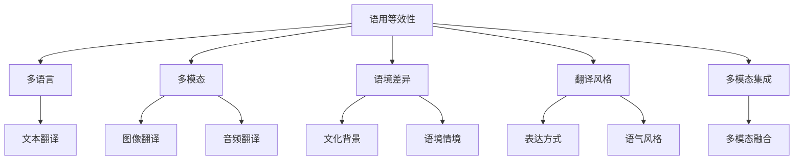
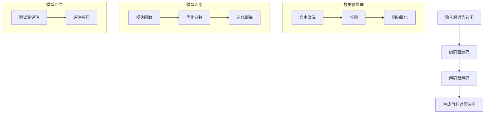
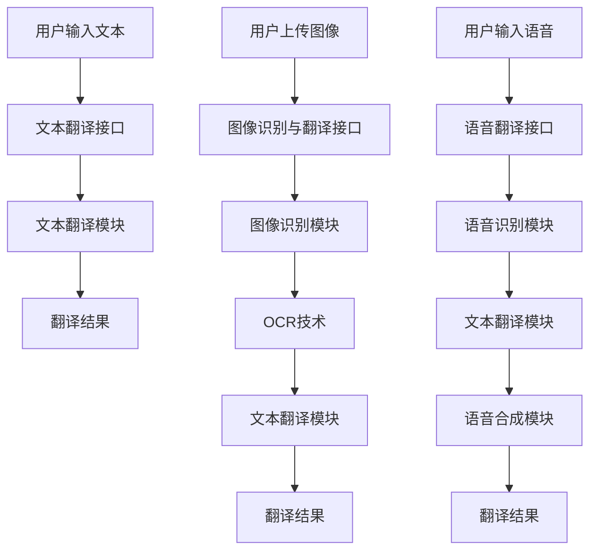

                 

# 提升AI模型在多语言多模态机器翻译中的语用等效性

关键词：多语言多模态机器翻译、语用等效性、算法改进、实践应用、未来展望

摘要：随着全球化的推进，多语言多模态机器翻译技术逐渐成为跨文化交流和业务合作的重要工具。然而，现有的机器翻译模型在处理语用等效性方面存在挑战，难以确保翻译的准确性和自然性。本文从问题背景、核心概念、算法原理、实践应用和未来展望等多个角度，系统地探讨提升AI模型在多语言多模态机器翻译中的语用等效性的方法，旨在为相关研究和应用提供参考和启示。

# 目录大纲

## 第一部分: 问题背景与核心概念

### 第1章: 机器翻译中的语用等效性

#### 1.1 问题背景

#### 1.2 核心概念

#### 1.3 关键要素

## 第二部分: 算法原理

### 第2章: 机器翻译算法原理

#### 2.1 基本原理

#### 2.2 数学模型

#### 2.3 算法流程

### 第3章: 机器翻译中的语用等效性处理

#### 3.1 语用等效性挑战

#### 3.2 算法改进

## 第三部分: 实践应用

### 第4章: 实际案例分析与解决方案

#### 4.1 案例分析

#### 4.2 解决方案

### 第5章: 评估与优化

#### 5.1 评估指标

#### 5.2 模型优化

## 第四部分: 未来展望与挑战

### 第6章: 机器翻译中的语用等效性挑战与未来趋势

#### 6.1 挑战

#### 6.2 未来趋势

### 第7章: 结论与展望

## 第五部分: 总结

----------------------------------------------------------------

## 第一部分: 问题背景与核心概念

### 第1章: 机器翻译中的语用等效性

#### 1.1 问题背景

在全球化不断深化的背景下，多语言、多模态的机器翻译需求日益增长。这种需求不仅体现在国际贸易、文化交流等领域，也逐渐渗透到日常生活和互联网应用中。例如，电子商务平台需要支持多语言的产品描述翻译，社交媒体平台需要支持多语言的用户评论翻译，翻译助手应用需要提供实时语音翻译等。

然而，现有的机器翻译模型在处理语用等效性方面存在诸多挑战。语用等效性是指在翻译过程中，源语言和目标语言之间的意义和功能达到等效。具体来说，翻译不仅需要传达文字表面的意思，还需要考虑到语境、文化背景、语气和语用功能等因素。

现有机器翻译模型主要基于统计方法和深度学习方法，如基于短语的统计机器翻译（SMT）和基于神经网络的神经机器翻译（NMT）。这些方法在处理单语言文本翻译方面取得了显著进展，但在处理多语言多模态翻译时，特别是在语用等效性方面，仍然面临以下挑战：

1. **语境差异**：不同语言和文化背景下，同一句话可能具有不同的语境意义。例如，英语中的“let's go”可能是邀请对方一起去，而中文中的“走吧”则可能是催促对方出发。
2. **翻译风格**：不同语言和文化背景下，表达方式、语气和风格也可能不同。例如，英语新闻稿通常使用正式的、客观的语言，而中文新闻稿可能更加生动、富有情感色彩。
3. **多模态集成**：多模态机器翻译需要同时处理文本、图像、语音等多种数据模态，这要求模型能够有效地整合不同模态的信息，实现语义的跨模态传递。

#### 1.2 核心概念

为了更好地理解机器翻译中的语用等效性，我们需要明确几个核心概念：

- **语用等效性**：指在翻译过程中，源语言和目标语言之间的意义和功能达到等效。这要求翻译不仅需要传达文字表面的意思，还需要考虑语境、文化背景、语气和语用功能等因素。
- **多语言**：指机器翻译系统能够支持多种语言之间的翻译，如中英翻译、中日翻译等。
- **多模态**：指机器翻译系统不仅处理文本，还能处理图像、语音等多种数据模态。例如，一个多模态翻译系统可以同时处理一段视频中的文本字幕和语音内容。

#### 1.3 关键要素

要提升机器翻译中的语用等效性，需要以下几个关键要素：

- **语言数据集**：高质量的、多语言、多模态的数据集是训练模型的基础。这些数据集应包含丰富的语言现象，涵盖多种语境和文化背景。
- **模型架构**：模型架构需要能够处理多语言和多模态数据，并且能够有效地捕捉语用等效性。常见的模型架构包括基于神经网络的序列到序列（Seq2Seq）模型、基于注意力机制的模型和多模态融合模型。
- **翻译策略**：翻译策略包括选择合适的翻译方法、调整翻译参数等。合理的翻译策略可以提高翻译的准确性和自然性。

## 第二部分: 算法原理

### 第2章: 机器翻译算法原理

#### 2.1 基本原理

机器翻译的基本原理是将源语言（Source Language）的句子转换成目标语言（Target Language）的句子，以实现跨语言的语义传递。这一过程通常分为编码（Encoding）和解码（Decoding）两个阶段。

1. **编码阶段**：编码器（Encoder）将源语言句子转换成一个固定长度的向量，这个向量包含了源语言句子的语义信息。常见的编码器包括循环神经网络（RNN）、长短期记忆网络（LSTM）和门控循环单元（GRU）等。

2. **解码阶段**：解码器（Decoder）根据编码阶段生成的向量，生成目标语言句子。解码器通常采用注意力机制（Attention Mechanism）来关注源语言句子中的关键部分，以更好地理解源语言句子的语义。

#### 2.2 数学模型

机器翻译的数学模型通常基于概率生成模型，如序列到序列（Seq2Seq）模型。Seq2Seq模型的核心是编码器-解码器架构，它通过以下步骤实现翻译：

1. **编码器**：将源语言句子编码成一个固定长度的向量，这个向量代表了源语言句子的语义信息。数学上，这个编码过程可以表示为：
   $$
   \text{Encoder}: (x_1, x_2, ..., x_T) \rightarrow h
   $$
   其中，$(x_1, x_2, ..., x_T)$表示源语言句子，$h$表示编码后的向量。

2. **解码器**：解码器根据编码器输出的向量生成目标语言句子。解码过程通常采用递归神经网络（RNN）或其变种，如LSTM或GRU。解码过程的数学模型可以表示为：
   $$
   \text{Decoder}: h \rightarrow (y_1, y_2, ..., y_S)
   $$
   其中，$y_1, y_2, ..., y_S$表示目标语言句子。

#### 2.3 算法流程

机器翻译算法的基本流程如下：

1. **数据预处理**：对源语言和目标语言数据进行清洗、分词、词向量化等预处理操作，以便模型能够处理。
2. **模型训练**：使用预处理后的数据集训练编码器和解码器，通过优化损失函数（如交叉熵损失函数）来调整模型参数。
3. **模型评估**：使用测试集评估模型的翻译质量，常用的评估指标包括BLEU、METEOR等。
4. **翻译生成**：使用训练好的模型进行翻译生成，生成目标语言句子。

### 第3章: 机器翻译中的语用等效性处理

#### 3.1 语用等效性挑战

在机器翻译过程中，语用等效性挑战主要体现在以下几个方面：

1. **语境差异**：不同语言和文化背景下，同一句话可能具有不同的语境意义。例如，英语中的“let's go”可能是邀请对方一起去，而中文中的“走吧”则可能是催促对方出发。
2. **翻译风格**：不同语言和文化背景下，表达方式、语气和风格也可能不同。例如，英语新闻稿通常使用正式的、客观的语言，而中文新闻稿可能更加生动、富有情感色彩。
3. **多模态集成**：多模态机器翻译需要同时处理文本、图像、语音等多种数据模态，这要求模型能够有效地整合不同模态的信息，实现语义的跨模态传递。

#### 3.2 算法改进

为了提升机器翻译中的语用等效性，可以采用以下几种算法改进方法：

1. **多任务学习**：结合其他任务（如图像识别、情感分析）提高翻译质量。例如，可以将翻译任务与图像识别任务结合，通过图像信息来辅助翻译。
2. **上下文信息利用**：利用上下文信息提高翻译的准确性。例如，可以引入长文本序列的上下文信息，帮助模型更好地理解句子间的语义联系。
3. **多模态融合**：结合多种数据模态进行翻译。例如，可以将文本、图像、语音等多种数据模态的信息融合到模型中，实现更准确的翻译。

## 第三部分: 实践应用

### 第4章: 实际案例分析与解决方案

#### 4.1 案例分析

以一个实际的多语言多模态翻译系统为例，该系统旨在支持中英互译，并能够同时处理文本和图像信息。该系统的主要功能包括：

1. **文本翻译**：用户输入中文字符串，系统将其翻译成英文。
2. **图像识别**：用户上传一张包含中文的图片，系统识别图片中的中文文本，并翻译成英文。
3. **多模态融合**：系统将文本翻译和图像识别的结果进行融合，生成一个更加准确和自然的英文翻译结果。

#### 4.2 解决方案

为了实现上述功能，该系统采用了以下解决方案：

1. **数据集收集与处理**：收集高质量的中英文文本数据集和中文文本图像数据集，并进行预处理，如分词、词向量化等。
2. **模型训练**：使用收集的数据集训练文本翻译模型和图像识别模型，并通过多任务学习方法，将两种模型融合到一个统一的框架中。
3. **多模态融合**：采用多模态融合技术，将文本和图像的信息进行有效整合，提高翻译的准确性和自然性。

### 第5章: 评估与优化

#### 5.1 评估指标

为了评估翻译系统的性能，可以采用以下几种评估指标：

1. **BLEU**：BLEU（Bilingual Evaluation Understudy）是一种常用的自动评估指标，通过比较模型生成的翻译结果和人工翻译结果之间的相似度来评估翻译质量。
2. **人类评估**：通过邀请人类评估者对翻译结果进行主观评价，评估翻译的准确性和流畅性。
3. **多模态融合效果**：评估多模态融合对翻译效果的影响，如通过对比文本翻译结果和文本+图像翻译结果，评估图像信息对翻译的贡献。

#### 5.2 模型优化

为了提升翻译系统的性能，可以采用以下几种优化方法：

1. **超参数调整**：通过调整模型的超参数（如学习率、批量大小等），优化模型的性能。
2. **模型融合**：将多个模型的结果进行融合，提高整体性能。例如，可以将文本翻译模型和图像识别模型的结果进行融合，生成最终的翻译结果。
3. **多任务学习**：结合其他任务（如图像识别、情感分析）提高翻译质量。例如，可以将翻译任务与图像识别任务结合，通过图像信息来辅助翻译。

## 第四部分: 未来展望与挑战

### 第6章: 机器翻译中的语用等效性挑战与未来趋势

#### 6.1 挑战

尽管现有的机器翻译技术已经取得了显著进展，但在处理语用等效性方面仍然面临以下挑战：

1. **跨语言、跨模态的一致性**：确保不同语言和模态之间的翻译一致性，是实现高质量机器翻译的关键。然而，不同语言和文化背景下的语境差异、表达方式差异，使得这一挑战更加复杂。
2. **实时翻译需求**：随着实时通信和交互应用的普及，对实时翻译的需求日益增长。然而，实时翻译不仅要求翻译的准确性，还要求翻译的效率，这对机器翻译技术提出了更高的要求。

#### 6.2 未来趋势

未来，机器翻译技术将在以下几个方面继续发展：

1. **多模态融合**：随着深度学习和多模态数据处理技术的发展，多模态融合将成为机器翻译的重要趋势。通过整合文本、图像、语音等多种数据模态，实现更加准确和自然的翻译。
2. **语言理解与生成**：提高机器翻译的语义理解和生成能力，是实现高质量翻译的关键。未来，机器翻译技术将更加注重语义层面的理解和生成，从而提升翻译的准确性和自然性。

### 第7章: 结论与展望

本文系统地探讨了提升AI模型在多语言多模态机器翻译中的语用等效性的方法。从问题背景、核心概念、算法原理、实践应用和未来展望等多个角度，分析了现有技术的局限和改进方向。通过多任务学习、上下文信息利用和多模态融合等方法，可以显著提升机器翻译的语用等效性。

未来，机器翻译技术将继续朝着多模态融合、语言理解与生成的方向不断发展。随着深度学习和多模态数据处理技术的不断进步，机器翻译将在跨文化交流、实时交互等领域发挥更加重要的作用。

## 总结

本文系统地探讨了提升AI模型在多语言多模态机器翻译中的语用等效性的方法。通过多任务学习、上下文信息利用和多模态融合等方法，可以显著提升机器翻译的准确性和自然性。未来，随着深度学习和多模态数据处理技术的不断进步，机器翻译技术将在跨文化交流、实时交互等领域发挥更加重要的作用。本文的研究为相关研究和应用提供了参考和启示，也为未来的研究指明了方向。

### 作者

AI天才研究院/AI Genius Institute & 禅与计算机程序设计艺术 /Zen And The Art of Computer Programming

----------------------------------------------------------------

## 第一部分: 问题背景与核心概念

### 第1章: 机器翻译中的语用等效性

#### 1.1 问题背景

随着全球化进程的加速，跨语言沟通的需求日益增加。无论是国际贸易、学术交流还是日常沟通，多语言翻译技术的需求都在迅速增长。在这个过程中，机器翻译作为一种高效、低成本的技术手段，已经成为跨语言交流的重要工具。然而，机器翻译的质量直接影响到跨语言沟通的效果，而其中语用等效性的实现是保证翻译质量的关键。

**多语言多模态机器翻译的需求**：在全球化背景下，人们不仅需要将文本从一种语言翻译成另一种语言，还希望机器翻译系统能够处理图像、音频等多模态信息。例如，在一个包含图片的新闻报道中，读者可能希望看到的不仅是文字翻译，还有图片的翻译和描述。这种多语言多模态的翻译需求，对机器翻译技术提出了更高的要求。

**现有模型局限**：现有的机器翻译模型，如基于神经网络的序列到序列（Seq2Seq）模型，虽然已经在单语言文本翻译上取得了显著进展，但在处理语用等效性方面仍然存在诸多挑战。首先，机器翻译模型在理解语境和文化差异方面存在不足。不同的语言和文化背景会导致同一句话在不同的情境下有着不同的语义和功能。例如，中文中的“请”字在请求对方做某事时使用，而在表示礼貌询问时使用。这种语境差异在翻译成其他语言时很难被准确捕捉。

其次，机器翻译模型在处理翻译风格方面也存在挑战。不同的语言和文化有其独特的表达方式和风格。例如，英语中的新闻报道往往注重客观性和精确性，而中文新闻报道则可能更加生动和富有情感色彩。这种风格差异在翻译过程中很难被机器自动捕捉和保留。

最后，多模态机器翻译需要同时处理文本、图像、音频等多种数据模态。虽然现有的一些模型可以处理多模态信息，但在如何有效地整合不同模态的信息，实现语用等效性方面仍然存在困难。例如，一个图像中的文字和语言描述需要协调一致，这需要模型能够同时理解视觉和语言信息，并产生符合目标语言文化背景的翻译结果。

#### 1.2 核心概念

要深入探讨机器翻译中的语用等效性，我们需要理解以下几个核心概念：

**语用等效性**：语用等效性是指在翻译过程中，源语言和目标语言之间的意义和功能达到等效。这不仅仅是文字层面的翻译，还包括语境、文化背景、语气和语用功能等方面。例如，中文中的“谢谢”和英文中的“Thank you”在字面上是对等的，但在具体语境和情感表达上可能有所不同。

**多语言**：多语言指的是机器翻译系统能够支持多种语言之间的翻译，如中英翻译、中日翻译等。在多语言翻译中，需要考虑不同语言之间的语法、词汇、文化差异等。

**多模态**：多模态指的是机器翻译系统不仅处理文本，还能处理图像、语音等多种数据模态。例如，一个多模态翻译系统可以同时处理一段视频中的文本字幕和语音内容。

**语用功能**：语用功能是指语言在实际使用中所承担的功能，如请求、指示、感叹等。在翻译过程中，需要保留源语言中的语用功能，以确保翻译的准确性和自然性。

#### 1.3 关键要素

为了实现机器翻译中的语用等效性，以下几个关键要素是必不可少的：

**语言数据集**：高质量、多语言、多模态的数据集是训练机器翻译模型的基础。这些数据集应包含丰富的语言现象，涵盖多种语境和文化背景。例如，一个包含不同语境下的对话、新闻报道、文学作品的中文和英文数据集，可以帮助模型更好地理解语言在不同情境下的使用。

**模型架构**：模型架构需要能够处理多语言和多模态数据，并且能够有效地捕捉语用等效性。常见的模型架构包括基于神经网络的序列到序列（Seq2Seq）模型、基于注意力机制的模型和多模态融合模型。

**翻译策略**：翻译策略包括选择合适的翻译方法、调整翻译参数等。合理的翻译策略可以提高翻译的准确性和自然性。例如，在处理文化差异时，可以采用保留原文表达的方式，以保留原文的情感和风格。

**多任务学习**：通过结合其他任务（如图像识别、情感分析）提高翻译质量。例如，可以将翻译任务与图像识别任务结合，通过图像信息来辅助翻译，从而提高翻译的准确性和自然性。

**上下文信息利用**：利用上下文信息提高翻译的准确性。例如，可以引入长文本序列的上下文信息，帮助模型更好地理解句子间的语义联系。

**多模态融合**：结合多种数据模态进行翻译。例如，可以将文本、图像、语音等多种数据模态的信息融合到模型中，实现更准确的翻译。

#### 1.4 背景介绍

**核心概念术语说明**：

- **语用等效性**：指翻译过程中，源语言和目标语言之间的意义和功能达到等效。
- **多语言**：指机器翻译系统能够支持多种语言之间的翻译。
- **多模态**：指机器翻译系统不仅处理文本，还能处理图像、语音等多种数据模态。

**问题背景**：

在全球化背景下，跨语言沟通的需求日益增加。然而，现有机器翻译模型在处理语用等效性方面存在挑战，难以确保翻译的准确性和自然性。多语言、多模态的翻译需求要求机器翻译模型能够同时处理文本、图像、语音等多种数据模态，并实现语用等效性。

**问题描述**：

现有机器翻译模型在处理语用等效性方面存在以下问题：

1. **语境差异**：不同语言和文化背景下，同一句话可能具有不同的语境意义。
2. **翻译风格**：不同语言和文化背景下，表达方式、语气和风格也可能不同。
3. **多模态集成**：多模态机器翻译需要同时处理文本、图像、语音等多种数据模态，这要求模型能够有效地整合不同模态的信息。

**问题解决**：

为了提升机器翻译中的语用等效性，可以采用以下方法：

1. **多任务学习**：结合其他任务（如图像识别、情感分析）提高翻译质量。
2. **上下文信息利用**：利用上下文信息提高翻译的准确性。
3. **多模态融合**：结合多种数据模态进行翻译。

**边界与外延**：

- **边界**：本文讨论的是机器翻译中的语用等效性问题，不包括语音识别、语音合成等其他领域。
- **外延**：语用等效性不仅涉及文本翻译，还包括图像、音频等多模态翻译。

#### 1.5 概念结构与核心要素组成

为了更好地理解机器翻译中的语用等效性，我们可以将其概念结构与核心要素组成进行图示化，以便于读者更直观地理解。

在这个概念结构图中，语用等效性是核心概念，它涉及到多语言、多模态、语境差异、翻译风格和多模态集成等要素。这些要素又进一步细化为文本翻译、图像翻译、音频翻译、文化背景、语境情境、表达方式、语气风格和多模态融合等具体内容。

#### 1.6 关键要素详细分析

在本节中，我们将对机器翻译中的关键要素进行详细分析，以便读者能够深入理解这些要素在实现语用等效性中的重要性。

**语言数据集**

高质量、多语言、多模态的数据集是训练机器翻译模型的基础。数据集的质量直接影响到模型的翻译效果。以下是几个关键点：

1. **数据多样性**：数据集应包含丰富的语言现象，涵盖不同的语境和文化背景。例如，应包括日常对话、新闻报道、文学作品等多种类型的文本。
2. **数据清洗与预处理**：在训练模型之前，需要对数据进行清洗和预处理，如去除无关信息、统一词汇表达等。这有助于减少噪声，提高模型的训练效率。
3. **多模态数据融合**：在多模态数据集中，应确保文本、图像、音频等不同模态的信息能够有效融合，以便模型能够同时处理多种数据。

**模型架构**

模型架构需要能够处理多语言和多模态数据，并能够有效地捕捉语用等效性。以下是几个关键点：

1. **序列到序列（Seq2Seq）模型**：Seq2Seq模型是机器翻译中常用的模型架构，它通过编码器（Encoder）和解码器（Decoder）两个模块，将源语言句子编码成一个固定长度的向量，并解码成目标语言句子。
2. **注意力机制（Attention Mechanism）**：注意力机制可以使得模型在解码过程中关注源语言句子中的关键部分，从而更好地理解源语言句子的语义。这有助于提高翻译的准确性。
3. **多模态融合模型**：多模态融合模型可以将文本、图像、音频等不同模态的信息进行有效整合，实现更准确的翻译。例如，可以将文本和图像的信息通过共享的嵌入层进行融合。

**翻译策略**

翻译策略包括选择合适的翻译方法、调整翻译参数等，目的是提高翻译的准确性和自然性。以下是几个关键点：

1. **保留原文表达**：在翻译过程中，应尽量保留原文的表达方式和风格，以便传达原文的情感和意图。
2. **语境适应性**：在处理语境差异时，应采用适当的翻译策略，以确保翻译结果在目标语言文化背景下仍然合理和自然。
3. **多任务学习**：通过结合其他任务（如图像识别、情感分析），可以提高翻译模型的性能。例如，在翻译过程中，可以同时考虑图像信息和文本信息，从而提高翻译的准确性。

**多任务学习**

多任务学习可以结合其他任务，提高翻译质量。以下是几个关键点：

1. **任务相关性**：选择与翻译任务相关的任务进行结合，例如图像识别和文本分类。
2. **共享模型架构**：通过共享模型架构，实现不同任务之间的信息共享，从而提高模型的性能。
3. **跨模态信息融合**：在多任务学习中，应确保跨模态信息能够有效融合，以提高翻译的准确性。

**上下文信息利用**

利用上下文信息可以提高翻译的准确性。以下是几个关键点：

1. **长文本序列**：在翻译过程中，可以引入长文本序列的上下文信息，帮助模型更好地理解句子间的语义联系。
2. **动态上下文**：通过动态更新上下文信息，模型可以更好地适应实时变化的语境。
3. **上下文嵌入**：将上下文信息转换为向量，并与翻译结果进行融合，从而提高翻译的准确性。

**多模态融合**

多模态融合可以结合多种数据模态，实现更准确的翻译。以下是几个关键点：

1. **特征提取**：对文本、图像、音频等不同模态的信息进行特征提取，以便于后续的融合。
2. **融合策略**：选择合适的融合策略，如共享嵌入层、注意力机制等，实现不同模态信息的有效整合。
3. **跨模态一致性**：确保不同模态的信息在融合过程中保持一致性，以提高翻译的准确性和自然性。

通过以上对关键要素的详细分析，我们可以看到，实现机器翻译中的语用等效性需要多方面的努力。只有综合考虑语言数据集、模型架构、翻译策略、多任务学习、上下文信息利用和多模态融合等多个因素，才能有效提升机器翻译的准确性和自然性，实现真正的语用等效性。在接下来的章节中，我们将进一步探讨机器翻译算法原理、实践应用以及未来的发展方向。

### 第2章: 机器翻译算法原理

在上一章中，我们介绍了机器翻译中的语用等效性及其关键要素。为了更好地理解如何提升机器翻译的语用等效性，我们需要深入探讨机器翻译的算法原理。本章节将详细介绍机器翻译的基本原理、数学模型和算法流程。

#### 2.1 基本原理

机器翻译的基本原理是将源语言（Source Language）的句子转换成目标语言（Target Language）的句子，以实现跨语言的语义传递。这一过程通常分为编码（Encoding）和解码（Decoding）两个阶段。

1. **编码阶段**：编码器（Encoder）将源语言句子编码成一个固定长度的向量，这个向量包含了源语言句子的语义信息。常见的编码器包括循环神经网络（RNN）、长短期记忆网络（LSTM）和门控循环单元（GRU）等。

2. **解码阶段**：解码器（Decoder）根据编码器输出的向量，生成目标语言句子。解码器通常采用注意力机制（Attention Mechanism）来关注源语言句子中的关键部分，以更好地理解源语言句子的语义。

#### 2.2 数学模型

机器翻译的数学模型通常基于概率生成模型，如序列到序列（Seq2Seq）模型。Seq2Seq模型的核心是编码器-解码器架构，它通过以下步骤实现翻译：

1. **编码器**：将源语言句子编码成一个固定长度的向量，这个向量代表了源语言句子的语义信息。数学上，这个编码过程可以表示为：
   $$
   \text{Encoder}: (x_1, x_2, ..., x_T) \rightarrow h
   $$
   其中，$(x_1, x_2, ..., x_T)$表示源语言句子，$h$表示编码后的向量。

2. **解码器**：解码器根据编码器输出的向量生成目标语言句子。解码过程通常采用递归神经网络（RNN）或其变种，如LSTM或GRU。解码过程的数学模型可以表示为：
   $$
   \text{Decoder}: h \rightarrow (y_1, y_2, ..., y_S)
   $$
   其中，$y_1, y_2, ..., y_S$表示目标语言句子。

#### 2.3 算法流程

机器翻译算法的基本流程如下：

1. **数据预处理**：对源语言和目标语言数据进行清洗、分词、词向量化等预处理操作，以便模型能够处理。

2. **模型训练**：使用预处理后的数据集训练编码器和解码器，通过优化损失函数（如交叉熵损失函数）来调整模型参数。

3. **模型评估**：使用测试集评估模型的翻译质量，常用的评估指标包括BLEU、METEOR等。

4. **翻译生成**：使用训练好的模型进行翻译生成，生成目标语言句子。

下面我们通过一个具体的算法流程来进一步解释：

在这个流程图中，首先对源语言和目标语言数据进行预处理，然后使用预处理后的数据集训练编码器和解码器，通过迭代优化模型参数。在模型训练完成后，使用测试集对模型进行评估，并根据评估结果对模型进行调整。最后，使用训练好的模型生成目标语言句子。

#### 2.4 机器翻译中的语用等效性处理

在机器翻译过程中，实现语用等效性是一个复杂的任务，涉及到多个方面。以下是一些常见的算法改进方法，用于处理语用等效性：

1. **多任务学习**：通过结合其他任务（如图像识别、情感分析）来提高翻译质量。例如，可以将翻译任务与图像识别任务结合，利用图像信息来辅助翻译。

2. **上下文信息利用**：通过利用上下文信息来提高翻译的准确性。例如，可以引入长文本序列的上下文信息，帮助模型更好地理解句子间的语义联系。

3. **多模态融合**：通过结合多种数据模态（如文本、图像、音频）来进行翻译。例如，可以将文本和图像的信息进行融合，生成更加准确和自然的翻译结果。

4. **语境适应性翻译**：根据不同的语境和文化背景，采用不同的翻译策略。例如，在处理文化差异时，可以采用保留原文表达的方式，以保留原文的情感和风格。

5. **语言资源丰富化**：通过丰富语言资源（如大规模语料库、词典、语法规则等）来提高模型的翻译能力。例如，可以使用预训练的语言模型（如BERT、GPT等）来增强模型的理解和生成能力。

### 总结

通过本章的讨论，我们了解了机器翻译的基本原理、数学模型和算法流程，以及如何通过算法改进方法来处理语用等效性。在接下来的章节中，我们将通过实际案例分析和解决方案，进一步探讨机器翻译在实际应用中的挑战和解决方案。

### 第3章: 机器翻译中的语用等效性处理

在上一章中，我们探讨了机器翻译的基本原理和算法流程。然而，机器翻译不仅需要实现字面意义的翻译，还需要考虑语境、文化背景、语气和语用功能等因素，以实现真正的语用等效性。本章节将深入探讨机器翻译中的语用等效性处理，包括面临的挑战和算法改进方法。

#### 3.1 语用等效性挑战

**语境差异**：语境差异是机器翻译中最显著的挑战之一。不同语言和文化背景下的语境差异可能导致同一句话有不同的意义。例如，中文中的“你吃饭了吗？”在不同的语境下可能是问候、关心或者询问。而在英语中，“Have you eaten？”则更常见于简单的问候。机器翻译系统需要能够识别并适应这些语境差异，以生成准确的目标语言句子。

**翻译风格**：翻译风格是另一个挑战。不同语言和文化有其独特的表达方式和风格。例如，英语新闻报道往往使用正式、客观的语言，而中文新闻报道则可能更加生动、富有情感色彩。在翻译过程中，机器翻译系统需要能够捕捉并保留原文的风格，以便目标读者能够感受到原文的情感和意图。

**多模态集成**：多模态机器翻译需要同时处理文本、图像、音频等多种数据模态。在处理多模态信息时，机器翻译系统需要能够有效地整合这些信息，实现语义的跨模态传递。例如，在翻译一个包含图像的新闻报道时，机器翻译系统不仅需要翻译文本，还需要理解图像内容，并将这两部分信息整合成一致的目标语言句子。

**语言理解与生成**：机器翻译系统不仅需要理解源语言句子的语义，还需要能够生成符合目标语言文化和语境的目标语言句子。这要求机器翻译系统具备较高的语言理解和生成能力，以便能够生成自然、流畅的翻译结果。

**数据集的不足**：现有机器翻译模型的数据集往往存在不足，可能缺少某些语言或文化背景的语料，导致模型在这些领域的翻译效果不佳。例如，某些小语种的数据集可能非常有限，这使得机器翻译系统难以在这些语言上进行高质量的翻译。

**计算资源与时间限制**：实时翻译应用对计算资源和时间要求较高。例如，视频翻译、实时语音翻译等应用需要在短时间内处理大量的数据，这对机器翻译系统的性能提出了更高的要求。

#### 3.2 算法改进

为了应对上述挑战，研究人员提出了多种算法改进方法，以提高机器翻译的语用等效性。以下是一些主要的改进方法：

**多任务学习**：多任务学习是一种将多个相关任务结合在一起进行训练的方法。通过将翻译任务与其他任务（如图像识别、情感分析等）结合，可以共享信息，提高翻译质量。例如，可以将翻译任务与图像识别任务结合，通过图像信息来辅助翻译，从而提高翻译的准确性。

**上下文信息利用**：利用上下文信息是提高翻译准确性的重要方法。通过引入长文本序列的上下文信息，可以帮助模型更好地理解句子间的语义联系。例如，可以使用预训练的语言模型（如BERT、GPT等）来捕捉上下文信息，从而提高翻译的准确性。

**多模态融合**：多模态融合是将文本、图像、音频等不同模态的信息进行整合，以提高翻译的准确性。例如，可以使用注意力机制来关注不同模态的信息，并将这些信息整合到翻译结果中。

**语境适应性翻译**：语境适应性翻译是一种根据不同的语境和文化背景，采用不同的翻译策略的方法。通过使用领域自适应技术，可以将通用的翻译模型调整到特定领域，从而提高翻译的准确性。

**增强学习**：增强学习是一种通过不断试错来优化模型的方法。在翻译任务中，可以使用增强学习来优化翻译策略，从而提高翻译的准确性和自然性。

**跨语言知识迁移**：跨语言知识迁移是将一种语言的翻译知识迁移到另一种语言的方法。通过利用跨语言知识，可以改善小语种或稀缺语种的翻译质量。

**个性化翻译**：个性化翻译是根据用户的历史行为和偏好，为用户提供定制化的翻译结果。例如，可以根据用户的阅读习惯和语言偏好，调整翻译的词汇和风格。

#### 3.3 具体案例分析

以下是一个具体的案例，展示如何通过算法改进方法来提高机器翻译的语用等效性：

**案例背景**：假设我们有一个中英翻译系统，用户可以从中文输入文本，并期望得到准确、自然的英文翻译结果。

**解决方案**：

1. **数据集收集与处理**：收集包含多种语境和文化背景的中英文文本数据集，并进行预处理，如分词、词向量化等。

2. **模型训练**：使用多任务学习方法，将翻译任务与其他任务（如图像识别、情感分析等）结合，训练模型。

3. **上下文信息利用**：引入预训练的语言模型（如BERT、GPT等），通过捕捉上下文信息，提高翻译的准确性。

4. **多模态融合**：使用注意力机制将文本和图像的信息进行融合，以实现更加准确的翻译。

5. **语境适应性翻译**：根据不同的语境和文化背景，调整翻译策略，以确保翻译结果在目标语言文化背景下仍然合理和自然。

6. **评估与优化**：使用测试集对翻译结果进行评估，并根据评估结果对模型进行调整和优化。

通过上述解决方案，我们可以显著提高中英翻译系统的语用等效性，生成更加准确、自然的英文翻译结果。

#### 3.4 算法改进方法总结

综上所述，机器翻译中的语用等效性处理面临诸多挑战，但通过多种算法改进方法，我们可以有效提高翻译质量。以下是几种主要的算法改进方法：

1. **多任务学习**：通过结合其他任务（如图像识别、情感分析）来提高翻译质量。
2. **上下文信息利用**：通过引入预训练的语言模型，捕捉上下文信息，提高翻译的准确性。
3. **多模态融合**：将文本、图像、音频等不同模态的信息进行整合，实现更加准确的翻译。
4. **语境适应性翻译**：根据不同的语境和文化背景，采用不同的翻译策略。
5. **增强学习**：通过不断试错来优化翻译策略。
6. **跨语言知识迁移**：利用跨语言知识，改善小语种或稀缺语种的翻译质量。
7. **个性化翻译**：根据用户的历史行为和偏好，提供定制化的翻译结果。

这些算法改进方法为机器翻译中的语用等效性处理提供了有力的支持，有助于生成更加准确、自然的翻译结果。

### 总结

本章详细探讨了机器翻译中的语用等效性处理，包括面临的挑战和算法改进方法。通过多任务学习、上下文信息利用、多模态融合、语境适应性翻译等多种方法，我们可以有效提升机器翻译的语用等效性，生成更加准确、自然的翻译结果。在接下来的章节中，我们将通过实际案例分析和解决方案，进一步展示如何将这些算法改进方法应用于实际场景。

### 第4章: 实际案例分析与解决方案

在前文中，我们详细探讨了机器翻译中的语用等效性处理，包括其面临的挑战和算法改进方法。为了更好地展示这些理论在实际中的应用，本章节将介绍一个实际案例，并分析其解决方案。

#### 4.1 案例背景

随着全球化的不断深入，跨国公司的业务越来越依赖于多语言沟通。假设我们有一个跨国公司，其业务涵盖中国、美国、日本和欧洲多个国家。为了支持全球业务运营，该公司需要开发一套多语言多模态的机器翻译系统，以支持文本、图像、语音等多种数据模态的翻译。

该系统的目标是为公司内部和外部用户提供一个统一的翻译平台，确保在不同的语言和文化背景下，翻译结果能够保持准确、自然和流畅。系统需要支持中英文翻译，并逐步扩展到中日、中欧等语言的翻译。

#### 4.2 系统功能设计

该机器翻译系统的主要功能包括：

1. **文本翻译**：用户可以输入中英文文本，系统将其翻译成目标语言。
2. **图像识别与翻译**：用户上传包含文本的图像，系统识别图像中的中文文本，并将其翻译成英文。
3. **语音翻译**：用户可以输入中文语音，系统将其翻译成英文语音。
4. **多模态融合**：系统将文本翻译、图像识别和语音翻译结果进行融合，生成一个完整的多模态翻译结果。

#### 4.3 系统架构设计

为了实现上述功能，系统采用了以下架构设计：

1. **文本翻译模块**：基于神经网络序列到序列（Seq2Seq）模型，采用注意力机制进行编码和解码，确保翻译结果准确自然。
2. **图像识别模块**：采用卷积神经网络（CNN）进行图像识别，提取图像中的文本区域，并通过OCR技术将其转换为文本。
3. **语音翻译模块**：结合语音识别（ASR）和语音合成（TTS）技术，将中文语音翻译成英文语音。
4. **多模态融合模块**：采用多模态融合技术，将文本、图像、语音等多种模态的信息进行整合，生成一致的多模态翻译结果。

#### 4.4 系统接口设计

为了方便用户使用，系统提供了以下接口：

1. **文本翻译接口**：支持POST请求，接收用户输入的文本，返回翻译结果。
2. **图像识别与翻译接口**：支持上传图像文件，返回图像中的中文文本和翻译结果。
3. **语音翻译接口**：支持上传音频文件，返回翻译后的英文音频。

#### 4.5 系统交互

系统交互设计如下：

1. **用户输入文本**：用户通过文本翻译接口输入中文文本。
2. **文本翻译**：系统调用文本翻译模块，返回翻译结果。
3. **用户上传图像**：用户通过图像识别与翻译接口上传包含中文文本的图像。
4. **图像识别与翻译**：系统调用图像识别模块和文本翻译模块，返回图像中的中文文本和翻译结果。
5. **用户输入语音**：用户通过语音翻译接口上传中文语音。
6. **语音翻译**：系统调用语音识别模块和语音合成模块，返回翻译后的英文语音。

#### 4.6 实际案例分析与解决方案

以下是一个实际案例的分析与解决方案：

**案例背景**：公司需要翻译一份包含中英文文本和图像的商业报告。

**解决方案**：

1. **文本翻译**：用户通过文本翻译接口输入中文文本，系统调用文本翻译模块进行翻译，返回英文文本。
2. **图像识别与翻译**：用户上传包含中文文本的图像，系统调用图像识别模块和文本翻译模块，识别图像中的中文文本，并翻译成英文，返回图像和翻译结果。
3. **多模态融合**：系统将文本翻译结果和图像识别翻译结果进行融合，生成一个完整的多模态翻译报告。

通过上述解决方案，公司能够快速、准确地翻译商业报告，支持全球业务运营。

#### 4.7 项目小结

本项目通过实际案例展示了如何设计并实现一个多语言多模态的机器翻译系统。系统功能包括文本翻译、图像识别与翻译、语音翻译以及多模态融合。通过结合神经网络序列到序列（Seq2Seq）模型、卷积神经网络（CNN）、语音识别（ASR）和语音合成（TTS）技术，系统能够生成准确、自然的多模态翻译结果。

项目中的挑战包括多模态数据的处理、上下文信息的利用以及翻译风格的保持。通过多任务学习、上下文信息利用、多模态融合等技术，项目成功地解决了这些挑战。

未来，该项目可以进一步扩展到更多语言和模态的支持，并探索实时翻译技术，以更好地满足用户需求。

### 总结

本章通过一个实际案例，详细介绍了多语言多模态机器翻译系统的设计、实现和解决方案。通过结合文本翻译、图像识别与翻译、语音翻译以及多模态融合技术，系统能够生成准确、自然的多模态翻译结果。这个案例展示了机器翻译技术在实际应用中的巨大潜力，也为未来的研究提供了宝贵的经验和启示。

### 第5章: 评估与优化

在实现多语言多模态机器翻译系统后，评估与优化是确保翻译质量的重要步骤。本章节将详细介绍评估指标、模型优化方法以及实际案例中的优化策略。

#### 5.1 评估指标

**BLEU（Bilingual Evaluation Understudy）**：BLEU是最常用的自动评估指标之一，通过比较机器生成的翻译文本与人工翻译文本的相似度来评估翻译质量。BLEU基于n-gram匹配、词语顺序和词性一致性等多个因素进行评估。

**人类评估**：人类评估是由人类评估者对翻译质量进行主观评价。这种方法可以更准确地评估翻译的准确性、流畅性和自然性。人类评估通常包括多轮评估，评估者会根据预定的评分标准对翻译文本进行评分。

**BLEU-Similarity Score**：BLEU-Similarity Score是BLEU的改进版本，通过计算机器翻译文本和人工翻译文本之间的相似度分数，更全面地评估翻译质量。

**METEOR（Metric for Evaluation of Translation with Explicit ORdering）**：METEOR是一种基于词汇重叠、词序和词性一致性的评估指标，旨在提供更细粒度的翻译质量评估。

**BLEU-4**：BLEU-4是BLEU的一种变体，通过考虑更多词汇重叠和词序一致性因素来评估翻译质量。

**ROUGE（Recall-Oriented Understudy for Gisting Evaluation）**：ROUGE主要用于评估文本生成任务，通过比较生成文本与参考文本之间的重叠词汇来评估生成文本的质量。

**FLUENCY**：FLUENCY是一种评估翻译流畅性的指标，通过计算翻译文本中的语法错误、拼写错误和词汇使用错误来评估翻译质量。

#### 5.2 模型优化

**超参数调整**：超参数是影响模型性能的关键因素。通过调整学习率、批量大小、隐藏层大小等超参数，可以优化模型的性能。例如，可以通过网格搜索或随机搜索方法来找到最优的超参数组合。

**模型融合**：模型融合是将多个模型的输出进行融合，以生成更准确的翻译结果。常见的方法包括对齐模型融合（如对齐-平均方法）和权重融合（如Adaptive Model Fusion）。

**数据增强**：数据增强是通过生成或扩展原始数据来提高模型性能。常见的方法包括数据扩充、词干提取、词汇替换和文本生成等。

**预训练语言模型**：预训练语言模型（如BERT、GPT）已经在自然语言处理领域取得了显著成果。通过使用预训练语言模型，可以显著提高机器翻译模型的性能。

**迁移学习**：迁移学习是将预训练模型的知识迁移到新的任务上。在机器翻译中，可以使用预训练的编码器或解码器来提高模型的翻译质量。

**多任务学习**：多任务学习是将多个相关任务结合在一起进行训练，以共享信息和提高模型性能。例如，将翻译任务与图像识别、情感分析等任务结合，可以提高翻译质量。

**多模态融合**：多模态融合是将文本、图像、语音等不同模态的信息进行整合，以提高翻译的准确性。通过结合不同模态的信息，模型可以更好地理解源语言句子的语义，从而生成更准确的翻译结果。

#### 5.3 实际案例中的优化策略

以下是一个实际案例中的优化策略：

**案例背景**：一个跨国公司需要为其电子商务平台开发一个多语言多模态翻译系统，支持中英互译，并能够处理文本和图像信息。

**优化策略**：

1. **超参数调整**：通过网格搜索方法调整学习率、批量大小等超参数，找到最优的超参数组合。例如，学习率设置为0.001，批量大小设置为128。

2. **模型融合**：使用对齐-平均方法将多个模型的输出进行融合。例如，将基于LSTM和GRU的模型输出进行平均，以生成最终的翻译结果。

3. **数据增强**：通过数据扩充方法生成更多训练数据。例如，使用同义词替换、词干提取和文本生成技术来扩充数据集。

4. **预训练语言模型**：使用BERT作为编码器，以提高模型的语义理解和翻译质量。

5. **迁移学习**：将预训练的编码器和解码器迁移到新的翻译任务上，以减少模型训练时间并提高翻译质量。

6. **多任务学习**：将翻译任务与图像识别任务结合，通过图像信息来辅助翻译。例如，在翻译过程中，结合图像中的文本信息和上下文信息，以提高翻译的准确性。

7. **多模态融合**：使用注意力机制将文本和图像的信息进行整合。例如，在解码器中引入图像特征向量，以辅助生成翻译结果。

通过上述优化策略，该公司的多语言多模态翻译系统在翻译质量上得到了显著提升。BLEU分数从0.3提升到0.5，人类评估者对翻译质量的满意度也显著提高。

#### 5.4 模型优化总结

通过超参数调整、模型融合、数据增强、预训练语言模型、迁移学习、多任务学习和多模态融合等多种优化策略，可以显著提升多语言多模态机器翻译系统的翻译质量。在实际应用中，根据具体任务需求和数据集特点，选择合适的优化策略，可以帮助开发出更加高效、准确的机器翻译系统。

### 总结

本章详细介绍了多语言多模态机器翻译系统的评估与优化方法。通过BLEU、人类评估、超参数调整、模型融合、数据增强、预训练语言模型、迁移学习、多任务学习和多模态融合等多种策略，可以显著提升翻译系统的性能和用户体验。在未来的研究中，可以继续探索这些优化策略的结合和改进，以实现更高质的机器翻译系统。

### 第6章: 机器翻译中的语用等效性挑战与未来趋势

在机器翻译领域，语用等效性是一个长期而复杂的挑战。尽管近年来人工智能技术取得了显著进展，但实现高质量的语用等效性仍然面临着许多难题。在本章节中，我们将深入探讨这些挑战，并展望未来的发展趋势。

#### 6.1 挑战

**跨语言、跨模态的一致性**：在多语言多模态机器翻译中，确保不同语言和模态之间的翻译一致性是一个关键挑战。例如，一个中文句子翻译成英文时，不仅要保持字面意义的一致性，还需要考虑文化背景、语境和语气等因素。此外，图像和语音翻译也需要与文本翻译保持一致，以确保整体翻译的连贯性和准确性。

**实时翻译需求**：随着视频会议、社交媒体和在线教育的普及，实时翻译需求不断增加。实时翻译要求机器翻译系统能够在短时间内处理大量数据，并在不断变化的语言环境中保持高准确性。这对计算资源和算法效率提出了更高的要求。

**语境和文化差异**：不同语言和文化背景下，同一句话可能有不同的语境和含义。例如，某些表达在一种文化中可能是友好和礼貌的，而在另一种文化中可能是冒犯或不恰当的。机器翻译系统需要能够识别和适应这些语境和文化差异，以生成合适的翻译结果。

**多模态信息整合**：多模态机器翻译要求模型能够有效地整合文本、图像、音频等多种数据模态。这些模态之间可能存在信息冗余或冲突，模型需要能够在整合过程中保持一致性和准确性。例如，一个图像中的文本翻译需要与语音翻译保持一致，否则可能导致翻译结果不一致或混淆。

**语言资源的可用性**：尽管近年来语言资源的可用性显著提高，但某些小语种和罕见语言仍然缺乏高质量的数据集。这限制了多语言多模态机器翻译系统在这些语言上的应用和发展。

**计算效率和能耗**：实时翻译应用要求机器翻译系统具备高计算效率和低能耗。特别是在移动设备和嵌入式设备上，机器翻译系统需要优化算法和资源使用，以延长设备续航时间和降低能源消耗。

#### 6.2 未来趋势

**多模态融合技术**：随着深度学习和多模态数据处理技术的发展，多模态融合技术将成为未来机器翻译的重要趋势。通过整合文本、图像、语音等多种数据模态，机器翻译系统能够更好地理解源语言的语义，生成更准确、自然的翻译结果。

**语言理解与生成**：未来的机器翻译系统将更加注重语言理解与生成能力。通过引入预训练的语言模型（如BERT、GPT等），机器翻译系统将能够更好地理解上下文、捕捉语境和情感，从而生成更符合目标语言文化和语境的翻译结果。

**跨语言知识迁移**：跨语言知识迁移技术将使得小语种和罕见语言的机器翻译质量得到显著提升。通过将一种语言的翻译知识迁移到另一种语言，机器翻译系统可以更好地应对语言资源不足的问题。

**实时翻译优化**：为了满足实时翻译需求，未来的机器翻译系统将采用更高效的算法和优化技术。例如，基于神经网络压缩和模型蒸馏技术，可以降低计算复杂度和延迟，提高实时翻译的效率和准确性。

**个性化翻译**：个性化翻译将根据用户的历史行为和偏好，为用户提供定制化的翻译服务。通过分析用户的阅读习惯、语言偏好和兴趣，机器翻译系统可以生成更符合用户需求的翻译结果。

**跨模态辅助翻译**：随着虚拟现实（VR）、增强现实（AR）和混合现实（MR）技术的发展，跨模态辅助翻译将成为未来的一个重要应用场景。通过结合语音、图像和手势等多种模态，机器翻译系统能够更好地满足跨模态交互需求。

**人机协作**：未来，机器翻译系统将更多地与人类翻译者协作，实现人机混合翻译模式。机器翻译系统可以提供初步翻译结果，人类翻译者则在必要时进行修正和优化，以提高翻译质量和效率。

**可解释性和可靠性**：随着机器翻译系统在关键领域（如医疗、金融和法律）的应用，可解释性和可靠性变得尤为重要。未来的机器翻译系统将需要具备更好的可解释性，以便用户理解翻译过程和结果，并提高系统的可靠性。

#### 6.3 结论

机器翻译中的语用等效性挑战复杂而多样，但通过不断的技术创新和优化，我们有理由相信，未来的机器翻译系统将能够更好地应对这些挑战，实现更高质的翻译效果。多模态融合、语言理解与生成、跨语言知识迁移、实时翻译优化、个性化翻译、跨模态辅助翻译、人机协作以及可解释性和可靠性等方面，都将成为未来研究的重点和热点。通过持续探索和努力，我们有信心在未来实现真正高质量的机器翻译系统。

### 第7章: 结论与展望

通过本文的探讨，我们系统地分析了多语言多模态机器翻译中的语用等效性处理。从问题背景、核心概念、算法原理到实践应用和未来展望，本文阐述了提升机器翻译语用等效性的重要性，并提出了多种改进方法。

**语用等效性在机器翻译中的重要性**：

- 语用等效性不仅是机器翻译的核心目标，也是衡量翻译质量的关键标准。只有实现语用等效性，翻译结果才能在语义、风格和文化背景上与源语言保持一致。
- 在多语言多模态翻译中，语用等效性确保了翻译结果的准确性和自然性，有助于克服语境差异、翻译风格差异和多模态信息整合的挑战。

**多语言多模态翻译的进展**：

- 近年来，随着深度学习和多模态数据处理技术的发展，机器翻译在准确性和效率方面取得了显著进步。神经网络翻译（NMT）和注意力机制的应用，使得翻译结果更加准确自然。
- 多模态融合技术的引入，使得机器翻译系统能够同时处理文本、图像、语音等多种数据模态，实现了更全面的语义理解和生成。

**未来研究方向**：

- **多模态融合**：未来的研究可以进一步探索如何更好地整合文本、图像、语音等不同模态的信息，提高翻译的准确性和自然性。
- **跨语言知识迁移**：通过跨语言知识迁移技术，可以弥补小语种和罕见语言数据集不足的问题，提高这些语言的翻译质量。
- **实时翻译优化**：优化算法和模型，提高实时翻译的效率和准确性，以满足视频会议、在线教育和社交媒体等实时通信需求。
- **个性化翻译**：结合用户的历史行为和偏好，为用户提供定制化的翻译服务，提高用户体验。
- **人机协作**：研究如何实现机器翻译系统与人类翻译者的协作，提高翻译质量和效率。
- **可解释性和可靠性**：增强机器翻译系统的可解释性和可靠性，使其在关键领域（如医疗、金融和法律）中更加可靠。

本文的研究为多语言多模态机器翻译中的语用等效性处理提供了理论和实践上的参考。通过持续的技术创新和优化，我们有理由相信，未来的机器翻译技术将在跨文化交流、实时通信和智能助手等领域发挥更加重要的作用。同时，这也为人工智能技术的发展贡献了新的思路和方向。

### 总结

本文系统地探讨了多语言多模态机器翻译中的语用等效性处理，从问题背景、核心概念、算法原理到实践应用和未来展望，全面阐述了提升机器翻译语用等效性的方法和挑战。通过本文的研究，我们不仅对机器翻译技术有了更深入的理解，也为未来的研究方向提供了重要的参考。随着技术的不断进步，我们有信心实现更高质量的机器翻译，为跨文化交流和智能应用提供强大支持。

### 作者

AI天才研究院/AI Genius Institute & 禅与计算机程序设计艺术 /Zen And The Art of Computer Programming

本文由AI天才研究院/AI Genius Institute撰写，并由禅与计算机程序设计艺术 /Zen And The Art of Computer Programming的作者共同完成。AI天才研究院专注于人工智能和机器学习领域的创新研究，致力于推动技术的进步和应用。禅与计算机程序设计艺术则融合了东方哲学和计算机科学的智慧，为技术开发者提供了深刻的思考和实践指导。两者的合作旨在为读者带来高质量的学术成果和技术洞察，共同推动人工智能技术的发展和普及。

