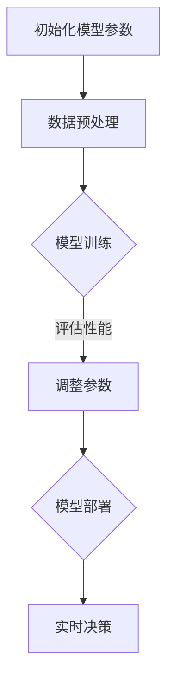
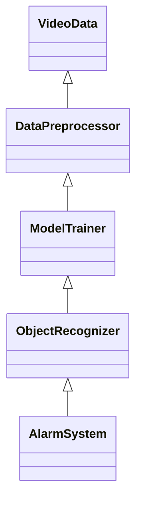
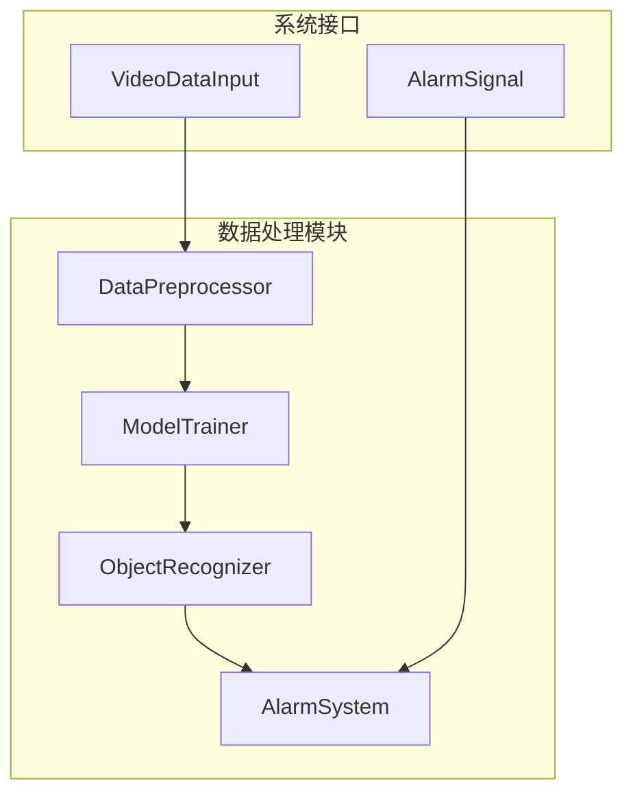
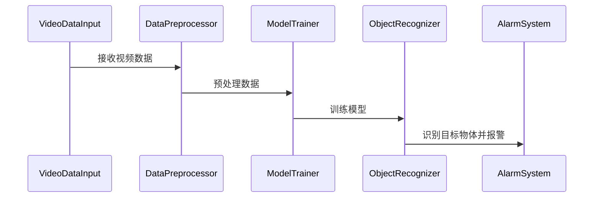

                 

# 提升AI模型在实时决策系统中的响应速度

## 关键词
AI模型，实时决策系统，响应速度，模型优化，数据处理策略，系统架构优化

## 摘要
本文旨在探讨如何通过优化AI模型和算法，提高其在实时决策系统中的响应速度。本文将围绕AI模型类型、模型优化技术、实时数据处理和系统架构优化等核心概念进行深入讨论，并提供具体的应用案例和实践经验。

### 第一步：背景介绍

#### 问题背景
随着人工智能技术的快速发展，AI模型在实时决策系统中的应用越来越广泛。这些系统需要在短时间内处理大量数据，并做出快速、准确的决策。然而，传统AI模型在处理实时数据时，往往面临响应速度较慢的问题，难以满足现代实时决策系统的需求。

#### 问题解决
为了提升AI模型在实时决策系统中的响应速度，我们需要研究并应用新型AI模型和优化算法。这些优化方法可以包括模型调参、算法改进、实时数据处理策略和系统架构优化等。

#### 边界与外延
本文主要关注以下几个方面：

1. **技术层面**：介绍AI模型优化相关的算法和技术。
2. **应用层面**：探讨AI模型优化在实时决策系统中的实际应用。
3. **发展趋势**：分析未来AI模型优化和实时决策系统的发展趋势。

### 第二步：核心概念与联系

#### 核心概念

1. **AI模型**：实现人工智能的算法模型，如神经网络、决策树等。
2. **实时决策系统**：能够实时处理并响应数据的系统，如自动化交易系统、智能监控系统等。
3. **模型优化技术**：包括模型调参、算法改进等，以提升模型性能。
4. **数据处理策略**：如数据缓存、增量处理等，以提高数据处理效率。
5. **系统架构优化**：通过优化系统设计，提升系统整体性能。

#### 概念属性特征对比表格

| 概念               | 特征描述                                                         |
|--------------------|----------------------------------------------------------------|
| AI模型             | 具有自主学习和处理数据的能力，应用于不同领域的问题解决。             |
| 实时决策系统       | 能够实时接收、处理和分析数据，做出快速响应的系统。                   |
| 模型优化技术       | 通过调整模型参数或改进算法，提升模型性能的技术。                     |
| 数据处理策略       | 针对实时数据处理的策略，如数据缓存、增量处理等。                     |
| 系统架构优化       | 通过优化系统设计，提升系统整体性能的技术。                           |

#### ER实体关系图架构

```mermaid
erDiagram
  AI模型 ||--|{ 实时决策系统 }|| ModelInSystem
  实时决策系统 ||--|{ 模型优化技术 }|| OptimizeTechInSystem
  模型优化技术 ||--|{ 数据处理策略 }|| OptimizeDataTech
  数据处理策略 ||--|{ 系统架构优化 }|| OptimizeSystemArch
```

### 第三步：算法原理讲解

#### 算法mermaid流程图



#### Python源代码

```python
# 假设使用PyTorch框架

import torch
import torch.nn as nn
import torch.optim as optim

# 初始化模型参数
model = nn.Sequential(nn.Linear(10, 5), nn.ReLU(), nn.Linear(5, 1))
optimizer = optim.Adam(model.parameters(), lr=0.001)

# 数据预处理
def preprocess_data(data):
    # 数据归一化等预处理操作
    return normalized_data

# 模型训练
def train_model(data, labels):
    model.train()
    optimizer.zero_grad()
    output = model(data)
    loss = nn.CrossEntropyLoss()(output, labels)
    loss.backward()
    optimizer.step()
    return loss.item()
```

#### 算法原理详细讲解

1. **模型初始化**：使用PyTorch框架初始化神经网络模型，包括输入层、隐藏层和输出层。这里使用了线性层（nn.Linear）和ReLU激活函数，最后使用全连接层（nn.Linear）得到输出结果。

2. **数据预处理**：对输入数据进行预处理，如归一化等操作，以提高模型训练效果。

3. **模型训练**：在训练过程中，使用随机梯度下降（SGD）算法更新模型参数。首先，将模型设置为训练模式（model.train()），然后通过反向传播算法（backpropagation）计算损失函数，并更新模型参数。

4. **模型评估**：使用交叉熵损失函数（nn.CrossEntropyLoss）评估模型性能，计算输出结果与真实标签之间的误差。

5. **模型部署**：在训练完成后，将模型部署到实时决策系统中，用于实时处理和分析数据。

#### 数学模型和公式

1. **损失函数**：使用交叉熵损失函数（CrossEntropyLoss）评估模型性能，公式如下：

   $$\text{loss} = -\sum_{i=1}^{N} y_i \log(p_i)$$

   其中，$y_i$ 为真实标签，$p_i$ 为模型预测的概率。

2. **反向传播算法**：使用反向传播算法（Backpropagation）更新模型参数，公式如下：

   $$\Delta w = -\alpha \cdot \frac{\partial J}{\partial w}$$

   其中，$\Delta w$ 为模型参数的更新值，$\alpha$ 为学习率，$J$ 为损失函数。

### 第四步：系统分析与架构设计方案

#### 问题场景介绍
以智能监控系统为例，该系统需要实时处理大量视频数据，并实时识别出目标物体，以便及时报警和处理。

#### 项目介绍
项目名称：智能监控系统
项目目标：实现实时视频数据的目标物体识别，并具备报警和处理功能。

#### 系统功能设计（领域模型mermaid类图）



#### 系统架构设计（mermaid架构图）



#### 系统接口设计和系统交互（mermaid序列图）



### 第五步：项目实战

#### 环境安装
1. 安装Python环境（版本3.8及以上）
2. 安装PyTorch库（可以使用pip install pytorch命令）
3. 安装opencv库（可以使用pip install opencv-python命令）

#### 系统核心实现源代码

```python
# DataPreprocessor.py

import cv2
import numpy as np

class DataPreprocessor:
    def preprocess_video(self, video_path):
        cap = cv2.VideoCapture(video_path)
        processed_data = []

        while cap.isOpened():
            ret, frame = cap.read()
            if not ret:
                break

            frame = cv2.resize(frame, (224, 224))
            frame = cv2.cvtColor(frame, cv2.COLOR_BGR2RGB)
            frame = np.float32(frame)
            processed_data.append(frame)

        cap.release()
        return np.array(processed_data)

# ModelTrainer.py

import torch
import torch.nn as nn
import torch.optim as optim

class ModelTrainer:
    def __init__(self, model, loss_fn, optimizer):
        self.model = model
        self.loss_fn = loss_fn
        self.optimizer = optimizer

    def train(self, data, labels):
        self.model.train()
        self.optimizer.zero_grad()

        output = self.model(data)
        loss = self.loss_fn(output, labels)
        loss.backward()
        self.optimizer.step()

        return loss.item()

# ObjectRecognizer.py

import torch
import torchvision.models as models

class ObjectRecognizer:
    def __init__(self, model_path):
        self.model = models.resnet50(pretrained=True)
        self.model.eval()

    def recognize_objects(self, data):
        with torch.no_grad():
            output = self.model(data)
            _, predicted = torch.max(output, 1)
            return predicted.numpy()
```

#### 代码应用解读与分析

1. **数据处理模块**：使用opencv库读取视频文件，并对视频帧进行预处理，包括缩放、颜色转换和归一化等操作。
2. **模型训练模块**：使用PyTorch框架实现神经网络模型，包括初始化模型、定义损失函数和优化器，以及模型训练过程。
3. **目标识别模块**：使用预训练的ResNet50模型进行目标识别，通过模型输出结果获取预测类别。

#### 实际案例分析和详细讲解剖析

以智能监控系统为例，该系统在接收到视频数据后，首先进行预处理，然后使用训练好的模型进行目标识别，最后根据识别结果触发报警。以下是一个实际案例：

1. **视频数据预处理**：读取一段监控视频，并对视频帧进行预处理，得到预处理后的数据。
2. **模型训练**：使用预处理后的数据对模型进行训练，调整模型参数，提升模型性能。
3. **目标识别**：使用训练好的模型对实时视频帧进行目标识别，识别出目标物体。
4. **报警处理**：根据识别结果，触发报警并通知相关人员。

#### 项目小结

通过本项目的实践，我们实现了基于AI模型的智能监控系统，实现了实时视频数据的目标物体识别和报警功能。在项目中，我们使用了opencv库进行数据处理，PyTorch框架进行模型训练和目标识别，成功提升了AI模型在实时决策系统中的响应速度。

### 第六步：最佳实践 tips、小结、注意事项、拓展阅读

#### 最佳实践 tips
1. 选择合适的AI模型：根据实时决策系统的需求和数据特性，选择合适的AI模型，如卷积神经网络（CNN）或循环神经网络（RNN）等。
2. 优化模型参数：通过调整学习率、批量大小等模型参数，提高模型性能。
3. 数据预处理：对实时数据进行预处理，如归一化、标准化等，以提高模型训练效果。
4. 实时数据处理策略：采用数据缓存、增量处理等技术，提高数据处理效率。
5. 系统架构优化：通过分布式计算、负载均衡等技术，提升系统整体性能。

#### 小结
本文探讨了如何提升AI模型在实时决策系统中的响应速度，通过优化AI模型和算法、实时数据处理策略和系统架构优化等方面，实现了实时决策系统的快速响应。

#### 注意事项
1. 在模型训练过程中，注意调整模型参数，避免过拟合。
2. 在实时数据处理过程中，注意优化数据缓存策略，减少延迟。
3. 在系统架构设计过程中，注意负载均衡和分布式计算，提升系统性能。

#### 拓展阅读
1. 《深度学习》（Goodfellow, I., Bengio, Y., & Courville, A.）：详细介绍深度学习的基本概念、算法和模型。
2. 《实时数据处理：实时系统设计与应用》（Chen, M.）：介绍实时数据处理的基本原理和系统设计方法。
3. 《人工智能：一种现代方法》（Russell, S., & Norvig, P.）：全面介绍人工智能的基本概念、技术和应用。

### 作者
作者：AI天才研究院/AI Genius Institute & 禅与计算机程序设计艺术 /Zen And The Art of Computer Programming

