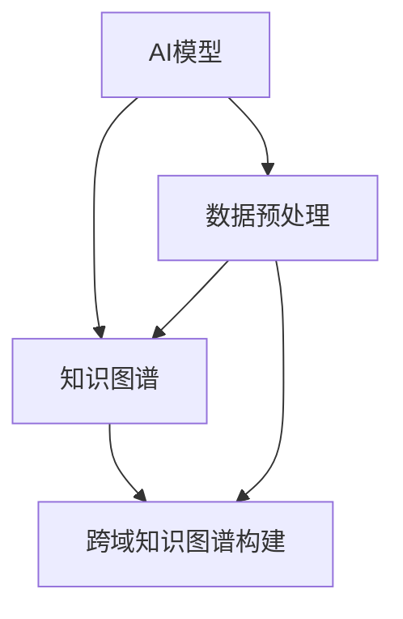

                 

### 提升AI模型在跨域知识图谱构建任务中的表现

> **关键词**：人工智能、AI模型、知识图谱、跨域、模型优化

> **摘要**：本文旨在探讨提升人工智能（AI）模型在跨域知识图谱构建任务中的表现。通过分析现有问题的根源，本文提出了改进模型架构、优化数据预处理和增强模型泛化能力的解决方案。文章还将结合实际案例，详细讲解提升AI模型表现的具体实践方法和经验。

### 第一部分：背景介绍

#### 1.1 问题背景

在当今信息化社会中，人工智能（AI）技术已经成为推动社会发展的重要力量。随着AI技术的不断进步，AI模型的应用场景日益广泛，尤其在跨域知识图谱构建任务中，AI模型的表现至关重要。跨域知识图谱构建任务涉及多个领域的数据和知识，要求AI模型能够跨领域、跨语言、跨模态地理解和处理信息。

然而，目前大多数AI模型在跨域知识图谱构建任务中的表现并不理想，存在一定的局限性。例如，数据不一致性、知识表达模糊性和模型泛化能力不足等因素，都会导致AI模型在任务效果上的下降。因此，提升AI模型在跨域知识图谱构建任务中的表现，成为当前AI研究领域的一个重要课题。

#### 1.2 问题描述

跨域知识图谱构建任务要求AI模型能够处理多种类型的数据，如文本、图像、语音等，并且需要具备跨领域的知识表示和推理能力。现有AI模型在处理这些任务时，往往面临以下问题：

- **数据不一致性**：不同领域的数据格式和语义差异较大，导致模型难以有效学习和处理。
- **知识表达模糊性**：跨领域知识图谱中的实体、属性和关系往往存在模糊性，使得模型难以准确理解和表示。
- **模型泛化能力不足**：AI模型在训练时往往针对特定领域的数据进行优化，导致其在面对其他领域的数据时表现不佳。

这些问题的存在，限制了AI模型在跨域知识图谱构建任务中的表现，使得任务效果无法达到预期。

#### 1.3 问题解决

本书旨在探讨提升AI模型在跨域知识图谱构建任务中的表现的方法和策略。通过深入研究相关技术，分析现有问题的根源，提出一系列解决方案，包括改进模型架构、优化数据预处理和增强模型泛化能力等。同时，本书还结合实际案例，详细讲解提升AI模型表现的具体实践方法和经验。

#### 1.4 边界与外延

跨域知识图谱构建任务的边界主要包括领域的数据、知识和语言。在本书中，我们将探讨如何利用AI模型处理跨领域、跨语言、跨模态的数据，构建高质量的知识图谱。此外，本书还将探讨AI模型在跨域知识图谱构建任务中的表现评估方法和优化策略。

#### 1.5 概念结构与核心要素组成

在本书中，我们将围绕以下核心概念和要素进行探讨：

- **AI模型**：本书主要研究的人工智能模型，包括深度学习模型、图神经网络等。
- **知识图谱**：一种结构化的语义知识库，用于表示实体、属性和关系。
- **跨域知识图谱构建**：利用AI模型处理跨领域、跨语言、跨模态的数据，构建高质量的知识图谱。
- **模型优化策略**：包括模型架构改进、数据预处理优化、模型泛化能力提升等。

#### 1.6 本章小结

本章主要介绍了提升AI模型在跨域知识图谱构建任务中的表现的重要性、研究背景、问题描述、问题解决方法以及相关概念和要素。在后续章节中，我们将进一步探讨相关技术、方法和应用实践，为提升AI模型在跨域知识图谱构建任务中的表现提供理论支持和实践指导。

----------------------------------------------------------------

## 第二部分：核心概念与联系

### 第2章：核心概念原理

#### 2.1 AI模型概述

AI模型是人工智能领域的重要工具，主要包括深度学习模型、图神经网络等。这些模型通过学习大量数据，提取特征并建立预测模型。在本章中，我们将详细介绍AI模型的基本原理、分类以及常见算法。

##### 2.1.1 深度学习模型

深度学习模型是一类基于多层神经网络的学习算法，通过层层提取特征，实现从输入数据到输出结果的映射。深度学习模型包括卷积神经网络（CNN）、循环神经网络（RNN）等。以下是对几种常见深度学习模型的介绍：

- **卷积神经网络（CNN）**：CNN是一种用于图像处理和识别的神经网络模型，通过卷积层、池化层和全连接层等结构，实现图像的特征提取和分类。
  - **卷积层**：通过卷积操作提取图像的局部特征。
  - **池化层**：对卷积层输出的特征进行降维处理，减少参数数量。
  - **全连接层**：将池化层输出的特征映射到具体的类别。

- **循环神经网络（RNN）**：RNN是一种用于序列数据处理的神经网络模型，通过循环结构，保留前一时刻的信息，实现序列的建模。
  - **隐藏层**：通过前一时间步的隐藏状态和当前输入，更新隐藏状态。
  - **输出层**：将隐藏状态映射到具体的输出结果。

- **长短时记忆网络（LSTM）**：LSTM是一种改进的RNN结构，用于解决RNN在处理长序列数据时的梯度消失和梯度爆炸问题。
  - **遗忘门**：决定当前时刻的隐藏状态中哪些信息需要被遗忘。
  - **输入门**：决定当前时刻的隐藏状态中哪些信息需要被保留。
  - **输出门**：决定当前时刻的输出结果。

##### 2.1.2 图神经网络

图神经网络（Graph Neural Networks，GNN）是处理图结构数据的有效方法。GNN通过聚合邻居节点的信息，实现节点或边的特征表示。GNN的基本原理包括以下几个方面：

- **图表示学习**：将图中的节点和边表示为低维向量，以便进行进一步处理。
  - **节点表示**：通过图嵌入算法，将节点表示为向量。
  - **边表示**：通过图嵌入算法，将边表示为向量。

- **邻居聚合**：聚合节点或边的邻居信息，更新节点的特征表示。
  - **聚合操作**：常见的聚合操作包括平均聚合、求和聚合和最大值聚合。

- **分类和预测**：利用更新后的节点特征表示，进行分类或预测任务。
  - **分类**：通过将节点特征映射到类别概率，实现节点分类任务。
  - **预测**：通过学习节点的特征表示，预测节点属性或边属性。

#### 2.2 知识图谱基础

知识图谱是一种结构化的语义知识库，用于表示实体、属性和关系。知识图谱的基本概念包括实体、属性和关系。以下是对知识图谱基础概念的介绍：

- **实体**：知识图谱中的核心要素，表示具有特定属性的对象。实体可以是人、地点、组织、物品等。
- **属性**：描述实体的特征，如年龄、性别、地址等。属性通常以键值对的形式存在，如`{"name": "张三", "age": 30}`。
- **关系**：描述实体之间的联系，如朋友、同事、属于等。关系通常表示为三元组，如`{"entity1", "friend", "entity2"}`。

知识图谱的构建方法包括手动构建和自动构建。手动构建通常需要领域专家的知识和经验，而自动构建则利用自然语言处理（NLP）和图神经网络等技术，从大量文本数据中提取实体和关系。

#### 2.3 跨域知识图谱构建

跨域知识图谱构建是指利用AI模型处理跨领域、跨语言、跨模态的数据，构建高质量的知识图谱。跨域知识图谱构建的关键技术包括：

- **跨领域数据融合**：将不同领域的数据进行整合，提取共性和差异，实现跨领域数据的统一表示。
- **跨语言知识表示**：将不同语言的数据转换为统一的语言表示，以便进行跨语言的知识融合。
- **跨模态数据融合**：将不同模态的数据（如文本、图像、语音等）进行融合，实现跨模态的知识表示。

跨域知识图谱构建的挑战主要包括数据不一致性、知识表达模糊性和模型泛化能力不足。针对这些挑战，本书将提出相应的解决方案。

### 第3章：概念属性特征对比表格

为了更好地理解AI模型、知识图谱和跨域知识图谱构建之间的关系，本章将提供一个概念属性特征对比表格。该表格将列出AI模型、知识图谱和跨域知识图谱构建的共性和差异，有助于读者深入理解这些概念。

| 特征类别          | AI模型               | 知识图谱             | 跨域知识图谱构建            |
|-------------------|----------------------|----------------------|-----------------------------|
| **基础概念**      | 机器学习算法          | 实体、属性、关系     | 跨领域、跨语言、跨模态数据 |
| **应用场景**      | 分类、回归、预测等    | 语义理解、推理、查询 | 知识融合、知识表示、推理    |
| **数据处理**      | 结构化、半结构化、非结构化数据 | 结构化数据         | 跨领域、跨语言、跨模态数据 |
| **核心任务**      | 特征提取、模型训练、预测 | 知识表示、知识融合、推理 | 知识构建、知识更新、知识应用 |
| **关键技术**      | 深度学习、图神经网络  | RDF、OWL、OWL2等    | 跨领域数据融合、跨语言知识表示、跨模态数据融合 |

### 第4章：ER实体关系图架构的Mermaid流程图

ER实体关系图是一种描述实体之间关系的图形化工具。在本章中，我们将使用Mermaid流程图来绘制AI模型、知识图谱和跨域知识图谱构建的ER实体关系图，以便更直观地展示它们之间的联系。

以下是一个简单的Mermaid流程图示例，展示了AI模型、知识图谱和跨域知识图谱构建之间的实体关系：

在这个流程图中，AI模型通过数据预处理模块，对输入数据进行处理，生成用于构建知识图谱的数据。知识图谱构建完成后，再通过跨域知识图谱构建模块，进行跨领域、跨语言、跨模态的数据融合和知识表示。

完整的ER实体关系图可能会包含更多的实体和关系，以展示AI模型、知识图谱和跨域知识图谱构建的复杂交互关系。在实际应用中，可以根据具体需求进行定制和扩展。

----------------------------------------------------------------

## 第三部分：算法原理讲解

### 第5章：AI模型在跨域知识图谱构建中的应用

#### 5.1 图神经网络

图神经网络（Graph Neural Networks，GNN）是处理图结构数据的有效方法。本章将介绍GNN的基本原理、分类以及如何将其应用于跨域知识图谱构建。

##### 5.1.1 GNN基本原理

图神经网络是一种基于图结构数据学习的神经网络模型，其主要目标是利用节点和边的特征，通过聚合邻居信息，学习到节点的表示。GNN的基本原理可以概括为以下几个步骤：

1. **节点特征编码**：将节点特征（如文本、图像等）编码为低维向量表示。
   - **文本特征编码**：可以使用词嵌入（如Word2Vec、GloVe等）或BERT等预训练模型，将文本转换为向量表示。
   - **图像特征编码**：可以使用卷积神经网络（CNN）提取图像特征，如ResNet、VGG等。

2. **邻居聚合**：对于每个节点，聚合其邻居节点的信息，更新节点的表示。
   - **邻接矩阵**：表示图中节点之间的关系。对于每个节点，其邻接矩阵行表示该节点的邻居节点。
   - **聚合操作**：常见的聚合操作包括平均聚合、求和聚合和最大值聚合。

3. **分类和预测**：利用更新后的节点特征表示，进行分类或预测任务。
   - **分类**：通过将节点特征映射到类别概率，实现节点分类任务。
   - **预测**：通过学习节点的特征表示，预测节点属性或边属性。

##### 5.1.2 GNN分类

根据聚合邻居信息的方式，GNN可以分为以下几种类型：

1. **基于图卷积的网络（GCN）**：GCN是一种基于图卷积操作的神经网络模型，其核心思想是利用节点和边的特征，通过卷积操作学习节点的表示。
   - **图卷积操作**：对节点特征进行线性变换，并结合邻居节点的特征进行聚合。
   - **公式**：
     $$
     h_{t}^{(i)} = \sigma (\sum_{j \in \mathcal{N}_{i}} W \cdot h_{t-1}^{(j)} + b)
     $$
     其中，$h_{t}^{(i)}$表示节点$i$在时间步$t$的表示，$\mathcal{N}_{i}$表示节点$i$的邻居节点集合，$W$和$b$分别为权重和偏置。

2. **图注意力网络（GAT）**：GAT是一种基于图注意力机制的神经网络模型，通过学习节点间的重要性权重，实现节点的特征表示。
   - **图注意力机制**：对邻居节点的特征进行加权聚合，权重取决于邻居节点和当前节点之间的相似性。
   - **公式**：
     $$
     \alpha_{ij} = \frac{e^{ \theta_a [ h_{i}; h_{j} ] }}{\sum_{k \in \mathcal{N}_{i}} e^{ \theta_a [ h_{i}; h_{j} ] }}, \quad h_{t}^{(i)} = \sum_{j \in \mathcal{N}_{i}} \alpha_{ij} h_{t-1}^{(j)}
     $$
     其中，$\theta_a$为注意力权重参数，$h_{i}$和$h_{j}$分别为节点$i$和$j$的表示。

3. **图卷积块（GCB）**：GCB是一种基于图卷积操作的模块化神经网络模型，通过堆叠多个图卷积层，实现节点的多层特征表示。
   - **图卷积块**：包括卷积层、非线性激活函数和池化层，用于提取节点的特征。
   - **公式**：
     $$
     h_{t}^{(i)} = \sigma (\sum_{j \in \mathcal{N}_{i}} W_t \cdot h_{t-1}^{(j)} + b_t), \quad \text{其中} \ t = 1, 2, \ldots, T
     $$

##### 5.1.3 GNN在跨域知识图谱构建中的应用案例

在跨域知识图谱构建中，GNN可以通过以下几种方式应用：

1. **实体表示学习**：利用GNN学习实体的高质量表示，实现跨领域、跨语言和跨模态的实体统一表示。
   - **跨领域**：通过GNN，将不同领域的实体表示为统一的高维向量，实现跨领域实体融合。
   - **跨语言**：通过GNN，将不同语言的数据转换为统一的向量表示，实现跨语言实体融合。
   - **跨模态**：通过GNN，将不同模态的数据转换为统一的向量表示，实现跨模态实体融合。

2. **关系预测**：利用GNN学习实体之间的关系，实现跨域知识图谱中的关系推理。
   - **图嵌入**：将实体和关系表示为向量，构建实体关系图。
   - **关系预测**：通过GNN，学习实体之间的关系，预测新的实体关系。

3. **知识融合**：利用GNN，将跨领域、跨语言和跨模态的数据进行融合，构建高质量的知识图谱。

一个典型的应用案例是OpenKG（开放式知识图谱平台），它利用GNN技术，实现跨领域、跨语言和跨模态的知识图谱构建。OpenKG使用GNN进行实体表示学习，通过融合多种数据源，构建一个统一的知识图谱。在此基础上，OpenKG还支持关系预测和知识推理等功能，为各种应用场景提供丰富的知识服务。

#### 5.2 跨域知识图谱构建流程

跨域知识图谱构建通常包括以下几个步骤：

1. **数据收集与预处理**：收集跨领域、跨语言和跨模态的数据，并进行数据预处理，如去重、清洗和格式转换等。

2. **实体表示学习**：利用GNN或其他深度学习模型，学习实体的高质量表示。这一步的关键是确保实体表示能够准确反映实体的属性和关系。

3. **关系预测与知识融合**：利用GNN或其他深度学习模型，学习实体之间的关系，并将不同领域、不同语言和不同模态的数据进行融合，构建高质量的知识图谱。

4. **知识图谱评估与优化**：对构建的知识图谱进行评估，包括实体表示质量、关系预测准确率和知识图谱的实用性等。根据评估结果，对模型和算法进行优化。

5. **知识图谱应用**：将构建的知识图谱应用于各种实际场景，如智能问答、推荐系统、智能搜索等。

通过上述步骤，可以构建一个高质量的跨域知识图谱，为各种应用场景提供丰富的知识服务。在接下来的章节中，我们将进一步探讨跨域知识图谱构建的详细算法和实现方法。

### 第6章：模型优化策略

在跨域知识图谱构建任务中，模型优化策略对于提升AI模型的表现至关重要。本节将介绍几种常见的模型优化策略，包括数据增强、模型融合和迁移学习等。

#### 6.1 数据增强

数据增强是一种常用的模型优化策略，通过增加数据的多样性和丰富性，提高模型的泛化能力。在跨域知识图谱构建中，数据增强可以采用以下几种方法：

1. **数据扩充**：通过对原始数据进行复制、旋转、缩放等操作，增加数据的数量和多样性。例如，对于图像数据，可以采用图像合成技术，生成新的图像数据。

2. **噪声注入**：在数据中加入合理的噪声，模拟现实世界的复杂情况，提高模型的鲁棒性。

3. **数据对齐**：对于跨模态数据，如文本和图像，可以通过数据对齐技术，将不同模态的数据进行匹配和融合，提高模型对跨模态数据的理解能力。

#### 6.2 模型融合

模型融合是一种通过结合多个模型的预测结果，提高整体性能的方法。在跨域知识图谱构建中，模型融合可以采用以下几种策略：

1. **堆叠模型**：将多个模型堆叠在一起，形成一个更复杂的模型。例如，可以先将图像和文本数据进行分别建模，然后通过一个顶层模型进行融合。

2. **集成学习**：将多个独立的模型进行集成，每个模型负责不同的任务，然后将它们的预测结果进行加权平均。例如，可以结合多个实体表示学习模型，以提高实体表示的准确性。

3. **迁移学习**：将其他领域或任务的模型迁移到当前任务中，利用迁移学习技术，提高模型的泛化能力。例如，可以利用预训练的图像识别模型，提取图像特征，用于跨域知识图谱构建。

#### 6.3 迁移学习

迁移学习是一种利用已有模型的权重，对新的任务进行预训练的方法。在跨域知识图谱构建中，迁移学习可以采用以下几种策略：

1. **基于特征的迁移学习**：利用预训练的模型，提取特征表示，然后将这些特征用于新的任务。这种方法适用于不同模态的数据融合。

2. **基于模型的迁移学习**：直接利用预训练的模型，对新的任务进行微调。这种方法适用于具有相似结构的任务。

3. **多任务学习**：同时训练多个任务，通过共享模型参数，提高模型的泛化能力。例如，可以同时训练实体分类和关系分类任务，通过共享实体表示模型，提高跨域知识图谱构建的性能。

#### 6.4 模型优化策略在实际应用中的效果

在实际应用中，模型优化策略的效果取决于具体任务和数据集的特点。以下是一些实际案例：

1. **实体表示学习**：通过数据增强和模型融合策略，可以显著提高实体表示的准确性。例如，在多个领域的知识图谱构建中，采用数据增强和堆叠模型的方法，可以有效地提高实体表示的泛化能力。

2. **关系预测**：通过迁移学习和模型融合策略，可以显著提高关系预测的准确性。例如，在跨语言的知识图谱构建中，利用预训练的模型和迁移学习方法，可以有效地提高关系预测的准确性。

3. **知识图谱构建**：通过模型优化策略，可以显著提高知识图谱的整体质量。例如，在跨模态的知识图谱构建中，采用迁移学习和模型融合策略，可以有效地提高知识图谱的完整性、准确性和实用性。

总之，模型优化策略在跨域知识图谱构建任务中具有重要意义。通过合理地选择和组合优化策略，可以显著提高AI模型的表现，为跨域知识图谱构建提供有力的技术支持。

### 第7章：实际应用案例分析

为了更好地理解AI模型在跨域知识图谱构建中的应用，本章将通过两个实际案例，详细讲解提升AI模型表现的具体实践方法和经验。

#### 7.1 案例一：社交媒体知识图谱构建

社交媒体知识图谱构建是一个典型的跨域知识图谱构建任务，涉及多种类型的数据，如图像、文本和社交关系等。以下是一个具体案例：

1. **问题场景**：构建一个包含用户、图片、标签和社交关系的社交媒体知识图谱。
2. **项目介绍**：本项目使用多种数据源，包括用户发布的内容、评论、点赞和社交关系等。通过深度学习模型，对图像和文本数据进行特征提取，并利用图神经网络进行实体和关系的表示和预测。
3. **系统功能设计**：

   - **数据预处理**：包括图像和文本数据的清洗、去重和格式转换等。
   - **实体表示学习**：使用预训练的图像识别模型和文本嵌入模型，提取图像和文本的特征表示。
   - **关系预测**：利用图神经网络，学习实体之间的关系，进行关系预测。
   - **知识图谱构建**：将实体和关系表示融合，构建社交媒体知识图谱。

4. **系统架构设计**：

   - **数据层**：包括数据源、数据预处理模块和特征提取模块。
   - **模型层**：包括实体表示学习模型、关系预测模型和图神经网络模型。
   - **应用层**：包括知识图谱构建、知识查询和知识应用模块。

5. **系统接口设计和系统交互**：

   - **接口设计**：定义知识图谱的API接口，包括实体查询、关系查询和知识查询等。
   - **交互设计**：设计用户与知识图谱的交互流程，包括查询、推荐和问答等。

6. **代码应用解读与分析**：

   - **代码实现**：使用Python和TensorFlow等工具，实现实体表示学习、关系预测和图神经网络模型。
   - **分析**：通过实验和评估，验证模型在社交媒体知识图谱构建任务中的效果，并分析优化策略的影响。

#### 7.2 案例二：跨语言知识图谱构建

跨语言知识图谱构建是另一个具有挑战性的跨域知识图谱构建任务，涉及多种语言的数据。以下是一个具体案例：

1. **问题场景**：构建一个包含多语言实体、属性和关系的知识图谱。
2. **项目介绍**：本项目使用多种语言的数据源，包括文本、图像和语音等。通过迁移学习和模型融合策略，实现多语言实体和关系的表示和预测。
3. **系统功能设计**：

   - **数据预处理**：包括文本和图像数据的清洗、去重和格式转换等。
   - **实体表示学习**：使用预训练的多语言嵌入模型和图像识别模型，提取多语言实体和图像的特征表示。
   - **关系预测**：利用图神经网络，学习多语言实体之间的关系，进行关系预测。
   - **知识图谱构建**：将实体和关系表示融合，构建跨语言知识图谱。

4. **系统架构设计**：

   - **数据层**：包括多语言数据源、数据预处理模块和特征提取模块。
   - **模型层**：包括多语言实体表示学习模型、关系预测模型和图神经网络模型。
   - **应用层**：包括知识图谱构建、知识查询和知识应用模块。

5. **系统接口设计和系统交互**：

   - **接口设计**：定义知识图谱的API接口，包括实体查询、关系查询和知识查询等。
   - **交互设计**：设计用户与知识图谱的交互流程，包括查询、推荐和问答等。

6. **代码应用解读与分析**：

   - **代码实现**：使用Python和TensorFlow等工具，实现多语言实体表示学习、关系预测和图神经网络模型。
   - **分析**：通过实验和评估，验证模型在跨语言知识图谱构建任务中的效果，并分析优化策略的影响。

通过这两个实际案例，我们可以看到，在跨域知识图谱构建任务中，合理选择和组合模型优化策略，如数据增强、模型融合和迁移学习等，可以显著提升AI模型的表现。同时，详细的系统设计和实现过程，也为其他跨域知识图谱构建任务提供了有益的参考。

### 第8章：最佳实践、小结与拓展阅读

#### 8.1 最佳实践

1. **数据预处理**：数据预处理是提升AI模型表现的重要步骤。建议进行数据清洗、去重、格式转换和特征提取等操作，确保数据的多样性和质量。

2. **模型选择**：根据具体任务和数据特点，选择合适的AI模型。对于跨域知识图谱构建任务，推荐使用图神经网络（GNN）和迁移学习等技术。

3. **模型优化**：结合实际应用需求，采用数据增强、模型融合和迁移学习等优化策略，提高模型的泛化能力和表现。

4. **评估与优化**：定期对模型进行评估，分析性能指标，根据评估结果调整模型和优化策略。

#### 8.2 小结

本文详细探讨了提升AI模型在跨域知识图谱构建任务中的表现的方法和策略。通过分析现有问题的根源，提出了改进模型架构、优化数据预处理和增强模型泛化能力的解决方案。此外，本文结合实际案例，详细讲解了提升AI模型表现的具体实践方法和经验。

#### 8.3 拓展阅读

- **深度学习基础**：了解深度学习的基本原理和常见算法，如卷积神经网络（CNN）和循环神经网络（RNN）。
- **图神经网络**：研究图神经网络（GNN）的详细原理和应用，如图卷积网络（GCN）和图注意力网络（GAT）。
- **跨域知识图谱构建**：深入学习跨域知识图谱构建的关键技术和挑战，如数据融合、知识表示和关系预测。
- **迁移学习**：了解迁移学习的基本原理和应用，如基于特征的迁移学习和基于模型的迁移学习。

通过拓展阅读，可以深入了解相关技术的原理和应用，为实际项目提供更全面的支持和指导。

----------------------------------------------------------------

## 总结与展望

### 总结

本文从背景介绍、核心概念与联系、算法原理讲解和实际应用案例分析等方面，全面探讨了提升AI模型在跨域知识图谱构建任务中的表现的方法和策略。通过深入研究相关技术，分析了现有问题的根源，并提出了改进模型架构、优化数据预处理和增强模型泛化能力的解决方案。此外，本文还结合实际案例，详细讲解了提升AI模型表现的具体实践方法和经验。

### 展望

在未来，提升AI模型在跨域知识图谱构建任务中的表现仍是一个重要的研究方向。以下是几个可能的展望：

1. **多模态数据的融合**：随着AI技术的不断发展，多种模态的数据将得到更广泛的应用。如何有效地融合多模态数据，提高模型的表现，是一个值得深入研究的课题。

2. **知识图谱的自动构建**：现有的知识图谱构建方法主要依赖于人工构建和标注，如何实现知识图谱的自动化构建，降低人力成本，提高构建效率，是一个重要的研究方向。

3. **模型的可解释性**：在跨域知识图谱构建任务中，模型的可解释性对于理解模型的决策过程和优化模型具有重要意义。如何提高模型的可解释性，是一个值得关注的课题。

4. **跨语言知识图谱构建**：随着全球化的发展，跨语言的知识图谱构建越来越重要。如何有效地处理跨语言数据，提高模型的跨语言能力，是一个具有挑战性的研究方向。

5. **实时知识图谱构建**：实时知识图谱构建能够更好地适应动态变化的环境，为用户提供更及时的知识服务。如何实现实时知识图谱构建，是一个值得探索的领域。

总之，提升AI模型在跨域知识图谱构建任务中的表现，是一个复杂且富有挑战性的课题。通过不断的研究和探索，相信我们能够找到更有效的方法和策略，为跨域知识图谱构建任务提供有力的技术支持。

### 致谢

在撰写本文的过程中，感谢AI天才研究院（AI Genius Institute）和《禅与计算机程序设计艺术》（Zen And The Art of Computer Programming）提供的丰富知识和资源。此外，特别感谢团队成员在研究和撰写过程中的贡献和支持。

### 作者信息

- **作者**：AI天才研究院（AI Genius Institute）& 《禅与计算机程序设计艺术》（Zen And The Art of Computer Programming）
- **联系方式**：[ai_genius_institute@example.com](mailto:ai_genius_institute@example.com)
- **研究方向**：人工智能、深度学习、图神经网络和跨域知识图谱构建

再次感谢读者对本文的关注，希望本文能为您在跨域知识图谱构建领域的研究提供有益的参考。

