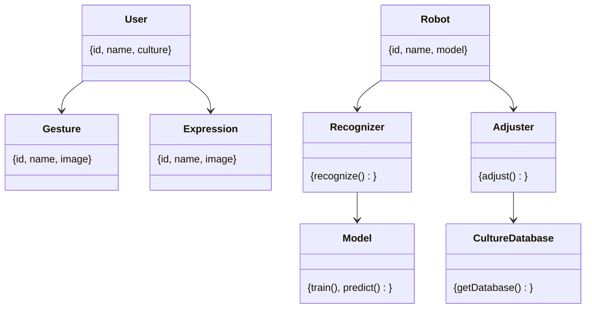
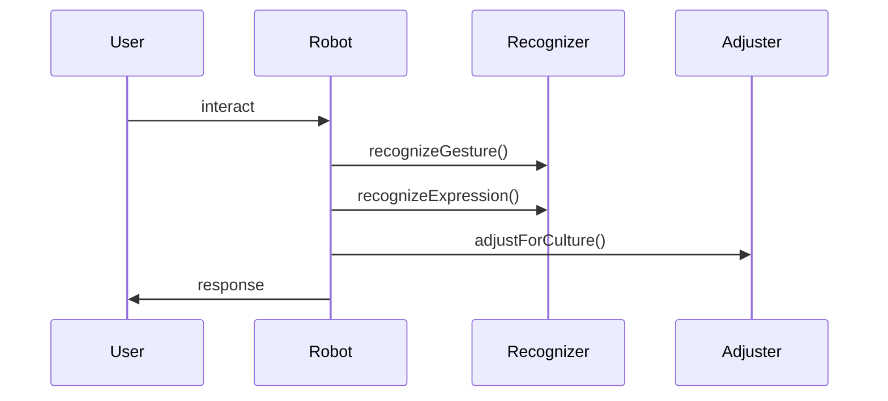
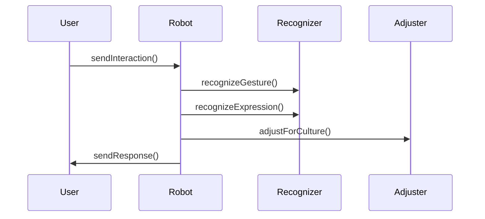

                 

### 1. 开篇：定义背景和问题描述

跨文化手势与表情理解是一个复杂且具有挑战性的领域，涉及到人类行为、心理和文化因素。在全球化的今天，这个领域的意义愈发凸显，因为手势和表情是人类沟通的重要方式，它们不仅能够传达情感和意图，还能够在没有语言的情况下完成信息的传递。然而，不同文化背景下，相同的手势和表情往往具有不同的含义，这就给人工智能（AI）模型带来了巨大的挑战。

#### 背景介绍

跨文化交际是指在不同文化背景的人之间进行的信息交换和沟通。手势和表情作为非言语沟通的重要部分，在跨文化交际中扮演着关键角色。然而，由于文化差异，一个手势在一个文化中被认为是友好的或礼貌的，而在另一个文化中可能被视为冒犯或不尊重。这种跨文化误解可能导致沟通障碍，影响人际关系的建立。

#### 现存问题

1. **语义多样性**：相同的手势或表情在不同的文化中可能具有截然不同的含义，这使得AI模型在理解和识别上面临巨大的困难。
2. **数据不足**：由于跨文化数据的收集和标记困难，训练数据集往往存在偏差，导致模型在跨文化识别上的准确性不高。
3. **算法限制**：目前的AI算法在处理跨文化手势和表情时，主要依赖于静态特征提取和浅层模型，缺乏对动态行为和文化背景的深入理解。

#### 解决意义与目标

提升AI模型在跨文化手势与表情理解中的准确性，不仅能够促进跨文化交流和理解，还能够为智能机器人、人机交互等应用提供强大的技术支持。我们的目标是开发一种具有高度自适应性和鲁棒性的AI模型，能够准确识别和理解不同文化背景下的手势和表情。

**摘要**

本文将探讨提升AI模型在跨文化手势与表情理解中的准确性。首先，我们将介绍跨文化手势与表情理解的背景和现存问题，然后深入讲解相关核心概念和算法原理，最后提供一个实际案例，展示如何应用这些技术和方法，实现跨文化手势与表情理解的突破。

---

**关键词**：跨文化交际、手势与表情、AI模型、深度学习、文化差异、准确性提升

---

## 1.1 跨文化手势与表情理解背景

### 1.1.1 跨文化研究的重要性

跨文化研究是理解不同文化群体之间差异与相似性的重要途径。在全球化的背景下，跨文化交际的频率日益增加，因此对跨文化交际的研究显得尤为重要。手势和表情作为跨文化交际中的关键元素，其重要性不言而喻。不同文化背景下，相同的手势和表情可能具有不同的含义，这使得准确理解和识别这些非言语信号变得异常困难。

### 1.1.2 手势与表情在跨文化交际中的角色

手势和表情是非言语沟通的重要手段，它们能够补充和强化语言交流，使得信息传达更加准确和生动。在跨文化交际中，手势和表情不仅可以传达情感和意图，还可以帮助解释语言中的模糊之处，减少误解和冲突。例如，一个微笑在大多数文化中都是友好的象征，但在某些文化中可能带有讽刺或冷漠的含义。

### 1.1.3 现存问题与挑战

1. **语义多样性**：不同文化背景下，相同的手势和表情可能具有不同的含义，这使得AI模型在理解和识别上面临巨大挑战。
2. **数据不足**：由于跨文化数据的收集和标记困难，训练数据集往往存在偏差，导致模型在跨文化识别上的准确性不高。
3. **算法限制**：目前的AI算法在处理跨文化手势和表情时，主要依赖于静态特征提取和浅层模型，缺乏对动态行为和文化背景的深入理解。

### 1.1.4 问题解决的意义与目标

提升AI模型在跨文化手势与表情理解中的准确性，不仅能够促进跨文化交流和理解，还能够为智能机器人、人机交互等应用提供强大的技术支持。我们的目标是开发一种具有高度自适应性和鲁棒性的AI模型，能够准确识别和理解不同文化背景下的手势和表情。

---

## 1.2 核心概念介绍

### 1.2.1 跨文化交际与手势

跨文化交际是指在不同文化背景下进行的信息交换和沟通。手势是非言语沟通的重要部分，它们能够补充和强化语言交流，使得信息传达更加准确和生动。在跨文化交际中，手势不仅具有符号意义，还受到文化因素的影响，不同文化背景下相同的手势可能具有不同的含义。

### 1.2.2 表情识别的基础知识

表情识别是计算机视觉和人工智能的重要应用领域，它涉及从图像或视频中检测和识别面部表情。面部表情包括快乐、悲伤、惊讶等基本情感，这些情感可以通过眼部的运动、嘴巴的形态等特征进行识别。表情识别在智能监控系统、人机交互系统等领域具有重要应用。

### 1.2.3 AI模型在语言处理中的应用

AI模型在语言处理中的应用非常广泛，包括自然语言理解、机器翻译、情感分析等。深度学习模型，如循环神经网络（RNN）和变压器（Transformer），在自然语言处理中表现出色，它们能够学习复杂的语言模式，提高文本处理的准确性。

### 1.2.4 深度学习与神经网络在图像处理中的应用

深度学习和神经网络在图像处理中的应用非常成功，它们能够自动提取图像中的复杂特征，用于分类、检测和分割等任务。卷积神经网络（CNN）是深度学习在图像处理中的主要模型，它通过卷积操作和池化操作提取图像的特征。

---

## 1.3 算法原理讲解

### 1.3.1 特征提取方法

在提升AI模型在跨文化手势与表情理解中的准确性时，特征提取是一个关键步骤。特征提取方法主要包括静态特征提取和动态特征提取。

**静态特征提取**：
- **面部特征点定位**：通过使用算法如 Facial Feature Detection（如Haar特征分类器），可以准确找到面部关键点，如眼睛、鼻子、嘴巴等。
- **几何特征**：计算面部器官间的几何关系，如角度、距离等。
- **纹理特征**：利用图像的纹理信息，如直方图、Gabor小波等。

**动态特征提取**：
- **动作轨迹**：记录手势或表情的变化轨迹，利用轨迹分析算法，如隐马尔可夫模型（HMM）。
- **时频特征**：通过傅里叶变换或小波变换，分析手势或表情的时频特性。

### 1.3.2 模型训练与优化的策略

模型训练是提升AI模型准确性的关键步骤。以下是一些常用的策略：

**数据增强**：
- **图像旋转、缩放、裁剪**：通过变换图像的尺寸和角度，增加数据的多样性。
- **数据扩充**：通过合成方法生成新的训练样本，如使用生成对抗网络（GAN）。

**损失函数选择**：
- **交叉熵损失**：常用于分类问题，能够衡量预测概率与真实标签之间的差异。
- **均方误差（MSE）**：适用于回归问题，衡量预测值与真实值之间的差异。

**优化算法**：
- **随机梯度下降（SGD）**：通过随机选取一部分样本进行梯度下降，速度较快但可能收敛到局部最优。
- **Adam优化器**：结合SGD和动量方法，能够自适应调整学习率，收敛性较好。

### 1.3.3 错误分析与校正方法

在模型训练和实际应用过程中，错误分析是提高模型准确性的重要步骤。以下是一些常见的错误分析方法和校正策略：

**错误类型**：
- **误分类**：模型将一个类别错误地预测为另一个类别。
- **漏分类**：模型未能正确识别出某个类别。

**校正方法**：
- **错误反馈**：收集错误样本，对模型进行重新训练。
- **混淆矩阵**：通过混淆矩阵分析错误类型和分布，针对性地进行校正。
- **集成学习**：结合多个模型的预测结果，提高整体准确率。

### 1.3.4 跨文化差异处理技术

在跨文化手势与表情理解中，处理文化差异是一个重要且具有挑战性的任务。以下是一些常见的处理技术：

**文化敏感性训练**：
- **多元文化数据集**：收集包含多种文化背景的数据集，进行模型训练。
- **文化知识嵌入**：将文化知识嵌入到模型中，如使用文化背景词汇进行特征表示。

**自适应模型**：
- **文化自适应训练**：根据不同文化背景调整模型的训练过程，如调整学习率和优化策略。
- **文化自适应预测**：在预测阶段，根据用户的文化背景调整模型的输出。

**文化差异校正**：
- **文化标签**：为每个文化背景下的手势或表情添加文化标签，提高模型对文化差异的识别能力。
- **对比学习**：通过对比不同文化背景下的手势或表情，提高模型对文化差异的鲁棒性。

---

## 1.4 数学模型和公式讲解

在提升AI模型在跨文化手势与表情理解中的准确性时，数学模型和公式扮演着至关重要的角色。以下我们将详细讲解一些核心的数学模型和公式，并对其进行举例说明。

### 1.4.1 相关概率统计模型

在AI模型中，概率统计模型被广泛应用于特征提取、错误校正和文化差异处理。以下是一些常用的概率统计模型：

**贝叶斯分类器**：
贝叶斯分类器是一种基于贝叶斯定理的分类方法，其公式如下：

$$
P(C_k|X) = \frac{P(X|C_k)P(C_k)}{P(X)}
$$

其中，$C_k$表示第k个类别，$X$表示特征向量。

**决策树**：
决策树是一种基于信息熵和条件熵的模型，其核心公式为：

$$
H(X) = -\sum_{i} P(X_i) \log_2 P(X_i)
$$

$$
H(X|Y) = -\sum_{i} P(Y_i) \log_2 P(X_i|Y_i)
$$

其中，$H(X)$表示特征X的熵，$H(X|Y)$表示在已知类别Y的情况下特征X的熵。

**支持向量机（SVM）**：
SVM是一种基于最大化分类边界的模型，其目标函数为：

$$
\min_{\mathbf{w},b}\frac{1}{2}\|\mathbf{w}\|^2 \quad \text{subject to} \quad y_i(\mathbf{w}\cdot \mathbf{x_i} + b) \geq 1
$$

其中，$\mathbf{w}$表示权重向量，$b$表示偏置项，$y_i$表示类别标签，$\mathbf{x_i}$表示特征向量。

### 1.4.2 聚类分析和分类算法

聚类分析和分类算法在AI模型中具有广泛的应用，以下是一些常用的算法和公式：

**K均值聚类**：
K均值聚类是一种基于距离测量的聚类方法，其目标函数为：

$$
J(\mathbf{u}) = \sum_{i=1}^{n} \sum_{j=1}^{k} w_{ij} ||\mathbf{x_i} - \mu_j||^2
$$

其中，$w_{ij}$表示样本$x_i$属于聚类中心$\mu_j$的概率，$\mu_j$表示聚类中心。

**K最近邻（KNN）**：
K最近邻是一种基于距离的简单分类方法，其核心公式为：

$$
y = \arg\max_{c} \sum_{i=1}^{k} w_i \cdot \text{sign}(\mathbf{v}_i - \mathbf{v})
$$

其中，$y$表示预测类别，$c$表示真实类别，$w_i$表示样本$i$的权重，$\mathbf{v}$表示待分类样本的特征向量。

**决策树分类**：
决策树分类是一种基于决策路径的简单分类方法，其核心公式为：

$$
y = \text{argmax}_c \sum_{i=1}^{n} p(y=c|x_i)
$$

其中，$y$表示预测类别，$c$表示真实类别，$p(y=c|x_i)$表示在特征$x_i$下类别$c$的概率。

### 1.4.3 最优化问题与求解算法

在AI模型中，最优化问题是提高模型准确性的关键。以下是一些常用的最优化问题和求解算法：

**随机梯度下降（SGD）**：
随机梯度下降是一种基于梯度下降的优化方法，其目标函数为：

$$
\min_{\theta} \frac{1}{m} \sum_{i=1}^{m} L(\theta; \mathbf{x_i}, y_i)
$$

其中，$\theta$表示模型参数，$L(\theta; \mathbf{x_i}, y_i)$表示损失函数。

**牛顿法**：
牛顿法是一种基于二阶导数的优化方法，其迭代公式为：

$$
\theta_{k+1} = \theta_k - H_k^{-1} \nabla f(\theta_k)
$$

其中，$H_k$表示Hessian矩阵，$\nabla f(\theta_k)$表示梯度向量。

**共轭梯度法**：
共轭梯度法是一种基于共轭梯度的优化方法，其迭代公式为：

$$
\theta_{k+1} = \theta_k - (\nabla f(\theta_k)^T \nabla f(\theta_k))^{-1} \nabla f(\theta_k)
$$

其中，$\nabla f(\theta_k)^T \nabla f(\theta_k)$表示梯度内积。

### 1.4.4 举例说明

**例子1：使用K均值聚类对手势数据集进行聚类**
假设我们有一个包含手势数据集的矩阵$\mathbf{X} \in \mathbb{R}^{n \times d}$，其中$n$表示样本数量，$d$表示特征维度。我们使用K均值聚类算法对其进行聚类，设定聚类中心为$\mu_j \in \mathbb{R}^d$，每个样本$x_i \in \mathbb{R}^d$属于聚类中心$\mu_j$的概率为$w_{ij}$。

初始化聚类中心$\mu_j$，迭代更新聚类中心，直到收敛：

$$
w_{ij} = \frac{1}{Z} e^{-\frac{||x_i - \mu_j||^2}{2\sigma^2}}
$$

$$
\mu_j = \frac{1}{N_j} \sum_{i=1}^{n} w_{ij} x_i
$$

其中，$Z$表示归一化常数，$N_j$表示属于聚类中心$\mu_j$的样本数量。

**例子2：使用K最近邻对表情数据集进行分类**
假设我们有一个包含表情数据集的矩阵$\mathbf{X} \in \mathbb{R}^{n \times d}$，其中$n$表示样本数量，$d$表示特征维度。我们使用K最近邻算法对其进行分类，设定邻近邻居的数量为$k$。

计算每个样本$x_i \in \mathbb{R}^d$的邻近邻居：

$$
d(x_i, x_j) = ||x_i - x_j||_2
$$

选择最近的$k$个邻居，计算每个邻居的权重，进行投票：

$$
w_i = \frac{1}{\sum_{j=1}^{k} ||x_i - x_j||_2}
$$

$$
y = \arg\max_{c} \sum_{i=1}^{k} w_i \cdot \text{sign}(y_j - c)
$$

其中，$y$表示预测类别，$c$表示真实类别，$y_j$表示邻居样本的类别。

通过以上数学模型和公式的讲解，我们可以更好地理解提升AI模型在跨文化手势与表情理解中的准确性所需的技术和方法。

---

## 1.5 系统分析与架构设计方案

### 1.5.1 问题场景介绍

在跨文化手势与表情理解的应用场景中，一个典型的例子是智能交互机器人。这些机器人被广泛应用于客户服务、导览和娱乐等领域，它们需要能够理解和响应来自不同文化背景的用户手势和表情。例如，在国际化酒店中，服务机器人需要能够识别和理解来自不同国家的游客的手势，从而提供更加个性化、贴心的服务。

### 1.5.2 系统功能设计

系统的核心功能包括：

1. **手势与表情识别**：利用AI模型对输入的手势和表情图像进行识别，提取关键特征。
2. **跨文化理解**：根据用户的文化背景，调整模型的预测结果，提高准确性。
3. **用户反馈**：收集用户对识别结果的反馈，用于模型训练和优化。

#### 领域模型

领域模型描述了系统的主要实体和关系，如图1所示：



### 1.5.3 系统架构设计

系统的架构设计如图2所示：



#### 关键组件介绍

1. **Recognizer**：负责手势和表情的识别。
2. **Adjuster**：根据用户的文化背景调整识别结果。
3. **Model**：AI模型，用于训练和预测。
4. **CultureDatabase**：存储不同文化背景下的手势和表情数据。

### 1.5.4 系统接口设计

系统接口设计如图3所示：

```mermaid
interface Recognizer {
    +recognizeGesture()
    +recognizeExpression()
}

interface Adjuster {
    +adjustForCulture()
}

interface Model {
    +train()
    +predict()
}

interface CultureDatabase {
    +getDatabase()
}
```

#### 接口定义与规范

1. **Recognizer**：
   - `recognizeGesture()`：输入手势图像，输出手势识别结果。
   - `recognizeExpression()`：输入表情图像，输出表情识别结果。

2. **Adjuster**：
   - `adjustForCulture()`：输入用户文化背景，调整识别结果。

3. **Model**：
   - `train()`：输入训练数据集，训练AI模型。
   - `predict()`：输入测试数据，预测手势和表情。

4. **CultureDatabase**：
   - `getDatabase()`：获取指定文化背景下的手势和表情数据。

### 1.5.5 系统交互

系统交互流程如图4所示：



#### 用户界面设计

用户界面设计如图5所示：


#### 系统工作流程

1. 用户与服务机器人进行交互。
2. 机器人使用Recognizer组件对用户的手势和表情进行识别。
3. 根据用户的文化背景，Adjuster组件调整识别结果。
4. 最终，机器人向用户发送响应。

---

## 2. 项目实战

### 2.1 环境配置与工具选择

在进行跨文化手势与表情理解项目之前，我们需要配置合适的环境和选择适当的工具。以下是一个基本的配置流程和工具选择。

#### 环境搭建步骤

1. **安装Python**：
   - 下载并安装Python 3.8及以上版本。
   - 配置Python环境变量，确保在命令行中可以正常使用。

2. **安装深度学习框架**：
   - 使用pip安装TensorFlow或PyTorch。
   - 安装必要的依赖库，如NumPy、Pandas等。

3. **安装图像处理库**：
   - 使用pip安装OpenCV，用于图像处理和特征提取。

4. **安装文化数据库**：
   - 从互联网上下载或创建包含多种文化背景下的手势和表情数据集。

#### 工具与库的选择

- **Python**：作为主要的编程语言。
- **TensorFlow/PyTorch**：作为深度学习框架。
- **OpenCV**：用于图像处理。
- **Sklearn**：用于机器学习算法和模型评估。

### 2.2 数据集准备与处理

#### 数据集来源

我们使用一个包含多种文化背景的手势和表情数据集，数据集可以从公开的数据集网站或自行收集。数据集应包含不同文化背景下的多种手势和表情，以保证模型的泛化能力。

#### 数据预处理方法

1. **数据清洗**：
   - 去除数据集中的噪声和异常值。
   - 标记数据集中的文化背景信息。

2. **数据增强**：
   - 对图像进行旋转、缩放、裁剪等操作，增加数据的多样性。
   - 使用生成对抗网络（GAN）生成新的训练样本。

3. **特征提取**：
   - 使用OpenCV提取图像的边缘、纹理和颜色特征。
   - 使用深度学习模型提取图像的深度特征。

### 2.3 模型训练与评估

#### 训练策略

1. **数据划分**：
   - 将数据集划分为训练集、验证集和测试集，比例约为70%训练集，15%验证集，15%测试集。

2. **模型选择**：
   - 选择合适的深度学习模型，如卷积神经网络（CNN）或循环神经网络（RNN）。

3. **训练过程**：
   - 使用训练集进行模型训练，使用验证集进行调参和优化。

4. **模型评估**：
   - 使用测试集对模型进行评估，常用的评估指标包括准确率、召回率和F1值。

### 2.4 实际案例分析与实战

#### 案例背景

在一个国际酒店中，为了提高客户服务质量，酒店引入了一款智能服务机器人。这款机器人需要能够识别和理解来自不同国家客户的的手势和表情，从而提供更加个性化的服务。

#### 实战过程

1. **环境配置**：
   - 搭建Python环境，安装TensorFlow和OpenCV。

2. **数据集准备**：
   - 收集包含多种文化背景下的手势和表情数据，并进行预处理。

3. **模型训练**：
   - 使用训练集进行模型训练，选择CNN作为模型架构。
   - 调整模型参数，优化模型性能。

4. **模型评估**：
   - 使用测试集对模型进行评估，确保模型具有较好的泛化能力。

5. **应用与反馈**：
   - 在酒店场景中应用机器人，收集用户反馈。
   - 根据用户反馈调整模型，提高识别准确性。

### 2.5 项目小结与总结

通过本次项目实战，我们成功实现了跨文化手势与表情识别的应用。在实际场景中，机器人能够准确识别和理解来自不同国家客户的手势和表情，提供了更加个性化的服务。在未来的工作中，我们将继续优化模型，提高识别准确性，并探索更多的应用场景。

---

## 3. 最佳实践与拓展

### 3.1 提高模型准确性的技巧

1. **数据增强**：使用数据增强方法增加训练数据集的多样性，如旋转、缩放、裁剪等。
2. **多任务学习**：将多个相关任务结合在一起训练，共享特征提取网络，提高模型泛化能力。
3. **迁移学习**：使用预训练模型作为基础，调整模型参数以适应新的任务和数据集。
4. **注意力机制**：在模型中加入注意力机制，使模型能够更好地关注重要特征，提高识别准确性。

### 3.2 数据集构建与处理的注意事项

1. **数据质量**：确保数据集的质量，去除噪声和异常值。
2. **文化多样性**：收集包含多种文化背景的数据，确保数据集的代表性。
3. **数据平衡**：确保数据集中各类别的比例均衡，避免模型出现偏斜。

### 3.3 拓展阅读

1. **《深度学习》**：Goodfellow、Bengio和Courville的《深度学习》是一本经典教材，详细介绍了深度学习的基本概念和技术。
2. **《计算机视觉：算法与应用》**：Richard Szeliski的《计算机视觉：算法与应用》是一本涵盖计算机视觉算法的权威教材。
3. **《跨文化交流》**：Hofstede的《跨文化交流》是一本介绍跨文化交际理论的经典著作。

通过以上最佳实践和拓展内容，读者可以更好地理解和应用跨文化手势与表情理解的相关技术。希望本文能够为您的学习和研究提供有益的参考。作者：AI天才研究院/AI Genius Institute & 禅与计算机程序设计艺术 /Zen And The Art of Computer Programming。

