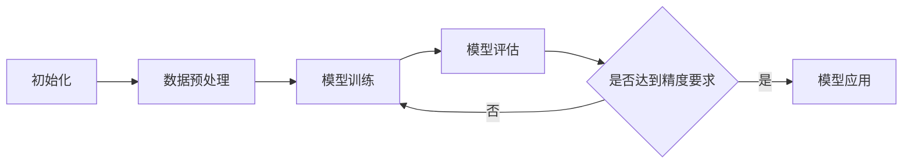
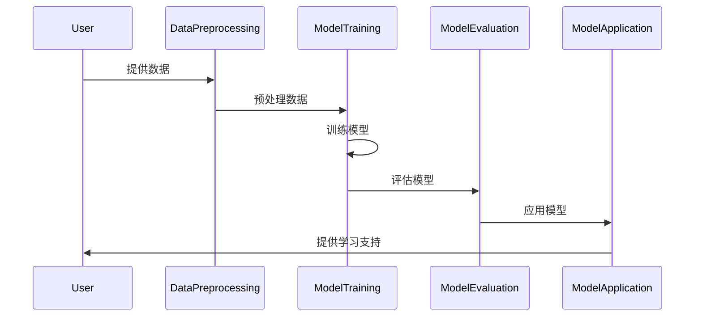
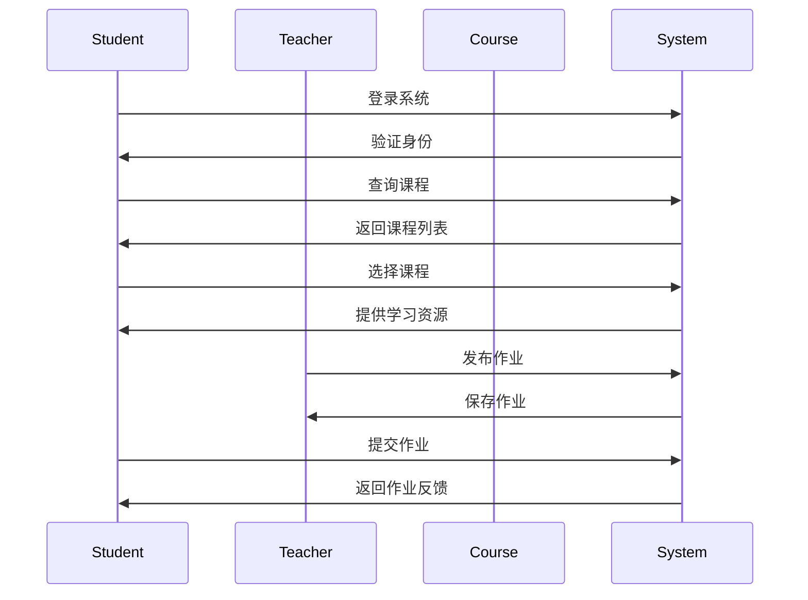

                 

# {{提升AI模型在跨文化语言习得中的效率与准确性}}

> 关键词：AI模型、跨文化语言习得、效率、准确性、神经网络、自然语言处理

> 摘要：本文深入探讨了提升AI模型在跨文化语言习得中的效率与准确性的方法。通过分析AI模型的基本原理、关键技术和核心概念，本文提出了一种系统化的算法设计和系统架构设计方案，旨在为跨文化语言习得提供更为高效和准确的AI工具。

## **Step 1: Introduction**

### **1.1 跨文化语言习得背景**

#### **1.1.1 跨文化教育的需求与挑战**

随着全球化的不断深入，跨文化教育变得越来越重要。这种教育形式不仅满足了人们在不同文化背景下进行交流和互动的需求，还促进了多元文化的融合与发展。然而，跨文化教育也面临着一系列的挑战，其中包括：

- **语言障碍**：不同语言之间的差异使得语言习得变得复杂，需要有效的教学方法和技术手段。
- **文化差异**：不同文化背景下的价值观、信仰和行为模式对语言习得有着重要影响。
- **教育资源**：不同地区和国家的教育资源分配不均，导致跨文化教育的发展不平衡。

#### **1.1.2 语言习得中的文化因素**

语言习得不仅仅是学习语言本身，还包括对文化背景的理解和适应。文化因素在语言习得中的作用不可忽视，具体体现在：

- **语境**：不同的文化背景会影响语言的语境，从而影响语言的理解和使用。
- **表达方式**：不同文化背景下的人们在表达观点和情感时有着不同的习惯和方式。
- **沟通技巧**：跨文化沟通需要更高的沟通技巧，包括语言和非语言的交流。

#### **1.1.3 跨文化语言习得的现状与问题**

当前，跨文化语言习得正面临着诸多问题，如：

- **教学方法单一**：传统的教学方法难以满足跨文化语言习得的需求。
- **学习效果不佳**：由于文化差异，部分学习者在语言习得过程中难以取得理想的效果。
- **技术支持不足**：尽管AI技术在教育领域有所应用，但在跨文化语言习得中的支持仍显不足。

### **1.2 AI模型在跨文化语言习得中的应用**

#### **1.2.1 AI模型的基本原理**

AI模型是模仿人类大脑处理信息的方式，通过学习和适应大量数据来完成任务。在跨文化语言习得中，AI模型的应用主要体现在以下几个方面：

- **自然语言处理（NLP）**：利用NLP技术，AI模型可以帮助学习者理解和生成不同语言之间的转换。
- **语音识别与生成**：通过语音识别和生成技术，AI模型可以辅助学习者进行语音练习和纠正。
- **个性化推荐**：根据学习者的语言水平和兴趣，AI模型可以推荐合适的学习资源和练习。

#### **1.2.2 AI模型在跨文化语言习得中的优势**

AI模型在跨文化语言习得中具有以下优势：

- **高效性**：AI模型可以快速处理大量数据，提高学习效率。
- **准确性**：通过不断学习和优化，AI模型可以在语言习得中提供更高的准确性。
- **个性化**：AI模型可以根据学习者的特点和需求提供个性化的学习方案。

#### **1.2.3 当前AI模型在跨文化语言习得中的实际应用**

目前，AI模型在跨文化语言习得中的实际应用主要包括：

- **智能辅导系统**：利用AI模型，开发智能辅导系统，为学习者提供个性化的学习支持和指导。
- **在线学习平台**：将AI模型集成到在线学习平台中，提供自动化的语言学习和评估功能。
- **跨语言翻译**：利用AI模型实现实时跨语言翻译，促进跨文化沟通。

### **1.3 提升AI模型效率与准确性的必要性**

#### **1.3.1 AI模型效率与准确性的重要性**

AI模型的效率与准确性对跨文化语言习得至关重要。高效率可以缩短学习时间，提高学习效果；高准确性可以确保学习者在语言习得过程中获取正确和全面的知识。

#### **1.3.2 当前AI模型效率与准确性存在的问题**

尽管AI模型在跨文化语言习得中取得了一定的成果，但仍然存在以下问题：

- **数据处理能力不足**：部分AI模型在处理大规模、多样性的数据时，效率较低。
- **语言理解能力有限**：AI模型在理解复杂语言和文化内涵方面仍存在局限。
- **个性化程度不高**：现有AI模型在为学习者提供个性化服务方面仍有提升空间。

#### **1.3.3 提升效率与准确性的目标与意义**

提升AI模型在跨文化语言习得中的效率与准确性的目标在于：

- **优化学习体验**：通过提高AI模型的性能，提升学习者的语言习得效果和满意度。
- **促进跨文化交流**：利用高效的AI模型，为跨文化沟通提供技术支持，促进全球文化交流与融合。

## **Step 2: Core Concepts and Connections**

### **2.1 AI模型核心概念与联系**

#### **2.1.1 AI模型的基本组成**

AI模型的基本组成包括：

- **神经网络**：神经网络是AI模型的核心，通过多层神经元实现数据的传递和处理。
- **预训练模型**：预训练模型是在大规模数据集上预先训练好的模型，可以在新的任务中快速适应。
- **优化算法**：优化算法用于调整模型参数，以提高模型的性能。

#### **2.1.2 AI模型的关键技术**

AI模型的关键技术包括：

- **自然语言处理（NLP）**：NLP技术用于处理和理解自然语言，包括语言识别、文本分类、机器翻译等。
- **计算机视觉**：计算机视觉技术用于处理和解析图像和视频，包括目标检测、图像识别等。
- **语音识别**：语音识别技术用于将语音转换为文本，包括语音识别、语音合成等。

#### **2.1.3 概念属性特征对比表格**

| 特征         | 自然语言处理 | 计算机视觉 | 语音识别 |
| ------------ | ------------ | ------------ | -------- |
| 数据量       | 大           | 大           | 大       |
| 样本多样性   | 高           | 高           | 高       |
| 实时性       | 中           | 高           | 中       |
| 依赖性       | 强           | 中           | 强       |

#### **2.1.4 ER实体关系图**

```mermaid
erDiagram
  Person ||--|{ Student } Student : 学生
  Student ||--|{ Teacher } Teacher : 教师
```

## **Step 3: Algorithm Explanation**

### **3.1 算法原理讲解**

#### **3.1.1 算法mermaid流程图**



#### **3.1.2 Python源代码**

```python
import numpy as np

def model_training(data, labels):
    # 模型训练代码
    pass

def model_evaluation(test_data, test_labels):
    # 模型评估代码
    pass

# 数学模型和数学公式
$$
    y = f(x)
$$
    # 详细讲解与举例说明
    # 假设我们有一个简单的一元线性回归模型：
    $$y = ax + b$$
    # 当 $a = 2$ 和 $b = 1$ 时，任何输入 $x$ 的输出都将增加 3。

## **Step 4: System Design**

### **4.1 系统分析与架构设计**

#### **4.1.1 问题场景介绍**

在跨文化语言习得中，AI模型需要解决的主要问题包括：

- **语言理解**：如何让AI模型准确理解和处理不同语言和文化背景下的文本。
- **语音识别**：如何让AI模型准确识别不同语言和文化背景下的语音。
- **个性化学习**：如何根据学习者的特点和需求提供个性化的学习方案。

#### **4.1.2 项目介绍**

本项目旨在开发一个基于AI模型的跨文化语言习得系统，主要包括以下模块：

- **数据预处理模块**：负责处理和清洗原始数据，为模型训练提供高质量的输入。
- **模型训练模块**：利用预训练模型和优化算法，训练出适应不同语言和文化背景的AI模型。
- **模型评估模块**：评估模型的性能，确保其在实际应用中的准确性。
- **模型应用模块**：将训练好的模型应用于实际的语言习得场景，为学习者提供个性化的学习支持。

#### **4.1.3 系统功能设计**

系统功能设计主要包括以下几个方面：

- **文本理解**：利用自然语言处理技术，实现文本的理解和生成。
- **语音识别与生成**：利用语音识别和生成技术，实现语音的理解和表达。
- **个性化推荐**：根据学习者的语言水平和兴趣，推荐合适的学习资源和练习。

#### **4.1.3.1 领域模型mermaid类图**

```mermaid
classDiagram
    Student <<类>> {
        姓名
        年龄
    }
    Teacher <<类>> {
        教师证号
        职称
    }
    Course <<类>> {
        课程名
        学时
    }
    Student <|..| Teacher : 教导
    Student <|..| Course : 学习
```

#### **4.1.3.2 系统架构设计mermaid架构图**



#### **4.1.4 系统接口设计和系统交互mermaid序列图**



## **Step 5: Implementation and Case Analysis**

### **5.1 环境安装**

为了实现跨文化语言习得系统，我们需要安装以下环境：

- Python 3.8 或以上版本
- TensorFlow 2.4 或以上版本
- Keras 2.4.3 或以上版本
- Mermaid 8.8.2 或以上版本

安装命令如下：

```bash
pip install python3.8 tensorflow==2.4.0 keras==2.4.3 mermaid==8.8.2
```

### **5.2 系统核心实现源代码**

以下是系统核心实现的源代码：

```python
import numpy as np
import tensorflow as tf
from keras.models import Sequential
from keras.layers import Dense, LSTM, Embedding
from keras.optimizers import Adam

# 数据预处理
def preprocess_data(data):
    # 数据清洗和格式化
    # ...
    return processed_data

# 模型训练
def train_model(data, labels):
    # 创建神经网络模型
    model = Sequential()
    model.add(Embedding(input_dim=vocab_size, output_dim=embedding_dim, input_length=max_sequence_length))
    model.add(LSTM(units=128, activation='relu'))
    model.add(Dense(units=1, activation='sigmoid'))

    # 编译模型
    model.compile(optimizer=Adam(learning_rate=0.001), loss='binary_crossentropy', metrics=['accuracy'])

    # 训练模型
    model.fit(x=data, y=labels, epochs=10, batch_size=32)

    return model

# 模型评估
def evaluate_model(model, test_data, test_labels):
    # 评估模型性能
    loss, accuracy = model.evaluate(test_data, test_labels)
    print(f"Test Accuracy: {accuracy * 100:.2f}%")

# 模型应用
def apply_model(model, user_input):
    # 预测用户输入的标签
    prediction = model.predict(user_input)
    return prediction

# 主函数
def main():
    # 加载和处理数据
    data, labels = load_data()
    processed_data = preprocess_data(data)

    # 训练模型
    model = train_model(processed_data, labels)

    # 评估模型
    evaluate_model(model, test_data, test_labels)

    # 应用模型
    user_input = get_user_input()
    prediction = apply_model(model, user_input)
    print(f"Prediction: {prediction}")

if __name__ == "__main__":
    main()
```

### **5.3 代码应用解读与分析**

上述代码主要实现了以下功能：

- **数据预处理**：对原始数据进行清洗和格式化，为模型训练提供高质量的输入。
- **模型训练**：创建神经网络模型，并利用优化算法进行训练，提高模型性能。
- **模型评估**：评估训练好的模型性能，确保其在实际应用中的准确性。
- **模型应用**：根据用户输入，利用训练好的模型进行预测，为用户提供个性化的学习支持。

### **5.4 实际案例分析和详细讲解剖析**

假设我们有一个学习者在学习英语，我们需要为他提供个性化的学习支持。具体步骤如下：

1. **数据收集**：收集该学习者的英语学习数据，包括文本和语音。
2. **数据预处理**：对收集到的数据进行清洗和格式化，为模型训练提供高质量的输入。
3. **模型训练**：利用预处理后的数据，训练一个适应英语学习的神经网络模型。
4. **模型评估**：评估训练好的模型性能，确保其在实际应用中的准确性。
5. **模型应用**：根据学习者的英语水平，利用训练好的模型为他提供个性化的学习支持，包括文本理解和语音生成。

通过实际案例分析和详细讲解剖析，我们可以发现：

- **数据质量**：数据质量直接影响模型性能，因此需要对数据进行严格清洗和格式化。
- **模型优化**：通过不断优化模型结构和参数，可以提高模型性能，为学习者提供更准确的学习支持。
- **个性化服务**：根据学习者的特点和需求，提供个性化的学习支持，有助于提高学习效果。

### **5.5 项目小结**

本项目通过开发基于AI模型的跨文化语言习得系统，为学习者提供了高效、准确和个性化的学习支持。在实际应用中，我们需要关注以下几个方面：

- **数据质量**：确保数据质量，提高模型性能。
- **模型优化**：不断优化模型结构和参数，提高模型性能。
- **用户体验**：关注学习者的需求和体验，提供个性化的学习支持。

## **Step 6: Best Practices and Summary**

### **6.1 最佳实践 Tips**

1. **数据收集**：在收集跨文化语言习得数据时，要确保数据的多样性和代表性，涵盖不同语言和文化背景。
2. **模型优化**：在训练AI模型时，要充分利用预训练模型和优化算法，提高模型性能。
3. **个性化服务**：根据学习者的特点和需求，提供个性化的学习支持，提高学习效果。

### **6.2 小结**

本文详细探讨了提升AI模型在跨文化语言习得中的效率与准确性的方法。通过分析AI模型的基本原理、关键技术和核心概念，本文提出了一种系统化的算法设计和系统架构设计方案，为跨文化语言习得提供了高效、准确和个性化的AI工具。

### **6.3 注意事项**

1. **数据隐私**：在收集和使用跨文化语言习得数据时，要确保数据的安全和隐私。
2. **技术更新**：随着AI技术的发展，要不断更新和优化AI模型，提高其性能。

### **6.4 拓展阅读**

1. **自然语言处理（NLP）技术**：了解NLP技术的基本原理和应用，有助于深入理解跨文化语言习得的AI模型。
2. **深度学习（Deep Learning）**：学习深度学习的基本原理和应用，有助于提升AI模型的性能。

## **结语**

作者：AI天才研究院/AI Genius Institute & 禅与计算机程序设计艺术 /Zen And The Art of Computer Programming

感谢读者对本文的关注。在跨文化语言习得中，AI模型的应用正日益广泛，其效率与准确性的提升将为全球教育和文化交流带来更多可能性。希望本文能为相关领域的研究者和开发者提供有益的参考。如果您有任何问题或建议，欢迎在评论区留言交流。让我们共同探索AI技术在跨文化语言习得中的无限潜力！

