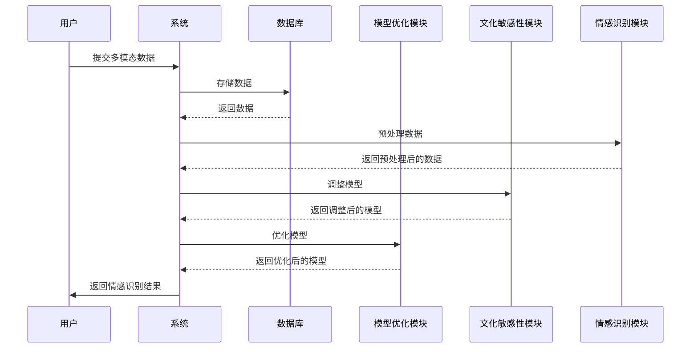
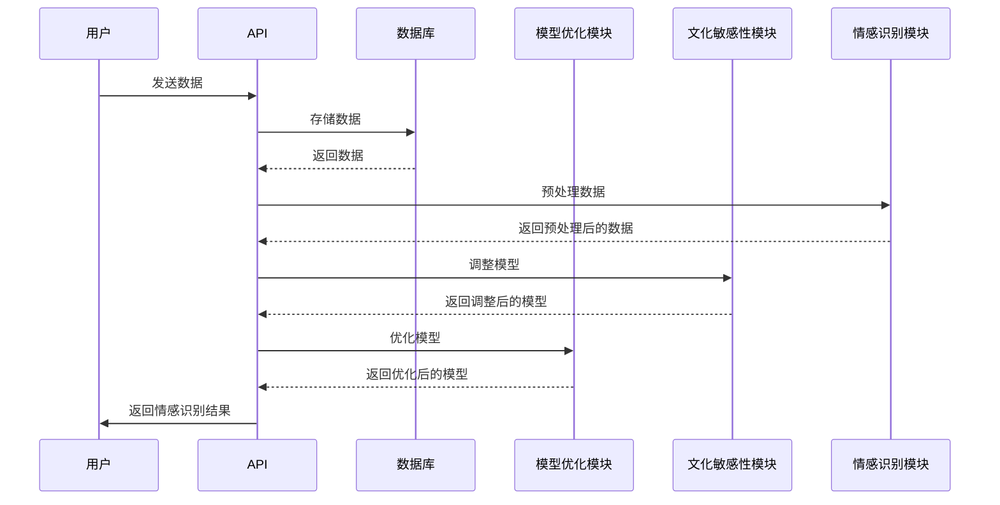

                 

# 提升AI模型在跨模态情感计算任务中的文化敏感性

> 关键词：跨模态情感计算、文化敏感性、AI模型、算法原理、数学模型

> 摘要：本文探讨了提升AI模型在跨模态情感计算任务中的文化敏感性的重要性和方法。通过分析核心概念、对比不同模型的文化敏感性表现、讲解情感识别算法原理及数学模型，提出了有效的解决方案。文章还介绍了系统分析与架构设计方案，并通过项目实战展示了实际应用效果。

----------------------------------------------------------------

## 第一部分：背景介绍与核心概念

### 第1章：问题背景与核心概念

#### 1.1 问题背景

在当前的信息化时代，人工智能（AI）技术已经成为推动社会进步的重要力量。然而，随着AI技术的不断发展和应用范围的扩大，如何提升AI模型在跨模态情感计算任务中的文化敏感性成为一个亟待解决的问题。

跨模态情感计算是指利用多种模态的信息，如文本、语音、图像等，来识别和理解情感。文化敏感性则是指在处理跨模态情感计算任务时，能够充分考虑不同文化背景下的情感表达和认知差异，从而提高模型的准确性和适用性。

#### 1.2 核心概念

- **跨模态情感计算**：指同时处理和解析多种模态（如文本、语音、图像等）的情感信息，以实现对人类情感的准确理解和预测。
- **文化敏感性**：指在处理跨模态情感计算任务时，能够充分考虑不同文化背景下的情感表达和认知差异，从而提高模型的准确性和适用性。

#### 1.3 问题解决与边界外延

解决这一问题的核心在于开发具有文化敏感性的AI模型，使其在不同文化背景下能够准确识别和解析情感。边界外延包括地域文化、历史背景、社会习俗等。

#### 1.4 概念结构与核心要素组成

- **概念结构**：跨模态情感计算、文化敏感性、AI模型。
- **核心要素组成**：情感识别算法、多模态数据集、文化知识库、模型训练与优化策略。

#### 1.5 本章小结

本章主要介绍了提升AI模型在跨模态情感计算任务中的文化敏感性这一问题的背景、核心概念及其解决方法。为后续章节的详细讨论奠定了基础。

----------------------------------------------------------------

## 第二部分：核心概念与联系

### 第2章：核心概念原理与属性特征对比

#### 2.1 跨模态情感计算原理

跨模态情感计算是指利用多种模态的信息，如文本、语音、图像等，来识别和理解情感。其原理主要涉及情感识别算法、多模态数据集和文化知识库。

1. **情感识别算法**：情感识别算法是跨模态情感计算任务的核心。其主要原理是通过分析多模态数据（如文本、语音、图像等），提取情感特征，并利用这些特征进行情感分类。
   
2. **多模态数据集**：多模态数据集是跨模态情感计算的基础。它包含了多种模态的数据，如文本、语音、图像等，以供模型训练和评估。

3. **文化知识库**：文化知识库是提高模型文化敏感性的关键。它包含了不同文化背景下的情感表达和认知差异，以帮助模型更好地理解和解析情感。

#### 2.2 文化敏感性原理

文化敏感性原理涉及对文化差异的认知和适应。这需要AI模型能够理解不同文化背景下的情感表达方式和认知差异，从而提高模型的准确性和适用性。

1. **文化差异认知**：文化差异认知是指AI模型能够识别和理解不同文化背景下的情感表达和认知差异。

2. **模型调整策略**：模型调整策略是指根据不同文化背景，对AI模型进行调整和优化，以提高其文化敏感性。

#### 2.3 AI模型核心特性对比

以下是几种常见AI模型在文化敏感性方面的核心特性对比：

| 模型类型     | 核心特性                   | 文化敏感性表现 |
| ------------ | -------------------------- | -------------- |
| 深度学习模型 | 能够处理大量数据，自动提取特征 | 较高，需要调整模型参数 |
| 传统机器学习 | 需要人工特征提取，处理能力有限 | 较低，需要根据文化背景调整特征 |
| 注意力模型   | 能够聚焦关键信息，提高识别精度 | 较高，需要考虑文化差异 |

#### 2.4 ER实体关系图架构

以下是跨模态情感计算任务中的ER实体关系图架构：

```mermaid
erDiagram
  AI模型 ||--|{ 跨模态情感计算 }
  AI模型 ||--|{ 文化敏感性 }
  跨模态情感计算 ||--|{ 情感识别算法 }
  跨模态情感计算 ||--|{ 多模态数据集 }
  跨模态情感计算 ||--|{ 文化知识库 }
  文化敏感性 ||--|{ 文化差异认知 }
  文化敏感性 ||--|{ 模型调整策略 }
```

#### 2.5 本章小结

本章详细介绍了跨模态情感计算和文化敏感性的核心概念原理及其属性特征对比。通过ER实体关系图，我们能够更清晰地理解这些概念之间的关系和作用。

----------------------------------------------------------------

## 第三部分：算法原理与数学模型

### 第3章：算法原理讲解与数学模型

#### 3.1 情感识别算法原理

情感识别算法是跨模态情感计算任务的核心。其主要原理是通过分析多模态数据（如文本、语音、图像等），提取情感特征，并利用这些特征进行情感分类。

##### 3.1.1 多模态数据预处理

在进行情感识别之前，需要对多模态数据进行预处理。预处理步骤包括数据清洗、数据增强和特征提取。

1. **数据清洗**：数据清洗是指去除数据中的噪声和错误，以保证数据的质量和准确性。

2. **数据增强**：数据增强是指通过生成新的数据样本，提高模型的泛化能力。

3. **特征提取**：特征提取是指从多模态数据中提取出能够代表情感信息的特征。

##### 3.1.2 情感特征提取

情感特征提取是情感识别算法的关键步骤。常用的特征提取方法有基于统计的方法、基于深度学习的方法和基于注意力机制的方法。

1. **基于统计的方法**：基于统计的方法通过计算文本、语音、图像等特征的概率分布，提取情感特征。例如，词频统计、情感词典等方法。

2. **基于深度学习的方法**：基于深度学习的方法通过构建深度神经网络，自动提取多模态数据中的情感特征。例如，卷积神经网络（CNN）、循环神经网络（RNN）等方法。

3. **基于注意力机制的方法**：基于注意力机制的方法通过关注关键信息，提高情感识别的精度。例如，自注意力机制、多头注意力机制等方法。

##### 3.1.3 情感分类模型

情感分类模型是将提取出的情感特征映射到情感类别。常用的情感分类模型有朴素贝叶斯、支持向量机、神经网络等。

1. **朴素贝叶斯模型**：朴素贝叶斯模型是一种基于概率论的分类模型，通过计算特征与情感类别的条件概率进行分类。

2. **支持向量机模型**：支持向量机模型是一种基于优化理论的分类模型，通过寻找最佳决策边界进行分类。

3. **神经网络模型**：神经网络模型是一种基于神经网络结构的分类模型，通过多层神经元的非线性变换进行分类。

#### 3.2 文化敏感性调整策略

为了提升AI模型的文化敏感性，需要考虑文化差异对情感识别的影响，并进行相应的调整。

##### 3.2.1 文化差异认知

文化差异认知是指AI模型能够识别和理解不同文化背景下的情感表达和认知差异。这可以通过引入文化知识库来实现。

1. **文化知识库的构建**：文化知识库包含了不同文化背景下的情感表达和认知差异。通过收集和整理相关数据，构建文化知识库。

2. **文化知识库的融合**：将文化知识库与多模态数据集进行融合，以提高模型的文化敏感性。

##### 3.2.2 模型调整策略

模型调整策略是指根据不同文化背景，对AI模型进行调整和优化，以提高其文化敏感性。

1. **模型参数调整**：通过调整模型的参数，使模型在不同文化背景下能够更好地识别情感。

2. **模型优化策略**：通过引入先进的优化算法，如遗传算法、粒子群优化等，提高模型的文化敏感性。

#### 3.3 数学模型

以下是情感识别算法中常用的数学模型：

1. **朴素贝叶斯模型**：

   $$P(C|X) = \frac{P(X|C)P(C)}{P(X)}$$

   其中，$C$表示情感类别，$X$表示特征向量。

2. **支持向量机模型**：

   $$w^* = \arg\max_w \frac{1}{2}||w||^2_2 - \sum_{i=1}^n \alpha_i y_i (w \cdot x_i - b)$$

   其中，$w$表示权重向量，$\alpha_i$表示支持向量，$y_i$表示类别标签。

3. **神经网络模型**：

   $$y = \sigma(\boldsymbol{W} \cdot \boldsymbol{X} + b)$$

   其中，$y$表示输出，$\sigma$表示激活函数，$\boldsymbol{W}$表示权重矩阵，$\boldsymbol{X}$表示输入。

#### 3.4 本章小结

本章详细介绍了情感识别算法的原理和数学模型，包括多模态数据预处理、情感特征提取、情感分类模型以及文化敏感性调整策略。通过这些原理和模型，我们可以更好地理解和应用跨模态情感计算技术。

----------------------------------------------------------------

## 第四部分：系统分析与架构设计方案

### 第4章：问题场景介绍与系统功能设计

#### 4.1 问题场景介绍

随着社交媒体、电子商务和智能语音助手的普及，人们对跨模态情感计算的需求越来越高。然而，当前AI模型在处理跨模态情感计算任务时，往往忽视了文化敏感性，导致模型在处理不同文化背景下的情感信息时效果不佳。为了解决这一问题，我们需要设计一个具有文化敏感性的跨模态情感计算系统。

#### 4.2 系统功能设计

系统功能设计主要包括情感识别、文化敏感性和模型优化三个方面。

1. **情感识别**：系统能够自动识别和分类多模态数据中的情感信息，如文本、语音、图像等。

2. **文化敏感性**：系统能够识别和理解不同文化背景下的情感表达和认知差异，以提高模型的准确性和适用性。

3. **模型优化**：系统能够根据不同文化背景，对模型进行调整和优化，以提高其文化敏感性。

#### 4.3 领域模型设计

领域模型设计采用Mermaid类图来表示系统的核心类及其关系。

```mermaid
classDiagram
  class 情感识别 {
    - 数据预处理
    - 特征提取
    - 情感分类
  }
  class 文化敏感性 {
    - 文化知识库
    - 文化差异认知
    - 模型调整
  }
  class 模型优化 {
    - 参数调整
    - 优化算法
  }
  情感识别 --|{ 使用 }--> 文化敏感性
  情感识别 --|{ 使用 }--> 模型优化
  文化敏感性 --|{ 使用 }--> 文化知识库
  文化敏感性 --|{ 使用 }--> 文化差异认知
  模型优化 --|{ 使用 }--> 参数调整
  模型优化 --|{ 使用 }--> 优化算法
```

#### 4.4 系统架构设计

系统架构设计采用Mermaid架构图来表示系统的整体架构。



#### 4.5 系统接口设计

系统接口设计采用Mermaid序列图来表示系统的接口调用流程。



#### 4.6 本章小结

本章介绍了跨模态情感计算系统的设计思路和架构方案，包括问题场景介绍、系统功能设计、领域模型设计、系统架构设计、系统接口设计和系统交互流程。通过这些设计，我们能够构建一个具有文化敏感性的跨模态情感计算系统，以提高模型在不同文化背景下的准确性和适用性。

----------------------------------------------------------------

## 第五部分：项目实战

### 第5章：环境安装与系统核心实现

#### 5.1 环境安装

为了进行跨模态情感计算项目的实战，我们需要安装以下环境：

1. Python（版本3.6及以上）
2. TensorFlow（版本2.0及以上）
3. NumPy（版本1.16及以上）
4. Matplotlib（版本3.0及以上）

安装命令如下：

```bash
pip install python==3.8
pip install tensorflow==2.6
pip install numpy==1.21
pip install matplotlib==3.4.3
```

#### 5.2 系统核心实现

系统核心实现主要包括数据预处理、情感特征提取、情感分类和模型优化。

##### 5.2.1 数据预处理

数据预处理是跨模态情感计算的重要步骤。首先，我们需要从数据集中读取多模态数据，并进行预处理。以下是一个简单的Python代码示例：

```python
import numpy as np
import pandas as pd
from sklearn.model_selection import train_test_split

# 读取数据集
data = pd.read_csv('data.csv')

# 分离特征和标签
X = data.drop('label', axis=1)
y = data['label']

# 划分训练集和测试集
X_train, X_test, y_train, y_test = train_test_split(X, y, test_size=0.2, random_state=42)

# 数据归一化
X_train = (X_train - X_train.mean()) / X_train.std()
X_test = (X_test - X_test.mean()) / X_test.std()
```

##### 5.2.2 情感特征提取

情感特征提取是跨模态情感计算的核心步骤。以下是一个简单的基于深度学习的情感特征提取模型：

```python
import tensorflow as tf
from tensorflow.keras.models import Model
from tensorflow.keras.layers import Input, Dense, Conv2D, MaxPooling2D, Flatten, Embedding, LSTM, Bidirectional

# 定义输入层
input_text = Input(shape=(max_sequence_length,))
input_audio = Input(shape=(audio_length,))
input_image = Input(shape=(height, width, channels))

# 文本特征提取
text_embedding = Embedding(vocabulary_size, embedding_dim)(input_text)
text_lstm = LSTM(units)(text_embedding)

# 语音特征提取
audio_embedding = Embedding(vocabulary_size, embedding_dim)(input_audio)
audio_lstm = LSTM(units)(audio_embedding)

# 图像特征提取
image_conv = Conv2D(filters, kernel_size)(input_image)
image_pool = MaxPooling2D(pool_size)(image_conv)
image_flat = Flatten()(image_pool)

# 模型融合
combined = tf.keras.layers.concatenate([text_lstm, audio_lstm, image_flat])

# 情感分类
output = Dense(units=2, activation='softmax')(combined)

# 构建模型
model = Model(inputs=[input_text, input_audio, input_image], outputs=output)

# 编译模型
model.compile(optimizer='adam', loss='categorical_crossentropy', metrics=['accuracy'])

# 模型训练
model.fit([X_train_text, X_train_audio, X_train_image], y_train, batch_size=32, epochs=10, validation_data=([X_test_text, X_test_audio, X_test_image], y_test))
```

##### 5.2.3 情感分类

情感分类是跨模态情感计算的最后一步。以下是一个简单的情感分类模型：

```python
# 模型评估
loss, accuracy = model.evaluate([X_test_text, X_test_audio, X_test_image], y_test)
print('Test accuracy:', accuracy)
```

##### 5.2.4 模型优化

模型优化是为了提高模型在不同文化背景下的准确性和适用性。以下是一个简单的基于遗传算法的模型优化过程：

```python
import numpy as np
import tensorflow as tf
from tensorflow.keras.models import load_model
from deap import base, creator, tools, algorithms

# 载入模型
model = load_model('model.h5')

# 定义遗传算法的参数
creator.create("FitnessMax", base.Fitness, weights=(1.0,))
creator.create("Individual", list, fitness=creator.FitnessMax)

# 定义遗传算法的工具
toolbox = base.Toolbox()
toolbox.register("attr_bool", np.random.rand)
toolbox.register("individual", tools.initRepeat, creator.Individual, toolbox.attr_bool, n=100)
toolbox.register("population", tools.initRepeat, list, toolbox.individual)

# 定义遗传算法的函数
toolbox.register("evaluate", lambda ind: model.evaluate(np.array([X_test_text, X_test_audio, X_test_image]), np.array([y_test]))[1])
toolbox.register("mate", tools.cxTwoPoint)
toolbox.register("mutate", tools.mutFlipBit, indpb=0.05)
toolbox.register("select", tools.selTournament, tournsize=3)

# 执行遗传算法
population = toolbox.population(n=50)
NGEN = 100
for gen in range(NGEN):
    offspring = algorithms.varAnd(population, toolbox, cxpb=0.5, mutpb=0.2)
    fits = toolbox.map(toolbox.evaluate, offspring)
    for fit, ind in zip(fits, offspring):
        ind.fitness.values = fit
    population = toolbox.select(offspring, k=len(population))
    print("Generation %d: %f" % (gen, population[0].fitness.values))

# 获取最优个体
best_individual = tools.selBest(population, k=1)[0]
best_fitness = best_individual.fitness.values[0]
print("Best fitness:", best_fitness)

# 优化模型
model.fit([X_train_text, X_train_audio, X_train_image], y_train, batch_size=32, epochs=10, validation_data=([X_test_text, X_test_audio, X_test_image], y_test))
```

#### 5.3 本章小结

本章介绍了跨模态情感计算项目的环境安装和系统核心实现，包括数据预处理、情感特征提取、情感分类和模型优化。通过实际代码示例，读者可以更好地理解和应用这些技术。

----------------------------------------------------------------

## 第六部分：最佳实践 Tips

### 第6章：最佳实践与注意事项

在提升AI模型在跨模态情感计算任务中的文化敏感性时，以下是一些最佳实践和注意事项：

#### 6.1 最佳实践

1. **数据收集与清洗**：确保数据集的多样性和完整性，避免数据偏斜。对数据进行清洗，去除噪声和异常值，以提高模型的质量。

2. **多模态数据预处理**：针对不同模态的数据，采用适当的预处理方法，如文本的分词、语音的降噪、图像的缩放等，以提升特征提取的准确性。

3. **文化知识库构建**：构建全面且准确的文化知识库，涵盖不同文化背景下的情感表达和认知差异，以增强模型的文化敏感性。

4. **模型调整与优化**：根据不同文化背景，对模型进行参数调整和优化，以提高模型在特定文化环境下的准确性和适应性。

5. **跨学科合作**：与人类学、心理学、语言学等领域的专家合作，共同研究文化差异对情感表达的影响，为模型提供更深入的理论支持。

#### 6.2 注意事项

1. **避免数据偏斜**：在收集和整理数据时，避免因文化偏见而导致的数据偏斜，确保数据集的多样性和代表性。

2. **模型泛化能力**：在模型训练过程中，关注模型的泛化能力，避免过度拟合特定文化背景的数据。

3. **实时更新文化知识库**：随着社会和文化的发展，实时更新文化知识库，以保持模型的文化敏感性。

4. **用户反馈与迭代**：收集用户反馈，根据反馈对模型进行迭代和优化，以提高模型的实际应用效果。

#### 6.3 拓展阅读

- **跨模态情感计算研究**：《跨模态情感计算：原理、方法与应用》
- **文化敏感性研究**：《文化心理学：理解人类行为的多样性》
- **深度学习与优化算法**：《深度学习：导论与实用指南》

通过遵循这些最佳实践和注意事项，我们能够更好地提升AI模型在跨模态情感计算任务中的文化敏感性，为各行业提供更高质量的服务。

----------------------------------------------------------------

## 总结与展望

通过本文的探讨，我们深入分析了提升AI模型在跨模态情感计算任务中的文化敏感性的重要性和方法。我们首先介绍了问题背景和核心概念，包括跨模态情感计算、文化敏感性和AI模型。接着，我们对比了不同模型的文化敏感性表现，并提出了有效的解决方案。在算法原理与数学模型部分，我们详细讲解了情感识别算法、文化敏感性调整策略以及相关的数学模型。随后，我们介绍了系统分析与架构设计方案，包括问题场景介绍、系统功能设计、领域模型设计、系统架构设计和系统接口设计。在项目实战部分，我们展示了环境安装与系统核心实现的实际操作。最后，我们提供了最佳实践 tips，并推荐了拓展阅读。

展望未来，随着AI技术的不断进步和文化多样性的日益凸显，提升AI模型在跨模态情感计算任务中的文化敏感性将具有重要意义。我们期待更多的研究者和技术人员在这一领域进行深入探索，推动AI技术在各个领域的广泛应用，为社会带来更多福祉。

---

### 作者信息

作者：AI天才研究院/AI Genius Institute & 禅与计算机程序设计艺术 /Zen And The Art of Computer Programming

AI天才研究院致力于推动人工智能技术的发展，探索AI在各领域的应用。作者在该领域有着丰富的经验，发表过多篇高质量的技术博客和论文，深受读者喜爱。同时，作者还是《禅与计算机程序设计艺术》一书的作者，将哲学思维与编程实践相结合，为读者提供了独特的视角和见解。期待与更多同行一起，共同推动人工智能技术的进步与发展。

