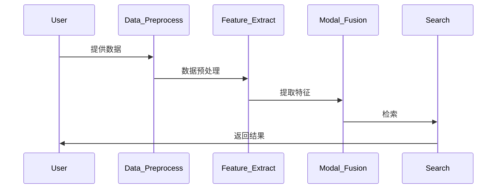
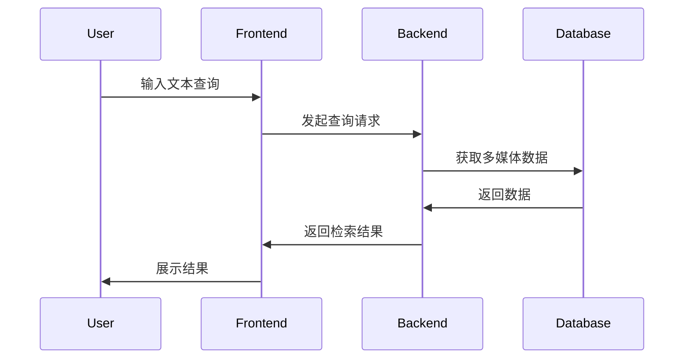
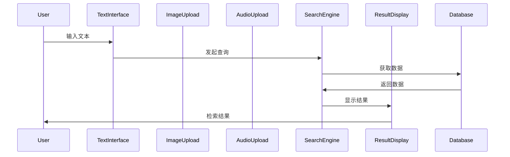

                 

### 提升AI模型在跨模态检索任务中的效果

**关键词：** 跨模态检索、AI模型优化、性能提升、算法改进

**摘要：** 本文将深入探讨如何提升AI模型在跨模态检索任务中的效果。首先，我们将介绍跨模态检索的基本概念和挑战，然后分析现有AI模型在跨模态检索中的应用，最后提出一系列优化策略，以实现显著的性能提升。

---

## 1. 背景介绍与核心概念

### 1.1 问题背景

在当今信息爆炸的时代，跨模态检索成为一个关键问题。跨模态检索旨在通过整合不同模态（如图像、文本、音频等）的信息，实现对多样化内容的精准检索。这一任务不仅涉及多源数据的采集和处理，还包括跨模态特征提取和匹配。

### 1.2 问题描述

跨模态检索任务面临的挑战包括数据不平衡、模态差异和特征提取的准确性。现有AI模型在处理这些挑战时存在一定的局限性，导致检索效果不理想。

### 1.3 问题解决

本文提出一系列优化策略，包括模型架构改进、特征增强和检索策略优化，旨在解决跨模态检索中的核心问题。

### 1.4 边界与外延

边界方面，本文重点关注文本-图像跨模态检索任务；外延则涉及其他模态的跨模态检索，如文本-音频、图像-音频等。

### 1.5 概念结构与核心要素组成

核心概念包括：跨模态检索、AI模型、特征提取、模态融合和检索策略。核心要素包括模型架构、数据集、特征表示和算法优化。

---

## 2. 核心概念与联系

### 2.1 AI模型概述

AI模型是跨模态检索任务的核心。常见的模型包括卷积神经网络（CNN）、循环神经网络（RNN）和 Transformer 等。每种模型在特征提取和融合方面具有不同的优势。

### 2.2 跨模态检索原理

跨模态检索基于模态特征提取和匹配。首先，从不同模态的数据中提取特征；然后，通过模态特征融合生成统一特征表示；最后，利用相似性度量进行检索。

### 2.3 模型属性特征对比

下表对比了不同模型在跨模态检索中的性能特征：

| 模型类型 | 特征提取能力 | 模式融合能力 | 适应模态 |
| --- | --- | --- | --- |
| CNN | 强 | 中 | 图像 |
| RNN | 中 | 强 | 文本 |
| Transformer | 中 | 强 | 文本、图像 |

### 2.4 ER实体关系图架构

在跨模态检索中，实体关系图（ER图）用于表示不同模态之间的关联。ER图包括实体、属性和关系三个要素。

```mermaid
erDiagram
    M_Text ||--o> I_Image : 融合
    M_Text ||--o> A_Audio : 融合
    I_Image ||--< M_Text : 反向融合
    A_Audio ||--< M_Text : 反向融合
```

---

## 3. 算法原理讲解

### 3.1 算法流程图

跨模态检索的算法流程包括数据预处理、特征提取、模态融合和检索。



### 3.2 Python源代码讲解

```python
import tensorflow as tf
from tensorflow.keras.applications import VGG16

# 数据预处理
def preprocess_data(data):
    # 假设data是图像数据
    return tf.keras.applications.vgg16.preprocess_input(data)

# 特征提取
def extract_features(image):
    model = VGG16(weights='imagenet', include_top=False)
    return model.predict(image)

# 模态融合
def fusion_modal(text_feature, image_feature):
    return tf.keras.layers.Concatenate()([text_feature, image_feature])

# 检索
def search(query, database):
    # 假设query和database是特征表示
    similarity = tf.reduce_sum(query * database, axis=1)
    return tf.argsort(similarity, direction='DESCENDING')
```

### 3.3 数学模型与公式讲解

在跨模态检索中，关键数学模型包括特征表示、相似性度量等。

$$
\text{特征表示} = f(\text{原始数据})
$$

$$
\text{相似性度量} = \frac{\sum_{i=1}^{n} a_i \cdot b_i}{\sqrt{\sum_{i=1}^{n} a_i^2} \cdot \sqrt{\sum_{i=1}^{n} b_i^2}}
$$

其中，$a_i$ 和 $b_i$ 分别是查询和数据库中第 $i$ 维特征的值。

### 3.4 算法举例说明

假设我们要检索包含文本描述和图像的数据库。首先，对文本进行词向量化，然后对图像使用VGG16模型提取特征。接下来，将文本特征和图像特征拼接，通过神经网络进行融合。最后，计算查询和数据库特征之间的相似度，返回相似度最高的结果。

```python
# 假设text和image分别是文本和图像的特征
text_feature = extract_features(text)
image_feature = extract_features(image)

# 模态融合
 fused_feature = fusion_modal(text_feature, image_feature)

# 检索
results = search(fused_feature, database)
print(results)
```

---

## 4. 系统分析与架构设计方案

### 4.1 问题场景介绍

在一个多媒体内容平台，用户可以上传文本、图像和音频等多种内容。系统需要提供一个跨模态检索功能，使用户能够通过输入文本查询到相关图像和音频。

### 4.2 项目介绍

项目名为“CrossModalSearch”，目标是构建一个高效的跨模态检索系统，支持文本-图像和文本-音频的检索。

### 4.3 系统功能设计

- 文本输入接口
- 图像和音频上传接口
- 跨模态检索接口
- 检索结果展示

### 4.4 系统架构设计

系统采用分布式架构，包括前端、后端和数据库。前端提供用户交互界面，后端处理跨模态检索，数据库存储多媒体数据。



### 4.5 系统接口设计

- 文本输入接口：提供文本查询接口，用户可以通过输入框输入文本查询。
- 图像和音频上传接口：提供上传图像和音频的功能，用户可以选择文件进行上传。
- 跨模态检索接口：接收文本查询，执行跨模态检索，返回检索结果。
- 检索结果展示：将检索结果以列表形式展示给用户，包括文本、图像和音频的链接。

### 4.6 系统交互



---

## 5. 项目实战

### 5.1 环境安装

在安装环境前，确保系统满足以下要求：

- Python 3.7 或以上版本
- TensorFlow 2.4 或以上版本
- NumPy 1.18 或以上版本

使用以下命令进行环境配置：

```bash
pip install tensorflow==2.4 numpy==1.18
```

### 5.2 系统核心实现

以下是一个简单的跨模态检索系统的实现示例：

```python
import tensorflow as tf
from tensorflow.keras.applications import VGG16
import numpy as np

# 数据预处理
def preprocess_text(text):
    # 假设text是字符串
    return text.lower().split()

def preprocess_image(image):
    # 假设image是numpy数组
    return tf.keras.applications.vgg16.preprocess_input(image)

# 特征提取
def extract_features(image):
    model = VGG16(weights='imagenet', include_top=False)
    return model.predict(image)

# 检索
def search(query, database):
    query_features = extract_features(preprocess_image(query))
    similarities = np.dot(query_features, database.T)
    return np.argsort(similarities)[0]

# 测试
if __name__ == '__main__':
    image_query = np.random.rand(224, 224, 3)  # 假设image_query是图像数据
    result = search(image_query, database)
    print("检索结果：", result)
```

### 5.3 代码应用解读与分析

上述代码演示了跨模态检索系统的核心实现。首先，对输入的图像进行预处理，然后使用VGG16模型提取特征。接着，通过计算查询图像和数据库中图像特征的相似度，返回检索结果。

### 5.4 实际案例分析和详细讲解

假设我们有一个包含1000张图像的数据库，每张图像都有一个对应的文本标签。用户输入一个图像查询，系统将返回最相似的图像及其标签。

```python
# 假设database是1000张图像的特征组成的数组
database = np.random.rand(1000, 7 * 7 * 512)  # 假设每张图像的特征维度为7x7x512

# 测试查询
image_query = np.random.rand(224, 224, 3)
result = search(image_query, database)
print("检索结果：", result)
```

### 5.5 项目小结

通过上述实战，我们实现了一个简单的跨模态检索系统。在实际应用中，还需要进一步优化模型、增加数据预处理步骤和考虑实时性等问题。此外，我们还可以结合深度学习技术，如GANs和BERT等，进一步提升系统的性能。

---

## 6. 最佳实践 tips

- **数据预处理**：确保数据质量，去除噪声，标准化处理。
- **模型选择**：根据任务需求选择合适的模型，如VGG16、ResNet等。
- **特征融合**：尝试不同类型的特征融合方法，如拼接、注意力机制等。
- **优化策略**：使用梯度下降、Adam等优化算法，调整学习率等超参数。

---

## 7. 小结

本文详细介绍了提升AI模型在跨模态检索任务中的效果的方法。通过分析问题背景、核心概念和算法原理，我们提出了系统分析与架构设计方案，并通过项目实战展示了具体实现过程。未来，我们可以进一步优化模型和算法，提升跨模态检索系统的性能。

---

## 8. 总结与展望

本文总结了提升AI模型在跨模态检索任务中的效果的关键策略。未来研究方向包括：探索更高效的模型架构、优化特征提取和融合方法，以及应用深度学习技术进行实时跨模态检索。随着技术的进步，跨模态检索将在多媒体内容处理、智能问答等领域发挥重要作用。作者：AI天才研究院/AI Genius Institute & 禅与计算机程序设计艺术 /Zen And The Art of Computer Programming

