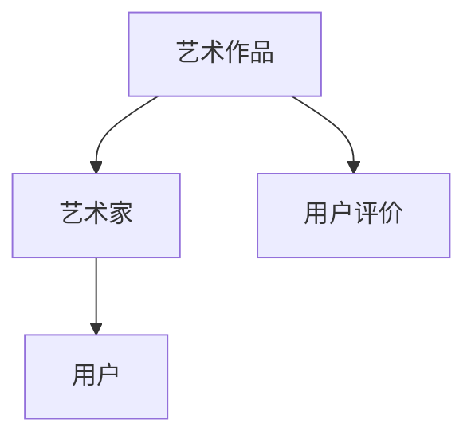
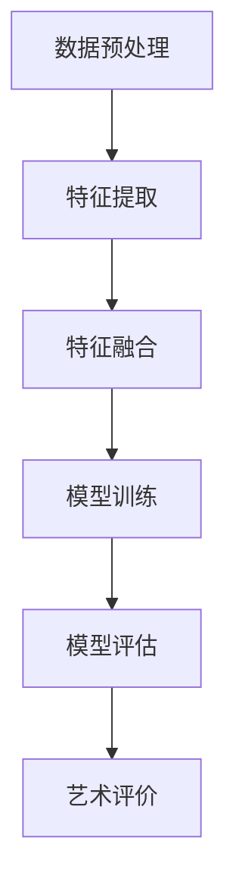

                 

### 第一步：引言与背景

---

#### 1.1 问题背景

跨模态艺术评价是人工智能领域中一个极具挑战性的课题。随着深度学习和计算机视觉技术的快速发展，AI模型在图像、视频等视觉模态上的表现已经取得了显著成果。然而，艺术评价不仅涉及视觉模态，还涉及音乐、文学等听觉和文本模态，甚至涉及艺术作品的创作背景、文化内涵等多维信息。因此，如何在跨模态场景中提升AI模型的审美理解能力，成为了一个亟待解决的重要问题。

在艺术评价中，AI模型的应用主要体现在以下几个方面：

1. **艺术作品分类与识别**：AI模型可以通过学习大量艺术作品的特征，对新的艺术作品进行分类和识别。
2. **艺术作品评价**：AI模型可以对艺术作品进行量化评价，例如给出一个评分或推荐理由。
3. **艺术创作辅助**：AI模型可以辅助艺术家进行创作，例如自动生成音乐、绘画等艺术作品。

然而，目前的AI模型在跨模态艺术评价任务中仍存在诸多挑战。首先，不同模态的数据往往具有不同的特性和结构，如何有效地融合这些数据是关键问题。其次，审美评价涉及到人类的主观情感和认知，AI模型如何准确地理解和模拟这种主观性也是一个难点。最后，跨模态艺术评价的数据集往往较为稀缺，如何获取高质量、多样化的数据集是另一个挑战。

#### 1.2 AI模型在艺术评价中的应用现状

近年来，AI模型在艺术评价中的应用取得了显著的进展。以深度学习为代表的人工智能技术，使得AI模型在图像识别、自然语言处理等领域取得了突破性成果。这些成果为AI在艺术评价中的应用提供了基础。例如，在艺术作品分类与识别方面，AI模型已经能够准确地识别和分类不同风格、题材的艺术作品。在艺术作品评价方面，AI模型可以通过分析艺术作品的特征，给出一个量化的评分或推荐理由。在艺术创作辅助方面，AI模型可以通过生成算法自动创作音乐、绘画等艺术作品。

尽管AI模型在艺术评价中的应用取得了进展，但仍存在一些问题和挑战。首先，AI模型在处理跨模态数据时，往往只能依赖于单一模态的特征，难以充分挖掘不同模态之间的关联性。其次，AI模型在理解艺术作品的内涵和审美价值时，往往缺乏人类的主观情感和认知能力。最后，现有的艺术评价数据集往往不够丰富和多样化，限制了AI模型在真实场景中的表现。

#### 1.3 跨模态艺术评价任务的重要性和挑战

跨模态艺术评价任务具有重要意义。首先，艺术评价是一个跨学科的领域，涉及视觉、听觉、文学等多个领域，跨模态艺术评价能够整合不同领域的信息，提高艺术评价的全面性和准确性。其次，艺术评价对艺术市场的繁荣和文化传播具有重要意义。通过准确的审美评价，可以帮助艺术家更好地了解自己的作品，促进艺术创作和市场的良性循环。

然而，跨模态艺术评价任务也面临着诸多挑战。首先，不同模态的数据具有不同的特性和结构，如何有效地融合这些数据是关键问题。其次，审美评价涉及到人类的主观情感和认知，AI模型如何准确地理解和模拟这种主观性也是一个难点。最后，跨模态艺术评价的数据集往往较为稀缺，如何获取高质量、多样化的数据集是另一个挑战。

为了解决这些挑战，需要从多个方面进行探索。首先，在跨模态数据融合方面，可以采用多模态学习、图神经网络等技术，提高不同模态数据之间的关联性。其次，在提升AI模型审美理解能力方面，可以引入心理学、认知科学等领域的知识，构建更加符合人类认知机制的审美模型。最后，在数据集建设方面，可以采用数据增强、数据采集等技术，丰富和多样化数据集。

#### 1.4 问题描述

跨模态艺术评价任务可以具体定义为：给定一个艺术作品，包括视觉、听觉、文本等多种模态的数据，以及相关的背景信息，AI模型需要综合分析这些信息，对艺术作品的审美价值进行评价。具体来说，任务目标包括以下几个方面：

1. **特征提取**：从不同模态的数据中提取特征，例如视觉模态中的图像特征、听觉模态中的音乐特征、文本模态中的文本特征等。
2. **特征融合**：将不同模态的特征进行融合，以获得更加全面和准确的艺术作品特征表示。
3. **审美评价**：根据融合的特征，对艺术作品的审美价值进行评价，例如给出一个评分或推荐理由。
4. **模型评估**：通过对比预测结果与真实评价，评估AI模型在跨模态艺术评价任务中的性能。

跨模态艺术评价任务的难点主要包括以下几个方面：

1. **跨模态数据融合**：如何有效地融合不同模态的数据，使其能够相互补充和增强，是一个关键问题。
2. **主观性处理**：审美评价具有强烈的主观性，如何模拟人类的主观情感和认知过程，是另一个难点。
3. **数据稀缺性**：高质量的跨模态艺术评价数据集较为稀缺，如何构建丰富、多样和具有代表性的数据集，是另一个挑战。

#### 1.5 问题解决

提升AI模型在跨模态艺术评价任务中的审美理解能力是一个复杂的问题，需要从多个方面进行探索。以下是一些可能的方法和途径：

1. **多模态学习**：采用多模态学习技术，如多模态融合网络、图神经网络等，提高不同模态数据之间的关联性。
2. **心理学与认知科学**：引入心理学和认知科学的知识，构建符合人类认知机制的审美模型。
3. **数据增强**：采用数据增强技术，如数据扩充、数据转换等，丰富和多样化数据集。
4. **交叉学科合作**：跨学科合作，结合艺术学、心理学、计算机科学等多领域的知识，共同探索提升AI模型审美理解能力的方法。

#### 1.6 本书的目标和结构

本书的目标是系统性地探讨提升AI模型在跨模态艺术评价任务中的审美理解能力的方法和途径。具体目标包括：

1. **介绍核心概念和基础理论**：介绍AI模型、跨模态学习、审美理解等核心概念和基础理论，为后续讨论提供理论基础。
2. **探讨提升AI模型审美理解能力的算法**：介绍基于深度学习和多模态融合的审美理解模型，详细讲解算法原理和实现方法。
3. **案例分析**：通过实际案例，展示提升AI模型审美理解能力的应用场景和效果。
4. **总结与展望**：总结全书内容，提出未来研究和发展方向。

本书的结构如下：

- **第一部分：引言与背景**：介绍跨模态艺术评价任务的重要性和挑战，定义任务目标和难点，阐述问题解决的必要性。
- **第二部分：核心概念与联系**：介绍AI模型基础、跨模态学习和审美理解的相关概念，建立概念联系。
- **第三部分：算法原理讲解**：详细讲解跨模态艺术评价算法原理和提升AI模型审美理解能力的算法。
- **第四部分：案例分析与应用**：通过实际案例，展示提升AI模型审美理解能力的应用场景和效果。
- **第五部分：总结与展望**：总结全书内容，提出未来研究和发展方向。

#### 1.7 边界与外延

跨模态艺术评价任务的边界主要包括以下几个方面：

1. **模态范围**：艺术作品涉及的模态主要包括视觉、听觉、文本等，跨模态艺术评价任务主要关注这些模态之间的融合和关联。
2. **艺术作品类型**：跨模态艺术评价任务适用于各种类型的艺术作品，如绘画、音乐、文学作品等。
3. **评价标准**：艺术评价标准可以是量化的评分，也可以是定性的描述，取决于具体的应用场景和需求。

跨模态艺术评价任务的外延涉及多个相关领域，包括：

1. **多模态学习**：研究如何从不同模态的数据中提取特征，并有效地融合这些特征。
2. **自然语言处理**：研究如何处理文本数据，提取语义信息，并与其他模态进行融合。
3. **计算机视觉**：研究如何从图像和视频中提取视觉特征，并应用于艺术评价任务。
4. **心理学与认知科学**：研究人类审美认知的机制，以及如何将这种机制转化为计算模型。

#### 1.8 跨模态艺术评价任务与其他相关领域的关系

跨模态艺术评价任务与其他相关领域密切相关，这些领域为跨模态艺术评价任务提供了理论基础和技术支持。以下是一些关键领域的联系：

1. **多模态学习**：多模态学习是跨模态艺术评价任务的核心技术之一，它研究如何从不同模态的数据中提取特征，并有效地融合这些特征。多模态学习的方法和技术可以应用于艺术评价任务中，以提高模型的准确性和鲁棒性。
2. **自然语言处理**：自然语言处理（NLP）研究如何处理文本数据，提取语义信息，并与其他模态进行融合。在跨模态艺术评价任务中，文本模态的数据通常包含了丰富的背景信息和文化内涵，NLP技术可以帮助模型更好地理解和利用这些信息。
3. **计算机视觉**：计算机视觉研究如何从图像和视频中提取视觉特征，并应用于各种任务。在跨模态艺术评价任务中，视觉模态的数据是评估艺术作品的重要依据，计算机视觉技术可以帮助模型更准确地识别和分类艺术作品。
4. **心理学与认知科学**：心理学与认知科学研究人类的主观情感和认知过程，为AI模型提供模拟人类审美认知的机制。这些研究可以帮助AI模型更好地理解和模拟人类的审美感受，提高艺术评价的准确性和可靠性。

总之，跨模态艺术评价任务是一个跨学科的领域，需要结合多模态学习、自然语言处理、计算机视觉、心理学与认知科学等领域的知识和技术，才能有效地提升AI模型的审美理解能力。

#### 1.9 本章小结

在本章中，我们介绍了提升AI模型在跨模态艺术评价任务中的审美理解能力的背景和重要性。首先，我们阐述了跨模态艺术评价的需求和现状，指出了AI模型在艺术评价中的应用现状和面临的挑战。接着，我们详细描述了跨模态艺术评价任务的具体定义、目标和难点，并提出了提升AI模型审美理解能力的必要性和方法。最后，我们介绍了本书的目标和结构，以及跨模态艺术评价任务的边界和外延，探讨了与其他相关领域的关系。通过本章的介绍，为后续章节的内容奠定了基础。

---

### 第二部分：核心概念与联系

---

#### 2.1 AI模型基础

AI模型是人工智能领域的基础和核心，是模拟人类智能行为的数学模型和算法。AI模型可以分为两大类：监督学习模型和无监督学习模型。监督学习模型需要标签数据进行训练，通过学习输入和输出之间的映射关系来进行预测。无监督学习模型则不需要标签数据，通过学习数据的内在结构来进行聚类或降维。

**2.1.1 AI模型的定义与分类**

AI模型的定义是：一种通过学习和模拟人类智能行为的数学模型和算法，能够根据输入数据进行推理和决策。AI模型可以分为以下几类：

1. **监督学习模型**：需要标签数据进行训练，能够预测新的输入数据。常见的监督学习模型包括线性回归、逻辑回归、支持向量机（SVM）、神经网络等。
2. **无监督学习模型**：不需要标签数据进行训练，能够发现数据的内在结构和规律。常见的无监督学习模型包括聚类算法（如K均值聚类、层次聚类）、降维算法（如PCA、t-SNE）、生成模型（如Gaussian Mixture Model、变分自编码器）等。
3. **半监督学习模型**：结合了监督学习和无监督学习，利用少量标签数据和大量无标签数据来进行训练。
4. **强化学习模型**：通过与环境交互，不断学习和优化策略，以实现最优行为。常见的强化学习模型包括Q学习、深度Q网络（DQN）、策略梯度等。

**2.1.2 AI模型的基本原理**

AI模型的基本原理是通过学习输入和输出之间的映射关系，构建一个函数模型，然后利用这个模型对新的输入数据进行预测和推理。

1. **特征提取**：从输入数据中提取有用的特征，用于训练模型。特征提取是AI模型性能的关键因素之一。
2. **模型训练**：使用训练数据集，通过优化算法（如梯度下降、随机梯度下降、Adam等）来调整模型的参数，使其能够更好地拟合训练数据。
3. **模型评估**：使用测试数据集来评估模型的性能，常用的评估指标包括准确率、召回率、F1值、ROC曲线等。
4. **模型部署**：将训练好的模型部署到实际应用场景中，进行预测和推理。

**2.1.3 AI模型的常见算法**

AI模型的常见算法包括以下几种：

1. **线性回归**：通过最小二乘法拟合输入和输出之间的线性关系。
2. **逻辑回归**：用于分类问题，通过极大似然估计拟合概率分布。
3. **支持向量机（SVM）**：通过寻找最佳超平面来分类数据，支持向量机是一种高效、通用的分类器。
4. **神经网络**：通过多层非线性变换来拟合复杂函数，包括卷积神经网络（CNN）、循环神经网络（RNN）、生成对抗网络（GAN）等。
5. **决策树**：通过递归划分特征空间，将数据划分为不同的区域，用于分类和回归。
6. **随机森林**：通过构建多棵决策树，并进行投票或平均来提高模型的鲁棒性和性能。

**2.2 跨模态学习**

跨模态学习是一种研究如何从多个模态的数据中提取特征，并有效地融合这些特征，以实现多模态任务的学习方法。在跨模态学习任务中，常见的模态包括视觉、听觉、文本等。

**2.2.1 跨模态学习的定义与目标**

跨模态学习的定义是：研究如何将不同模态的数据进行有效的融合，以实现多模态任务的学习。跨模态学习的目标包括：

1. **特征提取**：从不同模态的数据中提取有用的特征，使其能够表示不同模态的信息。
2. **特征融合**：将不同模态的特征进行有效的融合，以获得更全面和准确的特征表示。
3. **任务优化**：通过优化目标函数，使得模型能够在多模态特征的基础上，实现更好的任务性能。

**2.2.2 跨模态学习的挑战与解决方案**

跨模态学习的挑战主要包括以下几个方面：

1. **数据不匹配**：不同模态的数据往往具有不同的结构和特性，如何有效地融合这些数据是一个挑战。
   - **解决方案**：采用多模态融合网络（如多模态共享表示网络、多模态注意力机制等）来处理数据不匹配问题。

2. **特征冗余**：不同模态的特征可能存在冗余，如何去除冗余特征，保留关键信息是一个挑战。
   - **解决方案**：采用特征选择和降维技术（如主成分分析、t-SNE等）来减少特征冗余。

3. **计算成本**：跨模态学习通常涉及大量的计算资源，如何提高计算效率是一个挑战。
   - **解决方案**：采用分布式计算、并行计算等方法来提高计算效率。

4. **模型可解释性**：跨模态学习模型的内部结构复杂，如何提高模型的可解释性是一个挑战。
   - **解决方案**：采用可解释性模型（如注意力机制、可视化技术等）来提高模型的可解释性。

**2.2.3 跨模态学习的应用场景**

跨模态学习在许多实际应用中具有重要应用，以下是一些典型的应用场景：

1. **多模态图像识别**：结合视觉和文本模态，对图像进行更准确的分类和识别。
2. **语音识别与文本生成**：结合语音和文本模态，实现语音识别和文本生成任务。
3. **多模态情感分析**：结合视觉、听觉和文本模态，对用户情感进行更准确的识别和分析。
4. **视频内容理解**：结合视觉和文本模态，对视频内容进行更深入的理解和分析。
5. **艺术评价与创作**：结合视觉、听觉和文本模态，对艺术作品进行评价和创作。

**2.3 审美理解**

审美理解是指人类在欣赏艺术作品时所进行的主观感受和认知过程。它涉及到对艺术作品的视觉、听觉、文化等多个方面的理解和感受。

**2.3.1 审美理解的概念与要素**

审美理解的概念可以概括为以下几点：

1. **审美感受**：个体在欣赏艺术作品时产生的情感体验和感受。
2. **审美认知**：个体在欣赏艺术作品时，通过感官、思维和认知过程，对艺术作品进行理解和解读。
3. **审美评价**：个体在欣赏艺术作品时，基于审美感受和审美认知，对艺术作品进行评价和判断。

审美理解的主要要素包括：

1. **视觉元素**：艺术作品中的视觉元素，如颜色、形状、线条等，对审美理解具有重要影响。
2. **听觉元素**：艺术作品中的听觉元素，如音乐、声音效果等，对审美理解也具有重要影响。
3. **文化背景**：艺术作品所处的历史、文化背景，对审美理解具有深刻的影响。
4. **个体差异**：个体的审美观念、教育背景、文化背景等差异，也会影响审美理解的过程和结果。

**2.3.2 审美理解的心理学基础**

审美理解的心理学基础主要包括以下几个方面：

1. **感知心理学**：感知心理学研究人类如何通过感官接收外部信息，并对其进行加工和处理。在审美理解中，感知心理学解释了人类如何感知艺术作品中的视觉和听觉元素。
2. **认知心理学**：认知心理学研究人类在认知过程中如何获取、处理和利用信息。在审美理解中，认知心理学解释了人类如何对艺术作品进行认知和解读。
3. **情感心理学**：情感心理学研究人类情感的产生、表达和调节过程。在审美理解中，情感心理学解释了人类在欣赏艺术作品时产生的情感体验和感受。
4. **文化心理学**：文化心理学研究人类在不同文化背景下，如何获取、表达和调节情感。在审美理解中，文化心理学解释了人类在不同文化背景下，如何理解和欣赏艺术作品。

**2.3.3 审美理解的计算模型**

审美理解的计算模型是指通过计算机算法和人工智能技术，模拟人类在欣赏艺术作品时的主观感受和认知过程。以下是一些常见的审美理解计算模型：

1. **情感计算模型**：情感计算模型通过分析艺术作品中的视觉、听觉元素，预测用户对艺术作品产生的情感反应。常见的情感计算模型包括基于深度学习的情感识别模型、基于规则的情境情感模型等。
2. **认知计算模型**：认知计算模型通过分析艺术作品中的视觉、听觉、文本元素，模拟人类在欣赏艺术作品时的认知过程。常见的认知计算模型包括基于知识图谱的认知计算模型、基于神经网络的认知计算模型等。
3. **多模态融合模型**：多模态融合模型通过融合不同模态的数据，提取更全面和准确的艺术作品特征，提高审美理解的准确性。常见的多模态融合模型包括多模态共享表示模型、多模态注意力机制模型等。

**2.4 AI模型与审美理解的关系**

AI模型在审美理解中的应用主要是通过模拟和预测人类的主观感受和认知过程，从而提高审美评价的准确性和可靠性。以下是一些具体的关系：

1. **情感识别与预测**：AI模型可以通过分析艺术作品的视觉、听觉元素，预测用户对艺术作品产生的情感反应，例如愉悦、悲伤、激动等。
2. **认知模拟与推理**：AI模型可以通过分析艺术作品的视觉、听觉、文本元素，模拟人类在欣赏艺术作品时的认知过程，例如对艺术作品的解读、评价等。
3. **多模态融合**：AI模型可以通过融合不同模态的数据，提取更全面和准确的艺术作品特征，从而提高审美评价的准确性。
4. **个性化推荐**：AI模型可以根据用户的审美偏好和情感反应，推荐符合用户口味的艺术作品。

**2.5 提升AI模型审美理解能力的方法**

提升AI模型审美理解能力的方法主要包括以下几个方面：

1. **数据增强与扩充**：通过数据增强和扩充技术，丰富和多样化数据集，提高模型的泛化能力。
2. **多模态融合**：采用多模态融合技术，融合不同模态的数据，提取更全面和准确的艺术作品特征。
3. **情感计算与认知模拟**：结合情感计算和认知模拟技术，模拟人类的主观感受和认知过程，提高审美评价的准确性。
4. **个性化推荐**：通过个性化推荐技术，根据用户的审美偏好和情感反应，推荐符合用户口味的艺术作品。

**2.6 AI模型审美理解能力的评估**

评估AI模型审美理解能力的主要方法包括以下几个方面：

1. **主观评价**：通过人类评价者对艺术作品进行评价，比较AI模型的评价结果与人类评价者的一致性。
2. **客观指标**：使用客观指标（如准确率、召回率、F1值等）评估AI模型在特定任务上的性能。
3. **多模态融合效果**：评估AI模型在不同模态数据融合方面的效果，例如不同模态特征融合的准确性和鲁棒性。
4. **用户满意度**：通过用户满意度调查，评估AI模型在个性化推荐和情感识别等方面的效果。

通过以上方法和指标，可以全面评估AI模型在跨模态艺术评价任务中的审美理解能力。

#### 2.7 ER实体关系图架构

**2.7.1 ER实体关系图的定义与作用**

实体关系图（Entity-Relationship Diagram，ER图）是数据库设计中的一种重要工具，用于描述实体之间的关系。在跨模态艺术评价任务中，ER图可以用来表示不同模态的数据实体及其之间的关系，从而为数据建模和融合提供清晰的框架。

**2.7.2 ER实体关系图的构建方法**

构建ER实体关系图的基本步骤如下：

1. **确定实体**：首先确定跨模态艺术评价任务中的主要实体，例如艺术作品、艺术家、用户、评价标准等。
2. **确定属性**：为每个实体定义相应的属性，例如艺术作品的名称、作者、创作时间、风格等。
3. **确定关系**：定义实体之间的关系，例如艺术作品与艺术家之间的关联、用户与艺术作品之间的评价关系等。
4. **绘制ER图**：使用专业的绘图工具（如Microsoft Visio、Lucidchart等）绘制ER图，清晰地表示实体及其关系。

**2.7.3 ER实体关系图在跨模态艺术评价任务中的应用**

在跨模态艺术评价任务中，ER实体关系图可以应用于以下几个关键场景：

1. **数据建模**：ER图可以帮助设计符合跨模态艺术评价任务需求的数据模型，确保数据结构清晰、合理。
2. **数据融合**：通过ER图中的关系，可以明确不同模态数据之间的关联，从而实现有效的数据融合。
3. **数据查询与检索**：ER图提供了直观的数据结构，便于进行数据查询与检索操作，提高数据处理的效率。
4. **系统架构设计**：ER图可以作为系统架构设计的一部分，帮助理解跨模态艺术评价系统的整体结构和功能。

以下是一个简化的ER实体关系图示例，用于描述跨模态艺术评价任务中的主要实体及其关系：

在这个示例中，艺术作品与艺术家之间存在关联，艺术作品与用户评价之间存在关联，艺术家与用户之间存在关联。

#### 2.8 本章小结

在本章中，我们介绍了提升AI模型在跨模态艺术评价任务中的审美理解能力所需的核心概念和基础理论。首先，我们介绍了AI模型的基础，包括其定义、分类、基本原理和常见算法。接着，我们讨论了跨模态学习的定义、目标、挑战和解决方案，以及其在实际应用中的重要性。此外，我们还详细阐述了审美理解的概念、心理学基础、计算模型以及AI模型与审美理解之间的关系。最后，我们介绍了ER实体关系图的定义、构建方法和在跨模态艺术评价任务中的应用。通过这些核心概念和联系的阐述，为后续章节的深入讨论提供了基础。

---

### 第三部分：算法原理讲解

---

#### 3.1 跨模态艺术评价算法原理

跨模态艺术评价算法的核心在于如何有效地融合不同模态的数据，并对艺术作品进行综合评价。以下将详细讲解跨模态艺术评价算法的基本原理。

**3.1.1 算法的基本原理**

跨模态艺术评价算法的基本原理可以概括为以下几个步骤：

1. **特征提取**：从不同模态的数据（如视觉、听觉、文本）中提取特征。例如，对于视觉模态，可以采用卷积神经网络（CNN）提取图像特征；对于听觉模态，可以采用循环神经网络（RNN）提取音频特征；对于文本模态，可以采用词嵌入技术提取文本特征。
2. **特征融合**：将提取的不同模态特征进行融合，形成一个综合的特征表示。常见的特征融合方法包括拼接、平均、求和等。为了更好地融合特征，可以采用注意力机制，使得不同模态的特征能够相互补充和增强。
3. **模型训练**：使用融合后的特征训练一个多模态模型，使其能够对艺术作品进行综合评价。训练过程中，通常采用监督学习的方法，利用已标注的艺术作品评价数据来优化模型参数。
4. **模型评估**：在测试集上评估模型的性能，常用的评估指标包括准确率、召回率、F1值等。通过调整模型参数和特征融合策略，优化模型性能。
5. **艺术评价**：使用训练好的模型对新的艺术作品进行评价，输出评价结果，如评分、推荐理由等。

**3.1.2 模型结构**

跨模态艺术评价算法的模型结构通常包含以下几个关键组成部分：

1. **特征提取模块**：分别从不同模态的数据中提取特征。例如，对于视觉模态，可以使用CNN提取图像特征；对于听觉模态，可以使用RNN提取音频特征；对于文本模态，可以使用词嵌入提取文本特征。
2. **特征融合模块**：将提取的不同模态特征进行融合。常见的融合方法包括拼接（直接将不同模态的特征拼接在一起）、平均（取不同模态特征的平均值）和求和（取不同模态特征的和）等。为了提高特征融合的效果，可以引入注意力机制，使得模型能够自动学习不同模态特征的重要程度。
3. **评价模块**：使用融合后的特征训练一个分类器或评分器，以对艺术作品进行评价。评价模块通常采用多层感知机（MLP）、长短期记忆网络（LSTM）等神经网络结构。
4. **优化模块**：采用优化算法（如随机梯度下降、Adam等）来调整模型参数，以优化模型性能。在训练过程中，可以使用交叉熵损失函数等来衡量模型预测结果与真实评价之间的差距。

**3.1.3 损失函数**

在跨模态艺术评价算法中，常用的损失函数包括以下几种：

1. **交叉熵损失函数**：用于分类任务，衡量模型预测结果与真实标签之间的差异。具体公式如下：

   $$
   \text{损失函数} = -\sum_{i=1}^{N} y_i \log(\hat{y}_i)
   $$

   其中，$y_i$ 表示真实标签，$\hat{y}_i$ 表示模型预测的概率分布。

2. **均方误差（MSE）损失函数**：用于回归任务，衡量模型预测结果与真实值之间的差异。具体公式如下：

   $$
   \text{损失函数} = \frac{1}{N} \sum_{i=1}^{N} (y_i - \hat{y}_i)^2
   $$

   其中，$y_i$ 表示真实值，$\hat{y}_i$ 表示模型预测的值。

3. **精确度（Accuracy）**：用于分类任务，衡量模型预测正确的样本数占总样本数的比例。具体公式如下：

   $$
   \text{精确度} = \frac{N_c}{N}
   $$

   其中，$N_c$ 表示模型预测正确的样本数，$N$ 表示总样本数。

**3.1.4 优化算法**

在跨模态艺术评价算法中，常用的优化算法包括以下几种：

1. **随机梯度下降（SGD）**：一种基于梯度的优化算法，每次迭代更新模型参数时，使用当前批次数据的梯度进行更新。具体公式如下：

   $$
   \theta_{\text{new}} = \theta_{\text{old}} - \alpha \nabla_{\theta} J(\theta)
   $$

   其中，$\theta$ 表示模型参数，$\alpha$ 表示学习率，$J(\theta)$ 表示损失函数。

2. **Adam优化器**：结合了SGD和Adagrad的优点，自适应地调整每个参数的学习率。具体公式如下：

   $$
   \theta_{\text{new}} = \theta_{\text{old}} - \alpha \nabla_{\theta} J(\theta)
   $$

   $$
   v_{t+1} = \beta_1 v_t + (1 - \beta_1) (\nabla_{\theta} J(\theta) - v_t)
   $$

   $$
   s_{t+1} = \beta_2 s_t + (1 - \beta_2) ((\nabla_{\theta} J(\theta))^2 - s_t)
   $$

   其中，$v_t$ 和 $s_t$ 分别表示一阶和二阶矩估计，$\beta_1$ 和 $\beta_2$ 分别为矩估计的指数衰减率。

**3.1.5 算法的数学模型与公式**

跨模态艺术评价算法的数学模型主要涉及特征提取、特征融合和评价模块。以下是一个简化的数学模型：

1. **特征提取**：

   - 视觉模态：$x_{\text{vision}} = \text{CNN}(I)$，其中 $I$ 为输入图像。
   - 听觉模态：$x_{\text{audio}} = \text{RNN}(A)$，其中 $A$ 为输入音频。
   - 文本模态：$x_{\text{text}} = \text{Embedding}(T)$，其中 $T$ 为输入文本。

2. **特征融合**：

   - 拼接融合：$x = [x_{\text{vision}}, x_{\text{audio}}, x_{\text{text}}]$。
   - 平均融合：$x = \frac{1}{3}(x_{\text{vision}} + x_{\text{audio}} + x_{\text{text}})$。
   - 注意力融合：$x = \text{Attention}(x_{\text{vision}}, x_{\text{audio}}, x_{\text{text}})$。

3. **评价模块**：

   - 分类任务：$y = \text{softmax}(\text{MLP}(x))$，其中 $y$ 为输出概率分布。
   - 回归任务：$y = \text{MLP}(x)$，其中 $y$ 为输出评分。

具体公式如下：

$$
x_{\text{vision}} = \text{CNN}(I)
$$

$$
x_{\text{audio}} = \text{RNN}(A)
$$

$$
x_{\text{text}} = \text{Embedding}(T)
$$

$$
x = [x_{\text{vision}}, x_{\text{audio}}, x_{\text{text}}]
$$

$$
y = \text{softmax}(\text{MLP}(x))
$$

或

$$
y = \text{MLP}(x)
$$

**3.1.6 算法流程与流程图**

跨模态艺术评价算法的基本流程如下：

1. **数据预处理**：对输入数据进行预处理，包括图像、音频和文本数据的标准化、归一化等。
2. **特征提取**：分别从图像、音频和文本数据中提取特征。
3. **特征融合**：将提取的不同模态特征进行融合，形成一个综合的特征表示。
4. **模型训练**：使用融合后的特征进行模型训练，优化模型参数。
5. **模型评估**：在测试集上评估模型性能，调整模型参数。
6. **艺术评价**：使用训练好的模型对新的艺术作品进行评价，输出评价结果。

以下是算法流程的流程图：

**3.1.7 通俗易懂的举例说明**

假设我们需要对一幅画进行跨模态艺术评价，步骤如下：

1. **数据预处理**：对输入的图像、音频和文本数据进行预处理，如图像大小调整、音频降噪、文本分词等。
2. **特征提取**：使用CNN从图像中提取视觉特征；使用RNN从音频中提取听觉特征；使用词嵌入从文本中提取文本特征。
3. **特征融合**：将提取的不同模态特征进行拼接或平均，形成一个综合的特征向量。
4. **模型训练**：使用训练集数据进行模型训练，优化模型参数，例如使用交叉熵损失函数和Adam优化器。
5. **模型评估**：在测试集上评估模型性能，调整模型参数，如调整学习率、批量大小等。
6. **艺术评价**：使用训练好的模型对新的艺术作品进行评价，输出评价结果，如评分或推荐理由。

例如，假设我们使用一个训练好的跨模态艺术评价模型，输入一幅画，输出一个评分。首先，对这幅画进行图像特征提取，然后提取音频和文本特征，接着将这三个特征进行拼接，输入到训练好的模型中，最终输出一个评分。如果这个评分高于某个阈值，则可以推荐这幅画给用户。

#### 3.2 提升AI模型审美理解能力的算法

为了提升AI模型在跨模态艺术评价任务中的审美理解能力，我们可以采用多种算法和技术，以下介绍其中两种常见的算法：基于深度学习的审美理解模型和基于多模态融合的审美理解模型。

**3.2.1 基于深度学习的审美理解模型**

基于深度学习的审美理解模型主要利用深度神经网络，特别是卷积神经网络（CNN）、循环神经网络（RNN）和生成对抗网络（GAN）等，来模拟人类在欣赏艺术作品时的审美过程。

1. **模型结构**

   - **特征提取层**：利用CNN提取视觉特征；利用RNN提取听觉和文本特征。
   - **特征融合层**：将不同模态的特征进行融合，可以使用拼接、平均、注意力机制等方法。
   - **评价层**：使用全连接层（Fully Connected Layer）或卷积层（Convolutional Layer）进行评价预测。

2. **损失函数**

   - **交叉熵损失函数**：用于分类任务，衡量模型预测结果与真实标签之间的差异。
   - **均方误差（MSE）损失函数**：用于回归任务，衡量模型预测结果与真实值之间的差异。

3. **优化算法**

   - **随机梯度下降（SGD）**：使用梯度下降算法更新模型参数，最小化损失函数。
   - **Adam优化器**：结合了SGD和Adagrad的优点，自适应地调整学习率。

4. **数学模型与公式**

   - **特征提取层**：

     $$
     \text{视觉特征} = \text{CNN}(\text{图像})
     $$

     $$
     \text{听觉特征} = \text{RNN}(\text{音频})
     $$

     $$
     \text{文本特征} = \text{Embedding}(\text{文本})
     $$

   - **特征融合层**：

     $$
     \text{融合特征} = [\text{视觉特征}, \text{听觉特征}, \text{文本特征}]
     $$

     或

     $$
     \text{融合特征} = \frac{1}{3}(\text{视觉特征} + \text{听觉特征} + \text{文本特征})
     $$

     或

     $$
     \text{融合特征} = \text{Attention}(\text{视觉特征}, \text{听觉特征}, \text{文本特征})
     $$

   - **评价层**：

     $$
     \text{评分} = \text{MLP}(\text{融合特征})
     $$

**3.2.2 基于多模态融合的审美理解模型**

基于多模态融合的审美理解模型主要通过融合不同模态的数据，提高模型对艺术作品的综合理解能力。以下是一种常见的方法：

1. **模型结构**

   - **特征提取模块**：分别从视觉、听觉和文本数据中提取特征。
   - **特征融合模块**：使用多模态共享表示（Multimodal Shared Representation）方法，将不同模态的特征进行融合。
   - **评价模块**：使用融合后的特征进行艺术评价。

2. **损失函数**

   - **多模态一致性损失函数**：鼓励模型在不同模态之间保持一致性，如视觉特征和听觉特征的相似度。
   - **交叉熵损失函数**：用于分类任务，衡量模型预测结果与真实标签之间的差异。

3. **优化算法**

   - **随机梯度下降（SGD）**：使用梯度下降算法更新模型参数，最小化损失函数。
   - **Adam优化器**：结合了SGD和Adagrad的优点，自适应地调整学习率。

4. **数学模型与公式**

   - **特征提取模块**：

     $$
     \text{视觉特征} = \text{CNN}(\text{图像})
     $$

     $$
     \text{听觉特征} = \text{RNN}(\text{音频})
     $$

     $$
     \text{文本特征} = \text{Embedding}(\text{文本})
     $$

   - **特征融合模块**：

     $$
     \text{融合特征} = \text{ concatenate }(\text{视觉特征}, \text{听觉特征}, \text{文本特征})
     $$

   - **评价模块**：

     $$
     \text{评分} = \text{MLP}(\text{融合特征})
     $$

**3.2.3 算法流程与流程图**

提升AI模型审美理解能力的算法流程如下：

1. **数据预处理**：对输入数据进行预处理，包括图像、音频和文本数据的标准化、归一化等。
2. **特征提取**：分别从图像、音频和文本数据中提取特征。
3. **特征融合**：将提取的不同模态特征进行融合。
4. **模型训练**：使用融合后的特征训练模型，优化模型参数。
5. **模型评估**：在测试集上评估模型性能，调整模型参数。
6. **艺术评价**：使用训练好的模型对新的艺术作品进行评价，输出评价结果。

以下是算法流程的流程图：

**3.2.4 通俗易懂的举例说明**

假设我们需要对一个音乐视频进行审美评价，步骤如下：

1. **数据预处理**：对视频中的图像、音频和文本数据进行预处理，如图像大小调整、音频降噪、文本分词等。
2. **特征提取**：使用CNN从图像中提取视觉特征；使用RNN从音频中提取听觉特征；使用词嵌入从文本中提取文本特征。
3. **特征融合**：将提取的不同模态特征进行拼接或平均，形成一个综合的特征向量。
4. **模型训练**：使用训练集数据进行模型训练，优化模型参数，例如使用交叉熵损失函数和Adam优化器。
5. **模型评估**：在测试集上评估模型性能，调整模型参数，如调整学习率、批量大小等。
6. **艺术评价**：使用训练好的模型对新的音乐视频进行评价，输出评价结果，如评分或推荐理由。

例如，假设我们使用一个训练好的跨模态艺术评价模型，输入一段音乐视频，输出一个评分。首先，对视频中的图像、音频和文本数据进行特征提取，然后提取特征进行融合，输入到训练好的模型中，最终输出一个评分。如果这个评分高于某个阈值，则可以推荐这段音乐视频给用户。

---

在本章中，我们详细介绍了跨模态艺术评价算法的基本原理，包括特征提取、特征融合、模型训练和评价模块。此外，我们还探讨了提升AI模型审美理解能力的两种算法：基于深度学习的审美理解模型和基于多模态融合的审美理解模型。这些算法通过融合不同模态的数据，提高了模型在跨模态艺术评价任务中的准确性和鲁棒性。通过本章的内容，读者可以了解如何构建和优化跨模态艺术评价算法，为后续的实践应用提供理论基础。

