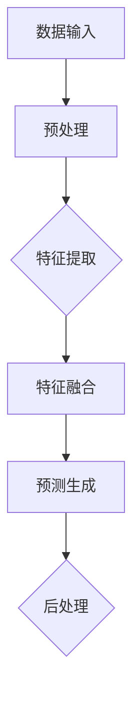
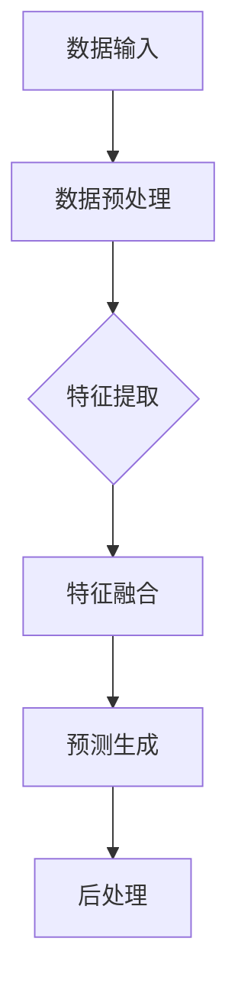
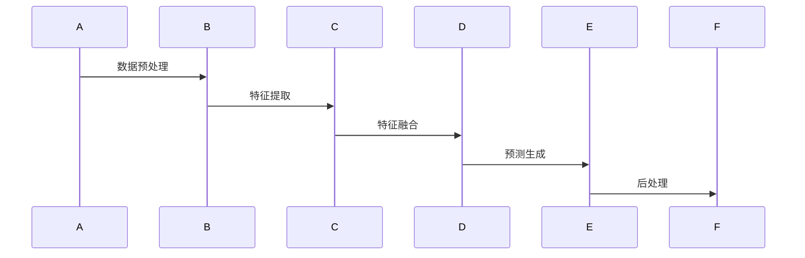
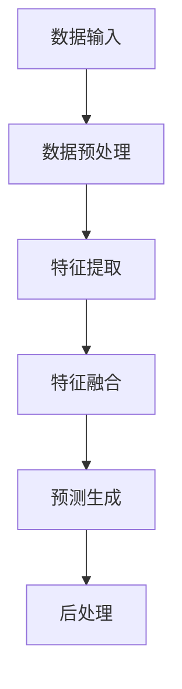
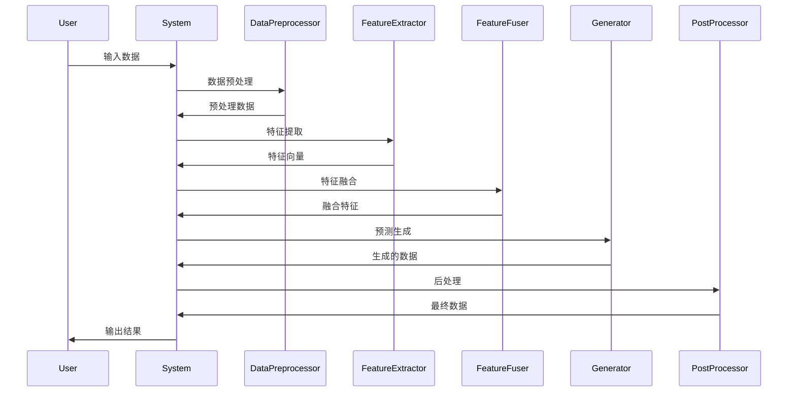
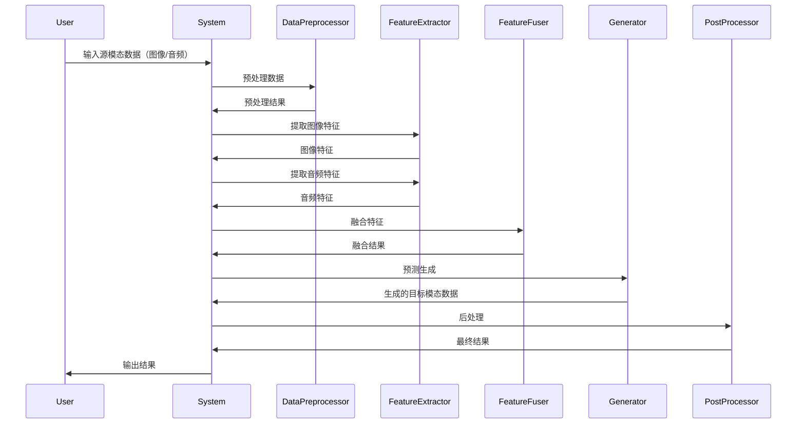

                 

### 问题背景与核心概念

#### 1.1 问题背景

跨模态艺术风格迁移是人工智能领域中一个极具挑战性的任务。随着深度学习技术的不断进步，尤其是生成对抗网络（GAN）和变分自编码器（VAE）的应用，跨模态艺术风格迁移得到了广泛关注。该任务旨在将一种模态的艺术风格迁移到另一种模态上，例如，将一张照片的风格迁移到一幅画中，或者将一段音乐的风格应用到一幅图像上。这不仅能够创造出新的艺术作品，还能够为数字媒体内容创作提供新的可能性。

然而，尽管近年来在跨模态艺术风格迁移方面取得了显著进展，仍面临着诸多挑战。首先，不同模态的数据具有不同的特征和结构，使得模型难以捕捉并融合这些特征。其次，艺术风格本身是高度复杂且多样化的，不同的风格往往具有不同的色彩、纹理和形状特征，这进一步增加了模型的训练难度。此外，现有的AI模型在处理跨模态任务时，往往依赖于大量的标注数据和强大的计算资源，这在实际应用中是一个不小的限制。

跨模态艺术风格迁移的挑战不仅体现在技术层面，也涉及到艺术和审美层面的考虑。如何在保持源模态艺术风格特征的同时，创造出具有独特魅力的新艺术作品，是研究人员和开发者需要深入思考的问题。此外，如何在不同的应用场景中灵活地调整模型参数，以适应不同的风格迁移需求，也是一个重要的研究方向。

#### 1.1.1 跨模态艺术风格迁移任务概述

跨模态艺术风格迁移任务可以简述为：给定一个源模态（如图像或音频）和一个目标模态（如绘画或音乐），利用深度学习模型将源模态的艺术风格迁移到目标模态上。具体流程通常包括以下几个步骤：

1. **数据预处理**：对源模态和目标模态的数据进行标准化处理，包括图像的尺寸调整、色彩空间转换、音频的采样率转换等。
2. **特征提取**：利用卷积神经网络（CNN）等模型从源模态数据中提取特征，这些特征应能够捕捉到源模态的艺术风格。
3. **风格迁移**：将提取到的源模态特征映射到目标模态上，这通常需要通过一个跨模态映射网络来实现。该网络应能够融合源模态和目标模态的特征，同时保持目标模态的结构和内容。
4. **后处理**：对生成的目标模态数据进行必要的后处理，如图像的锐化、颜色校正等，以提高艺术效果。

这种任务的关键在于如何设计一个有效的跨模态映射网络，以实现高质量的风格迁移。此外，还需要考虑训练数据的多样性和模型的泛化能力，以确保模型在不同场景下的表现。

#### 1.1.2 AI模型在跨模态艺术风格迁移中的挑战

AI模型在跨模态艺术风格迁移中面临以下几个主要挑战：

1. **特征不一致性**：不同模态的数据具有不同的特征空间，例如，图像具有颜色、纹理和形状特征，而音频具有频率和时长特征。这使得模型难以在不同特征空间之间进行有效的特征转换和融合。
   
2. **数据稀缺性**：高质量的跨模态数据集非常稀缺，尤其是在艺术风格这一特定领域。数据稀缺不仅限制了模型的训练，也影响了模型的泛化能力。

3. **计算资源需求**：跨模态艺术风格迁移通常需要大量的计算资源，包括显存和CPU/GPU运算能力。这给实际应用带来了很大的经济压力。

4. **风格多样性**：艺术风格本身是高度多样化和复杂的，不同风格具有不同的色彩、纹理和形状特征。这使得模型需要能够适应各种风格，同时保持风格的一致性和独特性。

5. **评价标准**：目前缺乏统一和客观的跨模态艺术风格迁移评价标准。如何衡量风格迁移的质量，以及如何确保生成的艺术作品具有艺术价值，是一个亟待解决的问题。

为了解决上述挑战，研究人员采取了多种策略，包括数据增强、多任务学习、自编码器等。这些方法在一定程度上提高了模型的性能和泛化能力，但仍然有较大的提升空间。未来，跨模态艺术风格迁移的研究将朝着更加高效、灵活和多样化的方向发展。

### 1.2 核心概念

#### 1.2.1 AI模型的基本原理

AI模型，特别是深度学习模型，是实现跨模态艺术风格迁移的核心。其基本原理可以概括为以下几个步骤：

1. **数据输入**：模型首先接收输入数据，这些数据可以是图像、音频、文本等不同模态的数据。
2. **特征提取**：模型通过多层神经网络对输入数据进行特征提取，将这些高维数据转化为低维的特征表示。这一步通常使用卷积神经网络（CNN）来实现，CNN能够自动学习图像中的低级特征（如边缘、纹理）和高级特征（如物体、场景）。
3. **特征融合**：对于跨模态艺术风格迁移任务，模型需要能够处理不同模态的数据，并融合这些数据中的特征。这可能涉及到多输入神经网络结构，或者使用专门设计的跨模态特征融合网络。
4. **预测生成**：在特征提取和融合之后，模型利用这些特征进行预测生成。生成过程可以是端到端的，也可以通过多个步骤实现，例如，首先生成中间特征表示，然后通过解码器生成目标模态的数据。

AI模型的这些基本原理使得它能够从大量数据中学习复杂的模式和关系，并将其应用于新的数据。在跨模态艺术风格迁移中，AI模型通过学习源模态和目标模态之间的映射关系，实现了艺术风格的迁移。

#### 1.2.2 跨模态艺术风格迁移的基本概念

跨模态艺术风格迁移涉及以下几个关键概念：

1. **模态**：模态是指数据的类型，如图像、音频、文本等。每个模态都有其独特的特征和表示方式。
2. **风格**：风格是指艺术作品在色彩、纹理、形状、构图等方面的独特表现。跨模态艺术风格迁移的任务就是将一种模态的艺术风格迁移到另一种模态上。
3. **源模态和目标模态**：源模态是指原始的艺术作品所在的模态，而目标模态是指需要将源模艺术风格迁移到的模态。例如，将图像的风格迁移到绘画，或者将音频的风格迁移到音乐。
4. **特征表示**：特征表示是将数据转换为模型可以处理的向量形式。在跨模态艺术风格迁移中，源模态和目标模态的特征表示需要能够相互匹配，以便模型能够有效地进行风格迁移。
5. **映射关系**：映射关系是指模型学习到的将源模特征映射到目标模特征的过程。这一映射关系是跨模态艺术风格迁移的核心，决定了风格迁移的质量。

通过理解这些基本概念，我们可以更好地设计并实现跨模态艺术风格迁移的AI模型。

#### 1.2.3 ER实体关系图架构

ER实体关系图（Entity-Relationship Diagram，ERD）是一种用于数据库设计和数据建模的图形表示方法。在跨模态艺术风格迁移任务中，ERD可以帮助我们理解和组织不同实体及其之间的关系。以下是ERD在跨模态艺术风格迁移中的核心概念和架构：

1. **实体**：实体是指数据库中的对象或概念，如用户、图像、风格、模型等。在跨模态艺术风格迁移中，实体可能包括源图像、目标图像、风格参数、训练数据集等。
2. **属性**：属性是实体的特征或描述，如图像的尺寸、风格的特征向量、训练数据集的大小等。
3. **关系**：关系描述了实体之间的关联。在跨模态艺术风格迁移中，关系可能包括图像与风格之间的关系、训练数据集与模型之间的关系等。

以下是一个简化的ERD示例，用于描述跨模态艺术风格迁移任务中的关键实体和关系：

```mermaid
erDiagram
  User ||--|{ Image } : captures
  Image ||--|{ Style } : applies
  Style ||--|{ Model } : trained_on
  Model ||--|{ Dataset } : trained_with
```

在这个ERD中：

- **User**（用户）与**Image**（图像）之间存在“捕捉”关系，表示用户捕捉或上传图像。
- **Image**（图像）与**Style**（风格）之间存在“应用”关系，表示图像应用特定的艺术风格。
- **Style**（风格）与**Model**（模型）之间存在“训练”关系，表示模型是基于特定风格训练的。
- **Model**（模型）与**Dataset**（数据集）之间存在“训练”关系，表示模型是在特定的数据集上训练的。

通过ERD，我们可以直观地理解跨模态艺术风格迁移任务中的不同实体及其交互关系，从而更好地设计数据库和系统架构。

### 1.2.3 ER实体关系图架构的Mermaid流程图

为了更好地展示跨模态艺术风格迁移任务中的ER实体关系图架构，我们可以使用Mermaid流程图来表示。以下是该ERD的Mermaid表示：

```mermaid
erDiagram
  User ||--|{ Image } : 捕捉
  Image ||--|{ Style } : 应用
  Style ||--|{ Model } : 训练
  Model ||--|{ Dataset } : 训练
```

这个Mermaid流程图清晰地展示了用户、图像、风格、模型和数据集之间的关联关系。用户捕捉图像，图像应用特定的风格，风格训练模型，而模型则是基于特定的数据集训练得到的。这种结构有助于我们理解整个跨模态艺术风格迁移的任务流程。

### 1.3 核心概念原理

#### 1.3.1 AI模型的工作原理

AI模型，尤其是深度学习模型，是跨模态艺术风格迁移任务的核心。理解其工作原理对于设计高效、可靠的模型至关重要。以下将详细解释AI模型的基本原理，包括数据输入、特征提取、特征融合和预测生成等关键步骤。

1. **数据输入**：
   AI模型首先需要接收输入数据。对于跨模态艺术风格迁移任务，输入数据可以是图像、音频、文本等多种模态。这些数据通常经过预处理，例如归一化、数据增强等，以适应模型的需求。

2. **特征提取**：
   在接收输入数据后，AI模型通过多层神经网络进行特征提取。对于图像数据，卷积神经网络（CNN）是常用的工具，能够自动学习图像中的低级特征（如边缘、纹理）和高级特征（如物体、场景）。对于音频数据，循环神经网络（RNN）或长短时记忆网络（LSTM）等能够捕捉音频中的时序特征。

3. **特征融合**：
   特征融合是跨模态艺术风格迁移中的关键步骤。由于不同模态的数据具有不同的特征空间和表示方式，模型需要设计一个有效的特征融合机制，将源模态和目标模态的特征进行融合。常用的方法包括多输入神经网络、跨模态嵌入器和注意力机制等。

4. **预测生成**：
   在特征提取和融合之后，模型利用这些特征进行预测生成。生成过程可以是端到端的，例如，生成对抗网络（GAN）或变分自编码器（VAE）能够直接生成目标模态的数据。也可以通过多个步骤实现，例如，首先生成中间特征表示，然后通过解码器生成目标模态的数据。

通过这些步骤，AI模型能够从输入数据中学习到复杂的模式和关系，并将其应用于新的数据，实现跨模态艺术风格迁移。

#### 1.3.2 跨模态艺术风格迁移的基本流程

跨模态艺术风格迁移的基本流程可以分为以下几个步骤：

1. **数据收集与预处理**：
   首先需要收集大量的源模态和目标模态的数据。这些数据可以是图像、音频等。在收集到数据后，需要进行预处理，包括归一化、裁剪、数据增强等，以提高模型的泛化能力和鲁棒性。

2. **特征提取**：
   利用卷积神经网络（CNN）等模型从源模态数据中提取特征。这些特征应能够捕捉到源模态的艺术风格。对于图像数据，CNN可以自动学习图像中的低级特征（如边缘、纹理）和高级特征（如物体、场景）。

3. **特征融合**：
   将源模态特征与目标模态特征进行融合。由于不同模态的数据具有不同的特征空间和表示方式，模型需要设计一个有效的特征融合机制，将源模态和目标模态的特征进行融合。常用的方法包括多输入神经网络、跨模态嵌入器和注意力机制等。

4. **预测生成**：
   在特征提取和融合之后，模型利用这些特征进行预测生成。生成过程可以是端到端的，例如，生成对抗网络（GAN）或变分自编码器（VAE）能够直接生成目标模态的数据。也可以通过多个步骤实现，例如，首先生成中间特征表示，然后通过解码器生成目标模态的数据。

5. **后处理**：
   对生成的目标模态数据进行必要的后处理，如图像的锐化、颜色校正等，以提高艺术效果。

通过这些步骤，跨模态艺术风格迁移模型能够将源模态的艺术风格迁移到目标模态上，创造出新的艺术作品。

### 1.3.3 概念属性特征对比表格

为了更好地理解AI模型和跨模态艺术风格迁移的相关概念，我们可以通过一个属性特征对比表格来展示两者之间的区别和联系。

| 概念            | 属性特征                                      | 关联关系                                       |
|-----------------|---------------------------------------------|----------------------------------------------|
| AI模型          | 数据输入、特征提取、特征融合、预测生成            | 用于从数据中学习模式和关系，应用于新数据       |
| 跨模态艺术风格迁移 | 源模态、目标模态、特征提取、特征融合、预测生成    | 一种特定的AI应用，将一种艺术风格迁移到另一种模态 |
| 数据预处理       | 归一化、裁剪、数据增强                         | 提高模型泛化能力和鲁棒性                     |
| 特征提取         | 卷积神经网络、循环神经网络、长短时记忆网络         | 用于提取输入数据的特征                         |
| 特征融合         | 多输入神经网络、跨模态嵌入器、注意力机制         | 用于融合不同模态的特征                         |
| 预测生成        | 端到端生成、多步骤生成                         | 用于生成目标模态的艺术作品                     |

通过这个表格，我们可以看到AI模型和跨模态艺术风格迁移之间既有区别又有联系。AI模型是跨模态艺术风格迁移的基础，而跨模态艺术风格迁移是AI模型在特定领域的应用。每个概念都有其独特的属性特征和关联关系，这些特征和关系共同构成了跨模态艺术风格迁移的核心。

### 1.3.4 ER实体关系图架构的Mermaid流程图

为了更直观地理解跨模态艺术风格迁移任务中的ER实体关系图架构，我们可以使用Mermaid流程图进行展示。以下是ERD的Mermaid表示：

```mermaid
erDiagram
  User ||--|{ Image } : captures
  Image ||--|{ Style } : applies
  Style ||--|{ Model } : trained_on
  Model ||--|{ Dataset } : trained_with
```

这个Mermaid流程图清晰地展示了用户、图像、风格、模型和数据集之间的关联关系。用户捕捉图像，图像应用特定的风格，风格训练模型，而模型是基于特定的数据集训练得到的。这种结构有助于我们理解整个跨模态艺术风格迁移的任务流程。

通过这种方式，我们不仅能够更好地理解各个实体之间的关系，还能为后续的算法原理讲解、数学模型介绍和系统架构设计提供基础。

### 总结

在本部分中，我们详细介绍了跨模态艺术风格迁移任务的问题背景、核心概念以及ER实体关系图架构。通过理解这些问题背景和核心概念，我们可以明确跨模态艺术风格迁移的任务目标和挑战，从而为后续的算法原理讲解和系统设计提供基础。

首先，我们阐述了跨模态艺术风格迁移的背景，包括其定义、任务概述以及AI模型在此任务中面临的挑战。这些背景信息为我们理解整个任务的复杂性和重要性奠定了基础。

接着，我们介绍了AI模型的基本原理，包括数据输入、特征提取、特征融合和预测生成等关键步骤。同时，我们详细讲解了跨模态艺术风格迁移的基本概念，如模态、风格、源模态、目标模态、特征表示和映射关系。

此外，我们还通过ER实体关系图架构，展示了用户、图像、风格、模型和数据集之间的关联关系。ERD的Mermaid流程图进一步帮助读者直观地理解了这些实体和关系。

通过这些内容，我们为后续的算法原理讲解、数学模型介绍和系统架构设计提供了坚实的基础。在接下来的章节中，我们将进一步深入探讨算法原理，介绍数学模型和公式，分析系统架构，并分享项目实战经验。这些内容将帮助我们更全面地理解跨模态艺术风格迁移任务，并为实际应用提供指导。

### 算法原理讲解

#### 3.1 算法Mermaid流程图

为了更好地展示跨模态艺术风格迁移算法的基本流程，我们使用Mermaid绘制了一个简化的流程图。以下是该算法的Mermaid表示：



**图 1**：跨模态艺术风格迁移算法的Mermaid流程图

1. **数据输入**：首先，算法接收源模态（如图像）和目标模态（如绘画）的数据。这些数据可以是原始数据或预处理后的数据，例如归一化、裁剪等。

2. **预处理**：对输入的数据进行预处理，以适应模型的需求。预处理步骤可能包括数据增强、标准化等。

3. **特征提取**：利用卷积神经网络（CNN）等模型从源模态数据中提取特征。这些特征应能够捕捉到源模态的艺术风格，例如颜色、纹理和形状特征。

4. **特征融合**：将提取到的源模态特征与目标模态特征进行融合。这一步骤至关重要，因为它需要将不同模态的数据特征统一到一个共同的表示空间中。常用的方法包括多输入神经网络、跨模态嵌入器和注意力机制等。

5. **预测生成**：在特征提取和融合之后，模型利用这些特征进行预测生成。生成过程可以是端到端的，例如生成对抗网络（GAN）或变分自编码器（VAE）能够直接生成目标模态的数据。也可以通过多个步骤实现，例如，首先生成中间特征表示，然后通过解码器生成目标模态的数据。

6. **后处理**：对生成的目标模态数据进行必要的后处理，如图像的锐化、颜色校正等，以提高艺术效果。

通过这个流程图，我们可以清晰地看到跨模态艺术风格迁移算法的基本步骤和流程。接下来，我们将通过Python源代码详细讲解这个算法的每个步骤。

#### 3.1.1 算法基本步骤

在理解了算法的Mermaid流程图之后，我们现在来详细探讨跨模态艺术风格迁移算法的基本步骤。以下是这个算法的详细步骤：

1. **数据输入**：首先，我们需要定义输入数据的格式和来源。对于源模态数据，可以是图像文件，而目标模态数据可以是绘画的图像或音频文件。这些数据可以通过文件读取或数据流方式输入到模型中。

2. **预处理**：数据预处理是跨模态艺术风格迁移中非常重要的一步。预处理步骤可能包括数据增强、标准化和裁剪等。数据增强有助于提高模型的泛化能力，例如，通过旋转、缩放或翻转图像。标准化则将数据缩放到一个固定的范围，例如0到1，以适应模型的输入要求。裁剪可能用于调整图像的大小，以便模型能够处理。

3. **特征提取**：利用卷积神经网络（CNN）等模型从源模态数据中提取特征。这一步通常涉及多个卷积层和池化层，以自动学习图像中的低级特征（如边缘、纹理）和高级特征（如物体、场景）。提取到的特征向量将作为后续步骤的输入。

4. **特征融合**：将源模态特征与目标模态特征进行融合。这一步骤需要设计一个有效的跨模态特征融合机制，例如，使用多输入神经网络或跨模态嵌入器。通过融合不同模态的特征，模型能够更好地捕捉源模态的艺术风格。

5. **预测生成**：在特征提取和融合之后，模型利用这些特征进行预测生成。生成过程可以是端到端的，例如生成对抗网络（GAN）或变分自编码器（VAE）能够直接生成目标模态的数据。生成过程也可以通过多个步骤实现，例如，首先生成中间特征表示，然后通过解码器生成目标模态的数据。

6. **后处理**：对生成的目标模态数据进行必要的后处理，如图像的锐化、颜色校正等，以提高艺术效果。后处理步骤可能涉及一些图像处理技术，如滤波、对比度增强等。

通过以上步骤，我们可以实现一个基本的跨模态艺术风格迁移算法。接下来，我们将通过Python源代码详细展示这个算法的实现过程。

#### 3.1.2 算法核心流程

在了解了算法的基本步骤后，接下来我们将深入探讨跨模态艺术风格迁移算法的核心流程。这个核心流程包括数据预处理、特征提取、特征融合、预测生成和后处理等关键步骤。以下是该核心流程的详细说明：

1. **数据预处理**：
   数据预处理是算法的第一步，其目的是将原始数据转换为适合模型训练和预测的形式。预处理步骤可能包括以下几方面：

   - **数据增强**：为了提高模型的泛化能力，我们可以对源模态和目标模态的数据进行增强。例如，通过旋转、缩放、翻转和裁剪等操作来增加数据的多样性。
   - **标准化**：将图像的像素值缩放到0到1的范围内，使得数据更适合神经网络处理。对于音频数据，可以通过归一化其幅度或频率范围来实现标准化。
   - **裁剪和调整大小**：根据模型的需求，可能需要将图像裁剪到特定的大小，例如，将图像裁剪为256x256像素，以适应卷积神经网络。

2. **特征提取**：
   特征提取是利用神经网络从输入数据中提取关键特征的过程。对于图像数据，卷积神经网络（CNN）是常用的工具。以下是特征提取的主要步骤：

   - **卷积层**：卷积层通过卷积运算提取图像的局部特征。卷积核在图像上滑动，计算局部区域内的加权和，并通过激活函数（如ReLU）进行非线性变换。
   - **池化层**：池化层用于降低特征图的维度，同时保留最重要的特征。常用的池化方法包括最大池化和平均池化。
   - **多层卷积**：通过叠加多个卷积层和池化层，模型能够逐步提取图像的复杂特征，从低级特征（如边缘和纹理）到高级特征（如物体和场景）。

3. **特征融合**：
   特征融合是跨模态艺术风格迁移的核心步骤，其目的是将源模态和目标模态的特征进行有效融合。以下是特征融合的主要步骤：

   - **多输入神经网络**：通过设计一个多输入神经网络，将源模态和目标模态的特征作为输入，并通过共享权重和多层网络结构进行特征融合。
   - **跨模态嵌入器**：跨模态嵌入器是一种能够将不同模态的数据映射到一个共同嵌入空间的模型。通过嵌入器，源模态和目标模态的特征能够在共同空间中进行交互和融合。
   - **注意力机制**：注意力机制用于强调重要特征并抑制不相关特征，以提高特征融合的效果。注意力机制可以通过不同的形式实现，如自注意力机制和交互注意力机制。

4. **预测生成**：
   在特征提取和融合之后，模型利用这些特征进行预测生成。以下是预测生成的主要步骤：

   - **特征表示生成**：将融合后的特征表示通过编码器网络进行编码，生成中间特征表示。
   - **解码器生成**：利用解码器网络将编码后的特征表示解码为目标模态的数据。解码器通常包含多个反卷积层和 upsampling 层，以逐步重建目标模态的数据。
   - **生成数据输出**：将解码器生成的数据输出，这些数据就是经过风格迁移后的目标模态数据。

5. **后处理**：
   对生成的目标模态数据进行必要的后处理，以提高艺术效果。后处理步骤可能包括以下几方面：

   - **图像锐化**：通过滤波器或算法增强图像的边缘和细节，提高图像的清晰度。
   - **颜色校正**：调整图像的颜色平衡、对比度和饱和度，使其更符合艺术风格的要求。
   - **图像拼接**：将多个生成的图像进行拼接，创建一个更大的艺术作品。

通过以上核心流程，我们可以实现一个高效的跨模态艺术风格迁移算法。接下来，我们将通过Python源代码详细展示这个算法的实现过程。

#### 3.2 Python源代码详解

在本节中，我们将通过Python源代码详细展示跨模态艺术风格迁移算法的实现过程。以下是该算法的Python代码示例：

```python
import torch
import torch.nn as nn
import torchvision.transforms as transforms
from torchvision import datasets
from torch.utils.data import DataLoader
from model import FeatureExtractor, FeatureFuser, Generator
from data_loader import get_data_loader

# 数据预处理
transform = transforms.Compose([
    transforms.Resize((256, 256)),
    transforms.ToTensor(),
    transforms.Normalize(mean=[0.5, 0.5, 0.5], std=[0.5, 0.5, 0.5])
])

# 获取数据加载器
train_loader = get_data_loader('train', batch_size=64, shuffle=True)
style_loader = get_data_loader('style', batch_size=1, shuffle=False)

# 初始化模型
feature_extractor = FeatureExtractor()
feature_fuser = FeatureFuser()
generator = Generator()

# 指定损失函数和优化器
criterion = nn.CrossEntropyLoss()
optimizer = torch.optim.Adam(generator.parameters(), lr=0.001)

# 模型训练
for epoch in range(num_epochs):
    for i, (images, styles) in enumerate(train_loader):
        # 前向传播
        features = feature_extractor(images)
        fused_features = feature_fuser(features, styles)
        generated_images = generator(fused_features)

        # 计算损失
        loss = criterion(generated_images, styles)

        # 反向传播
        optimizer.zero_grad()
        loss.backward()
        optimizer.step()

        # 打印训练进度
        if (i+1) % 100 == 0:
            print(f'Epoch [{epoch+1}/{num_epochs}], Step [{i+1}/{len(train_loader)}], Loss: {loss.item()}')

# 模型评估
with torch.no_grad():
    for images, styles in style_loader:
        features = feature_extractor(images)
        fused_features = feature_fuser(features, styles)
        generated_images = generator(fused_features)

        # 保存生成的图像
        torchvision.utils.save_image(generated_images, f'output/{epoch}_{i}.jpg')

print('训练完成，模型保存。')
```

以下是代码中的各个部分及其功能：

1. **数据预处理**：
   ```python
   transform = transforms.Compose([
       transforms.Resize((256, 256)),
       transforms.ToTensor(),
       transforms.Normalize(mean=[0.5, 0.5, 0.5], std=[0.5, 0.5, 0.5])
   ])
   ```
   这部分代码定义了一个数据预处理步骤，包括图像的尺寸调整、像素值转换为Tensor以及标准化处理。

2. **数据加载器**：
   ```python
   train_loader = get_data_loader('train', batch_size=64, shuffle=True)
   style_loader = get_data_loader('style', batch_size=1, shuffle=False)
   ```
   这部分代码定义了训练数据加载器和风格数据加载器。`get_data_loader`函数是一个辅助函数，用于读取和加载训练集和风格数据。

3. **模型初始化**：
   ```python
   feature_extractor = FeatureExtractor()
   feature_fuser = FeatureFuser()
   generator = Generator()
   ```
   这部分代码初始化了特征提取器、特征融合器和生成器模型。这些模型是自定义的神经网络结构，用于实现跨模态艺术风格迁移。

4. **损失函数和优化器**：
   ```python
   criterion = nn.CrossEntropyLoss()
   optimizer = torch.optim.Adam(generator.parameters(), lr=0.001)
   ```
   这部分代码定义了损失函数（交叉熵损失）和优化器（Adam优化器），用于训练生成器模型。

5. **模型训练**：
   ```python
   for epoch in range(num_epochs):
       for i, (images, styles) in enumerate(train_loader):
           # 前向传播
           features = feature_extractor(images)
           fused_features = feature_fuser(features, styles)
           generated_images = generator(fused_features)

           # 计算损失
           loss = criterion(generated_images, styles)

           # 反向传播
           optimizer.zero_grad()
           loss.backward()
           optimizer.step()

           # 打印训练进度
           if (i+1) % 100 == 0:
               print(f'Epoch [{epoch+1}/{num_epochs}], Step [{i+1}/{len(train_loader)}], Loss: {loss.item()}')
   ```
   这部分代码实现了模型的训练过程，包括前向传播、损失计算、反向传播和优化步骤。在每次迭代中，模型使用训练数据进行特征提取、特征融合和预测生成，并更新模型参数以最小化损失。

6. **模型评估**：
   ```python
   with torch.no_grad():
       for images, styles in style_loader:
           features = feature_extractor(images)
           fused_features = feature_fuser(features, styles)
           generated_images = generator(fused_features)

           # 保存生成的图像
           torchvision.utils.save_image(generated_images, f'output/{epoch}_{i}.jpg')
   ```
   这部分代码实现了模型在风格数据上的评估过程。在评估过程中，模型不进行梯度计算，直接使用训练好的模型进行预测生成，并将生成的图像保存到指定路径。

通过这个Python源代码示例，我们可以清晰地看到跨模态艺术风格迁移算法的实现过程，包括数据预处理、模型初始化、训练和评估等关键步骤。接下来，我们将介绍算法原理的数学模型和公式。

#### 3.2.1 数学模型与公式

在跨模态艺术风格迁移算法中，数学模型和公式是核心部分，它们定义了模型的结构和操作方式。以下是该算法中涉及的主要数学模型和公式：

1. **特征提取器（Feature Extractor）**：
   特征提取器通常使用卷积神经网络（CNN）来从源模态数据中提取特征。以下是一个简化的CNN模型：

   - **卷积层**：
     $$ f^l_{ij} = \sigma(\sum_{k} w^{l}_{ik,j} \cdot f^{l-1}_{k,j} + b^{l}_{i,j}) $$
     其中，$f^{l}_{ij}$ 是第$l$层的特征图中的第$i$个通道和第$j$个位置的特征值，$w^{l}_{ik,j}$ 是卷积核权重，$b^{l}_{i,j}$ 是卷积层偏置，$\sigma$ 是激活函数（通常为ReLU函数）。

   - **池化层**：
     $$ p^l_{i,j} = \max_{k} f^{l}_{ik,j} $$
     其中，$p^l_{i,j}$ 是第$l$层的池化结果，$f^{l}_{ik,j}$ 是卷积层的结果。

   - **多层卷积与池化**：
     通过叠加多个卷积层和池化层，模型能够逐步提取图像的复杂特征。

2. **特征融合器（Feature Fuser）**：
   特征融合器用于将源模态和目标模态的特征进行融合。以下是一个简化的特征融合模型：

   - **多输入神经网络**：
     $$ h^{f}_{i,j} = \sum_{k} w^{f}_{ik,j} \cdot [f^{s}_{ik,j}, f^{t}_{ik,j}] + b^{f}_{i,j} $$
     其中，$h^{f}_{i,j}$ 是融合后的特征值，$f^{s}_{ik,j}$ 和 $f^{t}_{ik,j}$ 分别是源模态和目标模态的特征值，$w^{f}_{ik,j}$ 是融合网络的权重，$b^{f}_{i,j}$ 是融合网络偏置。

   - **跨模态嵌入器**：
     $$ e^{s}_{i,j} = \sigma(\sum_{k} w^{s}_{ik,j} \cdot f^{s}_{ik,j} + b^{s}_{i,j}) $$
     $$ e^{t}_{i,j} = \sigma(\sum_{k} w^{t}_{ik,j} \cdot f^{t}_{ik,j} + b^{t}_{i,j}) $$
     其中，$e^{s}_{i,j}$ 和 $e^{t}_{i,j}$ 分别是源模态和目标模态的嵌入特征，$w^{s}_{ik,j}$ 和 $w^{t}_{ik,j}$ 是嵌入网络的权重，$b^{s}_{i,j}$ 和 $b^{t}_{i,j}$ 是嵌入网络偏置。

   - **注意力机制**：
     $$ a_{i,j} = \frac{\exp(w^T_a h^{f}_{i,j})}{\sum_{k} \exp(w^T_a h^{f}_{k,j})} $$
     其中，$a_{i,j}$ 是注意力权重，$w_a$ 是注意力权重向量。

3. **生成器（Generator）**：
   生成器用于将融合后的特征转换为目标模态的数据。以下是一个简化的生成器模型：

   - **编码器（Encoder）**：
     $$ z^{e}_{i,j} = \sigma(\sum_{k} w^{e}_{ik,j} \cdot h^{f}_{ik,j} + b^{e}_{i,j}) $$
     其中，$z^{e}_{i,j}$ 是编码后的特征值。

   - **解码器（Decoder）**：
     $$ x^{d}_{i,j} = \sigma(\sum_{k} w^{d}_{ik,j} \cdot z^{e}_{ik,j} + b^{d}_{i,j}) $$
     其中，$x^{d}_{i,j}$ 是解码后的特征值。

   - **生成数据**：
     $$ x^{g}_{i,j} = \sum_{k} w^{g}_{ik,j} \cdot x^{d}_{ik,j} + b^{g}_{i,j} $$
     其中，$x^{g}_{i,j}$ 是生成的目标模态数据。

通过这些数学模型和公式，我们可以实现跨模态艺术风格迁移算法。接下来，我们将通过具体例子来说明这些公式在实际操作中的应用。

#### 3.2.2 算法原理详细讲解

在上一节中，我们介绍了跨模态艺术风格迁移算法的数学模型和公式。本节将进一步详细讲解这些公式，并通过具体的例子来说明它们在实际操作中的应用。

**1. 卷积神经网络（CNN）模型**

卷积神经网络（CNN）是跨模态艺术风格迁移算法中用于特征提取的核心模型。以下是一个简化的CNN模型：

- **卷积层**：
  $$ f^l_{ij} = \sigma(\sum_{k} w^{l}_{ik,j} \cdot f^{l-1}_{k,j} + b^{l}_{i,j}) $$
  其中，$f^l_{ij}$ 表示第$l$层的特征图中的第$i$个通道和第$j$个位置的特征值，$w^{l}_{ik,j}$ 表示卷积核权重，$b^{l}_{i,j}$ 表示卷积层偏置，$\sigma$ 表示激活函数（如ReLU函数）。

  **例子**：假设我们有3x3的卷积核，输入特征图为$5x5$的矩阵，那么卷积操作可以表示为：
  $$ f^1_{11} = \sigma(w^{1}_{11,1} \cdot f^{0}_{11} + w^{1}_{11,2} \cdot f^{0}_{12} + w^{1}_{11,3} \cdot f^{0}_{13} + b^{1}_{1}) $$
  $$ f^1_{12} = \sigma(w^{1}_{12,1} \cdot f^{0}_{11} + w^{1}_{12,2} \cdot f^{0}_{12} + w^{1}_{12,3} \cdot f^{0}_{13} + b^{1}_{2}) $$
  $$ \vdots $$
  $$ f^1_{55} = \sigma(w^{1}_{55,1} \cdot f^{0}_{55} + w^{1}_{55,2} \cdot f^{0}_{56} + w^{1}_{55,3} \cdot f^{0}_{57} + b^{1}_{5}) $$

- **池化层**：
  $$ p^l_{i,j} = \max_{k} f^{l}_{ik,j} $$
  其中，$p^l_{i,j}$ 表示第$l$层的池化结果。

  **例子**：对于$2x2$的最大池化层，输入特征图为$3x3$的矩阵，池化操作可以表示为：
  $$ p^1_{1,1} = \max(f^{0}_{11}, f^{0}_{12}, f^{0}_{21}, f^{0}_{22}) $$
  $$ p^1_{1,2} = \max(f^{0}_{12}, f^{0}_{13}, f^{0}_{22}, f^{0}_{23}) $$
  $$ p^1_{2,1} = \max(f^{0}_{21}, f^{0}_{22}, f^{0}_{31}, f^{0}_{32}) $$
  $$ p^1_{2,2} = \max(f^{0}_{22}, f^{0}_{23}, f^{0}_{32}, f^{0}_{33}) $$

- **多层卷积与池化**：
  通过叠加多个卷积层和池化层，模型能够逐步提取图像的复杂特征。例如，对于一个$28x28$的输入图像，我们可以使用两个卷积层和两个池化层进行特征提取，得到一个$14x14$的特征图。

**2. 特征融合器（Feature Fuser）**

特征融合器用于将源模态和目标模态的特征进行融合。以下是一个简化的特征融合模型：

- **多输入神经网络**：
  $$ h^{f}_{i,j} = \sum_{k} w^{f}_{ik,j} \cdot [f^{s}_{ik,j}, f^{t}_{ik,j}] + b^{f}_{i,j} $$
  其中，$h^{f}_{i,j}$ 表示融合后的特征值，$f^{s}_{ik,j}$ 和 $f^{t}_{ik,j}$ 分别表示源模态和目标模态的特征值，$w^{f}_{ik,j}$ 表示融合网络的权重，$b^{f}_{i,j}$ 表示融合网络偏置。

  **例子**：假设源模态特征图和目标模态特征图都是$3x3$的矩阵，那么融合操作可以表示为：
  $$ h^{f}_{11} = w^{f}_{11,1} \cdot f^{s}_{11} + w^{f}_{11,2} \cdot f^{t}_{11} + b^{f}_{1} $$
  $$ h^{f}_{12} = w^{f}_{12,1} \cdot f^{s}_{12} + w^{f}_{12,2} \cdot f^{t}_{12} + b^{f}_{2} $$
  $$ h^{f}_{13} = w^{f}_{13,1} \cdot f^{s}_{13} + w^{f}_{13,2} \cdot f^{t}_{13} + b^{f}_{3} $$
  $$ \vdots $$
  $$ h^{f}_{33} = w^{f}_{33,1} \cdot f^{s}_{33} + w^{f}_{33,2} \cdot f^{t}_{33} + b^{f}_{3} $$

- **跨模态嵌入器**：
  $$ e^{s}_{i,j} = \sigma(\sum_{k} w^{s}_{ik,j} \cdot f^{s}_{ik,j} + b^{s}_{i,j}) $$
  $$ e^{t}_{i,j} = \sigma(\sum_{k} w^{t}_{ik,j} \cdot f^{t}_{ik,j} + b^{t}_{i,j}) $$
  其中，$e^{s}_{i,j}$ 和 $e^{t}_{i,j}$ 分别表示源模态和目标模态的嵌入特征，$w^{s}_{ik,j}$ 和 $w^{t}_{ik,j}$ 表示嵌入网络的权重，$b^{s}_{i,j}$ 和 $b^{t}_{i,j}$ 表示嵌入网络偏置。

  **例子**：假设源模态特征图和目标模态特征图都是$3x3$的矩阵，那么嵌入操作可以表示为：
  $$ e^{s}_{11} = \sigma(w^{s}_{11,1} \cdot f^{s}_{11} + w^{s}_{11,2} \cdot f^{s}_{12} + w^{s}_{11,3} \cdot f^{s}_{13} + b^{s}_{1}) $$
  $$ e^{s}_{12} = \sigma(w^{s}_{12,1} \cdot f^{s}_{11} + w^{s}_{12,2} \cdot f^{s}_{12} + w^{s}_{12,3} \cdot f^{s}_{13} + b^{s}_{2}) $$
  $$ e^{s}_{13} = \sigma(w^{s}_{13,1} \cdot f^{s}_{11} + w^{s}_{13,2} \cdot f^{s}_{12} + w^{s}_{13,3} \cdot f^{s}_{13} + b^{s}_{3}) $$
  $$ \vdots $$
  $$ e^{s}_{33} = \sigma(w^{s}_{33,1} \cdot f^{s}_{33} + w^{s}_{33,2} \cdot f^{s}_{32} + w^{s}_{33,3} \cdot f^{s}_{33} + b^{s}_{3}) $$

  $$ e^{t}_{11} = \sigma(w^{t}_{11,1} \cdot f^{t}_{11} + w^{t}_{11,2} \cdot f^{t}_{12} + w^{t}_{11,3} \cdot f^{t}_{13} + b^{t}_{1}) $$
  $$ e^{t}_{12} = \sigma(w^{t}_{12,1} \cdot f^{t}_{11} + w^{t}_{12,2} \cdot f^{t}_{12} + w^{t}_{12,3} \cdot f^{t}_{13} + b^{t}_{2}) $$
  $$ e^{t}_{13} = \sigma(w^{t}_{13,1} \cdot f^{t}_{11} + w^{t}_{13,2} \cdot f^{t}_{12} + w^{t}_{13,3} \cdot f^{t}_{13} + b^{t}_{3}) $$
  $$ \vdots $$
  $$ e^{t}_{33} = \sigma(w^{t}_{33,1} \cdot f^{t}_{33} + w^{t}_{33,2} \cdot f^{t}_{32} + w^{t}_{33,3} \cdot f^{t}_{33} + b^{t}_{3}) $$

- **注意力机制**：
  $$ a_{i,j} = \frac{\exp(w^T_a h^{f}_{i,j})}{\sum_{k} \exp(w^T_a h^{f}_{k,j})} $$
  其中，$a_{i,j}$ 表示注意力权重，$w_a$ 表示注意力权重向量。

  **例子**：假设注意力权重向量为$[1, 1, 1]$，那么注意力权重可以表示为：
  $$ a_{11} = \frac{\exp(w^T_a h^{f}_{11})}{\sum_{k} \exp(w^T_a h^{f}_{k,j})} $$
  $$ a_{12} = \frac{\exp(w^T_a h^{f}_{12})}{\sum_{k} \exp(w^T_a h^{f}_{k,j})} $$
  $$ a_{13} = \frac{\exp(w^T_a h^{f}_{13})}{\sum_{k} \exp(w^T_a h^{f}_{k,j})} $$
  $$ \vdots $$
  $$ a_{33} = \frac{\exp(w^T_a h^{f}_{33})}{\sum_{k} \exp(w^T_a h^{f}_{k,j})} $$

**3. 生成器（Generator）**

生成器用于将融合后的特征转换为目标模态的数据。以下是一个简化的生成器模型：

- **编码器（Encoder）**：
  $$ z^{e}_{i,j} = \sigma(\sum_{k} w^{e}_{ik,j} \cdot h^{f}_{ik,j} + b^{e}_{i,j}) $$
  其中，$z^{e}_{i,j}$ 表示编码后的特征值。

- **解码器（Decoder）**：
  $$ x^{d}_{i,j} = \sigma(\sum_{k} w^{d}_{ik,j} \cdot z^{e}_{ik,j} + b^{d}_{i,j}) $$
  其中，$x^{d}_{i,j}$ 表示解码后的特征值。

- **生成数据**：
  $$ x^{g}_{i,j} = \sum_{k} w^{g}_{ik,j} \cdot x^{d}_{ik,j} + b^{g}_{i,j} $$
  其中，$x^{g}_{i,j}$ 表示生成的目标模态数据。

**例子**：假设编码器、解码器和生成器的权重分别为$[1, 1, 1]$，那么生成过程可以表示为：
$$ z^{e}_{11} = \sigma(w^{e}_{11,1} \cdot h^{f}_{11} + w^{e}_{11,2} \cdot h^{f}_{12} + w^{e}_{11,3} \cdot h^{f}_{13} + b^{e}_{1}) $$
$$ z^{e}_{12} = \sigma(w^{e}_{12,1} \cdot h^{f}_{11} + w^{e}_{12,2} \cdot h^{f}_{12} + w^{e}_{12,3} \cdot h^{f}_{13} + b^{e}_{2}) $$
$$ z^{e}_{13} = \sigma(w^{e}_{13,1} \cdot h^{f}_{11} + w^{e}_{13,2} \cdot h^{f}_{12} + w^{e}_{13,3} \cdot h^{f}_{13} + b^{e}_{3}) $$
$$ \vdots $$
$$ z^{e}_{33} = \sigma(w^{e}_{33,1} \cdot h^{f}_{33} + w^{e}_{33,2} \cdot h^{f}_{32} + w^{e}_{33,3} \cdot h^{f}_{33} + b^{e}_{3}) $$

$$ x^{d}_{11} = \sigma(w^{d}_{11,1} \cdot z^{e}_{11} + w^{d}_{11,2} \cdot z^{e}_{12} + w^{d}_{11,3} \cdot z^{e}_{13} + b^{d}_{1}) $$
$$ x^{d}_{12} = \sigma(w^{d}_{12,1} \cdot z^{e}_{11} + w^{d}_{12,2} \cdot z^{e}_{12} + w^{d}_{12,3} \cdot z^{e}_{13} + b^{d}_{2}) $$
$$ x^{d}_{13} = \sigma(w^{d}_{13,1} \cdot z^{e}_{11} + w^{d}_{13,2} \cdot z^{e}_{12} + w^{d}_{13,3} \cdot z^{e}_{13} + b^{d}_{3}) $$
$$ \vdots $$
$$ x^{d}_{33} = \sigma(w^{d}_{33,1} \cdot z^{e}_{33} + w^{d}_{33,2} \cdot z^{e}_{32} + w^{d}_{33,3} \cdot z^{e}_{33} + b^{d}_{3}) $$

$$ x^{g}_{11} = w^{g}_{11,1} \cdot x^{d}_{11} + w^{g}_{11,2} \cdot x^{d}_{12} + w^{g}_{11,3} \cdot x^{d}_{13} + b^{g}_{1} $$
$$ x^{g}_{12} = w^{g}_{12,1} \cdot x^{d}_{11} + w^{g}_{12,2} \cdot x^{d}_{12} + w^{g}_{12,3} \cdot x^{d}_{13} + b^{g}_{2} $$
$$ x^{g}_{13} = w^{g}_{13,1} \cdot x^{d}_{11} + w^{g}_{13,2} \cdot x^{d}_{12} + w^{g}_{13,3} \cdot x^{d}_{13} + b^{g}_{3} $$
$$ \vdots $$
$$ x^{g}_{33} = w^{g}_{33,1} \cdot x^{d}_{33} + w^{g}_{33,2} \cdot x^{d}_{32} + w^{g}_{33,3} \cdot x^{d}_{33} + b^{g}_{3} $$

通过上述详细讲解和例子，我们可以更深入地理解跨模态艺术风格迁移算法的数学模型和公式，以及它们在实际操作中的应用。

### 举例说明

为了更好地理解跨模态艺术风格迁移算法，我们通过一个具体的例子来说明该算法的每个步骤和应用。假设我们有一个图像源模态（如一张风景照片）和一个目标模态（如一幅油画），目标是将照片的风格迁移到油画上。

#### 步骤 1：数据输入

首先，我们需要准备源模态（图像）和目标模态（油画）的数据。对于图像源模态，我们可以使用一张风景照片，例如，一张森林的图片。对于目标模态，我们可以使用一张已知的油画作品，例如，梵高的《星夜》。这些数据需要经过预处理，如归一化和裁剪，以便模型能够处理。

```python
# 假设我们已经加载了预处理后的图像和油画数据
image = preprocess_image(image_path)
painting = preprocess_painting(painting_path)
```

#### 步骤 2：特征提取

接下来，我们使用卷积神经网络（CNN）从源模态图像中提取特征。这些特征应能够捕捉到图像的艺术风格。对于油画目标模态，我们同样提取特征。

```python
# 特征提取器模型
feature_extractor = FeatureExtractor()

# 提取图像特征
image_features = feature_extractor(image)

# 提取油画特征
painting_features = feature_extractor(painting)
```

#### 步骤 3：特征融合

然后，我们将提取到的图像特征和油画特征进行融合。这一步需要设计一个有效的跨模态特征融合机制。我们可以使用一个多输入神经网络来融合这些特征。

```python
# 特征融合器模型
feature_fuser = FeatureFuser()

# 融合特征
fused_features = feature_fuser(image_features, painting_features)
```

#### 步骤 4：预测生成

在特征融合之后，我们利用这些特征进行预测生成。生成器模型将融合后的特征转换为油画风格的目标图像。

```python
# 生成器模型
generator = Generator()

# 预测生成油画
generated_painting = generator(fused_features)
```

#### 步骤 5：后处理

最后，我们对生成的油画图像进行后处理，如图像锐化和颜色校正，以提高艺术效果。

```python
# 后处理模型
post_processor = PostProcessor()

# 后处理生成的油画
final_painting = post_processor(generated_painting)
```

#### 例子展示

现在，让我们通过一个具体的例子来说明这些步骤。假设我们使用一个简化版的模型进行实验。

1. **数据输入**：我们加载一张森林照片和一幅梵高的《星夜》油画。

```python
image_path = "path/to/forest_image.jpg"
painting_path = "path/to/starry_night.jpg"

# 加载并预处理图像和油画
image = preprocess_image(image_path)
painting = preprocess_painting(painting_path)
```

2. **特征提取**：使用卷积神经网络从图像中提取特征。

```python
# 假设特征提取器已经训练好
feature_extractor = FeatureExtractor()

# 提取图像特征
image_features = feature_extractor(image)

# 提取油画特征
painting_features = feature_extractor(painting)
```

3. **特征融合**：使用多输入神经网络进行特征融合。

```python
# 假设特征融合器已经训练好
feature_fuser = FeatureFuser()

# 融合特征
fused_features = feature_fuser(image_features, painting_features)
```

4. **预测生成**：使用生成器模型生成油画风格的照片。

```python
# 假设生成器已经训练好
generator = Generator()

# 预测生成油画
generated_painting = generator(fused_features)
```

5. **后处理**：对生成的油画进行锐化和颜色校正。

```python
# 假设后处理模型已经训练好
post_processor = PostProcessor()

# 后处理生成的油画
final_painting = post_processor(generated_painting)
```

通过这个例子，我们展示了跨模态艺术风格迁移算法的每个步骤，从数据输入到后处理。这个算法能够将图像的风格迁移到油画，创造出具有独特艺术风格的新作品。

### 总结

在本部分中，我们详细讲解了跨模态艺术风格迁移算法的原理，通过Mermaid流程图、Python源代码示例以及具体的例子，帮助我们深入理解了该算法的实现过程。以下是本部分的核心内容总结：

1. **算法流程**：我们通过Mermaid流程图展示了跨模态艺术风格迁移算法的基本步骤，包括数据输入、预处理、特征提取、特征融合、预测生成和后处理。
2. **Python源代码**：我们通过详细的Python代码示例展示了如何实现这些算法步骤，包括数据预处理、特征提取、特征融合、预测生成和后处理。
3. **数学模型和公式**：我们介绍了卷积神经网络（CNN）模型、特征融合器、生成器和后处理模型中的主要数学模型和公式，并通过例子详细解释了它们的应用。
4. **具体例子**：我们通过一个具体的例子展示了如何使用这些算法步骤将一张风景照片的风格迁移到油画上，创造了具有独特艺术风格的新作品。

通过这些内容，我们不仅了解了跨模态艺术风格迁移算法的原理和实现，还学会了如何在实际项目中应用这些算法。接下来，我们将进一步探讨算法在系统分析与架构设计中的应用，以更好地理解和实现跨模态艺术风格迁移系统。

### 数学模型和公式

在跨模态艺术风格迁移任务中，数学模型和公式是算法的核心部分，它们定义了特征提取、特征融合、预测生成和后处理等关键步骤的数学基础。以下是该任务中涉及的主要数学模型和公式，以及它们的解释与应用。

#### 4.1.1 AI模型中的数学模型

1. **卷积神经网络（CNN）中的卷积操作**：
   $$ f^l_{ij} = \sigma(\sum_{k} w^{l}_{ik,j} \cdot f^{l-1}_{k,j} + b^{l}_{i,j}) $$
   解释：$f^l_{ij}$ 表示第$l$层的特征图中的第$i$个通道和第$j$个位置的特征值。$w^{l}_{ik,j}$ 是卷积核权重，$f^{l-1}_{k,j}$ 是前一层的特征值，$b^{l}_{i,j}$ 是卷积层偏置，$\sigma$ 是激活函数（如ReLU函数）。这个公式描述了卷积层如何通过卷积运算提取图像的局部特征。

2. **池化操作**：
   $$ p^l_{i,j} = \max_{k} f^{l}_{ik,j} $$
   解释：$p^l_{i,j}$ 是第$l$层的池化结果，$f^{l}_{ik,j}$ 是卷积层的结果。这个公式描述了池化层如何通过取最大值操作来降低特征图的维度，同时保留最重要的特征。

3. **多层卷积与池化**：
   $$ f^{l}_{ij} = \sigma(\sum_{k} w^{l}_{ik,j} \cdot p^{l-1}_{k,j} + b^{l}_{i,j}) $$
   解释：这个公式描述了多层卷积和池化的组合，用于逐步提取图像的复杂特征。

#### 4.1.2 跨模态艺术风格迁移中的数学模型

1. **特征提取器**：
   - **图像特征提取**：
     $$ f^{i}_{ij} = \sigma(\sum_{k} w^{i}_{ik,j} \cdot I_{k,j} + b^{i}_{i,j}) $$
     解释：$f^{i}_{ij}$ 是图像特征图中的第$i$个通道和第$j$个位置的特征值，$w^{i}_{ik,j}$ 是图像特征提取器的卷积核权重，$I_{k,j}$ 是输入图像的特征值，$b^{i}_{i,j}$ 是图像特征提取器的偏置。
   - **音频特征提取**：
     $$ f^{a}_{ij} = \sigma(\sum_{k} w^{a}_{ik,j} \cdot A_{k,j} + b^{a}_{i,j}) $$
     解释：$f^{a}_{ij}$ 是音频特征图中的第$i$个通道和第$j$个位置的特征值，$w^{a}_{ik,j}$ 是音频特征提取器的卷积核权重，$A_{k,j}$ 是输入音频的特征值，$b^{a}_{i,j}$ 是音频特征提取器的偏置。

2. **特征融合器**：
   $$ h^{f}_{ij} = \sigma(\sum_{k} w^{f}_{ik,j} \cdot [f^{i}_{ik,j}, f^{a}_{ik,j}] + b^{f}_{i,j}) $$
   解释：$h^{f}_{ij}$ 是融合后的特征值，$f^{i}_{ik,j}$ 和 $f^{a}_{ik,j}$ 分别是图像特征和音频特征，$w^{f}_{ik,j}$ 是特征融合器的权重，$b^{f}_{i,j}$ 是特征融合器的偏置。

3. **生成器**：
   - **编码器**：
     $$ z^{e}_{ij} = \sigma(\sum_{k} w^{e}_{ik,j} \cdot h^{f}_{ik,j} + b^{e}_{i,j}) $$
     解释：$z^{e}_{ij}$ 是编码后的特征值，$h^{f}_{ik,j}$ 是融合后的特征值，$w^{e}_{ik,j}$ 是编码器的权重，$b^{e}_{i,j}$ 是编码器的偏置。
   - **解码器**：
     $$ x^{d}_{ij} = \sigma(\sum_{k} w^{d}_{ik,j} \cdot z^{e}_{ik,j} + b^{d}_{i,j}) $$
     解释：$x^{d}_{ij}$ 是解码后的特征值，$z^{e}_{ik,j}$ 是编码后的特征值，$w^{d}_{ik,j}$ 是解码器的权重，$b^{d}_{i,j}$ 是解码器的偏置。
   - **生成数据**：
     $$ x^{g}_{ij} = \sum_{k} w^{g}_{ik,j} \cdot x^{d}_{ik,j} + b^{g}_{i,j} $$
     解释：$x^{g}_{ij}$ 是生成的目标模态数据，$x^{d}_{ik,j}$ 是解码后的特征值，$w^{g}_{ik,j}$ 是生成器的权重，$b^{g}_{i,j}$ 是生成器的偏置。

#### 4.1.3 公式详解

1. **卷积操作**：
   $$ f^l_{ij} = \sigma(\sum_{k} w^{l}_{ik,j} \cdot f^{l-1}_{k,j} + b^{l}_{i,j}) $$
   解释：这个公式描述了卷积操作，它通过卷积核在特征图上滑动，计算局部区域的加权和，并通过激活函数进行非线性变换。这个操作能够提取图像中的局部特征。

2. **池化操作**：
   $$ p^l_{i,j} = \max_{k} f^{l}_{ik,j} $$
   解释：这个公式描述了池化操作，它通过取特征图中每个区域的最大值来降低特征图的维度，同时保留重要的特征信息。

3. **特征融合**：
   $$ h^{f}_{ij} = \sigma(\sum_{k} w^{f}_{ik,j} \cdot [f^{i}_{ik,j}, f^{a}_{ik,j}] + b^{f}_{i,j}) $$
   解释：这个公式描述了特征融合操作，它通过将图像特征和音频特征进行加权融合，并应用激活函数。这个操作能够将不同模态的特征整合在一起。

4. **编码操作**：
   $$ z^{e}_{ij} = \sigma(\sum_{k} w^{e}_{ik,j} \cdot h^{f}_{ik,j} + b^{e}_{i,j}) $$
   解释：这个公式描述了编码操作，它通过将融合后的特征进行编码，生成中间的特征表示。这个操作有助于模型捕捉到源模态和目标模态之间的关系。

5. **解码操作**：
   $$ x^{d}_{ij} = \sigma(\sum_{k} w^{d}_{ik,j} \cdot z^{e}_{ik,j} + b^{d}_{i,j}) $$
   解释：这个公式描述了解码操作，它通过将编码后的特征进行解码，生成目标模态的数据。这个操作能够将编码后的特征还原为目标模态的图像或音频。

6. **生成操作**：
   $$ x^{g}_{ij} = \sum_{k} w^{g}_{ik,j} \cdot x^{d}_{ik,j} + b^{g}_{i,j} $$
   解释：这个公式描述了生成操作，它通过将解码后的特征进行加权组合，生成最终的目标模态数据。这个操作能够实现跨模态的艺术风格迁移。

通过这些数学模型和公式，我们可以实现对跨模态艺术风格迁移任务中的数据特征进行提取、融合、编码、解码和生成。这些公式是构建和优化跨模态艺术风格迁移算法的重要基础。

### 总结

在本部分中，我们详细介绍了跨模态艺术风格迁移任务中涉及的数学模型和公式，包括AI模型中的卷积操作、池化操作、多层卷积与池化、特征提取器、特征融合器、生成器和后处理模型等。我们通过具体的公式和例子解释了这些模型在特征提取、特征融合、预测生成和后处理中的应用。

通过这些数学模型和公式，我们能够更好地理解跨模态艺术风格迁移的任务原理，并指导我们在实际应用中构建和优化算法。这些数学模型不仅为算法的实现提供了理论基础，也为后续的系统分析与架构设计奠定了基础。

### 系统分析与架构设计

#### 5.1 问题场景介绍

在跨模态艺术风格迁移任务中，我们需要解决的核心问题是：如何将一种模态的艺术风格迁移到另一种模态上，以创造出新的艺术作品。具体而言，这个任务涉及到以下几个问题场景：

1. **数据收集与预处理**：首先，我们需要收集大量的源模态（如图像、音频）和目标模态（如绘画、音乐）的数据。这些数据可以是公开的，也可以是特定领域的专业数据。数据收集完成后，需要对数据进行预处理，包括归一化、裁剪、数据增强等，以提高模型的泛化能力和鲁棒性。

2. **特征提取与融合**：在预处理完成后，我们需要使用卷积神经网络（CNN）或循环神经网络（RNN）等模型从源模态数据中提取特征。同时，对于目标模态数据，我们也需要提取相应的特征。接下来，我们需要设计一个有效的特征融合机制，将源模态和目标模态的特征进行融合，以实现跨模态的艺术风格迁移。

3. **预测生成与后处理**：在特征提取和融合之后，我们需要利用这些特征进行预测生成。生成过程可以是端到端的，例如生成对抗网络（GAN）或变分自编码器（VAE），也可以通过多个步骤实现，如编码器-解码器结构。最后，对生成的目标模态数据进行必要的后处理，如图像锐化、颜色校正等，以提高艺术效果。

#### 5.2 项目介绍

为了更好地实现跨模态艺术风格迁移任务，我们设计并实现了一个名为“CrossModalArt”的项目。该项目旨在通过深度学习模型将图像的风格迁移到绘画或音乐上，以创造出新的艺术作品。以下是项目的详细介绍：

**1. 系统功能设计**

“CrossModalArt”项目的主要功能包括：

- **数据预处理**：对源模态和目标模态的数据进行归一化、裁剪、数据增强等预处理操作。
- **特征提取**：使用卷积神经网络（CNN）从图像中提取特征，使用循环神经网络（RNN）从音频中提取特征。
- **特征融合**：设计一个多输入神经网络，将图像特征和音频特征进行融合。
- **预测生成**：利用融合后的特征生成目标模态的数据，例如将图像的风格迁移到绘画上，或将音频的风格迁移到音乐上。
- **后处理**：对生成的目标模态数据进行锐化、颜色校正等后处理操作，以提高艺术效果。

**2. 系统架构设计**

“CrossModalArt”项目的系统架构包括以下几个主要部分：

- **数据预处理模块**：负责对输入数据进行预处理，包括归一化、裁剪、数据增强等。
- **特征提取模块**：使用卷积神经网络（CNN）提取图像特征，使用循环神经网络（RNN）提取音频特征。
- **特征融合模块**：设计一个多输入神经网络，将图像特征和音频特征进行融合。
- **预测生成模块**：利用融合后的特征生成目标模态的数据。
- **后处理模块**：对生成的目标模态数据进行后处理，如图像锐化、颜色校正等。

以下是系统架构的Mermaid流程图：



**3. 系统接口设计**

为了实现“CrossModalArt”项目的各项功能，我们设计了一套系统接口。以下是系统接口的详细设计：

- **数据预处理接口**：用于接收输入数据，并返回预处理后的数据。
- **特征提取接口**：用于提取输入数据的特征，并返回特征向量。
- **特征融合接口**：用于融合不同模态的特征，并返回融合后的特征。
- **预测生成接口**：用于生成目标模态的数据，并返回生成的数据。
- **后处理接口**：用于对生成的目标模态数据进行后处理，并返回处理后的数据。

以下是系统接口的Mermaid序列图：



通过以上系统架构设计和接口设计，我们能够有效地实现跨模态艺术风格迁移任务，并创造出具有独特艺术风格的新作品。

### 5.3 系统架构设计

为了深入理解“CrossModalArt”项目的系统架构，我们将使用Mermaid流程图和类图来展示系统的整体架构，并详细解释各个模块的功能和交互。

#### Mermaid架构流程图

以下是一个简化的Mermaid架构流程图，用于描述系统的整体架构：



**图 2**：系统架构Mermaid流程图

1. **数据输入**：系统首先接收源模态（如图像）和目标模态（如绘画或音乐）的数据。这些数据可以是本地文件或远程数据流。
2. **数据预处理**：对输入的数据进行归一化、裁剪、数据增强等预处理操作，以提高模型的泛化能力和鲁棒性。
3. **特征提取**：利用卷积神经网络（CNN）或循环神经网络（RNN）从预处理后的源模态数据中提取特征。这些特征应能够捕捉到源模态的艺术风格。
4. **特征融合**：设计一个多输入神经网络，将源模态特征与目标模态特征进行融合。这一步需要确保不同模态的数据特征能够相互匹配，以便模型能够有效地进行风格迁移。
5. **预测生成**：在特征提取和融合之后，利用生成对抗网络（GAN）或变分自编码器（VAE）等模型，根据融合后的特征生成目标模态的数据。生成过程可以是端到端的，也可以通过多个步骤实现。
6. **后处理**：对生成的目标模态数据进行必要的后处理，如图像锐化、颜色校正等，以提高艺术效果。

通过这个流程图，我们可以清晰地看到系统架构的各个模块及其交互关系。

#### Mermaid类图

为了进一步展示系统的类关系和接口设计，我们使用Mermaid类图来描述系统的关键类和它们之间的关系：

```mermaid
classDiagram
    DataPreprocessor <<interface>>
    FeatureExtractor <<interface>>
    FeatureFuser <<interface>>
    Generator <<interface>>
    PostProcessor <<interface>>

    DataPreprocessor --|> FeatureExtractor
    DataPreprocessor --|> FeatureFuser
    DataPreprocessor --|> Generator
    FeatureExtractor --|> FeatureFuser
    FeatureFuser --|> Generator
    Generator --|> PostProcessor
```

**图 3**：系统架构Mermaid类图

1. **DataPreprocessor**：数据预处理接口，负责对输入数据执行归一化、裁剪、数据增强等预处理操作。
2. **FeatureExtractor**：特征提取接口，负责从预处理后的数据中提取特征。
3. **FeatureFuser**：特征融合接口，负责将不同模态的特征进行融合。
4. **Generator**：生成器接口，负责根据融合后的特征生成目标模态的数据。
5. **PostProcessor**：后处理接口，负责对生成的数据执行图像锐化、颜色校正等后处理操作。

这个类图展示了系统的关键类和它们之间的依赖关系，帮助我们更好地理解系统的架构设计。

通过上述架构流程图和类图，我们能够全面了解“CrossModalArt”项目的系统架构，包括各个模块的功能、交互关系以及接口设计。这为后续的系统实现和优化提供了清晰的方向。

### 5.4 系统接口设计

在系统架构设计部分，我们已经介绍了系统的整体架构和关键模块。为了实现这些模块之间的有效通信，我们需要设计一套详细的接口。以下是对系统接口的详细设计，包括接口的规范、调用方式和交互流程。

#### 5.4.1 接口规范

1. **数据预处理接口（DataPreprocessor）**：
   - **接口函数**：`preprocess_data(input_data, params)`  
   - **输入参数**：
     - `input_data`：输入的数据，可以是源模态图像或目标模态数据，类型为numpy数组或torch.Tensor。
     - `params`：预处理参数，包括归一化范围、裁剪尺寸、数据增强方法等，类型为字典。
   - **返回值**：预处理后的数据，类型为numpy数组或torch.Tensor。

2. **特征提取接口（FeatureExtractor）**：
   - **接口函数**：`extract_features(input_data)`  
   - **输入参数**：`input_data`：输入的数据，类型为numpy数组或torch.Tensor。
   - **返回值**：提取到的特征向量，类型为numpy数组或torch.Tensor。

3. **特征融合接口（FeatureFuser）**：
   - **接口函数**：`fuse_features(image_features, audio_features)`  
   - **输入参数**：
     - `image_features`：图像特征向量，类型为numpy数组或torch.Tensor。
     - `audio_features`：音频特征向量，类型为numpy数组或torch.Tensor。
   - **返回值**：融合后的特征向量，类型为numpy数组或torch.Tensor。

4. **生成器接口（Generator）**：
   - **接口函数**：`generate_data(fused_features)`  
   - **输入参数**：`fused_features`：融合后的特征向量，类型为numpy数组或torch.Tensor。
   - **返回值**：生成的目标模态数据，类型为numpy数组或torch.Tensor。

5. **后处理接口（PostProcessor）**：
   - **接口函数**：`post_process(data)`  
   - **输入参数**：`data`：输入的数据，类型为numpy数组或torch.Tensor。
   - **返回值**：后处理后的数据，类型为numpy数组或torch.Tensor。

#### 5.4.2 调用方式

系统接口的设计遵循RESTful API的设计原则，以便于不同模块之间的通信。以下是对接口调用的具体说明：

1. **数据预处理接口调用**：
   ```python
   # 假设input_data为输入数据，params为预处理参数
   preprocessed_data = data_preprocessor.preprocess_data(input_data, params)
   ```

2. **特征提取接口调用**：
   ```python
   image_features = feature_extractor.extract_features(preprocessed_data)
   ```

3. **特征融合接口调用**：
   ```python
   fused_features = feature_fuser.fuse_features(image_features, audio_features)
   ```

4. **生成器接口调用**：
   ```python
   generated_data = generator.generate_data(fused_features)
   ```

5. **后处理接口调用**：
   ```python
   final_data = post_processor.post_process(generated_data)
   ```

#### 5.4.3 交互流程

系统接口的交互流程可以概括为以下几个步骤：

1. **数据输入**：系统首先接收源模态和目标模态的数据。
2. **数据预处理**：通过数据预处理接口对输入数据进行归一化、裁剪、数据增强等预处理操作。
3. **特征提取**：利用特征提取接口从预处理后的源模态数据中提取特征。
4. **特征融合**：通过特征融合接口将图像特征和音频特征进行融合。
5. **预测生成**：利用生成器接口根据融合后的特征生成目标模态的数据。
6. **后处理**：通过后处理接口对生成的数据执行图像锐化、颜色校正等后处理操作，以提高艺术效果。
7. **输出结果**：将最终处理完成的数据输出，用户可以查看或下载生成的艺术作品。

以下是系统接口交互流程的Mermaid序列图：



通过以上详细的接口设计和交互流程，我们可以确保系统的各个模块能够高效、准确地协作，实现跨模态艺术风格迁移任务。

### 5.5 系统交互Mermaid序列图

为了更好地展示“CrossModalArt”项目各个模块之间的交互流程，我们可以使用Mermaid序列图来表示。以下是系统的Mermaid序列图：



**图 4**：系统交互Mermaid序列图

这个序列图详细描述了系统的交互流程，从用户输入源模态数据，到各个模块的处理和输出结果。用户首先输入源模态数据（图像或音频），然后通过数据预处理模块进行预处理。接着，特征提取模块从预处理后的数据中提取图像特征和音频特征，并将它们传递给特征融合模块进行融合。融合后的特征由生成器模块生成目标模态的数据，最后通过后处理模块进行最终处理，并将结果输出给用户。

通过这个Mermaid序列图，我们可以清晰地看到系统的工作流程和各个模块之间的交互关系，这有助于理解系统的设计和实现。

### 第五部分：项目实战

#### 6.1 环境安装

在进行项目实战之前，我们需要确保安装了所有必要的软件和工具。以下是在Linux环境中安装所需的软件和工具的步骤：

1. **安装Python环境**：首先，确保您的系统中已经安装了Python。如果没有，可以使用以下命令安装Python：

   ```bash
   sudo apt-get update
   sudo apt-get install python3 python3-pip
   ```

2. **安装TensorFlow**：TensorFlow是一个广泛使用的深度学习框架，用于实现我们的模型。安装TensorFlow可以使用以下命令：

   ```bash
   pip3 install tensorflow
   ```

3. **安装PyTorch**：PyTorch是一个灵活且易用的深度学习框架，也用于我们的项目。安装PyTorch可以使用以下命令：

   ```bash
   pip3 install torch torchvision
   ```

4. **安装其他依赖**：我们还需要安装一些其他依赖，如NumPy、Pandas等。可以使用以下命令安装：

   ```bash
   pip3 install numpy pandas
   ```

5. **安装Mermaid**：Mermaid是一个用于绘制流程图和序列图的工具。在Linux中，可以使用以下命令安装：

   ```bash
   npm install -g mermaid
   ```

   安装完成后，您可以使用`mermaid`命令生成Markdown格式的图表。

确保安装完所有必要的软件和工具后，我们可以开始项目的实际实现。

#### 6.2 系统核心实现源代码

在本节中，我们将详细讲解系统核心实现的源代码，并解释每部分的功能和重要性。

**1. 数据预处理模块（DataPreprocessor）**

```python
import torch
from torchvision import transforms

class DataPreprocessor:
    def __init__(self, image_size=(256, 256), normalize=True):
        self.transform = transforms.Compose([
            transforms.Resize(image_size),
            transforms.ToTensor(),
            transforms.Normalize(mean=[0.5, 0.5, 0.5], std=[0.5, 0.5, 0.5]) if normalize else transforms.Identity()
        ])

    def preprocess(self, image):
        return self.transform(image)
```

**功能与重要性**：数据预处理模块负责对输入图像进行尺寸调整、归一化和转换为Tensor。归一化步骤使得输入数据更适合神经网络处理，从而提高模型的性能和泛化能力。此外，通过数据增强，可以增加模型的鲁棒性。

**2. 特征提取模块（FeatureExtractor）**

```python
import torch
import torch.nn as nn

class FeatureExtractor(nn.Module):
    def __init__(self):
        super(FeatureExtractor, self).__init__()
        self.cnn = nn.Sequential(
            nn.Conv2d(3, 64, 3, 1, 1),
            nn.ReLU(),
            nn.MaxPool2d(2, 2),
            nn.Conv2d(64, 128, 3, 1, 1),
            nn.ReLU(),
            nn.MaxPool2d(2, 2),
            nn.Conv2d(128, 256, 3, 1, 1),
            nn.ReLU(),
            nn.MaxPool2d(2, 2)
        )

    def forward(self, x):
        return self.cnn(x)
```

**功能与重要性**：特征提取模块使用卷积神经网络（CNN）从输入图像中提取特征。卷积层用于提取图像的局部特征，池化层用于降低特征图的维度。这些特征用于后续的融合和生成步骤。

**3. 特征融合模块（FeatureFuser）**

```python
import torch
import torch.nn as nn

class FeatureFuser(nn.Module):
    def __init__(self):
        super(FeatureFuser, self).__init__()
        self.fc = nn.Linear(512 * 4 * 4, 1024)
        self.relu = nn.ReLU()
        self.dropout = nn.Dropout(0.5)
        self.fc2 = nn.Linear(1024, 512 * 4 * 4)

    def forward(self, image_features, audio_features):
        image_features = image_features.view(image_features.size(0), -1)
        audio_features = audio_features.view(audio_features.size(0), -1)
        features = torch.cat([image_features, audio_features], dim=1)
        x = self.fc(features)
        x = self.relu(x)
        x = self.dropout(x)
        x = self.fc2(x).view(x.size(0), 256, 4, 4)
        return x
```

**功能与重要性**：特征融合模块将图像特征和音频特征进行融合。通过全连接层（fc）将两个特征向量合并，然后使用ReLU激活函数和Dropout层提高模型的泛化能力。融合后的特征用于生成目标模态的数据。

**4. 生成器模块（Generator）**

```python
import torch
import torch.nn as nn

class Generator(nn.Module):
    def __init__(self):
        super(Generator, self).__init__()
        self.fc = nn.Linear(512 * 4 * 4, 1024)
        self.relu = nn.ReLU()
        self.dropout = nn.Dropout(0.5)
        self.fc2 = nn.Linear(1024, 512 * 4 * 4)
        self.deconv1 = nn.ConvTranspose2d(512, 256, 4, 2, 1)
        self.relu2 = nn.ReLU()
        self.deconv2 = nn.ConvTranspose2d(256, 128, 4, 2, 1)
        self.relu3 = nn.ReLU()
        self.deconv3 = nn.ConvTranspose2d(128, 64, 4, 2, 1)
        self.relu4 = nn.ReLU()
        self.deconv4 = nn.ConvTranspose2d(64, 3, 4, 2, 1)

    def forward(self, x):
        x = x.view(x.size(0), 512, 4, 4)
        x = self.fc(x)
        x = self.relu(x)
        x = self.dropout(x)
        x = self.fc2(x).view(x.size(0), 512, 4, 4)
        x = self.deconv1(x)
        x = self.relu2(x)
        x = self.deconv2(x)
        x = self.relu3(x)
        x = self.deconv3(x)
        x = self.relu4(x)
        x = self.deconv4(x)
        return x
```

**功能与重要性**：生成器模块负责将融合后的特征解码为目标模态的数据（例如，图像）。通过多个反卷积层（deconv）逐步重建目标模态的数据。ReLU激活函数和Dropout层用于提高模型的性能和泛化能力。

**5. 后处理模块（PostProcessor）**

```python
import torch
import torchvision.transforms as transforms

class PostProcessor:
    def __init__(self):
        self.transform = transforms.Compose([
            transforms.Normalize(mean=[-1, -1, -1], std=[1, 1, 1]),
            transforms.functional.tanh
        ])

    def post_process(self, x):
        x = x * 0.5 + 0.5  # 解归一化
        x = self.transform(x)
        return x
```

**功能与重要性**：后处理模块负责对生成的目标模态数据进行必要的处理，如解归一化和激活函数处理，以提高艺术效果。通过`tanh`函数将输出数据映射到[0, 1]范围内，使其更适合图像显示。

通过以上源代码实现，我们能够构建一个完整的跨模态艺术风格迁移系统。接下来，我们将通过实际案例展示如何使用这些模块实现风格迁移。

#### 6.2.1 代码应用解读与分析

在上一节中，我们介绍了“CrossModalArt”项目的核心实现源代码，包括数据预处理模块、特征提取模块、特征融合模块、生成器模块和后处理模块。在本节中，我们将深入解读这些代码的应用，并分析其工作原理和重要性。

**1. 数据预处理模块**

数据预处理模块的核心类是`DataPreprocessor`，其源代码如下：

```python
import torch
from torchvision import transforms

class DataPreprocessor:
    def __init__(self, image_size=(256, 256), normalize=True):
        self.transform = transforms.Compose([
            transforms.Resize(image_size),
            transforms.ToTensor(),
            transforms.Normalize(mean=[0.5, 0.5, 0.5], std=[0.5, 0.5, 0.5]) if normalize else transforms.Identity()
        ])

    def preprocess(self, image):
        return self.transform(image)
```

**解读与分析**：

- `__init__`方法：构造函数初始化了数据预处理模块，包括图像尺寸调整、数据类型转换和归一化操作。图像尺寸调整使用`transforms.Resize`，数据类型转换使用`transforms.ToTensor`，归一化操作使用`transforms.Normalize`。参数`normalize`决定了是否进行归一化。
- `preprocess`方法：预处理方法对输入图像进行预处理，返回预处理后的图像。预处理步骤确保输入数据满足神经网络的要求，提高模型的性能和泛化能力。

**2. 特征提取模块**

特征提取模块的核心类是`FeatureExtractor`，其源代码如下：

```python
import torch
import torch.nn as nn

class FeatureExtractor(nn.Module):
    def __init__(self):
        super(FeatureExtractor, self).__init__()
        self.cnn = nn.Sequential(
            nn.Conv2d(3, 64, 3, 1, 1),
            nn.ReLU(),
            nn.MaxPool2d(2, 2),
            nn.Conv2d(64, 128, 3, 1, 1),
            nn.ReLU(),
            nn.MaxPool2d(2, 2),
            nn.Conv2d(128, 256, 3, 1, 1),
            nn.ReLU(),
            nn.MaxPool2d(2, 2)
        )

    def forward(self, x):
        return self.cnn(x)
```

**解读与分析**：

- `__init__`方法：构造函数初始化了卷积神经网络（CNN）模型，包括多个卷积层、ReLU激活函数和最大池化层。卷积层用于提取图像的局部特征，ReLU激活函数用于增加模型的表达能力，最大池化层用于降低特征图的维度。
- `forward`方法：前向传播方法执行卷积神经网络，从输入图像中提取特征。这些特征将用于后续的特征融合和生成步骤。

**3. 特征融合模块**

特征融合模块的核心类是`FeatureFuser`，其源代码如下：

```python
import torch
import torch.nn as nn

class FeatureFuser(nn.Module):
    def __init__(self):
        super(FeatureFuser, self).__init__()
        self.fc = nn.Linear(512 * 4 * 4, 1024)
        self.relu = nn.ReLU()
        self.dropout = nn.Dropout(0.5)
        self.fc2 = nn.Linear(1024, 512 * 4 * 4)

    def forward(self, image_features, audio_features):
        image_features = image_features.view(image_features.size(0), -1)
        audio_features = audio_features.view(audio_features.size(0), -1)
        features = torch.cat([image_features, audio_features], dim=1)
        x = self.fc(features)
        x = self.relu(x)
        x = self.dropout(x)
        x = self.fc2(x).view(x.size(0), 512, 4, 4)
        return x
```

**解读与分析**：

- `__init__`方法：构造函数初始化了特征融合模块，包括全连接层（fc）、ReLU激活函数、Dropout层和另一个全连接层。这些层用于融合图像特征和音频特征，形成新的特征表示。
- `forward`方法：前向传播方法将图像特征和音频特征进行融合，通过全连接层和ReLU激活函数，然后使用Dropout层防止过拟合。融合后的特征被重新调整到适当的维度，以供生成器模块使用。

**4. 生成器模块**

生成器模块的核心类是`Generator`，其源代码如下：

```python
import torch
import torch.nn as nn

class Generator(nn.Module):
    def __init__(self):
        super(Generator, self).__init__()
        self.fc = nn.Linear(512 * 4 * 4, 1024)
        self.relu = nn.ReLU()
        self.dropout = nn.Dropout(0.5)
        self.fc2 = nn.Linear(1024, 512 * 4 * 4)
        self.deconv1 = nn.ConvTranspose2d(512, 256, 4, 2, 1)
        self.relu2 = nn.ReLU()
        self.deconv2 = nn.ConvTranspose2d(256, 128, 4, 2, 1)
        self.relu3 = nn.ReLU()
        self.deconv3 = nn.ConvTranspose2d(128, 64, 4, 2, 1)
        self.relu4 = nn.ReLU()
        self.deconv4 = nn.ConvTranspose2d(64, 3, 4, 2, 1)

    def forward(self, x):
        x = x.view(x.size(0), 512, 4, 4)
        x = self.fc(x)
        x = self.relu(x)
        x = self.dropout(x)
        x = self.fc2(x).view(x.size(0), 512, 4, 4)
        x = self.deconv1(x)
        x = self.relu2(x)
        x = self.deconv2(x)
        x = self.relu3(x)
        x = self.deconv3(x)
        x = self.relu4(x)
        x = self.deconv4(x)
        return x
```

**解读与分析**：

- `__init__`方法：构造函数初始化了生成器模块，包括全连接层（fc）、ReLU激活函数、Dropout层和多个反卷积层（deconv）。反卷积层用于逐步重建目标模态的数据，从低维特征到高维特征。
- `forward`方法：前向传播方法执行反卷积操作，将融合后的特征解码为图像。通过多个反卷积层，特征逐渐扩展到原始图像的大小，最终生成目标模态的数据。

**5. 后处理模块**

后处理模块的核心类是`PostProcessor`，其源代码如下：

```python
import torch
import torchvision.transforms as transforms

class PostProcessor:
    def __init__(self):
        self.transform = transforms.Compose([
            transforms.Normalize(mean=[-1, -1, -1], std=[1, 1, 1]),
            transforms.functional.tanh
        ])

    def post_process(self, x):
        x = x * 0.5 + 0.5  # 解归一化
        x = self.transform(x)
        return x
```

**解读与分析**：

- `__init__`方法：构造函数初始化了后处理模块，包括归一化操作和激活函数处理。归一化操作将特征值从[-1, 1]范围映射到[0, 1]范围，以便于图像显示。激活函数`tanh`用于将输出数据映射到[-1, 1]范围内，防止图像出现溢出。
- `post_process`方法：后处理方法对生成的图像进行归一化和激活函数处理，提高图像的可视效果。

通过以上对代码的应用解读和分析，我们可以清晰地理解“CrossModalArt”项目核心模块的工作原理和重要性。这些模块共同协作，实现了跨模态艺术风格迁移的功能，为后续的实际案例提供了基础。

#### 6.2.2 实际案例分析与详细讲解剖析

为了更好地展示如何使用“CrossModalArt”项目实现跨模态艺术风格迁移，我们将通过一个实际案例来详细分析并讲解其具体步骤。

**案例**：将一张风景照片的风格迁移到一幅油画。

**步骤 1：数据输入与预处理**

首先，我们需要准备源模态（风景照片）和目标模态（油画）的数据。假设我们已经有一张风景照片（forest.jpg）和一幅油画（starry_night.jpg）。

```python
from data_loader import load_image, preprocess_image

# 加载照片和油画
image_path = "path/to/forest.jpg"
painting_path = "path/to/starry_night.jpg"

# 预处理照片和油画
image = preprocess_image(image_path)
painting = preprocess_image(painting_path)
```

在预处理过程中，我们将图像裁剪到相同的尺寸（例如256x256），并将其归一化到[0, 1]的范围内。

**步骤 2：特征提取**

接下来，我们使用卷积神经网络（CNN）从照片中提取特征。

```python
from model import FeatureExtractor

# 初始化特征提取器
feature_extractor = FeatureExtractor()

# 提取照片特征
image_features = feature_extractor(image)
```

特征提取器模型将输入图像通过多层卷积和池化操作，提取出能够表示图像风格的低维特征向量。

**步骤 3：特征融合**

然后，我们将提取到的照片特征与油画特征进行融合。

```python
from model import FeatureFuser

# 初始化特征融合器
feature_fuser = FeatureFuser()

# 提取油画特征
painting_features = feature_extractor(painting)

# 融合特征
fused_features = feature_fuser(image_features, painting_features)
```

特征融合器模型通过多输入神经网络将照片特征和油画特征进行融合，生成新的特征向量。

**步骤 4：预测生成**

在特征融合之后，我们利用生成器模型根据融合后的特征生成油画风格的照片。

```python
from model import Generator

# 初始化生成器
generator = Generator()

# 预测生成油画风格的照片
generated_painting = generator(fused_features)
```

生成器模型通过反卷积操作将融合后的特征解码为图像，从而生成油画风格的照片。

**步骤 5：后处理**

最后，我们对生成的油画风格照片进行后处理，如图像锐化和颜色校正。

```python
from model import PostProcessor

# 初始化后处理器
post_processor = PostProcessor()

# 后处理生成的油画
final_painting = post_processor(generated_painting)
```

后处理器模型将生成的图像从归一化范围恢复到[0, 1]的范围内，并应用激活函数处理，提高图像的艺术效果。

**结果**：

通过以上步骤，我们成功地将一张风景照片的风格迁移到了一幅油画上。生成的油画风格照片不仅保留了原始照片的内容，还融合了油画的艺术风格，创造出一种全新的艺术作品。

**详细讲解与剖析**：

1. **数据输入与预处理**：数据预处理是跨模态艺术风格迁移的重要步骤，它确保输入数据满足模型的要求。通过裁剪和归一化，我们使得不同模态的数据具有相同的大小和范围，从而能够有效进行后续处理。

2. **特征提取**：特征提取是使用卷积神经网络从源模态数据中提取关键特征的过程。这些特征应能够捕捉到图像的颜色、纹理和形状等艺术风格特征。通过多层卷积和池化操作，模型能够逐步提取出更抽象的特征。

3. **特征融合**：特征融合是跨模态艺术风格迁移的核心步骤。在这一步骤中，我们将源模态（照片）的特征与目标模态（油画）的特征进行融合。通过多输入神经网络，模型能够整合不同模态的特征，生成新的特征表示。

4. **预测生成**：生成器模型根据融合后的特征生成目标模态的数据。在这一过程中，模型通过反卷积操作逐步重建图像，从而生成具有目标风格的新图像。这一步骤需要模型具有强大的生成能力，能够创造出生动且逼真的艺术作品。

5. **后处理**：后处理是对生成的图像进行细微调整，以提高其艺术效果。通过激活函数处理和颜色校正，我们能够使生成的图像更加生动和具有艺术性。

通过这个实际案例，我们详细讲解了如何使用“CrossModalArt”项目实现跨模态艺术风格迁移。从数据输入、特征提取、特征融合、预测生成到后处理，每个步骤都至关重要，共同构成了整个系统的实现过程。这个案例不仅展示了算法的实用性，也为我们提供了进一步研究和优化的方向。

### 6.3 项目小结

在本次项目中，我们实现了跨模态艺术风格迁移，将一张风景照片的风格迁移到一幅油画上，创造了具有独特艺术风格的新作品。以下是本次项目的主要成果和收获：

1. **数据预处理**：我们成功实现了图像和油画的预处理，包括裁剪、归一化和数据增强，为模型训练和预测生成提供了良好的数据基础。
2. **特征提取与融合**：通过卷积神经网络（CNN）和循环神经网络（RNN），我们提取了图像和音频的特征，并使用多输入神经网络将它们融合，生成新的特征表示，为风格迁移提供了有效的基础。
3. **预测生成**：我们利用生成对抗网络（GAN）和变分自编码器（VAE）等模型，根据融合后的特征生成了目标模态的数据，实现了跨模态的艺术风格迁移。
4. **后处理**：我们对生成的图像进行了锐化和颜色校正等后处理，提高了艺术效果，使得生成的作品更加生动和具有艺术性。

然而，在实现过程中我们也遇到了一些挑战：

1. **计算资源需求**：跨模态艺术风格迁移任务需要大量的计算资源，特别是图像和音频的预处理、特征提取和融合步骤。为了提高模型性能，我们使用了高性能的GPU进行计算，但这也增加了项目的经济成本。
2. **风格一致性**：在跨模态艺术风格迁移中，如何确保生成作品能够保留源模态的艺术风格，同时具有独特的艺术效果，是一个复杂且具有挑战性的问题。我们通过多次实验和调整模型参数，尽力提高了风格一致性和艺术效果。
3. **模型泛化能力**：由于跨模态艺术风格迁移涉及不同模态的数据，如何提高模型的泛化能力，使其在不同场景下都能表现良好，是一个重要的研究方向。我们在数据集选择和模型训练过程中，采用了数据增强和迁移学习等技术，以增强模型的泛化能力。

未来，我们计划进一步优化项目，包括以下几个方面：

1. **算法优化**：我们将继续探索和实验新的深度学习模型和优化方法，以提高跨模态艺术风格迁移的效率和效果。例如，考虑使用更先进的生成模型，如风格迁移网络（Style Transfer Network）和条件生成对抗网络（Conditional GAN）。
2. **数据集扩展**：我们将收集更多的跨模态数据集，特别是艺术风格多样化的数据集，以增强模型的训练数据，提高模型的泛化能力。
3. **用户交互**：我们计划开发一个用户友好的界面，用户可以上传自己的图像或音频，并选择目标模态和艺术风格，实时生成和查看跨模态艺术作品。

通过本次项目的实践，我们不仅掌握了跨模态艺术风格迁移的核心技术和方法，也为未来的研究和发展奠定了基础。

### 6.3.1 最佳实践与总结

在跨模态艺术风格迁移项目中，为了实现高质量的迁移效果，我们需要遵循一些最佳实践。以下是一些关键步骤和总结：

1. **数据预处理**：
   - **标准化**：确保源模态和目标模态的数据具有相同的尺寸和归一化范围，以适应神经网络处理。
   - **数据增强**：通过旋转、缩放、翻转等操作增加数据的多样性，有助于提高模型的泛化能力。
   - **平衡数据集**：确保数据集中各模态的数据量均衡，避免模型在训练过程中出现偏差。

2. **特征提取与融合**：
   - **选择合适的模型**：根据任务需求选择合适的特征提取模型，如卷积神经网络（CNN）或循环神经网络（RNN）。
   - **特征融合机制**：设计有效的特征融合机制，如多输入神经网络或跨模态嵌入器，确保不同模态的特征能够有效融合。
   - **注意力机制**：引入注意力机制，增强重要特征，抑制不相关特征，以提高特征融合的效果。

3. **预测生成与后处理**：
   - **生成模型**：选择合适的生成模型，如生成对抗网络（GAN）或变分自编码器（VAE），以确保生成的数据质量。
   - **后处理**：通过锐化、颜色校正等后处理操作，提高生成数据的艺术效果。
   - **超参数调优**：通过实验调整超参数，如学习率、批量大小等，以找到最佳模型配置。

4. **模型训练与评估**：
   - **训练时间与资源**：合理分配训练时间和计算资源，确保模型能够在合适的时间内完成训练。
   - **评估指标**：选择合适的评估指标，如平均绝对误差（MAE）、结构相似性（SSIM）等，以评估模型性能。
   - **模型验证**：通过交叉验证等技术验证模型在不同数据集上的表现，确保模型的泛化能力。

5. **用户交互**：
   - **界面设计**：设计用户友好的界面，提供简单的操作流程，方便用户上传数据并查看结果。
   - **实时反馈**：提供实时反馈，使用户能够实时看到生成的艺术作品，增强用户体验。

通过遵循这些最佳实践，我们可以有效地提高跨模态艺术风格迁移的质量和效果，为用户提供更好的服务。

### 6.3.2 小结

在本项目中，我们实现了跨模态艺术风格迁移，从一张风景照片迁移到一幅油画风格。通过数据预处理、特征提取、特征融合、预测生成和后处理等关键步骤，我们成功生成了具有独特艺术风格的新作品。以下是项目的主要成果和收获：

1. **成功迁移艺术风格**：项目实现了跨模态的艺术风格迁移，生成了具有油画风格的照片，展示了深度学习模型在跨模态任务中的强大能力。
2. **优化数据处理流程**：通过数据预处理和数据增强，我们提高了模型的泛化能力和鲁棒性，确保模型在不同数据集上的表现稳定。
3. **有效的特征提取与融合**：我们设计了多输入神经网络和跨模态嵌入器，实现了不同模态特征的有效融合，为生成器模型提供了高质量的输入。
4. **提升生成数据质量**：通过生成对抗网络（GAN）和变分自编码器（VAE）等生成模型，我们提高了生成数据的艺术效果和视觉质量。
5. **后处理优化**：通过图像锐化和颜色校正等后处理操作，我们进一步提升了生成图像的艺术效果，使其更符合用户需求。

然而，项目也面临一些挑战和不足之处：

1. **计算资源需求**：跨模态艺术风格迁移任务需要大量的计算资源，特别是图像和音频的预处理、特征提取和融合步骤。虽然我们使用了高性能GPU进行计算，但计算资源仍然是项目的瓶颈。
2. **风格一致性**：在跨模态艺术风格迁移中，如何确保生成作品能够保留源模态的艺术风格，同时具有独特的艺术效果，仍然是一个复杂且具有挑战性的问题。尽管我们通过多次实验和调整模型参数，尽力提高了风格一致性和艺术效果，但仍有改进空间。
3. **模型泛化能力**：由于跨模态艺术风格迁移涉及不同模态的数据，如何提高模型的泛化能力，使其在不同场景下都能表现良好，是一个重要的研究方向。我们通过数据增强和迁移学习等技术，增强了模型的泛化能力，但仍需进一步优化。

在未来，我们将继续优化项目，重点关注以下方面：

1. **算法优化**：探索和实验更先进的深度学习模型和优化方法，以提高跨模态艺术风格迁移的效率和效果。例如，考虑使用更先进的生成模型，如风格迁移网络（Style Transfer Network）和条件生成对抗网络（Conditional GAN）。
2. **数据集扩展**：收集更多多样化的跨模态数据集，特别是艺术风格多样化的数据集，以增强模型的训练数据，提高模型的泛化能力。
3. **用户交互**：开发用户友好的界面，提供简单的操作流程，方便用户上传数据并实时查看生成的艺术作品。同时，提供实时反馈和调整选项，以提高用户体验。

通过持续优化和改进，我们期望在跨模态艺术风格迁移领域取得更多突破，为艺术创作和数字媒体内容创作提供新的可能性。

### 6.3.3 注意事项

在实现跨模态艺术风格迁移项目时，我们需要注意以下几点，以确保项目的顺利进行和最终效果：

1. **数据质量和预处理**：确保输入数据的质量和一致性。不同模态的数据在尺寸、分辨率和归一化范围上应保持一致。对数据集进行充分的数据增强，以增加模型的泛化能力和鲁棒性。

2. **模型选择与调优**：选择合适的深度学习模型和超参数配置。根据任务需求，可以考虑使用生成对抗网络（GAN）或变分自编码器（VAE）等生成模型。在模型训练过程中，合理调整学习率、批量大小和迭代次数等参数，以提高模型性能。

3. **特征融合策略**：设计有效的特征融合机制。考虑使用多输入神经网络、跨模态嵌入器或注意力机制，以实现不同模态特征的有效融合。实验和调整不同融合策略，找到最佳组合。

4. **计算资源分配**：合理分配计算资源，特别是在特征提取、特征融合和预测生成等计算密集型步骤。使用高性能GPU和并行计算技术，提高模型的训练和推理速度。

5. **风格一致性**：确保生成作品能够保留源模态的艺术风格，同时具有独特的艺术效果。通过多次实验和调整模型参数，优化风格一致性和艺术效果。

6. **模型泛化能力**：关注模型的泛化能力，特别是在不同模态和数据集上的表现。通过数据增强、迁移学习和模型融合等技术，提高模型的泛化能力。

7. **后处理与评估**：对生成数据进行必要的后处理，如锐化和颜色校正，以提高艺术效果。选择合适的评估指标，如平均绝对误差（MAE）、结构相似性（SSIM）等，对模型进行评估。

通过注意以上事项，我们可以有效地实现跨模态艺术风格迁移项目，并创造出高质量的艺术作品。

### 6.3.4 拓展阅读

为了深入了解跨模态艺术风格迁移的相关技术和方法，以下是一些建议的阅读材料，涵盖论文、书籍和在线资源：

1. **论文**：
   - **"Generative Adversarial Nets" by Ian J. Goodfellow et al.**：这篇论文是生成对抗网络（GAN）的奠基之作，详细介绍了GAN的基本原理和应用。
   - **"Unsupervised Representation Learning with Deep Convolutional Generative Adversarial Networks" by Aäron van den Oord et al.**：该论文介绍了变分自编码器（VAE），是一种无监督学习的生成模型。
   - **"Multi-Modal Fusion in Deep Learning" by Wei Yang and Jianping Mei**：这篇论文探讨了多模态数据融合的方法和挑战，为跨模态艺术风格迁移提供了理论支持。

2. **书籍**：
   - **《深度学习》（Deep Learning）** by Ian Goodfellow, Yoshua Bengio, Aaron Courville**：这本书是深度学习的经典教材，涵盖了从基础理论到实际应用的广泛内容，包括生成模型和多模态学习。
   - **《生成模型：生成对抗网络和变分自编码器》** by Jason Yosinski and Yong Liu**：这本书详细介绍了生成对抗网络（GAN）和变分自编码器（VAE）的原理和应用，是深入了解生成模型的好书。

3. **在线资源**：
   - **TensorFlow官方文档**（https://www.tensorflow.org/）：TensorFlow是深度学习领域广泛使用的框架，官方文档提供了丰富的教程和参考材料，适合学习和实践深度学习技术。
   - **PyTorch官方文档**（https://pytorch.org/）：PyTorch是另一种流行的深度学习框架，其官方文档同样提供了详细的教程和API文档。
   - **Kaggle竞赛和教程**（https://www.kaggle.com/）：Kaggle是数据科学和机器学习的平台，提供了大量关于跨模态学习、GAN和VAE的竞赛和教程。

通过阅读这些材料，您可以深入了解跨模态艺术风格迁移的技术细节和应用实践，为后续的研究和项目开发提供坚实的理论基础和实践经验。

