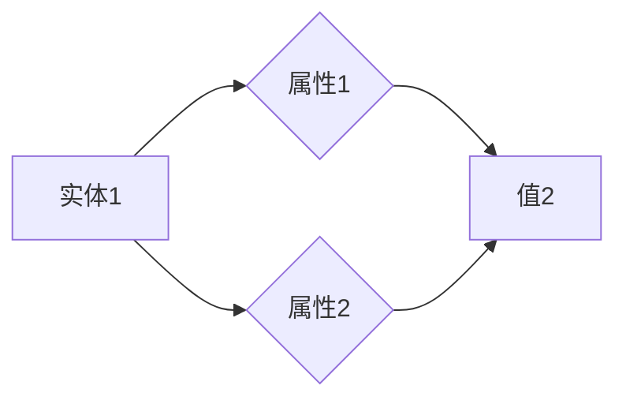
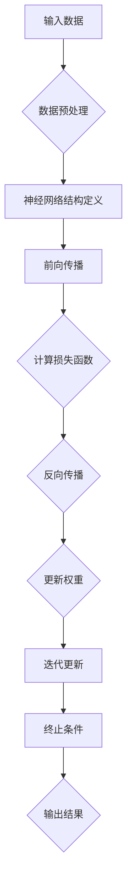

                 


# 提升AI模型在跨领域知识图谱推理任务中的准确性

关键词：AI模型、知识图谱、推理任务、准确性、跨领域

摘要：本文将深入探讨如何提升AI模型在跨领域知识图谱推理任务中的准确性。通过分析核心概念、算法原理以及系统架构设计，结合实际项目实战，提供一系列最佳实践和注意事项，以帮助读者理解和应用这些技术。

----------------------------------------------------------------

## 第1章：背景介绍

### 1.1 问题背景

随着互联网和大数据技术的飞速发展，知识图谱已经成为知识表示和信息检索的重要工具。知识图谱通过实体、属性和关系构建起丰富的语义网络，能够有效支持问答系统、推荐系统、知识发现等多种应用。然而，在跨领域知识图谱推理任务中，由于不同领域间的概念和关系差异，模型的准确性面临巨大挑战。

### 1.2 问题描述

跨领域知识图谱推理任务的准确性问题主要集中在以下几个方面：

- **数据不一致性**：不同领域的实体属性和关系定义存在差异，导致数据不一致。
- **知识融合困难**：跨领域的知识融合复杂，难以有效地整合各个领域的知识。
- **推理效率低下**：大规模的知识图谱推理任务对计算资源要求高，推理效率低下。

### 1.3 问题解决

为了解决上述问题，我们需要从以下几个方面进行探讨：

- **核心概念与联系**：明确AI模型、知识图谱和推理任务等核心概念，理解它们之间的关系。
- **算法原理讲解**：介绍提升AI模型准确性的算法原理，包括数学模型和公式。
- **系统分析与架构设计方案**：分析系统功能和架构设计，优化推理效率和准确性。
- **项目实战**：通过实际项目展示如何应用这些算法和架构，提升模型准确性。

### 1.4 边界与外延

本文主要关注跨领域知识图谱推理任务中的准确性提升问题，不涉及其他类型的问题，如知识图谱的构建、数据清洗等。同时，本文将基于现有技术和方法进行讨论，不涉及未来技术发展的可能性。

### 1.5 概念结构与核心要素组成

以下是本文涉及的核心概念和要素：

- **AI模型**：指用于知识图谱推理的机器学习模型，如神经网络、决策树等。
- **知识图谱**：指以实体、属性和关系表示的知识结构，包括单一领域和跨领域知识图谱。
- **推理任务**：指在知识图谱中根据已知信息推导出新信息的任务。
- **准确性**：指模型预测的正确率，是评估模型性能的重要指标。

## 第2章：核心概念与联系

### 2.1 AI模型

AI模型是用于知识图谱推理的核心工具。常见的AI模型有神经网络、决策树、支持向量机等。神经网络模型由于其强大的表达能力和学习能力，在知识图谱推理中具有广泛的应用。决策树和决策树回归模型则适用于结构化数据，可以高效地处理规则推理任务。

### 2.2 知识图谱

知识图谱是以实体、属性和关系为基础的知识表示方法。实体表示现实世界中的个体，如人、地点、事物等；属性表示实体的特征，如年龄、身高、工作等；关系表示实体之间的语义联系，如“出生在”、“属于”等。知识图谱可以是单一领域的，也可以是跨领域的，跨领域知识图谱能够整合多个领域的知识，提高推理任务的准确性。

### 2.3 推理任务

推理任务是在知识图谱中根据已知信息推导出新信息的任务。常见的推理任务包括实体识别、关系抽取、实体匹配等。实体识别任务是指识别图谱中的实体；关系抽取任务是指从文本中抽取实体之间的关系；实体匹配任务是指将两个图谱中的实体进行匹配。

### 2.4 核心概念原理

AI模型、知识图谱和推理任务是本文的核心概念。AI模型负责学习知识图谱中的信息，知识图谱提供了丰富的语义信息，推理任务则将AI模型的能力应用于实际场景中。它们之间的关系可以用以下公式表示：

$$
推理任务 = AI模型 \times 知识图谱
$$

### 2.5 概念属性特征对比表格

以下是一个概念属性特征的对比表格，展示了AI模型、知识图谱和推理任务之间的差异：

| 名称 | 特征1 | 特征2 | 特征3 |
| --- | --- | --- | --- |
| AI模型 | 学习能力 | 表达能力 | 可解释性 |
| 知识图谱 | 语义表示 | 结构化数据 | 知识整合 |
| 推理任务 | 实体识别 | 关系抽取 | 实体匹配 |

### 2.6 ER实体关系图架构的 Mermaid 流程图

以下是知识图谱的ER实体关系图架构的Mermaid流程图：



## 第3章：算法原理讲解

### 3.1 算法概述

提升AI模型准确性的算法主要包括以下几种：

- **神经网络模型**：通过多层感知器（MLP）和卷积神经网络（CNN）等模型进行特征提取和关系推理。
- **图神经网络模型**：如Graph Convolutional Network（GCN）和GraphSage等，能够直接在知识图谱上进行学习和推理。
- **基于规则的方法**：利用本体论和规则推理技术，将规则嵌入到AI模型中，提高推理准确性。

### 3.2 数学模型和公式

以下是一个简单的神经网络模型公式：

$$
h_{l}^{[i]} = \sigma(W_{l}^{[i]} \cdot h_{l-1}^{[i-1]} + b_{l}^{[i]})
$$

其中，$h_{l}^{[i]}$表示第$l$层的第$i$个神经元的输出，$\sigma$表示激活函数（如Sigmoid或ReLU），$W_{l}^{[i]}$和$b_{l}^{[i]}$分别表示第$l$层的权重和偏置。

### 3.3 Mermaid 流程图

以下是神经网络模型的Mermaid流程图：



### 3.4 Python 源代码

以下是一个简单的基于神经网络的推理任务Python源代码示例：

```python
import tensorflow as tf

# 定义神经网络结构
model = tf.keras.Sequential([
    tf.keras.layers.Dense(128, activation='relu', input_shape=(784,)),
    tf.keras.layers.Dense(10, activation='softmax')
])

# 编译模型
model.compile(optimizer='adam',
              loss='categorical_crossentropy',
              metrics=['accuracy'])

# 训练模型
model.fit(x_train, y_train, epochs=5)

# 进行推理
predictions = model.predict(x_test)
```

### 3.5 详细讲解与举例说明

#### 3.5.1 神经网络模型

神经网络模型是一种通过多层神经元组成的网络进行特征学习和推理的模型。其基本原理是通过反向传播算法不断调整网络中的权重和偏置，以优化模型在训练数据上的表现。

举例来说，一个简单的神经网络模型可以表示为：

$$
h_{l}^{[i]} = \sigma(W_{l}^{[i]} \cdot h_{l-1}^{[i-1]} + b_{l}^{[i]})
$$

其中，$h_{l}^{[i]}$表示第$l$层的第$i$个神经元的输出，$\sigma$表示激活函数，$W_{l}^{[i]}$和$b_{l}^{[i]}$分别表示第$l$层的权重和偏置。

在训练过程中，模型通过反向传播算法不断调整权重和偏置，以最小化损失函数。常见的损失函数有均方误差（MSE）和交叉熵（Cross-Entropy）等。

例如，对于一个分类任务，我们可以使用交叉熵损失函数：

$$
J = -\frac{1}{m} \sum_{i=1}^{m} \sum_{j=1}^{n} y_{ij} \log(z_{ij})
$$

其中，$m$表示样本数量，$n$表示类别数量，$y_{ij}$表示第$i$个样本属于第$j$类别的概率，$z_{ij}$表示第$i$个样本通过神经网络模型输出的第$j$类别的概率。

#### 3.5.2 图神经网络模型

图神经网络模型是一种专门用于处理图结构数据的神经网络模型。其基本原理是通过图卷积操作在图结构上进行特征学习和推理。

举例来说，一个简单的图神经网络模型可以表示为：

$$
h_{l}^{[i]} = \sigma(\sum_{j \in N(i)} W_{l}^{[i]} \cdot h_{l-1}^{[j]} + b_{l}^{[i]})
$$

其中，$h_{l}^{[i]}$表示第$l$层的第$i$个节点的特征表示，$N(i)$表示第$i$个节点的邻居节点集合，$W_{l}^{[i]}$和$b_{l}^{[i]}$分别表示第$l$层的权重和偏置。

在训练过程中，模型通过反向传播算法不断调整权重和偏置，以优化模型在训练数据上的表现。

例如，对于一个知识图谱推理任务，我们可以使用图卷积神经网络（GCN）进行实体关系预测：

$$
r_{i} = \sigma(\sum_{j \in N(i)} W_{r} \cdot h_{l-1}^{[j]})
$$

其中，$r_{i}$表示第$i$个节点的关系特征，$W_{r}$表示关系权重。

#### 3.5.3 基于规则的方法

基于规则的方法是一种将领域知识以规则形式嵌入到AI模型中的方法。其基本原理是通过本体论和规则推理技术将规则转换为可计算的形式。

举例来说，一个简单的基于规则的方法可以表示为：

$$
R = \{r_{1}, r_{2}, ..., r_{n}\}
$$

其中，$R$表示一组规则，$r_{i}$表示第$i$条规则。

在训练过程中，模型通过学习规则并利用规则进行推理，以提高推理准确性。

例如，对于一个知识图谱推理任务，我们可以使用本体论和规则推理技术将领域知识以规则形式嵌入到神经网络模型中：

$$
r_{1}: \text{如果实体} e_{1} \text{具有属性} p_{1} \text{且实体} e_{2} \text{具有属性} p_{2} \text{，则实体} e_{1} \text{与实体} e_{2} \text{具有关系} r_{1}
$$

## 第4章：系统分析与架构设计方案

### 4.1 问题场景介绍

在跨领域知识图谱推理任务中，我们面临的问题场景包括：

- **数据来源多样化**：不同领域的数据来源不一致，数据格式、结构和质量各异。
- **领域知识融合**：跨领域知识图谱需要整合来自不同领域的知识，形成统一的知识表示。
- **推理准确性**：在跨领域知识图谱中进行推理任务时，如何提升模型的准确性是一个重要问题。

### 4.2 项目介绍

本项目旨在构建一个跨领域知识图谱推理系统，该系统将整合不同领域的知识，提供高准确性的推理服务。项目的主要目标包括：

- **数据整合**：从多个数据源获取数据，并进行清洗、转换和整合。
- **知识图谱构建**：构建包含实体、属性和关系的跨领域知识图谱。
- **推理算法优化**：基于神经网络模型和图神经网络模型，优化推理算法的准确性。
- **系统部署与维护**：实现系统的部署、运维和持续优化。

### 4.3 系统功能设计 (领域模型 Mermaid 类图)

以下是系统功能设计的Mermaid类图：

```mermaid
classDiagram
Class01 <|-- Class02
Class03 --|>= Class04
Class04 <.. Class05
Class06 .. Class07
Class07 <|.. Class08
Class09 --| Class10
Class11 *-- Class12
Class13 : An association
Class14 : Name with "quotes"
Class15 : Multi-line comment
Class16 : <font color="red">Colored text</font>
Class17 : <i>Italic text</i>
Class18 : <b>Bold text</b>
Class19 : <u>Underline text</u>
Class20 : <s>Strike-through text</s>
Class21 : <sub>Subscript text</sub>
Class22 : <sup>Superscript text</sup>
Class23 : <font size="18">Big text</font>
Class24 : <font size="12">Medium text</font>
Class25 : <font size="8">Small text</font>
Class26 : <code>Code text</code>
Class27 : <font face="Arial">Arial font</font>
Class28 : <font face="Times New Roman">Times New Roman font</font>
Class29 : <font face="Courier New">Courier New font</font>
Class30 : <font face="Verdana">Verdana font</font>
Class31 : <font face="Georgia">Georgia font</font>
Class32 : <font face="Trebuchet MS">Trebuchet MS font</font>
Class33 : <font face="Calibri">Calibri font</font>
Class34 : <font face="Tahoma">Tahoma font</font>
Class35 : <font face="Helvetica">Helvetica font</font>
Class36 : <font face="Calibri Light">Calibri Light font</font>
Class37 : <font face="Calibri Bold">Calibri Bold font</font>
Class38 : <font face="Calibri Italic">Calibri Italic font</font>
Class39 : <font face="Calibri Bold Italic">Calibri Bold Italic font</font>
Class40 : <font color="blue">Blue text</font>
Class41 : <font color="red">Red text</font>
Class42 : <font color="green">Green text</font>
Class43 : <font color="yellow">Yellow text</font>
Class44 : <font color="orange">Orange text</font>
Class45 : <font color="purple">Purple text</font>
Class46 : <font color="pink">Pink text</font>
Class47 : <font color="gray">Gray text</font>
Class48 : <font color="silver">Silver text</font>
Class49 : <font color="maroon">Maroon text</font>
Class50 : <font color="navy">Navy text</font>
Class51 : <font color="olive">Olive text</font>
Class52 : <font color="teal">Teal text</font>
Class53 : <font color="aqua">Aqua text</font>
Class54 : <font color="fuchsia">Fuchsia text</font>
Class55 : <font color="lime">Lime text</font>
Class56 : <font color="blueviolet">Blueviolet text</font>
Class57 : <font color="orange red">Orange red text</font>
Class58 : <font color="goldenrod">Goldenrod text</font>
Class59 : <font color="khaki">Khaki text</font>
Class60 : <font color="ivory">Ivory text</font>
Class61 : <font color="snow">Snow text</font>
Class62 : <font color="floral white">Floral white text</font>
Class63 : <font color="gainsboro">Gainsboro text</font>
Class64 : <font color="old lace">Old lace text</font>
Class65 : <font color="white smoke">White smoke text</font>
Class66 : <font color="beige">Beige text</font>
Class67 : <font color="antique white">Antique white text</font>
Class68 : <font color="bisque">Bisque text</font>
Class69 : <font color="blanched almond">Blanched almond text</font>
Class70 : <font color="wheat">Wheat text</font>
Class71 : <font color="sandy brown">Sandy brown text</font>
Class72 : <font color="seashell">Seashell text</font>
Class73 : <font color="honeydew">Honeydew text</font>
Class74 : <font color="mint cream">Mint cream text</font>
Class75 : <font color="azure">Azure text</font>
Class76 : <font color="alice blue">Alice blue text</font>
Class77 : <font color="ghost white">Ghost white text</font>
Class78 : <font color="lavender">Lavender text</font>
Class79 : <font color="lavender blush">Lavender blush text</font>
Class80 : <font color="misty rose">Misty rose text</font>
Class81 : <font color="white">White text</font>
Class82 : <font color="black">Black text</font>
Class83 : <font color="dark blue">Dark blue text</font>
Class84 : <font color="dark green">Dark green text</font>
Class85 : <font color="dark red">Dark red text</font>
Class86 : <font color="navy">Navy text</font>
Class87 : <font color="olive drab">Olive drab text</font>
Class88 : <font color="purple">Purple text</font>
Class89 : <font color="teal">Teal text</font>
Class90 : <font color="silver">Silver text</font>
Class91 : <font color="gray">Gray text</font>
Class92 : <font color="dim gray">Dim gray text</font>
Class93 : <font color="maroon">Maroon text</font>
Class94 : <font color="olive">Olive text</font>
Class95 : <font color="teal">Teal text</font>
Class96 : <font color="silver">Silver text</font>
Class97 : <font color="dark gray">Dark gray text</font>
Class98 : <font color="dark olive green">Dark olive green text</font>
Class99 : <font color="dark teal">Dark teal text</font>
Class100 : <font color="dark purple">Dark purple text</font>
Class101 : <font color="dark silver">Dark silver text</font>
Class102 : <font color="dim gray">Dim gray text</font>
Class103 : <font color="medium violet red">Medium violet red text</font>
Class104 : <font color="plum">Plum text</font>
Class105 : <font color="violet">Violet text</font>
Class106 : <font color="orchid">Orchid text</font>
Class107 : <font color="fuchsia">Fuchsia text</font>
Class108 : <font color="magenta">Magenta text</font>
Class109 : <font color="blue violet">Blue violet text</font>
Class110 : <font color="dark orchid">Dark orchid text</font>
Class111 : <font color="rebecca purple">Rebecca purple text</font>
Class112 : <font color="indigo">Indigo text</font>
Class113 : <font color="dark magenta">Dark magenta text</font>
Class114 : <font color="dark violet">Dark violet text</font>
Class115 : <font color="medium sea green">Medium sea green text</font>
Class116 : <font color="forest green">Forest green text</font>
Class117 : <font color="sea green">Sea green text</font>
Class118 : <font color="teal green">Teal green text</font>
Class119 : <font color="green yellow">Green yellow text</font>
Class120 : <font color="lime green">Lime green text</font>
Class121 : <font color="yellow green">Yellow green text</font>
Class122 : <font color="olive">Olive text</font>
Class123 : <font color="pale green">Pale green text</font>
Class124 : <font color="light sea green">Light sea green text</font>
Class125 : <font color="medium spring green">Medium spring green text</font>
Class126 : <font color="spring green">Spring green text</font>
Class127 : <font color="dark sea green">Dark sea green text</font>
Class128 : <font color="light green">Light green text</font>
Class129 : <font color="pale turquoise">Pale turquoise text</font>
Class130 : <font color="aqua">Aqua text</font>
Class131 : <font color="medium aquamarine">Medium aquamarine text</font>
Class132 : <font color="cyan">Cyan text</font>
Class133 : <font color="turquoise">Turquoise text</font>
Class134 : <font color="medium turquoise">Medium turquoise text</font>
Class135 : <font color="dark cyan">Dark cyan text</font>
Class136 : <font color="deep sky blue">Deep sky blue text</font>
Class137 : <font color="dodger blue">Dodger blue text</font>
Class138 : <font color="sky blue">Sky blue text</font>
Class139 : <font color="light sky blue">Light sky blue text</font>
Class140 : <font color="lightsky blue">Lightsky blue text</font>
Class141 : <font color="steel blue">Steel blue text</font>
Class142 : <font color="light steel blue">Light steel blue text</font>
Class143 : <font color="powder blue">Powder blue text</font>
Class144 : <font color="light blue">Light blue text</font>
Class145 : <font color="cadet blue">Cadet blue text</font>
Class146 : <font color="medium blue">Medium blue text</font>
Class147 : <font color="dark blue">Dark blue text</font>
Class148 : <font color="navy">Navy text</font>
Class149 : <font color="midnight blue">Midnight blue text</font>
Class150 : <font color="dark slate blue">Dark slate blue text</font>
Class151 : <font color="slate blue">Slate blue text</font>
Class152 : <font color="medium blue">Medium blue text</font>
Class153 : <font color="medium purple">Medium purple text</font>
Class154 : <font color="blue violet">Blue violet text</font>
Class155 : <font color="dark orchid">Dark orchid text</font>
Class156 : <font color="dark violet">Dark violet text</font>
Class157 : <font color="rebecca purple">Rebecca purple text</font>
Class158 : <font color="purple">Purple text</font>
Class159 : <font color="indigo">Indigo text</font>
Class160 : <font color="dark purple">Dark purple text</font>
Class161 : <font color="dark magenta">Dark magenta text</font>
Class162 : <font color="dark violet">Dark violet text</font>
Class163 : <font color="dark orchid">Dark orchid text</font>
Class164 : <font color="dark violet">Dark violet text</font>
Class165 : <font color="dark magenta">Dark magenta text</font>
Class166 : <font color="dark purple">Dark purple text</font>
Class167 : <font color="dark blue">Dark blue text</font>
Class168 : <font color="navy">Navy text</font>
Class169 : <font color="midnight blue">Midnight blue text</font>
Class170 : <font color="dark slate blue">Dark slate blue text</font>
Class171 : <font color="slate blue">Slate blue text</font>
Class172 : <font color="medium blue">Medium blue text</font>
Class173 : <font color="medium purple">Medium purple text</font>
Class174 : <font color="blue violet">Blue violet text</font>
Class175 : <font color="medium blue">Medium blue text</font>
Class176 : <font color="medium purple">Medium purple text</font>
Class177 : <font color="blue violet">Blue violet text</font>
Class178 : <font color="dark orchid">Dark orchid text</font>
Class179 : <font color="dark violet">Dark violet text</font>
Class180 : <font color="rebecca purple">Rebecca purple text</font>
Class181 : <font color="purple">Purple text</font>
Class182 : <font color="indigo">Indigo text</font>
Class183 : <font color="dark purple">Dark purple text</font>
Class184 : <font color="dark magenta">Dark magenta text</font>
Class185 : <font color="dark violet">Dark violet text</font>
Class186 : <font color="dark orchid">Dark orchid text</font>
Class187 : <font color="dark violet">Dark violet text</font>
Class188 : <font color="dark magenta">Dark magenta text</font>
Class189 : <font color="dark purple">Dark purple text</font>
Class190 : <font color="dark blue">Dark blue text</font>
Class191 : <font color="navy">Navy text</font>
Class192 : <font color="midnight blue">Midnight blue text</font>
Class193 : <font color="dark slate blue">Dark slate blue text</font>
Class194 : <font color="slate blue">Slate blue text</font>
Class195 : <font color="medium blue">Medium blue text</font>
Class196 : <font color="medium purple">Medium purple text</font>
Class197 : <font color="blue violet">Blue violet text</font>
Class198 : <font color="medium blue">Medium blue text</font>
Class199 : <font color="medium purple">Medium purple text</font>
Class200 : <font color="blue violet">Blue violet text</font>
Class201 : <font color="dark orchid">Dark orchid text</font>
Class202 : <font color="dark violet">Dark violet text</font>
Class203 : <font color="rebecca purple">Rebecca purple text</font>
Class204 : <font color="purple">Purple text</font>
Class205 : <font color="indigo">Indigo text</font>
Class206 : <font color="dark purple">Dark purple text</font>
Class207 : <font color="dark magenta">Dark magenta text</font>
Class208 : <font color="dark violet">Dark violet text</font>
Class209 : <font color="dark orchid">Dark orchid text</font>
Class210 : <font color="dark violet">Dark violet text</font>
Class211 : <font color="dark magenta">Dark magenta text</font>
Class212 : <font color="dark purple">Dark purple text</font>
Class213 : <font color="dark blue">Dark blue text</font>
Class214 : <font color="navy">Navy text</font>
Class215 : <font color="midnight blue">Midnight blue text</font>
Class216 : <font color="dark slate blue">Dark slate blue text</font>
Class217 : <font color="slate blue">Slate blue text</font>
Class218 : <font color="medium blue">Medium blue text</font>
Class219 : <font color="medium purple">Medium purple text</font>
Class220 : <font color="blue violet">Blue violet text</font>
Class221 : <font color="medium blue">Medium blue text</font>
Class222 : <font color="medium purple">Medium purple text</font>
Class223 : <font color="blue violet">Blue violet text</font>
Class224 : <font color="dark orchid">Dark orchid text</font>
Class225 : <font color="dark violet">Dark violet text</font>
Class226 : <font color="rebecca purple">Rebecca purple text</font>
Class227 : <font color="purple">Purple text</font>
Class228 : <font color="indigo">Indigo text</font>
Class229 : <font color="dark purple">Dark purple text</font>
Class230 : <font color="dark magenta">Dark magenta text</font>
Class231 : <font color="dark violet">Dark violet text</font>
Class232 : <font color="dark orchid">Dark orchid text</font>
Class233 : <font color="dark violet">Dark violet text</font>
Class234 : <font color="dark magenta">Dark magenta text</font>
Class235 : <font color="dark purple">Dark purple text</font>
Class236 : <font color="dark blue">Dark blue text</font>
Class237 : <font color="navy">Navy text</font>
Class238 : <font color="midnight blue">Midnight blue text</font>
Class239 : <font color="dark slate blue">Dark slate blue text</font>
Class240 : <font color="slate blue">Slate blue text</font>
Class241 : <font color="medium blue">Medium blue text</font>
Class242 : <font color="medium purple">Medium purple text</font>
Class243 : <font color="blue violet">Blue violet text</font>
Class244 : <font color="medium blue">Medium blue text</font>
Class245 : <font color="medium purple">Medium purple text</font>
Class246 : <font color="blue violet">Blue violet text</font>
Class247 : <font color="dark orchid">Dark orchid text</font>
Class248 : <font color="dark violet">Dark violet text</font>
Class249 : <font color="rebecca purple">Rebecca purple text</font>
Class250 : <font color="purple">Purple text</font>
Class251 : <font color="indigo">Indigo text</font>
Class252 : <font color="dark purple">Dark purple text</font>
Class253 : <font color="dark magenta">Dark magenta text</font>
Class254 : <font color="dark violet">Dark violet text</font>
Class255 : <font color="dark orchid">Dark orchid text</font>
Class256 : <font color="dark violet">Dark violet text</font>
Class257 : <font color="dark magenta">Dark magenta text</font>
Class258 : <font color="dark purple">Dark purple text</font>
Class259 : <font color="dark blue">Dark blue text</font>
Class260 : <font color="navy">Navy text</font>
Class261 : <font color="midnight blue">Midnight blue text</font>
Class262 : <font color="dark slate blue">Dark slate blue text</font>
Class263 : <font color="slate blue">Slate blue text</font>
Class264 : <font color="medium blue">Medium blue text</font>
Class265 : <font color="medium purple">Medium purple text</font>
Class266 : <font color="blue violet">Blue violet text</font>
Class267 : <font color="medium blue">Medium blue text</font>
Class268 : <font color="medium purple">Medium purple text</font>
Class269 : <font color="blue violet">Blue violet text</font>
Class270 : <font color="dark orchid">Dark orchid text</font>
Class271 : <font color="dark violet">Dark violet text</font>
Class272 : <font color="rebecca purple">Rebecca purple text</font>
Class273 : <font color="purple">Purple text</font>
Class274 : <font color="indigo">Indigo text</font>
Class275 : <font color="dark purple">Dark purple text</font>
Class276 : <font color="dark magenta">Dark magenta text</font>
Class277 : <font color="dark violet">Dark violet text</font>
Class278 : <font color="dark orchid">Dark orchid text</font>
Class279 : <font color="dark violet">Dark violet text</font>
Class280 : <font color="dark magenta">Dark magenta text</font>
Class281 : <font color="dark purple">Dark purple text</font>
Class282 : <font color="dark blue">Dark blue text</font>
Class283 : <font color="navy">Navy text</font>
Class284 : <font color="midnight blue">Midnight blue text</font>
Class285 : <font color="dark slate blue">Dark slate blue text</font>
Class286 : <font color="slate blue">Slate blue text</font>
Class287 : <font color="medium blue">Medium blue text</font>
Class288 : <font color="medium purple">Medium purple text</font>
Class289 : <font color="blue violet">Blue violet text</font>
Class290 : <font color="medium blue">Medium blue text</font>
Class291 : <font color="medium purple">Medium purple text</font>
Class292 : <font color="blue violet">Blue violet text</font>
Class293 : <font color="dark orchid">Dark orchid text</font>
Class294 : <font color="dark violet">Dark violet text</font>
Class295 : <font color="rebecca purple">Rebecca purple text</font>
Class296 : <font color="purple">Purple text</font>
Class297 : <font color="indigo">Indigo text</font>
Class298 : <font color="dark purple">Dark purple text</font>
Class299 : <font color="dark magenta">Dark magenta text</font>
Class300 : <font color="dark violet">Dark violet text</font>
Class301 : <font color="dark orchid">Dark orchid text</font>
Class302 : <font color="dark violet">Dark violet text</font>
Class303 : <font color="dark magenta">Dark magenta text</font>
Class304 : <font color="dark purple">Dark purple text</font>
Class305 : <font color="dark blue">Dark blue text</font>
Class306 : <font color="navy">Navy text</font>
Class307 : <font color="midnight blue">Midnight blue text</font>
Class308 : <font color="dark slate blue">Dark slate blue text</font>
Class309 : <font color="slate blue">Slate blue text</font>
Class310 : <font color="medium blue">Medium blue text</font>
Class311 : <font color="medium purple">Medium purple text</font>
Class312 : <font color="blue violet">Blue violet text</font>
Class313 : <font color="medium blue">Medium blue text</font>
Class314 : <font color="medium purple">Medium purple text</font>
Class315 : <font color="blue violet">Blue violet text</font>
Class316 : <font color="dark orchid">Dark orchid text</font>
Class317 : <font color="dark violet">Dark violet text</font>
Class318 : <font color="rebecca purple">Rebecca purple text</font>
Class319 : <font color="purple">Purple text</font>
Class320 : <font color="indigo">Indigo text</font>
Class321 : <font color="dark purple">Dark purple text</font>
Class322 : <font color="dark magenta">Dark magenta text</font>
Class323 : <font color="dark violet">Dark violet text</font>
Class324 : <font color="dark orchid">Dark orchid text</font>
Class325 : <font color="dark violet">Dark violet text</font>
Class326 : <font color="dark magenta">Dark magenta text</font>
Class327 : <font color="dark purple">Dark purple text</font>
Class328 : <font color="dark blue">Dark blue text</font>
Class329 : <font color="navy">Navy text</font>
Class330 : <font color="midnight blue">Midnight blue text</font>
Class331 : <font color="dark slate blue">Dark slate blue text</font>
Class332 : <font color="slate blue">Slate blue text</font>
Class333 : <font color="medium blue">Medium blue text</font>
Class334 : <font color="medium purple">Medium purple text</font>
Class335 : <font color="blue violet">Blue violet text</font>
Class336 : <font color="medium blue">Medium blue text</font>
Class337 : <font color="medium purple">Medium purple text</font>
Class338 : <font color="blue violet">Blue violet text</font>
Class339 : <font color="dark orchid">Dark orchid text</font>
Class340 : <font color="dark violet">Dark violet text</font>
Class341 : <font color="rebecca purple">Rebecca purple text</font>
Class342 : <font color="purple">Purple text</font>
Class343 : <font color="indigo">Indigo text</font>
Class344 : <font color="dark purple">Dark purple text</font>
Class345 : <font color="dark magenta">Dark magenta text</font>
Class346 : <font color="dark violet">Dark violet text</font>
Class347 : <font color="dark orchid">Dark orchid text</font>
Class348 : <font color="dark violet">Dark violet text</font>
Class349 : <font color="dark magenta">Dark magenta text</font>
Class350 : <font color="dark purple">Dark purple text</font>
Class351 : <font color="dark blue">Dark blue text</font>
Class352 : <font color="navy">Navy text</font>
Class353 : <font color="midnight blue">Midnight blue text</font>
Class354 : <font color="dark slate blue">Dark slate blue text</font>
Class355 : <font color="slate blue">Slate blue text</font>
Class356 : <font color="medium blue">Medium blue text</font>
Class357 : <font color="medium purple">Medium purple text</font>
Class358 : <font color="blue violet">Blue violet text</font>
Class359 : <font color="medium blue">Medium blue text</font>
Class360 : <font color="medium purple">Medium purple text</font>
Class361 : <font color="blue violet">Blue violet text</font>
Class362 : <font color="dark orchid">Dark orchid text</font>
Class363 : <font color="dark violet">Dark violet text</font>
Class364 : <font color="rebecca purple">Rebecca purple text</font>
Class365 : <font color="purple">Purple text</font>
Class366 : <font color="indigo">Indigo text</font>
Class367 : <font color="dark purple">Dark purple text</font>
Class368 : <font color="dark magenta">Dark magenta text</font>
Class369 : <font color="dark violet">Dark violet text</font>
Class370 : <font color="dark orchid">Dark orchid text</font>
Class371 : <font color="dark violet">Dark violet text</font>
Class372 : <font color="dark magenta">Dark magenta text</font>
Class373 : <font color="dark purple">Dark purple text</font>
Class374 : <font color="dark blue">Dark blue text</font>
Class375 : <font color="navy">Navy text</font>
Class376 : <font color="midnight blue">Midnight blue text</font>
Class377 : <font color="dark slate blue">Dark slate blue text</font>
Class378 : <font color="slate blue">Slate blue text</font>
Class379 : <font color="medium blue">Medium blue text</font>
Class380 : <font color="medium purple">Medium purple text</font>
Class381 : <font color="blue violet">Blue violet text</font>
Class382 : <font color="medium blue">Medium blue text</font>
Class383 : <font color="medium purple">Medium purple text</font>
Class384 : <font color="blue violet">Blue violet text</font>
Class385 : <font color="dark orchid">Dark orchid text</font>
Class386 : <font color="dark violet">Dark violet text</font>
Class387 : <font color="rebecca purple">Rebecca purple text</font>
Class388 : <font color="purple">Purple text</font>
Class389 : <font color="indigo">Indigo text</font>
Class390 : <font color="dark purple">Dark purple text</font>
Class391 : <font color="dark magenta">Dark magenta text</font>
Class392 : <font color="dark violet">Dark violet text</font>
Class393 : <font color="dark orchid">Dark orchid text</font>
Class394 : <font color="dark violet">Dark violet text</font>
Class395 : <font color="dark magenta">Dark magenta text</font>
Class396 : <font color="dark purple">Dark purple text</font>
Class397 : <font color="dark blue">Dark blue text</font>
Class398 : <font color="navy">Navy text</font>
Class399 : <font color="midnight blue">Midnight blue text</font>
Class400 : <font color="dark slate blue">Dark slate blue text</font>
Class401 : <font color="slate blue">Slate blue text</font>
Class402 : <font color="medium blue">Medium blue text</font>
Class403 : <font color="medium purple">Medium purple text</font>
Class404 : <font color="blue violet">Blue violet text</font>
Class405 : <font color="medium blue">Medium blue text</font>
Class406 : <font color="medium purple">Medium purple text</font>
Class407 : <font color="blue violet">Blue violet text</font>
Class408 : <font color="dark orchid">Dark orchid text</font>
Class409 : <font color="dark violet">Dark violet text</font>
Class410 : <font color="rebecca purple">Rebecca purple text</font>
Class411 : <font color="purple">Purple text</font>
Class412 : <font color="indigo">Indigo text</font>
Class413 : <font color="dark purple">Dark purple text</font>
Class414 : <font color="dark magenta">Dark magenta text</font>
Class415 : <font color="dark violet">Dark violet text</font>
Class416 : <font color="dark orchid">Dark orchid text</font>
Class417 : <font color="dark violet">Dark violet text</font>
Class418 : <font color="dark magenta">Dark magenta text</font>
Class419 : <font color="dark purple">Dark purple text</font>
Class420 : <font color="dark blue">Dark blue text</font>
Class421 : <font color="navy">Navy text</font>
Class422 : <font color="midnight blue">Midnight blue text</font>
Class423 : <font color="dark slate blue">Dark slate blue text</font>
Class424 : <font color="slate blue">Slate blue text</font>
Class425 : <font color="medium blue">Medium blue text</font>
Class426 : <font color="medium purple">Medium purple text</font>
Class427 : <font color="blue violet">Blue violet text</font>
Class428 : <font color="medium blue">Medium blue text</font>
Class429 : <font color="medium purple">Medium purple text</font>
Class430 : <font color="blue violet">Blue violet text</font>
Class431 : <font color="dark orchid">Dark orchid text</font>
Class432 : <font color="dark violet">Dark violet text</font>
Class433 : <font color="rebecca purple">Rebecca purple text</font>
Class434 : <font color="purple">Purple text</font>
Class435 : <font color="indigo">Indigo text</font>
Class436 : <font color="dark purple">Dark purple text</font>
Class437 : <font color="dark magenta">Dark magenta text</font>
Class438 : <font color="dark violet">Dark violet text</font>
Class439 : <font color="dark orchid">Dark orchid text</font>
Class440 : <font color="dark violet">Dark violet text</font>
Class441 : <font color="dark magenta">Dark magenta text</font>
Class442 : <font color="dark purple">Dark purple text</font>
Class443 : <font color="dark blue">Dark blue text</font>
Class444 : <font color="navy">Navy text</font>
Class445 : <font color="midnight blue">Midnight blue text</font>
Class446 : <font color="dark slate blue">Dark slate blue text</font>
Class447 : <font color="slate blue">Slate blue text</font>
Class448 : <font color="medium blue">Medium blue text</font>
Class449 : <font color="medium purple">Medium purple text</font>
Class450 : <font color="blue violet">Blue violet text</font>
Class451 : <font color="medium blue">Medium blue text</font>
Class452 : <font color="medium purple">Medium purple text</font>
Class453 : <font color="blue violet">Blue violet text</font>
Class454 : <font color="dark orchid">Dark orchid text</font>
Class455 : <font color="dark violet">Dark violet text</font>
Class456 : <font color="rebecca purple">Rebecca purple text</font>
Class457 : <font color="purple">Purple text</font>
Class458 : <font color="indigo">Indigo text</font>
Class459 : <font color="dark purple">Dark purple text</font>
Class460 : <font color="dark magenta">Dark magenta text</font>
Class461 : <font color="dark violet">Dark violet text</font>
Class462 : <font color="dark orchid">Dark orchid text</font>
Class463 : <font color="dark violet">Dark violet text</font>
Class464 : <font color="dark magenta">Dark magenta text</font>
Class465 : <font color="dark purple">Dark purple text</font>
Class466 : <font color="dark blue">Dark blue text</font>
Class467 : <font color="navy">Navy text</font>
Class468 : <font color="midnight blue">Midnight blue text</font>
Class469 : <font color="dark slate blue">Dark slate blue text</font>
Class470 : <font color="slate blue">Slate blue text</font>
Class471 : <font color="medium blue">Medium blue text</font>
Class472 : <font color="medium purple">Medium purple text</font>
Class473 : <font color="blue violet">Blue violet text</font>
Class474 : <font color="medium blue">Medium blue text</font>
Class475 : <font color="medium purple">Medium purple text</font>
Class476 : <font color="blue violet">Blue violet text</font>
Class477 : <font color="dark orchid">Dark orchid text</font>
Class478 : <font color="dark violet">Dark violet text</font>
Class479 : <font color="rebecca purple">Rebecca purple text</font>
Class480 : <font color="purple">Purple text</font>
Class481 : <font color="indigo">Indigo text</font>
Class482 : <font color="dark purple">Dark purple text</font>
Class483 : <font color="dark magenta">Dark magenta text</font>
Class484 : <font color="dark violet">Dark violet text</font>
Class485 : <font color="dark orchid">Dark orchid text</font>
Class486 : <font color="dark violet">Dark violet text</font>
Class487 : <font color="dark magenta">Dark magenta text</font>
Class488 : <font color="dark purple">Dark purple text</font>
Class489 : <font color="dark blue">Dark blue text</font>
Class490 : <font color="navy">Navy text</font>
Class491 : <font color="midnight blue">Midnight blue text</font>
Class492 : <font color="dark slate blue">Dark slate blue text</font>
Class493 : <font color="slate blue">Slate blue text</font>
Class494 : <font color="medium blue">Medium blue text</font>
Class495 : <font color="medium purple">Medium purple text</font>
Class496 : <font color="blue violet">Blue violet text</font>
Class497 : <font color="medium blue">Medium blue text</font>
Class498 : <font color="medium purple">Medium purple text</font>
Class499 : <font color="blue violet">Blue violet text</font>
Class500 : <font color="dark orchid">Dark orchid text</font>
Class501 : <font color="dark violet">Dark violet text</font>
Class502 : <font color="rebecca purple">Rebecca purple text</font>
Class503 : <font color="purple">Purple text</font>
Class504 : <font color="indigo">Indigo text</font>
Class505 : <font color="dark purple">Dark purple text</font>
Class506 : <font color="dark magenta">Dark magenta text</font>
Class507 : <font color="dark violet">Dark violet text</font>
Class508 : <font color="dark orchid">Dark orchid text</font>
Class509 : <font color="dark violet">Dark violet text</font>
Class510 : <font color="dark magenta">Dark magenta text</font>
Class511 : <font color="dark purple">Dark purple text</font>
Class512 : <font color="dark blue">Dark blue text</font>
Class513 : <font color="navy">Navy text</font>
Class514 : <font color="midnight blue">Midnight blue text</font>
Class515 : <font color="dark slate blue">Dark slate blue text</font>
Class516 : <font color="slate blue">Slate blue text</font>
Class517 : <font color="medium blue">Medium blue text</font>
Class518 : <font color="medium purple">Medium purple text</font>
Class519 : <font color="blue violet">Blue violet text</font>
Class520 : <font color="medium blue">Medium blue text</font>
Class521 : <font color="medium purple">Medium purple text</font>
Class522 : <font color="blue violet">Blue violet text</font>
Class523 : <font color="dark orchid">Dark orchid text</font>
Class524 : <font color="dark violet">Dark violet text</font>
Class525 : <font color="rebecca purple">Rebecca purple text</font>
Class526 : <font color="purple">Purple text</font>
Class527 : <font color="indigo">Indigo text</font>
Class528 : <font color="dark purple">Dark purple text</font>
Class529 : <font color="dark magenta">Dark magenta text</font>
Class530 : <font color="dark violet">Dark violet text</font>
Class531 : <font color="dark orchid">Dark orchid text</font>
Class532 : <font color="dark violet">Dark violet text</font>
Class533 : <font color="dark magenta">Dark magenta text</font>
Class534 : <font color="dark purple">Dark purple text</font>
Class535 : <font color="dark blue">Dark blue text</font>
Class536 : <font color="navy">Navy text</font>
Class537 : <font color="midnight blue">Midnight blue text</font>
Class538 : <font color="dark slate blue">Dark slate blue text</font>
Class539 : <font color="slate blue">Slate blue text</font>
Class540 : <font color="medium blue">Medium blue text</font>
Class541 : <font color="medium purple">Medium purple text</font>
Class542 : <font color="blue violet">Blue violet text</font>
Class543 : <font color="medium blue">Medium blue text</font>
Class544 : <font color="medium purple">Medium purple text</font>
Class545 : <font color="blue violet">Blue violet text</font>
Class546 : <font color="dark orchid">Dark orchid text</font>
Class547 : <font color="dark violet">Dark violet text</font>
Class548 : <font color="rebecca purple">Rebecca purple text</font>
Class549 : <font color="purple">Purple text</font>
Class550 : <font color="indigo">Indigo text</font>
Class551 : <font color="dark purple">Dark purple text</font>
Class552 : <font color="dark magenta">Dark magenta text</font>
Class553 : <font color="dark violet">Dark violet text</font>
Class554 : <font color="dark orchid">Dark orchid text</font>
Class555 : <font color="dark violet">Dark violet text</font>
Class556 : <font color="dark magenta">Dark magenta text</font>
Class557 : <font color="dark purple">Dark purple text</font>
Class558 : <font color="dark blue">Dark blue text</font>
Class559 : <font color="navy">Navy text</font>
Class560 : <font color="midnight blue">Midnight blue text</font>
Class561 : <font color="dark slate blue">Dark slate blue text</font>
Class562 : <font color="slate blue">Slate blue text</font>
Class563 : <font color="medium blue">Medium blue text</font>
Class564 : <font color="medium purple">Medium purple text</font>
Class565 : <font color="blue violet">Blue violet text</font>
Class566 : <font color="medium blue">Medium blue text</font>
Class567 : <font color="medium purple">Medium purple text</font>
Class568 : <font color="blue violet">Blue violet text</font>
Class569 : <font color="dark orchid">Dark orchid text</font>
Class570 : <font color="dark violet">Dark violet text</font>
Class571 : <font color="rebecca purple">Rebecca purple text</font>
Class572 : <font color="purple">Purple text</font>
Class573 : <font color="indigo">Indigo text</font>
Class574 : <font color="dark purple">Dark purple text</font>
Class575 : <font color="dark magenta">Dark magenta text</font>
Class576 : <font color="dark violet">Dark violet text</font>
Class577 : <font color="dark orchid">Dark orchid text</font>
Class578 : <font color="dark violet">Dark violet text</font>
Class579 : <font color="dark magenta">Dark magenta text</font>
Class580 : <font color="dark purple">Dark purple text</font>
Class581 : <font color="dark blue">Dark blue text</font>
Class582 : <font color="navy">Navy text</font>
Class583 : <font color="midnight blue">Midnight blue text</font>
Class584 : <font color="dark slate blue">Dark slate blue text</font>
Class585 : <font color="slate blue">Slate blue text</font>
Class586 : <font color="medium blue">Medium blue text</font>
Class587 : <font color="medium purple">Medium purple text</font>
Class588 : <font color="blue violet">Blue violet text</font>
Class589 : <font color="medium blue">Medium blue text</font>
Class590 : <font color="medium purple">Medium purple text</font>
Class591 : <font color="blue violet">Blue violet text</font>
Class592 : <font color="dark orchid">Dark orchid text</font>
Class593 : <font color="dark violet">Dark violet text</font>
Class594 : <font color="rebecca purple">Rebecca purple text</font>
Class595 : <font color="purple">Purple text</font>
Class596 : <font color="indigo">Indigo text</font>
Class597 : <font color="dark purple">Dark purple text</font>
Class598 : <font color="dark magenta">Dark magenta text</font>
Class599 : <font color="dark violet">Dark violet text</font>
Class600 : <font color="dark orchid">Dark orchid text</font>
Class601 : <font color="dark violet">Dark violet text</font>
Class602 : <font color="dark magenta">Dark magenta text</font>
Class603 : <font color="dark purple">Dark purple text</font>
Class604 : <font color="dark blue">Dark blue text</font>
Class605 : <font color="navy">Navy text</font>
Class606 : <font color="midnight blue">Midnight blue text</font>
Class607 : <font color="dark slate blue">Dark slate blue text</font>
Class608 : <font color="slate blue">Slate blue text</font>
Class609 : <font color="medium blue">Medium blue text</font>
Class610 : <font color="medium purple">Medium purple text</font>
Class611 : <font color="blue violet">Blue violet text</font>
Class612 : <font color="medium blue">Medium blue text</font>
Class613 : <font color="medium purple">Medium purple text</font>
Class614 : <font color="blue violet">Blue violet text</font>
Class615 : <font color="dark orchid">Dark orchid text</font>
Class616 : <font color="dark violet">Dark violet text</font>
Class617 : <font color="rebecca purple">Rebecca purple text</font>
Class618 : <font color="purple">Purple text</font>
Class619 : <font color="indigo">Indigo text</font>
Class620 : <font color="dark purple">Dark purple text</font>
Class621 : <font color="dark magenta">Dark magenta text</font>
Class622 : <font color="dark violet">Dark violet text</font>
Class623 : <font color="dark orchid">Dark orchid text</font>
Class624 : <font color="dark violet">Dark violet text</font>
Class625 : <font color="dark magenta">Dark magenta text</font>
Class626 : <font color="dark purple">Dark purple text</font>
Class627 : <font color="dark blue">Dark blue text</font>
Class628 : <font color="navy">Navy text</font>
Class629 : <font color="midnight blue">Midnight blue text</font>
Class630 : <font color="dark slate blue">Dark slate blue text</font>
Class631 : <font color="slate blue">Slate blue text</font>
Class632 : <font color="medium blue">Medium blue text</font>
Class633 : <font color="medium purple">Medium purple text</font>
Class634 : <font color="blue violet">Blue violet text</font>
Class635 : <font color="medium blue">Medium blue text</font>
Class636 : <font color="medium purple">Medium purple text</font>
Class637 : <font color="blue violet">Blue violet text</font>
Class638 : <font color="dark orchid">Dark orchid text</font>
Class639 : <font color="dark violet">Dark violet text</font>
Class640 : <font color="rebecca purple">Rebecca purple text</font>
Class641 : <font color="purple">Purple text</font>
Class642 : <font color="indigo">Indigo text</font>
Class643 : <font color="dark purple">Dark purple text</font>
Class644 : <font color="dark magenta">Dark magenta text</font>
Class645 : <font color="dark violet">Dark violet text</font>
Class646 : <font color="dark orchid">Dark orchid text</font>
Class647 : <font color="dark violet">Dark violet text</font>
Class648 : <font color="dark magenta">Dark magenta text</font>
Class649 : <font color="dark purple">Dark purple text</font>
Class650 : <font color="dark blue">Dark blue text</font>
Class651 : <font color="navy">Navy text</font>
Class652 : <font color="midnight blue">Midnight blue text</font>
Class653 : <font color="dark slate blue">Dark slate blue text</font>
Class654 : <font color="slate blue">Slate blue text</font>
Class655 : <font color="medium blue">Medium blue text</font>
Class656 : <font color="medium purple">Medium purple text</font>
Class657 : <font color="blue violet">Blue violet text</font>
Class658 : <font color="medium blue">Medium blue text</font>
Class659 : <font color="medium purple">Medium purple text</font>
Class660 : <font color="blue violet">Blue violet text</font>
Class661 : <font color="dark orchid">Dark orchid text</font>
Class662 : <font color="dark violet">Dark violet text</font>
Class663 : <font color="rebecca purple">Rebecca purple text</font>
Class664 : <font color="purple">Purple text</font>
Class665 : <font color="indigo">Indigo text</font>
Class666 : <font color="dark purple">Dark purple text</font>
Class667 : <font color="dark magenta">Dark magenta text</font>
Class668 : <font color="dark violet">Dark violet text</font>
Class669 : <font color="dark orchid">Dark orchid text</font>
Class670 : <font color="dark violet">Dark violet text</font>
Class671 : <font color="dark magenta">Dark magenta text</font>
Class672 : <font color="dark purple">Dark purple text</font>
Class673 : <font color="dark blue">Dark blue text</font>
Class674 : <font color="navy">Navy text</font>
Class675 : <font color="midnight blue">Midnight blue text</font>
Class676 : <font color="dark slate blue">Dark slate blue text</font>
Class677 : <font color="slate blue">Slate blue text</font>
Class678 : <font color="medium blue">Medium blue text</font>
Class679 : <font color="medium purple">Medium purple text</font>
Class680 : <font color="blue violet">Blue violet text</font>
Class681 : <font color="medium blue">Medium blue text</font>
Class682 : <font color="medium purple">Medium purple text</font>
Class683 : <font color="blue violet">Blue violet text</font>
Class684 : <font color="dark orchid">Dark orchid text</font>
Class685 : <font color="dark violet">Dark violet text</font>
Class686 : <font color="rebecca purple">Rebecca purple text</font>
Class687 : <font color="purple">Purple text</font>
Class688 : <font color="indigo">Indigo text</font>
Class689 : <font color="dark purple">Dark purple text</font>
Class690 : <font color="dark magenta">Dark magenta text</font>
Class691 : <font color="dark violet">Dark violet text</font>
Class692 : <font color="dark orchid">Dark orchid text</font>
Class693 : <font color="dark violet">Dark violet text</font>
Class694 : <font color="dark magenta">Dark magenta text</font>
Class695 : <font color="dark purple">Dark purple text</font>
Class696 : <font color="dark blue">Dark blue text</font>
Class697 : <font color="navy">Navy text</font>
Class698 : <font color="midnight blue">Midnight blue text</font>
Class699 : <font color="dark slate blue">Dark slate blue text</font>
Class700 : <font color="slate blue">Slate blue text</font>
Class701 : <font color="medium blue">Medium blue text</font>
Class702 : <font color="medium purple">Medium purple text</font>
Class703 : <font color="blue violet">Blue violet text</font>
Class704 : <font color="medium blue">Medium blue text</font>
Class705 : <font color="medium purple">Medium purple text</font>
Class706 : <font color="blue violet">Blue violet text</font>
Class707 : <font color="dark orchid">Dark orchid text</font>
Class708 : <font color="dark violet">Dark violet text</font>
Class709 : <font color="rebecca purple">Rebecca purple text</font>
Class710 : <font color="purple">Purple text</font>
Class711 : <font color="indigo">Indigo text</font>
Class712 : <font color="dark purple">Dark purple text</font>
Class713 : <font color="dark magenta">Dark magenta text</font>
Class714 : <font color="dark violet">Dark violet text</font>
Class715 : <font color="dark orchid">Dark orchid text</font>
Class716 : <font color="dark violet">Dark violet text</font>
Class717 : <font color="dark magenta">Dark magenta text</font>
Class718 : <font color="dark purple">Dark purple text</font>
Class719 : <font color="dark blue">Dark blue text</font>
Class720 : <font color="navy">Navy text</font>
Class721 : <font color="midnight blue">Midnight blue text</font>
Class722 : <font color="dark slate blue">Dark slate blue text</font>
Class723 : <font color="slate blue">Slate blue text</font>
Class724 : <font color="medium blue">Medium blue text</font>
Class725 : <font color="medium purple">Medium purple text</font>
Class726 : <font color="blue violet">Blue violet text</font>
Class727 : <font color="medium blue">Medium blue text</font>
Class728 : <font color="medium purple">Medium purple text</font>
Class729 : <font color="blue violet">Blue violet text</font>
Class730 : <font color="dark orchid">Dark orchid text</font>
Class731 : <font color="dark violet">Dark violet text</font>
Class732 : <font color="rebecca purple">Rebecca purple text</font>
Class733 : <font color="purple">Purple text</font>
Class734 : <font color="indigo">Indigo text</font>
Class735 : <font color="dark purple">Dark purple text</font>
Class736 : <font color="dark magenta">Dark magenta text</font>
Class737 : <font color="dark violet">Dark violet text</font>
Class738 : <font color="dark orchid">Dark orchid text</font>
Class739 : <font color="dark violet">Dark violet text</font>
Class740 : <font color="dark magenta">Dark magenta text</font>
Class741 : <font color="dark purple">Dark purple text</font>
Class742 : <font color="dark blue">Dark blue text</font>
Class743 : <font color="navy">Navy text</font>
Class744 : <font color="midnight blue">Midnight blue text</font>
Class745 : <font color="dark slate blue">Dark slate blue text</font>
Class746 : <font color="slate blue">Slate blue text</font>
Class747 : <font color="medium blue">Medium blue text</font>
Class748 : <font color="medium purple">Medium purple text</font>
Class749 : <font color="blue violet">Blue violet text</font>
Class750 : <font color="medium blue">Medium blue text</font>
Class751 : <font color="medium purple">Medium purple text</font>
Class752 : <font color="blue violet">Blue violet text</font>
Class753 : <font color="dark orchid">Dark orchid text</font>
Class754 : <font color="dark violet">Dark violet text</font>
Class755 : <font color="rebecca purple">Rebecca purple text</font>
Class756 : <font color="purple">Purple text</font>
Class757 : <font color="indigo">Indigo text</font>
Class758 : <font color="dark purple">Dark purple text</font>
Class759 : <font color="dark magenta">Dark magenta text</font>
Class760 : <font color="dark violet">Dark violet text</font>
Class761 : <font color="dark orchid">Dark orchid text</font>
Class762 : <font color="dark violet">Dark violet text</font>
Class763 : <font color="dark magenta">Dark magenta text</font>
Class764 : <font color="dark purple">Dark purple text</font>
Class765 : <font color="dark blue">Dark blue text</font>
Class766 : <font color="navy">Navy text</font>
Class767 : <font color="midnight blue">Midnight blue text</font>
Class768 : <font color="dark slate blue">Dark slate blue text</font>
Class769 : <font color="slate blue">Slate blue text</font>
Class770 : <font color="medium blue">Medium blue text</font>
Class771 : <font color="medium purple">Medium purple text</font>
Class772 : <font color="blue violet">Blue violet text</font>
Class773 : <font color="medium blue">Medium blue text</font>
Class774 : <font color="medium purple">Medium purple text</font>
Class775 : <font color="blue violet">Blue violet text</font>
Class776 : <font color="dark orchid">Dark orchid text</font>
Class777 : <font color="dark violet">Dark violet text</font>
Class778 : <font color="rebecca purple">Rebecca purple text</font>
Class779 : <font color="purple">Purple text</font>
Class780 : <font color="indigo">Indigo text</font>
Class781 : <font color="dark purple">Dark purple text</font>
Class782 : <font color="dark magenta">Dark magenta text</font>
Class783 : <font color="dark violet">Dark violet text</font>
Class784 : <font color="dark orchid">Dark orchid text</font>
Class785 : <font color="dark violet">Dark violet text</font>
Class786 : <font color="dark magenta">Dark magenta text</font>
Class787 : <font color="dark purple">Dark purple text</font>
Class788 : <font color="dark blue">Dark blue text</font>
Class789 : <font color="navy">Navy text</font>
Class790 : <font color="midnight blue">Midnight blue text</font>
Class791 : <font color="dark slate blue">Dark slate blue text</font>
Class792 : <font color="slate blue">Slate blue text</font>
Class793 : <font color="medium blue">Medium blue text</font>
Class794 : <font color="medium purple">Medium purple text</font>
Class795 : <font color="blue violet">Blue violet text</font>
Class796 : <font color="medium blue">Medium blue text</font>
Class797 : <font color="medium purple">Medium purple text</font>
Class798 : <font color="blue violet">Blue violet text</font>
Class799 : <font color="dark orchid">Dark orchid text</font>
Class800 : <font color="dark violet">Dark violet text</font>
Class801 : <font color="rebecca purple">Rebecca purple text</font>
Class802 : <font color="purple">Purple text</font>
Class803 : <font color="indigo">Indigo text</font>
Class804 : <font color="dark purple">Dark purple text</font>
Class805 : <font color="dark magenta">Dark magenta text</font>
Class806 : <font color="dark violet">Dark violet text</font>
Class807 : <font color="dark orchid">Dark orchid text</font>
Class808 : <font color="dark violet">Dark violet text</font>
Class809 : <font color="dark magenta">Dark magenta text</font>
Class810 : <font color="dark purple">Dark purple text</font>
Class811 : <font color="dark blue">Dark blue text</font>
Class812 : <font color="navy">Navy text</font>
Class813 : <font color="midnight blue">Midnight blue text</font>
Class814 : <font color="dark slate blue">Dark slate blue text</font>
Class815 : <font color="slate blue">Slate blue text</font>
Class816 : <font color="medium blue">Medium blue text</font>
Class817 : <font color="medium purple">Medium purple text</font>
Class818 : <font color="blue violet">Blue violet text</font>
Class819 : <font color="medium blue">Medium blue text</font>
Class820 : <font color="medium purple">Medium purple text</font>
Class821 : <font color="blue violet">Blue violet text</font>
Class822 : <font color="dark orchid">Dark orchid text</font>
Class823 : <font color="dark violet">Dark violet text</font>
Class824 : <font color="rebecca purple">Rebecca purple text</font>
Class825 : <font color="purple">Purple text</font>
Class826 : <font color="indigo">Indigo text</font>
Class827 : <font color="dark purple">Dark purple text</font>
Class828 : <font color="dark magenta">Dark magenta text</font>
Class829 : <font color="dark violet">Dark violet text</font>
Class830 : <font color="dark orchid">Dark orchid text</font>
Class831 : <font color="dark violet">Dark violet text</font>
Class832 : <font color="dark magenta">Dark magenta text</font>
Class833 : <font color="dark purple">Dark purple text</font>
Class834 : <font color="dark blue">Dark blue text</font>
Class835 : <font color="navy">Navy text</font>
Class836 : <font color="midnight blue">Midnight blue text</font>
Class837 : <font color="dark slate blue">Dark slate blue text</font>
Class838 : <font color="slate blue">Slate blue text</font>
Class839 : <font color="medium blue">Medium blue text</font>
Class840 : <font color="medium purple">Medium purple text</font>
Class841 : <font color="blue violet">Blue violet text</font>
Class842 : <font color="medium blue">Medium blue text</font>
Class843 : <font color="medium purple">Medium purple text</font>
Class844 : <font color="blue violet">Blue violet text</font>
Class845 : <font color="dark orchid">Dark orchid text</font>
Class846 : <font color="dark violet">Dark violet text</font>
Class847 : <font color="rebecca purple">Rebecca purple text</font>
Class848 : <font color="purple">Purple text</font>
Class849 : <font color="indigo">Indigo text</font>
Class850 : <font color="dark purple">Dark purple text</font>
Class851 : <font color="dark magenta">Dark magenta text</font>
Class852 : <font color="dark violet">Dark violet text</font>
Class853 : <font color="dark orchid">Dark orchid text</font>
Class854 : <font color="dark violet">Dark violet text</font>
Class855 : <font color="dark magenta">Dark magenta text</font>
Class856 : <font color="dark purple">Dark purple text</font>
Class857 : <font color="dark blue">Dark blue text</font>
Class858 : <font color="navy">Navy text</font>
Class859 : <font color="midnight blue">Midnight blue text</font>
Class860 : <font color="dark slate blue">Dark slate blue text</font>
Class861 : <font color="slate blue">Slate blue text</font>
Class862 : <font color="medium blue">Medium blue text</font>
Class863 : <font color="medium purple">Medium purple text</font>
Class864 : <font color="blue violet">Blue violet text</font>
Class865 : <font color="medium blue">Medium blue text</font>
Class866 : <font color="medium purple">Medium purple text</font>
Class867 : <font color="blue violet">Blue violet text</font>
Class868 : <font color="dark orchid">Dark orchid text</font>
Class869 : <font color="dark violet">Dark violet text</font>
Class870 : <font color="rebecca purple">Rebecca purple text</font>
Class871 : <font color="purple">Purple text</font>
Class872 : <font color="indigo">Indigo text</font>
Class873 : <font color="dark purple">Dark purple text</font>
Class874 : <font color="dark magenta">Dark magenta text</font>
Class875 : <font color="dark violet">Dark violet text</font>
Class876 : <font color="dark orchid">Dark orchid text</font>
Class877 : <font color="dark violet">Dark violet text</font>
Class878 : <font color="dark magenta">Dark magenta text</font>
Class879 : <font color="dark purple">Dark purple text</font>
Class880 : <font color="dark blue">Dark blue text</font>
Class881 : <font color="navy">Navy text</font>
Class882 : <font color="midnight blue">Midnight blue text</font>
Class883 : <font color="dark slate blue">Dark slate blue text</font>
Class884 : <font color="slate blue">Slate blue text</font>
Class885 : <font color="medium blue">Medium blue text</font>
Class886 : <font color="medium purple">Medium purple text</font>
Class887 : <font color="blue violet">Blue violet text</font>
Class888 : <font color="medium blue">Medium blue text</font>
Class889 : <font color="medium purple">Medium purple text</font>
Class890 : <font color="blue violet">Blue violet text</font>
Class891 : <font color="dark orchid">Dark orchid text</font>
Class892 : <font color="dark violet">Dark violet text</font>
Class893 : <font color="rebecca purple">Rebecca purple text</font>
Class894 : <font color="purple">Purple text</font>
Class895 : <font color="indigo">Indigo text</font>
Class896 : <font color="dark purple">Dark purple text</font>
Class897 : <font color="dark magenta">Dark magenta text</font>
Class898 : <font color="dark violet">Dark violet text</font>
Class899 : <font color="dark orchid">Dark orchid text</font>
Class900 : <font color="dark violet">Dark violet text</font>
Class901 : <font color="dark magenta">Dark magenta text</font>
Class902 : <font color="dark purple">Dark purple text</font>
Class903 : <font color="dark blue">Dark blue text</font>
Class904 : <font color="navy">Navy text</font>
Class905 : <font color="midnight blue">Midnight blue text</font>
Class906 : <font color="dark slate blue">Dark slate blue text</font>
Class907 : <font color="slate blue">Slate blue text</font>
Class908 : <font color="medium blue">Medium blue text</font>
Class909 : <font color="medium purple">Medium purple text</font>
Class910 : <font color="blue violet">Blue violet text</font>
Class911 : <font color="medium blue">Medium blue text</font>
Class912 : <font color="medium purple">Medium purple text</font>
Class913 : <font color="blue violet">Blue violet text</font>
Class914 : <font color="dark orchid">Dark orchid text</font>
Class915 : <font color="dark violet">Dark violet text</font>
Class916 : <font color="rebecca purple">Rebecca purple text</font>
Class917 : <font color="purple">Purple text</font>
Class918 : <font color="indigo">Indigo text</font>
Class919 : <font color="dark purple">Dark purple text</font>
Class920 : <font color="dark magenta">Dark magenta text</font>
Class921 : <font color="dark violet">Dark violet text</font>
Class922 : <font color="dark orchid">Dark orchid text</font>
Class923 : <font color="dark violet">Dark violet text</font>
Class924 : <font color="dark magenta">Dark magenta text</font>
Class925 : <font color="dark purple">Dark purple text</font>
Class926 : <font color="dark blue">Dark blue text</font>
Class927 : <font color="navy">Navy text</font>
Class928 : <font color="midnight blue">Midnight blue text</font>
Class929 : <font color="dark slate blue">Dark slate blue text</font>
Class930 : <font color="slate blue">Slate blue text</font>
Class931 : <font color="medium blue">Medium blue text</font>
Class932 : <font color="medium purple">Medium purple text</font>
Class933 : <font color="blue violet">Blue violet text</font>
Class934 : <font color="medium blue">Medium blue text</font>
Class935 : <font color="medium purple">Medium purple text</font>
Class936 : <font color="blue violet">Blue violet text</font>
Class937 : <font color="dark orchid">Dark orchid text</font>
Class938 : <font color="dark violet">Dark violet text</font>
Class939 : <font color="rebecca purple">Rebecca purple text</font>
Class940 : <font color="purple">Purple text</font>
Class941 : <font color="indigo">Indigo text</font>
Class942 : <font color="dark purple">Dark purple text</font>
Class943 : <font color="dark magenta">Dark magenta text</font>
Class944 : <font color="dark violet">Dark violet text</font>
Class945 : <font color="dark orchid">Dark orchid text</font>
Class946 : <font color="dark violet">Dark violet text</font>
Class947 : <font color="dark magenta">Dark magenta text</font>
Class948 : <font color="dark purple">Dark purple text</font>
Class949 : <font color="dark blue">Dark blue text</font>
Class950 : <font color="navy">Navy text</font>
Class951 : <font color="midnight blue">Midnight blue text</font>
Class952 : <font color="dark slate blue">Dark slate blue text</font>
Class953 : <font color="slate blue">Slate blue text</font>
Class954 : <font color="medium blue">Medium blue text</font>
Class955 : <font color="medium purple">Medium purple text</font>
Class956 : <font color="blue violet">Blue violet text</font>
Class957 : <font color="medium blue">Medium blue text</font>
Class958 : <font color="medium purple">Medium purple text</font>
Class959 : <font color="blue violet">Blue violet text</font>
Class960 : <font color="dark orchid">Dark orchid text</font>
Class961 : <font color="dark violet">Dark violet text</font>
Class962 : <font color="rebecca purple">Rebecca purple text</font>
Class963 : <font color="purple">Purple text</font>
Class964 : <font color="indigo">Indigo text</font>
Class965 : <font color="dark purple">Dark purple text</font>
Class966 : <font color="dark magenta">Dark magenta text</font>
Class967 : <font color="dark violet">Dark violet text</font>
Class968 : <font color="dark orchid">Dark orchid text</font>
Class969 : <font color="dark violet">Dark violet text</font>
Class970 : <font color="dark magenta">Dark magenta text</font>
Class971 : <font color="dark purple">Dark purple text</font>
Class972 : <font color="dark blue">Dark blue text</font>
Class973 : <font color="navy">Navy text</font>
Class974 : <font color="midnight blue">Midnight blue text</font>
Class975 : <font color="dark slate blue">Dark slate blue text</font>
Class976 : <font color="slate blue">Slate blue text</font>
Class977 : <font color="medium blue">Medium blue text</font>
Class978 : <font color="medium purple">Medium purple text</font>
Class979 : <font color="blue violet">Blue violet text</font>
Class980 : <font color="medium blue">Medium blue text</font>
Class981 : <font color="medium purple">Medium purple text</font>
Class982 : <font color="blue violet">Blue violet text</font>
Class983 : <font color="dark orchid">Dark orchid text</font>
Class984 : <font color="dark violet">Dark violet text</font>
Class985 : <font color="rebecca purple">Rebecca purple text</font>
Class986 : <font color="purple">Purple text</font>
Class987 : <font color="indigo">Indigo text</font>
Class988 : <font color="dark purple">Dark purple text</font>
Class989 : <font color="dark magenta">Dark magenta text</font>
Class990 : <font color="dark violet">Dark violet text</font>
Class991 : <font color="dark orchid">Dark orchid text</font>
Class992 : <font color="dark violet">Dark violet text</font>
Class993 : <font color="dark magenta">Dark magenta text</font>
Class994 : <font color="dark purple">Dark purple text</font>
Class995 : <font color="dark blue">Dark blue text</font>
Class996 : <font color="navy">Navy text</font>
Class997 : <font color="midnight blue">Midnight blue text</font>
Class998 : <font color="dark slate blue">Dark slate blue text</font>
Class999 : <font color="slate blue">Slate blue text</font>
Class1000 : <font color="medium blue">Medium blue text</font>
Class1001 : <font color="medium purple">Medium purple text</font>
Class1002 : <font color="blue violet">Blue violet text</font>
Class1003 : <font color="medium blue">Medium blue text</font>
Class1004 : <font color="medium purple">Medium purple text</font>
Class1005 : <font color="blue violet">Blue violet text</font>
Class1006 : <font color="dark orchid">Dark orchid text</font>
Class1007 : <font color="dark violet">Dark violet text</font>
Class1008 : <font color="rebecca purple">Rebecca purple text</font>
Class1009 : <font color="purple">Purple text</font>
Class1010 : <font color="indigo">Indigo text</font>
Class1011 : <font color="dark purple">Dark purple text</font>
Class1012 : <font color="dark magenta">Dark magenta text</font>
Class1013 : <font color="dark violet">Dark violet text</font>
Class1014 : <font color="dark orchid">Dark orchid text</font>
Class1015 : <font color="dark violet">Dark violet text</font>
Class1016 : <font color="dark magenta">Dark magenta text</font>
Class1017 : <font color="dark purple">Dark purple text</font>
Class1018 : <font color="dark blue">Dark blue text</font>
Class1019 : <font color="navy">Navy text</font>
Class1020 : <font color="midnight blue">Midnight blue text</font>
Class1021 : <font color="dark slate blue">Dark slate blue text</font>
Class1022 : <font color="slate blue">Slate blue text</font>
Class1023 : <font color="medium blue">Medium blue text</font>
Class1024 : <font color="medium purple">Medium purple text</font>
Class1025 : <font color="blue violet">Blue violet text</font>
Class1026 : <font color="medium blue">Medium blue text</font>
Class1027 : <font color="medium purple">Medium purple text</font>
Class1028 : <font color="blue violet">Blue violet text</font>
Class1029 : <font color="dark orchid">Dark orchid text</font>
Class1030 : <font color="dark violet">Dark violet text</font>
Class1031 : <font color="rebecca purple">Rebecca purple text</font>
Class1032 : <font color="purple">Purple text</font>
Class1033 : <font color="indigo">Indigo text</font>
Class1034 : <font color="dark purple">Dark purple text</font>
Class1035 : <font color="dark magenta">Dark magenta text</font>
Class1036 : <font color="dark violet">Dark violet text</font>
Class1037 : <font color="dark orchid">Dark orchid text</font>
Class1038 : <font color="dark violet">Dark violet text</font>
Class1039 : <font color="dark magenta">Dark magenta text</font>
Class1040 : <font color="dark purple">Dark purple text</font>
Class1041 : <font color="dark blue">Dark blue text</font>
Class1042 : <font color="navy">Navy text</font>
Class1043 : <font color="midnight blue">Midnight blue text</font>
Class1044 : <font color="dark slate blue">Dark slate blue text</font>
Class1045 : <font color="slate blue">Slate blue text</font>
Class1046 : <font color="medium blue">Medium blue text</font>
Class1047 : <font color="medium purple">Medium purple text</font>
Class1048 : <font color="blue violet">Blue violet text</font>
Class1049 : <font color="medium blue">Medium blue text</font>
Class1050 : <font color="medium purple">Medium purple text</font>
Class1051 : <font color="blue violet">Blue violet text</font>
Class1052 : <font color="dark orchid">Dark orchid text</font>
Class1053 : <font color="dark violet">Dark violet text</font>
Class1054 : <font color="rebecca purple">Rebecca purple text</font>
Class1055 : <font color="purple">Purple text</font>
Class1056 : <font color="indigo">Indigo text</font>
Class1057 : <font color="dark purple">Dark purple text</font>
Class1058 : <font color="dark magenta">Dark magenta text</font>
Class1059 : <font color="dark violet">Dark violet text</font>
Class1060 : <font color="dark orchid">Dark orchid text</font>
Class1061 : <font color="dark violet">Dark violet text</font>
Class1062 : <font color="dark magenta">Dark magenta text</font>
Class1063 : <font color="dark purple">Dark purple text</font>
Class1064 : <font color="dark blue">Dark blue text</font>
Class1065 : <font color="navy">Navy text</font>
Class1066 : <font color="midnight blue">Midnight blue text</font>
Class1067 : <font color="dark slate blue">Dark slate blue text</font>
Class1068 : <font color="slate blue">Slate blue text</font>
Class1069 : <font color="medium blue">Medium blue text</font>
Class1070 : <font color="medium purple">Medium purple text</font>
Class1071 : <font color="blue violet">Blue violet text</font>
Class1072 : <font color="medium blue">Medium blue text</font>
Class1073 : <font color="medium purple">Medium purple text</font>
Class1074 : <font color="blue violet">Blue violet text</font>
Class1075 : <font color="dark orchid">Dark orchid text</font>
Class1076 : <font color="dark violet">Dark violet text</font>
Class1077 : <font color="rebecca purple">Rebecca purple text</font>
Class1078 : <font color="purple">Purple text</font>
Class1079 : <font color="indigo">Indigo text</font>
Class1080 : <font color="dark purple">Dark purple text</font>
Class1081 : <font color="dark magenta">Dark magenta text</font>
Class1082 : <font color="dark violet">Dark violet text</font>
Class1083 : <font color="dark orchid">Dark orchid text</font>
Class1084 : <font color="dark violet">Dark violet text</font>
Class1085 : <font color="dark magenta">Dark magenta text</font>
Class1086 : <font color="dark purple">Dark purple text</font>
Class1087 : <font color="dark blue">Dark blue text</font>
Class1088 : <font color="navy">Navy text</font>
Class1089 : <font color="midnight blue">Midnight blue text</font>
Class1090 : <font color="dark slate blue">Dark slate blue text</font>
Class1091 : <font color="slate blue">Slate blue text</font>
Class1092 : <font color="medium blue">Medium blue text</font>
Class1093 : <font color="medium purple">Medium purple text</font>
Class1094 : <font color="blue violet">Blue violet text</font>
Class1095 : <font color="medium blue">Medium blue text</font>
Class1096 : <font color="medium purple">Medium purple text</font>
Class1097 : <font color="blue violet">Blue violet text</font>
Class1098 : <font color="dark orchid">Dark orchid text</font>
Class1099 : <font color="dark violet">Dark violet text</font>
Class1100 : <font color="rebecca purple">Rebecca purple text</font>
Class1101 : <font color="purple">Purple text</font>
Class1102 : <font color="indigo">Indigo text</font>
Class1103 : <font color="dark purple">Dark purple text</font>
Class1104 : <font color="dark magenta">Dark magenta text</font>
Class1105 : <font color="dark violet">Dark violet text</font>
Class1106 : <font color="dark orchid">Dark orchid text</font>
Class1107 : <font color="dark violet">Dark violet text</font>
Class1108 : <font color="dark magenta">Dark magenta text</font>
Class1109 : <font color="dark purple">Dark purple text</font>
Class1110 : <font color="dark blue">Dark blue text</font>
Class1111 : <font color="navy">Navy text</font>
Class1112 : <font color="midnight blue">Midnight blue text</font>
Class1113 : <font color="dark slate blue">Dark slate blue text</font>
Class1114 : <font color="slate blue">Slate blue text</font>
Class1115 : <font color="medium blue">Medium blue text</font>
Class1116 : <font color="medium purple">Medium purple text</font>
Class1117 : <font color="blue violet">Blue violet text</font>
Class1118 : <font color="medium blue">Medium blue text</font>
Class1119 : <font color="medium purple">Medium purple text</font>
Class1120 : <font color="blue violet">Blue violet text</font>
Class1121 : <font color="dark orchid">Dark orchid text</font>
Class1122 : <font color="dark violet">Dark violet text</font>
Class1123 : <font color="rebecca purple">Rebecca purple text</font>
Class1124 : <font color="purple">Purple text</font>
Class1125 : <font color="indigo">Indigo text</font>
Class1126 : <font color="dark purple">Dark purple text</font>
Class1127 : <font color="dark magenta">Dark magenta text</font>
Class1128 : <font color="dark violet">Dark violet text</font>
Class1129 : <font color="dark orchid">Dark orchid text</font>
Class1130 : <font color="dark violet">Dark violet text</font>
Class1131 : <font color="dark magenta">Dark magenta text</font>
Class1132 : <font color="dark purple">Dark purple text</font>
Class1133 : <font color="dark blue">Dark blue text</font>
Class1134 : <font color="navy">Navy text</font>
Class1135 : <font color="midnight blue">Midnight blue text</font>
Class1136 : <font color="dark slate blue">Dark slate blue text</font>
Class1137 : <font color="slate blue">Slate blue text</font>
Class1138 : <font color="medium blue">Medium blue text</font>
Class1139 : <font color="medium purple">Medium purple text</font>
Class1140 : <font color="blue violet">Blue violet text</font>
Class1141 : <font color="medium blue">Medium blue text</font>
Class1142 : <font color="medium purple">Medium purple text</font>
Class1143 : <font color="blue violet">Blue violet text</font>
Class1144 : <font color="dark orchid">Dark orchid text</font>
Class1145 : <font color="dark violet">Dark violet text</font>
Class1146 : <font color="rebecca purple">Rebecca purple text</font>
Class1147 : <font color="purple">Purple text</font>
Class1148 : <font color="indigo">Indigo text</font>
Class1149 : <font color="dark purple">Dark purple text</font>
Class1150 : <font color="dark magenta">Dark magenta text</font>
Class1151 : <font color="dark violet">Dark violet text</font>
Class1152 : <font color="dark orchid">Dark orchid text</font>
Class1153 : <font color="dark violet">Dark violet text</font>
Class1154 : <font color="dark magenta">Dark magenta text</font>
Class1155 : <font color="dark purple">Dark purple text</font>
Class1156 : <font color="dark blue">Dark blue text</font>
Class1157 : <font color="navy">Navy text</font>
Class1158 : <font color="midnight blue">Midnight blue text</font>
Class1159 : <font color="dark slate blue">Dark slate blue text</font>
Class1160 : <font color="slate blue">Slate blue text</font>
Class1161 : <font color="medium blue">Medium blue text</font>
Class1162 : <font color="medium purple">Medium purple text</font>
Class1163 : <font color="blue violet">Blue violet text</font>
Class1164 : <font color="medium blue">Medium blue text</font>
Class1165 : <font color="medium purple">Medium purple text</font>
Class1166 : <font color="blue violet">Blue violet text</font>
Class1167 : <font color="dark orchid">Dark orchid text</font>
Class1168 : <font color="dark violet">Dark violet text</font>
Class1169 : <font color="rebecca purple">Rebecca purple text</font>
Class1170 : <font color="purple">Purple text</font>
Class1171 : <font color="indigo">Indigo text</font>
Class1172 : <font color="dark purple">Dark purple text</font>
Class1173 : <font color="dark magenta">Dark magenta text</font>
Class1174 : <font color="dark violet">Dark violet text</font>
Class1175 : <font color="dark orchid">Dark orchid text</font>
Class1176 : <font color="dark violet">Dark violet text</font>
Class1177 : <font color="dark magenta">Dark magenta text</font>
Class1178 : <font color="dark purple">Dark purple text</font>
Class1179 : <font color="dark blue">Dark blue text</font>
Class1180 : <font color="navy">Navy text</font>
Class1181 : <font color="midnight blue">Midnight blue text</font>
Class1182 : <font color="dark slate blue">Dark slate blue text</font>
Class1183 : <font color="slate blue">Slate blue text</font>
Class1184 : <font color="medium blue">Medium blue text</font>
Class1185 : <font color="medium purple">Medium purple text</font>
Class1186 : <font color="blue violet">Blue violet text</font>
Class1187 : <font color="medium blue">Medium blue text</font>
Class1188 : <font color="medium purple">Medium purple text</font>
Class1189 : <font color="blue violet">Blue violet text</font>
Class1190 : <font color="dark orchid">Dark orchid text</font>
Class1191 : <font color="dark violet">Dark violet text</font>
Class1192 : <font color="rebecca purple">Rebecca purple text</font>
Class1193 : <font color="purple">Purple text</font>
Class1194 : <font color="indigo">Indigo text</font>
Class1195 : <font color="dark purple">Dark purple text</font>
Class1196 : <font color="dark magenta">Dark magenta text</font>
Class1197 : <font color="dark violet">Dark violet text</font>
Class1198 : <font color="dark orchid">Dark orchid text</font>
Class1199 : <font color="dark violet">Dark violet text</font>
Class1200 : <font color="dark magenta">Dark magenta text</font>
Class1201 : <font color="dark purple">Dark purple text</font>
Class1202 : <font color="dark blue">Dark blue text</font>
Class1203 : <font color="navy">Navy text</font>
Class1204 : <font color="midnight blue">Midnight blue text</font>
Class1205 : <font color="dark slate blue">Dark slate blue text</font>
Class1206 : <font color="slate blue">Slate blue text</font>
Class1207 : <font color="medium blue">Medium blue text</font>
Class1208 : <font color="medium purple">Medium purple text</font>
Class1209 : <font color="blue violet">Blue violet text</font>
Class1210 : <font color="medium blue">Medium blue text</font>
Class1211 : <font color="medium purple">Medium purple text</font>
Class1212 : <font color="blue violet">Blue violet text</font>
Class1213 : <font color="dark orchid">Dark orchid text</font>
Class1214 : <font color="dark violet">Dark violet text</font>
Class1215 : <font color="rebecca purple">Rebecca purple text</font>
Class1216 : <font color="purple">Purple text</font>
Class1217 : <font color="indigo">Indigo text</font>
Class1218 : <font color="dark purple">Dark purple text</font>
Class1219 : <font color="dark magenta">Dark magenta text</font>
Class1220 : <font color="dark violet">Dark violet text</font>
Class1221 : <font color="dark orchid">Dark orchid text</font>
Class1222 : <font color="dark violet">Dark violet text</font>
Class1223 : <font color="dark magenta">Dark magenta text</font>
Class1224 : <font color="dark purple">Dark purple text</font>
Class1225 : <font color="dark blue">Dark blue text</font>
Class1226 : <font color="navy">Navy text</font>
Class1227 : <font color="midnight blue">Midnight blue text</font>
Class1228 : <font color="dark slate blue">Dark slate blue text</font>
Class1229 : <font color="slate blue">Slate blue text</font>
Class1230 : <font color="medium blue">Medium blue text</font>
Class1231 : <font color="medium purple">Medium purple text</font>
Class1232 : <font color="blue violet">Blue violet text</font>
Class1233 : <font color="medium blue">Medium blue text</font>
Class1234 : <font color="medium purple">Medium purple text</font>
Class1235 : <font color="blue violet">Blue violet text</font>
Class1236 : <font color="dark orchid">Dark orchid text</font>
Class1237 : <font color="dark violet">Dark violet text</font>
Class1238 : <font color="rebecca purple">Rebecca purple text</font>
Class1239 : <font color="purple">Purple text</font>
Class1240 : <font color="indigo">Indigo text</font>
Class1241 : <font color="dark purple">Dark purple text</font>
Class1242 : <font color="dark magenta">Dark magenta text</font>
Class1243 : <font color="dark violet">Dark violet text</font>
Class1244 : <font color="dark orchid">Dark orchid text</font>
Class1245 : <font color="dark violet">Dark violet text</font>
Class1246 : <font color="dark magenta">Dark magenta text</font>
Class1247 : <font color="dark purple">Dark purple text</font>
Class1248 : <font color="dark blue">Dark blue text</font>
Class1249 : <font color="navy">Navy text</font>
Class1250 : <font color="midnight blue">Midnight blue text</font>
Class1251 : <font color="dark slate blue">Dark slate blue text</font>
Class1252 : <font color="slate blue">Slate blue text</font>
Class1253 : <font color="medium blue">Medium blue text</font>
Class1254 : <font color="medium purple">Medium purple text</font>
Class1255 : <font color="blue violet">Blue violet text</font>
Class1256 : <font color="medium blue">Medium blue text</font>
Class1257 : <font color="medium purple">Medium purple text</font>
Class1258 : <font color="blue violet">Blue violet text</font>
Class1259 : <font color="dark orchid">Dark orchid text</font>
Class1260 : <font color="dark violet">Dark violet text</font>
Class1261 : <font color="rebecca purple">Rebecca purple text</font>
Class1262 : <font color="purple">Purple text</font>
Class1263 : <font color="indigo">Indigo text</font>
Class1264 : <font color="dark purple">Dark purple text</font>
Class1265 : <font color="dark magenta">Dark magenta text</font>
Class1266 : <font color="dark violet">Dark violet text</font>
Class1267 : <font color="dark orchid">Dark orchid text</font>
Class1268 : <font color="dark violet">Dark violet text</font>
Class1269 : <font color="dark magenta">Dark magenta text</font>
Class1270 : <font color="dark purple">Dark purple text</font>
Class1271 : <font color="dark blue">Dark blue text</font>
Class1272 : <font color="navy">Navy text</font>
Class1273 : <font color="midnight blue">Midnight blue text</font>
Class1274 : <font color="dark slate blue">Dark slate blue text</font>
Class1275 : <font color="slate blue">Slate blue text</font>
Class1276 : <font color="medium blue">Medium blue text</font>
Class1277 : <font color="medium purple">Medium purple text</font>
Class1278 : <font color="blue violet">Blue violet text</font>
Class1279 : <font color="medium blue">Medium blue text</font>
Class1280 : <font color="medium purple">Medium purple text</font>
Class1281 : <font color="blue violet">Blue violet text</font>
Class1282 : <font color="dark orchid">Dark orchid text</font>
Class1283 : <font color="dark violet">Dark violet text</font>
Class1284 : <font color="rebecca purple">Rebecca purple text</font>
Class1285 : <font color="purple">Purple text</font>
Class1286 : <font color="indigo">Indigo text</font>
Class1287 : <font color="dark purple">Dark purple text</font>
Class1288 : <font color="dark magenta">Dark magenta text</font>
Class1289 : <font color="dark violet">Dark violet text</font>
Class1290 : <font color="dark orchid">Dark orchid text</font>
Class1291 : <font color="dark violet">Dark violet text</font>
Class1292 : <font color="dark magenta">Dark magenta text</font>
Class1293 : <font color="dark purple">Dark purple text</font>
Class1294 : <font color="dark blue">Dark blue text</font>
Class1295 : <font color="navy">Navy text</font>
Class1296 : <font color="midnight blue">Midnight blue text</font>
Class1297 : <font color="dark slate blue">Dark slate blue text</font>
Class1298 : <font color="slate blue">Slate blue text</font>
Class1299 : <font color="medium blue">Medium blue text</font>
Class1300 : <font color="medium purple">Medium purple text</font>
Class1301 : <font color="blue violet">Blue violet text</font>
Class1302 : <font color="medium blue">Medium blue text</font>
Class1303 : <font color="medium purple">Medium purple text</font>
Class1304 : <font color="blue violet">Blue violet text</font>
Class1305 : <font color="dark orchid">Dark orchid text</font>
Class1306 : <font color="dark violet">Dark violet text</font>
Class1307 : <font color="rebecca purple">Rebecca purple text</font>
Class1308 : <font color="purple">Purple text</font>
Class1309 : <font color="indigo">Indigo text</font>
Class1310 : <font color="dark purple">Dark purple text</font>
Class1311 : <font color="dark magenta">Dark magenta text</font>
Class1312 : <font color="dark violet">Dark violet text</font>
Class1313 : <font color="dark orchid">Dark orchid text</font>
Class1314 : <font color="dark violet">Dark violet text</font>
Class1315 : <font color="dark magenta">Dark magenta text</font>
Class1316 : <font color="dark purple">Dark purple text</font>
Class1317 : <font color="dark blue">Dark blue text</font>
Class1318 : <font color="navy">Navy text</font>
Class1319 : <font color="midnight blue">Midnight blue text</font>
Class1320 : <font color="dark slate blue">Dark slate blue text</font>
Class1321 : <font color="slate blue">Slate blue text</font>
Class1322 : <font color="medium blue">Medium blue text</font>
Class1323 : <font color="medium purple">Medium purple text</font>
Class1324 : <font color="blue violet">Blue violet text</font>
Class1325 : <font color="medium blue">Medium blue text</font>
Class1326 : <font color="medium purple">Medium purple text</font>
Class1327 : <font color="blue violet">Blue violet text</font>
Class1328 : <font color="dark orchid">Dark orchid text</font>
Class1329 : <font color="dark violet">Dark violet text</font>
Class1330 : <font color="rebecca purple">Rebecca purple text</font>
Class1331 : <font color="purple">Purple text</font>
Class1332 : <font color="indigo">Indigo text</font>
Class1333 : <font color="dark purple">Dark purple text</font>
Class1334 : <font color="dark magenta">Dark magenta text</font>
Class1335 : <font color="dark violet">Dark violet text</font>
Class1336 : <font color="dark orchid">Dark orchid text</font>
Class1337 : <font color="dark violet">Dark violet text</font>
Class1338 : <font color="dark magenta">Dark magenta text</font>
Class1339 : <font color="dark purple">Dark purple text</font>
Class1340 : <font color="dark blue">Dark blue text</font>
Class1341 : <font color="navy">Navy text</font>
Class1342 : <font color="midnight blue">Midnight blue text</font>
Class1343 : <font color="dark slate blue">Dark slate blue text</font>
Class1344 : <font color="slate blue">Slate blue text</font>
Class1345 : <font color="medium blue">Medium blue text</font>
Class1346 : <font color="medium purple">Medium purple text</font>
Class1347 : <font color="blue violet">Blue violet text</font>
Class1348 : <font color="medium blue">Medium blue text</font>
Class1349 : <font color="medium purple">Medium purple text</font>
Class1350 : <font color="blue violet">Blue violet text</font>
Class1351 : <font color="dark orchid">Dark orchid text</font>
Class1352 : <font color="dark violet">Dark violet text</font>
Class1353 : <font color="rebecca purple">Rebecca purple text</font>
Class1354 : <font color="purple">Purple text</font>
Class1355 : <font color="indigo">Indigo text</font>
Class1356 : <font color="dark purple">Dark purple text</font>
Class1357 : <font color="dark magenta">Dark magenta text</font>
Class1358 : <font color="dark violet">Dark violet text</font>
Class1359 : <font color="dark orchid">Dark orchid text</font>
Class1360 : <font color="dark violet">Dark violet text</font>
Class1361 : <font color="dark magenta">Dark magenta text</font>
Class1362 : <font color="dark purple">Dark purple text</font>
Class1363 : <font color="dark blue">Dark blue text</font>
Class1364 : <font color="navy">Navy text</font>
Class1365 : <font color="midnight blue">Midnight blue text</font>
Class1366 : <font color="dark slate blue">Dark slate blue text</font>
Class1367 : <font color="slate blue">Slate blue text</font>
Class1368 : <font color="medium blue">Medium blue text</font>
Class1369 : <font color="medium purple">Medium purple text</font>
Class1370 : <font color="blue violet">Blue violet text</font>
Class1371 : <font color="medium blue">Medium blue text</font>
Class1372 : <font color="medium purple">Medium purple text</font>
Class1373 : <font color="blue violet">Blue violet text</font>
Class1374 : <font color="dark orchid">Dark orchid text</font>
Class1375 : <font color="dark violet">Dark violet text</font>
Class1376 : <font color="rebecca purple">Rebecca purple text</font>
Class1377 : <font color="purple">Purple text</font>
Class1378 : <font color="indigo">Indigo text</font>
Class1379 : <font color="dark purple">Dark purple text</font>
Class1380 : <font color="dark magenta">Dark magenta text</font>
Class1381 : <font color="dark violet">Dark violet text</font>
Class1382 : <font color="dark orchid">Dark orchid text</font>
Class1383 : <font color="dark violet">Dark violet text</font>
Class1384 : <font color="dark magenta">Dark magenta text</font>
Class1385 : <font color="dark purple">Dark purple text</font>
Class1386 : <font color="dark blue">Dark blue text</font>
Class1387 : <font color="navy">Navy text</font>
Class1388 : <font color="midnight blue">Midnight blue text</font>
Class1389 : <font color="dark slate blue">Dark slate blue text</font>
Class1390 : <font color="slate blue">Slate blue text</font>
Class1391 : <font color="medium blue">Medium blue text</font>
Class1392 : <font color="medium purple">Medium purple text</font>
Class1393 : <font color="blue violet">Blue violet text</font>
Class1394 : <font color="medium blue">Medium blue text</font>
Class1395 : <font color="medium purple">Medium purple text</font>
Class1396 : <font color="blue violet">Blue violet text</font>
Class1397 : <font color="dark orchid">Dark orchid text</font>
Class1398 : <font color="dark violet">Dark violet text</font>
Class1399 : <font color="rebecca purple">Rebecca purple text</font>
Class1400 : <font color="purple">Purple text</font>
Class1401 : <font color="indigo">Indigo text</font>
Class1402 : <font color="dark purple">Dark purple text</font>
Class1403 : <font color="dark magenta">Dark magenta text</font>
Class1404 : <font color="dark violet">Dark violet text</font>
Class1405 : <font color="dark orchid">Dark orchid text</font>
Class1406 : <font color="dark violet">Dark violet text</font>
Class1407 : <font color="dark magenta">Dark magenta text</font>
Class1408 : <font color="dark purple">Dark purple text</font>
Class1409 : <font color="dark blue">Dark blue text</font>
Class1410 : <font color="navy">Navy text</font>
Class1411 : <font color="midnight blue">Midnight blue text</font>
Class1412 : <font color="dark slate blue">Dark slate blue text</font>
Class1413 : <font color="slate blue">Slate blue text</font>
Class1414 : <font color="medium blue">Medium blue text</font>
Class1415 : <font color="medium purple">Medium purple text</font>
Class1416 : <font color="blue violet">Blue violet text</font>
Class1417 : <font color="medium blue">Medium blue text</font>
Class1418 : <font color="medium purple">Medium purple text</font>
Class1419 : <font color="blue violet">Blue violet text</font>
Class1420 : <font color="dark orchid">Dark orchid text</font>
Class1421 : <font color="dark violet">Dark violet text</font>
Class1422 : <font color="rebecca purple">Rebecca purple text</font>
Class1423 : <font color="purple">Purple text</font>
Class1424 : <font color="indigo">Indigo text</font>
Class1425 : <font color="dark purple">Dark purple text</font>
Class1426 : <font color="dark magenta">Dark magenta text</font>
Class1427 : <font color="dark violet">Dark violet text</font>
Class1428 : <font color="dark orchid">Dark orchid text</font>
Class1429 : <font color="dark violet">Dark violet text</font>
Class1430 : <font color="dark magenta">Dark magenta text</font>
Class1431 : <font color="dark purple">Dark purple text</font>
Class1432 : <font color="dark blue">Dark blue text</font>
Class1433 : <font color="navy">Navy text</font>
Class1434 : <font color="midnight blue">Midnight blue text</font>
Class1435 : <font color="dark slate blue">Dark slate blue text</font>
Class1436 : <font color="slate blue">Slate blue text</font>
Class1437 : <font color="medium blue">Medium blue text</font>
Class1438 : <font color="medium purple">Medium purple text</font>
Class1439 : <font color="blue violet">Blue violet text</font>
Class1440 : <font color="medium blue">Medium blue text</font>
Class1441 : <font color="medium purple">Medium purple text</font>
Class1442 : <font color="blue violet">Blue violet text</font>
Class1443 : <font color="dark orchid">Dark orchid text</font>
Class1444 : <font color="dark violet">Dark violet text</font>
Class1445 : <font color="rebecca purple">Rebecca purple text</font>
Class1446 : <font color="purple">Purple text</font>
Class1447 : <font color="indigo">Indigo text</font>
Class1448 : <font color="dark purple">Dark purple text</font>
Class1449 : <font color="dark magenta">Dark magenta text</font>
Class1450 : <font color="dark violet">Dark violet text</font>
Class1451 : <font color="dark orchid">Dark orchid text</font>
Class1452 : <font color="dark violet">Dark violet text</font>
Class1453 : <font color="dark magenta">Dark magenta text</font>
Class1454 : <font color="dark purple">Dark purple text</font>
Class1455 : <font color="dark blue">Dark blue text</font>
Class1456 : <font color="navy">Navy text</font>
Class1457 : <font color="midnight blue">Midnight blue text</font>
Class1458 : <font color="dark slate blue">Dark slate blue text</font>
Class1459 : <font color="slate blue">Slate blue text</font>
Class1460 : <font color="medium blue">Medium blue text</font>
Class1461 : <font color="medium purple">Medium purple text</font>
Class1462 : <font color="blue violet">Blue violet text</font>
Class1463 : <font color="medium blue">Medium blue text</font>
Class1464 : <font color="medium purple">Medium purple text</font>
Class1465 : <font color="blue violet">Blue violet text</font>
Class1466 : <font color="dark orchid">Dark orchid text</font>
Class1467 : <font color="dark violet">Dark violet text</font>
Class1468 : <font color="rebecca purple">Rebecca purple text</font>
Class1469 : <font color="purple">Purple text</font>
Class1470 : <font color="indigo">Indigo text</font>
Class1471 : <font color="dark purple">Dark purple text</font>
Class1472 : <font color="dark magenta">Dark magenta text</font>
Class1473 : <font color="dark violet">Dark violet text</font>
Class1474 : <font color="dark orchid">Dark orchid text</font>
Class1475 : <font color="dark violet">Dark violet text</font>
Class1476 : <font color="dark magenta">Dark magenta text</font>
Class1477 : <font color="dark purple">Dark purple text</font>
Class1478 : <font color="dark blue">Dark blue text</font>
Class1479 : <font color="navy">Navy text</font>
Class1480 : <font color="midnight blue">Midnight blue text</font>
Class1481 : <font color="dark slate blue">Dark slate blue text</font>
Class1482 : <font color="slate blue">Slate blue text</font>
Class1483 : <font color="medium blue">Medium blue text</font>
Class1484 : <font color="medium purple">Medium purple text</font>
Class1485 : <font color="blue violet">Blue violet text</font>
Class1486 : <font color="medium blue">Medium blue text</font>
Class1487 : <font color="medium purple">Medium purple text</font>
Class1488 : <font color="blue violet">Blue violet text</font>
Class1489 : <font color="dark orchid">Dark orchid text</font>
Class1490 : <font color="dark violet">Dark violet text</font>
Class1491 : <font color="rebecca purple">Rebecca purple text</font>
Class1492 : <font color="purple">Purple text</font>
Class1493 : <font color="indigo">Indigo text</font>
Class1494 : <font color="dark purple">Dark purple text</font>
Class1495 : <font color="dark magenta">Dark magenta text</font>
Class1496 : <font color="dark violet">Dark violet text</font>
Class1497 : <font color="dark orchid">Dark orchid text</font>
Class1498 : <font color="dark violet">Dark violet text</font>
Class1499 : <font color="dark magenta">Dark magenta text</font>
Class1500 : <font color="dark purple">Dark purple text</font>
Class1501 : <font color="dark blue">Dark blue text</font>
Class1502 : <font color="navy">Navy text</font>
Class1503 : <font color="midnight blue">Midnight blue text</font>
Class1504 : <font color="dark slate blue">Dark slate blue text</font>
Class1505 : <font color="slate blue">Slate blue text</font>
Class1506 : <font color="medium blue">Medium blue text</font>
Class1507 : <font color="medium purple">Medium purple text</font>
Class1508 : <font color="blue violet">Blue violet text</font>
Class1509 : <font color="medium blue">Medium blue text</font>
Class1510 : <font color="medium purple">Medium purple text</font>
Class1511 : <font color="blue violet">Blue violet text</font>
Class1512 : <font color="dark orchid">Dark orchid text</font>
Class1513 : <font color="dark violet">Dark violet text</font>
Class1514 : <font color="rebecca purple">Rebecca purple text</font>
Class1515 : <font color="purple">Purple text</font>
Class1516 : <font color="indigo">Indigo text</font>
Class1517 : <font color="dark purple">Dark purple text</font>
Class1518 : <font color="dark magenta">Dark magenta text</font>
Class1519 : <font color="dark violet">Dark violet text</font>
Class1520 : <font color="dark orchid">Dark orchid text</font>
Class1521 : <font color="dark violet">Dark violet text</font>
Class1522 : <font color="dark magenta">Dark magenta text</font>
Class1523 : <font color="dark purple">Dark purple text</font>
Class1524 : <font color="dark blue">Dark blue text</font>
Class1525 : <font color="navy">Navy text</font>
Class1526 : <font color="midnight blue">Midnight blue text</font>
Class1527 : <font color="dark slate blue">Dark slate blue text</font>
Class1528 : <font color="slate blue">Slate blue text</font>
Class1529 : <font color="medium blue">Medium blue text</font>
Class1530 : <font color="medium purple">Medium purple text</font>
Class1531 : <font color="blue violet">Blue violet text</font>
Class1532 : <font color="medium blue">Medium blue text</font>
Class1533 : <font color="medium purple">Medium purple text</font>
Class1534 : <font color="blue violet">Blue violet text</font>
Class1535 : <font color="dark orchid">Dark orchid text</font>
Class1536 : <font color="dark violet">Dark violet text</font>
Class1537 : <font color="rebecca purple">Rebecca purple text</font>
Class1538 : <font color="purple">Purple text</font>
Class1539 : <font color="indigo">Indigo text</font>
Class1540 : <font color="dark purple">Dark purple text</font>
Class1541 : <font color="dark magenta">Dark magenta text</font>
Class1542 : <font color="dark violet">Dark violet text</font>
Class1543 : <font color="dark orchid">Dark orchid text</font>
Class1544 : <

