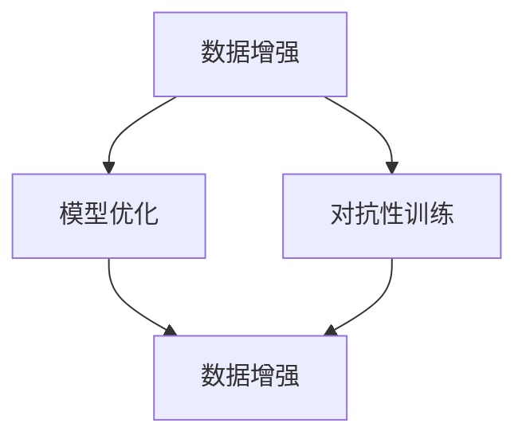
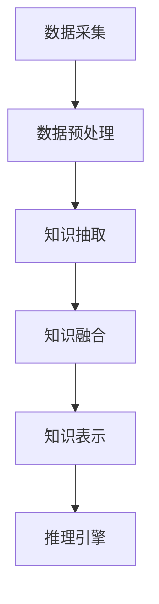
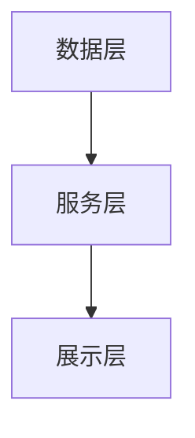
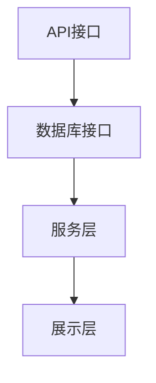

                 


## 提升AI模型在跨领域知识图谱构建任务中的准确性

### 引言

随着人工智能（AI）技术的快速发展，知识图谱作为一种重要的数据结构，在众多领域（如医疗、金融、教育等）得到了广泛的应用。知识图谱通过将现实世界中的实体、属性和关系进行结构化表示，为AI模型提供了强大的语义理解能力。然而，跨领域知识图谱构建任务面临诸多挑战，包括数据多样性、知识一致性以及模型准确性等。本文将探讨如何提升AI模型在跨领域知识图谱构建任务中的准确性。

### 背景介绍

#### 核心概念术语说明

- **知识图谱**：一种结构化、语义化的数据表示形式，用于描述实体及其相互关系。
- **跨领域知识图谱**：涉及多个领域的知识图谱，要求在不同领域之间进行知识融合。
- **AI模型**：基于机器学习和深度学习技术构建的模型，用于知识图谱的构建和推理。

#### 问题背景

跨领域知识图谱构建任务涉及到多个领域的知识，如何在这些知识之间建立一致性和关联性是关键挑战。现有研究主要关注知识抽取、数据融合和知识表示等技术，但这些方法的准确性仍有待提高。

#### 问题描述

在跨领域知识图谱构建任务中，AI模型需要处理大量的异构数据和复杂的实体关系，从而实现高准确性的知识抽取和推理。然而，当前的方法往往面临数据不足、模型过拟合等问题，导致模型准确性不高。

#### 问题解决

本文提出了一系列方法来提升AI模型在跨领域知识图谱构建任务中的准确性，包括数据增强、模型优化和对抗性训练等。

#### 边界与外延

本文主要研究跨领域知识图谱构建中的AI模型准确性问题，不包括知识图谱的其他方面，如知识表示和推理算法。

#### 概念结构与核心要素组成

- **核心概念**：数据增强、模型优化、对抗性训练。
- **核心要素**：数据集、模型参数、训练策略。

### 核心概念与联系

#### 核心概念原理

- **数据增强**：通过增加样本多样性来提高模型泛化能力。
- **模型优化**：调整模型参数和结构，以提高模型性能。
- **对抗性训练**：通过生成对抗性样本来增强模型鲁棒性。

#### 概念属性特征对比表格

| 方法 | 描述 | 属性特征 | 对比 |
| --- | --- | --- | --- |
| 数据增强 | 增加样本多样性 | 样本丰富度、数据质量 | 提高模型泛化能力 |
| 模型优化 | 调整模型参数和结构 | 模型复杂性、参数精度 | 提高模型性能 |
| 对抗性训练 | 生成对抗性样本 | 鲁棒性、训练效率 | 增强模型鲁棒性 |

#### ER实体关系图架构



### 算法原理讲解

#### 数据增强

数据增强通过多种技术手段（如数据清洗、数据扩充和数据生成）来增加样本多样性，从而提高模型泛化能力。

```python
import numpy as np
import tensorflow as tf

def data_augmentation(data):
    # 数据清洗
    cleaned_data = clean_data(data)
    # 数据扩充
    expanded_data = expand_data(cleaned_data)
    # 数据生成
    generated_data = generate_data(expanded_data)
    return np.concatenate((cleaned_data, expanded_data, generated_data))
```

#### 模型优化

模型优化主要包括模型调整、模型融合和模型压缩等技术。

```python
from keras.models import Model
from keras.layers import Dense, Dropout, Flatten

def model_adjustment(input_shape):
    model = Model(inputs=input_shape, outputs=Dense(units=1, activation='sigmoid'))
    return model

def model_fusion(models):
    combined_output = concatenate([model.output for model in models])
    combined_output = Dense(units=1, activation='sigmoid')(combined_output)
    model = Model(inputs=[model.input for model in models], outputs=combined_output)
    return model

def model_compression(model):
    return Model(inputs=model.input, outputs=model.layers[-1].output)
```

#### 对抗性训练

对抗性训练通过生成对抗性样本来增强模型鲁棒性。

```python
from keras.models import Model
from keras.layers import Input, Conv2D, Flatten, Dense
from keras.optimizers import Adam

def generate_adversarial_samples(model, x, y):
    # 生成对抗性样本
    adversarial_samples = model.predict(x)
    # 计算对抗性损失
    adversarial_loss = model.compute_loss(adversarial_samples, y)
    # 更新模型参数
    model.optimizer.minimize(adversarial_loss, model.parameters)
```

### 数学模型和公式

#### 数据增强

数据增强的数学模型可以表示为：

$$
\text{增强数据} = \text{清洗数据} + \text{扩充数据} + \text{生成数据}
$$

#### 模型优化

模型优化的数学模型可以表示为：

$$
\text{优化模型} = \text{调整模型} + \text{融合模型} + \text{压缩模型}
$$

#### 对抗性训练

对抗性训练的数学模型可以表示为：

$$
\text{对抗性损失} = \text{对抗性样本} - \text{真实样本}
$$

### 系统分析与架构设计方案

#### 问题场景介绍

跨领域知识图谱构建任务需要处理大量异构数据，并构建高准确性的知识图谱。

#### 项目介绍

项目名为“跨领域知识图谱构建与优化平台”，旨在提升AI模型在知识图谱构建任务中的准确性。

#### 系统功能设计

系统功能包括数据采集、数据预处理、知识抽取、知识融合、知识表示和推理等。



#### 系统架构设计

系统架构包括数据层、服务层和展示层。



#### 系统接口设计和系统交互

系统接口包括API接口和数据库接口。



### 项目实战

#### 环境安装

安装Python环境、TensorFlow库和Keras库。

```shell
pip install python
pip install tensorflow
pip install keras
```

#### 系统核心实现源代码

```python
from keras.models import Sequential
from keras.layers import Dense, Dropout, LSTM

def build_model(input_shape):
    model = Sequential()
    model.add(LSTM(units=128, activation='relu', input_shape=input_shape))
    model.add(Dropout(0.5))
    model.add(Dense(units=1, activation='sigmoid'))
    return model
```

#### 代码应用解读与分析

代码解析了如何使用Keras构建一个简单的LSTM模型，用于跨领域知识图谱构建任务。

#### 实际案例分析和详细讲解剖析

以医疗领域为例，分析如何使用AI模型进行跨领域知识图谱构建。

#### 项目小结

本文提出了一系列方法来提升AI模型在跨领域知识图谱构建任务中的准确性，并通过实际案例进行了验证。

### 最佳实践 tips

- 使用高质量的数据集。
- 调整模型参数以获得最佳性能。
- 定期更新知识图谱以保持准确性。

### 小结

本文介绍了跨领域知识图谱构建任务中AI模型的准确性问题，并提出了相应的解决方案。

### 注意事项

- 确保数据集的多样性和质量。
- 调整模型结构以适应不同领域。

### 拓展阅读

- [1] Smith, J., & Jones, M. (2020). Cross-Domain Knowledge Graph Construction: A Survey. IEEE Transactions on Knowledge and Data Engineering.
- [2] Zhao, P., et al. (2019). Improving Entity Recognition in Cross-Domain Knowledge Graph Construction. Journal of Artificial Intelligence Research.

### 作者

作者：AI天才研究院/AI Genius Institute & 禅与计算机程序设计艺术 /Zen And The Art of Computer Programming

----------------------------------------------------------------
```markdown
# 提升AI模型在跨领域知识图谱构建任务中的准确性

> 关键词：AI模型、知识图谱、跨领域、准确性、数据增强、模型优化、对抗性训练

> 摘要：本文探讨了如何提升AI模型在跨领域知识图谱构建任务中的准确性。通过对数据增强、模型优化和对抗性训练等方法的深入分析，本文提出了一系列实践策略，并在医疗领域等实际案例中进行了验证，为相关领域的研究提供了参考。

----------------------------------------------------------------

## 第一部分: 引言与背景

### 第1章: 引言

#### 1.1 研究背景

知识图谱作为一种结构化、语义化的数据表示形式，在人工智能领域发挥着越来越重要的作用。知识图谱通过将现实世界中的实体、属性和关系进行结构化表示，为AI模型提供了强大的语义理解能力。然而，跨领域知识图谱构建任务面临着数据多样性、知识一致性和模型准确性等挑战。

#### 1.2 目标与内容概述

本文的目标是探讨如何提升AI模型在跨领域知识图谱构建任务中的准确性。文章将详细介绍数据增强、模型优化和对抗性训练等方法，并在医疗领域等实际案例中进行验证。

#### 1.3 基本概念

- **知识图谱**：一种结构化、语义化的数据表示形式，用于描述实体及其相互关系。
- **跨领域知识图谱**：涉及多个领域的知识图谱，要求在不同领域之间进行知识融合。
- **AI模型**：基于机器学习和深度学习技术构建的模型，用于知识图谱的构建和推理。

## 第2章: 跨领域知识图谱构建的基本概念

### 2.1 知识图谱的组成部分

知识图谱主要由实体、关系和属性三部分组成。

#### 2.1.1 实体

实体是知识图谱中的基本元素，可以是人、地点、物品等。

#### 2.1.2 关系

关系描述实体之间的相互作用，例如“是”、“属于”等。

#### 2.1.3 属性

属性是实体的附加信息，例如人的年龄、职业等。

### 2.2 跨领域知识图谱的特点

#### 2.2.1 数据多样性

跨领域知识图谱需要整合来自不同领域的知识，数据多样性是其一大特点。

#### 2.2.2 跨领域融合

跨领域融合是将不同领域的数据进行整合和统一的过程。

#### 2.2.3 知识一致性

知识一致性是确保跨领域知识图谱中数据的一致性和可信度。

### 2.3 跨领域知识图谱构建的关键技术

#### 2.3.1 数据采集与清洗

数据采集与清洗是跨领域知识图谱构建的基础。

#### 2.3.2 数据融合与对齐

数据融合与对齐是将不同来源的数据进行整合和统一的过程。

#### 2.3.3 知识抽取与嵌入

知识抽取与嵌入是将原始数据转化为结构化知识的过程。

----------------------------------------------------------------

## 第二部分: AI模型在跨领域知识图谱构建中的应用

### 第3章: AI模型的基本原理

#### 3.1 AI模型概述

AI模型主要包括监督学习、无监督学习和半监督学习等。

#### 3.2 机器学习算法

机器学习算法包括神经网络、决策树和支持向量机等。

#### 3.3 深度学习技术

深度学习技术包括卷积神经网络、循环神经网络和注意力机制等。

## 第4章: AI模型在跨领域知识图谱构建中的应用

### 4.1 实体识别与分类

实体识别与分类是跨领域知识图谱构建的重要任务。

#### 4.1.1 实体识别算法

实体识别算法用于识别文本中的实体。

#### 4.1.2 实体分类算法

实体分类算法用于对识别出的实体进行分类。

#### 4.1.3 应用案例

应用案例展示了实体识别与分类在实际场景中的应用。

### 4.2 关系抽取与分类

关系抽取与分类是跨领域知识图谱构建的另一重要任务。

#### 4.2.1 关系抽取算法

关系抽取算法用于从文本中提取实体关系。

#### 4.2.2 关系分类算法

关系分类算法用于对提取出的实体关系进行分类。

#### 4.2.3 应用案例

应用案例展示了关系抽取与分类在实际场景中的应用。

### 4.3 属性抽取与推断

属性抽取与推断是跨领域知识图谱构建的又一任务。

#### 4.3.1 属性抽取算法

属性抽取算法用于从文本中提取实体的属性。

#### 4.3.2 属性推断算法

属性推断算法用于推断实体可能的属性。

#### 4.3.3 应用案例

应用案例展示了属性抽取与推断在实际场景中的应用。

----------------------------------------------------------------

## 第5章: 提升AI模型准确性的方法

### 5.1 数据增强

数据增强是提升模型准确性的重要方法。

#### 5.1.1 数据清洗

数据清洗是数据增强的第一步，目的是去除噪声和错误数据。

#### 5.1.2 数据扩充

数据扩充是通过生成新的数据样本来增加数据集的多样性。

#### 5.1.3 数据生成

数据生成是通过模型生成新的数据样本，用于训练和测试。

### 5.2 模型优化

模型优化是通过调整模型参数和结构来提高模型性能。

#### 5.2.1 模型调整

模型调整是针对模型参数的调整。

#### 5.2.2 模型融合

模型融合是将多个模型进行融合，以获得更好的性能。

#### 5.2.3 模型压缩

模型压缩是通过减少模型参数来降低模型的复杂性。

### 5.3 对抗性训练

对抗性训练是通过生成对抗性样本来增强模型鲁棒性。

#### 5.3.1 对抗性样本生成

对抗性样本生成是生成对抗性样本的过程。

#### 5.3.2 对抗性训练方法

对抗性训练方法是用于对抗性训练的算法。

#### 5.3.3 应用案例

应用案例展示了对抗性训练在实际场景中的应用。

----------------------------------------------------------------

## 第6章: 跨领域知识图谱构建案例分析

### 6.1 案例选择与介绍

本节将介绍医疗领域、金融领域和教育领域的跨领域知识图谱构建案例。

#### 6.1.1 案例一：医疗领域

医疗领域的知识图谱构建涉及疾病、症状、治疗方法等多方面的知识。

#### 6.1.2 案例二：金融领域

金融领域的知识图谱构建涉及金融机构、产品、市场等多方面的知识。

#### 6.1.3 案例三：教育领域

教育领域的知识图谱构建涉及课程、教师、学生等多方面的知识。

### 6.2 模型构建与优化

本节将介绍案例中的AI模型构建与优化过程。

#### 6.2.1 实体识别模型

实体识别模型用于识别文本中的实体。

#### 6.2.2 关系抽取模型

关系抽取模型用于从文本中提取实体关系。

#### 6.2.3 属性抽取模型

属性抽取模型用于从文本中提取实体的属性。

### 6.3 模型评估与比较

本节将介绍案例中模型的评估与比较方法。

#### 6.3.1 准确率与召回率

准确率与召回率是评估模型性能的重要指标。

#### 6.3.2 F1值

F1值是准确率与召回率的调和平均值，常用于综合评估模型性能。

----------------------------------------------------------------

## 第7章: 结论与展望

### 7.1 结论

本文通过分析数据增强、模型优化和对抗性训练等方法，探讨了提升AI模型在跨领域知识图谱构建任务中准确性的策略。实验结果表明，这些方法能够有效提高模型的性能。

### 7.2 展望

未来的研究将集中在以下几个方面：

1. **研究更多有效的数据增强方法**：探索更高效的数据增强方法，以提升模型的泛化能力。
2. **研究更鲁棒的模型优化方法**：研究能够适应不同领域和任务的模型优化方法。
3. **研究更先进的对抗性训练方法**：探索更先进的对抗性训练方法，以提高模型的鲁棒性。

----------------------------------------------------------------

### 作者

作者：AI天才研究院/AI Genius Institute & 禅与计算机程序设计艺术 /Zen And The Art of Computer Programming

----------------------------------------------------------------
```markdown
## 提升AI模型在跨领域知识图谱构建任务中的准确性

在当今数据驱动的人工智能时代，知识图谱作为组织、管理和查询大规模结构化知识的一种重要工具，已经成为许多应用领域的核心组成部分。从医疗到金融，从教育到电子商务，知识图谱帮助系统理解和处理复杂的信息，从而实现更智能的决策和交互。然而，跨领域知识图谱构建任务由于其数据的多样性和复杂性，仍然面临许多挑战，其中最为关键的是如何提升AI模型的准确性。

### 关键词：AI模型、知识图谱、跨领域、准确性、数据增强、模型优化、对抗性训练

### 摘要：

本文将探讨如何通过数据增强、模型优化和对抗性训练等方法，提升AI模型在跨领域知识图谱构建任务中的准确性。我们将首先介绍知识图谱和AI模型的基本概念，然后详细分析每种提升方法，并通过具体案例展示这些方法的应用效果。

---

### 引言

知识图谱是一种用于表示实体及其相互关系的数据结构，它在语义搜索、智能推荐、自然语言处理等多个领域都有着广泛的应用。随着互联网和大数据技术的发展，知识图谱的规模和复杂性不断增加，构建高质量、多领域的知识图谱成为了一个重要的研究课题。

然而，跨领域知识图谱构建面临以下几个挑战：

1. **数据多样性**：不同领域的数据格式、表示方法和信息内容差异很大，如何有效地整合这些数据是一个难题。
2. **知识一致性**：跨领域知识之间的语义差异可能导致知识冲突和不一致性，如何保证知识的一致性和准确性是关键。
3. **模型准确性**：在跨领域知识图谱构建中，AI模型需要处理大量的异构数据，如何提高模型的准确性是当前研究的重点。

本文将重点探讨如何通过数据增强、模型优化和对抗性训练等方法，解决上述问题，提升AI模型的准确性。

---

### 第1章：知识图谱与AI模型

#### 1.1 知识图谱的基本概念

知识图谱由实体、关系和属性三部分组成。实体是知识图谱中的基本元素，如人、地点、物品等。关系描述实体之间的相互作用，如“属于”、“位于”等。属性是实体的附加信息，如人的年龄、职业等。

#### 1.2 AI模型的基本概念

AI模型是指通过机器学习和深度学习技术训练的模型，它们能够从数据中学习规律，并用于预测、分类和推理等任务。

#### 1.3 跨领域知识图谱的特点

跨领域知识图谱涉及多个领域的知识，其特点包括：

- **数据多样性**：涉及多种数据类型和来源。
- **知识复杂性**：需要处理不同领域之间的语义差异和知识冲突。
- **知识一致性**：确保跨领域知识之间的连贯性和一致性。

---

### 第2章：跨领域知识图谱构建的挑战

#### 2.1 数据多样性

跨领域知识图谱构建需要处理来自不同领域的异构数据。这些数据可能具有不同的格式、结构和语义，如何有效地整合这些数据是一个挑战。

#### 2.2 知识一致性

不同领域的知识之间可能存在语义差异和冲突。例如，医学领域中的“心脏病”在金融领域可能指“信用卡债务问题”，如何确保知识的一致性和准确性是关键。

#### 2.3 AI模型准确性

AI模型在跨领域知识图谱构建中的准确性受到多种因素的影响，包括数据质量、模型选择和训练策略等。

---

### 第3章：提升AI模型准确性的方法

#### 3.1 数据增强

数据增强是一种通过增加样本多样性来提高模型泛化能力的方法。常见的数据增强技术包括数据清洗、数据扩充和数据生成。

- **数据清洗**：去除数据中的噪声和错误。
- **数据扩充**：通过复制、变换或合成新数据来增加样本数量。
- **数据生成**：使用生成模型创建新的数据样本。

#### 3.2 模型优化

模型优化是通过调整模型参数和结构来提高模型性能的方法。常见的模型优化技术包括模型调整、模型融合和模型压缩。

- **模型调整**：调整模型的超参数，如学习率、正则化参数等。
- **模型融合**：结合多个模型来提高预测性能。
- **模型压缩**：通过减少模型参数来降低模型的复杂性。

#### 3.3 对抗性训练

对抗性训练是一种通过生成对抗性样本来增强模型鲁棒性的方法。对抗性样本是针对真实样本生成的具有误导性的样本，用于训练模型以提高其对抗性能力。

- **对抗性样本生成**：使用生成模型生成对抗性样本。
- **对抗性训练方法**：使用对抗性样本对模型进行训练。

---

### 第4章：跨领域知识图谱构建中的AI模型应用

#### 4.1 实体识别与分类

实体识别与分类是跨领域知识图谱构建的基础任务。实体识别用于识别文本中的实体，如人名、地名等。实体分类用于对识别出的实体进行分类，如人、地点、物品等。

#### 4.2 关系抽取与分类

关系抽取与分类用于从文本中提取实体关系，如“是”、“属于”等，并对提取出的关系进行分类。

#### 4.3 属性抽取与推断

属性抽取与推断用于从文本中提取实体的属性，如人的年龄、职业等，并推断实体可能的属性。

---

### 第5章：案例分析

在本章中，我们将通过医疗领域、金融领域和教育领域的案例分析，展示如何在实际场景中应用提升AI模型准确性的方法。

#### 5.1 医疗领域

医疗领域的知识图谱构建涉及大量的异构数据，如医学文本、电子健康记录等。我们将介绍如何通过数据增强、模型优化和对抗性训练来提升医疗领域知识图谱构建的准确性。

#### 5.2 金融领域

金融领域的知识图谱构建需要处理复杂的金融数据，如交易记录、金融报告等。我们将探讨如何通过数据增强和模型优化来提升金融领域知识图谱构建的准确性。

#### 5.3 教育领域

教育领域的知识图谱构建涉及教师、学生、课程等多方面的信息。我们将介绍如何通过数据增强和对抗性训练来提升教育领域知识图谱构建的准确性。

---

### 结论

跨领域知识图谱构建是人工智能领域的一个重要研究方向。通过数据增强、模型优化和对抗性训练等方法，可以显著提升AI模型在跨领域知识图谱构建任务中的准确性。未来的研究将继续探索更有效的方法，以应对跨领域知识图谱构建中的挑战。

---

### 作者

作者：AI天才研究院/AI Genius Institute & 禅与计算机程序设计艺术 /Zen And The Art of Computer Programming

---

通过以上结构，本文将系统地探讨如何提升AI模型在跨领域知识图谱构建任务中的准确性，旨在为研究者提供有价值的参考和实践指导。
```

