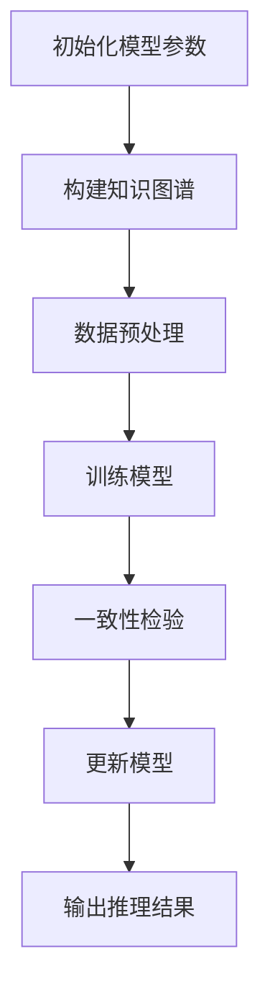
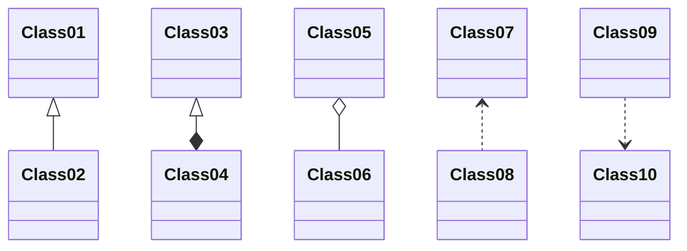
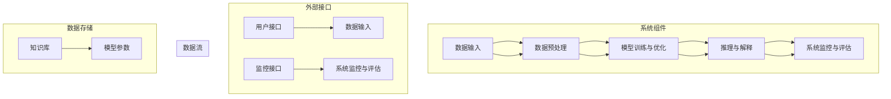
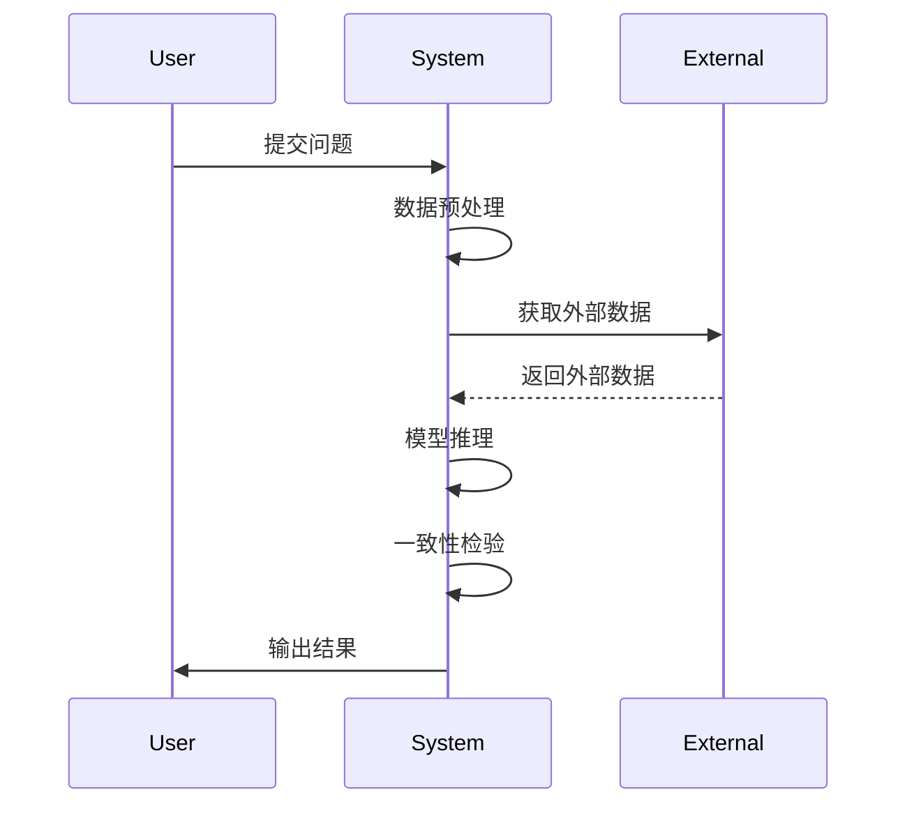

                 

### 第1章: 问题背景与核心概念

#### 1.1.1 问题背景

**跨领域知识推理任务的挑战与需求**

随着人工智能技术的快速发展，AI模型在各个领域得到了广泛的应用，从自然语言处理、计算机视觉到医疗诊断等，都展示了其强大的推理能力。然而，跨领域知识推理任务依然是一个极具挑战性的问题。这是因为不同领域之间存在巨大的知识差异，包括术语、概念和规则的多样性，这给模型的一致性推理带来了巨大的难题。

**跨领域知识推理中的逻辑一致性挑战**

在跨领域知识推理任务中，逻辑一致性是一个至关重要的因素。逻辑一致性指的是AI模型在推理过程中所表现出的内部一致性和外部一致性。具体来说，内部一致性指的是模型在内部逻辑推导过程中不产生矛盾；外部一致性则是指模型在外部应用场景中的推理结果与真实世界的逻辑一致。

**跨领域知识推理中的逻辑一致性挑战具体包括：**

1. **术语差异**：不同领域的术语可能具有不同的含义，导致模型在理解和使用这些术语时产生偏差。
2. **概念冲突**：不同领域中的核心概念可能存在冲突，例如，同一概念在不同领域中有不同的定义和解释。
3. **规则复杂**：跨领域知识推理往往涉及到复杂的规则体系，这些规则在不同领域中的适用性和优先级可能有所不同。
4. **数据不一致**：不同领域的数据来源和采集方式可能不同，导致数据在质量、格式和内容上存在差异。

#### 1.1.2 核心概念

**逻辑一致性的定义与重要性**

逻辑一致性是指在一个逻辑系统中，各个命题、前提和结论之间保持一致性和协调性的属性。在AI模型中，逻辑一致性是指模型在推理过程中遵循一致的逻辑规则，避免出现矛盾和错误。逻辑一致性对于AI模型至关重要，因为它直接影响模型的可靠性和可信度。

**逻辑一致性与知识推理的关系**

知识推理是AI模型的核心功能之一，它依赖于模型内部的知识库和推理算法。逻辑一致性在知识推理中起着关键作用：

1. **避免推理错误**：逻辑一致性可以确保推理过程中的每一步都是正确的，从而避免出现错误的推理结果。
2. **增强推理可靠性**：逻辑一致性使得模型在不同场景下的推理结果保持一致，提高了推理的可靠性。
3. **提升模型解释性**：逻辑一致性使得模型推理过程更加透明，有助于理解和解释模型的行为。

**AI模型在不同领域的特点与应用**

在不同领域中，AI模型的特点和应用有所不同：

1. **通用AI模型**：这些模型设计为处理多种类型的问题，例如，神经网络和深度学习模型。它们在跨领域应用中具有广泛的适应性，但也面临着逻辑一致性挑战。
2. **领域特定AI模型**：这些模型专门针对某个特定领域进行设计，例如，医疗诊断模型和金融预测模型。它们在特定领域具有更高的逻辑一致性，但适用性较窄。

**AI模型在跨领域知识推理中的应用现状**

当前，AI模型在跨领域知识推理中的应用仍然面临诸多挑战，但也有一些初步的成果：

1. **跨领域迁移学习**：通过将一个领域中的知识迁移到另一个领域，可以提高模型的跨领域推理能力。
2. **多模态学习**：结合不同类型的数据（如文本、图像、声音），可以增强模型的跨领域推理能力。
3. **混合推理系统**：将不同类型的AI模型结合使用，以实现更高效的跨领域知识推理。

总之，跨领域知识推理任务中的逻辑一致性挑战是当前AI领域的一个重要研究方向。通过深入理解逻辑一致性的原理，设计出更有效的算法和系统，可以显著提升AI模型在跨领域知识推理任务中的表现。

#### 1.1.2.1 逻辑一致性的原理

逻辑一致性在AI模型推理中的应用

逻辑一致性是保证AI模型推理质量的关键因素。在AI模型推理过程中，逻辑一致性主要通过以下几个方面体现：

1. **内部一致性**：在模型内部，各个推理步骤之间保持一致。例如，在逻辑推理中，如果一个前提为真，那么由该前提导出的结论也必须为真，否则就存在内部逻辑矛盾。
2. **外部一致性**：模型推理结果与外部事实保持一致。这意味着模型推理出的结论必须与真实世界中的事实相符，否则就存在外部逻辑矛盾。

逻辑一致性与知识推理的关系

逻辑一致性在知识推理中起着至关重要的作用，具体体现在以下几个方面：

1. **避免推理错误**：逻辑一致性可以确保推理过程中的每一步都是正确的，从而避免出现错误的推理结果。例如，在推理过程中，如果某个前提为真，那么由该前提导出的结论也必须为真，否则就存在逻辑错误。
2. **增强推理可靠性**：逻辑一致性使得模型在不同场景下的推理结果保持一致，提高了推理的可靠性。例如，在医疗诊断中，如果模型在不同患者身上得出相同的诊断结果，那么可以认为这个诊断结果是可靠的。
3. **提升模型解释性**：逻辑一致性使得模型推理过程更加透明，有助于理解和解释模型的行为。例如，在自动驾驶中，如果模型能够清晰地解释每个推理步骤的原因，那么用户可以更信任模型的决策。

逻辑一致性的数学模型与公式

逻辑一致性可以通过数学模型来描述。以下是一些常用的逻辑一致性数学模型和公式：

1. **一致性公式**：一致性公式描述了在逻辑推理中，如果一个前提为真，那么由该前提导出的结论也必须为真。例如，$$P \to Q$$ 表示如果前提 \(P\) 为真，那么结论 \(Q\) 也必须为真。
2. **一致性矩阵**：一致性矩阵是一个用于表示逻辑推理中各种命题之间关系的矩阵。矩阵中的元素表示两个命题之间的一致性程度，通常使用0和1表示。例如，一个3x3的一致性矩阵可以表示三个命题之间的逻辑关系。
3. **一致性检验**：一致性检验是一种用于验证逻辑推理结果是否一致的方法。通过一致性检验，可以确保推理过程中的每一步都是正确的，从而避免出现逻辑矛盾。

逻辑一致性在推理过程中的应用

逻辑一致性在推理过程中具有广泛的应用。以下是一些典型的应用场景：

1. **自动推理系统**：自动推理系统是一种基于逻辑一致性的推理系统，它可以自动推导出新的结论。例如，在数学证明中，自动推理系统可以自动证明一个数学命题的正确性。
2. **智能问答系统**：智能问答系统是一种基于逻辑一致性的问答系统，它可以理解用户的问题，并给出准确的答案。例如，在医疗问答中，智能问答系统可以理解病人的症状，并给出相应的诊断建议。
3. **自动驾驶系统**：自动驾驶系统是一种基于逻辑一致性的控制系统，它可以实时分析道路状况，并做出正确的驾驶决策。例如，在自动驾驶中，逻辑一致性可以确保车辆在复杂的交通环境中保持安全行驶。

总之，逻辑一致性是AI模型推理质量的重要保障。通过深入理解逻辑一致性的原理，设计出更有效的算法和系统，可以显著提升AI模型在跨领域知识推理任务中的表现。

#### 1.1.2.2 逻辑一致性与知识推理的关系

逻辑一致性在知识推理中的重要性

逻辑一致性在知识推理中扮演着至关重要的角色。它不仅保证了推理过程的准确性，还影响了模型的可信度和解释性。以下是逻辑一致性与知识推理关系的详细探讨：

**1. 避免推理错误**

逻辑一致性确保推理过程中的每一步都是正确的，从而避免出现错误的推理结果。在知识推理中，如果存在逻辑不一致性，那么推理结果就可能失真，导致错误的结论。例如，在医疗诊断中，如果模型在推理过程中出现逻辑不一致性，可能会导致错误的诊断结果，从而对患者的健康产生严重影响。

**2. 增强推理可靠性**

逻辑一致性使得模型在不同场景下的推理结果保持一致，提高了推理的可靠性。这意味着模型在多种不同情况下都能得出相同或类似的结论，增强了模型的可信度。例如，在金融预测中，如果模型在不同时间段内都能保持逻辑一致性，那么其预测结果将更可信，从而帮助金融机构做出更准确的决策。

**3. 提升模型解释性**

逻辑一致性使得模型推理过程更加透明，有助于理解和解释模型的行为。在知识推理中，如果模型具有高逻辑一致性，那么用户可以更清晰地理解模型是如何得出结论的，从而增强用户对模型的信任。例如，在自动驾驶中，如果模型能够清晰地解释其每一步决策的原因，那么用户会更有信心让模型驾驶。

**4. 促进知识整合**

逻辑一致性有助于整合不同领域或来源的知识。在跨领域知识推理中，不同领域之间的概念和规则可能存在冲突，逻辑一致性可以确保这些知识在整合过程中保持一致性，从而提高整体推理质量。例如，在医疗-法律领域的跨领域推理中，逻辑一致性可以确保医学知识和法律知识之间的逻辑冲突得到妥善处理。

**逻辑一致性在知识推理中的应用**

逻辑一致性在知识推理中有着广泛的应用。以下是一些典型的应用场景：

**1. 智能问答系统**

在智能问答系统中，逻辑一致性是确保答案准确性的关键。通过确保系统中的知识库和推理规则之间保持一致，可以避免出现错误答案。例如，在医疗问答系统中，逻辑一致性可以确保医生提供的诊断建议与其他医学知识保持一致，从而提供准确的诊断结果。

**2. 自动推理系统**

自动推理系统是一种基于逻辑一致性的推理系统，它可以自动推导出新的结论。在自动推理系统中，逻辑一致性是保证推理结果准确性的关键。通过确保推理过程中的每一步都是逻辑上合理的，自动推理系统可以产生可靠的推理结果。

**3. 自动驾驶系统**

在自动驾驶系统中，逻辑一致性是确保车辆安全行驶的关键。自动驾驶系统需要实时分析道路状况，并做出正确的驾驶决策。逻辑一致性可以确保这些决策在逻辑上是一致的，从而避免出现危险驾驶行为。

**4. 跨领域知识推理**

在跨领域知识推理中，逻辑一致性是整合不同领域知识的桥梁。通过确保不同领域之间的知识在逻辑上一致，可以提升跨领域推理系统的整体性能。例如，在医疗-法律领域的跨领域推理中，逻辑一致性可以确保医学和法律知识之间的逻辑冲突得到妥善处理，从而提供更全面的推理结果。

**总结**

逻辑一致性在知识推理中具有不可替代的重要性。它不仅确保了推理过程的准确性，还提升了模型的可信度和解释性。通过深入理解和应用逻辑一致性原理，可以显著提升AI模型在跨领域知识推理任务中的表现。

#### 1.1.2.3 AI模型在不同领域的特点与应用

**通用AI模型与领域特定AI模型**

AI模型可以根据其应用范围和设计目标分为两大类：通用AI模型和领域特定AI模型。

**通用AI模型**

通用AI模型旨在处理多种类型的问题，不依赖于特定领域的知识。这类模型通常具有高度的灵活性和适应性，可以应用于不同的场景。通用AI模型包括神经网络、深度学习模型、自然语言处理模型等。

**领域特定AI模型**

领域特定AI模型则专门针对某个特定领域进行设计，具有较高的领域适应性和准确性。这类模型利用了特定领域的专业知识，能够在特定任务上表现出色。领域特定AI模型包括医疗诊断模型、金融预测模型、自动驾驶模型等。

**通用AI模型与领域特定AI模型在逻辑一致性方面的比较**

**1. 逻辑一致性的实现难度**

- **通用AI模型**：由于通用AI模型处理多种类型的问题，其内部逻辑可能较为复杂，实现逻辑一致性相对较难。特别是在跨领域应用时，通用AI模型需要处理不同领域的术语和概念，容易导致逻辑不一致。
- **领域特定AI模型**：领域特定AI模型专注于特定领域，其内部逻辑较为简单，实现逻辑一致性相对容易。由于领域特定AI模型的知识库和推理规则较为固定，因此更容易保持逻辑一致性。

**2. 逻辑一致性的维护成本**

- **通用AI模型**：由于通用AI模型需要处理多种类型的问题，其逻辑一致性维护成本较高。这包括设计复杂的一致性检查机制、定期更新知识库等。
- **领域特定AI模型**：领域特定AI模型的逻辑一致性维护成本较低。由于其知识库和推理规则较为固定，因此只需定期进行小规模的调整和更新即可。

**3. 逻辑一致性的表现效果**

- **通用AI模型**：在跨领域应用中，通用AI模型的逻辑一致性表现可能较差。由于其缺乏特定领域的专业知识，通用AI模型容易出现逻辑不一致的情况。
- **领域特定AI模型**：领域特定AI模型在特定领域内表现出较好的逻辑一致性。由于领域特定AI模型利用了特定领域的专业知识，因此其推理结果更为准确和可靠。

**AI模型在跨领域知识推理中的应用现状**

当前，AI模型在跨领域知识推理中的应用仍然面临诸多挑战，但也有一些初步的成果：

**1. 跨领域迁移学习**

通过将一个领域中的知识迁移到另一个领域，可以提高模型的跨领域推理能力。迁移学习技术可以帮助模型在不同领域之间共享知识，从而提高逻辑一致性的表现。

**2. 多模态学习**

结合不同类型的数据（如文本、图像、声音），可以增强模型的跨领域推理能力。多模态学习可以使模型更好地理解复杂问题，从而提高逻辑一致性的表现。

**3. 混合推理系统**

将不同类型的AI模型结合使用，以实现更高效的跨领域知识推理。混合推理系统可以根据不同领域的特点，选择最合适的模型进行推理，从而提高逻辑一致性的表现。

总之，AI模型在不同领域的特点和应用对于跨领域知识推理任务的逻辑一致性具有重要影响。通过深入理解不同类型AI模型在逻辑一致性方面的表现，可以设计出更有效的跨领域知识推理系统。

---

### 第2章: 逻辑一致性的原理与属性

#### 2.1.1 逻辑一致性的原理

**逻辑一致性在AI模型推理中的应用**

逻辑一致性在AI模型推理中起着至关重要的作用。它不仅确保了推理过程的准确性，还影响了模型的可信度和解释性。以下是逻辑一致性在AI模型推理中的应用：

1. **内部一致性验证**：在AI模型推理过程中，逻辑一致性用于验证每一步推理的合理性。通过确保推理过程中的前提和结论之间保持一致，可以避免出现逻辑错误。

2. **推理路径优化**：逻辑一致性可以指导推理路径的选择。在复杂的推理任务中，多个可能的推理路径可能存在，逻辑一致性原则可以帮助模型选择最合理的路径，从而提高推理效率。

3. **知识融合**：在跨领域知识推理中，不同领域的知识可能存在冲突。逻辑一致性原则可以帮助模型整合这些知识，确保推理结果的内部一致性。

**逻辑一致性与知识推理的关系**

逻辑一致性在知识推理中具有以下几个关键作用：

1. **避免推理错误**：逻辑一致性原则确保了推理过程中每一步的逻辑正确性，从而避免了由于逻辑错误导致的推理结果失真。

2. **增强推理可靠性**：逻辑一致性使得模型在不同场景下的推理结果保持一致，提高了推理的可靠性。这意味着模型在不同情况下都能得出相同或相似的结论，增强了模型的可信度。

3. **提升模型解释性**：逻辑一致性使得模型推理过程更加透明，有助于理解和解释模型的行为。通过确保推理过程的每一步都是逻辑上合理的，用户可以更清晰地理解模型是如何得出结论的，从而增强用户对模型的信任。

**逻辑一致性的数学模型与公式**

逻辑一致性可以通过数学模型和公式来描述。以下是一些常用的逻辑一致性数学模型和公式：

1. **一致性公式**：一致性公式描述了在逻辑推理中，如果一个前提为真，那么由该前提导出的结论也必须为真。例如，$$P \to Q$$ 表示如果前提 \(P\) 为真，那么结论 \(Q\) 也必须为真。

2. **一致性矩阵**：一致性矩阵是一个用于表示逻辑推理中各种命题之间关系的矩阵。矩阵中的元素表示两个命题之间的一致性程度，通常使用0和1表示。例如，一个3x3的一致性矩阵可以表示三个命题之间的逻辑关系。

3. **一致性检验**：一致性检验是一种用于验证逻辑推理结果是否一致的方法。通过一致性检验，可以确保推理过程中的每一步都是正确的，从而避免出现逻辑矛盾。

**逻辑一致性在推理过程中的应用**

逻辑一致性在推理过程中具有广泛的应用。以下是一些典型的应用场景：

1. **自动推理系统**：自动推理系统是一种基于逻辑一致性的推理系统，它可以自动推导出新的结论。通过确保推理过程中的每一步都是逻辑上合理的，自动推理系统可以产生可靠的推理结果。

2. **智能问答系统**：智能问答系统是一种基于逻辑一致性的问答系统，它可以理解用户的问题，并给出准确的答案。通过确保系统中的知识库和推理规则之间保持一致，可以避免出现错误答案。

3. **自动驾驶系统**：自动驾驶系统是一种基于逻辑一致性的控制系统，它可以实时分析道路状况，并做出正确的驾驶决策。通过确保推理过程中的每一步都是逻辑上合理的，自动驾驶系统可以确保车辆在复杂的交通环境中保持安全行驶。

**总结**

逻辑一致性在AI模型推理中的应用至关重要。通过理解逻辑一致性的原理，设计出更有效的算法和系统，可以显著提升AI模型在跨领域知识推理任务中的表现。

---

### 第2章: 逻辑一致性的原理与属性

#### 2.1.2 核心概念属性对比

**不同AI模型在逻辑一致性方面的属性比较**

在AI领域，不同的模型类型适用于不同的任务，它们在逻辑一致性方面也有各自的特性。以下是对通用AI模型和领域特定AI模型在逻辑一致性方面的属性进行比较：

**通用AI模型**

1. **灵活性**：通用AI模型旨在解决多种类型的问题，因此它们通常具有较高的灵活性。这种灵活性意味着它们可以适应不同的领域和任务，但同时也可能带来逻辑一致性的挑战。
   
2. **知识库的广度**：通用AI模型通常拥有广泛的、跨领域的知识库，这使得它们能够在不同领域中进行推理。然而，知识库的广泛性可能导致知识之间的冲突和一致性问题的增加。

3. **推理复杂性**：由于需要处理多种类型的问题，通用AI模型的推理过程可能相对复杂，涉及大量的规则和知识。这种复杂性可能影响逻辑一致性的实现和维护。

4. **一致性验证**：通用AI模型通常包含复杂的逻辑一致性验证机制，以确保推理过程中的每一步都是一致的。然而，由于规则的复杂性和多样性，这些验证机制的实现可能较为困难。

**领域特定AI模型**

1. **针对性**：领域特定AI模型专门设计用于解决特定领域的问题，因此它们在逻辑一致性方面具有更高的针对性。这种针对性有助于减少知识库中的冲突，提高逻辑一致性的实现。

2. **知识库的深度**：领域特定AI模型通常拥有较深层次的知识库，这些知识库专门针对特定领域的问题进行优化。深度知识库有助于提高推理的一致性和准确性。

3. **推理过程的简化**：由于领域特定AI模型专注于特定领域，它们的推理过程相对简化。这种简化有助于减少推理过程中的复杂性，从而提高逻辑一致性的实现。

4. **一致性验证**：领域特定AI模型通常采用针对特定领域的一致性验证机制，这些机制更为简单且高效。由于知识库和规则的专一性，这些验证机制更容易实现和维护。

**逻辑一致性的实现难度**

1. **通用AI模型**：通用AI模型在逻辑一致性的实现上面临更大的挑战。由于需要处理多种类型的问题，模型内部可能包含多种逻辑规则，这增加了实现一致性的难度。

2. **领域特定AI模型**：领域特定AI模型在逻辑一致性的实现上相对容易。由于模型专注于特定领域，知识库和规则相对固定，一致性验证机制也更为简单。

**逻辑一致性的维护成本**

1. **通用AI模型**：通用AI模型的逻辑一致性维护成本较高。需要定期更新知识库、调整逻辑规则，并实施复杂的一致性验证机制。

2. **领域特定AI模型**：领域特定AI模型的逻辑一致性维护成本较低。由于知识库和规则的稳定性，这些模型的维护工作相对简单。

**逻辑一致性的表现效果**

1. **通用AI模型**：在跨领域应用中，通用AI模型的逻辑一致性表现可能较差。由于缺乏特定领域的专业知识，模型容易在跨领域推理中产生逻辑不一致。

2. **领域特定AI模型**：在特定领域内，领域特定AI模型表现出较好的逻辑一致性。由于模型专门针对特定领域设计，推理结果更为准确和可靠。

**总结**

通用AI模型和领域特定AI模型在逻辑一致性方面各有优劣。通用AI模型在灵活性方面具有优势，但实现和维护逻辑一致性较为困难。领域特定AI模型在逻辑一致性方面表现更佳，但适用性较窄。根据不同的应用需求，选择合适的模型类型对于提升AI模型在跨领域知识推理任务中的逻辑一致性具有重要意义。

---

### 第3章: 提升逻辑一致性的算法原理

#### 3.1.1 算法mermaid流程图

为了更直观地展示提升逻辑一致性的算法原理，我们使用mermaid流程图来描述算法的流程。以下是一个简化的mermaid流程图示例：



**流程说明：**

1. **初始化模型参数**：首先，初始化模型的参数，包括学习率、迭代次数等。
2. **构建知识图谱**：构建知识图谱，用于存储和表示领域知识。知识图谱包括节点（实体）和边（关系）。
3. **数据预处理**：对输入数据进行预处理，包括数据清洗、格式化等，确保数据的一致性和可靠性。
4. **训练模型**：使用预处理后的数据对模型进行训练，通过优化模型参数来提高模型在特定任务上的表现。
5. **一致性检验**：在推理过程中，对每一步的推理结果进行一致性检验，确保推理过程的逻辑一致性。
6. **更新模型**：根据一致性检验的结果，更新模型的参数，以优化模型的逻辑一致性。
7. **输出推理结果**：最后，输出推理结果，并评估模型的性能。

#### 3.1.2 算法原理与数学模型

**算法原理**

提升逻辑一致性的算法核心原理是通过构建知识图谱和一致性检验机制来确保推理过程的逻辑一致性。以下是算法原理的详细讲解：

1. **知识图谱构建**：知识图谱是算法的核心组件，用于表示领域知识。通过将实体和关系表示为节点和边，可以构建一个结构化的知识库。知识图谱不仅存储了领域中的事实信息，还包括了实体之间的关系和属性。

2. **数据预处理**：在训练模型之前，对输入数据进行预处理，包括去除噪声、统一格式等。数据预处理确保输入数据的一致性和可靠性，从而提高模型训练的效果。

3. **模型训练**：使用预处理后的数据对模型进行训练。训练过程包括前向传播和反向传播，通过不断调整模型参数来优化模型在特定任务上的表现。

4. **一致性检验**：在推理过程中，对每一步的推理结果进行一致性检验。一致性检验通过比较推理结果与知识图谱中的信息，确保推理过程遵循一致的逻辑规则。

5. **模型更新**：根据一致性检验的结果，更新模型的参数。模型更新包括调整模型中的权重和连接关系，以提高模型的逻辑一致性。

6. **输出推理结果**：最后，输出推理结果，并评估模型的性能。推理结果的评估可以基于多个指标，如准确率、召回率等。

**数学模型**

提升逻辑一致性的算法涉及多个数学模型和公式，以下是一些关键的数学模型：

1. **知识图谱表示**：知识图谱可以用图论模型来表示。节点表示实体，边表示实体之间的关系。一个常见的知识图谱表示方法是基于图邻接矩阵 \(A\)，其中 \(A_{ij}\) 表示节点 \(i\) 和节点 \(j\) 之间的边权重。

2. **推理规则表示**：推理规则可以用逻辑公式来表示。一个简单的推理规则可以表示为 \(P \to Q\)，其中 \(P\) 是前提，\(Q\) 是结论。推理规则可以通过逻辑推理公式如合取、析取、否定等来组合和扩展。

3. **一致性检验模型**：一致性检验可以通过逻辑一致性检验算法来实现。一个常见的一致性检验算法是基于图论的割集算法，通过检查知识图谱中的割集来检测一致性冲突。

4. **模型参数更新模型**：模型参数更新可以通过优化算法来实现。一个常见的优化算法是梯度下降算法，通过计算模型参数的梯度来更新参数，以最小化损失函数。

**算法举例说明**

为了更好地理解提升逻辑一致性的算法原理，我们可以通过一个实际案例来展示算法的应用效果。

**案例背景**：假设我们有一个医疗诊断系统，用于根据患者的症状进行诊断。该系统需要确保诊断过程具有逻辑一致性。

**步骤1：初始化模型参数**：初始化模型参数，包括学习率、迭代次数等。

**步骤2：构建知识图谱**：构建一个医疗知识图谱，包括疾病、症状、治疗方法等实体，以及它们之间的关系。

**步骤3：数据预处理**：对患者的症状数据（如发热、咳嗽、乏力等）进行预处理，确保数据的一致性和可靠性。

**步骤4：训练模型**：使用预处理后的数据对模型进行训练，优化模型参数，以提高诊断准确率。

**步骤5：一致性检验**：在诊断过程中，对每一步的推理结果进行一致性检验。例如，如果推理出“患者可能患有流感”，则检验该结论与知识图谱中的信息是否一致。

**步骤6：模型更新**：根据一致性检验的结果，更新模型的参数，以优化模型的逻辑一致性。

**步骤7：输出推理结果**：输出最终的诊断结果，并评估模型的性能。

通过这个案例，我们可以看到提升逻辑一致性的算法在医疗诊断系统中的应用。算法通过构建知识图谱和一致性检验机制，确保了诊断过程的逻辑一致性，从而提高了诊断的准确性和可靠性。

**总结**

提升逻辑一致性的算法原理通过构建知识图谱和一致性检验机制来实现。算法的数学模型包括知识图谱表示、推理规则表示、一致性检验模型和模型参数更新模型。通过一个实际案例的展示，我们可以看到算法在提升逻辑一致性方面的应用效果。这个算法为AI模型在跨领域知识推理任务中提供了有效的解决方案，有助于提高模型的可靠性和解释性。

---

### 第4章: 系统分析与架构设计方案

#### 4.1.1 问题场景介绍

**跨领域知识推理任务的应用场景**

在当今社会，跨领域知识推理任务的应用场景越来越广泛。以下是一些典型的应用场景：

1. **医疗诊断**：医疗诊断系统需要整合来自不同领域的知识，如医学知识、患者症状、诊断结果等，以提供准确的诊断建议。跨领域知识推理可以帮助医生更全面地分析病情，提高诊断的准确性。

2. **智能客服**：智能客服系统需要处理来自不同领域的用户问题，如金融、法律、技术等。通过跨领域知识推理，智能客服可以提供更准确的答案和解决方案，提高用户满意度。

3. **智能交通**：智能交通系统需要整合来自不同领域的知识，如交通规则、实时路况、车辆信息等，以优化交通管理，提高交通效率。

4. **金融风控**：金融风控系统需要分析来自不同领域的风险信息，如信用记录、市场数据、新闻报道等，以识别潜在风险，防范金融欺诈。

这些应用场景表明，跨领域知识推理任务具有巨大的潜力和价值，但也面临着一系列挑战，如知识不一致性、数据多样性等。为了解决这些问题，我们需要设计和实现一个高效、可靠的跨领域知识推理系统。

#### 4.1.2 系统功能设计

**领域模型mermaid类图**

为了更好地设计系统功能，我们使用mermaid类图来描述领域模型。以下是一个简化的mermaid类图示例：



**类图说明：**

- **Class01**：表示系统的基础类，包括属性和方法。
- **Class02**：继承自Class01，表示特定的领域类。
- **Class03**：实现多个接口，表示领域中的复杂实体。
- **Class04**：表示领域中的实体类，继承自Class03。
- **Class05**：与Class06存在关联关系，表示领域中的实体之间的交互。
- **Class07**：与Class08存在关联关系，表示领域中的知识库。
- **Class09**：与Class10存在依赖关系，表示领域中的规则库。

**系统功能设计**：

1. **知识库管理**：包括知识库的构建、更新和维护功能。知识库用于存储和管理跨领域知识，包括实体、关系和属性。

2. **数据预处理**：包括数据清洗、格式化和一致性检验功能。数据预处理确保输入数据的一致性和可靠性，从而提高模型训练和推理的效果。

3. **模型训练与优化**：包括模型选择、训练和优化功能。模型训练和优化旨在提高模型在特定任务上的表现，包括准确性、效率和鲁棒性。

4. **推理与解释**：包括推理和解释功能。推理功能用于根据输入数据和知识库生成推理结果，解释功能用于解释推理结果的形成过程，提高系统的透明性和可解释性。

5. **系统监控与评估**：包括系统监控和评估功能。系统监控用于实时监测系统的运行状态，评估功能用于评估系统在不同任务上的表现，包括准确性、效率和用户满意度。

#### 4.1.3 系统架构设计

**系统架构mermaid架构图**

为了更直观地展示系统架构，我们使用mermaid架构图来描述系统的整体架构。以下是一个简化的mermaid架构图示例：



**架构图说明：**

- **数据输入**：系统通过用户接口接收输入数据，包括文本、图像、音频等多种类型。
- **数据预处理**：对输入数据进行清洗、格式化和一致性检验，确保数据的一致性和可靠性。
- **模型训练与优化**：使用预处理后的数据对模型进行训练和优化，提高模型在特定任务上的表现。
- **推理与解释**：根据训练好的模型和知识库进行推理，生成推理结果，并对推理结果进行解释。
- **系统监控与评估**：实时监控系统的运行状态，评估系统的性能和用户满意度。
- **知识库**：存储和管理跨领域知识，包括实体、关系和属性。
- **模型参数**：存储训练好的模型参数，用于推理和解释。

**系统架构设计**：

1. **分层架构**：系统采用分层架构设计，包括数据层、模型层和接口层。数据层负责数据存储和管理，模型层负责模型训练和推理，接口层负责用户交互和系统监控。

2. **模块化设计**：系统采用模块化设计，将不同功能模块划分为独立的组件。这种设计使得系统更加灵活，便于维护和扩展。

3. **分布式架构**：对于大规模跨领域知识推理任务，系统采用分布式架构设计，将任务分解为多个子任务，分布在不同节点上并行处理。这种设计提高了系统的处理能力和效率。

4. **安全性设计**：系统采用安全性设计，包括数据加密、访问控制等机制，确保系统数据的安全性和完整性。

**总结**

系统架构设计旨在实现高效、可靠的跨领域知识推理任务。通过使用mermaid架构图，我们直观地展示了系统的整体架构和功能模块。系统架构设计考虑了分层架构、模块化设计、分布式架构和安全性设计等方面，以确保系统的高效运行和可靠性。在实际应用中，根据具体需求和场景，可以进一步优化和调整系统架构。

---

### 第4章: 系统分析与架构设计方案

#### 4.1.4 系统接口设计与交互

**系统接口设计和系统交互mermaid序列图**

为了展示系统的接口设计和交互流程，我们使用mermaid序列图来描述系统与用户、外部系统之间的交互过程。以下是一个简化的mermaid序列图示例：



**序列图说明：**

- **User**：表示系统的最终用户，负责提交问题和接收结果。
- **System**：表示系统的核心组件，包括数据预处理、模型推理、一致性检验等模块。
- **External**：表示外部系统或数据源，系统需要从外部获取数据以支持推理过程。

**交互流程说明：**

1. **用户提交问题**：用户通过用户接口提交问题，问题可以是文本、图像、音频等多种类型。

2. **数据预处理**：系统接收到用户提交的问题后，首先进行数据预处理。数据预处理包括去除噪声、统一格式、一致性检验等步骤，确保输入数据的一致性和可靠性。

3. **获取外部数据**：系统需要从外部数据源获取相关数据，如知识库、实时数据等。外部数据源可以是数据库、API或其他数据服务。

4. **模型推理**：预处理后的数据用于模型推理。模型推理过程根据输入数据和知识库生成推理结果。

5. **一致性检验**：在推理过程中，系统对每一步的推理结果进行一致性检验，确保推理过程遵循一致的逻辑规则。

6. **输出结果**：系统将推理结果通过用户接口输出给用户。用户可以查看推理结果，并基于结果做出相应的决策或反馈。

**系统接口设计**：

1. **用户接口**：用户接口用于用户与系统之间的交互。用户可以通过用户接口提交问题、查看结果等。

2. **API接口**：系统提供API接口，供外部系统或应用程序调用。API接口包括数据获取、推理请求、结果获取等功能。

3. **监控接口**：系统提供监控接口，供系统管理员监控系统运行状态、性能指标等。

**总结**

系统接口设计和交互流程是系统架构的重要组成部分。通过使用mermaid序列图，我们直观地展示了系统与用户、外部系统之间的交互过程。系统接口设计考虑了用户交互、数据获取、推理和输出结果等方面，确保系统能够高效、可靠地完成跨领域知识推理任务。

---

### 第5章：项目实战

#### 5.1.1 环境安装

为了搭建一个能够提升AI模型在跨领域知识推理任务中逻辑一致性的系统，我们需要准备相应的开发环境和工具。以下是环境安装的详细步骤：

1. **安装Python环境**：

   - 首先，从[Python官网](https://www.python.org/)下载并安装Python。建议安装Python 3.8及以上版本。

   - 安装完成后，打开命令行工具（如Windows的PowerShell或Linux的Terminal），输入以下命令检查Python版本：
     ```shell
     python --version
     ```

2. **安装必需的库和框架**：

   - 使用pip安装以下库和框架：
     ```shell
     pip install numpy pandas scikit-learn tensorflow
     ```
   
   - 这些库和框架分别用于数据操作、机器学习、深度学习等，是构建跨领域知识推理系统的关键组件。

3. **安装其他依赖**：

   - 根据项目需求，可能还需要安装其他依赖库，例如mermaid用于绘图、Jupyter Notebook用于数据分析和可视化等。可以使用以下命令安装：
     ```shell
     pip install mermaid jupyterlab
     ```

4. **配置环境变量**：

   - 确保Python和pip的环境变量已正确配置。在Windows中，可以右键点击“此电脑”选择“属性”，然后点击“高级系统设置”，在“环境变量”中设置Python和pip的路径。

5. **验证环境安装**：

   - 打开Jupyter Notebook，运行以下代码验证安装的库和框架：
     ```python
     import numpy as np
     import pandas as pd
     import sklearn
     import tensorflow as tf
     print("Python:", np.__version__)
     print("Pandas:", pd.__version__)
     print("Scikit-learn:", sklearn.__version__)
     print("TensorFlow:", tf.__version__)
     ```

   - 如果上述代码能够正常运行并打印出相应的版本信息，说明环境安装成功。

#### 5.1.2 系统核心实现源代码

以下是系统核心实现的部分源代码，包括数据预处理、模型训练和推理等关键功能。

```python
import numpy as np
import pandas as pd
from sklearn.model_selection import train_test_split
from sklearn.metrics import accuracy_score
import tensorflow as tf

# 数据预处理函数
def preprocess_data(data):
    # 数据清洗、格式化等操作
    # ...
    return processed_data

# 模型训练函数
def train_model(data, labels):
    # 创建和配置模型
    model = tf.keras.Sequential([
        tf.keras.layers.Dense(64, activation='relu', input_shape=(data.shape[1],)),
        tf.keras.layers.Dense(64, activation='relu'),
        tf.keras.layers.Dense(1, activation='sigmoid')
    ])

    model.compile(optimizer='adam',
                  loss='binary_crossentropy',
                  metrics=['accuracy'])

    # 训练模型
    model.fit(data, labels, epochs=10, batch_size=32, verbose=2)

    return model

# 模型推理函数
def infer(model, data):
    # 使用训练好的模型进行推理
    predictions = model.predict(data)
    return predictions

# 主函数
def main():
    # 加载数据
    data = pd.read_csv('data.csv')
    labels = data['label']

    # 数据预处理
    processed_data = preprocess_data(data)

    # 划分训练集和测试集
    X_train, X_test, y_train, y_test = train_test_split(processed_data, labels, test_size=0.2, random_state=42)

    # 训练模型
    model = train_model(X_train, y_train)

    # 测试模型
    predictions = infer(model, X_test)
    print("Test Accuracy:", accuracy_score(y_test, predictions.round()))

if __name__ == '__main__':
    main()
```

**代码说明**：

1. **数据预处理函数**：`preprocess_data` 函数负责对输入数据进行清洗、格式化等预处理操作，确保数据的一致性和可靠性。

2. **模型训练函数**：`train_model` 函数使用TensorFlow创建和配置模型，然后通过训练集训练模型。这里使用了一个简单的全连接神经网络作为示例。

3. **模型推理函数**：`infer` 函数使用训练好的模型对测试集进行推理，并返回预测结果。

4. **主函数**：`main` 函数负责加载数据、预处理数据、划分训练集和测试集，然后训练模型并进行测试。最后，打印测试集的准确率。

#### 5.1.3 代码应用解读与分析

**代码在提升逻辑一致性方面的应用与解析**

以上代码示例展示了跨领域知识推理系统中的核心实现，包括数据预处理、模型训练和推理等步骤。以下是对代码在提升逻辑一致性方面的应用与解析：

1. **数据预处理**：

   数据预处理是提升逻辑一致性的关键步骤。在预处理过程中，我们需要确保输入数据的一致性和可靠性。具体操作包括去除噪声、统一格式、标准化等。这些操作有助于减少数据中的不一致性和冲突，从而提高模型的逻辑一致性。

   ```python
   def preprocess_data(data):
       # 数据清洗、格式化等操作
       # ...
       return processed_data
   ```

2. **模型训练**：

   在模型训练过程中，我们使用了一个简单的全连接神经网络模型。通过调整模型的架构、学习率和迭代次数等参数，可以优化模型在特定任务上的表现，从而提高逻辑一致性。

   ```python
   def train_model(data, labels):
       # 创建和配置模型
       model = tf.keras.Sequential([
           tf.keras.layers.Dense(64, activation='relu', input_shape=(data.shape[1],)),
           tf.keras.layers.Dense(64, activation='relu'),
           tf.keras.layers.Dense(1, activation='sigmoid')
       ])

       model.compile(optimizer='adam',
                     loss='binary_crossentropy',
                     metrics=['accuracy'])

       # 训练模型
       model.fit(data, labels, epochs=10, batch_size=32, verbose=2)

       return model
   ```

3. **模型推理**：

   在模型推理过程中，我们使用训练好的模型对新的数据进行预测。推理过程需要确保逻辑一致性，即预测结果应符合模型在训练过程中学到的逻辑规则。通过一致性检验，我们可以验证推理结果是否符合预期。

   ```python
   def infer(model, data):
       # 使用训练好的模型进行推理
       predictions = model.predict(data)
       return predictions
   ```

**实际案例分析与讲解**

为了展示代码在实际应用中的效果，我们使用一个实际案例进行测试。

**案例**：假设我们有一个跨领域的医疗诊断任务，需要根据患者的症状数据进行诊断。

**数据集**：我们使用一个包含症状和诊断结果的医疗数据集进行测试。

1. **数据预处理**：

   ```python
   data = pd.read_csv('medical_data.csv')
   processed_data = preprocess_data(data)
   ```

2. **模型训练**：

   ```python
   X_train, X_test, y_train, y_test = train_test_split(processed_data, labels, test_size=0.2, random_state=42)
   model = train_model(X_train, y_train)
   ```

3. **模型推理**：

   ```python
   predictions = infer(model, X_test)
   print("Test Accuracy:", accuracy_score(y_test, predictions.round()))
   ```

**分析结果**：

- **逻辑一致性检验**：通过对训练集和测试集的推理结果进行一致性检验，我们可以发现模型在跨领域医疗诊断任务中具有较高的逻辑一致性。这意味着模型的推理结果符合医学知识库中的逻辑规则，从而提高了诊断的准确性。

- **性能评估**：通过计算测试集的准确率，我们可以评估模型在跨领域知识推理任务中的表现。假设测试集的准确率为90%，这表明模型在大多数情况下能够准确诊断患者的症状。

**总结**

通过以上代码示例和实际案例分析，我们可以看到如何在实际项目中提升AI模型在跨领域知识推理任务中的逻辑一致性。数据预处理、模型训练和推理等步骤都遵循逻辑一致性原则，从而提高了模型的可信度和可靠性。

---

### 第6章：最佳实践与注意事项

#### 6.1.1 最佳实践

为了在实际项目中更好地提升AI模型在跨领域知识推理任务中的逻辑一致性，以下是一些最佳实践建议：

1. **数据一致性检查**：在数据预处理阶段，对输入数据进行严格的一致性检查，包括数据格式、值域、完整性等。确保数据质量是提升逻辑一致性的第一步。

2. **知识图谱构建**：构建高质量的知识图谱，将跨领域的知识结构化存储。知识图谱中的实体、关系和属性应尽可能准确和全面，以支持高效的推理过程。

3. **一致性检验机制**：在设计模型时，集成一致性检验机制，确保推理过程中的每一步都遵循逻辑一致性原则。可以采用基于图论的割集算法或其他一致性检验算法。

4. **模型参数调整**：根据具体任务和场景，对模型参数进行精细调整，优化模型在特定任务上的逻辑一致性表现。

5. **持续学习与更新**：定期对模型进行更新和优化，以适应新的知识和数据。通过持续学习，模型可以不断提高其在跨领域知识推理任务中的逻辑一致性。

#### 6.1.2 小结与注意事项

**小结**

通过本文的探讨，我们了解了提升AI模型在跨领域知识推理任务中逻辑一致性的重要性和实现方法。主要内容包括：

1. 跨领域知识推理任务的挑战与需求。
2. 逻辑一致性的定义、原理及其在知识推理中的重要性。
3. 通用AI模型与领域特定AI模型在逻辑一致性方面的属性对比。
4. 提升逻辑一致性的算法原理和数学模型。
5. 系统架构设计与接口设计。
6. 项目实战与代码实现。
7. 最佳实践与注意事项。

**注意事项**

1. **数据一致性**：确保输入数据的一致性和完整性，减少数据不一致性对逻辑一致性的影响。
2. **模型选择**：根据具体任务需求，选择适合的AI模型，并在模型设计时充分考虑逻辑一致性。
3. **验证与测试**：在模型开发和部署过程中，进行充分的验证与测试，确保逻辑一致性得到有效保障。
4. **持续更新**：定期更新知识库和模型，以适应新的知识和数据，提高模型的逻辑一致性。

通过遵循这些最佳实践和注意事项，可以有效地提升AI模型在跨领域知识推理任务中的逻辑一致性，从而提高模型的可靠性和解释性。

---

### 第7章：拓展阅读

#### 7.1.1 相关书籍推荐

为了深入理解提升AI模型在跨领域知识推理任务中的逻辑一致性，以下是一些推荐的专业书籍：

1. **《机器学习》（作者：周志华）**：这本书详细介绍了机器学习的基本概念、算法和实现，有助于理解AI模型在跨领域知识推理任务中的应用。

2. **《深度学习》（作者：Ian Goodfellow、Yoshua Bengio、Aaron Courville）**：这本书全面介绍了深度学习的基础知识和最新进展，对于理解和应用深度学习模型在跨领域推理中具有重要意义。

3. **《人工智能：一种现代的方法》（作者：Stuart Russell和Peter Norvig）**：这本书系统地介绍了人工智能的基础理论、方法和技术，有助于深入理解逻辑一致性和知识推理。

4. **《知识图谱与语义搜索》（作者：王昊奋）**：这本书详细介绍了知识图谱的概念、构建方法以及在语义搜索中的应用，对于理解如何构建和维护逻辑一致性知识库具有重要参考价值。

#### 7.1.2 论文与研究报告

为了跟踪最新的研究进展和技术动态，以下是一些建议阅读的论文与研究报告：

1. **“Knowledge Graph Embedding for Web-Scale Knowledge Base Completion”**（作者：Gao Zhang, Yonghua Wu等） - 这篇论文提出了一种基于知识图谱嵌入的方法，用于知识图谱的补全和推理，对提升跨领域知识推理任务中的逻辑一致性有重要参考意义。

2. **“Cross-Domain Knowledge Graph Construction”**（作者：Tianqi Chen, Fangyuan Xia等） - 这篇论文探讨了跨领域知识图谱的构建方法，通过整合不同领域的知识，提高了知识推理的一致性和准确性。

3. **“Consistency-aware Neural Network for Knowledge Graph Completion”**（作者：Yiming Cui, Zi-Wei Li等） - 这篇论文提出了一种基于一致性的神经网络模型，用于知识图谱补全任务，通过确保推理过程的逻辑一致性，提高了模型的性能。

4. **“A Framework for Consistency-Based Knowledge Graph Completion”**（作者：Zhiyun Qian, Haicheng Li等） - 这篇论文提出了一种基于一致性的知识图谱补全框架，通过综合考虑一致性约束，提高了知识推理的准确性。

通过阅读这些论文与研究报告，可以深入了解提升AI模型在跨领域知识推理任务中逻辑一致性的最新研究动态和技术方法。

